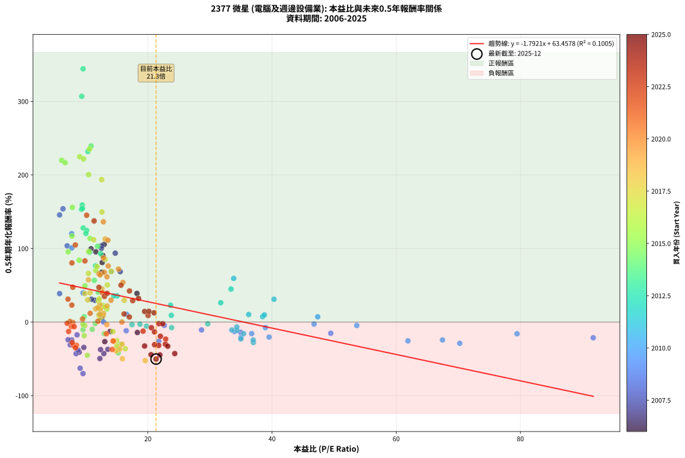
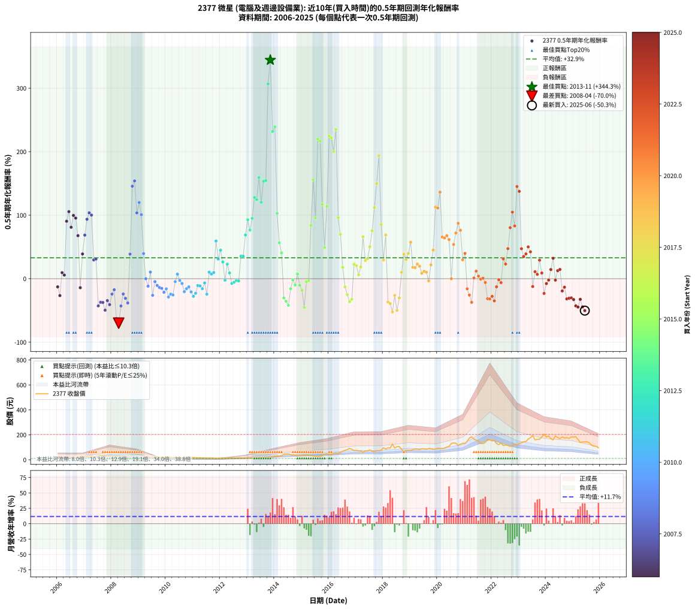

# 2377 微星 - 本益比與未來報酬率分析

!!! info "報告資訊"
    - **股票代號**: 2377
    - **公司名稱**: 微星
    - **產業別**: 電腦及週邊設備業
    - **分析期間**: 2006-2025 (234 個數據點)
    - **資料來源**: Type 12 (ShowMonthlyK_ChartFlow) 月收盤價與本益比
    - **報酬率口徑**: 含現金股利 (簡化: 年度合計，假設每年7/1入帳)
    - **報告生成時間**: 2026-01-06 00:35:33 CST

## 📈 視覺化圖表

### 圖表1: 本益比 vs 未來報酬率關係

*圖表1：2377 微星 本益比與0.5年期未來報酬率關係 (2006-2025)*

### 圖表2: 歷年買入時點的0.5年期實際報酬率

*圖表2：2377 微星 歷年買入時點的0.5年期實際報酬率 (2006-2025)*

## 📍 買點訊號說明

本報告提供兩種買點提示訊號（顯示於圖表2的股價子圖中）：

### ▲ 小綠色三角形（回測驗證）
- **計算方式**: 使用全部歷史資料計算本益比第25百分位數
- **用途**: 事後驗證，顯示歷史上哪些時點確實為低估區
- **限制**: 當下無法判斷，僅供回測參考
- **特性**: 後見之明（Look-Ahead Bias）

### ▲ 小橘色三角形（即時訊號）
- **計算方式**: 使用截至當月的過去5年資料計算本益比第25百分位數
- **用途**: 實際投資決策，當時即可判斷
- **優勢**: 可操作性強，符合實務需求
- **特性**: 無後見之明，滾動窗口計算

!!! tip "如何使用兩種訊號"
    - **綠色▲** 幫助理解歷史估值機會，驗證策略有效性
    - **橘色▲** 可作為實際買進參考，但仍需搭配基本面分析
    - 兩種訊號重疊時，表示即時判斷與事後驗證一致，信心度較高
    - 僅有綠色▲時，表示當時無法判斷（需要未來資料才能確認）
    - 僅有橘色▲時，表示即時判斷為買點，但事後可能不是最佳時機

## 📊 估值分析摘要

| 指標 | 數值 |
|:---:|:---:|
| **目前本益比** (2025-06) | **21.32 倍** |
| **歷史平均本益比** | 17.03 倍 |
| **估值水準** | 🔴 相對高估 |
| **預期0.5年年化報酬率** | **+25.25%** |
| **歷史平均報酬率** | +32.93% |
| **相關係數 (R²)** | 0.1005 |
| **趨勢線斜率** | -1.7921 |

!!! abstract "核心洞察"
    目前本益比顯著高於歷史平均，預期未來報酬率可能較低

    根據歷史數據回測，2377 微星 在目前本益比 **21.3倍** 的估值水準下，
    預期未來0.5年年化報酬率約為 **+25.2%**。

    **重要提醒**: 本分析基於歷史數據統計，實際報酬率會受到公司基本面變化、產業趨勢、
    總體經濟環境等多重因素影響。R² = 0.10 表示本益比可解釋約 10.1% 的報酬率變異。

## 📈 歷史估值統計

### 最佳買點 (最高報酬率)

| 項目 | 數值 |
|:---:|:---:|
| 起始時間 | 2013-11 |
| 當時本益比 | 9.56 倍 |
| 起始價格 | 21.3 元 |
| 0.5年後價格 | 44.6 元 |
| **0.5年年化報酬率** | **+344.30%** |

### 最差買點 (最低報酬率)

| 項目 | 數值 |
|:---:|:---:|
| 起始時間 | 2008-04 |
| 當時本益比 | 9.55 倍 |
| 起始價格 | 26.7 元 |
| 0.5年後價格 | 13.8 元 |
| **0.5年年化報酬率** | **-70.03%** |

## 🎯 投資啟示

### 本益比與報酬率關係

趨勢線方程式: **y = -1.7921x + 63.4578**

!!! warning "強負相關"
    本益比與未來報酬率呈現強負相關。在高本益比時期買入，未來報酬率顯著較低；
    在低本益比時期買入，未來報酬率顯著較高。**估值紀律至關重要**。

### 估值區間建議

基於歷史數據分析:

- **🟢 低估區** (P/E < 13.6): 預期報酬率較高，可考慮增加持股
- **🟡 合理區** (P/E 13.6-20.4): 預期報酬率符合長期趨勢，正常持有
- **🔴 高估區** (P/E > 20.4): 預期報酬率較低，可考慮減碼或觀望

!!! danger "風險提示"
    - 過去表現不代表未來結果
    - 本分析假設公司基本面無重大結構性變化
    - 產業環境劇變可能使歷史規律失效
    - 應結合公司財報、產業趨勢、總體經濟等多重因素綜合判斷

!!! success "長期投資觀點"
    歷史數據顯示，在合理或低估的估值水準買入並長期持有，
    往往能獲得較佳的投資報酬。**耐心等待好價格**是價值投資的核心原則。

## 📊 數據品質

- **資料來源**: GoodInfo.tw Type 12 (ShowMonthlyK_ChartFlow)
- **資料頻率**: 月度收盤價與本益比
- **回測期間**: 2006-2025
- **數據點數量**: 234 個 (每個點代表一次0.5年期回測)

### 計算方法說明

1. **0.5年期年化報酬率**:
   - 對每個歷史時點，計算其後0.5年的實際投資報酬率
   - 期末價值(不含股利): 期末價格
   - 期末價值(含現金股利): 期末價格 + 持有期間內的現金股利合計 (簡化: 年度合計，假設每年7/1入帳)
   - 公式: 年化報酬率 = [(期末價值/期初價格)^(1/年數) - 1] × 100%

2. **本益比 (P/E Ratio)**:
   - 使用當時的月收盤價與EPS計算
   - 資料來源: Type 12 月度河流圖本益比數據

3. **趨勢線 (Linear Regression)**:
   - 使用最小平方法擬合線性趨勢線
   - R²值衡量本益比對報酬率的解釋能力

---

*本報告由 Stock Analysis System v1.9.0 自動生成*
*數據更新時間: 2026-01-06 00:35:33 CST*

## 📋 月度回測明細表

（每一列對應時間線圖中的一個買入點；可用來對照 SVG 圖上的每個點。）

| 買入月份 | 賣出月份 | 回測期限_年 | 實際持有年數 | 買入本益比_倍 | 買入收盤價_元 | 賣出收盤價_元 | 現金股利合計_元 | 總報酬率_pct | 年化報酬率_pct |
| --- | --- | --- | --- | --- | --- | --- | --- | --- | --- |
| 2006-01 | 2006-07 | 0.5 | 0.496 | 13.91 | 19.75 | 17.95 | 0.50 | -6.58 | -12.84 |
| 2006-02 | 2006-08 | 0.5 | 0.498 | 13.06 | 18.55 | 15.40 | 0.50 | -14.29 | -26.61 |
| 2006-03 | 2006-10 | 0.5 | 0.586 | 12.25 | 17.40 | 17.85 | 0.50 | +5.46 | +9.50 |
| 2006-04 | 2006-10 | 0.5 | 0.501 | 12.57 | 17.85 | 17.85 | 0.50 | +2.80 | +5.67 |
| 2006-05 | 2006-12 | 0.5 | 0.586 | 12.75 | 18.10 | 25.90 | 0.50 | +45.86 | +90.45 |
| 2006-06 | 2006-12 | 0.5 | 0.501 | 12.96 | 18.40 | 25.90 | 0.50 | +43.48 | +105.56 |
| 2006-07 | 2007-01 | 0.5 | 0.504 | 12.64 | 17.95 | 24.20 | 0.00 | +34.82 | +80.95 |
| 2006-08 | 2007-03 | 0.5 | 0.580 | 10.85 | 15.40 | 23.00 | 0.00 | +49.35 | +99.59 |
| 2006-09 | 2007-03 | 0.5 | 0.496 | 11.62 | 16.50 | 23.00 | 0.00 | +39.39 | +95.47 |
| 2006-10 | 2007-05 | 0.5 | 0.580 | 12.57 | 17.85 | 24.10 | 0.00 | +35.01 | +67.74 |
| 2006-11 | 2007-05 | 0.5 | 0.496 | 18.31 | 26.00 | 24.10 | 0.00 | -7.31 | -14.20 |
| 2006-12 | 2007-07 | 0.5 | 0.580 | 18.24 | 25.90 | 30.75 | 0.60 | +21.03 | +38.95 |
| 2007-01 | 2007-07 | 0.5 | 0.496 | 15.54 | 24.20 | 30.75 | 0.60 | +29.54 | +68.58 |
| 2007-02 | 2007-08 | 0.5 | 0.498 | 14.75 | 25.00 | 34.15 | 0.60 | +38.99 | +93.63 |
| 2007-03 | 2007-10 | 0.5 | 0.586 | 12.55 | 23.00 | 34.30 | 0.60 | +51.73 | +103.73 |
| 2007-04 | 2007-10 | 0.5 | 0.501 | 12.51 | 24.65 | 34.30 | 0.60 | +41.57 | +100.15 |
| 2007-05 | 2007-12 | 0.5 | 0.586 | 11.44 | 24.10 | 27.45 | 0.60 | +16.38 | +29.55 |
| 2007-06 | 2007-12 | 0.5 | 0.501 | 10.91 | 24.50 | 27.45 | 0.60 | +14.48 | +30.99 |
| 2007-07 | 2008-01 | 0.5 | 0.504 | 12.91 | 30.75 | 23.20 | 0.00 | -24.55 | -42.84 |
| 2007-08 | 2008-03 | 0.5 | 0.583 | 13.55 | 34.15 | 26.05 | 0.00 | -23.72 | -37.14 |
| 2007-09 | 2008-03 | 0.5 | 0.498 | 12.38 | 32.90 | 26.05 | 0.00 | -20.82 | -37.41 |
| 2007-10 | 2008-05 | 0.5 | 0.583 | 12.27 | 34.30 | 23.00 | 0.00 | -32.94 | -49.61 |
| 2007-11 | 2008-05 | 0.5 | 0.498 | 9.68 | 28.40 | 23.00 | 0.00 | -19.01 | -34.51 |
| 2007-12 | 2008-07 | 0.5 | 0.583 | 8.94 | 27.45 | 19.40 | 0.80 | -26.41 | -40.90 |
| 2008-01 | 2008-07 | 0.5 | 0.498 | 7.73 | 23.20 | 19.40 | 0.80 | -12.93 | -24.26 |
| 2008-02 | 2008-08 | 0.5 | 0.501 | 8.59 | 25.20 | 22.10 | 0.80 | -9.13 | -17.39 |
| 2008-03 | 2008-10 | 0.5 | 0.586 | 9.09 | 26.05 | 13.80 | 0.80 | -43.95 | -62.78 |
| 2008-04 | 2008-10 | 0.5 | 0.501 | 9.55 | 26.70 | 13.80 | 0.80 | -45.32 | -70.03 |
| 2008-05 | 2008-12 | 0.5 | 0.586 | 8.43 | 23.00 | 15.75 | 0.80 | -28.04 | -42.98 |
| 2008-06 | 2008-12 | 0.5 | 0.501 | 7.14 | 19.00 | 15.75 | 0.80 | -12.89 | -24.08 |
| 2008-07 | 2009-01 | 0.5 | 0.504 | 7.49 | 19.40 | 16.10 | 0.00 | -17.01 | -30.93 |
| 2008-08 | 2009-03 | 0.5 | 0.580 | 8.76 | 22.10 | 16.70 | 0.00 | -24.43 | -38.29 |
| 2008-09 | 2009-03 | 0.5 | 0.496 | 5.78 | 14.20 | 16.70 | 0.00 | +17.61 | +38.71 |
| 2008-10 | 2009-05 | 0.5 | 0.580 | 5.78 | 13.80 | 23.25 | 0.00 | +68.48 | +145.64 |
| 2008-11 | 2009-05 | 0.5 | 0.496 | 6.32 | 14.65 | 23.25 | 0.00 | +58.70 | +153.96 |
| 2008-12 | 2009-07 | 0.5 | 0.580 | 7.00 | 15.75 | 23.30 | 0.50 | +51.10 | +103.65 |
| 2009-01 | 2009-07 | 0.5 | 0.496 | 7.73 | 16.10 | 23.30 | 0.50 | +47.82 | +120.05 |
| 2009-02 | 2009-08 | 0.5 | 0.498 | 7.74 | 14.80 | 20.45 | 0.50 | +41.55 | +100.84 |
| 2009-03 | 2009-10 | 0.5 | 0.586 | 9.57 | 16.70 | 19.80 | 0.50 | +21.55 | +39.53 |
| 2009-04 | 2009-10 | 0.5 | 0.501 | 12.88 | 20.30 | 19.80 | 0.50 | -0.00 | -0.01 |
| 2009-05 | 2009-12 | 0.5 | 0.586 | 16.51 | 23.25 | 21.10 | 0.50 | -7.10 | -11.81 |
| 2009-06 | 2009-12 | 0.5 | 0.501 | 16.57 | 20.55 | 21.10 | 0.50 | +5.10 | +10.45 |
| 2009-07 | 2010-01 | 0.5 | 0.504 | 21.74 | 23.30 | 20.00 | 0.00 | -14.16 | -26.15 |
| 2009-08 | 2010-03 | 0.5 | 0.580 | 22.64 | 20.45 | 19.90 | 0.00 | -2.69 | -4.59 |
| 2009-09 | 2010-03 | 0.5 | 0.496 | 28.64 | 21.05 | 19.90 | 0.00 | -5.46 | -10.72 |
| 2009-10 | 2010-05 | 0.5 | 0.580 | 34.94 | 19.80 | 18.15 | 0.00 | -8.33 | -13.92 |
| 2009-11 | 2010-05 | 0.5 | 0.496 | 49.46 | 19.70 | 18.15 | 0.00 | -7.87 | -15.24 |
| 2009-12 | 2010-07 | 0.5 | 0.580 | 91.74 | 21.10 | 17.85 | 0.50 | -13.03 | -21.38 |
| 2010-01 | 2010-07 | 0.5 | 0.496 | 79.47 | 20.00 | 17.85 | 0.50 | -8.25 | -15.95 |
| 2010-02 | 2010-08 | 0.5 | 0.498 | 70.24 | 19.20 | 15.70 | 0.50 | -15.62 | -28.89 |
| 2010-03 | 2010-10 | 0.5 | 0.586 | 67.46 | 19.90 | 16.40 | 0.50 | -15.08 | -24.34 |
| 2010-04 | 2010-10 | 0.5 | 0.501 | 61.89 | 19.60 | 16.40 | 0.50 | -13.78 | -25.61 |
| 2010-05 | 2010-12 | 0.5 | 0.586 | 53.65 | 18.15 | 17.15 | 0.50 | -2.75 | -4.66 |
| 2010-06 | 2010-12 | 0.5 | 0.501 | 47.36 | 17.05 | 17.15 | 0.50 | +3.52 | +7.15 |
| 2010-07 | 2011-01 | 0.5 | 0.504 | 46.77 | 17.85 | 17.60 | 0.00 | -1.40 | -2.76 |
| 2010-08 | 2011-03 | 0.5 | 0.580 | 38.93 | 15.70 | 15.00 | 0.00 | -4.46 | -7.56 |
| 2010-09 | 2011-03 | 0.5 | 0.496 | 39.53 | 16.80 | 15.00 | 0.00 | -10.71 | -20.44 |
| 2010-10 | 2011-05 | 0.5 | 0.580 | 36.72 | 16.40 | 14.85 | 0.00 | -9.45 | -15.72 |
| 2010-11 | 2011-05 | 0.5 | 0.496 | 33.95 | 15.90 | 14.85 | 0.00 | -6.60 | -12.88 |
| 2010-12 | 2011-07 | 0.5 | 0.580 | 35.00 | 17.15 | 14.45 | 0.53 | -12.67 | -20.82 |
| 2011-01 | 2011-07 | 0.5 | 0.496 | 36.99 | 17.60 | 14.45 | 0.53 | -14.90 | -27.80 |
| 2011-02 | 2011-08 | 0.5 | 0.498 | 34.98 | 16.15 | 13.65 | 0.53 | -12.22 | -23.01 |
| 2011-03 | 2011-10 | 0.5 | 0.586 | 33.52 | 15.00 | 13.50 | 0.53 | -6.49 | -10.82 |
| 2011-04 | 2011-10 | 0.5 | 0.501 | 34.38 | 14.90 | 13.50 | 0.53 | -5.86 | -11.35 |
| 2011-05 | 2011-12 | 0.5 | 0.586 | 35.43 | 14.85 | 12.90 | 0.53 | -9.58 | -15.80 |
| 2011-06 | 2011-12 | 0.5 | 0.501 | 34.32 | 13.90 | 12.90 | 0.53 | -3.40 | -6.68 |
| 2011-07 | 2012-01 | 0.5 | 0.504 | 36.97 | 14.45 | 12.55 | 0.00 | -13.15 | -24.41 |
| 2011-08 | 2012-03 | 0.5 | 0.583 | 36.24 | 13.65 | 14.45 | 0.00 | +5.86 | +10.26 |
| 2011-09 | 2012-03 | 0.5 | 0.498 | 38.48 | 13.95 | 14.45 | 0.00 | +3.58 | +7.32 |
| 2011-10 | 2012-05 | 0.5 | 0.583 | 38.76 | 13.50 | 14.25 | 0.00 | +5.56 | +9.71 |
| 2011-11 | 2012-05 | 0.5 | 0.498 | 33.82 | 11.30 | 14.25 | 0.00 | +26.11 | +59.28 |
| 2011-12 | 2012-07 | 0.5 | 0.583 | 40.31 | 12.90 | 14.05 | 1.05 | +17.03 | +30.95 |
| 2012-01 | 2012-07 | 0.5 | 0.498 | 33.39 | 12.55 | 14.05 | 1.05 | +20.29 | +44.89 |
| 2012-02 | 2012-08 | 0.5 | 0.501 | 31.74 | 13.70 | 14.35 | 1.05 | +12.39 | +26.25 |
| 2012-03 | 2012-10 | 0.5 | 0.586 | 29.64 | 14.45 | 13.20 | 1.05 | -1.40 | -2.39 |
| 2012-04 | 2012-10 | 0.5 | 0.501 | 23.65 | 12.85 | 13.20 | 1.05 | +10.87 | +22.87 |
| 2012-05 | 2012-12 | 0.5 | 0.586 | 23.78 | 14.25 | 13.95 | 1.05 | +5.24 | +9.11 |
| 2012-06 | 2012-12 | 0.5 | 0.501 | 23.82 | 15.60 | 13.95 | 1.05 | -3.87 | -7.57 |
| 2012-07 | 2013-01 | 0.5 | 0.504 | 19.77 | 14.05 | 13.65 | 0.00 | -2.85 | -5.57 |
| 2012-08 | 2013-03 | 0.5 | 0.580 | 18.72 | 14.35 | 14.10 | 0.00 | -1.74 | -2.98 |
| 2012-09 | 2013-03 | 0.5 | 0.496 | 17.45 | 14.35 | 14.10 | 0.00 | -1.74 | -3.48 |
| 2012-10 | 2013-05 | 0.5 | 0.580 | 15.03 | 13.20 | 15.75 | 0.00 | +19.32 | +35.57 |
| 2012-11 | 2013-05 | 0.5 | 0.496 | 14.50 | 13.55 | 15.75 | 0.00 | +16.24 | +35.47 |
| 2012-12 | 2013-07 | 0.5 | 0.580 | 14.09 | 13.95 | 17.80 | 1.10 | +35.48 | +68.74 |
| 2013-01 | 2013-07 | 0.5 | 0.496 | 12.38 | 13.65 | 17.80 | 1.10 | +38.46 | +92.84 |
| 2013-02 | 2013-08 | 0.5 | 0.498 | 11.56 | 14.05 | 17.55 | 1.10 | +32.74 | +76.54 |
| 2013-03 | 2013-10 | 0.5 | 0.586 | 10.62 | 14.10 | 19.75 | 1.10 | +47.87 | +94.97 |
| 2013-04 | 2013-10 | 0.5 | 0.501 | 9.58 | 13.80 | 19.75 | 1.10 | +51.09 | +127.89 |
| 2013-05 | 2013-12 | 0.5 | 0.586 | 10.14 | 15.75 | 24.20 | 1.10 | +60.63 | +124.55 |
| 2013-06 | 2013-12 | 0.5 | 0.501 | 9.43 | 15.70 | 24.20 | 1.10 | +61.15 | +159.17 |
| 2013-07 | 2014-01 | 0.5 | 0.504 | 10.01 | 17.80 | 26.50 | 0.00 | +48.88 | +120.33 |
| 2013-08 | 2014-03 | 0.5 | 0.580 | 9.29 | 17.55 | 30.10 | 0.00 | +71.51 | +153.31 |
| 2013-09 | 2014-03 | 0.5 | 0.496 | 9.46 | 18.95 | 30.10 | 0.00 | +58.84 | +154.40 |
| 2013-10 | 2014-05 | 0.5 | 0.580 | 9.34 | 19.75 | 44.60 | 0.00 | +125.82 | +306.91 |
| 2013-11 | 2014-05 | 0.5 | 0.496 | 9.56 | 21.30 | 44.60 | 0.00 | +109.39 | +344.30 |
| 2013-12 | 2014-07 | 0.5 | 0.580 | 10.34 | 24.20 | 46.55 | 2.00 | +100.62 | +231.86 |
| 2014-01 | 2014-07 | 0.5 | 0.496 | 10.85 | 26.50 | 46.55 | 2.00 | +83.21 | +239.32 |
| 2014-02 | 2014-08 | 0.5 | 0.498 | 11.89 | 30.25 | 41.05 | 2.00 | +42.31 | +103.02 |
| 2014-03 | 2014-10 | 0.5 | 0.586 | 11.37 | 30.10 | 37.15 | 2.00 | +30.07 | +56.62 |
| 2014-04 | 2014-10 | 0.5 | 0.501 | 12.00 | 33.00 | 37.15 | 2.00 | +18.64 | +40.65 |
| 2014-05 | 2014-12 | 0.5 | 0.586 | 15.64 | 44.60 | 34.10 | 2.00 | -19.06 | -30.29 |
| 2014-06 | 2014-12 | 0.5 | 0.501 | 15.23 | 45.00 | 34.10 | 2.00 | -19.78 | -35.59 |
| 2014-07 | 2015-01 | 0.5 | 0.504 | 15.22 | 46.55 | 35.40 | 0.00 | -23.95 | -41.93 |
| 2014-08 | 2015-03 | 0.5 | 0.580 | 12.99 | 41.05 | 37.15 | 0.00 | -9.50 | -15.80 |
| 2014-09 | 2015-03 | 0.5 | 0.496 | 11.51 | 37.55 | 37.15 | 0.00 | -1.07 | -2.14 |
| 2014-10 | 2015-05 | 0.5 | 0.580 | 11.04 | 37.15 | 34.95 | 0.00 | -5.92 | -9.98 |
| 2014-11 | 2015-05 | 0.5 | 0.496 | 9.73 | 33.75 | 34.95 | 0.00 | +3.56 | +7.30 |
| 2014-12 | 2015-07 | 0.5 | 0.580 | 9.55 | 34.10 | 29.00 | 3.00 | -6.16 | -10.37 |
| 2015-01 | 2015-07 | 0.5 | 0.496 | 9.73 | 35.40 | 29.00 | 3.00 | -9.60 | -18.43 |
| 2015-02 | 2015-08 | 0.5 | 0.498 | 10.25 | 38.00 | 25.15 | 3.00 | -25.92 | -45.24 |
| 2015-03 | 2015-10 | 0.5 | 0.586 | 9.84 | 37.15 | 33.10 | 3.00 | -2.83 | -4.78 |
| 2015-04 | 2015-10 | 0.5 | 0.501 | 9.55 | 36.70 | 33.10 | 3.00 | -1.63 | -3.24 |
| 2015-05 | 2015-12 | 0.5 | 0.586 | 8.93 | 34.95 | 46.95 | 3.00 | +42.92 | +83.95 |
| 2015-06 | 2015-12 | 0.5 | 0.501 | 7.84 | 31.20 | 46.95 | 3.00 | +60.10 | +155.81 |
| 2015-07 | 2016-01 | 0.5 | 0.504 | 7.16 | 29.00 | 40.65 | 0.00 | +40.17 | +95.49 |
| 2015-08 | 2016-03 | 0.5 | 0.583 | 6.11 | 25.15 | 49.55 | 0.00 | +97.02 | +219.90 |
| 2015-09 | 2016-03 | 0.5 | 0.498 | 6.67 | 27.90 | 49.55 | 0.00 | +77.60 | +216.66 |
| 2015-10 | 2016-05 | 0.5 | 0.583 | 7.78 | 33.10 | 52.00 | 0.00 | +57.10 | +116.97 |
| 2015-11 | 2016-05 | 0.5 | 0.498 | 9.86 | 42.60 | 52.00 | 0.00 | +22.07 | +49.20 |
| 2015-12 | 2016-07 | 0.5 | 0.583 | 10.69 | 46.95 | 69.60 | 3.50 | +55.70 | +113.66 |
| 2016-01 | 2016-07 | 0.5 | 0.498 | 9.02 | 40.65 | 69.60 | 3.50 | +79.83 | +224.69 |
| 2016-02 | 2016-08 | 0.5 | 0.501 | 9.64 | 44.55 | 76.50 | 3.50 | +79.57 | +221.69 |
| 2016-03 | 2016-10 | 0.5 | 0.586 | 10.45 | 49.55 | 90.90 | 3.50 | +90.51 | +200.45 |
| 2016-04 | 2016-10 | 0.5 | 0.501 | 10.60 | 51.50 | 90.90 | 3.50 | +83.30 | +235.16 |
| 2016-05 | 2016-12 | 0.5 | 0.586 | 10.46 | 52.00 | 73.60 | 3.50 | +48.27 | +95.86 |
| 2016-06 | 2016-12 | 0.5 | 0.501 | 11.61 | 59.10 | 73.60 | 3.50 | +30.46 | +70.00 |
| 2016-07 | 2017-01 | 0.5 | 0.504 | 13.37 | 69.60 | 75.60 | 0.00 | +8.62 | +17.84 |
| 2016-08 | 2017-03 | 0.5 | 0.580 | 14.37 | 76.50 | 70.60 | 0.00 | -7.71 | -12.91 |
| 2016-09 | 2017-03 | 0.5 | 0.496 | 14.98 | 81.50 | 70.60 | 0.00 | -13.37 | -25.15 |
| 2016-10 | 2017-05 | 0.5 | 0.580 | 16.36 | 90.90 | 70.00 | 0.00 | -22.99 | -36.25 |
| 2016-11 | 2017-05 | 0.5 | 0.496 | 14.98 | 85.00 | 70.00 | 0.00 | -17.65 | -32.42 |
| 2016-12 | 2017-07 | 0.5 | 0.580 | 12.71 | 73.60 | 78.40 | 4.50 | +12.64 | +22.75 |
| 2017-01 | 2017-07 | 0.5 | 0.496 | 13.05 | 75.60 | 78.40 | 4.50 | +9.66 | +20.44 |
| 2017-02 | 2017-08 | 0.5 | 0.498 | 12.26 | 71.10 | 68.70 | 4.50 | +2.95 | +6.02 |
| 2017-03 | 2017-10 | 0.5 | 0.586 | 12.17 | 70.60 | 73.50 | 4.50 | +10.48 | +18.55 |
| 2017-04 | 2017-10 | 0.5 | 0.501 | 10.42 | 60.50 | 73.50 | 4.50 | +28.93 | +66.05 |
| 2017-05 | 2017-12 | 0.5 | 0.586 | 12.05 | 70.00 | 76.60 | 4.50 | +15.86 | +28.56 |
| 2017-06 | 2017-12 | 0.5 | 0.501 | 12.16 | 70.70 | 76.60 | 4.50 | +14.71 | +31.51 |
| 2017-07 | 2018-01 | 0.5 | 0.504 | 13.47 | 78.40 | 96.30 | 0.00 | +22.83 | +50.41 |
| 2017-08 | 2018-03 | 0.5 | 0.580 | 11.80 | 68.70 | 95.20 | 0.00 | +38.57 | +75.43 |
| 2017-09 | 2018-03 | 0.5 | 0.496 | 11.26 | 65.60 | 95.20 | 0.00 | +45.12 | +112.02 |
| 2017-10 | 2018-05 | 0.5 | 0.580 | 12.60 | 73.50 | 125.00 | 0.00 | +70.07 | +149.65 |
| 2017-11 | 2018-05 | 0.5 | 0.496 | 12.56 | 73.30 | 125.00 | 0.00 | +70.53 | +193.61 |
| 2017-12 | 2018-07 | 0.5 | 0.580 | 13.12 | 76.60 | 105.00 | 4.50 | +42.95 | +85.08 |
| 2018-01 | 2018-07 | 0.5 | 0.496 | 16.19 | 96.30 | 105.00 | 4.50 | +13.71 | +29.59 |
| 2018-02 | 2018-08 | 0.5 | 0.498 | 14.11 | 85.50 | 106.50 | 4.50 | +29.82 | +68.85 |
| 2018-03 | 2018-10 | 0.5 | 0.586 | 15.44 | 95.20 | 68.30 | 4.50 | -23.53 | -36.74 |
| 2018-04 | 2018-10 | 0.5 | 0.501 | 14.88 | 93.40 | 68.30 | 4.50 | -22.06 | -39.18 |
| 2018-05 | 2018-12 | 0.5 | 0.586 | 19.57 | 125.00 | 76.40 | 4.50 | -35.28 | -52.41 |
| 2018-06 | 2018-12 | 0.5 | 0.501 | 14.50 | 94.20 | 76.40 | 4.50 | -14.12 | -26.20 |
| 2018-07 | 2019-01 | 0.5 | 0.504 | 15.90 | 105.00 | 74.10 | 0.00 | -29.43 | -49.94 |
| 2018-08 | 2019-03 | 0.5 | 0.580 | 15.86 | 106.50 | 86.50 | 0.00 | -18.78 | -30.12 |
| 2018-09 | 2019-03 | 0.5 | 0.496 | 12.09 | 82.50 | 86.50 | 0.00 | +4.85 | +10.03 |
| 2018-10 | 2019-05 | 0.5 | 0.580 | 9.85 | 68.30 | 82.60 | 0.00 | +20.94 | +38.75 |
| 2018-11 | 2019-05 | 0.5 | 0.496 | 10.30 | 72.50 | 82.60 | 0.00 | +13.93 | +30.11 |
| 2018-12 | 2019-07 | 0.5 | 0.580 | 10.69 | 76.40 | 87.80 | 5.00 | +21.47 | +39.80 |
| 2019-01 | 2019-07 | 0.5 | 0.496 | 10.43 | 74.10 | 87.80 | 5.00 | +25.24 | +57.48 |
| 2019-02 | 2019-08 | 0.5 | 0.498 | 11.59 | 81.80 | 83.80 | 5.00 | +8.56 | +17.91 |
| 2019-03 | 2019-10 | 0.5 | 0.586 | 12.33 | 86.50 | 90.00 | 5.00 | +9.83 | +17.35 |
| 2019-04 | 2019-10 | 0.5 | 0.501 | 12.28 | 85.60 | 90.00 | 5.00 | +10.98 | +23.12 |
| 2019-05 | 2019-12 | 0.5 | 0.586 | 11.93 | 82.60 | 86.70 | 5.00 | +11.02 | +19.53 |
| 2019-06 | 2019-12 | 0.5 | 0.501 | 12.79 | 88.00 | 86.70 | 5.00 | +4.20 | +8.57 |
| 2019-07 | 2020-01 | 0.5 | 0.504 | 12.85 | 87.80 | 92.80 | 0.00 | +5.69 | +11.62 |
| 2019-08 | 2020-03 | 0.5 | 0.583 | 12.34 | 83.80 | 88.70 | 0.00 | +5.85 | +10.24 |
| 2019-09 | 2020-03 | 0.5 | 0.498 | 13.39 | 90.30 | 88.70 | 0.00 | -1.77 | -3.52 |
| 2019-10 | 2020-05 | 0.5 | 0.583 | 13.43 | 90.00 | 101.00 | 0.00 | +12.22 | +21.86 |
| 2019-11 | 2020-05 | 0.5 | 0.498 | 12.61 | 83.90 | 101.00 | 0.00 | +20.38 | +45.10 |
| 2019-12 | 2020-07 | 0.5 | 0.583 | 13.12 | 86.70 | 130.50 | 4.20 | +55.36 | +112.87 |
| 2020-01 | 2020-07 | 0.5 | 0.498 | 13.56 | 92.80 | 130.50 | 4.20 | +45.15 | +111.23 |
| 2020-02 | 2020-08 | 0.5 | 0.501 | 12.83 | 90.80 | 135.50 | 4.20 | +53.85 | +136.29 |
| 2020-03 | 2020-10 | 0.5 | 0.586 | 12.13 | 88.70 | 115.00 | 4.20 | +34.39 | +65.60 |
| 2020-04 | 2020-10 | 0.5 | 0.501 | 12.32 | 93.00 | 115.00 | 4.20 | +28.17 | +64.11 |
| 2020-05 | 2020-12 | 0.5 | 0.586 | 12.98 | 101.00 | 132.50 | 4.20 | +35.35 | +67.63 |
| 2020-06 | 2020-12 | 0.5 | 0.501 | 13.41 | 107.50 | 132.50 | 4.20 | +27.16 | +61.54 |
| 2020-07 | 2021-01 | 0.5 | 0.504 | 15.82 | 130.50 | 130.50 | 0.00 | +0.00 | +0.00 |
| 2020-08 | 2021-03 | 0.5 | 0.580 | 15.97 | 135.50 | 174.00 | 0.00 | +28.41 | +53.86 |
| 2020-09 | 2021-03 | 0.5 | 0.496 | 15.26 | 133.00 | 174.00 | 0.00 | +30.83 | +71.99 |
| 2020-10 | 2021-05 | 0.5 | 0.580 | 12.85 | 115.00 | 165.50 | 0.00 | +43.91 | +87.24 |
| 2020-11 | 2021-05 | 0.5 | 0.496 | 13.61 | 125.00 | 165.50 | 0.00 | +32.40 | +76.18 |
| 2020-12 | 2021-07 | 0.5 | 0.580 | 14.07 | 132.50 | 148.00 | 6.10 | +16.30 | +29.72 |
| 2021-01 | 2021-07 | 0.5 | 0.496 | 12.66 | 130.50 | 148.00 | 6.10 | +18.08 | +39.86 |
| 2021-02 | 2021-08 | 0.5 | 0.498 | 13.32 | 149.00 | 130.50 | 6.10 | -8.32 | -16.00 |
| 2021-03 | 2021-10 | 0.5 | 0.586 | 14.41 | 174.00 | 140.00 | 6.10 | -16.03 | -25.79 |
| 2021-04 | 2021-10 | 0.5 | 0.501 | 14.24 | 184.50 | 140.00 | 6.10 | -20.81 | -37.23 |
| 2021-05 | 2021-12 | 0.5 | 0.586 | 11.96 | 165.50 | 160.50 | 6.10 | +0.66 | +1.14 |
| 2021-06 | 2021-12 | 0.5 | 0.501 | 10.70 | 157.50 | 160.50 | 6.10 | +5.78 | +11.86 |
| 2021-07 | 2022-01 | 0.5 | 0.504 | 9.48 | 148.00 | 151.00 | 0.00 | +2.03 | +4.06 |
| 2021-08 | 2022-03 | 0.5 | 0.580 | 7.91 | 130.50 | 130.00 | 0.00 | -0.38 | -0.66 |
| 2021-09 | 2022-03 | 0.5 | 0.496 | 7.45 | 129.50 | 130.00 | 0.00 | +0.39 | +0.78 |
| 2021-10 | 2022-05 | 0.5 | 0.580 | 7.67 | 140.00 | 135.00 | 0.00 | -3.57 | -6.07 |
| 2021-11 | 2022-05 | 0.5 | 0.496 | 8.51 | 163.00 | 135.00 | 0.00 | -17.18 | -31.64 |
| 2021-12 | 2022-07 | 0.5 | 0.580 | 8.01 | 160.50 | 118.00 | 10.50 | -19.94 | -31.83 |
| 2022-01 | 2022-07 | 0.5 | 0.496 | 7.81 | 151.00 | 118.00 | 10.50 | -14.90 | -27.79 |
| 2022-02 | 2022-08 | 0.5 | 0.498 | 8.33 | 155.50 | 115.00 | 10.50 | -19.29 | -34.96 |
| 2022-03 | 2022-10 | 0.5 | 0.586 | 7.23 | 130.00 | 109.50 | 10.50 | -7.69 | -12.77 |
| 2022-04 | 2022-10 | 0.5 | 0.501 | 7.00 | 121.00 | 109.50 | 10.50 | -0.83 | -1.64 |
| 2022-05 | 2022-12 | 0.5 | 0.586 | 8.13 | 135.00 | 119.50 | 10.50 | -3.70 | -6.24 |
| 2022-06 | 2022-12 | 0.5 | 0.501 | 7.13 | 113.50 | 119.50 | 10.50 | +14.54 | +31.12 |
| 2022-07 | 2023-01 | 0.5 | 0.504 | 7.75 | 118.00 | 131.00 | 0.00 | +11.02 | +23.06 |
| 2022-08 | 2023-03 | 0.5 | 0.580 | 7.91 | 115.00 | 144.00 | 0.00 | +25.22 | +47.32 |
| 2022-09 | 2023-03 | 0.5 | 0.496 | 7.76 | 107.50 | 144.00 | 0.00 | +33.95 | +80.38 |
| 2022-10 | 2023-05 | 0.5 | 0.580 | 8.32 | 109.50 | 166.00 | 0.00 | +51.60 | +104.79 |
| 2022-11 | 2023-05 | 0.5 | 0.496 | 9.86 | 123.00 | 166.00 | 0.00 | +34.96 | +83.12 |
| 2022-12 | 2023-07 | 0.5 | 0.580 | 10.14 | 119.50 | 194.50 | 6.60 | +68.28 | +145.16 |
| 2023-01 | 2023-07 | 0.5 | 0.496 | 11.34 | 131.00 | 194.50 | 6.60 | +53.51 | +137.48 |
| 2023-02 | 2023-08 | 0.5 | 0.498 | 12.11 | 137.00 | 159.50 | 6.60 | +21.24 | +47.19 |
| 2023-03 | 2023-10 | 0.5 | 0.586 | 13.01 | 144.00 | 165.00 | 6.60 | +19.17 | +34.89 |
| 2023-04 | 2023-10 | 0.5 | 0.501 | 13.43 | 145.50 | 165.00 | 6.60 | +17.94 | +39.00 |
| 2023-05 | 2023-12 | 0.5 | 0.586 | 15.67 | 166.00 | 204.00 | 6.60 | +26.87 | +50.11 |
| 2023-06 | 2023-12 | 0.5 | 0.501 | 17.04 | 176.50 | 204.00 | 6.60 | +19.32 | +42.27 |
| 2023-07 | 2024-01 | 0.5 | 0.504 | 19.23 | 194.50 | 182.00 | 0.00 | -6.43 | -12.35 |
| 2023-08 | 2024-03 | 0.5 | 0.583 | 16.15 | 159.50 | 169.50 | 0.00 | +6.27 | +10.99 |
| 2023-09 | 2024-03 | 0.5 | 0.498 | 17.02 | 164.00 | 169.50 | 0.00 | +3.35 | +6.84 |
| 2023-10 | 2024-05 | 0.5 | 0.583 | 17.56 | 165.00 | 191.50 | 0.00 | +16.06 | +29.10 |
| 2023-11 | 2024-05 | 0.5 | 0.498 | 20.03 | 183.50 | 191.50 | 0.00 | +4.36 | +8.94 |
| 2023-12 | 2024-07 | 0.5 | 0.583 | 22.87 | 204.00 | 169.50 | 5.40 | -14.26 | -23.20 |
| 2024-01 | 2024-07 | 0.5 | 0.498 | 20.57 | 182.00 | 169.50 | 5.40 | -3.90 | -7.68 |
| 2024-02 | 2024-08 | 0.5 | 0.501 | 21.77 | 191.00 | 183.50 | 5.40 | -1.10 | -2.18 |
| 2024-03 | 2024-10 | 0.5 | 0.586 | 19.48 | 169.50 | 178.00 | 5.40 | +8.20 | +14.40 |
| 2024-04 | 2024-10 | 0.5 | 0.501 | 18.49 | 159.50 | 178.00 | 5.40 | +14.98 | +32.14 |
| 2024-05 | 2024-12 | 0.5 | 0.586 | 22.39 | 191.50 | 183.50 | 5.40 | -1.36 | -2.31 |
| 2024-06 | 2024-12 | 0.5 | 0.501 | 20.99 | 178.00 | 183.50 | 5.40 | +6.12 | +12.59 |
| 2024-07 | 2025-01 | 0.5 | 0.504 | 20.16 | 169.50 | 181.50 | 0.00 | +7.08 | +14.54 |
| 2024-08 | 2025-03 | 0.5 | 0.580 | 22.02 | 183.50 | 162.00 | 0.00 | -11.72 | -19.32 |
| 2024-09 | 2025-03 | 0.5 | 0.496 | 21.07 | 174.00 | 162.00 | 0.00 | -6.90 | -13.43 |
| 2024-10 | 2025-05 | 0.5 | 0.580 | 21.74 | 178.00 | 142.50 | 0.00 | -19.94 | -31.84 |
| 2024-11 | 2025-05 | 0.5 | 0.496 | 21.08 | 171.00 | 142.50 | 0.00 | -16.67 | -30.78 |
| 2024-12 | 2025-07 | 0.5 | 0.580 | 22.82 | 183.50 | 144.00 | 5.00 | -18.80 | -30.15 |
| 2025-01 | 2025-07 | 0.5 | 0.496 | 23.20 | 181.50 | 144.00 | 5.00 | -17.91 | -32.84 |
| 2025-02 | 2025-08 | 0.5 | 0.498 | 24.33 | 185.00 | 135.00 | 5.00 | -24.32 | -42.84 |
| 2025-03 | 2025-10 | 0.5 | 0.586 | 21.94 | 162.00 | 109.50 | 5.00 | -29.32 | -44.69 |
| 2025-04 | 2025-10 | 0.5 | 0.501 | 19.47 | 139.50 | 109.50 | 5.00 | -17.92 | -32.58 |
| 2025-05 | 2025-12 | 0.5 | 0.586 | 20.51 | 142.50 | 96.10 | 5.00 | -29.05 | -44.34 |
| 2025-06 | 2025-12 | 0.5 | 0.501 | 21.32 | 143.50 | 96.10 | 5.00 | -29.55 | -50.29 |
