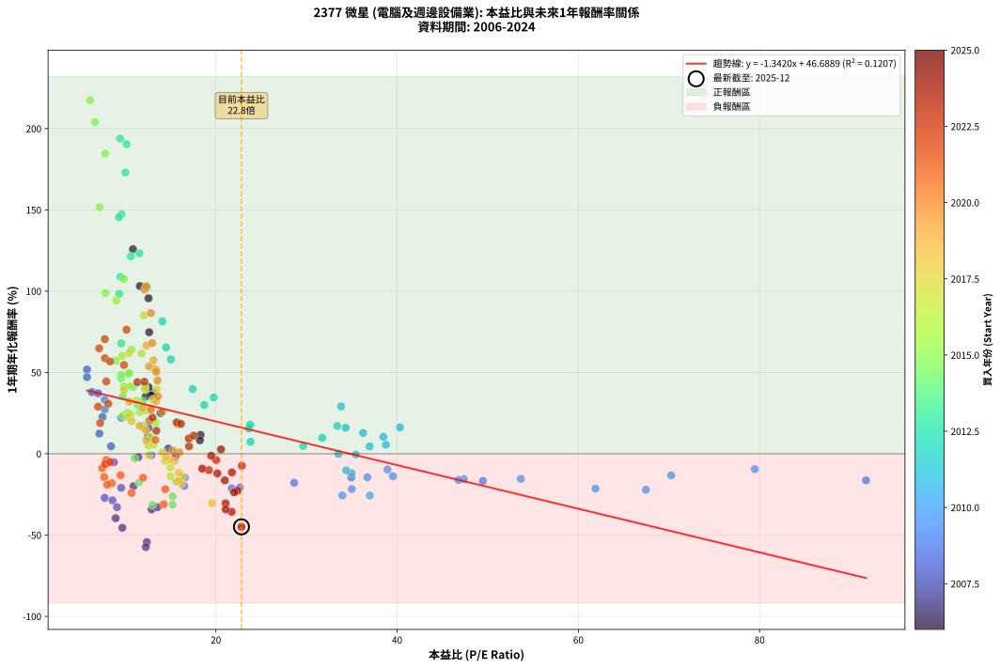
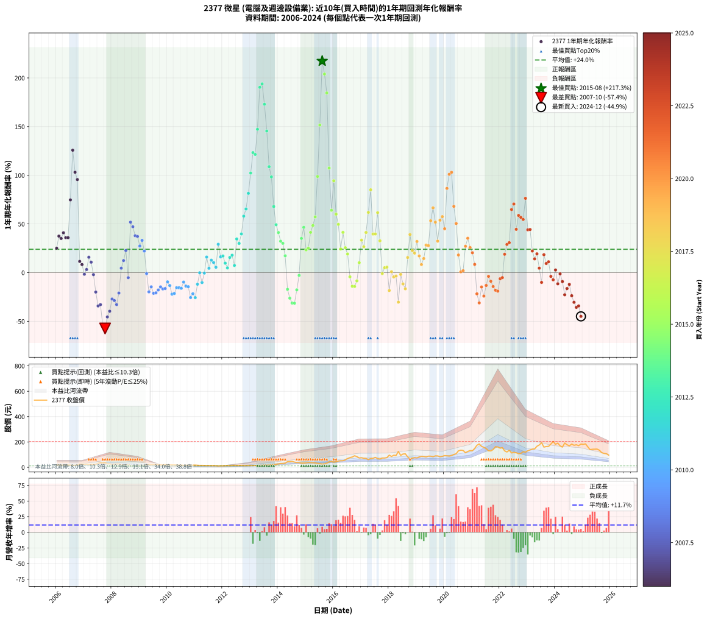

# 2377 微星 - 本益比與未來報酬率分析

!!! info "報告資訊"
    - **股票代號**: 2377
    - **公司名稱**: 微星
    - **產業別**: 電腦及週邊設備業
    - **分析期間**: 2006-2024 (228 個數據點)
    - **資料來源**: Type 12 (ShowMonthlyK_ChartFlow) 月收盤價與本益比
    - **報酬率口徑**: 含現金股利 (簡化: 年度合計，假設每年7/1入帳)
    - **報告生成時間**: 2026-01-12 20:45:26 CST

## 📈 視覺化圖表

### 圖表1: 本益比 vs 未來報酬率關係

*圖表1：2377 微星 本益比與1年期未來報酬率關係 (2006-2024)*

### 圖表2: 歷年買入時點的1年期實際報酬率

*圖表2：2377 微星 歷年買入時點的1年期實際報酬率 (2006-2024)*

## 📍 買點訊號說明

本報告提供兩種買點提示訊號（顯示於圖表2的股價子圖中）：

### ▲ 小綠色三角形（回測驗證）
- **計算方式**: 使用全部歷史資料計算本益比第25百分位數
- **用途**: 事後驗證，顯示歷史上哪些時點確實為低估區
- **限制**: 當下無法判斷，僅供回測參考
- **特性**: 後見之明（Look-Ahead Bias）

### ▲ 小橘色三角形（即時訊號）
- **計算方式**: 使用截至當月的過去5年資料計算本益比第25百分位數
- **用途**: 實際投資決策，當時即可判斷
- **優勢**: 可操作性強，符合實務需求
- **特性**: 無後見之明，滾動窗口計算

!!! tip "如何使用兩種訊號"
    - **綠色▲** 幫助理解歷史估值機會，驗證策略有效性
    - **橘色▲** 可作為實際買進參考，但仍需搭配基本面分析
    - 兩種訊號重疊時，表示即時判斷與事後驗證一致，信心度較高
    - 僅有綠色▲時，表示當時無法判斷（需要未來資料才能確認）
    - 僅有橘色▲時，表示即時判斷為買點，但事後可能不是最佳時機

## 📊 估值分析摘要

| 指標 | 數值 |
|:---:|:---:|
| **目前本益比** (2024-12) | **22.82 倍** |
| **歷史平均本益比** | 16.91 倍 |
| **估值水準** | 🔴 相對高估 |
| **預期1年年化報酬率** | **+16.06%** |
| **歷史平均報酬率** | +24.00% |
| **相關係數 (R²)** | 0.1207 |
| **趨勢線斜率** | -1.3420 |

!!! abstract "核心洞察"
    目前本益比顯著高於歷史平均，預期未來報酬率可能較低

    根據歷史數據回測，2377 微星 在目前本益比 **22.8倍** 的估值水準下，
    預期未來1年年化報酬率約為 **+16.1%**。

    **重要提醒**: 本分析基於歷史數據統計，實際報酬率會受到公司基本面變化、產業趨勢、
    總體經濟環境等多重因素影響。R² = 0.12 表示本益比可解釋約 12.1% 的報酬率變異。

## 📈 歷史估值統計

### 最佳買點 (最高報酬率)

| 項目 | 數值 |
|:---:|:---:|
| 起始時間 | 2015-08 |
| 當時本益比 | 6.11 倍 |
| 起始價格 | 25.1 元 |
| 1年後價格 | 76.5 元 |
| **1年年化報酬率** | **+217.34%** |

### 最差買點 (最低報酬率)

| 項目 | 數值 |
|:---:|:---:|
| 起始時間 | 2007-10 |
| 當時本益比 | 12.27 倍 |
| 起始價格 | 34.3 元 |
| 1年後價格 | 13.8 元 |
| **1年年化報酬率** | **-57.36%** |

## 🎯 投資啟示

### 本益比與報酬率關係

趨勢線方程式: **y = -1.3420x + 46.6889**

!!! warning "強負相關"
    本益比與未來報酬率呈現強負相關。在高本益比時期買入，未來報酬率顯著較低；
    在低本益比時期買入，未來報酬率顯著較高。**估值紀律至關重要**。

### 估值區間建議

基於歷史數據分析:

- **🟢 低估區** (P/E < 13.5): 預期報酬率較高，可考慮增加持股
- **🟡 合理區** (P/E 13.5-20.3): 預期報酬率符合長期趨勢，正常持有
- **🔴 高估區** (P/E > 20.3): 預期報酬率較低，可考慮減碼或觀望

!!! danger "風險提示"
    - 過去表現不代表未來結果
    - 本分析假設公司基本面無重大結構性變化
    - 產業環境劇變可能使歷史規律失效
    - 應結合公司財報、產業趨勢、總體經濟等多重因素綜合判斷

!!! success "長期投資觀點"
    歷史數據顯示，在合理或低估的估值水準買入並長期持有，
    往往能獲得較佳的投資報酬。**耐心等待好價格**是價值投資的核心原則。

## 📊 數據品質

- **資料來源**: GoodInfo.tw Type 12 (ShowMonthlyK_ChartFlow)
- **資料頻率**: 月度收盤價與本益比
- **回測期間**: 2006-2024
- **數據點數量**: 228 個 (每個點代表一次1年期回測)

### 計算方法說明

1. **1年期年化報酬率**:
   - 對每個歷史時點，計算其後1年的實際投資報酬率
   - 期末價值(不含股利): 期末價格
   - 期末價值(含現金股利): 期末價格 + 持有期間內的現金股利合計 (簡化: 年度合計，假設每年7/1入帳)
   - 公式: 年化報酬率 = [(期末價值/期初價格)^(1/年數) - 1] × 100%

2. **本益比 (P/E Ratio)**:
   - 使用當時的月收盤價與EPS計算
   - 資料來源: Type 12 月度河流圖本益比數據

3. **趨勢線 (Linear Regression)**:
   - 使用最小平方法擬合線性趨勢線
   - R²值衡量本益比對報酬率的解釋能力

---

*本報告由 Stock Analysis System v1.9.0 自動生成*
*數據更新時間: 2026-01-12 20:45:26 CST*

## 📋 月度回測明細表

（每一列對應時間線圖中的一個買入點；可用來對照 SVG 圖上的每個點。）

| 買入月份 | 賣出月份 | 回測期限_年 | 實際持有年數 | 買入本益比_倍 | 買入收盤價_元 | 賣出收盤價_元 | 現金股利合計_元 | 總報酬率_pct | 年化報酬率_pct |
| --- | --- | --- | --- | --- | --- | --- | --- | --- | --- |
| 2006-01 | 2007-01 | 1 | 0.999 | 13.91 | 19.75 | 24.20 | 0.50 | +25.06 | +25.08 |
| 2006-02 | 2007-02 | 1 | 0.999 | 13.06 | 18.55 | 25.00 | 0.50 | +37.47 | +37.50 |
| 2006-03 | 2007-03 | 1 | 0.999 | 12.25 | 17.40 | 23.00 | 0.50 | +35.06 | +35.09 |
| 2006-04 | 2007-04 | 1 | 0.999 | 12.57 | 17.85 | 24.65 | 0.50 | +40.90 | +40.93 |
| 2006-05 | 2007-05 | 1 | 0.999 | 12.75 | 18.10 | 24.10 | 0.50 | +35.91 | +35.94 |
| 2006-06 | 2007-06 | 1 | 0.999 | 12.96 | 18.40 | 24.50 | 0.50 | +35.87 | +35.90 |
| 2006-07 | 2007-07 | 1 | 0.999 | 12.64 | 17.95 | 30.75 | 0.60 | +74.64 | +74.71 |
| 2006-08 | 2007-08 | 1 | 0.999 | 10.85 | 15.40 | 34.15 | 0.60 | +125.64 | +125.76 |
| 2006-09 | 2007-09 | 1 | 0.999 | 11.62 | 16.50 | 32.90 | 0.60 | +103.02 | +103.12 |
| 2006-10 | 2007-10 | 1 | 0.999 | 12.57 | 17.85 | 34.30 | 0.60 | +95.51 | +95.60 |
| 2006-11 | 2007-11 | 1 | 0.999 | 18.31 | 26.00 | 28.40 | 0.60 | +11.53 | +11.54 |
| 2006-12 | 2007-12 | 1 | 0.999 | 18.24 | 25.90 | 27.45 | 0.60 | +8.29 | +8.30 |
| 2007-01 | 2008-01 | 1 | 0.999 | 15.54 | 24.20 | 23.20 | 0.60 | -1.66 | -1.66 |
| 2007-02 | 2008-02 | 1 | 0.999 | 14.75 | 25.00 | 25.20 | 0.60 | +3.19 | +3.19 |
| 2007-03 | 2008-03 | 1 | 1.002 | 12.55 | 23.00 | 26.05 | 0.60 | +15.86 | +15.83 |
| 2007-04 | 2008-04 | 1 | 1.002 | 12.51 | 24.65 | 26.70 | 0.60 | +10.74 | +10.72 |
| 2007-05 | 2008-05 | 1 | 1.002 | 11.44 | 24.10 | 23.00 | 0.60 | -2.08 | -2.08 |
| 2007-06 | 2008-06 | 1 | 1.002 | 10.91 | 24.50 | 19.00 | 0.60 | -20.01 | -19.97 |
| 2007-07 | 2008-07 | 1 | 1.002 | 12.91 | 30.75 | 19.40 | 0.80 | -34.31 | -34.25 |
| 2007-08 | 2008-08 | 1 | 1.002 | 13.55 | 34.15 | 22.10 | 0.80 | -32.94 | -32.89 |
| 2007-09 | 2008-09 | 1 | 1.002 | 12.38 | 32.90 | 14.20 | 0.80 | -54.41 | -54.33 |
| 2007-10 | 2008-10 | 1 | 1.002 | 12.27 | 34.30 | 13.80 | 0.80 | -57.43 | -57.36 |
| 2007-11 | 2008-11 | 1 | 1.002 | 9.68 | 28.40 | 14.65 | 0.80 | -45.60 | -45.53 |
| 2007-12 | 2008-12 | 1 | 1.002 | 8.94 | 27.45 | 15.75 | 0.80 | -39.71 | -39.65 |
| 2008-01 | 2009-01 | 1 | 1.002 | 7.73 | 23.20 | 16.10 | 0.80 | -27.16 | -27.11 |
| 2008-02 | 2009-03 | 1 | 1.081 | 8.59 | 25.20 | 16.70 | 0.80 | -30.56 | -28.62 |
| 2008-03 | 2009-03 | 1 | 0.999 | 9.09 | 26.05 | 16.70 | 0.80 | -32.82 | -32.84 |
| 2008-04 | 2009-04 | 1 | 0.999 | 9.55 | 26.70 | 20.30 | 0.80 | -20.97 | -20.99 |
| 2008-05 | 2009-05 | 1 | 0.999 | 8.43 | 23.00 | 23.25 | 0.80 | +4.57 | +4.57 |
| 2008-06 | 2009-06 | 1 | 0.999 | 7.14 | 19.00 | 20.55 | 0.80 | +12.37 | +12.38 |
| 2008-07 | 2009-07 | 1 | 0.999 | 7.49 | 19.40 | 23.30 | 0.50 | +22.68 | +22.69 |
| 2008-08 | 2009-08 | 1 | 0.999 | 8.76 | 22.10 | 20.45 | 0.50 | -5.21 | -5.21 |
| 2008-09 | 2009-09 | 1 | 0.999 | 5.78 | 14.20 | 21.05 | 0.50 | +51.75 | +51.80 |
| 2008-10 | 2009-10 | 1 | 0.999 | 5.78 | 13.80 | 19.80 | 0.50 | +47.09 | +47.13 |
| 2008-11 | 2009-11 | 1 | 0.999 | 6.32 | 14.65 | 19.70 | 0.50 | +37.88 | +37.91 |
| 2008-12 | 2009-12 | 1 | 0.999 | 7.00 | 15.75 | 21.10 | 0.50 | +37.14 | +37.17 |
| 2009-01 | 2010-01 | 1 | 0.999 | 7.73 | 16.10 | 20.00 | 0.50 | +27.32 | +27.34 |
| 2009-02 | 2010-02 | 1 | 0.999 | 7.74 | 14.80 | 19.20 | 0.50 | +33.10 | +33.13 |
| 2009-03 | 2010-03 | 1 | 0.999 | 9.57 | 16.70 | 19.90 | 0.50 | +22.15 | +22.17 |
| 2009-04 | 2010-04 | 1 | 0.999 | 12.88 | 20.30 | 19.60 | 0.50 | -0.99 | -0.99 |
| 2009-05 | 2010-05 | 1 | 0.999 | 16.51 | 23.25 | 18.15 | 0.50 | -19.79 | -19.80 |
| 2009-06 | 2010-06 | 1 | 0.999 | 16.57 | 20.55 | 17.05 | 0.50 | -14.60 | -14.61 |
| 2009-07 | 2010-07 | 1 | 0.999 | 21.74 | 23.30 | 17.85 | 0.50 | -21.24 | -21.26 |
| 2009-08 | 2010-08 | 1 | 0.999 | 22.64 | 20.45 | 15.70 | 0.50 | -20.78 | -20.80 |
| 2009-09 | 2010-09 | 1 | 0.999 | 28.64 | 21.05 | 16.80 | 0.50 | -17.81 | -17.83 |
| 2009-10 | 2010-10 | 1 | 0.999 | 34.94 | 19.80 | 16.40 | 0.50 | -14.65 | -14.66 |
| 2009-11 | 2010-11 | 1 | 0.999 | 49.46 | 19.70 | 15.90 | 0.50 | -16.75 | -16.76 |
| 2009-12 | 2010-12 | 1 | 0.999 | 91.74 | 21.10 | 17.15 | 0.50 | -16.35 | -16.36 |
| 2010-01 | 2011-01 | 1 | 0.999 | 79.47 | 20.00 | 17.60 | 0.50 | -9.50 | -9.51 |
| 2010-02 | 2011-02 | 1 | 0.999 | 70.24 | 19.20 | 16.15 | 0.50 | -13.28 | -13.29 |
| 2010-03 | 2011-03 | 1 | 0.999 | 67.46 | 19.90 | 15.00 | 0.50 | -22.11 | -22.12 |
| 2010-04 | 2011-04 | 1 | 0.999 | 61.89 | 19.60 | 14.90 | 0.50 | -21.43 | -21.44 |
| 2010-05 | 2011-05 | 1 | 0.999 | 53.65 | 18.15 | 14.85 | 0.50 | -15.43 | -15.44 |
| 2010-06 | 2011-06 | 1 | 0.999 | 47.36 | 17.05 | 13.90 | 0.50 | -15.54 | -15.55 |
| 2010-07 | 2011-07 | 1 | 0.999 | 46.77 | 17.85 | 14.45 | 0.53 | -16.10 | -16.11 |
| 2010-08 | 2011-08 | 1 | 0.999 | 38.93 | 15.70 | 13.65 | 0.53 | -9.70 | -9.71 |
| 2010-09 | 2011-09 | 1 | 0.999 | 39.53 | 16.80 | 13.95 | 0.53 | -13.83 | -13.84 |
| 2010-10 | 2011-10 | 1 | 0.999 | 36.72 | 16.40 | 13.50 | 0.53 | -14.47 | -14.48 |
| 2010-11 | 2011-11 | 1 | 0.999 | 33.95 | 15.90 | 11.30 | 0.53 | -25.62 | -25.63 |
| 2010-12 | 2011-12 | 1 | 0.999 | 35.00 | 17.15 | 12.90 | 0.53 | -21.71 | -21.72 |
| 2011-01 | 2012-01 | 1 | 0.999 | 36.99 | 17.60 | 12.55 | 0.53 | -25.70 | -25.71 |
| 2011-02 | 2012-02 | 1 | 0.999 | 34.98 | 16.15 | 13.70 | 0.53 | -11.91 | -11.91 |
| 2011-03 | 2012-03 | 1 | 1.002 | 33.52 | 15.00 | 14.45 | 0.53 | -0.15 | -0.15 |
| 2011-04 | 2012-04 | 1 | 1.002 | 34.38 | 14.90 | 12.85 | 0.53 | -10.22 | -10.20 |
| 2011-05 | 2012-05 | 1 | 1.002 | 35.43 | 14.85 | 14.25 | 0.53 | -0.49 | -0.49 |
| 2011-06 | 2012-06 | 1 | 1.002 | 34.32 | 13.90 | 15.60 | 0.53 | +16.02 | +15.99 |
| 2011-07 | 2012-07 | 1 | 1.002 | 36.97 | 14.45 | 14.05 | 1.05 | +4.48 | +4.47 |
| 2011-08 | 2012-08 | 1 | 1.002 | 36.24 | 13.65 | 14.35 | 1.05 | +12.80 | +12.77 |
| 2011-09 | 2012-09 | 1 | 1.002 | 38.48 | 13.95 | 14.35 | 1.05 | +10.37 | +10.35 |
| 2011-10 | 2012-10 | 1 | 1.002 | 38.76 | 13.50 | 13.20 | 1.05 | +5.53 | +5.52 |
| 2011-11 | 2012-11 | 1 | 1.002 | 33.82 | 11.30 | 13.55 | 1.05 | +29.18 | +29.11 |
| 2011-12 | 2012-12 | 1 | 1.002 | 40.31 | 12.90 | 13.95 | 1.05 | +16.26 | +16.22 |
| 2012-01 | 2013-01 | 1 | 1.002 | 33.39 | 12.55 | 13.65 | 1.05 | +17.11 | +17.07 |
| 2012-02 | 2013-03 | 1 | 1.081 | 31.74 | 13.70 | 14.10 | 1.05 | +10.56 | +9.73 |
| 2012-03 | 2013-03 | 1 | 0.999 | 29.64 | 14.45 | 14.10 | 1.05 | +4.82 | +4.83 |
| 2012-04 | 2013-04 | 1 | 0.999 | 23.65 | 12.85 | 13.80 | 1.05 | +15.54 | +15.55 |
| 2012-05 | 2013-05 | 1 | 0.999 | 23.78 | 14.25 | 15.75 | 1.05 | +17.87 | +17.89 |
| 2012-06 | 2013-06 | 1 | 0.999 | 23.82 | 15.60 | 15.70 | 1.05 | +7.35 | +7.36 |
| 2012-07 | 2013-07 | 1 | 0.999 | 19.77 | 14.05 | 17.80 | 1.10 | +34.52 | +34.55 |
| 2012-08 | 2013-08 | 1 | 0.999 | 18.72 | 14.35 | 17.55 | 1.10 | +29.97 | +29.99 |
| 2012-09 | 2013-09 | 1 | 0.999 | 17.45 | 14.35 | 18.95 | 1.10 | +39.72 | +39.75 |
| 2012-10 | 2013-10 | 1 | 0.999 | 15.03 | 13.20 | 19.75 | 1.10 | +57.95 | +58.00 |
| 2012-11 | 2013-11 | 1 | 0.999 | 14.50 | 13.55 | 21.30 | 1.10 | +65.31 | +65.37 |
| 2012-12 | 2013-12 | 1 | 0.999 | 14.09 | 13.95 | 24.20 | 1.10 | +81.36 | +81.44 |
| 2013-01 | 2014-01 | 1 | 0.999 | 12.38 | 13.65 | 26.50 | 1.10 | +102.20 | +102.30 |
| 2013-02 | 2014-02 | 1 | 0.999 | 11.56 | 14.05 | 30.25 | 1.10 | +123.13 | +123.25 |
| 2013-03 | 2014-03 | 1 | 0.999 | 10.62 | 14.10 | 30.10 | 1.10 | +121.28 | +121.40 |
| 2013-04 | 2014-04 | 1 | 0.999 | 9.58 | 13.80 | 33.00 | 1.10 | +147.10 | +147.25 |
| 2013-05 | 2014-05 | 1 | 0.999 | 10.14 | 15.75 | 44.60 | 1.10 | +190.16 | +190.37 |
| 2013-06 | 2014-06 | 1 | 0.999 | 9.43 | 15.70 | 45.00 | 1.10 | +193.63 | +193.85 |
| 2013-07 | 2014-07 | 1 | 0.999 | 10.01 | 17.80 | 46.55 | 2.00 | +172.75 | +172.94 |
| 2013-08 | 2014-08 | 1 | 0.999 | 9.29 | 17.55 | 41.05 | 2.00 | +145.30 | +145.45 |
| 2013-09 | 2014-09 | 1 | 0.999 | 9.46 | 18.95 | 37.55 | 2.00 | +108.71 | +108.81 |
| 2013-10 | 2014-10 | 1 | 0.999 | 9.34 | 19.75 | 37.15 | 2.00 | +98.23 | +98.32 |
| 2013-11 | 2014-11 | 1 | 0.999 | 9.56 | 21.30 | 33.75 | 2.00 | +67.84 | +67.90 |
| 2013-12 | 2014-12 | 1 | 0.999 | 10.34 | 24.20 | 34.10 | 2.00 | +49.17 | +49.21 |
| 2014-01 | 2015-01 | 1 | 0.999 | 10.85 | 26.50 | 35.40 | 2.00 | +41.13 | +41.17 |
| 2014-02 | 2015-02 | 1 | 0.999 | 11.89 | 30.25 | 38.00 | 2.00 | +32.23 | +32.26 |
| 2014-03 | 2015-03 | 1 | 0.999 | 11.37 | 30.10 | 37.15 | 2.00 | +30.07 | +30.09 |
| 2014-04 | 2015-04 | 1 | 0.999 | 12.00 | 33.00 | 36.70 | 2.00 | +17.27 | +17.29 |
| 2014-05 | 2015-05 | 1 | 0.999 | 15.64 | 44.60 | 34.95 | 2.00 | -17.15 | -17.16 |
| 2014-06 | 2015-06 | 1 | 0.999 | 15.23 | 45.00 | 31.20 | 2.00 | -26.22 | -26.24 |
| 2014-07 | 2015-07 | 1 | 0.999 | 15.22 | 46.55 | 29.00 | 3.00 | -31.26 | -31.27 |
| 2014-08 | 2015-08 | 1 | 0.999 | 12.99 | 41.05 | 25.15 | 3.00 | -31.43 | -31.44 |
| 2014-09 | 2015-09 | 1 | 0.999 | 11.51 | 37.55 | 27.90 | 3.00 | -17.71 | -17.72 |
| 2014-10 | 2015-10 | 1 | 0.999 | 11.04 | 37.15 | 33.10 | 3.00 | -2.83 | -2.83 |
| 2014-11 | 2015-11 | 1 | 0.999 | 9.73 | 33.75 | 42.60 | 3.00 | +35.11 | +35.14 |
| 2014-12 | 2015-12 | 1 | 0.999 | 9.55 | 34.10 | 46.95 | 3.00 | +46.48 | +46.52 |
| 2015-01 | 2016-01 | 1 | 0.999 | 9.73 | 35.40 | 40.65 | 3.00 | +23.31 | +23.32 |
| 2015-02 | 2016-02 | 1 | 0.999 | 10.25 | 38.00 | 44.55 | 3.00 | +25.13 | +25.15 |
| 2015-03 | 2016-03 | 1 | 1.002 | 9.84 | 37.15 | 49.55 | 3.00 | +41.45 | +41.35 |
| 2015-04 | 2016-04 | 1 | 1.002 | 9.55 | 36.70 | 51.50 | 3.00 | +48.50 | +48.38 |
| 2015-05 | 2016-05 | 1 | 1.002 | 8.93 | 34.95 | 52.00 | 3.00 | +57.37 | +57.22 |
| 2015-06 | 2016-06 | 1 | 1.002 | 7.84 | 31.20 | 59.10 | 3.00 | +99.04 | +98.76 |
| 2015-07 | 2016-07 | 1 | 1.002 | 7.16 | 29.00 | 69.60 | 3.50 | +152.07 | +151.59 |
| 2015-08 | 2016-08 | 1 | 1.002 | 6.11 | 25.15 | 76.50 | 3.50 | +218.09 | +217.34 |
| 2015-09 | 2016-09 | 1 | 1.002 | 6.67 | 27.90 | 81.50 | 3.50 | +204.66 | +203.96 |
| 2015-10 | 2016-10 | 1 | 1.002 | 7.78 | 33.10 | 90.90 | 3.50 | +185.20 | +184.58 |
| 2015-11 | 2016-11 | 1 | 1.002 | 9.86 | 42.60 | 85.00 | 3.50 | +107.75 | +107.44 |
| 2015-12 | 2016-12 | 1 | 1.002 | 10.69 | 46.95 | 73.60 | 3.50 | +64.22 | +64.05 |
| 2016-01 | 2017-01 | 1 | 1.002 | 9.02 | 40.65 | 75.60 | 3.50 | +94.59 | +94.32 |
| 2016-02 | 2017-03 | 1 | 1.081 | 9.64 | 44.55 | 70.60 | 3.50 | +66.33 | +60.08 |
| 2016-03 | 2017-03 | 1 | 0.999 | 10.45 | 49.55 | 70.60 | 3.50 | +49.55 | +49.59 |
| 2016-04 | 2017-04 | 1 | 0.999 | 10.60 | 51.50 | 60.50 | 3.50 | +24.27 | +24.29 |
| 2016-05 | 2017-05 | 1 | 0.999 | 10.46 | 52.00 | 70.00 | 3.50 | +41.35 | +41.38 |
| 2016-06 | 2017-06 | 1 | 0.999 | 11.61 | 59.10 | 70.70 | 3.50 | +25.55 | +25.57 |
| 2016-07 | 2017-07 | 1 | 0.999 | 13.37 | 69.60 | 78.40 | 4.50 | +19.11 | +19.12 |
| 2016-08 | 2017-08 | 1 | 0.999 | 14.37 | 76.50 | 68.70 | 4.50 | -4.31 | -4.32 |
| 2016-09 | 2017-09 | 1 | 0.999 | 14.98 | 81.50 | 65.60 | 4.50 | -13.99 | -14.00 |
| 2016-10 | 2017-10 | 1 | 0.999 | 16.36 | 90.90 | 73.50 | 4.50 | -14.19 | -14.20 |
| 2016-11 | 2017-11 | 1 | 0.999 | 14.98 | 85.00 | 73.30 | 4.50 | -8.47 | -8.48 |
| 2016-12 | 2017-12 | 1 | 0.999 | 12.71 | 73.60 | 76.60 | 4.50 | +10.19 | +10.20 |
| 2017-01 | 2018-01 | 1 | 0.999 | 13.05 | 75.60 | 96.30 | 4.50 | +33.33 | +33.36 |
| 2017-02 | 2018-02 | 1 | 0.999 | 12.26 | 71.10 | 85.50 | 4.50 | +26.58 | +26.60 |
| 2017-03 | 2018-03 | 1 | 0.999 | 12.17 | 70.60 | 95.20 | 4.50 | +41.22 | +41.25 |
| 2017-04 | 2018-04 | 1 | 0.999 | 10.42 | 60.50 | 93.40 | 4.50 | +61.82 | +61.87 |
| 2017-05 | 2018-05 | 1 | 0.999 | 12.05 | 70.00 | 125.00 | 4.50 | +85.00 | +85.08 |
| 2017-06 | 2018-06 | 1 | 0.999 | 12.16 | 70.70 | 94.20 | 4.50 | +39.60 | +39.64 |
| 2017-07 | 2018-07 | 1 | 0.999 | 13.47 | 78.40 | 105.00 | 4.50 | +39.67 | +39.70 |
| 2017-08 | 2018-08 | 1 | 0.999 | 11.80 | 68.70 | 106.50 | 4.50 | +61.57 | +61.63 |
| 2017-09 | 2018-09 | 1 | 0.999 | 11.26 | 65.60 | 82.50 | 4.50 | +32.62 | +32.65 |
| 2017-10 | 2018-10 | 1 | 0.999 | 12.60 | 73.50 | 68.30 | 4.50 | -0.95 | -0.95 |
| 2017-11 | 2018-11 | 1 | 0.999 | 12.56 | 73.30 | 72.50 | 4.50 | +5.05 | +5.05 |
| 2017-12 | 2018-12 | 1 | 0.999 | 13.12 | 76.60 | 76.40 | 4.50 | +5.61 | +5.62 |
| 2018-01 | 2019-01 | 1 | 0.999 | 16.19 | 96.30 | 74.10 | 4.50 | -18.38 | -18.39 |
| 2018-02 | 2019-02 | 1 | 0.999 | 14.11 | 85.50 | 81.80 | 4.50 | +0.94 | +0.94 |
| 2018-03 | 2019-03 | 1 | 0.999 | 15.44 | 95.20 | 86.50 | 4.50 | -4.41 | -4.41 |
| 2018-04 | 2019-04 | 1 | 0.999 | 14.88 | 93.40 | 85.60 | 4.50 | -3.53 | -3.54 |
| 2018-05 | 2019-05 | 1 | 0.999 | 19.57 | 125.00 | 82.60 | 4.50 | -30.32 | -30.34 |
| 2018-06 | 2019-06 | 1 | 0.999 | 14.50 | 94.20 | 88.00 | 4.50 | -1.80 | -1.81 |
| 2018-07 | 2019-07 | 1 | 0.999 | 15.90 | 105.00 | 87.80 | 5.00 | -11.62 | -11.63 |
| 2018-08 | 2019-08 | 1 | 0.999 | 15.86 | 106.50 | 83.80 | 5.00 | -16.62 | -16.63 |
| 2018-09 | 2019-09 | 1 | 0.999 | 12.09 | 82.50 | 90.30 | 5.00 | +15.52 | +15.53 |
| 2018-10 | 2019-10 | 1 | 0.999 | 9.85 | 68.30 | 90.00 | 5.00 | +39.09 | +39.12 |
| 2018-11 | 2019-11 | 1 | 0.999 | 10.30 | 72.50 | 83.90 | 5.00 | +22.62 | +22.64 |
| 2018-12 | 2019-12 | 1 | 0.999 | 10.69 | 76.40 | 86.70 | 5.00 | +20.03 | +20.04 |
| 2019-01 | 2020-01 | 1 | 0.999 | 10.43 | 74.10 | 92.80 | 5.00 | +31.98 | +32.01 |
| 2019-02 | 2020-02 | 1 | 0.999 | 11.59 | 81.80 | 90.80 | 5.00 | +17.11 | +17.13 |
| 2019-03 | 2020-03 | 1 | 1.002 | 12.33 | 86.50 | 88.70 | 5.00 | +8.32 | +8.31 |
| 2019-04 | 2020-04 | 1 | 1.002 | 12.28 | 85.60 | 93.00 | 5.00 | +14.49 | +14.45 |
| 2019-05 | 2020-05 | 1 | 1.002 | 11.93 | 82.60 | 101.00 | 5.00 | +28.33 | +28.26 |
| 2019-06 | 2020-06 | 1 | 1.002 | 12.79 | 88.00 | 107.50 | 5.00 | +27.84 | +27.78 |
| 2019-07 | 2020-07 | 1 | 1.002 | 12.85 | 87.80 | 130.50 | 4.20 | +53.42 | +53.28 |
| 2019-08 | 2020-08 | 1 | 1.002 | 12.34 | 83.80 | 135.50 | 4.20 | +66.71 | +66.53 |
| 2019-09 | 2020-09 | 1 | 1.002 | 13.39 | 90.30 | 133.00 | 4.20 | +51.94 | +51.81 |
| 2019-10 | 2020-10 | 1 | 1.002 | 13.43 | 90.00 | 115.00 | 4.20 | +32.44 | +32.37 |
| 2019-11 | 2020-11 | 1 | 1.002 | 12.61 | 83.90 | 125.00 | 4.20 | +53.99 | +53.86 |
| 2019-12 | 2020-12 | 1 | 1.002 | 13.12 | 86.70 | 132.50 | 4.20 | +57.67 | +57.52 |
| 2020-01 | 2021-01 | 1 | 1.002 | 13.56 | 92.80 | 130.50 | 4.20 | +45.15 | +45.04 |
| 2020-02 | 2021-03 | 1 | 1.081 | 12.83 | 90.80 | 174.00 | 4.20 | +96.26 | +86.54 |
| 2020-03 | 2021-03 | 1 | 0.999 | 12.13 | 88.70 | 174.00 | 4.20 | +100.90 | +101.00 |
| 2020-04 | 2021-04 | 1 | 0.999 | 12.32 | 93.00 | 184.50 | 4.20 | +102.90 | +103.00 |
| 2020-05 | 2021-05 | 1 | 0.999 | 12.98 | 101.00 | 165.50 | 4.20 | +68.02 | +68.08 |
| 2020-06 | 2021-06 | 1 | 0.999 | 13.41 | 107.50 | 157.50 | 4.20 | +50.42 | +50.46 |
| 2020-07 | 2021-07 | 1 | 0.999 | 15.82 | 130.50 | 148.00 | 6.10 | +18.08 | +18.10 |
| 2020-08 | 2021-08 | 1 | 0.999 | 15.97 | 135.50 | 130.50 | 6.10 | +0.81 | +0.81 |
| 2020-09 | 2021-09 | 1 | 0.999 | 15.26 | 133.00 | 129.50 | 6.10 | +1.95 | +1.96 |
| 2020-10 | 2021-10 | 1 | 0.999 | 12.85 | 115.00 | 140.00 | 6.10 | +27.04 | +27.06 |
| 2020-11 | 2021-11 | 1 | 0.999 | 13.61 | 125.00 | 163.00 | 6.10 | +35.28 | +35.31 |
| 2020-12 | 2021-12 | 1 | 0.999 | 14.07 | 132.50 | 160.50 | 6.10 | +25.74 | +25.76 |
| 2021-01 | 2022-01 | 1 | 0.999 | 12.66 | 130.50 | 151.00 | 6.10 | +20.38 | +20.40 |
| 2021-02 | 2022-02 | 1 | 0.999 | 13.32 | 149.00 | 155.50 | 6.10 | +8.46 | +8.46 |
| 2021-03 | 2022-03 | 1 | 0.999 | 14.41 | 174.00 | 130.00 | 6.10 | -21.78 | -21.79 |
| 2021-04 | 2022-04 | 1 | 0.999 | 14.24 | 184.50 | 121.00 | 6.10 | -31.11 | -31.13 |
| 2021-05 | 2022-05 | 1 | 0.999 | 11.96 | 165.50 | 135.00 | 6.10 | -14.74 | -14.75 |
| 2021-06 | 2022-06 | 1 | 0.999 | 10.70 | 157.50 | 113.50 | 6.10 | -24.06 | -24.08 |
| 2021-07 | 2022-07 | 1 | 0.999 | 9.48 | 148.00 | 118.00 | 10.50 | -13.18 | -13.18 |
| 2021-08 | 2022-08 | 1 | 0.999 | 7.91 | 130.50 | 115.00 | 10.50 | -3.83 | -3.83 |
| 2021-09 | 2022-09 | 1 | 0.999 | 7.45 | 129.50 | 107.50 | 10.50 | -8.88 | -8.89 |
| 2021-10 | 2022-10 | 1 | 0.999 | 7.67 | 140.00 | 109.50 | 10.50 | -14.29 | -14.29 |
| 2021-11 | 2022-11 | 1 | 0.999 | 8.51 | 163.00 | 123.00 | 10.50 | -18.10 | -18.11 |
| 2021-12 | 2022-12 | 1 | 0.999 | 8.01 | 160.50 | 119.50 | 10.50 | -19.00 | -19.01 |
| 2022-01 | 2023-01 | 1 | 0.999 | 7.81 | 151.00 | 131.00 | 10.50 | -6.29 | -6.30 |
| 2022-02 | 2023-02 | 1 | 0.999 | 8.33 | 155.50 | 137.00 | 10.50 | -5.14 | -5.15 |
| 2022-03 | 2023-03 | 1 | 0.999 | 7.23 | 130.00 | 144.00 | 10.50 | +18.85 | +18.86 |
| 2022-04 | 2023-04 | 1 | 0.999 | 7.00 | 121.00 | 145.50 | 10.50 | +28.93 | +28.95 |
| 2022-05 | 2023-05 | 1 | 0.999 | 8.13 | 135.00 | 166.00 | 10.50 | +30.74 | +30.76 |
| 2022-06 | 2023-06 | 1 | 0.999 | 7.13 | 113.50 | 176.50 | 10.50 | +64.76 | +64.81 |
| 2022-07 | 2023-07 | 1 | 0.999 | 7.75 | 118.00 | 194.50 | 6.60 | +70.42 | +70.49 |
| 2022-08 | 2023-08 | 1 | 0.999 | 7.91 | 115.00 | 159.50 | 6.60 | +44.43 | +44.47 |
| 2022-09 | 2023-09 | 1 | 0.999 | 7.76 | 107.50 | 164.00 | 6.60 | +58.70 | +58.75 |
| 2022-10 | 2023-10 | 1 | 0.999 | 8.32 | 109.50 | 165.00 | 6.60 | +56.71 | +56.76 |
| 2022-11 | 2023-11 | 1 | 0.999 | 9.86 | 123.00 | 183.50 | 6.60 | +54.55 | +54.60 |
| 2022-12 | 2023-12 | 1 | 0.999 | 10.14 | 119.50 | 204.00 | 6.60 | +76.23 | +76.30 |
| 2023-01 | 2024-01 | 1 | 0.999 | 11.34 | 131.00 | 182.00 | 6.60 | +43.97 | +44.01 |
| 2023-02 | 2024-02 | 1 | 0.999 | 12.11 | 137.00 | 191.00 | 6.60 | +44.23 | +44.27 |
| 2023-03 | 2024-03 | 1 | 1.002 | 13.01 | 144.00 | 169.50 | 6.60 | +22.29 | +22.24 |
| 2023-04 | 2024-04 | 1 | 1.002 | 13.43 | 145.50 | 159.50 | 6.60 | +14.16 | +14.13 |
| 2023-05 | 2024-05 | 1 | 1.002 | 15.67 | 166.00 | 191.50 | 6.60 | +19.34 | +19.29 |
| 2023-06 | 2024-06 | 1 | 1.002 | 17.04 | 176.50 | 178.00 | 6.60 | +4.59 | +4.58 |
| 2023-07 | 2024-07 | 1 | 1.002 | 19.23 | 194.50 | 169.50 | 5.40 | -10.08 | -10.06 |
| 2023-08 | 2024-08 | 1 | 1.002 | 16.15 | 159.50 | 183.50 | 5.40 | +18.43 | +18.39 |
| 2023-09 | 2024-09 | 1 | 1.002 | 17.02 | 164.00 | 174.00 | 5.40 | +9.39 | +9.37 |
| 2023-10 | 2024-10 | 1 | 1.002 | 17.56 | 165.00 | 178.00 | 5.40 | +11.15 | +11.13 |
| 2023-11 | 2024-11 | 1 | 1.002 | 20.03 | 183.50 | 171.00 | 5.40 | -3.87 | -3.86 |
| 2023-12 | 2024-12 | 1 | 1.002 | 22.87 | 204.00 | 183.50 | 5.40 | -7.40 | -7.39 |
| 2024-01 | 2025-01 | 1 | 1.002 | 20.57 | 182.00 | 181.50 | 5.40 | +2.69 | +2.69 |
| 2024-02 | 2025-03 | 1 | 1.081 | 21.77 | 191.00 | 162.00 | 5.40 | -12.36 | -11.48 |
| 2024-03 | 2025-03 | 1 | 0.999 | 19.48 | 169.50 | 162.00 | 5.40 | -1.24 | -1.24 |
| 2024-04 | 2025-04 | 1 | 0.999 | 18.49 | 159.50 | 139.50 | 5.40 | -9.15 | -9.16 |
| 2024-05 | 2025-05 | 1 | 0.999 | 22.39 | 191.50 | 142.50 | 5.40 | -22.77 | -22.78 |
| 2024-06 | 2025-06 | 1 | 0.999 | 20.99 | 178.00 | 143.50 | 5.40 | -16.35 | -16.36 |
| 2024-07 | 2025-07 | 1 | 0.999 | 20.16 | 169.50 | 144.00 | 5.00 | -12.09 | -12.10 |
| 2024-08 | 2025-08 | 1 | 0.999 | 22.02 | 183.50 | 135.00 | 5.00 | -23.71 | -23.72 |
| 2024-09 | 2025-09 | 1 | 0.999 | 21.07 | 174.00 | 116.00 | 5.00 | -30.46 | -30.48 |
| 2024-10 | 2025-10 | 1 | 0.999 | 21.74 | 178.00 | 109.50 | 5.00 | -35.67 | -35.69 |
| 2024-11 | 2025-11 | 1 | 0.999 | 21.08 | 171.00 | 107.50 | 5.00 | -34.21 | -34.23 |
| 2024-12 | 2025-12 | 1 | 0.999 | 22.82 | 183.50 | 96.10 | 5.00 | -44.90 | -44.93 |
