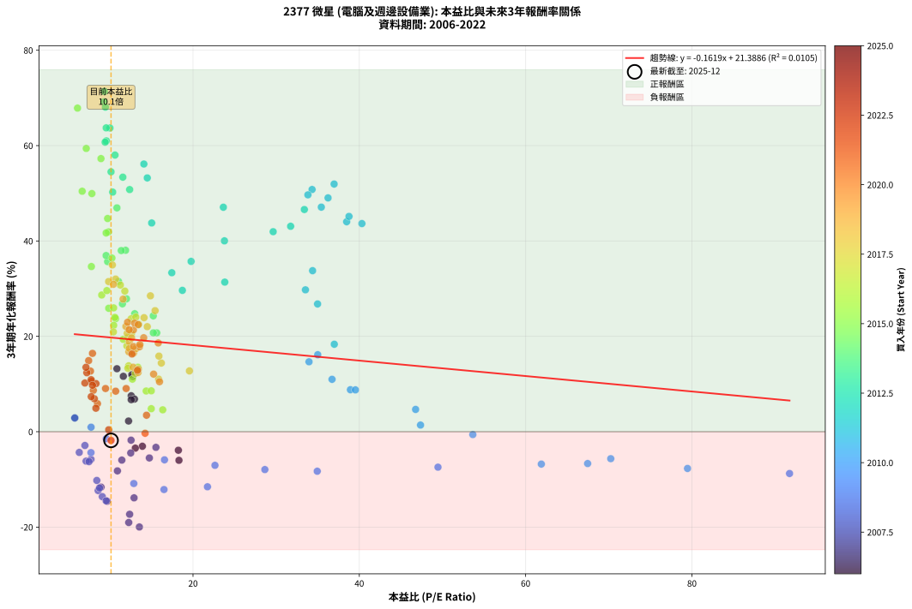
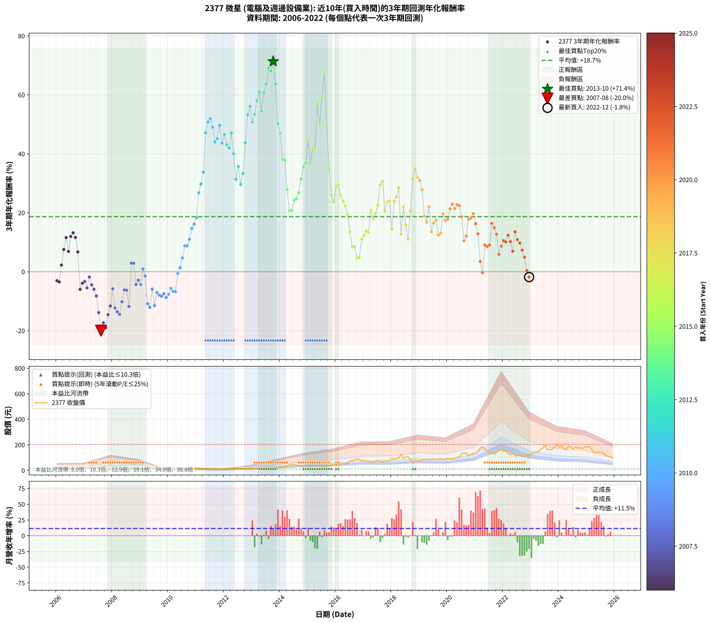

# 2377 微星 - 本益比與未來報酬率分析

!!! info "報告資訊"
    - **股票代號**: 2377
    - **公司名稱**: 微星
    - **產業別**: 電腦及週邊設備業
    - **分析期間**: 2005-2022 (205 個數據點)
    - **資料來源**: Type 12 (ShowMonthlyK_ChartFlow) 月收盤價與本益比
    - **報酬率口徑**: 含現金股利 (簡化: 年度合計，假設每年7/1入帳)
    - **報告生成時間**: 2025-12-23 12:02:14 CST

## 📈 視覺化圖表

### 圖表1: 本益比 vs 未來報酬率關係

*圖表1：2377 微星 本益比與3年期未來報酬率關係 (2005-2022)*

### 圖表2: 歷年買入時點的3年期實際報酬率

*圖表2：2377 微星 歷年買入時點的3年期實際報酬率 (2005-2022)*

## 📍 買點訊號說明

本報告提供兩種買點提示訊號（顯示於圖表2的股價子圖中）：

### ▲ 小綠色三角形（回測驗證）
- **計算方式**: 使用全部歷史資料計算本益比第25百分位數
- **用途**: 事後驗證，顯示歷史上哪些時點確實為低估區
- **限制**: 當下無法判斷，僅供回測參考
- **特性**: 後見之明（Look-Ahead Bias）

### ▲ 小橘色三角形（即時訊號）
- **計算方式**: 使用截至當月的過去5年資料計算本益比第25百分位數
- **用途**: 實際投資決策，當時即可判斷
- **優勢**: 可操作性強，符合實務需求
- **特性**: 無後見之明，滾動窗口計算

!!! tip "如何使用兩種訊號"
    - **綠色▲** 幫助理解歷史估值機會，驗證策略有效性
    - **橘色▲** 可作為實際買進參考，但仍需搭配基本面分析
    - 兩種訊號重疊時，表示即時判斷與事後驗證一致，信心度較高
    - 僅有綠色▲時，表示當時無法判斷（需要未來資料才能確認）
    - 僅有橘色▲時，表示即時判斷為買點，但事後可能不是最佳時機

## 📊 估值分析摘要

| 指標 | 數值 |
|:---:|:---:|
| **目前本益比** (2022-12) | **10.14 倍** |
| **歷史平均本益比** | 16.67 倍 |
| **估值水準** | 🟢 相對低估 |
| **預期3年年化報酬率** | **+19.61%** |
| **歷史平均報酬率** | +18.58% |
| **相關係數 (R²)** | 0.0100 |
| **趨勢線斜率** | -0.1583 |

!!! abstract "核心洞察"
    目前本益比顯著低於歷史平均，預期未來報酬率可能較高

    根據歷史數據回測，2377 微星 在目前本益比 **10.1倍** 的估值水準下，
    預期未來3年年化報酬率約為 **+19.6%**。

    **重要提醒**: 本分析基於歷史數據統計，實際報酬率會受到公司基本面變化、產業趨勢、
    總體經濟環境等多重因素影響。R² = 0.01 表示本益比可解釋約 1.0% 的報酬率變異。

## 📈 歷史估值統計

### 最佳買點 (最高報酬率)

| 項目 | 數值 |
|:---:|:---:|
| 起始時間 | 2013-10 |
| 當時本益比 | 9.34 倍 |
| 起始價格 | 19.8 元 |
| 3年後價格 | 90.9 元 |
| **3年年化報酬率** | **+71.35%** |

### 最差買點 (最低報酬率)

| 項目 | 數值 |
|:---:|:---:|
| 起始時間 | 2007-08 |
| 當時本益比 | 13.55 倍 |
| 起始價格 | 34.1 元 |
| 3年後價格 | 15.7 元 |
| **3年年化報酬率** | **-19.97%** |

## 🎯 投資啟示

### 本益比與報酬率關係

趨勢線方程式: **y = -0.1583x + 21.2196**

!!! note "負相關"
    本益比與未來報酬率呈現負相關。較低的本益比通常帶來較高的未來報酬率，
    但相關性不算非常強。**估值仍是重要參考指標之一**。

### 估值區間建議

基於歷史數據分析:

- **🟢 低估區** (P/E < 13.3): 預期報酬率較高，可考慮增加持股
- **🟡 合理區** (P/E 13.3-20.0): 預期報酬率符合長期趨勢，正常持有
- **🔴 高估區** (P/E > 20.0): 預期報酬率較低，可考慮減碼或觀望

!!! danger "風險提示"
    - 過去表現不代表未來結果
    - 本分析假設公司基本面無重大結構性變化
    - 產業環境劇變可能使歷史規律失效
    - 應結合公司財報、產業趨勢、總體經濟等多重因素綜合判斷

!!! success "長期投資觀點"
    歷史數據顯示，在合理或低估的估值水準買入並長期持有，
    往往能獲得較佳的投資報酬。**耐心等待好價格**是價值投資的核心原則。

## 📊 數據品質

- **資料來源**: GoodInfo.tw Type 12 (ShowMonthlyK_ChartFlow)
- **資料頻率**: 月度收盤價與本益比
- **回測期間**: 2005-2022
- **數據點數量**: 205 個 (每個點代表一次3年期回測)

### 計算方法說明

1. **3年期年化報酬率**:
   - 對每個歷史時點，計算其後3年的實際投資報酬率
   - 期末價值(不含股利): 期末價格
   - 期末價值(含現金股利): 期末價格 + 持有期間內的現金股利合計 (簡化: 年度合計，假設每年7/1入帳)
   - 公式: 年化報酬率 = [(期末價值/期初價格)^(1/年數) - 1] × 100%

2. **本益比 (P/E Ratio)**:
   - 使用當時的月收盤價與EPS計算
   - 資料來源: Type 12 月度河流圖本益比數據

3. **趨勢線 (Linear Regression)**:
   - 使用最小平方法擬合線性趨勢線
   - R²值衡量本益比對報酬率的解釋能力

---

*本報告由 Stock Analysis System v1.9.0 自動生成*
*數據更新時間: 2025-12-23 12:02:14 CST*

## 📋 月度回測明細表

（每一列對應時間線圖中的一個買入點；可用來對照 SVG 圖上的每個點。）

| 買入月份 | 賣出月份 | 回測期限_年 | 實際持有年數 | 買入本益比_倍 | 買入收盤價_元 | 賣出收盤價_元 | 現金股利合計_元 | 總報酬率_pct | 年化報酬率_pct |
| --- | --- | --- | --- | --- | --- | --- | --- | --- | --- |
| 2005-12 | 2008-12 | 3 | 3.001 | 13.33 | 20.00 | 15.75 | 1.90 | -11.76 | -4.08 |
| 2006-01 | 2009-01 | 3 | 3.001 | 13.23 | 19.75 | 16.10 | 1.90 | -8.87 | -3.05 |
| 2006-02 | 2009-02 | 3 | 3.001 | 12.48 | 18.55 | 14.80 | 1.90 | -9.98 | -3.44 |
| 2006-03 | 2009-03 | 3 | 3.001 | 11.76 | 17.40 | 16.70 | 1.90 | +6.89 | +2.24 |
| 2006-04 | 2009-04 | 3 | 3.001 | 12.12 | 17.85 | 20.30 | 1.90 | +24.36 | +7.54 |
| 2006-05 | 2009-05 | 3 | 3.001 | 12.34 | 18.10 | 23.25 | 1.90 | +38.94 | +11.58 |
| 2006-06 | 2009-06 | 3 | 3.001 | 12.60 | 18.40 | 20.55 | 1.90 | +22.00 | +6.85 |
| 2006-07 | 2009-07 | 3 | 3.001 | 12.35 | 17.95 | 23.30 | 1.90 | +40.37 | +11.97 |
| 2006-08 | 2009-08 | 3 | 3.001 | 10.65 | 15.40 | 20.45 | 1.90 | +45.11 | +13.21 |
| 2006-09 | 2009-09 | 3 | 3.001 | 11.46 | 16.50 | 21.05 | 1.90 | +39.07 | +11.62 |
| 2006-10 | 2009-10 | 3 | 3.001 | 12.45 | 17.85 | 19.80 | 1.90 | +21.55 | +6.72 |
| 2006-11 | 2009-11 | 3 | 3.001 | 18.22 | 26.00 | 19.70 | 1.90 | -16.93 | -6.00 |
| 2006-12 | 2009-12 | 3 | 3.001 | 18.24 | 25.90 | 21.10 | 1.90 | -11.21 | -3.88 |
| 2007-01 | 2010-01 | 3 | 3.001 | 15.54 | 24.20 | 20.00 | 1.90 | -9.52 | -3.28 |
| 2007-02 | 2010-02 | 3 | 3.001 | 14.75 | 25.00 | 19.20 | 1.90 | -15.61 | -5.50 |
| 2007-03 | 2010-03 | 3 | 3.001 | 12.55 | 23.00 | 19.90 | 1.90 | -5.23 | -1.77 |
| 2007-04 | 2010-04 | 3 | 3.001 | 12.51 | 24.65 | 19.60 | 1.90 | -12.79 | -4.46 |
| 2007-05 | 2010-05 | 3 | 3.001 | 11.44 | 24.10 | 18.15 | 1.90 | -16.82 | -5.95 |
| 2007-06 | 2010-06 | 3 | 3.001 | 10.91 | 24.50 | 17.05 | 1.90 | -22.67 | -8.21 |
| 2007-07 | 2010-07 | 3 | 3.001 | 12.91 | 30.75 | 17.85 | 1.80 | -36.10 | -13.86 |
| 2007-08 | 2010-08 | 3 | 3.001 | 13.55 | 34.15 | 15.70 | 1.80 | -48.76 | -19.97 |
| 2007-09 | 2010-09 | 3 | 3.001 | 12.38 | 32.90 | 16.80 | 1.80 | -43.47 | -17.31 |
| 2007-10 | 2010-10 | 3 | 3.001 | 12.27 | 34.30 | 16.40 | 1.80 | -46.94 | -19.04 |
| 2007-11 | 2010-11 | 3 | 3.001 | 9.68 | 28.40 | 15.90 | 1.80 | -37.68 | -14.58 |
| 2007-12 | 2010-12 | 3 | 3.001 | 8.94 | 27.45 | 17.15 | 1.80 | -30.97 | -11.62 |
| 2008-01 | 2011-01 | 3 | 3.001 | 7.73 | 23.20 | 17.60 | 1.80 | -16.38 | -5.79 |
| 2008-02 | 2011-03 | 3 | 3.080 | 8.59 | 25.20 | 15.00 | 1.80 | -33.34 | -12.34 |
| 2008-03 | 2011-03 | 3 | 2.998 | 9.09 | 26.05 | 15.00 | 1.80 | -35.51 | -13.61 |
| 2008-04 | 2011-04 | 3 | 2.998 | 9.55 | 26.70 | 14.90 | 1.80 | -37.46 | -14.49 |
| 2008-05 | 2011-05 | 3 | 2.998 | 8.43 | 23.00 | 14.85 | 1.80 | -27.61 | -10.22 |
| 2008-06 | 2011-06 | 3 | 2.998 | 7.14 | 19.00 | 13.90 | 1.80 | -17.37 | -6.17 |
| 2008-07 | 2011-07 | 3 | 2.998 | 7.49 | 19.40 | 14.45 | 1.53 | -17.65 | -6.27 |
| 2008-08 | 2011-08 | 3 | 2.998 | 8.76 | 22.10 | 13.65 | 1.53 | -31.33 | -11.78 |
| 2008-09 | 2011-09 | 3 | 2.998 | 5.78 | 14.20 | 13.95 | 1.53 | +8.99 | +2.91 |
| 2008-10 | 2011-10 | 3 | 2.998 | 5.78 | 13.80 | 13.50 | 1.53 | +8.88 | +2.88 |
| 2008-11 | 2011-11 | 3 | 2.998 | 6.32 | 14.65 | 11.30 | 1.53 | -12.45 | -4.34 |
| 2008-12 | 2011-12 | 3 | 2.998 | 7.00 | 15.75 | 12.90 | 1.53 | -8.41 | -2.89 |
| 2009-01 | 2012-01 | 3 | 2.998 | 7.73 | 16.10 | 12.55 | 1.53 | -12.57 | -4.38 |
| 2009-02 | 2012-02 | 3 | 2.998 | 7.74 | 14.80 | 13.70 | 1.53 | +2.88 | +0.95 |
| 2009-03 | 2012-03 | 3 | 3.001 | 9.57 | 16.70 | 14.45 | 1.53 | -4.34 | -1.47 |
| 2009-04 | 2012-04 | 3 | 3.001 | 12.88 | 20.30 | 12.85 | 1.53 | -29.18 | -10.86 |
| 2009-05 | 2012-05 | 3 | 3.001 | 16.51 | 23.25 | 14.25 | 1.53 | -32.15 | -12.12 |
| 2009-06 | 2012-06 | 3 | 3.001 | 16.57 | 20.55 | 15.60 | 1.53 | -16.66 | -5.89 |
| 2009-07 | 2012-07 | 3 | 3.001 | 21.74 | 23.30 | 14.05 | 2.07 | -30.80 | -11.55 |
| 2009-08 | 2012-08 | 3 | 3.001 | 22.64 | 20.45 | 14.35 | 2.07 | -19.69 | -7.05 |
| 2009-09 | 2012-09 | 3 | 3.001 | 28.64 | 21.05 | 14.35 | 2.07 | -21.98 | -7.94 |
| 2009-10 | 2012-10 | 3 | 3.001 | 34.94 | 19.80 | 13.20 | 2.07 | -22.86 | -8.29 |
| 2009-11 | 2012-11 | 3 | 3.001 | 49.46 | 19.70 | 13.55 | 2.07 | -20.69 | -7.43 |
| 2009-12 | 2012-12 | 3 | 3.001 | 91.74 | 21.10 | 13.95 | 2.07 | -24.06 | -8.76 |
| 2010-01 | 2013-01 | 3 | 3.001 | 79.47 | 20.00 | 13.65 | 2.07 | -21.38 | -7.70 |
| 2010-02 | 2013-02 | 3 | 3.001 | 70.24 | 19.20 | 14.05 | 2.07 | -16.02 | -5.65 |
| 2010-03 | 2013-03 | 3 | 3.001 | 67.46 | 19.90 | 14.10 | 2.07 | -18.72 | -6.68 |
| 2010-04 | 2013-04 | 3 | 3.001 | 61.89 | 19.60 | 13.80 | 2.07 | -19.01 | -6.79 |
| 2010-05 | 2013-05 | 3 | 3.001 | 53.65 | 18.15 | 15.75 | 2.07 | -1.80 | -0.60 |
| 2010-06 | 2013-06 | 3 | 3.001 | 47.36 | 17.05 | 15.70 | 2.07 | +4.25 | +1.40 |
| 2010-07 | 2013-07 | 3 | 3.001 | 46.77 | 17.85 | 17.80 | 2.67 | +14.70 | +4.68 |
| 2010-08 | 2013-08 | 3 | 3.001 | 38.93 | 15.70 | 17.55 | 2.67 | +28.82 | +8.80 |
| 2010-09 | 2013-09 | 3 | 3.001 | 39.53 | 16.80 | 18.95 | 2.67 | +28.71 | +8.78 |
| 2010-10 | 2013-10 | 3 | 3.001 | 36.72 | 16.40 | 19.75 | 2.67 | +36.73 | +10.99 |
| 2010-11 | 2013-11 | 3 | 3.001 | 33.95 | 15.90 | 21.30 | 2.67 | +50.78 | +14.67 |
| 2010-12 | 2013-12 | 3 | 3.001 | 35.00 | 17.15 | 24.20 | 2.67 | +56.70 | +16.15 |
| 2011-01 | 2014-01 | 3 | 3.001 | 36.99 | 17.60 | 26.50 | 2.67 | +65.76 | +18.34 |
| 2011-02 | 2014-02 | 3 | 3.001 | 34.98 | 16.15 | 30.25 | 2.67 | +103.86 | +26.79 |
| 2011-03 | 2014-03 | 3 | 3.001 | 33.52 | 15.00 | 30.10 | 2.67 | +118.49 | +29.75 |
| 2011-04 | 2014-04 | 3 | 3.001 | 34.38 | 14.90 | 33.00 | 2.67 | +139.42 | +33.77 |
| 2011-05 | 2014-05 | 3 | 3.001 | 35.43 | 14.85 | 44.60 | 2.67 | +218.34 | +47.09 |
| 2011-06 | 2014-06 | 3 | 3.001 | 34.32 | 13.90 | 45.00 | 2.67 | +242.98 | +50.79 |
| 2011-07 | 2014-07 | 3 | 3.001 | 36.97 | 14.45 | 46.55 | 4.15 | +250.84 | +51.94 |
| 2011-08 | 2014-08 | 3 | 3.001 | 36.24 | 13.65 | 41.05 | 4.15 | +231.11 | +49.03 |
| 2011-09 | 2014-09 | 3 | 3.001 | 38.48 | 13.95 | 37.55 | 4.15 | +198.90 | +44.04 |
| 2011-10 | 2014-10 | 3 | 3.001 | 38.76 | 13.50 | 37.15 | 4.15 | +205.90 | +45.15 |
| 2011-11 | 2014-11 | 3 | 3.001 | 33.82 | 11.30 | 33.75 | 4.15 | +235.37 | +49.67 |
| 2011-12 | 2014-12 | 3 | 3.001 | 40.31 | 12.90 | 34.10 | 4.15 | +196.49 | +43.65 |
| 2012-01 | 2015-01 | 3 | 3.001 | 33.39 | 12.55 | 35.40 | 4.15 | +215.12 | +46.59 |
| 2012-02 | 2015-03 | 3 | 3.080 | 31.74 | 13.70 | 37.15 | 4.15 | +201.44 | +43.08 |
| 2012-03 | 2015-03 | 3 | 2.998 | 29.64 | 14.45 | 37.15 | 4.15 | +185.79 | +41.95 |
| 2012-04 | 2015-04 | 3 | 2.998 | 23.65 | 12.85 | 36.70 | 4.15 | +217.88 | +47.07 |
| 2012-05 | 2015-05 | 3 | 2.998 | 23.78 | 14.25 | 34.95 | 4.15 | +174.36 | +40.03 |
| 2012-06 | 2015-06 | 3 | 2.998 | 23.82 | 15.60 | 31.20 | 4.15 | +126.58 | +31.37 |
| 2012-07 | 2015-07 | 3 | 2.998 | 19.77 | 14.05 | 29.00 | 6.10 | +149.82 | +35.72 |
| 2012-08 | 2015-08 | 3 | 2.998 | 18.72 | 14.35 | 25.15 | 6.10 | +117.77 | +29.64 |
| 2012-09 | 2015-09 | 3 | 2.998 | 17.45 | 14.35 | 27.90 | 6.10 | +136.93 | +33.34 |
| 2012-10 | 2015-10 | 3 | 2.998 | 15.03 | 13.20 | 33.10 | 6.10 | +196.97 | +43.77 |
| 2012-11 | 2015-11 | 3 | 2.998 | 14.50 | 13.55 | 42.60 | 6.10 | +259.41 | +53.22 |
| 2012-12 | 2015-12 | 3 | 2.998 | 14.09 | 13.95 | 46.95 | 6.10 | +280.29 | +56.14 |
| 2013-01 | 2016-01 | 3 | 2.998 | 12.38 | 13.65 | 40.65 | 6.10 | +242.49 | +50.78 |
| 2013-02 | 2016-02 | 3 | 2.998 | 11.56 | 14.05 | 44.55 | 6.10 | +260.50 | +53.38 |
| 2013-03 | 2016-03 | 3 | 3.001 | 10.62 | 14.10 | 49.55 | 6.10 | +294.68 | +58.02 |
| 2013-04 | 2016-04 | 3 | 3.001 | 9.58 | 13.80 | 51.50 | 6.10 | +317.39 | +60.99 |
| 2013-05 | 2016-05 | 3 | 3.001 | 10.14 | 15.75 | 52.00 | 6.10 | +268.89 | +54.50 |
| 2013-06 | 2016-06 | 3 | 3.001 | 9.43 | 15.70 | 59.10 | 6.10 | +315.29 | +60.72 |
| 2013-07 | 2016-07 | 3 | 3.001 | 10.01 | 17.80 | 69.60 | 8.50 | +338.76 | +63.69 |
| 2013-08 | 2016-08 | 3 | 3.001 | 9.29 | 17.55 | 76.50 | 8.50 | +384.33 | +69.17 |
| 2013-09 | 2016-09 | 3 | 3.001 | 9.46 | 18.95 | 81.50 | 8.50 | +374.93 | +68.07 |
| 2013-10 | 2016-10 | 3 | 3.001 | 9.34 | 19.75 | 90.90 | 8.50 | +403.29 | +71.35 |
| 2013-11 | 2016-11 | 3 | 3.001 | 9.56 | 21.30 | 85.00 | 8.50 | +338.97 | +63.72 |
| 2013-12 | 2016-12 | 3 | 3.001 | 10.34 | 24.20 | 73.60 | 8.50 | +239.26 | +50.25 |
| 2014-01 | 2017-01 | 3 | 3.001 | 10.85 | 26.50 | 75.60 | 8.50 | +217.36 | +46.94 |
| 2014-02 | 2017-02 | 3 | 3.001 | 11.89 | 30.25 | 71.10 | 8.50 | +163.14 | +38.05 |
| 2014-03 | 2017-03 | 3 | 3.001 | 11.37 | 30.10 | 70.60 | 8.50 | +162.79 | +37.99 |
| 2014-04 | 2017-04 | 3 | 3.001 | 12.00 | 33.00 | 60.50 | 8.50 | +109.09 | +27.87 |
| 2014-05 | 2017-05 | 3 | 3.001 | 15.64 | 44.60 | 70.00 | 8.50 | +76.01 | +20.73 |
| 2014-06 | 2017-06 | 3 | 3.001 | 15.23 | 45.00 | 70.70 | 8.50 | +76.00 | +20.73 |
| 2014-07 | 2017-07 | 3 | 3.001 | 15.22 | 46.55 | 78.40 | 11.00 | +92.05 | +24.29 |
| 2014-08 | 2017-08 | 3 | 3.001 | 12.99 | 41.05 | 68.70 | 11.00 | +94.15 | +24.75 |
| 2014-09 | 2017-09 | 3 | 3.001 | 11.51 | 37.55 | 65.60 | 11.00 | +103.99 | +26.82 |
| 2014-10 | 2017-10 | 3 | 3.001 | 11.04 | 37.15 | 73.50 | 11.00 | +127.46 | +31.50 |
| 2014-11 | 2017-11 | 3 | 3.001 | 9.73 | 33.75 | 73.30 | 11.00 | +149.78 | +35.67 |
| 2014-12 | 2017-12 | 3 | 3.001 | 9.55 | 34.10 | 76.60 | 11.00 | +156.89 | +36.95 |
| 2015-01 | 2018-01 | 3 | 3.001 | 9.73 | 35.40 | 96.30 | 11.00 | +203.11 | +44.71 |
| 2015-02 | 2018-02 | 3 | 3.001 | 10.25 | 38.00 | 85.50 | 11.00 | +153.95 | +36.42 |
| 2015-03 | 2018-03 | 3 | 3.001 | 9.84 | 37.15 | 95.20 | 11.00 | +185.87 | +41.91 |
| 2015-04 | 2018-04 | 3 | 3.001 | 9.55 | 36.70 | 93.40 | 11.00 | +184.47 | +41.68 |
| 2015-05 | 2018-05 | 3 | 3.001 | 8.93 | 34.95 | 125.00 | 11.00 | +289.13 | +57.27 |
| 2015-06 | 2018-06 | 3 | 3.001 | 7.84 | 31.20 | 94.20 | 11.00 | +237.18 | +49.94 |
| 2015-07 | 2018-07 | 3 | 3.001 | 7.16 | 29.00 | 105.00 | 12.50 | +305.17 | +59.40 |
| 2015-08 | 2018-08 | 3 | 3.001 | 6.11 | 25.15 | 106.50 | 12.50 | +373.16 | +67.86 |
| 2015-09 | 2018-09 | 3 | 3.001 | 6.67 | 27.90 | 82.50 | 12.50 | +240.50 | +50.43 |
| 2015-10 | 2018-10 | 3 | 3.001 | 7.78 | 33.10 | 68.30 | 12.50 | +144.11 | +34.64 |
| 2015-11 | 2018-11 | 3 | 3.001 | 9.86 | 42.60 | 72.50 | 12.50 | +99.53 | +25.89 |
| 2015-12 | 2018-12 | 3 | 3.001 | 10.69 | 46.95 | 76.40 | 12.50 | +89.35 | +23.71 |
| 2016-01 | 2019-01 | 3 | 3.001 | 9.02 | 40.65 | 74.10 | 12.50 | +113.04 | +28.67 |
| 2016-02 | 2019-03 | 3 | 3.080 | 9.64 | 44.55 | 86.50 | 12.50 | +122.22 | +29.60 |
| 2016-03 | 2019-03 | 3 | 2.998 | 10.45 | 49.55 | 86.50 | 12.50 | +99.80 | +25.97 |
| 2016-04 | 2019-04 | 3 | 2.998 | 10.60 | 51.50 | 85.60 | 12.50 | +90.49 | +23.98 |
| 2016-05 | 2019-05 | 3 | 2.998 | 10.46 | 52.00 | 82.60 | 12.50 | +82.88 | +22.31 |
| 2016-06 | 2019-06 | 3 | 2.998 | 11.61 | 59.10 | 88.00 | 12.50 | +70.05 | +19.37 |
| 2016-07 | 2019-07 | 3 | 2.998 | 13.37 | 69.60 | 87.80 | 14.00 | +46.26 | +13.52 |
| 2016-08 | 2019-08 | 3 | 2.998 | 14.37 | 76.50 | 83.80 | 14.00 | +27.84 | +8.54 |
| 2016-09 | 2019-09 | 3 | 2.998 | 14.98 | 81.50 | 90.30 | 14.00 | +27.98 | +8.58 |
| 2016-10 | 2019-10 | 3 | 2.998 | 16.36 | 90.90 | 90.00 | 14.00 | +14.41 | +4.59 |
| 2016-11 | 2019-11 | 3 | 2.998 | 14.98 | 85.00 | 83.90 | 14.00 | +15.18 | +4.83 |
| 2016-12 | 2019-12 | 3 | 2.998 | 12.71 | 73.60 | 86.70 | 14.00 | +36.82 | +11.02 |
| 2017-01 | 2020-01 | 3 | 2.998 | 13.05 | 75.60 | 92.80 | 14.00 | +41.27 | +12.21 |
| 2017-02 | 2020-02 | 3 | 2.998 | 12.26 | 71.10 | 90.80 | 14.00 | +47.40 | +13.82 |
| 2017-03 | 2020-03 | 3 | 3.001 | 12.17 | 70.60 | 88.70 | 14.00 | +45.47 | +13.30 |
| 2017-04 | 2020-04 | 3 | 3.001 | 10.42 | 60.50 | 93.00 | 14.00 | +76.86 | +20.93 |
| 2017-05 | 2020-05 | 3 | 3.001 | 12.05 | 70.00 | 101.00 | 14.00 | +64.29 | +17.99 |
| 2017-06 | 2020-06 | 3 | 3.001 | 12.16 | 70.70 | 107.50 | 14.00 | +71.85 | +19.78 |
| 2017-07 | 2020-07 | 3 | 3.001 | 13.47 | 78.40 | 130.50 | 13.70 | +83.93 | +22.52 |
| 2017-08 | 2020-08 | 3 | 3.001 | 11.80 | 68.70 | 135.50 | 13.70 | +117.18 | +29.49 |
| 2017-09 | 2020-09 | 3 | 3.001 | 11.26 | 65.60 | 133.00 | 13.70 | +123.63 | +30.76 |
| 2017-10 | 2020-10 | 3 | 3.001 | 12.60 | 73.50 | 115.00 | 13.70 | +75.10 | +20.53 |
| 2017-11 | 2020-11 | 3 | 3.001 | 12.56 | 73.30 | 125.00 | 13.70 | +89.22 | +23.68 |
| 2017-12 | 2020-12 | 3 | 3.001 | 13.12 | 76.60 | 132.50 | 13.70 | +90.86 | +24.04 |
| 2018-01 | 2021-01 | 3 | 3.001 | 16.19 | 96.30 | 130.50 | 13.70 | +49.74 | +14.40 |
| 2018-02 | 2021-02 | 3 | 3.001 | 14.11 | 85.50 | 149.00 | 13.70 | +90.29 | +23.91 |
| 2018-03 | 2021-03 | 3 | 3.001 | 15.44 | 95.20 | 174.00 | 13.70 | +97.16 | +25.39 |
| 2018-04 | 2021-04 | 3 | 3.001 | 14.88 | 93.40 | 184.50 | 13.70 | +112.21 | +28.50 |
| 2018-05 | 2021-05 | 3 | 3.001 | 19.57 | 125.00 | 165.50 | 13.70 | +43.36 | +12.75 |
| 2018-06 | 2021-06 | 3 | 3.001 | 14.50 | 94.20 | 157.50 | 13.70 | +81.74 | +22.03 |
| 2018-07 | 2021-07 | 3 | 3.001 | 15.90 | 105.00 | 148.00 | 15.30 | +55.52 | +15.86 |
| 2018-08 | 2021-08 | 3 | 3.001 | 15.86 | 106.50 | 130.50 | 15.30 | +36.90 | +11.03 |
| 2018-09 | 2021-09 | 3 | 3.001 | 12.09 | 82.50 | 129.50 | 15.30 | +75.52 | +20.62 |
| 2018-10 | 2021-10 | 3 | 3.001 | 9.85 | 68.30 | 140.00 | 15.30 | +127.38 | +31.49 |
| 2018-11 | 2021-11 | 3 | 3.001 | 10.30 | 72.50 | 163.00 | 15.30 | +145.93 | +34.97 |
| 2018-12 | 2021-12 | 3 | 3.001 | 10.69 | 76.40 | 160.50 | 15.30 | +130.10 | +32.01 |
| 2019-01 | 2022-01 | 3 | 3.001 | 10.43 | 74.10 | 151.00 | 15.30 | +124.43 | +30.92 |
| 2019-02 | 2022-02 | 3 | 3.001 | 11.59 | 81.80 | 155.50 | 15.30 | +108.80 | +27.81 |
| 2019-03 | 2022-03 | 3 | 3.001 | 12.33 | 86.50 | 130.00 | 15.30 | +67.98 | +18.87 |
| 2019-04 | 2022-04 | 3 | 3.001 | 12.28 | 85.60 | 121.00 | 15.30 | +59.23 | +16.77 |
| 2019-05 | 2022-05 | 3 | 3.001 | 11.93 | 82.60 | 135.00 | 15.30 | +81.96 | +22.08 |
| 2019-06 | 2022-06 | 3 | 3.001 | 12.79 | 88.00 | 113.50 | 15.30 | +46.36 | +13.54 |
| 2019-07 | 2022-07 | 3 | 3.001 | 12.85 | 87.80 | 118.00 | 20.80 | +58.09 | +16.49 |
| 2019-08 | 2022-08 | 3 | 3.001 | 12.34 | 83.80 | 115.00 | 20.80 | +62.05 | +17.45 |
| 2019-09 | 2022-09 | 3 | 3.001 | 13.39 | 90.30 | 107.50 | 20.80 | +42.08 | +12.42 |
| 2019-10 | 2022-10 | 3 | 3.001 | 13.43 | 90.00 | 109.50 | 20.80 | +44.78 | +13.12 |
| 2019-11 | 2022-11 | 3 | 3.001 | 12.61 | 83.90 | 123.00 | 20.80 | +71.39 | +19.67 |
| 2019-12 | 2022-12 | 3 | 3.001 | 13.12 | 86.70 | 119.50 | 20.80 | +61.82 | +17.40 |
| 2020-01 | 2023-01 | 3 | 3.001 | 13.56 | 92.80 | 131.00 | 20.80 | +63.58 | +17.82 |
| 2020-02 | 2023-03 | 3 | 3.080 | 12.83 | 90.80 | 144.00 | 20.80 | +81.50 | +21.35 |
| 2020-03 | 2023-03 | 3 | 2.998 | 12.13 | 88.70 | 144.00 | 20.80 | +85.79 | +22.95 |
| 2020-04 | 2023-04 | 3 | 2.998 | 12.32 | 93.00 | 145.50 | 20.80 | +78.82 | +21.39 |
| 2020-05 | 2023-05 | 3 | 2.998 | 12.98 | 101.00 | 166.00 | 20.80 | +84.95 | +22.77 |
| 2020-06 | 2023-06 | 3 | 2.998 | 13.41 | 107.50 | 176.50 | 20.80 | +83.53 | +22.45 |
| 2020-07 | 2023-07 | 3 | 2.998 | 15.82 | 130.50 | 194.50 | 23.20 | +66.82 | +18.61 |
| 2020-08 | 2023-08 | 3 | 2.998 | 15.97 | 135.50 | 159.50 | 23.20 | +34.83 | +10.48 |
| 2020-09 | 2023-09 | 3 | 2.998 | 15.26 | 133.00 | 164.00 | 23.20 | +40.75 | +12.08 |
| 2020-10 | 2023-10 | 3 | 2.998 | 12.85 | 115.00 | 165.00 | 23.20 | +63.65 | +17.86 |
| 2020-11 | 2023-11 | 3 | 2.998 | 13.61 | 125.00 | 183.50 | 23.20 | +65.36 | +18.27 |
| 2020-12 | 2023-12 | 3 | 2.998 | 14.07 | 132.50 | 204.00 | 23.20 | +71.47 | +19.71 |
| 2021-01 | 2024-01 | 3 | 2.998 | 12.66 | 130.50 | 182.00 | 23.20 | +57.24 | +16.30 |
| 2021-02 | 2024-02 | 3 | 2.998 | 13.32 | 149.00 | 191.00 | 23.20 | +43.76 | +12.87 |
| 2021-03 | 2024-03 | 3 | 3.001 | 14.41 | 174.00 | 169.50 | 23.20 | +10.75 | +3.46 |
| 2021-04 | 2024-04 | 3 | 3.001 | 14.24 | 184.50 | 159.50 | 23.20 | -0.98 | -0.33 |
| 2021-05 | 2024-05 | 3 | 3.001 | 11.96 | 165.50 | 191.50 | 23.20 | +29.73 | +9.06 |
| 2021-06 | 2024-06 | 3 | 3.001 | 10.70 | 157.50 | 178.00 | 23.20 | +27.75 | +8.50 |
| 2021-07 | 2024-07 | 3 | 3.001 | 9.48 | 148.00 | 169.50 | 22.50 | +29.73 | +9.06 |
| 2021-08 | 2024-08 | 3 | 3.001 | 7.91 | 130.50 | 183.50 | 22.50 | +57.85 | +16.43 |
| 2021-09 | 2024-09 | 3 | 3.001 | 7.45 | 129.50 | 174.00 | 22.50 | +51.74 | +14.91 |
| 2021-10 | 2024-10 | 3 | 3.001 | 7.67 | 140.00 | 178.00 | 22.50 | +43.21 | +12.72 |
| 2021-11 | 2024-11 | 3 | 3.001 | 8.51 | 163.00 | 171.00 | 22.50 | +18.71 | +5.88 |
| 2021-12 | 2024-12 | 3 | 3.001 | 8.01 | 160.50 | 183.50 | 22.50 | +28.35 | +8.67 |
| 2022-01 | 2025-01 | 3 | 3.001 | 7.81 | 151.00 | 181.50 | 22.50 | +35.10 | +10.55 |
| 2022-02 | 2025-02 | 3 | 3.001 | 8.33 | 155.50 | 185.00 | 22.50 | +33.44 | +10.09 |
| 2022-03 | 2025-03 | 3 | 3.001 | 7.23 | 130.00 | 162.00 | 22.50 | +41.92 | +12.38 |
| 2022-04 | 2025-04 | 3 | 3.001 | 7.00 | 121.00 | 139.50 | 22.50 | +33.88 | +10.21 |
| 2022-05 | 2025-05 | 3 | 3.001 | 8.13 | 135.00 | 142.50 | 22.50 | +22.22 | +6.92 |
| 2022-06 | 2025-06 | 3 | 3.001 | 7.13 | 113.50 | 143.50 | 22.50 | +46.26 | +13.51 |
| 2022-07 | 2025-07 | 3 | 3.001 | 7.75 | 118.00 | 144.00 | 17.00 | +36.44 | +10.91 |
| 2022-08 | 2025-08 | 3 | 3.001 | 7.91 | 115.00 | 135.00 | 17.00 | +32.17 | +9.74 |
| 2022-09 | 2025-09 | 3 | 3.001 | 7.76 | 107.50 | 116.00 | 17.00 | +23.72 | +7.35 |
| 2022-10 | 2025-10 | 3 | 3.001 | 8.32 | 109.50 | 109.50 | 17.00 | +15.53 | +4.93 |
| 2022-11 | 2025-11 | 3 | 3.001 | 9.86 | 123.00 | 107.50 | 17.00 | +1.22 | +0.40 |
| 2022-12 | 2025-12 | 3 | 3.001 | 10.14 | 119.50 | 102.00 | 17.00 | -0.42 | -0.14 |
