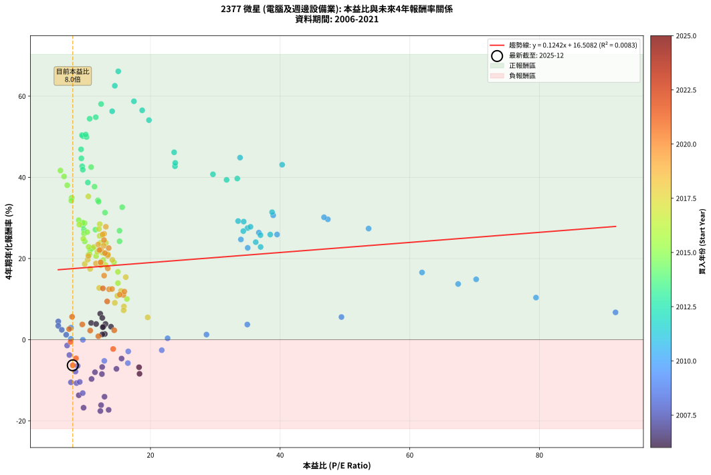
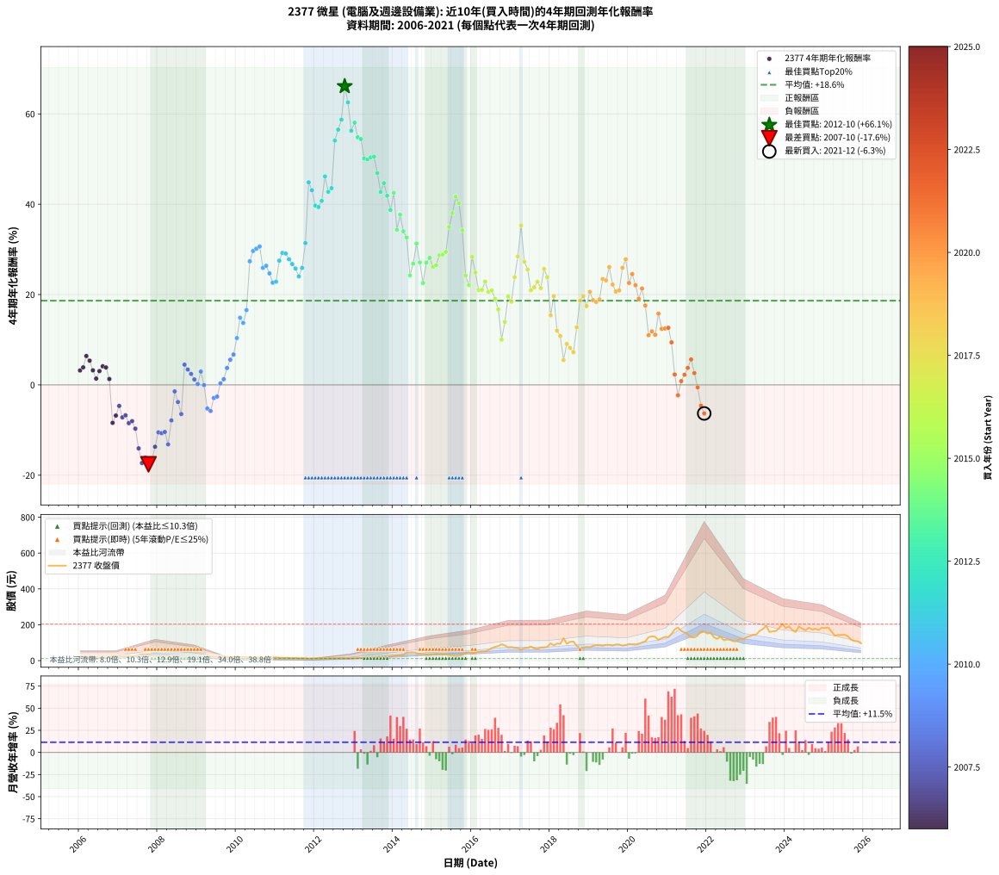

# 2377 微星 - 本益比與未來報酬率分析

!!! info "報告資訊"
    - **股票代號**: 2377
    - **公司名稱**: 微星
    - **產業別**: 電腦及週邊設備業
    - **分析期間**: 2006-2021 (192 個數據點)
    - **資料來源**: Type 12 (ShowMonthlyK_ChartFlow) 月收盤價與本益比
    - **報酬率口徑**: 含現金股利 (簡化: 年度合計，假設每年7/1入帳)
    - **報告生成時間**: 2026-01-06 00:35:49 CST

## 📈 視覺化圖表

### 圖表1: 本益比 vs 未來報酬率關係

*圖表1：2377 微星 本益比與4年期未來報酬率關係 (2006-2021)*

### 圖表2: 歷年買入時點的4年期實際報酬率

*圖表2：2377 微星 歷年買入時點的4年期實際報酬率 (2006-2021)*

## 📍 買點訊號說明

本報告提供兩種買點提示訊號（顯示於圖表2的股價子圖中）：

### ▲ 小綠色三角形（回測驗證）
- **計算方式**: 使用全部歷史資料計算本益比第25百分位數
- **用途**: 事後驗證，顯示歷史上哪些時點確實為低估區
- **限制**: 當下無法判斷，僅供回測參考
- **特性**: 後見之明（Look-Ahead Bias）

### ▲ 小橘色三角形（即時訊號）
- **計算方式**: 使用截至當月的過去5年資料計算本益比第25百分位數
- **用途**: 實際投資決策，當時即可判斷
- **優勢**: 可操作性強，符合實務需求
- **特性**: 無後見之明，滾動窗口計算

!!! tip "如何使用兩種訊號"
    - **綠色▲** 幫助理解歷史估值機會，驗證策略有效性
    - **橘色▲** 可作為實際買進參考，但仍需搭配基本面分析
    - 兩種訊號重疊時，表示即時判斷與事後驗證一致，信心度較高
    - 僅有綠色▲時，表示當時無法判斷（需要未來資料才能確認）
    - 僅有橘色▲時，表示即時判斷為買點，但事後可能不是最佳時機

## 📊 估值分析摘要

| 指標 | 數值 |
|:---:|:---:|
| **目前本益比** (2021-12) | **8.01 倍** |
| **歷史平均本益比** | 17.24 倍 |
| **估值水準** | 🟢 相對低估 |
| **預期4年年化報酬率** | **+17.50%** |
| **歷史平均報酬率** | +18.65% |
| **相關係數 (R²)** | 0.0083 |
| **趨勢線斜率** | 0.1242 |

!!! abstract "核心洞察"
    目前本益比顯著低於歷史平均，預期未來報酬率可能較高

    根據歷史數據回測，2377 微星 在目前本益比 **8.0倍** 的估值水準下，
    預期未來4年年化報酬率約為 **+17.5%**。

    **重要提醒**: 本分析基於歷史數據統計，實際報酬率會受到公司基本面變化、產業趨勢、
    總體經濟環境等多重因素影響。R² = 0.01 表示本益比可解釋約 0.8% 的報酬率變異。

## 📈 歷史估值統計

### 最佳買點 (最高報酬率)

| 項目 | 數值 |
|:---:|:---:|
| 起始時間 | 2012-10 |
| 當時本益比 | 15.03 倍 |
| 起始價格 | 13.2 元 |
| 4年後價格 | 90.9 元 |
| **4年年化報酬率** | **+66.11%** |

### 最差買點 (最低報酬率)

| 項目 | 數值 |
|:---:|:---:|
| 起始時間 | 2007-10 |
| 當時本益比 | 12.27 倍 |
| 起始價格 | 34.3 元 |
| 4年後價格 | 13.5 元 |
| **4年年化報酬率** | **-17.58%** |

## 🎯 投資啟示

### 本益比與報酬率關係

趨勢線方程式: **y = 0.1242x + 16.5082**

!!! info "弱相關或正相關"
    本益比與未來報酬率相關性較弱。這可能表示該股票的報酬率更多受到
    公司成長性、產業趨勢等因素影響，而非估值水準。**需綜合考量多項指標**。

### 估值區間建議

基於歷史數據分析:

- **🟢 低估區** (P/E < 13.8): 預期報酬率較高，可考慮增加持股
- **🟡 合理區** (P/E 13.8-20.7): 預期報酬率符合長期趨勢，正常持有
- **🔴 高估區** (P/E > 20.7): 預期報酬率較低，可考慮減碼或觀望

!!! danger "風險提示"
    - 過去表現不代表未來結果
    - 本分析假設公司基本面無重大結構性變化
    - 產業環境劇變可能使歷史規律失效
    - 應結合公司財報、產業趨勢、總體經濟等多重因素綜合判斷

!!! success "長期投資觀點"
    歷史數據顯示，在合理或低估的估值水準買入並長期持有，
    往往能獲得較佳的投資報酬。**耐心等待好價格**是價值投資的核心原則。

## 📊 數據品質

- **資料來源**: GoodInfo.tw Type 12 (ShowMonthlyK_ChartFlow)
- **資料頻率**: 月度收盤價與本益比
- **回測期間**: 2006-2021
- **數據點數量**: 192 個 (每個點代表一次4年期回測)

### 計算方法說明

1. **4年期年化報酬率**:
   - 對每個歷史時點，計算其後4年的實際投資報酬率
   - 期末價值(不含股利): 期末價格
   - 期末價值(含現金股利): 期末價格 + 持有期間內的現金股利合計 (簡化: 年度合計，假設每年7/1入帳)
   - 公式: 年化報酬率 = [(期末價值/期初價格)^(1/年數) - 1] × 100%

2. **本益比 (P/E Ratio)**:
   - 使用當時的月收盤價與EPS計算
   - 資料來源: Type 12 月度河流圖本益比數據

3. **趨勢線 (Linear Regression)**:
   - 使用最小平方法擬合線性趨勢線
   - R²值衡量本益比對報酬率的解釋能力

---

*本報告由 Stock Analysis System v1.9.0 自動生成*
*數據更新時間: 2026-01-06 00:35:49 CST*

## 📋 月度回測明細表

（每一列對應時間線圖中的一個買入點；可用來對照 SVG 圖上的每個點。）

| 買入月份 | 賣出月份 | 回測期限_年 | 實際持有年數 | 買入本益比_倍 | 買入收盤價_元 | 賣出收盤價_元 | 現金股利合計_元 | 總報酬率_pct | 年化報酬率_pct |
| --- | --- | --- | --- | --- | --- | --- | --- | --- | --- |
| 2006-01 | 2010-01 | 4 | 4.000 | 13.91 | 19.75 | 20.00 | 2.40 | +13.40 | +3.19 |
| 2006-02 | 2010-02 | 4 | 4.000 | 13.06 | 18.55 | 19.20 | 2.40 | +16.43 | +3.88 |
| 2006-03 | 2010-03 | 4 | 4.000 | 12.25 | 17.40 | 19.90 | 2.40 | +28.14 | +6.40 |
| 2006-04 | 2010-04 | 4 | 4.000 | 12.57 | 17.85 | 19.60 | 2.40 | +23.23 | +5.36 |
| 2006-05 | 2010-05 | 4 | 4.000 | 12.75 | 18.10 | 18.15 | 2.40 | +13.52 | +3.22 |
| 2006-06 | 2010-06 | 4 | 4.000 | 12.96 | 18.40 | 17.05 | 2.40 | +5.69 | +1.39 |
| 2006-07 | 2010-07 | 4 | 4.000 | 12.64 | 17.95 | 17.85 | 2.40 | +12.80 | +3.06 |
| 2006-08 | 2010-08 | 4 | 4.000 | 10.85 | 15.40 | 15.70 | 2.40 | +17.51 | +4.12 |
| 2006-09 | 2010-09 | 4 | 4.000 | 11.62 | 16.50 | 16.80 | 2.40 | +16.35 | +3.86 |
| 2006-10 | 2010-10 | 4 | 4.000 | 12.57 | 17.85 | 16.40 | 2.40 | +5.31 | +1.30 |
| 2006-11 | 2010-11 | 4 | 4.000 | 18.31 | 26.00 | 15.90 | 2.40 | -29.63 | -8.41 |
| 2006-12 | 2010-12 | 4 | 4.000 | 18.24 | 25.90 | 17.15 | 2.40 | -24.53 | -6.79 |
| 2007-01 | 2011-01 | 4 | 4.000 | 15.54 | 24.20 | 17.60 | 2.40 | -17.37 | -4.66 |
| 2007-02 | 2011-02 | 4 | 4.000 | 14.75 | 25.00 | 16.15 | 2.40 | -25.81 | -7.19 |
| 2007-03 | 2011-03 | 4 | 4.000 | 12.55 | 23.00 | 15.00 | 2.40 | -24.36 | -6.74 |
| 2007-04 | 2011-04 | 4 | 4.000 | 12.51 | 24.65 | 14.90 | 2.40 | -29.83 | -8.48 |
| 2007-05 | 2011-05 | 4 | 4.000 | 11.44 | 24.10 | 14.85 | 2.40 | -28.44 | -8.02 |
| 2007-06 | 2011-06 | 4 | 4.000 | 10.91 | 24.50 | 13.90 | 2.40 | -33.48 | -9.69 |
| 2007-07 | 2011-07 | 4 | 4.000 | 12.91 | 30.75 | 14.45 | 2.33 | -45.44 | -14.06 |
| 2007-08 | 2011-08 | 4 | 4.000 | 13.55 | 34.15 | 13.65 | 2.33 | -53.22 | -17.30 |
| 2007-09 | 2011-09 | 4 | 4.000 | 12.38 | 32.90 | 13.95 | 2.33 | -50.53 | -16.13 |
| 2007-10 | 2011-10 | 4 | 4.000 | 12.27 | 34.30 | 13.50 | 2.33 | -53.86 | -17.58 |
| 2007-11 | 2011-11 | 4 | 4.000 | 9.68 | 28.40 | 11.30 | 2.33 | -52.02 | -16.77 |
| 2007-12 | 2011-12 | 4 | 4.000 | 8.94 | 27.45 | 12.90 | 2.33 | -44.53 | -13.70 |
| 2008-01 | 2012-01 | 4 | 4.000 | 7.73 | 23.20 | 12.55 | 2.33 | -35.88 | -10.52 |
| 2008-02 | 2012-02 | 4 | 4.000 | 8.59 | 25.20 | 13.70 | 2.33 | -36.40 | -10.70 |
| 2008-03 | 2012-03 | 4 | 4.000 | 9.09 | 26.05 | 14.45 | 2.33 | -35.60 | -10.42 |
| 2008-04 | 2012-04 | 4 | 4.000 | 9.55 | 26.70 | 12.85 | 2.33 | -43.16 | -13.17 |
| 2008-05 | 2012-05 | 4 | 4.000 | 8.43 | 23.00 | 14.25 | 2.33 | -27.93 | -7.86 |
| 2008-06 | 2012-06 | 4 | 4.000 | 7.14 | 19.00 | 15.60 | 2.33 | -5.65 | -1.44 |
| 2008-07 | 2012-07 | 4 | 4.000 | 7.49 | 19.40 | 14.05 | 2.57 | -14.31 | -3.79 |
| 2008-08 | 2012-08 | 4 | 4.000 | 8.76 | 22.10 | 14.35 | 2.57 | -23.43 | -6.45 |
| 2008-09 | 2012-09 | 4 | 4.000 | 5.78 | 14.20 | 14.35 | 2.57 | +19.18 | +4.48 |
| 2008-10 | 2012-10 | 4 | 4.000 | 5.78 | 13.80 | 13.20 | 2.57 | +14.30 | +3.40 |
| 2008-11 | 2012-11 | 4 | 4.000 | 6.32 | 14.65 | 13.55 | 2.57 | +10.05 | +2.42 |
| 2008-12 | 2012-12 | 4 | 4.000 | 7.00 | 15.75 | 13.95 | 2.57 | +4.91 | +1.21 |
| 2009-01 | 2013-01 | 4 | 4.000 | 7.73 | 16.10 | 13.65 | 2.57 | +0.76 | +0.19 |
| 2009-02 | 2013-02 | 4 | 4.000 | 7.74 | 14.80 | 14.05 | 2.57 | +12.32 | +2.95 |
| 2009-03 | 2013-03 | 4 | 4.000 | 9.57 | 16.70 | 14.10 | 2.57 | -0.16 | -0.04 |
| 2009-04 | 2013-04 | 4 | 4.000 | 12.88 | 20.30 | 13.80 | 2.57 | -19.34 | -5.23 |
| 2009-05 | 2013-05 | 4 | 4.000 | 16.51 | 23.25 | 15.75 | 2.57 | -21.19 | -5.78 |
| 2009-06 | 2013-06 | 4 | 4.000 | 16.57 | 20.55 | 15.70 | 2.57 | -11.08 | -2.89 |
| 2009-07 | 2013-07 | 4 | 4.000 | 21.74 | 23.30 | 17.80 | 3.17 | -9.98 | -2.59 |
| 2009-08 | 2013-08 | 4 | 4.000 | 22.64 | 20.45 | 17.55 | 3.17 | +1.34 | +0.33 |
| 2009-09 | 2013-09 | 4 | 4.000 | 28.64 | 21.05 | 18.95 | 3.17 | +5.10 | +1.25 |
| 2009-10 | 2013-10 | 4 | 4.000 | 34.94 | 19.80 | 19.75 | 3.17 | +15.78 | +3.73 |
| 2009-11 | 2013-11 | 4 | 4.000 | 49.46 | 19.70 | 21.30 | 3.17 | +24.23 | +5.57 |
| 2009-12 | 2013-12 | 4 | 4.000 | 91.74 | 21.10 | 24.20 | 3.17 | +29.73 | +6.72 |
| 2010-01 | 2014-01 | 4 | 4.000 | 79.47 | 20.00 | 26.50 | 3.17 | +48.37 | +10.37 |
| 2010-02 | 2014-02 | 4 | 4.000 | 70.24 | 19.20 | 30.25 | 3.17 | +74.08 | +14.87 |
| 2010-03 | 2014-03 | 4 | 4.000 | 67.46 | 19.90 | 30.10 | 3.17 | +67.21 | +13.71 |
| 2010-04 | 2014-04 | 4 | 4.000 | 61.89 | 19.60 | 33.00 | 3.17 | +84.56 | +16.56 |
| 2010-05 | 2014-05 | 4 | 4.000 | 53.65 | 18.15 | 44.60 | 3.17 | +163.22 | +27.37 |
| 2010-06 | 2014-06 | 4 | 4.000 | 47.36 | 17.05 | 45.00 | 3.17 | +182.55 | +29.65 |
| 2010-07 | 2014-07 | 4 | 4.000 | 46.77 | 17.85 | 46.55 | 4.67 | +186.97 | +30.15 |
| 2010-08 | 2014-08 | 4 | 4.000 | 38.93 | 15.70 | 41.05 | 4.67 | +191.24 | +30.64 |
| 2010-09 | 2014-09 | 4 | 4.000 | 39.53 | 16.80 | 37.55 | 4.67 | +151.33 | +25.91 |
| 2010-10 | 2014-10 | 4 | 4.000 | 36.72 | 16.40 | 37.15 | 4.67 | +155.02 | +26.37 |
| 2010-11 | 2014-11 | 4 | 4.000 | 33.95 | 15.90 | 33.75 | 4.67 | +141.66 | +24.68 |
| 2010-12 | 2014-12 | 4 | 4.000 | 35.00 | 17.15 | 34.10 | 4.67 | +126.09 | +22.62 |
| 2011-01 | 2015-01 | 4 | 4.000 | 36.99 | 17.60 | 35.40 | 4.67 | +127.69 | +22.84 |
| 2011-02 | 2015-02 | 4 | 4.000 | 34.98 | 16.15 | 38.00 | 4.67 | +164.24 | +27.50 |
| 2011-03 | 2015-03 | 4 | 4.000 | 33.52 | 15.00 | 37.15 | 4.67 | +178.83 | +29.22 |
| 2011-04 | 2015-04 | 4 | 4.000 | 34.38 | 14.90 | 36.70 | 4.67 | +177.68 | +29.09 |
| 2011-05 | 2015-05 | 4 | 4.000 | 35.43 | 14.85 | 34.95 | 4.67 | +166.83 | +27.81 |
| 2011-06 | 2015-06 | 4 | 4.000 | 34.32 | 13.90 | 31.20 | 4.67 | +158.09 | +26.75 |
| 2011-07 | 2015-07 | 4 | 4.000 | 36.97 | 14.45 | 29.00 | 7.15 | +150.15 | +25.76 |
| 2011-08 | 2015-08 | 4 | 4.000 | 36.24 | 13.65 | 25.15 | 7.15 | +136.61 | +24.02 |
| 2011-09 | 2015-09 | 4 | 4.000 | 38.48 | 13.95 | 27.90 | 7.15 | +151.23 | +25.90 |
| 2011-10 | 2015-10 | 4 | 4.000 | 38.76 | 13.50 | 33.10 | 7.15 | +198.13 | +31.40 |
| 2011-11 | 2015-11 | 4 | 4.000 | 33.82 | 11.30 | 42.60 | 7.15 | +340.24 | +44.85 |
| 2011-12 | 2015-12 | 4 | 4.000 | 40.31 | 12.90 | 46.95 | 7.15 | +319.36 | +43.10 |
| 2012-01 | 2016-01 | 4 | 4.000 | 33.39 | 12.55 | 40.65 | 7.15 | +280.85 | +39.70 |
| 2012-02 | 2016-02 | 4 | 4.000 | 31.74 | 13.70 | 44.55 | 7.15 | +277.35 | +39.38 |
| 2012-03 | 2016-03 | 4 | 4.000 | 29.64 | 14.45 | 49.55 | 7.15 | +292.37 | +40.74 |
| 2012-04 | 2016-04 | 4 | 4.000 | 23.65 | 12.85 | 51.50 | 7.15 | +356.40 | +46.16 |
| 2012-05 | 2016-05 | 4 | 4.000 | 23.78 | 14.25 | 52.00 | 7.15 | +315.07 | +42.73 |
| 2012-06 | 2016-06 | 4 | 4.000 | 23.82 | 15.60 | 59.10 | 7.15 | +324.66 | +43.55 |
| 2012-07 | 2016-07 | 4 | 4.000 | 19.77 | 14.05 | 69.60 | 9.60 | +463.70 | +54.09 |
| 2012-08 | 2016-08 | 4 | 4.000 | 18.72 | 14.35 | 76.50 | 9.60 | +500.00 | +56.51 |
| 2012-09 | 2016-09 | 4 | 4.000 | 17.45 | 14.35 | 81.50 | 9.60 | +534.84 | +58.73 |
| 2012-10 | 2016-10 | 4 | 4.000 | 15.03 | 13.20 | 90.90 | 9.60 | +661.36 | +66.11 |
| 2012-11 | 2016-11 | 4 | 4.000 | 14.50 | 13.55 | 85.00 | 9.60 | +598.15 | +62.55 |
| 2012-12 | 2016-12 | 4 | 4.000 | 14.09 | 13.95 | 73.60 | 9.60 | +496.42 | +56.27 |
| 2013-01 | 2017-01 | 4 | 4.000 | 12.38 | 13.65 | 75.60 | 9.60 | +524.18 | +58.06 |
| 2013-02 | 2017-02 | 4 | 4.000 | 11.56 | 14.05 | 71.10 | 9.60 | +474.38 | +54.81 |
| 2013-03 | 2017-03 | 4 | 4.000 | 10.62 | 14.10 | 70.60 | 9.60 | +468.79 | +54.43 |
| 2013-04 | 2017-04 | 4 | 4.000 | 9.58 | 13.80 | 60.50 | 9.60 | +407.97 | +50.13 |
| 2013-05 | 2017-05 | 4 | 4.000 | 10.14 | 15.75 | 70.00 | 9.60 | +405.40 | +49.94 |
| 2013-06 | 2017-06 | 4 | 4.000 | 9.43 | 15.70 | 70.70 | 9.60 | +411.46 | +50.38 |
| 2013-07 | 2017-07 | 4 | 4.000 | 10.01 | 17.80 | 78.40 | 13.00 | +413.48 | +50.53 |
| 2013-08 | 2017-08 | 4 | 4.000 | 9.29 | 17.55 | 68.70 | 13.00 | +365.53 | +46.89 |
| 2013-09 | 2017-09 | 4 | 4.000 | 9.46 | 18.95 | 65.60 | 13.00 | +314.78 | +42.71 |
| 2013-10 | 2017-10 | 4 | 4.000 | 9.34 | 19.75 | 73.50 | 13.00 | +337.97 | +44.66 |
| 2013-11 | 2017-11 | 4 | 4.000 | 9.56 | 21.30 | 73.30 | 13.00 | +305.16 | +41.88 |
| 2013-12 | 2017-12 | 4 | 4.000 | 10.34 | 24.20 | 76.60 | 13.00 | +270.25 | +38.71 |
| 2014-01 | 2018-01 | 4 | 4.000 | 10.85 | 26.50 | 96.30 | 13.00 | +312.45 | +42.51 |
| 2014-02 | 2018-02 | 4 | 4.000 | 11.89 | 30.25 | 85.50 | 13.00 | +225.62 | +34.33 |
| 2014-03 | 2018-03 | 4 | 4.000 | 11.37 | 30.10 | 95.20 | 13.00 | +259.47 | +37.69 |
| 2014-04 | 2018-04 | 4 | 4.000 | 12.00 | 33.00 | 93.40 | 13.00 | +222.42 | +34.00 |
| 2014-05 | 2018-05 | 4 | 4.000 | 15.64 | 44.60 | 125.00 | 13.00 | +209.42 | +32.63 |
| 2014-06 | 2018-06 | 4 | 4.000 | 15.23 | 45.00 | 94.20 | 13.00 | +138.22 | +24.24 |
| 2014-07 | 2018-07 | 4 | 4.000 | 15.22 | 46.55 | 105.00 | 15.50 | +158.86 | +26.84 |
| 2014-08 | 2018-08 | 4 | 4.000 | 12.99 | 41.05 | 106.50 | 15.50 | +197.20 | +31.30 |
| 2014-09 | 2018-09 | 4 | 4.000 | 11.51 | 37.55 | 82.50 | 15.50 | +160.99 | +27.10 |
| 2014-10 | 2018-10 | 4 | 4.000 | 11.04 | 37.15 | 68.30 | 15.50 | +125.57 | +22.55 |
| 2014-11 | 2018-11 | 4 | 4.000 | 9.73 | 33.75 | 72.50 | 15.50 | +160.74 | +27.07 |
| 2014-12 | 2018-12 | 4 | 4.000 | 9.55 | 34.10 | 76.40 | 15.50 | +169.50 | +28.13 |
| 2015-01 | 2019-01 | 4 | 4.000 | 9.73 | 35.40 | 74.10 | 15.50 | +153.11 | +26.13 |
| 2015-02 | 2019-02 | 4 | 4.000 | 10.25 | 38.00 | 81.80 | 15.50 | +156.05 | +26.50 |
| 2015-03 | 2019-03 | 4 | 4.000 | 9.84 | 37.15 | 86.50 | 15.50 | +174.56 | +28.72 |
| 2015-04 | 2019-04 | 4 | 4.000 | 9.55 | 36.70 | 85.60 | 15.50 | +175.48 | +28.83 |
| 2015-05 | 2019-05 | 4 | 4.000 | 8.93 | 34.95 | 82.60 | 15.50 | +180.69 | +29.44 |
| 2015-06 | 2019-06 | 4 | 4.000 | 7.84 | 31.20 | 88.00 | 15.50 | +231.73 | +34.96 |
| 2015-07 | 2019-07 | 4 | 4.000 | 7.16 | 29.00 | 87.80 | 17.50 | +263.10 | +38.04 |
| 2015-08 | 2019-08 | 4 | 4.000 | 6.11 | 25.15 | 83.80 | 17.50 | +302.78 | +41.67 |
| 2015-09 | 2019-09 | 4 | 4.000 | 6.67 | 27.90 | 90.30 | 17.50 | +286.38 | +40.20 |
| 2015-10 | 2019-10 | 4 | 4.000 | 7.78 | 33.10 | 90.00 | 17.50 | +224.77 | +34.24 |
| 2015-11 | 2019-11 | 4 | 4.000 | 9.86 | 42.60 | 83.90 | 17.50 | +138.03 | +24.21 |
| 2015-12 | 2019-12 | 4 | 4.000 | 10.69 | 46.95 | 86.70 | 17.50 | +121.94 | +22.06 |
| 2016-01 | 2020-01 | 4 | 4.000 | 9.02 | 40.65 | 92.80 | 17.50 | +171.34 | +28.34 |
| 2016-02 | 2020-02 | 4 | 4.000 | 9.64 | 44.55 | 90.80 | 17.50 | +143.10 | +24.87 |
| 2016-03 | 2020-03 | 4 | 4.000 | 10.45 | 49.55 | 88.70 | 17.50 | +114.33 | +21.00 |
| 2016-04 | 2020-04 | 4 | 4.000 | 10.60 | 51.50 | 93.00 | 17.50 | +114.56 | +21.03 |
| 2016-05 | 2020-05 | 4 | 4.000 | 10.46 | 52.00 | 101.00 | 17.50 | +127.88 | +22.87 |
| 2016-06 | 2020-06 | 4 | 4.000 | 11.61 | 59.10 | 107.50 | 17.50 | +111.51 | +20.60 |
| 2016-07 | 2020-07 | 4 | 4.000 | 13.37 | 69.60 | 130.50 | 18.20 | +113.65 | +20.90 |
| 2016-08 | 2020-08 | 4 | 4.000 | 14.37 | 76.50 | 135.50 | 18.20 | +100.92 | +19.06 |
| 2016-09 | 2020-09 | 4 | 4.000 | 14.98 | 81.50 | 133.00 | 18.20 | +85.52 | +16.71 |
| 2016-10 | 2020-10 | 4 | 4.000 | 16.36 | 90.90 | 115.00 | 18.20 | +46.53 | +10.02 |
| 2016-11 | 2020-11 | 4 | 4.000 | 14.98 | 85.00 | 125.00 | 18.20 | +68.47 | +13.93 |
| 2016-12 | 2020-12 | 4 | 4.000 | 12.71 | 73.60 | 132.50 | 18.20 | +104.76 | +19.62 |
| 2017-01 | 2021-01 | 4 | 4.000 | 13.05 | 75.60 | 130.50 | 18.20 | +96.69 | +18.43 |
| 2017-02 | 2021-02 | 4 | 4.000 | 12.26 | 71.10 | 149.00 | 18.20 | +135.16 | +23.83 |
| 2017-03 | 2021-03 | 4 | 4.000 | 12.17 | 70.60 | 174.00 | 18.20 | +172.24 | +28.45 |
| 2017-04 | 2021-04 | 4 | 4.000 | 10.42 | 60.50 | 184.50 | 18.20 | +235.04 | +35.29 |
| 2017-05 | 2021-05 | 4 | 4.000 | 12.05 | 70.00 | 165.50 | 18.20 | +162.43 | +27.28 |
| 2017-06 | 2021-06 | 4 | 4.000 | 12.16 | 70.70 | 157.50 | 18.20 | +148.51 | +25.56 |
| 2017-07 | 2021-07 | 4 | 4.000 | 13.47 | 78.40 | 148.00 | 19.80 | +114.03 | +20.95 |
| 2017-08 | 2021-08 | 4 | 4.000 | 11.80 | 68.70 | 130.50 | 19.80 | +118.78 | +21.62 |
| 2017-09 | 2021-09 | 4 | 4.000 | 11.26 | 65.60 | 129.50 | 19.80 | +127.59 | +22.83 |
| 2017-10 | 2021-10 | 4 | 4.000 | 12.60 | 73.50 | 140.00 | 19.80 | +117.41 | +21.43 |
| 2017-11 | 2021-11 | 4 | 4.000 | 12.56 | 73.30 | 163.00 | 19.80 | +149.39 | +25.67 |
| 2017-12 | 2021-12 | 4 | 4.000 | 13.12 | 76.60 | 160.50 | 19.80 | +135.38 | +23.86 |
| 2018-01 | 2022-01 | 4 | 4.000 | 16.19 | 96.30 | 151.00 | 19.80 | +77.36 | +15.40 |
| 2018-02 | 2022-02 | 4 | 4.000 | 14.11 | 85.50 | 155.50 | 19.80 | +105.03 | +19.66 |
| 2018-03 | 2022-03 | 4 | 4.000 | 15.44 | 95.20 | 130.00 | 19.80 | +57.35 | +12.00 |
| 2018-04 | 2022-04 | 4 | 4.000 | 14.88 | 93.40 | 121.00 | 19.80 | +50.75 | +10.81 |
| 2018-05 | 2022-05 | 4 | 4.000 | 19.57 | 125.00 | 135.00 | 19.80 | +23.84 | +5.49 |
| 2018-06 | 2022-06 | 4 | 4.000 | 14.50 | 94.20 | 113.50 | 19.80 | +41.51 | +9.07 |
| 2018-07 | 2022-07 | 4 | 4.000 | 15.90 | 105.00 | 118.00 | 25.80 | +36.95 | +8.18 |
| 2018-08 | 2022-08 | 4 | 4.000 | 15.86 | 106.50 | 115.00 | 25.80 | +32.21 | +7.23 |
| 2018-09 | 2022-09 | 4 | 4.000 | 12.09 | 82.50 | 107.50 | 25.80 | +61.58 | +12.74 |
| 2018-10 | 2022-10 | 4 | 4.000 | 9.85 | 68.30 | 109.50 | 25.80 | +98.10 | +18.64 |
| 2018-11 | 2022-11 | 4 | 4.000 | 10.30 | 72.50 | 123.00 | 25.80 | +105.24 | +19.69 |
| 2018-12 | 2022-12 | 4 | 4.000 | 10.69 | 76.40 | 119.50 | 25.80 | +90.18 | +17.43 |
| 2019-01 | 2023-01 | 4 | 4.000 | 10.43 | 74.10 | 131.00 | 25.80 | +111.61 | +20.61 |
| 2019-02 | 2023-02 | 4 | 4.000 | 11.59 | 81.80 | 137.00 | 25.80 | +99.02 | +18.78 |
| 2019-03 | 2023-03 | 4 | 4.000 | 12.33 | 86.50 | 144.00 | 25.80 | +96.30 | +18.37 |
| 2019-04 | 2023-04 | 4 | 4.000 | 12.28 | 85.60 | 145.50 | 25.80 | +100.12 | +18.94 |
| 2019-05 | 2023-05 | 4 | 4.000 | 11.93 | 82.60 | 166.00 | 25.80 | +132.20 | +23.44 |
| 2019-06 | 2023-06 | 4 | 4.000 | 12.79 | 88.00 | 176.50 | 25.80 | +129.89 | +23.13 |
| 2019-07 | 2023-07 | 4 | 4.000 | 12.85 | 87.80 | 194.50 | 27.40 | +152.73 | +26.09 |
| 2019-08 | 2023-08 | 4 | 4.000 | 12.34 | 83.80 | 159.50 | 27.40 | +123.03 | +22.21 |
| 2019-09 | 2023-09 | 4 | 4.000 | 13.39 | 90.30 | 164.00 | 27.40 | +111.96 | +20.66 |
| 2019-10 | 2023-10 | 4 | 4.000 | 13.43 | 90.00 | 165.00 | 27.40 | +113.78 | +20.92 |
| 2019-11 | 2023-11 | 4 | 4.000 | 12.61 | 83.90 | 183.50 | 27.40 | +151.37 | +25.92 |
| 2019-12 | 2023-12 | 4 | 4.000 | 13.12 | 86.70 | 204.00 | 27.40 | +166.90 | +27.82 |
| 2020-01 | 2024-01 | 4 | 4.000 | 13.56 | 92.80 | 182.00 | 27.40 | +125.65 | +22.56 |
| 2020-02 | 2024-02 | 4 | 4.000 | 12.83 | 90.80 | 191.00 | 27.40 | +140.53 | +24.54 |
| 2020-03 | 2024-03 | 4 | 4.000 | 12.13 | 88.70 | 169.50 | 27.40 | +121.98 | +22.06 |
| 2020-04 | 2024-04 | 4 | 4.000 | 12.32 | 93.00 | 159.50 | 27.40 | +100.97 | +19.06 |
| 2020-05 | 2024-05 | 4 | 4.000 | 12.98 | 101.00 | 191.50 | 27.40 | +116.73 | +21.33 |
| 2020-06 | 2024-06 | 4 | 4.000 | 13.41 | 107.50 | 178.00 | 27.40 | +91.07 | +17.57 |
| 2020-07 | 2024-07 | 4 | 4.000 | 15.82 | 130.50 | 169.50 | 28.60 | +51.80 | +11.00 |
| 2020-08 | 2024-08 | 4 | 4.000 | 15.97 | 135.50 | 183.50 | 28.60 | +56.53 | +11.85 |
| 2020-09 | 2024-09 | 4 | 4.000 | 15.26 | 133.00 | 174.00 | 28.60 | +52.33 | +11.10 |
| 2020-10 | 2024-10 | 4 | 4.000 | 12.85 | 115.00 | 178.00 | 28.60 | +79.65 | +15.77 |
| 2020-11 | 2024-11 | 4 | 4.000 | 13.61 | 125.00 | 171.00 | 28.60 | +59.68 | +12.41 |
| 2020-12 | 2024-12 | 4 | 4.000 | 14.07 | 132.50 | 183.50 | 28.60 | +60.08 | +12.48 |
| 2021-01 | 2025-01 | 4 | 4.000 | 12.66 | 130.50 | 181.50 | 28.60 | +61.00 | +12.64 |
| 2021-02 | 2025-02 | 4 | 4.000 | 13.32 | 149.00 | 185.00 | 28.60 | +43.36 | +9.42 |
| 2021-03 | 2025-03 | 4 | 4.000 | 14.41 | 174.00 | 162.00 | 28.60 | +9.54 | +2.30 |
| 2021-04 | 2025-04 | 4 | 4.000 | 14.24 | 184.50 | 139.50 | 28.60 | -8.89 | -2.30 |
| 2021-05 | 2025-05 | 4 | 4.000 | 11.96 | 165.50 | 142.50 | 28.60 | +3.38 | +0.84 |
| 2021-06 | 2025-06 | 4 | 4.000 | 10.70 | 157.50 | 143.50 | 28.60 | +9.27 | +2.24 |
| 2021-07 | 2025-07 | 4 | 4.000 | 9.48 | 148.00 | 144.00 | 27.50 | +15.88 | +3.75 |
| 2021-08 | 2025-08 | 4 | 4.000 | 7.91 | 130.50 | 135.00 | 27.50 | +24.52 | +5.64 |
| 2021-09 | 2025-09 | 4 | 4.000 | 7.45 | 129.50 | 116.00 | 27.50 | +10.81 | +2.60 |
| 2021-10 | 2025-10 | 4 | 4.000 | 7.67 | 140.00 | 109.50 | 27.50 | -2.14 | -0.54 |
| 2021-11 | 2025-11 | 4 | 4.000 | 8.51 | 163.00 | 107.50 | 27.50 | -17.18 | -4.60 |
| 2021-12 | 2025-12 | 4 | 4.000 | 8.01 | 160.50 | 96.10 | 27.50 | -22.99 | -6.32 |
