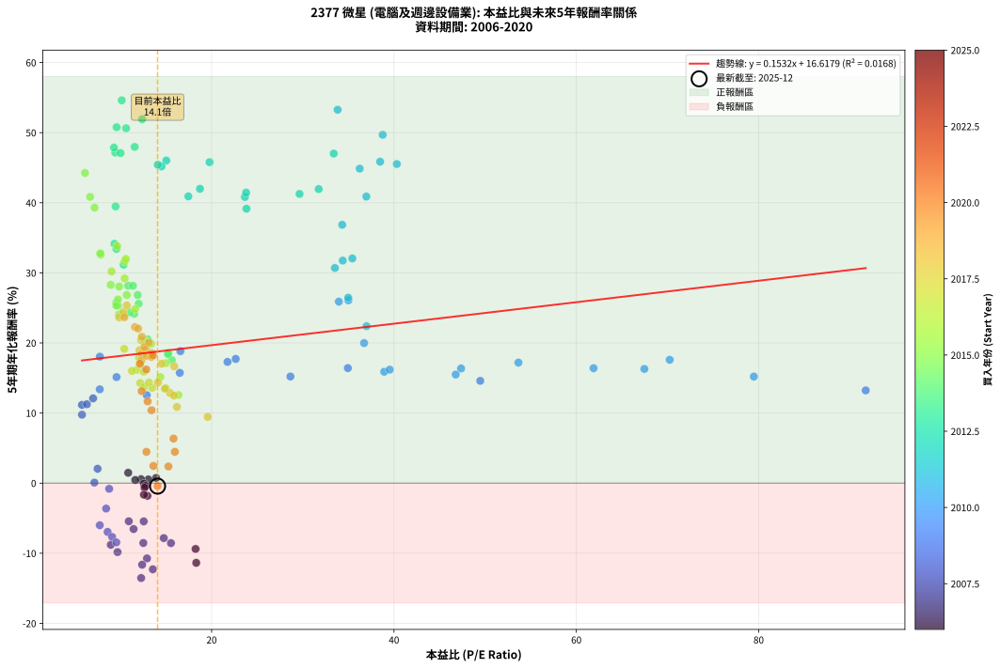
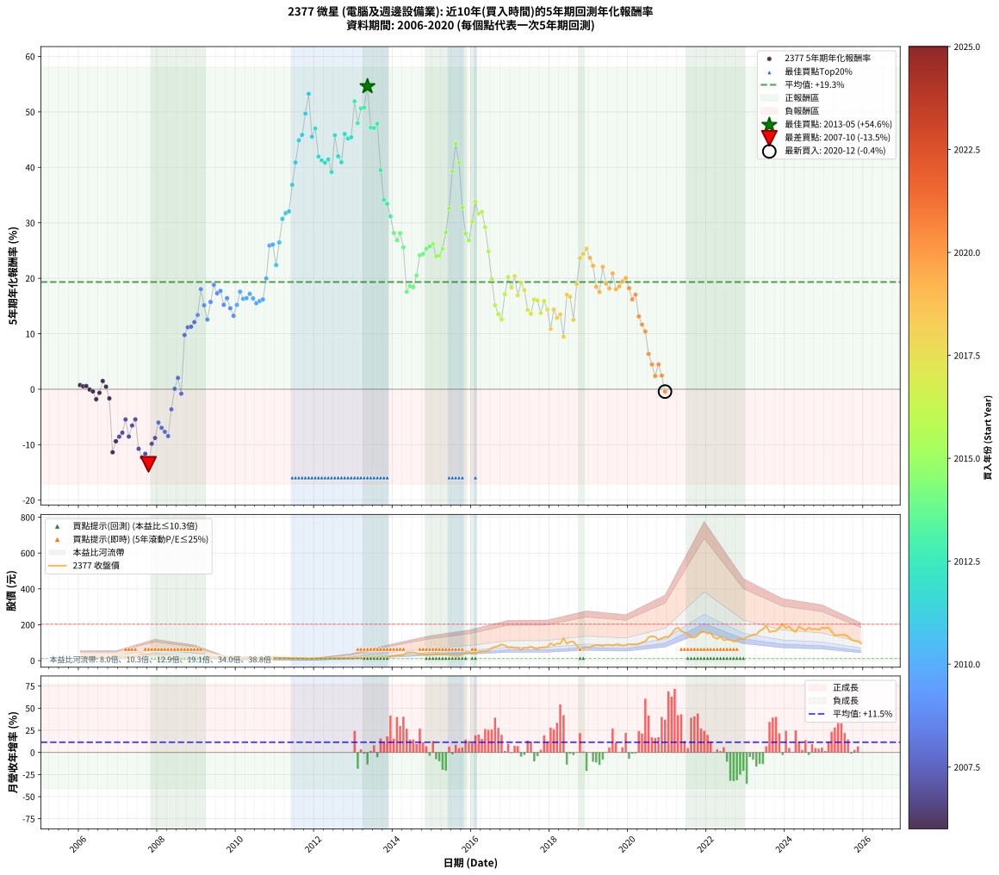

# 2377 微星 - 本益比與未來報酬率分析

!!! info "報告資訊"
    - **股票代號**: 2377
    - **公司名稱**: 微星
    - **產業別**: 電腦及週邊設備業
    - **分析期間**: 2006-2020 (180 個數據點)
    - **資料來源**: Type 12 (ShowMonthlyK_ChartFlow) 月收盤價與本益比
    - **報酬率口徑**: 含現金股利 (簡化: 年度合計，假設每年7/1入帳)
    - **報告生成時間**: 2026-01-05 00:33:14 CST

## 📈 視覺化圖表

### 圖表1: 本益比 vs 未來報酬率關係

*圖表1：2377 微星 本益比與5年期未來報酬率關係 (2006-2020)*

### 圖表2: 歷年買入時點的5年期實際報酬率

*圖表2：2377 微星 歷年買入時點的5年期實際報酬率 (2006-2020)*

## 📍 買點訊號說明

本報告提供兩種買點提示訊號（顯示於圖表2的股價子圖中）：

### ▲ 小綠色三角形（回測驗證）
- **計算方式**: 使用全部歷史資料計算本益比第25百分位數
- **用途**: 事後驗證，顯示歷史上哪些時點確實為低估區
- **限制**: 當下無法判斷，僅供回測參考
- **特性**: 後見之明（Look-Ahead Bias）

### ▲ 小橘色三角形（即時訊號）
- **計算方式**: 使用截至當月的過去5年資料計算本益比第25百分位數
- **用途**: 實際投資決策，當時即可判斷
- **優勢**: 可操作性強，符合實務需求
- **特性**: 無後見之明，滾動窗口計算

!!! tip "如何使用兩種訊號"
    - **綠色▲** 幫助理解歷史估值機會，驗證策略有效性
    - **橘色▲** 可作為實際買進參考，但仍需搭配基本面分析
    - 兩種訊號重疊時，表示即時判斷與事後驗證一致，信心度較高
    - 僅有綠色▲時，表示當時無法判斷（需要未來資料才能確認）
    - 僅有橘色▲時，表示即時判斷為買點，但事後可能不是最佳時機

## 📊 估值分析摘要

| 指標 | 數值 |
|:---:|:---:|
| **目前本益比** (2020-12) | **14.07 倍** |
| **歷史平均本益比** | 17.69 倍 |
| **估值水準** | 🟢 相對低估 |
| **預期5年年化報酬率** | **+18.77%** |
| **歷史平均報酬率** | +19.33% |
| **相關係數 (R²)** | 0.0168 |
| **趨勢線斜率** | 0.1532 |

!!! abstract "核心洞察"
    目前本益比顯著低於歷史平均，預期未來報酬率可能較高

    根據歷史數據回測，2377 微星 在目前本益比 **14.1倍** 的估值水準下，
    預期未來5年年化報酬率約為 **+18.8%**。

    **重要提醒**: 本分析基於歷史數據統計，實際報酬率會受到公司基本面變化、產業趨勢、
    總體經濟環境等多重因素影響。R² = 0.02 表示本益比可解釋約 1.7% 的報酬率變異。

## 📈 歷史估值統計

### 最佳買點 (最高報酬率)

| 項目 | 數值 |
|:---:|:---:|
| 起始時間 | 2013-05 |
| 當時本益比 | 10.14 倍 |
| 起始價格 | 15.8 元 |
| 5年後價格 | 125.0 元 |
| **5年年化報酬率** | **+54.61%** |

### 最差買點 (最低報酬率)

| 項目 | 數值 |
|:---:|:---:|
| 起始時間 | 2007-10 |
| 當時本益比 | 12.27 倍 |
| 起始價格 | 34.3 元 |
| 5年後價格 | 13.2 元 |
| **5年年化報酬率** | **-13.53%** |

## 🎯 投資啟示

### 本益比與報酬率關係

趨勢線方程式: **y = 0.1532x + 16.6179**

!!! info "弱相關或正相關"
    本益比與未來報酬率相關性較弱。這可能表示該股票的報酬率更多受到
    公司成長性、產業趨勢等因素影響，而非估值水準。**需綜合考量多項指標**。

### 估值區間建議

基於歷史數據分析:

- **🟢 低估區** (P/E < 14.1): 預期報酬率較高，可考慮增加持股
- **🟡 合理區** (P/E 14.1-21.2): 預期報酬率符合長期趨勢，正常持有
- **🔴 高估區** (P/E > 21.2): 預期報酬率較低，可考慮減碼或觀望

!!! danger "風險提示"
    - 過去表現不代表未來結果
    - 本分析假設公司基本面無重大結構性變化
    - 產業環境劇變可能使歷史規律失效
    - 應結合公司財報、產業趨勢、總體經濟等多重因素綜合判斷

!!! success "長期投資觀點"
    歷史數據顯示，在合理或低估的估值水準買入並長期持有，
    往往能獲得較佳的投資報酬。**耐心等待好價格**是價值投資的核心原則。

## 📊 數據品質

- **資料來源**: GoodInfo.tw Type 12 (ShowMonthlyK_ChartFlow)
- **資料頻率**: 月度收盤價與本益比
- **回測期間**: 2006-2020
- **數據點數量**: 180 個 (每個點代表一次5年期回測)

### 計算方法說明

1. **5年期年化報酬率**:
   - 對每個歷史時點，計算其後5年的實際投資報酬率
   - 期末價值(不含股利): 期末價格
   - 期末價值(含現金股利): 期末價格 + 持有期間內的現金股利合計 (簡化: 年度合計，假設每年7/1入帳)
   - 公式: 年化報酬率 = [(期末價值/期初價格)^(1/年數) - 1] × 100%

2. **本益比 (P/E Ratio)**:
   - 使用當時的月收盤價與EPS計算
   - 資料來源: Type 12 月度河流圖本益比數據

3. **趨勢線 (Linear Regression)**:
   - 使用最小平方法擬合線性趨勢線
   - R²值衡量本益比對報酬率的解釋能力

---

*本報告由 Stock Analysis System v1.9.0 自動生成*
*數據更新時間: 2026-01-05 00:33:14 CST*

## 📋 月度回測明細表

（每一列對應時間線圖中的一個買入點；可用來對照 SVG 圖上的每個點。）

| 買入月份 | 賣出月份 | 回測期限_年 | 實際持有年數 | 買入本益比_倍 | 買入收盤價_元 | 賣出收盤價_元 | 現金股利合計_元 | 總報酬率_pct | 年化報酬率_pct |
| --- | --- | --- | --- | --- | --- | --- | --- | --- | --- |
| 2006-01 | 2011-01 | 5 | 4.999 | 13.91 | 19.75 | 17.60 | 2.90 | +3.78 | +0.75 |
| 2006-02 | 2011-02 | 5 | 4.999 | 13.06 | 18.55 | 16.15 | 2.90 | +2.68 | +0.53 |
| 2006-03 | 2011-03 | 5 | 4.999 | 12.25 | 17.40 | 15.00 | 2.90 | +2.86 | +0.56 |
| 2006-04 | 2011-04 | 5 | 4.999 | 12.57 | 17.85 | 14.90 | 2.90 | -0.30 | -0.06 |
| 2006-05 | 2011-05 | 5 | 4.999 | 12.75 | 18.10 | 14.85 | 2.90 | -1.95 | -0.39 |
| 2006-06 | 2011-06 | 5 | 4.999 | 12.96 | 18.40 | 13.90 | 2.90 | -8.71 | -1.81 |
| 2006-07 | 2011-07 | 5 | 4.999 | 12.64 | 17.95 | 14.45 | 2.92 | -3.21 | -0.65 |
| 2006-08 | 2011-08 | 5 | 4.999 | 10.85 | 15.40 | 13.65 | 2.92 | +7.62 | +1.48 |
| 2006-09 | 2011-09 | 5 | 4.999 | 11.62 | 16.50 | 13.95 | 2.92 | +2.27 | +0.45 |
| 2006-10 | 2011-10 | 5 | 4.999 | 12.57 | 17.85 | 13.50 | 2.92 | -7.99 | -1.65 |
| 2006-11 | 2011-11 | 5 | 4.999 | 18.31 | 26.00 | 11.30 | 2.92 | -45.29 | -11.37 |
| 2006-12 | 2011-12 | 5 | 4.999 | 18.24 | 25.90 | 12.90 | 2.92 | -38.90 | -9.39 |
| 2007-01 | 2012-01 | 5 | 4.999 | 15.54 | 24.20 | 12.55 | 2.92 | -36.06 | -8.56 |
| 2007-02 | 2012-02 | 5 | 4.999 | 14.75 | 25.00 | 13.70 | 2.92 | -33.50 | -7.84 |
| 2007-03 | 2012-03 | 5 | 5.002 | 12.55 | 23.00 | 14.45 | 2.92 | -24.46 | -5.45 |
| 2007-04 | 2012-04 | 5 | 5.002 | 12.51 | 24.65 | 12.85 | 2.92 | -36.01 | -8.54 |
| 2007-05 | 2012-05 | 5 | 5.002 | 11.44 | 24.10 | 14.25 | 2.92 | -28.74 | -6.55 |
| 2007-06 | 2012-06 | 5 | 5.002 | 10.91 | 24.50 | 15.60 | 2.92 | -24.39 | -5.44 |
| 2007-07 | 2012-07 | 5 | 5.002 | 12.91 | 30.75 | 14.05 | 3.37 | -43.34 | -10.74 |
| 2007-08 | 2012-08 | 5 | 5.002 | 13.55 | 34.15 | 14.35 | 3.37 | -48.10 | -12.29 |
| 2007-09 | 2012-09 | 5 | 5.002 | 12.38 | 32.90 | 14.35 | 3.37 | -46.13 | -11.63 |
| 2007-10 | 2012-10 | 5 | 5.002 | 12.27 | 34.30 | 13.20 | 3.37 | -51.68 | -13.53 |
| 2007-11 | 2012-11 | 5 | 5.002 | 9.68 | 28.40 | 13.55 | 3.37 | -40.41 | -9.83 |
| 2007-12 | 2012-12 | 5 | 5.002 | 8.94 | 27.45 | 13.95 | 3.37 | -36.89 | -8.79 |
| 2008-01 | 2013-01 | 5 | 5.002 | 7.73 | 23.20 | 13.65 | 3.37 | -26.62 | -6.00 |
| 2008-02 | 2013-03 | 5 | 5.081 | 8.59 | 25.20 | 14.10 | 3.37 | -30.66 | -6.95 |
| 2008-03 | 2013-03 | 5 | 4.999 | 9.09 | 26.05 | 14.10 | 3.37 | -32.93 | -7.68 |
| 2008-04 | 2013-04 | 5 | 4.999 | 9.55 | 26.70 | 13.80 | 3.37 | -35.68 | -8.45 |
| 2008-05 | 2013-05 | 5 | 4.999 | 8.43 | 23.00 | 15.75 | 3.37 | -16.86 | -3.63 |
| 2008-06 | 2013-06 | 5 | 4.999 | 7.14 | 19.00 | 15.70 | 3.37 | +0.38 | +0.08 |
| 2008-07 | 2013-07 | 5 | 4.999 | 7.49 | 19.40 | 17.80 | 3.67 | +10.69 | +2.05 |
| 2008-08 | 2013-08 | 5 | 4.999 | 8.76 | 22.10 | 17.55 | 3.67 | -3.97 | -0.81 |
| 2008-09 | 2013-09 | 5 | 4.999 | 5.78 | 14.20 | 18.95 | 3.67 | +59.32 | +9.76 |
| 2008-10 | 2013-10 | 5 | 4.999 | 5.78 | 13.80 | 19.75 | 3.67 | +69.73 | +11.16 |
| 2008-11 | 2013-11 | 5 | 4.999 | 6.32 | 14.65 | 21.30 | 3.67 | +70.46 | +11.26 |
| 2008-12 | 2013-12 | 5 | 4.999 | 7.00 | 15.75 | 24.20 | 3.67 | +76.97 | +12.10 |
| 2009-01 | 2014-01 | 5 | 4.999 | 7.73 | 16.10 | 26.50 | 3.67 | +87.41 | +13.39 |
| 2009-02 | 2014-02 | 5 | 4.999 | 7.74 | 14.80 | 30.25 | 3.67 | +129.21 | +18.05 |
| 2009-03 | 2014-03 | 5 | 4.999 | 9.57 | 16.70 | 30.10 | 3.67 | +102.23 | +15.13 |
| 2009-04 | 2014-04 | 5 | 4.999 | 12.88 | 20.30 | 33.00 | 3.67 | +80.66 | +12.56 |
| 2009-05 | 2014-05 | 5 | 4.999 | 16.51 | 23.25 | 44.60 | 3.67 | +107.63 | +15.74 |
| 2009-06 | 2014-06 | 5 | 4.999 | 16.57 | 20.55 | 45.00 | 3.67 | +136.85 | +18.82 |
| 2009-07 | 2014-07 | 5 | 4.999 | 21.74 | 23.30 | 46.55 | 5.17 | +121.99 | +17.29 |
| 2009-08 | 2014-08 | 5 | 4.999 | 22.64 | 20.45 | 41.05 | 5.17 | +126.03 | +17.72 |
| 2009-09 | 2014-09 | 5 | 4.999 | 28.64 | 21.05 | 37.55 | 5.17 | +102.96 | +15.21 |
| 2009-10 | 2014-10 | 5 | 4.999 | 34.94 | 19.80 | 37.15 | 5.17 | +113.76 | +16.41 |
| 2009-11 | 2014-11 | 5 | 4.999 | 49.46 | 19.70 | 33.75 | 5.17 | +97.58 | +14.59 |
| 2009-12 | 2014-12 | 5 | 4.999 | 91.74 | 21.10 | 34.10 | 5.17 | +86.13 | +13.23 |
| 2010-01 | 2015-01 | 5 | 4.999 | 79.47 | 20.00 | 35.40 | 5.17 | +102.87 | +15.20 |
| 2010-02 | 2015-02 | 5 | 4.999 | 70.24 | 19.20 | 38.00 | 5.17 | +124.86 | +17.60 |
| 2010-03 | 2015-03 | 5 | 4.999 | 67.46 | 19.90 | 37.15 | 5.17 | +112.68 | +16.29 |
| 2010-04 | 2015-04 | 5 | 4.999 | 61.89 | 19.60 | 36.70 | 5.17 | +113.64 | +16.40 |
| 2010-05 | 2015-05 | 5 | 4.999 | 53.65 | 18.15 | 34.95 | 5.17 | +121.07 | +17.20 |
| 2010-06 | 2015-06 | 5 | 4.999 | 47.36 | 17.05 | 31.20 | 5.17 | +113.34 | +16.36 |
| 2010-07 | 2015-07 | 5 | 4.999 | 46.77 | 17.85 | 29.00 | 7.67 | +105.46 | +15.49 |
| 2010-08 | 2015-08 | 5 | 4.999 | 38.93 | 15.70 | 25.15 | 7.67 | +109.07 | +15.90 |
| 2010-09 | 2015-09 | 5 | 4.999 | 39.53 | 16.80 | 27.90 | 7.67 | +111.75 | +16.19 |
| 2010-10 | 2015-10 | 5 | 4.999 | 36.72 | 16.40 | 33.10 | 7.67 | +148.62 | +19.98 |
| 2010-11 | 2015-11 | 5 | 4.999 | 33.95 | 15.90 | 42.60 | 7.67 | +216.19 | +25.89 |
| 2010-12 | 2015-12 | 5 | 4.999 | 35.00 | 17.15 | 46.95 | 7.67 | +218.51 | +26.08 |
| 2011-01 | 2016-01 | 5 | 4.999 | 36.99 | 17.60 | 40.65 | 7.67 | +174.57 | +22.39 |
| 2011-02 | 2016-02 | 5 | 4.999 | 34.98 | 16.15 | 44.55 | 7.67 | +223.37 | +26.46 |
| 2011-03 | 2016-03 | 5 | 5.002 | 33.52 | 15.00 | 49.55 | 7.67 | +281.49 | +30.69 |
| 2011-04 | 2016-04 | 5 | 5.002 | 34.38 | 14.90 | 51.50 | 7.67 | +297.14 | +31.75 |
| 2011-05 | 2016-05 | 5 | 5.002 | 35.43 | 14.85 | 52.00 | 7.67 | +301.85 | +32.06 |
| 2011-06 | 2016-06 | 5 | 5.002 | 34.32 | 13.90 | 59.10 | 7.67 | +380.39 | +36.86 |
| 2011-07 | 2016-07 | 5 | 5.002 | 36.97 | 14.45 | 69.60 | 10.65 | +455.34 | +40.88 |
| 2011-08 | 2016-08 | 5 | 5.002 | 36.24 | 13.65 | 76.50 | 10.65 | +538.44 | +44.86 |
| 2011-09 | 2016-09 | 5 | 5.002 | 38.48 | 13.95 | 81.50 | 10.65 | +560.55 | +45.85 |
| 2011-10 | 2016-10 | 5 | 5.002 | 38.76 | 13.50 | 90.90 | 10.65 | +652.20 | +49.69 |
| 2011-11 | 2016-11 | 5 | 5.002 | 33.82 | 11.30 | 85.00 | 10.65 | +746.43 | +53.26 |
| 2011-12 | 2016-12 | 5 | 5.002 | 40.31 | 12.90 | 73.60 | 10.65 | +553.08 | +45.52 |
| 2012-01 | 2017-01 | 5 | 5.002 | 33.39 | 12.55 | 75.60 | 10.65 | +587.23 | +47.01 |
| 2012-02 | 2017-03 | 5 | 5.081 | 31.74 | 13.70 | 70.60 | 10.65 | +493.04 | +41.95 |
| 2012-03 | 2017-03 | 5 | 4.999 | 29.64 | 14.45 | 70.60 | 10.65 | +462.26 | +41.26 |
| 2012-04 | 2017-04 | 5 | 4.999 | 23.65 | 12.85 | 60.50 | 10.65 | +453.67 | +40.82 |
| 2012-05 | 2017-05 | 5 | 4.999 | 23.78 | 14.25 | 70.00 | 10.65 | +465.94 | +41.44 |
| 2012-06 | 2017-06 | 5 | 4.999 | 23.82 | 15.60 | 70.70 | 10.65 | +421.46 | +39.14 |
| 2012-07 | 2017-07 | 5 | 4.999 | 19.77 | 14.05 | 78.40 | 14.10 | +558.36 | +45.79 |
| 2012-08 | 2017-08 | 5 | 4.999 | 18.72 | 14.35 | 68.70 | 14.10 | +477.00 | +41.99 |
| 2012-09 | 2017-09 | 5 | 4.999 | 17.45 | 14.35 | 65.60 | 14.10 | +455.40 | +40.91 |
| 2012-10 | 2017-10 | 5 | 4.999 | 15.03 | 13.20 | 73.50 | 14.10 | +563.64 | +46.02 |
| 2012-11 | 2017-11 | 5 | 4.999 | 14.50 | 13.55 | 73.30 | 14.10 | +545.02 | +45.19 |
| 2012-12 | 2017-12 | 5 | 4.999 | 14.09 | 13.95 | 76.60 | 14.10 | +550.18 | +45.42 |
| 2013-01 | 2018-01 | 5 | 4.999 | 12.38 | 13.65 | 96.30 | 14.10 | +708.79 | +51.91 |
| 2013-02 | 2018-02 | 5 | 4.999 | 11.56 | 14.05 | 85.50 | 14.10 | +608.90 | +47.96 |
| 2013-03 | 2018-03 | 5 | 4.999 | 10.62 | 14.10 | 95.20 | 14.10 | +675.18 | +50.63 |
| 2013-04 | 2018-04 | 5 | 4.999 | 9.58 | 13.80 | 93.40 | 14.10 | +678.99 | +50.78 |
| 2013-05 | 2018-05 | 5 | 4.999 | 10.14 | 15.75 | 125.00 | 14.10 | +783.17 | +54.61 |
| 2013-06 | 2018-06 | 5 | 4.999 | 9.43 | 15.70 | 94.20 | 14.10 | +589.81 | +47.15 |
| 2013-07 | 2018-07 | 5 | 4.999 | 10.01 | 17.80 | 105.00 | 17.50 | +588.20 | +47.08 |
| 2013-08 | 2018-08 | 5 | 4.999 | 9.29 | 17.55 | 106.50 | 17.50 | +606.55 | +47.86 |
| 2013-09 | 2018-09 | 5 | 4.999 | 9.46 | 18.95 | 82.50 | 17.50 | +427.70 | +39.48 |
| 2013-10 | 2018-10 | 5 | 4.999 | 9.34 | 19.75 | 68.30 | 17.50 | +334.43 | +34.15 |
| 2013-11 | 2018-11 | 5 | 4.999 | 9.56 | 21.30 | 72.50 | 17.50 | +322.54 | +33.41 |
| 2013-12 | 2018-12 | 5 | 4.999 | 10.34 | 24.20 | 76.40 | 17.50 | +288.02 | +31.16 |
| 2014-01 | 2019-01 | 5 | 4.999 | 10.85 | 26.50 | 74.10 | 17.50 | +245.66 | +28.16 |
| 2014-02 | 2019-02 | 5 | 4.999 | 11.89 | 30.25 | 81.80 | 17.50 | +228.26 | +26.84 |
| 2014-03 | 2019-03 | 5 | 4.999 | 11.37 | 30.10 | 86.50 | 17.50 | +245.51 | +28.15 |
| 2014-04 | 2019-04 | 5 | 4.999 | 12.00 | 33.00 | 85.60 | 17.50 | +212.42 | +25.59 |
| 2014-05 | 2019-05 | 5 | 4.999 | 15.64 | 44.60 | 82.60 | 17.50 | +124.44 | +17.55 |
| 2014-06 | 2019-06 | 5 | 4.999 | 15.23 | 45.00 | 88.00 | 17.50 | +134.44 | +18.58 |
| 2014-07 | 2019-07 | 5 | 4.999 | 15.22 | 46.55 | 87.80 | 20.50 | +132.65 | +18.40 |
| 2014-08 | 2019-08 | 5 | 4.999 | 12.99 | 41.05 | 83.80 | 20.50 | +154.08 | +20.51 |
| 2014-09 | 2019-09 | 5 | 4.999 | 11.51 | 37.55 | 90.30 | 20.50 | +195.07 | +24.16 |
| 2014-10 | 2019-10 | 5 | 4.999 | 11.04 | 37.15 | 90.00 | 20.50 | +197.44 | +24.36 |
| 2014-11 | 2019-11 | 5 | 4.999 | 9.73 | 33.75 | 83.90 | 20.50 | +209.33 | +25.34 |
| 2014-12 | 2019-12 | 5 | 4.999 | 9.55 | 34.10 | 86.70 | 20.50 | +214.37 | +25.75 |
| 2015-01 | 2020-01 | 5 | 4.999 | 9.73 | 35.40 | 92.80 | 20.50 | +220.06 | +26.20 |
| 2015-02 | 2020-02 | 5 | 4.999 | 10.25 | 38.00 | 90.80 | 20.50 | +192.89 | +23.98 |
| 2015-03 | 2020-03 | 5 | 5.002 | 9.84 | 37.15 | 88.70 | 20.50 | +193.94 | +24.06 |
| 2015-04 | 2020-04 | 5 | 5.002 | 9.55 | 36.70 | 93.00 | 20.50 | +209.26 | +25.32 |
| 2015-05 | 2020-05 | 5 | 5.002 | 8.93 | 34.95 | 101.00 | 20.50 | +247.64 | +28.29 |
| 2015-06 | 2020-06 | 5 | 5.002 | 7.84 | 31.20 | 107.50 | 20.50 | +310.26 | +32.61 |
| 2015-07 | 2020-07 | 5 | 5.002 | 7.16 | 29.00 | 130.50 | 21.70 | +424.83 | +39.30 |
| 2015-08 | 2020-08 | 5 | 5.002 | 6.11 | 25.15 | 135.50 | 21.70 | +525.05 | +44.25 |
| 2015-09 | 2020-09 | 5 | 5.002 | 6.67 | 27.90 | 133.00 | 21.70 | +454.48 | +40.84 |
| 2015-10 | 2020-10 | 5 | 5.002 | 7.78 | 33.10 | 115.00 | 21.70 | +312.99 | +32.78 |
| 2015-11 | 2020-11 | 5 | 5.002 | 9.86 | 42.60 | 125.00 | 21.70 | +244.37 | +28.04 |
| 2015-12 | 2020-12 | 5 | 5.002 | 10.69 | 46.95 | 132.50 | 21.70 | +228.43 | +26.84 |
| 2016-01 | 2021-01 | 5 | 5.002 | 9.02 | 40.65 | 130.50 | 21.70 | +274.42 | +30.20 |
| 2016-02 | 2021-03 | 5 | 5.081 | 9.64 | 44.55 | 174.00 | 21.70 | +339.28 | +33.81 |
| 2016-03 | 2021-03 | 5 | 4.999 | 10.45 | 49.55 | 174.00 | 21.70 | +294.95 | +31.62 |
| 2016-04 | 2021-04 | 5 | 4.999 | 10.60 | 51.50 | 184.50 | 21.70 | +300.39 | +31.98 |
| 2016-05 | 2021-05 | 5 | 4.999 | 10.46 | 52.00 | 165.50 | 21.70 | +260.00 | +29.20 |
| 2016-06 | 2021-06 | 5 | 4.999 | 11.61 | 59.10 | 157.50 | 21.70 | +203.21 | +24.84 |
| 2016-07 | 2021-07 | 5 | 4.999 | 13.37 | 69.60 | 148.00 | 24.30 | +147.56 | +19.88 |
| 2016-08 | 2021-08 | 5 | 4.999 | 14.37 | 76.50 | 130.50 | 24.30 | +102.35 | +15.14 |
| 2016-09 | 2021-09 | 5 | 4.999 | 14.98 | 81.50 | 129.50 | 24.30 | +88.71 | +13.54 |
| 2016-10 | 2021-10 | 5 | 4.999 | 16.36 | 90.90 | 140.00 | 24.30 | +80.75 | +12.57 |
| 2016-11 | 2021-11 | 5 | 4.999 | 14.98 | 85.00 | 163.00 | 24.30 | +120.35 | +17.12 |
| 2016-12 | 2021-12 | 5 | 4.999 | 12.71 | 73.60 | 160.50 | 24.30 | +151.09 | +20.22 |
| 2017-01 | 2022-01 | 5 | 4.999 | 13.05 | 75.60 | 151.00 | 24.30 | +131.88 | +18.32 |
| 2017-02 | 2022-02 | 5 | 4.999 | 12.26 | 71.10 | 155.50 | 24.30 | +152.88 | +20.39 |
| 2017-03 | 2022-03 | 5 | 4.999 | 12.17 | 70.60 | 130.00 | 24.30 | +118.56 | +16.93 |
| 2017-04 | 2022-04 | 5 | 4.999 | 10.42 | 60.50 | 121.00 | 24.30 | +140.17 | +19.16 |
| 2017-05 | 2022-05 | 5 | 4.999 | 12.05 | 70.00 | 135.00 | 24.30 | +127.57 | +17.88 |
| 2017-06 | 2022-06 | 5 | 4.999 | 12.16 | 70.70 | 113.50 | 24.30 | +94.91 | +14.28 |
| 2017-07 | 2022-07 | 5 | 4.999 | 13.47 | 78.40 | 118.00 | 30.30 | +89.16 | +13.60 |
| 2017-08 | 2022-08 | 5 | 4.999 | 11.80 | 68.70 | 115.00 | 30.30 | +111.50 | +16.16 |
| 2017-09 | 2022-09 | 5 | 4.999 | 11.26 | 65.60 | 107.50 | 30.30 | +110.06 | +16.01 |
| 2017-10 | 2022-10 | 5 | 4.999 | 12.60 | 73.50 | 109.50 | 30.30 | +90.20 | +13.72 |
| 2017-11 | 2022-11 | 5 | 4.999 | 12.56 | 73.30 | 123.00 | 30.30 | +109.14 | +15.90 |
| 2017-12 | 2022-12 | 5 | 4.999 | 13.12 | 76.60 | 119.50 | 30.30 | +95.56 | +14.36 |
| 2018-01 | 2023-01 | 5 | 4.999 | 16.19 | 96.30 | 131.00 | 30.30 | +67.50 | +10.87 |
| 2018-02 | 2023-02 | 5 | 4.999 | 14.11 | 85.50 | 137.00 | 30.30 | +95.67 | +14.37 |
| 2018-03 | 2023-03 | 5 | 4.999 | 15.44 | 95.20 | 144.00 | 30.30 | +83.09 | +12.86 |
| 2018-04 | 2023-04 | 5 | 4.999 | 14.88 | 93.40 | 145.50 | 30.30 | +88.22 | +13.49 |
| 2018-05 | 2023-05 | 5 | 4.999 | 19.57 | 125.00 | 166.00 | 30.30 | +57.04 | +9.45 |
| 2018-06 | 2023-06 | 5 | 4.999 | 14.50 | 94.20 | 176.50 | 30.30 | +119.53 | +17.03 |
| 2018-07 | 2023-07 | 5 | 4.999 | 15.90 | 105.00 | 194.50 | 32.40 | +116.10 | +16.66 |
| 2018-08 | 2023-08 | 5 | 4.999 | 15.86 | 106.50 | 159.50 | 32.40 | +80.19 | +12.50 |
| 2018-09 | 2023-09 | 5 | 4.999 | 12.09 | 82.50 | 164.00 | 32.40 | +138.06 | +18.95 |
| 2018-10 | 2023-10 | 5 | 4.999 | 9.85 | 68.30 | 165.00 | 32.40 | +189.02 | +23.65 |
| 2018-11 | 2023-11 | 5 | 4.999 | 10.30 | 72.50 | 183.50 | 32.40 | +197.79 | +24.39 |
| 2018-12 | 2023-12 | 5 | 4.999 | 10.69 | 76.40 | 204.00 | 32.40 | +209.42 | +25.35 |
| 2019-01 | 2024-01 | 5 | 4.999 | 10.43 | 74.10 | 182.00 | 32.40 | +189.34 | +23.68 |
| 2019-02 | 2024-02 | 5 | 4.999 | 11.59 | 81.80 | 191.00 | 32.40 | +173.11 | +22.26 |
| 2019-03 | 2024-03 | 5 | 5.002 | 12.33 | 86.50 | 169.50 | 32.40 | +133.41 | +18.47 |
| 2019-04 | 2024-04 | 5 | 5.002 | 12.28 | 85.60 | 159.50 | 32.40 | +124.18 | +17.51 |
| 2019-05 | 2024-05 | 5 | 5.002 | 11.93 | 82.60 | 191.50 | 32.40 | +171.07 | +22.06 |
| 2019-06 | 2024-06 | 5 | 5.002 | 12.79 | 88.00 | 178.00 | 32.40 | +139.09 | +19.04 |
| 2019-07 | 2024-07 | 5 | 5.002 | 12.85 | 87.80 | 169.50 | 32.80 | +130.41 | +18.16 |
| 2019-08 | 2024-08 | 5 | 5.002 | 12.34 | 83.80 | 183.50 | 32.80 | +158.11 | +20.87 |
| 2019-09 | 2024-09 | 5 | 5.002 | 13.39 | 90.30 | 174.00 | 32.80 | +129.01 | +18.02 |
| 2019-10 | 2024-10 | 5 | 5.002 | 13.43 | 90.00 | 178.00 | 32.80 | +134.22 | +18.55 |
| 2019-11 | 2024-11 | 5 | 5.002 | 12.61 | 83.90 | 171.00 | 32.80 | +142.91 | +19.41 |
| 2019-12 | 2024-12 | 5 | 5.002 | 13.12 | 86.70 | 183.50 | 32.80 | +149.48 | +20.05 |
| 2020-01 | 2025-01 | 5 | 5.002 | 13.56 | 92.80 | 181.50 | 32.80 | +130.93 | +18.21 |
| 2020-02 | 2025-03 | 5 | 5.081 | 12.83 | 90.80 | 162.00 | 32.80 | +114.54 | +16.21 |
| 2020-03 | 2025-03 | 5 | 4.999 | 12.13 | 88.70 | 162.00 | 32.80 | +119.62 | +17.04 |
| 2020-04 | 2025-04 | 5 | 4.999 | 12.32 | 93.00 | 139.50 | 32.80 | +85.27 | +13.13 |
| 2020-05 | 2025-05 | 5 | 4.999 | 12.98 | 101.00 | 142.50 | 32.80 | +73.56 | +11.66 |
| 2020-06 | 2025-06 | 5 | 4.999 | 13.41 | 107.50 | 143.50 | 32.80 | +64.00 | +10.40 |
| 2020-07 | 2025-07 | 5 | 4.999 | 15.82 | 130.50 | 144.00 | 33.60 | +36.09 | +6.36 |
| 2020-08 | 2025-08 | 5 | 4.999 | 15.97 | 135.50 | 135.00 | 33.60 | +24.43 | +4.47 |
| 2020-09 | 2025-09 | 5 | 4.999 | 15.26 | 133.00 | 116.00 | 33.60 | +12.48 | +2.38 |
| 2020-10 | 2025-10 | 5 | 4.999 | 12.85 | 115.00 | 109.50 | 33.60 | +24.43 | +4.47 |
| 2020-11 | 2025-11 | 5 | 4.999 | 13.61 | 125.00 | 107.50 | 33.60 | +12.88 | +2.45 |
| 2020-12 | 2025-12 | 5 | 4.999 | 14.07 | 132.50 | 96.10 | 33.60 | -2.11 | -0.43 |
