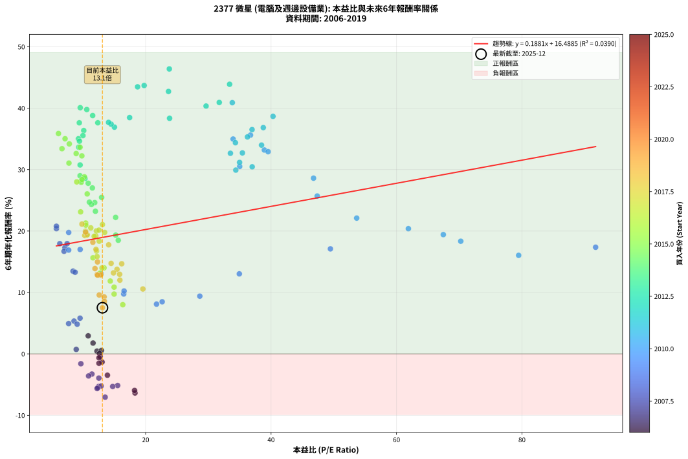
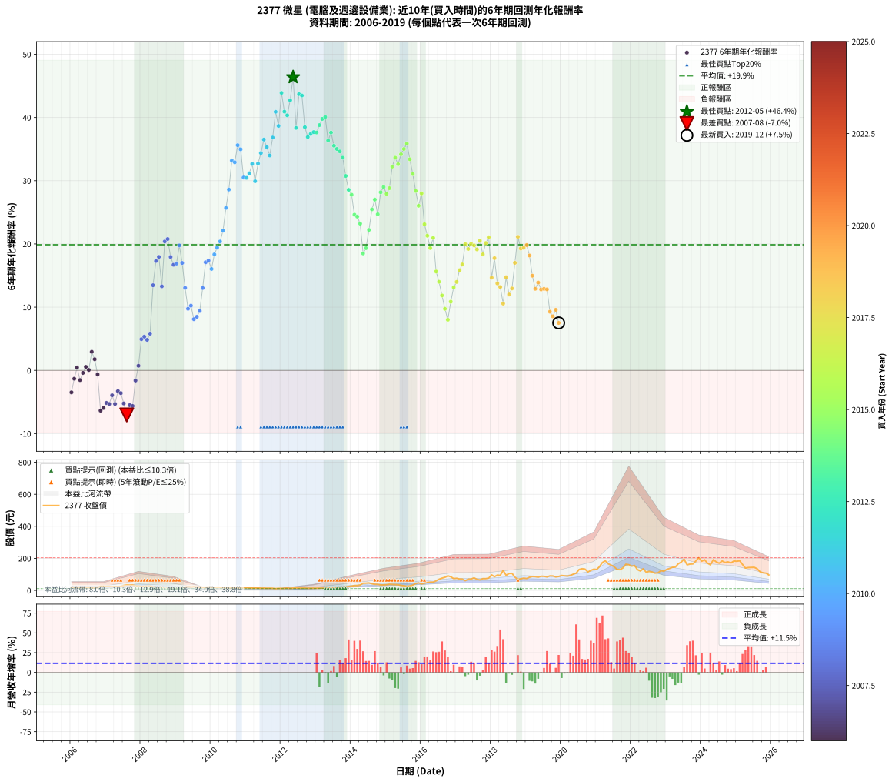

# 2377 微星 - 本益比與未來報酬率分析

!!! info "報告資訊"
    - **股票代號**: 2377
    - **公司名稱**: 微星
    - **產業別**: 電腦及週邊設備業
    - **分析期間**: 2006-2019 (168 個數據點)
    - **資料來源**: Type 12 (ShowMonthlyK_ChartFlow) 月收盤價與本益比
    - **報酬率口徑**: 含現金股利 (簡化: 年度合計，假設每年7/1入帳)
    - **報告生成時間**: 2026-01-10 18:32:48 CST

## 📈 視覺化圖表

### 圖表1: 本益比 vs 未來報酬率關係

*圖表1：2377 微星 本益比與6年期未來報酬率關係 (2006-2019)*

### 圖表2: 歷年買入時點的6年期實際報酬率

*圖表2：2377 微星 歷年買入時點的6年期實際報酬率 (2006-2019)*

## 📍 買點訊號說明

本報告提供兩種買點提示訊號（顯示於圖表2的股價子圖中）：

### ▲ 小綠色三角形（回測驗證）
- **計算方式**: 使用全部歷史資料計算本益比第25百分位數
- **用途**: 事後驗證，顯示歷史上哪些時點確實為低估區
- **限制**: 當下無法判斷，僅供回測參考
- **特性**: 後見之明（Look-Ahead Bias）

### ▲ 小橘色三角形（即時訊號）
- **計算方式**: 使用截至當月的過去5年資料計算本益比第25百分位數
- **用途**: 實際投資決策，當時即可判斷
- **優勢**: 可操作性強，符合實務需求
- **特性**: 無後見之明，滾動窗口計算

!!! tip "如何使用兩種訊號"
    - **綠色▲** 幫助理解歷史估值機會，驗證策略有效性
    - **橘色▲** 可作為實際買進參考，但仍需搭配基本面分析
    - 兩種訊號重疊時，表示即時判斷與事後驗證一致，信心度較高
    - 僅有綠色▲時，表示當時無法判斷（需要未來資料才能確認）
    - 僅有橘色▲時，表示即時判斷為買點，但事後可能不是最佳時機

## 📊 估值分析摘要

| 指標 | 數值 |
|:---:|:---:|
| **目前本益比** (2019-12) | **13.12 倍** |
| **歷史平均本益比** | 17.97 倍 |
| **估值水準** | 🟢 相對低估 |
| **預期6年年化報酬率** | **+18.96%** |
| **歷史平均報酬率** | +19.87% |
| **相關係數 (R²)** | 0.0390 |
| **趨勢線斜率** | 0.1881 |

!!! abstract "核心洞察"
    目前本益比顯著低於歷史平均，預期未來報酬率可能較高

    根據歷史數據回測，2377 微星 在目前本益比 **13.1倍** 的估值水準下，
    預期未來6年年化報酬率約為 **+19.0%**。

    **重要提醒**: 本分析基於歷史數據統計，實際報酬率會受到公司基本面變化、產業趨勢、
    總體經濟環境等多重因素影響。R² = 0.04 表示本益比可解釋約 3.9% 的報酬率變異。

## 📈 歷史估值統計

### 最佳買點 (最高報酬率)

| 項目 | 數值 |
|:---:|:---:|
| 起始時間 | 2012-05 |
| 當時本益比 | 23.78 倍 |
| 起始價格 | 14.2 元 |
| 6年後價格 | 125.0 元 |
| **6年年化報酬率** | **+46.39%** |

### 最差買點 (最低報酬率)

| 項目 | 數值 |
|:---:|:---:|
| 起始時間 | 2007-08 |
| 當時本益比 | 13.55 倍 |
| 起始價格 | 34.1 元 |
| 6年後價格 | 17.6 元 |
| **6年年化報酬率** | **-7.05%** |

## 🎯 投資啟示

### 本益比與報酬率關係

趨勢線方程式: **y = 0.1881x + 16.4885**

!!! info "弱相關或正相關"
    本益比與未來報酬率相關性較弱。這可能表示該股票的報酬率更多受到
    公司成長性、產業趨勢等因素影響，而非估值水準。**需綜合考量多項指標**。

### 估值區間建議

基於歷史數據分析:

- **🟢 低估區** (P/E < 14.4): 預期報酬率較高，可考慮增加持股
- **🟡 合理區** (P/E 14.4-21.6): 預期報酬率符合長期趨勢，正常持有
- **🔴 高估區** (P/E > 21.6): 預期報酬率較低，可考慮減碼或觀望

!!! danger "風險提示"
    - 過去表現不代表未來結果
    - 本分析假設公司基本面無重大結構性變化
    - 產業環境劇變可能使歷史規律失效
    - 應結合公司財報、產業趨勢、總體經濟等多重因素綜合判斷

!!! success "長期投資觀點"
    歷史數據顯示，在合理或低估的估值水準買入並長期持有，
    往往能獲得較佳的投資報酬。**耐心等待好價格**是價值投資的核心原則。

## 📊 數據品質

- **資料來源**: GoodInfo.tw Type 12 (ShowMonthlyK_ChartFlow)
- **資料頻率**: 月度收盤價與本益比
- **回測期間**: 2006-2019
- **數據點數量**: 168 個 (每個點代表一次6年期回測)

### 計算方法說明

1. **6年期年化報酬率**:
   - 對每個歷史時點，計算其後6年的實際投資報酬率
   - 期末價值(不含股利): 期末價格
   - 期末價值(含現金股利): 期末價格 + 持有期間內的現金股利合計 (簡化: 年度合計，假設每年7/1入帳)
   - 公式: 年化報酬率 = [(期末價值/期初價格)^(1/年數) - 1] × 100%

2. **本益比 (P/E Ratio)**:
   - 使用當時的月收盤價與EPS計算
   - 資料來源: Type 12 月度河流圖本益比數據

3. **趨勢線 (Linear Regression)**:
   - 使用最小平方法擬合線性趨勢線
   - R²值衡量本益比對報酬率的解釋能力

---

*本報告由 Stock Analysis System v1.9.0 自動生成*
*數據更新時間: 2026-01-10 18:32:48 CST*

## 📋 月度回測明細表

（每一列對應時間線圖中的一個買入點；可用來對照 SVG 圖上的每個點。）

| 買入月份 | 賣出月份 | 回測期限_年 | 實際持有年數 | 買入本益比_倍 | 買入收盤價_元 | 賣出收盤價_元 | 現金股利合計_元 | 總報酬率_pct | 年化報酬率_pct |
| --- | --- | --- | --- | --- | --- | --- | --- | --- | --- |
| 2006-01 | 2012-01 | 6 | 5.999 | 13.91 | 19.75 | 12.55 | 3.42 | -19.12 | -3.48 |
| 2006-02 | 2012-02 | 6 | 5.999 | 13.06 | 18.55 | 13.70 | 3.42 | -7.69 | -1.32 |
| 2006-03 | 2012-03 | 6 | 6.001 | 12.25 | 17.40 | 14.45 | 3.42 | +2.72 | +0.45 |
| 2006-04 | 2012-04 | 6 | 6.001 | 12.57 | 17.85 | 12.85 | 3.42 | -8.83 | -1.53 |
| 2006-05 | 2012-05 | 6 | 6.001 | 12.75 | 18.10 | 14.25 | 3.42 | -2.35 | -0.40 |
| 2006-06 | 2012-06 | 6 | 6.001 | 12.96 | 18.40 | 15.60 | 3.42 | +3.39 | +0.56 |
| 2006-07 | 2012-07 | 6 | 6.001 | 12.64 | 17.95 | 14.05 | 3.97 | +0.40 | +0.07 |
| 2006-08 | 2012-08 | 6 | 6.001 | 10.85 | 15.40 | 14.35 | 3.97 | +18.97 | +2.94 |
| 2006-09 | 2012-09 | 6 | 6.001 | 11.62 | 16.50 | 14.35 | 3.97 | +11.04 | +1.76 |
| 2006-10 | 2012-10 | 6 | 6.001 | 12.57 | 17.85 | 13.20 | 3.97 | -3.80 | -0.64 |
| 2006-11 | 2012-11 | 6 | 6.001 | 18.31 | 26.00 | 13.55 | 3.97 | -32.61 | -6.37 |
| 2006-12 | 2012-12 | 6 | 6.001 | 18.24 | 25.90 | 13.95 | 3.97 | -30.81 | -5.95 |
| 2007-01 | 2013-01 | 6 | 6.001 | 15.54 | 24.20 | 13.65 | 3.97 | -27.19 | -5.15 |
| 2007-02 | 2013-02 | 6 | 6.001 | 14.75 | 25.00 | 14.05 | 3.97 | -27.92 | -5.31 |
| 2007-03 | 2013-03 | 6 | 6.001 | 12.55 | 23.00 | 14.10 | 3.97 | -21.43 | -3.94 |
| 2007-04 | 2013-04 | 6 | 6.001 | 12.51 | 24.65 | 13.80 | 3.97 | -27.91 | -5.31 |
| 2007-05 | 2013-05 | 6 | 6.001 | 11.44 | 24.10 | 15.75 | 3.97 | -18.17 | -3.29 |
| 2007-06 | 2013-06 | 6 | 6.001 | 10.91 | 24.50 | 15.70 | 3.97 | -19.71 | -3.59 |
| 2007-07 | 2013-07 | 6 | 6.001 | 12.91 | 30.75 | 17.80 | 4.47 | -27.57 | -5.23 |
| 2007-08 | 2013-08 | 6 | 6.001 | 13.55 | 34.15 | 17.55 | 4.47 | -35.51 | -7.05 |
| 2007-09 | 2013-09 | 6 | 6.001 | 12.38 | 32.90 | 18.95 | 4.47 | -28.81 | -5.50 |
| 2007-10 | 2013-10 | 6 | 6.001 | 12.27 | 34.30 | 19.75 | 4.47 | -29.38 | -5.63 |
| 2007-11 | 2013-11 | 6 | 6.001 | 9.68 | 28.40 | 21.30 | 4.47 | -9.25 | -1.60 |
| 2007-12 | 2013-12 | 6 | 6.001 | 8.94 | 27.45 | 24.20 | 4.47 | +4.46 | +0.73 |
| 2008-01 | 2014-01 | 6 | 6.001 | 7.73 | 23.20 | 26.50 | 4.47 | +33.50 | +4.93 |
| 2008-02 | 2014-03 | 6 | 6.081 | 8.59 | 25.20 | 30.10 | 4.47 | +37.19 | +5.34 |
| 2008-03 | 2014-03 | 6 | 5.999 | 9.09 | 26.05 | 30.10 | 4.47 | +32.72 | +4.83 |
| 2008-04 | 2014-04 | 6 | 5.999 | 9.55 | 26.70 | 33.00 | 4.47 | +40.35 | +5.81 |
| 2008-05 | 2014-05 | 6 | 5.999 | 8.43 | 23.00 | 44.60 | 4.47 | +113.36 | +13.47 |
| 2008-06 | 2014-06 | 6 | 5.999 | 7.14 | 19.00 | 45.00 | 4.47 | +160.38 | +17.30 |
| 2008-07 | 2014-07 | 6 | 5.999 | 7.49 | 19.40 | 46.55 | 5.67 | +169.19 | +17.95 |
| 2008-08 | 2014-08 | 6 | 5.999 | 8.76 | 22.10 | 41.05 | 5.67 | +111.42 | +13.29 |
| 2008-09 | 2014-09 | 6 | 5.999 | 5.78 | 14.20 | 37.55 | 5.67 | +204.39 | +20.39 |
| 2008-10 | 2014-10 | 6 | 5.999 | 5.78 | 13.80 | 37.15 | 5.67 | +210.31 | +20.78 |
| 2008-11 | 2014-11 | 6 | 5.999 | 6.32 | 14.65 | 33.75 | 5.67 | +169.10 | +17.94 |
| 2008-12 | 2014-12 | 6 | 5.999 | 7.00 | 15.75 | 34.10 | 5.67 | +152.53 | +16.70 |
| 2009-01 | 2015-01 | 6 | 5.999 | 7.73 | 16.10 | 35.40 | 5.67 | +155.11 | +16.90 |
| 2009-02 | 2015-02 | 6 | 5.999 | 7.74 | 14.80 | 38.00 | 5.67 | +195.09 | +19.77 |
| 2009-03 | 2015-03 | 6 | 5.999 | 9.57 | 16.70 | 37.15 | 5.67 | +156.43 | +17.00 |
| 2009-04 | 2015-04 | 6 | 5.999 | 12.88 | 20.30 | 36.70 | 5.67 | +108.73 | +13.05 |
| 2009-05 | 2015-05 | 6 | 5.999 | 16.51 | 23.25 | 34.95 | 5.67 | +74.72 | +9.75 |
| 2009-06 | 2015-06 | 6 | 5.999 | 16.57 | 20.55 | 31.20 | 5.67 | +79.43 | +10.24 |
| 2009-07 | 2015-07 | 6 | 5.999 | 21.74 | 23.30 | 29.00 | 8.17 | +59.55 | +8.10 |
| 2009-08 | 2015-08 | 6 | 5.999 | 22.64 | 20.45 | 25.15 | 8.17 | +62.95 | +8.48 |
| 2009-09 | 2015-09 | 6 | 5.999 | 28.64 | 21.05 | 27.90 | 8.17 | +71.37 | +9.40 |
| 2009-10 | 2015-10 | 6 | 5.999 | 34.94 | 19.80 | 33.10 | 8.17 | +108.45 | +13.03 |
| 2009-11 | 2015-11 | 6 | 5.999 | 49.46 | 19.70 | 42.60 | 8.17 | +157.74 | +17.10 |
| 2009-12 | 2015-12 | 6 | 5.999 | 91.74 | 21.10 | 46.95 | 8.17 | +161.25 | +17.36 |
| 2010-01 | 2016-01 | 6 | 5.999 | 79.47 | 20.00 | 40.65 | 8.17 | +144.12 | +16.04 |
| 2010-02 | 2016-02 | 6 | 5.999 | 70.24 | 19.20 | 44.55 | 8.17 | +174.60 | +18.34 |
| 2010-03 | 2016-03 | 6 | 6.001 | 67.46 | 19.90 | 49.55 | 8.17 | +190.07 | +19.42 |
| 2010-04 | 2016-04 | 6 | 6.001 | 61.89 | 19.60 | 51.50 | 8.17 | +204.46 | +20.38 |
| 2010-05 | 2016-05 | 6 | 6.001 | 53.65 | 18.15 | 52.00 | 8.17 | +231.54 | +22.11 |
| 2010-06 | 2016-06 | 6 | 6.001 | 47.36 | 17.05 | 59.10 | 8.17 | +294.57 | +25.70 |
| 2010-07 | 2016-07 | 6 | 6.001 | 46.77 | 17.85 | 69.60 | 11.17 | +352.52 | +28.60 |
| 2010-08 | 2016-08 | 6 | 6.001 | 38.93 | 15.70 | 76.50 | 11.17 | +458.43 | +33.19 |
| 2010-09 | 2016-09 | 6 | 6.001 | 39.53 | 16.80 | 81.50 | 11.17 | +451.63 | +32.92 |
| 2010-10 | 2016-10 | 6 | 6.001 | 36.72 | 16.40 | 90.90 | 11.17 | +522.40 | +35.62 |
| 2010-11 | 2016-11 | 6 | 6.001 | 33.95 | 15.90 | 85.00 | 11.17 | +504.87 | +34.97 |
| 2010-12 | 2016-12 | 6 | 6.001 | 35.00 | 17.15 | 73.60 | 11.17 | +394.31 | +30.51 |
| 2011-01 | 2017-01 | 6 | 6.001 | 36.99 | 17.60 | 75.60 | 11.17 | +393.03 | +30.45 |
| 2011-02 | 2017-02 | 6 | 6.001 | 34.98 | 16.15 | 71.10 | 11.17 | +409.44 | +31.17 |
| 2011-03 | 2017-03 | 6 | 6.001 | 33.52 | 15.00 | 70.60 | 11.17 | +445.16 | +32.66 |
| 2011-04 | 2017-04 | 6 | 6.001 | 34.38 | 14.90 | 60.50 | 11.17 | +381.03 | +29.92 |
| 2011-05 | 2017-05 | 6 | 6.001 | 35.43 | 14.85 | 70.00 | 11.17 | +446.63 | +32.72 |
| 2011-06 | 2017-06 | 6 | 6.001 | 34.32 | 13.90 | 70.70 | 11.17 | +489.02 | +34.38 |
| 2011-07 | 2017-07 | 6 | 6.001 | 36.97 | 14.45 | 78.40 | 15.15 | +547.38 | +36.51 |
| 2011-08 | 2017-08 | 6 | 6.001 | 36.24 | 13.65 | 68.70 | 15.15 | +514.26 | +35.32 |
| 2011-09 | 2017-09 | 6 | 6.001 | 38.48 | 13.95 | 65.60 | 15.15 | +478.83 | +33.99 |
| 2011-10 | 2017-10 | 6 | 6.001 | 38.76 | 13.50 | 73.50 | 15.15 | +556.64 | +36.83 |
| 2011-11 | 2017-11 | 6 | 6.001 | 33.82 | 11.30 | 73.30 | 15.15 | +682.72 | +40.90 |
| 2011-12 | 2017-12 | 6 | 6.001 | 40.31 | 12.90 | 76.60 | 15.15 | +611.22 | +38.67 |
| 2012-01 | 2018-01 | 6 | 6.001 | 33.39 | 12.55 | 96.30 | 15.15 | +788.02 | +43.89 |
| 2012-02 | 2018-03 | 6 | 6.081 | 31.74 | 13.70 | 95.20 | 15.15 | +705.45 | +40.93 |
| 2012-03 | 2018-03 | 6 | 5.999 | 29.64 | 14.45 | 95.20 | 15.15 | +663.65 | +40.34 |
| 2012-04 | 2018-04 | 6 | 5.999 | 23.65 | 12.85 | 93.40 | 15.15 | +744.72 | +42.72 |
| 2012-05 | 2018-05 | 6 | 5.999 | 23.78 | 14.25 | 125.00 | 15.15 | +883.49 | +46.39 |
| 2012-06 | 2018-06 | 6 | 5.999 | 23.82 | 15.60 | 94.20 | 15.15 | +600.94 | +38.35 |
| 2012-07 | 2018-07 | 6 | 5.999 | 19.77 | 14.05 | 105.00 | 18.60 | +779.72 | +43.69 |
| 2012-08 | 2018-08 | 6 | 5.999 | 18.72 | 14.35 | 106.50 | 18.60 | +771.78 | +43.47 |
| 2012-09 | 2018-09 | 6 | 5.999 | 17.45 | 14.35 | 82.50 | 18.60 | +604.53 | +38.47 |
| 2012-10 | 2018-10 | 6 | 5.999 | 15.03 | 13.20 | 68.30 | 18.60 | +558.33 | +36.91 |
| 2012-11 | 2018-11 | 6 | 5.999 | 14.50 | 13.55 | 72.50 | 18.60 | +572.32 | +37.39 |
| 2012-12 | 2018-12 | 6 | 5.999 | 14.09 | 13.95 | 76.40 | 18.60 | +581.00 | +37.69 |
| 2013-01 | 2019-01 | 6 | 5.999 | 12.38 | 13.65 | 74.10 | 18.60 | +579.12 | +37.62 |
| 2013-02 | 2019-02 | 6 | 5.999 | 11.56 | 14.05 | 81.80 | 18.60 | +614.59 | +38.80 |
| 2013-03 | 2019-03 | 6 | 5.999 | 10.62 | 14.10 | 86.50 | 18.60 | +645.39 | +39.78 |
| 2013-04 | 2019-04 | 6 | 5.999 | 9.58 | 13.80 | 85.60 | 18.60 | +655.07 | +40.08 |
| 2013-05 | 2019-05 | 6 | 5.999 | 10.14 | 15.75 | 82.60 | 18.60 | +542.54 | +36.36 |
| 2013-06 | 2019-06 | 6 | 5.999 | 9.43 | 15.70 | 88.00 | 18.60 | +578.98 | +37.62 |
| 2013-07 | 2019-07 | 6 | 5.999 | 10.01 | 17.80 | 87.80 | 22.50 | +519.66 | +35.54 |
| 2013-08 | 2019-08 | 6 | 5.999 | 9.29 | 17.55 | 83.80 | 22.50 | +505.70 | +35.02 |
| 2013-09 | 2019-09 | 6 | 5.999 | 9.46 | 18.95 | 90.30 | 22.50 | +495.25 | +34.63 |
| 2013-10 | 2019-10 | 6 | 5.999 | 9.34 | 19.75 | 90.00 | 22.50 | +469.62 | +33.65 |
| 2013-11 | 2019-11 | 6 | 5.999 | 9.56 | 21.30 | 83.90 | 22.50 | +399.53 | +30.75 |
| 2013-12 | 2019-12 | 6 | 5.999 | 10.34 | 24.20 | 86.70 | 22.50 | +351.24 | +28.56 |
| 2014-01 | 2020-01 | 6 | 5.999 | 10.85 | 26.50 | 92.80 | 22.50 | +335.09 | +27.78 |
| 2014-02 | 2020-02 | 6 | 5.999 | 11.89 | 30.25 | 90.80 | 22.50 | +274.55 | +24.63 |
| 2014-03 | 2020-03 | 6 | 6.001 | 11.37 | 30.10 | 88.70 | 22.50 | +269.44 | +24.33 |
| 2014-04 | 2020-04 | 6 | 6.001 | 12.00 | 33.00 | 93.00 | 22.50 | +250.00 | +23.21 |
| 2014-05 | 2020-05 | 6 | 6.001 | 15.64 | 44.60 | 101.00 | 22.50 | +176.91 | +18.50 |
| 2014-06 | 2020-06 | 6 | 6.001 | 15.23 | 45.00 | 107.50 | 22.50 | +188.89 | +19.34 |
| 2014-07 | 2020-07 | 6 | 6.001 | 15.22 | 46.55 | 130.50 | 24.70 | +233.40 | +22.22 |
| 2014-08 | 2020-08 | 6 | 6.001 | 12.99 | 41.05 | 135.50 | 24.70 | +290.26 | +25.47 |
| 2014-09 | 2020-09 | 6 | 6.001 | 11.51 | 37.55 | 133.00 | 24.70 | +319.97 | +27.01 |
| 2014-10 | 2020-10 | 6 | 6.001 | 11.04 | 37.15 | 115.00 | 24.70 | +276.04 | +24.70 |
| 2014-11 | 2020-11 | 6 | 6.001 | 9.73 | 33.75 | 125.00 | 24.70 | +343.56 | +28.17 |
| 2014-12 | 2020-12 | 6 | 6.001 | 9.55 | 34.10 | 132.50 | 24.70 | +361.00 | +29.00 |
| 2015-01 | 2021-01 | 6 | 6.001 | 9.73 | 35.40 | 130.50 | 24.70 | +338.42 | +27.93 |
| 2015-02 | 2021-02 | 6 | 6.001 | 10.25 | 38.00 | 149.00 | 24.70 | +357.11 | +28.82 |
| 2015-03 | 2021-03 | 6 | 6.001 | 9.84 | 37.15 | 174.00 | 24.70 | +434.86 | +32.23 |
| 2015-04 | 2021-04 | 6 | 6.001 | 9.55 | 36.70 | 184.50 | 24.70 | +470.03 | +33.65 |
| 2015-05 | 2021-05 | 6 | 6.001 | 8.93 | 34.95 | 165.50 | 24.70 | +444.21 | +32.62 |
| 2015-06 | 2021-06 | 6 | 6.001 | 7.84 | 31.20 | 157.50 | 24.70 | +483.97 | +34.18 |
| 2015-07 | 2021-07 | 6 | 6.001 | 7.16 | 29.00 | 148.00 | 27.80 | +506.21 | +35.02 |
| 2015-08 | 2021-08 | 6 | 6.001 | 6.11 | 25.15 | 130.50 | 27.80 | +529.42 | +35.87 |
| 2015-09 | 2021-09 | 6 | 6.001 | 6.67 | 27.90 | 129.50 | 27.80 | +463.80 | +33.40 |
| 2015-10 | 2021-10 | 6 | 6.001 | 7.78 | 33.10 | 140.00 | 27.80 | +406.95 | +31.06 |
| 2015-11 | 2021-11 | 6 | 6.001 | 9.86 | 42.60 | 163.00 | 27.80 | +347.89 | +28.38 |
| 2015-12 | 2021-12 | 6 | 6.001 | 10.69 | 46.95 | 160.50 | 27.80 | +301.06 | +26.04 |
| 2016-01 | 2022-01 | 6 | 6.001 | 9.02 | 40.65 | 151.00 | 27.80 | +339.85 | +28.00 |
| 2016-02 | 2022-03 | 6 | 6.081 | 9.64 | 44.55 | 130.00 | 27.80 | +254.21 | +23.12 |
| 2016-03 | 2022-03 | 6 | 5.999 | 10.45 | 49.55 | 130.00 | 27.80 | +218.47 | +21.30 |
| 2016-04 | 2022-04 | 6 | 5.999 | 10.60 | 51.50 | 121.00 | 27.80 | +188.93 | +19.35 |
| 2016-05 | 2022-05 | 6 | 5.999 | 10.46 | 52.00 | 135.00 | 27.80 | +213.08 | +20.96 |
| 2016-06 | 2022-06 | 6 | 5.999 | 11.61 | 59.10 | 113.50 | 27.80 | +139.09 | +15.64 |
| 2016-07 | 2022-07 | 6 | 5.999 | 13.37 | 69.60 | 118.00 | 34.80 | +119.54 | +14.01 |
| 2016-08 | 2022-08 | 6 | 5.999 | 14.37 | 76.50 | 115.00 | 34.80 | +95.82 | +11.85 |
| 2016-09 | 2022-09 | 6 | 5.999 | 14.98 | 81.50 | 107.50 | 34.80 | +74.60 | +9.74 |
| 2016-10 | 2022-10 | 6 | 5.999 | 16.36 | 90.90 | 109.50 | 34.80 | +58.75 | +8.01 |
| 2016-11 | 2022-11 | 6 | 5.999 | 14.98 | 85.00 | 123.00 | 34.80 | +85.65 | +10.86 |
| 2016-12 | 2022-12 | 6 | 5.999 | 12.71 | 73.60 | 119.50 | 34.80 | +109.65 | +13.13 |
| 2017-01 | 2023-01 | 6 | 5.999 | 13.05 | 75.60 | 131.00 | 34.80 | +119.31 | +13.99 |
| 2017-02 | 2023-02 | 6 | 5.999 | 12.26 | 71.10 | 137.00 | 34.80 | +141.63 | +15.84 |
| 2017-03 | 2023-03 | 6 | 5.999 | 12.17 | 70.60 | 144.00 | 34.80 | +153.26 | +16.76 |
| 2017-04 | 2023-04 | 6 | 5.999 | 10.42 | 60.50 | 145.50 | 34.80 | +198.02 | +19.97 |
| 2017-05 | 2023-05 | 6 | 5.999 | 12.05 | 70.00 | 166.00 | 34.80 | +186.86 | +19.21 |
| 2017-06 | 2023-06 | 6 | 5.999 | 12.16 | 70.70 | 176.50 | 34.80 | +198.87 | +20.02 |
| 2017-07 | 2023-07 | 6 | 5.999 | 13.47 | 78.40 | 194.50 | 36.90 | +195.15 | +19.77 |
| 2017-08 | 2023-08 | 6 | 5.999 | 11.80 | 68.70 | 159.50 | 36.90 | +185.88 | +19.14 |
| 2017-09 | 2023-09 | 6 | 5.999 | 11.26 | 65.60 | 164.00 | 36.90 | +206.25 | +20.51 |
| 2017-10 | 2023-10 | 6 | 5.999 | 12.60 | 73.50 | 165.00 | 36.90 | +174.69 | +18.35 |
| 2017-11 | 2023-11 | 6 | 5.999 | 12.56 | 73.30 | 183.50 | 36.90 | +200.68 | +20.14 |
| 2017-12 | 2023-12 | 6 | 5.999 | 13.12 | 76.60 | 204.00 | 36.90 | +214.49 | +21.05 |
| 2018-01 | 2024-01 | 6 | 5.999 | 16.19 | 96.30 | 182.00 | 36.90 | +127.31 | +14.67 |
| 2018-02 | 2024-02 | 6 | 5.999 | 14.11 | 85.50 | 191.00 | 36.90 | +166.55 | +17.75 |
| 2018-03 | 2024-03 | 6 | 6.001 | 15.44 | 95.20 | 169.50 | 36.90 | +116.81 | +13.76 |
| 2018-04 | 2024-04 | 6 | 6.001 | 14.88 | 93.40 | 159.50 | 36.90 | +110.28 | +13.18 |
| 2018-05 | 2024-05 | 6 | 6.001 | 19.57 | 125.00 | 191.50 | 36.90 | +82.72 | +10.57 |
| 2018-06 | 2024-06 | 6 | 6.001 | 14.50 | 94.20 | 178.00 | 36.90 | +128.13 | +14.73 |
| 2018-07 | 2024-07 | 6 | 6.001 | 15.90 | 105.00 | 169.50 | 37.80 | +97.43 | +12.00 |
| 2018-08 | 2024-08 | 6 | 6.001 | 15.86 | 106.50 | 183.50 | 37.80 | +107.79 | +12.96 |
| 2018-09 | 2024-09 | 6 | 6.001 | 12.09 | 82.50 | 174.00 | 37.80 | +156.73 | +17.01 |
| 2018-10 | 2024-10 | 6 | 6.001 | 9.85 | 68.30 | 178.00 | 37.80 | +215.96 | +21.13 |
| 2018-11 | 2024-11 | 6 | 6.001 | 10.30 | 72.50 | 171.00 | 37.80 | +188.00 | +19.27 |
| 2018-12 | 2024-12 | 6 | 6.001 | 10.69 | 76.40 | 183.50 | 37.80 | +189.66 | +19.39 |
| 2019-01 | 2025-01 | 6 | 6.001 | 10.43 | 74.10 | 181.50 | 37.80 | +195.95 | +19.82 |
| 2019-02 | 2025-02 | 6 | 6.001 | 11.59 | 81.80 | 185.00 | 37.80 | +172.37 | +18.17 |
| 2019-03 | 2025-03 | 6 | 6.001 | 12.33 | 86.50 | 162.00 | 37.80 | +130.98 | +14.97 |
| 2019-04 | 2025-04 | 6 | 6.001 | 12.28 | 85.60 | 139.50 | 37.80 | +107.13 | +12.90 |
| 2019-05 | 2025-05 | 6 | 6.001 | 11.93 | 82.60 | 142.50 | 37.80 | +118.28 | +13.89 |
| 2019-06 | 2025-06 | 6 | 6.001 | 12.79 | 88.00 | 143.50 | 37.80 | +106.02 | +12.80 |
| 2019-07 | 2025-07 | 6 | 6.001 | 12.85 | 87.80 | 144.00 | 37.80 | +107.06 | +12.89 |
| 2019-08 | 2025-08 | 6 | 6.001 | 12.34 | 83.80 | 135.00 | 37.80 | +106.21 | +12.82 |
| 2019-09 | 2025-09 | 6 | 6.001 | 13.39 | 90.30 | 116.00 | 37.80 | +70.32 | +9.28 |
| 2019-10 | 2025-10 | 6 | 6.001 | 13.43 | 90.00 | 109.50 | 37.80 | +63.67 | +8.56 |
| 2019-11 | 2025-11 | 6 | 6.001 | 12.61 | 83.90 | 107.50 | 37.80 | +73.18 | +9.58 |
| 2019-12 | 2025-12 | 6 | 6.001 | 13.12 | 86.70 | 96.10 | 37.80 | +54.44 | +7.51 |
