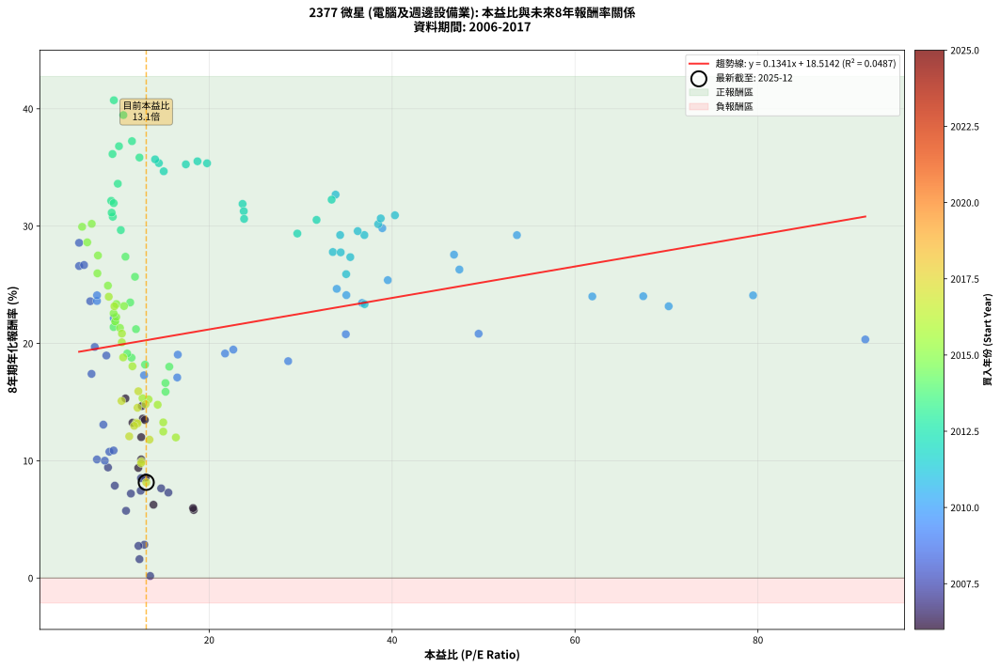

# 2377 微星 - 本益比與未來報酬率分析

!!! info "報告資訊"
    - **股票代號**: 2377
    - **公司名稱**: 微星
    - **產業別**: 電腦及週邊設備業
    - **分析期間**: 2006-2017 (144 個數據點)
    - **資料來源**: Type 12 (ShowMonthlyK_ChartFlow) 月收盤價與本益比
    - **報酬率口徑**: 含現金股利 (簡化: 年度合計，假設每年7/1入帳)
    - **報告生成時間**: 2026-01-13 00:38:16 CST

## 📈 視覺化圖表

### 圖表1: 本益比 vs 未來報酬率關係

*圖表1：2377 微星 本益比與8年期未來報酬率關係 (2006-2017)*

### 圖表2: 歷年買入時點的8年期實際報酬率

*圖表2：2377 微星 歷年買入時點的8年期實際報酬率 (2006-2017)*

## 📍 買點訊號說明

本報告提供兩種買點提示訊號（顯示於圖表2的股價子圖中）：

### ▲ 小綠色三角形（回測驗證）
- **計算方式**: 使用全部歷史資料計算本益比第25百分位數
- **用途**: 事後驗證，顯示歷史上哪些時點確實為低估區
- **限制**: 當下無法判斷，僅供回測參考
- **特性**: 後見之明（Look-Ahead Bias）

### ▲ 小橘色三角形（即時訊號）
- **計算方式**: 使用截至當月的過去5年資料計算本益比第25百分位數
- **用途**: 實際投資決策，當時即可判斷
- **優勢**: 可操作性強，符合實務需求
- **特性**: 無後見之明，滾動窗口計算

!!! tip "如何使用兩種訊號"
    - **綠色▲** 幫助理解歷史估值機會，驗證策略有效性
    - **橘色▲** 可作為實際買進參考，但仍需搭配基本面分析
    - 兩種訊號重疊時，表示即時判斷與事後驗證一致，信心度較高
    - 僅有綠色▲時，表示當時無法判斷（需要未來資料才能確認）
    - 僅有橘色▲時，表示即時判斷為買點，但事後可能不是最佳時機

## 📊 估值分析摘要

| 指標 | 數值 |
|:---:|:---:|
| **目前本益比** (2017-12) | **13.12 倍** |
| **歷史平均本益比** | 18.75 倍 |
| **估值水準** | 🟢 相對低估 |
| **預期8年年化報酬率** | **+20.27%** |
| **歷史平均報酬率** | +21.03% |
| **相關係數 (R²)** | 0.0487 |
| **趨勢線斜率** | 0.1341 |

!!! abstract "核心洞察"
    目前本益比顯著低於歷史平均，預期未來報酬率可能較高

    根據歷史數據回測，2377 微星 在目前本益比 **13.1倍** 的估值水準下，
    預期未來8年年化報酬率約為 **+20.3%**。

    **重要提醒**: 本分析基於歷史數據統計，實際報酬率會受到公司基本面變化、產業趨勢、
    總體經濟環境等多重因素影響。R² = 0.05 表示本益比可解釋約 4.9% 的報酬率變異。

## 📈 歷史估值統計

### 最佳買點 (最高報酬率)

| 項目 | 數值 |
|:---:|:---:|
| 起始時間 | 2013-04 |
| 當時本益比 | 9.58 倍 |
| 起始價格 | 13.8 元 |
| 8年後價格 | 184.5 元 |
| **8年年化報酬率** | **+40.73%** |

### 最差買點 (最低報酬率)

| 項目 | 數值 |
|:---:|:---:|
| 起始時間 | 2007-08 |
| 當時本益比 | 13.55 倍 |
| 起始價格 | 34.1 元 |
| 8年後價格 | 25.1 元 |
| **8年年化報酬率** | **+0.17%** |

## 🎯 投資啟示

### 本益比與報酬率關係

趨勢線方程式: **y = 0.1341x + 18.5142**

!!! info "弱相關或正相關"
    本益比與未來報酬率相關性較弱。這可能表示該股票的報酬率更多受到
    公司成長性、產業趨勢等因素影響，而非估值水準。**需綜合考量多項指標**。

### 估值區間建議

基於歷史數據分析:

- **🟢 低估區** (P/E < 15.0): 預期報酬率較高，可考慮增加持股
- **🟡 合理區** (P/E 15.0-22.5): 預期報酬率符合長期趨勢，正常持有
- **🔴 高估區** (P/E > 22.5): 預期報酬率較低，可考慮減碼或觀望

!!! danger "風險提示"
    - 過去表現不代表未來結果
    - 本分析假設公司基本面無重大結構性變化
    - 產業環境劇變可能使歷史規律失效
    - 應結合公司財報、產業趨勢、總體經濟等多重因素綜合判斷

!!! success "長期投資觀點"
    歷史數據顯示，在合理或低估的估值水準買入並長期持有，
    往往能獲得較佳的投資報酬。**耐心等待好價格**是價值投資的核心原則。

## 📊 數據品質

- **資料來源**: GoodInfo.tw Type 12 (ShowMonthlyK_ChartFlow)
- **資料頻率**: 月度收盤價與本益比
- **回測期間**: 2006-2017
- **數據點數量**: 144 個 (每個點代表一次8年期回測)

### 計算方法說明

1. **8年期年化報酬率**:
   - 對每個歷史時點，計算其後8年的實際投資報酬率
   - 期末價值(不含股利): 期末價格
   - 期末價值(含現金股利): 期末價格 + 持有期間內的現金股利合計 (簡化: 年度合計，假設每年7/1入帳)
   - 公式: 年化報酬率 = [(期末價值/期初價格)^(1/年數) - 1] × 100%

2. **本益比 (P/E Ratio)**:
   - 使用當時的月收盤價與EPS計算
   - 資料來源: Type 12 月度河流圖本益比數據

3. **趨勢線 (Linear Regression)**:
   - 使用最小平方法擬合線性趨勢線
   - R²值衡量本益比對報酬率的解釋能力

---

*本報告由 Stock Analysis System v1.9.0 自動生成*
*數據更新時間: 2026-01-13 00:38:16 CST*

## 📋 月度回測明細表

（每一列對應時間線圖中的一個買入點；可用來對照 SVG 圖上的每個點。）

| 買入月份 | 賣出月份 | 回測期限_年 | 實際持有年數 | 買入本益比_倍 | 買入收盤價_元 | 賣出收盤價_元 | 現金股利合計_元 | 總報酬率_pct | 年化報酬率_pct |
| --- | --- | --- | --- | --- | --- | --- | --- | --- | --- |
| 2006-01 | 2014-01 | 8 | 8.000 | 13.91 | 19.75 | 26.50 | 5.57 | +62.38 | +6.25 |
| 2006-02 | 2014-02 | 8 | 8.000 | 13.06 | 18.55 | 30.25 | 5.57 | +93.11 | +8.57 |
| 2006-03 | 2014-03 | 8 | 8.000 | 12.25 | 17.40 | 30.10 | 5.57 | +105.01 | +9.39 |
| 2006-04 | 2014-04 | 8 | 8.000 | 12.57 | 17.85 | 33.00 | 5.57 | +116.08 | +10.11 |
| 2006-05 | 2014-05 | 8 | 8.000 | 12.75 | 18.10 | 44.60 | 5.57 | +177.19 | +13.59 |
| 2006-06 | 2014-06 | 8 | 8.000 | 12.96 | 18.40 | 45.00 | 5.57 | +174.84 | +13.47 |
| 2006-07 | 2014-07 | 8 | 8.000 | 12.64 | 17.95 | 46.55 | 7.07 | +198.72 | +14.66 |
| 2006-08 | 2014-08 | 8 | 8.000 | 10.85 | 15.40 | 41.05 | 7.07 | +212.47 | +15.31 |
| 2006-09 | 2014-09 | 8 | 8.000 | 11.62 | 16.50 | 37.55 | 7.07 | +170.43 | +13.24 |
| 2006-10 | 2014-10 | 8 | 8.000 | 12.57 | 17.85 | 37.15 | 7.07 | +147.74 | +12.01 |
| 2006-11 | 2014-11 | 8 | 8.000 | 18.31 | 26.00 | 33.75 | 7.07 | +57.00 | +5.80 |
| 2006-12 | 2014-12 | 8 | 8.000 | 18.24 | 25.90 | 34.10 | 7.07 | +58.96 | +5.96 |
| 2007-01 | 2015-01 | 8 | 8.000 | 15.54 | 24.20 | 35.40 | 7.07 | +75.50 | +7.28 |
| 2007-02 | 2015-02 | 8 | 8.000 | 14.75 | 25.00 | 38.00 | 7.07 | +80.28 | +7.65 |
| 2007-03 | 2015-03 | 8 | 8.000 | 12.55 | 23.00 | 37.15 | 7.07 | +92.27 | +8.51 |
| 2007-04 | 2015-04 | 8 | 8.000 | 12.51 | 24.65 | 36.70 | 7.07 | +77.57 | +7.44 |
| 2007-05 | 2015-05 | 8 | 8.000 | 11.44 | 24.10 | 34.95 | 7.07 | +74.36 | +7.20 |
| 2007-06 | 2015-06 | 8 | 8.000 | 10.91 | 24.50 | 31.20 | 7.07 | +56.21 | +5.73 |
| 2007-07 | 2015-07 | 8 | 8.000 | 12.91 | 30.75 | 29.00 | 9.47 | +25.12 | +2.84 |
| 2007-08 | 2015-08 | 8 | 8.000 | 13.55 | 34.15 | 25.15 | 9.47 | +1.39 | +0.17 |
| 2007-09 | 2015-09 | 8 | 8.000 | 12.38 | 32.90 | 27.90 | 9.47 | +13.60 | +1.61 |
| 2007-10 | 2015-10 | 8 | 8.000 | 12.27 | 34.30 | 33.10 | 9.47 | +24.12 | +2.74 |
| 2007-11 | 2015-11 | 8 | 8.000 | 9.68 | 28.40 | 42.60 | 9.47 | +83.36 | +7.87 |
| 2007-12 | 2015-12 | 8 | 8.000 | 8.94 | 27.45 | 46.95 | 9.47 | +105.55 | +9.42 |
| 2008-01 | 2016-01 | 8 | 8.000 | 7.73 | 23.20 | 40.65 | 9.47 | +116.05 | +10.11 |
| 2008-02 | 2016-02 | 8 | 8.000 | 8.59 | 25.20 | 44.55 | 9.47 | +114.38 | +10.00 |
| 2008-03 | 2016-03 | 8 | 8.000 | 9.09 | 26.05 | 49.55 | 9.47 | +126.58 | +10.76 |
| 2008-04 | 2016-04 | 8 | 8.000 | 9.55 | 26.70 | 51.50 | 9.47 | +128.36 | +10.87 |
| 2008-05 | 2016-05 | 8 | 8.000 | 8.43 | 23.00 | 52.00 | 9.47 | +167.27 | +13.08 |
| 2008-06 | 2016-06 | 8 | 8.000 | 7.14 | 19.00 | 59.10 | 9.47 | +260.91 | +17.40 |
| 2008-07 | 2016-07 | 8 | 8.000 | 7.49 | 19.40 | 69.60 | 12.17 | +321.51 | +19.70 |
| 2008-08 | 2016-08 | 8 | 8.000 | 8.76 | 22.10 | 76.50 | 12.17 | +301.24 | +18.97 |
| 2008-09 | 2016-09 | 8 | 8.000 | 5.78 | 14.20 | 81.50 | 12.17 | +559.67 | +26.59 |
| 2008-10 | 2016-10 | 8 | 8.000 | 5.78 | 13.80 | 90.90 | 12.17 | +646.91 | +28.58 |
| 2008-11 | 2016-11 | 8 | 8.000 | 6.32 | 14.65 | 85.00 | 12.17 | +563.30 | +26.68 |
| 2008-12 | 2016-12 | 8 | 8.000 | 7.00 | 15.75 | 73.60 | 12.17 | +444.59 | +23.60 |
| 2009-01 | 2017-01 | 8 | 8.000 | 7.73 | 16.10 | 75.60 | 12.17 | +445.17 | +23.61 |
| 2009-02 | 2017-02 | 8 | 8.000 | 7.74 | 14.80 | 71.10 | 12.17 | +462.66 | +24.10 |
| 2009-03 | 2017-03 | 8 | 8.000 | 9.57 | 16.70 | 70.60 | 12.17 | +395.65 | +22.15 |
| 2009-04 | 2017-04 | 8 | 8.000 | 12.88 | 20.30 | 60.50 | 12.17 | +258.00 | +17.28 |
| 2009-05 | 2017-05 | 8 | 8.000 | 16.51 | 23.25 | 70.00 | 12.17 | +253.43 | +17.09 |
| 2009-06 | 2017-06 | 8 | 8.000 | 16.57 | 20.55 | 70.70 | 12.17 | +303.27 | +19.04 |
| 2009-07 | 2017-07 | 8 | 8.000 | 21.74 | 23.30 | 78.40 | 16.17 | +305.90 | +19.14 |
| 2009-08 | 2017-08 | 8 | 8.000 | 22.64 | 20.45 | 68.70 | 16.17 | +315.03 | +19.47 |
| 2009-09 | 2017-09 | 8 | 8.000 | 28.64 | 21.05 | 65.60 | 16.17 | +288.48 | +18.49 |
| 2009-10 | 2017-10 | 8 | 8.000 | 34.94 | 19.80 | 73.50 | 16.17 | +352.90 | +20.78 |
| 2009-11 | 2017-11 | 8 | 8.000 | 49.46 | 19.70 | 73.30 | 16.17 | +354.18 | +20.82 |
| 2009-12 | 2017-12 | 8 | 8.000 | 91.74 | 21.10 | 76.60 | 16.17 | +339.69 | +20.34 |
| 2010-01 | 2018-01 | 8 | 8.000 | 79.47 | 20.00 | 96.30 | 16.17 | +462.37 | +24.09 |
| 2010-02 | 2018-02 | 8 | 8.000 | 70.24 | 19.20 | 85.50 | 16.17 | +429.55 | +23.17 |
| 2010-03 | 2018-03 | 8 | 8.000 | 67.46 | 19.90 | 95.20 | 16.17 | +459.67 | +24.02 |
| 2010-04 | 2018-04 | 8 | 8.000 | 61.89 | 19.60 | 93.40 | 16.17 | +459.05 | +24.00 |
| 2010-05 | 2018-05 | 8 | 8.000 | 53.65 | 18.15 | 125.00 | 16.17 | +677.82 | +29.23 |
| 2010-06 | 2018-06 | 8 | 8.000 | 47.36 | 17.05 | 94.20 | 16.17 | +547.35 | +26.30 |
| 2010-07 | 2018-07 | 8 | 8.000 | 46.77 | 17.85 | 105.00 | 20.17 | +601.25 | +27.57 |
| 2010-08 | 2018-08 | 8 | 8.000 | 38.93 | 15.70 | 106.50 | 20.17 | +706.84 | +29.82 |
| 2010-09 | 2018-09 | 8 | 8.000 | 39.53 | 16.80 | 82.50 | 20.17 | +511.15 | +25.39 |
| 2010-10 | 2018-10 | 8 | 8.000 | 36.72 | 16.40 | 68.30 | 20.17 | +439.48 | +23.45 |
| 2010-11 | 2018-11 | 8 | 8.000 | 33.95 | 15.90 | 72.50 | 20.17 | +482.86 | +24.65 |
| 2010-12 | 2018-12 | 8 | 8.000 | 35.00 | 17.15 | 76.40 | 20.17 | +463.11 | +24.12 |
| 2011-01 | 2019-01 | 8 | 8.000 | 36.99 | 17.60 | 74.10 | 20.17 | +435.65 | +23.34 |
| 2011-02 | 2019-02 | 8 | 8.000 | 34.98 | 16.15 | 81.80 | 20.17 | +531.42 | +25.90 |
| 2011-03 | 2019-03 | 8 | 8.000 | 33.52 | 15.00 | 86.50 | 20.17 | +611.16 | +27.79 |
| 2011-04 | 2019-04 | 8 | 8.000 | 34.38 | 14.90 | 85.60 | 20.17 | +609.89 | +27.76 |
| 2011-05 | 2019-05 | 8 | 8.000 | 35.43 | 14.85 | 82.60 | 20.17 | +592.08 | +27.36 |
| 2011-06 | 2019-06 | 8 | 8.000 | 34.32 | 13.90 | 88.00 | 20.17 | +678.23 | +29.24 |
| 2011-07 | 2019-07 | 8 | 8.000 | 36.97 | 14.45 | 87.80 | 24.65 | +678.18 | +29.24 |
| 2011-08 | 2019-08 | 8 | 8.000 | 36.24 | 13.65 | 83.80 | 24.65 | +694.48 | +29.57 |
| 2011-09 | 2019-09 | 8 | 8.000 | 38.48 | 13.95 | 90.30 | 24.65 | +723.99 | +30.16 |
| 2011-10 | 2019-10 | 8 | 8.000 | 38.76 | 13.50 | 90.00 | 24.65 | +749.24 | +30.66 |
| 2011-11 | 2019-11 | 8 | 8.000 | 33.82 | 11.30 | 83.90 | 24.65 | +860.59 | +32.68 |
| 2011-12 | 2019-12 | 8 | 8.000 | 40.31 | 12.90 | 86.70 | 24.65 | +763.16 | +30.92 |
| 2012-01 | 2020-01 | 8 | 8.000 | 33.39 | 12.55 | 92.80 | 24.65 | +835.83 | +32.25 |
| 2012-02 | 2020-02 | 8 | 8.000 | 31.74 | 13.70 | 90.80 | 24.65 | +742.68 | +30.53 |
| 2012-03 | 2020-03 | 8 | 8.000 | 29.64 | 14.45 | 88.70 | 24.65 | +684.41 | +29.37 |
| 2012-04 | 2020-04 | 8 | 8.000 | 23.65 | 12.85 | 93.00 | 24.65 | +815.54 | +31.89 |
| 2012-05 | 2020-05 | 8 | 8.000 | 23.78 | 14.25 | 101.00 | 24.65 | +781.73 | +31.27 |
| 2012-06 | 2020-06 | 8 | 8.000 | 23.82 | 15.60 | 107.50 | 24.65 | +747.10 | +30.61 |
| 2012-07 | 2020-07 | 8 | 8.000 | 19.77 | 14.05 | 130.50 | 27.80 | +1026.69 | +35.36 |
| 2012-08 | 2020-08 | 8 | 8.000 | 18.72 | 14.35 | 135.50 | 27.80 | +1037.98 | +35.52 |
| 2012-09 | 2020-09 | 8 | 8.000 | 17.45 | 14.35 | 133.00 | 27.80 | +1020.56 | +35.26 |
| 2012-10 | 2020-10 | 8 | 8.000 | 15.03 | 13.20 | 115.00 | 27.80 | +981.82 | +34.67 |
| 2012-11 | 2020-11 | 8 | 8.000 | 14.50 | 13.55 | 125.00 | 27.80 | +1027.68 | +35.37 |
| 2012-12 | 2020-12 | 8 | 8.000 | 14.09 | 13.95 | 132.50 | 27.80 | +1049.10 | +35.69 |
| 2013-01 | 2021-01 | 8 | 8.000 | 12.38 | 13.65 | 130.50 | 27.80 | +1059.71 | +35.84 |
| 2013-02 | 2021-02 | 8 | 8.000 | 11.56 | 14.05 | 149.00 | 27.80 | +1158.36 | +37.24 |
| 2013-03 | 2021-03 | 8 | 8.000 | 10.62 | 14.10 | 174.00 | 27.80 | +1331.21 | +39.46 |
| 2013-04 | 2021-04 | 8 | 8.000 | 9.58 | 13.80 | 184.50 | 27.80 | +1438.41 | +40.73 |
| 2013-05 | 2021-05 | 8 | 8.000 | 10.14 | 15.75 | 165.50 | 27.80 | +1127.30 | +36.81 |
| 2013-06 | 2021-06 | 8 | 8.000 | 9.43 | 15.70 | 157.50 | 27.80 | +1080.25 | +36.14 |
| 2013-07 | 2021-07 | 8 | 8.000 | 10.01 | 17.80 | 148.00 | 32.80 | +915.73 | +33.61 |
| 2013-08 | 2021-08 | 8 | 8.000 | 9.29 | 17.55 | 130.50 | 32.80 | +830.48 | +32.16 |
| 2013-09 | 2021-09 | 8 | 8.000 | 9.46 | 18.95 | 129.50 | 32.80 | +756.46 | +30.79 |
| 2013-10 | 2021-10 | 8 | 8.000 | 9.34 | 19.75 | 140.00 | 32.80 | +774.94 | +31.14 |
| 2013-11 | 2021-11 | 8 | 8.000 | 9.56 | 21.30 | 163.00 | 32.80 | +819.25 | +31.96 |
| 2013-12 | 2021-12 | 8 | 8.000 | 10.34 | 24.20 | 160.50 | 32.80 | +698.76 | +29.66 |
| 2014-01 | 2022-01 | 8 | 8.000 | 10.85 | 26.50 | 151.00 | 32.80 | +593.58 | +27.39 |
| 2014-02 | 2022-02 | 8 | 8.000 | 11.89 | 30.25 | 155.50 | 32.80 | +522.48 | +25.68 |
| 2014-03 | 2022-03 | 8 | 8.000 | 11.37 | 30.10 | 130.00 | 32.80 | +440.86 | +23.49 |
| 2014-04 | 2022-04 | 8 | 8.000 | 12.00 | 33.00 | 121.00 | 32.80 | +366.06 | +21.21 |
| 2014-05 | 2022-05 | 8 | 8.000 | 15.64 | 44.60 | 135.00 | 32.80 | +276.23 | +18.01 |
| 2014-06 | 2022-06 | 8 | 8.000 | 15.23 | 45.00 | 113.50 | 32.80 | +225.11 | +15.88 |
| 2014-07 | 2022-07 | 8 | 8.000 | 15.22 | 46.55 | 118.00 | 41.30 | +242.21 | +16.62 |
| 2014-08 | 2022-08 | 8 | 8.000 | 12.99 | 41.05 | 115.00 | 41.30 | +280.76 | +18.19 |
| 2014-09 | 2022-09 | 8 | 8.000 | 11.51 | 37.55 | 107.50 | 41.30 | +296.27 | +18.78 |
| 2014-10 | 2022-10 | 8 | 8.000 | 11.04 | 37.15 | 109.50 | 41.30 | +305.92 | +19.14 |
| 2014-11 | 2022-11 | 8 | 8.000 | 9.73 | 33.75 | 123.00 | 41.30 | +386.81 | +21.88 |
| 2014-12 | 2022-12 | 8 | 8.000 | 9.55 | 34.10 | 119.50 | 41.30 | +371.55 | +21.39 |
| 2015-01 | 2023-01 | 8 | 8.000 | 9.73 | 35.40 | 131.00 | 41.30 | +386.72 | +21.87 |
| 2015-02 | 2023-02 | 8 | 8.000 | 10.25 | 38.00 | 137.00 | 41.30 | +369.21 | +21.32 |
| 2015-03 | 2023-03 | 8 | 8.000 | 9.84 | 37.15 | 144.00 | 41.30 | +398.79 | +22.25 |
| 2015-04 | 2023-04 | 8 | 8.000 | 9.55 | 36.70 | 145.50 | 41.30 | +408.99 | +22.56 |
| 2015-05 | 2023-05 | 8 | 8.000 | 8.93 | 34.95 | 166.00 | 41.30 | +493.13 | +24.92 |
| 2015-06 | 2023-06 | 8 | 8.000 | 7.84 | 31.20 | 176.50 | 41.30 | +598.08 | +27.49 |
| 2015-07 | 2023-07 | 8 | 8.000 | 7.16 | 29.00 | 194.50 | 44.90 | +725.52 | +30.19 |
| 2015-08 | 2023-08 | 8 | 8.000 | 6.11 | 25.15 | 159.50 | 44.90 | +712.72 | +29.94 |
| 2015-09 | 2023-09 | 8 | 8.000 | 6.67 | 27.90 | 164.00 | 44.90 | +648.75 | +28.62 |
| 2015-10 | 2023-10 | 8 | 8.000 | 7.78 | 33.10 | 165.00 | 44.90 | +534.14 | +25.97 |
| 2015-11 | 2023-11 | 8 | 8.000 | 9.86 | 42.60 | 183.50 | 44.90 | +436.15 | +23.36 |
| 2015-12 | 2023-12 | 8 | 8.000 | 10.69 | 46.95 | 204.00 | 44.90 | +430.14 | +23.18 |
| 2016-01 | 2024-01 | 8 | 8.000 | 9.02 | 40.65 | 182.00 | 44.90 | +458.18 | +23.98 |
| 2016-02 | 2024-02 | 8 | 8.000 | 9.64 | 44.55 | 191.00 | 44.90 | +429.52 | +23.16 |
| 2016-03 | 2024-03 | 8 | 8.000 | 10.45 | 49.55 | 169.50 | 44.90 | +332.69 | +20.09 |
| 2016-04 | 2024-04 | 8 | 8.000 | 10.60 | 51.50 | 159.50 | 44.90 | +296.89 | +18.80 |
| 2016-05 | 2024-05 | 8 | 8.000 | 10.46 | 52.00 | 191.50 | 44.90 | +354.62 | +20.84 |
| 2016-06 | 2024-06 | 8 | 8.000 | 11.61 | 59.10 | 178.00 | 44.90 | +277.16 | +18.05 |
| 2016-07 | 2024-07 | 8 | 8.000 | 13.37 | 69.60 | 169.50 | 46.80 | +210.78 | +15.23 |
| 2016-08 | 2024-08 | 8 | 8.000 | 14.37 | 76.50 | 183.50 | 46.80 | +201.05 | +14.77 |
| 2016-09 | 2024-09 | 8 | 8.000 | 14.98 | 81.50 | 174.00 | 46.80 | +170.92 | +13.27 |
| 2016-10 | 2024-10 | 8 | 8.000 | 16.36 | 90.90 | 178.00 | 46.80 | +147.30 | +11.98 |
| 2016-11 | 2024-11 | 8 | 8.000 | 14.98 | 85.00 | 171.00 | 46.80 | +156.24 | +12.48 |
| 2016-12 | 2024-12 | 8 | 8.000 | 12.71 | 73.60 | 183.50 | 46.80 | +212.91 | +15.33 |
| 2017-01 | 2025-01 | 8 | 8.000 | 13.05 | 75.60 | 181.50 | 46.80 | +201.98 | +14.81 |
| 2017-02 | 2025-02 | 8 | 8.000 | 12.26 | 71.10 | 185.00 | 46.80 | +226.02 | +15.92 |
| 2017-03 | 2025-03 | 8 | 8.000 | 12.17 | 70.60 | 162.00 | 46.80 | +195.75 | +14.52 |
| 2017-04 | 2025-04 | 8 | 8.000 | 10.42 | 60.50 | 139.50 | 46.80 | +207.93 | +15.10 |
| 2017-05 | 2025-05 | 8 | 8.000 | 12.05 | 70.00 | 142.50 | 46.80 | +170.43 | +13.24 |
| 2017-06 | 2025-06 | 8 | 8.000 | 12.16 | 70.70 | 143.50 | 46.80 | +169.17 | +13.18 |
| 2017-07 | 2025-07 | 8 | 8.000 | 13.47 | 78.40 | 144.00 | 47.30 | +144.01 | +11.80 |
| 2017-08 | 2025-08 | 8 | 8.000 | 11.80 | 68.70 | 135.00 | 47.30 | +165.36 | +12.97 |
| 2017-09 | 2025-09 | 8 | 8.000 | 11.26 | 65.60 | 116.00 | 47.30 | +148.93 | +12.08 |
| 2017-10 | 2025-10 | 8 | 8.000 | 12.60 | 73.50 | 109.50 | 47.30 | +113.33 | +9.93 |
| 2017-11 | 2025-11 | 8 | 8.000 | 12.56 | 73.30 | 107.50 | 47.30 | +111.19 | +9.80 |
| 2017-12 | 2025-12 | 8 | 8.000 | 13.12 | 76.60 | 96.10 | 47.30 | +87.21 | +8.15 |
