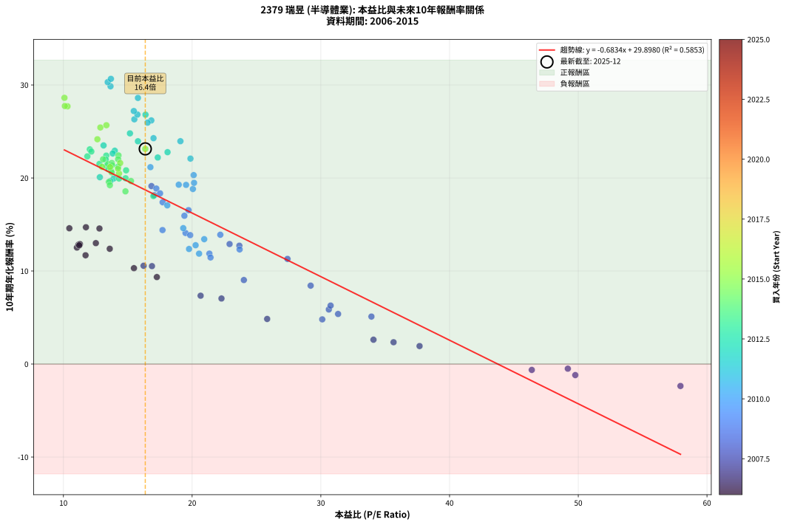
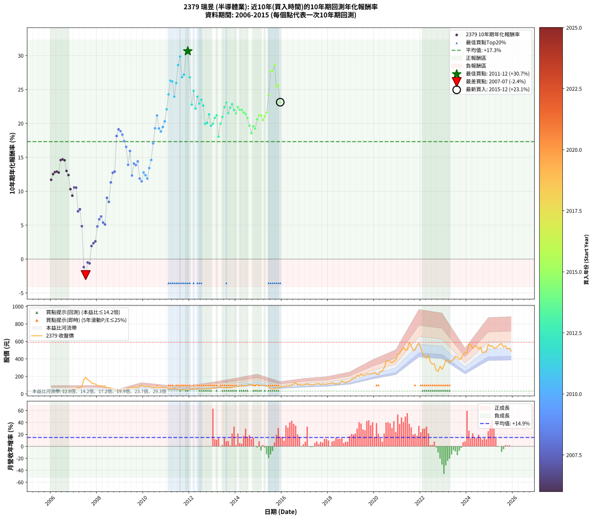

# 2379 瑞昱 - 本益比與未來報酬率分析

!!! info "報告資訊"
    - **股票代號**: 2379
    - **公司名稱**: 瑞昱
    - **產業別**: 半導體業
    - **分析期間**: 2006-2015 (120 個數據點)
    - **資料來源**: Type 12 (ShowMonthlyK_ChartFlow) 月收盤價與本益比
    - **報酬率口徑**: 含現金股利 (簡化: 年度合計，假設每年7/1入帳)
    - **報告生成時間**: 2026-01-06 18:34:00 CST

## 📈 視覺化圖表

### 圖表1: 本益比 vs 未來報酬率關係

*圖表1：2379 瑞昱 本益比與10年期未來報酬率關係 (2006-2015)*

### 圖表2: 歷年買入時點的10年期實際報酬率

*圖表2：2379 瑞昱 歷年買入時點的10年期實際報酬率 (2006-2015)*

## 📍 買點訊號說明

本報告提供兩種買點提示訊號（顯示於圖表2的股價子圖中）：

### ▲ 小綠色三角形（回測驗證）
- **計算方式**: 使用全部歷史資料計算本益比第25百分位數
- **用途**: 事後驗證，顯示歷史上哪些時點確實為低估區
- **限制**: 當下無法判斷，僅供回測參考
- **特性**: 後見之明（Look-Ahead Bias）

### ▲ 小橘色三角形（即時訊號）
- **計算方式**: 使用截至當月的過去5年資料計算本益比第25百分位數
- **用途**: 實際投資決策，當時即可判斷
- **優勢**: 可操作性強，符合實務需求
- **特性**: 無後見之明，滾動窗口計算

!!! tip "如何使用兩種訊號"
    - **綠色▲** 幫助理解歷史估值機會，驗證策略有效性
    - **橘色▲** 可作為實際買進參考，但仍需搭配基本面分析
    - 兩種訊號重疊時，表示即時判斷與事後驗證一致，信心度較高
    - 僅有綠色▲時，表示當時無法判斷（需要未來資料才能確認）
    - 僅有橘色▲時，表示即時判斷為買點，但事後可能不是最佳時機

## 📊 估值分析摘要

| 指標 | 數值 |
|:---:|:---:|
| **目前本益比** (2015-12) | **16.36 倍** |
| **歷史平均本益比** | 18.41 倍 |
| **估值水準** | 🟡 合理範圍 |
| **預期10年年化報酬率** | **+18.72%** |
| **歷史平均報酬率** | +17.31% |
| **相關係數 (R²)** | 0.5853 |
| **趨勢線斜率** | -0.6834 |

!!! abstract "核心洞察"
    目前本益比接近歷史平均，預期報酬率符合長期趨勢

    根據歷史數據回測，2379 瑞昱 在目前本益比 **16.4倍** 的估值水準下，
    預期未來10年年化報酬率約為 **+18.7%**。

    **重要提醒**: 本分析基於歷史數據統計，實際報酬率會受到公司基本面變化、產業趨勢、
    總體經濟環境等多重因素影響。R² = 0.59 表示本益比可解釋約 58.5% 的報酬率變異。

## 📈 歷史估值統計

### 最佳買點 (最高報酬率)

| 項目 | 數值 |
|:---:|:---:|
| 起始時間 | 2011-12 |
| 當時本益比 | 13.69 倍 |
| 起始價格 | 44.4 元 |
| 10年後價格 | 580.0 元 |
| **10年年化報酬率** | **+30.66%** |

### 最差買點 (最低報酬率)

| 項目 | 數值 |
|:---:|:---:|
| 起始時間 | 2007-07 |
| 當時本益比 | 57.94 倍 |
| 起始價格 | 190.0 元 |
| 10年後價格 | 113.0 元 |
| **10年年化報酬率** | **-2.36%** |

## 🎯 投資啟示

### 本益比與報酬率關係

趨勢線方程式: **y = -0.6834x + 29.8980**

!!! warning "強負相關"
    本益比與未來報酬率呈現強負相關。在高本益比時期買入，未來報酬率顯著較低；
    在低本益比時期買入，未來報酬率顯著較高。**估值紀律至關重要**。

### 估值區間建議

基於歷史數據分析:

- **🟢 低估區** (P/E < 14.7): 預期報酬率較高，可考慮增加持股
- **🟡 合理區** (P/E 14.7-22.1): 預期報酬率符合長期趨勢，正常持有
- **🔴 高估區** (P/E > 22.1): 預期報酬率較低，可考慮減碼或觀望

!!! danger "風險提示"
    - 過去表現不代表未來結果
    - 本分析假設公司基本面無重大結構性變化
    - 產業環境劇變可能使歷史規律失效
    - 應結合公司財報、產業趨勢、總體經濟等多重因素綜合判斷

!!! success "長期投資觀點"
    歷史數據顯示，在合理或低估的估值水準買入並長期持有，
    往往能獲得較佳的投資報酬。**耐心等待好價格**是價值投資的核心原則。

## 📊 數據品質

- **資料來源**: GoodInfo.tw Type 12 (ShowMonthlyK_ChartFlow)
- **資料頻率**: 月度收盤價與本益比
- **回測期間**: 2006-2015
- **數據點數量**: 120 個 (每個點代表一次10年期回測)

### 計算方法說明

1. **10年期年化報酬率**:
   - 對每個歷史時點，計算其後10年的實際投資報酬率
   - 期末價值(不含股利): 期末價格
   - 期末價值(含現金股利): 期末價格 + 持有期間內的現金股利合計 (簡化: 年度合計，假設每年7/1入帳)
   - 公式: 年化報酬率 = [(期末價值/期初價格)^(1/年數) - 1] × 100%

2. **本益比 (P/E Ratio)**:
   - 使用當時的月收盤價與EPS計算
   - 資料來源: Type 12 月度河流圖本益比數據

3. **趨勢線 (Linear Regression)**:
   - 使用最小平方法擬合線性趨勢線
   - R²值衡量本益比對報酬率的解釋能力

---

*本報告由 Stock Analysis System v1.9.0 自動生成*
*數據更新時間: 2026-01-06 18:34:00 CST*

## 📋 月度回測明細表

（每一列對應時間線圖中的一個買入點；可用來對照 SVG 圖上的每個點。）

| 買入月份 | 賣出月份 | 回測期限_年 | 實際持有年數 | 買入本益比_倍 | 買入收盤價_元 | 賣出收盤價_元 | 現金股利合計_元 | 總報酬率_pct | 年化報酬率_pct |
| --- | --- | --- | --- | --- | --- | --- | --- | --- | --- |
| 2006-01 | 2016-01 | 10 | 9.999 | 11.72 | 38.10 | 82.20 | 32.90 | +202.10 | +11.69 |
| 2006-02 | 2016-02 | 10 | 9.999 | 11.05 | 35.90 | 83.90 | 32.90 | +225.35 | +12.52 |
| 2006-03 | 2016-03 | 10 | 10.001 | 11.17 | 36.30 | 88.50 | 32.90 | +234.44 | +12.83 |
| 2006-04 | 2016-04 | 10 | 10.001 | 11.28 | 36.65 | 90.40 | 32.90 | +236.43 | +12.90 |
| 2006-05 | 2016-05 | 10 | 10.001 | 11.23 | 36.50 | 88.40 | 32.90 | +232.33 | +12.76 |
| 2006-06 | 2016-06 | 10 | 10.001 | 10.46 | 34.00 | 99.90 | 32.90 | +290.59 | +14.59 |
| 2006-07 | 2016-07 | 10 | 10.001 | 11.75 | 38.20 | 115.50 | 35.15 | +294.37 | +14.71 |
| 2006-08 | 2016-08 | 10 | 10.001 | 12.80 | 41.60 | 127.00 | 35.15 | +289.78 | +14.57 |
| 2006-09 | 2016-09 | 10 | 10.001 | 12.52 | 40.70 | 103.00 | 35.15 | +239.43 | +13.00 |
| 2006-10 | 2016-10 | 10 | 10.001 | 13.60 | 44.20 | 107.00 | 35.15 | +221.61 | +12.39 |
| 2006-11 | 2016-11 | 10 | 10.001 | 15.48 | 50.30 | 99.00 | 35.15 | +166.70 | +10.31 |
| 2006-12 | 2016-12 | 10 | 10.001 | 17.26 | 56.10 | 102.00 | 35.15 | +144.47 | +9.35 |
| 2007-01 | 2017-01 | 10 | 10.001 | 16.23 | 52.80 | 109.00 | 35.15 | +173.01 | +10.56 |
| 2007-02 | 2017-02 | 10 | 10.001 | 16.88 | 55.00 | 114.50 | 35.15 | +172.09 | +10.53 |
| 2007-03 | 2017-03 | 10 | 10.001 | 22.28 | 72.70 | 108.50 | 35.15 | +97.59 | +7.05 |
| 2007-04 | 2017-04 | 10 | 10.001 | 20.66 | 67.50 | 102.00 | 35.15 | +103.19 | +7.35 |
| 2007-05 | 2017-05 | 10 | 10.001 | 25.83 | 84.50 | 100.50 | 35.15 | +60.53 | +4.85 |
| 2007-06 | 2017-06 | 10 | 10.001 | 49.77 | 163.00 | 109.50 | 35.15 | -11.26 | -1.19 |
| 2007-07 | 2017-07 | 10 | 10.001 | 57.94 | 190.00 | 113.00 | 36.65 | -21.24 | -2.36 |
| 2007-08 | 2017-08 | 10 | 10.001 | 49.19 | 161.50 | 117.00 | 36.65 | -4.86 | -0.50 |
| 2007-09 | 2017-09 | 10 | 10.001 | 46.39 | 152.50 | 106.50 | 36.65 | -6.13 | -0.63 |
| 2007-10 | 2017-10 | 10 | 10.001 | 37.67 | 124.00 | 113.50 | 36.65 | +21.09 | +1.93 |
| 2007-11 | 2017-11 | 10 | 10.001 | 35.65 | 117.50 | 111.50 | 36.65 | +26.09 | +2.34 |
| 2007-12 | 2017-12 | 10 | 10.001 | 34.09 | 112.50 | 109.00 | 36.65 | +29.47 | +2.62 |
| 2008-01 | 2018-01 | 10 | 10.001 | 30.11 | 95.80 | 116.50 | 36.65 | +59.86 | +4.80 |
| 2008-02 | 2018-03 | 10 | 10.081 | 30.62 | 93.80 | 130.00 | 36.65 | +77.67 | +5.87 |
| 2008-03 | 2018-03 | 10 | 9.999 | 30.76 | 90.60 | 130.00 | 36.65 | +83.94 | +6.28 |
| 2008-04 | 2018-04 | 10 | 9.999 | 31.34 | 88.60 | 113.00 | 36.65 | +68.91 | +5.38 |
| 2008-05 | 2018-05 | 10 | 9.999 | 33.93 | 91.90 | 114.50 | 36.65 | +64.47 | +5.10 |
| 2008-06 | 2018-06 | 10 | 9.999 | 24.02 | 62.20 | 111.00 | 36.65 | +137.38 | +9.03 |
| 2008-07 | 2018-07 | 10 | 9.999 | 29.21 | 72.20 | 123.00 | 39.15 | +124.58 | +8.43 |
| 2008-08 | 2018-08 | 10 | 9.999 | 27.41 | 64.50 | 149.00 | 39.15 | +191.71 | +11.30 |
| 2008-09 | 2018-09 | 10 | 9.999 | 23.67 | 52.90 | 136.00 | 39.15 | +231.10 | +12.72 |
| 2008-10 | 2018-10 | 10 | 9.999 | 22.91 | 48.50 | 124.00 | 39.15 | +236.39 | +12.90 |
| 2008-11 | 2018-11 | 10 | 9.999 | 17.06 | 34.10 | 141.50 | 39.15 | +429.77 | +18.15 |
| 2008-12 | 2018-12 | 10 | 9.999 | 16.84 | 31.65 | 143.00 | 39.15 | +475.51 | +19.13 |
| 2009-01 | 2019-01 | 10 | 9.999 | 17.22 | 36.00 | 163.50 | 39.15 | +462.92 | +18.87 |
| 2009-02 | 2019-02 | 10 | 9.999 | 17.51 | 40.30 | 178.00 | 39.15 | +438.83 | +18.35 |
| 2009-03 | 2019-03 | 10 | 9.999 | 17.71 | 44.50 | 182.00 | 39.15 | +396.97 | +17.39 |
| 2009-04 | 2019-04 | 10 | 9.999 | 19.72 | 53.70 | 209.00 | 39.15 | +362.10 | +16.54 |
| 2009-05 | 2019-05 | 10 | 9.999 | 22.19 | 65.10 | 200.00 | 39.15 | +267.36 | +13.90 |
| 2009-06 | 2019-06 | 10 | 9.999 | 19.40 | 61.00 | 228.50 | 39.15 | +338.77 | +15.94 |
| 2009-07 | 2019-07 | 10 | 9.999 | 23.69 | 79.50 | 209.50 | 44.55 | +219.56 | +12.32 |
| 2009-08 | 2019-08 | 10 | 9.999 | 19.49 | 69.50 | 215.00 | 44.55 | +273.45 | +14.09 |
| 2009-09 | 2019-09 | 10 | 9.999 | 19.85 | 75.00 | 230.00 | 44.55 | +266.07 | +13.86 |
| 2009-10 | 2019-10 | 10 | 9.999 | 17.70 | 70.60 | 226.50 | 44.55 | +283.92 | +14.40 |
| 2009-11 | 2019-11 | 10 | 9.999 | 21.34 | 89.60 | 230.50 | 44.55 | +206.98 | +11.87 |
| 2009-12 | 2019-12 | 10 | 9.999 | 21.43 | 94.50 | 235.00 | 44.55 | +195.82 | +11.46 |
| 2010-01 | 2020-01 | 10 | 9.999 | 20.27 | 87.80 | 247.50 | 44.55 | +232.63 | +12.77 |
| 2010-02 | 2020-02 | 10 | 9.999 | 19.76 | 84.00 | 225.00 | 44.55 | +220.89 | +12.37 |
| 2010-03 | 2020-03 | 10 | 10.001 | 20.54 | 85.70 | 218.50 | 44.55 | +206.94 | +11.87 |
| 2010-04 | 2020-04 | 10 | 10.001 | 20.94 | 85.70 | 257.50 | 44.55 | +252.45 | +13.42 |
| 2010-05 | 2020-05 | 10 | 10.001 | 19.31 | 77.50 | 258.50 | 44.55 | +291.03 | +14.61 |
| 2010-06 | 2020-06 | 10 | 10.001 | 18.07 | 71.10 | 299.00 | 44.55 | +383.19 | +17.06 |
| 2010-07 | 2020-07 | 10 | 10.001 | 18.96 | 73.10 | 374.50 | 51.70 | +483.04 | +19.28 |
| 2010-08 | 2020-08 | 10 | 10.001 | 16.76 | 63.30 | 380.00 | 51.70 | +581.99 | +21.16 |
| 2010-09 | 2020-09 | 10 | 10.001 | 19.53 | 72.20 | 368.50 | 51.70 | +481.99 | +19.26 |
| 2010-10 | 2020-10 | 10 | 10.001 | 20.06 | 72.60 | 355.50 | 51.70 | +460.88 | +18.82 |
| 2010-11 | 2020-11 | 10 | 10.001 | 20.15 | 71.30 | 371.00 | 51.70 | +492.85 | +19.48 |
| 2010-12 | 2020-12 | 10 | 10.001 | 20.12 | 69.60 | 390.50 | 51.70 | +535.34 | +20.31 |
| 2011-01 | 2021-01 | 10 | 10.001 | 19.87 | 68.40 | 451.50 | 51.70 | +635.67 | +22.08 |
| 2011-02 | 2021-02 | 10 | 10.001 | 17.00 | 58.20 | 460.00 | 51.70 | +779.21 | +24.28 |
| 2011-03 | 2021-03 | 10 | 10.001 | 15.51 | 52.80 | 494.00 | 51.70 | +933.52 | +26.30 |
| 2011-04 | 2021-04 | 10 | 10.001 | 16.83 | 57.00 | 532.00 | 51.70 | +924.04 | +26.19 |
| 2011-05 | 2021-05 | 10 | 10.001 | 19.09 | 64.30 | 499.00 | 51.70 | +756.45 | +23.95 |
| 2011-06 | 2021-06 | 10 | 10.001 | 16.54 | 55.40 | 505.00 | 51.70 | +904.87 | +25.95 |
| 2011-07 | 2021-07 | 10 | 10.001 | 15.79 | 52.60 | 588.00 | 63.20 | +1138.02 | +28.61 |
| 2011-08 | 2021-08 | 10 | 10.001 | 13.66 | 45.25 | 554.00 | 63.20 | +1263.98 | +29.86 |
| 2011-09 | 2021-09 | 10 | 10.001 | 15.75 | 51.90 | 495.50 | 63.20 | +976.49 | +26.82 |
| 2011-10 | 2021-10 | 10 | 10.001 | 15.47 | 50.70 | 499.00 | 63.20 | +1008.88 | +27.20 |
| 2011-11 | 2021-11 | 10 | 10.001 | 13.44 | 43.80 | 555.00 | 63.20 | +1311.42 | +30.30 |
| 2011-12 | 2021-12 | 10 | 10.001 | 13.69 | 44.35 | 580.00 | 63.20 | +1350.28 | +30.66 |
| 2012-01 | 2022-01 | 10 | 10.001 | 16.38 | 54.80 | 526.00 | 63.20 | +975.18 | +26.80 |
| 2012-02 | 2022-03 | 10 | 10.081 | 18.09 | 62.40 | 430.50 | 63.20 | +691.19 | +22.77 |
| 2012-03 | 2022-03 | 10 | 9.999 | 15.17 | 53.90 | 430.50 | 63.20 | +815.96 | +24.80 |
| 2012-04 | 2022-04 | 10 | 9.999 | 17.33 | 63.40 | 407.50 | 63.20 | +642.43 | +22.20 |
| 2012-05 | 2022-05 | 10 | 9.999 | 15.79 | 59.40 | 445.00 | 63.20 | +755.56 | +23.95 |
| 2012-06 | 2022-06 | 10 | 9.999 | 13.99 | 54.10 | 363.00 | 63.20 | +687.80 | +22.93 |
| 2012-07 | 2022-07 | 10 | 9.999 | 13.12 | 52.10 | 342.00 | 87.90 | +725.14 | +23.50 |
| 2012-08 | 2022-08 | 10 | 9.999 | 13.83 | 56.40 | 346.00 | 87.90 | +669.33 | +22.64 |
| 2012-09 | 2022-09 | 10 | 9.999 | 13.90 | 58.10 | 270.00 | 87.90 | +516.01 | +19.94 |
| 2012-10 | 2022-10 | 10 | 9.999 | 12.83 | 55.00 | 255.00 | 87.90 | +523.45 | +20.09 |
| 2012-11 | 2022-11 | 10 | 9.999 | 13.35 | 58.60 | 317.00 | 87.90 | +590.96 | +21.33 |
| 2012-12 | 2022-12 | 10 | 9.999 | 13.64 | 61.30 | 281.00 | 87.90 | +501.79 | +19.66 |
| 2013-01 | 2023-01 | 10 | 9.999 | 14.32 | 66.20 | 320.00 | 87.90 | +516.16 | +19.94 |
| 2013-02 | 2023-02 | 10 | 9.999 | 14.87 | 70.60 | 380.00 | 87.90 | +562.75 | +20.82 |
| 2013-03 | 2023-03 | 10 | 9.999 | 14.25 | 69.50 | 387.50 | 87.90 | +584.03 | +21.20 |
| 2013-04 | 2023-04 | 10 | 9.999 | 16.99 | 85.00 | 359.00 | 87.90 | +425.76 | +18.06 |
| 2013-05 | 2023-05 | 10 | 9.999 | 14.83 | 76.10 | 382.00 | 87.90 | +517.48 | +19.97 |
| 2013-06 | 2023-06 | 10 | 9.999 | 13.50 | 71.00 | 387.50 | 87.90 | +569.58 | +20.95 |
| 2013-07 | 2023-07 | 10 | 9.999 | 13.33 | 71.80 | 430.50 | 111.50 | +654.87 | +22.41 |
| 2013-08 | 2023-08 | 10 | 9.999 | 12.05 | 66.40 | 418.00 | 111.50 | +697.44 | +23.08 |
| 2013-09 | 2023-09 | 10 | 9.999 | 12.80 | 72.20 | 395.00 | 111.50 | +601.52 | +21.51 |
| 2013-10 | 2023-10 | 10 | 9.999 | 11.86 | 68.40 | 401.50 | 111.50 | +650.00 | +22.33 |
| 2013-11 | 2023-11 | 10 | 9.999 | 12.17 | 71.70 | 449.50 | 111.50 | +682.43 | +22.84 |
| 2013-12 | 2023-12 | 10 | 9.999 | 13.29 | 80.00 | 471.50 | 111.50 | +628.75 | +21.97 |
| 2014-01 | 2024-01 | 10 | 9.999 | 13.47 | 83.00 | 469.50 | 111.50 | +600.00 | +21.48 |
| 2014-02 | 2024-02 | 10 | 9.999 | 14.28 | 90.00 | 569.00 | 111.50 | +656.11 | +22.43 |
| 2014-03 | 2024-03 | 10 | 10.001 | 14.25 | 91.80 | 560.00 | 111.50 | +631.48 | +22.01 |
| 2014-04 | 2024-04 | 10 | 10.001 | 13.08 | 86.10 | 518.00 | 111.50 | +631.13 | +22.01 |
| 2014-05 | 2024-05 | 10 | 10.001 | 13.76 | 92.50 | 543.00 | 111.50 | +607.57 | +21.61 |
| 2014-06 | 2024-06 | 10 | 10.001 | 13.78 | 94.60 | 546.00 | 111.50 | +595.03 | +21.39 |
| 2014-07 | 2024-07 | 10 | 10.001 | 13.69 | 95.90 | 512.00 | 122.00 | +561.11 | +20.79 |
| 2014-08 | 2024-08 | 10 | 10.001 | 15.25 | 109.00 | 535.00 | 122.00 | +502.75 | +19.67 |
| 2014-09 | 2024-09 | 10 | 10.001 | 14.82 | 108.00 | 471.00 | 122.00 | +449.07 | +18.56 |
| 2014-10 | 2024-10 | 10 | 10.001 | 13.53 | 100.50 | 478.50 | 122.00 | +497.51 | +19.57 |
| 2014-11 | 2024-11 | 10 | 10.001 | 13.61 | 103.00 | 476.00 | 122.00 | +480.58 | +19.23 |
| 2014-12 | 2024-12 | 10 | 10.001 | 13.75 | 106.00 | 568.00 | 122.00 | +550.94 | +20.60 |
| 2015-01 | 2025-01 | 10 | 10.001 | 13.00 | 97.10 | 542.00 | 122.00 | +583.83 | +21.19 |
| 2015-02 | 2025-02 | 10 | 10.001 | 13.62 | 98.40 | 550.00 | 122.00 | +582.93 | +21.18 |
| 2015-03 | 2025-03 | 10 | 10.001 | 14.32 | 100.00 | 523.00 | 122.00 | +545.00 | +20.49 |
| 2015-04 | 2025-04 | 10 | 10.001 | 14.24 | 96.00 | 524.00 | 122.00 | +572.92 | +21.00 |
| 2015-05 | 2025-05 | 10 | 10.001 | 14.41 | 93.70 | 541.00 | 122.00 | +607.58 | +21.61 |
| 2015-06 | 2025-06 | 10 | 10.001 | 12.64 | 79.10 | 567.00 | 122.00 | +771.05 | +24.16 |
| 2015-07 | 2025-07 | 10 | 10.001 | 10.32 | 62.10 | 575.00 | 141.50 | +1053.78 | +27.70 |
| 2015-08 | 2025-08 | 10 | 10.001 | 10.11 | 58.40 | 534.00 | 141.50 | +1056.68 | +27.73 |
| 2015-09 | 2025-09 | 10 | 10.001 | 10.08 | 55.80 | 550.00 | 141.50 | +1139.25 | +28.62 |
| 2015-10 | 2025-10 | 10 | 10.001 | 12.87 | 68.10 | 515.00 | 141.50 | +864.02 | +25.43 |
| 2015-11 | 2025-11 | 10 | 10.001 | 13.34 | 67.40 | 521.00 | 141.50 | +882.94 | +25.67 |
| 2015-12 | 2025-12 | 10 | 10.001 | 16.36 | 78.70 | 489.00 | 141.50 | +701.14 | +23.13 |
