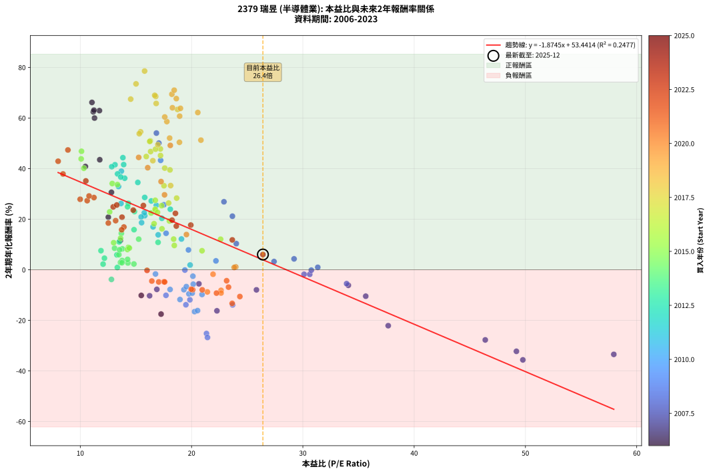
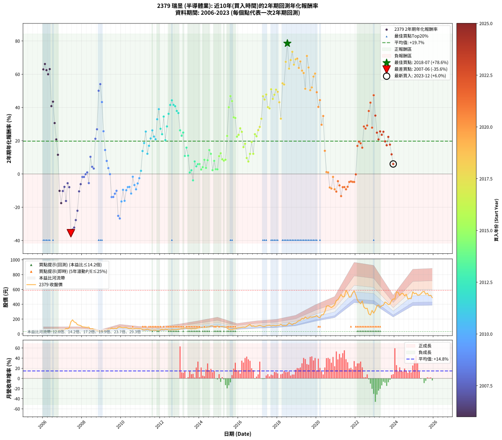

# 2379 瑞昱 - 本益比與未來報酬率分析

!!! info "報告資訊"
    - **股票代號**: 2379
    - **公司名稱**: 瑞昱
    - **產業別**: 半導體業
    - **分析期間**: 2006-2023 (216 個數據點)
    - **資料來源**: Type 12 (ShowMonthlyK_ChartFlow) 月收盤價與本益比
    - **報酬率口徑**: 含現金股利 (簡化: 年度合計，假設每年7/1入帳)
    - **報告生成時間**: 2026-01-06 00:36:25 CST

## 📈 視覺化圖表

### 圖表1: 本益比 vs 未來報酬率關係

*圖表1：2379 瑞昱 本益比與2年期未來報酬率關係 (2006-2023)*

### 圖表2: 歷年買入時點的2年期實際報酬率

*圖表2：2379 瑞昱 歷年買入時點的2年期實際報酬率 (2006-2023)*

## 📍 買點訊號說明

本報告提供兩種買點提示訊號（顯示於圖表2的股價子圖中）：

### ▲ 小綠色三角形（回測驗證）
- **計算方式**: 使用全部歷史資料計算本益比第25百分位數
- **用途**: 事後驗證，顯示歷史上哪些時點確實為低估區
- **限制**: 當下無法判斷，僅供回測參考
- **特性**: 後見之明（Look-Ahead Bias）

### ▲ 小橘色三角形（即時訊號）
- **計算方式**: 使用截至當月的過去5年資料計算本益比第25百分位數
- **用途**: 實際投資決策，當時即可判斷
- **優勢**: 可操作性強，符合實務需求
- **特性**: 無後見之明，滾動窗口計算

!!! tip "如何使用兩種訊號"
    - **綠色▲** 幫助理解歷史估值機會，驗證策略有效性
    - **橘色▲** 可作為實際買進參考，但仍需搭配基本面分析
    - 兩種訊號重疊時，表示即時判斷與事後驗證一致，信心度較高
    - 僅有綠色▲時，表示當時無法判斷（需要未來資料才能確認）
    - 僅有橘色▲時，表示即時判斷為買點，但事後可能不是最佳時機

## 📊 估值分析摘要

| 指標 | 數值 |
|:---:|:---:|
| **目前本益比** (2023-12) | **26.41 倍** |
| **歷史平均本益比** | 17.98 倍 |
| **估值水準** | 🔴 相對高估 |
| **預期2年年化報酬率** | **+3.94%** |
| **歷史平均報酬率** | +19.74% |
| **相關係數 (R²)** | 0.2477 |
| **趨勢線斜率** | -1.8745 |

!!! abstract "核心洞察"
    目前本益比顯著高於歷史平均，預期未來報酬率可能較低

    根據歷史數據回測，2379 瑞昱 在目前本益比 **26.4倍** 的估值水準下，
    預期未來2年年化報酬率約為 **+3.9%**。

    **重要提醒**: 本分析基於歷史數據統計，實際報酬率會受到公司基本面變化、產業趨勢、
    總體經濟環境等多重因素影響。R² = 0.25 表示本益比可解釋約 24.8% 的報酬率變異。

## 📈 歷史估值統計

### 最佳買點 (最高報酬率)

| 項目 | 數值 |
|:---:|:---:|
| 起始時間 | 2018-07 |
| 當時本益比 | 15.78 倍 |
| 起始價格 | 123.0 元 |
| 2年後價格 | 374.5 元 |
| **2年年化報酬率** | **+78.56%** |

### 最差買點 (最低報酬率)

| 項目 | 數值 |
|:---:|:---:|
| 起始時間 | 2007-06 |
| 當時本益比 | 49.77 倍 |
| 起始價格 | 163.0 元 |
| 2年後價格 | 61.0 元 |
| **2年年化報酬率** | **-35.63%** |

## 🎯 投資啟示

### 本益比與報酬率關係

趨勢線方程式: **y = -1.8745x + 53.4414**

!!! warning "強負相關"
    本益比與未來報酬率呈現強負相關。在高本益比時期買入，未來報酬率顯著較低；
    在低本益比時期買入，未來報酬率顯著較高。**估值紀律至關重要**。

### 估值區間建議

基於歷史數據分析:

- **🟢 低估區** (P/E < 14.4): 預期報酬率較高，可考慮增加持股
- **🟡 合理區** (P/E 14.4-21.6): 預期報酬率符合長期趨勢，正常持有
- **🔴 高估區** (P/E > 21.6): 預期報酬率較低，可考慮減碼或觀望

!!! danger "風險提示"
    - 過去表現不代表未來結果
    - 本分析假設公司基本面無重大結構性變化
    - 產業環境劇變可能使歷史規律失效
    - 應結合公司財報、產業趨勢、總體經濟等多重因素綜合判斷

!!! success "長期投資觀點"
    歷史數據顯示，在合理或低估的估值水準買入並長期持有，
    往往能獲得較佳的投資報酬。**耐心等待好價格**是價值投資的核心原則。

## 📊 數據品質

- **資料來源**: GoodInfo.tw Type 12 (ShowMonthlyK_ChartFlow)
- **資料頻率**: 月度收盤價與本益比
- **回測期間**: 2006-2023
- **數據點數量**: 216 個 (每個點代表一次2年期回測)

### 計算方法說明

1. **2年期年化報酬率**:
   - 對每個歷史時點，計算其後2年的實際投資報酬率
   - 期末價值(不含股利): 期末價格
   - 期末價值(含現金股利): 期末價格 + 持有期間內的現金股利合計 (簡化: 年度合計，假設每年7/1入帳)
   - 公式: 年化報酬率 = [(期末價值/期初價格)^(1/年數) - 1] × 100%

2. **本益比 (P/E Ratio)**:
   - 使用當時的月收盤價與EPS計算
   - 資料來源: Type 12 月度河流圖本益比數據

3. **趨勢線 (Linear Regression)**:
   - 使用最小平方法擬合線性趨勢線
   - R²值衡量本益比對報酬率的解釋能力

---

*本報告由 Stock Analysis System v1.9.0 自動生成*
*數據更新時間: 2026-01-06 00:36:25 CST*

## 📋 月度回測明細表

（每一列對應時間線圖中的一個買入點；可用來對照 SVG 圖上的每個點。）

| 買入月份 | 賣出月份 | 回測期限_年 | 實際持有年數 | 買入本益比_倍 | 買入收盤價_元 | 賣出收盤價_元 | 現金股利合計_元 | 總報酬率_pct | 年化報酬率_pct |
| --- | --- | --- | --- | --- | --- | --- | --- | --- | --- |
| 2006-01 | 2008-01 | 2 | 1.999 | 11.72 | 38.10 | 95.80 | 5.25 | +165.22 | +62.91 |
| 2006-02 | 2008-02 | 2 | 1.999 | 11.05 | 35.90 | 93.80 | 5.25 | +175.91 | +66.16 |
| 2006-03 | 2008-03 | 2 | 2.001 | 11.17 | 36.30 | 90.60 | 5.25 | +164.05 | +62.44 |
| 2006-04 | 2008-04 | 2 | 2.001 | 11.28 | 36.65 | 88.60 | 5.25 | +156.07 | +59.97 |
| 2006-05 | 2008-05 | 2 | 2.001 | 11.23 | 36.50 | 91.90 | 5.25 | +166.16 | +63.09 |
| 2006-06 | 2008-06 | 2 | 2.001 | 10.46 | 34.00 | 62.20 | 5.25 | +98.38 | +40.82 |
| 2006-07 | 2008-07 | 2 | 2.001 | 11.75 | 38.20 | 72.20 | 6.50 | +106.02 | +43.50 |
| 2006-08 | 2008-08 | 2 | 2.001 | 12.80 | 41.60 | 64.50 | 6.50 | +70.67 | +30.62 |
| 2006-09 | 2008-09 | 2 | 2.001 | 12.52 | 40.70 | 52.90 | 6.50 | +45.95 | +20.79 |
| 2006-10 | 2008-10 | 2 | 2.001 | 13.60 | 44.20 | 48.50 | 6.50 | +24.43 | +11.54 |
| 2006-11 | 2008-11 | 2 | 2.001 | 15.48 | 50.30 | 34.10 | 6.50 | -19.28 | -10.15 |
| 2006-12 | 2008-12 | 2 | 2.001 | 17.26 | 56.10 | 31.65 | 6.50 | -32.00 | -17.52 |
| 2007-01 | 2009-01 | 2 | 2.001 | 16.23 | 52.80 | 36.00 | 6.50 | -19.51 | -10.28 |
| 2007-02 | 2009-02 | 2 | 2.001 | 16.88 | 55.00 | 40.30 | 6.50 | -14.91 | -7.75 |
| 2007-03 | 2009-03 | 2 | 2.001 | 22.28 | 72.70 | 44.50 | 6.50 | -29.85 | -16.23 |
| 2007-04 | 2009-04 | 2 | 2.001 | 20.66 | 67.50 | 53.70 | 6.50 | -10.81 | -5.56 |
| 2007-05 | 2009-05 | 2 | 2.001 | 25.83 | 84.50 | 65.10 | 6.50 | -15.27 | -7.94 |
| 2007-06 | 2009-06 | 2 | 2.001 | 49.77 | 163.00 | 61.00 | 6.50 | -58.59 | -35.63 |
| 2007-07 | 2009-07 | 2 | 2.001 | 57.94 | 190.00 | 79.50 | 4.60 | -55.74 | -33.45 |
| 2007-08 | 2009-08 | 2 | 2.001 | 49.19 | 161.50 | 69.50 | 4.60 | -54.12 | -32.25 |
| 2007-09 | 2009-09 | 2 | 2.001 | 46.39 | 152.50 | 75.00 | 4.60 | -47.80 | -27.74 |
| 2007-10 | 2009-10 | 2 | 2.001 | 37.67 | 124.00 | 70.60 | 4.60 | -39.35 | -22.11 |
| 2007-11 | 2009-11 | 2 | 2.001 | 35.65 | 117.50 | 89.60 | 4.60 | -19.83 | -10.46 |
| 2007-12 | 2009-12 | 2 | 2.001 | 34.09 | 112.50 | 94.50 | 4.60 | -11.91 | -6.14 |
| 2008-01 | 2010-01 | 2 | 2.001 | 30.11 | 95.80 | 87.80 | 4.60 | -3.55 | -1.79 |
| 2008-02 | 2010-03 | 2 | 2.081 | 30.62 | 93.80 | 85.70 | 4.60 | -3.73 | -1.81 |
| 2008-03 | 2010-03 | 2 | 1.999 | 30.76 | 90.60 | 85.70 | 4.60 | -0.33 | -0.17 |
| 2008-04 | 2010-04 | 2 | 1.999 | 31.34 | 88.60 | 85.70 | 4.60 | +1.92 | +0.96 |
| 2008-05 | 2010-05 | 2 | 1.999 | 33.93 | 91.90 | 77.50 | 4.60 | -10.66 | -5.49 |
| 2008-06 | 2010-06 | 2 | 1.999 | 24.02 | 62.20 | 71.10 | 4.60 | +21.70 | +10.33 |
| 2008-07 | 2010-07 | 2 | 1.999 | 29.21 | 72.20 | 73.10 | 5.45 | +8.80 | +4.31 |
| 2008-08 | 2010-08 | 2 | 1.999 | 27.41 | 64.50 | 63.30 | 5.45 | +6.59 | +3.24 |
| 2008-09 | 2010-09 | 2 | 1.999 | 23.67 | 52.90 | 72.20 | 5.45 | +46.79 | +21.17 |
| 2008-10 | 2010-10 | 2 | 1.999 | 22.91 | 48.50 | 72.60 | 5.45 | +60.93 | +26.88 |
| 2008-11 | 2010-11 | 2 | 1.999 | 17.06 | 34.10 | 71.30 | 5.45 | +125.07 | +50.07 |
| 2008-12 | 2010-12 | 2 | 1.999 | 16.84 | 31.65 | 69.60 | 5.45 | +137.12 | +54.03 |
| 2009-01 | 2011-01 | 2 | 1.999 | 17.22 | 36.00 | 68.40 | 5.45 | +105.14 | +43.26 |
| 2009-02 | 2011-02 | 2 | 1.999 | 17.51 | 40.30 | 58.20 | 5.45 | +57.94 | +25.69 |
| 2009-03 | 2011-03 | 2 | 1.999 | 17.71 | 44.50 | 52.80 | 5.45 | +30.90 | +14.42 |
| 2009-04 | 2011-04 | 2 | 1.999 | 19.72 | 53.70 | 57.00 | 5.45 | +16.29 | +7.85 |
| 2009-05 | 2011-05 | 2 | 1.999 | 22.19 | 65.10 | 64.30 | 5.45 | +7.14 | +3.51 |
| 2009-06 | 2011-06 | 2 | 1.999 | 19.40 | 61.00 | 55.40 | 5.45 | -0.25 | -0.12 |
| 2009-07 | 2011-07 | 2 | 1.999 | 23.69 | 79.50 | 52.60 | 6.35 | -25.85 | -13.90 |
| 2009-08 | 2011-08 | 2 | 1.999 | 19.49 | 69.50 | 45.25 | 6.35 | -25.76 | -13.84 |
| 2009-09 | 2011-09 | 2 | 1.999 | 19.85 | 75.00 | 51.90 | 6.35 | -22.33 | -11.88 |
| 2009-10 | 2011-10 | 2 | 1.999 | 17.70 | 70.60 | 50.70 | 6.35 | -19.19 | -10.11 |
| 2009-11 | 2011-11 | 2 | 1.999 | 21.34 | 89.60 | 43.80 | 6.35 | -44.03 | -25.20 |
| 2009-12 | 2011-12 | 2 | 1.999 | 21.43 | 94.50 | 44.35 | 6.35 | -46.35 | -26.77 |
| 2010-01 | 2012-01 | 2 | 1.999 | 20.27 | 87.80 | 54.80 | 6.35 | -30.35 | -16.56 |
| 2010-02 | 2012-02 | 2 | 1.999 | 19.76 | 84.00 | 62.40 | 6.35 | -18.15 | -9.54 |
| 2010-03 | 2012-03 | 2 | 2.001 | 20.54 | 85.70 | 53.90 | 6.35 | -29.70 | -16.14 |
| 2010-04 | 2012-04 | 2 | 2.001 | 20.94 | 85.70 | 63.40 | 6.35 | -18.61 | -9.78 |
| 2010-05 | 2012-05 | 2 | 2.001 | 19.31 | 77.50 | 59.40 | 6.35 | -15.16 | -7.89 |
| 2010-06 | 2012-06 | 2 | 2.001 | 18.07 | 71.10 | 54.10 | 6.35 | -14.98 | -7.79 |
| 2010-07 | 2012-07 | 2 | 2.001 | 18.96 | 73.10 | 52.10 | 4.80 | -22.16 | -11.77 |
| 2010-08 | 2012-08 | 2 | 2.001 | 16.76 | 63.30 | 56.40 | 4.80 | -3.32 | -1.67 |
| 2010-09 | 2012-09 | 2 | 2.001 | 19.53 | 72.20 | 58.10 | 4.80 | -12.88 | -6.66 |
| 2010-10 | 2012-10 | 2 | 2.001 | 20.06 | 72.60 | 55.00 | 4.80 | -17.63 | -9.24 |
| 2010-11 | 2012-11 | 2 | 2.001 | 20.15 | 71.30 | 58.60 | 4.80 | -11.08 | -5.70 |
| 2010-12 | 2012-12 | 2 | 2.001 | 20.12 | 69.60 | 61.30 | 4.80 | -5.03 | -2.55 |
| 2011-01 | 2013-01 | 2 | 2.001 | 19.87 | 68.40 | 66.20 | 4.80 | +3.80 | +1.88 |
| 2011-02 | 2013-02 | 2 | 2.001 | 17.00 | 58.20 | 70.60 | 4.80 | +29.55 | +13.81 |
| 2011-03 | 2013-03 | 2 | 2.001 | 15.51 | 52.80 | 69.50 | 4.80 | +40.72 | +18.61 |
| 2011-04 | 2013-04 | 2 | 2.001 | 16.83 | 57.00 | 85.00 | 4.80 | +57.54 | +25.50 |
| 2011-05 | 2013-05 | 2 | 2.001 | 19.09 | 64.30 | 76.10 | 4.80 | +25.82 | +12.16 |
| 2011-06 | 2013-06 | 2 | 2.001 | 16.54 | 55.40 | 71.00 | 4.80 | +36.82 | +16.96 |
| 2011-07 | 2013-07 | 2 | 2.001 | 15.79 | 52.60 | 71.80 | 5.70 | +47.34 | +21.37 |
| 2011-08 | 2013-08 | 2 | 2.001 | 13.66 | 45.25 | 66.40 | 5.70 | +59.34 | +26.21 |
| 2011-09 | 2013-09 | 2 | 2.001 | 15.75 | 51.90 | 72.20 | 5.70 | +50.10 | +22.50 |
| 2011-10 | 2013-10 | 2 | 2.001 | 15.47 | 50.70 | 68.40 | 5.70 | +46.15 | +20.88 |
| 2011-11 | 2013-11 | 2 | 2.001 | 13.44 | 43.80 | 71.70 | 5.70 | +76.71 | +32.91 |
| 2011-12 | 2013-12 | 2 | 2.001 | 13.69 | 44.35 | 80.00 | 5.70 | +93.24 | +38.98 |
| 2012-01 | 2014-01 | 2 | 2.001 | 16.38 | 54.80 | 83.00 | 5.70 | +61.86 | +27.20 |
| 2012-02 | 2014-03 | 2 | 2.081 | 18.09 | 62.40 | 91.80 | 5.70 | +56.25 | +23.92 |
| 2012-03 | 2014-03 | 2 | 1.999 | 15.17 | 53.90 | 91.80 | 5.70 | +80.89 | +34.52 |
| 2012-04 | 2014-04 | 2 | 1.999 | 17.33 | 63.40 | 86.10 | 5.70 | +44.79 | +20.35 |
| 2012-05 | 2014-05 | 2 | 1.999 | 15.79 | 59.40 | 92.50 | 5.70 | +65.32 | +28.60 |
| 2012-06 | 2014-06 | 2 | 1.999 | 13.99 | 54.10 | 94.60 | 5.70 | +85.40 | +36.19 |
| 2012-07 | 2014-07 | 2 | 1.999 | 13.12 | 52.10 | 95.90 | 8.40 | +100.19 | +41.52 |
| 2012-08 | 2014-08 | 2 | 1.999 | 13.83 | 56.40 | 109.00 | 8.40 | +108.16 | +44.31 |
| 2012-09 | 2014-09 | 2 | 1.999 | 13.90 | 58.10 | 108.00 | 8.40 | +100.34 | +41.58 |
| 2012-10 | 2014-10 | 2 | 1.999 | 12.83 | 55.00 | 100.50 | 8.40 | +98.00 | +40.75 |
| 2012-11 | 2014-11 | 2 | 1.999 | 13.35 | 58.60 | 103.00 | 8.40 | +90.10 | +37.91 |
| 2012-12 | 2014-12 | 2 | 1.999 | 13.64 | 61.30 | 106.00 | 8.40 | +86.62 | +36.64 |
| 2013-01 | 2015-01 | 2 | 1.999 | 14.32 | 66.20 | 97.10 | 8.40 | +59.37 | +26.26 |
| 2013-02 | 2015-02 | 2 | 1.999 | 14.87 | 70.60 | 98.40 | 8.40 | +51.27 | +23.01 |
| 2013-03 | 2015-03 | 2 | 1.999 | 14.25 | 69.50 | 100.00 | 8.40 | +55.97 | +24.91 |
| 2013-04 | 2015-04 | 2 | 1.999 | 16.99 | 85.00 | 96.00 | 8.40 | +22.82 | +10.83 |
| 2013-05 | 2015-05 | 2 | 1.999 | 14.83 | 76.10 | 93.70 | 8.40 | +34.17 | +15.84 |
| 2013-06 | 2015-06 | 2 | 1.999 | 13.50 | 71.00 | 79.10 | 8.40 | +23.24 | +11.02 |
| 2013-07 | 2015-07 | 2 | 1.999 | 13.33 | 71.80 | 62.10 | 11.00 | +1.81 | +0.90 |
| 2013-08 | 2015-08 | 2 | 1.999 | 12.05 | 66.40 | 58.40 | 11.00 | +4.52 | +2.24 |
| 2013-09 | 2015-09 | 2 | 1.999 | 12.80 | 72.20 | 55.80 | 11.00 | -7.48 | -3.81 |
| 2013-10 | 2015-10 | 2 | 1.999 | 11.86 | 68.40 | 68.10 | 11.00 | +15.64 | +7.54 |
| 2013-11 | 2015-11 | 2 | 1.999 | 12.17 | 71.70 | 67.40 | 11.00 | +9.34 | +4.57 |
| 2013-12 | 2015-12 | 2 | 1.999 | 13.29 | 80.00 | 78.70 | 11.00 | +12.13 | +5.89 |
| 2014-01 | 2016-01 | 2 | 1.999 | 13.47 | 83.00 | 82.20 | 11.00 | +12.29 | +5.97 |
| 2014-02 | 2016-02 | 2 | 1.999 | 14.28 | 90.00 | 83.90 | 11.00 | +5.44 | +2.69 |
| 2014-03 | 2016-03 | 2 | 2.001 | 14.25 | 91.80 | 88.50 | 11.00 | +8.39 | +4.11 |
| 2014-04 | 2016-04 | 2 | 2.001 | 13.08 | 86.10 | 90.40 | 11.00 | +17.77 | +8.52 |
| 2014-05 | 2016-05 | 2 | 2.001 | 13.76 | 92.50 | 88.40 | 11.00 | +7.46 | +3.66 |
| 2014-06 | 2016-06 | 2 | 2.001 | 13.78 | 94.60 | 99.90 | 11.00 | +17.23 | +8.27 |
| 2014-07 | 2016-07 | 2 | 2.001 | 13.69 | 95.90 | 115.50 | 10.00 | +30.87 | +14.39 |
| 2014-08 | 2016-08 | 2 | 2.001 | 15.25 | 109.00 | 127.00 | 10.00 | +25.69 | +12.10 |
| 2014-09 | 2016-09 | 2 | 2.001 | 14.82 | 108.00 | 103.00 | 10.00 | +4.63 | +2.29 |
| 2014-10 | 2016-10 | 2 | 2.001 | 13.53 | 100.50 | 107.00 | 10.00 | +16.42 | +7.89 |
| 2014-11 | 2016-11 | 2 | 2.001 | 13.61 | 103.00 | 99.00 | 10.00 | +5.83 | +2.87 |
| 2014-12 | 2016-12 | 2 | 2.001 | 13.75 | 106.00 | 102.00 | 10.00 | +5.66 | +2.79 |
| 2015-01 | 2017-01 | 2 | 2.001 | 13.00 | 97.10 | 109.00 | 10.00 | +22.55 | +10.70 |
| 2015-02 | 2017-02 | 2 | 2.001 | 13.62 | 98.40 | 114.50 | 10.00 | +26.52 | +12.47 |
| 2015-03 | 2017-03 | 2 | 2.001 | 14.32 | 100.00 | 108.50 | 10.00 | +18.50 | +8.85 |
| 2015-04 | 2017-04 | 2 | 2.001 | 14.24 | 96.00 | 102.00 | 10.00 | +16.67 | +8.01 |
| 2015-05 | 2017-05 | 2 | 2.001 | 14.41 | 93.70 | 100.50 | 10.00 | +17.93 | +8.59 |
| 2015-06 | 2017-06 | 2 | 2.001 | 12.64 | 79.10 | 109.50 | 10.00 | +51.07 | +22.90 |
| 2015-07 | 2017-07 | 2 | 2.001 | 10.32 | 62.10 | 113.00 | 9.00 | +96.46 | +40.13 |
| 2015-08 | 2017-08 | 2 | 2.001 | 10.11 | 58.40 | 117.00 | 9.00 | +115.75 | +46.85 |
| 2015-09 | 2017-09 | 2 | 2.001 | 10.08 | 55.80 | 106.50 | 9.00 | +106.99 | +43.84 |
| 2015-10 | 2017-10 | 2 | 2.001 | 12.87 | 68.10 | 113.50 | 9.00 | +79.88 | +34.09 |
| 2015-11 | 2017-11 | 2 | 2.001 | 13.34 | 67.40 | 111.50 | 9.00 | +78.78 | +33.68 |
| 2015-12 | 2017-12 | 2 | 2.001 | 16.36 | 78.70 | 109.00 | 9.00 | +49.94 | +22.43 |
| 2016-01 | 2018-01 | 2 | 2.001 | 16.74 | 82.20 | 116.50 | 9.00 | +52.68 | +23.54 |
| 2016-02 | 2018-03 | 2 | 2.081 | 16.74 | 83.90 | 130.00 | 9.00 | +65.67 | +27.46 |
| 2016-03 | 2018-03 | 2 | 1.999 | 17.31 | 88.50 | 130.00 | 9.00 | +57.06 | +25.34 |
| 2016-04 | 2018-04 | 2 | 1.999 | 17.34 | 90.40 | 113.00 | 9.00 | +34.96 | +16.18 |
| 2016-05 | 2018-05 | 2 | 1.999 | 16.63 | 88.40 | 114.50 | 9.00 | +39.71 | +18.21 |
| 2016-06 | 2018-06 | 2 | 1.999 | 18.45 | 99.90 | 111.00 | 9.00 | +20.12 | +9.61 |
| 2016-07 | 2018-07 | 2 | 1.999 | 20.94 | 115.50 | 123.00 | 10.50 | +15.58 | +7.52 |
| 2016-08 | 2018-08 | 2 | 1.999 | 22.61 | 127.00 | 149.00 | 10.50 | +25.59 | +12.08 |
| 2016-09 | 2018-09 | 2 | 1.999 | 18.01 | 103.00 | 136.00 | 10.50 | +42.23 | +19.28 |
| 2016-10 | 2018-10 | 2 | 1.999 | 18.39 | 107.00 | 124.00 | 10.50 | +25.70 | +12.13 |
| 2016-11 | 2018-11 | 2 | 1.999 | 16.73 | 99.00 | 141.50 | 10.50 | +53.54 | +23.93 |
| 2016-12 | 2018-12 | 2 | 1.999 | 16.94 | 102.00 | 143.00 | 10.50 | +50.49 | +22.69 |
| 2017-01 | 2019-01 | 2 | 1.999 | 17.94 | 109.00 | 163.50 | 10.50 | +59.63 | +26.37 |
| 2017-02 | 2019-02 | 2 | 1.999 | 18.66 | 114.50 | 178.00 | 10.50 | +64.63 | +28.33 |
| 2017-03 | 2019-03 | 2 | 1.999 | 17.52 | 108.50 | 182.00 | 10.50 | +77.42 | +33.23 |
| 2017-04 | 2019-04 | 2 | 1.999 | 16.32 | 102.00 | 209.00 | 10.50 | +115.20 | +46.73 |
| 2017-05 | 2019-05 | 2 | 1.999 | 15.93 | 100.50 | 200.00 | 10.50 | +109.45 | +44.76 |
| 2017-06 | 2019-06 | 2 | 1.999 | 17.20 | 109.50 | 228.50 | 10.50 | +118.26 | +47.78 |
| 2017-07 | 2019-07 | 2 | 1.999 | 17.59 | 113.00 | 209.50 | 12.50 | +96.46 | +40.20 |
| 2017-08 | 2019-08 | 2 | 1.999 | 18.06 | 117.00 | 215.00 | 12.50 | +94.44 | +39.48 |
| 2017-09 | 2019-09 | 2 | 1.999 | 16.29 | 106.50 | 230.00 | 12.50 | +127.70 | +50.94 |
| 2017-10 | 2019-10 | 2 | 1.999 | 17.21 | 113.50 | 226.50 | 12.50 | +110.57 | +45.15 |
| 2017-11 | 2019-11 | 2 | 1.999 | 16.76 | 111.50 | 230.50 | 12.50 | +117.94 | +47.67 |
| 2017-12 | 2019-12 | 2 | 1.999 | 16.24 | 109.00 | 235.00 | 12.50 | +127.06 | +50.73 |
| 2018-01 | 2020-01 | 2 | 1.999 | 16.97 | 116.50 | 247.50 | 12.50 | +123.18 | +49.43 |
| 2018-02 | 2020-02 | 2 | 1.999 | 16.52 | 116.00 | 225.00 | 12.50 | +104.74 | +43.12 |
| 2018-03 | 2020-03 | 2 | 2.001 | 18.12 | 130.00 | 218.50 | 12.50 | +77.69 | +33.28 |
| 2018-04 | 2020-04 | 2 | 2.001 | 15.42 | 113.00 | 257.50 | 12.50 | +138.94 | +54.53 |
| 2018-05 | 2020-05 | 2 | 2.001 | 15.30 | 114.50 | 258.50 | 12.50 | +136.68 | +53.80 |
| 2018-06 | 2020-06 | 2 | 2.001 | 14.53 | 111.00 | 299.00 | 12.50 | +180.63 | +67.46 |
| 2018-07 | 2020-07 | 2 | 2.001 | 15.78 | 123.00 | 374.50 | 18.00 | +219.11 | +78.56 |
| 2018-08 | 2020-08 | 2 | 2.001 | 18.74 | 149.00 | 380.00 | 18.00 | +167.11 | +63.38 |
| 2018-09 | 2020-09 | 2 | 2.001 | 16.78 | 136.00 | 368.50 | 18.00 | +184.19 | +68.52 |
| 2018-10 | 2020-10 | 2 | 2.001 | 15.01 | 124.00 | 355.50 | 18.00 | +201.21 | +73.49 |
| 2018-11 | 2020-11 | 2 | 2.001 | 16.82 | 141.50 | 371.00 | 18.00 | +174.91 | +65.75 |
| 2018-12 | 2020-12 | 2 | 2.001 | 16.69 | 143.00 | 390.50 | 18.00 | +185.66 | +68.96 |
| 2019-01 | 2021-01 | 2 | 2.001 | 18.23 | 163.50 | 451.50 | 18.00 | +187.16 | +69.40 |
| 2019-02 | 2021-02 | 2 | 2.001 | 19.00 | 178.00 | 460.00 | 18.00 | +168.54 | +63.82 |
| 2019-03 | 2021-03 | 2 | 2.001 | 18.63 | 182.00 | 494.00 | 18.00 | +181.32 | +67.67 |
| 2019-04 | 2021-04 | 2 | 2.001 | 20.56 | 209.00 | 532.00 | 18.00 | +163.16 | +62.17 |
| 2019-05 | 2021-05 | 2 | 2.001 | 18.93 | 200.00 | 499.00 | 18.00 | +158.50 | +60.73 |
| 2019-06 | 2021-06 | 2 | 2.001 | 20.84 | 228.50 | 505.00 | 18.00 | +128.88 | +51.25 |
| 2019-07 | 2021-07 | 2 | 2.001 | 18.44 | 209.50 | 588.00 | 25.00 | +192.60 | +70.99 |
| 2019-08 | 2021-08 | 2 | 2.001 | 18.28 | 215.00 | 554.00 | 25.00 | +169.30 | +64.05 |
| 2019-09 | 2021-09 | 2 | 2.001 | 18.91 | 230.00 | 495.50 | 25.00 | +126.30 | +50.39 |
| 2019-10 | 2021-10 | 2 | 2.001 | 18.03 | 226.50 | 499.00 | 25.00 | +131.35 | +52.06 |
| 2019-11 | 2021-11 | 2 | 2.001 | 17.78 | 230.50 | 555.00 | 25.00 | +151.63 | +58.58 |
| 2019-12 | 2021-12 | 2 | 2.001 | 17.59 | 235.00 | 580.00 | 25.00 | +157.45 | +60.40 |
| 2020-01 | 2022-01 | 2 | 2.001 | 18.09 | 247.50 | 526.00 | 25.00 | +122.63 | +49.17 |
| 2020-02 | 2022-03 | 2 | 2.081 | 16.06 | 225.00 | 430.50 | 25.00 | +102.44 | +40.35 |
| 2020-03 | 2022-03 | 2 | 1.999 | 15.25 | 218.50 | 430.50 | 25.00 | +108.47 | +44.42 |
| 2020-04 | 2022-04 | 2 | 1.999 | 17.57 | 257.50 | 407.50 | 25.00 | +67.96 | +29.62 |
| 2020-05 | 2022-05 | 2 | 1.999 | 17.26 | 258.50 | 445.00 | 25.00 | +81.82 | +34.87 |
| 2020-06 | 2022-06 | 2 | 1.999 | 19.54 | 299.00 | 363.00 | 25.00 | +29.77 | +13.92 |
| 2020-07 | 2022-07 | 2 | 1.999 | 23.97 | 374.50 | 342.00 | 41.00 | +2.27 | +1.13 |
| 2020-08 | 2022-08 | 2 | 1.999 | 23.83 | 380.00 | 346.00 | 41.00 | +1.84 | +0.92 |
| 2020-09 | 2022-09 | 2 | 1.999 | 22.65 | 368.50 | 270.00 | 41.00 | -15.60 | -8.14 |
| 2020-10 | 2022-10 | 2 | 1.999 | 21.42 | 355.50 | 255.00 | 41.00 | -16.74 | -8.76 |
| 2020-11 | 2022-11 | 2 | 1.999 | 21.93 | 371.00 | 317.00 | 41.00 | -3.50 | -1.77 |
| 2020-12 | 2022-12 | 2 | 1.999 | 22.65 | 390.50 | 281.00 | 41.00 | -17.54 | -9.20 |
| 2021-01 | 2023-01 | 2 | 1.999 | 24.34 | 451.50 | 320.00 | 41.00 | -20.04 | -10.59 |
| 2021-02 | 2023-02 | 2 | 1.999 | 23.15 | 460.00 | 380.00 | 41.00 | -8.48 | -4.34 |
| 2021-03 | 2023-03 | 2 | 1.999 | 23.32 | 494.00 | 387.50 | 41.00 | -13.26 | -6.87 |
| 2021-04 | 2023-04 | 2 | 1.999 | 23.65 | 532.00 | 359.00 | 41.00 | -24.81 | -13.30 |
| 2021-05 | 2023-05 | 2 | 1.999 | 20.96 | 499.00 | 382.00 | 41.00 | -15.23 | -7.93 |
| 2021-06 | 2023-06 | 2 | 1.999 | 20.10 | 505.00 | 387.50 | 41.00 | -15.15 | -7.89 |
| 2021-07 | 2023-07 | 2 | 1.999 | 22.24 | 588.00 | 430.50 | 54.00 | -17.60 | -9.23 |
| 2021-08 | 2023-08 | 2 | 1.999 | 19.97 | 554.00 | 418.00 | 54.00 | -14.80 | -7.70 |
| 2021-09 | 2023-09 | 2 | 1.999 | 17.05 | 495.50 | 395.00 | 54.00 | -9.38 | -4.81 |
| 2021-10 | 2023-10 | 2 | 1.999 | 16.43 | 499.00 | 401.50 | 54.00 | -8.72 | -4.46 |
| 2021-11 | 2023-11 | 2 | 1.999 | 17.52 | 555.00 | 449.50 | 54.00 | -9.28 | -4.76 |
| 2021-12 | 2023-12 | 2 | 1.999 | 17.58 | 580.00 | 471.50 | 54.00 | -9.40 | -4.82 |
| 2022-01 | 2024-01 | 2 | 1.999 | 16.00 | 526.00 | 469.50 | 54.00 | -0.48 | -0.24 |
| 2022-02 | 2024-02 | 2 | 1.999 | 13.92 | 456.00 | 569.00 | 54.00 | +36.62 | +16.90 |
| 2022-03 | 2024-03 | 2 | 2.001 | 13.18 | 430.50 | 560.00 | 54.00 | +42.62 | +19.41 |
| 2022-04 | 2024-04 | 2 | 2.001 | 12.52 | 407.50 | 518.00 | 54.00 | +40.37 | +18.46 |
| 2022-05 | 2024-05 | 2 | 2.001 | 13.72 | 445.00 | 543.00 | 54.00 | +34.16 | +15.81 |
| 2022-06 | 2024-06 | 2 | 2.001 | 11.23 | 363.00 | 546.00 | 54.00 | +65.29 | +28.54 |
| 2022-07 | 2024-07 | 2 | 2.001 | 10.62 | 342.00 | 512.00 | 42.50 | +62.13 | +27.31 |
| 2022-08 | 2024-08 | 2 | 2.001 | 10.79 | 346.00 | 535.00 | 42.50 | +66.91 | +29.17 |
| 2022-09 | 2024-09 | 2 | 2.001 | 8.45 | 270.00 | 471.00 | 42.50 | +90.19 | +37.88 |
| 2022-10 | 2024-10 | 2 | 2.001 | 8.01 | 255.00 | 478.50 | 42.50 | +104.31 | +42.90 |
| 2022-11 | 2024-11 | 2 | 2.001 | 9.99 | 317.00 | 476.00 | 42.50 | +63.56 | +27.87 |
| 2022-12 | 2024-12 | 2 | 2.001 | 8.89 | 281.00 | 568.00 | 42.50 | +117.26 | +47.36 |
| 2023-01 | 2025-01 | 2 | 2.001 | 10.50 | 320.00 | 542.00 | 42.50 | +82.66 | +35.12 |
| 2023-02 | 2025-02 | 2 | 2.001 | 12.96 | 380.00 | 550.00 | 42.50 | +55.92 | +24.85 |
| 2023-03 | 2025-03 | 2 | 2.001 | 13.75 | 387.50 | 523.00 | 42.50 | +45.94 | +20.79 |
| 2023-04 | 2025-04 | 2 | 2.001 | 13.28 | 359.00 | 524.00 | 42.50 | +57.80 | +25.60 |
| 2023-05 | 2025-05 | 2 | 2.001 | 14.76 | 382.00 | 541.00 | 42.50 | +52.75 | +23.57 |
| 2023-06 | 2025-06 | 2 | 2.001 | 15.67 | 387.50 | 567.00 | 42.50 | +57.29 | +25.40 |
| 2023-07 | 2025-07 | 2 | 2.001 | 18.25 | 430.50 | 575.00 | 41.00 | +43.09 | +19.61 |
| 2023-08 | 2025-08 | 2 | 2.001 | 18.63 | 418.00 | 534.00 | 41.00 | +37.56 | +17.27 |
| 2023-09 | 2025-09 | 2 | 2.001 | 18.55 | 395.00 | 550.00 | 41.00 | +49.62 | +22.30 |
| 2023-10 | 2025-10 | 2 | 2.001 | 19.93 | 401.50 | 515.00 | 41.00 | +38.48 | +17.66 |
| 2023-11 | 2025-11 | 2 | 2.001 | 23.66 | 449.50 | 521.00 | 41.00 | +25.03 | +11.81 |
| 2023-12 | 2025-12 | 2 | 2.001 | 26.41 | 471.50 | 489.00 | 41.00 | +12.41 | +6.02 |
