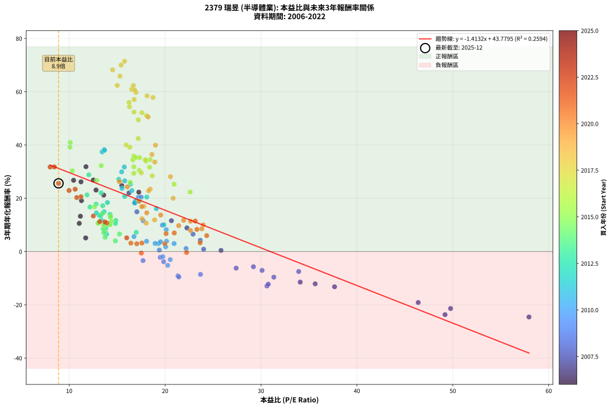
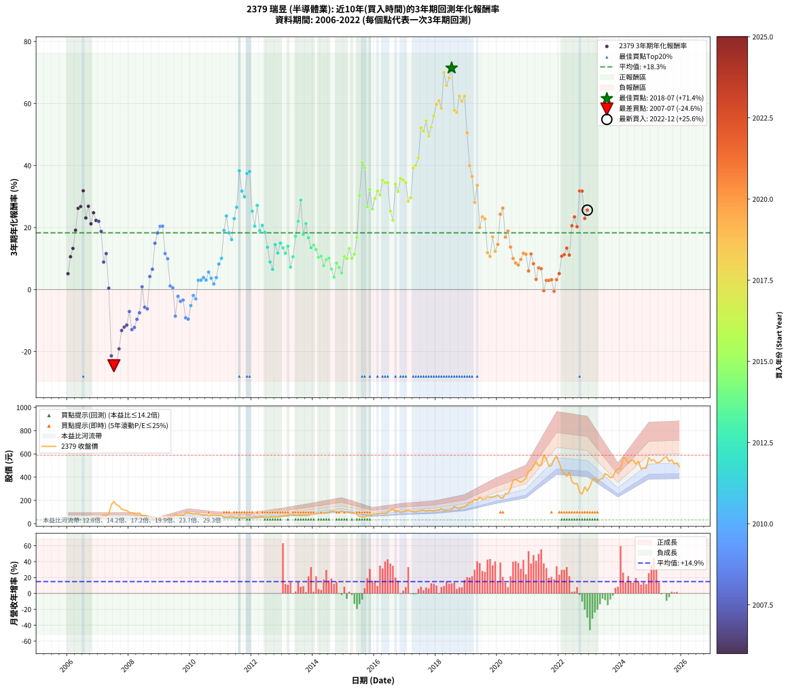

# 2379 瑞昱 - 本益比與未來報酬率分析

!!! info "報告資訊"
    - **股票代號**: 2379
    - **公司名稱**: 瑞昱
    - **產業別**: 半導體業
    - **分析期間**: 2006-2022 (204 個數據點)
    - **資料來源**: Type 12 (ShowMonthlyK_ChartFlow) 月收盤價與本益比
    - **報酬率口徑**: 含現金股利 (簡化: 年度合計，假設每年7/1入帳)
    - **報告生成時間**: 2026-01-10 22:32:23 CST

## 📈 視覺化圖表

### 圖表1: 本益比 vs 未來報酬率關係

*圖表1：2379 瑞昱 本益比與3年期未來報酬率關係 (2006-2022)*

### 圖表2: 歷年買入時點的3年期實際報酬率

*圖表2：2379 瑞昱 歷年買入時點的3年期實際報酬率 (2006-2022)*

## 📍 買點訊號說明

本報告提供兩種買點提示訊號（顯示於圖表2的股價子圖中）：

### ▲ 小綠色三角形（回測驗證）
- **計算方式**: 使用全部歷史資料計算本益比第25百分位數
- **用途**: 事後驗證，顯示歷史上哪些時點確實為低估區
- **限制**: 當下無法判斷，僅供回測參考
- **特性**: 後見之明（Look-Ahead Bias）

### ▲ 小橘色三角形（即時訊號）
- **計算方式**: 使用截至當月的過去5年資料計算本益比第25百分位數
- **用途**: 實際投資決策，當時即可判斷
- **優勢**: 可操作性強，符合實務需求
- **特性**: 無後見之明，滾動窗口計算

!!! tip "如何使用兩種訊號"
    - **綠色▲** 幫助理解歷史估值機會，驗證策略有效性
    - **橘色▲** 可作為實際買進參考，但仍需搭配基本面分析
    - 兩種訊號重疊時，表示即時判斷與事後驗證一致，信心度較高
    - 僅有綠色▲時，表示當時無法判斷（需要未來資料才能確認）
    - 僅有橘色▲時，表示即時判斷為買點，但事後可能不是最佳時機

## 📊 估值分析摘要

| 指標 | 數值 |
|:---:|:---:|
| **目前本益比** (2022-12) | **8.89 倍** |
| **歷史平均本益比** | 18.03 倍 |
| **估值水準** | 🟢 相對低估 |
| **預期3年年化報酬率** | **+31.22%** |
| **歷史平均報酬率** | +18.30% |
| **相關係數 (R²)** | 0.2594 |
| **趨勢線斜率** | -1.4132 |

!!! abstract "核心洞察"
    目前本益比顯著低於歷史平均，預期未來報酬率可能較高

    根據歷史數據回測，2379 瑞昱 在目前本益比 **8.9倍** 的估值水準下，
    預期未來3年年化報酬率約為 **+31.2%**。

    **重要提醒**: 本分析基於歷史數據統計，實際報酬率會受到公司基本面變化、產業趨勢、
    總體經濟環境等多重因素影響。R² = 0.26 表示本益比可解釋約 25.9% 的報酬率變異。

## 📈 歷史估值統計

### 最佳買點 (最高報酬率)

| 項目 | 數值 |
|:---:|:---:|
| 起始時間 | 2018-07 |
| 當時本益比 | 15.78 倍 |
| 起始價格 | 123.0 元 |
| 3年後價格 | 588.0 元 |
| **3年年化報酬率** | **+71.44%** |

### 最差買點 (最低報酬率)

| 項目 | 數值 |
|:---:|:---:|
| 起始時間 | 2007-07 |
| 當時本益比 | 57.94 倍 |
| 起始價格 | 190.0 元 |
| 3年後價格 | 73.1 元 |
| **3年年化報酬率** | **-24.56%** |

## 🎯 投資啟示

### 本益比與報酬率關係

趨勢線方程式: **y = -1.4132x + 43.7795**

!!! warning "強負相關"
    本益比與未來報酬率呈現強負相關。在高本益比時期買入，未來報酬率顯著較低；
    在低本益比時期買入，未來報酬率顯著較高。**估值紀律至關重要**。

### 估值區間建議

基於歷史數據分析:

- **🟢 低估區** (P/E < 14.4): 預期報酬率較高，可考慮增加持股
- **🟡 合理區** (P/E 14.4-21.6): 預期報酬率符合長期趨勢，正常持有
- **🔴 高估區** (P/E > 21.6): 預期報酬率較低，可考慮減碼或觀望

!!! danger "風險提示"
    - 過去表現不代表未來結果
    - 本分析假設公司基本面無重大結構性變化
    - 產業環境劇變可能使歷史規律失效
    - 應結合公司財報、產業趨勢、總體經濟等多重因素綜合判斷

!!! success "長期投資觀點"
    歷史數據顯示，在合理或低估的估值水準買入並長期持有，
    往往能獲得較佳的投資報酬。**耐心等待好價格**是價值投資的核心原則。

## 📊 數據品質

- **資料來源**: GoodInfo.tw Type 12 (ShowMonthlyK_ChartFlow)
- **資料頻率**: 月度收盤價與本益比
- **回測期間**: 2006-2022
- **數據點數量**: 204 個 (每個點代表一次3年期回測)

### 計算方法說明

1. **3年期年化報酬率**:
   - 對每個歷史時點，計算其後3年的實際投資報酬率
   - 期末價值(不含股利): 期末價格
   - 期末價值(含現金股利): 期末價格 + 持有期間內的現金股利合計 (簡化: 年度合計，假設每年7/1入帳)
   - 公式: 年化報酬率 = [(期末價值/期初價格)^(1/年數) - 1] × 100%

2. **本益比 (P/E Ratio)**:
   - 使用當時的月收盤價與EPS計算
   - 資料來源: Type 12 月度河流圖本益比數據

3. **趨勢線 (Linear Regression)**:
   - 使用最小平方法擬合線性趨勢線
   - R²值衡量本益比對報酬率的解釋能力

---

*本報告由 Stock Analysis System v1.9.0 自動生成*
*數據更新時間: 2026-01-10 22:32:23 CST*

## 📋 月度回測明細表

（每一列對應時間線圖中的一個買入點；可用來對照 SVG 圖上的每個點。）

| 買入月份 | 賣出月份 | 回測期限_年 | 實際持有年數 | 買入本益比_倍 | 買入收盤價_元 | 賣出收盤價_元 | 現金股利合計_元 | 總報酬率_pct | 年化報酬率_pct |
| --- | --- | --- | --- | --- | --- | --- | --- | --- | --- |
| 2006-01 | 2009-01 | 3 | 3.001 | 11.72 | 38.10 | 36.00 | 8.25 | +16.14 | +5.11 |
| 2006-02 | 2009-02 | 3 | 3.001 | 11.05 | 35.90 | 40.30 | 8.25 | +35.24 | +10.58 |
| 2006-03 | 2009-03 | 3 | 3.001 | 11.17 | 36.30 | 44.50 | 8.25 | +45.32 | +13.26 |
| 2006-04 | 2009-04 | 3 | 3.001 | 11.28 | 36.65 | 53.70 | 8.25 | +69.03 | +19.12 |
| 2006-05 | 2009-05 | 3 | 3.001 | 11.23 | 36.50 | 65.10 | 8.25 | +100.96 | +26.19 |
| 2006-06 | 2009-06 | 3 | 3.001 | 10.46 | 34.00 | 61.00 | 8.25 | +103.68 | +26.75 |
| 2006-07 | 2009-07 | 3 | 3.001 | 11.75 | 38.20 | 79.50 | 8.10 | +129.32 | +31.86 |
| 2006-08 | 2009-08 | 3 | 3.001 | 12.80 | 41.60 | 69.50 | 8.10 | +86.54 | +23.09 |
| 2006-09 | 2009-09 | 3 | 3.001 | 12.52 | 40.70 | 75.00 | 8.10 | +104.18 | +26.86 |
| 2006-10 | 2009-10 | 3 | 3.001 | 13.60 | 44.20 | 70.60 | 8.10 | +78.05 | +21.20 |
| 2006-11 | 2009-11 | 3 | 3.001 | 15.48 | 50.30 | 89.60 | 8.10 | +94.23 | +24.76 |
| 2006-12 | 2009-12 | 3 | 3.001 | 17.26 | 56.10 | 94.50 | 8.10 | +82.89 | +22.29 |
| 2007-01 | 2010-01 | 3 | 3.001 | 16.23 | 52.80 | 87.80 | 8.10 | +81.63 | +22.00 |
| 2007-02 | 2010-02 | 3 | 3.001 | 16.88 | 55.00 | 84.00 | 8.10 | +67.45 | +18.74 |
| 2007-03 | 2010-03 | 3 | 3.001 | 22.28 | 72.70 | 85.70 | 8.10 | +29.02 | +8.86 |
| 2007-04 | 2010-04 | 3 | 3.001 | 20.66 | 67.50 | 85.70 | 8.10 | +38.96 | +11.59 |
| 2007-05 | 2010-05 | 3 | 3.001 | 25.83 | 84.50 | 77.50 | 8.10 | +1.30 | +0.43 |
| 2007-06 | 2010-06 | 3 | 3.001 | 49.77 | 163.00 | 71.10 | 8.10 | -51.41 | -21.38 |
| 2007-07 | 2010-07 | 3 | 3.001 | 57.94 | 190.00 | 73.10 | 8.45 | -57.08 | -24.56 |
| 2007-08 | 2010-08 | 3 | 3.001 | 49.19 | 161.50 | 63.30 | 8.45 | -55.57 | -23.69 |
| 2007-09 | 2010-09 | 3 | 3.001 | 46.39 | 152.50 | 72.20 | 8.45 | -47.11 | -19.13 |
| 2007-10 | 2010-10 | 3 | 3.001 | 37.67 | 124.00 | 72.60 | 8.45 | -34.64 | -13.21 |
| 2007-11 | 2010-11 | 3 | 3.001 | 35.65 | 117.50 | 71.30 | 8.45 | -32.13 | -12.12 |
| 2007-12 | 2010-12 | 3 | 3.001 | 34.09 | 112.50 | 69.60 | 8.45 | -30.62 | -11.47 |
| 2008-01 | 2011-01 | 3 | 3.001 | 30.11 | 95.80 | 68.40 | 8.45 | -19.78 | -7.08 |
| 2008-02 | 2011-03 | 3 | 3.080 | 30.62 | 93.80 | 52.80 | 8.45 | -34.70 | -12.92 |
| 2008-03 | 2011-03 | 3 | 2.998 | 30.76 | 90.60 | 52.80 | 8.45 | -32.40 | -12.24 |
| 2008-04 | 2011-04 | 3 | 2.998 | 31.34 | 88.60 | 57.00 | 8.45 | -26.13 | -9.61 |
| 2008-05 | 2011-05 | 3 | 2.998 | 33.93 | 91.90 | 64.30 | 8.45 | -20.84 | -7.50 |
| 2008-06 | 2011-06 | 3 | 2.998 | 24.02 | 62.20 | 55.40 | 8.45 | +2.65 | +0.88 |
| 2008-07 | 2011-07 | 3 | 2.998 | 29.21 | 72.20 | 52.60 | 7.95 | -16.14 | -5.70 |
| 2008-08 | 2011-08 | 3 | 2.998 | 27.41 | 64.50 | 45.25 | 7.95 | -17.52 | -6.22 |
| 2008-09 | 2011-09 | 3 | 2.998 | 23.67 | 52.90 | 51.90 | 7.95 | +13.14 | +4.20 |
| 2008-10 | 2011-10 | 3 | 2.998 | 22.91 | 48.50 | 50.70 | 7.95 | +20.93 | +6.54 |
| 2008-11 | 2011-11 | 3 | 2.998 | 17.06 | 34.10 | 43.80 | 7.95 | +51.76 | +14.93 |
| 2008-12 | 2011-12 | 3 | 2.998 | 16.84 | 31.65 | 44.35 | 7.95 | +65.24 | +18.24 |
| 2009-01 | 2012-01 | 3 | 2.998 | 17.22 | 36.00 | 54.80 | 7.95 | +74.31 | +20.36 |
| 2009-02 | 2012-02 | 3 | 2.998 | 17.51 | 40.30 | 62.40 | 7.95 | +74.57 | +20.42 |
| 2009-03 | 2012-03 | 3 | 3.001 | 17.71 | 44.50 | 53.90 | 7.95 | +38.99 | +11.60 |
| 2009-04 | 2012-04 | 3 | 3.001 | 19.72 | 53.70 | 63.40 | 7.95 | +32.87 | +9.93 |
| 2009-05 | 2012-05 | 3 | 3.001 | 22.19 | 65.10 | 59.40 | 7.95 | +3.46 | +1.14 |
| 2009-06 | 2012-06 | 3 | 3.001 | 19.40 | 61.00 | 54.10 | 7.95 | +1.72 | +0.57 |
| 2009-07 | 2012-07 | 3 | 3.001 | 23.69 | 79.50 | 52.10 | 8.65 | -23.58 | -8.57 |
| 2009-08 | 2012-08 | 3 | 3.001 | 19.49 | 69.50 | 56.40 | 8.65 | -6.40 | -2.18 |
| 2009-09 | 2012-09 | 3 | 3.001 | 19.85 | 75.00 | 58.10 | 8.65 | -11.00 | -3.81 |
| 2009-10 | 2012-10 | 3 | 3.001 | 17.70 | 70.60 | 55.00 | 8.65 | -9.84 | -3.39 |
| 2009-11 | 2012-11 | 3 | 3.001 | 21.34 | 89.60 | 58.60 | 8.65 | -24.94 | -9.12 |
| 2009-12 | 2012-12 | 3 | 3.001 | 21.43 | 94.50 | 61.30 | 8.65 | -25.98 | -9.54 |
| 2010-01 | 2013-01 | 3 | 3.001 | 20.27 | 87.80 | 66.20 | 8.65 | -14.75 | -5.18 |
| 2010-02 | 2013-02 | 3 | 3.001 | 19.76 | 84.00 | 70.60 | 8.65 | -5.65 | -1.92 |
| 2010-03 | 2013-03 | 3 | 3.001 | 20.54 | 85.70 | 69.50 | 8.65 | -8.81 | -3.03 |
| 2010-04 | 2013-04 | 3 | 3.001 | 20.94 | 85.70 | 85.00 | 8.65 | +9.28 | +3.00 |
| 2010-05 | 2013-05 | 3 | 3.001 | 19.31 | 77.50 | 76.10 | 8.65 | +9.35 | +3.03 |
| 2010-06 | 2013-06 | 3 | 3.001 | 18.07 | 71.10 | 71.00 | 8.65 | +12.03 | +3.86 |
| 2010-07 | 2013-07 | 3 | 3.001 | 18.96 | 73.10 | 71.80 | 8.20 | +9.44 | +3.05 |
| 2010-08 | 2013-08 | 3 | 3.001 | 16.76 | 63.30 | 66.40 | 8.20 | +17.85 | +5.63 |
| 2010-09 | 2013-09 | 3 | 3.001 | 19.53 | 72.20 | 72.20 | 8.20 | +11.36 | +3.65 |
| 2010-10 | 2013-10 | 3 | 3.001 | 20.06 | 72.60 | 68.40 | 8.20 | +5.51 | +1.80 |
| 2010-11 | 2013-11 | 3 | 3.001 | 20.15 | 71.30 | 71.70 | 8.20 | +12.06 | +3.87 |
| 2010-12 | 2013-12 | 3 | 3.001 | 20.12 | 69.60 | 80.00 | 8.20 | +26.72 | +8.21 |
| 2011-01 | 2014-01 | 3 | 3.001 | 19.87 | 68.40 | 83.00 | 8.20 | +33.33 | +10.06 |
| 2011-02 | 2014-02 | 3 | 3.001 | 17.00 | 58.20 | 90.00 | 8.20 | +68.73 | +19.05 |
| 2011-03 | 2014-03 | 3 | 3.001 | 15.51 | 52.80 | 91.80 | 8.20 | +89.39 | +23.72 |
| 2011-04 | 2014-04 | 3 | 3.001 | 16.83 | 57.00 | 86.10 | 8.20 | +65.44 | +18.27 |
| 2011-05 | 2014-05 | 3 | 3.001 | 19.09 | 64.30 | 92.50 | 8.20 | +56.61 | +16.12 |
| 2011-06 | 2014-06 | 3 | 3.001 | 16.54 | 55.40 | 94.60 | 8.20 | +85.56 | +22.88 |
| 2011-07 | 2014-07 | 3 | 3.001 | 15.79 | 52.60 | 95.90 | 10.70 | +102.66 | +26.54 |
| 2011-08 | 2014-08 | 3 | 3.001 | 13.66 | 45.25 | 109.00 | 10.70 | +164.53 | +38.29 |
| 2011-09 | 2014-09 | 3 | 3.001 | 15.75 | 51.90 | 108.00 | 10.70 | +128.71 | +31.74 |
| 2011-10 | 2014-10 | 3 | 3.001 | 15.47 | 50.70 | 100.50 | 10.70 | +119.33 | +29.92 |
| 2011-11 | 2014-11 | 3 | 3.001 | 13.44 | 43.80 | 103.00 | 10.70 | +159.59 | +37.42 |
| 2011-12 | 2014-12 | 3 | 3.001 | 13.69 | 44.35 | 106.00 | 10.70 | +163.13 | +38.05 |
| 2012-01 | 2015-01 | 3 | 3.001 | 16.38 | 54.80 | 97.10 | 10.70 | +96.72 | +25.29 |
| 2012-02 | 2015-03 | 3 | 3.080 | 18.09 | 62.40 | 100.00 | 10.70 | +77.40 | +20.46 |
| 2012-03 | 2015-03 | 3 | 2.998 | 15.17 | 53.90 | 100.00 | 10.70 | +105.38 | +27.13 |
| 2012-04 | 2015-04 | 3 | 2.998 | 17.33 | 63.40 | 96.00 | 10.70 | +68.30 | +18.96 |
| 2012-05 | 2015-05 | 3 | 2.998 | 15.79 | 59.40 | 93.70 | 10.70 | +75.76 | +20.70 |
| 2012-06 | 2015-06 | 3 | 2.998 | 13.99 | 54.10 | 79.10 | 10.70 | +65.99 | +18.42 |
| 2012-07 | 2015-07 | 3 | 2.998 | 13.12 | 52.10 | 62.10 | 14.40 | +46.83 | +13.67 |
| 2012-08 | 2015-08 | 3 | 2.998 | 13.83 | 56.40 | 58.40 | 14.40 | +29.08 | +8.89 |
| 2012-09 | 2015-09 | 3 | 2.998 | 13.90 | 58.10 | 55.80 | 14.40 | +20.83 | +6.51 |
| 2012-10 | 2015-10 | 3 | 2.998 | 12.83 | 55.00 | 68.10 | 14.40 | +50.00 | +14.48 |
| 2012-11 | 2015-11 | 3 | 2.998 | 13.35 | 58.60 | 67.40 | 14.40 | +39.59 | +11.77 |
| 2012-12 | 2015-12 | 3 | 2.998 | 13.64 | 61.30 | 78.70 | 14.40 | +51.88 | +14.96 |
| 2013-01 | 2016-01 | 3 | 2.998 | 14.32 | 66.20 | 82.20 | 14.40 | +45.92 | +13.43 |
| 2013-02 | 2016-02 | 3 | 2.998 | 14.87 | 70.60 | 83.90 | 14.40 | +39.24 | +11.67 |
| 2013-03 | 2016-03 | 3 | 3.001 | 14.25 | 69.50 | 88.50 | 14.40 | +48.06 | +13.97 |
| 2013-04 | 2016-04 | 3 | 3.001 | 16.99 | 85.00 | 90.40 | 14.40 | +23.29 | +7.23 |
| 2013-05 | 2016-05 | 3 | 3.001 | 14.83 | 76.10 | 88.40 | 14.40 | +35.09 | +10.54 |
| 2013-06 | 2016-06 | 3 | 3.001 | 13.50 | 71.00 | 99.90 | 14.40 | +60.99 | +17.20 |
| 2013-07 | 2016-07 | 3 | 3.001 | 13.33 | 71.80 | 115.50 | 15.00 | +81.75 | +22.03 |
| 2013-08 | 2016-08 | 3 | 3.001 | 12.05 | 66.40 | 127.00 | 15.00 | +113.86 | +28.83 |
| 2013-09 | 2016-09 | 3 | 3.001 | 12.80 | 72.20 | 103.00 | 15.00 | +63.43 | +17.79 |
| 2013-10 | 2016-10 | 3 | 3.001 | 11.86 | 68.40 | 107.00 | 15.00 | +78.36 | +21.27 |
| 2013-11 | 2016-11 | 3 | 3.001 | 12.17 | 71.70 | 99.00 | 15.00 | +59.00 | +16.71 |
| 2013-12 | 2016-12 | 3 | 3.001 | 13.29 | 80.00 | 102.00 | 15.00 | +46.25 | +13.51 |
| 2014-01 | 2017-01 | 3 | 3.001 | 13.47 | 83.00 | 109.00 | 15.00 | +49.40 | +14.31 |
| 2014-02 | 2017-02 | 3 | 3.001 | 14.28 | 90.00 | 114.50 | 15.00 | +43.89 | +12.89 |
| 2014-03 | 2017-03 | 3 | 3.001 | 14.25 | 91.80 | 108.50 | 15.00 | +34.53 | +10.39 |
| 2014-04 | 2017-04 | 3 | 3.001 | 13.08 | 86.10 | 102.00 | 15.00 | +35.89 | +10.76 |
| 2014-05 | 2017-05 | 3 | 3.001 | 13.76 | 92.50 | 100.50 | 15.00 | +24.86 | +7.68 |
| 2014-06 | 2017-06 | 3 | 3.001 | 13.78 | 94.60 | 109.50 | 15.00 | +31.61 | +9.58 |
| 2014-07 | 2017-07 | 3 | 3.001 | 13.69 | 95.90 | 113.00 | 15.00 | +33.47 | +10.10 |
| 2014-08 | 2017-08 | 3 | 3.001 | 15.25 | 109.00 | 117.00 | 15.00 | +21.10 | +6.59 |
| 2014-09 | 2017-09 | 3 | 3.001 | 14.82 | 108.00 | 106.50 | 15.00 | +12.50 | +4.00 |
| 2014-10 | 2017-10 | 3 | 3.001 | 13.53 | 100.50 | 113.50 | 15.00 | +27.86 | +8.54 |
| 2014-11 | 2017-11 | 3 | 3.001 | 13.61 | 103.00 | 111.50 | 15.00 | +22.82 | +7.09 |
| 2014-12 | 2017-12 | 3 | 3.001 | 13.75 | 106.00 | 109.00 | 15.00 | +16.98 | +5.37 |
| 2015-01 | 2018-01 | 3 | 3.001 | 13.00 | 97.10 | 116.50 | 15.00 | +35.43 | +10.63 |
| 2015-02 | 2018-02 | 3 | 3.001 | 13.62 | 98.40 | 116.00 | 15.00 | +33.13 | +10.01 |
| 2015-03 | 2018-03 | 3 | 3.001 | 14.32 | 100.00 | 130.00 | 15.00 | +45.00 | +13.18 |
| 2015-04 | 2018-04 | 3 | 3.001 | 14.24 | 96.00 | 113.00 | 15.00 | +33.33 | +10.06 |
| 2015-05 | 2018-05 | 3 | 3.001 | 14.41 | 93.70 | 114.50 | 15.00 | +38.21 | +11.39 |
| 2015-06 | 2018-06 | 3 | 3.001 | 12.64 | 79.10 | 111.00 | 15.00 | +59.29 | +16.78 |
| 2015-07 | 2018-07 | 3 | 3.001 | 10.32 | 62.10 | 123.00 | 14.50 | +121.42 | +30.33 |
| 2015-08 | 2018-08 | 3 | 3.001 | 10.11 | 58.40 | 149.00 | 14.50 | +179.97 | +40.93 |
| 2015-09 | 2018-09 | 3 | 3.001 | 10.08 | 55.80 | 136.00 | 14.50 | +169.71 | +39.19 |
| 2015-10 | 2018-10 | 3 | 3.001 | 12.87 | 68.10 | 124.00 | 14.50 | +103.38 | +26.69 |
| 2015-11 | 2018-11 | 3 | 3.001 | 13.34 | 67.40 | 141.50 | 14.50 | +131.45 | +32.27 |
| 2015-12 | 2018-12 | 3 | 3.001 | 16.36 | 78.70 | 143.00 | 14.50 | +100.13 | +26.01 |
| 2016-01 | 2019-01 | 3 | 3.001 | 16.74 | 82.20 | 163.50 | 14.50 | +116.55 | +29.37 |
| 2016-02 | 2019-03 | 3 | 3.080 | 16.74 | 83.90 | 182.00 | 14.50 | +134.21 | +31.82 |
| 2016-03 | 2019-03 | 3 | 2.998 | 17.31 | 88.50 | 182.00 | 14.50 | +122.03 | +30.48 |
| 2016-04 | 2019-04 | 3 | 2.998 | 17.34 | 90.40 | 209.00 | 14.50 | +147.23 | +35.25 |
| 2016-05 | 2019-05 | 3 | 2.998 | 16.63 | 88.40 | 200.00 | 14.50 | +142.65 | +34.40 |
| 2016-06 | 2019-06 | 3 | 2.998 | 18.45 | 99.90 | 228.50 | 14.50 | +143.24 | +34.51 |
| 2016-07 | 2019-07 | 3 | 2.998 | 20.94 | 115.50 | 209.50 | 17.50 | +96.54 | +25.28 |
| 2016-08 | 2019-08 | 3 | 2.998 | 22.61 | 127.00 | 215.00 | 17.50 | +83.07 | +22.35 |
| 2016-09 | 2019-09 | 3 | 2.998 | 18.01 | 103.00 | 230.00 | 17.50 | +140.29 | +33.97 |
| 2016-10 | 2019-10 | 3 | 2.998 | 18.39 | 107.00 | 226.50 | 17.50 | +128.04 | +31.65 |
| 2016-11 | 2019-11 | 3 | 2.998 | 16.73 | 99.00 | 230.50 | 17.50 | +150.51 | +35.84 |
| 2016-12 | 2019-12 | 3 | 2.998 | 16.94 | 102.00 | 235.00 | 17.50 | +147.55 | +35.30 |
| 2017-01 | 2020-01 | 3 | 2.998 | 17.94 | 109.00 | 247.50 | 17.50 | +143.12 | +34.49 |
| 2017-02 | 2020-02 | 3 | 2.998 | 18.66 | 114.50 | 225.00 | 17.50 | +111.79 | +28.44 |
| 2017-03 | 2020-03 | 3 | 3.001 | 17.52 | 108.50 | 218.50 | 17.50 | +117.51 | +29.56 |
| 2017-04 | 2020-04 | 3 | 3.001 | 16.32 | 102.00 | 257.50 | 17.50 | +169.61 | +39.17 |
| 2017-05 | 2020-05 | 3 | 3.001 | 15.93 | 100.50 | 258.50 | 17.50 | +174.63 | +40.03 |
| 2017-06 | 2020-06 | 3 | 3.001 | 17.20 | 109.50 | 299.00 | 17.50 | +189.04 | +42.44 |
| 2017-07 | 2020-07 | 3 | 3.001 | 17.59 | 113.00 | 374.50 | 23.50 | +252.21 | +52.13 |
| 2017-08 | 2020-08 | 3 | 3.001 | 18.06 | 117.00 | 380.00 | 23.50 | +244.87 | +51.07 |
| 2017-09 | 2020-09 | 3 | 3.001 | 16.29 | 106.50 | 368.50 | 23.50 | +268.08 | +54.38 |
| 2017-10 | 2020-10 | 3 | 3.001 | 17.21 | 113.50 | 355.50 | 23.50 | +233.92 | +49.45 |
| 2017-11 | 2020-11 | 3 | 3.001 | 16.76 | 111.50 | 371.00 | 23.50 | +253.81 | +52.36 |
| 2017-12 | 2020-12 | 3 | 3.001 | 16.24 | 109.00 | 390.50 | 23.50 | +279.82 | +56.01 |
| 2018-01 | 2021-01 | 3 | 3.001 | 16.97 | 116.50 | 451.50 | 23.50 | +307.73 | +59.74 |
| 2018-02 | 2021-02 | 3 | 3.001 | 16.52 | 116.00 | 460.00 | 23.50 | +316.81 | +60.92 |
| 2018-03 | 2021-03 | 3 | 3.001 | 18.12 | 130.00 | 494.00 | 23.50 | +298.08 | +58.47 |
| 2018-04 | 2021-04 | 3 | 3.001 | 15.42 | 113.00 | 532.00 | 23.50 | +391.59 | +70.01 |
| 2018-05 | 2021-05 | 3 | 3.001 | 15.30 | 114.50 | 499.00 | 23.50 | +356.33 | +65.85 |
| 2018-06 | 2021-06 | 3 | 3.001 | 14.53 | 111.00 | 505.00 | 23.50 | +376.13 | +68.21 |
| 2018-07 | 2021-07 | 3 | 3.001 | 15.78 | 123.00 | 588.00 | 32.00 | +404.07 | +71.44 |
| 2018-08 | 2021-08 | 3 | 3.001 | 18.74 | 149.00 | 554.00 | 32.00 | +293.29 | +57.83 |
| 2018-09 | 2021-09 | 3 | 3.001 | 16.78 | 136.00 | 495.50 | 32.00 | +287.87 | +57.10 |
| 2018-10 | 2021-10 | 3 | 3.001 | 15.01 | 124.00 | 499.00 | 32.00 | +328.23 | +62.37 |
| 2018-11 | 2021-11 | 3 | 3.001 | 16.82 | 141.50 | 555.00 | 32.00 | +314.84 | +60.66 |
| 2018-12 | 2021-12 | 3 | 3.001 | 16.69 | 143.00 | 580.00 | 32.00 | +327.97 | +62.34 |
| 2019-01 | 2022-01 | 3 | 3.001 | 18.23 | 163.50 | 526.00 | 32.00 | +241.28 | +50.54 |
| 2019-02 | 2022-02 | 3 | 3.001 | 19.00 | 178.00 | 456.00 | 32.00 | +174.16 | +39.95 |
| 2019-03 | 2022-03 | 3 | 3.001 | 18.63 | 182.00 | 430.50 | 32.00 | +154.12 | +36.45 |
| 2019-04 | 2022-04 | 3 | 3.001 | 20.56 | 209.00 | 407.50 | 32.00 | +110.29 | +28.11 |
| 2019-05 | 2022-05 | 3 | 3.001 | 18.93 | 200.00 | 445.00 | 32.00 | +138.50 | +33.60 |
| 2019-06 | 2022-06 | 3 | 3.001 | 20.84 | 228.50 | 363.00 | 32.00 | +72.87 | +20.01 |
| 2019-07 | 2022-07 | 3 | 3.001 | 18.44 | 209.50 | 342.00 | 52.00 | +88.07 | +23.43 |
| 2019-08 | 2022-08 | 3 | 3.001 | 18.28 | 215.00 | 346.00 | 52.00 | +85.12 | +22.78 |
| 2019-09 | 2022-09 | 3 | 3.001 | 18.91 | 230.00 | 270.00 | 52.00 | +40.00 | +11.87 |
| 2019-10 | 2022-10 | 3 | 3.001 | 18.03 | 226.50 | 255.00 | 52.00 | +35.54 | +10.67 |
| 2019-11 | 2022-11 | 3 | 3.001 | 17.78 | 230.50 | 317.00 | 52.00 | +60.09 | +16.98 |
| 2019-12 | 2022-12 | 3 | 3.001 | 17.59 | 235.00 | 281.00 | 52.00 | +41.70 | +12.32 |
| 2020-01 | 2023-01 | 3 | 3.001 | 18.09 | 247.50 | 320.00 | 52.00 | +50.30 | +14.54 |
| 2020-02 | 2023-03 | 3 | 3.080 | 16.06 | 225.00 | 387.50 | 52.00 | +95.33 | +24.28 |
| 2020-03 | 2023-03 | 3 | 2.998 | 15.25 | 218.50 | 387.50 | 52.00 | +101.14 | +26.25 |
| 2020-04 | 2023-04 | 3 | 2.998 | 17.57 | 257.50 | 359.00 | 52.00 | +59.61 | +16.88 |
| 2020-05 | 2023-05 | 3 | 2.998 | 17.26 | 258.50 | 382.00 | 52.00 | +67.89 | +18.87 |
| 2020-06 | 2023-06 | 3 | 2.998 | 19.54 | 299.00 | 387.50 | 52.00 | +46.99 | +13.71 |
| 2020-07 | 2023-07 | 3 | 2.998 | 23.97 | 374.50 | 430.50 | 68.00 | +33.11 | +10.01 |
| 2020-08 | 2023-08 | 3 | 2.998 | 23.83 | 380.00 | 418.00 | 68.00 | +27.89 | +8.55 |
| 2020-09 | 2023-09 | 3 | 2.998 | 22.65 | 368.50 | 395.00 | 68.00 | +25.64 | +7.91 |
| 2020-10 | 2023-10 | 3 | 2.998 | 21.42 | 355.50 | 401.50 | 68.00 | +32.07 | +9.72 |
| 2020-11 | 2023-11 | 3 | 2.998 | 21.93 | 371.00 | 449.50 | 68.00 | +39.49 | +11.74 |
| 2020-12 | 2023-12 | 3 | 2.998 | 22.65 | 390.50 | 471.50 | 68.00 | +38.16 | +11.38 |
| 2021-01 | 2024-01 | 3 | 2.998 | 24.34 | 451.50 | 469.50 | 68.00 | +19.05 | +5.99 |
| 2021-02 | 2024-02 | 3 | 2.998 | 23.15 | 460.00 | 569.00 | 68.00 | +38.48 | +11.47 |
| 2021-03 | 2024-03 | 3 | 3.001 | 23.32 | 494.00 | 560.00 | 68.00 | +27.13 | +8.33 |
| 2021-04 | 2024-04 | 3 | 3.001 | 23.65 | 532.00 | 518.00 | 68.00 | +10.15 | +3.27 |
| 2021-05 | 2024-05 | 3 | 3.001 | 20.96 | 499.00 | 543.00 | 68.00 | +22.44 | +6.98 |
| 2021-06 | 2024-06 | 3 | 3.001 | 20.10 | 505.00 | 546.00 | 68.00 | +21.58 | +6.73 |
| 2021-07 | 2024-07 | 3 | 3.001 | 22.24 | 588.00 | 512.00 | 69.50 | -1.11 | -0.37 |
| 2021-08 | 2024-08 | 3 | 3.001 | 19.97 | 554.00 | 535.00 | 69.50 | +9.12 | +2.95 |
| 2021-09 | 2024-09 | 3 | 3.001 | 17.05 | 495.50 | 471.00 | 69.50 | +9.08 | +2.94 |
| 2021-10 | 2024-10 | 3 | 3.001 | 16.43 | 499.00 | 478.50 | 69.50 | +9.82 | +3.17 |
| 2021-11 | 2024-11 | 3 | 3.001 | 17.52 | 555.00 | 476.00 | 69.50 | -1.71 | -0.57 |
| 2021-12 | 2024-12 | 3 | 3.001 | 17.58 | 580.00 | 568.00 | 69.50 | +9.91 | +3.20 |
| 2022-01 | 2025-01 | 3 | 3.001 | 16.00 | 526.00 | 542.00 | 69.50 | +16.25 | +5.15 |
| 2022-02 | 2025-02 | 3 | 3.001 | 13.92 | 456.00 | 550.00 | 69.50 | +35.86 | +10.75 |
| 2022-03 | 2025-03 | 3 | 3.001 | 13.18 | 430.50 | 523.00 | 69.50 | +37.63 | +11.23 |
| 2022-04 | 2025-04 | 3 | 3.001 | 12.52 | 407.50 | 524.00 | 69.50 | +45.64 | +13.35 |
| 2022-05 | 2025-05 | 3 | 3.001 | 13.72 | 445.00 | 541.00 | 69.50 | +37.19 | +11.11 |
| 2022-06 | 2025-06 | 3 | 3.001 | 11.23 | 363.00 | 567.00 | 69.50 | +75.34 | +20.58 |
| 2022-07 | 2025-07 | 3 | 3.001 | 10.62 | 342.00 | 575.00 | 68.00 | +88.01 | +23.42 |
| 2022-08 | 2025-08 | 3 | 3.001 | 10.79 | 346.00 | 534.00 | 68.00 | +73.99 | +20.27 |
| 2022-09 | 2025-09 | 3 | 3.001 | 8.45 | 270.00 | 550.00 | 68.00 | +128.89 | +31.78 |
| 2022-10 | 2025-10 | 3 | 3.001 | 8.01 | 255.00 | 515.00 | 68.00 | +128.63 | +31.73 |
| 2022-11 | 2025-11 | 3 | 3.001 | 9.99 | 317.00 | 521.00 | 68.00 | +85.80 | +22.93 |
| 2022-12 | 2025-12 | 3 | 3.001 | 8.89 | 281.00 | 489.00 | 68.00 | +98.22 | +25.61 |
