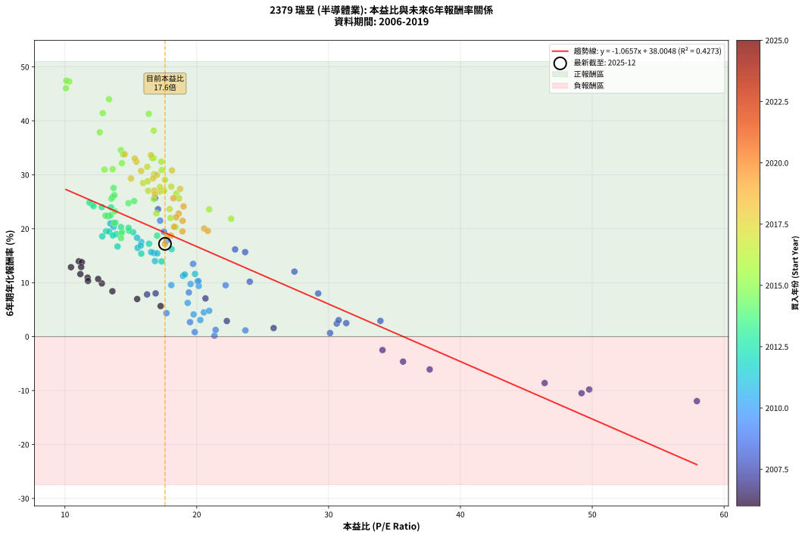
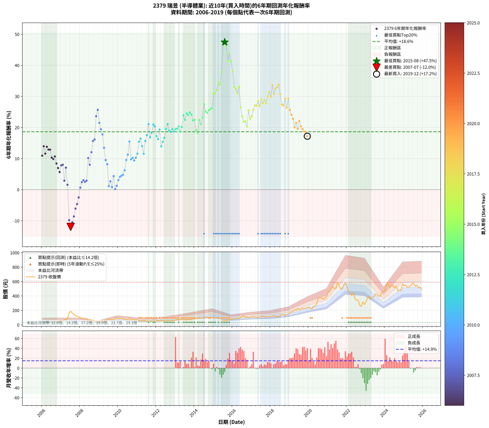

# 2379 瑞昱 - 本益比與未來報酬率分析

!!! info "報告資訊"
    - **股票代號**: 2379
    - **公司名稱**: 瑞昱
    - **產業別**: 半導體業
    - **分析期間**: 2006-2019 (168 個數據點)
    - **資料來源**: Type 12 (ShowMonthlyK_ChartFlow) 月收盤價與本益比
    - **報酬率口徑**: 含現金股利 (簡化: 年度合計，假設每年7/1入帳)
    - **報告生成時間**: 2026-01-06 18:33:52 CST

## 📈 視覺化圖表

### 圖表1: 本益比 vs 未來報酬率關係

*圖表1：2379 瑞昱 本益比與6年期未來報酬率關係 (2006-2019)*

### 圖表2: 歷年買入時點的6年期實際報酬率

*圖表2：2379 瑞昱 歷年買入時點的6年期實際報酬率 (2006-2019)*

## 📍 買點訊號說明

本報告提供兩種買點提示訊號（顯示於圖表2的股價子圖中）：

### ▲ 小綠色三角形（回測驗證）
- **計算方式**: 使用全部歷史資料計算本益比第25百分位數
- **用途**: 事後驗證，顯示歷史上哪些時點確實為低估區
- **限制**: 當下無法判斷，僅供回測參考
- **特性**: 後見之明（Look-Ahead Bias）

### ▲ 小橘色三角形（即時訊號）
- **計算方式**: 使用截至當月的過去5年資料計算本益比第25百分位數
- **用途**: 實際投資決策，當時即可判斷
- **優勢**: 可操作性強，符合實務需求
- **特性**: 無後見之明，滾動窗口計算

!!! tip "如何使用兩種訊號"
    - **綠色▲** 幫助理解歷史估值機會，驗證策略有效性
    - **橘色▲** 可作為實際買進參考，但仍需搭配基本面分析
    - 兩種訊號重疊時，表示即時判斷與事後驗證一致，信心度較高
    - 僅有綠色▲時，表示當時無法判斷（需要未來資料才能確認）
    - 僅有橘色▲時，表示即時判斷為買點，但事後可能不是最佳時機

## 📊 估值分析摘要

| 指標 | 數值 |
|:---:|:---:|
| **目前本益比** (2019-12) | **17.59 倍** |
| **歷史平均本益比** | 18.18 倍 |
| **估值水準** | 🟡 合理範圍 |
| **預期6年年化報酬率** | **+19.26%** |
| **歷史平均報酬率** | +18.63% |
| **相關係數 (R²)** | 0.4273 |
| **趨勢線斜率** | -1.0657 |

!!! abstract "核心洞察"
    目前本益比接近歷史平均，預期報酬率符合長期趨勢

    根據歷史數據回測，2379 瑞昱 在目前本益比 **17.6倍** 的估值水準下，
    預期未來6年年化報酬率約為 **+19.3%**。

    **重要提醒**: 本分析基於歷史數據統計，實際報酬率會受到公司基本面變化、產業趨勢、
    總體經濟環境等多重因素影響。R² = 0.43 表示本益比可解釋約 42.7% 的報酬率變異。

## 📈 歷史估值統計

### 最佳買點 (最高報酬率)

| 項目 | 數值 |
|:---:|:---:|
| 起始時間 | 2015-08 |
| 當時本益比 | 10.11 倍 |
| 起始價格 | 58.4 元 |
| 6年後價格 | 554.0 元 |
| **6年年化報酬率** | **+47.45%** |

### 最差買點 (最低報酬率)

| 項目 | 數值 |
|:---:|:---:|
| 起始時間 | 2007-07 |
| 當時本益比 | 57.94 倍 |
| 起始價格 | 190.0 元 |
| 6年後價格 | 71.8 元 |
| **6年年化報酬率** | **-11.96%** |

## 🎯 投資啟示

### 本益比與報酬率關係

趨勢線方程式: **y = -1.0657x + 38.0048**

!!! warning "強負相關"
    本益比與未來報酬率呈現強負相關。在高本益比時期買入，未來報酬率顯著較低；
    在低本益比時期買入，未來報酬率顯著較高。**估值紀律至關重要**。

### 估值區間建議

基於歷史數據分析:

- **🟢 低估區** (P/E < 14.5): 預期報酬率較高，可考慮增加持股
- **🟡 合理區** (P/E 14.5-21.8): 預期報酬率符合長期趨勢，正常持有
- **🔴 高估區** (P/E > 21.8): 預期報酬率較低，可考慮減碼或觀望

!!! danger "風險提示"
    - 過去表現不代表未來結果
    - 本分析假設公司基本面無重大結構性變化
    - 產業環境劇變可能使歷史規律失效
    - 應結合公司財報、產業趨勢、總體經濟等多重因素綜合判斷

!!! success "長期投資觀點"
    歷史數據顯示，在合理或低估的估值水準買入並長期持有，
    往往能獲得較佳的投資報酬。**耐心等待好價格**是價值投資的核心原則。

## 📊 數據品質

- **資料來源**: GoodInfo.tw Type 12 (ShowMonthlyK_ChartFlow)
- **資料頻率**: 月度收盤價與本益比
- **回測期間**: 2006-2019
- **數據點數量**: 168 個 (每個點代表一次6年期回測)

### 計算方法說明

1. **6年期年化報酬率**:
   - 對每個歷史時點，計算其後6年的實際投資報酬率
   - 期末價值(不含股利): 期末價格
   - 期末價值(含現金股利): 期末價格 + 持有期間內的現金股利合計 (簡化: 年度合計，假設每年7/1入帳)
   - 公式: 年化報酬率 = [(期末價值/期初價格)^(1/年數) - 1] × 100%

2. **本益比 (P/E Ratio)**:
   - 使用當時的月收盤價與EPS計算
   - 資料來源: Type 12 月度河流圖本益比數據

3. **趨勢線 (Linear Regression)**:
   - 使用最小平方法擬合線性趨勢線
   - R²值衡量本益比對報酬率的解釋能力

---

*本報告由 Stock Analysis System v1.9.0 自動生成*
*數據更新時間: 2026-01-06 18:33:52 CST*

## 📋 月度回測明細表

（每一列對應時間線圖中的一個買入點；可用來對照 SVG 圖上的每個點。）

| 買入月份 | 賣出月份 | 回測期限_年 | 實際持有年數 | 買入本益比_倍 | 買入收盤價_元 | 賣出收盤價_元 | 現金股利合計_元 | 總報酬率_pct | 年化報酬率_pct |
| --- | --- | --- | --- | --- | --- | --- | --- | --- | --- |
| 2006-01 | 2012-01 | 6 | 5.999 | 11.72 | 38.10 | 54.80 | 16.20 | +86.35 | +10.93 |
| 2006-02 | 2012-02 | 6 | 5.999 | 11.05 | 35.90 | 62.40 | 16.20 | +118.94 | +13.96 |
| 2006-03 | 2012-03 | 6 | 6.001 | 11.17 | 36.30 | 53.90 | 16.20 | +93.11 | +11.59 |
| 2006-04 | 2012-04 | 6 | 6.001 | 11.28 | 36.65 | 63.40 | 16.20 | +117.19 | +13.80 |
| 2006-05 | 2012-05 | 6 | 6.001 | 11.23 | 36.50 | 59.40 | 16.20 | +107.12 | +12.90 |
| 2006-06 | 2012-06 | 6 | 6.001 | 10.46 | 34.00 | 54.10 | 16.20 | +106.76 | +12.87 |
| 2006-07 | 2012-07 | 6 | 6.001 | 11.75 | 38.20 | 52.10 | 16.75 | +80.24 | +10.31 |
| 2006-08 | 2012-08 | 6 | 6.001 | 12.80 | 41.60 | 56.40 | 16.75 | +75.84 | +9.86 |
| 2006-09 | 2012-09 | 6 | 6.001 | 12.52 | 40.70 | 58.10 | 16.75 | +83.91 | +10.69 |
| 2006-10 | 2012-10 | 6 | 6.001 | 13.60 | 44.20 | 55.00 | 16.75 | +62.33 | +8.41 |
| 2006-11 | 2012-11 | 6 | 6.001 | 15.48 | 50.30 | 58.60 | 16.75 | +49.80 | +6.97 |
| 2006-12 | 2012-12 | 6 | 6.001 | 17.26 | 56.10 | 61.30 | 16.75 | +39.13 | +5.66 |
| 2007-01 | 2013-01 | 6 | 6.001 | 16.23 | 52.80 | 66.20 | 16.75 | +57.10 | +7.82 |
| 2007-02 | 2013-02 | 6 | 6.001 | 16.88 | 55.00 | 70.60 | 16.75 | +58.82 | +8.01 |
| 2007-03 | 2013-03 | 6 | 6.001 | 22.28 | 72.70 | 69.50 | 16.75 | +18.64 | +2.89 |
| 2007-04 | 2013-04 | 6 | 6.001 | 20.66 | 67.50 | 85.00 | 16.75 | +50.74 | +7.08 |
| 2007-05 | 2013-05 | 6 | 6.001 | 25.83 | 84.50 | 76.10 | 16.75 | +9.88 | +1.58 |
| 2007-06 | 2013-06 | 6 | 6.001 | 49.77 | 163.00 | 71.00 | 16.75 | -46.17 | -9.80 |
| 2007-07 | 2013-07 | 6 | 6.001 | 57.94 | 190.00 | 71.80 | 16.65 | -53.45 | -11.96 |
| 2007-08 | 2013-08 | 6 | 6.001 | 49.19 | 161.50 | 66.40 | 16.65 | -48.58 | -10.49 |
| 2007-09 | 2013-09 | 6 | 6.001 | 46.39 | 152.50 | 72.20 | 16.65 | -41.74 | -8.61 |
| 2007-10 | 2013-10 | 6 | 6.001 | 37.67 | 124.00 | 68.40 | 16.65 | -31.41 | -6.09 |
| 2007-11 | 2013-11 | 6 | 6.001 | 35.65 | 117.50 | 71.70 | 16.65 | -24.81 | -4.64 |
| 2007-12 | 2013-12 | 6 | 6.001 | 34.09 | 112.50 | 80.00 | 16.65 | -14.09 | -2.50 |
| 2008-01 | 2014-01 | 6 | 6.001 | 30.11 | 95.80 | 83.00 | 16.65 | +4.02 | +0.66 |
| 2008-02 | 2014-03 | 6 | 6.081 | 30.62 | 93.80 | 91.80 | 16.65 | +15.62 | +2.42 |
| 2008-03 | 2014-03 | 6 | 5.999 | 30.76 | 90.60 | 91.80 | 16.65 | +19.70 | +3.04 |
| 2008-04 | 2014-04 | 6 | 5.999 | 31.34 | 88.60 | 86.10 | 16.65 | +15.97 | +2.50 |
| 2008-05 | 2014-05 | 6 | 5.999 | 33.93 | 91.90 | 92.50 | 16.65 | +18.77 | +2.91 |
| 2008-06 | 2014-06 | 6 | 5.999 | 24.02 | 62.20 | 94.60 | 16.65 | +78.86 | +10.18 |
| 2008-07 | 2014-07 | 6 | 5.999 | 29.21 | 72.20 | 95.90 | 18.65 | +58.66 | +8.00 |
| 2008-08 | 2014-08 | 6 | 5.999 | 27.41 | 64.50 | 109.00 | 18.65 | +97.91 | +12.05 |
| 2008-09 | 2014-09 | 6 | 5.999 | 23.67 | 52.90 | 108.00 | 18.65 | +139.41 | +15.67 |
| 2008-10 | 2014-10 | 6 | 5.999 | 22.91 | 48.50 | 100.50 | 18.65 | +145.67 | +16.16 |
| 2008-11 | 2014-11 | 6 | 5.999 | 17.06 | 34.10 | 103.00 | 18.65 | +256.74 | +23.62 |
| 2008-12 | 2014-12 | 6 | 5.999 | 16.84 | 31.65 | 106.00 | 18.65 | +293.84 | +25.67 |
| 2009-01 | 2015-01 | 6 | 5.999 | 17.22 | 36.00 | 97.10 | 18.65 | +221.53 | +21.49 |
| 2009-02 | 2015-02 | 6 | 5.999 | 17.51 | 40.30 | 98.40 | 18.65 | +190.45 | +19.45 |
| 2009-03 | 2015-03 | 6 | 5.999 | 17.71 | 44.50 | 100.00 | 18.65 | +166.63 | +17.76 |
| 2009-04 | 2015-04 | 6 | 5.999 | 19.72 | 53.70 | 96.00 | 18.65 | +113.50 | +13.48 |
| 2009-05 | 2015-05 | 6 | 5.999 | 22.19 | 65.10 | 93.70 | 18.65 | +72.58 | +9.52 |
| 2009-06 | 2015-06 | 6 | 5.999 | 19.40 | 61.00 | 79.10 | 18.65 | +60.25 | +8.18 |
| 2009-07 | 2015-07 | 6 | 5.999 | 23.69 | 79.50 | 62.10 | 23.05 | +7.11 | +1.15 |
| 2009-08 | 2015-08 | 6 | 5.999 | 19.49 | 69.50 | 58.40 | 23.05 | +17.19 | +2.68 |
| 2009-09 | 2015-09 | 6 | 5.999 | 19.85 | 75.00 | 55.80 | 23.05 | +5.13 | +0.84 |
| 2009-10 | 2015-10 | 6 | 5.999 | 17.70 | 70.60 | 68.10 | 23.05 | +29.11 | +4.35 |
| 2009-11 | 2015-11 | 6 | 5.999 | 21.34 | 89.60 | 67.40 | 23.05 | +0.95 | +0.16 |
| 2009-12 | 2015-12 | 6 | 5.999 | 21.43 | 94.50 | 78.70 | 23.05 | +7.67 | +1.24 |
| 2010-01 | 2016-01 | 6 | 5.999 | 20.27 | 87.80 | 82.20 | 23.05 | +19.87 | +3.07 |
| 2010-02 | 2016-02 | 6 | 5.999 | 19.76 | 84.00 | 83.90 | 23.05 | +27.32 | +4.11 |
| 2010-03 | 2016-03 | 6 | 6.001 | 20.54 | 85.70 | 88.50 | 23.05 | +30.16 | +4.49 |
| 2010-04 | 2016-04 | 6 | 6.001 | 20.94 | 85.70 | 90.40 | 23.05 | +32.38 | +4.79 |
| 2010-05 | 2016-05 | 6 | 6.001 | 19.31 | 77.50 | 88.40 | 23.05 | +43.81 | +6.24 |
| 2010-06 | 2016-06 | 6 | 6.001 | 18.07 | 71.10 | 99.90 | 23.05 | +72.93 | +9.56 |
| 2010-07 | 2016-07 | 6 | 6.001 | 18.96 | 73.10 | 115.50 | 23.20 | +89.74 | +11.26 |
| 2010-08 | 2016-08 | 6 | 6.001 | 16.76 | 63.30 | 127.00 | 23.20 | +137.28 | +15.49 |
| 2010-09 | 2016-09 | 6 | 6.001 | 19.53 | 72.20 | 103.00 | 23.20 | +74.79 | +9.75 |
| 2010-10 | 2016-10 | 6 | 6.001 | 20.06 | 72.60 | 107.00 | 23.20 | +79.34 | +10.22 |
| 2010-11 | 2016-11 | 6 | 6.001 | 20.15 | 71.30 | 99.00 | 23.20 | +71.39 | +9.39 |
| 2010-12 | 2016-12 | 6 | 6.001 | 20.12 | 69.60 | 102.00 | 23.20 | +79.89 | +10.28 |
| 2011-01 | 2017-01 | 6 | 6.001 | 19.87 | 68.40 | 109.00 | 23.20 | +93.27 | +11.61 |
| 2011-02 | 2017-02 | 6 | 6.001 | 17.00 | 58.20 | 114.50 | 23.20 | +136.60 | +15.43 |
| 2011-03 | 2017-03 | 6 | 6.001 | 15.51 | 52.80 | 108.50 | 23.20 | +149.43 | +16.45 |
| 2011-04 | 2017-04 | 6 | 6.001 | 16.83 | 57.00 | 102.00 | 23.20 | +119.65 | +14.01 |
| 2011-05 | 2017-05 | 6 | 6.001 | 19.09 | 64.30 | 100.50 | 23.20 | +92.38 | +11.52 |
| 2011-06 | 2017-06 | 6 | 6.001 | 16.54 | 55.40 | 109.50 | 23.20 | +139.53 | +15.67 |
| 2011-07 | 2017-07 | 6 | 6.001 | 15.79 | 52.60 | 113.00 | 25.70 | +163.69 | +17.53 |
| 2011-08 | 2017-08 | 6 | 6.001 | 13.66 | 45.25 | 117.00 | 25.70 | +215.36 | +21.09 |
| 2011-09 | 2017-09 | 6 | 6.001 | 15.75 | 51.90 | 106.50 | 25.70 | +154.72 | +16.86 |
| 2011-10 | 2017-10 | 6 | 6.001 | 15.47 | 50.70 | 113.50 | 25.70 | +174.56 | +18.33 |
| 2011-11 | 2017-11 | 6 | 6.001 | 13.44 | 43.80 | 111.50 | 25.70 | +213.24 | +20.96 |
| 2011-12 | 2017-12 | 6 | 6.001 | 13.69 | 44.35 | 109.00 | 25.70 | +203.72 | +20.34 |
| 2012-01 | 2018-01 | 6 | 6.001 | 16.38 | 54.80 | 116.50 | 25.70 | +159.49 | +17.22 |
| 2012-02 | 2018-03 | 6 | 6.081 | 18.09 | 62.40 | 130.00 | 25.70 | +149.52 | +16.23 |
| 2012-03 | 2018-03 | 6 | 5.999 | 15.17 | 53.90 | 130.00 | 25.70 | +188.87 | +19.34 |
| 2012-04 | 2018-04 | 6 | 5.999 | 17.33 | 63.40 | 113.00 | 25.70 | +118.77 | +13.94 |
| 2012-05 | 2018-05 | 6 | 5.999 | 15.79 | 59.40 | 114.50 | 25.70 | +136.03 | +15.39 |
| 2012-06 | 2018-06 | 6 | 5.999 | 13.99 | 54.10 | 111.00 | 25.70 | +152.68 | +16.71 |
| 2012-07 | 2018-07 | 6 | 5.999 | 13.12 | 52.10 | 123.00 | 28.90 | +191.55 | +19.53 |
| 2012-08 | 2018-08 | 6 | 5.999 | 13.83 | 56.40 | 149.00 | 28.90 | +215.43 | +21.11 |
| 2012-09 | 2018-09 | 6 | 5.999 | 13.90 | 58.10 | 136.00 | 28.90 | +183.82 | +18.99 |
| 2012-10 | 2018-10 | 6 | 5.999 | 12.83 | 55.00 | 124.00 | 28.90 | +178.00 | +18.58 |
| 2012-11 | 2018-11 | 6 | 5.999 | 13.35 | 58.60 | 141.50 | 28.90 | +190.78 | +19.48 |
| 2012-12 | 2018-12 | 6 | 5.999 | 13.64 | 61.30 | 143.00 | 28.90 | +180.42 | +18.76 |
| 2013-01 | 2019-01 | 6 | 5.999 | 14.32 | 66.20 | 163.50 | 28.90 | +190.63 | +19.47 |
| 2013-02 | 2019-02 | 6 | 5.999 | 14.87 | 70.60 | 178.00 | 28.90 | +193.06 | +19.63 |
| 2013-03 | 2019-03 | 6 | 5.999 | 14.25 | 69.50 | 182.00 | 28.90 | +203.45 | +20.33 |
| 2013-04 | 2019-04 | 6 | 5.999 | 16.99 | 85.00 | 209.00 | 28.90 | +179.88 | +18.72 |
| 2013-05 | 2019-05 | 6 | 5.999 | 14.83 | 76.10 | 200.00 | 28.90 | +200.79 | +20.15 |
| 2013-06 | 2019-06 | 6 | 5.999 | 13.50 | 71.00 | 228.50 | 28.90 | +262.54 | +23.95 |
| 2013-07 | 2019-07 | 6 | 5.999 | 13.33 | 71.80 | 209.50 | 32.50 | +237.05 | +22.45 |
| 2013-08 | 2019-08 | 6 | 5.999 | 12.05 | 66.40 | 215.00 | 32.50 | +272.74 | +24.52 |
| 2013-09 | 2019-09 | 6 | 5.999 | 12.80 | 72.20 | 230.00 | 32.50 | +263.57 | +24.01 |
| 2013-10 | 2019-10 | 6 | 5.999 | 11.86 | 68.40 | 226.50 | 32.50 | +278.65 | +24.85 |
| 2013-11 | 2019-11 | 6 | 5.999 | 12.17 | 71.70 | 230.50 | 32.50 | +266.81 | +24.19 |
| 2013-12 | 2019-12 | 6 | 5.999 | 13.29 | 80.00 | 235.00 | 32.50 | +234.38 | +22.29 |
| 2014-01 | 2020-01 | 6 | 5.999 | 13.47 | 83.00 | 247.50 | 32.50 | +237.35 | +22.47 |
| 2014-02 | 2020-02 | 6 | 5.999 | 14.28 | 90.00 | 225.00 | 32.50 | +186.11 | +19.15 |
| 2014-03 | 2020-03 | 6 | 6.001 | 14.25 | 91.80 | 218.50 | 32.50 | +173.42 | +18.25 |
| 2014-04 | 2020-04 | 6 | 6.001 | 13.08 | 86.10 | 257.50 | 32.50 | +236.82 | +22.43 |
| 2014-05 | 2020-05 | 6 | 6.001 | 13.76 | 92.50 | 258.50 | 32.50 | +214.59 | +21.04 |
| 2014-06 | 2020-06 | 6 | 6.001 | 13.78 | 94.60 | 299.00 | 32.50 | +250.42 | +23.24 |
| 2014-07 | 2020-07 | 6 | 6.001 | 13.69 | 95.90 | 374.50 | 38.50 | +330.66 | +27.55 |
| 2014-08 | 2020-08 | 6 | 6.001 | 15.25 | 109.00 | 380.00 | 38.50 | +283.94 | +25.13 |
| 2014-09 | 2020-09 | 6 | 6.001 | 14.82 | 108.00 | 368.50 | 38.50 | +276.85 | +24.74 |
| 2014-10 | 2020-10 | 6 | 6.001 | 13.53 | 100.50 | 355.50 | 38.50 | +292.04 | +25.56 |
| 2014-11 | 2020-11 | 6 | 6.001 | 13.61 | 103.00 | 371.00 | 38.50 | +297.57 | +25.86 |
| 2014-12 | 2020-12 | 6 | 6.001 | 13.75 | 106.00 | 390.50 | 38.50 | +304.72 | +26.23 |
| 2015-01 | 2021-01 | 6 | 6.001 | 13.00 | 97.10 | 451.50 | 38.50 | +404.63 | +30.96 |
| 2015-02 | 2021-02 | 6 | 6.001 | 13.62 | 98.40 | 460.00 | 38.50 | +406.61 | +31.04 |
| 2015-03 | 2021-03 | 6 | 6.001 | 14.32 | 100.00 | 494.00 | 38.50 | +432.50 | +32.14 |
| 2015-04 | 2021-04 | 6 | 6.001 | 14.24 | 96.00 | 532.00 | 38.50 | +494.27 | +34.58 |
| 2015-05 | 2021-05 | 6 | 6.001 | 14.41 | 93.70 | 499.00 | 38.50 | +473.64 | +33.79 |
| 2015-06 | 2021-06 | 6 | 6.001 | 12.64 | 79.10 | 505.00 | 38.50 | +587.10 | +37.87 |
| 2015-07 | 2021-07 | 6 | 6.001 | 10.32 | 62.10 | 588.00 | 46.50 | +921.74 | +47.29 |
| 2015-08 | 2021-08 | 6 | 6.001 | 10.11 | 58.40 | 554.00 | 46.50 | +928.25 | +47.45 |
| 2015-09 | 2021-09 | 6 | 6.001 | 10.08 | 55.80 | 495.50 | 46.50 | +871.33 | +46.06 |
| 2015-10 | 2021-10 | 6 | 6.001 | 12.87 | 68.10 | 499.00 | 46.50 | +701.03 | +41.44 |
| 2015-11 | 2021-11 | 6 | 6.001 | 13.34 | 67.40 | 555.00 | 46.50 | +792.43 | +44.01 |
| 2015-12 | 2021-12 | 6 | 6.001 | 16.36 | 78.70 | 580.00 | 46.50 | +696.06 | +41.29 |
| 2016-01 | 2022-01 | 6 | 6.001 | 16.74 | 82.20 | 526.00 | 46.50 | +596.47 | +38.18 |
| 2016-02 | 2022-03 | 6 | 6.081 | 16.74 | 83.90 | 430.50 | 46.50 | +468.53 | +33.08 |
| 2016-03 | 2022-03 | 6 | 5.999 | 17.31 | 88.50 | 430.50 | 46.50 | +438.98 | +32.42 |
| 2016-04 | 2022-04 | 6 | 5.999 | 17.34 | 90.40 | 407.50 | 46.50 | +402.21 | +30.87 |
| 2016-05 | 2022-05 | 6 | 5.999 | 16.63 | 88.40 | 445.00 | 46.50 | +456.00 | +33.11 |
| 2016-06 | 2022-06 | 6 | 5.999 | 18.45 | 99.90 | 363.00 | 46.50 | +309.91 | +26.51 |
| 2016-07 | 2022-07 | 6 | 5.999 | 20.94 | 115.50 | 342.00 | 69.50 | +256.28 | +23.59 |
| 2016-08 | 2022-08 | 6 | 5.999 | 22.61 | 127.00 | 346.00 | 69.50 | +227.17 | +21.85 |
| 2016-09 | 2022-09 | 6 | 5.999 | 18.01 | 103.00 | 270.00 | 69.50 | +229.61 | +22.00 |
| 2016-10 | 2022-10 | 6 | 5.999 | 18.39 | 107.00 | 255.00 | 69.50 | +203.27 | +20.32 |
| 2016-11 | 2022-11 | 6 | 5.999 | 16.73 | 99.00 | 317.00 | 69.50 | +290.40 | +25.49 |
| 2016-12 | 2022-12 | 6 | 5.999 | 16.94 | 102.00 | 281.00 | 69.50 | +243.63 | +22.85 |
| 2017-01 | 2023-01 | 6 | 5.999 | 17.94 | 109.00 | 320.00 | 69.50 | +257.34 | +23.65 |
| 2017-02 | 2023-02 | 6 | 5.999 | 18.66 | 114.50 | 380.00 | 69.50 | +292.58 | +25.61 |
| 2017-03 | 2023-03 | 6 | 5.999 | 17.52 | 108.50 | 387.50 | 69.50 | +321.20 | +27.09 |
| 2017-04 | 2023-04 | 6 | 5.999 | 16.32 | 102.00 | 359.00 | 69.50 | +320.10 | +27.03 |
| 2017-05 | 2023-05 | 6 | 5.999 | 15.93 | 100.50 | 382.00 | 69.50 | +349.25 | +28.46 |
| 2017-06 | 2023-06 | 6 | 5.999 | 17.20 | 109.50 | 387.50 | 69.50 | +317.35 | +26.89 |
| 2017-07 | 2023-07 | 6 | 5.999 | 17.59 | 113.00 | 430.50 | 91.50 | +361.95 | +29.06 |
| 2017-08 | 2023-08 | 6 | 5.999 | 18.06 | 117.00 | 418.00 | 91.50 | +335.47 | +27.80 |
| 2017-09 | 2023-09 | 6 | 5.999 | 16.29 | 106.50 | 395.00 | 91.50 | +356.81 | +28.82 |
| 2017-10 | 2023-10 | 6 | 5.999 | 17.21 | 113.50 | 401.50 | 91.50 | +334.36 | +27.74 |
| 2017-11 | 2023-11 | 6 | 5.999 | 16.76 | 111.50 | 449.50 | 91.50 | +385.20 | +30.12 |
| 2017-12 | 2023-12 | 6 | 5.999 | 16.24 | 109.00 | 471.50 | 91.50 | +416.51 | +31.48 |
| 2018-01 | 2024-01 | 6 | 5.999 | 16.97 | 116.50 | 469.50 | 91.50 | +381.55 | +29.96 |
| 2018-02 | 2024-02 | 6 | 5.999 | 16.52 | 116.00 | 569.00 | 91.50 | +469.40 | +33.64 |
| 2018-03 | 2024-03 | 6 | 6.001 | 18.12 | 130.00 | 560.00 | 91.50 | +401.15 | +30.81 |
| 2018-04 | 2024-04 | 6 | 6.001 | 15.42 | 113.00 | 518.00 | 91.50 | +439.38 | +32.42 |
| 2018-05 | 2024-05 | 6 | 6.001 | 15.30 | 114.50 | 543.00 | 91.50 | +454.15 | +33.02 |
| 2018-06 | 2024-06 | 6 | 6.001 | 14.53 | 111.00 | 546.00 | 91.50 | +474.32 | +33.81 |
| 2018-07 | 2024-07 | 6 | 6.001 | 15.78 | 123.00 | 512.00 | 101.50 | +398.78 | +30.70 |
| 2018-08 | 2024-08 | 6 | 6.001 | 18.74 | 149.00 | 535.00 | 101.50 | +327.18 | +27.37 |
| 2018-09 | 2024-09 | 6 | 6.001 | 16.78 | 136.00 | 471.00 | 101.50 | +320.96 | +27.06 |
| 2018-10 | 2024-10 | 6 | 6.001 | 15.01 | 124.00 | 478.50 | 101.50 | +367.74 | +29.31 |
| 2018-11 | 2024-11 | 6 | 6.001 | 16.82 | 141.50 | 476.00 | 101.50 | +308.13 | +26.41 |
| 2018-12 | 2024-12 | 6 | 6.001 | 16.69 | 143.00 | 568.00 | 101.50 | +368.18 | +29.33 |
| 2019-01 | 2025-01 | 6 | 6.001 | 18.23 | 163.50 | 542.00 | 101.50 | +293.58 | +25.65 |
| 2019-02 | 2025-02 | 6 | 6.001 | 19.00 | 178.00 | 550.00 | 101.50 | +266.01 | +24.14 |
| 2019-03 | 2025-03 | 6 | 6.001 | 18.63 | 182.00 | 523.00 | 101.50 | +243.13 | +22.81 |
| 2019-04 | 2025-04 | 6 | 6.001 | 20.56 | 209.00 | 524.00 | 101.50 | +199.28 | +20.04 |
| 2019-05 | 2025-05 | 6 | 6.001 | 18.93 | 200.00 | 541.00 | 101.50 | +221.25 | +21.47 |
| 2019-06 | 2025-06 | 6 | 6.001 | 20.84 | 228.50 | 567.00 | 101.50 | +192.56 | +19.59 |
| 2019-07 | 2025-07 | 6 | 6.001 | 18.44 | 209.50 | 575.00 | 120.00 | +231.74 | +22.12 |
| 2019-08 | 2025-08 | 6 | 6.001 | 18.28 | 215.00 | 534.00 | 120.00 | +204.19 | +20.37 |
| 2019-09 | 2025-09 | 6 | 6.001 | 18.91 | 230.00 | 550.00 | 120.00 | +191.30 | +19.50 |
| 2019-10 | 2025-10 | 6 | 6.001 | 18.03 | 226.50 | 515.00 | 120.00 | +180.35 | +18.74 |
| 2019-11 | 2025-11 | 6 | 6.001 | 17.78 | 230.50 | 521.00 | 120.00 | +178.09 | +18.58 |
| 2019-12 | 2025-12 | 6 | 6.001 | 17.59 | 235.00 | 489.00 | 120.00 | +159.15 | +17.20 |
