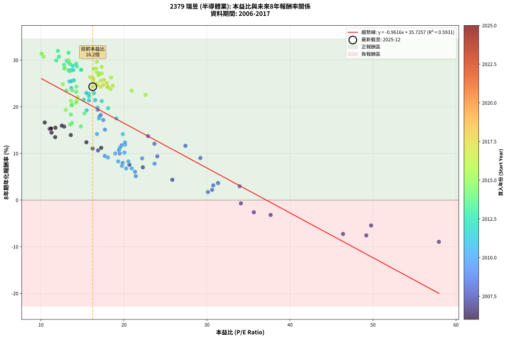
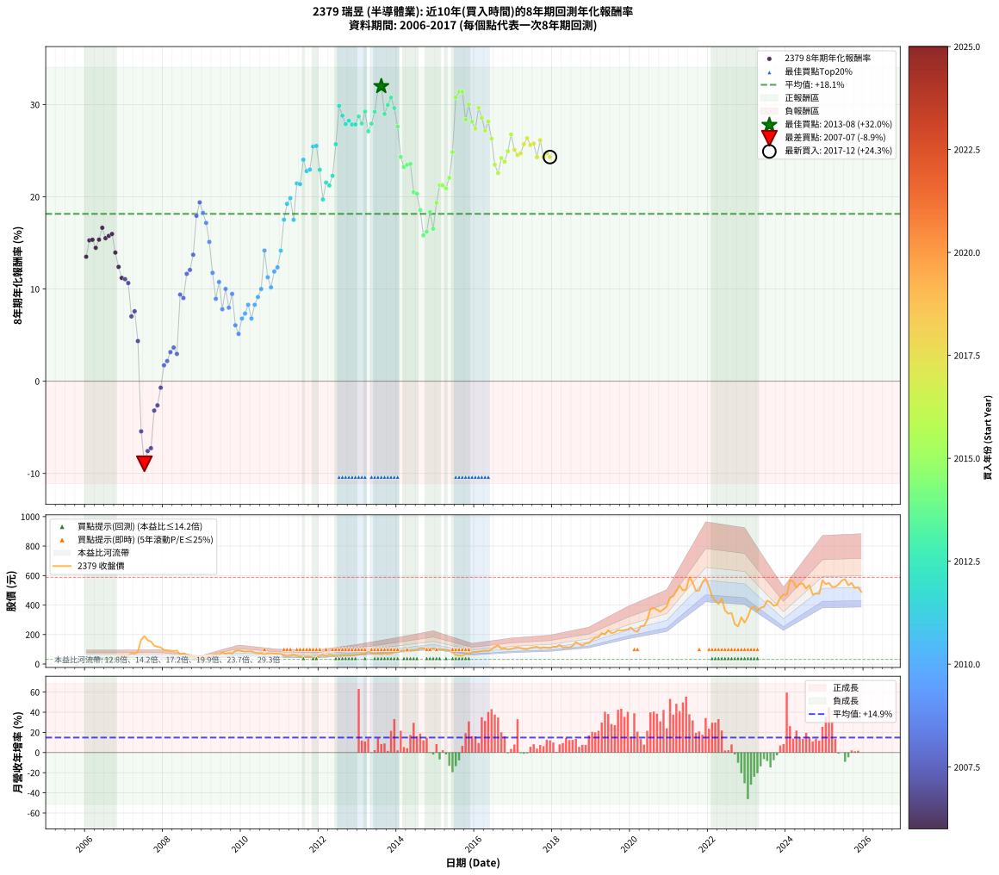

# 2379 瑞昱 - 本益比與未來報酬率分析

!!! info "報告資訊"
    - **股票代號**: 2379
    - **公司名稱**: 瑞昱
    - **產業別**: 半導體業
    - **分析期間**: 2006-2017 (144 個數據點)
    - **資料來源**: Type 12 (ShowMonthlyK_ChartFlow) 月收盤價與本益比
    - **報酬率口徑**: 含現金股利 (簡化: 年度合計，假設每年7/1入帳)
    - **報告生成時間**: 2026-01-07 18:35:14 CST

## 📈 視覺化圖表

### 圖表1: 本益比 vs 未來報酬率關係

*圖表1：2379 瑞昱 本益比與8年期未來報酬率關係 (2006-2017)*

### 圖表2: 歷年買入時點的8年期實際報酬率

*圖表2：2379 瑞昱 歷年買入時點的8年期實際報酬率 (2006-2017)*

## 📍 買點訊號說明

本報告提供兩種買點提示訊號（顯示於圖表2的股價子圖中）：

### ▲ 小綠色三角形（回測驗證）
- **計算方式**: 使用全部歷史資料計算本益比第25百分位數
- **用途**: 事後驗證，顯示歷史上哪些時點確實為低估區
- **限制**: 當下無法判斷，僅供回測參考
- **特性**: 後見之明（Look-Ahead Bias）

### ▲ 小橘色三角形（即時訊號）
- **計算方式**: 使用截至當月的過去5年資料計算本益比第25百分位數
- **用途**: 實際投資決策，當時即可判斷
- **優勢**: 可操作性強，符合實務需求
- **特性**: 無後見之明，滾動窗口計算

!!! tip "如何使用兩種訊號"
    - **綠色▲** 幫助理解歷史估值機會，驗證策略有效性
    - **橘色▲** 可作為實際買進參考，但仍需搭配基本面分析
    - 兩種訊號重疊時，表示即時判斷與事後驗證一致，信心度較高
    - 僅有綠色▲時，表示當時無法判斷（需要未來資料才能確認）
    - 僅有橘色▲時，表示即時判斷為買點，但事後可能不是最佳時機

## 📊 估值分析摘要

| 指標 | 數值 |
|:---:|:---:|
| **目前本益比** (2017-12) | **16.24 倍** |
| **歷史平均本益比** | 18.28 倍 |
| **估值水準** | 🟡 合理範圍 |
| **預期8年年化報酬率** | **+20.11%** |
| **歷史平均報酬率** | +18.15% |
| **相關係數 (R²)** | 0.5931 |
| **趨勢線斜率** | -0.9616 |

!!! abstract "核心洞察"
    目前本益比接近歷史平均，預期報酬率符合長期趨勢

    根據歷史數據回測，2379 瑞昱 在目前本益比 **16.2倍** 的估值水準下，
    預期未來8年年化報酬率約為 **+20.1%**。

    **重要提醒**: 本分析基於歷史數據統計，實際報酬率會受到公司基本面變化、產業趨勢、
    總體經濟環境等多重因素影響。R² = 0.59 表示本益比可解釋約 59.3% 的報酬率變異。

## 📈 歷史估值統計

### 最佳買點 (最高報酬率)

| 項目 | 數值 |
|:---:|:---:|
| 起始時間 | 2013-08 |
| 當時本益比 | 12.05 倍 |
| 起始價格 | 66.4 元 |
| 8年後價格 | 554.0 元 |
| **8年年化報酬率** | **+31.99%** |

### 最差買點 (最低報酬率)

| 項目 | 數值 |
|:---:|:---:|
| 起始時間 | 2007-07 |
| 當時本益比 | 57.94 倍 |
| 起始價格 | 190.0 元 |
| 8年後價格 | 62.1 元 |
| **8年年化報酬率** | **-8.95%** |

## 🎯 投資啟示

### 本益比與報酬率關係

趨勢線方程式: **y = -0.9616x + 35.7257**

!!! warning "強負相關"
    本益比與未來報酬率呈現強負相關。在高本益比時期買入，未來報酬率顯著較低；
    在低本益比時期買入，未來報酬率顯著較高。**估值紀律至關重要**。

### 估值區間建議

基於歷史數據分析:

- **🟢 低估區** (P/E < 14.6): 預期報酬率較高，可考慮增加持股
- **🟡 合理區** (P/E 14.6-21.9): 預期報酬率符合長期趨勢，正常持有
- **🔴 高估區** (P/E > 21.9): 預期報酬率較低，可考慮減碼或觀望

!!! danger "風險提示"
    - 過去表現不代表未來結果
    - 本分析假設公司基本面無重大結構性變化
    - 產業環境劇變可能使歷史規律失效
    - 應結合公司財報、產業趨勢、總體經濟等多重因素綜合判斷

!!! success "長期投資觀點"
    歷史數據顯示，在合理或低估的估值水準買入並長期持有，
    往往能獲得較佳的投資報酬。**耐心等待好價格**是價值投資的核心原則。

## 📊 數據品質

- **資料來源**: GoodInfo.tw Type 12 (ShowMonthlyK_ChartFlow)
- **資料頻率**: 月度收盤價與本益比
- **回測期間**: 2006-2017
- **數據點數量**: 144 個 (每個點代表一次8年期回測)

### 計算方法說明

1. **8年期年化報酬率**:
   - 對每個歷史時點，計算其後8年的實際投資報酬率
   - 期末價值(不含股利): 期末價格
   - 期末價值(含現金股利): 期末價格 + 持有期間內的現金股利合計 (簡化: 年度合計，假設每年7/1入帳)
   - 公式: 年化報酬率 = [(期末價值/期初價格)^(1/年數) - 1] × 100%

2. **本益比 (P/E Ratio)**:
   - 使用當時的月收盤價與EPS計算
   - 資料來源: Type 12 月度河流圖本益比數據

3. **趨勢線 (Linear Regression)**:
   - 使用最小平方法擬合線性趨勢線
   - R²值衡量本益比對報酬率的解釋能力

---

*本報告由 Stock Analysis System v1.9.0 自動生成*
*數據更新時間: 2026-01-07 18:35:14 CST*

## 📋 月度回測明細表

（每一列對應時間線圖中的一個買入點；可用來對照 SVG 圖上的每個點。）

| 買入月份 | 賣出月份 | 回測期限_年 | 實際持有年數 | 買入本益比_倍 | 買入收盤價_元 | 賣出收盤價_元 | 現金股利合計_元 | 總報酬率_pct | 年化報酬率_pct |
| --- | --- | --- | --- | --- | --- | --- | --- | --- | --- |
| 2006-01 | 2014-01 | 8 | 8.000 | 11.72 | 38.10 | 83.00 | 21.90 | +175.33 | +13.50 |
| 2006-02 | 2014-02 | 8 | 8.000 | 11.05 | 35.90 | 90.00 | 21.90 | +211.70 | +15.27 |
| 2006-03 | 2014-03 | 8 | 8.000 | 11.17 | 36.30 | 91.80 | 21.90 | +213.22 | +15.34 |
| 2006-04 | 2014-04 | 8 | 8.000 | 11.28 | 36.65 | 86.10 | 21.90 | +194.68 | +14.46 |
| 2006-05 | 2014-05 | 8 | 8.000 | 11.23 | 36.50 | 92.50 | 21.90 | +213.42 | +15.35 |
| 2006-06 | 2014-06 | 8 | 8.000 | 10.46 | 34.00 | 94.60 | 21.90 | +242.65 | +16.64 |
| 2006-07 | 2014-07 | 8 | 8.000 | 11.75 | 38.20 | 95.90 | 25.15 | +216.88 | +15.51 |
| 2006-08 | 2014-08 | 8 | 8.000 | 12.80 | 41.60 | 109.00 | 25.15 | +222.48 | +15.76 |
| 2006-09 | 2014-09 | 8 | 8.000 | 12.52 | 40.70 | 108.00 | 25.15 | +227.15 | +15.97 |
| 2006-10 | 2014-10 | 8 | 8.000 | 13.60 | 44.20 | 100.50 | 25.15 | +184.28 | +13.95 |
| 2006-11 | 2014-11 | 8 | 8.000 | 15.48 | 50.30 | 103.00 | 25.15 | +154.77 | +12.40 |
| 2006-12 | 2014-12 | 8 | 8.000 | 17.26 | 56.10 | 106.00 | 25.15 | +133.78 | +11.20 |
| 2007-01 | 2015-01 | 8 | 8.000 | 16.23 | 52.80 | 97.10 | 25.15 | +131.53 | +11.06 |
| 2007-02 | 2015-02 | 8 | 8.000 | 16.88 | 55.00 | 98.40 | 25.15 | +124.64 | +10.65 |
| 2007-03 | 2015-03 | 8 | 8.000 | 22.28 | 72.70 | 100.00 | 25.15 | +72.15 | +7.03 |
| 2007-04 | 2015-04 | 8 | 8.000 | 20.66 | 67.50 | 96.00 | 25.15 | +79.48 | +7.59 |
| 2007-05 | 2015-05 | 8 | 8.000 | 25.83 | 84.50 | 93.70 | 25.15 | +40.65 | +4.36 |
| 2007-06 | 2015-06 | 8 | 8.000 | 49.77 | 163.00 | 79.10 | 25.15 | -36.04 | -5.43 |
| 2007-07 | 2015-07 | 8 | 8.000 | 57.94 | 190.00 | 62.10 | 27.65 | -52.76 | -8.95 |
| 2007-08 | 2015-08 | 8 | 8.000 | 49.19 | 161.50 | 58.40 | 27.65 | -46.72 | -7.57 |
| 2007-09 | 2015-09 | 8 | 8.000 | 46.39 | 152.50 | 55.80 | 27.65 | -45.28 | -7.26 |
| 2007-10 | 2015-10 | 8 | 8.000 | 37.67 | 124.00 | 68.10 | 27.65 | -22.78 | -3.18 |
| 2007-11 | 2015-11 | 8 | 8.000 | 35.65 | 117.50 | 67.40 | 27.65 | -19.11 | -2.62 |
| 2007-12 | 2015-12 | 8 | 8.000 | 34.09 | 112.50 | 78.70 | 27.65 | -5.47 | -0.70 |
| 2008-01 | 2016-01 | 8 | 8.000 | 30.11 | 95.80 | 82.20 | 27.65 | +14.67 | +1.73 |
| 2008-02 | 2016-02 | 8 | 8.000 | 30.62 | 93.80 | 83.90 | 27.65 | +18.92 | +2.19 |
| 2008-03 | 2016-03 | 8 | 8.000 | 30.76 | 90.60 | 88.50 | 27.65 | +28.20 | +3.15 |
| 2008-04 | 2016-04 | 8 | 8.000 | 31.34 | 88.60 | 90.40 | 27.65 | +33.24 | +3.65 |
| 2008-05 | 2016-05 | 8 | 8.000 | 33.93 | 91.90 | 88.40 | 27.65 | +26.28 | +2.96 |
| 2008-06 | 2016-06 | 8 | 8.000 | 24.02 | 62.20 | 99.90 | 27.65 | +105.06 | +9.39 |
| 2008-07 | 2016-07 | 8 | 8.000 | 29.21 | 72.20 | 115.50 | 28.65 | +99.65 | +9.03 |
| 2008-08 | 2016-08 | 8 | 8.000 | 27.41 | 64.50 | 127.00 | 28.65 | +141.32 | +11.64 |
| 2008-09 | 2016-09 | 8 | 8.000 | 23.67 | 52.90 | 103.00 | 28.65 | +148.87 | +12.07 |
| 2008-10 | 2016-10 | 8 | 8.000 | 22.91 | 48.50 | 107.00 | 28.65 | +179.69 | +13.72 |
| 2008-11 | 2016-11 | 8 | 8.000 | 17.06 | 34.10 | 99.00 | 28.65 | +274.34 | +17.94 |
| 2008-12 | 2016-12 | 8 | 8.000 | 16.84 | 31.65 | 102.00 | 28.65 | +312.80 | +19.39 |
| 2009-01 | 2017-01 | 8 | 8.000 | 17.22 | 36.00 | 109.00 | 28.65 | +282.36 | +18.25 |
| 2009-02 | 2017-02 | 8 | 8.000 | 17.51 | 40.30 | 114.50 | 28.65 | +255.21 | +17.17 |
| 2009-03 | 2017-03 | 8 | 8.000 | 17.71 | 44.50 | 108.50 | 28.65 | +208.20 | +15.11 |
| 2009-04 | 2017-04 | 8 | 8.000 | 19.72 | 53.70 | 102.00 | 28.65 | +143.30 | +11.75 |
| 2009-05 | 2017-05 | 8 | 8.000 | 22.19 | 65.10 | 100.50 | 28.65 | +98.39 | +8.94 |
| 2009-06 | 2017-06 | 8 | 8.000 | 19.40 | 61.00 | 109.50 | 28.65 | +126.48 | +10.76 |
| 2009-07 | 2017-07 | 8 | 8.000 | 23.69 | 79.50 | 113.00 | 32.05 | +82.45 | +7.81 |
| 2009-08 | 2017-08 | 8 | 8.000 | 19.49 | 69.50 | 117.00 | 32.05 | +114.46 | +10.01 |
| 2009-09 | 2017-09 | 8 | 8.000 | 19.85 | 75.00 | 106.50 | 32.05 | +84.73 | +7.97 |
| 2009-10 | 2017-10 | 8 | 8.000 | 17.70 | 70.60 | 113.50 | 32.05 | +106.16 | +9.47 |
| 2009-11 | 2017-11 | 8 | 8.000 | 21.34 | 89.60 | 111.50 | 32.05 | +60.21 | +6.07 |
| 2009-12 | 2017-12 | 8 | 8.000 | 21.43 | 94.50 | 109.00 | 32.05 | +49.26 | +5.13 |
| 2010-01 | 2018-01 | 8 | 8.000 | 20.27 | 87.80 | 116.50 | 32.05 | +69.19 | +6.79 |
| 2010-02 | 2018-02 | 8 | 8.000 | 19.76 | 84.00 | 116.00 | 32.05 | +76.25 | +7.34 |
| 2010-03 | 2018-03 | 8 | 8.000 | 20.54 | 85.70 | 130.00 | 32.05 | +89.09 | +8.29 |
| 2010-04 | 2018-04 | 8 | 8.000 | 20.94 | 85.70 | 113.00 | 32.05 | +69.25 | +6.80 |
| 2010-05 | 2018-05 | 8 | 8.000 | 19.31 | 77.50 | 114.50 | 32.05 | +89.10 | +8.29 |
| 2010-06 | 2018-06 | 8 | 8.000 | 18.07 | 71.10 | 111.00 | 32.05 | +101.20 | +9.13 |
| 2010-07 | 2018-07 | 8 | 8.000 | 18.96 | 73.10 | 123.00 | 33.70 | +114.36 | +10.00 |
| 2010-08 | 2018-08 | 8 | 8.000 | 16.76 | 63.30 | 149.00 | 33.70 | +188.63 | +14.17 |
| 2010-09 | 2018-09 | 8 | 8.000 | 19.53 | 72.20 | 136.00 | 33.70 | +135.04 | +11.27 |
| 2010-10 | 2018-10 | 8 | 8.000 | 20.06 | 72.60 | 124.00 | 33.70 | +117.22 | +10.18 |
| 2010-11 | 2018-11 | 8 | 8.000 | 20.15 | 71.30 | 141.50 | 33.70 | +145.72 | +11.89 |
| 2010-12 | 2018-12 | 8 | 8.000 | 20.12 | 69.60 | 143.00 | 33.70 | +153.88 | +12.35 |
| 2011-01 | 2019-01 | 8 | 8.000 | 19.87 | 68.40 | 163.50 | 33.70 | +188.30 | +14.15 |
| 2011-02 | 2019-02 | 8 | 8.000 | 17.00 | 58.20 | 178.00 | 33.70 | +263.75 | +17.52 |
| 2011-03 | 2019-03 | 8 | 8.000 | 15.51 | 52.80 | 182.00 | 33.70 | +308.52 | +19.23 |
| 2011-04 | 2019-04 | 8 | 8.000 | 16.83 | 57.00 | 209.00 | 33.70 | +325.79 | +19.85 |
| 2011-05 | 2019-05 | 8 | 8.000 | 19.09 | 64.30 | 200.00 | 33.70 | +263.45 | +17.50 |
| 2011-06 | 2019-06 | 8 | 8.000 | 16.54 | 55.40 | 228.50 | 33.70 | +373.29 | +21.45 |
| 2011-07 | 2019-07 | 8 | 8.000 | 15.79 | 52.60 | 209.50 | 38.20 | +370.91 | +21.37 |
| 2011-08 | 2019-08 | 8 | 8.000 | 13.66 | 45.25 | 215.00 | 38.20 | +459.56 | +24.02 |
| 2011-09 | 2019-09 | 8 | 8.000 | 15.75 | 51.90 | 230.00 | 38.20 | +416.76 | +22.79 |
| 2011-10 | 2019-10 | 8 | 8.000 | 15.47 | 50.70 | 226.50 | 38.20 | +422.09 | +22.95 |
| 2011-11 | 2019-11 | 8 | 8.000 | 13.44 | 43.80 | 230.50 | 38.20 | +513.47 | +25.45 |
| 2011-12 | 2019-12 | 8 | 8.000 | 13.69 | 44.35 | 235.00 | 38.20 | +516.01 | +25.52 |
| 2012-01 | 2020-01 | 8 | 8.000 | 16.38 | 54.80 | 247.50 | 38.20 | +421.35 | +22.93 |
| 2012-02 | 2020-02 | 8 | 8.000 | 18.09 | 62.40 | 225.00 | 38.20 | +321.79 | +19.71 |
| 2012-03 | 2020-03 | 8 | 8.000 | 15.17 | 53.90 | 218.50 | 38.20 | +376.25 | +21.54 |
| 2012-04 | 2020-04 | 8 | 8.000 | 17.33 | 63.40 | 257.50 | 38.20 | +366.40 | +21.23 |
| 2012-05 | 2020-05 | 8 | 8.000 | 15.79 | 59.40 | 258.50 | 38.20 | +399.49 | +22.27 |
| 2012-06 | 2020-06 | 8 | 8.000 | 13.99 | 54.10 | 299.00 | 38.20 | +523.29 | +25.70 |
| 2012-07 | 2020-07 | 8 | 8.000 | 13.12 | 52.10 | 374.50 | 46.90 | +708.83 | +29.86 |
| 2012-08 | 2020-08 | 8 | 8.000 | 13.83 | 56.40 | 380.00 | 46.90 | +656.91 | +28.79 |
| 2012-09 | 2020-09 | 8 | 8.000 | 13.90 | 58.10 | 368.50 | 46.90 | +614.97 | +27.88 |
| 2012-10 | 2020-10 | 8 | 8.000 | 12.83 | 55.00 | 355.50 | 46.90 | +631.64 | +28.24 |
| 2012-11 | 2020-11 | 8 | 8.000 | 13.35 | 58.60 | 371.00 | 46.90 | +613.14 | +27.83 |
| 2012-12 | 2020-12 | 8 | 8.000 | 13.64 | 61.30 | 390.50 | 46.90 | +613.54 | +27.84 |
| 2013-01 | 2021-01 | 8 | 8.000 | 14.32 | 66.20 | 451.50 | 46.90 | +652.87 | +28.70 |
| 2013-02 | 2021-02 | 8 | 8.000 | 14.87 | 70.60 | 460.00 | 46.90 | +617.99 | +27.94 |
| 2013-03 | 2021-03 | 8 | 8.000 | 14.25 | 69.50 | 494.00 | 46.90 | +678.27 | +29.24 |
| 2013-04 | 2021-04 | 8 | 8.000 | 16.99 | 85.00 | 532.00 | 46.90 | +581.06 | +27.10 |
| 2013-05 | 2021-05 | 8 | 8.000 | 14.83 | 76.10 | 499.00 | 46.90 | +617.35 | +27.93 |
| 2013-06 | 2021-06 | 8 | 8.000 | 13.50 | 71.00 | 505.00 | 46.90 | +677.32 | +29.22 |
| 2013-07 | 2021-07 | 8 | 8.000 | 13.33 | 71.80 | 588.00 | 57.50 | +799.03 | +31.59 |
| 2013-08 | 2021-08 | 8 | 8.000 | 12.05 | 66.40 | 554.00 | 57.50 | +820.93 | +31.99 |
| 2013-09 | 2021-09 | 8 | 8.000 | 12.80 | 72.20 | 495.50 | 57.50 | +665.93 | +28.98 |
| 2013-10 | 2021-10 | 8 | 8.000 | 11.86 | 68.40 | 499.00 | 57.50 | +713.60 | +29.96 |
| 2013-11 | 2021-11 | 8 | 8.000 | 12.17 | 71.70 | 555.00 | 57.50 | +754.25 | +30.75 |
| 2013-12 | 2021-12 | 8 | 8.000 | 13.29 | 80.00 | 580.00 | 57.50 | +696.88 | +29.62 |
| 2014-01 | 2022-01 | 8 | 8.000 | 13.47 | 83.00 | 526.00 | 57.50 | +603.01 | +27.61 |
| 2014-02 | 2022-02 | 8 | 8.000 | 14.28 | 90.00 | 456.00 | 57.50 | +470.56 | +24.32 |
| 2014-03 | 2022-03 | 8 | 8.000 | 14.25 | 91.80 | 430.50 | 57.50 | +431.59 | +23.22 |
| 2014-04 | 2022-04 | 8 | 8.000 | 13.08 | 86.10 | 407.50 | 57.50 | +440.07 | +23.47 |
| 2014-05 | 2022-05 | 8 | 8.000 | 13.76 | 92.50 | 445.00 | 57.50 | +443.24 | +23.56 |
| 2014-06 | 2022-06 | 8 | 8.000 | 13.78 | 94.60 | 363.00 | 57.50 | +344.50 | +20.50 |
| 2014-07 | 2022-07 | 8 | 8.000 | 13.69 | 95.90 | 342.00 | 79.50 | +339.52 | +20.33 |
| 2014-08 | 2022-08 | 8 | 8.000 | 15.25 | 109.00 | 346.00 | 79.50 | +290.37 | +18.56 |
| 2014-09 | 2022-09 | 8 | 8.000 | 14.82 | 108.00 | 270.00 | 79.50 | +223.61 | +15.81 |
| 2014-10 | 2022-10 | 8 | 8.000 | 13.53 | 100.50 | 255.00 | 79.50 | +232.84 | +16.22 |
| 2014-11 | 2022-11 | 8 | 8.000 | 13.61 | 103.00 | 317.00 | 79.50 | +284.95 | +18.35 |
| 2014-12 | 2022-12 | 8 | 8.000 | 13.75 | 106.00 | 281.00 | 79.50 | +240.09 | +16.53 |
| 2015-01 | 2023-01 | 8 | 8.000 | 13.00 | 97.10 | 320.00 | 79.50 | +311.43 | +19.34 |
| 2015-02 | 2023-02 | 8 | 8.000 | 13.62 | 98.40 | 380.00 | 79.50 | +366.97 | +21.24 |
| 2015-03 | 2023-03 | 8 | 8.000 | 14.32 | 100.00 | 387.50 | 79.50 | +367.00 | +21.25 |
| 2015-04 | 2023-04 | 8 | 8.000 | 14.24 | 96.00 | 359.00 | 79.50 | +356.77 | +20.91 |
| 2015-05 | 2023-05 | 8 | 8.000 | 14.41 | 93.70 | 382.00 | 79.50 | +392.53 | +22.05 |
| 2015-06 | 2023-06 | 8 | 8.000 | 12.64 | 79.10 | 387.50 | 79.50 | +490.39 | +24.85 |
| 2015-07 | 2023-07 | 8 | 8.000 | 10.32 | 62.10 | 430.50 | 100.50 | +755.07 | +30.77 |
| 2015-08 | 2023-08 | 8 | 8.000 | 10.11 | 58.40 | 418.00 | 100.50 | +787.84 | +31.38 |
| 2015-09 | 2023-09 | 8 | 8.000 | 10.08 | 55.80 | 395.00 | 100.50 | +787.99 | +31.39 |
| 2015-10 | 2023-10 | 8 | 8.000 | 12.87 | 68.10 | 401.50 | 100.50 | +637.15 | +28.36 |
| 2015-11 | 2023-11 | 8 | 8.000 | 13.34 | 67.40 | 449.50 | 100.50 | +716.02 | +30.01 |
| 2015-12 | 2023-12 | 8 | 8.000 | 16.36 | 78.70 | 471.50 | 100.50 | +626.81 | +28.14 |
| 2016-01 | 2024-01 | 8 | 8.000 | 16.74 | 82.20 | 469.50 | 100.50 | +593.43 | +27.39 |
| 2016-02 | 2024-02 | 8 | 8.000 | 16.74 | 83.90 | 569.00 | 100.50 | +697.97 | +29.64 |
| 2016-03 | 2024-03 | 8 | 8.000 | 17.31 | 88.50 | 560.00 | 100.50 | +646.33 | +28.56 |
| 2016-04 | 2024-04 | 8 | 8.000 | 17.34 | 90.40 | 518.00 | 100.50 | +584.18 | +27.17 |
| 2016-05 | 2024-05 | 8 | 8.000 | 16.63 | 88.40 | 543.00 | 100.50 | +627.94 | +28.16 |
| 2016-06 | 2024-06 | 8 | 8.000 | 18.45 | 99.90 | 546.00 | 100.50 | +547.15 | +26.29 |
| 2016-07 | 2024-07 | 8 | 8.000 | 20.94 | 115.50 | 512.00 | 112.00 | +440.26 | +23.47 |
| 2016-08 | 2024-08 | 8 | 8.000 | 22.61 | 127.00 | 535.00 | 112.00 | +409.45 | +22.57 |
| 2016-09 | 2024-09 | 8 | 8.000 | 18.01 | 103.00 | 471.00 | 112.00 | +466.02 | +24.19 |
| 2016-10 | 2024-10 | 8 | 8.000 | 18.39 | 107.00 | 478.50 | 112.00 | +451.87 | +23.80 |
| 2016-11 | 2024-11 | 8 | 8.000 | 16.73 | 99.00 | 476.00 | 112.00 | +493.94 | +24.94 |
| 2016-12 | 2024-12 | 8 | 8.000 | 16.94 | 102.00 | 568.00 | 112.00 | +566.67 | +26.76 |
| 2017-01 | 2025-01 | 8 | 8.000 | 17.94 | 109.00 | 542.00 | 112.00 | +500.00 | +25.10 |
| 2017-02 | 2025-02 | 8 | 8.000 | 18.66 | 114.50 | 550.00 | 112.00 | +478.17 | +24.53 |
| 2017-03 | 2025-03 | 8 | 8.000 | 17.52 | 108.50 | 523.00 | 112.00 | +485.25 | +24.71 |
| 2017-04 | 2025-04 | 8 | 8.000 | 16.32 | 102.00 | 524.00 | 112.00 | +523.53 | +25.71 |
| 2017-05 | 2025-05 | 8 | 8.000 | 15.93 | 100.50 | 541.00 | 112.00 | +549.75 | +26.36 |
| 2017-06 | 2025-06 | 8 | 8.000 | 17.20 | 109.50 | 567.00 | 112.00 | +520.09 | +25.62 |
| 2017-07 | 2025-07 | 8 | 8.000 | 17.59 | 113.00 | 575.00 | 132.50 | +526.11 | +25.77 |
| 2017-08 | 2025-08 | 8 | 8.000 | 18.06 | 117.00 | 534.00 | 132.50 | +469.66 | +24.29 |
| 2017-09 | 2025-09 | 8 | 8.000 | 16.29 | 106.50 | 550.00 | 132.50 | +540.85 | +26.14 |
| 2017-10 | 2025-10 | 8 | 8.000 | 17.21 | 113.50 | 515.00 | 132.50 | +470.48 | +24.32 |
| 2017-11 | 2025-11 | 8 | 8.000 | 16.76 | 111.50 | 521.00 | 132.50 | +486.10 | +24.74 |
| 2017-12 | 2025-12 | 8 | 8.000 | 16.24 | 109.00 | 489.00 | 132.50 | +470.18 | +24.31 |
