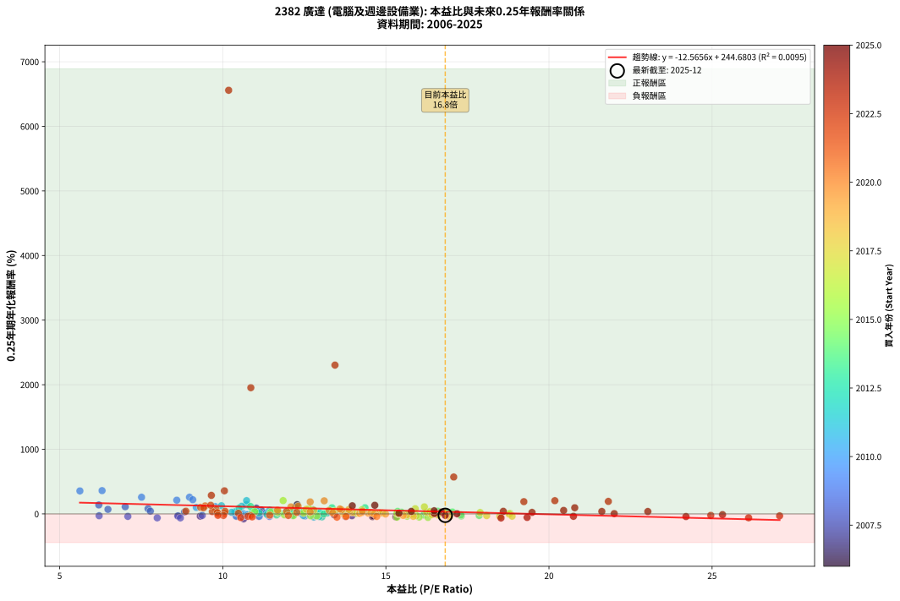
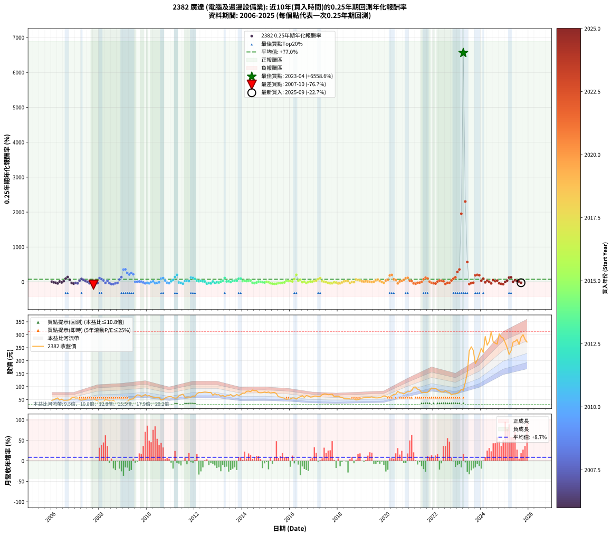

# 2382 廣達 - 本益比與未來報酬率分析

!!! info "報告資訊"
    - **股票代號**: 2382
    - **公司名稱**: 廣達
    - **產業別**: 電腦及週邊設備業
    - **分析期間**: 2006-2025 (237 個數據點)
    - **資料來源**: Type 12 (ShowMonthlyK_ChartFlow) 月收盤價與本益比
    - **報酬率口徑**: 含現金股利 (簡化: 年度合計，假設每年7/1入帳)
    - **報告生成時間**: 2026-01-06 00:36:56 CST

## 📈 視覺化圖表

### 圖表1: 本益比 vs 未來報酬率關係

*圖表1：2382 廣達 本益比與0.25年期未來報酬率關係 (2006-2025)*

### 圖表2: 歷年買入時點的0.25年期實際報酬率

*圖表2：2382 廣達 歷年買入時點的0.25年期實際報酬率 (2006-2025)*

## 📍 買點訊號說明

本報告提供兩種買點提示訊號（顯示於圖表2的股價子圖中）：

### ▲ 小綠色三角形（回測驗證）
- **計算方式**: 使用全部歷史資料計算本益比第25百分位數
- **用途**: 事後驗證，顯示歷史上哪些時點確實為低估區
- **限制**: 當下無法判斷，僅供回測參考
- **特性**: 後見之明（Look-Ahead Bias）

### ▲ 小橘色三角形（即時訊號）
- **計算方式**: 使用截至當月的過去5年資料計算本益比第25百分位數
- **用途**: 實際投資決策，當時即可判斷
- **優勢**: 可操作性強，符合實務需求
- **特性**: 無後見之明，滾動窗口計算

!!! tip "如何使用兩種訊號"
    - **綠色▲** 幫助理解歷史估值機會，驗證策略有效性
    - **橘色▲** 可作為實際買進參考，但仍需搭配基本面分析
    - 兩種訊號重疊時，表示即時判斷與事後驗證一致，信心度較高
    - 僅有綠色▲時，表示當時無法判斷（需要未來資料才能確認）
    - 僅有橘色▲時，表示即時判斷為買點，但事後可能不是最佳時機

## 📊 估值分析摘要

| 指標 | 數值 |
|:---:|:---:|
| **目前本益比** (2025-09) | **16.82 倍** |
| **歷史平均本益比** | 13.34 倍 |
| **估值水準** | 🔴 相對高估 |
| **預期0.25年年化報酬率** | **+33.33%** |
| **歷史平均報酬率** | +77.03% |
| **相關係數 (R²)** | 0.0095 |
| **趨勢線斜率** | -12.5656 |

!!! abstract "核心洞察"
    目前本益比顯著高於歷史平均，預期未來報酬率可能較低

    根據歷史數據回測，2382 廣達 在目前本益比 **16.8倍** 的估值水準下，
    預期未來0.25年年化報酬率約為 **+33.3%**。

    **重要提醒**: 本分析基於歷史數據統計，實際報酬率會受到公司基本面變化、產業趨勢、
    總體經濟環境等多重因素影響。R² = 0.01 表示本益比可解釋約 1.0% 的報酬率變異。

## 📈 歷史估值統計

### 最佳買點 (最高報酬率)

| 項目 | 數值 |
|:---:|:---:|
| 起始時間 | 2023-04 |
| 當時本益比 | 10.18 倍 |
| 起始價格 | 85.9 元 |
| 0.25年後價格 | 238.5 元 |
| **0.25年年化報酬率** | **+6558.60%** |

### 最差買點 (最低報酬率)

| 項目 | 數值 |
|:---:|:---:|
| 起始時間 | 2007-10 |
| 當時本益比 | 10.64 倍 |
| 起始價格 | 54.1 元 |
| 0.25年後價格 | 37.5 元 |
| **0.25年年化報酬率** | **-76.66%** |

## 🎯 投資啟示

### 本益比與報酬率關係

趨勢線方程式: **y = -12.5656x + 244.6803**

!!! warning "強負相關"
    本益比與未來報酬率呈現強負相關。在高本益比時期買入，未來報酬率顯著較低；
    在低本益比時期買入，未來報酬率顯著較高。**估值紀律至關重要**。

### 估值區間建議

基於歷史數據分析:

- **🟢 低估區** (P/E < 10.7): 預期報酬率較高，可考慮增加持股
- **🟡 合理區** (P/E 10.7-16.0): 預期報酬率符合長期趨勢，正常持有
- **🔴 高估區** (P/E > 16.0): 預期報酬率較低，可考慮減碼或觀望

!!! danger "風險提示"
    - 過去表現不代表未來結果
    - 本分析假設公司基本面無重大結構性變化
    - 產業環境劇變可能使歷史規律失效
    - 應結合公司財報、產業趨勢、總體經濟等多重因素綜合判斷

!!! success "長期投資觀點"
    歷史數據顯示，在合理或低估的估值水準買入並長期持有，
    往往能獲得較佳的投資報酬。**耐心等待好價格**是價值投資的核心原則。

## 📊 數據品質

- **資料來源**: GoodInfo.tw Type 12 (ShowMonthlyK_ChartFlow)
- **資料頻率**: 月度收盤價與本益比
- **回測期間**: 2006-2025
- **數據點數量**: 237 個 (每個點代表一次0.25年期回測)

### 計算方法說明

1. **0.25年期年化報酬率**:
   - 對每個歷史時點，計算其後0.25年的實際投資報酬率
   - 期末價值(不含股利): 期末價格
   - 期末價值(含現金股利): 期末價格 + 持有期間內的現金股利合計 (簡化: 年度合計，假設每年7/1入帳)
   - 公式: 年化報酬率 = [(期末價值/期初價格)^(1/年數) - 1] × 100%

2. **本益比 (P/E Ratio)**:
   - 使用當時的月收盤價與EPS計算
   - 資料來源: Type 12 月度河流圖本益比數據

3. **趨勢線 (Linear Regression)**:
   - 使用最小平方法擬合線性趨勢線
   - R²值衡量本益比對報酬率的解釋能力

---

*本報告由 Stock Analysis System v1.9.0 自動生成*
*數據更新時間: 2026-01-06 00:36:56 CST*

## 📋 月度回測明細表

（每一列對應時間線圖中的一個買入點；可用來對照 SVG 圖上的每個點。）

| 買入月份 | 賣出月份 | 回測期限_年 | 實際持有年數 | 買入本益比_倍 | 買入收盤價_元 | 賣出收盤價_元 | 現金股利合計_元 | 總報酬率_pct | 年化報酬率_pct |
| --- | --- | --- | --- | --- | --- | --- | --- | --- | --- |
| 2006-01 | 2006-05 | 0.25 | 0.329 | 12.18 | 47.00 | 48.10 | 0.00 | +2.34 | +7.30 |
| 2006-02 | 2006-05 | 0.25 | 0.246 | 12.86 | 49.65 | 48.10 | 0.00 | -3.12 | -12.08 |
| 2006-03 | 2006-07 | 0.25 | 0.334 | 13.81 | 53.30 | 46.75 | 2.48 | -7.63 | -21.14 |
| 2006-04 | 2006-07 | 0.25 | 0.249 | 14.59 | 56.30 | 46.75 | 2.48 | -12.55 | -41.62 |
| 2006-05 | 2006-08 | 0.25 | 0.252 | 12.46 | 48.10 | 47.20 | 2.48 | +3.30 | +13.74 |
| 2006-06 | 2006-09 | 0.25 | 0.252 | 13.42 | 51.80 | 47.40 | 2.48 | -3.70 | -13.89 |
| 2006-07 | 2006-10 | 0.25 | 0.252 | 12.11 | 46.75 | 49.30 | 0.00 | +5.45 | +23.47 |
| 2006-08 | 2006-12 | 0.25 | 0.334 | 12.23 | 47.20 | 59.10 | 0.00 | +25.21 | +96.04 |
| 2006-09 | 2006-12 | 0.25 | 0.249 | 12.28 | 47.40 | 59.10 | 0.00 | +24.68 | +142.41 |
| 2006-10 | 2007-01 | 0.25 | 0.252 | 12.77 | 49.30 | 55.60 | 0.00 | +12.78 | +61.19 |
| 2006-11 | 2007-03 | 0.25 | 0.329 | 14.61 | 56.40 | 50.50 | 0.00 | -10.46 | -28.56 |
| 2006-12 | 2007-03 | 0.25 | 0.246 | 15.31 | 59.10 | 50.50 | 0.00 | -14.55 | -47.18 |
| 2007-01 | 2007-05 | 0.25 | 0.329 | 13.96 | 55.60 | 50.00 | 0.00 | -10.07 | -27.61 |
| 2007-02 | 2007-05 | 0.25 | 0.246 | 13.76 | 56.50 | 50.00 | 0.00 | -11.50 | -39.10 |
| 2007-03 | 2007-07 | 0.25 | 0.334 | 11.95 | 50.50 | 53.70 | 2.50 | +11.29 | +37.74 |
| 2007-04 | 2007-07 | 0.25 | 0.249 | 11.03 | 48.00 | 53.70 | 2.50 | +17.08 | +88.33 |
| 2007-05 | 2007-08 | 0.25 | 0.252 | 11.18 | 50.00 | 53.70 | 2.50 | +12.40 | +59.06 |
| 2007-06 | 2007-09 | 0.25 | 0.252 | 11.14 | 51.20 | 51.70 | 2.50 | +5.86 | +25.37 |
| 2007-07 | 2007-10 | 0.25 | 0.252 | 11.38 | 53.70 | 54.10 | 0.00 | +0.74 | +2.99 |
| 2007-08 | 2007-12 | 0.25 | 0.334 | 11.10 | 53.70 | 46.05 | 0.00 | -14.25 | -36.88 |
| 2007-09 | 2007-12 | 0.25 | 0.249 | 10.42 | 51.70 | 46.05 | 0.00 | -10.93 | -37.16 |
| 2007-10 | 2008-01 | 0.25 | 0.252 | 10.64 | 54.10 | 37.50 | 0.00 | -30.68 | -76.66 |
| 2007-11 | 2008-03 | 0.25 | 0.331 | 9.31 | 48.50 | 41.95 | 0.00 | -13.51 | -35.46 |
| 2007-12 | 2008-03 | 0.25 | 0.249 | 8.64 | 46.05 | 41.95 | 0.00 | -8.90 | -31.22 |
| 2008-01 | 2008-05 | 0.25 | 0.331 | 7.01 | 37.50 | 48.00 | 0.00 | +28.00 | +110.68 |
| 2008-02 | 2008-05 | 0.25 | 0.249 | 7.71 | 41.40 | 48.00 | 0.00 | +15.94 | +81.07 |
| 2008-03 | 2008-07 | 0.25 | 0.334 | 7.78 | 41.95 | 43.75 | 3.50 | +12.63 | +42.79 |
| 2008-04 | 2008-07 | 0.25 | 0.249 | 9.37 | 50.70 | 43.75 | 3.50 | -6.80 | -24.64 |
| 2008-05 | 2008-08 | 0.25 | 0.252 | 8.83 | 48.00 | 47.80 | 3.50 | +6.87 | +30.21 |
| 2008-06 | 2008-09 | 0.25 | 0.252 | 8.62 | 47.00 | 39.10 | 3.50 | -9.36 | -32.31 |
| 2008-07 | 2008-10 | 0.25 | 0.252 | 7.99 | 43.75 | 34.40 | 0.00 | -21.37 | -61.50 |
| 2008-08 | 2008-12 | 0.25 | 0.334 | 8.70 | 47.80 | 34.60 | 0.00 | -27.62 | -62.00 |
| 2008-09 | 2008-12 | 0.25 | 0.249 | 7.09 | 39.10 | 34.60 | 0.00 | -11.51 | -38.78 |
| 2008-10 | 2009-01 | 0.25 | 0.252 | 6.21 | 34.40 | 31.60 | 0.00 | -8.14 | -28.61 |
| 2008-11 | 2009-03 | 0.25 | 0.329 | 6.48 | 36.00 | 42.85 | 0.00 | +19.03 | +69.92 |
| 2008-12 | 2009-03 | 0.25 | 0.246 | 6.20 | 34.60 | 42.85 | 0.00 | +23.84 | +138.19 |
| 2009-01 | 2009-05 | 0.25 | 0.329 | 5.62 | 31.60 | 52.00 | 0.00 | +64.56 | +355.42 |
| 2009-02 | 2009-05 | 0.25 | 0.246 | 6.30 | 35.70 | 52.00 | 0.00 | +45.66 | +360.12 |
| 2009-03 | 2009-07 | 0.25 | 0.334 | 7.51 | 42.85 | 62.10 | 3.50 | +53.09 | +257.87 |
| 2009-04 | 2009-07 | 0.25 | 0.249 | 8.59 | 49.40 | 62.10 | 3.50 | +32.79 | +212.18 |
| 2009-05 | 2009-08 | 0.25 | 0.252 | 8.98 | 52.00 | 68.20 | 3.50 | +37.88 | +258.01 |
| 2009-06 | 2009-09 | 0.25 | 0.252 | 9.08 | 53.00 | 67.50 | 3.50 | +33.96 | +219.25 |
| 2009-07 | 2009-10 | 0.25 | 0.252 | 10.57 | 62.10 | 62.50 | 0.00 | +0.64 | +2.58 |
| 2009-08 | 2009-12 | 0.25 | 0.334 | 11.52 | 68.20 | 69.60 | 0.00 | +2.05 | +6.27 |
| 2009-09 | 2009-12 | 0.25 | 0.249 | 11.32 | 67.50 | 69.60 | 0.00 | +3.11 | +13.08 |
| 2009-10 | 2010-01 | 0.25 | 0.252 | 10.41 | 62.50 | 63.90 | 0.00 | +2.24 | +9.19 |
| 2009-11 | 2010-03 | 0.25 | 0.329 | 10.75 | 65.00 | 61.60 | 0.00 | -5.23 | -15.09 |
| 2009-12 | 2010-03 | 0.25 | 0.246 | 11.43 | 69.60 | 61.60 | 0.00 | -11.49 | -39.08 |
| 2010-01 | 2010-05 | 0.25 | 0.329 | 10.67 | 63.90 | 58.20 | 0.00 | -8.92 | -24.75 |
| 2010-02 | 2010-05 | 0.25 | 0.246 | 11.12 | 65.50 | 58.20 | 0.00 | -11.15 | -38.09 |
| 2010-03 | 2010-07 | 0.25 | 0.334 | 10.64 | 61.60 | 58.00 | 3.68 | +0.14 | +0.41 |
| 2010-04 | 2010-07 | 0.25 | 0.249 | 10.42 | 59.30 | 58.00 | 3.68 | +4.02 | +17.14 |
| 2010-05 | 2010-08 | 0.25 | 0.252 | 10.41 | 58.20 | 48.60 | 3.68 | -10.16 | -34.66 |
| 2010-06 | 2010-09 | 0.25 | 0.252 | 10.66 | 58.50 | 50.70 | 3.68 | -7.04 | -25.15 |
| 2010-07 | 2010-10 | 0.25 | 0.252 | 10.76 | 58.00 | 56.20 | 0.00 | -3.10 | -11.76 |
| 2010-08 | 2010-12 | 0.25 | 0.334 | 9.19 | 48.60 | 61.20 | 0.00 | +25.93 | +99.40 |
| 2010-09 | 2010-12 | 0.25 | 0.249 | 9.77 | 50.70 | 61.20 | 0.00 | +20.71 | +112.86 |
| 2010-10 | 2011-01 | 0.25 | 0.252 | 11.04 | 56.20 | 61.50 | 0.00 | +9.43 | +43.02 |
| 2010-11 | 2011-03 | 0.25 | 0.329 | 12.00 | 59.90 | 55.50 | 0.00 | -7.35 | -20.72 |
| 2010-12 | 2011-03 | 0.25 | 0.246 | 12.52 | 61.20 | 55.50 | 0.00 | -9.31 | -32.75 |
| 2011-01 | 2011-05 | 0.25 | 0.329 | 12.34 | 61.50 | 65.10 | 0.00 | +5.85 | +18.90 |
| 2011-02 | 2011-05 | 0.25 | 0.246 | 11.44 | 58.10 | 65.10 | 0.00 | +12.05 | +58.67 |
| 2011-03 | 2011-07 | 0.25 | 0.334 | 10.73 | 55.50 | 71.00 | 3.60 | +34.41 | +142.40 |
| 2011-04 | 2011-07 | 0.25 | 0.249 | 10.73 | 56.50 | 71.00 | 3.60 | +32.03 | +205.07 |
| 2011-05 | 2011-08 | 0.25 | 0.252 | 12.14 | 65.10 | 58.70 | 3.60 | -4.30 | -16.02 |
| 2011-06 | 2011-09 | 0.25 | 0.252 | 12.47 | 68.00 | 59.50 | 3.60 | -7.21 | -25.69 |
| 2011-07 | 2011-10 | 0.25 | 0.252 | 12.79 | 71.00 | 59.90 | 0.00 | -15.63 | -49.08 |
| 2011-08 | 2011-12 | 0.25 | 0.334 | 10.40 | 58.70 | 63.70 | 0.00 | +8.52 | +27.73 |
| 2011-09 | 2011-12 | 0.25 | 0.249 | 10.37 | 59.50 | 63.70 | 0.00 | +7.06 | +31.49 |
| 2011-10 | 2012-01 | 0.25 | 0.252 | 10.27 | 59.90 | 63.20 | 0.00 | +5.51 | +23.73 |
| 2011-11 | 2012-03 | 0.25 | 0.331 | 9.96 | 59.00 | 77.30 | 0.00 | +31.02 | +126.03 |
| 2011-12 | 2012-03 | 0.25 | 0.249 | 10.58 | 63.70 | 77.30 | 0.00 | +21.35 | +117.43 |
| 2012-01 | 2012-05 | 0.25 | 0.331 | 10.50 | 63.20 | 78.00 | 0.00 | +23.42 | +88.73 |
| 2012-02 | 2012-05 | 0.25 | 0.249 | 12.08 | 72.70 | 78.00 | 0.00 | +7.29 | +32.64 |
| 2012-03 | 2012-07 | 0.25 | 0.334 | 12.85 | 77.30 | 78.40 | 4.00 | +6.60 | +21.07 |
| 2012-04 | 2012-07 | 0.25 | 0.249 | 12.76 | 76.80 | 78.40 | 4.00 | +7.29 | +32.63 |
| 2012-05 | 2012-08 | 0.25 | 0.252 | 12.97 | 78.00 | 77.30 | 4.00 | +4.23 | +17.87 |
| 2012-06 | 2012-09 | 0.25 | 0.252 | 13.20 | 79.40 | 77.90 | 4.00 | +3.15 | +13.09 |
| 2012-07 | 2012-10 | 0.25 | 0.252 | 13.04 | 78.40 | 66.80 | 0.00 | -14.80 | -47.04 |
| 2012-08 | 2012-12 | 0.25 | 0.334 | 12.85 | 77.30 | 68.30 | 0.00 | -11.64 | -30.97 |
| 2012-09 | 2012-12 | 0.25 | 0.249 | 12.96 | 77.90 | 68.30 | 0.00 | -12.32 | -41.01 |
| 2012-10 | 2013-01 | 0.25 | 0.252 | 11.11 | 66.80 | 68.90 | 0.00 | +3.14 | +13.08 |
| 2012-11 | 2013-03 | 0.25 | 0.329 | 12.14 | 73.00 | 66.50 | 0.00 | -8.90 | -24.71 |
| 2012-12 | 2013-03 | 0.25 | 0.246 | 11.36 | 68.30 | 66.50 | 0.00 | -2.64 | -10.27 |
| 2013-01 | 2013-05 | 0.25 | 0.329 | 11.65 | 68.90 | 64.80 | 0.00 | -5.95 | -17.03 |
| 2013-02 | 2013-05 | 0.25 | 0.246 | 10.89 | 63.30 | 64.80 | 0.00 | +2.37 | +9.97 |
| 2013-03 | 2013-07 | 0.25 | 0.334 | 11.63 | 66.50 | 69.80 | 4.00 | +10.98 | +36.59 |
| 2013-04 | 2013-07 | 0.25 | 0.249 | 10.85 | 61.00 | 69.80 | 4.00 | +20.98 | +114.80 |
| 2013-05 | 2013-08 | 0.25 | 0.252 | 11.73 | 64.80 | 63.10 | 4.00 | +3.55 | +14.85 |
| 2013-06 | 2013-09 | 0.25 | 0.252 | 11.98 | 65.00 | 64.10 | 4.00 | +4.77 | +20.32 |
| 2013-07 | 2013-10 | 0.25 | 0.252 | 13.10 | 69.80 | 69.70 | 0.00 | -0.14 | -0.57 |
| 2013-08 | 2013-12 | 0.25 | 0.334 | 12.07 | 63.10 | 69.50 | 0.00 | +10.14 | +33.54 |
| 2013-09 | 2013-12 | 0.25 | 0.249 | 12.49 | 64.10 | 69.50 | 0.00 | +8.42 | +38.35 |
| 2013-10 | 2014-01 | 0.25 | 0.252 | 13.84 | 69.70 | 75.00 | 0.00 | +7.60 | +33.77 |
| 2013-11 | 2014-03 | 0.25 | 0.329 | 13.35 | 65.90 | 82.00 | 0.00 | +24.43 | +94.51 |
| 2013-12 | 2014-03 | 0.25 | 0.246 | 14.36 | 69.50 | 82.00 | 0.00 | +17.99 | +95.66 |
| 2014-01 | 2014-05 | 0.25 | 0.329 | 15.48 | 75.00 | 80.70 | 0.00 | +7.60 | +24.98 |
| 2014-02 | 2014-05 | 0.25 | 0.246 | 15.36 | 74.50 | 80.70 | 0.00 | +8.32 | +38.32 |
| 2014-03 | 2014-07 | 0.25 | 0.334 | 16.89 | 82.00 | 84.40 | 3.80 | +7.56 | +24.39 |
| 2014-04 | 2014-07 | 0.25 | 0.249 | 17.04 | 82.80 | 84.40 | 3.80 | +6.52 | +28.86 |
| 2014-05 | 2014-08 | 0.25 | 0.252 | 16.59 | 80.70 | 84.40 | 3.80 | +9.29 | +42.31 |
| 2014-06 | 2014-09 | 0.25 | 0.252 | 17.86 | 87.00 | 77.20 | 3.80 | -6.90 | -24.70 |
| 2014-07 | 2014-10 | 0.25 | 0.252 | 17.31 | 84.40 | 76.40 | 0.00 | -9.48 | -32.66 |
| 2014-08 | 2014-12 | 0.25 | 0.334 | 17.30 | 84.40 | 79.20 | 0.00 | -6.16 | -17.34 |
| 2014-09 | 2014-12 | 0.25 | 0.249 | 15.80 | 77.20 | 79.20 | 0.00 | +2.59 | +10.81 |
| 2014-10 | 2015-01 | 0.25 | 0.252 | 15.62 | 76.40 | 77.00 | 0.00 | +0.79 | +3.15 |
| 2014-11 | 2015-03 | 0.25 | 0.329 | 15.73 | 77.00 | 75.60 | 0.00 | -1.82 | -5.43 |
| 2014-12 | 2015-03 | 0.25 | 0.246 | 16.16 | 79.20 | 75.60 | 0.00 | -4.55 | -17.20 |
| 2015-01 | 2015-05 | 0.25 | 0.329 | 15.79 | 77.00 | 77.90 | 0.00 | +1.17 | +3.60 |
| 2015-02 | 2015-05 | 0.25 | 0.246 | 16.36 | 79.40 | 77.90 | 0.00 | -1.89 | -7.45 |
| 2015-03 | 2015-07 | 0.25 | 0.334 | 15.65 | 75.60 | 61.00 | 4.00 | -14.02 | -36.38 |
| 2015-04 | 2015-07 | 0.25 | 0.249 | 16.02 | 77.00 | 61.00 | 4.00 | -15.58 | -49.34 |
| 2015-05 | 2015-08 | 0.25 | 0.252 | 16.29 | 77.90 | 59.80 | 4.00 | -18.10 | -54.74 |
| 2015-06 | 2015-09 | 0.25 | 0.252 | 15.34 | 73.00 | 57.10 | 4.00 | -16.30 | -50.66 |
| 2015-07 | 2015-10 | 0.25 | 0.252 | 12.88 | 61.00 | 55.50 | 0.00 | -9.02 | -31.28 |
| 2015-08 | 2015-12 | 0.25 | 0.334 | 12.69 | 59.80 | 53.00 | 0.00 | -11.37 | -30.33 |
| 2015-09 | 2015-12 | 0.25 | 0.249 | 12.17 | 57.10 | 53.00 | 0.00 | -7.18 | -25.85 |
| 2015-10 | 2016-01 | 0.25 | 0.252 | 11.89 | 55.50 | 53.30 | 0.00 | -3.96 | -14.83 |
| 2015-11 | 2016-03 | 0.25 | 0.331 | 10.98 | 51.00 | 56.20 | 0.00 | +10.20 | +34.05 |
| 2015-12 | 2016-03 | 0.25 | 0.249 | 11.47 | 53.00 | 56.20 | 0.00 | +6.04 | +26.53 |
| 2016-01 | 2016-05 | 0.25 | 0.331 | 11.68 | 53.30 | 58.00 | 0.00 | +8.82 | +29.06 |
| 2016-02 | 2016-05 | 0.25 | 0.249 | 12.48 | 56.20 | 58.00 | 0.00 | +3.20 | +13.49 |
| 2016-03 | 2016-07 | 0.25 | 0.334 | 12.64 | 56.20 | 64.90 | 3.80 | +22.24 | +82.44 |
| 2016-04 | 2016-07 | 0.25 | 0.249 | 11.85 | 52.00 | 64.90 | 3.80 | +32.12 | +205.83 |
| 2016-05 | 2016-08 | 0.25 | 0.252 | 13.39 | 58.00 | 58.70 | 3.80 | +7.76 | +34.54 |
| 2016-06 | 2016-09 | 0.25 | 0.252 | 14.27 | 61.00 | 65.40 | 3.80 | +13.44 | +64.99 |
| 2016-07 | 2016-10 | 0.25 | 0.252 | 15.39 | 64.90 | 64.00 | 0.00 | -1.39 | -5.39 |
| 2016-08 | 2016-12 | 0.25 | 0.334 | 14.11 | 58.70 | 60.30 | 0.00 | +2.73 | +8.38 |
| 2016-09 | 2016-12 | 0.25 | 0.249 | 15.94 | 65.40 | 60.30 | 0.00 | -7.80 | -27.81 |
| 2016-10 | 2017-01 | 0.25 | 0.252 | 15.82 | 64.00 | 63.60 | 0.00 | -0.62 | -2.46 |
| 2016-11 | 2017-03 | 0.25 | 0.329 | 14.90 | 59.40 | 61.70 | 0.00 | +3.87 | +12.26 |
| 2016-12 | 2017-03 | 0.25 | 0.246 | 15.34 | 60.30 | 61.70 | 0.00 | +2.32 | +9.76 |
| 2017-01 | 2017-05 | 0.25 | 0.329 | 16.25 | 63.60 | 68.80 | 0.00 | +8.18 | +27.02 |
| 2017-02 | 2017-05 | 0.25 | 0.246 | 16.35 | 63.70 | 68.80 | 0.00 | +8.01 | +36.69 |
| 2017-03 | 2017-07 | 0.25 | 0.334 | 15.90 | 61.70 | 71.60 | 3.50 | +21.72 | +80.11 |
| 2017-04 | 2017-07 | 0.25 | 0.249 | 16.18 | 62.50 | 71.60 | 3.50 | +20.16 | +108.99 |
| 2017-05 | 2017-08 | 0.25 | 0.252 | 17.89 | 68.80 | 68.70 | 3.50 | +4.94 | +21.11 |
| 2017-06 | 2017-09 | 0.25 | 0.252 | 18.80 | 72.00 | 69.90 | 3.50 | +1.94 | +7.95 |
| 2017-07 | 2017-10 | 0.25 | 0.252 | 18.78 | 71.60 | 71.00 | 0.00 | -0.84 | -3.29 |
| 2017-08 | 2017-12 | 0.25 | 0.334 | 18.09 | 68.70 | 61.90 | 0.00 | -9.90 | -26.81 |
| 2017-09 | 2017-12 | 0.25 | 0.249 | 18.49 | 69.90 | 61.90 | 0.00 | -11.44 | -38.61 |
| 2017-10 | 2018-01 | 0.25 | 0.252 | 18.87 | 71.00 | 63.50 | 0.00 | -10.56 | -35.80 |
| 2017-11 | 2018-03 | 0.25 | 0.329 | 16.41 | 61.50 | 59.10 | 0.00 | -3.90 | -11.41 |
| 2017-12 | 2018-03 | 0.25 | 0.246 | 16.60 | 61.90 | 59.10 | 0.00 | -4.52 | -17.13 |
| 2018-01 | 2018-05 | 0.25 | 0.329 | 16.95 | 63.50 | 53.00 | 0.00 | -16.54 | -42.31 |
| 2018-02 | 2018-05 | 0.25 | 0.246 | 15.84 | 59.60 | 53.00 | 0.00 | -11.07 | -37.89 |
| 2018-03 | 2018-07 | 0.25 | 0.334 | 15.65 | 59.10 | 52.90 | 3.40 | -4.74 | -13.52 |
| 2018-04 | 2018-07 | 0.25 | 0.249 | 14.26 | 54.10 | 52.90 | 3.40 | +4.07 | +17.35 |
| 2018-05 | 2018-08 | 0.25 | 0.252 | 13.91 | 53.00 | 52.80 | 3.40 | +6.04 | +26.21 |
| 2018-06 | 2018-09 | 0.25 | 0.252 | 13.99 | 53.50 | 53.20 | 3.40 | +5.79 | +25.06 |
| 2018-07 | 2018-10 | 0.25 | 0.252 | 13.77 | 52.90 | 48.85 | 0.00 | -7.66 | -27.11 |
| 2018-08 | 2018-12 | 0.25 | 0.334 | 13.69 | 52.80 | 52.70 | 0.00 | -0.19 | -0.57 |
| 2018-09 | 2018-12 | 0.25 | 0.249 | 13.74 | 53.20 | 52.70 | 0.00 | -0.94 | -3.72 |
| 2018-10 | 2019-01 | 0.25 | 0.252 | 12.56 | 48.85 | 55.90 | 0.00 | +14.43 | +70.78 |
| 2018-11 | 2019-03 | 0.25 | 0.329 | 12.79 | 49.95 | 57.80 | 0.00 | +15.72 | +55.94 |
| 2018-12 | 2019-03 | 0.25 | 0.246 | 13.44 | 52.70 | 57.80 | 0.00 | +9.68 | +45.48 |
| 2019-01 | 2019-05 | 0.25 | 0.329 | 14.19 | 55.90 | 58.90 | 0.00 | +5.37 | +17.25 |
| 2019-02 | 2019-05 | 0.25 | 0.246 | 14.46 | 57.20 | 58.90 | 0.00 | +2.97 | +12.62 |
| 2019-03 | 2019-07 | 0.25 | 0.334 | 14.54 | 57.80 | 57.50 | 3.55 | +5.62 | +17.80 |
| 2019-04 | 2019-07 | 0.25 | 0.249 | 14.82 | 59.20 | 57.50 | 3.55 | +3.12 | +13.15 |
| 2019-05 | 2019-08 | 0.25 | 0.252 | 14.68 | 58.90 | 56.50 | 3.55 | +1.95 | +7.98 |
| 2019-06 | 2019-09 | 0.25 | 0.252 | 14.99 | 60.40 | 56.60 | 3.55 | -0.41 | -1.63 |
| 2019-07 | 2019-10 | 0.25 | 0.252 | 14.20 | 57.50 | 58.50 | 0.00 | +1.74 | +7.08 |
| 2019-08 | 2019-12 | 0.25 | 0.334 | 13.89 | 56.50 | 64.30 | 0.00 | +13.81 | +47.28 |
| 2019-09 | 2019-12 | 0.25 | 0.249 | 13.86 | 56.60 | 64.30 | 0.00 | +13.60 | +66.85 |
| 2019-10 | 2020-01 | 0.25 | 0.252 | 14.26 | 58.50 | 62.00 | 0.00 | +5.98 | +25.95 |
| 2019-11 | 2020-03 | 0.25 | 0.331 | 14.63 | 60.30 | 60.20 | 0.00 | -0.17 | -0.50 |
| 2019-12 | 2020-03 | 0.25 | 0.249 | 15.53 | 64.30 | 60.20 | 0.00 | -6.38 | -23.24 |
| 2020-01 | 2020-05 | 0.25 | 0.331 | 14.28 | 62.00 | 70.00 | 0.00 | +12.90 | +44.24 |
| 2020-02 | 2020-05 | 0.25 | 0.249 | 13.64 | 62.00 | 70.00 | 0.00 | +12.90 | +62.76 |
| 2020-03 | 2020-07 | 0.25 | 0.334 | 12.68 | 60.20 | 81.80 | 3.70 | +42.03 | +185.87 |
| 2020-04 | 2020-07 | 0.25 | 0.249 | 13.11 | 64.90 | 81.80 | 3.70 | +31.74 | +202.36 |
| 2020-05 | 2020-08 | 0.25 | 0.252 | 13.59 | 70.00 | 77.00 | 3.70 | +15.29 | +75.90 |
| 2020-06 | 2020-09 | 0.25 | 0.252 | 13.26 | 71.00 | 75.60 | 3.70 | +11.69 | +55.10 |
| 2020-07 | 2020-10 | 0.25 | 0.252 | 14.72 | 81.80 | 72.00 | 0.00 | -11.98 | -39.75 |
| 2020-08 | 2020-12 | 0.25 | 0.334 | 13.37 | 77.00 | 80.90 | 0.00 | +5.06 | +15.94 |
| 2020-09 | 2020-12 | 0.25 | 0.249 | 12.68 | 75.60 | 80.90 | 0.00 | +7.01 | +31.25 |
| 2020-10 | 2021-01 | 0.25 | 0.252 | 11.68 | 72.00 | 80.70 | 0.00 | +12.08 | +57.28 |
| 2020-11 | 2021-03 | 0.25 | 0.329 | 12.09 | 77.00 | 98.00 | 0.00 | +27.27 | +108.35 |
| 2020-12 | 2021-03 | 0.25 | 0.246 | 12.31 | 80.90 | 98.00 | 0.00 | +21.14 | +117.75 |
| 2021-01 | 2021-05 | 0.25 | 0.329 | 11.96 | 80.70 | 89.70 | 0.00 | +11.15 | +37.96 |
| 2021-02 | 2021-05 | 0.25 | 0.246 | 12.27 | 85.00 | 89.70 | 0.00 | +5.53 | +24.41 |
| 2021-03 | 2021-07 | 0.25 | 0.334 | 13.78 | 98.00 | 77.30 | 5.20 | -15.82 | -40.28 |
| 2021-04 | 2021-07 | 0.25 | 0.249 | 13.50 | 98.40 | 77.30 | 5.20 | -16.16 | -50.71 |
| 2021-05 | 2021-08 | 0.25 | 0.252 | 12.01 | 89.70 | 78.40 | 5.20 | -6.80 | -24.39 |
| 2021-06 | 2021-09 | 0.25 | 0.252 | 11.44 | 87.50 | 77.50 | 5.20 | -5.49 | -20.07 |
| 2021-07 | 2021-10 | 0.25 | 0.252 | 9.87 | 77.30 | 78.00 | 0.00 | +0.91 | +3.64 |
| 2021-08 | 2021-12 | 0.25 | 0.334 | 9.79 | 78.40 | 94.70 | 0.00 | +20.79 | +76.03 |
| 2021-09 | 2021-12 | 0.25 | 0.249 | 9.46 | 77.50 | 94.70 | 0.00 | +22.19 | +123.56 |
| 2021-10 | 2022-01 | 0.25 | 0.252 | 9.32 | 78.00 | 92.90 | 0.00 | +19.10 | +100.18 |
| 2021-11 | 2022-03 | 0.25 | 0.329 | 10.05 | 85.90 | 88.30 | 0.00 | +2.79 | +8.75 |
| 2021-12 | 2022-03 | 0.25 | 0.246 | 10.85 | 94.70 | 88.30 | 0.00 | -6.76 | -24.72 |
| 2022-01 | 2022-05 | 0.25 | 0.329 | 10.77 | 92.90 | 79.60 | 0.00 | -14.32 | -37.52 |
| 2022-02 | 2022-05 | 0.25 | 0.246 | 10.90 | 92.90 | 79.60 | 0.00 | -14.32 | -46.58 |
| 2022-03 | 2022-07 | 0.25 | 0.334 | 10.48 | 88.30 | 84.60 | 6.60 | +3.28 | +10.16 |
| 2022-04 | 2022-07 | 0.25 | 0.249 | 10.07 | 83.80 | 84.60 | 6.60 | +8.83 | +40.45 |
| 2022-05 | 2022-08 | 0.25 | 0.252 | 9.68 | 79.60 | 79.30 | 6.60 | +7.91 | +35.31 |
| 2022-06 | 2022-09 | 0.25 | 0.252 | 9.83 | 79.80 | 77.00 | 6.60 | +4.76 | +20.28 |
| 2022-07 | 2022-10 | 0.25 | 0.252 | 10.55 | 84.60 | 68.40 | 0.00 | -19.15 | -57.00 |
| 2022-08 | 2022-12 | 0.25 | 0.334 | 10.02 | 79.30 | 72.30 | 0.00 | -8.83 | -24.17 |
| 2022-09 | 2022-12 | 0.25 | 0.249 | 9.85 | 77.00 | 72.30 | 0.00 | -6.10 | -22.34 |
| 2022-10 | 2023-01 | 0.25 | 0.252 | 8.87 | 68.40 | 74.70 | 0.00 | +9.21 | +41.88 |
| 2022-11 | 2023-03 | 0.25 | 0.329 | 9.41 | 71.60 | 89.10 | 0.00 | +24.44 | +94.56 |
| 2022-12 | 2023-03 | 0.25 | 0.246 | 9.63 | 72.30 | 89.10 | 0.00 | +23.24 | +133.48 |
| 2023-01 | 2023-05 | 0.25 | 0.329 | 9.65 | 74.70 | 116.50 | 0.00 | +55.96 | +286.78 |
| 2023-02 | 2023-05 | 0.25 | 0.246 | 10.05 | 80.10 | 116.50 | 0.00 | +45.44 | +357.37 |
| 2023-03 | 2023-07 | 0.25 | 0.334 | 10.86 | 89.10 | 238.50 | 6.00 | +174.41 | +1953.56 |
| 2023-04 | 2023-07 | 0.25 | 0.249 | 10.18 | 85.90 | 238.50 | 6.00 | +184.63 | +6558.60 |
| 2023-05 | 2023-08 | 0.25 | 0.252 | 13.44 | 116.50 | 253.50 | 6.00 | +122.75 | +2303.53 |
| 2023-06 | 2023-09 | 0.25 | 0.252 | 17.08 | 152.00 | 239.50 | 6.00 | +61.51 | +570.82 |
| 2023-07 | 2023-10 | 0.25 | 0.252 | 26.12 | 238.50 | 189.00 | 0.00 | -20.75 | -60.29 |
| 2023-08 | 2023-12 | 0.25 | 0.334 | 27.07 | 253.50 | 224.50 | 0.00 | -11.44 | -30.49 |
| 2023-09 | 2023-12 | 0.25 | 0.249 | 24.96 | 239.50 | 224.50 | 0.00 | -6.26 | -22.86 |
| 2023-10 | 2024-01 | 0.25 | 0.252 | 19.23 | 189.00 | 247.00 | 0.00 | +30.69 | +189.38 |
| 2023-11 | 2024-03 | 0.25 | 0.331 | 20.18 | 203.00 | 293.50 | 0.00 | +44.58 | +204.31 |
| 2023-12 | 2024-03 | 0.25 | 0.249 | 21.82 | 224.50 | 293.50 | 0.00 | +30.73 | +193.20 |
| 2024-01 | 2024-05 | 0.25 | 0.331 | 23.03 | 247.00 | 274.00 | 0.00 | +10.93 | +36.77 |
| 2024-02 | 2024-05 | 0.25 | 0.249 | 20.79 | 232.00 | 274.00 | 0.00 | +18.10 | +95.00 |
| 2024-03 | 2024-07 | 0.25 | 0.334 | 25.32 | 293.50 | 272.50 | 9.00 | -4.09 | -11.75 |
| 2024-04 | 2024-07 | 0.25 | 0.249 | 21.62 | 260.00 | 272.50 | 9.00 | +8.27 | +37.56 |
| 2024-05 | 2024-08 | 0.25 | 0.252 | 22.00 | 274.00 | 268.00 | 9.00 | +1.09 | +4.42 |
| 2024-06 | 2024-09 | 0.25 | 0.252 | 24.20 | 312.00 | 264.00 | 9.00 | -12.50 | -41.15 |
| 2024-07 | 2024-10 | 0.25 | 0.252 | 20.45 | 272.50 | 303.50 | 0.00 | +11.38 | +53.38 |
| 2024-08 | 2024-12 | 0.25 | 0.334 | 19.48 | 268.00 | 287.00 | 0.00 | +7.09 | +22.76 |
| 2024-09 | 2024-12 | 0.25 | 0.249 | 18.60 | 264.00 | 287.00 | 0.00 | +8.71 | +39.83 |
| 2024-10 | 2025-01 | 0.25 | 0.252 | 20.75 | 303.50 | 269.50 | 0.00 | -11.20 | -37.61 |
| 2024-11 | 2025-03 | 0.25 | 0.329 | 19.33 | 291.00 | 224.50 | 0.00 | -22.85 | -54.60 |
| 2024-12 | 2025-03 | 0.25 | 0.246 | 18.53 | 287.00 | 224.50 | 0.00 | -21.78 | -63.09 |
| 2025-01 | 2025-05 | 0.25 | 0.329 | 17.18 | 269.50 | 271.50 | 0.00 | +0.74 | +2.28 |
| 2025-02 | 2025-05 | 0.25 | 0.246 | 15.78 | 250.50 | 271.50 | 0.00 | +8.38 | +38.64 |
| 2025-03 | 2025-07 | 0.25 | 0.334 | 13.97 | 224.50 | 281.50 | 13.00 | +31.18 | +125.36 |
| 2025-04 | 2025-07 | 0.25 | 0.249 | 14.66 | 238.50 | 281.50 | 13.00 | +23.48 | +133.16 |
| 2025-05 | 2025-08 | 0.25 | 0.252 | 16.49 | 271.50 | 262.50 | 13.00 | +1.47 | +5.98 |
| 2025-06 | 2025-09 | 0.25 | 0.252 | 16.48 | 274.50 | 290.00 | 13.00 | +10.38 | +48.02 |
| 2025-07 | 2025-10 | 0.25 | 0.252 | 16.71 | 281.50 | 300.50 | 0.00 | +6.75 | +29.60 |
| 2025-08 | 2025-12 | 0.25 | 0.334 | 15.40 | 262.50 | 272.00 | 0.00 | +3.62 | +11.23 |
| 2025-09 | 2025-12 | 0.25 | 0.249 | 16.82 | 290.00 | 272.00 | 0.00 | -6.21 | -22.68 |
