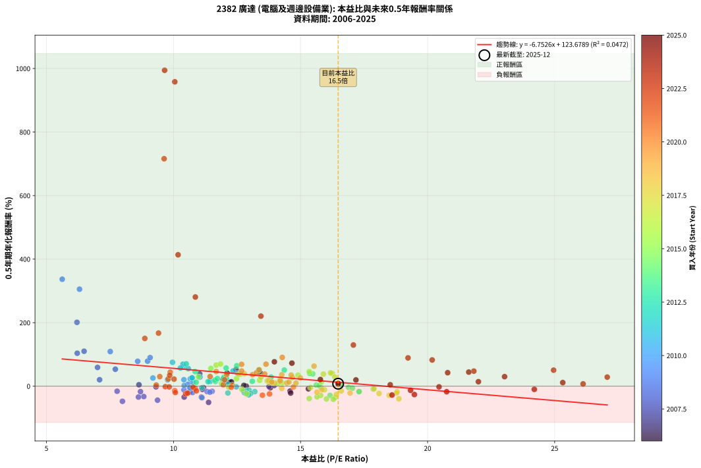
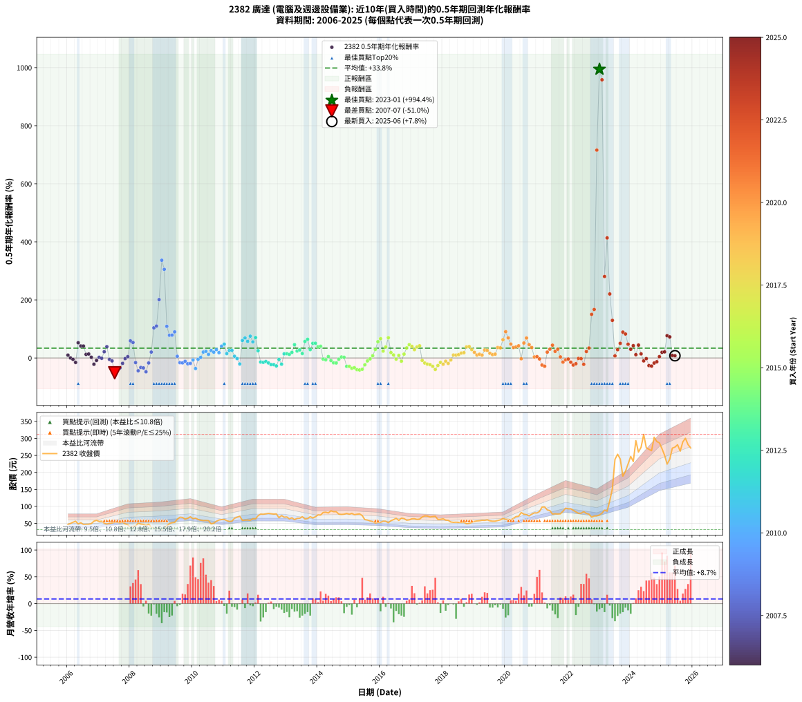

# 2382 廣達 - 本益比與未來報酬率分析

!!! info "報告資訊"
    - **股票代號**: 2382
    - **公司名稱**: 廣達
    - **產業別**: 電腦及週邊設備業
    - **分析期間**: 2006-2025 (234 個數據點)
    - **資料來源**: Type 12 (ShowMonthlyK_ChartFlow) 月收盤價與本益比
    - **報酬率口徑**: 含現金股利 (簡化: 年度合計，假設每年7/1入帳)
    - **報告生成時間**: 2026-01-07 18:35:29 CST

## 📈 視覺化圖表

### 圖表1: 本益比 vs 未來報酬率關係

*圖表1：2382 廣達 本益比與0.5年期未來報酬率關係 (2006-2025)*

### 圖表2: 歷年買入時點的0.5年期實際報酬率

*圖表2：2382 廣達 歷年買入時點的0.5年期實際報酬率 (2006-2025)*

## 📍 買點訊號說明

本報告提供兩種買點提示訊號（顯示於圖表2的股價子圖中）：

### ▲ 小綠色三角形（回測驗證）
- **計算方式**: 使用全部歷史資料計算本益比第25百分位數
- **用途**: 事後驗證，顯示歷史上哪些時點確實為低估區
- **限制**: 當下無法判斷，僅供回測參考
- **特性**: 後見之明（Look-Ahead Bias）

### ▲ 小橘色三角形（即時訊號）
- **計算方式**: 使用截至當月的過去5年資料計算本益比第25百分位數
- **用途**: 實際投資決策，當時即可判斷
- **優勢**: 可操作性強，符合實務需求
- **特性**: 無後見之明，滾動窗口計算

!!! tip "如何使用兩種訊號"
    - **綠色▲** 幫助理解歷史估值機會，驗證策略有效性
    - **橘色▲** 可作為實際買進參考，但仍需搭配基本面分析
    - 兩種訊號重疊時，表示即時判斷與事後驗證一致，信心度較高
    - 僅有綠色▲時，表示當時無法判斷（需要未來資料才能確認）
    - 僅有橘色▲時，表示即時判斷為買點，但事後可能不是最佳時機

## 📊 估值分析摘要

| 指標 | 數值 |
|:---:|:---:|
| **目前本益比** (2025-06) | **16.48 倍** |
| **歷史平均本益比** | 13.30 倍 |
| **估值水準** | 🔴 相對高估 |
| **預期0.5年年化報酬率** | **+12.40%** |
| **歷史平均報酬率** | +33.84% |
| **相關係數 (R²)** | 0.0472 |
| **趨勢線斜率** | -6.7526 |

!!! abstract "核心洞察"
    目前本益比顯著高於歷史平均，預期未來報酬率可能較低

    根據歷史數據回測，2382 廣達 在目前本益比 **16.5倍** 的估值水準下，
    預期未來0.5年年化報酬率約為 **+12.4%**。

    **重要提醒**: 本分析基於歷史數據統計，實際報酬率會受到公司基本面變化、產業趨勢、
    總體經濟環境等多重因素影響。R² = 0.05 表示本益比可解釋約 4.7% 的報酬率變異。

## 📈 歷史估值統計

### 最佳買點 (最高報酬率)

| 項目 | 數值 |
|:---:|:---:|
| 起始時間 | 2023-01 |
| 當時本益比 | 9.65 倍 |
| 起始價格 | 74.7 元 |
| 0.5年後價格 | 238.5 元 |
| **0.5年年化報酬率** | **+994.37%** |

### 最差買點 (最低報酬率)

| 項目 | 數值 |
|:---:|:---:|
| 起始時間 | 2007-07 |
| 當時本益比 | 11.38 倍 |
| 起始價格 | 53.7 元 |
| 0.5年後價格 | 37.5 元 |
| **0.5年年化報酬率** | **-50.97%** |

## 🎯 投資啟示

### 本益比與報酬率關係

趨勢線方程式: **y = -6.7526x + 123.6789**

!!! warning "強負相關"
    本益比與未來報酬率呈現強負相關。在高本益比時期買入，未來報酬率顯著較低；
    在低本益比時期買入，未來報酬率顯著較高。**估值紀律至關重要**。

### 估值區間建議

基於歷史數據分析:

- **🟢 低估區** (P/E < 10.6): 預期報酬率較高，可考慮增加持股
- **🟡 合理區** (P/E 10.6-16.0): 預期報酬率符合長期趨勢，正常持有
- **🔴 高估區** (P/E > 16.0): 預期報酬率較低，可考慮減碼或觀望

!!! danger "風險提示"
    - 過去表現不代表未來結果
    - 本分析假設公司基本面無重大結構性變化
    - 產業環境劇變可能使歷史規律失效
    - 應結合公司財報、產業趨勢、總體經濟等多重因素綜合判斷

!!! success "長期投資觀點"
    歷史數據顯示，在合理或低估的估值水準買入並長期持有，
    往往能獲得較佳的投資報酬。**耐心等待好價格**是價值投資的核心原則。

## 📊 數據品質

- **資料來源**: GoodInfo.tw Type 12 (ShowMonthlyK_ChartFlow)
- **資料頻率**: 月度收盤價與本益比
- **回測期間**: 2006-2025
- **數據點數量**: 234 個 (每個點代表一次0.5年期回測)

### 計算方法說明

1. **0.5年期年化報酬率**:
   - 對每個歷史時點，計算其後0.5年的實際投資報酬率
   - 期末價值(不含股利): 期末價格
   - 期末價值(含現金股利): 期末價格 + 持有期間內的現金股利合計 (簡化: 年度合計，假設每年7/1入帳)
   - 公式: 年化報酬率 = [(期末價值/期初價格)^(1/年數) - 1] × 100%

2. **本益比 (P/E Ratio)**:
   - 使用當時的月收盤價與EPS計算
   - 資料來源: Type 12 月度河流圖本益比數據

3. **趨勢線 (Linear Regression)**:
   - 使用最小平方法擬合線性趨勢線
   - R²值衡量本益比對報酬率的解釋能力

---

*本報告由 Stock Analysis System v1.9.0 自動生成*
*數據更新時間: 2026-01-07 18:35:29 CST*

## 📋 月度回測明細表

（每一列對應時間線圖中的一個買入點；可用來對照 SVG 圖上的每個點。）

| 買入月份 | 賣出月份 | 回測期限_年 | 實際持有年數 | 買入本益比_倍 | 買入收盤價_元 | 賣出收盤價_元 | 現金股利合計_元 | 總報酬率_pct | 年化報酬率_pct |
| --- | --- | --- | --- | --- | --- | --- | --- | --- | --- |
| 2006-01 | 2006-07 | 0.5 | 0.496 | 12.18 | 47.00 | 46.75 | 2.48 | +4.76 | +9.83 |
| 2006-02 | 2006-08 | 0.5 | 0.498 | 12.86 | 49.65 | 47.20 | 2.48 | +0.07 | +0.14 |
| 2006-03 | 2006-10 | 0.5 | 0.586 | 13.81 | 53.30 | 49.30 | 2.48 | -2.84 | -4.80 |
| 2006-04 | 2006-10 | 0.5 | 0.501 | 14.59 | 56.30 | 49.30 | 2.48 | -8.02 | -15.37 |
| 2006-05 | 2006-12 | 0.5 | 0.586 | 12.46 | 48.10 | 59.10 | 2.48 | +28.04 | +52.47 |
| 2006-06 | 2006-12 | 0.5 | 0.501 | 13.42 | 51.80 | 59.10 | 2.48 | +18.89 | +41.25 |
| 2006-07 | 2007-01 | 0.5 | 0.504 | 12.11 | 46.75 | 55.60 | 0.00 | +18.93 | +41.08 |
| 2006-08 | 2007-03 | 0.5 | 0.580 | 12.23 | 47.20 | 50.50 | 0.00 | +6.99 | +12.35 |
| 2006-09 | 2007-03 | 0.5 | 0.496 | 12.28 | 47.40 | 50.50 | 0.00 | +6.54 | +13.64 |
| 2006-10 | 2007-05 | 0.5 | 0.580 | 12.77 | 49.30 | 50.00 | 0.00 | +1.42 | +2.46 |
| 2006-11 | 2007-05 | 0.5 | 0.496 | 14.61 | 56.40 | 50.00 | 0.00 | -11.35 | -21.58 |
| 2006-12 | 2007-07 | 0.5 | 0.580 | 15.31 | 59.10 | 53.70 | 2.50 | -4.91 | -8.30 |
| 2007-01 | 2007-07 | 0.5 | 0.496 | 13.96 | 55.60 | 53.70 | 2.50 | +1.08 | +2.19 |
| 2007-02 | 2007-08 | 0.5 | 0.498 | 13.76 | 56.50 | 53.70 | 2.50 | -0.53 | -1.06 |
| 2007-03 | 2007-10 | 0.5 | 0.586 | 11.95 | 50.50 | 54.10 | 2.50 | +12.08 | +21.49 |
| 2007-04 | 2007-10 | 0.5 | 0.501 | 11.03 | 48.00 | 54.10 | 2.50 | +17.92 | +38.95 |
| 2007-05 | 2007-12 | 0.5 | 0.586 | 11.18 | 50.00 | 46.05 | 2.50 | -2.90 | -4.90 |
| 2007-06 | 2007-12 | 0.5 | 0.501 | 11.14 | 51.20 | 46.05 | 2.50 | -5.18 | -10.06 |
| 2007-07 | 2008-01 | 0.5 | 0.504 | 11.38 | 53.70 | 37.50 | 0.00 | -30.17 | -50.97 |
| 2007-08 | 2008-03 | 0.5 | 0.583 | 11.10 | 53.70 | 41.95 | 0.00 | -21.88 | -34.52 |
| 2007-09 | 2008-03 | 0.5 | 0.498 | 10.42 | 51.70 | 41.95 | 0.00 | -18.86 | -34.26 |
| 2007-10 | 2008-05 | 0.5 | 0.583 | 10.64 | 54.10 | 48.00 | 0.00 | -11.28 | -18.55 |
| 2007-11 | 2008-05 | 0.5 | 0.498 | 9.31 | 48.50 | 48.00 | 0.00 | -1.03 | -2.06 |
| 2007-12 | 2008-07 | 0.5 | 0.583 | 8.64 | 46.05 | 43.75 | 3.50 | +2.61 | +4.51 |
| 2008-01 | 2008-07 | 0.5 | 0.498 | 7.01 | 37.50 | 43.75 | 3.50 | +26.00 | +59.01 |
| 2008-02 | 2008-08 | 0.5 | 0.501 | 7.71 | 41.40 | 47.80 | 3.50 | +23.91 | +53.41 |
| 2008-03 | 2008-10 | 0.5 | 0.586 | 7.78 | 41.95 | 34.40 | 3.50 | -9.65 | -15.91 |
| 2008-04 | 2008-10 | 0.5 | 0.501 | 9.37 | 50.70 | 34.40 | 3.50 | -25.25 | -44.05 |
| 2008-05 | 2008-12 | 0.5 | 0.586 | 8.83 | 48.00 | 34.60 | 3.50 | -20.62 | -32.58 |
| 2008-06 | 2008-12 | 0.5 | 0.501 | 8.62 | 47.00 | 34.60 | 3.50 | -18.94 | -34.23 |
| 2008-07 | 2009-01 | 0.5 | 0.504 | 7.99 | 43.75 | 31.60 | 0.00 | -27.77 | -47.58 |
| 2008-08 | 2009-03 | 0.5 | 0.580 | 8.70 | 47.80 | 42.85 | 0.00 | -10.36 | -17.17 |
| 2008-09 | 2009-03 | 0.5 | 0.496 | 7.09 | 39.10 | 42.85 | 0.00 | +9.59 | +20.30 |
| 2008-10 | 2009-05 | 0.5 | 0.580 | 6.21 | 34.40 | 52.00 | 0.00 | +51.16 | +103.78 |
| 2008-11 | 2009-05 | 0.5 | 0.496 | 6.48 | 36.00 | 52.00 | 0.00 | +44.44 | +110.02 |
| 2008-12 | 2009-07 | 0.5 | 0.580 | 6.20 | 34.60 | 62.10 | 3.50 | +89.60 | +201.07 |
| 2009-01 | 2009-07 | 0.5 | 0.496 | 5.62 | 31.60 | 62.10 | 3.50 | +107.59 | +336.65 |
| 2009-02 | 2009-08 | 0.5 | 0.498 | 6.30 | 35.70 | 68.20 | 3.50 | +100.84 | +305.30 |
| 2009-03 | 2009-10 | 0.5 | 0.586 | 7.51 | 42.85 | 62.50 | 3.50 | +54.03 | +109.02 |
| 2009-04 | 2009-10 | 0.5 | 0.501 | 8.59 | 49.40 | 62.50 | 3.50 | +33.60 | +78.29 |
| 2009-05 | 2009-12 | 0.5 | 0.586 | 8.98 | 52.00 | 69.60 | 3.50 | +40.58 | +78.84 |
| 2009-06 | 2009-12 | 0.5 | 0.501 | 9.08 | 53.00 | 69.60 | 3.50 | +37.92 | +89.98 |
| 2009-07 | 2010-01 | 0.5 | 0.504 | 10.57 | 62.10 | 63.90 | 0.00 | +2.90 | +5.84 |
| 2009-08 | 2010-03 | 0.5 | 0.580 | 11.52 | 68.20 | 61.60 | 0.00 | -9.68 | -16.08 |
| 2009-09 | 2010-03 | 0.5 | 0.496 | 11.32 | 67.50 | 61.60 | 0.00 | -8.74 | -16.85 |
| 2009-10 | 2010-05 | 0.5 | 0.580 | 10.41 | 62.50 | 58.20 | 0.00 | -6.88 | -11.56 |
| 2009-11 | 2010-05 | 0.5 | 0.496 | 10.75 | 65.00 | 58.20 | 0.00 | -10.46 | -19.99 |
| 2009-12 | 2010-07 | 0.5 | 0.580 | 11.43 | 69.60 | 58.00 | 3.68 | -11.37 | -18.78 |
| 2010-01 | 2010-07 | 0.5 | 0.496 | 10.67 | 63.90 | 58.00 | 3.68 | -3.47 | -6.87 |
| 2010-02 | 2010-08 | 0.5 | 0.498 | 11.12 | 65.50 | 48.60 | 3.68 | -20.18 | -36.38 |
| 2010-03 | 2010-10 | 0.5 | 0.586 | 10.64 | 61.60 | 56.20 | 3.68 | -2.79 | -4.71 |
| 2010-04 | 2010-10 | 0.5 | 0.501 | 10.42 | 59.30 | 56.20 | 3.68 | +0.98 | +1.98 |
| 2010-05 | 2010-12 | 0.5 | 0.586 | 10.41 | 58.20 | 61.20 | 3.68 | +11.48 | +20.39 |
| 2010-06 | 2010-12 | 0.5 | 0.501 | 10.66 | 58.50 | 61.20 | 3.68 | +10.91 | +22.96 |
| 2010-07 | 2011-01 | 0.5 | 0.504 | 10.76 | 58.00 | 61.50 | 0.00 | +6.03 | +12.33 |
| 2010-08 | 2011-03 | 0.5 | 0.580 | 9.19 | 48.60 | 55.50 | 0.00 | +14.20 | +25.70 |
| 2010-09 | 2011-03 | 0.5 | 0.496 | 9.77 | 50.70 | 55.50 | 0.00 | +9.47 | +20.03 |
| 2010-10 | 2011-05 | 0.5 | 0.580 | 11.04 | 56.20 | 65.10 | 0.00 | +15.84 | +28.82 |
| 2010-11 | 2011-05 | 0.5 | 0.496 | 12.00 | 59.90 | 65.10 | 0.00 | +8.68 | +18.29 |
| 2010-12 | 2011-07 | 0.5 | 0.580 | 12.52 | 61.20 | 71.00 | 3.60 | +21.89 | +40.65 |
| 2011-01 | 2011-07 | 0.5 | 0.496 | 12.34 | 61.50 | 71.00 | 3.60 | +21.30 | +47.65 |
| 2011-02 | 2011-08 | 0.5 | 0.498 | 11.44 | 58.10 | 58.70 | 3.60 | +7.23 | +15.03 |
| 2011-03 | 2011-10 | 0.5 | 0.586 | 10.73 | 55.50 | 59.90 | 3.60 | +14.41 | +25.84 |
| 2011-04 | 2011-10 | 0.5 | 0.501 | 10.73 | 56.50 | 59.90 | 3.60 | +12.39 | +26.25 |
| 2011-05 | 2011-12 | 0.5 | 0.586 | 12.14 | 65.10 | 63.70 | 3.60 | +3.38 | +5.83 |
| 2011-06 | 2011-12 | 0.5 | 0.501 | 12.47 | 68.00 | 63.70 | 3.60 | -1.03 | -2.05 |
| 2011-07 | 2012-01 | 0.5 | 0.504 | 12.79 | 71.00 | 63.20 | 0.00 | -10.99 | -20.63 |
| 2011-08 | 2012-03 | 0.5 | 0.583 | 10.40 | 58.70 | 77.30 | 0.00 | +31.69 | +60.32 |
| 2011-09 | 2012-03 | 0.5 | 0.498 | 10.37 | 59.50 | 77.30 | 0.00 | +29.92 | +69.09 |
| 2011-10 | 2012-05 | 0.5 | 0.583 | 10.27 | 59.90 | 78.00 | 0.00 | +30.22 | +57.26 |
| 2011-11 | 2012-05 | 0.5 | 0.498 | 9.96 | 59.00 | 78.00 | 0.00 | +32.20 | +75.11 |
| 2011-12 | 2012-07 | 0.5 | 0.583 | 10.58 | 63.70 | 78.40 | 4.00 | +29.35 | +55.48 |
| 2012-01 | 2012-07 | 0.5 | 0.498 | 10.50 | 63.20 | 78.40 | 4.00 | +30.38 | +70.29 |
| 2012-02 | 2012-08 | 0.5 | 0.501 | 12.08 | 72.70 | 77.30 | 4.00 | +11.83 | +24.99 |
| 2012-03 | 2012-10 | 0.5 | 0.586 | 12.85 | 77.30 | 66.80 | 4.00 | -8.41 | -13.93 |
| 2012-04 | 2012-10 | 0.5 | 0.501 | 12.76 | 76.80 | 66.80 | 4.00 | -7.82 | -14.99 |
| 2012-05 | 2012-12 | 0.5 | 0.586 | 12.97 | 78.00 | 68.30 | 4.00 | -7.31 | -12.15 |
| 2012-06 | 2012-12 | 0.5 | 0.501 | 13.20 | 79.40 | 68.30 | 4.00 | -8.94 | -17.06 |
| 2012-07 | 2013-01 | 0.5 | 0.504 | 13.04 | 78.40 | 68.90 | 0.00 | -12.12 | -22.62 |
| 2012-08 | 2013-03 | 0.5 | 0.580 | 12.85 | 77.30 | 66.50 | 0.00 | -13.97 | -22.84 |
| 2012-09 | 2013-03 | 0.5 | 0.496 | 12.96 | 77.90 | 66.50 | 0.00 | -14.63 | -27.33 |
| 2012-10 | 2013-05 | 0.5 | 0.580 | 11.11 | 66.80 | 64.80 | 0.00 | -2.99 | -5.10 |
| 2012-11 | 2013-05 | 0.5 | 0.496 | 12.14 | 73.00 | 64.80 | 0.00 | -11.23 | -21.37 |
| 2012-12 | 2013-07 | 0.5 | 0.580 | 11.36 | 68.30 | 69.80 | 4.00 | +8.05 | +14.27 |
| 2013-01 | 2013-07 | 0.5 | 0.496 | 11.65 | 68.90 | 69.80 | 4.00 | +7.11 | +14.87 |
| 2013-02 | 2013-08 | 0.5 | 0.498 | 10.89 | 63.30 | 63.10 | 4.00 | +6.00 | +12.41 |
| 2013-03 | 2013-10 | 0.5 | 0.586 | 11.63 | 66.50 | 69.70 | 4.00 | +10.83 | +19.18 |
| 2013-04 | 2013-10 | 0.5 | 0.501 | 10.85 | 61.00 | 69.70 | 4.00 | +20.82 | +45.86 |
| 2013-05 | 2013-12 | 0.5 | 0.586 | 11.73 | 64.80 | 69.50 | 4.00 | +13.43 | +23.99 |
| 2013-06 | 2013-12 | 0.5 | 0.501 | 11.98 | 65.00 | 69.50 | 4.00 | +13.08 | +27.80 |
| 2013-07 | 2014-01 | 0.5 | 0.504 | 13.10 | 69.80 | 75.00 | 0.00 | +7.45 | +15.33 |
| 2013-08 | 2014-03 | 0.5 | 0.580 | 12.07 | 63.10 | 82.00 | 0.00 | +29.95 | +57.05 |
| 2013-09 | 2014-03 | 0.5 | 0.496 | 12.49 | 64.10 | 82.00 | 0.00 | +27.93 | +64.37 |
| 2013-10 | 2014-05 | 0.5 | 0.580 | 13.84 | 69.70 | 80.70 | 0.00 | +15.78 | +28.72 |
| 2013-11 | 2014-05 | 0.5 | 0.496 | 13.35 | 65.90 | 80.70 | 0.00 | +22.46 | +50.51 |
| 2013-12 | 2014-07 | 0.5 | 0.580 | 14.36 | 69.50 | 84.40 | 3.80 | +26.91 | +50.76 |
| 2014-01 | 2014-07 | 0.5 | 0.496 | 15.48 | 75.00 | 84.40 | 3.80 | +17.60 | +38.70 |
| 2014-02 | 2014-08 | 0.5 | 0.498 | 15.36 | 74.50 | 84.40 | 3.80 | +18.39 | +40.32 |
| 2014-03 | 2014-10 | 0.5 | 0.586 | 16.89 | 82.00 | 76.40 | 3.80 | -2.20 | -3.72 |
| 2014-04 | 2014-10 | 0.5 | 0.501 | 17.04 | 82.80 | 76.40 | 3.80 | -3.14 | -6.17 |
| 2014-05 | 2014-12 | 0.5 | 0.586 | 16.59 | 80.70 | 79.20 | 3.80 | +2.85 | +4.91 |
| 2014-06 | 2014-12 | 0.5 | 0.501 | 17.86 | 87.00 | 79.20 | 3.80 | -4.60 | -8.97 |
| 2014-07 | 2015-01 | 0.5 | 0.504 | 17.31 | 84.40 | 77.00 | 0.00 | -8.77 | -16.65 |
| 2014-08 | 2015-03 | 0.5 | 0.580 | 17.30 | 84.40 | 75.60 | 0.00 | -10.43 | -17.28 |
| 2014-09 | 2015-03 | 0.5 | 0.496 | 15.80 | 77.20 | 75.60 | 0.00 | -2.07 | -4.14 |
| 2014-10 | 2015-05 | 0.5 | 0.580 | 15.62 | 76.40 | 77.90 | 0.00 | +1.96 | +3.41 |
| 2014-11 | 2015-05 | 0.5 | 0.496 | 15.73 | 77.00 | 77.90 | 0.00 | +1.17 | +2.37 |
| 2014-12 | 2015-07 | 0.5 | 0.580 | 16.16 | 79.20 | 61.00 | 4.00 | -17.93 | -28.85 |
| 2015-01 | 2015-07 | 0.5 | 0.496 | 15.79 | 77.00 | 61.00 | 4.00 | -15.58 | -28.96 |
| 2015-02 | 2015-08 | 0.5 | 0.498 | 16.36 | 79.40 | 59.80 | 4.00 | -19.65 | -35.53 |
| 2015-03 | 2015-10 | 0.5 | 0.586 | 15.65 | 75.60 | 55.50 | 4.00 | -21.30 | -33.55 |
| 2015-04 | 2015-10 | 0.5 | 0.501 | 16.02 | 77.00 | 55.50 | 4.00 | -22.73 | -40.23 |
| 2015-05 | 2015-12 | 0.5 | 0.586 | 16.29 | 77.90 | 53.00 | 4.00 | -26.83 | -41.32 |
| 2015-06 | 2015-12 | 0.5 | 0.501 | 15.34 | 73.00 | 53.00 | 4.00 | -21.92 | -38.97 |
| 2015-07 | 2016-01 | 0.5 | 0.504 | 12.88 | 61.00 | 53.30 | 0.00 | -12.62 | -23.50 |
| 2015-08 | 2016-03 | 0.5 | 0.583 | 12.69 | 59.80 | 56.20 | 0.00 | -6.02 | -10.10 |
| 2015-09 | 2016-03 | 0.5 | 0.498 | 12.17 | 57.10 | 56.20 | 0.00 | -1.58 | -3.14 |
| 2015-10 | 2016-05 | 0.5 | 0.583 | 11.89 | 55.50 | 58.00 | 0.00 | +4.50 | +7.85 |
| 2015-11 | 2016-05 | 0.5 | 0.498 | 10.98 | 51.00 | 58.00 | 0.00 | +13.73 | +29.45 |
| 2015-12 | 2016-07 | 0.5 | 0.583 | 11.47 | 53.00 | 64.90 | 3.80 | +29.62 | +56.04 |
| 2016-01 | 2016-07 | 0.5 | 0.498 | 11.68 | 53.30 | 64.90 | 3.80 | +28.89 | +66.42 |
| 2016-02 | 2016-08 | 0.5 | 0.501 | 12.48 | 56.20 | 58.70 | 3.80 | +11.21 | +23.62 |
| 2016-03 | 2016-10 | 0.5 | 0.586 | 12.64 | 56.20 | 64.00 | 3.80 | +20.64 | +37.75 |
| 2016-04 | 2016-10 | 0.5 | 0.501 | 11.85 | 52.00 | 64.00 | 3.80 | +30.38 | +69.82 |
| 2016-05 | 2016-12 | 0.5 | 0.586 | 13.39 | 58.00 | 60.30 | 3.80 | +10.52 | +18.61 |
| 2016-06 | 2016-12 | 0.5 | 0.501 | 14.27 | 61.00 | 60.30 | 3.80 | +5.08 | +10.40 |
| 2016-07 | 2017-01 | 0.5 | 0.504 | 15.39 | 64.90 | 63.60 | 0.00 | -2.00 | -3.94 |
| 2016-08 | 2017-03 | 0.5 | 0.580 | 14.11 | 58.70 | 61.70 | 0.00 | +5.11 | +8.97 |
| 2016-09 | 2017-03 | 0.5 | 0.496 | 15.94 | 65.40 | 61.70 | 0.00 | -5.66 | -11.09 |
| 2016-10 | 2017-05 | 0.5 | 0.580 | 15.82 | 64.00 | 68.80 | 0.00 | +7.50 | +13.27 |
| 2016-11 | 2017-05 | 0.5 | 0.496 | 14.90 | 59.40 | 68.80 | 0.00 | +15.82 | +34.51 |
| 2016-12 | 2017-07 | 0.5 | 0.580 | 15.34 | 60.30 | 71.60 | 3.50 | +24.54 | +45.96 |
| 2017-01 | 2017-07 | 0.5 | 0.496 | 16.25 | 63.60 | 71.60 | 3.50 | +18.08 | +39.85 |
| 2017-02 | 2017-08 | 0.5 | 0.498 | 16.35 | 63.70 | 68.70 | 3.50 | +13.34 | +28.58 |
| 2017-03 | 2017-10 | 0.5 | 0.586 | 15.90 | 61.70 | 71.00 | 3.50 | +20.75 | +37.95 |
| 2017-04 | 2017-10 | 0.5 | 0.501 | 16.18 | 62.50 | 71.00 | 3.50 | +19.20 | +41.98 |
| 2017-05 | 2017-12 | 0.5 | 0.586 | 17.89 | 68.80 | 61.90 | 3.50 | -4.94 | -8.29 |
| 2017-06 | 2017-12 | 0.5 | 0.501 | 18.80 | 72.00 | 61.90 | 3.50 | -9.17 | -17.46 |
| 2017-07 | 2018-01 | 0.5 | 0.504 | 18.78 | 71.60 | 63.50 | 0.00 | -11.31 | -21.20 |
| 2017-08 | 2018-03 | 0.5 | 0.580 | 18.09 | 68.70 | 59.10 | 0.00 | -13.97 | -22.84 |
| 2017-09 | 2018-03 | 0.5 | 0.496 | 18.49 | 69.90 | 59.10 | 0.00 | -15.45 | -28.73 |
| 2017-10 | 2018-05 | 0.5 | 0.580 | 18.87 | 71.00 | 53.00 | 0.00 | -25.35 | -39.57 |
| 2017-11 | 2018-05 | 0.5 | 0.496 | 16.41 | 61.50 | 53.00 | 0.00 | -13.82 | -25.93 |
| 2017-12 | 2018-07 | 0.5 | 0.580 | 16.60 | 61.90 | 52.90 | 3.40 | -9.05 | -15.07 |
| 2018-01 | 2018-07 | 0.5 | 0.496 | 16.95 | 63.50 | 52.90 | 3.40 | -11.34 | -21.56 |
| 2018-02 | 2018-08 | 0.5 | 0.498 | 15.84 | 59.60 | 52.80 | 3.40 | -5.70 | -11.12 |
| 2018-03 | 2018-10 | 0.5 | 0.586 | 15.65 | 59.10 | 48.85 | 3.40 | -11.59 | -18.96 |
| 2018-04 | 2018-10 | 0.5 | 0.501 | 14.26 | 54.10 | 48.85 | 3.40 | -3.42 | -6.71 |
| 2018-05 | 2018-12 | 0.5 | 0.586 | 13.91 | 53.00 | 52.70 | 3.40 | +5.85 | +10.19 |
| 2018-06 | 2018-12 | 0.5 | 0.501 | 13.99 | 53.50 | 52.70 | 3.40 | +4.86 | +9.93 |
| 2018-07 | 2019-01 | 0.5 | 0.504 | 13.77 | 52.90 | 55.90 | 0.00 | +5.67 | +11.57 |
| 2018-08 | 2019-03 | 0.5 | 0.580 | 13.69 | 52.80 | 57.80 | 0.00 | +9.47 | +16.87 |
| 2018-09 | 2019-03 | 0.5 | 0.496 | 13.74 | 53.20 | 57.80 | 0.00 | +8.65 | +18.22 |
| 2018-10 | 2019-05 | 0.5 | 0.580 | 12.56 | 48.85 | 58.90 | 0.00 | +20.57 | +38.03 |
| 2018-11 | 2019-05 | 0.5 | 0.496 | 12.79 | 49.95 | 58.90 | 0.00 | +17.92 | +39.46 |
| 2018-12 | 2019-07 | 0.5 | 0.580 | 13.44 | 52.70 | 57.50 | 3.55 | +15.84 | +28.84 |
| 2019-01 | 2019-07 | 0.5 | 0.496 | 14.19 | 55.90 | 57.50 | 3.55 | +9.21 | +19.46 |
| 2019-02 | 2019-08 | 0.5 | 0.498 | 14.46 | 57.20 | 56.50 | 3.55 | +4.98 | +10.25 |
| 2019-03 | 2019-10 | 0.5 | 0.586 | 14.54 | 57.80 | 58.50 | 3.55 | +7.35 | +12.87 |
| 2019-04 | 2019-10 | 0.5 | 0.501 | 14.82 | 59.20 | 58.50 | 3.55 | +4.81 | +9.84 |
| 2019-05 | 2019-12 | 0.5 | 0.586 | 14.68 | 58.90 | 64.30 | 3.55 | +15.20 | +27.31 |
| 2019-06 | 2019-12 | 0.5 | 0.501 | 14.99 | 60.40 | 64.30 | 3.55 | +12.33 | +26.13 |
| 2019-07 | 2020-01 | 0.5 | 0.504 | 14.20 | 57.50 | 62.00 | 0.00 | +7.83 | +16.13 |
| 2019-08 | 2020-03 | 0.5 | 0.583 | 13.89 | 56.50 | 60.20 | 0.00 | +6.55 | +11.49 |
| 2019-09 | 2020-03 | 0.5 | 0.498 | 13.86 | 56.60 | 60.20 | 0.00 | +6.36 | +13.17 |
| 2019-10 | 2020-05 | 0.5 | 0.583 | 14.26 | 58.50 | 70.00 | 0.00 | +19.66 | +36.04 |
| 2019-11 | 2020-05 | 0.5 | 0.498 | 14.63 | 60.30 | 70.00 | 0.00 | +16.09 | +34.90 |
| 2019-12 | 2020-07 | 0.5 | 0.583 | 15.53 | 64.30 | 81.80 | 3.70 | +32.97 | +63.01 |
| 2020-01 | 2020-07 | 0.5 | 0.498 | 14.28 | 62.00 | 81.80 | 3.70 | +37.90 | +90.59 |
| 2020-02 | 2020-08 | 0.5 | 0.501 | 13.64 | 62.00 | 77.00 | 3.70 | +30.16 | +69.24 |
| 2020-03 | 2020-10 | 0.5 | 0.586 | 12.68 | 60.20 | 72.00 | 3.70 | +25.75 | +47.85 |
| 2020-04 | 2020-10 | 0.5 | 0.501 | 13.11 | 64.90 | 72.00 | 3.70 | +16.64 | +35.97 |
| 2020-05 | 2020-12 | 0.5 | 0.586 | 13.59 | 70.00 | 80.90 | 3.70 | +20.86 | +38.17 |
| 2020-06 | 2020-12 | 0.5 | 0.501 | 13.26 | 71.00 | 80.90 | 3.70 | +19.15 | +41.88 |
| 2020-07 | 2021-01 | 0.5 | 0.504 | 14.72 | 81.80 | 80.70 | 0.00 | -1.34 | -2.65 |
| 2020-08 | 2021-03 | 0.5 | 0.580 | 13.37 | 77.00 | 98.00 | 0.00 | +27.27 | +51.51 |
| 2020-09 | 2021-03 | 0.5 | 0.496 | 12.68 | 75.60 | 98.00 | 0.00 | +29.63 | +68.82 |
| 2020-10 | 2021-05 | 0.5 | 0.580 | 11.68 | 72.00 | 89.70 | 0.00 | +24.58 | +46.04 |
| 2020-11 | 2021-05 | 0.5 | 0.496 | 12.09 | 77.00 | 89.70 | 0.00 | +16.49 | +36.08 |
| 2020-12 | 2021-07 | 0.5 | 0.580 | 12.31 | 80.90 | 77.30 | 5.20 | +1.98 | +3.43 |
| 2021-01 | 2021-07 | 0.5 | 0.496 | 11.96 | 80.70 | 77.30 | 5.20 | +2.23 | +4.55 |
| 2021-02 | 2021-08 | 0.5 | 0.498 | 12.27 | 85.00 | 78.40 | 5.20 | -1.65 | -3.28 |
| 2021-03 | 2021-10 | 0.5 | 0.586 | 13.78 | 98.00 | 78.00 | 5.20 | -15.10 | -24.38 |
| 2021-04 | 2021-10 | 0.5 | 0.501 | 13.50 | 98.40 | 78.00 | 5.20 | -15.45 | -28.46 |
| 2021-05 | 2021-12 | 0.5 | 0.586 | 12.01 | 89.70 | 94.70 | 5.20 | +11.37 | +20.18 |
| 2021-06 | 2021-12 | 0.5 | 0.501 | 11.44 | 87.50 | 94.70 | 5.20 | +14.17 | +30.28 |
| 2021-07 | 2022-01 | 0.5 | 0.504 | 9.87 | 77.30 | 92.90 | 0.00 | +20.18 | +44.04 |
| 2021-08 | 2022-03 | 0.5 | 0.580 | 9.79 | 78.40 | 88.30 | 0.00 | +12.63 | +22.74 |
| 2021-09 | 2022-03 | 0.5 | 0.496 | 9.46 | 77.50 | 88.30 | 0.00 | +13.94 | +30.12 |
| 2021-10 | 2022-05 | 0.5 | 0.580 | 9.32 | 78.00 | 79.60 | 0.00 | +2.05 | +3.56 |
| 2021-11 | 2022-05 | 0.5 | 0.496 | 10.05 | 85.90 | 79.60 | 0.00 | -7.33 | -14.25 |
| 2021-12 | 2022-07 | 0.5 | 0.580 | 10.85 | 94.70 | 84.60 | 6.60 | -3.70 | -6.28 |
| 2022-01 | 2022-07 | 0.5 | 0.496 | 10.77 | 92.90 | 84.60 | 6.60 | -1.83 | -3.66 |
| 2022-02 | 2022-08 | 0.5 | 0.498 | 10.90 | 92.90 | 79.30 | 6.60 | -7.53 | -14.55 |
| 2022-03 | 2022-10 | 0.5 | 0.586 | 10.48 | 88.30 | 68.40 | 6.60 | -15.06 | -24.32 |
| 2022-04 | 2022-10 | 0.5 | 0.501 | 10.07 | 83.80 | 68.40 | 6.60 | -10.50 | -19.86 |
| 2022-05 | 2022-12 | 0.5 | 0.586 | 9.68 | 79.60 | 72.30 | 6.60 | -0.88 | -1.50 |
| 2022-06 | 2022-12 | 0.5 | 0.501 | 9.83 | 79.80 | 72.30 | 6.60 | -1.13 | -2.24 |
| 2022-07 | 2023-01 | 0.5 | 0.504 | 10.55 | 84.60 | 74.70 | 0.00 | -11.70 | -21.89 |
| 2022-08 | 2023-03 | 0.5 | 0.580 | 10.02 | 79.30 | 89.10 | 0.00 | +12.36 | +22.23 |
| 2022-09 | 2023-03 | 0.5 | 0.496 | 9.85 | 77.00 | 89.10 | 0.00 | +15.71 | +34.25 |
| 2022-10 | 2023-05 | 0.5 | 0.580 | 8.87 | 68.40 | 116.50 | 0.00 | +70.32 | +150.29 |
| 2022-11 | 2023-05 | 0.5 | 0.496 | 9.41 | 71.60 | 116.50 | 0.00 | +62.71 | +167.07 |
| 2022-12 | 2023-07 | 0.5 | 0.580 | 9.63 | 72.30 | 238.50 | 6.00 | +238.17 | +715.91 |
| 2023-01 | 2023-07 | 0.5 | 0.496 | 9.65 | 74.70 | 238.50 | 6.00 | +227.31 | +994.37 |
| 2023-02 | 2023-08 | 0.5 | 0.498 | 10.05 | 80.10 | 253.50 | 6.00 | +223.97 | +958.07 |
| 2023-03 | 2023-10 | 0.5 | 0.586 | 10.86 | 89.10 | 189.00 | 6.00 | +118.86 | +280.69 |
| 2023-04 | 2023-10 | 0.5 | 0.501 | 10.18 | 85.90 | 189.00 | 6.00 | +127.01 | +413.60 |
| 2023-05 | 2023-12 | 0.5 | 0.586 | 13.44 | 116.50 | 224.50 | 6.00 | +97.85 | +220.48 |
| 2023-06 | 2023-12 | 0.5 | 0.501 | 17.08 | 152.00 | 224.50 | 6.00 | +51.64 | +129.57 |
| 2023-07 | 2024-01 | 0.5 | 0.504 | 26.12 | 238.50 | 247.00 | 0.00 | +3.56 | +7.20 |
| 2023-08 | 2024-03 | 0.5 | 0.583 | 27.07 | 253.50 | 293.50 | 0.00 | +15.78 | +28.56 |
| 2023-09 | 2024-03 | 0.5 | 0.498 | 24.96 | 239.50 | 293.50 | 0.00 | +22.55 | +50.39 |
| 2023-10 | 2024-05 | 0.5 | 0.583 | 19.23 | 189.00 | 274.00 | 0.00 | +44.97 | +89.05 |
| 2023-11 | 2024-05 | 0.5 | 0.498 | 20.18 | 203.00 | 274.00 | 0.00 | +34.98 | +82.56 |
| 2023-12 | 2024-07 | 0.5 | 0.583 | 21.82 | 224.50 | 272.50 | 9.00 | +25.39 | +47.40 |
| 2024-01 | 2024-07 | 0.5 | 0.498 | 23.03 | 247.00 | 272.50 | 9.00 | +13.97 | +30.00 |
| 2024-02 | 2024-08 | 0.5 | 0.501 | 20.79 | 232.00 | 268.00 | 9.00 | +19.40 | +42.45 |
| 2024-03 | 2024-10 | 0.5 | 0.586 | 25.32 | 293.50 | 303.50 | 9.00 | +6.47 | +11.30 |
| 2024-04 | 2024-10 | 0.5 | 0.501 | 21.62 | 260.00 | 303.50 | 9.00 | +20.19 | +44.35 |
| 2024-05 | 2024-12 | 0.5 | 0.586 | 22.00 | 274.00 | 287.00 | 9.00 | +8.03 | +14.09 |
| 2024-06 | 2024-12 | 0.5 | 0.501 | 24.20 | 312.00 | 287.00 | 9.00 | -5.13 | -9.97 |
| 2024-07 | 2025-01 | 0.5 | 0.504 | 20.45 | 272.50 | 269.50 | 0.00 | -1.10 | -2.17 |
| 2024-08 | 2025-03 | 0.5 | 0.580 | 19.48 | 268.00 | 224.50 | 0.00 | -16.23 | -26.30 |
| 2024-09 | 2025-03 | 0.5 | 0.496 | 18.60 | 264.00 | 224.50 | 0.00 | -14.96 | -27.90 |
| 2024-10 | 2025-05 | 0.5 | 0.580 | 20.75 | 303.50 | 271.50 | 0.00 | -10.54 | -17.47 |
| 2024-11 | 2025-05 | 0.5 | 0.496 | 19.33 | 291.00 | 271.50 | 0.00 | -6.70 | -13.06 |
| 2024-12 | 2025-07 | 0.5 | 0.580 | 18.53 | 287.00 | 281.50 | 13.00 | +2.61 | +4.54 |
| 2025-01 | 2025-07 | 0.5 | 0.496 | 17.18 | 269.50 | 281.50 | 13.00 | +9.28 | +19.60 |
| 2025-02 | 2025-08 | 0.5 | 0.498 | 15.78 | 250.50 | 262.50 | 13.00 | +9.98 | +21.04 |
| 2025-03 | 2025-10 | 0.5 | 0.586 | 13.97 | 224.50 | 300.50 | 13.00 | +39.64 | +76.81 |
| 2025-04 | 2025-10 | 0.5 | 0.501 | 14.66 | 238.50 | 300.50 | 13.00 | +31.45 | +72.59 |
| 2025-05 | 2025-12 | 0.5 | 0.586 | 16.49 | 271.50 | 272.00 | 13.00 | +4.97 | +8.64 |
| 2025-06 | 2025-12 | 0.5 | 0.501 | 16.48 | 274.50 | 272.00 | 13.00 | +3.83 | +7.78 |
