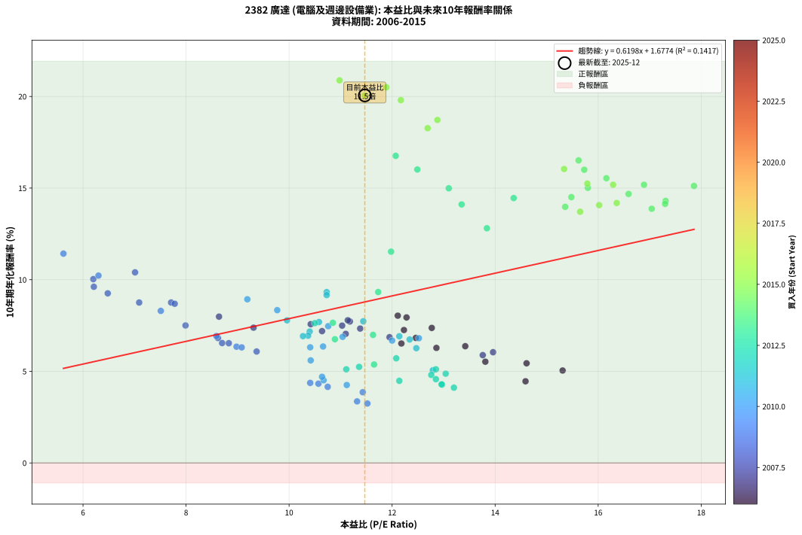
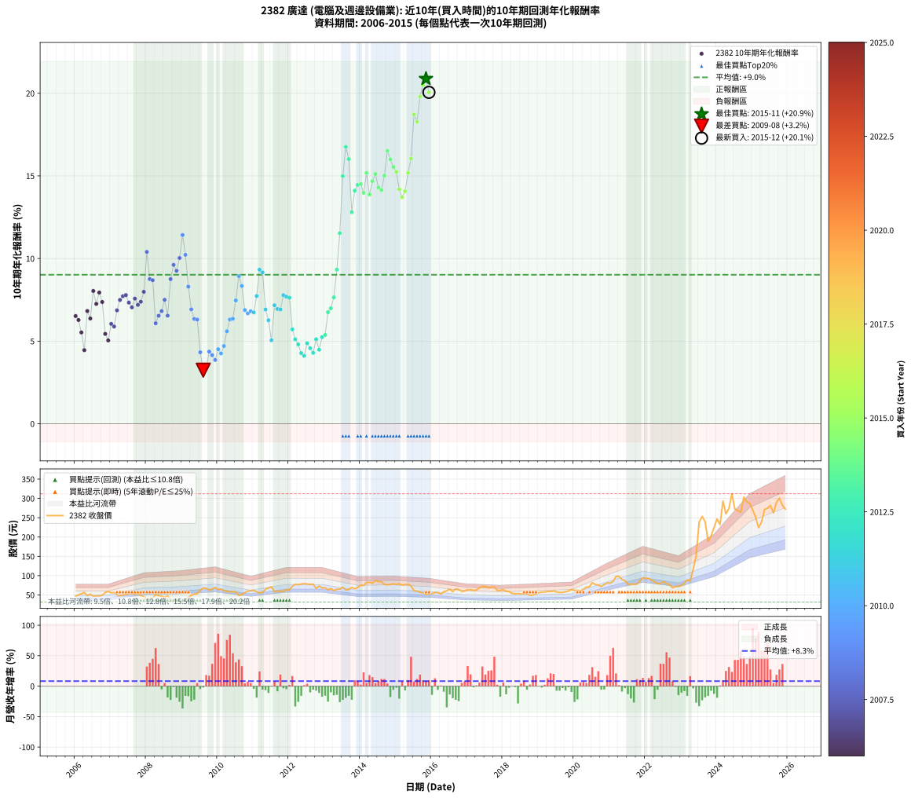

# 2382 廣達 - 本益比與未來報酬率分析

!!! info "報告資訊"
    - **股票代號**: 2382
    - **公司名稱**: 廣達
    - **產業別**: 電腦及週邊設備業
    - **分析期間**: 2006-2015 (120 個數據點)
    - **資料來源**: Type 12 (ShowMonthlyK_ChartFlow) 月收盤價與本益比
    - **報酬率口徑**: 含現金股利 (簡化: 年度合計，假設每年7/1入帳)
    - **報告生成時間**: 2026-01-10 20:42:05 CST

## 📈 視覺化圖表

### 圖表1: 本益比 vs 未來報酬率關係

*圖表1：2382 廣達 本益比與10年期未來報酬率關係 (2006-2015)*

### 圖表2: 歷年買入時點的10年期實際報酬率

*圖表2：2382 廣達 歷年買入時點的10年期實際報酬率 (2006-2015)*

## 📍 買點訊號說明

本報告提供兩種買點提示訊號（顯示於圖表2的股價子圖中）：

### ▲ 小綠色三角形（回測驗證）
- **計算方式**: 使用全部歷史資料計算本益比第25百分位數
- **用途**: 事後驗證，顯示歷史上哪些時點確實為低估區
- **限制**: 當下無法判斷，僅供回測參考
- **特性**: 後見之明（Look-Ahead Bias）

### ▲ 小橘色三角形（即時訊號）
- **計算方式**: 使用截至當月的過去5年資料計算本益比第25百分位數
- **用途**: 實際投資決策，當時即可判斷
- **優勢**: 可操作性強，符合實務需求
- **特性**: 無後見之明，滾動窗口計算

!!! tip "如何使用兩種訊號"
    - **綠色▲** 幫助理解歷史估值機會，驗證策略有效性
    - **橘色▲** 可作為實際買進參考，但仍需搭配基本面分析
    - 兩種訊號重疊時，表示即時判斷與事後驗證一致，信心度較高
    - 僅有綠色▲時，表示當時無法判斷（需要未來資料才能確認）
    - 僅有橘色▲時，表示即時判斷為買點，但事後可能不是最佳時機

## 📊 估值分析摘要

| 指標 | 數值 |
|:---:|:---:|
| **目前本益比** (2015-12) | **11.47 倍** |
| **歷史平均本益比** | 11.84 倍 |
| **估值水準** | 🟡 合理範圍 |
| **預期10年年化報酬率** | **+8.79%** |
| **歷史平均報酬率** | +9.02% |
| **相關係數 (R²)** | 0.1417 |
| **趨勢線斜率** | 0.6198 |

!!! abstract "核心洞察"
    目前本益比接近歷史平均，預期報酬率符合長期趨勢

    根據歷史數據回測，2382 廣達 在目前本益比 **11.5倍** 的估值水準下，
    預期未來10年年化報酬率約為 **+8.8%**。

    **重要提醒**: 本分析基於歷史數據統計，實際報酬率會受到公司基本面變化、產業趨勢、
    總體經濟環境等多重因素影響。R² = 0.14 表示本益比可解釋約 14.2% 的報酬率變異。

## 📈 歷史估值統計

### 最佳買點 (最高報酬率)

| 項目 | 數值 |
|:---:|:---:|
| 起始時間 | 2015-11 |
| 當時本益比 | 10.98 倍 |
| 起始價格 | 51.0 元 |
| 10年後價格 | 282.0 元 |
| **10年年化報酬率** | **+20.88%** |

### 最差買點 (最低報酬率)

| 項目 | 數值 |
|:---:|:---:|
| 起始時間 | 2009-08 |
| 當時本益比 | 11.52 倍 |
| 起始價格 | 68.2 元 |
| 10年後價格 | 56.5 元 |
| **10年年化報酬率** | **+3.24%** |

## 🎯 投資啟示

### 本益比與報酬率關係

趨勢線方程式: **y = 0.6198x + 1.6774**

!!! info "弱相關或正相關"
    本益比與未來報酬率相關性較弱。這可能表示該股票的報酬率更多受到
    公司成長性、產業趨勢等因素影響，而非估值水準。**需綜合考量多項指標**。

### 估值區間建議

基於歷史數據分析:

- **🟢 低估區** (P/E < 9.5): 預期報酬率較高，可考慮增加持股
- **🟡 合理區** (P/E 9.5-14.2): 預期報酬率符合長期趨勢，正常持有
- **🔴 高估區** (P/E > 14.2): 預期報酬率較低，可考慮減碼或觀望

!!! danger "風險提示"
    - 過去表現不代表未來結果
    - 本分析假設公司基本面無重大結構性變化
    - 產業環境劇變可能使歷史規律失效
    - 應結合公司財報、產業趨勢、總體經濟等多重因素綜合判斷

!!! success "長期投資觀點"
    歷史數據顯示，在合理或低估的估值水準買入並長期持有，
    往往能獲得較佳的投資報酬。**耐心等待好價格**是價值投資的核心原則。

## 📊 數據品質

- **資料來源**: GoodInfo.tw Type 12 (ShowMonthlyK_ChartFlow)
- **資料頻率**: 月度收盤價與本益比
- **回測期間**: 2006-2015
- **數據點數量**: 120 個 (每個點代表一次10年期回測)

### 計算方法說明

1. **10年期年化報酬率**:
   - 對每個歷史時點，計算其後10年的實際投資報酬率
   - 期末價值(不含股利): 期末價格
   - 期末價值(含現金股利): 期末價格 + 持有期間內的現金股利合計 (簡化: 年度合計，假設每年7/1入帳)
   - 公式: 年化報酬率 = [(期末價值/期初價格)^(1/年數) - 1] × 100%

2. **本益比 (P/E Ratio)**:
   - 使用當時的月收盤價與EPS計算
   - 資料來源: Type 12 月度河流圖本益比數據

3. **趨勢線 (Linear Regression)**:
   - 使用最小平方法擬合線性趨勢線
   - R²值衡量本益比對報酬率的解釋能力

---

*本報告由 Stock Analysis System v1.9.0 自動生成*
*數據更新時間: 2026-01-10 20:42:05 CST*

## 📋 月度回測明細表

（每一列對應時間線圖中的一個買入點；可用來對照 SVG 圖上的每個點。）

| 買入月份 | 賣出月份 | 回測期限_年 | 實際持有年數 | 買入本益比_倍 | 買入收盤價_元 | 賣出收盤價_元 | 現金股利合計_元 | 總報酬率_pct | 年化報酬率_pct |
| --- | --- | --- | --- | --- | --- | --- | --- | --- | --- |
| 2006-01 | 2016-01 | 10 | 9.999 | 12.18 | 47.00 | 53.30 | 35.07 | +88.01 | +6.52 |
| 2006-02 | 2016-02 | 10 | 9.999 | 12.86 | 49.65 | 56.20 | 35.07 | +83.82 | +6.28 |
| 2006-03 | 2016-03 | 10 | 10.001 | 13.81 | 53.30 | 56.20 | 35.07 | +71.23 | +5.52 |
| 2006-04 | 2016-04 | 10 | 10.001 | 14.59 | 56.30 | 52.00 | 35.07 | +54.65 | +4.46 |
| 2006-05 | 2016-05 | 10 | 10.001 | 12.46 | 48.10 | 58.00 | 35.07 | +93.48 | +6.82 |
| 2006-06 | 2016-06 | 10 | 10.001 | 13.42 | 51.80 | 61.00 | 35.07 | +85.46 | +6.37 |
| 2006-07 | 2016-07 | 10 | 10.001 | 12.11 | 46.75 | 64.90 | 36.38 | +116.64 | +8.04 |
| 2006-08 | 2016-08 | 10 | 10.001 | 12.23 | 47.20 | 58.70 | 36.38 | +101.44 | +7.25 |
| 2006-09 | 2016-09 | 10 | 10.001 | 12.28 | 47.40 | 65.40 | 36.38 | +114.73 | +7.94 |
| 2006-10 | 2016-10 | 10 | 10.001 | 12.77 | 49.30 | 64.00 | 36.38 | +103.61 | +7.37 |
| 2006-11 | 2016-11 | 10 | 10.001 | 14.61 | 56.40 | 59.40 | 36.38 | +69.82 | +5.44 |
| 2006-12 | 2016-12 | 10 | 10.001 | 15.31 | 59.10 | 60.30 | 36.38 | +63.59 | +5.04 |
| 2007-01 | 2017-01 | 10 | 10.001 | 13.96 | 55.60 | 63.60 | 36.38 | +79.82 | +6.04 |
| 2007-02 | 2017-02 | 10 | 10.001 | 13.76 | 56.50 | 63.70 | 36.38 | +77.13 | +5.88 |
| 2007-03 | 2017-03 | 10 | 10.001 | 11.95 | 50.50 | 61.70 | 36.38 | +94.22 | +6.86 |
| 2007-04 | 2017-04 | 10 | 10.001 | 11.03 | 48.00 | 62.50 | 36.38 | +106.00 | +7.49 |
| 2007-05 | 2017-05 | 10 | 10.001 | 11.18 | 50.00 | 68.80 | 36.38 | +110.36 | +7.72 |
| 2007-06 | 2017-06 | 10 | 10.001 | 11.14 | 51.20 | 72.00 | 36.38 | +111.68 | +7.79 |
| 2007-07 | 2017-07 | 10 | 10.001 | 11.38 | 53.70 | 71.60 | 37.38 | +102.94 | +7.33 |
| 2007-08 | 2017-08 | 10 | 10.001 | 11.10 | 53.70 | 68.70 | 37.38 | +97.54 | +7.04 |
| 2007-09 | 2017-09 | 10 | 10.001 | 10.42 | 51.70 | 69.90 | 37.38 | +107.51 | +7.57 |
| 2007-10 | 2017-10 | 10 | 10.001 | 10.64 | 54.10 | 71.00 | 37.38 | +100.33 | +7.19 |
| 2007-11 | 2017-11 | 10 | 10.001 | 9.31 | 48.50 | 61.50 | 37.38 | +103.88 | +7.38 |
| 2007-12 | 2017-12 | 10 | 10.001 | 8.64 | 46.05 | 61.90 | 37.38 | +115.59 | +7.98 |
| 2008-01 | 2018-01 | 10 | 10.001 | 7.01 | 37.50 | 63.50 | 37.38 | +169.02 | +10.40 |
| 2008-02 | 2018-03 | 10 | 10.081 | 7.71 | 41.40 | 59.10 | 37.38 | +133.05 | +8.76 |
| 2008-03 | 2018-03 | 10 | 9.999 | 7.78 | 41.95 | 59.10 | 37.38 | +129.99 | +8.69 |
| 2008-04 | 2018-04 | 10 | 9.999 | 9.37 | 50.70 | 54.10 | 37.38 | +80.44 | +6.08 |
| 2008-05 | 2018-05 | 10 | 9.999 | 8.83 | 48.00 | 53.00 | 37.38 | +88.29 | +6.53 |
| 2008-06 | 2018-06 | 10 | 9.999 | 8.62 | 47.00 | 53.50 | 37.38 | +93.36 | +6.82 |
| 2008-07 | 2018-07 | 10 | 9.999 | 7.99 | 43.75 | 52.90 | 37.28 | +106.13 | +7.50 |
| 2008-08 | 2018-08 | 10 | 9.999 | 8.70 | 47.80 | 52.80 | 37.28 | +88.45 | +6.54 |
| 2008-09 | 2018-09 | 10 | 9.999 | 7.09 | 39.10 | 53.20 | 37.28 | +131.41 | +8.75 |
| 2008-10 | 2018-10 | 10 | 9.999 | 6.21 | 34.40 | 48.85 | 37.28 | +150.38 | +9.61 |
| 2008-11 | 2018-11 | 10 | 9.999 | 6.48 | 36.00 | 49.95 | 37.28 | +142.31 | +9.26 |
| 2008-12 | 2018-12 | 10 | 9.999 | 6.20 | 34.60 | 52.70 | 37.28 | +160.06 | +10.03 |
| 2009-01 | 2019-01 | 10 | 9.999 | 5.62 | 31.60 | 55.90 | 37.28 | +194.88 | +11.42 |
| 2009-02 | 2019-02 | 10 | 9.999 | 6.30 | 35.70 | 57.20 | 37.28 | +164.65 | +10.22 |
| 2009-03 | 2019-03 | 10 | 9.999 | 7.51 | 42.85 | 57.80 | 37.28 | +121.89 | +8.30 |
| 2009-04 | 2019-04 | 10 | 9.999 | 8.59 | 49.40 | 59.20 | 37.28 | +95.31 | +6.92 |
| 2009-05 | 2019-05 | 10 | 9.999 | 8.98 | 52.00 | 58.90 | 37.28 | +84.96 | +6.34 |
| 2009-06 | 2019-06 | 10 | 9.999 | 9.08 | 53.00 | 60.40 | 37.28 | +84.30 | +6.31 |
| 2009-07 | 2019-07 | 10 | 9.999 | 10.57 | 62.10 | 57.50 | 37.33 | +52.71 | +4.32 |
| 2009-08 | 2019-08 | 10 | 9.999 | 11.52 | 68.20 | 56.50 | 37.33 | +37.58 | +3.24 |
| 2009-09 | 2019-09 | 10 | 9.999 | 11.32 | 67.50 | 56.60 | 37.33 | +39.16 | +3.36 |
| 2009-10 | 2019-10 | 10 | 9.999 | 10.41 | 62.50 | 58.50 | 37.33 | +53.33 | +4.37 |
| 2009-11 | 2019-11 | 10 | 9.999 | 10.75 | 65.00 | 60.30 | 37.33 | +50.20 | +4.15 |
| 2009-12 | 2019-12 | 10 | 9.999 | 11.43 | 69.60 | 64.30 | 37.33 | +46.02 | +3.86 |
| 2010-01 | 2020-01 | 10 | 9.999 | 10.67 | 63.90 | 62.00 | 37.33 | +55.45 | +4.51 |
| 2010-02 | 2020-02 | 10 | 9.999 | 11.12 | 65.50 | 62.00 | 37.33 | +51.65 | +4.25 |
| 2010-03 | 2020-03 | 10 | 10.001 | 10.64 | 61.60 | 60.20 | 37.33 | +58.33 | +4.70 |
| 2010-04 | 2020-04 | 10 | 10.001 | 10.42 | 59.30 | 64.90 | 37.33 | +72.40 | +5.60 |
| 2010-05 | 2020-05 | 10 | 10.001 | 10.41 | 58.20 | 70.00 | 37.33 | +84.42 | +6.31 |
| 2010-06 | 2020-06 | 10 | 10.001 | 10.66 | 58.50 | 71.00 | 37.33 | +85.18 | +6.35 |
| 2010-07 | 2020-07 | 10 | 10.001 | 10.76 | 58.00 | 81.80 | 37.35 | +105.43 | +7.46 |
| 2010-08 | 2020-08 | 10 | 10.001 | 9.19 | 48.60 | 77.00 | 37.35 | +135.28 | +8.93 |
| 2010-09 | 2020-09 | 10 | 10.001 | 9.77 | 50.70 | 75.60 | 37.35 | +122.78 | +8.34 |
| 2010-10 | 2020-10 | 10 | 10.001 | 11.04 | 56.20 | 72.00 | 37.35 | +94.57 | +6.88 |
| 2010-11 | 2020-11 | 10 | 10.001 | 12.00 | 59.90 | 77.00 | 37.35 | +90.90 | +6.68 |
| 2010-12 | 2020-12 | 10 | 10.001 | 12.52 | 61.20 | 80.90 | 37.35 | +93.21 | +6.81 |
| 2011-01 | 2021-01 | 10 | 10.001 | 12.34 | 61.50 | 80.70 | 37.35 | +91.95 | +6.74 |
| 2011-02 | 2021-02 | 10 | 10.001 | 11.44 | 58.10 | 85.00 | 37.35 | +110.58 | +7.73 |
| 2011-03 | 2021-03 | 10 | 10.001 | 10.73 | 55.50 | 98.00 | 37.35 | +143.87 | +9.32 |
| 2011-04 | 2021-04 | 10 | 10.001 | 10.73 | 56.50 | 98.40 | 37.35 | +140.26 | +9.16 |
| 2011-05 | 2021-05 | 10 | 10.001 | 12.14 | 65.10 | 89.70 | 37.35 | +95.16 | +6.91 |
| 2011-06 | 2021-06 | 10 | 10.001 | 12.47 | 68.00 | 87.50 | 37.35 | +83.60 | +6.26 |
| 2011-07 | 2021-07 | 10 | 10.001 | 12.79 | 71.00 | 77.30 | 38.95 | +63.73 | +5.05 |
| 2011-08 | 2021-08 | 10 | 10.001 | 10.40 | 58.70 | 78.40 | 38.95 | +99.91 | +7.17 |
| 2011-09 | 2021-09 | 10 | 10.001 | 10.37 | 59.50 | 77.50 | 38.95 | +95.71 | +6.94 |
| 2011-10 | 2021-10 | 10 | 10.001 | 10.27 | 59.90 | 78.00 | 38.95 | +95.24 | +6.92 |
| 2011-11 | 2021-11 | 10 | 10.001 | 9.96 | 59.00 | 85.90 | 38.95 | +111.61 | +7.78 |
| 2011-12 | 2021-12 | 10 | 10.001 | 10.58 | 63.70 | 94.70 | 38.95 | +109.81 | +7.69 |
| 2012-01 | 2022-01 | 10 | 10.001 | 10.50 | 63.20 | 92.90 | 38.95 | +108.62 | +7.63 |
| 2012-02 | 2022-03 | 10 | 10.081 | 12.08 | 72.70 | 88.30 | 38.95 | +75.03 | +5.71 |
| 2012-03 | 2022-03 | 10 | 9.999 | 12.85 | 77.30 | 88.30 | 38.95 | +64.62 | +5.11 |
| 2012-04 | 2022-04 | 10 | 9.999 | 12.76 | 76.80 | 83.80 | 38.95 | +59.83 | +4.80 |
| 2012-05 | 2022-05 | 10 | 9.999 | 12.97 | 78.00 | 79.60 | 38.95 | +51.98 | +4.28 |
| 2012-06 | 2022-06 | 10 | 9.999 | 13.20 | 79.40 | 79.80 | 38.95 | +49.56 | +4.11 |
| 2012-07 | 2022-07 | 10 | 9.999 | 13.04 | 78.40 | 84.60 | 41.55 | +60.91 | +4.87 |
| 2012-08 | 2022-08 | 10 | 9.999 | 12.85 | 77.30 | 79.30 | 41.55 | +56.34 | +4.57 |
| 2012-09 | 2022-09 | 10 | 9.999 | 12.96 | 77.90 | 77.00 | 41.55 | +52.18 | +4.29 |
| 2012-10 | 2022-10 | 10 | 9.999 | 11.11 | 66.80 | 68.40 | 41.55 | +64.60 | +5.11 |
| 2012-11 | 2022-11 | 10 | 9.999 | 12.14 | 73.00 | 71.60 | 41.55 | +55.00 | +4.48 |
| 2012-12 | 2022-12 | 10 | 9.999 | 11.36 | 68.30 | 72.30 | 41.55 | +66.69 | +5.24 |
| 2013-01 | 2023-01 | 10 | 9.999 | 11.65 | 68.90 | 74.70 | 41.55 | +68.72 | +5.37 |
| 2013-02 | 2023-02 | 10 | 9.999 | 10.89 | 63.30 | 80.10 | 41.55 | +92.18 | +6.75 |
| 2013-03 | 2023-03 | 10 | 9.999 | 11.63 | 66.50 | 89.10 | 41.55 | +96.47 | +6.99 |
| 2013-04 | 2023-04 | 10 | 9.999 | 10.85 | 61.00 | 85.90 | 41.55 | +108.93 | +7.65 |
| 2013-05 | 2023-05 | 10 | 9.999 | 11.73 | 64.80 | 116.50 | 41.55 | +143.90 | +9.33 |
| 2013-06 | 2023-06 | 10 | 9.999 | 11.98 | 65.00 | 152.00 | 41.55 | +197.77 | +11.53 |
| 2013-07 | 2023-07 | 10 | 9.999 | 13.10 | 69.80 | 238.50 | 43.55 | +304.08 | +14.99 |
| 2013-08 | 2023-08 | 10 | 9.999 | 12.07 | 63.10 | 253.50 | 43.55 | +370.76 | +16.76 |
| 2013-09 | 2023-09 | 10 | 9.999 | 12.49 | 64.10 | 239.50 | 43.55 | +341.58 | +16.01 |
| 2013-10 | 2023-10 | 10 | 9.999 | 13.84 | 69.70 | 189.00 | 43.55 | +233.64 | +12.81 |
| 2013-11 | 2023-11 | 10 | 9.999 | 13.35 | 65.90 | 203.00 | 43.55 | +274.13 | +14.11 |
| 2013-12 | 2023-12 | 10 | 9.999 | 14.36 | 69.50 | 224.50 | 43.55 | +285.68 | +14.45 |
| 2014-01 | 2024-01 | 10 | 9.999 | 15.48 | 75.00 | 247.00 | 43.55 | +287.40 | +14.50 |
| 2014-02 | 2024-02 | 10 | 9.999 | 15.36 | 74.50 | 232.00 | 43.55 | +269.87 | +13.98 |
| 2014-03 | 2024-03 | 10 | 10.001 | 16.89 | 82.00 | 293.50 | 43.55 | +311.04 | +15.18 |
| 2014-04 | 2024-04 | 10 | 10.001 | 17.04 | 82.80 | 260.00 | 43.55 | +266.61 | +13.87 |
| 2014-05 | 2024-05 | 10 | 10.001 | 16.59 | 80.70 | 274.00 | 43.55 | +293.49 | +14.68 |
| 2014-06 | 2024-06 | 10 | 10.001 | 17.86 | 87.00 | 312.00 | 43.55 | +308.68 | +15.11 |
| 2014-07 | 2024-07 | 10 | 10.001 | 17.31 | 84.40 | 272.50 | 48.75 | +280.63 | +14.30 |
| 2014-08 | 2024-08 | 10 | 10.001 | 17.30 | 84.40 | 268.00 | 48.75 | +275.30 | +14.14 |
| 2014-09 | 2024-09 | 10 | 10.001 | 15.80 | 77.20 | 264.00 | 48.75 | +305.12 | +15.01 |
| 2014-10 | 2024-10 | 10 | 10.001 | 15.62 | 76.40 | 303.50 | 48.75 | +361.06 | +16.51 |
| 2014-11 | 2024-11 | 10 | 10.001 | 15.73 | 77.00 | 291.00 | 48.75 | +341.23 | +16.00 |
| 2014-12 | 2024-12 | 10 | 10.001 | 16.16 | 79.20 | 287.00 | 48.75 | +323.93 | +15.54 |
| 2015-01 | 2025-01 | 10 | 10.001 | 15.79 | 77.00 | 269.50 | 48.75 | +313.31 | +15.24 |
| 2015-02 | 2025-02 | 10 | 10.001 | 16.36 | 79.40 | 250.50 | 48.75 | +276.89 | +14.19 |
| 2015-03 | 2025-03 | 10 | 10.001 | 15.65 | 75.60 | 224.50 | 48.75 | +261.44 | +13.71 |
| 2015-04 | 2025-04 | 10 | 10.001 | 16.02 | 77.00 | 238.50 | 48.75 | +273.05 | +14.07 |
| 2015-05 | 2025-05 | 10 | 10.001 | 16.29 | 77.90 | 271.50 | 48.75 | +311.10 | +15.18 |
| 2015-06 | 2025-06 | 10 | 10.001 | 15.34 | 73.00 | 274.50 | 48.75 | +342.81 | +16.04 |
| 2015-07 | 2025-07 | 10 | 10.001 | 12.88 | 61.00 | 281.50 | 57.75 | +456.15 | +18.72 |
| 2015-08 | 2025-08 | 10 | 10.001 | 12.69 | 59.80 | 262.50 | 57.75 | +435.54 | +18.27 |
| 2015-09 | 2025-09 | 10 | 10.001 | 12.17 | 57.10 | 290.00 | 57.75 | +509.02 | +19.80 |
| 2015-10 | 2025-10 | 10 | 10.001 | 11.89 | 55.50 | 300.50 | 57.75 | +545.50 | +20.50 |
| 2015-11 | 2025-11 | 10 | 10.001 | 10.98 | 51.00 | 282.00 | 57.75 | +566.18 | +20.88 |
| 2015-12 | 2025-12 | 10 | 10.001 | 11.47 | 53.00 | 272.00 | 57.75 | +522.17 | +20.05 |
