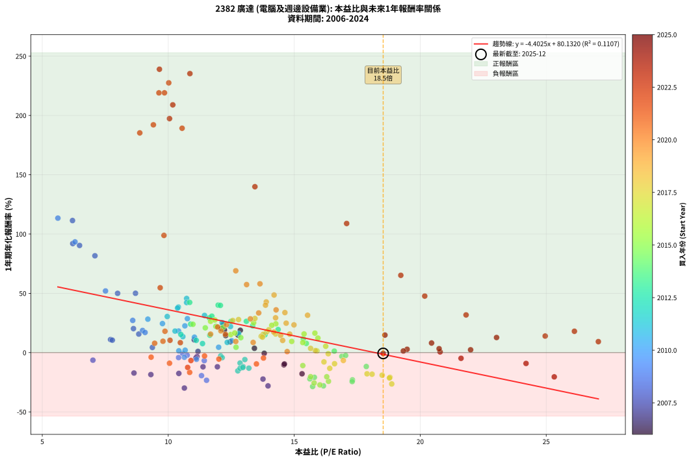
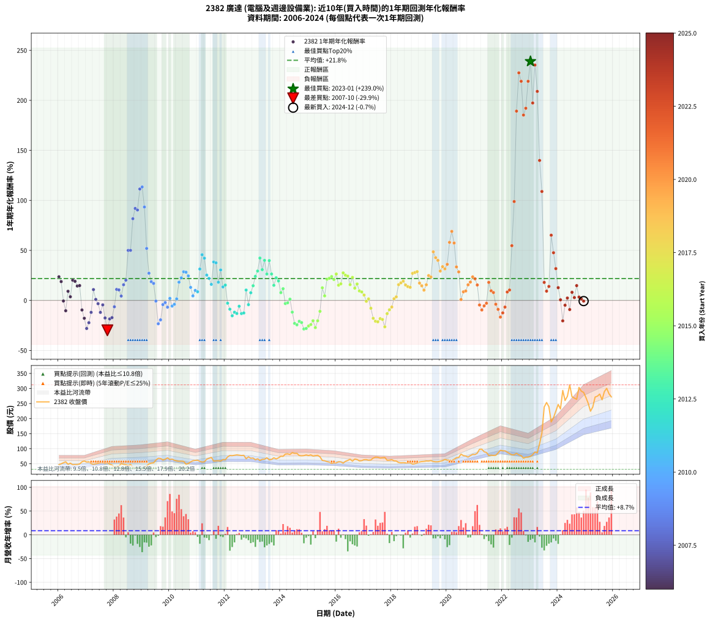

# 2382 廣達 - 本益比與未來報酬率分析

!!! info "報告資訊"
    - **股票代號**: 2382
    - **公司名稱**: 廣達
    - **產業別**: 電腦及週邊設備業
    - **分析期間**: 2006-2024 (228 個數據點)
    - **資料來源**: Type 12 (ShowMonthlyK_ChartFlow) 月收盤價與本益比
    - **報酬率口徑**: 含現金股利 (簡化: 年度合計，假設每年7/1入帳)
    - **報告生成時間**: 2026-01-06 00:37:04 CST

## 📈 視覺化圖表

### 圖表1: 本益比 vs 未來報酬率關係

*圖表1：2382 廣達 本益比與1年期未來報酬率關係 (2006-2024)*

### 圖表2: 歷年買入時點的1年期實際報酬率

*圖表2：2382 廣達 歷年買入時點的1年期實際報酬率 (2006-2024)*

## 📍 買點訊號說明

本報告提供兩種買點提示訊號（顯示於圖表2的股價子圖中）：

### ▲ 小綠色三角形（回測驗證）
- **計算方式**: 使用全部歷史資料計算本益比第25百分位數
- **用途**: 事後驗證，顯示歷史上哪些時點確實為低估區
- **限制**: 當下無法判斷，僅供回測參考
- **特性**: 後見之明（Look-Ahead Bias）

### ▲ 小橘色三角形（即時訊號）
- **計算方式**: 使用截至當月的過去5年資料計算本益比第25百分位數
- **用途**: 實際投資決策，當時即可判斷
- **優勢**: 可操作性強，符合實務需求
- **特性**: 無後見之明，滾動窗口計算

!!! tip "如何使用兩種訊號"
    - **綠色▲** 幫助理解歷史估值機會，驗證策略有效性
    - **橘色▲** 可作為實際買進參考，但仍需搭配基本面分析
    - 兩種訊號重疊時，表示即時判斷與事後驗證一致，信心度較高
    - 僅有綠色▲時，表示當時無法判斷（需要未來資料才能確認）
    - 僅有橘色▲時，表示即時判斷為買點，但事後可能不是最佳時機

## 📊 估值分析摘要

| 指標 | 數值 |
|:---:|:---:|
| **目前本益比** (2024-12) | **18.53 倍** |
| **歷史平均本益比** | 13.24 倍 |
| **估值水準** | 🔴 相對高估 |
| **預期1年年化報酬率** | **-1.45%** |
| **歷史平均報酬率** | +21.84% |
| **相關係數 (R²)** | 0.1107 |
| **趨勢線斜率** | -4.4025 |

!!! abstract "核心洞察"
    目前本益比顯著高於歷史平均，預期未來報酬率可能較低

    根據歷史數據回測，2382 廣達 在目前本益比 **18.5倍** 的估值水準下，
    預期未來1年年化報酬率約為 **-1.4%**。

    **重要提醒**: 本分析基於歷史數據統計，實際報酬率會受到公司基本面變化、產業趨勢、
    總體經濟環境等多重因素影響。R² = 0.11 表示本益比可解釋約 11.1% 的報酬率變異。

## 📈 歷史估值統計

### 最佳買點 (最高報酬率)

| 項目 | 數值 |
|:---:|:---:|
| 起始時間 | 2023-01 |
| 當時本益比 | 9.65 倍 |
| 起始價格 | 74.7 元 |
| 1年後價格 | 247.0 元 |
| **1年年化報酬率** | **+238.97%** |

### 最差買點 (最低報酬率)

| 項目 | 數值 |
|:---:|:---:|
| 起始時間 | 2007-10 |
| 當時本益比 | 10.64 倍 |
| 起始價格 | 54.1 元 |
| 1年後價格 | 34.4 元 |
| **1年年化報酬率** | **-29.89%** |

## 🎯 投資啟示

### 本益比與報酬率關係

趨勢線方程式: **y = -4.4025x + 80.1320**

!!! warning "強負相關"
    本益比與未來報酬率呈現強負相關。在高本益比時期買入，未來報酬率顯著較低；
    在低本益比時期買入，未來報酬率顯著較高。**估值紀律至關重要**。

### 估值區間建議

基於歷史數據分析:

- **🟢 低估區** (P/E < 10.6): 預期報酬率較高，可考慮增加持股
- **🟡 合理區** (P/E 10.6-15.9): 預期報酬率符合長期趨勢，正常持有
- **🔴 高估區** (P/E > 15.9): 預期報酬率較低，可考慮減碼或觀望

!!! danger "風險提示"
    - 過去表現不代表未來結果
    - 本分析假設公司基本面無重大結構性變化
    - 產業環境劇變可能使歷史規律失效
    - 應結合公司財報、產業趨勢、總體經濟等多重因素綜合判斷

!!! success "長期投資觀點"
    歷史數據顯示，在合理或低估的估值水準買入並長期持有，
    往往能獲得較佳的投資報酬。**耐心等待好價格**是價值投資的核心原則。

## 📊 數據品質

- **資料來源**: GoodInfo.tw Type 12 (ShowMonthlyK_ChartFlow)
- **資料頻率**: 月度收盤價與本益比
- **回測期間**: 2006-2024
- **數據點數量**: 228 個 (每個點代表一次1年期回測)

### 計算方法說明

1. **1年期年化報酬率**:
   - 對每個歷史時點，計算其後1年的實際投資報酬率
   - 期末價值(不含股利): 期末價格
   - 期末價值(含現金股利): 期末價格 + 持有期間內的現金股利合計 (簡化: 年度合計，假設每年7/1入帳)
   - 公式: 年化報酬率 = [(期末價值/期初價格)^(1/年數) - 1] × 100%

2. **本益比 (P/E Ratio)**:
   - 使用當時的月收盤價與EPS計算
   - 資料來源: Type 12 月度河流圖本益比數據

3. **趨勢線 (Linear Regression)**:
   - 使用最小平方法擬合線性趨勢線
   - R²值衡量本益比對報酬率的解釋能力

---

*本報告由 Stock Analysis System v1.9.0 自動生成*
*數據更新時間: 2026-01-06 00:37:04 CST*

## 📋 月度回測明細表

（每一列對應時間線圖中的一個買入點；可用來對照 SVG 圖上的每個點。）

| 買入月份 | 賣出月份 | 回測期限_年 | 實際持有年數 | 買入本益比_倍 | 買入收盤價_元 | 賣出收盤價_元 | 現金股利合計_元 | 總報酬率_pct | 年化報酬率_pct |
| --- | --- | --- | --- | --- | --- | --- | --- | --- | --- |
| 2006-01 | 2007-01 | 1 | 0.999 | 12.18 | 47.00 | 55.60 | 2.48 | +23.59 | +23.60 |
| 2006-02 | 2007-02 | 1 | 0.999 | 12.86 | 49.65 | 56.50 | 2.48 | +18.80 | +18.82 |
| 2006-03 | 2007-03 | 1 | 0.999 | 13.81 | 53.30 | 50.50 | 2.48 | -0.59 | -0.59 |
| 2006-04 | 2007-04 | 1 | 0.999 | 14.59 | 56.30 | 48.00 | 2.48 | -10.33 | -10.34 |
| 2006-05 | 2007-05 | 1 | 0.999 | 12.46 | 48.10 | 50.00 | 2.48 | +9.12 | +9.12 |
| 2006-06 | 2007-06 | 1 | 0.999 | 13.42 | 51.80 | 51.20 | 2.48 | +3.64 | +3.64 |
| 2006-07 | 2007-07 | 1 | 0.999 | 12.11 | 46.75 | 53.70 | 2.50 | +20.21 | +20.23 |
| 2006-08 | 2007-08 | 1 | 0.999 | 12.23 | 47.20 | 53.70 | 2.50 | +19.07 | +19.08 |
| 2006-09 | 2007-09 | 1 | 0.999 | 12.28 | 47.40 | 51.70 | 2.50 | +14.35 | +14.36 |
| 2006-10 | 2007-10 | 1 | 0.999 | 12.77 | 49.30 | 54.10 | 2.50 | +14.81 | +14.82 |
| 2006-11 | 2007-11 | 1 | 0.999 | 14.61 | 56.40 | 48.50 | 2.50 | -9.57 | -9.58 |
| 2006-12 | 2007-12 | 1 | 0.999 | 15.31 | 59.10 | 46.05 | 2.50 | -17.85 | -17.86 |
| 2007-01 | 2008-01 | 1 | 0.999 | 13.96 | 55.60 | 37.50 | 2.50 | -28.06 | -28.07 |
| 2007-02 | 2008-02 | 1 | 0.999 | 13.76 | 56.50 | 41.40 | 2.50 | -22.30 | -22.31 |
| 2007-03 | 2008-03 | 1 | 1.002 | 11.95 | 50.50 | 41.95 | 2.50 | -11.98 | -11.96 |
| 2007-04 | 2008-04 | 1 | 1.002 | 11.03 | 48.00 | 50.70 | 2.50 | +10.83 | +10.81 |
| 2007-05 | 2008-05 | 1 | 1.002 | 11.18 | 50.00 | 48.00 | 2.50 | +1.00 | +1.00 |
| 2007-06 | 2008-06 | 1 | 1.002 | 11.14 | 51.20 | 47.00 | 2.50 | -3.32 | -3.31 |
| 2007-07 | 2008-07 | 1 | 1.002 | 11.38 | 53.70 | 43.75 | 3.50 | -12.01 | -11.99 |
| 2007-08 | 2008-08 | 1 | 1.002 | 11.10 | 53.70 | 47.80 | 3.50 | -4.47 | -4.46 |
| 2007-09 | 2008-09 | 1 | 1.002 | 10.42 | 51.70 | 39.10 | 3.50 | -17.60 | -17.57 |
| 2007-10 | 2008-10 | 1 | 1.002 | 10.64 | 54.10 | 34.40 | 3.50 | -29.94 | -29.89 |
| 2007-11 | 2008-11 | 1 | 1.002 | 9.31 | 48.50 | 36.00 | 3.50 | -18.56 | -18.52 |
| 2007-12 | 2008-12 | 1 | 1.002 | 8.64 | 46.05 | 34.60 | 3.50 | -17.26 | -17.23 |
| 2008-01 | 2009-01 | 1 | 1.002 | 7.01 | 37.50 | 31.60 | 3.50 | -6.40 | -6.39 |
| 2008-02 | 2009-03 | 1 | 1.081 | 7.71 | 41.40 | 42.85 | 3.50 | +11.96 | +11.01 |
| 2008-03 | 2009-03 | 1 | 0.999 | 7.78 | 41.95 | 42.85 | 3.50 | +10.49 | +10.50 |
| 2008-04 | 2009-04 | 1 | 0.999 | 9.37 | 50.70 | 49.40 | 3.50 | +4.34 | +4.34 |
| 2008-05 | 2009-05 | 1 | 0.999 | 8.83 | 48.00 | 52.00 | 3.50 | +15.62 | +15.64 |
| 2008-06 | 2009-06 | 1 | 0.999 | 8.62 | 47.00 | 53.00 | 3.50 | +20.21 | +20.23 |
| 2008-07 | 2009-07 | 1 | 0.999 | 7.99 | 43.75 | 62.10 | 3.50 | +49.94 | +49.98 |
| 2008-08 | 2009-08 | 1 | 0.999 | 8.70 | 47.80 | 68.20 | 3.50 | +50.00 | +50.04 |
| 2008-09 | 2009-09 | 1 | 0.999 | 7.09 | 39.10 | 67.50 | 3.50 | +81.59 | +81.66 |
| 2008-10 | 2009-10 | 1 | 0.999 | 6.21 | 34.40 | 62.50 | 3.50 | +91.86 | +91.95 |
| 2008-11 | 2009-11 | 1 | 0.999 | 6.48 | 36.00 | 65.00 | 3.50 | +90.28 | +90.36 |
| 2008-12 | 2009-12 | 1 | 0.999 | 6.20 | 34.60 | 69.60 | 3.50 | +111.27 | +111.38 |
| 2009-01 | 2010-01 | 1 | 0.999 | 5.62 | 31.60 | 63.90 | 3.50 | +113.29 | +113.40 |
| 2009-02 | 2010-02 | 1 | 0.999 | 6.30 | 35.70 | 65.50 | 3.50 | +93.28 | +93.36 |
| 2009-03 | 2010-03 | 1 | 0.999 | 7.51 | 42.85 | 61.60 | 3.50 | +51.93 | +51.97 |
| 2009-04 | 2010-04 | 1 | 0.999 | 8.59 | 49.40 | 59.30 | 3.50 | +27.13 | +27.15 |
| 2009-05 | 2010-05 | 1 | 0.999 | 8.98 | 52.00 | 58.20 | 3.50 | +18.65 | +18.67 |
| 2009-06 | 2010-06 | 1 | 0.999 | 9.08 | 53.00 | 58.50 | 3.50 | +16.98 | +16.99 |
| 2009-07 | 2010-07 | 1 | 0.999 | 10.57 | 62.10 | 58.00 | 3.68 | -0.67 | -0.67 |
| 2009-08 | 2010-08 | 1 | 0.999 | 11.52 | 68.20 | 48.60 | 3.68 | -23.34 | -23.35 |
| 2009-09 | 2010-09 | 1 | 0.999 | 11.32 | 67.50 | 50.70 | 3.68 | -19.43 | -19.44 |
| 2009-10 | 2010-10 | 1 | 0.999 | 10.41 | 62.50 | 56.20 | 3.68 | -4.19 | -4.19 |
| 2009-11 | 2010-11 | 1 | 0.999 | 10.75 | 65.00 | 59.90 | 3.68 | -2.18 | -2.18 |
| 2009-12 | 2010-12 | 1 | 0.999 | 11.43 | 69.60 | 61.20 | 3.68 | -6.78 | -6.78 |
| 2010-01 | 2011-01 | 1 | 0.999 | 10.67 | 63.90 | 61.50 | 3.68 | +2.01 | +2.01 |
| 2010-02 | 2011-02 | 1 | 0.999 | 11.12 | 65.50 | 58.10 | 3.68 | -5.67 | -5.68 |
| 2010-03 | 2011-03 | 1 | 0.999 | 10.64 | 61.60 | 55.50 | 3.68 | -3.92 | -3.92 |
| 2010-04 | 2011-04 | 1 | 0.999 | 10.42 | 59.30 | 56.50 | 3.68 | +1.49 | +1.49 |
| 2010-05 | 2011-05 | 1 | 0.999 | 10.41 | 58.20 | 65.10 | 3.68 | +18.19 | +18.20 |
| 2010-06 | 2011-06 | 1 | 0.999 | 10.66 | 58.50 | 68.00 | 3.68 | +22.54 | +22.55 |
| 2010-07 | 2011-07 | 1 | 0.999 | 10.76 | 58.00 | 71.00 | 3.60 | +28.62 | +28.64 |
| 2010-08 | 2011-08 | 1 | 0.999 | 9.19 | 48.60 | 58.70 | 3.60 | +28.19 | +28.21 |
| 2010-09 | 2011-09 | 1 | 0.999 | 9.77 | 50.70 | 59.50 | 3.60 | +24.46 | +24.47 |
| 2010-10 | 2011-10 | 1 | 0.999 | 11.04 | 56.20 | 59.90 | 3.60 | +12.99 | +13.00 |
| 2010-11 | 2011-11 | 1 | 0.999 | 12.00 | 59.90 | 59.00 | 3.60 | +4.51 | +4.51 |
| 2010-12 | 2011-12 | 1 | 0.999 | 12.52 | 61.20 | 63.70 | 3.60 | +9.97 | +9.97 |
| 2011-01 | 2012-01 | 1 | 0.999 | 12.34 | 61.50 | 63.20 | 3.60 | +8.62 | +8.62 |
| 2011-02 | 2012-02 | 1 | 0.999 | 11.44 | 58.10 | 72.70 | 3.60 | +31.32 | +31.35 |
| 2011-03 | 2012-03 | 1 | 1.002 | 10.73 | 55.50 | 77.30 | 3.60 | +45.76 | +45.65 |
| 2011-04 | 2012-04 | 1 | 1.002 | 10.73 | 56.50 | 76.80 | 3.60 | +42.30 | +42.20 |
| 2011-05 | 2012-05 | 1 | 1.002 | 12.14 | 65.10 | 78.00 | 3.60 | +25.34 | +25.29 |
| 2011-06 | 2012-06 | 1 | 1.002 | 12.47 | 68.00 | 79.40 | 3.60 | +22.06 | +22.01 |
| 2011-07 | 2012-07 | 1 | 1.002 | 12.79 | 71.00 | 78.40 | 4.00 | +16.05 | +16.02 |
| 2011-08 | 2012-08 | 1 | 1.002 | 10.40 | 58.70 | 77.30 | 4.00 | +38.50 | +38.41 |
| 2011-09 | 2012-09 | 1 | 1.002 | 10.37 | 59.50 | 77.90 | 4.00 | +37.64 | +37.55 |
| 2011-10 | 2012-10 | 1 | 1.002 | 10.27 | 59.90 | 66.80 | 4.00 | +18.19 | +18.15 |
| 2011-11 | 2012-11 | 1 | 1.002 | 9.96 | 59.00 | 73.00 | 4.00 | +30.51 | +30.43 |
| 2011-12 | 2012-12 | 1 | 1.002 | 10.58 | 63.70 | 68.30 | 4.00 | +13.50 | +13.47 |
| 2012-01 | 2013-01 | 1 | 1.002 | 10.50 | 63.20 | 68.90 | 4.00 | +15.34 | +15.31 |
| 2012-02 | 2013-03 | 1 | 1.081 | 12.08 | 72.70 | 66.50 | 4.00 | -3.03 | -2.80 |
| 2012-03 | 2013-03 | 1 | 0.999 | 12.85 | 77.30 | 66.50 | 4.00 | -8.80 | -8.81 |
| 2012-04 | 2013-04 | 1 | 0.999 | 12.76 | 76.80 | 61.00 | 4.00 | -15.37 | -15.38 |
| 2012-05 | 2013-05 | 1 | 0.999 | 12.97 | 78.00 | 64.80 | 4.00 | -11.80 | -11.81 |
| 2012-06 | 2013-06 | 1 | 0.999 | 13.20 | 79.40 | 65.00 | 4.00 | -13.10 | -13.11 |
| 2012-07 | 2013-07 | 1 | 0.999 | 13.04 | 78.40 | 69.80 | 4.00 | -5.87 | -5.87 |
| 2012-08 | 2013-08 | 1 | 0.999 | 12.85 | 77.30 | 63.10 | 4.00 | -13.20 | -13.20 |
| 2012-09 | 2013-09 | 1 | 0.999 | 12.96 | 77.90 | 64.10 | 4.00 | -12.58 | -12.59 |
| 2012-10 | 2013-10 | 1 | 0.999 | 11.11 | 66.80 | 69.70 | 4.00 | +10.33 | +10.34 |
| 2012-11 | 2013-11 | 1 | 0.999 | 12.14 | 73.00 | 65.90 | 4.00 | -4.25 | -4.25 |
| 2012-12 | 2013-12 | 1 | 0.999 | 11.36 | 68.30 | 69.50 | 4.00 | +7.61 | +7.62 |
| 2013-01 | 2014-01 | 1 | 0.999 | 11.65 | 68.90 | 75.00 | 4.00 | +14.66 | +14.67 |
| 2013-02 | 2014-02 | 1 | 0.999 | 10.89 | 63.30 | 74.50 | 4.00 | +24.01 | +24.03 |
| 2013-03 | 2014-03 | 1 | 0.999 | 11.63 | 66.50 | 82.00 | 4.00 | +29.32 | +29.35 |
| 2013-04 | 2014-04 | 1 | 0.999 | 10.85 | 61.00 | 82.80 | 4.00 | +42.30 | +42.33 |
| 2013-05 | 2014-05 | 1 | 0.999 | 11.73 | 64.80 | 80.70 | 4.00 | +30.71 | +30.73 |
| 2013-06 | 2014-06 | 1 | 0.999 | 11.98 | 65.00 | 87.00 | 4.00 | +40.00 | +40.03 |
| 2013-07 | 2014-07 | 1 | 0.999 | 13.10 | 69.80 | 84.40 | 3.80 | +26.36 | +26.38 |
| 2013-08 | 2014-08 | 1 | 0.999 | 12.07 | 63.10 | 84.40 | 3.80 | +39.78 | +39.81 |
| 2013-09 | 2014-09 | 1 | 0.999 | 12.49 | 64.10 | 77.20 | 3.80 | +26.37 | +26.39 |
| 2013-10 | 2014-10 | 1 | 0.999 | 13.84 | 69.70 | 76.40 | 3.80 | +15.06 | +15.08 |
| 2013-11 | 2014-11 | 1 | 0.999 | 13.35 | 65.90 | 77.00 | 3.80 | +22.61 | +22.63 |
| 2013-12 | 2014-12 | 1 | 0.999 | 14.36 | 69.50 | 79.20 | 3.80 | +19.42 | +19.44 |
| 2014-01 | 2015-01 | 1 | 0.999 | 15.48 | 75.00 | 77.00 | 3.80 | +7.73 | +7.74 |
| 2014-02 | 2015-02 | 1 | 0.999 | 15.36 | 74.50 | 79.40 | 3.80 | +11.68 | +11.69 |
| 2014-03 | 2015-03 | 1 | 0.999 | 16.89 | 82.00 | 75.60 | 3.80 | -3.17 | -3.17 |
| 2014-04 | 2015-04 | 1 | 0.999 | 17.04 | 82.80 | 77.00 | 3.80 | -2.42 | -2.42 |
| 2014-05 | 2015-05 | 1 | 0.999 | 16.59 | 80.70 | 77.90 | 3.80 | +1.24 | +1.24 |
| 2014-06 | 2015-06 | 1 | 0.999 | 17.86 | 87.00 | 73.00 | 3.80 | -11.72 | -11.73 |
| 2014-07 | 2015-07 | 1 | 0.999 | 17.31 | 84.40 | 61.00 | 4.00 | -22.99 | -23.00 |
| 2014-08 | 2015-08 | 1 | 0.999 | 17.30 | 84.40 | 59.80 | 4.00 | -24.41 | -24.42 |
| 2014-09 | 2015-09 | 1 | 0.999 | 15.80 | 77.20 | 57.10 | 4.00 | -20.85 | -20.87 |
| 2014-10 | 2015-10 | 1 | 0.999 | 15.62 | 76.40 | 55.50 | 4.00 | -22.12 | -22.13 |
| 2014-11 | 2015-11 | 1 | 0.999 | 15.73 | 77.00 | 51.00 | 4.00 | -28.57 | -28.59 |
| 2014-12 | 2015-12 | 1 | 0.999 | 16.16 | 79.20 | 53.00 | 4.00 | -28.03 | -28.05 |
| 2015-01 | 2016-01 | 1 | 0.999 | 15.79 | 77.00 | 53.30 | 4.00 | -25.58 | -25.60 |
| 2015-02 | 2016-02 | 1 | 0.999 | 16.36 | 79.40 | 56.20 | 4.00 | -24.18 | -24.20 |
| 2015-03 | 2016-03 | 1 | 1.002 | 15.65 | 75.60 | 56.20 | 4.00 | -20.37 | -20.33 |
| 2015-04 | 2016-04 | 1 | 1.002 | 16.02 | 77.00 | 52.00 | 4.00 | -27.27 | -27.23 |
| 2015-05 | 2016-05 | 1 | 1.002 | 16.29 | 77.90 | 58.00 | 4.00 | -20.41 | -20.37 |
| 2015-06 | 2016-06 | 1 | 1.002 | 15.34 | 73.00 | 61.00 | 4.00 | -10.96 | -10.94 |
| 2015-07 | 2016-07 | 1 | 1.002 | 12.88 | 61.00 | 64.90 | 3.80 | +12.62 | +12.60 |
| 2015-08 | 2016-08 | 1 | 1.002 | 12.69 | 59.80 | 58.70 | 3.80 | +4.52 | +4.51 |
| 2015-09 | 2016-09 | 1 | 1.002 | 12.17 | 57.10 | 65.40 | 3.80 | +21.19 | +21.14 |
| 2015-10 | 2016-10 | 1 | 1.002 | 11.89 | 55.50 | 64.00 | 3.80 | +22.16 | +22.11 |
| 2015-11 | 2016-11 | 1 | 1.002 | 10.98 | 51.00 | 59.40 | 3.80 | +23.92 | +23.87 |
| 2015-12 | 2016-12 | 1 | 1.002 | 11.47 | 53.00 | 60.30 | 3.80 | +20.94 | +20.90 |
| 2016-01 | 2017-01 | 1 | 1.002 | 11.68 | 53.30 | 63.60 | 3.80 | +26.45 | +26.39 |
| 2016-02 | 2017-03 | 1 | 1.081 | 12.48 | 56.20 | 61.70 | 3.80 | +16.55 | +15.21 |
| 2016-03 | 2017-03 | 1 | 0.999 | 12.64 | 56.20 | 61.70 | 3.80 | +16.55 | +16.56 |
| 2016-04 | 2017-04 | 1 | 0.999 | 11.85 | 52.00 | 62.50 | 3.80 | +27.50 | +27.52 |
| 2016-05 | 2017-05 | 1 | 0.999 | 13.39 | 58.00 | 68.80 | 3.80 | +25.17 | +25.19 |
| 2016-06 | 2017-06 | 1 | 0.999 | 14.27 | 61.00 | 72.00 | 3.80 | +24.26 | +24.28 |
| 2016-07 | 2017-07 | 1 | 0.999 | 15.39 | 64.90 | 71.60 | 3.50 | +15.72 | +15.73 |
| 2016-08 | 2017-08 | 1 | 0.999 | 14.11 | 58.70 | 68.70 | 3.50 | +23.00 | +23.02 |
| 2016-09 | 2017-09 | 1 | 0.999 | 15.94 | 65.40 | 69.90 | 3.50 | +12.23 | +12.24 |
| 2016-10 | 2017-10 | 1 | 0.999 | 15.82 | 64.00 | 71.00 | 3.50 | +16.41 | +16.42 |
| 2016-11 | 2017-11 | 1 | 0.999 | 14.90 | 59.40 | 61.50 | 3.50 | +9.43 | +9.43 |
| 2016-12 | 2017-12 | 1 | 0.999 | 15.34 | 60.30 | 61.90 | 3.50 | +8.46 | +8.46 |
| 2017-01 | 2018-01 | 1 | 0.999 | 16.25 | 63.60 | 63.50 | 3.50 | +5.35 | +5.35 |
| 2017-02 | 2018-02 | 1 | 0.999 | 16.35 | 63.70 | 59.60 | 3.50 | -0.94 | -0.94 |
| 2017-03 | 2018-03 | 1 | 0.999 | 15.90 | 61.70 | 59.10 | 3.50 | +1.46 | +1.46 |
| 2017-04 | 2018-04 | 1 | 0.999 | 16.18 | 62.50 | 54.10 | 3.50 | -7.84 | -7.85 |
| 2017-05 | 2018-05 | 1 | 0.999 | 17.89 | 68.80 | 53.00 | 3.50 | -17.88 | -17.89 |
| 2017-06 | 2018-06 | 1 | 0.999 | 18.80 | 72.00 | 53.50 | 3.50 | -20.83 | -20.85 |
| 2017-07 | 2018-07 | 1 | 0.999 | 18.78 | 71.60 | 52.90 | 3.40 | -21.37 | -21.38 |
| 2017-08 | 2018-08 | 1 | 0.999 | 18.09 | 68.70 | 52.80 | 3.40 | -18.20 | -18.21 |
| 2017-09 | 2018-09 | 1 | 0.999 | 18.49 | 69.90 | 53.20 | 3.40 | -19.03 | -19.04 |
| 2017-10 | 2018-10 | 1 | 0.999 | 18.87 | 71.00 | 48.85 | 3.40 | -26.41 | -26.42 |
| 2017-11 | 2018-11 | 1 | 0.999 | 16.41 | 61.50 | 49.95 | 3.40 | -13.25 | -13.26 |
| 2017-12 | 2018-12 | 1 | 0.999 | 16.60 | 61.90 | 52.70 | 3.40 | -9.37 | -9.38 |
| 2018-01 | 2019-01 | 1 | 0.999 | 16.95 | 63.50 | 55.90 | 3.40 | -6.61 | -6.62 |
| 2018-02 | 2019-02 | 1 | 0.999 | 15.84 | 59.60 | 57.20 | 3.40 | +1.68 | +1.68 |
| 2018-03 | 2019-03 | 1 | 0.999 | 15.65 | 59.10 | 57.80 | 3.40 | +3.55 | +3.56 |
| 2018-04 | 2019-04 | 1 | 0.999 | 14.26 | 54.10 | 59.20 | 3.40 | +15.71 | +15.72 |
| 2018-05 | 2019-05 | 1 | 0.999 | 13.91 | 53.00 | 58.90 | 3.40 | +17.55 | +17.56 |
| 2018-06 | 2019-06 | 1 | 0.999 | 13.99 | 53.50 | 60.40 | 3.40 | +19.25 | +19.27 |
| 2018-07 | 2019-07 | 1 | 0.999 | 13.77 | 52.90 | 57.50 | 3.55 | +15.41 | +15.42 |
| 2018-08 | 2019-08 | 1 | 0.999 | 13.69 | 52.80 | 56.50 | 3.55 | +13.73 | +13.74 |
| 2018-09 | 2019-09 | 1 | 0.999 | 13.74 | 53.20 | 56.60 | 3.55 | +13.06 | +13.07 |
| 2018-10 | 2019-10 | 1 | 0.999 | 12.56 | 48.85 | 58.50 | 3.55 | +27.02 | +27.04 |
| 2018-11 | 2019-11 | 1 | 0.999 | 12.79 | 49.95 | 60.30 | 3.55 | +27.83 | +27.85 |
| 2018-12 | 2019-12 | 1 | 0.999 | 13.44 | 52.70 | 64.30 | 3.55 | +28.75 | +28.77 |
| 2019-01 | 2020-01 | 1 | 0.999 | 14.19 | 55.90 | 62.00 | 3.55 | +17.26 | +17.28 |
| 2019-02 | 2020-02 | 1 | 0.999 | 14.46 | 57.20 | 62.00 | 3.55 | +14.60 | +14.61 |
| 2019-03 | 2020-03 | 1 | 1.002 | 14.54 | 57.80 | 60.20 | 3.55 | +10.29 | +10.27 |
| 2019-04 | 2020-04 | 1 | 1.002 | 14.82 | 59.20 | 64.90 | 3.55 | +15.62 | +15.59 |
| 2019-05 | 2020-05 | 1 | 1.002 | 14.68 | 58.90 | 70.00 | 3.55 | +24.87 | +24.82 |
| 2019-06 | 2020-06 | 1 | 1.002 | 14.99 | 60.40 | 71.00 | 3.55 | +23.43 | +23.37 |
| 2019-07 | 2020-07 | 1 | 1.002 | 14.20 | 57.50 | 81.80 | 3.70 | +48.70 | +48.57 |
| 2019-08 | 2020-08 | 1 | 1.002 | 13.89 | 56.50 | 77.00 | 3.70 | +42.83 | +42.73 |
| 2019-09 | 2020-09 | 1 | 1.002 | 13.86 | 56.60 | 75.60 | 3.70 | +40.11 | +40.01 |
| 2019-10 | 2020-10 | 1 | 1.002 | 14.26 | 58.50 | 72.00 | 3.70 | +29.40 | +29.33 |
| 2019-11 | 2020-11 | 1 | 1.002 | 14.63 | 60.30 | 77.00 | 3.70 | +33.83 | +33.75 |
| 2019-12 | 2020-12 | 1 | 1.002 | 15.53 | 64.30 | 80.90 | 3.70 | +31.57 | +31.50 |
| 2020-01 | 2021-01 | 1 | 1.002 | 14.28 | 62.00 | 80.70 | 3.70 | +36.13 | +36.04 |
| 2020-02 | 2021-03 | 1 | 1.081 | 13.64 | 62.00 | 98.00 | 3.70 | +64.03 | +58.03 |
| 2020-03 | 2021-03 | 1 | 0.999 | 12.68 | 60.20 | 98.00 | 3.70 | +68.94 | +69.00 |
| 2020-04 | 2021-04 | 1 | 0.999 | 13.11 | 64.90 | 98.40 | 3.70 | +57.32 | +57.37 |
| 2020-05 | 2021-05 | 1 | 0.999 | 13.59 | 70.00 | 89.70 | 3.70 | +33.43 | +33.45 |
| 2020-06 | 2021-06 | 1 | 0.999 | 13.26 | 71.00 | 87.50 | 3.70 | +28.45 | +28.47 |
| 2020-07 | 2021-07 | 1 | 0.999 | 14.72 | 81.80 | 77.30 | 5.20 | +0.86 | +0.86 |
| 2020-08 | 2021-08 | 1 | 0.999 | 13.37 | 77.00 | 78.40 | 5.20 | +8.57 | +8.58 |
| 2020-09 | 2021-09 | 1 | 0.999 | 12.68 | 75.60 | 77.50 | 5.20 | +9.39 | +9.40 |
| 2020-10 | 2021-10 | 1 | 0.999 | 11.68 | 72.00 | 78.00 | 5.20 | +15.56 | +15.57 |
| 2020-11 | 2021-11 | 1 | 0.999 | 12.09 | 77.00 | 85.90 | 5.20 | +18.31 | +18.33 |
| 2020-12 | 2021-12 | 1 | 0.999 | 12.31 | 80.90 | 94.70 | 5.20 | +23.49 | +23.50 |
| 2021-01 | 2022-01 | 1 | 0.999 | 11.96 | 80.70 | 92.90 | 5.20 | +21.56 | +21.58 |
| 2021-02 | 2022-02 | 1 | 0.999 | 12.27 | 85.00 | 92.90 | 5.20 | +15.41 | +15.42 |
| 2021-03 | 2022-03 | 1 | 0.999 | 13.78 | 98.00 | 88.30 | 5.20 | -4.59 | -4.59 |
| 2021-04 | 2022-04 | 1 | 0.999 | 13.50 | 98.40 | 83.80 | 5.20 | -9.55 | -9.56 |
| 2021-05 | 2022-05 | 1 | 0.999 | 12.01 | 89.70 | 79.60 | 5.20 | -5.46 | -5.47 |
| 2021-06 | 2022-06 | 1 | 0.999 | 11.44 | 87.50 | 79.80 | 5.20 | -2.86 | -2.86 |
| 2021-07 | 2022-07 | 1 | 0.999 | 9.87 | 77.30 | 84.60 | 6.60 | +17.98 | +18.00 |
| 2021-08 | 2022-08 | 1 | 0.999 | 9.79 | 78.40 | 79.30 | 6.60 | +9.57 | +9.57 |
| 2021-09 | 2022-09 | 1 | 0.999 | 9.46 | 77.50 | 77.00 | 6.60 | +7.87 | +7.88 |
| 2021-10 | 2022-10 | 1 | 0.999 | 9.32 | 78.00 | 68.40 | 6.60 | -3.85 | -3.85 |
| 2021-11 | 2022-11 | 1 | 0.999 | 10.05 | 85.90 | 71.60 | 6.60 | -8.96 | -8.97 |
| 2021-12 | 2022-12 | 1 | 0.999 | 10.85 | 94.70 | 72.30 | 6.60 | -16.68 | -16.69 |
| 2022-01 | 2023-01 | 1 | 0.999 | 10.77 | 92.90 | 74.70 | 6.60 | -12.49 | -12.49 |
| 2022-02 | 2023-02 | 1 | 0.999 | 10.90 | 92.90 | 80.10 | 6.60 | -6.67 | -6.68 |
| 2022-03 | 2023-03 | 1 | 0.999 | 10.48 | 88.30 | 89.10 | 6.60 | +8.38 | +8.39 |
| 2022-04 | 2023-04 | 1 | 0.999 | 10.07 | 83.80 | 85.90 | 6.60 | +10.38 | +10.39 |
| 2022-05 | 2023-05 | 1 | 0.999 | 9.68 | 79.60 | 116.50 | 6.60 | +54.65 | +54.69 |
| 2022-06 | 2023-06 | 1 | 0.999 | 9.83 | 79.80 | 152.00 | 6.60 | +98.75 | +98.84 |
| 2022-07 | 2023-07 | 1 | 0.999 | 10.55 | 84.60 | 238.50 | 6.00 | +189.01 | +189.22 |
| 2022-08 | 2023-08 | 1 | 0.999 | 10.02 | 79.30 | 253.50 | 6.00 | +227.24 | +227.50 |
| 2022-09 | 2023-09 | 1 | 0.999 | 9.85 | 77.00 | 239.50 | 6.00 | +218.83 | +219.08 |
| 2022-10 | 2023-10 | 1 | 0.999 | 8.87 | 68.40 | 189.00 | 6.00 | +185.09 | +185.29 |
| 2022-11 | 2023-11 | 1 | 0.999 | 9.41 | 71.60 | 203.00 | 6.00 | +191.90 | +192.11 |
| 2022-12 | 2023-12 | 1 | 0.999 | 9.63 | 72.30 | 224.50 | 6.00 | +218.81 | +219.06 |
| 2023-01 | 2024-01 | 1 | 0.999 | 9.65 | 74.70 | 247.00 | 6.00 | +238.69 | +238.97 |
| 2023-02 | 2024-02 | 1 | 0.999 | 10.05 | 80.10 | 232.00 | 6.00 | +197.13 | +197.35 |
| 2023-03 | 2024-03 | 1 | 1.002 | 10.86 | 89.10 | 293.50 | 6.00 | +236.14 | +235.31 |
| 2023-04 | 2024-04 | 1 | 1.002 | 10.18 | 85.90 | 260.00 | 6.00 | +209.66 | +208.95 |
| 2023-05 | 2024-05 | 1 | 1.002 | 13.44 | 116.50 | 274.00 | 6.00 | +140.34 | +139.91 |
| 2023-06 | 2024-06 | 1 | 1.002 | 17.08 | 152.00 | 312.00 | 6.00 | +109.21 | +108.89 |
| 2023-07 | 2024-07 | 1 | 1.002 | 26.12 | 238.50 | 272.50 | 9.00 | +18.03 | +17.99 |
| 2023-08 | 2024-08 | 1 | 1.002 | 27.07 | 253.50 | 268.00 | 9.00 | +9.27 | +9.25 |
| 2023-09 | 2024-09 | 1 | 1.002 | 24.96 | 239.50 | 264.00 | 9.00 | +13.99 | +13.96 |
| 2023-10 | 2024-10 | 1 | 1.002 | 19.23 | 189.00 | 303.50 | 9.00 | +65.34 | +65.17 |
| 2023-11 | 2024-11 | 1 | 1.002 | 20.18 | 203.00 | 291.00 | 9.00 | +47.78 | +47.67 |
| 2023-12 | 2024-12 | 1 | 1.002 | 21.82 | 224.50 | 287.00 | 9.00 | +31.85 | +31.77 |
| 2024-01 | 2025-01 | 1 | 1.002 | 23.03 | 247.00 | 269.50 | 9.00 | +12.75 | +12.73 |
| 2024-02 | 2025-03 | 1 | 1.081 | 20.79 | 232.00 | 224.50 | 9.00 | +0.65 | +0.60 |
| 2024-03 | 2025-03 | 1 | 0.999 | 25.32 | 293.50 | 224.50 | 9.00 | -20.44 | -20.46 |
| 2024-04 | 2025-04 | 1 | 0.999 | 21.62 | 260.00 | 238.50 | 9.00 | -4.81 | -4.81 |
| 2024-05 | 2025-05 | 1 | 0.999 | 22.00 | 274.00 | 271.50 | 9.00 | +2.37 | +2.37 |
| 2024-06 | 2025-06 | 1 | 0.999 | 24.20 | 312.00 | 274.50 | 9.00 | -9.13 | -9.14 |
| 2024-07 | 2025-07 | 1 | 0.999 | 20.45 | 272.50 | 281.50 | 13.00 | +8.07 | +8.08 |
| 2024-08 | 2025-08 | 1 | 0.999 | 19.48 | 268.00 | 262.50 | 13.00 | +2.80 | +2.80 |
| 2024-09 | 2025-09 | 1 | 0.999 | 18.60 | 264.00 | 290.00 | 13.00 | +14.77 | +14.78 |
| 2024-10 | 2025-10 | 1 | 0.999 | 20.75 | 303.50 | 300.50 | 13.00 | +3.29 | +3.30 |
| 2024-11 | 2025-11 | 1 | 0.999 | 19.33 | 291.00 | 282.00 | 13.00 | +1.37 | +1.38 |
| 2024-12 | 2025-12 | 1 | 0.999 | 18.53 | 287.00 | 272.00 | 13.00 | -0.70 | -0.70 |
