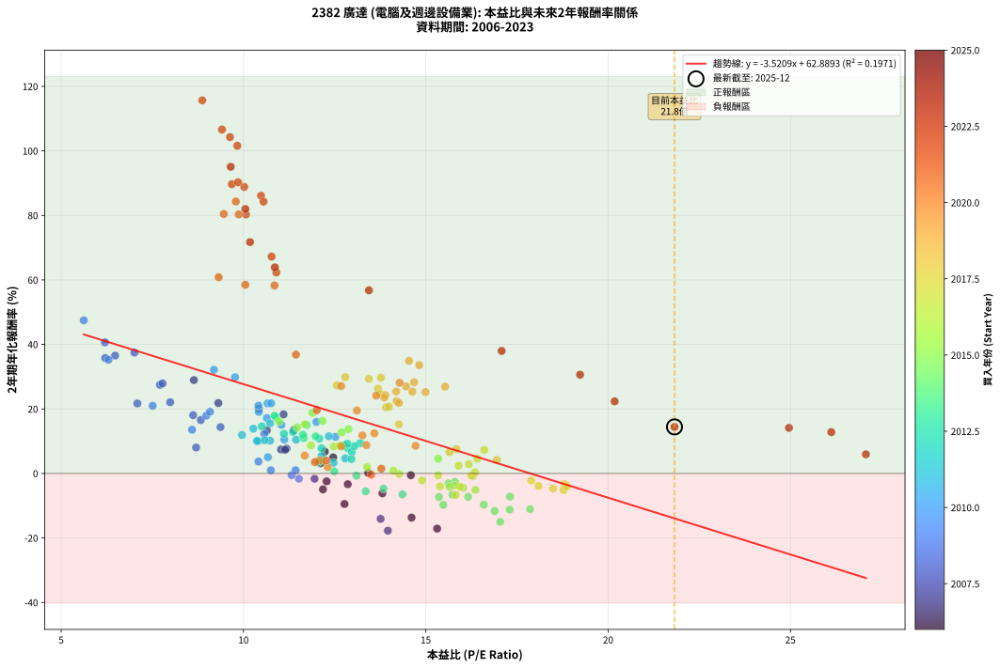
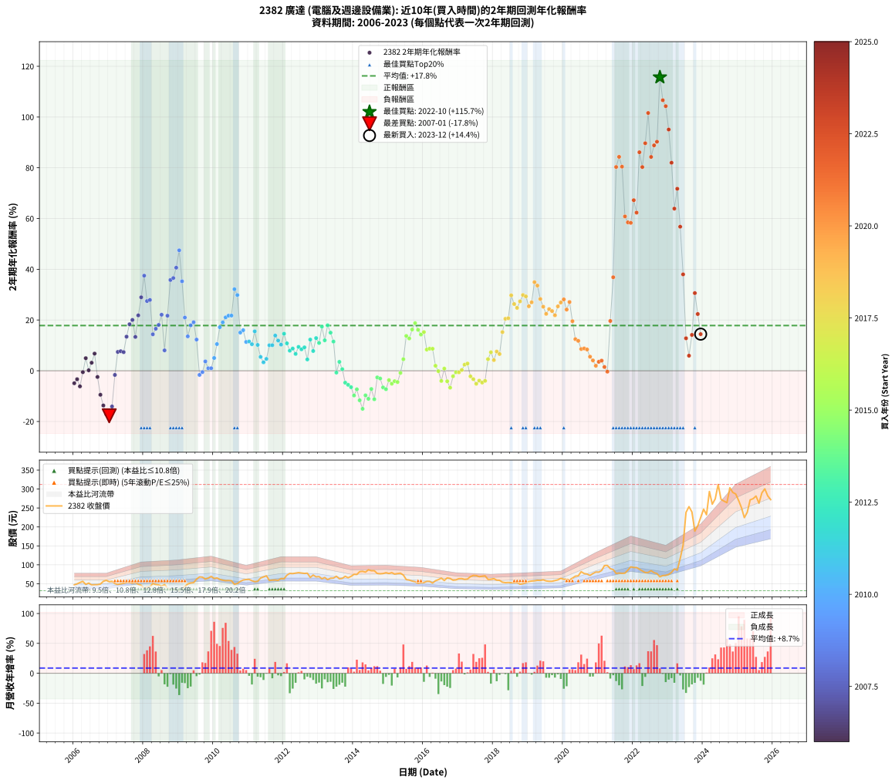

# 2382 廣達 - 本益比與未來報酬率分析

!!! info "報告資訊"
    - **股票代號**: 2382
    - **公司名稱**: 廣達
    - **產業別**: 電腦及週邊設備業
    - **分析期間**: 2006-2023 (216 個數據點)
    - **資料來源**: Type 12 (ShowMonthlyK_ChartFlow) 月收盤價與本益比
    - **報酬率口徑**: 含現金股利 (簡化: 年度合計，假設每年7/1入帳)
    - **報告生成時間**: 2026-01-11 18:33:56 CST

## 📈 視覺化圖表

### 圖表1: 本益比 vs 未來報酬率關係

*圖表1：2382 廣達 本益比與2年期未來報酬率關係 (2006-2023)*

### 圖表2: 歷年買入時點的2年期實際報酬率

*圖表2：2382 廣達 歷年買入時點的2年期實際報酬率 (2006-2023)*

## 📍 買點訊號說明

本報告提供兩種買點提示訊號（顯示於圖表2的股價子圖中）：

### ▲ 小綠色三角形（回測驗證）
- **計算方式**: 使用全部歷史資料計算本益比第25百分位數
- **用途**: 事後驗證，顯示歷史上哪些時點確實為低估區
- **限制**: 當下無法判斷，僅供回測參考
- **特性**: 後見之明（Look-Ahead Bias）

### ▲ 小橘色三角形（即時訊號）
- **計算方式**: 使用截至當月的過去5年資料計算本益比第25百分位數
- **用途**: 實際投資決策，當時即可判斷
- **優勢**: 可操作性強，符合實務需求
- **特性**: 無後見之明，滾動窗口計算

!!! tip "如何使用兩種訊號"
    - **綠色▲** 幫助理解歷史估值機會，驗證策略有效性
    - **橘色▲** 可作為實際買進參考，但仍需搭配基本面分析
    - 兩種訊號重疊時，表示即時判斷與事後驗證一致，信心度較高
    - 僅有綠色▲時，表示當時無法判斷（需要未來資料才能確認）
    - 僅有橘色▲時，表示即時判斷為買點，但事後可能不是最佳時機

## 📊 估值分析摘要

| 指標 | 數值 |
|:---:|:---:|
| **目前本益比** (2023-12) | **21.82 倍** |
| **歷史平均本益比** | 12.80 倍 |
| **估值水準** | 🔴 相對高估 |
| **預期2年年化報酬率** | **-13.94%** |
| **歷史平均報酬率** | +17.83% |
| **相關係數 (R²)** | 0.1971 |
| **趨勢線斜率** | -3.5209 |

!!! abstract "核心洞察"
    目前本益比顯著高於歷史平均，預期未來報酬率可能較低

    根據歷史數據回測，2382 廣達 在目前本益比 **21.8倍** 的估值水準下，
    預期未來2年年化報酬率約為 **-13.9%**。

    **重要提醒**: 本分析基於歷史數據統計，實際報酬率會受到公司基本面變化、產業趨勢、
    總體經濟環境等多重因素影響。R² = 0.20 表示本益比可解釋約 19.7% 的報酬率變異。

## 📈 歷史估值統計

### 最佳買點 (最高報酬率)

| 項目 | 數值 |
|:---:|:---:|
| 起始時間 | 2022-10 |
| 當時本益比 | 8.87 倍 |
| 起始價格 | 68.4 元 |
| 2年後價格 | 303.5 元 |
| **2年年化報酬率** | **+115.67%** |

### 最差買點 (最低報酬率)

| 項目 | 數值 |
|:---:|:---:|
| 起始時間 | 2007-01 |
| 當時本益比 | 13.96 倍 |
| 起始價格 | 55.6 元 |
| 2年後價格 | 31.6 元 |
| **2年年化報酬率** | **-17.75%** |

## 🎯 投資啟示

### 本益比與報酬率關係

趨勢線方程式: **y = -3.5209x + 62.8893**

!!! warning "強負相關"
    本益比與未來報酬率呈現強負相關。在高本益比時期買入，未來報酬率顯著較低；
    在低本益比時期買入，未來報酬率顯著較高。**估值紀律至關重要**。

### 估值區間建議

基於歷史數據分析:

- **🟢 低估區** (P/E < 10.2): 預期報酬率較高，可考慮增加持股
- **🟡 合理區** (P/E 10.2-15.4): 預期報酬率符合長期趨勢，正常持有
- **🔴 高估區** (P/E > 15.4): 預期報酬率較低，可考慮減碼或觀望

!!! danger "風險提示"
    - 過去表現不代表未來結果
    - 本分析假設公司基本面無重大結構性變化
    - 產業環境劇變可能使歷史規律失效
    - 應結合公司財報、產業趨勢、總體經濟等多重因素綜合判斷

!!! success "長期投資觀點"
    歷史數據顯示，在合理或低估的估值水準買入並長期持有，
    往往能獲得較佳的投資報酬。**耐心等待好價格**是價值投資的核心原則。

## 📊 數據品質

- **資料來源**: GoodInfo.tw Type 12 (ShowMonthlyK_ChartFlow)
- **資料頻率**: 月度收盤價與本益比
- **回測期間**: 2006-2023
- **數據點數量**: 216 個 (每個點代表一次2年期回測)

### 計算方法說明

1. **2年期年化報酬率**:
   - 對每個歷史時點，計算其後2年的實際投資報酬率
   - 期末價值(不含股利): 期末價格
   - 期末價值(含現金股利): 期末價格 + 持有期間內的現金股利合計 (簡化: 年度合計，假設每年7/1入帳)
   - 公式: 年化報酬率 = [(期末價值/期初價格)^(1/年數) - 1] × 100%

2. **本益比 (P/E Ratio)**:
   - 使用當時的月收盤價與EPS計算
   - 資料來源: Type 12 月度河流圖本益比數據

3. **趨勢線 (Linear Regression)**:
   - 使用最小平方法擬合線性趨勢線
   - R²值衡量本益比對報酬率的解釋能力

---

*本報告由 Stock Analysis System v1.9.0 自動生成*
*數據更新時間: 2026-01-11 18:33:56 CST*

## 📋 月度回測明細表

（每一列對應時間線圖中的一個買入點；可用來對照 SVG 圖上的每個點。）

| 買入月份 | 賣出月份 | 回測期限_年 | 實際持有年數 | 買入本益比_倍 | 買入收盤價_元 | 賣出收盤價_元 | 現金股利合計_元 | 總報酬率_pct | 年化報酬率_pct |
| --- | --- | --- | --- | --- | --- | --- | --- | --- | --- |
| 2006-01 | 2008-01 | 2 | 1.999 | 12.18 | 47.00 | 37.50 | 4.98 | -9.61 | -4.93 |
| 2006-02 | 2008-02 | 2 | 1.999 | 12.86 | 49.65 | 41.40 | 4.98 | -6.58 | -3.35 |
| 2006-03 | 2008-03 | 2 | 2.001 | 13.81 | 53.30 | 41.95 | 4.98 | -11.94 | -6.16 |
| 2006-04 | 2008-04 | 2 | 2.001 | 14.59 | 56.30 | 50.70 | 4.98 | -1.09 | -0.55 |
| 2006-05 | 2008-05 | 2 | 2.001 | 12.46 | 48.10 | 48.00 | 4.98 | +10.16 | +4.95 |
| 2006-06 | 2008-06 | 2 | 2.001 | 13.42 | 51.80 | 47.00 | 4.98 | +0.36 | +0.18 |
| 2006-07 | 2008-07 | 2 | 2.001 | 12.11 | 46.75 | 43.75 | 6.00 | +6.42 | +3.16 |
| 2006-08 | 2008-08 | 2 | 2.001 | 12.23 | 47.20 | 47.80 | 6.00 | +13.98 | +6.76 |
| 2006-09 | 2008-09 | 2 | 2.001 | 12.28 | 47.40 | 39.10 | 6.00 | -4.85 | -2.45 |
| 2006-10 | 2008-10 | 2 | 2.001 | 12.77 | 49.30 | 34.40 | 6.00 | -18.05 | -9.47 |
| 2006-11 | 2008-11 | 2 | 2.001 | 14.61 | 56.40 | 36.00 | 6.00 | -25.53 | -13.70 |
| 2006-12 | 2008-12 | 2 | 2.001 | 15.31 | 59.10 | 34.60 | 6.00 | -31.30 | -17.11 |
| 2007-01 | 2009-01 | 2 | 2.001 | 13.96 | 55.60 | 31.60 | 6.00 | -32.37 | -17.75 |
| 2007-02 | 2009-02 | 2 | 2.001 | 13.76 | 56.50 | 35.70 | 6.00 | -26.19 | -14.08 |
| 2007-03 | 2009-03 | 2 | 2.001 | 11.95 | 50.50 | 42.85 | 6.00 | -3.27 | -1.65 |
| 2007-04 | 2009-04 | 2 | 2.001 | 11.03 | 48.00 | 49.40 | 6.00 | +15.42 | +7.43 |
| 2007-05 | 2009-05 | 2 | 2.001 | 11.18 | 50.00 | 52.00 | 6.00 | +16.00 | +7.70 |
| 2007-06 | 2009-06 | 2 | 2.001 | 11.14 | 51.20 | 53.00 | 6.00 | +15.23 | +7.34 |
| 2007-07 | 2009-07 | 2 | 2.001 | 11.38 | 53.70 | 62.10 | 7.00 | +28.68 | +13.43 |
| 2007-08 | 2009-08 | 2 | 2.001 | 11.10 | 53.70 | 68.20 | 7.00 | +40.04 | +18.32 |
| 2007-09 | 2009-09 | 2 | 2.001 | 10.42 | 51.70 | 67.50 | 7.00 | +44.10 | +20.03 |
| 2007-10 | 2009-10 | 2 | 2.001 | 10.64 | 54.10 | 62.50 | 7.00 | +28.47 | +13.33 |
| 2007-11 | 2009-11 | 2 | 2.001 | 9.31 | 48.50 | 65.00 | 7.00 | +48.45 | +21.83 |
| 2007-12 | 2009-12 | 2 | 2.001 | 8.64 | 46.05 | 69.60 | 7.00 | +66.34 | +28.95 |
| 2008-01 | 2010-01 | 2 | 2.001 | 7.01 | 37.50 | 63.90 | 7.00 | +89.07 | +37.47 |
| 2008-02 | 2010-03 | 2 | 2.081 | 7.71 | 41.40 | 61.60 | 7.00 | +65.70 | +27.47 |
| 2008-03 | 2010-03 | 2 | 1.999 | 7.78 | 41.95 | 61.60 | 7.00 | +63.53 | +27.90 |
| 2008-04 | 2010-04 | 2 | 1.999 | 9.37 | 50.70 | 59.30 | 7.00 | +30.77 | +14.36 |
| 2008-05 | 2010-05 | 2 | 1.999 | 8.83 | 48.00 | 58.20 | 7.00 | +35.83 | +16.56 |
| 2008-06 | 2010-06 | 2 | 1.999 | 8.62 | 47.00 | 58.50 | 7.00 | +39.36 | +18.06 |
| 2008-07 | 2010-07 | 2 | 1.999 | 7.99 | 43.75 | 58.00 | 7.18 | +48.99 | +22.08 |
| 2008-08 | 2010-08 | 2 | 1.999 | 8.70 | 47.80 | 48.60 | 7.18 | +16.70 | +8.03 |
| 2008-09 | 2010-09 | 2 | 1.999 | 7.09 | 39.10 | 50.70 | 7.18 | +48.04 | +21.69 |
| 2008-10 | 2010-10 | 2 | 1.999 | 6.21 | 34.40 | 56.20 | 7.18 | +84.26 | +35.77 |
| 2008-11 | 2010-11 | 2 | 1.999 | 6.48 | 36.00 | 59.90 | 7.18 | +86.34 | +36.54 |
| 2008-12 | 2010-12 | 2 | 1.999 | 6.20 | 34.60 | 61.20 | 7.18 | +97.64 | +40.62 |
| 2009-01 | 2011-01 | 2 | 1.999 | 5.62 | 31.60 | 61.50 | 7.18 | +117.35 | +47.47 |
| 2009-02 | 2011-02 | 2 | 1.999 | 6.30 | 35.70 | 58.10 | 7.18 | +82.87 | +35.26 |
| 2009-03 | 2011-03 | 2 | 1.999 | 7.51 | 42.85 | 55.50 | 7.18 | +46.29 | +20.96 |
| 2009-04 | 2011-04 | 2 | 1.999 | 8.59 | 49.40 | 56.50 | 7.18 | +28.91 | +13.55 |
| 2009-05 | 2011-05 | 2 | 1.999 | 8.98 | 52.00 | 65.10 | 7.18 | +39.01 | +17.91 |
| 2009-06 | 2011-06 | 2 | 1.999 | 9.08 | 53.00 | 68.00 | 7.18 | +41.86 | +19.12 |
| 2009-07 | 2011-07 | 2 | 1.999 | 10.57 | 62.10 | 71.00 | 7.28 | +26.06 | +12.29 |
| 2009-08 | 2011-08 | 2 | 1.999 | 11.52 | 68.20 | 58.70 | 7.28 | -3.25 | -1.64 |
| 2009-09 | 2011-09 | 2 | 1.999 | 11.32 | 67.50 | 59.50 | 7.28 | -1.06 | -0.53 |
| 2009-10 | 2011-10 | 2 | 1.999 | 10.41 | 62.50 | 59.90 | 7.28 | +7.49 | +3.68 |
| 2009-11 | 2011-11 | 2 | 1.999 | 10.75 | 65.00 | 59.00 | 7.28 | +1.97 | +0.98 |
| 2009-12 | 2011-12 | 2 | 1.999 | 11.43 | 69.60 | 63.70 | 7.28 | +1.99 | +0.99 |
| 2010-01 | 2012-01 | 2 | 1.999 | 10.67 | 63.90 | 63.20 | 7.28 | +10.30 | +5.03 |
| 2010-02 | 2012-02 | 2 | 1.999 | 11.12 | 65.50 | 72.70 | 7.28 | +22.11 | +10.51 |
| 2010-03 | 2012-03 | 2 | 2.001 | 10.64 | 61.60 | 77.30 | 7.28 | +37.31 | +17.17 |
| 2010-04 | 2012-04 | 2 | 2.001 | 10.42 | 59.30 | 76.80 | 7.28 | +41.79 | +19.06 |
| 2010-05 | 2012-05 | 2 | 2.001 | 10.41 | 58.20 | 78.00 | 7.28 | +46.53 | +21.04 |
| 2010-06 | 2012-06 | 2 | 2.001 | 10.66 | 58.50 | 79.40 | 7.28 | +48.18 | +21.71 |
| 2010-07 | 2012-07 | 2 | 2.001 | 10.76 | 58.00 | 78.40 | 7.60 | +48.27 | +21.75 |
| 2010-08 | 2012-08 | 2 | 2.001 | 9.19 | 48.60 | 77.30 | 7.60 | +74.69 | +32.14 |
| 2010-09 | 2012-09 | 2 | 2.001 | 9.77 | 50.70 | 77.90 | 7.60 | +68.63 | +29.84 |
| 2010-10 | 2012-10 | 2 | 2.001 | 11.04 | 56.20 | 66.80 | 7.60 | +32.38 | +15.05 |
| 2010-11 | 2012-11 | 2 | 2.001 | 12.00 | 59.90 | 73.00 | 7.60 | +34.55 | +15.99 |
| 2010-12 | 2012-12 | 2 | 2.001 | 12.52 | 61.20 | 68.30 | 7.60 | +24.01 | +11.35 |
| 2011-01 | 2013-01 | 2 | 2.001 | 12.34 | 61.50 | 68.90 | 7.60 | +24.39 | +11.52 |
| 2011-02 | 2013-02 | 2 | 2.001 | 11.44 | 58.10 | 63.30 | 7.60 | +22.03 | +10.46 |
| 2011-03 | 2013-03 | 2 | 2.001 | 10.73 | 55.50 | 66.50 | 7.60 | +33.51 | +15.53 |
| 2011-04 | 2013-04 | 2 | 2.001 | 10.73 | 56.50 | 61.00 | 7.60 | +21.41 | +10.18 |
| 2011-05 | 2013-05 | 2 | 2.001 | 12.14 | 65.10 | 64.80 | 7.60 | +11.21 | +5.45 |
| 2011-06 | 2013-06 | 2 | 2.001 | 12.47 | 68.00 | 65.00 | 7.60 | +6.76 | +3.32 |
| 2011-07 | 2013-07 | 2 | 2.001 | 12.79 | 71.00 | 69.80 | 8.00 | +9.57 | +4.67 |
| 2011-08 | 2013-08 | 2 | 2.001 | 10.40 | 58.70 | 63.10 | 8.00 | +21.12 | +10.05 |
| 2011-09 | 2013-09 | 2 | 2.001 | 10.37 | 59.50 | 64.10 | 8.00 | +21.17 | +10.07 |
| 2011-10 | 2013-10 | 2 | 2.001 | 10.27 | 59.90 | 69.70 | 8.00 | +29.71 | +13.88 |
| 2011-11 | 2013-11 | 2 | 2.001 | 9.96 | 59.00 | 65.90 | 8.00 | +25.25 | +11.91 |
| 2011-12 | 2013-12 | 2 | 2.001 | 10.58 | 63.70 | 69.50 | 8.00 | +21.66 | +10.29 |
| 2012-01 | 2014-01 | 2 | 2.001 | 10.50 | 63.20 | 75.00 | 8.00 | +31.33 | +14.59 |
| 2012-02 | 2014-03 | 2 | 2.081 | 12.08 | 72.70 | 82.00 | 8.00 | +23.79 | +10.80 |
| 2012-03 | 2014-03 | 2 | 1.999 | 12.85 | 77.30 | 82.00 | 8.00 | +16.43 | +7.91 |
| 2012-04 | 2014-04 | 2 | 1.999 | 12.76 | 76.80 | 82.80 | 8.00 | +18.23 | +8.74 |
| 2012-05 | 2014-05 | 2 | 1.999 | 12.97 | 78.00 | 80.70 | 8.00 | +13.72 | +6.64 |
| 2012-06 | 2014-06 | 2 | 1.999 | 13.20 | 79.40 | 87.00 | 8.00 | +19.64 | +9.39 |
| 2012-07 | 2014-07 | 2 | 1.999 | 13.04 | 78.40 | 84.40 | 7.80 | +17.60 | +8.45 |
| 2012-08 | 2014-08 | 2 | 1.999 | 12.85 | 77.30 | 84.40 | 7.80 | +19.28 | +9.22 |
| 2012-09 | 2014-09 | 2 | 1.999 | 12.96 | 77.90 | 77.20 | 7.80 | +9.11 | +4.46 |
| 2012-10 | 2014-10 | 2 | 1.999 | 11.11 | 66.80 | 76.40 | 7.80 | +26.05 | +12.28 |
| 2012-11 | 2014-11 | 2 | 1.999 | 12.14 | 73.00 | 77.00 | 7.80 | +16.16 | +7.79 |
| 2012-12 | 2014-12 | 2 | 1.999 | 11.36 | 68.30 | 79.20 | 7.80 | +27.38 | +12.87 |
| 2013-01 | 2015-01 | 2 | 1.999 | 11.65 | 68.90 | 77.00 | 7.80 | +23.08 | +10.95 |
| 2013-02 | 2015-02 | 2 | 1.999 | 10.89 | 63.30 | 79.40 | 7.80 | +37.76 | +17.38 |
| 2013-03 | 2015-03 | 2 | 1.999 | 11.63 | 66.50 | 75.60 | 7.80 | +25.41 | +12.00 |
| 2013-04 | 2015-04 | 2 | 1.999 | 10.85 | 61.00 | 77.00 | 7.80 | +39.02 | +17.92 |
| 2013-05 | 2015-05 | 2 | 1.999 | 11.73 | 64.80 | 77.90 | 7.80 | +32.25 | +15.01 |
| 2013-06 | 2015-06 | 2 | 1.999 | 11.98 | 65.00 | 73.00 | 7.80 | +24.31 | +11.50 |
| 2013-07 | 2015-07 | 2 | 1.999 | 13.10 | 69.80 | 61.00 | 7.80 | -1.43 | -0.72 |
| 2013-08 | 2015-08 | 2 | 1.999 | 12.07 | 63.10 | 59.80 | 7.80 | +7.13 | +3.51 |
| 2013-09 | 2015-09 | 2 | 1.999 | 12.49 | 64.10 | 57.10 | 7.80 | +1.25 | +0.62 |
| 2013-10 | 2015-10 | 2 | 1.999 | 13.84 | 69.70 | 55.50 | 7.80 | -9.18 | -4.70 |
| 2013-11 | 2015-11 | 2 | 1.999 | 13.35 | 65.90 | 51.00 | 7.80 | -10.77 | -5.54 |
| 2013-12 | 2015-12 | 2 | 1.999 | 14.36 | 69.50 | 53.00 | 7.80 | -12.52 | -6.47 |
| 2014-01 | 2016-01 | 2 | 1.999 | 15.48 | 75.00 | 53.30 | 7.80 | -18.53 | -9.75 |
| 2014-02 | 2016-02 | 2 | 1.999 | 15.36 | 74.50 | 56.20 | 7.80 | -14.09 | -7.32 |
| 2014-03 | 2016-03 | 2 | 2.001 | 16.89 | 82.00 | 56.20 | 7.80 | -21.95 | -11.65 |
| 2014-04 | 2016-04 | 2 | 2.001 | 17.04 | 82.80 | 52.00 | 7.80 | -27.78 | -15.01 |
| 2014-05 | 2016-05 | 2 | 2.001 | 16.59 | 80.70 | 58.00 | 7.80 | -18.46 | -9.70 |
| 2014-06 | 2016-06 | 2 | 2.001 | 17.86 | 87.00 | 61.00 | 7.80 | -20.92 | -11.07 |
| 2014-07 | 2016-07 | 2 | 2.001 | 17.31 | 84.40 | 64.90 | 7.80 | -13.86 | -7.19 |
| 2014-08 | 2016-08 | 2 | 2.001 | 17.30 | 84.40 | 58.70 | 7.80 | -21.21 | -11.23 |
| 2014-09 | 2016-09 | 2 | 2.001 | 15.80 | 77.20 | 65.40 | 7.80 | -5.18 | -2.62 |
| 2014-10 | 2016-10 | 2 | 2.001 | 15.62 | 76.40 | 64.00 | 7.80 | -6.02 | -3.06 |
| 2014-11 | 2016-11 | 2 | 2.001 | 15.73 | 77.00 | 59.40 | 7.80 | -12.73 | -6.58 |
| 2014-12 | 2016-12 | 2 | 2.001 | 16.16 | 79.20 | 60.30 | 7.80 | -14.02 | -7.27 |
| 2015-01 | 2017-01 | 2 | 2.001 | 15.79 | 77.00 | 63.60 | 7.80 | -7.27 | -3.70 |
| 2015-02 | 2017-02 | 2 | 2.001 | 16.36 | 79.40 | 63.70 | 7.80 | -9.95 | -5.10 |
| 2015-03 | 2017-03 | 2 | 2.001 | 15.65 | 75.60 | 61.70 | 7.80 | -8.07 | -4.12 |
| 2015-04 | 2017-04 | 2 | 2.001 | 16.02 | 77.00 | 62.50 | 7.80 | -8.70 | -4.45 |
| 2015-05 | 2017-05 | 2 | 2.001 | 16.29 | 77.90 | 68.80 | 7.80 | -1.67 | -0.84 |
| 2015-06 | 2017-06 | 2 | 2.001 | 15.34 | 73.00 | 72.00 | 7.80 | +9.32 | +4.55 |
| 2015-07 | 2017-07 | 2 | 2.001 | 12.88 | 61.00 | 71.60 | 7.30 | +29.34 | +13.72 |
| 2015-08 | 2017-08 | 2 | 2.001 | 12.69 | 59.80 | 68.70 | 7.30 | +27.09 | +12.73 |
| 2015-09 | 2017-09 | 2 | 2.001 | 12.17 | 57.10 | 69.90 | 7.30 | +35.20 | +16.26 |
| 2015-10 | 2017-10 | 2 | 2.001 | 11.89 | 55.50 | 71.00 | 7.30 | +41.08 | +18.76 |
| 2015-11 | 2017-11 | 2 | 2.001 | 10.98 | 51.00 | 61.50 | 7.30 | +34.90 | +16.14 |
| 2015-12 | 2017-12 | 2 | 2.001 | 11.47 | 53.00 | 61.90 | 7.30 | +30.57 | +14.26 |
| 2016-01 | 2018-01 | 2 | 2.001 | 11.68 | 53.30 | 63.50 | 7.30 | +32.83 | +15.24 |
| 2016-02 | 2018-03 | 2 | 2.081 | 12.48 | 56.20 | 59.10 | 7.30 | +18.15 | +8.35 |
| 2016-03 | 2018-03 | 2 | 1.999 | 12.64 | 56.20 | 59.10 | 7.30 | +18.15 | +8.70 |
| 2016-04 | 2018-04 | 2 | 1.999 | 11.85 | 52.00 | 54.10 | 7.30 | +18.08 | +8.67 |
| 2016-05 | 2018-05 | 2 | 1.999 | 13.39 | 58.00 | 53.00 | 7.30 | +3.97 | +1.96 |
| 2016-06 | 2018-06 | 2 | 1.999 | 14.27 | 61.00 | 53.50 | 7.30 | -0.33 | -0.16 |
| 2016-07 | 2018-07 | 2 | 1.999 | 15.39 | 64.90 | 52.90 | 6.90 | -7.86 | -4.01 |
| 2016-08 | 2018-08 | 2 | 1.999 | 14.11 | 58.70 | 52.80 | 6.90 | +1.70 | +0.85 |
| 2016-09 | 2018-09 | 2 | 1.999 | 15.94 | 65.40 | 53.20 | 6.90 | -8.10 | -4.14 |
| 2016-10 | 2018-10 | 2 | 1.999 | 15.82 | 64.00 | 48.85 | 6.90 | -12.89 | -6.67 |
| 2016-11 | 2018-11 | 2 | 1.999 | 14.90 | 59.40 | 49.95 | 6.90 | -4.29 | -2.17 |
| 2016-12 | 2018-12 | 2 | 1.999 | 15.34 | 60.30 | 52.70 | 6.90 | -1.16 | -0.58 |
| 2017-01 | 2019-01 | 2 | 1.999 | 16.25 | 63.60 | 55.90 | 6.90 | -1.26 | -0.63 |
| 2017-02 | 2019-02 | 2 | 1.999 | 16.35 | 63.70 | 57.20 | 6.90 | +0.63 | +0.31 |
| 2017-03 | 2019-03 | 2 | 1.999 | 15.90 | 61.70 | 57.80 | 6.90 | +4.86 | +2.40 |
| 2017-04 | 2019-04 | 2 | 1.999 | 16.18 | 62.50 | 59.20 | 6.90 | +5.76 | +2.84 |
| 2017-05 | 2019-05 | 2 | 1.999 | 17.89 | 68.80 | 58.90 | 6.90 | -4.36 | -2.21 |
| 2017-06 | 2019-06 | 2 | 1.999 | 18.80 | 72.00 | 60.40 | 6.90 | -6.53 | -3.32 |
| 2017-07 | 2019-07 | 2 | 1.999 | 18.78 | 71.60 | 57.50 | 6.95 | -9.99 | -5.13 |
| 2017-08 | 2019-08 | 2 | 1.999 | 18.09 | 68.70 | 56.50 | 6.95 | -7.64 | -3.90 |
| 2017-09 | 2019-09 | 2 | 1.999 | 18.49 | 69.90 | 56.60 | 6.95 | -9.08 | -4.65 |
| 2017-10 | 2019-10 | 2 | 1.999 | 18.87 | 71.00 | 58.50 | 6.95 | -7.82 | -3.99 |
| 2017-11 | 2019-11 | 2 | 1.999 | 16.41 | 61.50 | 60.30 | 6.95 | +9.35 | +4.57 |
| 2017-12 | 2019-12 | 2 | 1.999 | 16.60 | 61.90 | 64.30 | 6.95 | +15.11 | +7.29 |
| 2018-01 | 2020-01 | 2 | 1.999 | 16.95 | 63.50 | 62.00 | 6.95 | +8.58 | +4.21 |
| 2018-02 | 2020-02 | 2 | 1.999 | 15.84 | 59.60 | 62.00 | 6.95 | +15.69 | +7.56 |
| 2018-03 | 2020-03 | 2 | 2.001 | 15.65 | 59.10 | 60.20 | 6.95 | +13.62 | +6.59 |
| 2018-04 | 2020-04 | 2 | 2.001 | 14.26 | 54.10 | 64.90 | 6.95 | +32.81 | +15.23 |
| 2018-05 | 2020-05 | 2 | 2.001 | 13.91 | 53.00 | 70.00 | 6.95 | +45.19 | +20.48 |
| 2018-06 | 2020-06 | 2 | 2.001 | 13.99 | 53.50 | 71.00 | 6.95 | +45.70 | +20.69 |
| 2018-07 | 2020-07 | 2 | 2.001 | 13.77 | 52.90 | 81.80 | 7.25 | +68.34 | +29.72 |
| 2018-08 | 2020-08 | 2 | 2.001 | 13.69 | 52.80 | 77.00 | 7.25 | +59.56 | +26.30 |
| 2018-09 | 2020-09 | 2 | 2.001 | 13.74 | 53.20 | 75.60 | 7.25 | +55.73 | +24.77 |
| 2018-10 | 2020-10 | 2 | 2.001 | 12.56 | 48.85 | 72.00 | 7.25 | +62.23 | +27.35 |
| 2018-11 | 2020-11 | 2 | 2.001 | 12.79 | 49.95 | 77.00 | 7.25 | +68.67 | +29.85 |
| 2018-12 | 2020-12 | 2 | 2.001 | 13.44 | 52.70 | 80.90 | 7.25 | +67.27 | +29.31 |
| 2019-01 | 2021-01 | 2 | 2.001 | 14.19 | 55.90 | 80.70 | 7.25 | +57.33 | +25.41 |
| 2019-02 | 2021-02 | 2 | 2.001 | 14.46 | 57.20 | 85.00 | 7.25 | +61.28 | +26.97 |
| 2019-03 | 2021-03 | 2 | 2.001 | 14.54 | 57.80 | 98.00 | 7.25 | +82.09 | +34.91 |
| 2019-04 | 2021-04 | 2 | 2.001 | 14.82 | 59.20 | 98.40 | 7.25 | +78.46 | +33.56 |
| 2019-05 | 2021-05 | 2 | 2.001 | 14.68 | 58.90 | 89.70 | 7.25 | +64.60 | +28.28 |
| 2019-06 | 2021-06 | 2 | 2.001 | 14.99 | 60.40 | 87.50 | 7.25 | +56.87 | +25.23 |
| 2019-07 | 2021-07 | 2 | 2.001 | 14.20 | 57.50 | 77.30 | 8.90 | +49.91 | +22.42 |
| 2019-08 | 2021-08 | 2 | 2.001 | 13.89 | 56.50 | 78.40 | 8.90 | +54.51 | +24.28 |
| 2019-09 | 2021-09 | 2 | 2.001 | 13.86 | 56.60 | 77.50 | 8.90 | +52.65 | +23.53 |
| 2019-10 | 2021-10 | 2 | 2.001 | 14.26 | 58.50 | 78.00 | 8.90 | +48.55 | +21.86 |
| 2019-11 | 2021-11 | 2 | 2.001 | 14.63 | 60.30 | 85.90 | 8.90 | +57.21 | +25.37 |
| 2019-12 | 2021-12 | 2 | 2.001 | 15.53 | 64.30 | 94.70 | 8.90 | +61.12 | +26.91 |
| 2020-01 | 2022-01 | 2 | 2.001 | 14.28 | 62.00 | 92.90 | 8.90 | +64.19 | +28.12 |
| 2020-02 | 2022-03 | 2 | 2.081 | 13.64 | 62.00 | 88.30 | 8.90 | +56.77 | +24.12 |
| 2020-03 | 2022-03 | 2 | 1.999 | 12.68 | 60.20 | 88.30 | 8.90 | +61.46 | +27.09 |
| 2020-04 | 2022-04 | 2 | 1.999 | 13.11 | 64.90 | 83.80 | 8.90 | +42.84 | +19.53 |
| 2020-05 | 2022-05 | 2 | 1.999 | 13.59 | 70.00 | 79.60 | 8.90 | +26.43 | +12.45 |
| 2020-06 | 2022-06 | 2 | 1.999 | 13.26 | 71.00 | 79.80 | 8.90 | +24.93 | +11.78 |
| 2020-07 | 2022-07 | 2 | 1.999 | 14.72 | 81.80 | 84.60 | 11.80 | +17.85 | +8.56 |
| 2020-08 | 2022-08 | 2 | 1.999 | 13.37 | 77.00 | 79.30 | 11.80 | +18.31 | +8.78 |
| 2020-09 | 2022-09 | 2 | 1.999 | 12.68 | 75.60 | 77.00 | 11.80 | +17.46 | +8.39 |
| 2020-10 | 2022-10 | 2 | 1.999 | 11.68 | 72.00 | 68.40 | 11.80 | +11.39 | +5.54 |
| 2020-11 | 2022-11 | 2 | 1.999 | 12.09 | 77.00 | 71.60 | 11.80 | +8.31 | +4.08 |
| 2020-12 | 2022-12 | 2 | 1.999 | 12.31 | 80.90 | 72.30 | 11.80 | +3.96 | +1.96 |
| 2021-01 | 2023-01 | 2 | 1.999 | 11.96 | 80.70 | 74.70 | 11.80 | +7.19 | +3.53 |
| 2021-02 | 2023-02 | 2 | 1.999 | 12.27 | 85.00 | 80.10 | 11.80 | +8.12 | +3.98 |
| 2021-03 | 2023-03 | 2 | 1.999 | 13.78 | 98.00 | 89.10 | 11.80 | +2.96 | +1.47 |
| 2021-04 | 2023-04 | 2 | 1.999 | 13.50 | 98.40 | 85.90 | 11.80 | -0.71 | -0.36 |
| 2021-05 | 2023-05 | 2 | 1.999 | 12.01 | 89.70 | 116.50 | 11.80 | +43.03 | +19.61 |
| 2021-06 | 2023-06 | 2 | 1.999 | 11.44 | 87.50 | 152.00 | 11.80 | +87.20 | +36.85 |
| 2021-07 | 2023-07 | 2 | 1.999 | 9.87 | 77.30 | 238.50 | 12.60 | +224.84 | +80.31 |
| 2021-08 | 2023-08 | 2 | 1.999 | 9.79 | 78.40 | 253.50 | 12.60 | +239.41 | +84.31 |
| 2021-09 | 2023-09 | 2 | 1.999 | 9.46 | 77.50 | 239.50 | 12.60 | +225.29 | +80.43 |
| 2021-10 | 2023-10 | 2 | 1.999 | 9.32 | 78.00 | 189.00 | 12.60 | +158.46 | +60.82 |
| 2021-11 | 2023-11 | 2 | 1.999 | 10.05 | 85.90 | 203.00 | 12.60 | +150.99 | +58.48 |
| 2021-12 | 2023-12 | 2 | 1.999 | 10.85 | 94.70 | 224.50 | 12.60 | +150.37 | +58.28 |
| 2022-01 | 2024-01 | 2 | 1.999 | 10.77 | 92.90 | 247.00 | 12.60 | +179.44 | +67.22 |
| 2022-02 | 2024-02 | 2 | 1.999 | 10.90 | 92.90 | 232.00 | 12.60 | +163.29 | +62.32 |
| 2022-03 | 2024-03 | 2 | 2.001 | 10.48 | 88.30 | 293.50 | 12.60 | +246.66 | +86.11 |
| 2022-04 | 2024-04 | 2 | 2.001 | 10.07 | 83.80 | 260.00 | 12.60 | +225.30 | +80.29 |
| 2022-05 | 2024-05 | 2 | 2.001 | 9.68 | 79.60 | 274.00 | 12.60 | +260.05 | +89.67 |
| 2022-06 | 2024-06 | 2 | 2.001 | 9.83 | 79.80 | 312.00 | 12.60 | +306.77 | +101.59 |
| 2022-07 | 2024-07 | 2 | 2.001 | 10.55 | 84.60 | 272.50 | 15.00 | +239.83 | +84.27 |
| 2022-08 | 2024-08 | 2 | 2.001 | 10.02 | 79.30 | 268.00 | 15.00 | +256.87 | +88.83 |
| 2022-09 | 2024-09 | 2 | 2.001 | 9.85 | 77.00 | 264.00 | 15.00 | +262.34 | +90.27 |
| 2022-10 | 2024-10 | 2 | 2.001 | 8.87 | 68.40 | 303.50 | 15.00 | +365.64 | +115.67 |
| 2022-11 | 2024-11 | 2 | 2.001 | 9.41 | 71.60 | 291.00 | 15.00 | +327.37 | +106.63 |
| 2022-12 | 2024-12 | 2 | 2.001 | 9.63 | 72.30 | 287.00 | 15.00 | +317.70 | +104.28 |
| 2023-01 | 2025-01 | 2 | 2.001 | 9.65 | 74.70 | 269.50 | 15.00 | +280.86 | +95.07 |
| 2023-02 | 2025-02 | 2 | 2.001 | 10.05 | 80.10 | 250.50 | 15.00 | +231.46 | +81.99 |
| 2023-03 | 2025-03 | 2 | 2.001 | 10.86 | 89.10 | 224.50 | 15.00 | +168.80 | +63.90 |
| 2023-04 | 2025-04 | 2 | 2.001 | 10.18 | 85.90 | 238.50 | 15.00 | +195.11 | +71.72 |
| 2023-05 | 2025-05 | 2 | 2.001 | 13.44 | 116.50 | 271.50 | 15.00 | +145.92 | +56.77 |
| 2023-06 | 2025-06 | 2 | 2.001 | 17.08 | 152.00 | 274.50 | 15.00 | +90.46 | +37.98 |
| 2023-07 | 2025-07 | 2 | 2.001 | 26.12 | 238.50 | 281.50 | 22.00 | +27.25 | +12.80 |
| 2023-08 | 2025-08 | 2 | 2.001 | 27.07 | 253.50 | 262.50 | 22.00 | +12.23 | +5.93 |
| 2023-09 | 2025-09 | 2 | 2.001 | 24.96 | 239.50 | 290.00 | 22.00 | +30.27 | +14.13 |
| 2023-10 | 2025-10 | 2 | 2.001 | 19.23 | 189.00 | 300.50 | 22.00 | +70.63 | +30.60 |
| 2023-11 | 2025-11 | 2 | 2.001 | 20.18 | 203.00 | 282.00 | 22.00 | +49.75 | +22.36 |
| 2023-12 | 2025-12 | 2 | 2.001 | 21.82 | 224.50 | 272.00 | 22.00 | +30.96 | +14.43 |
