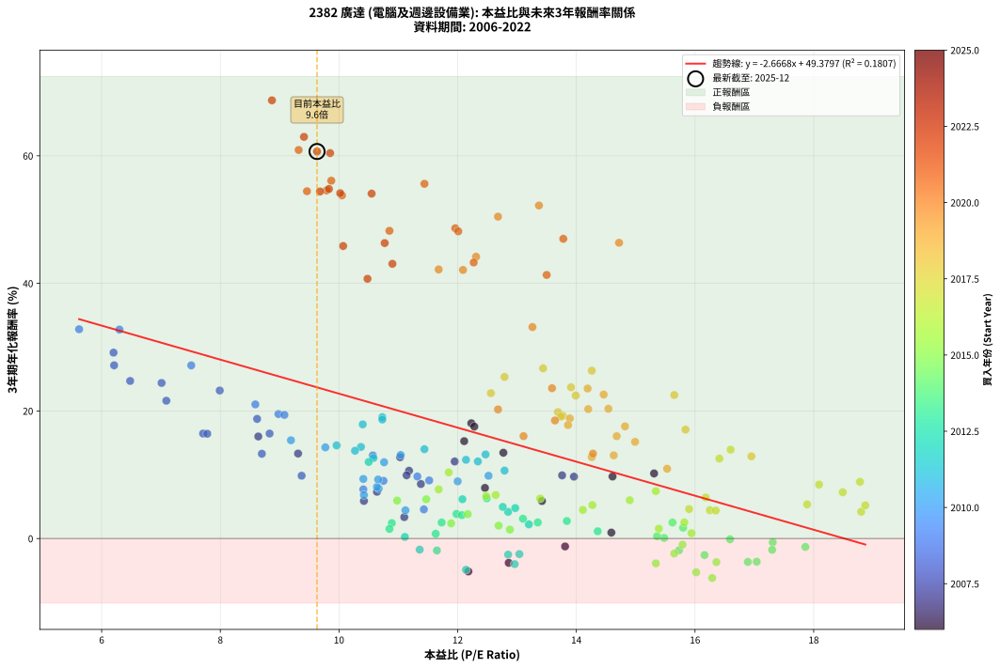
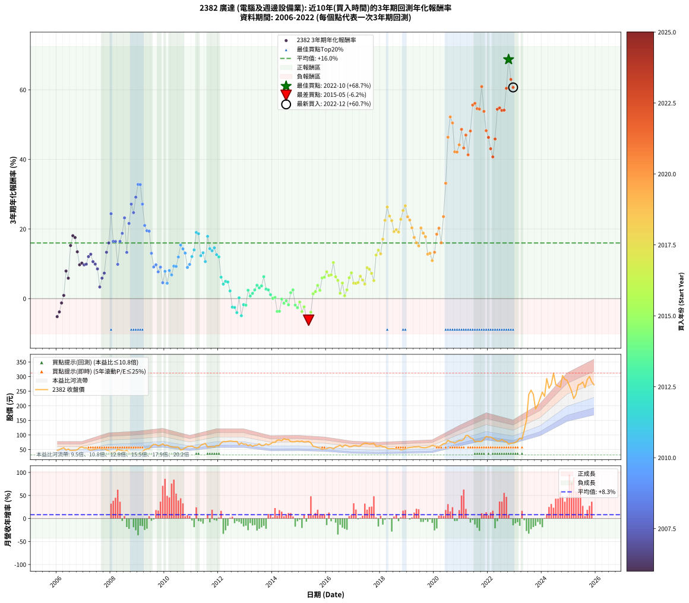

# 2382 廣達 - 本益比與未來報酬率分析

!!! info "報告資訊"
    - **股票代號**: 2382
    - **公司名稱**: 廣達
    - **產業別**: 電腦及週邊設備業
    - **分析期間**: 2006-2022 (204 個數據點)
    - **資料來源**: Type 12 (ShowMonthlyK_ChartFlow) 月收盤價與本益比
    - **報酬率口徑**: 含現金股利 (簡化: 年度合計，假設每年7/1入帳)
    - **報告生成時間**: 2026-01-10 22:33:06 CST

## 📈 視覺化圖表

### 圖表1: 本益比 vs 未來報酬率關係

*圖表1：2382 廣達 本益比與3年期未來報酬率關係 (2006-2022)*

### 圖表2: 歷年買入時點的3年期實際報酬率

*圖表2：2382 廣達 歷年買入時點的3年期實際報酬率 (2006-2022)*

## 📍 買點訊號說明

本報告提供兩種買點提示訊號（顯示於圖表2的股價子圖中）：

### ▲ 小綠色三角形（回測驗證）
- **計算方式**: 使用全部歷史資料計算本益比第25百分位數
- **用途**: 事後驗證，顯示歷史上哪些時點確實為低估區
- **限制**: 當下無法判斷，僅供回測參考
- **特性**: 後見之明（Look-Ahead Bias）

### ▲ 小橘色三角形（即時訊號）
- **計算方式**: 使用截至當月的過去5年資料計算本益比第25百分位數
- **用途**: 實際投資決策，當時即可判斷
- **優勢**: 可操作性強，符合實務需求
- **特性**: 無後見之明，滾動窗口計算

!!! tip "如何使用兩種訊號"
    - **綠色▲** 幫助理解歷史估值機會，驗證策略有效性
    - **橘色▲** 可作為實際買進參考，但仍需搭配基本面分析
    - 兩種訊號重疊時，表示即時判斷與事後驗證一致，信心度較高
    - 僅有綠色▲時，表示當時無法判斷（需要未來資料才能確認）
    - 僅有橘色▲時，表示即時判斷為買點，但事後可能不是最佳時機

## 📊 估值分析摘要

| 指標 | 數值 |
|:---:|:---:|
| **目前本益比** (2022-12) | **9.63 倍** |
| **歷史平均本益比** | 12.52 倍 |
| **估值水準** | 🟢 相對低估 |
| **預期3年年化報酬率** | **+23.70%** |
| **歷史平均報酬率** | +15.99% |
| **相關係數 (R²)** | 0.1807 |
| **趨勢線斜率** | -2.6668 |

!!! abstract "核心洞察"
    目前本益比顯著低於歷史平均，預期未來報酬率可能較高

    根據歷史數據回測，2382 廣達 在目前本益比 **9.6倍** 的估值水準下，
    預期未來3年年化報酬率約為 **+23.7%**。

    **重要提醒**: 本分析基於歷史數據統計，實際報酬率會受到公司基本面變化、產業趨勢、
    總體經濟環境等多重因素影響。R² = 0.18 表示本益比可解釋約 18.1% 的報酬率變異。

## 📈 歷史估值統計

### 最佳買點 (最高報酬率)

| 項目 | 數值 |
|:---:|:---:|
| 起始時間 | 2022-10 |
| 當時本益比 | 8.87 倍 |
| 起始價格 | 68.4 元 |
| 3年後價格 | 300.5 元 |
| **3年年化報酬率** | **+68.70%** |

### 最差買點 (最低報酬率)

| 項目 | 數值 |
|:---:|:---:|
| 起始時間 | 2015-05 |
| 當時本益比 | 16.29 倍 |
| 起始價格 | 77.9 元 |
| 3年後價格 | 53.0 元 |
| **3年年化報酬率** | **-6.19%** |

## 🎯 投資啟示

### 本益比與報酬率關係

趨勢線方程式: **y = -2.6668x + 49.3797**

!!! warning "強負相關"
    本益比與未來報酬率呈現強負相關。在高本益比時期買入，未來報酬率顯著較低；
    在低本益比時期買入，未來報酬率顯著較高。**估值紀律至關重要**。

### 估值區間建議

基於歷史數據分析:

- **🟢 低估區** (P/E < 10.0): 預期報酬率較高，可考慮增加持股
- **🟡 合理區** (P/E 10.0-15.0): 預期報酬率符合長期趨勢，正常持有
- **🔴 高估區** (P/E > 15.0): 預期報酬率較低，可考慮減碼或觀望

!!! danger "風險提示"
    - 過去表現不代表未來結果
    - 本分析假設公司基本面無重大結構性變化
    - 產業環境劇變可能使歷史規律失效
    - 應結合公司財報、產業趨勢、總體經濟等多重因素綜合判斷

!!! success "長期投資觀點"
    歷史數據顯示，在合理或低估的估值水準買入並長期持有，
    往往能獲得較佳的投資報酬。**耐心等待好價格**是價值投資的核心原則。

## 📊 數據品質

- **資料來源**: GoodInfo.tw Type 12 (ShowMonthlyK_ChartFlow)
- **資料頻率**: 月度收盤價與本益比
- **回測期間**: 2006-2022
- **數據點數量**: 204 個 (每個點代表一次3年期回測)

### 計算方法說明

1. **3年期年化報酬率**:
   - 對每個歷史時點，計算其後3年的實際投資報酬率
   - 期末價值(不含股利): 期末價格
   - 期末價值(含現金股利): 期末價格 + 持有期間內的現金股利合計 (簡化: 年度合計，假設每年7/1入帳)
   - 公式: 年化報酬率 = [(期末價值/期初價格)^(1/年數) - 1] × 100%

2. **本益比 (P/E Ratio)**:
   - 使用當時的月收盤價與EPS計算
   - 資料來源: Type 12 月度河流圖本益比數據

3. **趨勢線 (Linear Regression)**:
   - 使用最小平方法擬合線性趨勢線
   - R²值衡量本益比對報酬率的解釋能力

---

*本報告由 Stock Analysis System v1.9.0 自動生成*
*數據更新時間: 2026-01-10 22:33:06 CST*

## 📋 月度回測明細表

（每一列對應時間線圖中的一個買入點；可用來對照 SVG 圖上的每個點。）

| 買入月份 | 賣出月份 | 回測期限_年 | 實際持有年數 | 買入本益比_倍 | 買入收盤價_元 | 賣出收盤價_元 | 現金股利合計_元 | 總報酬率_pct | 年化報酬率_pct |
| --- | --- | --- | --- | --- | --- | --- | --- | --- | --- |
| 2006-01 | 2009-01 | 3 | 3.001 | 12.18 | 47.00 | 31.60 | 8.48 | -14.71 | -5.17 |
| 2006-02 | 2009-02 | 3 | 3.001 | 12.86 | 49.65 | 35.70 | 8.48 | -11.01 | -3.81 |
| 2006-03 | 2009-03 | 3 | 3.001 | 13.81 | 53.30 | 42.85 | 8.48 | -3.69 | -1.24 |
| 2006-04 | 2009-04 | 3 | 3.001 | 14.59 | 56.30 | 49.40 | 8.48 | +2.82 | +0.93 |
| 2006-05 | 2009-05 | 3 | 3.001 | 12.46 | 48.10 | 52.00 | 8.48 | +25.75 | +7.93 |
| 2006-06 | 2009-06 | 3 | 3.001 | 13.42 | 51.80 | 53.00 | 8.48 | +18.70 | +5.88 |
| 2006-07 | 2009-07 | 3 | 3.001 | 12.11 | 46.75 | 62.10 | 9.50 | +53.16 | +15.26 |
| 2006-08 | 2009-08 | 3 | 3.001 | 12.23 | 47.20 | 68.20 | 9.50 | +64.62 | +18.07 |
| 2006-09 | 2009-09 | 3 | 3.001 | 12.28 | 47.40 | 67.50 | 9.50 | +62.45 | +17.55 |
| 2006-10 | 2009-10 | 3 | 3.001 | 12.77 | 49.30 | 62.50 | 9.50 | +46.04 | +13.45 |
| 2006-11 | 2009-11 | 3 | 3.001 | 14.61 | 56.40 | 65.00 | 9.50 | +32.09 | +9.72 |
| 2006-12 | 2009-12 | 3 | 3.001 | 15.31 | 59.10 | 69.60 | 9.50 | +33.84 | +10.20 |
| 2007-01 | 2010-01 | 3 | 3.001 | 13.96 | 55.60 | 63.90 | 9.50 | +32.01 | +9.70 |
| 2007-02 | 2010-02 | 3 | 3.001 | 13.76 | 56.50 | 65.50 | 9.50 | +32.74 | +9.90 |
| 2007-03 | 2010-03 | 3 | 3.001 | 11.95 | 50.50 | 61.60 | 9.50 | +40.79 | +12.08 |
| 2007-04 | 2010-04 | 3 | 3.001 | 11.03 | 48.00 | 59.30 | 9.50 | +43.33 | +12.75 |
| 2007-05 | 2010-05 | 3 | 3.001 | 11.18 | 50.00 | 58.20 | 9.50 | +35.40 | +10.63 |
| 2007-06 | 2010-06 | 3 | 3.001 | 11.14 | 51.20 | 58.50 | 9.50 | +32.81 | +9.92 |
| 2007-07 | 2010-07 | 3 | 3.001 | 11.38 | 53.70 | 58.00 | 10.68 | +27.90 | +8.55 |
| 2007-08 | 2010-08 | 3 | 3.001 | 11.10 | 53.70 | 48.60 | 10.68 | +10.40 | +3.35 |
| 2007-09 | 2010-09 | 3 | 3.001 | 10.42 | 51.70 | 50.70 | 10.68 | +18.73 | +5.89 |
| 2007-10 | 2010-10 | 3 | 3.001 | 10.64 | 54.10 | 56.20 | 10.68 | +23.63 | +7.33 |
| 2007-11 | 2010-11 | 3 | 3.001 | 9.31 | 48.50 | 59.90 | 10.68 | +45.53 | +13.32 |
| 2007-12 | 2010-12 | 3 | 3.001 | 8.64 | 46.05 | 61.20 | 10.68 | +56.10 | +16.00 |
| 2008-01 | 2011-01 | 3 | 3.001 | 7.01 | 37.50 | 61.50 | 10.68 | +92.49 | +24.39 |
| 2008-02 | 2011-03 | 3 | 3.080 | 7.71 | 41.40 | 55.50 | 10.68 | +59.86 | +16.45 |
| 2008-03 | 2011-03 | 3 | 2.998 | 7.78 | 41.95 | 55.50 | 10.68 | +57.77 | +16.43 |
| 2008-04 | 2011-04 | 3 | 2.998 | 9.37 | 50.70 | 56.50 | 10.68 | +32.51 | +9.85 |
| 2008-05 | 2011-05 | 3 | 2.998 | 8.83 | 48.00 | 65.10 | 10.68 | +57.88 | +16.45 |
| 2008-06 | 2011-06 | 3 | 2.998 | 8.62 | 47.00 | 68.00 | 10.68 | +67.41 | +18.75 |
| 2008-07 | 2011-07 | 3 | 2.998 | 7.99 | 43.75 | 71.00 | 10.78 | +86.93 | +23.20 |
| 2008-08 | 2011-08 | 3 | 2.998 | 8.70 | 47.80 | 58.70 | 10.78 | +45.36 | +13.29 |
| 2008-09 | 2011-09 | 3 | 2.998 | 7.09 | 39.10 | 59.50 | 10.78 | +79.75 | +21.60 |
| 2008-10 | 2011-10 | 3 | 2.998 | 6.21 | 34.40 | 59.90 | 10.78 | +105.47 | +27.15 |
| 2008-11 | 2011-11 | 3 | 2.998 | 6.48 | 36.00 | 59.00 | 10.78 | +93.84 | +24.70 |
| 2008-12 | 2011-12 | 3 | 2.998 | 6.20 | 34.60 | 63.70 | 10.78 | +115.27 | +29.14 |
| 2009-01 | 2012-01 | 3 | 2.998 | 5.62 | 31.60 | 63.20 | 10.78 | +134.12 | +32.81 |
| 2009-02 | 2012-02 | 3 | 2.998 | 6.30 | 35.70 | 72.70 | 10.78 | +133.85 | +32.76 |
| 2009-03 | 2012-03 | 3 | 3.001 | 7.51 | 42.85 | 77.30 | 10.78 | +105.56 | +27.14 |
| 2009-04 | 2012-04 | 3 | 3.001 | 8.59 | 49.40 | 76.80 | 10.78 | +77.29 | +21.03 |
| 2009-05 | 2012-05 | 3 | 3.001 | 8.98 | 52.00 | 78.00 | 10.78 | +70.74 | +19.52 |
| 2009-06 | 2012-06 | 3 | 3.001 | 9.08 | 53.00 | 79.40 | 10.78 | +70.16 | +19.38 |
| 2009-07 | 2012-07 | 3 | 3.001 | 10.57 | 62.10 | 78.40 | 11.28 | +44.41 | +13.03 |
| 2009-08 | 2012-08 | 3 | 3.001 | 11.52 | 68.20 | 77.30 | 11.28 | +29.88 | +9.10 |
| 2009-09 | 2012-09 | 3 | 3.001 | 11.32 | 67.50 | 77.90 | 11.28 | +32.12 | +9.73 |
| 2009-10 | 2012-10 | 3 | 3.001 | 10.41 | 62.50 | 66.80 | 11.28 | +24.93 | +7.70 |
| 2009-11 | 2012-11 | 3 | 3.001 | 10.75 | 65.00 | 73.00 | 11.28 | +29.66 | +9.04 |
| 2009-12 | 2012-12 | 3 | 3.001 | 11.43 | 69.60 | 68.30 | 11.28 | +14.34 | +4.57 |
| 2010-01 | 2013-01 | 3 | 3.001 | 10.67 | 63.90 | 68.90 | 11.28 | +25.48 | +7.86 |
| 2010-02 | 2013-02 | 3 | 3.001 | 11.12 | 65.50 | 63.30 | 11.28 | +13.86 | +4.42 |
| 2010-03 | 2013-03 | 3 | 3.001 | 10.64 | 61.60 | 66.50 | 11.28 | +26.27 | +8.08 |
| 2010-04 | 2013-04 | 3 | 3.001 | 10.42 | 59.30 | 61.00 | 11.28 | +21.89 | +6.82 |
| 2010-05 | 2013-05 | 3 | 3.001 | 10.41 | 58.20 | 64.80 | 11.28 | +30.72 | +9.34 |
| 2010-06 | 2013-06 | 3 | 3.001 | 10.66 | 58.50 | 65.00 | 11.28 | +30.39 | +9.25 |
| 2010-07 | 2013-07 | 3 | 3.001 | 10.76 | 58.00 | 69.80 | 11.60 | +40.34 | +11.96 |
| 2010-08 | 2013-08 | 3 | 3.001 | 9.19 | 48.60 | 63.10 | 11.60 | +53.70 | +15.40 |
| 2010-09 | 2013-09 | 3 | 3.001 | 9.77 | 50.70 | 64.10 | 11.60 | +49.30 | +14.29 |
| 2010-10 | 2013-10 | 3 | 3.001 | 11.04 | 56.20 | 69.70 | 11.60 | +44.66 | +13.09 |
| 2010-11 | 2013-11 | 3 | 3.001 | 12.00 | 59.90 | 65.90 | 11.60 | +29.38 | +8.96 |
| 2010-12 | 2013-12 | 3 | 3.001 | 12.52 | 61.20 | 69.50 | 11.60 | +32.51 | +9.84 |
| 2011-01 | 2014-01 | 3 | 3.001 | 12.34 | 61.50 | 75.00 | 11.60 | +40.81 | +12.08 |
| 2011-02 | 2014-02 | 3 | 3.001 | 11.44 | 58.10 | 74.50 | 11.60 | +48.19 | +14.01 |
| 2011-03 | 2014-03 | 3 | 3.001 | 10.73 | 55.50 | 82.00 | 11.60 | +68.64 | +19.03 |
| 2011-04 | 2014-04 | 3 | 3.001 | 10.73 | 56.50 | 82.80 | 11.60 | +67.07 | +18.66 |
| 2011-05 | 2014-05 | 3 | 3.001 | 12.14 | 65.10 | 80.70 | 11.60 | +41.78 | +12.34 |
| 2011-06 | 2014-06 | 3 | 3.001 | 12.47 | 68.00 | 87.00 | 11.60 | +45.00 | +13.18 |
| 2011-07 | 2014-07 | 3 | 3.001 | 12.79 | 71.00 | 84.40 | 11.80 | +35.49 | +10.65 |
| 2011-08 | 2014-08 | 3 | 3.001 | 10.40 | 58.70 | 84.40 | 11.80 | +63.88 | +17.89 |
| 2011-09 | 2014-09 | 3 | 3.001 | 10.37 | 59.50 | 77.20 | 11.80 | +49.58 | +14.36 |
| 2011-10 | 2014-10 | 3 | 3.001 | 10.27 | 59.90 | 76.40 | 11.80 | +47.24 | +13.76 |
| 2011-11 | 2014-11 | 3 | 3.001 | 9.96 | 59.00 | 77.00 | 11.80 | +50.51 | +14.60 |
| 2011-12 | 2014-12 | 3 | 3.001 | 10.58 | 63.70 | 79.20 | 11.80 | +42.85 | +12.62 |
| 2012-01 | 2015-01 | 3 | 3.001 | 10.50 | 63.20 | 77.00 | 11.80 | +40.50 | +12.00 |
| 2012-02 | 2015-03 | 3 | 3.080 | 12.08 | 72.70 | 75.60 | 11.80 | +20.22 | +6.16 |
| 2012-03 | 2015-03 | 3 | 2.998 | 12.85 | 77.30 | 75.60 | 11.80 | +13.06 | +4.18 |
| 2012-04 | 2015-04 | 3 | 2.998 | 12.76 | 76.80 | 77.00 | 11.80 | +15.62 | +4.96 |
| 2012-05 | 2015-05 | 3 | 2.998 | 12.97 | 78.00 | 77.90 | 11.80 | +15.00 | +4.77 |
| 2012-06 | 2015-06 | 3 | 2.998 | 13.20 | 79.40 | 73.00 | 11.80 | +6.80 | +2.22 |
| 2012-07 | 2015-07 | 3 | 2.998 | 13.04 | 78.40 | 61.00 | 11.80 | -7.14 | -2.44 |
| 2012-08 | 2015-08 | 3 | 2.998 | 12.85 | 77.30 | 59.80 | 11.80 | -7.37 | -2.52 |
| 2012-09 | 2015-09 | 3 | 2.998 | 12.96 | 77.90 | 57.10 | 11.80 | -11.55 | -4.01 |
| 2012-10 | 2015-10 | 3 | 2.998 | 11.11 | 66.80 | 55.50 | 11.80 | +0.75 | +0.25 |
| 2012-11 | 2015-11 | 3 | 2.998 | 12.14 | 73.00 | 51.00 | 11.80 | -13.97 | -4.90 |
| 2012-12 | 2015-12 | 3 | 2.998 | 11.36 | 68.30 | 53.00 | 11.80 | -5.12 | -1.74 |
| 2013-01 | 2016-01 | 3 | 2.998 | 11.65 | 68.90 | 53.30 | 11.80 | -5.52 | -1.87 |
| 2013-02 | 2016-02 | 3 | 2.998 | 10.89 | 63.30 | 56.20 | 11.80 | +7.42 | +2.42 |
| 2013-03 | 2016-03 | 3 | 3.001 | 11.63 | 66.50 | 56.20 | 11.80 | +2.26 | +0.75 |
| 2013-04 | 2016-04 | 3 | 3.001 | 10.85 | 61.00 | 52.00 | 11.80 | +4.59 | +1.51 |
| 2013-05 | 2016-05 | 3 | 3.001 | 11.73 | 64.80 | 58.00 | 11.80 | +7.72 | +2.51 |
| 2013-06 | 2016-06 | 3 | 3.001 | 11.98 | 65.00 | 61.00 | 11.80 | +12.00 | +3.85 |
| 2013-07 | 2016-07 | 3 | 3.001 | 13.10 | 69.80 | 64.90 | 11.60 | +9.60 | +3.10 |
| 2013-08 | 2016-08 | 3 | 3.001 | 12.07 | 63.10 | 58.70 | 11.60 | +11.41 | +3.67 |
| 2013-09 | 2016-09 | 3 | 3.001 | 12.49 | 64.10 | 65.40 | 11.60 | +20.12 | +6.30 |
| 2013-10 | 2016-10 | 3 | 3.001 | 13.84 | 69.70 | 64.00 | 11.60 | +8.46 | +2.74 |
| 2013-11 | 2016-11 | 3 | 3.001 | 13.35 | 65.90 | 59.40 | 11.60 | +7.74 | +2.52 |
| 2013-12 | 2016-12 | 3 | 3.001 | 14.36 | 69.50 | 60.30 | 11.60 | +3.45 | +1.14 |
| 2014-01 | 2017-01 | 3 | 3.001 | 15.48 | 75.00 | 63.60 | 11.60 | +0.27 | +0.09 |
| 2014-02 | 2017-02 | 3 | 3.001 | 15.36 | 74.50 | 63.70 | 11.60 | +1.07 | +0.36 |
| 2014-03 | 2017-03 | 3 | 3.001 | 16.89 | 82.00 | 61.70 | 11.60 | -10.61 | -3.67 |
| 2014-04 | 2017-04 | 3 | 3.001 | 17.04 | 82.80 | 62.50 | 11.60 | -10.51 | -3.63 |
| 2014-05 | 2017-05 | 3 | 3.001 | 16.59 | 80.70 | 68.80 | 11.60 | -0.37 | -0.12 |
| 2014-06 | 2017-06 | 3 | 3.001 | 17.86 | 87.00 | 72.00 | 11.60 | -3.91 | -1.32 |
| 2014-07 | 2017-07 | 3 | 3.001 | 17.31 | 84.40 | 71.60 | 11.30 | -1.78 | -0.60 |
| 2014-08 | 2017-08 | 3 | 3.001 | 17.30 | 84.40 | 68.70 | 11.30 | -5.21 | -1.77 |
| 2014-09 | 2017-09 | 3 | 3.001 | 15.80 | 77.20 | 69.90 | 11.30 | +5.18 | +1.70 |
| 2014-10 | 2017-10 | 3 | 3.001 | 15.62 | 76.40 | 71.00 | 11.30 | +7.72 | +2.51 |
| 2014-11 | 2017-11 | 3 | 3.001 | 15.73 | 77.00 | 61.50 | 11.30 | -5.45 | -1.85 |
| 2014-12 | 2017-12 | 3 | 3.001 | 16.16 | 79.20 | 61.90 | 11.30 | -7.58 | -2.59 |
| 2015-01 | 2018-01 | 3 | 3.001 | 15.79 | 77.00 | 63.50 | 11.30 | -2.86 | -0.96 |
| 2015-02 | 2018-02 | 3 | 3.001 | 16.36 | 79.40 | 59.60 | 11.30 | -10.71 | -3.70 |
| 2015-03 | 2018-03 | 3 | 3.001 | 15.65 | 75.60 | 59.10 | 11.30 | -6.88 | -2.35 |
| 2015-04 | 2018-04 | 3 | 3.001 | 16.02 | 77.00 | 54.10 | 11.30 | -15.06 | -5.30 |
| 2015-05 | 2018-05 | 3 | 3.001 | 16.29 | 77.90 | 53.00 | 11.30 | -17.46 | -6.19 |
| 2015-06 | 2018-06 | 3 | 3.001 | 15.34 | 73.00 | 53.50 | 11.30 | -11.23 | -3.89 |
| 2015-07 | 2018-07 | 3 | 3.001 | 12.88 | 61.00 | 52.90 | 10.70 | +4.26 | +1.40 |
| 2015-08 | 2018-08 | 3 | 3.001 | 12.69 | 59.80 | 52.80 | 10.70 | +6.19 | +2.02 |
| 2015-09 | 2018-09 | 3 | 3.001 | 12.17 | 57.10 | 53.20 | 10.70 | +11.91 | +3.82 |
| 2015-10 | 2018-10 | 3 | 3.001 | 11.89 | 55.50 | 48.85 | 10.70 | +7.30 | +2.38 |
| 2015-11 | 2018-11 | 3 | 3.001 | 10.98 | 51.00 | 49.95 | 10.70 | +18.92 | +5.95 |
| 2015-12 | 2018-12 | 3 | 3.001 | 11.47 | 53.00 | 52.70 | 10.70 | +19.62 | +6.15 |
| 2016-01 | 2019-01 | 3 | 3.001 | 11.68 | 53.30 | 55.90 | 10.70 | +24.95 | +7.71 |
| 2016-02 | 2019-03 | 3 | 3.080 | 12.48 | 56.20 | 57.80 | 10.70 | +21.89 | +6.64 |
| 2016-03 | 2019-03 | 3 | 2.998 | 12.64 | 56.20 | 57.80 | 10.70 | +21.89 | +6.82 |
| 2016-04 | 2019-04 | 3 | 2.998 | 11.85 | 52.00 | 59.20 | 10.70 | +34.42 | +10.37 |
| 2016-05 | 2019-05 | 3 | 2.998 | 13.39 | 58.00 | 58.90 | 10.70 | +20.00 | +6.27 |
| 2016-06 | 2019-06 | 3 | 2.998 | 14.27 | 61.00 | 60.40 | 10.70 | +16.56 | +5.24 |
| 2016-07 | 2019-07 | 3 | 2.998 | 15.39 | 64.90 | 57.50 | 10.45 | +4.70 | +1.54 |
| 2016-08 | 2019-08 | 3 | 2.998 | 14.11 | 58.70 | 56.50 | 10.45 | +14.05 | +4.48 |
| 2016-09 | 2019-09 | 3 | 2.998 | 15.94 | 65.40 | 56.60 | 10.45 | +2.52 | +0.83 |
| 2016-10 | 2019-10 | 3 | 2.998 | 15.82 | 64.00 | 58.50 | 10.45 | +7.73 | +2.52 |
| 2016-11 | 2019-11 | 3 | 2.998 | 14.90 | 59.40 | 60.30 | 10.45 | +19.11 | +6.01 |
| 2016-12 | 2019-12 | 3 | 2.998 | 15.34 | 60.30 | 64.30 | 10.45 | +23.96 | +7.43 |
| 2017-01 | 2020-01 | 3 | 2.998 | 16.25 | 63.60 | 62.00 | 10.45 | +13.92 | +4.44 |
| 2017-02 | 2020-02 | 3 | 2.998 | 16.35 | 63.70 | 62.00 | 10.45 | +13.74 | +4.39 |
| 2017-03 | 2020-03 | 3 | 3.001 | 15.90 | 61.70 | 60.20 | 10.45 | +14.51 | +4.62 |
| 2017-04 | 2020-04 | 3 | 3.001 | 16.18 | 62.50 | 64.90 | 10.45 | +20.56 | +6.43 |
| 2017-05 | 2020-05 | 3 | 3.001 | 17.89 | 68.80 | 70.00 | 10.45 | +16.93 | +5.35 |
| 2017-06 | 2020-06 | 3 | 3.001 | 18.80 | 72.00 | 71.00 | 10.45 | +13.13 | +4.20 |
| 2017-07 | 2020-07 | 3 | 3.001 | 18.78 | 71.60 | 81.80 | 10.65 | +29.12 | +8.89 |
| 2017-08 | 2020-08 | 3 | 3.001 | 18.09 | 68.70 | 77.00 | 10.65 | +27.58 | +8.46 |
| 2017-09 | 2020-09 | 3 | 3.001 | 18.49 | 69.90 | 75.60 | 10.65 | +23.39 | +7.26 |
| 2017-10 | 2020-10 | 3 | 3.001 | 18.87 | 71.00 | 72.00 | 10.65 | +16.41 | +5.19 |
| 2017-11 | 2020-11 | 3 | 3.001 | 16.41 | 61.50 | 77.00 | 10.65 | +42.52 | +12.53 |
| 2017-12 | 2020-12 | 3 | 3.001 | 16.60 | 61.90 | 80.90 | 10.65 | +47.90 | +13.93 |
| 2018-01 | 2021-01 | 3 | 3.001 | 16.95 | 63.50 | 80.70 | 10.65 | +43.86 | +12.88 |
| 2018-02 | 2021-02 | 3 | 3.001 | 15.84 | 59.60 | 85.00 | 10.65 | +60.49 | +17.07 |
| 2018-03 | 2021-03 | 3 | 3.001 | 15.65 | 59.10 | 98.00 | 10.65 | +83.84 | +22.50 |
| 2018-04 | 2021-04 | 3 | 3.001 | 14.26 | 54.10 | 98.40 | 10.65 | +101.57 | +26.31 |
| 2018-05 | 2021-05 | 3 | 3.001 | 13.91 | 53.00 | 89.70 | 10.65 | +89.34 | +23.71 |
| 2018-06 | 2021-06 | 3 | 3.001 | 13.99 | 53.50 | 87.50 | 10.65 | +83.46 | +22.41 |
| 2018-07 | 2021-07 | 3 | 3.001 | 13.77 | 52.90 | 77.30 | 12.45 | +69.66 | +19.26 |
| 2018-08 | 2021-08 | 3 | 3.001 | 13.69 | 52.80 | 78.40 | 12.45 | +72.06 | +19.82 |
| 2018-09 | 2021-09 | 3 | 3.001 | 13.74 | 53.20 | 77.50 | 12.45 | +69.08 | +19.13 |
| 2018-10 | 2021-10 | 3 | 3.001 | 12.56 | 48.85 | 78.00 | 12.45 | +85.16 | +22.79 |
| 2018-11 | 2021-11 | 3 | 3.001 | 12.79 | 49.95 | 85.90 | 12.45 | +96.90 | +25.33 |
| 2018-12 | 2021-12 | 3 | 3.001 | 13.44 | 52.70 | 94.70 | 12.45 | +103.32 | +26.68 |
| 2019-01 | 2022-01 | 3 | 3.001 | 14.19 | 55.90 | 92.90 | 12.45 | +88.46 | +23.52 |
| 2019-02 | 2022-02 | 3 | 3.001 | 14.46 | 57.20 | 92.90 | 12.45 | +84.18 | +22.57 |
| 2019-03 | 2022-03 | 3 | 3.001 | 14.54 | 57.80 | 88.30 | 12.45 | +74.31 | +20.34 |
| 2019-04 | 2022-04 | 3 | 3.001 | 14.82 | 59.20 | 83.80 | 12.45 | +62.58 | +17.58 |
| 2019-05 | 2022-05 | 3 | 3.001 | 14.68 | 58.90 | 79.60 | 12.45 | +56.28 | +16.04 |
| 2019-06 | 2022-06 | 3 | 3.001 | 14.99 | 60.40 | 79.80 | 12.45 | +52.73 | +15.16 |
| 2019-07 | 2022-07 | 3 | 3.001 | 14.20 | 57.50 | 84.60 | 15.50 | +74.09 | +20.29 |
| 2019-08 | 2022-08 | 3 | 3.001 | 13.89 | 56.50 | 79.30 | 15.50 | +67.79 | +18.82 |
| 2019-09 | 2022-09 | 3 | 3.001 | 13.86 | 56.60 | 77.00 | 15.50 | +63.43 | +17.79 |
| 2019-10 | 2022-10 | 3 | 3.001 | 14.26 | 58.50 | 68.40 | 15.50 | +43.42 | +12.77 |
| 2019-11 | 2022-11 | 3 | 3.001 | 14.63 | 60.30 | 71.60 | 15.50 | +44.44 | +13.04 |
| 2019-12 | 2022-12 | 3 | 3.001 | 15.53 | 64.30 | 72.30 | 15.50 | +36.55 | +10.94 |
| 2020-01 | 2023-01 | 3 | 3.001 | 14.28 | 62.00 | 74.70 | 15.50 | +45.48 | +13.31 |
| 2020-02 | 2023-03 | 3 | 3.080 | 13.64 | 62.00 | 89.10 | 15.50 | +68.71 | +18.51 |
| 2020-03 | 2023-03 | 3 | 2.998 | 12.68 | 60.20 | 89.10 | 15.50 | +73.75 | +20.24 |
| 2020-04 | 2023-04 | 3 | 2.998 | 13.11 | 64.90 | 85.90 | 15.50 | +56.24 | +16.05 |
| 2020-05 | 2023-05 | 3 | 2.998 | 13.59 | 70.00 | 116.50 | 15.50 | +88.57 | +23.56 |
| 2020-06 | 2023-06 | 3 | 2.998 | 13.26 | 71.00 | 152.00 | 15.50 | +135.92 | +33.15 |
| 2020-07 | 2023-07 | 3 | 2.998 | 14.72 | 81.80 | 238.50 | 17.80 | +213.33 | +46.37 |
| 2020-08 | 2023-08 | 3 | 2.998 | 13.37 | 77.00 | 253.50 | 17.80 | +252.34 | +52.21 |
| 2020-09 | 2023-09 | 3 | 2.998 | 12.68 | 75.60 | 239.50 | 17.80 | +240.34 | +50.46 |
| 2020-10 | 2023-10 | 3 | 2.998 | 11.68 | 72.00 | 189.00 | 17.80 | +187.22 | +42.18 |
| 2020-11 | 2023-11 | 3 | 2.998 | 12.09 | 77.00 | 203.00 | 17.80 | +186.75 | +42.10 |
| 2020-12 | 2023-12 | 3 | 2.998 | 12.31 | 80.90 | 224.50 | 17.80 | +199.51 | +44.18 |
| 2021-01 | 2024-01 | 3 | 2.998 | 11.96 | 80.70 | 247.00 | 17.80 | +228.13 | +48.64 |
| 2021-02 | 2024-02 | 3 | 2.998 | 12.27 | 85.00 | 232.00 | 17.80 | +193.88 | +43.27 |
| 2021-03 | 2024-03 | 3 | 3.001 | 13.78 | 98.00 | 293.50 | 17.80 | +217.65 | +46.99 |
| 2021-04 | 2024-04 | 3 | 3.001 | 13.50 | 98.40 | 260.00 | 17.80 | +182.32 | +41.32 |
| 2021-05 | 2024-05 | 3 | 3.001 | 12.01 | 89.70 | 274.00 | 17.80 | +225.31 | +48.16 |
| 2021-06 | 2024-06 | 3 | 3.001 | 11.44 | 87.50 | 312.00 | 17.80 | +276.91 | +55.61 |
| 2021-07 | 2024-07 | 3 | 3.001 | 9.87 | 77.30 | 272.50 | 21.60 | +280.47 | +56.10 |
| 2021-08 | 2024-08 | 3 | 3.001 | 9.79 | 78.40 | 268.00 | 21.60 | +269.39 | +54.57 |
| 2021-09 | 2024-09 | 3 | 3.001 | 9.46 | 77.50 | 264.00 | 21.60 | +268.52 | +54.45 |
| 2021-10 | 2024-10 | 3 | 3.001 | 9.32 | 78.00 | 303.50 | 21.60 | +316.79 | +60.91 |
| 2021-11 | 2024-11 | 3 | 3.001 | 10.05 | 85.90 | 291.00 | 21.60 | +263.91 | +53.80 |
| 2021-12 | 2024-12 | 3 | 3.001 | 10.85 | 94.70 | 287.00 | 21.60 | +225.87 | +48.24 |
| 2022-01 | 2025-01 | 3 | 3.001 | 10.77 | 92.90 | 269.50 | 21.60 | +213.35 | +46.32 |
| 2022-02 | 2025-02 | 3 | 3.001 | 10.90 | 92.90 | 250.50 | 21.60 | +192.90 | +43.07 |
| 2022-03 | 2025-03 | 3 | 3.001 | 10.48 | 88.30 | 224.50 | 21.60 | +178.71 | +40.72 |
| 2022-04 | 2025-04 | 3 | 3.001 | 10.07 | 83.80 | 238.50 | 21.60 | +210.38 | +45.86 |
| 2022-05 | 2025-05 | 3 | 3.001 | 9.68 | 79.60 | 271.50 | 21.60 | +268.22 | +54.40 |
| 2022-06 | 2025-06 | 3 | 3.001 | 9.83 | 79.80 | 274.50 | 21.60 | +271.05 | +54.80 |
| 2022-07 | 2025-07 | 3 | 3.001 | 10.55 | 84.60 | 281.50 | 28.00 | +265.84 | +54.07 |
| 2022-08 | 2025-08 | 3 | 3.001 | 10.02 | 79.30 | 262.50 | 28.00 | +266.33 | +54.14 |
| 2022-09 | 2025-09 | 3 | 3.001 | 9.85 | 77.00 | 290.00 | 28.00 | +312.99 | +60.42 |
| 2022-10 | 2025-10 | 3 | 3.001 | 8.87 | 68.40 | 300.50 | 28.00 | +380.26 | +68.70 |
| 2022-11 | 2025-11 | 3 | 3.001 | 9.41 | 71.60 | 282.00 | 28.00 | +332.96 | +62.97 |
| 2022-12 | 2025-12 | 3 | 3.001 | 9.63 | 72.30 | 272.00 | 28.00 | +314.94 | +60.67 |
