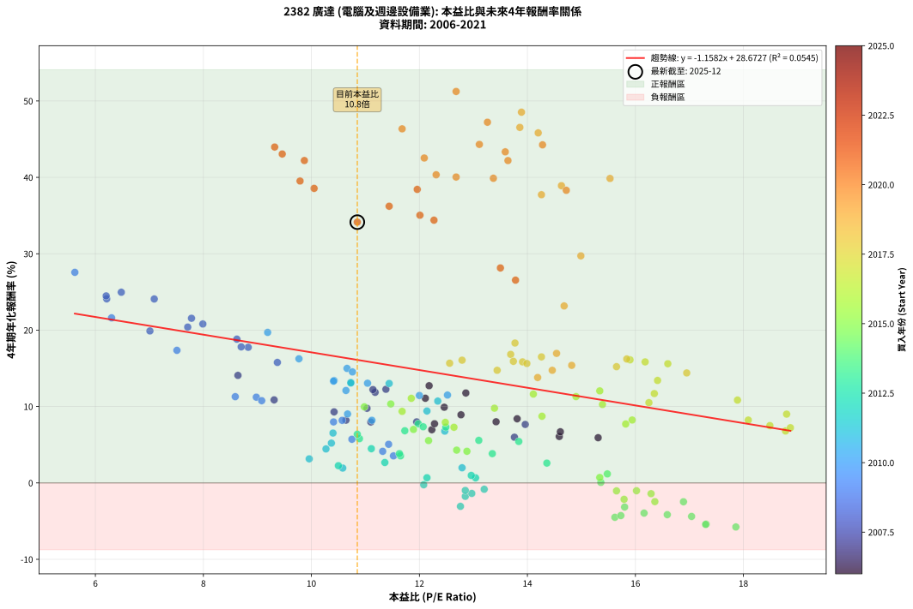
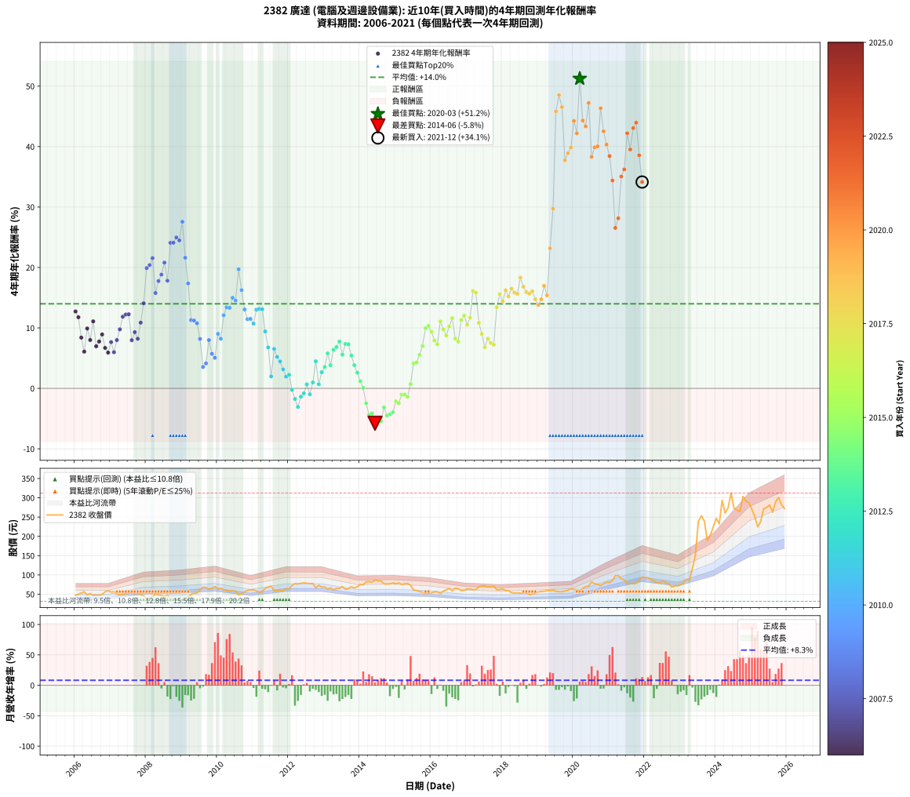

# 2382 廣達 - 本益比與未來報酬率分析

!!! info "報告資訊"
    - **股票代號**: 2382
    - **公司名稱**: 廣達
    - **產業別**: 電腦及週邊設備業
    - **分析期間**: 2006-2021 (192 個數據點)
    - **資料來源**: Type 12 (ShowMonthlyK_ChartFlow) 月收盤價與本益比
    - **報酬率口徑**: 含現金股利 (簡化: 年度合計，假設每年7/1入帳)
    - **報告生成時間**: 2026-01-04 08:25:19 CST

## 📈 視覺化圖表

### 圖表1: 本益比 vs 未來報酬率關係

*圖表1：2382 廣達 本益比與4年期未來報酬率關係 (2006-2021)*

### 圖表2: 歷年買入時點的4年期實際報酬率

*圖表2：2382 廣達 歷年買入時點的4年期實際報酬率 (2006-2021)*

## 📍 買點訊號說明

本報告提供兩種買點提示訊號（顯示於圖表2的股價子圖中）：

### ▲ 小綠色三角形（回測驗證）
- **計算方式**: 使用全部歷史資料計算本益比第25百分位數
- **用途**: 事後驗證，顯示歷史上哪些時點確實為低估區
- **限制**: 當下無法判斷，僅供回測參考
- **特性**: 後見之明（Look-Ahead Bias）

### ▲ 小橘色三角形（即時訊號）
- **計算方式**: 使用截至當月的過去5年資料計算本益比第25百分位數
- **用途**: 實際投資決策，當時即可判斷
- **優勢**: 可操作性強，符合實務需求
- **特性**: 無後見之明，滾動窗口計算

!!! tip "如何使用兩種訊號"
    - **綠色▲** 幫助理解歷史估值機會，驗證策略有效性
    - **橘色▲** 可作為實際買進參考，但仍需搭配基本面分析
    - 兩種訊號重疊時，表示即時判斷與事後驗證一致，信心度較高
    - 僅有綠色▲時，表示當時無法判斷（需要未來資料才能確認）
    - 僅有橘色▲時，表示即時判斷為買點，但事後可能不是最佳時機

## 📊 估值分析摘要

| 指標 | 數值 |
|:---:|:---:|
| **目前本益比** (2021-12) | **10.85 倍** |
| **歷史平均本益比** | 12.68 倍 |
| **估值水準** | 🟡 合理範圍 |
| **預期4年年化報酬率** | **+16.11%** |
| **歷史平均報酬率** | +13.99% |
| **相關係數 (R²)** | 0.0545 |
| **趨勢線斜率** | -1.1582 |

!!! abstract "核心洞察"
    目前本益比接近歷史平均，預期報酬率符合長期趨勢

    根據歷史數據回測，2382 廣達 在目前本益比 **10.8倍** 的估值水準下，
    預期未來4年年化報酬率約為 **+16.1%**。

    **重要提醒**: 本分析基於歷史數據統計，實際報酬率會受到公司基本面變化、產業趨勢、
    總體經濟環境等多重因素影響。R² = 0.05 表示本益比可解釋約 5.5% 的報酬率變異。

## 📈 歷史估值統計

### 最佳買點 (最高報酬率)

| 項目 | 數值 |
|:---:|:---:|
| 起始時間 | 2020-03 |
| 當時本益比 | 12.68 倍 |
| 起始價格 | 60.2 元 |
| 4年後價格 | 293.5 元 |
| **4年年化報酬率** | **+51.24%** |

### 最差買點 (最低報酬率)

| 項目 | 數值 |
|:---:|:---:|
| 起始時間 | 2014-06 |
| 當時本益比 | 17.86 倍 |
| 起始價格 | 87.0 元 |
| 4年後價格 | 53.5 元 |
| **4年年化報酬率** | **-5.77%** |

## 🎯 投資啟示

### 本益比與報酬率關係

趨勢線方程式: **y = -1.1582x + 28.6727**

!!! warning "強負相關"
    本益比與未來報酬率呈現強負相關。在高本益比時期買入，未來報酬率顯著較低；
    在低本益比時期買入，未來報酬率顯著較高。**估值紀律至關重要**。

### 估值區間建議

基於歷史數據分析:

- **🟢 低估區** (P/E < 10.1): 預期報酬率較高，可考慮增加持股
- **🟡 合理區** (P/E 10.1-15.2): 預期報酬率符合長期趨勢，正常持有
- **🔴 高估區** (P/E > 15.2): 預期報酬率較低，可考慮減碼或觀望

!!! danger "風險提示"
    - 過去表現不代表未來結果
    - 本分析假設公司基本面無重大結構性變化
    - 產業環境劇變可能使歷史規律失效
    - 應結合公司財報、產業趨勢、總體經濟等多重因素綜合判斷

!!! success "長期投資觀點"
    歷史數據顯示，在合理或低估的估值水準買入並長期持有，
    往往能獲得較佳的投資報酬。**耐心等待好價格**是價值投資的核心原則。

## 📊 數據品質

- **資料來源**: GoodInfo.tw Type 12 (ShowMonthlyK_ChartFlow)
- **資料頻率**: 月度收盤價與本益比
- **回測期間**: 2006-2021
- **數據點數量**: 192 個 (每個點代表一次4年期回測)

### 計算方法說明

1. **4年期年化報酬率**:
   - 對每個歷史時點，計算其後4年的實際投資報酬率
   - 期末價值(不含股利): 期末價格
   - 期末價值(含現金股利): 期末價格 + 持有期間內的現金股利合計 (簡化: 年度合計，假設每年7/1入帳)
   - 公式: 年化報酬率 = [(期末價值/期初價格)^(1/年數) - 1] × 100%

2. **本益比 (P/E Ratio)**:
   - 使用當時的月收盤價與EPS計算
   - 資料來源: Type 12 月度河流圖本益比數據

3. **趨勢線 (Linear Regression)**:
   - 使用最小平方法擬合線性趨勢線
   - R²值衡量本益比對報酬率的解釋能力

---

*本報告由 Stock Analysis System v1.9.0 自動生成*
*數據更新時間: 2026-01-04 08:25:19 CST*

## 📋 月度回測明細表

（每一列對應時間線圖中的一個買入點；可用來對照 SVG 圖上的每個點。）

| 買入月份 | 賣出月份 | 回測期限_年 | 實際持有年數 | 買入本益比_倍 | 買入收盤價_元 | 賣出收盤價_元 | 現金股利合計_元 | 總報酬率_pct | 年化報酬率_pct |
| --- | --- | --- | --- | --- | --- | --- | --- | --- | --- |
| 2006-01 | 2010-01 | 4 | 4.000 | 12.18 | 47.00 | 63.90 | 11.98 | +61.46 | +12.72 |
| 2006-02 | 2010-02 | 4 | 4.000 | 12.86 | 49.65 | 65.50 | 11.98 | +56.06 | +11.77 |
| 2006-03 | 2010-03 | 4 | 4.000 | 13.81 | 53.30 | 61.60 | 11.98 | +38.06 | +8.40 |
| 2006-04 | 2010-04 | 4 | 4.000 | 14.59 | 56.30 | 59.30 | 11.98 | +26.62 | +6.08 |
| 2006-05 | 2010-05 | 4 | 4.000 | 12.46 | 48.10 | 58.20 | 11.98 | +45.91 | +9.91 |
| 2006-06 | 2010-06 | 4 | 4.000 | 13.42 | 51.80 | 58.50 | 11.98 | +36.07 | +8.00 |
| 2006-07 | 2010-07 | 4 | 4.000 | 12.11 | 46.75 | 58.00 | 13.18 | +52.27 | +11.08 |
| 2006-08 | 2010-08 | 4 | 4.000 | 12.23 | 47.20 | 48.60 | 13.18 | +30.90 | +6.96 |
| 2006-09 | 2010-09 | 4 | 4.000 | 12.28 | 47.40 | 50.70 | 13.18 | +34.78 | +7.75 |
| 2006-10 | 2010-10 | 4 | 4.000 | 12.77 | 49.30 | 56.20 | 13.18 | +40.74 | +8.92 |
| 2006-11 | 2010-11 | 4 | 4.000 | 14.61 | 56.40 | 59.90 | 13.18 | +29.58 | +6.69 |
| 2006-12 | 2010-12 | 4 | 4.000 | 15.31 | 59.10 | 61.20 | 13.18 | +25.86 | +5.92 |
| 2007-01 | 2011-01 | 4 | 4.000 | 13.96 | 55.60 | 61.50 | 13.18 | +34.32 | +7.66 |
| 2007-02 | 2011-02 | 4 | 4.000 | 13.76 | 56.50 | 58.10 | 13.18 | +26.17 | +5.98 |
| 2007-03 | 2011-03 | 4 | 4.000 | 11.95 | 50.50 | 55.50 | 13.18 | +36.01 | +7.99 |
| 2007-04 | 2011-04 | 4 | 4.000 | 11.03 | 48.00 | 56.50 | 13.18 | +45.17 | +9.77 |
| 2007-05 | 2011-05 | 4 | 4.000 | 11.18 | 50.00 | 65.10 | 13.18 | +56.57 | +11.86 |
| 2007-06 | 2011-06 | 4 | 4.000 | 11.14 | 51.20 | 68.00 | 13.18 | +58.56 | +12.21 |
| 2007-07 | 2011-07 | 4 | 4.000 | 11.38 | 53.70 | 71.00 | 14.28 | +58.81 | +12.26 |
| 2007-08 | 2011-08 | 4 | 4.000 | 11.10 | 53.70 | 58.70 | 14.28 | +35.91 | +7.97 |
| 2007-09 | 2011-09 | 4 | 4.000 | 10.42 | 51.70 | 59.50 | 14.28 | +42.71 | +9.30 |
| 2007-10 | 2011-10 | 4 | 4.000 | 10.64 | 54.10 | 59.90 | 14.28 | +37.12 | +8.21 |
| 2007-11 | 2011-11 | 4 | 4.000 | 9.31 | 48.50 | 59.00 | 14.28 | +51.10 | +10.87 |
| 2007-12 | 2011-12 | 4 | 4.000 | 8.64 | 46.05 | 63.70 | 14.28 | +69.34 | +14.08 |
| 2008-01 | 2012-01 | 4 | 4.000 | 7.01 | 37.50 | 63.20 | 14.28 | +106.62 | +19.89 |
| 2008-02 | 2012-02 | 4 | 4.000 | 7.71 | 41.40 | 72.70 | 14.28 | +110.10 | +20.40 |
| 2008-03 | 2012-03 | 4 | 4.000 | 7.78 | 41.95 | 77.30 | 14.28 | +118.31 | +21.55 |
| 2008-04 | 2012-04 | 4 | 4.000 | 9.37 | 50.70 | 76.80 | 14.28 | +79.65 | +15.77 |
| 2008-05 | 2012-05 | 4 | 4.000 | 8.83 | 48.00 | 78.00 | 14.28 | +92.26 | +17.75 |
| 2008-06 | 2012-06 | 4 | 4.000 | 8.62 | 47.00 | 79.40 | 14.28 | +99.33 | +18.82 |
| 2008-07 | 2012-07 | 4 | 4.000 | 7.99 | 43.75 | 78.40 | 14.78 | +112.99 | +20.81 |
| 2008-08 | 2012-08 | 4 | 4.000 | 8.70 | 47.80 | 77.30 | 14.78 | +92.64 | +17.81 |
| 2008-09 | 2012-09 | 4 | 4.000 | 7.09 | 39.10 | 77.90 | 14.78 | +137.04 | +24.08 |
| 2008-10 | 2012-10 | 4 | 4.000 | 6.21 | 34.40 | 66.80 | 14.78 | +137.15 | +24.10 |
| 2008-11 | 2012-11 | 4 | 4.000 | 6.48 | 36.00 | 73.00 | 14.78 | +143.84 | +24.96 |
| 2008-12 | 2012-12 | 4 | 4.000 | 6.20 | 34.60 | 68.30 | 14.78 | +140.12 | +24.48 |
| 2009-01 | 2013-01 | 4 | 4.000 | 5.62 | 31.60 | 68.90 | 14.78 | +164.81 | +27.57 |
| 2009-02 | 2013-02 | 4 | 4.000 | 6.30 | 35.70 | 63.30 | 14.78 | +118.71 | +21.61 |
| 2009-03 | 2013-03 | 4 | 4.000 | 7.51 | 42.85 | 66.50 | 14.78 | +89.69 | +17.36 |
| 2009-04 | 2013-04 | 4 | 4.000 | 8.59 | 49.40 | 61.00 | 14.78 | +53.40 | +11.29 |
| 2009-05 | 2013-05 | 4 | 4.000 | 8.98 | 52.00 | 64.80 | 14.78 | +53.04 | +11.22 |
| 2009-06 | 2013-06 | 4 | 4.000 | 9.08 | 53.00 | 65.00 | 14.78 | +50.53 | +10.77 |
| 2009-07 | 2013-07 | 4 | 4.000 | 10.57 | 62.10 | 69.80 | 15.28 | +37.01 | +8.19 |
| 2009-08 | 2013-08 | 4 | 4.000 | 11.52 | 68.20 | 63.10 | 15.28 | +14.93 | +3.54 |
| 2009-09 | 2013-09 | 4 | 4.000 | 11.32 | 67.50 | 64.10 | 15.28 | +17.60 | +4.14 |
| 2009-10 | 2013-10 | 4 | 4.000 | 10.41 | 62.50 | 69.70 | 15.28 | +35.97 | +7.98 |
| 2009-11 | 2013-11 | 4 | 4.000 | 10.75 | 65.00 | 65.90 | 15.28 | +24.89 | +5.71 |
| 2009-12 | 2013-12 | 4 | 4.000 | 11.43 | 69.60 | 69.50 | 15.28 | +21.81 | +5.06 |
| 2010-01 | 2014-01 | 4 | 4.000 | 10.67 | 63.90 | 75.00 | 15.28 | +41.28 | +9.02 |
| 2010-02 | 2014-02 | 4 | 4.000 | 11.12 | 65.50 | 74.50 | 15.28 | +37.07 | +8.20 |
| 2010-03 | 2014-03 | 4 | 4.000 | 10.64 | 61.60 | 82.00 | 15.28 | +57.92 | +12.10 |
| 2010-04 | 2014-04 | 4 | 4.000 | 10.42 | 59.30 | 82.80 | 15.28 | +65.40 | +13.41 |
| 2010-05 | 2014-05 | 4 | 4.000 | 10.41 | 58.20 | 80.70 | 15.28 | +64.92 | +13.32 |
| 2010-06 | 2014-06 | 4 | 4.000 | 10.66 | 58.50 | 87.00 | 15.28 | +74.84 | +14.99 |
| 2010-07 | 2014-07 | 4 | 4.000 | 10.76 | 58.00 | 84.40 | 15.40 | +72.06 | +14.53 |
| 2010-08 | 2014-08 | 4 | 4.000 | 9.19 | 48.60 | 84.40 | 15.40 | +105.34 | +19.71 |
| 2010-09 | 2014-09 | 4 | 4.000 | 9.77 | 50.70 | 77.20 | 15.40 | +82.64 | +16.25 |
| 2010-10 | 2014-10 | 4 | 4.000 | 11.04 | 56.20 | 76.40 | 15.40 | +63.34 | +13.05 |
| 2010-11 | 2014-11 | 4 | 4.000 | 12.00 | 59.90 | 77.00 | 15.40 | +54.25 | +11.44 |
| 2010-12 | 2014-12 | 4 | 4.000 | 12.52 | 61.20 | 79.20 | 15.40 | +54.57 | +11.50 |
| 2011-01 | 2015-01 | 4 | 4.000 | 12.34 | 61.50 | 77.00 | 15.40 | +50.24 | +10.71 |
| 2011-02 | 2015-02 | 4 | 4.000 | 11.44 | 58.10 | 79.40 | 15.40 | +63.16 | +13.02 |
| 2011-03 | 2015-03 | 4 | 4.000 | 10.73 | 55.50 | 75.60 | 15.40 | +63.96 | +13.16 |
| 2011-04 | 2015-04 | 4 | 4.000 | 10.73 | 56.50 | 77.00 | 15.40 | +63.53 | +13.08 |
| 2011-05 | 2015-05 | 4 | 4.000 | 12.14 | 65.10 | 77.90 | 15.40 | +43.31 | +9.41 |
| 2011-06 | 2015-06 | 4 | 4.000 | 12.47 | 68.00 | 73.00 | 15.40 | +30.00 | +6.78 |
| 2011-07 | 2015-07 | 4 | 4.000 | 12.79 | 71.00 | 61.00 | 15.80 | +8.17 | +1.98 |
| 2011-08 | 2015-08 | 4 | 4.000 | 10.40 | 58.70 | 59.80 | 15.80 | +28.79 | +6.53 |
| 2011-09 | 2015-09 | 4 | 4.000 | 10.37 | 59.50 | 57.10 | 15.80 | +22.52 | +5.21 |
| 2011-10 | 2015-10 | 4 | 4.000 | 10.27 | 59.90 | 55.50 | 15.80 | +19.03 | +4.45 |
| 2011-11 | 2015-11 | 4 | 4.000 | 9.96 | 59.00 | 51.00 | 15.80 | +13.22 | +3.15 |
| 2011-12 | 2015-12 | 4 | 4.000 | 10.58 | 63.70 | 53.00 | 15.80 | +8.00 | +1.94 |
| 2012-01 | 2016-01 | 4 | 4.000 | 10.50 | 63.20 | 53.30 | 15.80 | +9.33 | +2.26 |
| 2012-02 | 2016-02 | 4 | 4.000 | 12.08 | 72.70 | 56.20 | 15.80 | -0.97 | -0.24 |
| 2012-03 | 2016-03 | 4 | 4.000 | 12.85 | 77.30 | 56.20 | 15.80 | -6.86 | -1.76 |
| 2012-04 | 2016-04 | 4 | 4.000 | 12.76 | 76.80 | 52.00 | 15.80 | -11.72 | -3.07 |
| 2012-05 | 2016-05 | 4 | 4.000 | 12.97 | 78.00 | 58.00 | 15.80 | -5.39 | -1.37 |
| 2012-06 | 2016-06 | 4 | 4.000 | 13.20 | 79.40 | 61.00 | 15.80 | -3.28 | -0.83 |
| 2012-07 | 2016-07 | 4 | 4.000 | 13.04 | 78.40 | 64.90 | 15.60 | +2.68 | +0.66 |
| 2012-08 | 2016-08 | 4 | 4.000 | 12.85 | 77.30 | 58.70 | 15.60 | -3.88 | -0.98 |
| 2012-09 | 2016-09 | 4 | 4.000 | 12.96 | 77.90 | 65.40 | 15.60 | +3.98 | +0.98 |
| 2012-10 | 2016-10 | 4 | 4.000 | 11.11 | 66.80 | 64.00 | 15.60 | +19.16 | +4.48 |
| 2012-11 | 2016-11 | 4 | 4.000 | 12.14 | 73.00 | 59.40 | 15.60 | +2.74 | +0.68 |
| 2012-12 | 2016-12 | 4 | 4.000 | 11.36 | 68.30 | 60.30 | 15.60 | +11.13 | +2.67 |
| 2013-01 | 2017-01 | 4 | 4.000 | 11.65 | 68.90 | 63.60 | 15.60 | +14.95 | +3.54 |
| 2013-02 | 2017-02 | 4 | 4.000 | 10.89 | 63.30 | 63.70 | 15.60 | +25.28 | +5.80 |
| 2013-03 | 2017-03 | 4 | 4.000 | 11.63 | 66.50 | 61.70 | 15.60 | +16.24 | +3.83 |
| 2013-04 | 2017-04 | 4 | 4.000 | 10.85 | 61.00 | 62.50 | 15.60 | +28.03 | +6.37 |
| 2013-05 | 2017-05 | 4 | 4.000 | 11.73 | 64.80 | 68.80 | 15.60 | +30.25 | +6.83 |
| 2013-06 | 2017-06 | 4 | 4.000 | 11.98 | 65.00 | 72.00 | 15.60 | +34.77 | +7.75 |
| 2013-07 | 2017-07 | 4 | 4.000 | 13.10 | 69.80 | 71.60 | 15.10 | +24.21 | +5.57 |
| 2013-08 | 2017-08 | 4 | 4.000 | 12.07 | 63.10 | 68.70 | 15.10 | +32.81 | +7.35 |
| 2013-09 | 2017-09 | 4 | 4.000 | 12.49 | 64.10 | 69.90 | 15.10 | +32.61 | +7.31 |
| 2013-10 | 2017-10 | 4 | 4.000 | 13.84 | 69.70 | 71.00 | 15.10 | +23.53 | +5.42 |
| 2013-11 | 2017-11 | 4 | 4.000 | 13.35 | 65.90 | 61.50 | 15.10 | +16.24 | +3.83 |
| 2013-12 | 2017-12 | 4 | 4.000 | 14.36 | 69.50 | 61.90 | 15.10 | +10.79 | +2.60 |
| 2014-01 | 2018-01 | 4 | 4.000 | 15.48 | 75.00 | 63.50 | 15.10 | +4.80 | +1.18 |
| 2014-02 | 2018-02 | 4 | 4.000 | 15.36 | 74.50 | 59.60 | 15.10 | +0.27 | +0.07 |
| 2014-03 | 2018-03 | 4 | 4.000 | 16.89 | 82.00 | 59.10 | 15.10 | -9.51 | -2.47 |
| 2014-04 | 2018-04 | 4 | 4.000 | 17.04 | 82.80 | 54.10 | 15.10 | -16.43 | -4.39 |
| 2014-05 | 2018-05 | 4 | 4.000 | 16.59 | 80.70 | 53.00 | 15.10 | -15.61 | -4.16 |
| 2014-06 | 2018-06 | 4 | 4.000 | 17.86 | 87.00 | 53.50 | 15.10 | -21.15 | -5.77 |
| 2014-07 | 2018-07 | 4 | 4.000 | 17.31 | 84.40 | 52.90 | 14.70 | -19.91 | -5.40 |
| 2014-08 | 2018-08 | 4 | 4.000 | 17.30 | 84.40 | 52.80 | 14.70 | -20.02 | -5.43 |
| 2014-09 | 2018-09 | 4 | 4.000 | 15.80 | 77.20 | 53.20 | 14.70 | -12.05 | -3.16 |
| 2014-10 | 2018-10 | 4 | 4.000 | 15.62 | 76.40 | 48.85 | 14.70 | -16.82 | -4.50 |
| 2014-11 | 2018-11 | 4 | 4.000 | 15.73 | 77.00 | 49.95 | 14.70 | -16.04 | -4.28 |
| 2014-12 | 2018-12 | 4 | 4.000 | 16.16 | 79.20 | 52.70 | 14.70 | -14.90 | -3.95 |
| 2015-01 | 2019-01 | 4 | 4.000 | 15.79 | 77.00 | 55.90 | 14.70 | -8.31 | -2.15 |
| 2015-02 | 2019-02 | 4 | 4.000 | 16.36 | 79.40 | 57.20 | 14.70 | -9.45 | -2.45 |
| 2015-03 | 2019-03 | 4 | 4.000 | 15.65 | 75.60 | 57.80 | 14.70 | -4.10 | -1.04 |
| 2015-04 | 2019-04 | 4 | 4.000 | 16.02 | 77.00 | 59.20 | 14.70 | -4.03 | -1.02 |
| 2015-05 | 2019-05 | 4 | 4.000 | 16.29 | 77.90 | 58.90 | 14.70 | -5.52 | -1.41 |
| 2015-06 | 2019-06 | 4 | 4.000 | 15.34 | 73.00 | 60.40 | 14.70 | +2.88 | +0.71 |
| 2015-07 | 2019-07 | 4 | 4.000 | 12.88 | 61.00 | 57.50 | 14.25 | +17.62 | +4.14 |
| 2015-08 | 2019-08 | 4 | 4.000 | 12.69 | 59.80 | 56.50 | 14.25 | +18.31 | +4.29 |
| 2015-09 | 2019-09 | 4 | 4.000 | 12.17 | 57.10 | 56.60 | 14.25 | +24.08 | +5.54 |
| 2015-10 | 2019-10 | 4 | 4.000 | 11.89 | 55.50 | 58.50 | 14.25 | +31.08 | +7.00 |
| 2015-11 | 2019-11 | 4 | 4.000 | 10.98 | 51.00 | 60.30 | 14.25 | +46.18 | +9.96 |
| 2015-12 | 2019-12 | 4 | 4.000 | 11.47 | 53.00 | 64.30 | 14.25 | +48.21 | +10.34 |
| 2016-01 | 2020-01 | 4 | 4.000 | 11.68 | 53.30 | 62.00 | 14.25 | +43.06 | +9.36 |
| 2016-02 | 2020-02 | 4 | 4.000 | 12.48 | 56.20 | 62.00 | 14.25 | +35.68 | +7.93 |
| 2016-03 | 2020-03 | 4 | 4.000 | 12.64 | 56.20 | 60.20 | 14.25 | +32.47 | +7.28 |
| 2016-04 | 2020-04 | 4 | 4.000 | 11.85 | 52.00 | 64.90 | 14.25 | +52.21 | +11.07 |
| 2016-05 | 2020-05 | 4 | 4.000 | 13.39 | 58.00 | 70.00 | 14.25 | +45.26 | +9.78 |
| 2016-06 | 2020-06 | 4 | 4.000 | 14.27 | 61.00 | 71.00 | 14.25 | +39.75 | +8.73 |
| 2016-07 | 2020-07 | 4 | 4.000 | 15.39 | 64.90 | 81.80 | 14.15 | +47.84 | +10.27 |
| 2016-08 | 2020-08 | 4 | 4.000 | 14.11 | 58.70 | 77.00 | 14.15 | +55.28 | +11.63 |
| 2016-09 | 2020-09 | 4 | 4.000 | 15.94 | 65.40 | 75.60 | 14.15 | +37.23 | +8.23 |
| 2016-10 | 2020-10 | 4 | 4.000 | 15.82 | 64.00 | 72.00 | 14.15 | +34.61 | +7.71 |
| 2016-11 | 2020-11 | 4 | 4.000 | 14.90 | 59.40 | 77.00 | 14.15 | +53.45 | +11.30 |
| 2016-12 | 2020-12 | 4 | 4.000 | 15.34 | 60.30 | 80.90 | 14.15 | +57.63 | +12.05 |
| 2017-01 | 2021-01 | 4 | 4.000 | 16.25 | 63.60 | 80.70 | 14.15 | +49.14 | +10.51 |
| 2017-02 | 2021-02 | 4 | 4.000 | 16.35 | 63.70 | 85.00 | 14.15 | +55.65 | +11.70 |
| 2017-03 | 2021-03 | 4 | 4.000 | 15.90 | 61.70 | 98.00 | 14.15 | +81.77 | +16.11 |
| 2017-04 | 2021-04 | 4 | 4.000 | 16.18 | 62.50 | 98.40 | 14.15 | +80.08 | +15.84 |
| 2017-05 | 2021-05 | 4 | 4.000 | 17.89 | 68.80 | 89.70 | 14.15 | +50.94 | +10.84 |
| 2017-06 | 2021-06 | 4 | 4.000 | 18.80 | 72.00 | 87.50 | 14.15 | +41.18 | +9.00 |
| 2017-07 | 2021-07 | 4 | 4.000 | 18.78 | 71.60 | 77.30 | 15.85 | +30.10 | +6.80 |
| 2017-08 | 2021-08 | 4 | 4.000 | 18.09 | 68.70 | 78.40 | 15.85 | +37.19 | +8.23 |
| 2017-09 | 2021-09 | 4 | 4.000 | 18.49 | 69.90 | 77.50 | 15.85 | +33.55 | +7.50 |
| 2017-10 | 2021-10 | 4 | 4.000 | 18.87 | 71.00 | 78.00 | 15.85 | +32.18 | +7.22 |
| 2017-11 | 2021-11 | 4 | 4.000 | 16.41 | 61.50 | 85.90 | 15.85 | +65.45 | +13.41 |
| 2017-12 | 2021-12 | 4 | 4.000 | 16.60 | 61.90 | 94.70 | 15.85 | +78.59 | +15.60 |
| 2018-01 | 2022-01 | 4 | 4.000 | 16.95 | 63.50 | 92.90 | 15.85 | +71.26 | +14.40 |
| 2018-02 | 2022-02 | 4 | 4.000 | 15.84 | 59.60 | 92.90 | 15.85 | +82.47 | +16.22 |
| 2018-03 | 2022-03 | 4 | 4.000 | 15.65 | 59.10 | 88.30 | 15.85 | +76.23 | +15.22 |
| 2018-04 | 2022-04 | 4 | 4.000 | 14.26 | 54.10 | 83.80 | 15.85 | +84.20 | +16.50 |
| 2018-05 | 2022-05 | 4 | 4.000 | 13.91 | 53.00 | 79.60 | 15.85 | +80.09 | +15.84 |
| 2018-06 | 2022-06 | 4 | 4.000 | 13.99 | 53.50 | 79.80 | 15.85 | +78.79 | +15.63 |
| 2018-07 | 2022-07 | 4 | 4.000 | 13.77 | 52.90 | 84.60 | 19.05 | +95.94 | +18.31 |
| 2018-08 | 2022-08 | 4 | 4.000 | 13.69 | 52.80 | 79.30 | 19.05 | +86.27 | +16.82 |
| 2018-09 | 2022-09 | 4 | 4.000 | 13.74 | 53.20 | 77.00 | 19.05 | +80.55 | +15.92 |
| 2018-10 | 2022-10 | 4 | 4.000 | 12.56 | 48.85 | 68.40 | 19.05 | +79.02 | +15.67 |
| 2018-11 | 2022-11 | 4 | 4.000 | 12.79 | 49.95 | 71.60 | 19.05 | +81.48 | +16.07 |
| 2018-12 | 2022-12 | 4 | 4.000 | 13.44 | 52.70 | 72.30 | 19.05 | +73.34 | +14.74 |
| 2019-01 | 2023-01 | 4 | 4.000 | 14.19 | 55.90 | 74.70 | 19.05 | +67.71 | +13.80 |
| 2019-02 | 2023-02 | 4 | 4.000 | 14.46 | 57.20 | 80.10 | 19.05 | +73.34 | +14.74 |
| 2019-03 | 2023-03 | 4 | 4.000 | 14.54 | 57.80 | 89.10 | 19.05 | +87.11 | +16.96 |
| 2019-04 | 2023-04 | 4 | 4.000 | 14.82 | 59.20 | 85.90 | 19.05 | +77.28 | +15.39 |
| 2019-05 | 2023-05 | 4 | 4.000 | 14.68 | 58.90 | 116.50 | 19.05 | +130.14 | +23.17 |
| 2019-06 | 2023-06 | 4 | 4.000 | 14.99 | 60.40 | 152.00 | 19.05 | +183.20 | +29.72 |
| 2019-07 | 2023-07 | 4 | 4.000 | 14.20 | 57.50 | 238.50 | 21.50 | +352.17 | +45.82 |
| 2019-08 | 2023-08 | 4 | 4.000 | 13.89 | 56.50 | 253.50 | 21.50 | +386.73 | +48.53 |
| 2019-09 | 2023-09 | 4 | 4.000 | 13.86 | 56.60 | 239.50 | 21.50 | +361.13 | +46.54 |
| 2019-10 | 2023-10 | 4 | 4.000 | 14.26 | 58.50 | 189.00 | 21.50 | +259.83 | +37.73 |
| 2019-11 | 2023-11 | 4 | 4.000 | 14.63 | 60.30 | 203.00 | 21.50 | +272.31 | +38.91 |
| 2019-12 | 2023-12 | 4 | 4.000 | 15.53 | 64.30 | 224.50 | 21.50 | +282.58 | +39.86 |
| 2020-01 | 2024-01 | 4 | 4.000 | 14.28 | 62.00 | 247.00 | 21.50 | +333.06 | +44.26 |
| 2020-02 | 2024-02 | 4 | 4.000 | 13.64 | 62.00 | 232.00 | 21.50 | +308.87 | +42.20 |
| 2020-03 | 2024-03 | 4 | 4.000 | 12.68 | 60.20 | 293.50 | 21.50 | +423.26 | +51.24 |
| 2020-04 | 2024-04 | 4 | 4.000 | 13.11 | 64.90 | 260.00 | 21.50 | +333.74 | +44.31 |
| 2020-05 | 2024-05 | 4 | 4.000 | 13.59 | 70.00 | 274.00 | 21.50 | +322.14 | +43.34 |
| 2020-06 | 2024-06 | 4 | 4.000 | 13.26 | 71.00 | 312.00 | 21.50 | +369.72 | +47.22 |
| 2020-07 | 2024-07 | 4 | 4.000 | 14.72 | 81.80 | 272.50 | 26.80 | +265.89 | +38.31 |
| 2020-08 | 2024-08 | 4 | 4.000 | 13.37 | 77.00 | 268.00 | 26.80 | +282.86 | +39.88 |
| 2020-09 | 2024-09 | 4 | 4.000 | 12.68 | 75.60 | 264.00 | 26.80 | +284.66 | +40.05 |
| 2020-10 | 2024-10 | 4 | 4.000 | 11.68 | 72.00 | 303.50 | 26.80 | +358.75 | +46.35 |
| 2020-11 | 2024-11 | 4 | 4.000 | 12.09 | 77.00 | 291.00 | 26.80 | +312.73 | +42.53 |
| 2020-12 | 2024-12 | 4 | 4.000 | 12.31 | 80.90 | 287.00 | 26.80 | +287.89 | +40.34 |
| 2021-01 | 2025-01 | 4 | 4.000 | 11.96 | 80.70 | 269.50 | 26.80 | +267.16 | +38.42 |
| 2021-02 | 2025-02 | 4 | 4.000 | 12.27 | 85.00 | 250.50 | 26.80 | +226.24 | +34.39 |
| 2021-03 | 2025-03 | 4 | 4.000 | 13.78 | 98.00 | 224.50 | 26.80 | +156.43 | +26.54 |
| 2021-04 | 2025-04 | 4 | 4.000 | 13.50 | 98.40 | 238.50 | 26.80 | +169.61 | +28.14 |
| 2021-05 | 2025-05 | 4 | 4.000 | 12.01 | 89.70 | 271.50 | 26.80 | +232.55 | +35.04 |
| 2021-06 | 2025-06 | 4 | 4.000 | 11.44 | 87.50 | 274.50 | 26.80 | +244.34 | +36.22 |
| 2021-07 | 2025-07 | 4 | 4.000 | 9.87 | 77.30 | 281.50 | 34.60 | +308.93 | +42.20 |
| 2021-08 | 2025-08 | 4 | 4.000 | 9.79 | 78.40 | 262.50 | 34.60 | +278.95 | +39.52 |
| 2021-09 | 2025-09 | 4 | 4.000 | 9.46 | 77.50 | 290.00 | 34.60 | +318.84 | +43.06 |
| 2021-10 | 2025-10 | 4 | 4.000 | 9.32 | 78.00 | 300.50 | 34.60 | +329.62 | +43.97 |
| 2021-11 | 2025-11 | 4 | 4.000 | 10.05 | 85.90 | 282.00 | 34.60 | +268.57 | +38.56 |
| 2021-12 | 2025-12 | 4 | 4.000 | 10.85 | 94.70 | 272.00 | 34.60 | +223.76 | +34.14 |
