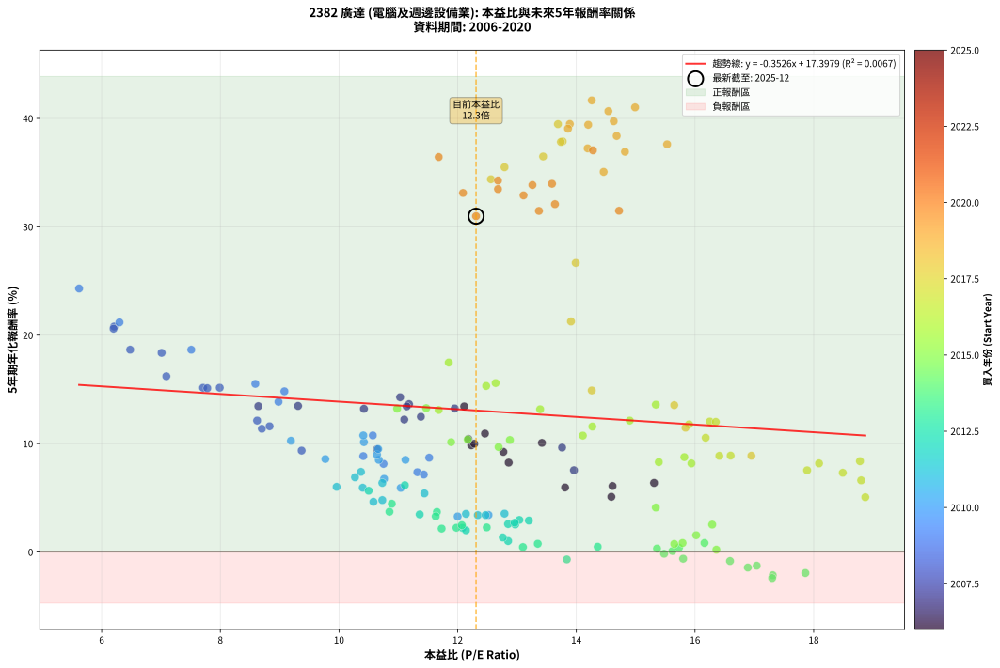

# 2382 廣達 - 本益比與未來報酬率分析

!!! info "報告資訊"
    - **股票代號**: 2382
    - **公司名稱**: 廣達
    - **產業別**: 電腦及週邊設備業
    - **分析期間**: 2006-2020 (180 個數據點)
    - **資料來源**: Type 12 (ShowMonthlyK_ChartFlow) 月收盤價與本益比
    - **報酬率口徑**: 含現金股利 (簡化: 年度合計，假設每年7/1入帳)
    - **報告生成時間**: 2026-01-04 08:17:33 CST

## 📈 視覺化圖表

### 圖表1: 本益比 vs 未來報酬率關係

*圖表1：2382 廣達 本益比與5年期未來報酬率關係 (2006-2020)*

### 圖表2: 歷年買入時點的5年期實際報酬率

*圖表2：2382 廣達 歷年買入時點的5年期實際報酬率 (2006-2020)*

## 📍 買點訊號說明

本報告提供兩種買點提示訊號（顯示於圖表2的股價子圖中）：

### ▲ 小綠色三角形（回測驗證）
- **計算方式**: 使用全部歷史資料計算本益比第25百分位數
- **用途**: 事後驗證，顯示歷史上哪些時點確實為低估區
- **限制**: 當下無法判斷，僅供回測參考
- **特性**: 後見之明（Look-Ahead Bias）

### ▲ 小橘色三角形（即時訊號）
- **計算方式**: 使用截至當月的過去5年資料計算本益比第25百分位數
- **用途**: 實際投資決策，當時即可判斷
- **優勢**: 可操作性強，符合實務需求
- **特性**: 無後見之明，滾動窗口計算

!!! tip "如何使用兩種訊號"
    - **綠色▲** 幫助理解歷史估值機會，驗證策略有效性
    - **橘色▲** 可作為實際買進參考，但仍需搭配基本面分析
    - 兩種訊號重疊時，表示即時判斷與事後驗證一致，信心度較高
    - 僅有綠色▲時，表示當時無法判斷（需要未來資料才能確認）
    - 僅有橘色▲時，表示即時判斷為買點，但事後可能不是最佳時機

## 📊 估值分析摘要

| 指標 | 數值 |
|:---:|:---:|
| **目前本益比** (2020-12) | **12.31 倍** |
| **歷史平均本益比** | 12.78 倍 |
| **估值水準** | 🟡 合理範圍 |
| **預期5年年化報酬率** | **+13.06%** |
| **歷史平均報酬率** | +12.89% |
| **相關係數 (R²)** | 0.0067 |
| **趨勢線斜率** | -0.3526 |

!!! abstract "核心洞察"
    目前本益比接近歷史平均，預期報酬率符合長期趨勢

    根據歷史數據回測，2382 廣達 在目前本益比 **12.3倍** 的估值水準下，
    預期未來5年年化報酬率約為 **+13.1%**。

    **重要提醒**: 本分析基於歷史數據統計，實際報酬率會受到公司基本面變化、產業趨勢、
    總體經濟環境等多重因素影響。R² = 0.01 表示本益比可解釋約 0.7% 的報酬率變異。

## 📈 歷史估值統計

### 最佳買點 (最高報酬率)

| 項目 | 數值 |
|:---:|:---:|
| 起始時間 | 2019-10 |
| 當時本益比 | 14.26 倍 |
| 起始價格 | 58.5 元 |
| 5年後價格 | 303.5 元 |
| **5年年化報酬率** | **+41.66%** |

### 最差買點 (最低報酬率)

| 項目 | 數值 |
|:---:|:---:|
| 起始時間 | 2014-08 |
| 當時本益比 | 17.30 倍 |
| 起始價格 | 84.4 元 |
| 5年後價格 | 56.5 元 |
| **5年年化報酬率** | **-2.40%** |

## 🎯 投資啟示

### 本益比與報酬率關係

趨勢線方程式: **y = -0.3526x + 17.3979**

!!! note "負相關"
    本益比與未來報酬率呈現負相關。較低的本益比通常帶來較高的未來報酬率，
    但相關性不算非常強。**估值仍是重要參考指標之一**。

### 估值區間建議

基於歷史數據分析:

- **🟢 低估區** (P/E < 10.2): 預期報酬率較高，可考慮增加持股
- **🟡 合理區** (P/E 10.2-15.3): 預期報酬率符合長期趨勢，正常持有
- **🔴 高估區** (P/E > 15.3): 預期報酬率較低，可考慮減碼或觀望

!!! danger "風險提示"
    - 過去表現不代表未來結果
    - 本分析假設公司基本面無重大結構性變化
    - 產業環境劇變可能使歷史規律失效
    - 應結合公司財報、產業趨勢、總體經濟等多重因素綜合判斷

!!! success "長期投資觀點"
    歷史數據顯示，在合理或低估的估值水準買入並長期持有，
    往往能獲得較佳的投資報酬。**耐心等待好價格**是價值投資的核心原則。

## 📊 數據品質

- **資料來源**: GoodInfo.tw Type 12 (ShowMonthlyK_ChartFlow)
- **資料頻率**: 月度收盤價與本益比
- **回測期間**: 2006-2020
- **數據點數量**: 180 個 (每個點代表一次5年期回測)

### 計算方法說明

1. **5年期年化報酬率**:
   - 對每個歷史時點，計算其後5年的實際投資報酬率
   - 期末價值(不含股利): 期末價格
   - 期末價值(含現金股利): 期末價格 + 持有期間內的現金股利合計 (簡化: 年度合計，假設每年7/1入帳)
   - 公式: 年化報酬率 = [(期末價值/期初價格)^(1/年數) - 1] × 100%

2. **本益比 (P/E Ratio)**:
   - 使用當時的月收盤價與EPS計算
   - 資料來源: Type 12 月度河流圖本益比數據

3. **趨勢線 (Linear Regression)**:
   - 使用最小平方法擬合線性趨勢線
   - R²值衡量本益比對報酬率的解釋能力

---

*本報告由 Stock Analysis System v1.9.0 自動生成*
*數據更新時間: 2026-01-04 08:17:33 CST*

## 📋 月度回測明細表

（每一列對應時間線圖中的一個買入點；可用來對照 SVG 圖上的每個點。）

| 買入月份 | 賣出月份 | 回測期限_年 | 實際持有年數 | 買入本益比_倍 | 買入收盤價_元 | 賣出收盤價_元 | 現金股利合計_元 | 總報酬率_pct | 年化報酬率_pct |
| --- | --- | --- | --- | --- | --- | --- | --- | --- | --- |
| 2006-01 | 2011-01 | 5 | 4.999 | 12.18 | 47.00 | 61.50 | 15.67 | +64.19 | +10.43 |
| 2006-02 | 2011-02 | 5 | 4.999 | 12.86 | 49.65 | 58.10 | 15.67 | +48.58 | +8.24 |
| 2006-03 | 2011-03 | 5 | 4.999 | 13.81 | 53.30 | 55.50 | 15.67 | +33.53 | +5.95 |
| 2006-04 | 2011-04 | 5 | 4.999 | 14.59 | 56.30 | 56.50 | 15.67 | +28.19 | +5.09 |
| 2006-05 | 2011-05 | 5 | 4.999 | 12.46 | 48.10 | 65.10 | 15.67 | +67.92 | +10.92 |
| 2006-06 | 2011-06 | 5 | 4.999 | 13.42 | 51.80 | 68.00 | 15.67 | +61.52 | +10.07 |
| 2006-07 | 2011-07 | 5 | 4.999 | 12.11 | 46.75 | 71.00 | 16.78 | +87.77 | +13.43 |
| 2006-08 | 2011-08 | 5 | 4.999 | 12.23 | 47.20 | 58.70 | 16.78 | +59.92 | +9.85 |
| 2006-09 | 2011-09 | 5 | 4.999 | 12.28 | 47.40 | 59.50 | 16.78 | +60.93 | +9.99 |
| 2006-10 | 2011-10 | 5 | 4.999 | 12.77 | 49.30 | 59.90 | 16.78 | +55.54 | +9.24 |
| 2006-11 | 2011-11 | 5 | 4.999 | 14.61 | 56.40 | 59.00 | 16.78 | +34.37 | +6.09 |
| 2006-12 | 2011-12 | 5 | 4.999 | 15.31 | 59.10 | 63.70 | 16.78 | +36.18 | +6.37 |
| 2007-01 | 2012-01 | 5 | 4.999 | 13.96 | 55.60 | 63.20 | 16.78 | +43.85 | +7.54 |
| 2007-02 | 2012-02 | 5 | 4.999 | 13.76 | 56.50 | 72.70 | 16.78 | +58.38 | +9.63 |
| 2007-03 | 2012-03 | 5 | 5.002 | 11.95 | 50.50 | 77.30 | 16.78 | +86.30 | +13.25 |
| 2007-04 | 2012-04 | 5 | 5.002 | 11.03 | 48.00 | 76.80 | 16.78 | +94.96 | +14.28 |
| 2007-05 | 2012-05 | 5 | 5.002 | 11.18 | 50.00 | 78.00 | 16.78 | +89.57 | +13.64 |
| 2007-06 | 2012-06 | 5 | 5.002 | 11.14 | 51.20 | 79.40 | 16.78 | +87.86 | +13.43 |
| 2007-07 | 2012-07 | 5 | 5.002 | 11.38 | 53.70 | 78.40 | 18.28 | +80.04 | +12.47 |
| 2007-08 | 2012-08 | 5 | 5.002 | 11.10 | 53.70 | 77.30 | 18.28 | +77.99 | +12.22 |
| 2007-09 | 2012-09 | 5 | 5.002 | 10.42 | 51.70 | 77.90 | 18.28 | +86.04 | +13.21 |
| 2007-10 | 2012-10 | 5 | 5.002 | 10.64 | 54.10 | 66.80 | 18.28 | +57.27 | +9.47 |
| 2007-11 | 2012-11 | 5 | 5.002 | 9.31 | 48.50 | 73.00 | 18.28 | +88.21 | +13.48 |
| 2007-12 | 2012-12 | 5 | 5.002 | 8.64 | 46.05 | 68.30 | 18.28 | +88.02 | +13.45 |
| 2008-01 | 2013-01 | 5 | 5.002 | 7.01 | 37.50 | 68.90 | 18.28 | +132.48 | +18.37 |
| 2008-02 | 2013-03 | 5 | 5.081 | 7.71 | 41.40 | 66.50 | 18.28 | +104.79 | +15.15 |
| 2008-03 | 2013-03 | 5 | 4.999 | 7.78 | 41.95 | 66.50 | 18.28 | +102.10 | +15.11 |
| 2008-04 | 2013-04 | 5 | 4.999 | 9.37 | 50.70 | 61.00 | 18.28 | +56.37 | +9.35 |
| 2008-05 | 2013-05 | 5 | 4.999 | 8.83 | 48.00 | 64.80 | 18.28 | +73.09 | +11.60 |
| 2008-06 | 2013-06 | 5 | 4.999 | 8.62 | 47.00 | 65.00 | 18.28 | +77.19 | +12.12 |
| 2008-07 | 2013-07 | 5 | 4.999 | 7.99 | 43.75 | 69.80 | 18.78 | +102.47 | +15.15 |
| 2008-08 | 2013-08 | 5 | 4.999 | 8.70 | 47.80 | 63.10 | 18.78 | +71.30 | +11.37 |
| 2008-09 | 2013-09 | 5 | 4.999 | 7.09 | 39.10 | 64.10 | 18.78 | +111.97 | +16.22 |
| 2008-10 | 2013-10 | 5 | 4.999 | 6.21 | 34.40 | 69.70 | 18.78 | +157.21 | +20.80 |
| 2008-11 | 2013-11 | 5 | 4.999 | 6.48 | 36.00 | 65.90 | 18.78 | +135.23 | +18.66 |
| 2008-12 | 2013-12 | 5 | 4.999 | 6.20 | 34.60 | 69.50 | 18.78 | +155.15 | +20.61 |
| 2009-01 | 2014-01 | 5 | 4.999 | 5.62 | 31.60 | 75.00 | 18.78 | +196.78 | +24.31 |
| 2009-02 | 2014-02 | 5 | 4.999 | 6.30 | 35.70 | 74.50 | 18.78 | +161.29 | +21.18 |
| 2009-03 | 2014-03 | 5 | 4.999 | 7.51 | 42.85 | 82.00 | 18.78 | +135.19 | +18.66 |
| 2009-04 | 2014-04 | 5 | 4.999 | 8.59 | 49.40 | 82.80 | 18.78 | +105.63 | +15.51 |
| 2009-05 | 2014-05 | 5 | 4.999 | 8.98 | 52.00 | 80.70 | 18.78 | +91.31 | +13.86 |
| 2009-06 | 2014-06 | 5 | 4.999 | 9.08 | 53.00 | 87.00 | 18.78 | +99.59 | +14.82 |
| 2009-07 | 2014-07 | 5 | 4.999 | 10.57 | 62.10 | 84.40 | 19.08 | +66.64 | +10.75 |
| 2009-08 | 2014-08 | 5 | 4.999 | 11.52 | 68.20 | 84.40 | 19.08 | +51.73 | +8.70 |
| 2009-09 | 2014-09 | 5 | 4.999 | 11.32 | 67.50 | 77.20 | 19.08 | +42.64 | +7.36 |
| 2009-10 | 2014-10 | 5 | 4.999 | 10.41 | 62.50 | 76.40 | 19.08 | +52.77 | +8.85 |
| 2009-11 | 2014-11 | 5 | 4.999 | 10.75 | 65.00 | 77.00 | 19.08 | +47.82 | +8.13 |
| 2009-12 | 2014-12 | 5 | 4.999 | 11.43 | 69.60 | 79.20 | 19.08 | +41.21 | +7.15 |
| 2010-01 | 2015-01 | 5 | 4.999 | 10.67 | 63.90 | 77.00 | 19.08 | +50.36 | +8.50 |
| 2010-02 | 2015-02 | 5 | 4.999 | 11.12 | 65.50 | 79.40 | 19.08 | +50.35 | +8.50 |
| 2010-03 | 2015-03 | 5 | 4.999 | 10.64 | 61.60 | 75.60 | 19.08 | +53.70 | +8.98 |
| 2010-04 | 2015-04 | 5 | 4.999 | 10.42 | 59.30 | 77.00 | 19.08 | +62.03 | +10.13 |
| 2010-05 | 2015-05 | 5 | 4.999 | 10.41 | 58.20 | 77.90 | 19.08 | +66.63 | +10.75 |
| 2010-06 | 2015-06 | 5 | 4.999 | 10.66 | 58.50 | 73.00 | 19.08 | +57.40 | +9.50 |
| 2010-07 | 2015-07 | 5 | 4.999 | 10.76 | 58.00 | 61.00 | 19.40 | +38.62 | +6.75 |
| 2010-08 | 2015-08 | 5 | 4.999 | 9.19 | 48.60 | 59.80 | 19.40 | +62.96 | +10.26 |
| 2010-09 | 2015-09 | 5 | 4.999 | 9.77 | 50.70 | 57.10 | 19.40 | +50.88 | +8.58 |
| 2010-10 | 2015-10 | 5 | 4.999 | 11.04 | 56.20 | 55.50 | 19.40 | +33.27 | +5.91 |
| 2010-11 | 2015-11 | 5 | 4.999 | 12.00 | 59.90 | 51.00 | 19.40 | +17.52 | +3.28 |
| 2010-12 | 2015-12 | 5 | 4.999 | 12.52 | 61.20 | 53.00 | 19.40 | +18.30 | +3.42 |
| 2011-01 | 2016-01 | 5 | 4.999 | 12.34 | 61.50 | 53.30 | 19.40 | +18.21 | +3.40 |
| 2011-02 | 2016-02 | 5 | 4.999 | 11.44 | 58.10 | 56.20 | 19.40 | +30.12 | +5.41 |
| 2011-03 | 2016-03 | 5 | 5.002 | 10.73 | 55.50 | 56.20 | 19.40 | +36.21 | +6.37 |
| 2011-04 | 2016-04 | 5 | 5.002 | 10.73 | 56.50 | 52.00 | 19.40 | +26.37 | +4.79 |
| 2011-05 | 2016-05 | 5 | 5.002 | 12.14 | 65.10 | 58.00 | 19.40 | +18.89 | +3.52 |
| 2011-06 | 2016-06 | 5 | 5.002 | 12.47 | 68.00 | 61.00 | 19.40 | +18.23 | +3.40 |
| 2011-07 | 2016-07 | 5 | 5.002 | 12.79 | 71.00 | 64.90 | 19.60 | +19.01 | +3.54 |
| 2011-08 | 2016-08 | 5 | 5.002 | 10.40 | 58.70 | 58.70 | 19.60 | +33.39 | +5.93 |
| 2011-09 | 2016-09 | 5 | 5.002 | 10.37 | 59.50 | 65.40 | 19.60 | +42.85 | +7.39 |
| 2011-10 | 2016-10 | 5 | 5.002 | 10.27 | 59.90 | 64.00 | 19.60 | +39.56 | +6.89 |
| 2011-11 | 2016-11 | 5 | 5.002 | 9.96 | 59.00 | 59.40 | 19.60 | +33.89 | +6.01 |
| 2011-12 | 2016-12 | 5 | 5.002 | 10.58 | 63.70 | 60.30 | 19.60 | +25.43 | +4.63 |
| 2012-01 | 2017-01 | 5 | 5.002 | 10.50 | 63.20 | 63.60 | 19.60 | +31.64 | +5.65 |
| 2012-02 | 2017-03 | 5 | 5.081 | 12.08 | 72.70 | 61.70 | 19.60 | +11.83 | +2.22 |
| 2012-03 | 2017-03 | 5 | 4.999 | 12.85 | 77.30 | 61.70 | 19.60 | +5.17 | +1.01 |
| 2012-04 | 2017-04 | 5 | 4.999 | 12.76 | 76.80 | 62.50 | 19.60 | +6.90 | +1.34 |
| 2012-05 | 2017-05 | 5 | 4.999 | 12.97 | 78.00 | 68.80 | 19.60 | +13.33 | +2.53 |
| 2012-06 | 2017-06 | 5 | 4.999 | 13.20 | 79.40 | 72.00 | 19.60 | +15.36 | +2.90 |
| 2012-07 | 2017-07 | 5 | 4.999 | 13.04 | 78.40 | 71.60 | 19.10 | +15.69 | +2.96 |
| 2012-08 | 2017-08 | 5 | 4.999 | 12.85 | 77.30 | 68.70 | 19.10 | +13.58 | +2.58 |
| 2012-09 | 2017-09 | 5 | 4.999 | 12.96 | 77.90 | 69.90 | 19.10 | +14.25 | +2.70 |
| 2012-10 | 2017-10 | 5 | 4.999 | 11.11 | 66.80 | 71.00 | 19.10 | +34.88 | +6.17 |
| 2012-11 | 2017-11 | 5 | 4.999 | 12.14 | 73.00 | 61.50 | 19.10 | +10.41 | +2.00 |
| 2012-12 | 2017-12 | 5 | 4.999 | 11.36 | 68.30 | 61.90 | 19.10 | +18.59 | +3.47 |
| 2013-01 | 2018-01 | 5 | 4.999 | 11.65 | 68.90 | 63.50 | 19.10 | +19.88 | +3.69 |
| 2013-02 | 2018-02 | 5 | 4.999 | 10.89 | 63.30 | 59.60 | 19.10 | +24.33 | +4.45 |
| 2013-03 | 2018-03 | 5 | 4.999 | 11.63 | 66.50 | 59.10 | 19.10 | +17.59 | +3.29 |
| 2013-04 | 2018-04 | 5 | 4.999 | 10.85 | 61.00 | 54.10 | 19.10 | +20.00 | +3.71 |
| 2013-05 | 2018-05 | 5 | 4.999 | 11.73 | 64.80 | 53.00 | 19.10 | +11.27 | +2.16 |
| 2013-06 | 2018-06 | 5 | 4.999 | 11.98 | 65.00 | 53.50 | 19.10 | +11.69 | +2.24 |
| 2013-07 | 2018-07 | 5 | 4.999 | 13.10 | 69.80 | 52.90 | 18.50 | +2.29 | +0.45 |
| 2013-08 | 2018-08 | 5 | 4.999 | 12.07 | 63.10 | 52.80 | 18.50 | +13.00 | +2.47 |
| 2013-09 | 2018-09 | 5 | 4.999 | 12.49 | 64.10 | 53.20 | 18.50 | +11.86 | +2.27 |
| 2013-10 | 2018-10 | 5 | 4.999 | 13.84 | 69.70 | 48.85 | 18.50 | -3.37 | -0.68 |
| 2013-11 | 2018-11 | 5 | 4.999 | 13.35 | 65.90 | 49.95 | 18.50 | +3.87 | +0.76 |
| 2013-12 | 2018-12 | 5 | 4.999 | 14.36 | 69.50 | 52.70 | 18.50 | +2.45 | +0.48 |
| 2014-01 | 2019-01 | 5 | 4.999 | 15.48 | 75.00 | 55.90 | 18.50 | -0.80 | -0.16 |
| 2014-02 | 2019-02 | 5 | 4.999 | 15.36 | 74.50 | 57.20 | 18.50 | +1.61 | +0.32 |
| 2014-03 | 2019-03 | 5 | 4.999 | 16.89 | 82.00 | 57.80 | 18.50 | -6.95 | -1.43 |
| 2014-04 | 2019-04 | 5 | 4.999 | 17.04 | 82.80 | 59.20 | 18.50 | -6.16 | -1.26 |
| 2014-05 | 2019-05 | 5 | 4.999 | 16.59 | 80.70 | 58.90 | 18.50 | -4.09 | -0.83 |
| 2014-06 | 2019-06 | 5 | 4.999 | 17.86 | 87.00 | 60.40 | 18.50 | -9.31 | -1.94 |
| 2014-07 | 2019-07 | 5 | 4.999 | 17.31 | 84.40 | 57.50 | 18.25 | -10.25 | -2.14 |
| 2014-08 | 2019-08 | 5 | 4.999 | 17.30 | 84.40 | 56.50 | 18.25 | -11.43 | -2.40 |
| 2014-09 | 2019-09 | 5 | 4.999 | 15.80 | 77.20 | 56.60 | 18.25 | -3.04 | -0.62 |
| 2014-10 | 2019-10 | 5 | 4.999 | 15.62 | 76.40 | 58.50 | 18.25 | +0.46 | +0.09 |
| 2014-11 | 2019-11 | 5 | 4.999 | 15.73 | 77.00 | 60.30 | 18.25 | +2.01 | +0.40 |
| 2014-12 | 2019-12 | 5 | 4.999 | 16.16 | 79.20 | 64.30 | 18.25 | +4.23 | +0.83 |
| 2015-01 | 2020-01 | 5 | 4.999 | 15.79 | 77.00 | 62.00 | 18.25 | +4.22 | +0.83 |
| 2015-02 | 2020-02 | 5 | 4.999 | 16.36 | 79.40 | 62.00 | 18.25 | +1.07 | +0.21 |
| 2015-03 | 2020-03 | 5 | 5.002 | 15.65 | 75.60 | 60.20 | 18.25 | +3.77 | +0.74 |
| 2015-04 | 2020-04 | 5 | 5.002 | 16.02 | 77.00 | 64.90 | 18.25 | +7.99 | +1.55 |
| 2015-05 | 2020-05 | 5 | 5.002 | 16.29 | 77.90 | 70.00 | 18.25 | +13.29 | +2.53 |
| 2015-06 | 2020-06 | 5 | 5.002 | 15.34 | 73.00 | 71.00 | 18.25 | +22.26 | +4.10 |
| 2015-07 | 2020-07 | 5 | 5.002 | 12.88 | 61.00 | 81.80 | 17.95 | +63.52 | +10.33 |
| 2015-08 | 2020-08 | 5 | 5.002 | 12.69 | 59.80 | 77.00 | 17.95 | +58.78 | +9.68 |
| 2015-09 | 2020-09 | 5 | 5.002 | 12.17 | 57.10 | 75.60 | 17.95 | +63.84 | +10.37 |
| 2015-10 | 2020-10 | 5 | 5.002 | 11.89 | 55.50 | 72.00 | 17.95 | +62.07 | +10.13 |
| 2015-11 | 2020-11 | 5 | 5.002 | 10.98 | 51.00 | 77.00 | 17.95 | +86.18 | +13.23 |
| 2015-12 | 2020-12 | 5 | 5.002 | 11.47 | 53.00 | 80.90 | 17.95 | +86.51 | +13.27 |
| 2016-01 | 2021-01 | 5 | 5.002 | 11.68 | 53.30 | 80.70 | 17.95 | +85.08 | +13.10 |
| 2016-02 | 2021-03 | 5 | 5.081 | 12.48 | 56.20 | 98.00 | 17.95 | +106.32 | +15.32 |
| 2016-03 | 2021-03 | 5 | 4.999 | 12.64 | 56.20 | 98.00 | 17.95 | +106.32 | +15.59 |
| 2016-04 | 2021-04 | 5 | 4.999 | 11.85 | 52.00 | 98.40 | 17.95 | +123.75 | +17.48 |
| 2016-05 | 2021-05 | 5 | 4.999 | 13.39 | 58.00 | 89.70 | 17.95 | +85.60 | +13.17 |
| 2016-06 | 2021-06 | 5 | 4.999 | 14.27 | 61.00 | 87.50 | 17.95 | +72.87 | +11.57 |
| 2016-07 | 2021-07 | 5 | 4.999 | 15.39 | 64.90 | 77.30 | 19.35 | +48.92 | +8.29 |
| 2016-08 | 2021-08 | 5 | 4.999 | 14.11 | 58.70 | 78.40 | 19.35 | +66.52 | +10.74 |
| 2016-09 | 2021-09 | 5 | 4.999 | 15.94 | 65.40 | 77.50 | 19.35 | +48.09 | +8.17 |
| 2016-10 | 2021-10 | 5 | 4.999 | 15.82 | 64.00 | 78.00 | 19.35 | +52.11 | +8.75 |
| 2016-11 | 2021-11 | 5 | 4.999 | 14.90 | 59.40 | 85.90 | 19.35 | +77.19 | +12.12 |
| 2016-12 | 2021-12 | 5 | 4.999 | 15.34 | 60.30 | 94.70 | 19.35 | +89.14 | +13.60 |
| 2017-01 | 2022-01 | 5 | 4.999 | 16.25 | 63.60 | 92.90 | 19.35 | +76.49 | +12.03 |
| 2017-02 | 2022-02 | 5 | 4.999 | 16.35 | 63.70 | 92.90 | 19.35 | +76.22 | +12.00 |
| 2017-03 | 2022-03 | 5 | 4.999 | 15.90 | 61.70 | 88.30 | 19.35 | +74.47 | +11.78 |
| 2017-04 | 2022-04 | 5 | 4.999 | 16.18 | 62.50 | 83.80 | 19.35 | +65.04 | +10.54 |
| 2017-05 | 2022-05 | 5 | 4.999 | 17.89 | 68.80 | 79.60 | 19.35 | +43.82 | +7.54 |
| 2017-06 | 2022-06 | 5 | 4.999 | 18.80 | 72.00 | 79.80 | 19.35 | +37.71 | +6.61 |
| 2017-07 | 2022-07 | 5 | 4.999 | 18.78 | 71.60 | 84.60 | 22.45 | +49.51 | +8.38 |
| 2017-08 | 2022-08 | 5 | 4.999 | 18.09 | 68.70 | 79.30 | 22.45 | +48.11 | +8.17 |
| 2017-09 | 2022-09 | 5 | 4.999 | 18.49 | 69.90 | 77.00 | 22.45 | +42.27 | +7.31 |
| 2017-10 | 2022-10 | 5 | 4.999 | 18.87 | 71.00 | 68.40 | 22.45 | +27.96 | +5.05 |
| 2017-11 | 2022-11 | 5 | 4.999 | 16.41 | 61.50 | 71.60 | 22.45 | +52.93 | +8.87 |
| 2017-12 | 2022-12 | 5 | 4.999 | 16.60 | 61.90 | 72.30 | 22.45 | +53.07 | +8.89 |
| 2018-01 | 2023-01 | 5 | 4.999 | 16.95 | 63.50 | 74.70 | 22.45 | +52.99 | +8.88 |
| 2018-02 | 2023-02 | 5 | 4.999 | 15.84 | 59.60 | 80.10 | 22.45 | +72.06 | +11.47 |
| 2018-03 | 2023-03 | 5 | 4.999 | 15.65 | 59.10 | 89.10 | 22.45 | +88.75 | +13.55 |
| 2018-04 | 2023-04 | 5 | 4.999 | 14.26 | 54.10 | 85.90 | 22.45 | +100.28 | +14.90 |
| 2018-05 | 2023-05 | 5 | 4.999 | 13.91 | 53.00 | 116.50 | 22.45 | +162.17 | +21.26 |
| 2018-06 | 2023-06 | 5 | 4.999 | 13.99 | 53.50 | 152.00 | 22.45 | +226.07 | +26.67 |
| 2018-07 | 2023-07 | 5 | 4.999 | 13.77 | 52.90 | 238.50 | 25.05 | +398.20 | +37.88 |
| 2018-08 | 2023-08 | 5 | 4.999 | 13.69 | 52.80 | 253.50 | 25.05 | +427.56 | +39.47 |
| 2018-09 | 2023-09 | 5 | 4.999 | 13.74 | 53.20 | 239.50 | 25.05 | +397.27 | +37.83 |
| 2018-10 | 2023-10 | 5 | 4.999 | 12.56 | 48.85 | 189.00 | 25.05 | +338.18 | +34.38 |
| 2018-11 | 2023-11 | 5 | 4.999 | 12.79 | 49.95 | 203.00 | 25.05 | +356.56 | +35.49 |
| 2018-12 | 2023-12 | 5 | 4.999 | 13.44 | 52.70 | 224.50 | 25.05 | +373.53 | +36.49 |
| 2019-01 | 2024-01 | 5 | 4.999 | 14.19 | 55.90 | 247.00 | 25.05 | +386.67 | +37.24 |
| 2019-02 | 2024-02 | 5 | 4.999 | 14.46 | 57.20 | 232.00 | 25.05 | +349.39 | +35.06 |
| 2019-03 | 2024-03 | 5 | 5.002 | 14.54 | 57.80 | 293.50 | 25.05 | +451.12 | +40.67 |
| 2019-04 | 2024-04 | 5 | 5.002 | 14.82 | 59.20 | 260.00 | 25.05 | +381.50 | +36.92 |
| 2019-05 | 2024-05 | 5 | 5.002 | 14.68 | 58.90 | 274.00 | 25.05 | +407.72 | +38.38 |
| 2019-06 | 2024-06 | 5 | 5.002 | 14.99 | 60.40 | 312.00 | 25.05 | +458.03 | +41.02 |
| 2019-07 | 2024-07 | 5 | 5.002 | 14.20 | 57.50 | 272.50 | 30.50 | +426.96 | +39.41 |
| 2019-08 | 2024-08 | 5 | 5.002 | 13.89 | 56.50 | 268.00 | 30.50 | +428.32 | +39.48 |
| 2019-09 | 2024-09 | 5 | 5.002 | 13.86 | 56.60 | 264.00 | 30.50 | +420.32 | +39.06 |
| 2019-10 | 2024-10 | 5 | 5.002 | 14.26 | 58.50 | 303.50 | 30.50 | +470.94 | +41.66 |
| 2019-11 | 2024-11 | 5 | 5.002 | 14.63 | 60.30 | 291.00 | 30.50 | +433.17 | +39.74 |
| 2019-12 | 2024-12 | 5 | 5.002 | 15.53 | 64.30 | 287.00 | 30.50 | +393.78 | +37.61 |
| 2020-01 | 2025-01 | 5 | 5.002 | 14.28 | 62.00 | 269.50 | 30.50 | +383.87 | +37.05 |
| 2020-02 | 2025-03 | 5 | 5.081 | 13.64 | 62.00 | 224.50 | 30.50 | +311.29 | +32.09 |
| 2020-03 | 2025-03 | 5 | 4.999 | 12.68 | 60.20 | 224.50 | 30.50 | +323.59 | +33.48 |
| 2020-04 | 2025-04 | 5 | 4.999 | 13.11 | 64.90 | 238.50 | 30.50 | +314.48 | +32.90 |
| 2020-05 | 2025-05 | 5 | 4.999 | 13.59 | 70.00 | 271.50 | 30.50 | +331.43 | +33.97 |
| 2020-06 | 2025-06 | 5 | 4.999 | 13.26 | 71.00 | 274.50 | 30.50 | +329.58 | +33.85 |
| 2020-07 | 2025-07 | 5 | 4.999 | 14.72 | 81.80 | 281.50 | 39.80 | +292.79 | +31.48 |
| 2020-08 | 2025-08 | 5 | 4.999 | 13.37 | 77.00 | 262.50 | 39.80 | +292.60 | +31.46 |
| 2020-09 | 2025-09 | 5 | 4.999 | 12.68 | 75.60 | 290.00 | 39.80 | +336.24 | +34.27 |
| 2020-10 | 2025-10 | 5 | 4.999 | 11.68 | 72.00 | 300.50 | 39.80 | +372.64 | +36.43 |
| 2020-11 | 2025-11 | 5 | 4.999 | 12.09 | 77.00 | 282.00 | 39.80 | +317.92 | +33.12 |
| 2020-12 | 2025-12 | 5 | 4.999 | 12.31 | 80.90 | 272.00 | 39.80 | +285.41 | +30.98 |
