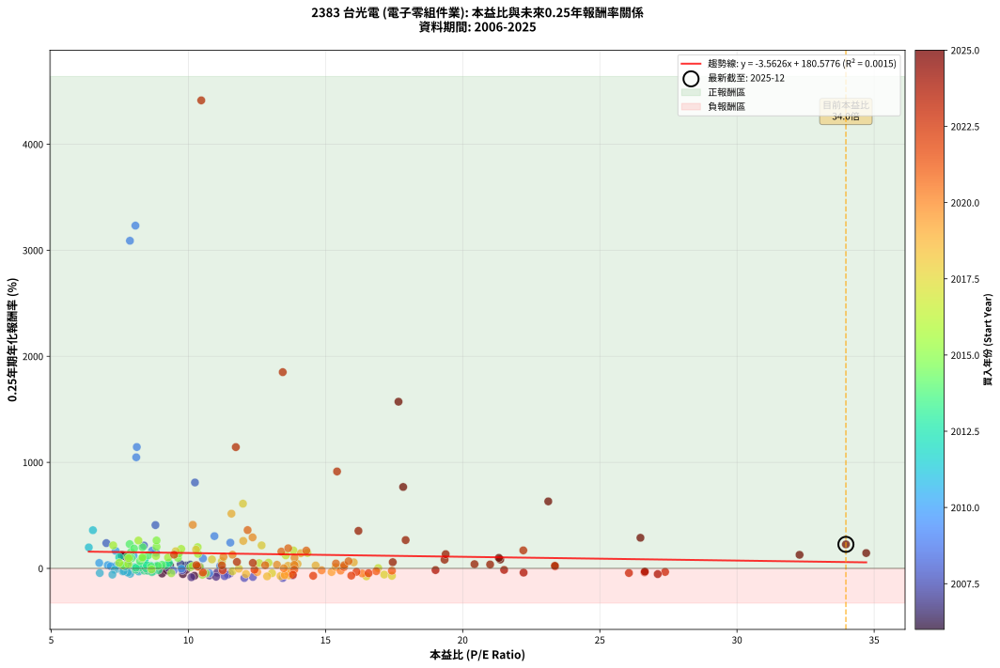
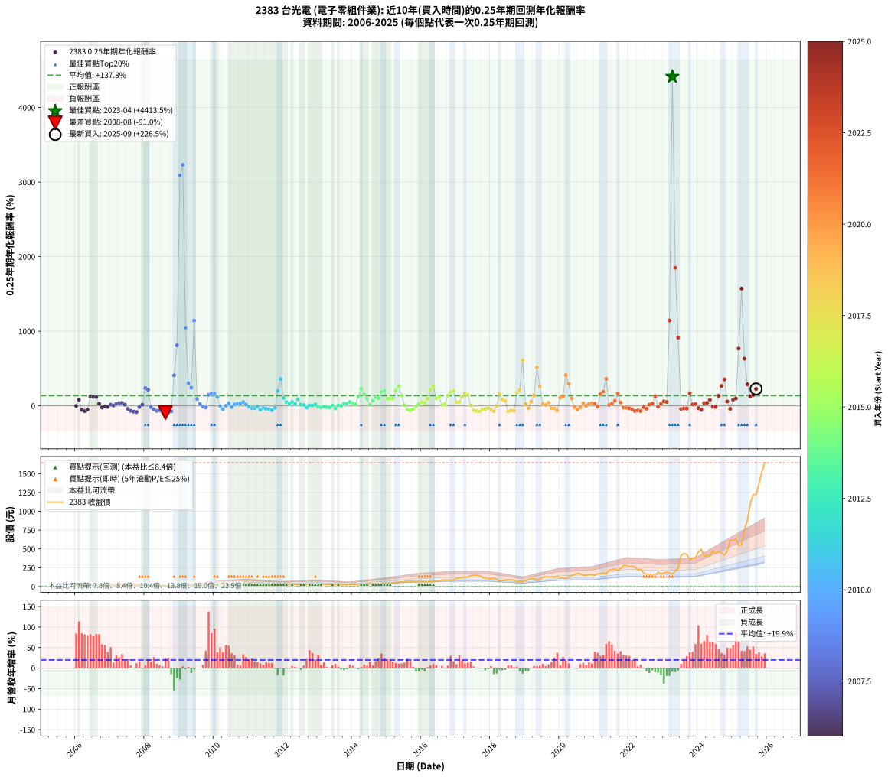

# 2383 台光電 - 本益比與未來報酬率分析

!!! info "報告資訊"
    - **股票代號**: 2383
    - **公司名稱**: 台光電
    - **產業別**: 電子零組件業
    - **分析期間**: 2006-2025 (237 個數據點)
    - **資料來源**: Type 12 (ShowMonthlyK_ChartFlow) 月收盤價與本益比
    - **報酬率口徑**: 含現金股利 (簡化: 年度合計，假設每年7/1入帳)
    - **報告生成時間**: 2026-01-06 22:35:52 CST

## 📈 視覺化圖表

### 圖表1: 本益比 vs 未來報酬率關係

*圖表1：2383 台光電 本益比與0.25年期未來報酬率關係 (2006-2025)*

### 圖表2: 歷年買入時點的0.25年期實際報酬率

*圖表2：2383 台光電 歷年買入時點的0.25年期實際報酬率 (2006-2025)*

## 📍 買點訊號說明

本報告提供兩種買點提示訊號（顯示於圖表2的股價子圖中）：

### ▲ 小綠色三角形（回測驗證）
- **計算方式**: 使用全部歷史資料計算本益比第25百分位數
- **用途**: 事後驗證，顯示歷史上哪些時點確實為低估區
- **限制**: 當下無法判斷，僅供回測參考
- **特性**: 後見之明（Look-Ahead Bias）

### ▲ 小橘色三角形（即時訊號）
- **計算方式**: 使用截至當月的過去5年資料計算本益比第25百分位數
- **用途**: 實際投資決策，當時即可判斷
- **優勢**: 可操作性強，符合實務需求
- **特性**: 無後見之明，滾動窗口計算

!!! tip "如何使用兩種訊號"
    - **綠色▲** 幫助理解歷史估值機會，驗證策略有效性
    - **橘色▲** 可作為實際買進參考，但仍需搭配基本面分析
    - 兩種訊號重疊時，表示即時判斷與事後驗證一致，信心度較高
    - 僅有綠色▲時，表示當時無法判斷（需要未來資料才能確認）
    - 僅有橘色▲時，表示即時判斷為買點，但事後可能不是最佳時機

## 📊 估值分析摘要

| 指標 | 數值 |
|:---:|:---:|
| **目前本益比** (2025-09) | **33.97 倍** |
| **歷史平均本益比** | 12.02 倍 |
| **估值水準** | 🔴 相對高估 |
| **預期0.25年年化報酬率** | **+59.56%** |
| **歷史平均報酬率** | +137.76% |
| **相關係數 (R²)** | 0.0015 |
| **趨勢線斜率** | -3.5626 |

!!! abstract "核心洞察"
    目前本益比顯著高於歷史平均，預期未來報酬率可能較低

    根據歷史數據回測，2383 台光電 在目前本益比 **34.0倍** 的估值水準下，
    預期未來0.25年年化報酬率約為 **+59.6%**。

    **重要提醒**: 本分析基於歷史數據統計，實際報酬率會受到公司基本面變化、產業趨勢、
    總體經濟環境等多重因素影響。R² = 0.00 表示本益比可解釋約 0.2% 的報酬率變異。

## 📈 歷史估值統計

### 最佳買點 (最高報酬率)

| 項目 | 數值 |
|:---:|:---:|
| 起始時間 | 2023-04 |
| 當時本益比 | 10.47 倍 |
| 起始價格 | 163.5 元 |
| 0.25年後價格 | 414.0 元 |
| **0.25年年化報酬率** | **+4413.52%** |

### 最差買點 (最低報酬率)

| 項目 | 數值 |
|:---:|:---:|
| 起始時間 | 2008-08 |
| 當時本益比 | 13.44 倍 |
| 起始價格 | 11.2 元 |
| 0.25年後價格 | 5.0 元 |
| **0.25年年化報酬率** | **-90.95%** |

## 🎯 投資啟示

### 本益比與報酬率關係

趨勢線方程式: **y = -3.5626x + 180.5776**

!!! warning "強負相關"
    本益比與未來報酬率呈現強負相關。在高本益比時期買入，未來報酬率顯著較低；
    在低本益比時期買入，未來報酬率顯著較高。**估值紀律至關重要**。

### 估值區間建議

基於歷史數據分析:

- **🟢 低估區** (P/E < 9.6): 預期報酬率較高，可考慮增加持股
- **🟡 合理區** (P/E 9.6-14.4): 預期報酬率符合長期趨勢，正常持有
- **🔴 高估區** (P/E > 14.4): 預期報酬率較低，可考慮減碼或觀望

!!! danger "風險提示"
    - 過去表現不代表未來結果
    - 本分析假設公司基本面無重大結構性變化
    - 產業環境劇變可能使歷史規律失效
    - 應結合公司財報、產業趨勢、總體經濟等多重因素綜合判斷

!!! success "長期投資觀點"
    歷史數據顯示，在合理或低估的估值水準買入並長期持有，
    往往能獲得較佳的投資報酬。**耐心等待好價格**是價值投資的核心原則。

## 📊 數據品質

- **資料來源**: GoodInfo.tw Type 12 (ShowMonthlyK_ChartFlow)
- **資料頻率**: 月度收盤價與本益比
- **回測期間**: 2006-2025
- **數據點數量**: 237 個 (每個點代表一次0.25年期回測)

### 計算方法說明

1. **0.25年期年化報酬率**:
   - 對每個歷史時點，計算其後0.25年的實際投資報酬率
   - 期末價值(不含股利): 期末價格
   - 期末價值(含現金股利): 期末價格 + 持有期間內的現金股利合計 (簡化: 年度合計，假設每年7/1入帳)
   - 公式: 年化報酬率 = [(期末價值/期初價格)^(1/年數) - 1] × 100%

2. **本益比 (P/E Ratio)**:
   - 使用當時的月收盤價與EPS計算
   - 資料來源: Type 12 月度河流圖本益比數據

3. **趨勢線 (Linear Regression)**:
   - 使用最小平方法擬合線性趨勢線
   - R²值衡量本益比對報酬率的解釋能力

---

*本報告由 Stock Analysis System v1.9.0 自動生成*
*數據更新時間: 2026-01-06 22:35:52 CST*

## 📋 月度回測明細表

（每一列對應時間線圖中的一個買入點；可用來對照 SVG 圖上的每個點。）

| 買入月份 | 賣出月份 | 回測期限_年 | 實際持有年數 | 買入本益比_倍 | 買入收盤價_元 | 賣出收盤價_元 | 現金股利合計_元 | 總報酬率_pct | 年化報酬率_pct |
| --- | --- | --- | --- | --- | --- | --- | --- | --- | --- |
| 2006-01 | 2006-05 | 0.25 | 0.329 | 9.07 | 16.15 | 16.10 | 0.00 | -0.31 | -0.94 |
| 2006-02 | 2006-05 | 0.25 | 0.246 | 7.81 | 13.90 | 16.10 | 0.00 | +15.83 | +81.54 |
| 2006-03 | 2006-07 | 0.25 | 0.334 | 9.80 | 17.45 | 13.50 | 0.00 | -22.64 | -53.62 |
| 2006-04 | 2006-07 | 0.25 | 0.249 | 10.22 | 18.20 | 13.50 | 0.00 | -25.82 | -69.85 |
| 2006-05 | 2006-08 | 0.25 | 0.252 | 9.04 | 16.10 | 13.60 | 0.00 | -15.53 | -48.83 |
| 2006-06 | 2006-09 | 0.25 | 0.252 | 7.58 | 13.50 | 16.60 | 0.00 | +22.96 | +127.20 |
| 2006-07 | 2006-10 | 0.25 | 0.252 | 7.58 | 13.50 | 16.45 | 0.00 | +21.85 | +119.16 |
| 2006-08 | 2006-12 | 0.25 | 0.334 | 7.64 | 13.60 | 17.65 | 0.00 | +29.78 | +118.23 |
| 2006-09 | 2006-12 | 0.25 | 0.249 | 9.33 | 16.60 | 17.65 | 0.00 | +6.33 | +27.91 |
| 2006-10 | 2007-01 | 0.25 | 0.252 | 9.24 | 16.45 | 15.50 | 0.00 | -5.78 | -21.03 |
| 2006-11 | 2007-03 | 0.25 | 0.329 | 9.80 | 17.45 | 17.00 | 0.00 | -2.58 | -7.64 |
| 2006-12 | 2007-03 | 0.25 | 0.246 | 9.92 | 17.65 | 17.00 | 0.00 | -3.68 | -14.13 |
| 2007-01 | 2007-05 | 0.25 | 0.329 | 8.82 | 15.50 | 16.25 | 0.00 | +4.84 | +15.47 |
| 2007-02 | 2007-05 | 0.25 | 0.246 | 9.27 | 16.10 | 16.25 | 0.00 | +0.93 | +3.84 |
| 2007-03 | 2007-07 | 0.25 | 0.334 | 9.91 | 17.00 | 18.00 | 0.39 | +8.19 | +26.57 |
| 2007-04 | 2007-07 | 0.25 | 0.249 | 10.07 | 17.05 | 18.00 | 0.39 | +7.87 | +35.54 |
| 2007-05 | 2007-08 | 0.25 | 0.252 | 9.72 | 16.25 | 17.30 | 0.39 | +8.87 | +40.15 |
| 2007-06 | 2007-09 | 0.25 | 0.252 | 10.42 | 17.20 | 17.45 | 0.39 | +3.73 | +15.66 |
| 2007-07 | 2007-10 | 0.25 | 0.252 | 11.05 | 18.00 | 15.80 | 0.00 | -12.22 | -40.40 |
| 2007-08 | 2007-12 | 0.25 | 0.334 | 10.77 | 17.30 | 11.90 | 0.00 | -31.21 | -67.38 |
| 2007-09 | 2007-12 | 0.25 | 0.249 | 11.01 | 17.45 | 11.90 | 0.00 | -31.81 | -78.49 |
| 2007-10 | 2008-01 | 0.25 | 0.252 | 10.11 | 15.80 | 10.05 | 0.00 | -36.39 | -83.41 |
| 2007-11 | 2008-03 | 0.25 | 0.331 | 8.50 | 13.10 | 12.35 | 0.00 | -5.73 | -16.30 |
| 2007-12 | 2008-03 | 0.25 | 0.249 | 7.83 | 11.90 | 12.35 | 0.00 | +3.78 | +16.07 |
| 2008-01 | 2008-05 | 0.25 | 0.331 | 7.01 | 10.05 | 15.05 | 0.00 | +49.75 | +238.35 |
| 2008-02 | 2008-05 | 0.25 | 0.249 | 8.38 | 11.30 | 15.05 | 0.00 | +33.19 | +215.89 |
| 2008-03 | 2008-07 | 0.25 | 0.334 | 9.78 | 12.35 | 11.35 | 0.20 | -6.46 | -18.13 |
| 2008-04 | 2008-07 | 0.25 | 0.249 | 11.52 | 13.55 | 11.35 | 0.20 | -14.75 | -47.29 |
| 2008-05 | 2008-08 | 0.25 | 0.252 | 13.80 | 15.05 | 11.20 | 0.20 | -24.24 | -66.78 |
| 2008-06 | 2008-09 | 0.25 | 0.252 | 11.44 | 11.50 | 9.00 | 0.20 | -19.98 | -58.73 |
| 2008-07 | 2008-10 | 0.25 | 0.252 | 12.35 | 11.35 | 7.49 | 0.00 | -34.01 | -80.80 |
| 2008-08 | 2008-12 | 0.25 | 0.334 | 13.44 | 11.20 | 5.02 | 0.00 | -55.18 | -90.95 |
| 2008-09 | 2008-12 | 0.25 | 0.249 | 12.04 | 9.00 | 5.02 | 0.00 | -44.22 | -90.40 |
| 2008-10 | 2009-01 | 0.25 | 0.252 | 11.32 | 7.49 | 5.37 | 0.00 | -28.30 | -73.31 |
| 2008-11 | 2009-03 | 0.25 | 0.329 | 8.80 | 5.07 | 8.65 | 0.00 | +70.61 | +408.36 |
| 2008-12 | 2009-03 | 0.25 | 0.246 | 10.24 | 5.02 | 8.65 | 0.00 | +72.31 | +809.99 |
| 2009-01 | 2009-05 | 0.25 | 0.329 | 7.87 | 5.37 | 16.75 | 0.00 | +211.92 | +3089.60 |
| 2009-02 | 2009-05 | 0.25 | 0.246 | 8.07 | 7.06 | 16.75 | 0.00 | +137.25 | +3232.17 |
| 2009-03 | 2009-07 | 0.25 | 0.334 | 8.10 | 8.65 | 19.35 | 0.19 | +125.94 | +1047.67 |
| 2009-04 | 2009-07 | 0.25 | 0.249 | 10.95 | 13.80 | 19.35 | 0.19 | +41.62 | +304.22 |
| 2009-05 | 2009-08 | 0.25 | 0.252 | 11.53 | 16.75 | 22.65 | 0.19 | +36.38 | +242.77 |
| 2009-06 | 2009-09 | 0.25 | 0.252 | 8.12 | 13.35 | 25.00 | 0.19 | +88.72 | +1144.57 |
| 2009-07 | 2009-10 | 0.25 | 0.252 | 10.53 | 19.35 | 22.85 | 0.00 | +18.09 | +93.49 |
| 2009-08 | 2009-12 | 0.25 | 0.334 | 11.16 | 22.65 | 24.30 | 0.00 | +7.28 | +23.43 |
| 2009-09 | 2009-12 | 0.25 | 0.249 | 11.25 | 25.00 | 24.30 | 0.00 | -2.80 | -10.77 |
| 2009-10 | 2010-01 | 0.25 | 0.252 | 9.46 | 22.85 | 21.50 | 0.00 | -5.91 | -21.48 |
| 2009-11 | 2010-03 | 0.25 | 0.329 | 8.82 | 23.00 | 30.95 | 0.00 | +34.57 | +146.85 |
| 2009-12 | 2010-03 | 0.25 | 0.246 | 8.68 | 24.30 | 30.95 | 0.00 | +27.37 | +166.90 |
| 2010-01 | 2010-05 | 0.25 | 0.329 | 7.35 | 21.50 | 29.60 | 0.00 | +37.67 | +164.63 |
| 2010-02 | 2010-05 | 0.25 | 0.246 | 8.00 | 24.40 | 29.60 | 0.00 | +21.31 | +119.03 |
| 2010-03 | 2010-07 | 0.25 | 0.334 | 9.75 | 30.95 | 29.90 | 0.70 | -1.14 | -3.38 |
| 2010-04 | 2010-07 | 0.25 | 0.249 | 10.77 | 35.55 | 29.90 | 0.70 | -13.93 | -45.24 |
| 2010-05 | 2010-08 | 0.25 | 0.252 | 8.64 | 29.60 | 28.95 | 0.70 | +0.16 | +0.63 |
| 2010-06 | 2010-09 | 0.25 | 0.252 | 7.79 | 27.65 | 29.00 | 0.70 | +7.40 | +32.78 |
| 2010-07 | 2010-10 | 0.25 | 0.252 | 8.14 | 29.90 | 28.60 | 0.00 | -4.35 | -16.18 |
| 2010-08 | 2010-12 | 0.25 | 0.334 | 7.62 | 28.95 | 30.85 | 0.00 | +6.56 | +20.96 |
| 2010-09 | 2010-12 | 0.25 | 0.249 | 7.39 | 29.00 | 30.85 | 0.00 | +6.38 | +28.17 |
| 2010-10 | 2011-01 | 0.25 | 0.252 | 7.06 | 28.60 | 30.60 | 0.00 | +6.99 | +30.78 |
| 2010-11 | 2011-03 | 0.25 | 0.329 | 6.75 | 28.20 | 32.30 | 0.00 | +14.54 | +51.16 |
| 2010-12 | 2011-03 | 0.25 | 0.246 | 7.17 | 30.85 | 32.30 | 0.00 | +4.70 | +20.49 |
| 2011-01 | 2011-05 | 0.25 | 0.329 | 7.32 | 30.60 | 29.20 | 0.00 | -4.58 | -13.28 |
| 2011-02 | 2011-05 | 0.25 | 0.246 | 7.87 | 31.95 | 29.20 | 0.00 | -8.61 | -30.60 |
| 2011-03 | 2011-07 | 0.25 | 0.334 | 8.19 | 32.30 | 27.00 | 1.73 | -11.06 | -29.58 |
| 2011-04 | 2011-07 | 0.25 | 0.249 | 7.72 | 29.50 | 27.00 | 1.73 | -2.61 | -10.08 |
| 2011-05 | 2011-08 | 0.25 | 0.252 | 7.88 | 29.20 | 22.65 | 1.73 | -16.51 | -51.15 |
| 2011-06 | 2011-09 | 0.25 | 0.252 | 7.60 | 27.25 | 23.35 | 1.73 | -7.97 | -28.08 |
| 2011-07 | 2011-10 | 0.25 | 0.252 | 7.79 | 27.00 | 23.75 | 0.00 | -12.04 | -39.90 |
| 2011-08 | 2011-12 | 0.25 | 0.334 | 6.77 | 22.65 | 18.70 | 0.00 | -17.44 | -43.66 |
| 2011-09 | 2011-12 | 0.25 | 0.249 | 7.23 | 23.35 | 18.70 | 0.00 | -19.91 | -58.99 |
| 2011-10 | 2012-01 | 0.25 | 0.252 | 7.64 | 23.75 | 22.00 | 0.00 | -7.37 | -26.20 |
| 2011-11 | 2012-03 | 0.25 | 0.331 | 6.37 | 19.05 | 27.35 | 0.00 | +43.57 | +197.93 |
| 2011-12 | 2012-03 | 0.25 | 0.249 | 6.52 | 18.70 | 27.35 | 0.00 | +46.26 | +359.97 |
| 2012-01 | 2012-05 | 0.25 | 0.331 | 7.48 | 22.00 | 27.90 | 0.00 | +26.82 | +104.86 |
| 2012-02 | 2012-05 | 0.25 | 0.249 | 8.36 | 25.20 | 27.90 | 0.00 | +10.71 | +50.46 |
| 2012-03 | 2012-07 | 0.25 | 0.334 | 8.86 | 27.35 | 27.70 | 1.80 | +7.85 | +25.40 |
| 2012-04 | 2012-07 | 0.25 | 0.249 | 8.40 | 26.55 | 27.70 | 1.80 | +11.10 | +52.60 |
| 2012-05 | 2012-08 | 0.25 | 0.252 | 8.63 | 27.90 | 27.70 | 1.80 | +5.73 | +24.75 |
| 2012-06 | 2012-09 | 0.25 | 0.252 | 8.41 | 27.80 | 30.80 | 1.80 | +17.26 | +88.16 |
| 2012-07 | 2012-10 | 0.25 | 0.252 | 8.20 | 27.70 | 28.90 | 0.00 | +4.33 | +18.34 |
| 2012-08 | 2012-12 | 0.25 | 0.334 | 8.03 | 27.70 | 28.75 | 0.00 | +3.79 | +11.78 |
| 2012-09 | 2012-12 | 0.25 | 0.249 | 8.74 | 30.80 | 28.75 | 0.00 | -6.66 | -24.15 |
| 2012-10 | 2013-01 | 0.25 | 0.252 | 8.04 | 28.90 | 29.50 | 0.00 | +2.08 | +8.50 |
| 2012-11 | 2013-03 | 0.25 | 0.329 | 8.06 | 29.55 | 30.00 | 0.00 | +1.52 | +4.71 |
| 2012-12 | 2013-03 | 0.25 | 0.246 | 7.69 | 28.75 | 30.00 | 0.00 | +4.35 | +18.85 |
| 2013-01 | 2013-05 | 0.25 | 0.329 | 8.08 | 29.50 | 28.15 | 0.00 | -4.58 | -13.29 |
| 2013-02 | 2013-05 | 0.25 | 0.246 | 8.39 | 29.90 | 28.15 | 0.00 | -5.85 | -21.71 |
| 2013-03 | 2013-07 | 0.25 | 0.334 | 8.63 | 30.00 | 27.10 | 1.79 | -3.69 | -10.64 |
| 2013-04 | 2013-07 | 0.25 | 0.249 | 8.91 | 30.20 | 27.10 | 1.79 | -4.32 | -16.26 |
| 2013-05 | 2013-08 | 0.25 | 0.252 | 8.52 | 28.15 | 24.60 | 1.79 | -6.24 | -22.56 |
| 2013-06 | 2013-09 | 0.25 | 0.252 | 8.21 | 26.40 | 24.95 | 1.79 | +1.30 | +5.27 |
| 2013-07 | 2013-10 | 0.25 | 0.252 | 8.67 | 27.10 | 24.30 | 0.00 | -10.33 | -35.14 |
| 2013-08 | 2013-12 | 0.25 | 0.334 | 8.09 | 24.60 | 25.00 | 0.00 | +1.63 | +4.95 |
| 2013-09 | 2013-12 | 0.25 | 0.249 | 8.45 | 24.95 | 25.00 | 0.00 | +0.20 | +0.81 |
| 2013-10 | 2014-01 | 0.25 | 0.252 | 8.48 | 24.30 | 26.00 | 0.00 | +7.00 | +30.79 |
| 2013-11 | 2014-03 | 0.25 | 0.329 | 9.18 | 25.50 | 27.70 | 0.00 | +8.63 | +28.64 |
| 2013-12 | 2014-03 | 0.25 | 0.246 | 9.29 | 25.00 | 27.70 | 0.00 | +10.80 | +51.62 |
| 2014-01 | 2014-05 | 0.25 | 0.329 | 9.04 | 26.00 | 28.60 | 0.00 | +10.00 | +33.66 |
| 2014-02 | 2014-05 | 0.25 | 0.246 | 8.89 | 27.20 | 28.60 | 0.00 | +5.15 | +22.59 |
| 2014-03 | 2014-07 | 0.25 | 0.334 | 8.54 | 27.70 | 34.45 | 1.80 | +30.86 | +123.71 |
| 2014-04 | 2014-07 | 0.25 | 0.249 | 7.86 | 26.95 | 34.45 | 1.80 | +34.50 | +228.60 |
| 2014-05 | 2014-08 | 0.25 | 0.252 | 7.91 | 28.60 | 34.35 | 1.80 | +26.39 | +153.42 |
| 2014-06 | 2014-09 | 0.25 | 0.252 | 7.93 | 30.15 | 33.90 | 1.80 | +18.40 | +95.54 |
| 2014-07 | 2014-10 | 0.25 | 0.252 | 8.64 | 34.45 | 35.75 | 0.00 | +3.77 | +15.84 |
| 2014-08 | 2014-12 | 0.25 | 0.334 | 8.24 | 34.35 | 40.90 | 0.00 | +19.07 | +68.63 |
| 2014-09 | 2014-12 | 0.25 | 0.249 | 7.78 | 33.90 | 40.90 | 0.00 | +20.65 | +112.43 |
| 2014-10 | 2015-01 | 0.25 | 0.252 | 7.87 | 35.75 | 42.65 | 0.00 | +19.30 | +101.50 |
| 2014-11 | 2015-03 | 0.25 | 0.329 | 8.02 | 37.90 | 53.60 | 0.00 | +41.42 | +187.19 |
| 2014-12 | 2015-03 | 0.25 | 0.246 | 8.33 | 40.90 | 53.60 | 0.00 | +31.05 | +199.65 |
| 2015-01 | 2015-05 | 0.25 | 0.329 | 8.31 | 42.65 | 53.10 | 0.00 | +24.50 | +94.85 |
| 2015-02 | 2015-05 | 0.25 | 0.246 | 8.33 | 44.55 | 53.10 | 0.00 | +19.19 | +103.91 |
| 2015-03 | 2015-07 | 0.25 | 0.334 | 9.62 | 53.60 | 65.00 | 2.50 | +25.93 | +99.40 |
| 2015-04 | 2015-07 | 0.25 | 0.249 | 8.84 | 51.20 | 65.00 | 2.50 | +31.83 | +203.17 |
| 2015-05 | 2015-08 | 0.25 | 0.252 | 8.84 | 53.10 | 71.00 | 2.50 | +38.41 | +263.46 |
| 2015-06 | 2015-09 | 0.25 | 0.252 | 9.65 | 60.10 | 72.40 | 2.50 | +24.62 | +139.60 |
| 2015-07 | 2015-10 | 0.25 | 0.252 | 10.08 | 65.00 | 66.70 | 0.00 | +2.62 | +10.79 |
| 2015-08 | 2015-12 | 0.25 | 0.334 | 10.64 | 71.00 | 57.50 | 0.00 | -19.01 | -46.81 |
| 2015-09 | 2015-12 | 0.25 | 0.249 | 10.51 | 72.40 | 57.50 | 0.00 | -20.58 | -60.34 |
| 2015-10 | 2016-01 | 0.25 | 0.252 | 9.38 | 66.70 | 57.20 | 0.00 | -14.24 | -45.67 |
| 2015-11 | 2016-03 | 0.25 | 0.331 | 8.66 | 63.50 | 61.30 | 0.00 | -3.46 | -10.10 |
| 2015-12 | 2016-03 | 0.25 | 0.249 | 7.62 | 57.50 | 61.30 | 0.00 | +6.61 | +29.29 |
| 2016-01 | 2016-05 | 0.25 | 0.331 | 7.48 | 57.20 | 65.70 | 0.00 | +14.86 | +51.92 |
| 2016-02 | 2016-05 | 0.25 | 0.249 | 7.81 | 60.50 | 65.70 | 0.00 | +8.60 | +39.23 |
| 2016-03 | 2016-07 | 0.25 | 0.334 | 7.82 | 61.30 | 72.50 | 4.29 | +25.27 | +96.31 |
| 2016-04 | 2016-07 | 0.25 | 0.249 | 7.26 | 57.60 | 72.50 | 4.29 | +33.32 | +217.15 |
| 2016-05 | 2016-08 | 0.25 | 0.252 | 8.18 | 65.70 | 86.60 | 4.29 | +38.34 | +262.75 |
| 2016-06 | 2016-09 | 0.25 | 0.252 | 9.26 | 75.20 | 85.50 | 4.29 | +19.40 | +102.19 |
| 2016-07 | 2016-10 | 0.25 | 0.252 | 8.82 | 72.50 | 88.10 | 0.00 | +21.52 | +116.78 |
| 2016-08 | 2016-12 | 0.25 | 0.334 | 10.41 | 86.60 | 90.00 | 0.00 | +3.93 | +12.22 |
| 2016-09 | 2016-12 | 0.25 | 0.249 | 10.16 | 85.50 | 90.00 | 0.00 | +5.26 | +22.86 |
| 2016-10 | 2017-01 | 0.25 | 0.252 | 10.35 | 88.10 | 109.50 | 0.00 | +24.29 | +137.10 |
| 2016-11 | 2017-03 | 0.25 | 0.329 | 9.74 | 83.80 | 118.00 | 0.00 | +40.81 | +183.41 |
| 2016-12 | 2017-03 | 0.25 | 0.246 | 10.34 | 90.00 | 118.00 | 0.00 | +31.11 | +200.21 |
| 2017-01 | 2017-05 | 0.25 | 0.329 | 12.58 | 109.50 | 125.00 | 0.00 | +14.16 | +49.62 |
| 2017-02 | 2017-05 | 0.25 | 0.246 | 12.92 | 112.50 | 125.00 | 0.00 | +11.11 | +53.36 |
| 2017-03 | 2017-07 | 0.25 | 0.334 | 13.55 | 118.00 | 149.50 | 4.70 | +30.68 | +122.78 |
| 2017-04 | 2017-07 | 0.25 | 0.249 | 13.83 | 120.50 | 149.50 | 4.70 | +27.97 | +169.05 |
| 2017-05 | 2017-08 | 0.25 | 0.252 | 14.34 | 125.00 | 152.00 | 4.70 | +25.36 | +145.29 |
| 2017-06 | 2017-09 | 0.25 | 0.252 | 16.92 | 147.50 | 144.00 | 4.70 | +0.81 | +3.26 |
| 2017-07 | 2017-10 | 0.25 | 0.252 | 17.14 | 149.50 | 120.00 | 0.00 | -19.73 | -58.22 |
| 2017-08 | 2017-12 | 0.25 | 0.334 | 17.42 | 152.00 | 101.50 | 0.00 | -33.22 | -70.15 |
| 2017-09 | 2017-12 | 0.25 | 0.249 | 16.49 | 144.00 | 101.50 | 0.00 | -29.51 | -75.43 |
| 2017-10 | 2018-01 | 0.25 | 0.252 | 13.74 | 120.00 | 102.50 | 0.00 | -14.58 | -46.52 |
| 2017-11 | 2018-03 | 0.25 | 0.329 | 13.05 | 114.00 | 93.80 | 0.00 | -17.72 | -44.77 |
| 2017-12 | 2018-03 | 0.25 | 0.246 | 11.61 | 101.50 | 93.80 | 0.00 | -7.59 | -27.40 |
| 2018-01 | 2018-05 | 0.25 | 0.329 | 12.10 | 102.50 | 80.20 | 0.00 | -21.76 | -52.61 |
| 2018-02 | 2018-05 | 0.25 | 0.246 | 13.36 | 109.50 | 80.20 | 0.00 | -26.76 | -71.74 |
| 2018-03 | 2018-07 | 0.25 | 0.334 | 11.84 | 93.80 | 88.00 | 4.80 | -1.07 | -3.16 |
| 2018-04 | 2018-07 | 0.25 | 0.249 | 9.54 | 73.00 | 88.00 | 4.80 | +27.12 | +162.02 |
| 2018-05 | 2018-08 | 0.25 | 0.252 | 10.86 | 80.20 | 88.80 | 4.80 | +16.71 | +84.67 |
| 2018-06 | 2018-09 | 0.25 | 0.252 | 11.22 | 79.80 | 86.00 | 4.80 | +13.78 | +66.98 |
| 2018-07 | 2018-10 | 0.25 | 0.252 | 12.87 | 88.00 | 61.90 | 0.00 | -29.66 | -75.26 |
| 2018-08 | 2018-12 | 0.25 | 0.334 | 13.52 | 88.80 | 65.70 | 0.00 | -26.01 | -59.42 |
| 2018-09 | 2018-12 | 0.25 | 0.249 | 13.66 | 86.00 | 65.70 | 0.00 | -23.60 | -66.06 |
| 2018-10 | 2019-01 | 0.25 | 0.252 | 10.28 | 61.90 | 80.00 | 0.00 | +29.24 | +176.86 |
| 2018-11 | 2019-03 | 0.25 | 0.329 | 12.67 | 72.90 | 106.50 | 0.00 | +46.09 | +217.01 |
| 2018-12 | 2019-03 | 0.25 | 0.246 | 11.99 | 65.70 | 106.50 | 0.00 | +62.10 | +610.19 |
| 2019-01 | 2019-05 | 0.25 | 0.329 | 13.63 | 80.00 | 85.90 | 0.00 | +7.38 | +24.18 |
| 2019-02 | 2019-05 | 0.25 | 0.246 | 15.22 | 95.20 | 85.90 | 0.00 | -9.77 | -34.11 |
| 2019-03 | 2019-07 | 0.25 | 0.334 | 16.03 | 106.50 | 120.00 | 3.80 | +16.24 | +56.93 |
| 2019-04 | 2019-07 | 0.25 | 0.249 | 14.10 | 99.20 | 120.00 | 3.80 | +24.80 | +143.31 |
| 2019-05 | 2019-08 | 0.25 | 0.252 | 11.57 | 85.90 | 132.00 | 3.80 | +58.09 | +516.14 |
| 2019-06 | 2019-09 | 0.25 | 0.252 | 12.00 | 93.70 | 125.50 | 3.80 | +37.99 | +259.13 |
| 2019-07 | 2019-10 | 0.25 | 0.252 | 14.64 | 120.00 | 127.50 | 0.00 | +6.25 | +27.21 |
| 2019-08 | 2019-12 | 0.25 | 0.334 | 15.37 | 132.00 | 137.00 | 0.00 | +3.79 | +11.77 |
| 2019-09 | 2019-12 | 0.25 | 0.249 | 13.98 | 125.50 | 137.00 | 0.00 | +9.16 | +42.18 |
| 2019-10 | 2020-01 | 0.25 | 0.252 | 13.62 | 127.50 | 115.50 | 0.00 | -9.41 | -32.46 |
| 2019-11 | 2020-03 | 0.25 | 0.331 | 12.51 | 122.00 | 106.00 | 0.00 | -13.11 | -34.58 |
| 2019-12 | 2020-03 | 0.25 | 0.249 | 13.51 | 137.00 | 106.00 | 0.00 | -22.63 | -64.29 |
| 2020-01 | 2020-05 | 0.25 | 0.331 | 11.28 | 115.50 | 147.50 | 0.00 | +27.71 | +109.22 |
| 2020-02 | 2020-05 | 0.25 | 0.249 | 11.61 | 120.00 | 147.50 | 0.00 | +22.92 | +128.91 |
| 2020-03 | 2020-07 | 0.25 | 0.334 | 10.16 | 106.00 | 177.00 | 5.76 | +72.42 | +410.84 |
| 2020-04 | 2020-07 | 0.25 | 0.249 | 12.34 | 130.00 | 177.00 | 5.76 | +40.59 | +292.47 |
| 2020-05 | 2020-08 | 0.25 | 0.252 | 13.87 | 147.50 | 170.00 | 5.76 | +19.16 | +100.57 |
| 2020-06 | 2020-09 | 0.25 | 0.252 | 14.86 | 159.50 | 146.00 | 5.76 | -4.85 | -17.92 |
| 2020-07 | 2020-10 | 0.25 | 0.252 | 16.34 | 177.00 | 150.00 | 0.00 | -15.25 | -48.17 |
| 2020-08 | 2020-12 | 0.25 | 0.334 | 15.55 | 170.00 | 157.00 | 0.00 | -7.65 | -21.19 |
| 2020-09 | 2020-12 | 0.25 | 0.249 | 13.23 | 146.00 | 157.00 | 0.00 | +7.53 | +33.85 |
| 2020-10 | 2021-01 | 0.25 | 0.252 | 13.48 | 150.00 | 150.50 | 0.00 | +0.33 | +1.33 |
| 2020-11 | 2021-03 | 0.25 | 0.329 | 13.89 | 156.00 | 169.00 | 0.00 | +8.33 | +27.59 |
| 2020-12 | 2021-03 | 0.25 | 0.246 | 13.86 | 157.00 | 169.00 | 0.00 | +7.64 | +34.84 |
| 2021-01 | 2021-05 | 0.25 | 0.329 | 12.80 | 150.50 | 164.00 | 0.00 | +8.97 | +29.88 |
| 2021-02 | 2021-05 | 0.25 | 0.246 | 13.86 | 169.00 | 164.00 | 0.00 | -2.96 | -11.47 |
| 2021-03 | 2021-07 | 0.25 | 0.334 | 13.39 | 169.00 | 225.00 | 7.00 | +37.28 | +158.20 |
| 2021-04 | 2021-07 | 0.25 | 0.249 | 13.64 | 178.00 | 225.00 | 7.00 | +30.34 | +189.64 |
| 2021-05 | 2021-08 | 0.25 | 0.252 | 12.16 | 164.00 | 234.00 | 7.00 | +46.95 | +360.99 |
| 2021-06 | 2021-09 | 0.25 | 0.252 | 15.67 | 218.00 | 217.50 | 7.00 | +2.98 | +12.37 |
| 2021-07 | 2021-10 | 0.25 | 0.252 | 15.68 | 225.00 | 240.50 | 0.00 | +6.89 | +30.28 |
| 2021-08 | 2021-12 | 0.25 | 0.334 | 15.84 | 234.00 | 278.00 | 0.00 | +18.80 | +67.50 |
| 2021-09 | 2021-12 | 0.25 | 0.249 | 14.30 | 217.50 | 278.00 | 0.00 | +27.82 | +167.80 |
| 2021-10 | 2022-01 | 0.25 | 0.252 | 15.38 | 240.50 | 264.50 | 0.00 | +9.98 | +45.88 |
| 2021-11 | 2022-03 | 0.25 | 0.329 | 17.42 | 280.00 | 258.00 | 0.00 | -7.86 | -22.05 |
| 2021-12 | 2022-03 | 0.25 | 0.246 | 16.85 | 278.00 | 258.00 | 0.00 | -7.19 | -26.14 |
| 2022-01 | 2022-05 | 0.25 | 0.329 | 16.13 | 264.50 | 232.50 | 0.00 | -12.10 | -32.46 |
| 2022-02 | 2022-05 | 0.25 | 0.246 | 16.57 | 270.00 | 232.50 | 0.00 | -13.89 | -45.49 |
| 2022-03 | 2022-07 | 0.25 | 0.334 | 15.94 | 258.00 | 166.00 | 10.00 | -31.78 | -68.18 |
| 2022-04 | 2022-07 | 0.25 | 0.249 | 13.81 | 222.00 | 166.00 | 10.00 | -20.72 | -60.62 |
| 2022-05 | 2022-08 | 0.25 | 0.252 | 14.55 | 232.50 | 162.00 | 10.00 | -26.02 | -69.78 |
| 2022-06 | 2022-09 | 0.25 | 0.252 | 11.25 | 178.50 | 160.00 | 10.00 | -4.76 | -17.61 |
| 2022-07 | 2022-10 | 0.25 | 0.252 | 10.53 | 166.00 | 146.50 | 0.00 | -11.75 | -39.11 |
| 2022-08 | 2022-12 | 0.25 | 0.334 | 10.34 | 162.00 | 171.00 | 0.00 | +5.56 | +17.57 |
| 2022-09 | 2022-12 | 0.25 | 0.249 | 10.29 | 160.00 | 171.00 | 0.00 | +6.88 | +30.59 |
| 2022-10 | 2023-01 | 0.25 | 0.252 | 9.48 | 146.50 | 180.50 | 0.00 | +23.21 | +129.01 |
| 2022-11 | 2023-03 | 0.25 | 0.329 | 12.41 | 190.50 | 182.00 | 0.00 | -4.46 | -12.97 |
| 2022-12 | 2023-03 | 0.25 | 0.246 | 11.22 | 171.00 | 182.00 | 0.00 | +6.43 | +28.79 |
| 2023-01 | 2023-05 | 0.25 | 0.329 | 11.77 | 180.50 | 211.00 | 0.00 | +16.90 | +60.84 |
| 2023-02 | 2023-05 | 0.25 | 0.246 | 12.35 | 190.50 | 211.00 | 0.00 | +10.76 | +51.40 |
| 2023-03 | 2023-07 | 0.25 | 0.334 | 11.73 | 182.00 | 414.00 | 8.41 | +132.09 | +1143.74 |
| 2023-04 | 2023-07 | 0.25 | 0.249 | 10.47 | 163.50 | 414.00 | 8.41 | +158.35 | +4413.52 |
| 2023-05 | 2023-08 | 0.25 | 0.252 | 13.44 | 211.00 | 437.50 | 8.41 | +111.33 | +1850.45 |
| 2023-06 | 2023-09 | 0.25 | 0.252 | 15.42 | 243.50 | 428.00 | 8.41 | +79.22 | +913.90 |
| 2023-07 | 2023-10 | 0.25 | 0.252 | 26.06 | 414.00 | 359.00 | 0.00 | -13.29 | -43.22 |
| 2023-08 | 2023-12 | 0.25 | 0.334 | 27.38 | 437.50 | 382.00 | 0.00 | -12.69 | -33.38 |
| 2023-09 | 2023-12 | 0.25 | 0.249 | 26.63 | 428.00 | 382.00 | 0.00 | -10.75 | -36.64 |
| 2023-10 | 2024-01 | 0.25 | 0.252 | 22.21 | 359.00 | 461.00 | 0.00 | +28.41 | +169.89 |
| 2023-11 | 2024-03 | 0.25 | 0.331 | 23.37 | 380.00 | 403.50 | 0.00 | +6.18 | +19.86 |
| 2023-12 | 2024-03 | 0.25 | 0.249 | 23.36 | 382.00 | 403.50 | 0.00 | +5.63 | +24.58 |
| 2024-01 | 2024-05 | 0.25 | 0.331 | 26.64 | 461.00 | 408.50 | 0.00 | -11.39 | -30.58 |
| 2024-02 | 2024-05 | 0.25 | 0.249 | 27.11 | 495.00 | 408.50 | 0.00 | -17.47 | -53.74 |
| 2024-03 | 2024-07 | 0.25 | 0.334 | 21.00 | 403.50 | 438.00 | 9.98 | +11.02 | +36.76 |
| 2024-04 | 2024-07 | 0.25 | 0.249 | 20.43 | 412.00 | 438.00 | 9.98 | +8.73 | +39.94 |
| 2024-05 | 2024-08 | 0.25 | 0.252 | 19.34 | 408.50 | 465.00 | 9.98 | +16.27 | +81.96 |
| 2024-06 | 2024-09 | 0.25 | 0.252 | 21.51 | 475.00 | 447.00 | 9.98 | -3.79 | -14.23 |
| 2024-07 | 2024-10 | 0.25 | 0.252 | 19.01 | 438.00 | 419.50 | 0.00 | -4.22 | -15.75 |
| 2024-08 | 2024-12 | 0.25 | 0.334 | 19.38 | 465.00 | 618.00 | 0.00 | +32.90 | +134.34 |
| 2024-09 | 2024-12 | 0.25 | 0.249 | 17.92 | 447.00 | 618.00 | 0.00 | +38.26 | +266.99 |
| 2024-10 | 2025-01 | 0.25 | 0.252 | 16.20 | 419.50 | 614.00 | 0.00 | +46.36 | +353.73 |
| 2024-11 | 2025-03 | 0.25 | 0.329 | 17.45 | 468.50 | 545.00 | 0.00 | +16.33 | +58.47 |
| 2024-12 | 2025-03 | 0.25 | 0.246 | 22.22 | 618.00 | 545.00 | 0.00 | -11.81 | -39.96 |
| 2025-01 | 2025-05 | 0.25 | 0.329 | 21.37 | 614.00 | 749.00 | 0.00 | +21.99 | +83.11 |
| 2025-02 | 2025-05 | 0.25 | 0.246 | 21.32 | 632.00 | 749.00 | 0.00 | +18.51 | +99.23 |
| 2025-03 | 2025-07 | 0.25 | 0.334 | 17.83 | 545.00 | 1105.00 | 16.58 | +105.79 | +767.71 |
| 2025-04 | 2025-07 | 0.25 | 0.249 | 17.66 | 556.00 | 1105.00 | 16.58 | +101.72 | +1571.89 |
| 2025-05 | 2025-08 | 0.25 | 0.252 | 23.12 | 749.00 | 1220.00 | 16.58 | +65.10 | +631.90 |
| 2025-06 | 2025-09 | 0.25 | 0.252 | 26.48 | 882.00 | 1225.00 | 16.58 | +40.77 | +288.67 |
| 2025-07 | 2025-10 | 0.25 | 0.252 | 32.28 | 1105.00 | 1360.00 | 0.00 | +23.08 | +128.04 |
| 2025-08 | 2025-12 | 0.25 | 0.334 | 34.71 | 1220.00 | 1645.00 | 0.00 | +34.84 | +144.69 |
| 2025-09 | 2025-12 | 0.25 | 0.249 | 33.97 | 1225.00 | 1645.00 | 0.00 | +34.29 | +226.50 |
