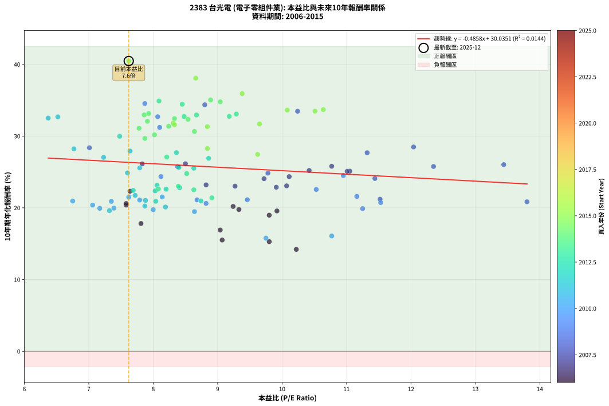
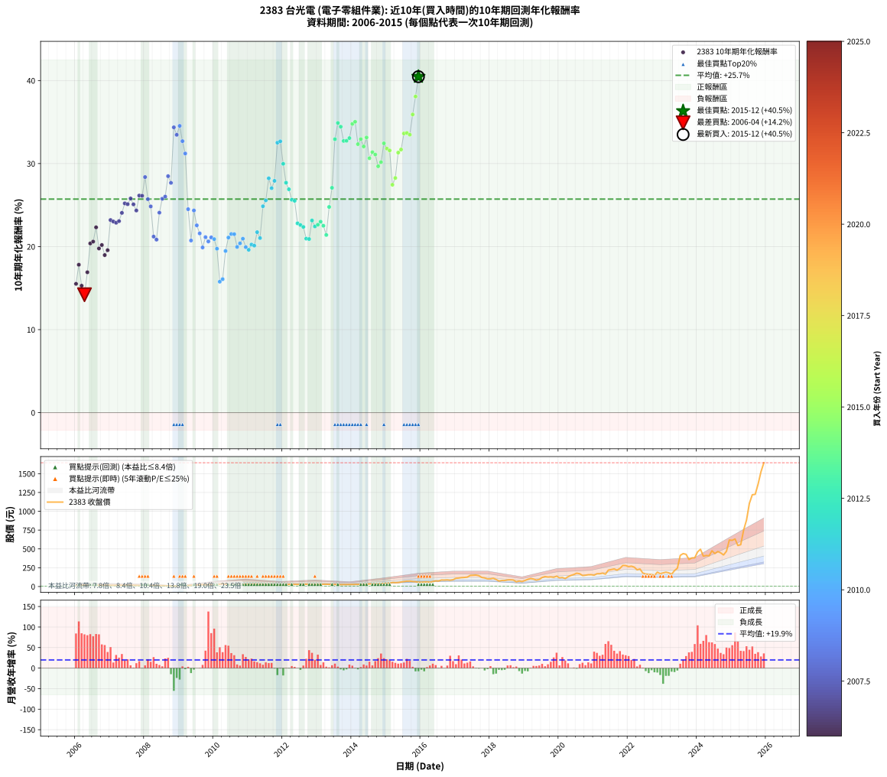

# 2383 台光電 - 本益比與未來報酬率分析

!!! info "報告資訊"
    - **股票代號**: 2383
    - **公司名稱**: 台光電
    - **產業別**: 電子零組件業
    - **分析期間**: 2006-2015 (120 個數據點)
    - **資料來源**: Type 12 (ShowMonthlyK_ChartFlow) 月收盤價與本益比
    - **報酬率口徑**: 含現金股利 (簡化: 年度合計，假設每年7/1入帳)
    - **報告生成時間**: 2026-01-09 20:44:13 CST

## 📈 視覺化圖表

### 圖表1: 本益比 vs 未來報酬率關係

*圖表1：2383 台光電 本益比與10年期未來報酬率關係 (2006-2015)*

### 圖表2: 歷年買入時點的10年期實際報酬率

*圖表2：2383 台光電 歷年買入時點的10年期實際報酬率 (2006-2015)*

## 📍 買點訊號說明

本報告提供兩種買點提示訊號（顯示於圖表2的股價子圖中）：

### ▲ 小綠色三角形（回測驗證）
- **計算方式**: 使用全部歷史資料計算本益比第25百分位數
- **用途**: 事後驗證，顯示歷史上哪些時點確實為低估區
- **限制**: 當下無法判斷，僅供回測參考
- **特性**: 後見之明（Look-Ahead Bias）

### ▲ 小橘色三角形（即時訊號）
- **計算方式**: 使用截至當月的過去5年資料計算本益比第25百分位數
- **用途**: 實際投資決策，當時即可判斷
- **優勢**: 可操作性強，符合實務需求
- **特性**: 無後見之明，滾動窗口計算

!!! tip "如何使用兩種訊號"
    - **綠色▲** 幫助理解歷史估值機會，驗證策略有效性
    - **橘色▲** 可作為實際買進參考，但仍需搭配基本面分析
    - 兩種訊號重疊時，表示即時判斷與事後驗證一致，信心度較高
    - 僅有綠色▲時，表示當時無法判斷（需要未來資料才能確認）
    - 僅有橘色▲時，表示即時判斷為買點，但事後可能不是最佳時機

## 📊 估值分析摘要

| 指標 | 數值 |
|:---:|:---:|
| **目前本益比** (2015-12) | **7.62 倍** |
| **歷史平均本益比** | 8.88 倍 |
| **估值水準** | 🟡 合理範圍 |
| **預期10年年化報酬率** | **+26.33%** |
| **歷史平均報酬率** | +25.72% |
| **相關係數 (R²)** | 0.0144 |
| **趨勢線斜率** | -0.4858 |

!!! abstract "核心洞察"
    目前本益比接近歷史平均，預期報酬率符合長期趨勢

    根據歷史數據回測，2383 台光電 在目前本益比 **7.6倍** 的估值水準下，
    預期未來10年年化報酬率約為 **+26.3%**。

    **重要提醒**: 本分析基於歷史數據統計，實際報酬率會受到公司基本面變化、產業趨勢、
    總體經濟環境等多重因素影響。R² = 0.01 表示本益比可解釋約 1.4% 的報酬率變異。

## 📈 歷史估值統計

### 最佳買點 (最高報酬率)

| 項目 | 數值 |
|:---:|:---:|
| 起始時間 | 2015-12 |
| 當時本益比 | 7.62 倍 |
| 起始價格 | 57.5 元 |
| 10年後價格 | 1645.0 元 |
| **10年年化報酬率** | **+40.47%** |

### 最差買點 (最低報酬率)

| 項目 | 數值 |
|:---:|:---:|
| 起始時間 | 2006-04 |
| 當時本益比 | 10.22 倍 |
| 起始價格 | 18.2 元 |
| 10年後價格 | 57.6 元 |
| **10年年化報酬率** | **+14.20%** |

## 🎯 投資啟示

### 本益比與報酬率關係

趨勢線方程式: **y = -0.4858x + 30.0351**

!!! note "負相關"
    本益比與未來報酬率呈現負相關。較低的本益比通常帶來較高的未來報酬率，
    但相關性不算非常強。**估值仍是重要參考指標之一**。

### 估值區間建議

基於歷史數據分析:

- **🟢 低估區** (P/E < 7.1): 預期報酬率較高，可考慮增加持股
- **🟡 合理區** (P/E 7.1-10.7): 預期報酬率符合長期趨勢，正常持有
- **🔴 高估區** (P/E > 10.7): 預期報酬率較低，可考慮減碼或觀望

!!! danger "風險提示"
    - 過去表現不代表未來結果
    - 本分析假設公司基本面無重大結構性變化
    - 產業環境劇變可能使歷史規律失效
    - 應結合公司財報、產業趨勢、總體經濟等多重因素綜合判斷

!!! success "長期投資觀點"
    歷史數據顯示，在合理或低估的估值水準買入並長期持有，
    往往能獲得較佳的投資報酬。**耐心等待好價格**是價值投資的核心原則。

## 📊 數據品質

- **資料來源**: GoodInfo.tw Type 12 (ShowMonthlyK_ChartFlow)
- **資料頻率**: 月度收盤價與本益比
- **回測期間**: 2006-2015
- **數據點數量**: 120 個 (每個點代表一次10年期回測)

### 計算方法說明

1. **10年期年化報酬率**:
   - 對每個歷史時點，計算其後10年的實際投資報酬率
   - 期末價值(不含股利): 期末價格
   - 期末價值(含現金股利): 期末價格 + 持有期間內的現金股利合計 (簡化: 年度合計，假設每年7/1入帳)
   - 公式: 年化報酬率 = [(期末價值/期初價格)^(1/年數) - 1] × 100%

2. **本益比 (P/E Ratio)**:
   - 使用當時的月收盤價與EPS計算
   - 資料來源: Type 12 月度河流圖本益比數據

3. **趨勢線 (Linear Regression)**:
   - 使用最小平方法擬合線性趨勢線
   - R²值衡量本益比對報酬率的解釋能力

---

*本報告由 Stock Analysis System v1.9.0 自動生成*
*數據更新時間: 2026-01-09 20:44:13 CST*

## 📋 月度回測明細表

（每一列對應時間線圖中的一個買入點；可用來對照 SVG 圖上的每個點。）

| 買入月份 | 賣出月份 | 回測期限_年 | 實際持有年數 | 買入本益比_倍 | 買入收盤價_元 | 賣出收盤價_元 | 現金股利合計_元 | 總報酬率_pct | 年化報酬率_pct |
| --- | --- | --- | --- | --- | --- | --- | --- | --- | --- |
| 2006-01 | 2016-01 | 10 | 9.999 | 9.07 | 16.15 | 57.20 | 11.10 | +322.91 | +15.51 |
| 2006-02 | 2016-02 | 10 | 9.999 | 7.81 | 13.90 | 60.50 | 11.10 | +415.11 | +17.81 |
| 2006-03 | 2016-03 | 10 | 10.001 | 9.80 | 17.45 | 61.30 | 11.10 | +314.90 | +15.29 |
| 2006-04 | 2016-04 | 10 | 10.001 | 10.22 | 18.20 | 57.60 | 11.10 | +277.47 | +14.20 |
| 2006-05 | 2016-05 | 10 | 10.001 | 9.04 | 16.10 | 65.70 | 11.10 | +377.02 | +16.91 |
| 2006-06 | 2016-06 | 10 | 10.001 | 7.58 | 13.50 | 75.20 | 11.10 | +539.26 | +20.38 |
| 2006-07 | 2016-07 | 10 | 10.001 | 7.58 | 13.50 | 72.50 | 15.39 | +551.04 | +20.60 |
| 2006-08 | 2016-08 | 10 | 10.001 | 7.64 | 13.60 | 86.60 | 15.39 | +649.93 | +22.32 |
| 2006-09 | 2016-09 | 10 | 10.001 | 9.33 | 16.60 | 85.50 | 15.39 | +507.78 | +19.77 |
| 2006-10 | 2016-10 | 10 | 10.001 | 9.24 | 16.45 | 88.10 | 15.39 | +529.12 | +20.19 |
| 2006-11 | 2016-11 | 10 | 10.001 | 9.80 | 17.45 | 83.80 | 15.39 | +468.43 | +18.98 |
| 2006-12 | 2016-12 | 10 | 10.001 | 9.92 | 17.65 | 90.00 | 15.39 | +497.12 | +19.56 |
| 2007-01 | 2017-01 | 10 | 10.001 | 8.82 | 15.50 | 109.50 | 15.39 | +705.75 | +23.20 |
| 2007-02 | 2017-02 | 10 | 10.001 | 9.27 | 16.10 | 112.50 | 15.39 | +694.35 | +23.02 |
| 2007-03 | 2017-03 | 10 | 10.001 | 9.91 | 17.00 | 118.00 | 15.39 | +684.65 | +22.87 |
| 2007-04 | 2017-04 | 10 | 10.001 | 10.07 | 17.05 | 120.50 | 15.39 | +697.01 | +23.06 |
| 2007-05 | 2017-05 | 10 | 10.001 | 9.72 | 16.25 | 125.00 | 15.39 | +763.94 | +24.06 |
| 2007-06 | 2017-06 | 10 | 10.001 | 10.42 | 17.20 | 147.50 | 15.39 | +847.04 | +25.21 |
| 2007-07 | 2017-07 | 10 | 10.001 | 11.05 | 18.00 | 149.50 | 19.70 | +839.98 | +25.11 |
| 2007-08 | 2017-08 | 10 | 10.001 | 10.77 | 17.30 | 152.00 | 19.70 | +892.47 | +25.79 |
| 2007-09 | 2017-09 | 10 | 10.001 | 11.01 | 17.45 | 144.00 | 19.70 | +838.09 | +25.09 |
| 2007-10 | 2017-10 | 10 | 10.001 | 10.11 | 15.80 | 120.00 | 19.70 | +784.16 | +24.35 |
| 2007-11 | 2017-11 | 10 | 10.001 | 8.50 | 13.10 | 114.00 | 19.70 | +920.59 | +26.15 |
| 2007-12 | 2017-12 | 10 | 10.001 | 7.83 | 11.90 | 101.50 | 19.70 | +918.46 | +26.12 |
| 2008-01 | 2018-01 | 10 | 10.001 | 7.01 | 10.05 | 102.50 | 19.70 | +1115.89 | +28.37 |
| 2008-02 | 2018-03 | 10 | 10.081 | 8.38 | 11.30 | 93.80 | 19.70 | +904.40 | +25.72 |
| 2008-03 | 2018-03 | 10 | 9.999 | 9.78 | 12.35 | 93.80 | 19.70 | +819.00 | +24.84 |
| 2008-04 | 2018-04 | 10 | 9.999 | 11.52 | 13.55 | 73.00 | 19.70 | +584.11 | +21.21 |
| 2008-05 | 2018-05 | 10 | 9.999 | 13.80 | 15.05 | 80.20 | 19.70 | +563.77 | +20.84 |
| 2008-06 | 2018-06 | 10 | 9.999 | 11.44 | 11.50 | 79.80 | 19.70 | +765.19 | +24.09 |
| 2008-07 | 2018-07 | 10 | 9.999 | 12.35 | 11.35 | 88.00 | 24.30 | +889.38 | +25.76 |
| 2008-08 | 2018-08 | 10 | 9.999 | 13.44 | 11.20 | 88.80 | 24.30 | +909.78 | +26.02 |
| 2008-09 | 2018-09 | 10 | 9.999 | 12.04 | 9.00 | 86.00 | 24.30 | +1125.50 | +28.48 |
| 2008-10 | 2018-10 | 10 | 9.999 | 11.32 | 7.49 | 61.90 | 24.30 | +1050.80 | +27.68 |
| 2008-11 | 2018-11 | 10 | 9.999 | 8.80 | 5.07 | 72.90 | 24.30 | +1817.06 | +34.36 |
| 2008-12 | 2018-12 | 10 | 9.999 | 10.24 | 5.02 | 65.70 | 24.30 | +1692.73 | +33.47 |
| 2009-01 | 2019-01 | 10 | 9.999 | 7.87 | 5.37 | 80.00 | 24.30 | +1842.18 | +34.54 |
| 2009-02 | 2019-02 | 10 | 9.999 | 8.07 | 7.06 | 95.20 | 24.30 | +1592.56 | +32.70 |
| 2009-03 | 2019-03 | 10 | 9.999 | 8.10 | 8.65 | 106.50 | 24.30 | +1412.08 | +31.21 |
| 2009-04 | 2019-04 | 10 | 9.999 | 10.95 | 13.80 | 99.20 | 24.30 | +794.89 | +24.51 |
| 2009-05 | 2019-05 | 10 | 9.999 | 11.53 | 16.75 | 85.90 | 24.30 | +557.88 | +20.73 |
| 2009-06 | 2019-06 | 10 | 9.999 | 8.12 | 13.35 | 93.70 | 24.30 | +783.86 | +24.35 |
| 2009-07 | 2019-07 | 10 | 9.999 | 10.53 | 19.35 | 120.00 | 27.90 | +664.35 | +22.56 |
| 2009-08 | 2019-08 | 10 | 9.999 | 11.16 | 22.65 | 132.00 | 27.90 | +605.96 | +21.59 |
| 2009-09 | 2019-09 | 10 | 9.999 | 11.25 | 25.00 | 125.50 | 27.90 | +513.60 | +19.89 |
| 2009-10 | 2019-10 | 10 | 9.999 | 9.46 | 22.85 | 127.50 | 27.90 | +580.09 | +21.13 |
| 2009-11 | 2019-11 | 10 | 9.999 | 8.82 | 23.00 | 122.00 | 27.90 | +551.74 | +20.62 |
| 2009-12 | 2019-12 | 10 | 9.999 | 8.68 | 24.30 | 137.00 | 27.90 | +578.60 | +21.11 |
| 2010-01 | 2020-01 | 10 | 9.999 | 7.35 | 21.50 | 115.50 | 27.90 | +566.98 | +20.90 |
| 2010-02 | 2020-02 | 10 | 9.999 | 8.00 | 24.40 | 120.00 | 27.90 | +506.15 | +19.75 |
| 2010-03 | 2020-03 | 10 | 10.001 | 9.75 | 30.95 | 106.00 | 27.90 | +332.64 | +15.77 |
| 2010-04 | 2020-04 | 10 | 10.001 | 10.77 | 35.55 | 130.00 | 27.90 | +344.17 | +16.08 |
| 2010-05 | 2020-05 | 10 | 10.001 | 8.64 | 29.60 | 147.50 | 27.90 | +492.57 | +19.47 |
| 2010-06 | 2020-06 | 10 | 10.001 | 7.79 | 27.65 | 159.50 | 27.90 | +577.76 | +21.09 |
| 2010-07 | 2020-07 | 10 | 10.001 | 8.14 | 29.90 | 177.00 | 32.97 | +602.23 | +21.52 |
| 2010-08 | 2020-08 | 10 | 10.001 | 7.62 | 28.95 | 170.00 | 32.97 | +601.09 | +21.50 |
| 2010-09 | 2020-09 | 10 | 10.001 | 7.39 | 29.00 | 146.00 | 32.97 | +517.12 | +19.96 |
| 2010-10 | 2020-10 | 10 | 10.001 | 7.06 | 28.60 | 150.00 | 32.97 | +539.74 | +20.39 |
| 2010-11 | 2020-11 | 10 | 10.001 | 6.75 | 28.20 | 156.00 | 32.97 | +570.09 | +20.95 |
| 2010-12 | 2020-12 | 10 | 10.001 | 7.17 | 30.85 | 157.00 | 32.97 | +515.77 | +19.93 |
| 2011-01 | 2021-01 | 10 | 10.001 | 7.32 | 30.60 | 150.50 | 32.97 | +499.56 | +19.61 |
| 2011-02 | 2021-02 | 10 | 10.001 | 7.87 | 31.95 | 169.00 | 32.97 | +532.13 | +20.25 |
| 2011-03 | 2021-03 | 10 | 10.001 | 8.19 | 32.30 | 169.00 | 32.97 | +525.28 | +20.11 |
| 2011-04 | 2021-04 | 10 | 10.001 | 7.72 | 29.50 | 178.00 | 32.97 | +615.14 | +21.74 |
| 2011-05 | 2021-05 | 10 | 10.001 | 7.88 | 29.20 | 164.00 | 32.97 | +574.54 | +21.03 |
| 2011-06 | 2021-06 | 10 | 10.001 | 7.60 | 27.25 | 218.00 | 32.97 | +820.98 | +24.86 |
| 2011-07 | 2021-07 | 10 | 10.001 | 7.79 | 27.00 | 225.00 | 38.24 | +874.95 | +25.57 |
| 2011-08 | 2021-08 | 10 | 10.001 | 6.77 | 22.65 | 234.00 | 38.24 | +1101.93 | +28.23 |
| 2011-09 | 2021-09 | 10 | 10.001 | 7.23 | 23.35 | 217.50 | 38.24 | +995.23 | +27.04 |
| 2011-10 | 2021-10 | 10 | 10.001 | 7.64 | 23.75 | 240.50 | 38.24 | +1073.63 | +27.92 |
| 2011-11 | 2021-11 | 10 | 10.001 | 6.37 | 19.05 | 280.00 | 38.24 | +1570.54 | +32.52 |
| 2011-12 | 2021-12 | 10 | 10.001 | 6.52 | 18.70 | 278.00 | 38.24 | +1591.11 | +32.68 |
| 2012-01 | 2022-01 | 10 | 10.001 | 7.48 | 22.00 | 264.50 | 38.24 | +1276.08 | +29.97 |
| 2012-02 | 2022-03 | 10 | 10.081 | 8.36 | 25.20 | 258.00 | 38.24 | +1075.54 | +27.69 |
| 2012-03 | 2022-03 | 10 | 9.999 | 8.86 | 27.35 | 258.00 | 38.24 | +983.13 | +26.91 |
| 2012-04 | 2022-04 | 10 | 9.999 | 8.40 | 26.55 | 222.00 | 38.24 | +880.18 | +25.64 |
| 2012-05 | 2022-05 | 10 | 9.999 | 8.63 | 27.90 | 232.50 | 38.24 | +870.38 | +25.52 |
| 2012-06 | 2022-06 | 10 | 9.999 | 8.41 | 27.80 | 178.50 | 38.24 | +679.63 | +22.80 |
| 2012-07 | 2022-07 | 10 | 9.999 | 8.20 | 27.70 | 166.00 | 46.44 | +666.93 | +22.60 |
| 2012-08 | 2022-08 | 10 | 9.999 | 8.03 | 27.70 | 162.00 | 46.44 | +652.49 | +22.37 |
| 2012-09 | 2022-09 | 10 | 9.999 | 8.74 | 30.80 | 160.00 | 46.44 | +570.26 | +20.96 |
| 2012-10 | 2022-10 | 10 | 9.999 | 8.04 | 28.90 | 146.50 | 46.44 | +567.61 | +20.91 |
| 2012-11 | 2022-11 | 10 | 9.999 | 8.06 | 29.55 | 190.50 | 46.44 | +701.82 | +23.15 |
| 2012-12 | 2022-12 | 10 | 9.999 | 7.69 | 28.75 | 171.00 | 46.44 | +656.31 | +22.43 |
| 2013-01 | 2023-01 | 10 | 9.999 | 8.08 | 29.50 | 180.50 | 46.44 | +669.28 | +22.64 |
| 2013-02 | 2023-02 | 10 | 9.999 | 8.39 | 29.90 | 190.50 | 46.44 | +692.44 | +23.00 |
| 2013-03 | 2023-03 | 10 | 9.999 | 8.63 | 30.00 | 182.00 | 46.44 | +661.46 | +22.51 |
| 2013-04 | 2023-04 | 10 | 9.999 | 8.91 | 30.20 | 163.50 | 46.44 | +595.16 | +21.40 |
| 2013-05 | 2023-05 | 10 | 9.999 | 8.52 | 28.15 | 211.00 | 46.44 | +814.53 | +24.78 |
| 2013-06 | 2023-06 | 10 | 9.999 | 8.21 | 26.40 | 243.50 | 46.44 | +998.25 | +27.08 |
| 2013-07 | 2023-07 | 10 | 9.999 | 8.67 | 27.10 | 414.00 | 53.05 | +1623.44 | +32.94 |
| 2013-08 | 2023-08 | 10 | 9.999 | 8.09 | 24.60 | 437.50 | 53.05 | +1894.11 | +34.89 |
| 2013-09 | 2023-09 | 10 | 9.999 | 8.45 | 24.95 | 428.00 | 53.05 | +1828.06 | +34.44 |
| 2013-10 | 2023-10 | 10 | 9.999 | 8.48 | 24.30 | 359.00 | 53.05 | +1595.69 | +32.72 |
| 2013-11 | 2023-11 | 10 | 9.999 | 9.18 | 25.50 | 380.00 | 53.05 | +1598.24 | +32.74 |
| 2013-12 | 2023-12 | 10 | 9.999 | 9.29 | 25.00 | 382.00 | 53.05 | +1640.21 | +33.07 |
| 2014-01 | 2024-01 | 10 | 9.999 | 9.04 | 26.00 | 461.00 | 53.05 | +1877.12 | +34.78 |
| 2014-02 | 2024-02 | 10 | 9.999 | 8.89 | 27.20 | 495.00 | 53.05 | +1914.90 | +35.03 |
| 2014-03 | 2024-03 | 10 | 10.001 | 8.54 | 27.70 | 403.50 | 53.05 | +1548.20 | +32.34 |
| 2014-04 | 2024-04 | 10 | 10.001 | 7.86 | 26.95 | 412.00 | 53.05 | +1625.61 | +32.95 |
| 2014-05 | 2024-05 | 10 | 10.001 | 7.91 | 28.60 | 408.50 | 53.05 | +1513.82 | +32.06 |
| 2014-06 | 2024-06 | 10 | 10.001 | 7.93 | 30.15 | 475.00 | 53.05 | +1651.42 | +33.14 |
| 2014-07 | 2024-07 | 10 | 10.001 | 8.64 | 34.45 | 438.00 | 61.23 | +1349.15 | +30.65 |
| 2014-08 | 2024-08 | 10 | 10.001 | 8.24 | 34.35 | 465.00 | 61.23 | +1431.97 | +31.37 |
| 2014-09 | 2024-09 | 10 | 10.001 | 7.78 | 33.90 | 447.00 | 61.23 | +1399.21 | +31.09 |
| 2014-10 | 2024-10 | 10 | 10.001 | 7.87 | 35.75 | 419.50 | 61.23 | +1244.71 | +29.67 |
| 2014-11 | 2024-11 | 10 | 10.001 | 8.02 | 37.90 | 468.50 | 61.23 | +1297.71 | +30.17 |
| 2014-12 | 2024-12 | 10 | 10.001 | 8.33 | 40.90 | 618.00 | 61.23 | +1560.72 | +32.44 |
| 2015-01 | 2025-01 | 10 | 10.001 | 8.31 | 42.65 | 614.00 | 61.23 | +1483.20 | +31.81 |
| 2015-02 | 2025-02 | 10 | 10.001 | 8.33 | 44.55 | 632.00 | 61.23 | +1456.08 | +31.58 |
| 2015-03 | 2025-03 | 10 | 10.001 | 9.62 | 53.60 | 545.00 | 61.23 | +1031.03 | +27.45 |
| 2015-04 | 2025-04 | 10 | 10.001 | 8.84 | 51.20 | 556.00 | 61.23 | +1105.53 | +28.26 |
| 2015-05 | 2025-05 | 10 | 10.001 | 8.84 | 53.10 | 749.00 | 61.23 | +1425.86 | +31.32 |
| 2015-06 | 2025-06 | 10 | 10.001 | 9.65 | 60.10 | 882.00 | 61.23 | +1469.44 | +31.69 |
| 2015-07 | 2025-07 | 10 | 10.001 | 10.08 | 65.00 | 1105.00 | 75.32 | +1715.87 | +33.63 |
| 2015-08 | 2025-08 | 10 | 10.001 | 10.64 | 71.00 | 1220.00 | 75.32 | +1724.39 | +33.69 |
| 2015-09 | 2025-09 | 10 | 10.001 | 10.51 | 72.40 | 1225.00 | 75.32 | +1696.02 | +33.48 |
| 2015-10 | 2025-10 | 10 | 10.001 | 9.38 | 66.70 | 1360.00 | 75.32 | +2051.90 | +35.91 |
| 2015-11 | 2025-11 | 10 | 10.001 | 8.66 | 63.50 | 1525.00 | 75.32 | +2420.18 | +38.08 |
| 2015-12 | 2025-12 | 10 | 10.001 | 7.62 | 57.50 | 1645.00 | 75.32 | +2891.86 | +40.47 |
