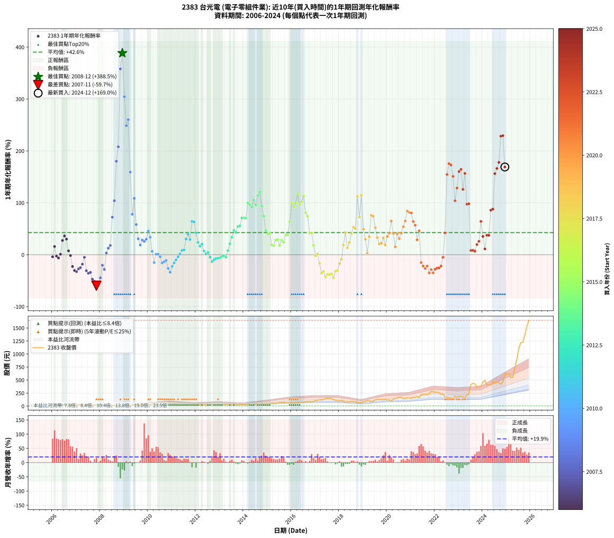

# 2383 台光電 - 本益比與未來報酬率分析

!!! info "報告資訊"
    - **股票代號**: 2383
    - **公司名稱**: 台光電
    - **產業別**: 電子零組件業
    - **分析期間**: 2006-2024 (228 個數據點)
    - **資料來源**: Type 12 (ShowMonthlyK_ChartFlow) 月收盤價與本益比
    - **報酬率口徑**: 含現金股利 (簡化: 年度合計，假設每年7/1入帳)
    - **報告生成時間**: 2026-01-11 20:44:26 CST

## 📈 視覺化圖表

### 圖表1: 本益比 vs 未來報酬率關係

*圖表1：2383 台光電 本益比與1年期未來報酬率關係 (2006-2024)*

### 圖表2: 歷年買入時點的1年期實際報酬率

*圖表2：2383 台光電 歷年買入時點的1年期實際報酬率 (2006-2024)*

## 📍 買點訊號說明

本報告提供兩種買點提示訊號（顯示於圖表2的股價子圖中）：

### ▲ 小綠色三角形（回測驗證）
- **計算方式**: 使用全部歷史資料計算本益比第25百分位數
- **用途**: 事後驗證，顯示歷史上哪些時點確實為低估區
- **限制**: 當下無法判斷，僅供回測參考
- **特性**: 後見之明（Look-Ahead Bias）

### ▲ 小橘色三角形（即時訊號）
- **計算方式**: 使用截至當月的過去5年資料計算本益比第25百分位數
- **用途**: 實際投資決策，當時即可判斷
- **優勢**: 可操作性強，符合實務需求
- **特性**: 無後見之明，滾動窗口計算

!!! tip "如何使用兩種訊號"
    - **綠色▲** 幫助理解歷史估值機會，驗證策略有效性
    - **橘色▲** 可作為實際買進參考，但仍需搭配基本面分析
    - 兩種訊號重疊時，表示即時判斷與事後驗證一致，信心度較高
    - 僅有綠色▲時，表示當時無法判斷（需要未來資料才能確認）
    - 僅有橘色▲時，表示即時判斷為買點，但事後可能不是最佳時機

## 📊 估值分析摘要

| 指標 | 數值 |
|:---:|:---:|
| **目前本益比** (2024-12) | **22.22 倍** |
| **歷史平均本益比** | 11.49 倍 |
| **估值水準** | 🔴 相對高估 |
| **預期1年年化報酬率** | **+40.42%** |
| **歷史平均報酬率** | +42.59% |
| **相關係數 (R²)** | 0.0001 |
| **趨勢線斜率** | -0.2018 |

!!! abstract "核心洞察"
    目前本益比顯著高於歷史平均，預期未來報酬率可能較低

    根據歷史數據回測，2383 台光電 在目前本益比 **22.2倍** 的估值水準下，
    預期未來1年年化報酬率約為 **+40.4%**。

    **重要提醒**: 本分析基於歷史數據統計，實際報酬率會受到公司基本面變化、產業趨勢、
    總體經濟環境等多重因素影響。R² = 0.00 表示本益比可解釋約 0.0% 的報酬率變異。

## 📈 歷史估值統計

### 最佳買點 (最高報酬率)

| 項目 | 數值 |
|:---:|:---:|
| 起始時間 | 2008-12 |
| 當時本益比 | 10.24 倍 |
| 起始價格 | 5.0 元 |
| 1年後價格 | 24.3 元 |
| **1年年化報酬率** | **+388.46%** |

### 最差買點 (最低報酬率)

| 項目 | 數值 |
|:---:|:---:|
| 起始時間 | 2007-11 |
| 當時本益比 | 8.50 倍 |
| 起始價格 | 13.1 元 |
| 1年後價格 | 5.1 元 |
| **1年年化報酬率** | **-59.68%** |

## 🎯 投資啟示

### 本益比與報酬率關係

趨勢線方程式: **y = -0.2018x + 44.9064**

!!! note "負相關"
    本益比與未來報酬率呈現負相關。較低的本益比通常帶來較高的未來報酬率，
    但相關性不算非常強。**估值仍是重要參考指標之一**。

### 估值區間建議

基於歷史數據分析:

- **🟢 低估區** (P/E < 9.2): 預期報酬率較高，可考慮增加持股
- **🟡 合理區** (P/E 9.2-13.8): 預期報酬率符合長期趨勢，正常持有
- **🔴 高估區** (P/E > 13.8): 預期報酬率較低，可考慮減碼或觀望

!!! danger "風險提示"
    - 過去表現不代表未來結果
    - 本分析假設公司基本面無重大結構性變化
    - 產業環境劇變可能使歷史規律失效
    - 應結合公司財報、產業趨勢、總體經濟等多重因素綜合判斷

!!! success "長期投資觀點"
    歷史數據顯示，在合理或低估的估值水準買入並長期持有，
    往往能獲得較佳的投資報酬。**耐心等待好價格**是價值投資的核心原則。

## 📊 數據品質

- **資料來源**: GoodInfo.tw Type 12 (ShowMonthlyK_ChartFlow)
- **資料頻率**: 月度收盤價與本益比
- **回測期間**: 2006-2024
- **數據點數量**: 228 個 (每個點代表一次1年期回測)

### 計算方法說明

1. **1年期年化報酬率**:
   - 對每個歷史時點，計算其後1年的實際投資報酬率
   - 期末價值(不含股利): 期末價格
   - 期末價值(含現金股利): 期末價格 + 持有期間內的現金股利合計 (簡化: 年度合計，假設每年7/1入帳)
   - 公式: 年化報酬率 = [(期末價值/期初價格)^(1/年數) - 1] × 100%

2. **本益比 (P/E Ratio)**:
   - 使用當時的月收盤價與EPS計算
   - 資料來源: Type 12 月度河流圖本益比數據

3. **趨勢線 (Linear Regression)**:
   - 使用最小平方法擬合線性趨勢線
   - R²值衡量本益比對報酬率的解釋能力

---

*本報告由 Stock Analysis System v1.9.0 自動生成*
*數據更新時間: 2026-01-11 20:44:26 CST*

## 📋 月度回測明細表

（每一列對應時間線圖中的一個買入點；可用來對照 SVG 圖上的每個點。）

| 買入月份 | 賣出月份 | 回測期限_年 | 實際持有年數 | 買入本益比_倍 | 買入收盤價_元 | 賣出收盤價_元 | 現金股利合計_元 | 總報酬率_pct | 年化報酬率_pct |
| --- | --- | --- | --- | --- | --- | --- | --- | --- | --- |
| 2006-01 | 2007-01 | 1 | 0.999 | 9.07 | 16.15 | 15.50 | 0.00 | -4.02 | -4.03 |
| 2006-02 | 2007-02 | 1 | 0.999 | 7.81 | 13.90 | 16.10 | 0.00 | +15.83 | +15.84 |
| 2006-03 | 2007-03 | 1 | 0.999 | 9.80 | 17.45 | 17.00 | 0.00 | -2.58 | -2.58 |
| 2006-04 | 2007-04 | 1 | 0.999 | 10.22 | 18.20 | 17.05 | 0.00 | -6.32 | -6.32 |
| 2006-05 | 2007-05 | 1 | 0.999 | 9.04 | 16.10 | 16.25 | 0.00 | +0.93 | +0.93 |
| 2006-06 | 2007-06 | 1 | 0.999 | 7.58 | 13.50 | 17.20 | 0.00 | +27.41 | +27.43 |
| 2006-07 | 2007-07 | 1 | 0.999 | 7.58 | 13.50 | 18.00 | 0.39 | +36.24 | +36.27 |
| 2006-08 | 2007-08 | 1 | 0.999 | 7.64 | 13.60 | 17.30 | 0.39 | +30.09 | +30.11 |
| 2006-09 | 2007-09 | 1 | 0.999 | 9.33 | 16.60 | 17.45 | 0.39 | +7.48 | +7.49 |
| 2006-10 | 2007-10 | 1 | 0.999 | 9.24 | 16.45 | 15.80 | 0.39 | -1.57 | -1.57 |
| 2006-11 | 2007-11 | 1 | 0.999 | 9.80 | 17.45 | 13.10 | 0.39 | -22.68 | -22.70 |
| 2006-12 | 2007-12 | 1 | 0.999 | 9.92 | 17.65 | 11.90 | 0.39 | -30.36 | -30.37 |
| 2007-01 | 2008-01 | 1 | 0.999 | 8.82 | 15.50 | 10.05 | 0.39 | -32.63 | -32.65 |
| 2007-02 | 2008-02 | 1 | 0.999 | 9.27 | 16.10 | 11.30 | 0.39 | -27.38 | -27.39 |
| 2007-03 | 2008-03 | 1 | 1.002 | 9.91 | 17.00 | 12.35 | 0.39 | -25.05 | -25.00 |
| 2007-04 | 2008-04 | 1 | 1.002 | 10.07 | 17.05 | 13.55 | 0.39 | -18.23 | -18.20 |
| 2007-05 | 2008-05 | 1 | 1.002 | 9.72 | 16.25 | 15.05 | 0.39 | -4.97 | -4.96 |
| 2007-06 | 2008-06 | 1 | 1.002 | 10.42 | 17.20 | 11.50 | 0.39 | -30.86 | -30.81 |
| 2007-07 | 2008-07 | 1 | 1.002 | 11.05 | 18.00 | 11.35 | 0.20 | -35.82 | -35.76 |
| 2007-08 | 2008-08 | 1 | 1.002 | 10.77 | 17.30 | 11.20 | 0.20 | -34.09 | -34.04 |
| 2007-09 | 2008-09 | 1 | 1.002 | 11.01 | 17.45 | 9.00 | 0.20 | -47.27 | -47.20 |
| 2007-10 | 2008-10 | 1 | 1.002 | 10.11 | 15.80 | 7.49 | 0.20 | -51.32 | -51.24 |
| 2007-11 | 2008-11 | 1 | 1.002 | 8.50 | 13.10 | 5.07 | 0.20 | -59.76 | -59.68 |
| 2007-12 | 2008-12 | 1 | 1.002 | 7.83 | 11.90 | 5.02 | 0.20 | -56.12 | -56.04 |
| 2008-01 | 2009-01 | 1 | 1.002 | 7.01 | 10.05 | 5.37 | 0.20 | -44.56 | -44.49 |
| 2008-02 | 2009-03 | 1 | 1.081 | 8.38 | 11.30 | 8.65 | 0.20 | -21.66 | -20.21 |
| 2008-03 | 2009-03 | 1 | 0.999 | 9.78 | 12.35 | 8.65 | 0.20 | -28.32 | -28.34 |
| 2008-04 | 2009-04 | 1 | 0.999 | 11.52 | 13.55 | 13.80 | 0.20 | +3.34 | +3.34 |
| 2008-05 | 2009-05 | 1 | 0.999 | 13.80 | 15.05 | 16.75 | 0.20 | +12.64 | +12.65 |
| 2008-06 | 2009-06 | 1 | 0.999 | 11.44 | 11.50 | 13.35 | 0.20 | +17.84 | +17.86 |
| 2008-07 | 2009-07 | 1 | 0.999 | 12.35 | 11.35 | 19.35 | 0.19 | +72.19 | +72.26 |
| 2008-08 | 2009-08 | 1 | 0.999 | 13.44 | 11.20 | 22.65 | 0.19 | +103.96 | +104.06 |
| 2008-09 | 2009-09 | 1 | 0.999 | 12.04 | 9.00 | 25.00 | 0.19 | +179.93 | +180.13 |
| 2008-10 | 2009-10 | 1 | 0.999 | 11.32 | 7.49 | 22.85 | 0.19 | +207.66 | +207.90 |
| 2008-11 | 2009-11 | 1 | 0.999 | 8.80 | 5.07 | 23.00 | 0.19 | +357.48 | +357.95 |
| 2008-12 | 2009-12 | 1 | 0.999 | 10.24 | 5.02 | 24.30 | 0.19 | +387.93 | +388.46 |
| 2009-01 | 2010-01 | 1 | 0.999 | 7.87 | 5.37 | 21.50 | 0.19 | +303.99 | +304.37 |
| 2009-02 | 2010-02 | 1 | 0.999 | 8.07 | 7.06 | 24.40 | 0.19 | +248.36 | +248.65 |
| 2009-03 | 2010-03 | 1 | 0.999 | 8.10 | 8.65 | 30.95 | 0.19 | +260.05 | +260.36 |
| 2009-04 | 2010-04 | 1 | 0.999 | 10.95 | 13.80 | 35.55 | 0.19 | +159.01 | +159.18 |
| 2009-05 | 2010-05 | 1 | 0.999 | 11.53 | 16.75 | 29.60 | 0.19 | +77.87 | +77.94 |
| 2009-06 | 2010-06 | 1 | 0.999 | 8.12 | 13.35 | 27.65 | 0.19 | +108.57 | +108.67 |
| 2009-07 | 2010-07 | 1 | 0.999 | 10.53 | 19.35 | 29.90 | 0.70 | +58.12 | +58.17 |
| 2009-08 | 2010-08 | 1 | 0.999 | 11.16 | 22.65 | 28.95 | 0.70 | +30.89 | +30.92 |
| 2009-09 | 2010-09 | 1 | 0.999 | 11.25 | 25.00 | 29.00 | 0.70 | +18.79 | +18.80 |
| 2009-10 | 2010-10 | 1 | 0.999 | 9.46 | 22.85 | 28.60 | 0.70 | +28.21 | +28.24 |
| 2009-11 | 2010-11 | 1 | 0.999 | 8.82 | 23.00 | 28.20 | 0.70 | +25.64 | +25.66 |
| 2009-12 | 2010-12 | 1 | 0.999 | 8.68 | 24.30 | 30.85 | 0.70 | +29.82 | +29.85 |
| 2010-01 | 2011-01 | 1 | 0.999 | 7.35 | 21.50 | 30.60 | 0.70 | +45.57 | +45.60 |
| 2010-02 | 2011-02 | 1 | 0.999 | 8.00 | 24.40 | 31.95 | 0.70 | +33.80 | +33.83 |
| 2010-03 | 2011-03 | 1 | 0.999 | 9.75 | 30.95 | 32.30 | 0.70 | +6.61 | +6.62 |
| 2010-04 | 2011-04 | 1 | 0.999 | 10.77 | 35.55 | 29.50 | 0.70 | -15.06 | -15.07 |
| 2010-05 | 2011-05 | 1 | 0.999 | 8.64 | 29.60 | 29.20 | 0.70 | +1.00 | +1.00 |
| 2010-06 | 2011-06 | 1 | 0.999 | 7.79 | 27.65 | 27.25 | 0.70 | +1.07 | +1.07 |
| 2010-07 | 2011-07 | 1 | 0.999 | 8.14 | 29.90 | 27.00 | 1.73 | -3.92 | -3.92 |
| 2010-08 | 2011-08 | 1 | 0.999 | 7.62 | 28.95 | 22.65 | 1.73 | -15.79 | -15.80 |
| 2010-09 | 2011-09 | 1 | 0.999 | 7.39 | 29.00 | 23.35 | 1.73 | -13.52 | -13.53 |
| 2010-10 | 2011-10 | 1 | 0.999 | 7.06 | 28.60 | 23.75 | 1.73 | -10.91 | -10.92 |
| 2010-11 | 2011-11 | 1 | 0.999 | 6.75 | 28.20 | 19.05 | 1.73 | -26.32 | -26.33 |
| 2010-12 | 2011-12 | 1 | 0.999 | 7.17 | 30.85 | 18.70 | 1.73 | -33.78 | -33.80 |
| 2011-01 | 2012-01 | 1 | 0.999 | 7.32 | 30.60 | 22.00 | 1.73 | -22.45 | -22.47 |
| 2011-02 | 2012-02 | 1 | 0.999 | 7.87 | 31.95 | 25.20 | 1.73 | -15.72 | -15.73 |
| 2011-03 | 2012-03 | 1 | 1.002 | 8.19 | 32.30 | 27.35 | 1.73 | -9.97 | -9.95 |
| 2011-04 | 2012-04 | 1 | 1.002 | 7.72 | 29.50 | 26.55 | 1.73 | -4.14 | -4.13 |
| 2011-05 | 2012-05 | 1 | 1.002 | 7.88 | 29.20 | 27.90 | 1.73 | +1.47 | +1.47 |
| 2011-06 | 2012-06 | 1 | 1.002 | 7.60 | 27.25 | 27.80 | 1.73 | +8.36 | +8.35 |
| 2011-07 | 2012-07 | 1 | 1.002 | 7.79 | 27.00 | 27.70 | 1.80 | +9.25 | +9.23 |
| 2011-08 | 2012-08 | 1 | 1.002 | 6.77 | 22.65 | 27.70 | 1.80 | +30.23 | +30.16 |
| 2011-09 | 2012-09 | 1 | 1.002 | 7.23 | 23.35 | 30.80 | 1.80 | +39.61 | +39.51 |
| 2011-10 | 2012-10 | 1 | 1.002 | 7.64 | 23.75 | 28.90 | 1.80 | +29.25 | +29.19 |
| 2011-11 | 2012-11 | 1 | 1.002 | 6.37 | 19.05 | 29.55 | 1.80 | +64.56 | +64.39 |
| 2011-12 | 2012-12 | 1 | 1.002 | 6.52 | 18.70 | 28.75 | 1.80 | +63.36 | +63.19 |
| 2012-01 | 2013-01 | 1 | 1.002 | 7.48 | 22.00 | 29.50 | 1.80 | +42.26 | +42.16 |
| 2012-02 | 2013-03 | 1 | 1.081 | 8.36 | 25.20 | 30.00 | 1.80 | +26.18 | +23.99 |
| 2012-03 | 2013-03 | 1 | 0.999 | 8.86 | 27.35 | 30.00 | 1.80 | +16.26 | +16.28 |
| 2012-04 | 2013-04 | 1 | 0.999 | 8.40 | 26.55 | 30.20 | 1.80 | +20.52 | +20.54 |
| 2012-05 | 2013-05 | 1 | 0.999 | 8.63 | 27.90 | 28.15 | 1.80 | +7.34 | +7.35 |
| 2012-06 | 2013-06 | 1 | 0.999 | 8.41 | 27.80 | 26.40 | 1.80 | +1.43 | +1.43 |
| 2012-07 | 2013-07 | 1 | 0.999 | 8.20 | 27.70 | 27.10 | 1.79 | +4.31 | +4.31 |
| 2012-08 | 2013-08 | 1 | 0.999 | 8.03 | 27.70 | 24.60 | 1.79 | -4.71 | -4.72 |
| 2012-09 | 2013-09 | 1 | 0.999 | 8.74 | 30.80 | 24.95 | 1.79 | -13.17 | -13.18 |
| 2012-10 | 2013-10 | 1 | 0.999 | 8.04 | 28.90 | 24.30 | 1.79 | -9.71 | -9.72 |
| 2012-11 | 2013-11 | 1 | 0.999 | 8.06 | 29.55 | 25.50 | 1.79 | -7.63 | -7.64 |
| 2012-12 | 2013-12 | 1 | 0.999 | 7.69 | 28.75 | 25.00 | 1.79 | -6.80 | -6.81 |
| 2013-01 | 2014-01 | 1 | 0.999 | 8.08 | 29.50 | 26.00 | 1.79 | -5.78 | -5.79 |
| 2013-02 | 2014-02 | 1 | 0.999 | 8.39 | 29.90 | 27.20 | 1.79 | -3.03 | -3.03 |
| 2013-03 | 2014-03 | 1 | 0.999 | 8.63 | 30.00 | 27.70 | 1.79 | -1.69 | -1.69 |
| 2013-04 | 2014-04 | 1 | 0.999 | 8.91 | 30.20 | 26.95 | 1.79 | -4.82 | -4.82 |
| 2013-05 | 2014-05 | 1 | 0.999 | 8.52 | 28.15 | 28.60 | 1.79 | +7.97 | +7.98 |
| 2013-06 | 2014-06 | 1 | 0.999 | 8.21 | 26.40 | 30.15 | 1.79 | +21.00 | +21.02 |
| 2013-07 | 2014-07 | 1 | 0.999 | 8.67 | 27.10 | 34.45 | 1.80 | +33.76 | +33.78 |
| 2013-08 | 2014-08 | 1 | 0.999 | 8.09 | 24.60 | 34.35 | 1.80 | +46.94 | +46.98 |
| 2013-09 | 2014-09 | 1 | 0.999 | 8.45 | 24.95 | 33.90 | 1.80 | +43.08 | +43.11 |
| 2013-10 | 2014-10 | 1 | 0.999 | 8.48 | 24.30 | 35.75 | 1.80 | +54.52 | +54.56 |
| 2013-11 | 2014-11 | 1 | 0.999 | 9.18 | 25.50 | 37.90 | 1.80 | +55.68 | +55.73 |
| 2013-12 | 2014-12 | 1 | 0.999 | 9.29 | 25.00 | 40.90 | 1.80 | +70.79 | +70.85 |
| 2014-01 | 2015-01 | 1 | 0.999 | 9.04 | 26.00 | 42.65 | 1.80 | +70.95 | +71.02 |
| 2014-02 | 2015-02 | 1 | 0.999 | 8.89 | 27.20 | 44.55 | 1.80 | +70.40 | +70.46 |
| 2014-03 | 2015-03 | 1 | 0.999 | 8.54 | 27.70 | 53.60 | 1.80 | +99.99 | +100.09 |
| 2014-04 | 2015-04 | 1 | 0.999 | 7.86 | 26.95 | 51.20 | 1.80 | +96.65 | +96.74 |
| 2014-05 | 2015-05 | 1 | 0.999 | 7.91 | 28.60 | 53.10 | 1.80 | +91.95 | +92.04 |
| 2014-06 | 2015-06 | 1 | 0.999 | 7.93 | 30.15 | 60.10 | 1.80 | +105.30 | +105.40 |
| 2014-07 | 2015-07 | 1 | 0.999 | 8.64 | 34.45 | 65.00 | 2.50 | +95.92 | +96.01 |
| 2014-08 | 2015-08 | 1 | 0.999 | 8.24 | 34.35 | 71.00 | 2.50 | +113.96 | +114.07 |
| 2014-09 | 2015-09 | 1 | 0.999 | 7.78 | 33.90 | 72.40 | 2.50 | +120.93 | +121.05 |
| 2014-10 | 2015-10 | 1 | 0.999 | 7.87 | 35.75 | 66.70 | 2.50 | +93.56 | +93.64 |
| 2014-11 | 2015-11 | 1 | 0.999 | 8.02 | 37.90 | 63.50 | 2.50 | +74.13 | +74.20 |
| 2014-12 | 2015-12 | 1 | 0.999 | 8.33 | 40.90 | 57.50 | 2.50 | +46.69 | +46.73 |
| 2015-01 | 2016-01 | 1 | 0.999 | 8.31 | 42.65 | 57.20 | 2.50 | +39.97 | +40.00 |
| 2015-02 | 2016-02 | 1 | 0.999 | 8.33 | 44.55 | 60.50 | 2.50 | +41.41 | +41.44 |
| 2015-03 | 2016-03 | 1 | 1.002 | 9.62 | 53.60 | 61.30 | 2.50 | +19.02 | +18.98 |
| 2015-04 | 2016-04 | 1 | 1.002 | 8.84 | 51.20 | 57.60 | 2.50 | +17.38 | +17.34 |
| 2015-05 | 2016-05 | 1 | 1.002 | 8.84 | 53.10 | 65.70 | 2.50 | +28.43 | +28.36 |
| 2015-06 | 2016-06 | 1 | 1.002 | 9.65 | 60.10 | 75.20 | 2.50 | +29.28 | +29.21 |
| 2015-07 | 2016-07 | 1 | 1.002 | 10.08 | 65.00 | 72.50 | 4.29 | +18.14 | +18.10 |
| 2015-08 | 2016-08 | 1 | 1.002 | 10.64 | 71.00 | 86.60 | 4.29 | +28.02 | +27.95 |
| 2015-09 | 2016-09 | 1 | 1.002 | 10.51 | 72.40 | 85.50 | 4.29 | +24.02 | +23.97 |
| 2015-10 | 2016-10 | 1 | 1.002 | 9.38 | 66.70 | 88.10 | 4.29 | +38.52 | +38.42 |
| 2015-11 | 2016-11 | 1 | 1.002 | 8.66 | 63.50 | 83.80 | 4.29 | +38.73 | +38.63 |
| 2015-12 | 2016-12 | 1 | 1.002 | 7.62 | 57.50 | 90.00 | 4.29 | +63.98 | +63.82 |
| 2016-01 | 2017-01 | 1 | 1.002 | 7.48 | 57.20 | 109.50 | 4.29 | +98.94 | +98.66 |
| 2016-02 | 2017-03 | 1 | 1.081 | 7.81 | 60.50 | 118.00 | 4.29 | +102.13 | +91.70 |
| 2016-03 | 2017-03 | 1 | 0.999 | 7.82 | 61.30 | 118.00 | 4.29 | +99.50 | +99.59 |
| 2016-04 | 2017-04 | 1 | 0.999 | 7.26 | 57.60 | 120.50 | 4.29 | +116.65 | +116.77 |
| 2016-05 | 2017-05 | 1 | 0.999 | 8.18 | 65.70 | 125.00 | 4.29 | +96.79 | +96.88 |
| 2016-06 | 2017-06 | 1 | 0.999 | 9.26 | 75.20 | 147.50 | 4.29 | +101.85 | +101.95 |
| 2016-07 | 2017-07 | 1 | 0.999 | 8.82 | 72.50 | 149.50 | 4.70 | +112.69 | +112.80 |
| 2016-08 | 2017-08 | 1 | 0.999 | 10.41 | 86.60 | 152.00 | 4.70 | +80.94 | +81.02 |
| 2016-09 | 2017-09 | 1 | 0.999 | 10.16 | 85.50 | 144.00 | 4.70 | +73.92 | +73.98 |
| 2016-10 | 2017-10 | 1 | 0.999 | 10.35 | 88.10 | 120.00 | 4.70 | +41.54 | +41.58 |
| 2016-11 | 2017-11 | 1 | 0.999 | 9.74 | 83.80 | 114.00 | 4.70 | +41.64 | +41.68 |
| 2016-12 | 2017-12 | 1 | 0.999 | 10.34 | 90.00 | 101.50 | 4.70 | +18.00 | +18.01 |
| 2017-01 | 2018-01 | 1 | 0.999 | 12.58 | 109.50 | 102.50 | 4.70 | -2.10 | -2.10 |
| 2017-02 | 2018-02 | 1 | 0.999 | 12.92 | 112.50 | 109.50 | 4.70 | +1.51 | +1.51 |
| 2017-03 | 2018-03 | 1 | 0.999 | 13.55 | 118.00 | 93.80 | 4.70 | -16.53 | -16.54 |
| 2017-04 | 2018-04 | 1 | 0.999 | 13.83 | 120.50 | 73.00 | 4.70 | -35.52 | -35.54 |
| 2017-05 | 2018-05 | 1 | 0.999 | 14.34 | 125.00 | 80.20 | 4.70 | -32.08 | -32.10 |
| 2017-06 | 2018-06 | 1 | 0.999 | 16.92 | 147.50 | 79.80 | 4.70 | -42.71 | -42.74 |
| 2017-07 | 2018-07 | 1 | 0.999 | 17.14 | 149.50 | 88.00 | 4.80 | -37.93 | -37.95 |
| 2017-08 | 2018-08 | 1 | 0.999 | 17.42 | 152.00 | 88.80 | 4.80 | -38.42 | -38.44 |
| 2017-09 | 2018-09 | 1 | 0.999 | 16.49 | 144.00 | 86.00 | 4.80 | -36.94 | -36.96 |
| 2017-10 | 2018-10 | 1 | 0.999 | 13.74 | 120.00 | 61.90 | 4.80 | -44.42 | -44.44 |
| 2017-11 | 2018-11 | 1 | 0.999 | 13.05 | 114.00 | 72.90 | 4.80 | -31.84 | -31.86 |
| 2017-12 | 2018-12 | 1 | 0.999 | 11.61 | 101.50 | 65.70 | 4.80 | -30.54 | -30.56 |
| 2018-01 | 2019-01 | 1 | 0.999 | 12.10 | 102.50 | 80.00 | 4.80 | -17.27 | -17.28 |
| 2018-02 | 2019-02 | 1 | 0.999 | 13.36 | 109.50 | 95.20 | 4.80 | -8.68 | -8.68 |
| 2018-03 | 2019-03 | 1 | 0.999 | 11.84 | 93.80 | 106.50 | 4.80 | +18.66 | +18.67 |
| 2018-04 | 2019-04 | 1 | 0.999 | 9.54 | 73.00 | 99.20 | 4.80 | +42.47 | +42.50 |
| 2018-05 | 2019-05 | 1 | 0.999 | 10.86 | 80.20 | 85.90 | 4.80 | +13.09 | +13.10 |
| 2018-06 | 2019-06 | 1 | 0.999 | 11.22 | 79.80 | 93.70 | 4.80 | +23.43 | +23.45 |
| 2018-07 | 2019-07 | 1 | 0.999 | 12.87 | 88.00 | 120.00 | 3.80 | +40.68 | +40.71 |
| 2018-08 | 2019-08 | 1 | 0.999 | 13.52 | 88.80 | 132.00 | 3.80 | +52.93 | +52.97 |
| 2018-09 | 2019-09 | 1 | 0.999 | 13.66 | 86.00 | 125.50 | 3.80 | +50.35 | +50.39 |
| 2018-10 | 2019-10 | 1 | 0.999 | 10.28 | 61.90 | 127.50 | 3.80 | +112.12 | +112.23 |
| 2018-11 | 2019-11 | 1 | 0.999 | 12.67 | 72.90 | 122.00 | 3.80 | +72.57 | +72.63 |
| 2018-12 | 2019-12 | 1 | 0.999 | 11.99 | 65.70 | 137.00 | 3.80 | +114.31 | +114.42 |
| 2019-01 | 2020-01 | 1 | 0.999 | 13.63 | 80.00 | 115.50 | 3.80 | +49.12 | +49.17 |
| 2019-02 | 2020-02 | 1 | 0.999 | 15.22 | 95.20 | 120.00 | 3.80 | +30.04 | +30.07 |
| 2019-03 | 2020-03 | 1 | 1.002 | 16.03 | 106.50 | 106.00 | 3.80 | +3.10 | +3.09 |
| 2019-04 | 2020-04 | 1 | 1.002 | 14.10 | 99.20 | 130.00 | 3.80 | +34.88 | +34.80 |
| 2019-05 | 2020-05 | 1 | 1.002 | 11.57 | 85.90 | 147.50 | 3.80 | +76.14 | +75.93 |
| 2019-06 | 2020-06 | 1 | 1.002 | 12.00 | 93.70 | 159.50 | 3.80 | +74.28 | +74.08 |
| 2019-07 | 2020-07 | 1 | 1.002 | 14.64 | 120.00 | 177.00 | 5.76 | +52.30 | +52.17 |
| 2019-08 | 2020-08 | 1 | 1.002 | 15.37 | 132.00 | 170.00 | 5.76 | +33.15 | +33.07 |
| 2019-09 | 2020-09 | 1 | 1.002 | 13.98 | 125.50 | 146.00 | 5.76 | +20.93 | +20.88 |
| 2019-10 | 2020-10 | 1 | 1.002 | 13.62 | 127.50 | 150.00 | 5.76 | +22.17 | +22.12 |
| 2019-11 | 2020-11 | 1 | 1.002 | 12.51 | 122.00 | 156.00 | 5.76 | +32.59 | +32.52 |
| 2019-12 | 2020-12 | 1 | 1.002 | 13.51 | 137.00 | 157.00 | 5.76 | +18.80 | +18.76 |
| 2020-01 | 2021-01 | 1 | 1.002 | 11.28 | 115.50 | 150.50 | 5.76 | +35.29 | +35.21 |
| 2020-02 | 2021-03 | 1 | 1.081 | 11.61 | 120.00 | 169.00 | 5.76 | +45.63 | +41.57 |
| 2020-03 | 2021-03 | 1 | 0.999 | 10.16 | 106.00 | 169.00 | 5.76 | +64.87 | +64.93 |
| 2020-04 | 2021-04 | 1 | 0.999 | 12.34 | 130.00 | 178.00 | 5.76 | +41.36 | +41.39 |
| 2020-05 | 2021-05 | 1 | 0.999 | 13.87 | 147.50 | 164.00 | 5.76 | +15.09 | +15.10 |
| 2020-06 | 2021-06 | 1 | 0.999 | 14.86 | 159.50 | 218.00 | 5.76 | +40.29 | +40.32 |
| 2020-07 | 2021-07 | 1 | 0.999 | 16.34 | 177.00 | 225.00 | 7.00 | +31.07 | +31.10 |
| 2020-08 | 2021-08 | 1 | 0.999 | 15.55 | 170.00 | 234.00 | 7.00 | +41.76 | +41.80 |
| 2020-09 | 2021-09 | 1 | 0.999 | 13.23 | 146.00 | 217.50 | 7.00 | +53.77 | +53.81 |
| 2020-10 | 2021-10 | 1 | 0.999 | 13.48 | 150.00 | 240.50 | 7.00 | +65.00 | +65.06 |
| 2020-11 | 2021-11 | 1 | 0.999 | 13.89 | 156.00 | 280.00 | 7.00 | +83.97 | +84.05 |
| 2020-12 | 2021-12 | 1 | 0.999 | 13.86 | 157.00 | 278.00 | 7.00 | +81.53 | +81.60 |
| 2021-01 | 2022-01 | 1 | 0.999 | 12.80 | 150.50 | 264.50 | 7.00 | +80.40 | +80.47 |
| 2021-02 | 2022-02 | 1 | 0.999 | 13.86 | 169.00 | 270.00 | 7.00 | +63.91 | +63.96 |
| 2021-03 | 2022-03 | 1 | 0.999 | 13.39 | 169.00 | 258.00 | 7.00 | +56.80 | +56.85 |
| 2021-04 | 2022-04 | 1 | 0.999 | 13.64 | 178.00 | 222.00 | 7.00 | +28.65 | +28.67 |
| 2021-05 | 2022-05 | 1 | 0.999 | 12.16 | 164.00 | 232.50 | 7.00 | +46.04 | +46.07 |
| 2021-06 | 2022-06 | 1 | 0.999 | 15.67 | 218.00 | 178.50 | 7.00 | -14.91 | -14.92 |
| 2021-07 | 2022-07 | 1 | 0.999 | 15.68 | 225.00 | 166.00 | 10.00 | -21.78 | -21.79 |
| 2021-08 | 2022-08 | 1 | 0.999 | 15.84 | 234.00 | 162.00 | 10.00 | -26.50 | -26.51 |
| 2021-09 | 2022-09 | 1 | 0.999 | 14.30 | 217.50 | 160.00 | 10.00 | -21.84 | -21.85 |
| 2021-10 | 2022-10 | 1 | 0.999 | 15.38 | 240.50 | 146.50 | 10.00 | -34.93 | -34.95 |
| 2021-11 | 2022-11 | 1 | 0.999 | 17.42 | 280.00 | 190.50 | 10.00 | -28.39 | -28.41 |
| 2021-12 | 2022-12 | 1 | 0.999 | 16.85 | 278.00 | 171.00 | 10.00 | -34.89 | -34.91 |
| 2022-01 | 2023-01 | 1 | 0.999 | 16.13 | 264.50 | 180.50 | 10.00 | -27.98 | -27.99 |
| 2022-02 | 2023-02 | 1 | 0.999 | 16.57 | 270.00 | 190.50 | 10.00 | -25.74 | -25.76 |
| 2022-03 | 2023-03 | 1 | 0.999 | 15.94 | 258.00 | 182.00 | 10.00 | -25.58 | -25.60 |
| 2022-04 | 2023-04 | 1 | 0.999 | 13.81 | 222.00 | 163.50 | 10.00 | -21.85 | -21.86 |
| 2022-05 | 2023-05 | 1 | 0.999 | 14.55 | 232.50 | 211.00 | 10.00 | -4.95 | -4.95 |
| 2022-06 | 2023-06 | 1 | 0.999 | 11.25 | 178.50 | 243.50 | 10.00 | +42.02 | +42.05 |
| 2022-07 | 2023-07 | 1 | 0.999 | 10.53 | 166.00 | 414.00 | 8.41 | +154.46 | +154.62 |
| 2022-08 | 2023-08 | 1 | 0.999 | 10.34 | 162.00 | 437.50 | 8.41 | +175.25 | +175.44 |
| 2022-09 | 2023-09 | 1 | 0.999 | 10.29 | 160.00 | 428.00 | 8.41 | +172.75 | +172.94 |
| 2022-10 | 2023-10 | 1 | 0.999 | 9.48 | 146.50 | 359.00 | 8.41 | +150.79 | +150.95 |
| 2022-11 | 2023-11 | 1 | 0.999 | 12.41 | 190.50 | 380.00 | 8.41 | +103.89 | +103.99 |
| 2022-12 | 2023-12 | 1 | 0.999 | 11.22 | 171.00 | 382.00 | 8.41 | +128.31 | +128.44 |
| 2023-01 | 2024-01 | 1 | 0.999 | 11.77 | 180.50 | 461.00 | 8.41 | +160.06 | +160.23 |
| 2023-02 | 2024-02 | 1 | 0.999 | 12.35 | 190.50 | 495.00 | 8.41 | +164.26 | +164.43 |
| 2023-03 | 2024-03 | 1 | 1.002 | 11.73 | 182.00 | 403.50 | 8.41 | +126.32 | +125.94 |
| 2023-04 | 2024-04 | 1 | 1.002 | 10.47 | 163.50 | 412.00 | 8.41 | +157.13 | +156.63 |
| 2023-05 | 2024-05 | 1 | 1.002 | 13.44 | 211.00 | 408.50 | 8.41 | +97.59 | +97.31 |
| 2023-06 | 2024-06 | 1 | 1.002 | 15.42 | 243.50 | 475.00 | 8.41 | +98.52 | +98.25 |
| 2023-07 | 2024-07 | 1 | 1.002 | 26.06 | 414.00 | 438.00 | 9.98 | +8.21 | +8.19 |
| 2023-08 | 2024-08 | 1 | 1.002 | 27.38 | 437.50 | 465.00 | 9.98 | +8.57 | +8.55 |
| 2023-09 | 2024-09 | 1 | 1.002 | 26.63 | 428.00 | 447.00 | 9.98 | +6.77 | +6.76 |
| 2023-10 | 2024-10 | 1 | 1.002 | 22.21 | 359.00 | 419.50 | 9.98 | +19.63 | +19.59 |
| 2023-11 | 2024-11 | 1 | 1.002 | 23.37 | 380.00 | 468.50 | 9.98 | +25.92 | +25.86 |
| 2023-12 | 2024-12 | 1 | 1.002 | 23.36 | 382.00 | 618.00 | 9.98 | +64.39 | +64.23 |
| 2024-01 | 2025-01 | 1 | 1.002 | 26.64 | 461.00 | 614.00 | 9.98 | +35.35 | +35.27 |
| 2024-02 | 2025-03 | 1 | 1.081 | 27.11 | 495.00 | 545.00 | 9.98 | +12.12 | +11.16 |
| 2024-03 | 2025-03 | 1 | 0.999 | 21.00 | 403.50 | 545.00 | 9.98 | +37.54 | +37.57 |
| 2024-04 | 2025-04 | 1 | 0.999 | 20.43 | 412.00 | 556.00 | 9.98 | +37.37 | +37.40 |
| 2024-05 | 2025-05 | 1 | 0.999 | 19.34 | 408.50 | 749.00 | 9.98 | +85.80 | +85.88 |
| 2024-06 | 2025-06 | 1 | 0.999 | 21.51 | 475.00 | 882.00 | 9.98 | +87.79 | +87.87 |
| 2024-07 | 2025-07 | 1 | 0.999 | 19.01 | 438.00 | 1105.00 | 16.58 | +156.07 | +156.23 |
| 2024-08 | 2025-08 | 1 | 0.999 | 19.38 | 465.00 | 1220.00 | 16.58 | +165.93 | +166.11 |
| 2024-09 | 2025-09 | 1 | 0.999 | 17.92 | 447.00 | 1225.00 | 16.58 | +177.76 | +177.95 |
| 2024-10 | 2025-10 | 1 | 0.999 | 16.20 | 419.50 | 1360.00 | 16.58 | +228.15 | +228.41 |
| 2024-11 | 2025-11 | 1 | 0.999 | 17.45 | 468.50 | 1525.00 | 16.58 | +229.05 | +229.31 |
| 2024-12 | 2025-12 | 1 | 0.999 | 22.22 | 618.00 | 1645.00 | 16.58 | +168.86 | +169.05 |
