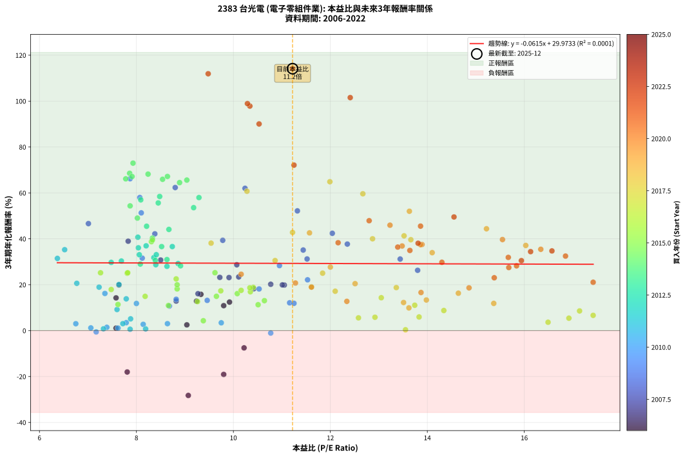
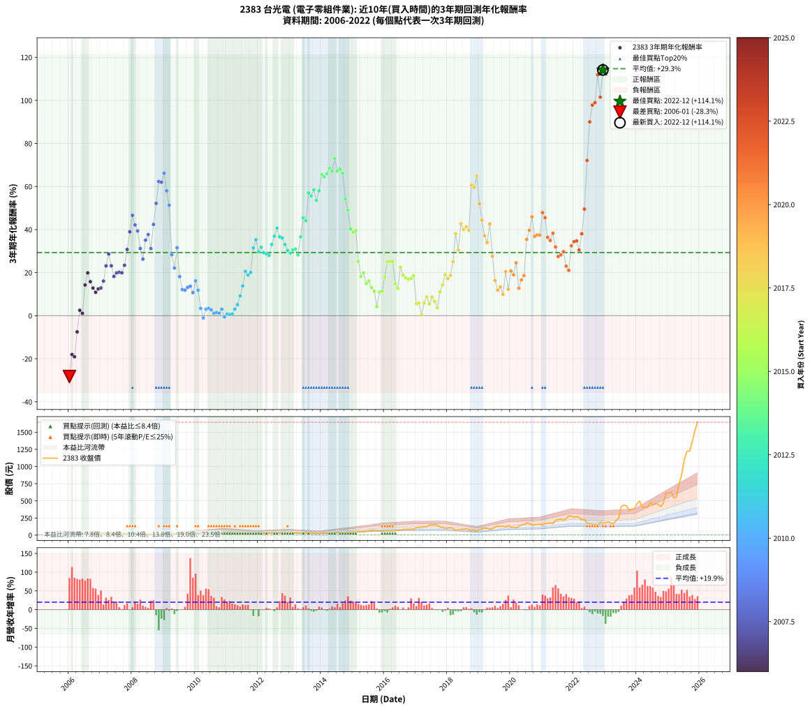

# 2383 台光電 - 本益比與未來報酬率分析

!!! info "報告資訊"
    - **股票代號**: 2383
    - **公司名稱**: 台光電
    - **產業別**: 電子零組件業
    - **分析期間**: 2006-2022 (204 個數據點)
    - **資料來源**: Type 12 (ShowMonthlyK_ChartFlow) 月收盤價與本益比
    - **報酬率口徑**: 含現金股利 (簡化: 年度合計，假設每年7/1入帳)
    - **報告生成時間**: 2026-01-06 00:37:55 CST

## 📈 視覺化圖表

### 圖表1: 本益比 vs 未來報酬率關係

*圖表1：2383 台光電 本益比與3年期未來報酬率關係 (2006-2022)*

### 圖表2: 歷年買入時點的3年期實際報酬率

*圖表2：2383 台光電 歷年買入時點的3年期實際報酬率 (2006-2022)*

## 📍 買點訊號說明

本報告提供兩種買點提示訊號（顯示於圖表2的股價子圖中）：

### ▲ 小綠色三角形（回測驗證）
- **計算方式**: 使用全部歷史資料計算本益比第25百分位數
- **用途**: 事後驗證，顯示歷史上哪些時點確實為低估區
- **限制**: 當下無法判斷，僅供回測參考
- **特性**: 後見之明（Look-Ahead Bias）

### ▲ 小橘色三角形（即時訊號）
- **計算方式**: 使用截至當月的過去5年資料計算本益比第25百分位數
- **用途**: 實際投資決策，當時即可判斷
- **優勢**: 可操作性強，符合實務需求
- **特性**: 無後見之明，滾動窗口計算

!!! tip "如何使用兩種訊號"
    - **綠色▲** 幫助理解歷史估值機會，驗證策略有效性
    - **橘色▲** 可作為實際買進參考，但仍需搭配基本面分析
    - 兩種訊號重疊時，表示即時判斷與事後驗證一致，信心度較高
    - 僅有綠色▲時，表示當時無法判斷（需要未來資料才能確認）
    - 僅有橘色▲時，表示即時判斷為買點，但事後可能不是最佳時機

## 📊 估值分析摘要

| 指標 | 數值 |
|:---:|:---:|
| **目前本益比** (2022-12) | **11.22 倍** |
| **歷史平均本益比** | 10.53 倍 |
| **估值水準** | 🟡 合理範圍 |
| **預期3年年化報酬率** | **+29.28%** |
| **歷史平均報酬率** | +29.33% |
| **相關係數 (R²)** | 0.0001 |
| **趨勢線斜率** | -0.0615 |

!!! abstract "核心洞察"
    目前本益比接近歷史平均，預期報酬率符合長期趨勢

    根據歷史數據回測，2383 台光電 在目前本益比 **11.2倍** 的估值水準下，
    預期未來3年年化報酬率約為 **+29.3%**。

    **重要提醒**: 本分析基於歷史數據統計，實際報酬率會受到公司基本面變化、產業趨勢、
    總體經濟環境等多重因素影響。R² = 0.00 表示本益比可解釋約 0.0% 的報酬率變異。

## 📈 歷史估值統計

### 最佳買點 (最高報酬率)

| 項目 | 數值 |
|:---:|:---:|
| 起始時間 | 2022-12 |
| 當時本益比 | 11.22 倍 |
| 起始價格 | 171.0 元 |
| 3年後價格 | 1645.0 元 |
| **3年年化報酬率** | **+114.14%** |

### 最差買點 (最低報酬率)

| 項目 | 數值 |
|:---:|:---:|
| 起始時間 | 2006-01 |
| 當時本益比 | 9.07 倍 |
| 起始價格 | 16.1 元 |
| 3年後價格 | 5.4 元 |
| **3年年化報酬率** | **-28.25%** |

## 🎯 投資啟示

### 本益比與報酬率關係

趨勢線方程式: **y = -0.0615x + 29.9733**

!!! note "負相關"
    本益比與未來報酬率呈現負相關。較低的本益比通常帶來較高的未來報酬率，
    但相關性不算非常強。**估值仍是重要參考指標之一**。

### 估值區間建議

基於歷史數據分析:

- **🟢 低估區** (P/E < 8.4): 預期報酬率較高，可考慮增加持股
- **🟡 合理區** (P/E 8.4-12.6): 預期報酬率符合長期趨勢，正常持有
- **🔴 高估區** (P/E > 12.6): 預期報酬率較低，可考慮減碼或觀望

!!! danger "風險提示"
    - 過去表現不代表未來結果
    - 本分析假設公司基本面無重大結構性變化
    - 產業環境劇變可能使歷史規律失效
    - 應結合公司財報、產業趨勢、總體經濟等多重因素綜合判斷

!!! success "長期投資觀點"
    歷史數據顯示，在合理或低估的估值水準買入並長期持有，
    往往能獲得較佳的投資報酬。**耐心等待好價格**是價值投資的核心原則。

## 📊 數據品質

- **資料來源**: GoodInfo.tw Type 12 (ShowMonthlyK_ChartFlow)
- **資料頻率**: 月度收盤價與本益比
- **回測期間**: 2006-2022
- **數據點數量**: 204 個 (每個點代表一次3年期回測)

### 計算方法說明

1. **3年期年化報酬率**:
   - 對每個歷史時點，計算其後3年的實際投資報酬率
   - 期末價值(不含股利): 期末價格
   - 期末價值(含現金股利): 期末價格 + 持有期間內的現金股利合計 (簡化: 年度合計，假設每年7/1入帳)
   - 公式: 年化報酬率 = [(期末價值/期初價格)^(1/年數) - 1] × 100%

2. **本益比 (P/E Ratio)**:
   - 使用當時的月收盤價與EPS計算
   - 資料來源: Type 12 月度河流圖本益比數據

3. **趨勢線 (Linear Regression)**:
   - 使用最小平方法擬合線性趨勢線
   - R²值衡量本益比對報酬率的解釋能力

---

*本報告由 Stock Analysis System v1.9.0 自動生成*
*數據更新時間: 2026-01-06 00:37:55 CST*

## 📋 月度回測明細表

（每一列對應時間線圖中的一個買入點；可用來對照 SVG 圖上的每個點。）

| 買入月份 | 賣出月份 | 回測期限_年 | 實際持有年數 | 買入本益比_倍 | 買入收盤價_元 | 賣出收盤價_元 | 現金股利合計_元 | 總報酬率_pct | 年化報酬率_pct |
| --- | --- | --- | --- | --- | --- | --- | --- | --- | --- |
| 2006-01 | 2009-01 | 3 | 3.001 | 9.07 | 16.15 | 5.37 | 0.59 | -63.07 | -28.25 |
| 2006-02 | 2009-02 | 3 | 3.001 | 7.81 | 13.90 | 7.06 | 0.59 | -44.94 | -18.03 |
| 2006-03 | 2009-03 | 3 | 3.001 | 9.80 | 17.45 | 8.65 | 0.59 | -47.03 | -19.08 |
| 2006-04 | 2009-04 | 3 | 3.001 | 10.22 | 18.20 | 13.80 | 0.59 | -20.91 | -7.52 |
| 2006-05 | 2009-05 | 3 | 3.001 | 9.04 | 16.10 | 16.75 | 0.59 | +7.73 | +2.51 |
| 2006-06 | 2009-06 | 3 | 3.001 | 7.58 | 13.50 | 13.35 | 0.59 | +3.29 | +1.08 |
| 2006-07 | 2009-07 | 3 | 3.001 | 7.58 | 13.50 | 19.35 | 0.79 | +49.17 | +14.26 |
| 2006-08 | 2009-08 | 3 | 3.001 | 7.64 | 13.60 | 22.65 | 0.79 | +72.34 | +19.89 |
| 2006-09 | 2009-09 | 3 | 3.001 | 9.33 | 16.60 | 25.00 | 0.79 | +55.35 | +15.81 |
| 2006-10 | 2009-10 | 3 | 3.001 | 9.24 | 16.45 | 22.85 | 0.79 | +43.70 | +12.84 |
| 2006-11 | 2009-11 | 3 | 3.001 | 9.80 | 17.45 | 23.00 | 0.79 | +36.32 | +10.88 |
| 2006-12 | 2009-12 | 3 | 3.001 | 9.92 | 17.65 | 24.30 | 0.79 | +42.14 | +12.43 |
| 2007-01 | 2010-01 | 3 | 3.001 | 8.82 | 15.50 | 21.50 | 0.79 | +43.79 | +12.87 |
| 2007-02 | 2010-02 | 3 | 3.001 | 9.27 | 16.10 | 24.40 | 0.79 | +56.45 | +16.08 |
| 2007-03 | 2010-03 | 3 | 3.001 | 9.91 | 17.00 | 30.95 | 0.79 | +86.69 | +23.13 |
| 2007-04 | 2010-04 | 3 | 3.001 | 10.07 | 17.05 | 35.55 | 0.79 | +113.13 | +28.68 |
| 2007-05 | 2010-05 | 3 | 3.001 | 9.72 | 16.25 | 29.60 | 0.79 | +87.00 | +23.20 |
| 2007-06 | 2010-06 | 3 | 3.001 | 10.42 | 17.20 | 27.65 | 0.79 | +65.34 | +18.24 |
| 2007-07 | 2010-07 | 3 | 3.001 | 11.05 | 18.00 | 29.90 | 1.09 | +72.18 | +19.85 |
| 2007-08 | 2010-08 | 3 | 3.001 | 10.77 | 17.30 | 28.95 | 1.09 | +73.66 | +20.19 |
| 2007-09 | 2010-09 | 3 | 3.001 | 11.01 | 17.45 | 29.00 | 1.09 | +72.45 | +19.91 |
| 2007-10 | 2010-10 | 3 | 3.001 | 10.11 | 15.80 | 28.60 | 1.09 | +87.93 | +23.40 |
| 2007-11 | 2010-11 | 3 | 3.001 | 8.50 | 13.10 | 28.20 | 1.09 | +123.61 | +30.76 |
| 2007-12 | 2010-12 | 3 | 3.001 | 7.83 | 11.90 | 30.85 | 1.09 | +168.43 | +38.97 |
| 2008-01 | 2011-01 | 3 | 3.001 | 7.01 | 10.05 | 30.60 | 1.09 | +215.35 | +46.63 |
| 2008-02 | 2011-03 | 3 | 3.080 | 8.38 | 11.30 | 32.30 | 1.09 | +195.51 | +42.16 |
| 2008-03 | 2011-03 | 3 | 2.998 | 9.78 | 12.35 | 32.30 | 1.09 | +170.39 | +39.35 |
| 2008-04 | 2011-04 | 3 | 2.998 | 11.52 | 13.55 | 29.50 | 1.09 | +125.78 | +31.21 |
| 2008-05 | 2011-05 | 3 | 2.998 | 13.80 | 15.05 | 29.20 | 1.09 | +101.28 | +26.28 |
| 2008-06 | 2011-06 | 3 | 2.998 | 11.44 | 11.50 | 27.25 | 1.09 | +146.46 | +35.11 |
| 2008-07 | 2011-07 | 3 | 2.998 | 12.35 | 11.35 | 27.00 | 2.62 | +160.97 | +37.71 |
| 2008-08 | 2011-08 | 3 | 2.998 | 13.44 | 11.20 | 22.65 | 2.62 | +125.63 | +31.18 |
| 2008-09 | 2011-09 | 3 | 2.998 | 12.04 | 9.00 | 23.35 | 2.62 | +188.56 | +42.40 |
| 2008-10 | 2011-10 | 3 | 2.998 | 11.32 | 7.49 | 23.75 | 2.62 | +252.07 | +52.17 |
| 2008-11 | 2011-11 | 3 | 2.998 | 8.80 | 5.07 | 19.05 | 2.62 | +327.42 | +62.34 |
| 2008-12 | 2011-12 | 3 | 2.998 | 10.24 | 5.02 | 18.70 | 2.62 | +324.70 | +62.00 |
| 2009-01 | 2012-01 | 3 | 2.998 | 7.87 | 5.37 | 22.00 | 2.62 | +358.47 | +66.18 |
| 2009-02 | 2012-02 | 3 | 2.998 | 8.07 | 7.06 | 25.20 | 2.62 | +294.05 | +58.00 |
| 2009-03 | 2012-03 | 3 | 3.001 | 8.10 | 8.65 | 27.35 | 2.62 | +246.47 | +51.30 |
| 2009-04 | 2012-04 | 3 | 3.001 | 10.95 | 13.80 | 26.55 | 2.62 | +111.38 | +28.33 |
| 2009-05 | 2012-05 | 3 | 3.001 | 11.53 | 16.75 | 27.90 | 2.62 | +82.21 | +22.13 |
| 2009-06 | 2012-06 | 3 | 3.001 | 8.12 | 13.35 | 27.80 | 2.62 | +127.87 | +31.58 |
| 2009-07 | 2012-07 | 3 | 3.001 | 10.53 | 19.35 | 27.70 | 4.22 | +64.98 | +18.16 |
| 2009-08 | 2012-08 | 3 | 3.001 | 11.16 | 22.65 | 27.70 | 4.22 | +40.94 | +12.12 |
| 2009-09 | 2012-09 | 3 | 3.001 | 11.25 | 25.00 | 30.80 | 4.22 | +40.10 | +11.89 |
| 2009-10 | 2012-10 | 3 | 3.001 | 9.46 | 22.85 | 28.90 | 4.22 | +44.96 | +13.17 |
| 2009-11 | 2012-11 | 3 | 3.001 | 8.82 | 23.00 | 29.55 | 4.22 | +46.84 | +13.66 |
| 2009-12 | 2012-12 | 3 | 3.001 | 8.68 | 24.30 | 28.75 | 4.22 | +35.70 | +10.71 |
| 2010-01 | 2013-01 | 3 | 3.001 | 7.35 | 21.50 | 29.50 | 4.22 | +56.86 | +16.19 |
| 2010-02 | 2013-02 | 3 | 3.001 | 8.00 | 24.40 | 29.90 | 4.22 | +39.85 | +11.83 |
| 2010-03 | 2013-03 | 3 | 3.001 | 9.75 | 30.95 | 30.00 | 4.22 | +10.58 | +3.41 |
| 2010-04 | 2013-04 | 3 | 3.001 | 10.77 | 35.55 | 30.20 | 4.22 | -3.17 | -1.07 |
| 2010-05 | 2013-05 | 3 | 3.001 | 8.64 | 29.60 | 28.15 | 4.22 | +9.37 | +3.03 |
| 2010-06 | 2013-06 | 3 | 3.001 | 7.79 | 27.65 | 26.40 | 4.22 | +10.76 | +3.46 |
| 2010-07 | 2013-07 | 3 | 3.001 | 8.14 | 29.90 | 27.10 | 5.32 | +8.43 | +2.73 |
| 2010-08 | 2013-08 | 3 | 3.001 | 7.62 | 28.95 | 24.60 | 5.32 | +3.35 | +1.11 |
| 2010-09 | 2013-09 | 3 | 3.001 | 7.39 | 29.00 | 24.95 | 5.32 | +4.38 | +1.44 |
| 2010-10 | 2013-10 | 3 | 3.001 | 7.06 | 28.60 | 24.30 | 5.32 | +3.57 | +1.18 |
| 2010-11 | 2013-11 | 3 | 3.001 | 6.75 | 28.20 | 25.50 | 5.32 | +9.29 | +3.01 |
| 2010-12 | 2013-12 | 3 | 3.001 | 7.17 | 30.85 | 25.00 | 5.32 | -1.71 | -0.57 |
| 2011-01 | 2014-01 | 3 | 3.001 | 7.32 | 30.60 | 26.00 | 5.32 | +2.36 | +0.78 |
| 2011-02 | 2014-02 | 3 | 3.001 | 7.87 | 31.95 | 27.20 | 5.32 | +1.79 | +0.59 |
| 2011-03 | 2014-03 | 3 | 3.001 | 8.19 | 32.30 | 27.70 | 5.32 | +2.23 | +0.74 |
| 2011-04 | 2014-04 | 3 | 3.001 | 7.72 | 29.50 | 26.95 | 5.32 | +9.39 | +3.04 |
| 2011-05 | 2014-05 | 3 | 3.001 | 7.88 | 29.20 | 28.60 | 5.32 | +16.17 | +5.12 |
| 2011-06 | 2014-06 | 3 | 3.001 | 7.60 | 27.25 | 30.15 | 5.32 | +30.17 | +9.18 |
| 2011-07 | 2014-07 | 3 | 3.001 | 7.79 | 27.00 | 34.45 | 5.39 | +47.56 | +13.84 |
| 2011-08 | 2014-08 | 3 | 3.001 | 6.77 | 22.65 | 34.35 | 5.39 | +75.45 | +20.61 |
| 2011-09 | 2014-09 | 3 | 3.001 | 7.23 | 23.35 | 33.90 | 5.39 | +68.27 | +18.94 |
| 2011-10 | 2014-10 | 3 | 3.001 | 7.64 | 23.75 | 35.75 | 5.39 | +73.22 | +20.09 |
| 2011-11 | 2014-11 | 3 | 3.001 | 6.37 | 19.05 | 37.90 | 5.39 | +127.24 | +31.46 |
| 2011-12 | 2014-12 | 3 | 3.001 | 6.52 | 18.70 | 40.90 | 5.39 | +147.54 | +35.26 |
| 2012-01 | 2015-01 | 3 | 3.001 | 7.48 | 22.00 | 42.65 | 5.39 | +118.36 | +29.73 |
| 2012-02 | 2015-03 | 3 | 3.080 | 8.36 | 25.20 | 53.60 | 5.39 | +134.09 | +31.80 |
| 2012-03 | 2015-03 | 3 | 2.998 | 8.86 | 27.35 | 53.60 | 5.39 | +115.69 | +29.23 |
| 2012-04 | 2015-04 | 3 | 2.998 | 8.40 | 26.55 | 51.20 | 5.39 | +113.15 | +28.72 |
| 2012-05 | 2015-05 | 3 | 2.998 | 8.63 | 27.90 | 53.10 | 5.39 | +109.64 | +28.01 |
| 2012-06 | 2015-06 | 3 | 2.998 | 8.41 | 27.80 | 60.10 | 5.39 | +135.58 | +33.08 |
| 2012-07 | 2015-07 | 3 | 2.998 | 8.20 | 27.70 | 65.00 | 6.09 | +156.64 | +36.94 |
| 2012-08 | 2015-08 | 3 | 2.998 | 8.03 | 27.70 | 71.00 | 6.09 | +178.30 | +40.69 |
| 2012-09 | 2015-09 | 3 | 2.998 | 8.74 | 30.80 | 72.40 | 6.09 | +154.83 | +36.62 |
| 2012-10 | 2015-10 | 3 | 2.998 | 8.04 | 28.90 | 66.70 | 6.09 | +151.86 | +36.09 |
| 2012-11 | 2015-11 | 3 | 2.998 | 8.06 | 29.55 | 63.50 | 6.09 | +135.49 | +33.07 |
| 2012-12 | 2015-12 | 3 | 2.998 | 7.69 | 28.75 | 57.50 | 6.09 | +121.18 | +30.31 |
| 2013-01 | 2016-01 | 3 | 2.998 | 8.08 | 29.50 | 57.20 | 6.09 | +114.54 | +29.00 |
| 2013-02 | 2016-02 | 3 | 2.998 | 8.39 | 29.90 | 60.50 | 6.09 | +122.70 | +30.61 |
| 2013-03 | 2016-03 | 3 | 3.001 | 8.63 | 30.00 | 61.30 | 6.09 | +124.63 | +30.96 |
| 2013-04 | 2016-04 | 3 | 3.001 | 8.91 | 30.20 | 57.60 | 6.09 | +110.89 | +28.23 |
| 2013-05 | 2016-05 | 3 | 3.001 | 8.52 | 28.15 | 65.70 | 6.09 | +155.02 | +36.61 |
| 2013-06 | 2016-06 | 3 | 3.001 | 8.21 | 26.40 | 75.20 | 6.09 | +207.91 | +45.47 |
| 2013-07 | 2016-07 | 3 | 3.001 | 8.67 | 27.10 | 72.50 | 8.59 | +199.21 | +44.09 |
| 2013-08 | 2016-08 | 3 | 3.001 | 8.09 | 24.60 | 86.60 | 8.59 | +286.93 | +56.98 |
| 2013-09 | 2016-09 | 3 | 3.001 | 8.45 | 24.95 | 85.50 | 8.59 | +277.09 | +55.63 |
| 2013-10 | 2016-10 | 3 | 3.001 | 8.48 | 24.30 | 88.10 | 8.59 | +297.88 | +58.44 |
| 2013-11 | 2016-11 | 3 | 3.001 | 9.18 | 25.50 | 83.80 | 8.59 | +262.29 | +53.57 |
| 2013-12 | 2016-12 | 3 | 3.001 | 9.29 | 25.00 | 90.00 | 8.59 | +294.34 | +57.97 |
| 2014-01 | 2017-01 | 3 | 3.001 | 9.04 | 26.00 | 109.50 | 8.59 | +354.17 | +65.59 |
| 2014-02 | 2017-02 | 3 | 3.001 | 8.89 | 27.20 | 112.50 | 8.59 | +345.17 | +64.48 |
| 2014-03 | 2017-03 | 3 | 3.001 | 8.54 | 27.70 | 118.00 | 8.59 | +356.99 | +65.93 |
| 2014-04 | 2017-04 | 3 | 3.001 | 7.86 | 26.95 | 120.50 | 8.59 | +378.98 | +68.55 |
| 2014-05 | 2017-05 | 3 | 3.001 | 7.91 | 28.60 | 125.00 | 8.59 | +367.08 | +67.14 |
| 2014-06 | 2017-06 | 3 | 3.001 | 7.93 | 30.15 | 147.50 | 8.59 | +417.69 | +72.97 |
| 2014-07 | 2017-07 | 3 | 3.001 | 8.64 | 34.45 | 149.50 | 11.49 | +367.30 | +67.17 |
| 2014-08 | 2017-08 | 3 | 3.001 | 8.24 | 34.35 | 152.00 | 11.49 | +375.94 | +68.19 |
| 2014-09 | 2017-09 | 3 | 3.001 | 7.78 | 33.90 | 144.00 | 11.49 | +358.66 | +66.13 |
| 2014-10 | 2017-10 | 3 | 3.001 | 7.87 | 35.75 | 120.00 | 11.49 | +267.79 | +54.34 |
| 2014-11 | 2017-11 | 3 | 3.001 | 8.02 | 37.90 | 114.00 | 11.49 | +231.09 | +49.03 |
| 2014-12 | 2017-12 | 3 | 3.001 | 8.33 | 40.90 | 101.50 | 11.49 | +176.25 | +40.30 |
| 2015-01 | 2018-01 | 3 | 3.001 | 8.31 | 42.65 | 102.50 | 11.49 | +167.26 | +38.76 |
| 2015-02 | 2018-02 | 3 | 3.001 | 8.33 | 44.55 | 109.50 | 11.49 | +171.57 | +39.51 |
| 2015-03 | 2018-03 | 3 | 3.001 | 9.62 | 53.60 | 93.80 | 11.49 | +96.43 | +25.23 |
| 2015-04 | 2018-04 | 3 | 3.001 | 8.84 | 51.20 | 73.00 | 11.49 | +65.01 | +18.16 |
| 2015-05 | 2018-05 | 3 | 3.001 | 8.84 | 53.10 | 80.20 | 11.49 | +72.66 | +19.96 |
| 2015-06 | 2018-06 | 3 | 3.001 | 9.65 | 60.10 | 79.80 | 11.49 | +51.89 | +14.95 |
| 2015-07 | 2018-07 | 3 | 3.001 | 10.08 | 65.00 | 88.00 | 13.79 | +56.60 | +16.12 |
| 2015-08 | 2018-08 | 3 | 3.001 | 10.64 | 71.00 | 88.80 | 13.79 | +44.49 | +13.05 |
| 2015-09 | 2018-09 | 3 | 3.001 | 10.51 | 72.40 | 86.00 | 13.79 | +37.83 | +11.29 |
| 2015-10 | 2018-10 | 3 | 3.001 | 9.38 | 66.70 | 61.90 | 13.79 | +13.48 | +4.30 |
| 2015-11 | 2018-11 | 3 | 3.001 | 8.66 | 63.50 | 72.90 | 13.79 | +36.52 | +10.93 |
| 2015-12 | 2018-12 | 3 | 3.001 | 7.62 | 57.50 | 65.70 | 13.79 | +38.24 | +11.40 |
| 2016-01 | 2019-01 | 3 | 3.001 | 7.48 | 57.20 | 80.00 | 13.79 | +63.97 | +17.91 |
| 2016-02 | 2019-03 | 3 | 3.080 | 7.81 | 60.50 | 106.50 | 13.79 | +98.82 | +25.00 |
| 2016-03 | 2019-03 | 3 | 2.998 | 7.82 | 61.30 | 106.50 | 13.79 | +96.23 | +25.21 |
| 2016-04 | 2019-04 | 3 | 2.998 | 7.26 | 57.60 | 99.20 | 13.79 | +96.16 | +25.20 |
| 2016-05 | 2019-05 | 3 | 2.998 | 8.18 | 65.70 | 85.90 | 13.79 | +51.73 | +14.92 |
| 2016-06 | 2019-06 | 3 | 2.998 | 9.26 | 75.20 | 93.70 | 13.79 | +42.94 | +12.66 |
| 2016-07 | 2019-07 | 3 | 2.998 | 8.82 | 72.50 | 120.00 | 13.30 | +83.86 | +22.52 |
| 2016-08 | 2019-08 | 3 | 2.998 | 10.41 | 86.60 | 132.00 | 13.30 | +67.78 | +18.84 |
| 2016-09 | 2019-09 | 3 | 2.998 | 10.16 | 85.50 | 125.50 | 13.30 | +62.34 | +17.54 |
| 2016-10 | 2019-10 | 3 | 2.998 | 10.35 | 88.10 | 127.50 | 13.30 | +59.82 | +16.93 |
| 2016-11 | 2019-11 | 3 | 2.998 | 9.74 | 83.80 | 122.00 | 13.30 | +61.45 | +17.33 |
| 2016-12 | 2019-12 | 3 | 2.998 | 10.34 | 90.00 | 137.00 | 13.30 | +67.00 | +18.66 |
| 2017-01 | 2020-01 | 3 | 2.998 | 12.58 | 109.50 | 115.50 | 13.30 | +17.62 | +5.56 |
| 2017-02 | 2020-02 | 3 | 2.998 | 12.92 | 112.50 | 120.00 | 13.30 | +18.49 | +5.82 |
| 2017-03 | 2020-03 | 3 | 3.001 | 13.55 | 118.00 | 106.00 | 13.30 | +1.10 | +0.37 |
| 2017-04 | 2020-04 | 3 | 3.001 | 13.83 | 120.50 | 130.00 | 13.30 | +18.92 | +5.94 |
| 2017-05 | 2020-05 | 3 | 3.001 | 14.34 | 125.00 | 147.50 | 13.30 | +28.64 | +8.75 |
| 2017-06 | 2020-06 | 3 | 3.001 | 16.92 | 147.50 | 159.50 | 13.30 | +17.15 | +5.42 |
| 2017-07 | 2020-07 | 3 | 3.001 | 17.14 | 149.50 | 177.00 | 14.36 | +28.00 | +8.58 |
| 2017-08 | 2020-08 | 3 | 3.001 | 17.42 | 152.00 | 170.00 | 14.36 | +21.29 | +6.64 |
| 2017-09 | 2020-09 | 3 | 3.001 | 16.49 | 144.00 | 146.00 | 14.36 | +11.36 | +3.65 |
| 2017-10 | 2020-10 | 3 | 3.001 | 13.74 | 120.00 | 150.00 | 14.36 | +36.97 | +11.05 |
| 2017-11 | 2020-11 | 3 | 3.001 | 13.05 | 114.00 | 156.00 | 14.36 | +49.44 | +14.33 |
| 2017-12 | 2020-12 | 3 | 3.001 | 11.61 | 101.50 | 157.00 | 14.36 | +68.83 | +19.07 |
| 2018-01 | 2021-01 | 3 | 3.001 | 12.10 | 102.50 | 150.50 | 14.36 | +60.84 | +17.16 |
| 2018-02 | 2021-02 | 3 | 3.001 | 13.36 | 109.50 | 169.00 | 14.36 | +67.45 | +18.74 |
| 2018-03 | 2021-03 | 3 | 3.001 | 11.84 | 93.80 | 169.00 | 14.36 | +95.48 | +25.03 |
| 2018-04 | 2021-04 | 3 | 3.001 | 9.54 | 73.00 | 178.00 | 14.36 | +163.51 | +38.11 |
| 2018-05 | 2021-05 | 3 | 3.001 | 10.86 | 80.20 | 164.00 | 14.36 | +122.40 | +30.52 |
| 2018-06 | 2021-06 | 3 | 3.001 | 11.22 | 79.80 | 218.00 | 14.36 | +191.18 | +42.79 |
| 2018-07 | 2021-07 | 3 | 3.001 | 12.87 | 88.00 | 225.00 | 16.56 | +174.50 | +40.01 |
| 2018-08 | 2021-08 | 3 | 3.001 | 13.52 | 88.80 | 234.00 | 16.56 | +182.16 | +41.30 |
| 2018-09 | 2021-09 | 3 | 3.001 | 13.66 | 86.00 | 217.50 | 16.56 | +172.17 | +39.61 |
| 2018-10 | 2021-10 | 3 | 3.001 | 10.28 | 61.90 | 240.50 | 16.56 | +315.29 | +60.72 |
| 2018-11 | 2021-11 | 3 | 3.001 | 12.67 | 72.90 | 280.00 | 16.56 | +306.81 | +59.62 |
| 2018-12 | 2021-12 | 3 | 3.001 | 11.99 | 65.70 | 278.00 | 16.56 | +348.34 | +64.87 |
| 2019-01 | 2022-01 | 3 | 3.001 | 13.63 | 80.00 | 264.50 | 16.56 | +251.33 | +52.01 |
| 2019-02 | 2022-02 | 3 | 3.001 | 15.22 | 95.20 | 270.00 | 16.56 | +201.01 | +44.37 |
| 2019-03 | 2022-03 | 3 | 3.001 | 16.03 | 106.50 | 258.00 | 16.56 | +157.80 | +37.11 |
| 2019-04 | 2022-04 | 3 | 3.001 | 14.10 | 99.20 | 222.00 | 16.56 | +140.49 | +33.97 |
| 2019-05 | 2022-05 | 3 | 3.001 | 11.57 | 85.90 | 232.50 | 16.56 | +189.94 | +42.58 |
| 2019-06 | 2022-06 | 3 | 3.001 | 12.00 | 93.70 | 178.50 | 16.56 | +108.18 | +27.68 |
| 2019-07 | 2022-07 | 3 | 3.001 | 14.64 | 120.00 | 166.00 | 22.76 | +57.30 | +16.30 |
| 2019-08 | 2022-08 | 3 | 3.001 | 15.37 | 132.00 | 162.00 | 22.76 | +39.97 | +11.86 |
| 2019-09 | 2022-09 | 3 | 3.001 | 13.98 | 125.50 | 160.00 | 22.76 | +45.63 | +13.34 |
| 2019-10 | 2022-10 | 3 | 3.001 | 13.62 | 127.50 | 146.50 | 22.76 | +32.75 | +9.90 |
| 2019-11 | 2022-11 | 3 | 3.001 | 12.51 | 122.00 | 190.50 | 22.76 | +74.80 | +20.46 |
| 2019-12 | 2022-12 | 3 | 3.001 | 13.51 | 137.00 | 171.00 | 22.76 | +41.43 | +12.25 |
| 2020-01 | 2023-01 | 3 | 3.001 | 11.28 | 115.50 | 180.50 | 22.76 | +75.98 | +20.73 |
| 2020-02 | 2023-03 | 3 | 3.080 | 11.61 | 120.00 | 182.00 | 22.76 | +70.64 | +18.94 |
| 2020-03 | 2023-03 | 3 | 2.998 | 10.16 | 106.00 | 182.00 | 22.76 | +93.17 | +24.56 |
| 2020-04 | 2023-04 | 3 | 2.998 | 12.34 | 130.00 | 163.50 | 22.76 | +43.28 | +12.74 |
| 2020-05 | 2023-05 | 3 | 2.998 | 13.87 | 147.50 | 211.00 | 22.76 | +58.48 | +16.60 |
| 2020-06 | 2023-06 | 3 | 2.998 | 14.86 | 159.50 | 243.50 | 22.76 | +66.94 | +18.64 |
| 2020-07 | 2023-07 | 3 | 2.998 | 16.34 | 177.00 | 414.00 | 25.41 | +148.25 | +35.43 |
| 2020-08 | 2023-08 | 3 | 2.998 | 15.55 | 170.00 | 437.50 | 25.41 | +172.30 | +39.67 |
| 2020-09 | 2023-09 | 3 | 2.998 | 13.23 | 146.00 | 428.00 | 25.41 | +210.55 | +45.93 |
| 2020-10 | 2023-10 | 3 | 2.998 | 13.48 | 150.00 | 359.00 | 25.41 | +156.27 | +36.88 |
| 2020-11 | 2023-11 | 3 | 2.998 | 13.89 | 156.00 | 380.00 | 25.41 | +159.88 | +37.52 |
| 2020-12 | 2023-12 | 3 | 2.998 | 13.86 | 157.00 | 382.00 | 25.41 | +159.49 | +37.45 |
| 2021-01 | 2024-01 | 3 | 2.998 | 12.80 | 150.50 | 461.00 | 25.41 | +223.19 | +47.89 |
| 2021-02 | 2024-02 | 3 | 2.998 | 13.86 | 169.00 | 495.00 | 25.41 | +207.93 | +45.52 |
| 2021-03 | 2024-03 | 3 | 3.001 | 13.39 | 169.00 | 403.50 | 25.41 | +153.79 | +36.39 |
| 2021-04 | 2024-04 | 3 | 3.001 | 13.64 | 178.00 | 412.00 | 25.41 | +145.73 | +34.94 |
| 2021-05 | 2024-05 | 3 | 3.001 | 12.16 | 164.00 | 408.50 | 25.41 | +164.58 | +38.30 |
| 2021-06 | 2024-06 | 3 | 3.001 | 15.67 | 218.00 | 475.00 | 25.41 | +129.54 | +31.91 |
| 2021-07 | 2024-07 | 3 | 3.001 | 15.68 | 225.00 | 438.00 | 28.39 | +107.28 | +27.50 |
| 2021-08 | 2024-08 | 3 | 3.001 | 15.84 | 234.00 | 465.00 | 28.39 | +110.85 | +28.22 |
| 2021-09 | 2024-09 | 3 | 3.001 | 14.30 | 217.50 | 447.00 | 28.39 | +118.57 | +29.77 |
| 2021-10 | 2024-10 | 3 | 3.001 | 15.38 | 240.50 | 419.50 | 28.39 | +86.23 | +23.03 |
| 2021-11 | 2024-11 | 3 | 3.001 | 17.42 | 280.00 | 468.50 | 28.39 | +77.46 | +21.06 |
| 2021-12 | 2024-12 | 3 | 3.001 | 16.85 | 278.00 | 618.00 | 28.39 | +132.51 | +32.47 |
| 2022-01 | 2025-01 | 3 | 3.001 | 16.13 | 264.50 | 614.00 | 28.39 | +142.87 | +34.41 |
| 2022-02 | 2025-02 | 3 | 3.001 | 16.57 | 270.00 | 632.00 | 28.39 | +144.59 | +34.73 |
| 2022-03 | 2025-03 | 3 | 3.001 | 15.94 | 258.00 | 545.00 | 28.39 | +122.24 | +30.49 |
| 2022-04 | 2025-04 | 3 | 3.001 | 13.81 | 222.00 | 556.00 | 28.39 | +163.24 | +38.07 |
| 2022-05 | 2025-05 | 3 | 3.001 | 14.55 | 232.50 | 749.00 | 28.39 | +234.36 | +49.52 |
| 2022-06 | 2025-06 | 3 | 3.001 | 11.25 | 178.50 | 882.00 | 28.39 | +410.02 | +72.11 |
| 2022-07 | 2025-07 | 3 | 3.001 | 10.53 | 166.00 | 1105.00 | 34.97 | +586.73 | +90.05 |
| 2022-08 | 2025-08 | 3 | 3.001 | 10.34 | 162.00 | 1220.00 | 34.97 | +674.67 | +97.84 |
| 2022-09 | 2025-09 | 3 | 3.001 | 10.29 | 160.00 | 1225.00 | 34.97 | +687.48 | +98.92 |
| 2022-10 | 2025-10 | 3 | 3.001 | 9.48 | 146.50 | 1360.00 | 34.97 | +852.20 | +111.92 |
| 2022-11 | 2025-11 | 3 | 3.001 | 12.41 | 190.50 | 1525.00 | 34.97 | +718.88 | +101.53 |
| 2022-12 | 2025-12 | 3 | 3.001 | 11.22 | 171.00 | 1645.00 | 34.97 | +882.44 | +114.14 |
