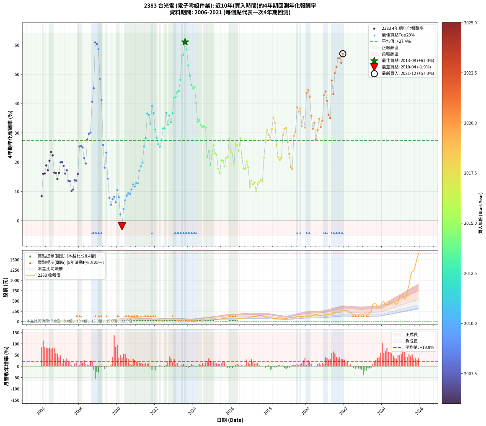

# 2383 台光電 - 本益比與未來報酬率分析

!!! info "報告資訊"
    - **股票代號**: 2383
    - **公司名稱**: 台光電
    - **產業別**: 電子零組件業
    - **分析期間**: 2006-2021 (192 個數據點)
    - **資料來源**: Type 12 (ShowMonthlyK_ChartFlow) 月收盤價與本益比
    - **報酬率口徑**: 含現金股利 (簡化: 年度合計，假設每年7/1入帳)
    - **報告生成時間**: 2026-01-22 22:42:34 CST

## 📈 視覺化圖表

### 圖表1: 本益比 vs 未來報酬率關係

*圖表1：2383 台光電 本益比與4年期未來報酬率關係 (2006-2021)*

### 圖表2: 歷年買入時點的4年期實際報酬率

*圖表2：2383 台光電 歷年買入時點的4年期實際報酬率 (2006-2021)*

## 📍 買點訊號說明

本報告提供兩種買點提示訊號（顯示於圖表2的股價子圖中）：

### ▲ 小綠色三角形（回測驗證）
- **計算方式**: 使用全部歷史資料計算本益比第25百分位數
- **用途**: 事後驗證，顯示歷史上哪些時點確實為低估區
- **限制**: 當下無法判斷，僅供回測參考
- **特性**: 後見之明（Look-Ahead Bias）

### ▲ 小橘色三角形（即時訊號）
- **計算方式**: 使用截至當月的過去5年資料計算本益比第25百分位數
- **用途**: 實際投資決策，當時即可判斷
- **優勢**: 可操作性強，符合實務需求
- **特性**: 無後見之明，滾動窗口計算

!!! tip "如何使用兩種訊號"
    - **綠色▲** 幫助理解歷史估值機會，驗證策略有效性
    - **橘色▲** 可作為實際買進參考，但仍需搭配基本面分析
    - 兩種訊號重疊時，表示即時判斷與事後驗證一致，信心度較高
    - 僅有綠色▲時，表示當時無法判斷（需要未來資料才能確認）
    - 僅有橘色▲時，表示即時判斷為買點，但事後可能不是最佳時機

## 📊 估值分析摘要

| 指標 | 數值 |
|:---:|:---:|
| **目前本益比** (2021-12) | **16.85 倍** |
| **歷史平均本益比** | 10.39 倍 |
| **估值水準** | 🔴 相對高估 |
| **預期4年年化報酬率** | **+30.94%** |
| **歷史平均報酬率** | +27.44% |
| **相關係數 (R²)** | 0.0118 |
| **趨勢線斜率** | 0.5423 |

!!! abstract "核心洞察"
    目前本益比顯著高於歷史平均，預期未來報酬率可能較低

    根據歷史數據回測，2383 台光電 在目前本益比 **16.9倍** 的估值水準下，
    預期未來4年年化報酬率約為 **+30.9%**。

    **重要提醒**: 本分析基於歷史數據統計，實際報酬率會受到公司基本面變化、產業趨勢、
    總體經濟環境等多重因素影響。R² = 0.01 表示本益比可解釋約 1.2% 的報酬率變異。

## 📈 歷史估值統計

### 最佳買點 (最高報酬率)

| 項目 | 數值 |
|:---:|:---:|
| 起始時間 | 2013-08 |
| 當時本益比 | 8.09 倍 |
| 起始價格 | 24.6 元 |
| 4年後價格 | 152.0 元 |
| **4年年化報酬率** | **+61.00%** |

### 最差買點 (最低報酬率)

| 項目 | 數值 |
|:---:|:---:|
| 起始時間 | 2010-04 |
| 當時本益比 | 10.77 倍 |
| 起始價格 | 35.5 元 |
| 4年後價格 | 26.9 元 |
| **4年年化報酬率** | **-1.87%** |

## 🎯 投資啟示

### 本益比與報酬率關係

趨勢線方程式: **y = 0.5423x + 21.8009**

!!! info "弱相關或正相關"
    本益比與未來報酬率相關性較弱。這可能表示該股票的報酬率更多受到
    公司成長性、產業趨勢等因素影響，而非估值水準。**需綜合考量多項指標**。

### 估值區間建議

基於歷史數據分析:

- **🟢 低估區** (P/E < 8.3): 預期報酬率較高，可考慮增加持股
- **🟡 合理區** (P/E 8.3-12.5): 預期報酬率符合長期趨勢，正常持有
- **🔴 高估區** (P/E > 12.5): 預期報酬率較低，可考慮減碼或觀望

!!! danger "風險提示"
    - 過去表現不代表未來結果
    - 本分析假設公司基本面無重大結構性變化
    - 產業環境劇變可能使歷史規律失效
    - 應結合公司財報、產業趨勢、總體經濟等多重因素綜合判斷

!!! success "長期投資觀點"
    歷史數據顯示，在合理或低估的估值水準買入並長期持有，
    往往能獲得較佳的投資報酬。**耐心等待好價格**是價值投資的核心原則。

## 📊 數據品質

- **資料來源**: GoodInfo.tw Type 12 (ShowMonthlyK_ChartFlow)
- **資料頻率**: 月度收盤價與本益比
- **回測期間**: 2006-2021
- **數據點數量**: 192 個 (每個點代表一次4年期回測)

### 計算方法說明

1. **4年期年化報酬率**:
   - 對每個歷史時點，計算其後4年的實際投資報酬率
   - 期末價值(不含股利): 期末價格
   - 期末價值(含現金股利): 期末價格 + 持有期間內的現金股利合計 (簡化: 年度合計，假設每年7/1入帳)
   - 公式: 年化報酬率 = [(期末價值/期初價格)^(1/年數) - 1] × 100%

2. **本益比 (P/E Ratio)**:
   - 使用當時的月收盤價與EPS計算
   - 資料來源: Type 12 月度河流圖本益比數據

3. **趨勢線 (Linear Regression)**:
   - 使用最小平方法擬合線性趨勢線
   - R²值衡量本益比對報酬率的解釋能力

---

*本報告由 Stock Analysis System v1.9.0 自動生成*
*數據更新時間: 2026-01-22 22:42:34 CST*

## 📋 月度回測明細表

（每一列對應時間線圖中的一個買入點；可用來對照 SVG 圖上的每個點。）

| 買入月份 | 賣出月份 | 回測期限_年 | 實際持有年數 | 買入本益比_倍 | 買入收盤價_元 | 賣出收盤價_元 | 現金股利合計_元 | 總報酬率_pct | 年化報酬率_pct |
| --- | --- | --- | --- | --- | --- | --- | --- | --- | --- |
| 2006-01 | 2010-01 | 4 | 4.000 | 9.07 | 16.15 | 21.50 | 0.79 | +38.01 | +8.39 |
| 2006-02 | 2010-02 | 4 | 4.000 | 7.81 | 13.90 | 24.40 | 0.79 | +81.21 | +16.02 |
| 2006-03 | 2010-03 | 4 | 4.000 | 9.80 | 17.45 | 30.95 | 0.79 | +81.88 | +16.13 |
| 2006-04 | 2010-04 | 4 | 4.000 | 10.22 | 18.20 | 35.55 | 0.79 | +99.66 | +18.87 |
| 2006-05 | 2010-05 | 4 | 4.000 | 9.04 | 16.10 | 29.60 | 0.79 | +88.75 | +17.21 |
| 2006-06 | 2010-06 | 4 | 4.000 | 7.58 | 13.50 | 27.65 | 0.79 | +110.65 | +20.47 |
| 2006-07 | 2010-07 | 4 | 4.000 | 7.58 | 13.50 | 29.90 | 1.48 | +132.48 | +23.48 |
| 2006-08 | 2010-08 | 4 | 4.000 | 7.64 | 13.60 | 28.95 | 1.48 | +123.79 | +22.31 |
| 2006-09 | 2010-09 | 4 | 4.000 | 9.33 | 16.60 | 29.00 | 1.48 | +83.64 | +16.41 |
| 2006-10 | 2010-10 | 4 | 4.000 | 9.24 | 16.45 | 28.60 | 1.48 | +82.89 | +16.29 |
| 2006-11 | 2010-11 | 4 | 4.000 | 9.80 | 17.45 | 28.20 | 1.48 | +70.11 | +14.21 |
| 2006-12 | 2010-12 | 4 | 4.000 | 9.92 | 17.65 | 30.85 | 1.48 | +83.20 | +16.34 |
| 2007-01 | 2011-01 | 4 | 4.000 | 8.82 | 15.50 | 30.60 | 1.48 | +107.00 | +19.95 |
| 2007-02 | 2011-02 | 4 | 4.000 | 9.27 | 16.10 | 31.95 | 1.48 | +107.67 | +20.04 |
| 2007-03 | 2011-03 | 4 | 4.000 | 9.91 | 17.00 | 32.30 | 1.48 | +98.74 | +18.73 |
| 2007-04 | 2011-04 | 4 | 4.000 | 10.07 | 17.05 | 29.50 | 1.48 | +81.73 | +16.11 |
| 2007-05 | 2011-05 | 4 | 4.000 | 9.72 | 16.25 | 29.20 | 1.48 | +88.83 | +17.22 |
| 2007-06 | 2011-06 | 4 | 4.000 | 10.42 | 17.20 | 27.25 | 1.48 | +67.06 | +13.69 |
| 2007-07 | 2011-07 | 4 | 4.000 | 11.05 | 18.00 | 27.00 | 2.82 | +65.68 | +13.45 |
| 2007-08 | 2011-08 | 4 | 4.000 | 10.77 | 17.30 | 22.65 | 2.82 | +47.24 | +10.16 |
| 2007-09 | 2011-09 | 4 | 4.000 | 11.01 | 17.45 | 23.35 | 2.82 | +49.98 | +10.67 |
| 2007-10 | 2011-10 | 4 | 4.000 | 10.11 | 15.80 | 23.75 | 2.82 | +68.18 | +13.88 |
| 2007-11 | 2011-11 | 4 | 4.000 | 8.50 | 13.10 | 19.05 | 2.82 | +66.96 | +13.67 |
| 2007-12 | 2011-12 | 4 | 4.000 | 7.83 | 11.90 | 18.70 | 2.82 | +80.86 | +15.97 |
| 2008-01 | 2012-01 | 4 | 4.000 | 7.01 | 10.05 | 22.00 | 2.82 | +146.99 | +25.36 |
| 2008-02 | 2012-02 | 4 | 4.000 | 8.38 | 11.30 | 25.20 | 2.82 | +147.98 | +25.49 |
| 2008-03 | 2012-03 | 4 | 4.000 | 9.78 | 12.35 | 27.35 | 2.82 | +144.31 | +25.02 |
| 2008-04 | 2012-04 | 4 | 4.000 | 11.52 | 13.55 | 26.55 | 2.82 | +116.77 | +21.34 |
| 2008-05 | 2012-05 | 4 | 4.000 | 13.80 | 15.05 | 27.90 | 2.82 | +104.13 | +19.53 |
| 2008-06 | 2012-06 | 4 | 4.000 | 11.44 | 11.50 | 27.80 | 2.82 | +166.28 | +27.74 |
| 2008-07 | 2012-07 | 4 | 4.000 | 12.35 | 11.35 | 27.70 | 4.42 | +182.98 | +29.70 |
| 2008-08 | 2012-08 | 4 | 4.000 | 13.44 | 11.20 | 27.70 | 4.42 | +186.77 | +30.13 |
| 2008-09 | 2012-09 | 4 | 4.000 | 12.04 | 9.00 | 30.80 | 4.42 | +291.31 | +40.65 |
| 2008-10 | 2012-10 | 4 | 4.000 | 11.32 | 7.49 | 28.90 | 4.42 | +344.83 | +45.23 |
| 2008-11 | 2012-11 | 4 | 4.000 | 8.80 | 5.07 | 29.55 | 4.42 | +569.98 | +60.88 |
| 2008-12 | 2012-12 | 4 | 4.000 | 10.24 | 5.02 | 28.75 | 4.42 | +560.72 | +60.33 |
| 2009-01 | 2013-01 | 4 | 4.000 | 7.87 | 5.37 | 29.50 | 4.42 | +531.62 | +58.53 |
| 2009-02 | 2013-02 | 4 | 4.000 | 8.07 | 7.06 | 29.90 | 4.42 | +386.09 | +48.48 |
| 2009-03 | 2013-03 | 4 | 4.000 | 8.10 | 8.65 | 30.00 | 4.42 | +297.90 | +41.24 |
| 2009-04 | 2013-04 | 4 | 4.000 | 10.95 | 13.80 | 30.20 | 4.42 | +150.86 | +25.85 |
| 2009-05 | 2013-05 | 4 | 4.000 | 11.53 | 16.75 | 28.15 | 4.42 | +94.44 | +18.08 |
| 2009-06 | 2013-06 | 4 | 4.000 | 8.12 | 13.35 | 26.40 | 4.42 | +130.85 | +23.26 |
| 2009-07 | 2013-07 | 4 | 4.000 | 10.53 | 19.35 | 27.10 | 6.02 | +71.15 | +14.38 |
| 2009-08 | 2013-08 | 4 | 4.000 | 11.16 | 22.65 | 24.60 | 6.02 | +35.18 | +7.83 |
| 2009-09 | 2013-09 | 4 | 4.000 | 11.25 | 25.00 | 24.95 | 6.02 | +23.87 | +5.50 |
| 2009-10 | 2013-10 | 4 | 4.000 | 9.46 | 22.85 | 24.30 | 6.02 | +32.68 | +7.33 |
| 2009-11 | 2013-11 | 4 | 4.000 | 8.82 | 23.00 | 25.50 | 6.02 | +37.03 | +8.20 |
| 2009-12 | 2013-12 | 4 | 4.000 | 8.68 | 24.30 | 25.00 | 6.02 | +27.65 | +6.29 |
| 2010-01 | 2014-01 | 4 | 4.000 | 7.35 | 21.50 | 26.00 | 6.02 | +48.92 | +10.47 |
| 2010-02 | 2014-02 | 4 | 4.000 | 8.00 | 24.40 | 27.20 | 6.02 | +36.14 | +8.02 |
| 2010-03 | 2014-03 | 4 | 4.000 | 9.75 | 30.95 | 27.70 | 6.02 | +8.94 | +2.16 |
| 2010-04 | 2014-04 | 4 | 4.000 | 10.77 | 35.55 | 26.95 | 6.02 | -7.26 | -1.87 |
| 2010-05 | 2014-05 | 4 | 4.000 | 8.64 | 29.60 | 28.60 | 6.02 | +16.95 | +3.99 |
| 2010-06 | 2014-06 | 4 | 4.000 | 7.79 | 27.65 | 30.15 | 6.02 | +30.81 | +6.94 |
| 2010-07 | 2014-07 | 4 | 4.000 | 8.14 | 29.90 | 34.45 | 7.12 | +39.03 | +8.59 |
| 2010-08 | 2014-08 | 4 | 4.000 | 7.62 | 28.95 | 34.35 | 7.12 | +43.24 | +9.40 |
| 2010-09 | 2014-09 | 4 | 4.000 | 7.39 | 29.00 | 33.90 | 7.12 | +41.44 | +9.06 |
| 2010-10 | 2014-10 | 4 | 4.000 | 7.06 | 28.60 | 35.75 | 7.12 | +49.89 | +10.65 |
| 2010-11 | 2014-11 | 4 | 4.000 | 6.75 | 28.20 | 37.90 | 7.12 | +59.64 | +12.41 |
| 2010-12 | 2014-12 | 4 | 4.000 | 7.17 | 30.85 | 40.90 | 7.12 | +55.65 | +11.70 |
| 2011-01 | 2015-01 | 4 | 4.000 | 7.32 | 30.60 | 42.65 | 7.12 | +62.64 | +12.93 |
| 2011-02 | 2015-02 | 4 | 4.000 | 7.87 | 31.95 | 44.55 | 7.12 | +61.72 | +12.77 |
| 2011-03 | 2015-03 | 4 | 4.000 | 8.19 | 32.30 | 53.60 | 7.12 | +87.98 | +17.09 |
| 2011-04 | 2015-04 | 4 | 4.000 | 7.72 | 29.50 | 51.20 | 7.12 | +97.69 | +18.58 |
| 2011-05 | 2015-05 | 4 | 4.000 | 7.88 | 29.20 | 53.10 | 7.12 | +106.23 | +19.84 |
| 2011-06 | 2015-06 | 4 | 4.000 | 7.60 | 27.25 | 60.10 | 7.12 | +146.68 | +25.32 |
| 2011-07 | 2015-07 | 4 | 4.000 | 7.79 | 27.00 | 65.00 | 7.89 | +169.95 | +28.18 |
| 2011-08 | 2015-08 | 4 | 4.000 | 6.77 | 22.65 | 71.00 | 7.89 | +248.28 | +36.61 |
| 2011-09 | 2015-09 | 4 | 4.000 | 7.23 | 23.35 | 72.40 | 7.89 | +243.84 | +36.17 |
| 2011-10 | 2015-10 | 4 | 4.000 | 7.64 | 23.75 | 66.70 | 7.89 | +214.05 | +33.12 |
| 2011-11 | 2015-11 | 4 | 4.000 | 6.37 | 19.05 | 63.50 | 7.89 | +274.73 | +39.13 |
| 2011-12 | 2015-12 | 4 | 4.000 | 6.52 | 18.70 | 57.50 | 7.89 | +249.66 | +36.74 |
| 2012-01 | 2016-01 | 4 | 4.000 | 7.48 | 22.00 | 57.20 | 7.89 | +195.85 | +31.15 |
| 2012-02 | 2016-02 | 4 | 4.000 | 8.36 | 25.20 | 60.50 | 7.89 | +171.37 | +28.35 |
| 2012-03 | 2016-03 | 4 | 4.000 | 8.86 | 27.35 | 61.30 | 7.89 | +152.97 | +26.11 |
| 2012-04 | 2016-04 | 4 | 4.000 | 8.40 | 26.55 | 57.60 | 7.89 | +146.65 | +25.32 |
| 2012-05 | 2016-05 | 4 | 4.000 | 8.63 | 27.90 | 65.70 | 7.89 | +163.75 | +27.44 |
| 2012-06 | 2016-06 | 4 | 4.000 | 8.41 | 27.80 | 75.20 | 7.89 | +198.87 | +31.48 |
| 2012-07 | 2016-07 | 4 | 4.000 | 8.20 | 27.70 | 72.50 | 10.38 | +199.20 | +31.52 |
| 2012-08 | 2016-08 | 4 | 4.000 | 8.03 | 27.70 | 86.60 | 10.38 | +250.10 | +36.79 |
| 2012-09 | 2016-09 | 4 | 4.000 | 8.74 | 30.80 | 85.50 | 10.38 | +211.30 | +32.83 |
| 2012-10 | 2016-10 | 4 | 4.000 | 8.04 | 28.90 | 88.10 | 10.38 | +240.76 | +35.87 |
| 2012-11 | 2016-11 | 4 | 4.000 | 8.06 | 29.55 | 83.80 | 10.38 | +218.71 | +33.61 |
| 2012-12 | 2016-12 | 4 | 4.000 | 7.69 | 28.75 | 90.00 | 10.38 | +249.14 | +36.69 |
| 2013-01 | 2017-01 | 4 | 4.000 | 8.08 | 29.50 | 109.50 | 10.38 | +306.37 | +41.98 |
| 2013-02 | 2017-02 | 4 | 4.000 | 8.39 | 29.90 | 112.50 | 10.38 | +310.97 | +42.38 |
| 2013-03 | 2017-03 | 4 | 4.000 | 8.63 | 30.00 | 118.00 | 10.38 | +327.93 | +43.83 |
| 2013-04 | 2017-04 | 4 | 4.000 | 8.91 | 30.20 | 120.50 | 10.38 | +333.37 | +44.28 |
| 2013-05 | 2017-05 | 4 | 4.000 | 8.52 | 28.15 | 125.00 | 10.38 | +380.92 | +48.09 |
| 2013-06 | 2017-06 | 4 | 4.000 | 8.21 | 26.40 | 147.50 | 10.38 | +498.03 | +56.38 |
| 2013-07 | 2017-07 | 4 | 4.000 | 8.67 | 27.10 | 149.50 | 13.28 | +500.68 | +56.55 |
| 2013-08 | 2017-08 | 4 | 4.000 | 8.09 | 24.60 | 152.00 | 13.28 | +571.88 | +61.00 |
| 2013-09 | 2017-09 | 4 | 4.000 | 8.45 | 24.95 | 144.00 | 13.28 | +530.39 | +58.45 |
| 2013-10 | 2017-10 | 4 | 4.000 | 8.48 | 24.30 | 120.00 | 13.28 | +448.49 | +53.04 |
| 2013-11 | 2017-11 | 4 | 4.000 | 9.18 | 25.50 | 114.00 | 13.28 | +399.15 | +49.47 |
| 2013-12 | 2017-12 | 4 | 4.000 | 9.29 | 25.00 | 101.50 | 13.28 | +359.13 | +46.38 |
| 2014-01 | 2018-01 | 4 | 4.000 | 9.04 | 26.00 | 102.50 | 13.28 | +345.32 | +45.27 |
| 2014-02 | 2018-02 | 4 | 4.000 | 8.89 | 27.20 | 109.50 | 13.28 | +351.41 | +45.76 |
| 2014-03 | 2018-03 | 4 | 4.000 | 8.54 | 27.70 | 93.80 | 13.28 | +286.58 | +40.22 |
| 2014-04 | 2018-04 | 4 | 4.000 | 7.86 | 26.95 | 73.00 | 13.28 | +220.16 | +33.76 |
| 2014-05 | 2018-05 | 4 | 4.000 | 7.91 | 28.60 | 80.20 | 13.28 | +226.86 | +34.46 |
| 2014-06 | 2018-06 | 4 | 4.000 | 7.93 | 30.15 | 79.80 | 13.28 | +208.73 | +32.55 |
| 2014-07 | 2018-07 | 4 | 4.000 | 8.64 | 34.45 | 88.00 | 16.29 | +202.71 | +31.90 |
| 2014-08 | 2018-08 | 4 | 4.000 | 8.24 | 34.35 | 88.80 | 16.29 | +205.92 | +32.25 |
| 2014-09 | 2018-09 | 4 | 4.000 | 7.78 | 33.90 | 86.00 | 16.29 | +201.73 | +31.80 |
| 2014-10 | 2018-10 | 4 | 4.000 | 7.87 | 35.75 | 61.90 | 16.29 | +118.70 | +21.61 |
| 2014-11 | 2018-11 | 4 | 4.000 | 8.02 | 37.90 | 72.90 | 16.29 | +135.32 | +23.85 |
| 2014-12 | 2018-12 | 4 | 4.000 | 8.33 | 40.90 | 65.70 | 16.29 | +100.45 | +18.99 |
| 2015-01 | 2019-01 | 4 | 4.000 | 8.31 | 42.65 | 80.00 | 16.29 | +125.76 | +22.58 |
| 2015-02 | 2019-02 | 4 | 4.000 | 8.33 | 44.55 | 95.20 | 16.29 | +150.25 | +25.77 |
| 2015-03 | 2019-03 | 4 | 4.000 | 9.62 | 53.60 | 106.50 | 16.29 | +129.08 | +23.03 |
| 2015-04 | 2019-04 | 4 | 4.000 | 8.84 | 51.20 | 99.20 | 16.29 | +125.56 | +22.55 |
| 2015-05 | 2019-05 | 4 | 4.000 | 8.84 | 53.10 | 85.90 | 16.29 | +92.44 | +17.78 |
| 2015-06 | 2019-06 | 4 | 4.000 | 9.65 | 60.10 | 93.70 | 16.29 | +83.00 | +16.31 |
| 2015-07 | 2019-07 | 4 | 4.000 | 10.08 | 65.00 | 120.00 | 17.59 | +111.68 | +20.62 |
| 2015-08 | 2019-08 | 4 | 4.000 | 10.64 | 71.00 | 132.00 | 17.59 | +110.69 | +20.48 |
| 2015-09 | 2019-09 | 4 | 4.000 | 10.51 | 72.40 | 125.50 | 17.59 | +97.64 | +18.57 |
| 2015-10 | 2019-10 | 4 | 4.000 | 9.38 | 66.70 | 127.50 | 17.59 | +117.52 | +21.44 |
| 2015-11 | 2019-11 | 4 | 4.000 | 8.66 | 63.50 | 122.00 | 17.59 | +119.83 | +21.76 |
| 2015-12 | 2019-12 | 4 | 4.000 | 7.62 | 57.50 | 137.00 | 17.59 | +168.85 | +28.05 |
| 2016-01 | 2020-01 | 4 | 4.000 | 7.48 | 57.20 | 115.50 | 17.59 | +132.67 | +23.51 |
| 2016-02 | 2020-02 | 4 | 4.000 | 7.81 | 60.50 | 120.00 | 17.59 | +127.42 | +22.80 |
| 2016-03 | 2020-03 | 4 | 4.000 | 7.82 | 61.30 | 106.00 | 17.59 | +101.61 | +19.16 |
| 2016-04 | 2020-04 | 4 | 4.000 | 7.26 | 57.60 | 130.00 | 17.59 | +156.23 | +26.52 |
| 2016-05 | 2020-05 | 4 | 4.000 | 8.18 | 65.70 | 147.50 | 17.59 | +151.28 | +25.90 |
| 2016-06 | 2020-06 | 4 | 4.000 | 9.26 | 75.20 | 159.50 | 17.59 | +135.49 | +23.88 |
| 2016-07 | 2020-07 | 4 | 4.000 | 8.82 | 72.50 | 177.00 | 19.06 | +170.43 | +28.24 |
| 2016-08 | 2020-08 | 4 | 4.000 | 10.41 | 86.60 | 170.00 | 19.06 | +118.31 | +21.55 |
| 2016-09 | 2020-09 | 4 | 4.000 | 10.16 | 85.50 | 146.00 | 19.06 | +93.05 | +17.87 |
| 2016-10 | 2020-10 | 4 | 4.000 | 10.35 | 88.10 | 150.00 | 19.06 | +91.90 | +17.70 |
| 2016-11 | 2020-11 | 4 | 4.000 | 9.74 | 83.80 | 156.00 | 19.06 | +108.90 | +20.22 |
| 2016-12 | 2020-12 | 4 | 4.000 | 10.34 | 90.00 | 157.00 | 19.06 | +95.62 | +18.26 |
| 2017-01 | 2021-01 | 4 | 4.000 | 12.58 | 109.50 | 150.50 | 19.06 | +54.85 | +11.55 |
| 2017-02 | 2021-02 | 4 | 4.000 | 12.92 | 112.50 | 169.00 | 19.06 | +67.16 | +13.71 |
| 2017-03 | 2021-03 | 4 | 4.000 | 13.55 | 118.00 | 169.00 | 19.06 | +59.37 | +12.36 |
| 2017-04 | 2021-04 | 4 | 4.000 | 13.83 | 120.50 | 178.00 | 19.06 | +63.54 | +13.08 |
| 2017-05 | 2021-05 | 4 | 4.000 | 14.34 | 125.00 | 164.00 | 19.06 | +46.45 | +10.01 |
| 2017-06 | 2021-06 | 4 | 4.000 | 16.92 | 147.50 | 218.00 | 19.06 | +60.72 | +12.59 |
| 2017-07 | 2021-07 | 4 | 4.000 | 17.14 | 149.50 | 225.00 | 21.36 | +64.79 | +13.30 |
| 2017-08 | 2021-08 | 4 | 4.000 | 17.42 | 152.00 | 234.00 | 21.36 | +68.00 | +13.85 |
| 2017-09 | 2021-09 | 4 | 4.000 | 16.49 | 144.00 | 217.50 | 21.36 | +65.88 | +13.49 |
| 2017-10 | 2021-10 | 4 | 4.000 | 13.74 | 120.00 | 240.50 | 21.36 | +118.22 | +21.54 |
| 2017-11 | 2021-11 | 4 | 4.000 | 13.05 | 114.00 | 280.00 | 21.36 | +164.35 | +27.51 |
| 2017-12 | 2021-12 | 4 | 4.000 | 11.61 | 101.50 | 278.00 | 21.36 | +194.94 | +31.05 |
| 2018-01 | 2022-01 | 4 | 4.000 | 12.10 | 102.50 | 264.50 | 21.36 | +178.89 | +29.23 |
| 2018-02 | 2022-02 | 4 | 4.000 | 13.36 | 109.50 | 270.00 | 21.36 | +166.08 | +27.72 |
| 2018-03 | 2022-03 | 4 | 4.000 | 11.84 | 93.80 | 258.00 | 21.36 | +197.83 | +31.37 |
| 2018-04 | 2022-04 | 4 | 4.000 | 9.54 | 73.00 | 222.00 | 21.36 | +233.37 | +35.12 |
| 2018-05 | 2022-05 | 4 | 4.000 | 10.86 | 80.20 | 232.50 | 21.36 | +216.54 | +33.38 |
| 2018-06 | 2022-06 | 4 | 4.000 | 11.22 | 79.80 | 178.50 | 21.36 | +150.45 | +25.80 |
| 2018-07 | 2022-07 | 4 | 4.000 | 12.87 | 88.00 | 166.00 | 26.56 | +118.82 | +21.62 |
| 2018-08 | 2022-08 | 4 | 4.000 | 13.52 | 88.80 | 162.00 | 26.56 | +112.34 | +20.71 |
| 2018-09 | 2022-09 | 4 | 4.000 | 13.66 | 86.00 | 160.00 | 26.56 | +116.93 | +21.36 |
| 2018-10 | 2022-10 | 4 | 4.000 | 10.28 | 61.90 | 146.50 | 26.56 | +179.58 | +29.31 |
| 2018-11 | 2022-11 | 4 | 4.000 | 12.67 | 72.90 | 190.50 | 26.56 | +197.75 | +31.36 |
| 2018-12 | 2022-12 | 4 | 4.000 | 11.99 | 65.70 | 171.00 | 26.56 | +200.70 | +31.68 |
| 2019-01 | 2023-01 | 4 | 4.000 | 13.63 | 80.00 | 180.50 | 26.56 | +158.83 | +26.84 |
| 2019-02 | 2023-02 | 4 | 4.000 | 15.22 | 95.20 | 190.50 | 26.56 | +128.01 | +22.88 |
| 2019-03 | 2023-03 | 4 | 4.000 | 16.03 | 106.50 | 182.00 | 26.56 | +95.83 | +18.30 |
| 2019-04 | 2023-04 | 4 | 4.000 | 14.10 | 99.20 | 163.50 | 26.56 | +91.59 | +17.65 |
| 2019-05 | 2023-05 | 4 | 4.000 | 11.57 | 85.90 | 211.00 | 26.56 | +176.56 | +28.96 |
| 2019-06 | 2023-06 | 4 | 4.000 | 12.00 | 93.70 | 243.50 | 26.56 | +188.22 | +30.30 |
| 2019-07 | 2023-07 | 4 | 4.000 | 14.64 | 120.00 | 414.00 | 31.17 | +270.97 | +38.78 |
| 2019-08 | 2023-08 | 4 | 4.000 | 15.37 | 132.00 | 437.50 | 31.17 | +255.05 | +37.27 |
| 2019-09 | 2023-09 | 4 | 4.000 | 13.98 | 125.50 | 428.00 | 31.17 | +265.87 | +38.30 |
| 2019-10 | 2023-10 | 4 | 4.000 | 13.62 | 127.50 | 359.00 | 31.17 | +206.01 | +32.26 |
| 2019-11 | 2023-11 | 4 | 4.000 | 12.51 | 122.00 | 380.00 | 31.17 | +237.02 | +35.49 |
| 2019-12 | 2023-12 | 4 | 4.000 | 13.51 | 137.00 | 382.00 | 31.17 | +201.58 | +31.78 |
| 2020-01 | 2024-01 | 4 | 4.000 | 11.28 | 115.50 | 461.00 | 31.17 | +326.12 | +43.68 |
| 2020-02 | 2024-02 | 4 | 4.000 | 11.61 | 120.00 | 495.00 | 31.17 | +338.47 | +44.71 |
| 2020-03 | 2024-03 | 4 | 4.000 | 10.16 | 106.00 | 403.50 | 31.17 | +310.07 | +42.30 |
| 2020-04 | 2024-04 | 4 | 4.000 | 12.34 | 130.00 | 412.00 | 31.17 | +240.90 | +35.88 |
| 2020-05 | 2024-05 | 4 | 4.000 | 13.87 | 147.50 | 408.50 | 31.17 | +198.08 | +31.40 |
| 2020-06 | 2024-06 | 4 | 4.000 | 14.86 | 159.50 | 475.00 | 31.17 | +217.35 | +33.47 |
| 2020-07 | 2024-07 | 4 | 4.000 | 16.34 | 177.00 | 438.00 | 35.39 | +167.45 | +27.88 |
| 2020-08 | 2024-08 | 4 | 4.000 | 15.55 | 170.00 | 465.00 | 35.39 | +194.34 | +30.98 |
| 2020-09 | 2024-09 | 4 | 4.000 | 13.23 | 146.00 | 447.00 | 35.39 | +230.40 | +34.82 |
| 2020-10 | 2024-10 | 4 | 4.000 | 13.48 | 150.00 | 419.50 | 35.39 | +203.26 | +31.96 |
| 2020-11 | 2024-11 | 4 | 4.000 | 13.89 | 156.00 | 468.50 | 35.39 | +223.00 | +34.06 |
| 2020-12 | 2024-12 | 4 | 4.000 | 13.86 | 157.00 | 618.00 | 35.39 | +316.17 | +42.83 |
| 2021-01 | 2025-01 | 4 | 4.000 | 12.80 | 150.50 | 614.00 | 35.39 | +331.49 | +44.13 |
| 2021-02 | 2025-02 | 4 | 4.000 | 13.86 | 169.00 | 632.00 | 35.39 | +294.90 | +40.97 |
| 2021-03 | 2025-03 | 4 | 4.000 | 13.39 | 169.00 | 545.00 | 35.39 | +243.42 | +36.13 |
| 2021-04 | 2025-04 | 4 | 4.000 | 13.64 | 178.00 | 556.00 | 35.39 | +232.24 | +35.01 |
| 2021-05 | 2025-05 | 4 | 4.000 | 12.16 | 164.00 | 749.00 | 35.39 | +378.28 | +47.88 |
| 2021-06 | 2025-06 | 4 | 4.000 | 15.67 | 218.00 | 882.00 | 35.39 | +320.82 | +43.23 |
| 2021-07 | 2025-07 | 4 | 4.000 | 15.68 | 225.00 | 1105.00 | 44.97 | +411.10 | +50.36 |
| 2021-08 | 2025-08 | 4 | 4.000 | 15.84 | 234.00 | 1220.00 | 44.97 | +440.58 | +52.48 |
| 2021-09 | 2025-09 | 4 | 4.000 | 14.30 | 217.50 | 1225.00 | 44.97 | +483.89 | +55.45 |
| 2021-10 | 2025-10 | 4 | 4.000 | 15.38 | 240.50 | 1360.00 | 44.97 | +484.19 | +55.47 |
| 2021-11 | 2025-11 | 4 | 4.000 | 17.42 | 280.00 | 1525.00 | 44.97 | +460.70 | +53.88 |
| 2021-12 | 2025-12 | 4 | 4.000 | 16.85 | 278.00 | 1645.00 | 44.97 | +507.90 | +57.02 |
