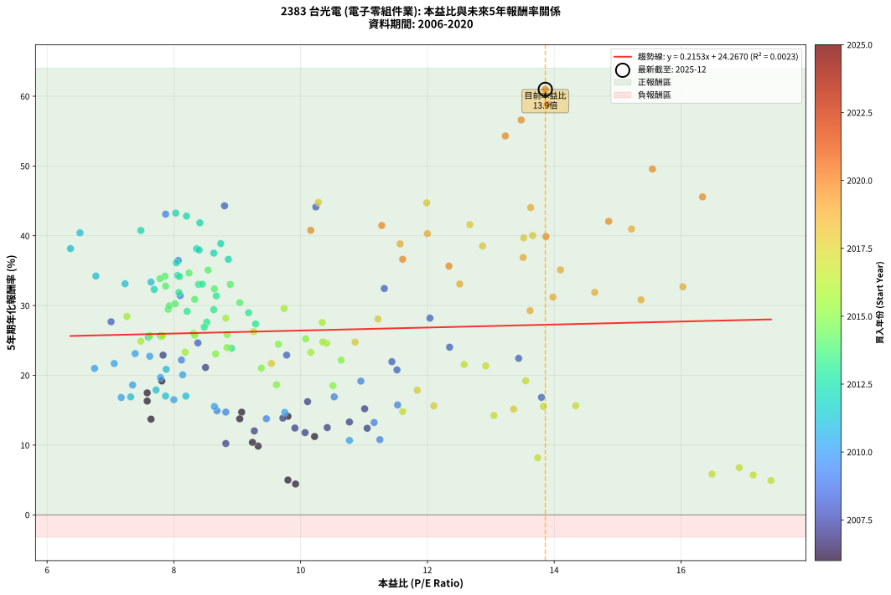
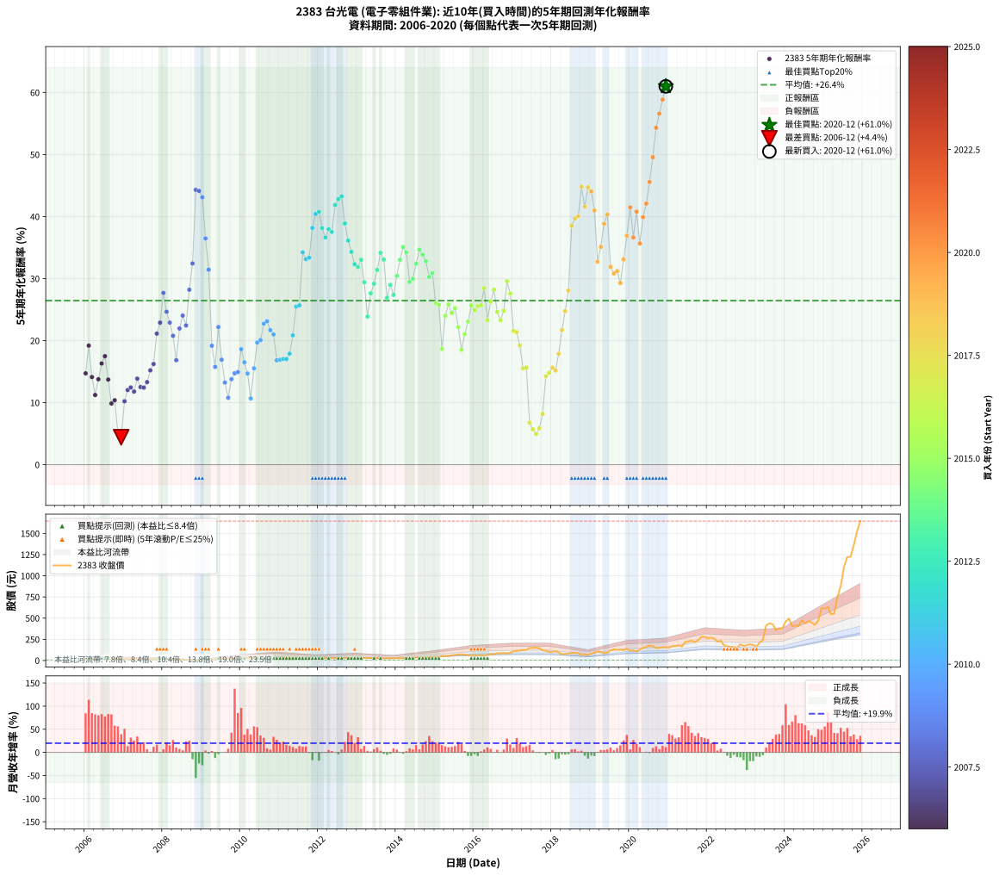

# 2383 台光電 - 本益比與未來報酬率分析

!!! info "報告資訊"
    - **股票代號**: 2383
    - **公司名稱**: 台光電
    - **產業別**: 電子零組件業
    - **分析期間**: 2006-2020 (180 個數據點)
    - **資料來源**: Type 12 (ShowMonthlyK_ChartFlow) 月收盤價與本益比
    - **報酬率口徑**: 含現金股利 (簡化: 年度合計，假設每年7/1入帳)
    - **報告生成時間**: 2026-01-06 00:38:03 CST

## 📈 視覺化圖表

### 圖表1: 本益比 vs 未來報酬率關係

*圖表1：2383 台光電 本益比與5年期未來報酬率關係 (2006-2020)*

### 圖表2: 歷年買入時點的5年期實際報酬率

*圖表2：2383 台光電 歷年買入時點的5年期實際報酬率 (2006-2020)*

## 📍 買點訊號說明

本報告提供兩種買點提示訊號（顯示於圖表2的股價子圖中）：

### ▲ 小綠色三角形（回測驗證）
- **計算方式**: 使用全部歷史資料計算本益比第25百分位數
- **用途**: 事後驗證，顯示歷史上哪些時點確實為低估區
- **限制**: 當下無法判斷，僅供回測參考
- **特性**: 後見之明（Look-Ahead Bias）

### ▲ 小橘色三角形（即時訊號）
- **計算方式**: 使用截至當月的過去5年資料計算本益比第25百分位數
- **用途**: 實際投資決策，當時即可判斷
- **優勢**: 可操作性強，符合實務需求
- **特性**: 無後見之明，滾動窗口計算

!!! tip "如何使用兩種訊號"
    - **綠色▲** 幫助理解歷史估值機會，驗證策略有效性
    - **橘色▲** 可作為實際買進參考，但仍需搭配基本面分析
    - 兩種訊號重疊時，表示即時判斷與事後驗證一致，信心度較高
    - 僅有綠色▲時，表示當時無法判斷（需要未來資料才能確認）
    - 僅有橘色▲時，表示即時判斷為買點，但事後可能不是最佳時機

## 📊 估值分析摘要

| 指標 | 數值 |
|:---:|:---:|
| **目前本益比** (2020-12) | **13.86 倍** |
| **歷史平均本益比** | 10.10 倍 |
| **估值水準** | 🔴 相對高估 |
| **預期5年年化報酬率** | **+27.25%** |
| **歷史平均報酬率** | +26.44% |
| **相關係數 (R²)** | 0.0023 |
| **趨勢線斜率** | 0.2153 |

!!! abstract "核心洞察"
    目前本益比顯著高於歷史平均，預期未來報酬率可能較低

    根據歷史數據回測，2383 台光電 在目前本益比 **13.9倍** 的估值水準下，
    預期未來5年年化報酬率約為 **+27.3%**。

    **重要提醒**: 本分析基於歷史數據統計，實際報酬率會受到公司基本面變化、產業趨勢、
    總體經濟環境等多重因素影響。R² = 0.00 表示本益比可解釋約 0.2% 的報酬率變異。

## 📈 歷史估值統計

### 最佳買點 (最高報酬率)

| 項目 | 數值 |
|:---:|:---:|
| 起始時間 | 2020-12 |
| 當時本益比 | 13.86 倍 |
| 起始價格 | 157.0 元 |
| 5年後價格 | 1645.0 元 |
| **5年年化報酬率** | **+60.98%** |

### 最差買點 (最低報酬率)

| 項目 | 數值 |
|:---:|:---:|
| 起始時間 | 2006-12 |
| 當時本益比 | 9.92 倍 |
| 起始價格 | 17.6 元 |
| 5年後價格 | 18.7 元 |
| **5年年化報酬率** | **+4.42%** |

## 🎯 投資啟示

### 本益比與報酬率關係

趨勢線方程式: **y = 0.2153x + 24.2670**

!!! info "弱相關或正相關"
    本益比與未來報酬率相關性較弱。這可能表示該股票的報酬率更多受到
    公司成長性、產業趨勢等因素影響，而非估值水準。**需綜合考量多項指標**。

### 估值區間建議

基於歷史數據分析:

- **🟢 低估區** (P/E < 8.1): 預期報酬率較高，可考慮增加持股
- **🟡 合理區** (P/E 8.1-12.1): 預期報酬率符合長期趨勢，正常持有
- **🔴 高估區** (P/E > 12.1): 預期報酬率較低，可考慮減碼或觀望

!!! danger "風險提示"
    - 過去表現不代表未來結果
    - 本分析假設公司基本面無重大結構性變化
    - 產業環境劇變可能使歷史規律失效
    - 應結合公司財報、產業趨勢、總體經濟等多重因素綜合判斷

!!! success "長期投資觀點"
    歷史數據顯示，在合理或低估的估值水準買入並長期持有，
    往往能獲得較佳的投資報酬。**耐心等待好價格**是價值投資的核心原則。

## 📊 數據品質

- **資料來源**: GoodInfo.tw Type 12 (ShowMonthlyK_ChartFlow)
- **資料頻率**: 月度收盤價與本益比
- **回測期間**: 2006-2020
- **數據點數量**: 180 個 (每個點代表一次5年期回測)

### 計算方法說明

1. **5年期年化報酬率**:
   - 對每個歷史時點，計算其後5年的實際投資報酬率
   - 期末價值(不含股利): 期末價格
   - 期末價值(含現金股利): 期末價格 + 持有期間內的現金股利合計 (簡化: 年度合計，假設每年7/1入帳)
   - 公式: 年化報酬率 = [(期末價值/期初價格)^(1/年數) - 1] × 100%

2. **本益比 (P/E Ratio)**:
   - 使用當時的月收盤價與EPS計算
   - 資料來源: Type 12 月度河流圖本益比數據

3. **趨勢線 (Linear Regression)**:
   - 使用最小平方法擬合線性趨勢線
   - R²值衡量本益比對報酬率的解釋能力

---

*本報告由 Stock Analysis System v1.9.0 自動生成*
*數據更新時間: 2026-01-06 00:38:03 CST*

## 📋 月度回測明細表

（每一列對應時間線圖中的一個買入點；可用來對照 SVG 圖上的每個點。）

| 買入月份 | 賣出月份 | 回測期限_年 | 實際持有年數 | 買入本益比_倍 | 買入收盤價_元 | 賣出收盤價_元 | 現金股利合計_元 | 總報酬率_pct | 年化報酬率_pct |
| --- | --- | --- | --- | --- | --- | --- | --- | --- | --- |
| 2006-01 | 2011-01 | 5 | 4.999 | 9.07 | 16.15 | 30.60 | 1.48 | +98.67 | +14.72 |
| 2006-02 | 2011-02 | 5 | 4.999 | 7.81 | 13.90 | 31.95 | 1.48 | +140.54 | +19.19 |
| 2006-03 | 2011-03 | 5 | 4.999 | 9.80 | 17.45 | 32.30 | 1.48 | +93.61 | +14.13 |
| 2006-04 | 2011-04 | 5 | 4.999 | 10.22 | 18.20 | 29.50 | 1.48 | +70.25 | +11.23 |
| 2006-05 | 2011-05 | 5 | 4.999 | 9.04 | 16.10 | 29.20 | 1.48 | +90.59 | +13.77 |
| 2006-06 | 2011-06 | 5 | 4.999 | 7.58 | 13.50 | 27.25 | 1.48 | +112.85 | +16.31 |
| 2006-07 | 2011-07 | 5 | 4.999 | 7.58 | 13.50 | 27.00 | 3.21 | +123.81 | +17.49 |
| 2006-08 | 2011-08 | 5 | 4.999 | 7.64 | 13.60 | 22.65 | 3.21 | +90.18 | +13.72 |
| 2006-09 | 2011-09 | 5 | 4.999 | 9.33 | 16.60 | 23.35 | 3.21 | +60.02 | +9.86 |
| 2006-10 | 2011-10 | 5 | 4.999 | 9.24 | 16.45 | 23.75 | 3.21 | +63.91 | +10.39 |
| 2006-11 | 2011-11 | 5 | 4.999 | 9.80 | 17.45 | 19.05 | 3.21 | +27.59 | +4.99 |
| 2006-12 | 2011-12 | 5 | 4.999 | 9.92 | 17.65 | 18.70 | 3.21 | +24.16 | +4.42 |
| 2007-01 | 2012-01 | 5 | 4.999 | 8.82 | 15.50 | 22.00 | 3.21 | +62.67 | +10.22 |
| 2007-02 | 2012-02 | 5 | 4.999 | 9.27 | 16.10 | 25.20 | 3.21 | +76.48 | +12.03 |
| 2007-03 | 2012-03 | 5 | 5.002 | 9.91 | 17.00 | 27.35 | 3.21 | +79.79 | +12.44 |
| 2007-04 | 2012-04 | 5 | 5.002 | 10.07 | 17.05 | 26.55 | 3.21 | +74.57 | +11.78 |
| 2007-05 | 2012-05 | 5 | 5.002 | 9.72 | 16.25 | 27.90 | 3.21 | +91.47 | +13.87 |
| 2007-06 | 2012-06 | 5 | 5.002 | 10.42 | 17.20 | 27.80 | 3.21 | +80.31 | +12.51 |
| 2007-07 | 2012-07 | 5 | 5.002 | 11.05 | 18.00 | 27.70 | 4.62 | +79.56 | +12.41 |
| 2007-08 | 2012-08 | 5 | 5.002 | 10.77 | 17.30 | 27.70 | 4.62 | +86.82 | +13.31 |
| 2007-09 | 2012-09 | 5 | 5.002 | 11.01 | 17.45 | 30.80 | 4.62 | +102.98 | +15.20 |
| 2007-10 | 2012-10 | 5 | 5.002 | 10.11 | 15.80 | 28.90 | 4.62 | +112.15 | +16.23 |
| 2007-11 | 2012-11 | 5 | 5.002 | 8.50 | 13.10 | 29.55 | 4.62 | +160.84 | +21.13 |
| 2007-12 | 2012-12 | 5 | 5.002 | 7.83 | 11.90 | 28.75 | 4.62 | +180.42 | +22.89 |
| 2008-01 | 2013-01 | 5 | 5.002 | 7.01 | 10.05 | 29.50 | 4.62 | +239.50 | +27.68 |
| 2008-02 | 2013-03 | 5 | 5.081 | 8.38 | 11.30 | 30.00 | 4.62 | +206.37 | +24.65 |
| 2008-03 | 2013-03 | 5 | 4.999 | 9.78 | 12.35 | 30.00 | 4.62 | +180.32 | +22.90 |
| 2008-04 | 2013-04 | 5 | 4.999 | 11.52 | 13.55 | 30.20 | 4.62 | +156.97 | +20.78 |
| 2008-05 | 2013-05 | 5 | 4.999 | 13.80 | 15.05 | 28.15 | 4.62 | +117.74 | +16.84 |
| 2008-06 | 2013-06 | 5 | 4.999 | 11.44 | 11.50 | 26.40 | 4.62 | +169.74 | +21.96 |
| 2008-07 | 2013-07 | 5 | 4.999 | 12.35 | 11.35 | 27.10 | 6.21 | +193.50 | +24.03 |
| 2008-08 | 2013-08 | 5 | 4.999 | 13.44 | 11.20 | 24.60 | 6.21 | +175.11 | +22.44 |
| 2008-09 | 2013-09 | 5 | 4.999 | 12.04 | 9.00 | 24.95 | 6.21 | +246.24 | +28.20 |
| 2008-10 | 2013-10 | 5 | 4.999 | 11.32 | 7.49 | 24.30 | 6.21 | +307.37 | +32.44 |
| 2008-11 | 2013-11 | 5 | 4.999 | 8.80 | 5.07 | 25.50 | 6.21 | +525.48 | +44.30 |
| 2008-12 | 2013-12 | 5 | 4.999 | 10.24 | 5.02 | 25.00 | 6.21 | +521.75 | +44.13 |
| 2009-01 | 2014-01 | 5 | 4.999 | 7.87 | 5.37 | 26.00 | 6.21 | +499.85 | +43.10 |
| 2009-02 | 2014-02 | 5 | 4.999 | 8.07 | 7.06 | 27.20 | 6.21 | +373.26 | +36.47 |
| 2009-03 | 2014-03 | 5 | 4.999 | 8.10 | 8.65 | 27.70 | 6.21 | +292.05 | +31.43 |
| 2009-04 | 2014-04 | 5 | 4.999 | 10.95 | 13.80 | 26.95 | 6.21 | +140.30 | +19.17 |
| 2009-05 | 2014-05 | 5 | 4.999 | 11.53 | 16.75 | 28.60 | 6.21 | +107.83 | +15.76 |
| 2009-06 | 2014-06 | 5 | 4.999 | 8.12 | 13.35 | 30.15 | 6.21 | +172.37 | +22.19 |
| 2009-07 | 2014-07 | 5 | 4.999 | 10.53 | 19.35 | 34.45 | 7.82 | +118.43 | +16.92 |
| 2009-08 | 2014-08 | 5 | 4.999 | 11.16 | 22.65 | 34.35 | 7.82 | +86.16 | +13.24 |
| 2009-09 | 2014-09 | 5 | 4.999 | 11.25 | 25.00 | 33.90 | 7.82 | +66.86 | +10.78 |
| 2009-10 | 2014-10 | 5 | 4.999 | 9.46 | 22.85 | 35.75 | 7.82 | +90.66 | +13.78 |
| 2009-11 | 2014-11 | 5 | 4.999 | 8.82 | 23.00 | 37.90 | 7.82 | +98.77 | +14.73 |
| 2009-12 | 2014-12 | 5 | 4.999 | 8.68 | 24.30 | 40.90 | 7.82 | +100.48 | +14.93 |
| 2010-01 | 2015-01 | 5 | 4.999 | 7.35 | 21.50 | 42.65 | 7.82 | +134.73 | +18.61 |
| 2010-02 | 2015-02 | 5 | 4.999 | 8.00 | 24.40 | 44.55 | 7.82 | +114.61 | +16.50 |
| 2010-03 | 2015-03 | 5 | 4.999 | 9.75 | 30.95 | 53.60 | 7.82 | +98.44 | +14.69 |
| 2010-04 | 2015-04 | 5 | 4.999 | 10.77 | 35.55 | 51.20 | 7.82 | +66.01 | +10.67 |
| 2010-05 | 2015-05 | 5 | 4.999 | 8.64 | 29.60 | 53.10 | 7.82 | +105.80 | +15.53 |
| 2010-06 | 2015-06 | 5 | 4.999 | 7.79 | 27.65 | 60.10 | 7.82 | +145.63 | +19.69 |
| 2010-07 | 2015-07 | 5 | 4.999 | 8.14 | 29.90 | 65.00 | 9.62 | +149.55 | +20.07 |
| 2010-08 | 2015-08 | 5 | 4.999 | 7.62 | 28.95 | 71.00 | 9.62 | +178.46 | +22.73 |
| 2010-09 | 2015-09 | 5 | 4.999 | 7.39 | 29.00 | 72.40 | 9.62 | +182.81 | +23.12 |
| 2010-10 | 2015-10 | 5 | 4.999 | 7.06 | 28.60 | 66.70 | 9.62 | +166.84 | +21.69 |
| 2010-11 | 2015-11 | 5 | 4.999 | 6.75 | 28.20 | 63.50 | 9.62 | +159.27 | +20.99 |
| 2010-12 | 2015-12 | 5 | 4.999 | 7.17 | 30.85 | 57.50 | 9.62 | +117.55 | +16.82 |
| 2011-01 | 2016-01 | 5 | 4.999 | 7.32 | 30.60 | 57.20 | 9.62 | +118.35 | +16.91 |
| 2011-02 | 2016-02 | 5 | 4.999 | 7.87 | 31.95 | 60.50 | 9.62 | +119.45 | +17.02 |
| 2011-03 | 2016-03 | 5 | 5.002 | 8.19 | 32.30 | 61.30 | 9.62 | +119.55 | +17.03 |
| 2011-04 | 2016-04 | 5 | 5.002 | 7.72 | 29.50 | 57.60 | 9.62 | +127.85 | +17.90 |
| 2011-05 | 2016-05 | 5 | 5.002 | 7.88 | 29.20 | 65.70 | 9.62 | +157.93 | +20.86 |
| 2011-06 | 2016-06 | 5 | 5.002 | 7.60 | 27.25 | 75.20 | 9.62 | +211.25 | +25.48 |
| 2011-07 | 2016-07 | 5 | 5.002 | 7.79 | 27.00 | 72.50 | 12.18 | +213.62 | +25.67 |
| 2011-08 | 2016-08 | 5 | 5.002 | 6.77 | 22.65 | 86.60 | 12.18 | +336.10 | +34.23 |
| 2011-09 | 2016-09 | 5 | 5.002 | 7.23 | 23.35 | 85.50 | 12.18 | +318.32 | +33.12 |
| 2011-10 | 2016-10 | 5 | 5.002 | 7.64 | 23.75 | 88.10 | 12.18 | +322.22 | +33.37 |
| 2011-11 | 2016-11 | 5 | 5.002 | 6.37 | 19.05 | 83.80 | 12.18 | +403.82 | +38.16 |
| 2011-12 | 2016-12 | 5 | 5.002 | 6.52 | 18.70 | 90.00 | 12.18 | +446.40 | +40.42 |
| 2012-01 | 2017-01 | 5 | 5.002 | 7.48 | 22.00 | 109.50 | 12.18 | +453.08 | +40.77 |
| 2012-02 | 2017-03 | 5 | 5.081 | 8.36 | 25.20 | 118.00 | 12.18 | +416.58 | +38.15 |
| 2012-03 | 2017-03 | 5 | 4.999 | 8.86 | 27.35 | 118.00 | 12.18 | +375.97 | +36.63 |
| 2012-04 | 2017-04 | 5 | 4.999 | 8.40 | 26.55 | 120.50 | 12.18 | +399.73 | +37.96 |
| 2012-05 | 2017-05 | 5 | 4.999 | 8.63 | 27.90 | 125.00 | 12.18 | +391.67 | +37.52 |
| 2012-06 | 2017-06 | 5 | 4.999 | 8.41 | 27.80 | 147.50 | 12.18 | +474.38 | +41.86 |
| 2012-07 | 2017-07 | 5 | 4.999 | 8.20 | 27.70 | 149.50 | 15.08 | +494.14 | +42.82 |
| 2012-08 | 2017-08 | 5 | 4.999 | 8.03 | 27.70 | 152.00 | 15.08 | +503.17 | +43.25 |
| 2012-09 | 2017-09 | 5 | 4.999 | 8.74 | 30.80 | 144.00 | 15.08 | +416.48 | +38.88 |
| 2012-10 | 2017-10 | 5 | 4.999 | 8.04 | 28.90 | 120.00 | 15.08 | +367.39 | +36.13 |
| 2012-11 | 2017-11 | 5 | 4.999 | 8.06 | 29.55 | 114.00 | 15.08 | +336.81 | +34.30 |
| 2012-12 | 2017-12 | 5 | 4.999 | 7.69 | 28.75 | 101.50 | 15.08 | +305.49 | +32.32 |
| 2013-01 | 2018-01 | 5 | 4.999 | 8.08 | 29.50 | 102.50 | 15.08 | +298.57 | +31.86 |
| 2013-02 | 2018-02 | 5 | 4.999 | 8.39 | 29.90 | 109.50 | 15.08 | +316.65 | +33.04 |
| 2013-03 | 2018-03 | 5 | 4.999 | 8.63 | 30.00 | 93.80 | 15.08 | +262.92 | +29.41 |
| 2013-04 | 2018-04 | 5 | 4.999 | 8.91 | 30.20 | 73.00 | 15.08 | +191.65 | +23.88 |
| 2013-05 | 2018-05 | 5 | 4.999 | 8.52 | 28.15 | 80.20 | 15.08 | +238.46 | +27.62 |
| 2013-06 | 2018-06 | 5 | 4.999 | 8.21 | 26.40 | 79.80 | 15.08 | +259.38 | +29.16 |
| 2013-07 | 2018-07 | 5 | 4.999 | 8.67 | 27.10 | 88.00 | 18.08 | +291.45 | +31.39 |
| 2013-08 | 2018-08 | 5 | 4.999 | 8.09 | 24.60 | 88.80 | 18.08 | +334.48 | +34.16 |
| 2013-09 | 2018-09 | 5 | 4.999 | 8.45 | 24.95 | 86.00 | 18.08 | +317.17 | +33.07 |
| 2013-10 | 2018-10 | 5 | 4.999 | 8.48 | 24.30 | 61.90 | 18.08 | +229.15 | +26.91 |
| 2013-11 | 2018-11 | 5 | 4.999 | 9.18 | 25.50 | 72.90 | 18.08 | +256.80 | +28.97 |
| 2013-12 | 2018-12 | 5 | 4.999 | 9.29 | 25.00 | 65.70 | 18.08 | +235.13 | +27.37 |
| 2014-01 | 2019-01 | 5 | 4.999 | 9.04 | 26.00 | 80.00 | 18.08 | +277.24 | +30.42 |
| 2014-02 | 2019-02 | 5 | 4.999 | 8.89 | 27.20 | 95.20 | 18.08 | +316.48 | +33.03 |
| 2014-03 | 2019-03 | 5 | 4.999 | 8.54 | 27.70 | 106.50 | 18.08 | +349.76 | +35.09 |
| 2014-04 | 2019-04 | 5 | 4.999 | 7.86 | 26.95 | 99.20 | 18.08 | +335.19 | +34.20 |
| 2014-05 | 2019-05 | 5 | 4.999 | 7.91 | 28.60 | 85.90 | 18.08 | +263.58 | +29.46 |
| 2014-06 | 2019-06 | 5 | 4.999 | 7.93 | 30.15 | 93.70 | 18.08 | +270.76 | +29.97 |
| 2014-07 | 2019-07 | 5 | 4.999 | 8.64 | 34.45 | 120.00 | 20.09 | +306.63 | +32.39 |
| 2014-08 | 2019-08 | 5 | 4.999 | 8.24 | 34.35 | 132.00 | 20.09 | +342.75 | +34.66 |
| 2014-09 | 2019-09 | 5 | 4.999 | 7.78 | 33.90 | 125.50 | 20.09 | +329.45 | +33.84 |
| 2014-10 | 2019-10 | 5 | 4.999 | 7.87 | 35.75 | 127.50 | 20.09 | +312.83 | +32.79 |
| 2014-11 | 2019-11 | 5 | 4.999 | 8.02 | 37.90 | 122.00 | 20.09 | +274.89 | +30.26 |
| 2014-12 | 2019-12 | 5 | 4.999 | 8.33 | 40.90 | 137.00 | 20.09 | +284.07 | +30.89 |
| 2015-01 | 2020-01 | 5 | 4.999 | 8.31 | 42.65 | 115.50 | 20.09 | +217.90 | +26.03 |
| 2015-02 | 2020-02 | 5 | 4.999 | 8.33 | 44.55 | 120.00 | 20.09 | +214.44 | +25.75 |
| 2015-03 | 2020-03 | 5 | 5.002 | 9.62 | 53.60 | 106.00 | 20.09 | +135.23 | +18.65 |
| 2015-04 | 2020-04 | 5 | 5.002 | 8.84 | 51.20 | 130.00 | 20.09 | +193.13 | +23.99 |
| 2015-05 | 2020-05 | 5 | 5.002 | 8.84 | 53.10 | 147.50 | 20.09 | +215.60 | +25.83 |
| 2015-06 | 2020-06 | 5 | 5.002 | 9.65 | 60.10 | 159.50 | 20.09 | +198.81 | +24.46 |
| 2015-07 | 2020-07 | 5 | 5.002 | 10.08 | 65.00 | 177.00 | 23.35 | +208.23 | +25.24 |
| 2015-08 | 2020-08 | 5 | 5.002 | 10.64 | 71.00 | 170.00 | 23.35 | +172.33 | +22.17 |
| 2015-09 | 2020-09 | 5 | 5.002 | 10.51 | 72.40 | 146.00 | 23.35 | +133.91 | +18.52 |
| 2015-10 | 2020-10 | 5 | 5.002 | 9.38 | 66.70 | 150.00 | 23.35 | +159.90 | +21.04 |
| 2015-11 | 2020-11 | 5 | 5.002 | 8.66 | 63.50 | 156.00 | 23.35 | +182.44 | +23.07 |
| 2015-12 | 2020-12 | 5 | 5.002 | 7.62 | 57.50 | 157.00 | 23.35 | +213.65 | +25.68 |
| 2016-01 | 2021-01 | 5 | 5.002 | 7.48 | 57.20 | 150.50 | 23.35 | +203.94 | +24.89 |
| 2016-02 | 2021-03 | 5 | 5.081 | 7.81 | 60.50 | 169.00 | 23.35 | +217.94 | +25.56 |
| 2016-03 | 2021-03 | 5 | 4.999 | 7.82 | 61.30 | 169.00 | 23.35 | +213.79 | +25.70 |
| 2016-04 | 2021-04 | 5 | 4.999 | 7.26 | 57.60 | 178.00 | 23.35 | +249.57 | +28.45 |
| 2016-05 | 2021-05 | 5 | 4.999 | 8.18 | 65.70 | 164.00 | 23.35 | +185.16 | +23.32 |
| 2016-06 | 2021-06 | 5 | 4.999 | 9.26 | 75.20 | 218.00 | 23.35 | +220.95 | +26.27 |
| 2016-07 | 2021-07 | 5 | 4.999 | 8.82 | 72.50 | 225.00 | 26.06 | +246.29 | +28.20 |
| 2016-08 | 2021-08 | 5 | 4.999 | 10.41 | 86.60 | 234.00 | 26.06 | +200.30 | +24.60 |
| 2016-09 | 2021-09 | 5 | 4.999 | 10.16 | 85.50 | 217.50 | 26.06 | +184.87 | +23.29 |
| 2016-10 | 2021-10 | 5 | 4.999 | 10.35 | 88.10 | 240.50 | 26.06 | +202.57 | +24.79 |
| 2016-11 | 2021-11 | 5 | 4.999 | 9.74 | 83.80 | 280.00 | 26.06 | +265.23 | +29.58 |
| 2016-12 | 2021-12 | 5 | 4.999 | 10.34 | 90.00 | 278.00 | 26.06 | +237.84 | +27.57 |
| 2017-01 | 2022-01 | 5 | 4.999 | 12.58 | 109.50 | 264.50 | 26.06 | +165.35 | +21.56 |
| 2017-02 | 2022-02 | 5 | 4.999 | 12.92 | 112.50 | 270.00 | 26.06 | +163.16 | +21.35 |
| 2017-03 | 2022-03 | 5 | 4.999 | 13.55 | 118.00 | 258.00 | 26.06 | +140.73 | +19.21 |
| 2017-04 | 2022-04 | 5 | 4.999 | 13.83 | 120.50 | 222.00 | 26.06 | +105.86 | +15.54 |
| 2017-05 | 2022-05 | 5 | 4.999 | 14.34 | 125.00 | 232.50 | 26.06 | +106.85 | +15.65 |
| 2017-06 | 2022-06 | 5 | 4.999 | 16.92 | 147.50 | 178.50 | 26.06 | +38.68 | +6.76 |
| 2017-07 | 2022-07 | 5 | 4.999 | 17.14 | 149.50 | 166.00 | 31.36 | +32.01 | +5.71 |
| 2017-08 | 2022-08 | 5 | 4.999 | 17.42 | 152.00 | 162.00 | 31.36 | +27.21 | +4.93 |
| 2017-09 | 2022-09 | 5 | 4.999 | 16.49 | 144.00 | 160.00 | 31.36 | +32.89 | +5.85 |
| 2017-10 | 2022-10 | 5 | 4.999 | 13.74 | 120.00 | 146.50 | 31.36 | +48.22 | +8.19 |
| 2017-11 | 2022-11 | 5 | 4.999 | 13.05 | 114.00 | 190.50 | 31.36 | +94.62 | +14.25 |
| 2017-12 | 2022-12 | 5 | 4.999 | 11.61 | 101.50 | 171.00 | 31.36 | +99.37 | +14.80 |
| 2018-01 | 2023-01 | 5 | 4.999 | 12.10 | 102.50 | 180.50 | 31.36 | +106.69 | +15.63 |
| 2018-02 | 2023-02 | 5 | 4.999 | 13.36 | 109.50 | 190.50 | 31.36 | +102.61 | +15.17 |
| 2018-03 | 2023-03 | 5 | 4.999 | 11.84 | 93.80 | 182.00 | 31.36 | +127.46 | +17.87 |
| 2018-04 | 2023-04 | 5 | 4.999 | 9.54 | 73.00 | 163.50 | 31.36 | +166.93 | +21.70 |
| 2018-05 | 2023-05 | 5 | 4.999 | 10.86 | 80.20 | 211.00 | 31.36 | +202.20 | +24.76 |
| 2018-06 | 2023-06 | 5 | 4.999 | 11.22 | 79.80 | 243.50 | 31.36 | +244.44 | +28.07 |
| 2018-07 | 2023-07 | 5 | 4.999 | 12.87 | 88.00 | 414.00 | 34.97 | +410.19 | +38.54 |
| 2018-08 | 2023-08 | 5 | 4.999 | 13.52 | 88.80 | 437.50 | 34.97 | +432.06 | +39.70 |
| 2018-09 | 2023-09 | 5 | 4.999 | 13.66 | 86.00 | 428.00 | 34.97 | +438.34 | +40.03 |
| 2018-10 | 2023-10 | 5 | 4.999 | 10.28 | 61.90 | 359.00 | 34.97 | +536.46 | +44.80 |
| 2018-11 | 2023-11 | 5 | 4.999 | 12.67 | 72.90 | 380.00 | 34.97 | +469.23 | +41.60 |
| 2018-12 | 2023-12 | 5 | 4.999 | 11.99 | 65.70 | 382.00 | 34.97 | +534.66 | +44.72 |
| 2019-01 | 2024-01 | 5 | 4.999 | 13.63 | 80.00 | 461.00 | 34.97 | +519.96 | +44.04 |
| 2019-02 | 2024-02 | 5 | 4.999 | 15.22 | 95.20 | 495.00 | 34.97 | +456.69 | +40.98 |
| 2019-03 | 2024-03 | 5 | 5.002 | 16.03 | 106.50 | 403.50 | 34.97 | +311.71 | +32.70 |
| 2019-04 | 2024-04 | 5 | 5.002 | 14.10 | 99.20 | 412.00 | 34.97 | +350.57 | +35.11 |
| 2019-05 | 2024-05 | 5 | 5.002 | 11.57 | 85.90 | 408.50 | 34.97 | +416.26 | +38.84 |
| 2019-06 | 2024-06 | 5 | 5.002 | 12.00 | 93.70 | 475.00 | 34.97 | +444.26 | +40.31 |
| 2019-07 | 2024-07 | 5 | 5.002 | 14.64 | 120.00 | 438.00 | 41.15 | +299.29 | +31.89 |
| 2019-08 | 2024-08 | 5 | 5.002 | 15.37 | 132.00 | 465.00 | 41.15 | +283.45 | +30.83 |
| 2019-09 | 2024-09 | 5 | 5.002 | 13.98 | 125.50 | 447.00 | 41.15 | +288.96 | +31.20 |
| 2019-10 | 2024-10 | 5 | 5.002 | 13.62 | 127.50 | 419.50 | 41.15 | +261.29 | +29.28 |
| 2019-11 | 2024-11 | 5 | 5.002 | 12.51 | 122.00 | 468.50 | 41.15 | +317.74 | +33.09 |
| 2019-12 | 2024-12 | 5 | 5.002 | 13.51 | 137.00 | 618.00 | 41.15 | +381.13 | +36.90 |
| 2020-01 | 2025-01 | 5 | 5.002 | 11.28 | 115.50 | 614.00 | 41.15 | +467.23 | +41.48 |
| 2020-02 | 2025-03 | 5 | 5.081 | 11.61 | 120.00 | 545.00 | 41.15 | +388.46 | +36.63 |
| 2020-03 | 2025-03 | 5 | 4.999 | 10.16 | 106.00 | 545.00 | 41.15 | +452.97 | +40.79 |
| 2020-04 | 2025-04 | 5 | 4.999 | 12.34 | 130.00 | 556.00 | 41.15 | +359.34 | +35.66 |
| 2020-05 | 2025-05 | 5 | 4.999 | 13.87 | 147.50 | 749.00 | 41.15 | +435.69 | +39.90 |
| 2020-06 | 2025-06 | 5 | 4.999 | 14.86 | 159.50 | 882.00 | 41.15 | +478.78 | +42.08 |
| 2020-07 | 2025-07 | 5 | 4.999 | 16.34 | 177.00 | 1105.00 | 51.97 | +553.65 | +45.58 |
| 2020-08 | 2025-08 | 5 | 4.999 | 15.55 | 170.00 | 1220.00 | 51.97 | +648.22 | +49.56 |
| 2020-09 | 2025-09 | 5 | 4.999 | 13.23 | 146.00 | 1225.00 | 51.97 | +774.63 | +54.31 |
| 2020-10 | 2025-10 | 5 | 4.999 | 13.48 | 150.00 | 1360.00 | 51.97 | +841.31 | +56.59 |
| 2020-11 | 2025-11 | 5 | 4.999 | 13.89 | 156.00 | 1525.00 | 51.97 | +910.88 | +58.84 |
| 2020-12 | 2025-12 | 5 | 4.999 | 13.86 | 157.00 | 1645.00 | 51.97 | +980.87 | +60.98 |
