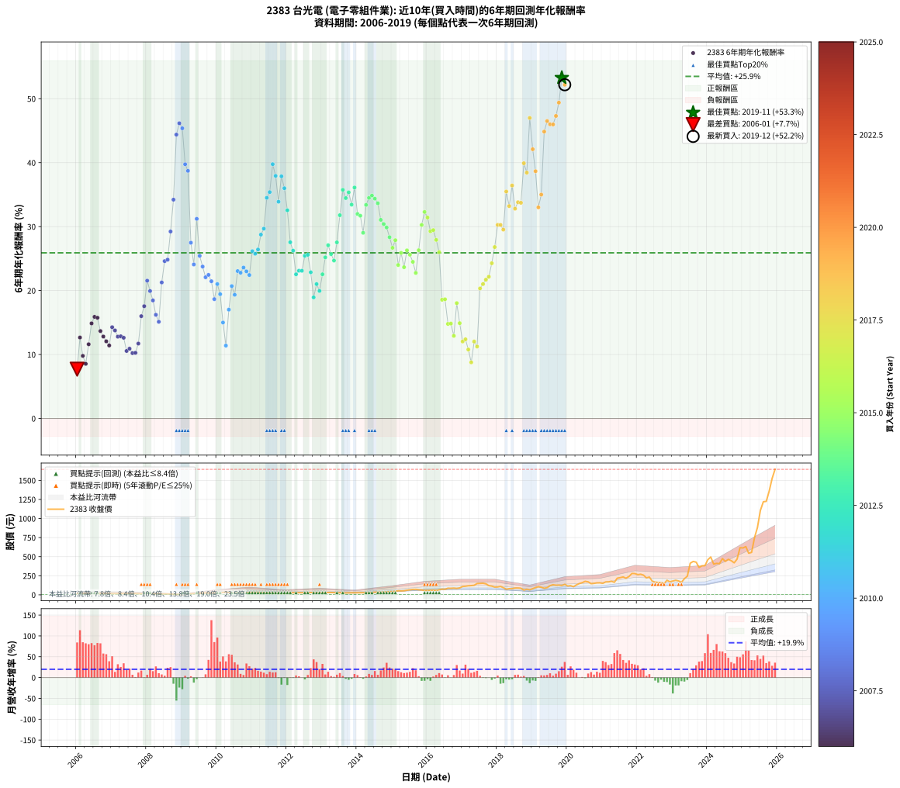

# 2383 台光電 - 本益比與未來報酬率分析

!!! info "報告資訊"
    - **股票代號**: 2383
    - **公司名稱**: 台光電
    - **產業別**: 電子零組件業
    - **分析期間**: 2006-2019 (168 個數據點)
    - **資料來源**: Type 12 (ShowMonthlyK_ChartFlow) 月收盤價與本益比
    - **報酬率口徑**: 含現金股利 (簡化: 年度合計，假設每年7/1入帳)
    - **報告生成時間**: 2026-01-13 00:40:15 CST

## 📈 視覺化圖表

### 圖表1: 本益比 vs 未來報酬率關係

*圖表1：2383 台光電 本益比與6年期未來報酬率關係 (2006-2019)*

### 圖表2: 歷年買入時點的6年期實際報酬率

*圖表2：2383 台光電 歷年買入時點的6年期實際報酬率 (2006-2019)*

## 📍 買點訊號說明

本報告提供兩種買點提示訊號（顯示於圖表2的股價子圖中）：

### ▲ 小綠色三角形（回測驗證）
- **計算方式**: 使用全部歷史資料計算本益比第25百分位數
- **用途**: 事後驗證，顯示歷史上哪些時點確實為低估區
- **限制**: 當下無法判斷，僅供回測參考
- **特性**: 後見之明（Look-Ahead Bias）

### ▲ 小橘色三角形（即時訊號）
- **計算方式**: 使用截至當月的過去5年資料計算本益比第25百分位數
- **用途**: 實際投資決策，當時即可判斷
- **優勢**: 可操作性強，符合實務需求
- **特性**: 無後見之明，滾動窗口計算

!!! tip "如何使用兩種訊號"
    - **綠色▲** 幫助理解歷史估值機會，驗證策略有效性
    - **橘色▲** 可作為實際買進參考，但仍需搭配基本面分析
    - 兩種訊號重疊時，表示即時判斷與事後驗證一致，信心度較高
    - 僅有綠色▲時，表示當時無法判斷（需要未來資料才能確認）
    - 僅有橘色▲時，表示即時判斷為買點，但事後可能不是最佳時機

## 📊 估值分析摘要

| 指標 | 數值 |
|:---:|:---:|
| **目前本益比** (2019-12) | **13.51 倍** |
| **歷史平均本益比** | 9.86 倍 |
| **估值水準** | 🔴 相對高估 |
| **預期6年年化報酬率** | **+26.68%** |
| **歷史平均報酬率** | +25.90% |
| **相關係數 (R²)** | 0.0026 |
| **趨勢線斜率** | 0.2150 |

!!! abstract "核心洞察"
    目前本益比顯著高於歷史平均，預期未來報酬率可能較低

    根據歷史數據回測，2383 台光電 在目前本益比 **13.5倍** 的估值水準下，
    預期未來6年年化報酬率約為 **+26.7%**。

    **重要提醒**: 本分析基於歷史數據統計，實際報酬率會受到公司基本面變化、產業趨勢、
    總體經濟環境等多重因素影響。R² = 0.00 表示本益比可解釋約 0.3% 的報酬率變異。

## 📈 歷史估值統計

### 最佳買點 (最高報酬率)

| 項目 | 數值 |
|:---:|:---:|
| 起始時間 | 2019-11 |
| 當時本益比 | 12.51 倍 |
| 起始價格 | 122.0 元 |
| 6年後價格 | 1525.0 元 |
| **6年年化報酬率** | **+53.27%** |

### 最差買點 (最低報酬率)

| 項目 | 數值 |
|:---:|:---:|
| 起始時間 | 2006-01 |
| 當時本益比 | 9.07 倍 |
| 起始價格 | 16.1 元 |
| 6年後價格 | 22.0 元 |
| **6年年化報酬率** | **+7.71%** |

## 🎯 投資啟示

### 本益比與報酬率關係

趨勢線方程式: **y = 0.2150x + 23.7761**

!!! info "弱相關或正相關"
    本益比與未來報酬率相關性較弱。這可能表示該股票的報酬率更多受到
    公司成長性、產業趨勢等因素影響，而非估值水準。**需綜合考量多項指標**。

### 估值區間建議

基於歷史數據分析:

- **🟢 低估區** (P/E < 7.9): 預期報酬率較高，可考慮增加持股
- **🟡 合理區** (P/E 7.9-11.8): 預期報酬率符合長期趨勢，正常持有
- **🔴 高估區** (P/E > 11.8): 預期報酬率較低，可考慮減碼或觀望

!!! danger "風險提示"
    - 過去表現不代表未來結果
    - 本分析假設公司基本面無重大結構性變化
    - 產業環境劇變可能使歷史規律失效
    - 應結合公司財報、產業趨勢、總體經濟等多重因素綜合判斷

!!! success "長期投資觀點"
    歷史數據顯示，在合理或低估的估值水準買入並長期持有，
    往往能獲得較佳的投資報酬。**耐心等待好價格**是價值投資的核心原則。

## 📊 數據品質

- **資料來源**: GoodInfo.tw Type 12 (ShowMonthlyK_ChartFlow)
- **資料頻率**: 月度收盤價與本益比
- **回測期間**: 2006-2019
- **數據點數量**: 168 個 (每個點代表一次6年期回測)

### 計算方法說明

1. **6年期年化報酬率**:
   - 對每個歷史時點，計算其後6年的實際投資報酬率
   - 期末價值(不含股利): 期末價格
   - 期末價值(含現金股利): 期末價格 + 持有期間內的現金股利合計 (簡化: 年度合計，假設每年7/1入帳)
   - 公式: 年化報酬率 = [(期末價值/期初價格)^(1/年數) - 1] × 100%

2. **本益比 (P/E Ratio)**:
   - 使用當時的月收盤價與EPS計算
   - 資料來源: Type 12 月度河流圖本益比數據

3. **趨勢線 (Linear Regression)**:
   - 使用最小平方法擬合線性趨勢線
   - R²值衡量本益比對報酬率的解釋能力

---

*本報告由 Stock Analysis System v1.9.0 自動生成*
*數據更新時間: 2026-01-13 00:40:15 CST*

## 📋 月度回測明細表

（每一列對應時間線圖中的一個買入點；可用來對照 SVG 圖上的每個點。）

| 買入月份 | 賣出月份 | 回測期限_年 | 實際持有年數 | 買入本益比_倍 | 買入收盤價_元 | 賣出收盤價_元 | 現金股利合計_元 | 總報酬率_pct | 年化報酬率_pct |
| --- | --- | --- | --- | --- | --- | --- | --- | --- | --- |
| 2006-01 | 2012-01 | 6 | 5.999 | 9.07 | 16.15 | 22.00 | 3.21 | +56.12 | +7.71 |
| 2006-02 | 2012-02 | 6 | 5.999 | 7.81 | 13.90 | 25.20 | 3.21 | +104.42 | +12.66 |
| 2006-03 | 2012-03 | 6 | 6.001 | 9.80 | 17.45 | 27.35 | 3.21 | +75.15 | +9.79 |
| 2006-04 | 2012-04 | 6 | 6.001 | 10.22 | 18.20 | 26.55 | 3.21 | +63.54 | +8.54 |
| 2006-05 | 2012-05 | 6 | 6.001 | 9.04 | 16.10 | 27.90 | 3.21 | +93.25 | +11.60 |
| 2006-06 | 2012-06 | 6 | 6.001 | 7.58 | 13.50 | 27.80 | 3.21 | +129.73 | +14.87 |
| 2006-07 | 2012-07 | 6 | 6.001 | 7.58 | 13.50 | 27.70 | 5.01 | +142.31 | +15.89 |
| 2006-08 | 2012-08 | 6 | 6.001 | 7.64 | 13.60 | 27.70 | 5.01 | +140.53 | +15.75 |
| 2006-09 | 2012-09 | 6 | 6.001 | 9.33 | 16.60 | 30.80 | 5.01 | +115.73 | +13.67 |
| 2006-10 | 2012-10 | 6 | 6.001 | 9.24 | 16.45 | 28.90 | 5.01 | +106.15 | +12.81 |
| 2006-11 | 2012-11 | 6 | 6.001 | 9.80 | 17.45 | 29.55 | 5.01 | +98.06 | +12.06 |
| 2006-12 | 2012-12 | 6 | 6.001 | 9.92 | 17.65 | 28.75 | 5.01 | +91.29 | +11.41 |
| 2007-01 | 2013-01 | 6 | 6.001 | 8.82 | 15.50 | 29.50 | 5.01 | +122.66 | +14.27 |
| 2007-02 | 2013-02 | 6 | 6.001 | 9.27 | 16.10 | 29.90 | 5.01 | +116.84 | +13.77 |
| 2007-03 | 2013-03 | 6 | 6.001 | 9.91 | 17.00 | 30.00 | 5.01 | +105.95 | +12.79 |
| 2007-04 | 2013-04 | 6 | 6.001 | 10.07 | 17.05 | 30.20 | 5.01 | +106.52 | +12.85 |
| 2007-05 | 2013-05 | 6 | 6.001 | 9.72 | 16.25 | 28.15 | 5.01 | +104.07 | +12.62 |
| 2007-06 | 2013-06 | 6 | 6.001 | 10.42 | 17.20 | 26.40 | 5.01 | +82.63 | +10.56 |
| 2007-07 | 2013-07 | 6 | 6.001 | 11.05 | 18.00 | 27.10 | 6.41 | +86.19 | +10.91 |
| 2007-08 | 2013-08 | 6 | 6.001 | 10.77 | 17.30 | 24.60 | 6.41 | +79.27 | +10.22 |
| 2007-09 | 2013-09 | 6 | 6.001 | 11.01 | 17.45 | 24.95 | 6.41 | +79.74 | +10.26 |
| 2007-10 | 2013-10 | 6 | 6.001 | 10.11 | 15.80 | 24.30 | 6.41 | +94.39 | +11.71 |
| 2007-11 | 2013-11 | 6 | 6.001 | 8.50 | 13.10 | 25.50 | 6.41 | +143.62 | +15.99 |
| 2007-12 | 2013-12 | 6 | 6.001 | 7.83 | 11.90 | 25.00 | 6.41 | +163.98 | +17.56 |
| 2008-01 | 2014-01 | 6 | 6.001 | 7.01 | 10.05 | 26.00 | 6.41 | +222.53 | +21.55 |
| 2008-02 | 2014-03 | 6 | 6.081 | 8.38 | 11.30 | 27.70 | 6.41 | +201.89 | +19.93 |
| 2008-03 | 2014-03 | 6 | 5.999 | 9.78 | 12.35 | 27.70 | 6.41 | +176.23 | +18.46 |
| 2008-04 | 2014-04 | 6 | 5.999 | 11.52 | 13.55 | 26.95 | 6.41 | +146.23 | +16.21 |
| 2008-05 | 2014-05 | 6 | 5.999 | 13.80 | 15.05 | 28.60 | 6.41 | +132.65 | +15.11 |
| 2008-06 | 2014-06 | 6 | 5.999 | 11.44 | 11.50 | 30.15 | 6.41 | +217.95 | +21.27 |
| 2008-07 | 2014-07 | 6 | 5.999 | 12.35 | 11.35 | 34.45 | 8.01 | +274.10 | +24.60 |
| 2008-08 | 2014-08 | 6 | 5.999 | 13.44 | 11.20 | 34.35 | 8.01 | +278.21 | +24.83 |
| 2008-09 | 2014-09 | 6 | 5.999 | 12.04 | 9.00 | 33.90 | 8.01 | +365.67 | +29.23 |
| 2008-10 | 2014-10 | 6 | 5.999 | 11.32 | 7.49 | 35.75 | 8.01 | +484.25 | +34.21 |
| 2008-11 | 2014-11 | 6 | 5.999 | 8.80 | 5.07 | 37.90 | 8.01 | +805.52 | +44.38 |
| 2008-12 | 2014-12 | 6 | 5.999 | 10.24 | 5.02 | 40.90 | 8.01 | +874.30 | +46.16 |
| 2009-01 | 2015-01 | 6 | 5.999 | 7.87 | 5.37 | 42.65 | 8.01 | +843.39 | +45.37 |
| 2009-02 | 2015-02 | 6 | 5.999 | 8.07 | 7.06 | 44.55 | 8.01 | +644.48 | +39.75 |
| 2009-03 | 2015-03 | 6 | 5.999 | 8.10 | 8.65 | 53.60 | 8.01 | +612.25 | +38.72 |
| 2009-04 | 2015-04 | 6 | 5.999 | 10.95 | 13.80 | 51.20 | 8.01 | +329.06 | +27.48 |
| 2009-05 | 2015-05 | 6 | 5.999 | 11.53 | 16.75 | 53.10 | 8.01 | +264.84 | +24.08 |
| 2009-06 | 2015-06 | 6 | 5.999 | 8.12 | 13.35 | 60.10 | 8.01 | +410.19 | +31.21 |
| 2009-07 | 2015-07 | 6 | 5.999 | 10.53 | 19.35 | 65.00 | 10.31 | +289.21 | +25.43 |
| 2009-08 | 2015-08 | 6 | 5.999 | 11.16 | 22.65 | 71.00 | 10.31 | +258.99 | +23.75 |
| 2009-09 | 2015-09 | 6 | 5.999 | 11.25 | 25.00 | 72.40 | 10.31 | +230.85 | +22.07 |
| 2009-10 | 2015-10 | 6 | 5.999 | 9.46 | 22.85 | 66.70 | 10.31 | +237.03 | +22.45 |
| 2009-11 | 2015-11 | 6 | 5.999 | 8.82 | 23.00 | 63.50 | 10.31 | +220.92 | +21.46 |
| 2009-12 | 2015-12 | 6 | 5.999 | 8.68 | 24.30 | 57.50 | 10.31 | +179.06 | +18.66 |
| 2010-01 | 2016-01 | 6 | 5.999 | 7.35 | 21.50 | 57.20 | 10.31 | +214.01 | +21.02 |
| 2010-02 | 2016-02 | 6 | 5.999 | 8.00 | 24.40 | 60.50 | 10.31 | +190.21 | +19.44 |
| 2010-03 | 2016-03 | 6 | 6.001 | 9.75 | 30.95 | 61.30 | 10.31 | +131.38 | +15.00 |
| 2010-04 | 2016-04 | 6 | 6.001 | 10.77 | 35.55 | 57.60 | 10.31 | +91.03 | +11.39 |
| 2010-05 | 2016-05 | 6 | 6.001 | 8.64 | 29.60 | 65.70 | 10.31 | +156.80 | +17.02 |
| 2010-06 | 2016-06 | 6 | 6.001 | 7.79 | 27.65 | 75.20 | 10.31 | +209.27 | +20.70 |
| 2010-07 | 2016-07 | 6 | 6.001 | 8.14 | 29.90 | 72.50 | 13.91 | +188.98 | +19.34 |
| 2010-08 | 2016-08 | 6 | 6.001 | 7.62 | 28.95 | 86.60 | 13.91 | +247.17 | +23.05 |
| 2010-09 | 2016-09 | 6 | 6.001 | 7.39 | 29.00 | 85.50 | 13.91 | +242.78 | +22.79 |
| 2010-10 | 2016-10 | 6 | 6.001 | 7.06 | 28.60 | 88.10 | 13.91 | +256.66 | +23.60 |
| 2010-11 | 2016-11 | 6 | 6.001 | 6.75 | 28.20 | 83.80 | 13.91 | +246.48 | +23.01 |
| 2010-12 | 2016-12 | 6 | 6.001 | 7.17 | 30.85 | 90.00 | 13.91 | +236.81 | +22.43 |
| 2011-01 | 2017-01 | 6 | 6.001 | 7.32 | 30.60 | 109.50 | 13.91 | +303.29 | +26.16 |
| 2011-02 | 2017-02 | 6 | 6.001 | 7.87 | 31.95 | 112.50 | 13.91 | +295.64 | +25.76 |
| 2011-03 | 2017-03 | 6 | 6.001 | 8.19 | 32.30 | 118.00 | 13.91 | +308.38 | +26.42 |
| 2011-04 | 2017-04 | 6 | 6.001 | 7.72 | 29.50 | 120.50 | 13.91 | +355.61 | +28.75 |
| 2011-05 | 2017-05 | 6 | 6.001 | 7.88 | 29.20 | 125.00 | 13.91 | +375.71 | +29.68 |
| 2011-06 | 2017-06 | 6 | 6.001 | 7.60 | 27.25 | 147.50 | 13.91 | +492.32 | +34.50 |
| 2011-07 | 2017-07 | 6 | 6.001 | 7.79 | 27.00 | 149.50 | 16.88 | +516.20 | +35.39 |
| 2011-08 | 2017-08 | 6 | 6.001 | 6.77 | 22.65 | 152.00 | 16.88 | +645.58 | +39.76 |
| 2011-09 | 2017-09 | 6 | 6.001 | 7.23 | 23.35 | 144.00 | 16.88 | +588.97 | +37.93 |
| 2011-10 | 2017-10 | 6 | 6.001 | 7.64 | 23.75 | 120.00 | 16.88 | +476.32 | +33.89 |
| 2011-11 | 2017-11 | 6 | 6.001 | 6.37 | 19.05 | 114.00 | 16.88 | +587.01 | +37.87 |
| 2011-12 | 2017-12 | 6 | 6.001 | 6.52 | 18.70 | 101.50 | 16.88 | +533.02 | +36.00 |
| 2012-01 | 2018-01 | 6 | 6.001 | 7.48 | 22.00 | 102.50 | 16.88 | +442.61 | +32.55 |
| 2012-02 | 2018-03 | 6 | 6.081 | 8.36 | 25.20 | 93.80 | 16.88 | +339.19 | +27.55 |
| 2012-03 | 2018-03 | 6 | 5.999 | 8.86 | 27.35 | 93.80 | 16.88 | +304.66 | +26.24 |
| 2012-04 | 2018-04 | 6 | 5.999 | 8.40 | 26.55 | 73.00 | 16.88 | +238.51 | +22.54 |
| 2012-05 | 2018-05 | 6 | 5.999 | 8.63 | 27.90 | 80.20 | 16.88 | +247.94 | +23.10 |
| 2012-06 | 2018-06 | 6 | 5.999 | 8.41 | 27.80 | 79.80 | 16.88 | +247.75 | +23.09 |
| 2012-07 | 2018-07 | 6 | 5.999 | 8.20 | 27.70 | 88.00 | 19.88 | +289.45 | +25.44 |
| 2012-08 | 2018-08 | 6 | 5.999 | 8.03 | 27.70 | 88.80 | 19.88 | +292.34 | +25.59 |
| 2012-09 | 2018-09 | 6 | 5.999 | 8.74 | 30.80 | 86.00 | 19.88 | +243.76 | +22.86 |
| 2012-10 | 2018-10 | 6 | 5.999 | 8.04 | 28.90 | 61.90 | 19.88 | +182.97 | +18.93 |
| 2012-11 | 2018-11 | 6 | 5.999 | 8.06 | 29.55 | 72.90 | 19.88 | +213.97 | +21.01 |
| 2012-12 | 2018-12 | 6 | 5.999 | 7.69 | 28.75 | 65.70 | 19.88 | +197.66 | +19.94 |
| 2013-01 | 2019-01 | 6 | 5.999 | 8.08 | 29.50 | 80.00 | 19.88 | +238.57 | +22.54 |
| 2013-02 | 2019-02 | 6 | 5.999 | 8.39 | 29.90 | 95.20 | 19.88 | +284.87 | +25.19 |
| 2013-03 | 2019-03 | 6 | 5.999 | 8.63 | 30.00 | 106.50 | 19.88 | +321.26 | +27.09 |
| 2013-04 | 2019-04 | 6 | 5.999 | 8.91 | 30.20 | 99.20 | 19.88 | +294.29 | +25.70 |
| 2013-05 | 2019-05 | 6 | 5.999 | 8.52 | 28.15 | 85.90 | 19.88 | +275.76 | +24.69 |
| 2013-06 | 2019-06 | 6 | 5.999 | 8.21 | 26.40 | 93.70 | 19.88 | +330.22 | +27.54 |
| 2013-07 | 2019-07 | 6 | 5.999 | 8.67 | 27.10 | 120.00 | 21.88 | +423.55 | +31.78 |
| 2013-08 | 2019-08 | 6 | 5.999 | 8.09 | 24.60 | 132.00 | 21.88 | +525.54 | +35.75 |
| 2013-09 | 2019-09 | 6 | 5.999 | 8.45 | 24.95 | 125.50 | 21.88 | +490.71 | +34.46 |
| 2013-10 | 2019-10 | 6 | 5.999 | 8.48 | 24.30 | 127.50 | 21.88 | +514.74 | +35.36 |
| 2013-11 | 2019-11 | 6 | 5.999 | 9.18 | 25.50 | 122.00 | 21.88 | +464.25 | +33.44 |
| 2013-12 | 2019-12 | 6 | 5.999 | 9.29 | 25.00 | 137.00 | 21.88 | +535.53 | +36.11 |
| 2014-01 | 2020-01 | 6 | 5.999 | 9.04 | 26.00 | 115.50 | 21.88 | +428.40 | +31.98 |
| 2014-02 | 2020-02 | 6 | 5.999 | 8.89 | 27.20 | 120.00 | 21.88 | +421.63 | +31.70 |
| 2014-03 | 2020-03 | 6 | 6.001 | 8.54 | 27.70 | 106.00 | 21.88 | +361.67 | +29.03 |
| 2014-04 | 2020-04 | 6 | 6.001 | 7.86 | 26.95 | 130.00 | 21.88 | +463.57 | +33.39 |
| 2014-05 | 2020-05 | 6 | 6.001 | 7.91 | 28.60 | 147.50 | 21.88 | +492.25 | +34.50 |
| 2014-06 | 2020-06 | 6 | 6.001 | 7.93 | 30.15 | 159.50 | 21.88 | +501.60 | +34.85 |
| 2014-07 | 2020-07 | 6 | 6.001 | 8.64 | 34.45 | 177.00 | 25.85 | +488.82 | +34.37 |
| 2014-08 | 2020-08 | 6 | 6.001 | 8.24 | 34.35 | 170.00 | 25.85 | +470.15 | +33.65 |
| 2014-09 | 2020-09 | 6 | 6.001 | 7.78 | 33.90 | 146.00 | 25.85 | +406.92 | +31.06 |
| 2014-10 | 2020-10 | 6 | 6.001 | 7.87 | 35.75 | 150.00 | 25.85 | +391.88 | +30.40 |
| 2014-11 | 2020-11 | 6 | 6.001 | 8.02 | 37.90 | 156.00 | 25.85 | +379.81 | +29.86 |
| 2014-12 | 2020-12 | 6 | 6.001 | 8.33 | 40.90 | 157.00 | 25.85 | +347.06 | +28.34 |
| 2015-01 | 2021-01 | 6 | 6.001 | 8.31 | 42.65 | 150.50 | 25.85 | +313.47 | +26.68 |
| 2015-02 | 2021-02 | 6 | 6.001 | 8.33 | 44.55 | 169.00 | 25.85 | +337.37 | +27.87 |
| 2015-03 | 2021-03 | 6 | 6.001 | 9.62 | 53.60 | 169.00 | 25.85 | +263.52 | +23.99 |
| 2015-04 | 2021-04 | 6 | 6.001 | 8.84 | 51.20 | 178.00 | 25.85 | +298.14 | +25.89 |
| 2015-05 | 2021-05 | 6 | 6.001 | 8.84 | 53.10 | 164.00 | 25.85 | +257.53 | +23.65 |
| 2015-06 | 2021-06 | 6 | 6.001 | 9.65 | 60.10 | 218.00 | 25.85 | +305.74 | +26.28 |
| 2015-07 | 2021-07 | 6 | 6.001 | 10.08 | 65.00 | 225.00 | 30.35 | +292.85 | +25.61 |
| 2015-08 | 2021-08 | 6 | 6.001 | 10.64 | 71.00 | 234.00 | 30.35 | +272.33 | +24.49 |
| 2015-09 | 2021-09 | 6 | 6.001 | 10.51 | 72.40 | 217.50 | 30.35 | +242.34 | +22.76 |
| 2015-10 | 2021-10 | 6 | 6.001 | 9.38 | 66.70 | 240.50 | 30.35 | +306.07 | +26.30 |
| 2015-11 | 2021-11 | 6 | 6.001 | 8.66 | 63.50 | 280.00 | 30.35 | +388.74 | +30.26 |
| 2015-12 | 2021-12 | 6 | 6.001 | 7.62 | 57.50 | 278.00 | 30.35 | +436.26 | +32.29 |
| 2016-01 | 2022-01 | 6 | 6.001 | 7.48 | 57.20 | 264.50 | 30.35 | +415.47 | +31.42 |
| 2016-02 | 2022-03 | 6 | 6.081 | 7.81 | 60.50 | 258.00 | 30.35 | +376.61 | +29.28 |
| 2016-03 | 2022-03 | 6 | 5.999 | 7.82 | 61.30 | 258.00 | 30.35 | +370.39 | +29.45 |
| 2016-04 | 2022-04 | 6 | 5.999 | 7.26 | 57.60 | 222.00 | 30.35 | +338.11 | +27.92 |
| 2016-05 | 2022-05 | 6 | 5.999 | 8.18 | 65.70 | 232.50 | 30.35 | +300.08 | +26.00 |
| 2016-06 | 2022-06 | 6 | 5.999 | 9.26 | 75.20 | 178.50 | 30.35 | +177.73 | +18.56 |
| 2016-07 | 2022-07 | 6 | 5.999 | 8.82 | 72.50 | 166.00 | 36.06 | +178.70 | +18.63 |
| 2016-08 | 2022-08 | 6 | 5.999 | 10.41 | 86.60 | 162.00 | 36.06 | +128.71 | +14.79 |
| 2016-09 | 2022-09 | 6 | 5.999 | 10.16 | 85.50 | 160.00 | 36.06 | +129.31 | +14.84 |
| 2016-10 | 2022-10 | 6 | 5.999 | 10.35 | 88.10 | 146.50 | 36.06 | +107.22 | +12.91 |
| 2016-11 | 2022-11 | 6 | 5.999 | 9.74 | 83.80 | 190.50 | 36.06 | +170.36 | +18.03 |
| 2016-12 | 2022-12 | 6 | 5.999 | 10.34 | 90.00 | 171.00 | 36.06 | +130.07 | +14.90 |
| 2017-01 | 2023-01 | 6 | 5.999 | 12.58 | 109.50 | 180.50 | 36.06 | +97.77 | +12.04 |
| 2017-02 | 2023-02 | 6 | 5.999 | 12.92 | 112.50 | 190.50 | 36.06 | +101.39 | +12.38 |
| 2017-03 | 2023-03 | 6 | 5.999 | 13.55 | 118.00 | 182.00 | 36.06 | +84.80 | +10.78 |
| 2017-04 | 2023-04 | 6 | 5.999 | 13.83 | 120.50 | 163.50 | 36.06 | +65.61 | +8.77 |
| 2017-05 | 2023-05 | 6 | 5.999 | 14.34 | 125.00 | 211.00 | 36.06 | +97.65 | +12.03 |
| 2017-06 | 2023-06 | 6 | 5.999 | 16.92 | 147.50 | 243.50 | 36.06 | +89.53 | +11.25 |
| 2017-07 | 2023-07 | 6 | 5.999 | 17.14 | 149.50 | 414.00 | 39.77 | +203.52 | +20.33 |
| 2017-08 | 2023-08 | 6 | 5.999 | 17.42 | 152.00 | 437.50 | 39.77 | +213.99 | +21.01 |
| 2017-09 | 2023-09 | 6 | 5.999 | 16.49 | 144.00 | 428.00 | 39.77 | +224.84 | +21.70 |
| 2017-10 | 2023-10 | 6 | 5.999 | 13.74 | 120.00 | 359.00 | 39.77 | +232.31 | +22.16 |
| 2017-11 | 2023-11 | 6 | 5.999 | 13.05 | 114.00 | 380.00 | 39.77 | +268.22 | +24.27 |
| 2017-12 | 2023-12 | 6 | 5.999 | 11.61 | 101.50 | 382.00 | 39.77 | +315.54 | +26.80 |
| 2018-01 | 2024-01 | 6 | 5.999 | 12.10 | 102.50 | 461.00 | 39.77 | +388.56 | +30.27 |
| 2018-02 | 2024-02 | 6 | 5.999 | 13.36 | 109.50 | 495.00 | 39.77 | +388.37 | +30.26 |
| 2018-03 | 2024-03 | 6 | 6.001 | 11.84 | 93.80 | 403.50 | 39.77 | +372.57 | +29.53 |
| 2018-04 | 2024-04 | 6 | 6.001 | 9.54 | 73.00 | 412.00 | 39.77 | +518.86 | +35.49 |
| 2018-05 | 2024-05 | 6 | 6.001 | 10.86 | 80.20 | 408.50 | 39.77 | +458.94 | +33.21 |
| 2018-06 | 2024-06 | 6 | 6.001 | 11.22 | 79.80 | 475.00 | 39.77 | +545.07 | +36.43 |
| 2018-07 | 2024-07 | 6 | 6.001 | 12.87 | 88.00 | 438.00 | 44.95 | +448.80 | +32.80 |
| 2018-08 | 2024-08 | 6 | 6.001 | 13.52 | 88.80 | 465.00 | 44.95 | +474.27 | +33.81 |
| 2018-09 | 2024-09 | 6 | 6.001 | 13.66 | 86.00 | 447.00 | 44.95 | +472.03 | +33.72 |
| 2018-10 | 2024-10 | 6 | 6.001 | 10.28 | 61.90 | 419.50 | 44.95 | +650.32 | +39.91 |
| 2018-11 | 2024-11 | 6 | 6.001 | 12.67 | 72.90 | 468.50 | 44.95 | +604.32 | +38.44 |
| 2018-12 | 2024-12 | 6 | 6.001 | 11.99 | 65.70 | 618.00 | 44.95 | +909.05 | +46.99 |
| 2019-01 | 2025-01 | 6 | 6.001 | 13.63 | 80.00 | 614.00 | 44.95 | +723.68 | +42.10 |
| 2019-02 | 2025-02 | 6 | 6.001 | 15.22 | 95.20 | 632.00 | 44.95 | +611.08 | +38.66 |
| 2019-03 | 2025-03 | 6 | 6.001 | 16.03 | 106.50 | 545.00 | 44.95 | +453.94 | +33.01 |
| 2019-04 | 2025-04 | 6 | 6.001 | 14.10 | 99.20 | 556.00 | 44.95 | +505.79 | +35.01 |
| 2019-05 | 2025-05 | 6 | 6.001 | 11.57 | 85.90 | 749.00 | 44.95 | +824.27 | +44.85 |
| 2019-06 | 2025-06 | 6 | 6.001 | 12.00 | 93.70 | 882.00 | 44.95 | +889.27 | +46.50 |
| 2019-07 | 2025-07 | 6 | 6.001 | 14.64 | 120.00 | 1105.00 | 57.73 | +868.94 | +46.00 |
| 2019-08 | 2025-08 | 6 | 6.001 | 15.37 | 132.00 | 1220.00 | 57.73 | +867.98 | +45.97 |
| 2019-09 | 2025-09 | 6 | 6.001 | 13.98 | 125.50 | 1225.00 | 57.73 | +922.09 | +47.30 |
| 2019-10 | 2025-10 | 6 | 6.001 | 13.62 | 127.50 | 1360.00 | 57.73 | +1011.94 | +49.39 |
| 2019-11 | 2025-11 | 6 | 6.001 | 12.51 | 122.00 | 1525.00 | 57.73 | +1197.32 | +53.27 |
| 2019-12 | 2025-12 | 6 | 6.001 | 13.51 | 137.00 | 1645.00 | 57.73 | +1142.87 | +52.18 |
