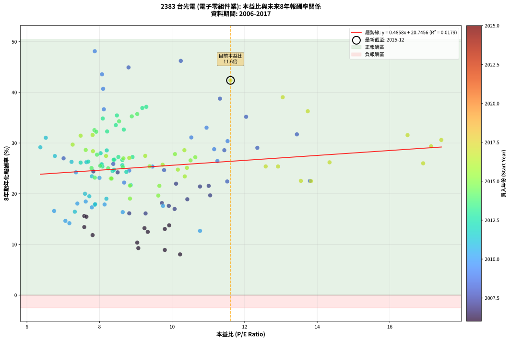
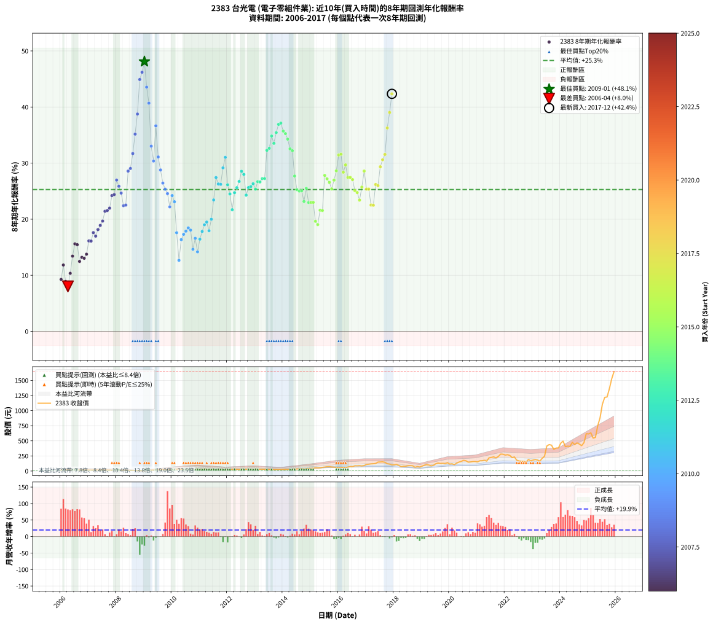

# 2383 台光電 - 本益比與未來報酬率分析

!!! info "報告資訊"
    - **股票代號**: 2383
    - **公司名稱**: 台光電
    - **產業別**: 電子零組件業
    - **分析期間**: 2006-2017 (144 個數據點)
    - **資料來源**: Type 12 (ShowMonthlyK_ChartFlow) 月收盤價與本益比
    - **報酬率口徑**: 含現金股利 (簡化: 年度合計，假設每年7/1入帳)
    - **報告生成時間**: 2026-01-11 18:34:56 CST

## 📈 視覺化圖表

### 圖表1: 本益比 vs 未來報酬率關係

*圖表1：2383 台光電 本益比與8年期未來報酬率關係 (2006-2017)*

### 圖表2: 歷年買入時點的8年期實際報酬率

*圖表2：2383 台光電 歷年買入時點的8年期實際報酬率 (2006-2017)*

## 📍 買點訊號說明

本報告提供兩種買點提示訊號（顯示於圖表2的股價子圖中）：

### ▲ 小綠色三角形（回測驗證）
- **計算方式**: 使用全部歷史資料計算本益比第25百分位數
- **用途**: 事後驗證，顯示歷史上哪些時點確實為低估區
- **限制**: 當下無法判斷，僅供回測參考
- **特性**: 後見之明（Look-Ahead Bias）

### ▲ 小橘色三角形（即時訊號）
- **計算方式**: 使用截至當月的過去5年資料計算本益比第25百分位數
- **用途**: 實際投資決策，當時即可判斷
- **優勢**: 可操作性強，符合實務需求
- **特性**: 無後見之明，滾動窗口計算

!!! tip "如何使用兩種訊號"
    - **綠色▲** 幫助理解歷史估值機會，驗證策略有效性
    - **橘色▲** 可作為實際買進參考，但仍需搭配基本面分析
    - 兩種訊號重疊時，表示即時判斷與事後驗證一致，信心度較高
    - 僅有綠色▲時，表示當時無法判斷（需要未來資料才能確認）
    - 僅有橘色▲時，表示即時判斷為買點，但事後可能不是最佳時機

## 📊 估值分析摘要

| 指標 | 數值 |
|:---:|:---:|
| **目前本益比** (2017-12) | **11.61 倍** |
| **歷史平均本益比** | 9.35 倍 |
| **估值水準** | 🔴 相對高估 |
| **預期8年年化報酬率** | **+26.39%** |
| **歷史平均報酬率** | +25.29% |
| **相關係數 (R²)** | 0.0179 |
| **趨勢線斜率** | 0.4858 |

!!! abstract "核心洞察"
    目前本益比顯著高於歷史平均，預期未來報酬率可能較低

    根據歷史數據回測，2383 台光電 在目前本益比 **11.6倍** 的估值水準下，
    預期未來8年年化報酬率約為 **+26.4%**。

    **重要提醒**: 本分析基於歷史數據統計，實際報酬率會受到公司基本面變化、產業趨勢、
    總體經濟環境等多重因素影響。R² = 0.02 表示本益比可解釋約 1.8% 的報酬率變異。

## 📈 歷史估值統計

### 最佳買點 (最高報酬率)

| 項目 | 數值 |
|:---:|:---:|
| 起始時間 | 2009-01 |
| 當時本益比 | 7.87 倍 |
| 起始價格 | 5.4 元 |
| 8年後價格 | 109.5 元 |
| **8年年化報酬率** | **+48.10%** |

### 最差買點 (最低報酬率)

| 項目 | 數值 |
|:---:|:---:|
| 起始時間 | 2006-04 |
| 當時本益比 | 10.22 倍 |
| 起始價格 | 18.2 元 |
| 8年後價格 | 26.9 元 |
| **8年年化報酬率** | **+8.03%** |

## 🎯 投資啟示

### 本益比與報酬率關係

趨勢線方程式: **y = 0.4858x + 20.7456**

!!! info "弱相關或正相關"
    本益比與未來報酬率相關性較弱。這可能表示該股票的報酬率更多受到
    公司成長性、產業趨勢等因素影響，而非估值水準。**需綜合考量多項指標**。

### 估值區間建議

基於歷史數據分析:

- **🟢 低估區** (P/E < 7.5): 預期報酬率較高，可考慮增加持股
- **🟡 合理區** (P/E 7.5-11.2): 預期報酬率符合長期趨勢，正常持有
- **🔴 高估區** (P/E > 11.2): 預期報酬率較低，可考慮減碼或觀望

!!! danger "風險提示"
    - 過去表現不代表未來結果
    - 本分析假設公司基本面無重大結構性變化
    - 產業環境劇變可能使歷史規律失效
    - 應結合公司財報、產業趨勢、總體經濟等多重因素綜合判斷

!!! success "長期投資觀點"
    歷史數據顯示，在合理或低估的估值水準買入並長期持有，
    往往能獲得較佳的投資報酬。**耐心等待好價格**是價值投資的核心原則。

## 📊 數據品質

- **資料來源**: GoodInfo.tw Type 12 (ShowMonthlyK_ChartFlow)
- **資料頻率**: 月度收盤價與本益比
- **回測期間**: 2006-2017
- **數據點數量**: 144 個 (每個點代表一次8年期回測)

### 計算方法說明

1. **8年期年化報酬率**:
   - 對每個歷史時點，計算其後8年的實際投資報酬率
   - 期末價值(不含股利): 期末價格
   - 期末價值(含現金股利): 期末價格 + 持有期間內的現金股利合計 (簡化: 年度合計，假設每年7/1入帳)
   - 公式: 年化報酬率 = [(期末價值/期初價格)^(1/年數) - 1] × 100%

2. **本益比 (P/E Ratio)**:
   - 使用當時的月收盤價與EPS計算
   - 資料來源: Type 12 月度河流圖本益比數據

3. **趨勢線 (Linear Regression)**:
   - 使用最小平方法擬合線性趨勢線
   - R²值衡量本益比對報酬率的解釋能力

---

*本報告由 Stock Analysis System v1.9.0 自動生成*
*數據更新時間: 2026-01-11 18:34:56 CST*

## 📋 月度回測明細表

（每一列對應時間線圖中的一個買入點；可用來對照 SVG 圖上的每個點。）

| 買入月份 | 賣出月份 | 回測期限_年 | 實際持有年數 | 買入本益比_倍 | 買入收盤價_元 | 賣出收盤價_元 | 現金股利合計_元 | 總報酬率_pct | 年化報酬率_pct |
| --- | --- | --- | --- | --- | --- | --- | --- | --- | --- |
| 2006-01 | 2014-01 | 8 | 8.000 | 9.07 | 16.15 | 26.00 | 6.81 | +103.13 | +9.26 |
| 2006-02 | 2014-02 | 8 | 8.000 | 7.81 | 13.90 | 27.20 | 6.81 | +144.65 | +11.83 |
| 2006-03 | 2014-03 | 8 | 8.000 | 9.80 | 17.45 | 27.70 | 6.81 | +97.74 | +8.90 |
| 2006-04 | 2014-04 | 8 | 8.000 | 10.22 | 18.20 | 26.95 | 6.81 | +85.47 | +8.03 |
| 2006-05 | 2014-05 | 8 | 8.000 | 9.04 | 16.10 | 28.60 | 6.81 | +119.91 | +10.35 |
| 2006-06 | 2014-06 | 8 | 8.000 | 7.58 | 13.50 | 30.15 | 6.81 | +173.75 | +13.41 |
| 2006-07 | 2014-07 | 8 | 8.000 | 7.58 | 13.50 | 34.45 | 8.60 | +218.92 | +15.60 |
| 2006-08 | 2014-08 | 8 | 8.000 | 7.64 | 13.60 | 34.35 | 8.60 | +215.84 | +15.46 |
| 2006-09 | 2014-09 | 8 | 8.000 | 9.33 | 16.60 | 33.90 | 8.60 | +156.05 | +12.47 |
| 2006-10 | 2014-10 | 8 | 8.000 | 9.24 | 16.45 | 35.75 | 8.60 | +169.63 | +13.20 |
| 2006-11 | 2014-11 | 8 | 8.000 | 9.80 | 17.45 | 37.90 | 8.60 | +166.50 | +13.03 |
| 2006-12 | 2014-12 | 8 | 8.000 | 9.92 | 17.65 | 40.90 | 8.60 | +180.48 | +13.76 |
| 2007-01 | 2015-01 | 8 | 8.000 | 8.82 | 15.50 | 42.65 | 8.60 | +230.67 | +16.12 |
| 2007-02 | 2015-02 | 8 | 8.000 | 9.27 | 16.10 | 44.55 | 8.60 | +230.15 | +16.10 |
| 2007-03 | 2015-03 | 8 | 8.000 | 9.91 | 17.00 | 53.60 | 8.60 | +265.91 | +17.60 |
| 2007-04 | 2015-04 | 8 | 8.000 | 10.07 | 17.05 | 51.20 | 8.60 | +250.76 | +16.98 |
| 2007-05 | 2015-05 | 8 | 8.000 | 9.72 | 16.25 | 53.10 | 8.60 | +279.72 | +18.15 |
| 2007-06 | 2015-06 | 8 | 8.000 | 10.42 | 17.20 | 60.10 | 8.60 | +299.44 | +18.90 |
| 2007-07 | 2015-07 | 8 | 8.000 | 11.05 | 18.00 | 65.00 | 10.71 | +320.60 | +19.67 |
| 2007-08 | 2015-08 | 8 | 8.000 | 10.77 | 17.30 | 71.00 | 10.71 | +372.30 | +21.42 |
| 2007-09 | 2015-09 | 8 | 8.000 | 11.01 | 17.45 | 72.40 | 10.71 | +376.26 | +21.54 |
| 2007-10 | 2015-10 | 8 | 8.000 | 10.11 | 15.80 | 66.70 | 10.71 | +389.92 | +21.97 |
| 2007-11 | 2015-11 | 8 | 8.000 | 8.50 | 13.10 | 63.50 | 10.71 | +466.47 | +24.21 |
| 2007-12 | 2015-12 | 8 | 8.000 | 7.83 | 11.90 | 57.50 | 10.71 | +473.18 | +24.39 |
| 2008-01 | 2016-01 | 8 | 8.000 | 7.01 | 10.05 | 57.20 | 10.71 | +575.70 | +26.98 |
| 2008-02 | 2016-02 | 8 | 8.000 | 8.38 | 11.30 | 60.50 | 10.71 | +530.16 | +25.87 |
| 2008-03 | 2016-03 | 8 | 8.000 | 9.78 | 12.35 | 61.30 | 10.71 | +483.06 | +24.66 |
| 2008-04 | 2016-04 | 8 | 8.000 | 11.52 | 13.55 | 57.60 | 10.71 | +404.12 | +22.41 |
| 2008-05 | 2016-05 | 8 | 8.000 | 13.80 | 15.05 | 65.70 | 10.71 | +407.69 | +22.52 |
| 2008-06 | 2016-06 | 8 | 8.000 | 11.44 | 11.50 | 75.20 | 10.71 | +647.03 | +28.58 |
| 2008-07 | 2016-07 | 8 | 8.000 | 12.35 | 11.35 | 72.50 | 14.80 | +669.14 | +29.05 |
| 2008-08 | 2016-08 | 8 | 8.000 | 13.44 | 11.20 | 86.60 | 14.80 | +805.33 | +31.70 |
| 2008-09 | 2016-09 | 8 | 8.000 | 12.04 | 9.00 | 85.50 | 14.80 | +1014.41 | +35.17 |
| 2008-10 | 2016-10 | 8 | 8.000 | 11.32 | 7.49 | 88.10 | 14.80 | +1273.79 | +38.75 |
| 2008-11 | 2016-11 | 8 | 8.000 | 8.80 | 5.07 | 83.80 | 14.80 | +1844.71 | +44.91 |
| 2008-12 | 2016-12 | 8 | 8.000 | 10.24 | 5.02 | 90.00 | 14.80 | +1987.59 | +46.20 |
| 2009-01 | 2017-01 | 8 | 8.000 | 7.87 | 5.37 | 109.50 | 14.80 | +2214.66 | +48.10 |
| 2009-02 | 2017-02 | 8 | 8.000 | 8.07 | 7.06 | 112.50 | 14.80 | +1703.07 | +43.55 |
| 2009-03 | 2017-03 | 8 | 8.000 | 8.10 | 8.65 | 118.00 | 14.80 | +1435.23 | +40.69 |
| 2009-04 | 2017-04 | 8 | 8.000 | 10.95 | 13.80 | 120.50 | 14.80 | +880.41 | +33.02 |
| 2009-05 | 2017-05 | 8 | 8.000 | 11.53 | 16.75 | 125.00 | 14.80 | +734.61 | +30.37 |
| 2009-06 | 2017-06 | 8 | 8.000 | 8.12 | 13.35 | 147.50 | 14.80 | +1115.71 | +36.65 |
| 2009-07 | 2017-07 | 8 | 8.000 | 10.53 | 19.35 | 149.50 | 19.30 | +772.36 | +31.10 |
| 2009-08 | 2017-08 | 8 | 8.000 | 11.16 | 22.65 | 152.00 | 19.30 | +656.30 | +28.78 |
| 2009-09 | 2017-09 | 8 | 8.000 | 11.25 | 25.00 | 144.00 | 19.30 | +553.20 | +26.44 |
| 2009-10 | 2017-10 | 8 | 8.000 | 9.46 | 22.85 | 120.00 | 19.30 | +509.63 | +25.35 |
| 2009-11 | 2017-11 | 8 | 8.000 | 8.82 | 23.00 | 114.00 | 19.30 | +479.57 | +24.56 |
| 2009-12 | 2017-12 | 8 | 8.000 | 8.68 | 24.30 | 101.50 | 19.30 | +397.12 | +22.20 |
| 2010-01 | 2018-01 | 8 | 8.000 | 7.35 | 21.50 | 102.50 | 19.30 | +466.52 | +24.21 |
| 2010-02 | 2018-02 | 8 | 8.000 | 8.00 | 24.40 | 109.50 | 19.30 | +427.87 | +23.12 |
| 2010-03 | 2018-03 | 8 | 8.000 | 9.75 | 30.95 | 93.80 | 19.30 | +265.43 | +17.58 |
| 2010-04 | 2018-04 | 8 | 8.000 | 10.77 | 35.55 | 73.00 | 19.30 | +159.64 | +12.67 |
| 2010-05 | 2018-05 | 8 | 8.000 | 8.64 | 29.60 | 80.20 | 19.30 | +236.15 | +16.36 |
| 2010-06 | 2018-06 | 8 | 8.000 | 7.79 | 27.65 | 79.80 | 19.30 | +258.41 | +17.30 |
| 2010-07 | 2018-07 | 8 | 8.000 | 8.14 | 29.90 | 88.00 | 23.40 | +272.59 | +17.87 |
| 2010-08 | 2018-08 | 8 | 8.000 | 7.62 | 28.95 | 88.80 | 23.40 | +287.58 | +18.45 |
| 2010-09 | 2018-09 | 8 | 8.000 | 7.39 | 29.00 | 86.00 | 23.40 | +277.26 | +18.05 |
| 2010-10 | 2018-10 | 8 | 8.000 | 7.06 | 28.60 | 61.90 | 23.40 | +198.27 | +14.64 |
| 2010-11 | 2018-11 | 8 | 8.000 | 6.75 | 28.20 | 72.90 | 23.40 | +241.50 | +16.59 |
| 2010-12 | 2018-12 | 8 | 8.000 | 7.17 | 30.85 | 65.70 | 23.40 | +188.83 | +14.18 |
| 2011-01 | 2019-01 | 8 | 8.000 | 7.32 | 30.60 | 80.00 | 23.40 | +237.92 | +16.44 |
| 2011-02 | 2019-02 | 8 | 8.000 | 7.87 | 31.95 | 95.20 | 23.40 | +271.22 | +17.82 |
| 2011-03 | 2019-03 | 8 | 8.000 | 8.19 | 32.30 | 106.50 | 23.40 | +302.18 | +19.00 |
| 2011-04 | 2019-04 | 8 | 8.000 | 7.72 | 29.50 | 99.20 | 23.40 | +315.61 | +19.49 |
| 2011-05 | 2019-05 | 8 | 8.000 | 7.88 | 29.20 | 85.90 | 23.40 | +274.33 | +17.94 |
| 2011-06 | 2019-06 | 8 | 8.000 | 7.60 | 27.25 | 93.70 | 23.40 | +329.74 | +19.99 |
| 2011-07 | 2019-07 | 8 | 8.000 | 7.79 | 27.00 | 120.00 | 25.48 | +438.80 | +23.43 |
| 2011-08 | 2019-08 | 8 | 8.000 | 6.77 | 22.65 | 132.00 | 25.48 | +595.25 | +27.43 |
| 2011-09 | 2019-09 | 8 | 8.000 | 7.23 | 23.35 | 125.50 | 25.48 | +546.57 | +26.28 |
| 2011-10 | 2019-10 | 8 | 8.000 | 7.64 | 23.75 | 127.50 | 25.48 | +544.11 | +26.22 |
| 2011-11 | 2019-11 | 8 | 8.000 | 6.37 | 19.05 | 122.00 | 25.48 | +674.15 | +29.15 |
| 2011-12 | 2019-12 | 8 | 8.000 | 6.52 | 18.70 | 137.00 | 25.48 | +768.85 | +31.03 |
| 2012-01 | 2020-01 | 8 | 8.000 | 7.48 | 22.00 | 115.50 | 25.48 | +540.80 | +26.14 |
| 2012-02 | 2020-02 | 8 | 8.000 | 8.36 | 25.20 | 120.00 | 25.48 | +477.28 | +24.50 |
| 2012-03 | 2020-03 | 8 | 8.000 | 8.86 | 27.35 | 106.00 | 25.48 | +380.71 | +21.68 |
| 2012-04 | 2020-04 | 8 | 8.000 | 8.40 | 26.55 | 130.00 | 25.48 | +485.59 | +24.72 |
| 2012-05 | 2020-05 | 8 | 8.000 | 8.63 | 27.90 | 147.50 | 25.48 | +519.98 | +25.62 |
| 2012-06 | 2020-06 | 8 | 8.000 | 8.41 | 27.80 | 159.50 | 25.48 | +565.38 | +26.73 |
| 2012-07 | 2020-07 | 8 | 8.000 | 8.20 | 27.70 | 177.00 | 29.44 | +645.27 | +28.54 |
| 2012-08 | 2020-08 | 8 | 8.000 | 8.03 | 27.70 | 170.00 | 29.44 | +620.00 | +27.99 |
| 2012-09 | 2020-09 | 8 | 8.000 | 8.74 | 30.80 | 146.00 | 29.44 | +469.61 | +24.29 |
| 2012-10 | 2020-10 | 8 | 8.000 | 8.04 | 28.90 | 150.00 | 29.44 | +520.90 | +25.64 |
| 2012-11 | 2020-11 | 8 | 8.000 | 8.06 | 29.55 | 156.00 | 29.44 | +527.54 | +25.81 |
| 2012-12 | 2020-12 | 8 | 8.000 | 7.69 | 28.75 | 157.00 | 29.44 | +548.48 | +26.32 |
| 2013-01 | 2021-01 | 8 | 8.000 | 8.08 | 29.50 | 150.50 | 29.44 | +509.96 | +25.36 |
| 2013-02 | 2021-02 | 8 | 8.000 | 8.39 | 29.90 | 169.00 | 29.44 | +563.68 | +26.69 |
| 2013-03 | 2021-03 | 8 | 8.000 | 8.63 | 30.00 | 169.00 | 29.44 | +561.46 | +26.64 |
| 2013-04 | 2021-04 | 8 | 8.000 | 8.91 | 30.20 | 178.00 | 29.44 | +586.88 | +27.24 |
| 2013-05 | 2021-05 | 8 | 8.000 | 8.52 | 28.15 | 164.00 | 29.44 | +587.17 | +27.24 |
| 2013-06 | 2021-06 | 8 | 8.000 | 8.21 | 26.40 | 218.00 | 29.44 | +837.27 | +32.28 |
| 2013-07 | 2021-07 | 8 | 8.000 | 8.67 | 27.10 | 225.00 | 34.65 | +858.10 | +32.64 |
| 2013-08 | 2021-08 | 8 | 8.000 | 8.09 | 24.60 | 234.00 | 34.65 | +992.05 | +34.83 |
| 2013-09 | 2021-09 | 8 | 8.000 | 8.45 | 24.95 | 217.50 | 34.65 | +910.60 | +33.53 |
| 2013-10 | 2021-10 | 8 | 8.000 | 8.48 | 24.30 | 240.50 | 34.65 | +1032.28 | +35.44 |
| 2013-11 | 2021-11 | 8 | 8.000 | 9.18 | 25.50 | 280.00 | 34.65 | +1133.90 | +36.90 |
| 2013-12 | 2021-12 | 8 | 8.000 | 9.29 | 25.00 | 278.00 | 34.65 | +1150.58 | +37.13 |
| 2014-01 | 2022-01 | 8 | 8.000 | 9.04 | 26.00 | 264.50 | 34.65 | +1050.56 | +35.71 |
| 2014-02 | 2022-02 | 8 | 8.000 | 8.89 | 27.20 | 270.00 | 34.65 | +1020.02 | +35.25 |
| 2014-03 | 2022-03 | 8 | 8.000 | 8.54 | 27.70 | 258.00 | 34.65 | +956.48 | +34.27 |
| 2014-04 | 2022-04 | 8 | 8.000 | 7.86 | 26.95 | 222.00 | 34.65 | +852.30 | +32.54 |
| 2014-05 | 2022-05 | 8 | 8.000 | 7.91 | 28.60 | 232.50 | 34.65 | +834.07 | +32.22 |
| 2014-06 | 2022-06 | 8 | 8.000 | 7.93 | 30.15 | 178.50 | 34.65 | +606.95 | +27.69 |
| 2014-07 | 2022-07 | 8 | 8.000 | 8.64 | 34.45 | 166.00 | 42.85 | +506.23 | +25.27 |
| 2014-08 | 2022-08 | 8 | 8.000 | 8.24 | 34.35 | 162.00 | 42.85 | +496.35 | +25.01 |
| 2014-09 | 2022-09 | 8 | 8.000 | 7.78 | 33.90 | 160.00 | 42.85 | +498.37 | +25.06 |
| 2014-10 | 2022-10 | 8 | 8.000 | 7.87 | 35.75 | 146.50 | 42.85 | +429.64 | +23.17 |
| 2014-11 | 2022-11 | 8 | 8.000 | 8.02 | 37.90 | 190.50 | 42.85 | +515.69 | +25.51 |
| 2014-12 | 2022-12 | 8 | 8.000 | 8.33 | 40.90 | 171.00 | 42.85 | +422.85 | +22.97 |
| 2015-01 | 2023-01 | 8 | 8.000 | 8.31 | 42.65 | 180.50 | 42.85 | +423.67 | +22.99 |
| 2015-02 | 2023-02 | 8 | 8.000 | 8.33 | 44.55 | 190.50 | 42.85 | +423.79 | +23.00 |
| 2015-03 | 2023-03 | 8 | 8.000 | 9.62 | 53.60 | 182.00 | 42.85 | +319.49 | +19.63 |
| 2015-04 | 2023-04 | 8 | 8.000 | 8.84 | 51.20 | 163.50 | 42.85 | +303.02 | +19.03 |
| 2015-05 | 2023-05 | 8 | 8.000 | 8.84 | 53.10 | 211.00 | 42.85 | +378.05 | +21.60 |
| 2015-06 | 2023-06 | 8 | 8.000 | 9.65 | 60.10 | 243.50 | 42.85 | +376.45 | +21.55 |
| 2015-07 | 2023-07 | 8 | 8.000 | 10.08 | 65.00 | 414.00 | 48.76 | +611.94 | +27.81 |
| 2015-08 | 2023-08 | 8 | 8.000 | 10.64 | 71.00 | 437.50 | 48.76 | +584.87 | +27.19 |
| 2015-09 | 2023-09 | 8 | 8.000 | 10.51 | 72.40 | 428.00 | 48.76 | +558.51 | +26.57 |
| 2015-10 | 2023-10 | 8 | 8.000 | 9.38 | 66.70 | 359.00 | 48.76 | +511.33 | +25.40 |
| 2015-11 | 2023-11 | 8 | 8.000 | 8.66 | 63.50 | 380.00 | 48.76 | +575.21 | +26.96 |
| 2015-12 | 2023-12 | 8 | 8.000 | 7.62 | 57.50 | 382.00 | 48.76 | +649.14 | +28.62 |
| 2016-01 | 2024-01 | 8 | 8.000 | 7.48 | 57.20 | 461.00 | 48.76 | +791.19 | +31.45 |
| 2016-02 | 2024-02 | 8 | 8.000 | 7.81 | 60.50 | 495.00 | 48.76 | +798.77 | +31.58 |
| 2016-03 | 2024-03 | 8 | 8.000 | 7.82 | 61.30 | 403.50 | 48.76 | +637.78 | +28.38 |
| 2016-04 | 2024-04 | 8 | 8.000 | 7.26 | 57.60 | 412.00 | 48.76 | +699.93 | +29.68 |
| 2016-05 | 2024-05 | 8 | 8.000 | 8.18 | 65.70 | 408.50 | 48.76 | +595.98 | +27.45 |
| 2016-06 | 2024-06 | 8 | 8.000 | 9.26 | 75.20 | 475.00 | 48.76 | +596.49 | +27.46 |
| 2016-07 | 2024-07 | 8 | 8.000 | 8.82 | 72.50 | 438.00 | 54.45 | +579.24 | +27.06 |
| 2016-08 | 2024-08 | 8 | 8.000 | 10.41 | 86.60 | 465.00 | 54.45 | +499.82 | +25.10 |
| 2016-09 | 2024-09 | 8 | 8.000 | 10.16 | 85.50 | 447.00 | 54.45 | +486.49 | +24.75 |
| 2016-10 | 2024-10 | 8 | 8.000 | 10.35 | 88.10 | 419.50 | 54.45 | +437.96 | +23.41 |
| 2016-11 | 2024-11 | 8 | 8.000 | 9.74 | 83.80 | 468.50 | 54.45 | +524.04 | +25.72 |
| 2016-12 | 2024-12 | 8 | 8.000 | 10.34 | 90.00 | 618.00 | 54.45 | +647.16 | +28.58 |
| 2017-01 | 2025-01 | 8 | 8.000 | 12.58 | 109.50 | 614.00 | 54.45 | +510.45 | +25.37 |
| 2017-02 | 2025-02 | 8 | 8.000 | 12.92 | 112.50 | 632.00 | 54.45 | +510.17 | +25.37 |
| 2017-03 | 2025-03 | 8 | 8.000 | 13.55 | 118.00 | 545.00 | 54.45 | +408.01 | +22.53 |
| 2017-04 | 2025-04 | 8 | 8.000 | 13.83 | 120.50 | 556.00 | 54.45 | +406.59 | +22.48 |
| 2017-05 | 2025-05 | 8 | 8.000 | 14.34 | 125.00 | 749.00 | 54.45 | +542.76 | +26.18 |
| 2017-06 | 2025-06 | 8 | 8.000 | 16.92 | 147.50 | 882.00 | 54.45 | +534.88 | +25.99 |
| 2017-07 | 2025-07 | 8 | 8.000 | 17.14 | 149.50 | 1105.00 | 66.33 | +683.50 | +29.35 |
| 2017-08 | 2025-08 | 8 | 8.000 | 17.42 | 152.00 | 1220.00 | 66.33 | +746.27 | +30.60 |
| 2017-09 | 2025-09 | 8 | 8.000 | 16.49 | 144.00 | 1225.00 | 66.33 | +796.76 | +31.55 |
| 2017-10 | 2025-10 | 8 | 8.000 | 13.74 | 120.00 | 1360.00 | 66.33 | +1088.61 | +36.26 |
| 2017-11 | 2025-11 | 8 | 8.000 | 13.05 | 114.00 | 1525.00 | 66.33 | +1295.90 | +39.03 |
| 2017-12 | 2025-12 | 8 | 8.000 | 11.61 | 101.50 | 1645.00 | 66.33 | +1586.04 | +42.35 |
