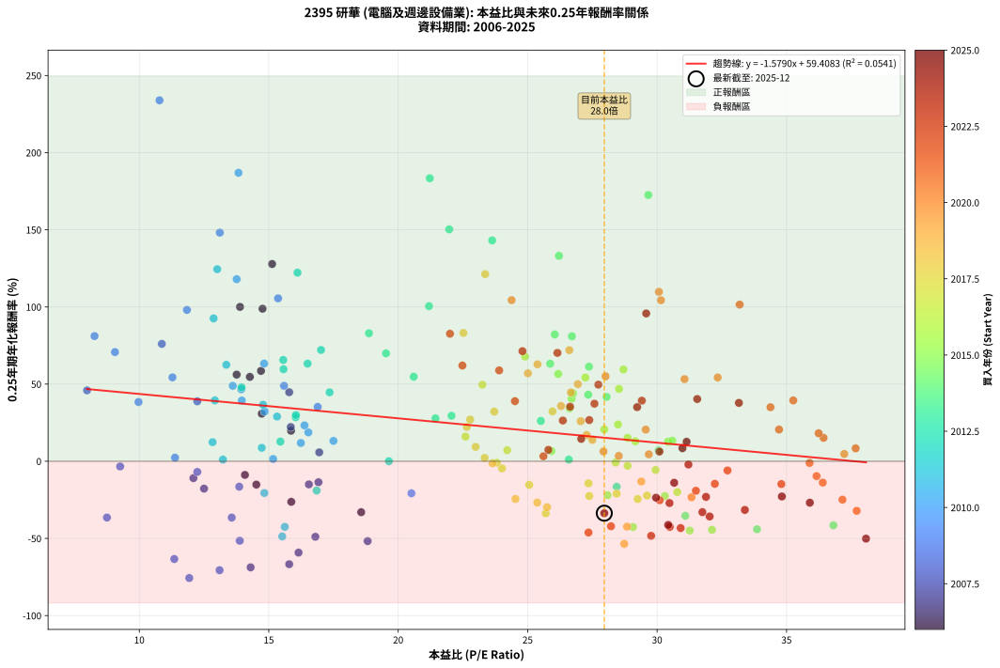
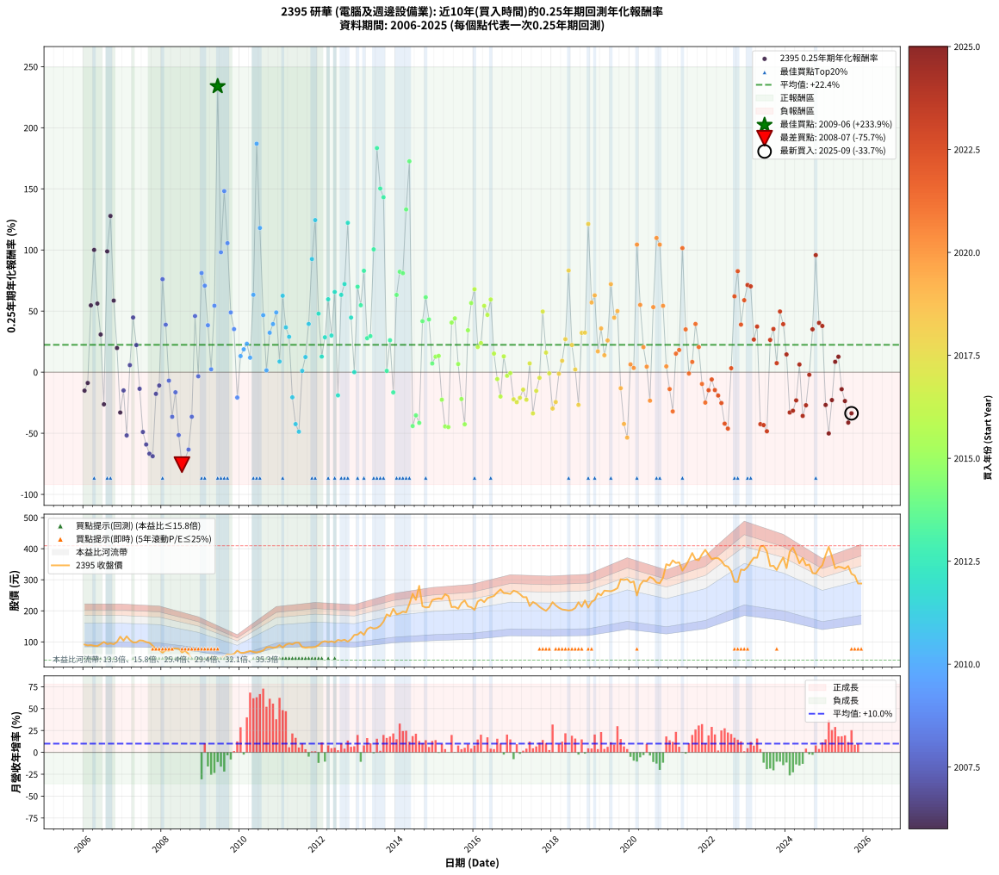

# 2395 研華 - 本益比與未來報酬率分析

!!! info "報告資訊"
    - **股票代號**: 2395
    - **公司名稱**: 研華
    - **產業別**: 電腦及週邊設備業
    - **分析期間**: 2006-2025 (237 個數據點)
    - **資料來源**: Type 12 (ShowMonthlyK_ChartFlow) 月收盤價與本益比
    - **報酬率口徑**: 含現金股利 (簡化: 年度合計，假設每年7/1入帳)
    - **報告生成時間**: 2026-01-04 08:48:03 CST

## 📈 視覺化圖表

### 圖表1: 本益比 vs 未來報酬率關係

*圖表1：2395 研華 本益比與0.25年期未來報酬率關係 (2006-2025)*

### 圖表2: 歷年買入時點的0.25年期實際報酬率

*圖表2：2395 研華 歷年買入時點的0.25年期實際報酬率 (2006-2025)*

## 📍 買點訊號說明

本報告提供兩種買點提示訊號（顯示於圖表2的股價子圖中）：

### ▲ 小綠色三角形（回測驗證）
- **計算方式**: 使用全部歷史資料計算本益比第25百分位數
- **用途**: 事後驗證，顯示歷史上哪些時點確實為低估區
- **限制**: 當下無法判斷，僅供回測參考
- **特性**: 後見之明（Look-Ahead Bias）

### ▲ 小橘色三角形（即時訊號）
- **計算方式**: 使用截至當月的過去5年資料計算本益比第25百分位數
- **用途**: 實際投資決策，當時即可判斷
- **優勢**: 可操作性強，符合實務需求
- **特性**: 無後見之明，滾動窗口計算

!!! tip "如何使用兩種訊號"
    - **綠色▲** 幫助理解歷史估值機會，驗證策略有效性
    - **橘色▲** 可作為實際買進參考，但仍需搭配基本面分析
    - 兩種訊號重疊時，表示即時判斷與事後驗證一致，信心度較高
    - 僅有綠色▲時，表示當時無法判斷（需要未來資料才能確認）
    - 僅有橘色▲時，表示即時判斷為買點，但事後可能不是最佳時機

## 📊 估值分析摘要

| 指標 | 數值 |
|:---:|:---:|
| **目前本益比** (2025-09) | **27.96 倍** |
| **歷史平均本益比** | 23.45 倍 |
| **估值水準** | 🟡 合理範圍 |
| **預期0.25年年化報酬率** | **+15.26%** |
| **歷史平均報酬率** | +22.38% |
| **相關係數 (R²)** | 0.0541 |
| **趨勢線斜率** | -1.5790 |

!!! abstract "核心洞察"
    目前本益比接近歷史平均，預期報酬率符合長期趨勢

    根據歷史數據回測，2395 研華 在目前本益比 **28.0倍** 的估值水準下，
    預期未來0.25年年化報酬率約為 **+15.3%**。

    **重要提醒**: 本分析基於歷史數據統計，實際報酬率會受到公司基本面變化、產業趨勢、
    總體經濟環境等多重因素影響。R² = 0.05 表示本益比可解釋約 5.4% 的報酬率變異。

## 📈 歷史估值統計

### 最佳買點 (最高報酬率)

| 項目 | 數值 |
|:---:|:---:|
| 起始時間 | 2009-06 |
| 當時本益比 | 10.78 倍 |
| 起始價格 | 46.5 元 |
| 0.25年後價格 | 60.0 元 |
| **0.25年年化報酬率** | **+233.89%** |

### 最差買點 (最低報酬率)

| 項目 | 數值 |
|:---:|:---:|
| 起始時間 | 2008-07 |
| 當時本益比 | 11.93 倍 |
| 起始價格 | 66.1 元 |
| 0.25年後價格 | 46.3 元 |
| **0.25年年化報酬率** | **-75.67%** |

## 🎯 投資啟示

### 本益比與報酬率關係

趨勢線方程式: **y = -1.5790x + 59.4083**

!!! warning "強負相關"
    本益比與未來報酬率呈現強負相關。在高本益比時期買入，未來報酬率顯著較低；
    在低本益比時期買入，未來報酬率顯著較高。**估值紀律至關重要**。

### 估值區間建議

基於歷史數據分析:

- **🟢 低估區** (P/E < 18.8): 預期報酬率較高，可考慮增加持股
- **🟡 合理區** (P/E 18.8-28.1): 預期報酬率符合長期趨勢，正常持有
- **🔴 高估區** (P/E > 28.1): 預期報酬率較低，可考慮減碼或觀望

!!! danger "風險提示"
    - 過去表現不代表未來結果
    - 本分析假設公司基本面無重大結構性變化
    - 產業環境劇變可能使歷史規律失效
    - 應結合公司財報、產業趨勢、總體經濟等多重因素綜合判斷

!!! success "長期投資觀點"
    歷史數據顯示，在合理或低估的估值水準買入並長期持有，
    往往能獲得較佳的投資報酬。**耐心等待好價格**是價值投資的核心原則。

## 📊 數據品質

- **資料來源**: GoodInfo.tw Type 12 (ShowMonthlyK_ChartFlow)
- **資料頻率**: 月度收盤價與本益比
- **回測期間**: 2006-2025
- **數據點數量**: 237 個 (每個點代表一次0.25年期回測)

### 計算方法說明

1. **0.25年期年化報酬率**:
   - 對每個歷史時點，計算其後0.25年的實際投資報酬率
   - 期末價值(不含股利): 期末價格
   - 期末價值(含現金股利): 期末價格 + 持有期間內的現金股利合計 (簡化: 年度合計，假設每年7/1入帳)
   - 公式: 年化報酬率 = [(期末價值/期初價格)^(1/年數) - 1] × 100%

2. **本益比 (P/E Ratio)**:
   - 使用當時的月收盤價與EPS計算
   - 資料來源: Type 12 月度河流圖本益比數據

3. **趨勢線 (Linear Regression)**:
   - 使用最小平方法擬合線性趨勢線
   - R²值衡量本益比對報酬率的解釋能力

---

*本報告由 Stock Analysis System v1.9.0 自動生成*
*數據更新時間: 2026-01-04 08:48:03 CST*

## 📋 月度回測明細表

（每一列對應時間線圖中的一個買入點；可用來對照 SVG 圖上的每個點。）

| 買入月份 | 賣出月份 | 回測期限_年 | 實際持有年數 | 買入本益比_倍 | 買入收盤價_元 | 賣出收盤價_元 | 現金股利合計_元 | 總報酬率_pct | 年化報酬率_pct |
| --- | --- | --- | --- | --- | --- | --- | --- | --- | --- |
| 2006-01 | 2006-05 | 0.25 | 0.329 | 14.52 | 91.50 | 86.70 | 0.00 | -5.25 | -15.13 |
| 2006-02 | 2006-05 | 0.25 | 0.246 | 14.08 | 88.70 | 86.70 | 0.00 | -2.25 | -8.84 |
| 2006-03 | 2006-07 | 0.25 | 0.334 | 14.27 | 89.90 | 100.00 | 4.00 | +15.68 | +54.67 |
| 2006-04 | 2006-07 | 0.25 | 0.249 | 13.89 | 87.50 | 100.00 | 4.00 | +18.85 | +100.03 |
| 2006-05 | 2006-08 | 0.25 | 0.252 | 13.76 | 86.70 | 93.00 | 4.00 | +11.88 | +56.14 |
| 2006-06 | 2006-09 | 0.25 | 0.252 | 14.73 | 92.80 | 95.30 | 4.00 | +7.00 | +30.83 |
| 2006-07 | 2006-10 | 0.25 | 0.252 | 15.87 | 100.00 | 92.60 | 0.00 | -7.40 | -26.30 |
| 2006-08 | 2006-12 | 0.25 | 0.334 | 14.76 | 93.00 | 117.00 | 0.00 | +25.81 | +98.84 |
| 2006-09 | 2006-12 | 0.25 | 0.249 | 15.13 | 95.30 | 117.00 | 0.00 | +22.77 | +127.82 |
| 2006-10 | 2007-01 | 0.25 | 0.252 | 14.70 | 92.60 | 104.00 | 0.00 | +12.31 | +58.56 |
| 2006-11 | 2007-03 | 0.25 | 0.329 | 15.86 | 99.90 | 106.00 | 0.00 | +6.11 | +19.77 |
| 2006-12 | 2007-03 | 0.25 | 0.246 | 18.57 | 117.00 | 106.00 | 0.00 | -9.40 | -33.01 |
| 2007-01 | 2007-05 | 0.25 | 0.329 | 16.55 | 104.00 | 98.60 | 0.00 | -5.19 | -14.98 |
| 2007-02 | 2007-05 | 0.25 | 0.246 | 18.82 | 118.00 | 98.60 | 0.00 | -16.44 | -51.76 |
| 2007-03 | 2007-07 | 0.25 | 0.334 | 16.95 | 106.00 | 104.00 | 4.00 | +1.89 | +5.77 |
| 2007-04 | 2007-07 | 0.25 | 0.249 | 15.79 | 98.50 | 104.00 | 4.00 | +9.65 | +44.74 |
| 2007-05 | 2007-08 | 0.25 | 0.252 | 15.85 | 98.60 | 99.70 | 4.00 | +5.18 | +22.19 |
| 2007-06 | 2007-09 | 0.25 | 0.252 | 16.92 | 105.00 | 97.20 | 4.00 | -3.61 | -13.60 |
| 2007-07 | 2007-10 | 0.25 | 0.252 | 16.80 | 104.00 | 87.80 | 0.00 | -15.58 | -48.94 |
| 2007-08 | 2007-12 | 0.25 | 0.334 | 16.15 | 99.70 | 73.90 | 0.00 | -25.88 | -59.20 |
| 2007-09 | 2007-12 | 0.25 | 0.249 | 15.79 | 97.20 | 73.90 | 0.00 | -23.97 | -66.71 |
| 2007-10 | 2008-01 | 0.25 | 0.252 | 14.30 | 87.80 | 65.50 | 0.00 | -25.40 | -68.75 |
| 2007-11 | 2008-03 | 0.25 | 0.331 | 12.50 | 76.60 | 71.80 | 0.00 | -6.27 | -17.74 |
| 2007-12 | 2008-03 | 0.25 | 0.249 | 12.09 | 73.90 | 71.80 | 0.00 | -2.84 | -10.93 |
| 2008-01 | 2008-05 | 0.25 | 0.331 | 10.87 | 65.50 | 79.00 | 0.00 | +20.61 | +76.06 |
| 2008-02 | 2008-05 | 0.25 | 0.249 | 12.24 | 72.80 | 79.00 | 0.00 | +8.52 | +38.83 |
| 2008-03 | 2008-07 | 0.25 | 0.334 | 12.24 | 71.80 | 66.10 | 4.00 | -2.37 | -6.93 |
| 2008-04 | 2008-07 | 0.25 | 0.249 | 13.57 | 78.50 | 66.10 | 4.00 | -10.70 | -36.51 |
| 2008-05 | 2008-08 | 0.25 | 0.252 | 13.86 | 79.00 | 71.50 | 4.00 | -4.43 | -16.47 |
| 2008-06 | 2008-09 | 0.25 | 0.252 | 13.88 | 78.00 | 61.00 | 4.00 | -16.67 | -51.51 |
| 2008-07 | 2008-10 | 0.25 | 0.252 | 11.93 | 66.10 | 46.30 | 0.00 | -29.95 | -75.67 |
| 2008-08 | 2008-12 | 0.25 | 0.334 | 13.10 | 71.50 | 47.50 | 0.00 | -33.57 | -70.61 |
| 2008-09 | 2008-12 | 0.25 | 0.249 | 11.35 | 61.00 | 47.50 | 0.00 | -22.13 | -63.36 |
| 2008-10 | 2009-01 | 0.25 | 0.252 | 8.75 | 46.30 | 41.30 | 0.00 | -10.80 | -36.47 |
| 2008-11 | 2009-03 | 0.25 | 0.329 | 7.98 | 41.60 | 47.10 | 0.00 | +13.22 | +45.93 |
| 2008-12 | 2009-03 | 0.25 | 0.246 | 9.26 | 47.50 | 47.10 | 0.00 | -0.84 | -3.37 |
| 2009-01 | 2009-05 | 0.25 | 0.329 | 8.27 | 41.30 | 50.20 | 0.00 | +21.55 | +81.12 |
| 2009-02 | 2009-05 | 0.25 | 0.246 | 9.06 | 44.00 | 50.20 | 0.00 | +14.09 | +70.74 |
| 2009-03 | 2009-07 | 0.25 | 0.334 | 9.97 | 47.10 | 49.50 | 3.00 | +11.46 | +38.40 |
| 2009-04 | 2009-07 | 0.25 | 0.249 | 11.38 | 52.20 | 49.50 | 3.00 | +0.57 | +2.33 |
| 2009-05 | 2009-08 | 0.25 | 0.252 | 11.28 | 50.20 | 53.00 | 3.00 | +11.55 | +54.35 |
| 2009-06 | 2009-09 | 0.25 | 0.252 | 10.78 | 46.50 | 60.00 | 3.00 | +35.48 | +233.89 |
| 2009-07 | 2009-10 | 0.25 | 0.252 | 11.84 | 49.50 | 58.80 | 0.00 | +18.79 | +98.09 |
| 2009-08 | 2009-12 | 0.25 | 0.334 | 13.11 | 53.00 | 71.80 | 0.00 | +35.47 | +148.16 |
| 2009-09 | 2009-12 | 0.25 | 0.249 | 15.36 | 60.00 | 71.80 | 0.00 | +19.67 | +105.57 |
| 2009-10 | 2010-01 | 0.25 | 0.252 | 15.59 | 58.80 | 65.00 | 0.00 | +10.54 | +48.88 |
| 2009-11 | 2010-03 | 0.25 | 0.329 | 16.89 | 61.40 | 67.80 | 0.00 | +10.42 | +35.23 |
| 2009-12 | 2010-03 | 0.25 | 0.246 | 20.51 | 71.80 | 67.80 | 0.00 | -5.57 | -20.76 |
| 2010-01 | 2010-05 | 0.25 | 0.329 | 17.50 | 65.00 | 67.70 | 0.00 | +4.15 | +13.19 |
| 2010-02 | 2010-05 | 0.25 | 0.246 | 16.53 | 64.90 | 67.70 | 0.00 | +4.31 | +18.70 |
| 2010-03 | 2010-07 | 0.25 | 0.334 | 16.38 | 67.80 | 68.70 | 4.00 | +7.23 | +23.23 |
| 2010-04 | 2010-07 | 0.25 | 0.249 | 16.24 | 70.70 | 68.70 | 4.00 | +2.83 | +11.85 |
| 2010-05 | 2010-08 | 0.25 | 0.252 | 14.82 | 67.70 | 72.60 | 4.00 | +13.15 | +63.29 |
| 2010-06 | 2010-09 | 0.25 | 0.252 | 13.83 | 66.10 | 82.20 | 4.00 | +30.41 | +186.93 |
| 2010-07 | 2010-10 | 0.25 | 0.252 | 13.76 | 68.70 | 83.60 | 0.00 | +21.69 | +118.00 |
| 2010-08 | 2010-12 | 0.25 | 0.334 | 13.94 | 72.60 | 82.50 | 0.00 | +13.64 | +46.63 |
| 2010-09 | 2010-12 | 0.25 | 0.249 | 15.17 | 82.20 | 82.50 | 0.00 | +0.36 | +1.47 |
| 2010-10 | 2011-01 | 0.25 | 0.252 | 14.84 | 83.60 | 89.70 | 0.00 | +7.30 | +32.26 |
| 2010-11 | 2011-03 | 0.25 | 0.329 | 13.96 | 81.60 | 91.00 | 0.00 | +11.52 | +39.36 |
| 2010-12 | 2011-03 | 0.25 | 0.246 | 13.61 | 82.50 | 91.00 | 0.00 | +10.30 | +48.88 |
| 2011-01 | 2011-05 | 0.25 | 0.329 | 14.73 | 89.70 | 92.20 | 0.00 | +2.79 | +8.73 |
| 2011-02 | 2011-05 | 0.25 | 0.246 | 13.36 | 81.80 | 92.20 | 0.00 | +12.71 | +62.53 |
| 2011-03 | 2011-07 | 0.25 | 0.334 | 14.78 | 91.00 | 97.50 | 3.50 | +10.99 | +36.63 |
| 2011-04 | 2011-07 | 0.25 | 0.249 | 15.32 | 94.80 | 97.50 | 3.50 | +6.54 | +28.95 |
| 2011-05 | 2011-08 | 0.25 | 0.252 | 14.83 | 92.20 | 83.50 | 3.50 | -5.64 | -20.58 |
| 2011-06 | 2011-09 | 0.25 | 0.252 | 15.62 | 97.60 | 81.40 | 3.50 | -13.01 | -42.50 |
| 2011-07 | 2011-10 | 0.25 | 0.252 | 15.52 | 97.50 | 82.40 | 0.00 | -15.49 | -48.73 |
| 2011-08 | 2011-12 | 0.25 | 0.334 | 13.23 | 83.50 | 83.80 | 0.00 | +0.36 | +1.08 |
| 2011-09 | 2011-12 | 0.25 | 0.249 | 12.83 | 81.40 | 83.80 | 0.00 | +2.95 | +12.37 |
| 2011-10 | 2012-01 | 0.25 | 0.252 | 12.92 | 82.40 | 89.60 | 0.00 | +8.74 | +39.46 |
| 2011-11 | 2012-03 | 0.25 | 0.331 | 12.87 | 82.50 | 102.50 | 0.00 | +24.24 | +92.56 |
| 2011-12 | 2012-03 | 0.25 | 0.249 | 13.01 | 83.80 | 102.50 | 0.00 | +22.32 | +124.45 |
| 2012-01 | 2012-05 | 0.25 | 0.331 | 13.95 | 89.60 | 102.00 | 0.00 | +13.84 | +47.88 |
| 2012-02 | 2012-05 | 0.25 | 0.249 | 15.45 | 99.00 | 102.00 | 0.00 | +3.03 | +12.73 |
| 2012-03 | 2012-07 | 0.25 | 0.334 | 16.04 | 102.50 | 106.50 | 4.96 | +8.75 | +28.53 |
| 2012-04 | 2012-07 | 0.25 | 0.249 | 15.57 | 99.20 | 106.50 | 4.96 | +12.36 | +59.66 |
| 2012-05 | 2012-08 | 0.25 | 0.252 | 16.05 | 102.00 | 104.00 | 4.96 | +6.83 | +29.98 |
| 2012-06 | 2012-09 | 0.25 | 0.252 | 15.56 | 98.60 | 107.00 | 4.96 | +13.55 | +65.64 |
| 2012-07 | 2012-10 | 0.25 | 0.252 | 16.85 | 106.50 | 101.00 | 0.00 | -5.16 | -18.98 |
| 2012-08 | 2012-12 | 0.25 | 0.334 | 16.50 | 104.00 | 122.50 | 0.00 | +17.79 | +63.26 |
| 2012-09 | 2012-12 | 0.25 | 0.249 | 17.02 | 107.00 | 122.50 | 0.00 | +14.49 | +72.11 |
| 2012-10 | 2013-01 | 0.25 | 0.252 | 16.11 | 101.00 | 123.50 | 0.00 | +22.28 | +122.21 |
| 2012-11 | 2013-03 | 0.25 | 0.329 | 17.35 | 108.50 | 122.50 | 0.00 | +12.90 | +44.69 |
| 2012-12 | 2013-03 | 0.25 | 0.246 | 19.64 | 122.50 | 122.50 | 0.00 | +0.00 | +0.00 |
| 2013-01 | 2013-05 | 0.25 | 0.329 | 19.53 | 123.50 | 147.00 | 0.00 | +19.03 | +69.93 |
| 2013-02 | 2013-05 | 0.25 | 0.246 | 20.60 | 132.00 | 147.00 | 0.00 | +11.36 | +54.77 |
| 2013-03 | 2013-07 | 0.25 | 0.334 | 18.87 | 122.50 | 145.00 | 4.89 | +22.36 | +82.95 |
| 2013-04 | 2013-07 | 0.25 | 0.249 | 21.44 | 141.00 | 145.00 | 4.89 | +6.30 | +27.80 |
| 2013-05 | 2013-08 | 0.25 | 0.252 | 22.06 | 147.00 | 152.00 | 4.89 | +6.73 | +29.49 |
| 2013-06 | 2013-09 | 0.25 | 0.252 | 21.19 | 143.00 | 165.50 | 4.89 | +19.15 | +100.50 |
| 2013-07 | 2013-10 | 0.25 | 0.252 | 21.22 | 145.00 | 188.50 | 0.00 | +30.00 | +183.38 |
| 2013-08 | 2013-12 | 0.25 | 0.334 | 21.97 | 152.00 | 206.50 | 0.00 | +35.86 | +150.27 |
| 2013-09 | 2013-12 | 0.25 | 0.249 | 23.63 | 165.50 | 206.50 | 0.00 | +24.77 | +143.11 |
| 2013-10 | 2014-01 | 0.25 | 0.252 | 26.59 | 188.50 | 189.00 | 0.00 | +0.27 | +1.06 |
| 2013-11 | 2014-03 | 0.25 | 0.329 | 25.51 | 183.00 | 197.50 | 0.00 | +7.92 | +26.12 |
| 2013-12 | 2014-03 | 0.25 | 0.246 | 28.44 | 206.50 | 197.50 | 0.00 | -4.36 | -16.54 |
| 2014-01 | 2014-05 | 0.25 | 0.329 | 25.87 | 189.00 | 222.00 | 0.00 | +17.46 | +63.20 |
| 2014-02 | 2014-05 | 0.25 | 0.246 | 26.05 | 191.50 | 222.00 | 0.00 | +15.93 | +82.17 |
| 2014-03 | 2014-07 | 0.25 | 0.334 | 26.71 | 197.50 | 235.50 | 5.28 | +21.91 | +80.98 |
| 2014-04 | 2014-07 | 0.25 | 0.249 | 26.21 | 195.00 | 235.50 | 5.28 | +23.48 | +133.12 |
| 2014-05 | 2014-08 | 0.25 | 0.252 | 29.66 | 222.00 | 280.50 | 5.28 | +28.73 | +172.54 |
| 2014-06 | 2014-09 | 0.25 | 0.252 | 33.86 | 255.00 | 215.00 | 5.28 | -13.62 | -44.07 |
| 2014-07 | 2014-10 | 0.25 | 0.252 | 31.09 | 235.50 | 211.00 | 0.00 | -10.40 | -35.35 |
| 2014-08 | 2014-12 | 0.25 | 0.334 | 36.81 | 280.50 | 234.50 | 0.00 | -16.40 | -41.51 |
| 2014-09 | 2014-12 | 0.25 | 0.249 | 28.05 | 215.00 | 234.50 | 0.00 | +9.07 | +41.69 |
| 2014-10 | 2015-01 | 0.25 | 0.252 | 27.37 | 211.00 | 238.00 | 0.00 | +12.80 | +61.29 |
| 2014-11 | 2015-03 | 0.25 | 0.329 | 27.34 | 212.00 | 238.50 | 0.00 | +12.50 | +43.12 |
| 2014-12 | 2015-03 | 0.25 | 0.246 | 30.06 | 234.50 | 238.50 | 0.00 | +1.71 | +7.11 |
| 2015-01 | 2015-05 | 0.25 | 0.329 | 30.42 | 238.00 | 247.50 | 0.00 | +3.99 | +12.65 |
| 2015-02 | 2015-05 | 0.25 | 0.246 | 30.59 | 240.00 | 247.50 | 0.00 | +3.12 | +13.30 |
| 2015-03 | 2015-07 | 0.25 | 0.334 | 30.30 | 238.50 | 213.00 | 6.00 | -8.18 | -22.54 |
| 2015-04 | 2015-07 | 0.25 | 0.249 | 32.12 | 253.50 | 213.00 | 6.00 | -13.61 | -44.41 |
| 2015-05 | 2015-08 | 0.25 | 0.252 | 31.26 | 247.50 | 207.00 | 6.00 | -13.94 | -44.90 |
| 2015-06 | 2015-09 | 0.25 | 0.252 | 26.70 | 212.00 | 225.00 | 6.00 | +8.96 | +40.59 |
| 2015-07 | 2015-10 | 0.25 | 0.252 | 26.75 | 213.00 | 233.50 | 0.00 | +9.62 | +44.02 |
| 2015-08 | 2015-12 | 0.25 | 0.334 | 25.92 | 207.00 | 211.50 | 0.00 | +2.17 | +6.65 |
| 2015-09 | 2015-12 | 0.25 | 0.249 | 28.09 | 225.00 | 211.50 | 0.00 | -6.00 | -21.99 |
| 2015-10 | 2016-01 | 0.25 | 0.252 | 29.07 | 233.50 | 203.00 | 0.00 | -13.06 | -42.63 |
| 2015-11 | 2016-03 | 0.25 | 0.331 | 26.62 | 214.50 | 236.50 | 0.00 | +10.26 | +34.28 |
| 2015-12 | 2016-03 | 0.25 | 0.249 | 26.18 | 211.50 | 236.50 | 0.00 | +11.82 | +56.58 |
| 2016-01 | 2016-05 | 0.25 | 0.331 | 24.90 | 203.00 | 241.00 | 0.00 | +18.72 | +67.86 |
| 2016-02 | 2016-05 | 0.25 | 0.249 | 27.96 | 230.00 | 241.00 | 0.00 | +4.78 | +20.62 |
| 2016-03 | 2016-07 | 0.25 | 0.334 | 28.49 | 236.50 | 248.00 | 6.00 | +7.40 | +23.83 |
| 2016-04 | 2016-07 | 0.25 | 0.249 | 27.23 | 228.00 | 248.00 | 6.00 | +11.40 | +54.26 |
| 2016-05 | 2016-08 | 0.25 | 0.252 | 28.53 | 241.00 | 259.50 | 6.00 | +10.17 | +46.87 |
| 2016-06 | 2016-09 | 0.25 | 0.252 | 28.70 | 244.50 | 269.00 | 6.00 | +12.47 | +59.47 |
| 2016-07 | 2016-10 | 0.25 | 0.252 | 28.86 | 248.00 | 257.00 | 0.00 | +3.63 | +15.20 |
| 2016-08 | 2016-12 | 0.25 | 0.334 | 29.94 | 259.50 | 254.50 | 0.00 | -1.93 | -5.66 |
| 2016-09 | 2016-12 | 0.25 | 0.249 | 30.78 | 269.00 | 254.50 | 0.00 | -5.39 | -19.94 |
| 2016-10 | 2017-01 | 0.25 | 0.252 | 29.16 | 257.00 | 265.00 | 0.00 | +3.11 | +12.94 |
| 2016-11 | 2017-03 | 0.25 | 0.329 | 28.86 | 256.50 | 254.00 | 0.00 | -0.97 | -2.94 |
| 2016-12 | 2017-03 | 0.25 | 0.246 | 28.40 | 254.50 | 254.00 | 0.00 | -0.20 | -0.79 |
| 2017-01 | 2017-05 | 0.25 | 0.329 | 29.61 | 265.00 | 244.00 | 0.00 | -7.92 | -22.22 |
| 2017-02 | 2017-05 | 0.25 | 0.246 | 29.25 | 261.50 | 244.00 | 0.00 | -6.69 | -24.51 |
| 2017-03 | 2017-07 | 0.25 | 0.334 | 28.44 | 254.00 | 228.50 | 6.30 | -7.56 | -20.97 |
| 2017-04 | 2017-07 | 0.25 | 0.249 | 27.35 | 244.00 | 228.50 | 6.30 | -3.77 | -14.30 |
| 2017-05 | 2017-08 | 0.25 | 0.252 | 27.38 | 244.00 | 222.50 | 6.30 | -6.23 | -22.54 |
| 2017-06 | 2017-09 | 0.25 | 0.252 | 24.21 | 215.50 | 213.00 | 6.30 | +1.76 | +7.18 |
| 2017-07 | 2017-10 | 0.25 | 0.252 | 25.70 | 228.50 | 206.00 | 0.00 | -9.85 | -33.74 |
| 2017-08 | 2017-12 | 0.25 | 0.334 | 25.06 | 222.50 | 210.50 | 0.00 | -5.39 | -15.29 |
| 2017-09 | 2017-12 | 0.25 | 0.249 | 24.01 | 213.00 | 210.50 | 0.00 | -1.17 | -4.63 |
| 2017-10 | 2018-01 | 0.25 | 0.252 | 23.25 | 206.00 | 228.00 | 0.00 | +10.68 | +49.61 |
| 2017-11 | 2018-03 | 0.25 | 0.329 | 22.60 | 200.00 | 210.00 | 0.00 | +5.00 | +16.01 |
| 2017-12 | 2018-03 | 0.25 | 0.246 | 23.81 | 210.50 | 210.00 | 0.00 | -0.24 | -0.96 |
| 2018-01 | 2018-05 | 0.25 | 0.329 | 25.75 | 228.00 | 203.00 | 0.00 | -10.96 | -29.78 |
| 2018-02 | 2018-05 | 0.25 | 0.246 | 24.53 | 217.50 | 203.00 | 0.00 | -6.67 | -24.42 |
| 2018-03 | 2018-07 | 0.25 | 0.334 | 23.64 | 210.00 | 202.50 | 6.59 | -0.43 | -1.28 |
| 2018-04 | 2018-07 | 0.25 | 0.249 | 22.99 | 204.50 | 202.50 | 6.59 | +2.25 | +9.33 |
| 2018-05 | 2018-08 | 0.25 | 0.252 | 22.78 | 203.00 | 209.00 | 6.59 | +6.20 | +27.00 |
| 2018-06 | 2018-09 | 0.25 | 0.252 | 22.52 | 201.00 | 227.50 | 6.59 | +16.47 | +83.15 |
| 2018-07 | 2018-10 | 0.25 | 0.252 | 22.65 | 202.50 | 213.00 | 0.00 | +5.19 | +22.23 |
| 2018-08 | 2018-12 | 0.25 | 0.334 | 23.34 | 209.00 | 210.50 | 0.00 | +0.72 | +2.16 |
| 2018-09 | 2018-12 | 0.25 | 0.249 | 25.37 | 227.50 | 210.50 | 0.00 | -7.47 | -26.78 |
| 2018-10 | 2019-01 | 0.25 | 0.252 | 23.71 | 213.00 | 228.50 | 0.00 | +7.28 | +32.16 |
| 2018-11 | 2019-03 | 0.25 | 0.329 | 25.96 | 233.50 | 256.00 | 0.00 | +9.64 | +32.31 |
| 2018-12 | 2019-03 | 0.25 | 0.246 | 23.36 | 210.50 | 256.00 | 0.00 | +21.62 | +121.26 |
| 2019-01 | 2019-05 | 0.25 | 0.329 | 25.01 | 228.50 | 265.00 | 0.00 | +15.97 | +57.00 |
| 2019-02 | 2019-05 | 0.25 | 0.246 | 25.38 | 235.00 | 265.00 | 0.00 | +12.77 | +62.84 |
| 2019-03 | 2019-07 | 0.25 | 0.334 | 27.28 | 256.00 | 263.00 | 6.80 | +5.39 | +17.02 |
| 2019-04 | 2019-07 | 0.25 | 0.249 | 26.29 | 250.00 | 263.00 | 6.80 | +7.92 | +35.78 |
| 2019-05 | 2019-08 | 0.25 | 0.252 | 27.50 | 265.00 | 267.00 | 6.80 | +3.32 | +13.84 |
| 2019-06 | 2019-09 | 0.25 | 0.252 | 27.05 | 264.00 | 273.00 | 6.80 | +5.98 | +25.95 |
| 2019-07 | 2019-10 | 0.25 | 0.252 | 26.61 | 263.00 | 301.50 | 0.00 | +14.64 | +72.01 |
| 2019-08 | 2019-12 | 0.25 | 0.334 | 26.67 | 267.00 | 302.00 | 0.00 | +13.11 | +44.60 |
| 2019-09 | 2019-12 | 0.25 | 0.249 | 26.94 | 273.00 | 302.00 | 0.00 | +10.62 | +49.96 |
| 2019-10 | 2020-01 | 0.25 | 0.252 | 29.39 | 301.50 | 291.00 | 0.00 | -3.48 | -13.13 |
| 2019-11 | 2020-03 | 0.25 | 0.331 | 28.84 | 299.50 | 249.50 | 0.00 | -16.69 | -42.38 |
| 2019-12 | 2020-03 | 0.25 | 0.249 | 28.73 | 302.00 | 249.50 | 0.00 | -17.38 | -53.54 |
| 2020-01 | 2020-05 | 0.25 | 0.331 | 27.93 | 291.00 | 297.00 | 0.00 | +2.06 | +6.35 |
| 2020-02 | 2020-05 | 0.25 | 0.249 | 28.52 | 294.50 | 297.00 | 0.00 | +0.85 | +3.45 |
| 2020-03 | 2020-07 | 0.25 | 0.334 | 24.38 | 249.50 | 309.00 | 7.79 | +26.97 | +104.39 |
| 2020-04 | 2020-07 | 0.25 | 0.249 | 28.01 | 284.00 | 309.00 | 7.79 | +11.55 | +55.05 |
| 2020-05 | 2020-08 | 0.25 | 0.252 | 29.56 | 297.00 | 303.50 | 7.79 | +4.81 | +20.51 |
| 2020-06 | 2020-09 | 0.25 | 0.252 | 29.68 | 295.50 | 291.00 | 7.79 | +1.11 | +4.49 |
| 2020-07 | 2020-10 | 0.25 | 0.252 | 31.33 | 309.00 | 289.00 | 0.00 | -6.47 | -23.33 |
| 2020-08 | 2020-12 | 0.25 | 0.334 | 31.06 | 303.50 | 350.00 | 0.00 | +15.32 | +53.23 |
| 2020-09 | 2020-12 | 0.25 | 0.249 | 30.07 | 291.00 | 350.00 | 0.00 | +20.27 | +109.80 |
| 2020-10 | 2021-01 | 0.25 | 0.252 | 30.15 | 289.00 | 346.00 | 0.00 | +19.72 | +104.35 |
| 2020-11 | 2021-03 | 0.25 | 0.329 | 32.34 | 307.00 | 354.00 | 0.00 | +15.31 | +54.28 |
| 2020-12 | 2021-03 | 0.25 | 0.246 | 37.23 | 350.00 | 354.00 | 0.00 | +1.14 | +4.72 |
| 2021-01 | 2021-05 | 0.25 | 0.329 | 36.40 | 346.00 | 329.50 | 0.00 | -4.77 | -13.82 |
| 2021-02 | 2021-05 | 0.25 | 0.246 | 37.71 | 362.50 | 329.50 | 0.00 | -9.10 | -32.12 |
| 2021-03 | 2021-07 | 0.25 | 0.334 | 36.43 | 354.00 | 364.00 | 7.09 | +4.83 | +15.16 |
| 2021-04 | 2021-07 | 0.25 | 0.249 | 36.24 | 356.00 | 364.00 | 7.09 | +4.24 | +18.14 |
| 2021-05 | 2021-08 | 0.25 | 0.252 | 33.19 | 329.50 | 386.00 | 7.09 | +19.30 | +101.50 |
| 2021-06 | 2021-09 | 0.25 | 0.252 | 34.38 | 345.00 | 365.00 | 7.09 | +7.85 | +35.00 |
| 2021-07 | 2021-10 | 0.25 | 0.252 | 35.89 | 364.00 | 363.00 | 0.00 | -0.27 | -1.09 |
| 2021-08 | 2021-12 | 0.25 | 0.334 | 37.67 | 386.00 | 396.50 | 0.00 | +2.72 | +8.37 |
| 2021-09 | 2021-12 | 0.25 | 0.249 | 35.26 | 365.00 | 396.50 | 0.00 | +8.63 | +39.41 |
| 2021-10 | 2022-01 | 0.25 | 0.252 | 34.71 | 363.00 | 380.50 | 0.00 | +4.82 | +20.55 |
| 2021-11 | 2022-03 | 0.25 | 0.329 | 36.16 | 382.00 | 369.50 | 0.00 | -3.27 | -9.63 |
| 2021-12 | 2022-03 | 0.25 | 0.246 | 37.16 | 396.50 | 369.50 | 0.00 | -6.81 | -24.89 |
| 2022-01 | 2022-05 | 0.25 | 0.329 | 34.80 | 380.50 | 361.00 | 0.00 | -5.12 | -14.80 |
| 2022-02 | 2022-05 | 0.25 | 0.246 | 32.72 | 366.50 | 361.00 | 0.00 | -1.50 | -5.95 |
| 2022-03 | 2022-07 | 0.25 | 0.334 | 32.23 | 369.50 | 342.50 | 7.98 | -5.15 | -14.63 |
| 2022-04 | 2022-07 | 0.25 | 0.249 | 31.50 | 369.50 | 342.50 | 7.98 | -5.15 | -19.11 |
| 2022-05 | 2022-08 | 0.25 | 0.252 | 30.10 | 361.00 | 327.50 | 7.98 | -7.07 | -25.25 |
| 2022-06 | 2022-09 | 0.25 | 0.252 | 28.22 | 346.00 | 293.50 | 7.98 | -12.87 | -42.12 |
| 2022-07 | 2022-10 | 0.25 | 0.252 | 27.35 | 342.50 | 293.00 | 0.00 | -14.45 | -46.19 |
| 2022-08 | 2022-12 | 0.25 | 0.334 | 25.61 | 327.50 | 331.00 | 0.00 | +1.07 | +3.23 |
| 2022-09 | 2022-12 | 0.25 | 0.249 | 22.48 | 293.50 | 331.00 | 0.00 | +12.78 | +62.03 |
| 2022-10 | 2023-01 | 0.25 | 0.252 | 22.00 | 293.00 | 341.00 | 0.00 | +16.38 | +82.63 |
| 2022-11 | 2023-03 | 0.25 | 0.329 | 24.51 | 333.00 | 371.00 | 0.00 | +11.41 | +38.94 |
| 2022-12 | 2023-03 | 0.25 | 0.246 | 23.90 | 331.00 | 371.00 | 0.00 | +12.08 | +58.88 |
| 2023-01 | 2023-05 | 0.25 | 0.329 | 24.80 | 341.00 | 407.00 | 0.00 | +19.35 | +71.35 |
| 2023-02 | 2023-05 | 0.25 | 0.246 | 26.15 | 357.00 | 407.00 | 0.00 | +14.01 | +70.23 |
| 2023-03 | 2023-07 | 0.25 | 0.334 | 27.38 | 371.00 | 391.50 | 9.99 | +8.22 | +26.67 |
| 2023-04 | 2023-07 | 0.25 | 0.249 | 27.58 | 371.00 | 391.50 | 9.99 | +8.22 | +37.30 |
| 2023-05 | 2023-08 | 0.25 | 0.252 | 30.49 | 407.00 | 344.00 | 9.99 | -13.03 | -42.54 |
| 2023-06 | 2023-09 | 0.25 | 0.252 | 30.91 | 409.50 | 345.00 | 9.99 | -13.31 | -43.29 |
| 2023-07 | 2023-10 | 0.25 | 0.252 | 29.77 | 391.50 | 331.50 | 0.00 | -15.33 | -48.34 |
| 2023-08 | 2023-12 | 0.25 | 0.334 | 26.36 | 344.00 | 372.00 | 0.00 | +8.14 | +26.40 |
| 2023-09 | 2023-12 | 0.25 | 0.249 | 26.64 | 345.00 | 372.00 | 0.00 | +7.83 | +35.31 |
| 2023-10 | 2024-01 | 0.25 | 0.252 | 25.80 | 331.50 | 337.50 | 0.00 | +1.81 | +7.38 |
| 2023-11 | 2024-03 | 0.25 | 0.331 | 27.73 | 353.50 | 404.00 | 0.00 | +14.29 | +49.64 |
| 2023-12 | 2024-03 | 0.25 | 0.249 | 29.41 | 372.00 | 404.00 | 0.00 | +8.60 | +39.27 |
| 2024-01 | 2024-05 | 0.25 | 0.331 | 27.07 | 337.50 | 353.00 | 0.00 | +4.59 | +14.52 |
| 2024-02 | 2024-05 | 0.25 | 0.249 | 31.75 | 390.00 | 353.00 | 0.00 | -9.49 | -32.97 |
| 2024-03 | 2024-07 | 0.25 | 0.334 | 33.39 | 404.00 | 346.50 | 9.45 | -11.89 | -31.55 |
| 2024-04 | 2024-07 | 0.25 | 0.249 | 31.89 | 380.00 | 346.50 | 9.45 | -6.33 | -23.08 |
| 2024-05 | 2024-08 | 0.25 | 0.252 | 30.09 | 353.00 | 349.00 | 9.45 | +1.54 | +6.27 |
| 2024-06 | 2024-09 | 0.25 | 0.252 | 32.03 | 370.00 | 321.50 | 9.45 | -10.55 | -35.78 |
| 2024-07 | 2024-10 | 0.25 | 0.252 | 30.48 | 346.50 | 320.00 | 0.00 | -7.65 | -27.08 |
| 2024-08 | 2024-12 | 0.25 | 0.334 | 31.21 | 349.00 | 346.50 | 0.00 | -0.72 | -2.13 |
| 2024-09 | 2024-12 | 0.25 | 0.249 | 29.23 | 321.50 | 346.50 | 0.00 | +7.78 | +35.06 |
| 2024-10 | 2025-01 | 0.25 | 0.252 | 29.58 | 320.00 | 379.00 | 0.00 | +18.44 | +95.78 |
| 2024-11 | 2025-03 | 0.25 | 0.329 | 31.55 | 335.50 | 375.00 | 0.00 | +11.77 | +40.32 |
| 2024-12 | 2025-03 | 0.25 | 0.246 | 33.16 | 346.50 | 375.00 | 0.00 | +8.23 | +37.82 |
| 2025-01 | 2025-05 | 0.25 | 0.329 | 35.90 | 379.00 | 342.00 | 0.00 | -9.76 | -26.85 |
| 2025-02 | 2025-05 | 0.25 | 0.246 | 38.07 | 406.00 | 342.00 | 0.00 | -15.76 | -50.15 |
| 2025-03 | 2025-07 | 0.25 | 0.334 | 34.82 | 375.00 | 335.50 | 8.39 | -8.30 | -22.84 |
| 2025-04 | 2025-07 | 0.25 | 0.249 | 30.98 | 337.00 | 335.50 | 8.39 | +2.05 | +8.46 |
| 2025-05 | 2025-08 | 0.25 | 0.252 | 31.14 | 342.00 | 344.00 | 8.39 | +3.04 | +12.62 |
| 2025-06 | 2025-09 | 0.25 | 0.252 | 30.66 | 340.00 | 319.00 | 8.39 | -3.71 | -13.93 |
| 2025-07 | 2025-10 | 0.25 | 0.252 | 29.96 | 335.50 | 313.50 | 0.00 | -6.56 | -23.61 |
| 2025-08 | 2025-12 | 0.25 | 0.334 | 30.43 | 344.00 | 288.00 | 0.00 | -16.28 | -41.25 |
| 2025-09 | 2025-12 | 0.25 | 0.249 | 27.96 | 319.00 | 288.00 | 0.00 | -9.72 | -33.66 |
