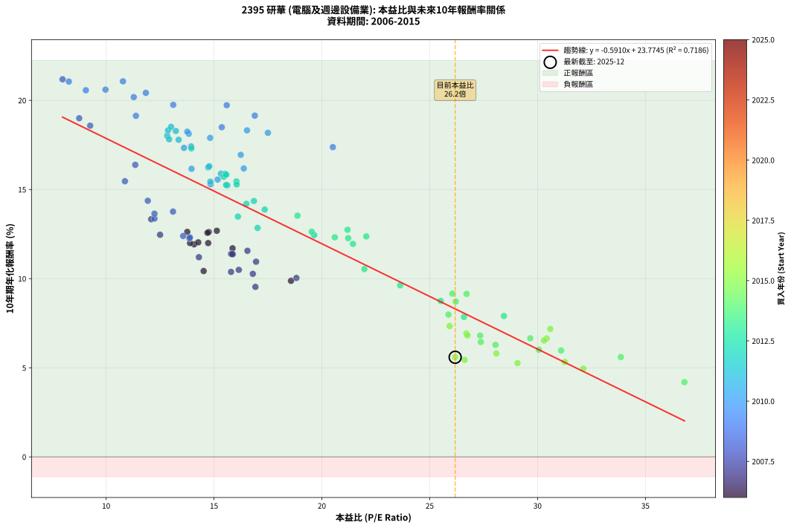
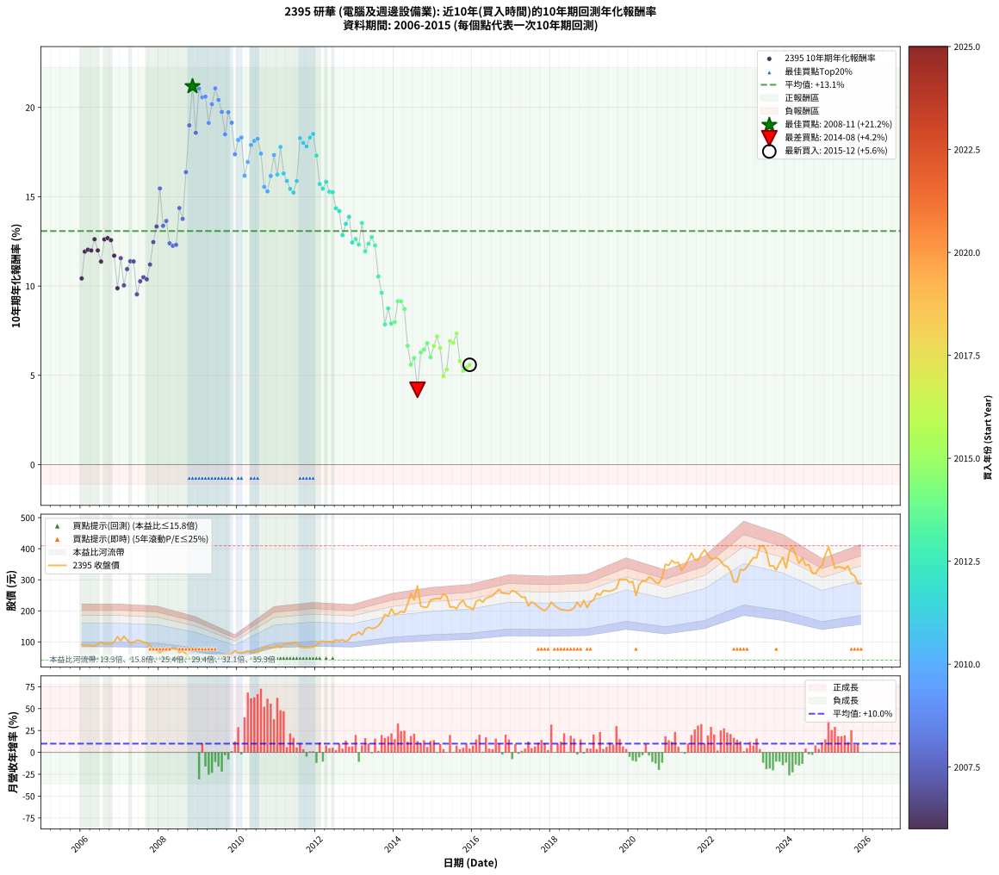

# 2395 研華 - 本益比與未來報酬率分析

!!! info "報告資訊"
    - **股票代號**: 2395
    - **公司名稱**: 研華
    - **產業別**: 電腦及週邊設備業
    - **分析期間**: 2006-2015 (120 個數據點)
    - **資料來源**: Type 12 (ShowMonthlyK_ChartFlow) 月收盤價與本益比
    - **報酬率口徑**: 含現金股利 (簡化: 年度合計，假設每年7/1入帳)
    - **報告生成時間**: 2026-01-22 22:44:41 CST

## 📈 視覺化圖表

### 圖表1: 本益比 vs 未來報酬率關係

*圖表1：2395 研華 本益比與10年期未來報酬率關係 (2006-2015)*

### 圖表2: 歷年買入時點的10年期實際報酬率

*圖表2：2395 研華 歷年買入時點的10年期實際報酬率 (2006-2015)*

## 📍 買點訊號說明

本報告提供兩種買點提示訊號（顯示於圖表2的股價子圖中）：

### ▲ 小綠色三角形（回測驗證）
- **計算方式**: 使用全部歷史資料計算本益比第25百分位數
- **用途**: 事後驗證，顯示歷史上哪些時點確實為低估區
- **限制**: 當下無法判斷，僅供回測參考
- **特性**: 後見之明（Look-Ahead Bias）

### ▲ 小橘色三角形（即時訊號）
- **計算方式**: 使用截至當月的過去5年資料計算本益比第25百分位數
- **用途**: 實際投資決策，當時即可判斷
- **優勢**: 可操作性強，符合實務需求
- **特性**: 無後見之明，滾動窗口計算

!!! tip "如何使用兩種訊號"
    - **綠色▲** 幫助理解歷史估值機會，驗證策略有效性
    - **橘色▲** 可作為實際買進參考，但仍需搭配基本面分析
    - 兩種訊號重疊時，表示即時判斷與事後驗證一致，信心度較高
    - 僅有綠色▲時，表示當時無法判斷（需要未來資料才能確認）
    - 僅有橘色▲時，表示即時判斷為買點，但事後可能不是最佳時機

## 📊 估值分析摘要

| 指標 | 數值 |
|:---:|:---:|
| **目前本益比** (2015-12) | **26.18 倍** |
| **歷史平均本益比** | 18.10 倍 |
| **估值水準** | 🔴 相對高估 |
| **預期10年年化報酬率** | **+8.30%** |
| **歷史平均報酬率** | +13.08% |
| **相關係數 (R²)** | 0.7186 |
| **趨勢線斜率** | -0.5910 |

!!! abstract "核心洞察"
    目前本益比顯著高於歷史平均，預期未來報酬率可能較低

    根據歷史數據回測，2395 研華 在目前本益比 **26.2倍** 的估值水準下，
    預期未來10年年化報酬率約為 **+8.3%**。

    **重要提醒**: 本分析基於歷史數據統計，實際報酬率會受到公司基本面變化、產業趨勢、
    總體經濟環境等多重因素影響。R² = 0.72 表示本益比可解釋約 71.9% 的報酬率變異。

## 📈 歷史估值統計

### 最佳買點 (最高報酬率)

| 項目 | 數值 |
|:---:|:---:|
| 起始時間 | 2008-11 |
| 當時本益比 | 7.98 倍 |
| 起始價格 | 41.6 元 |
| 10年後價格 | 233.5 元 |
| **10年年化報酬率** | **+21.18%** |

### 最差買點 (最低報酬率)

| 項目 | 數值 |
|:---:|:---:|
| 起始時間 | 2014-08 |
| 當時本益比 | 36.81 倍 |
| 起始價格 | 280.5 元 |
| 10年後價格 | 349.0 元 |
| **10年年化報酬率** | **+4.19%** |

## 🎯 投資啟示

### 本益比與報酬率關係

趨勢線方程式: **y = -0.5910x + 23.7745**

!!! warning "強負相關"
    本益比與未來報酬率呈現強負相關。在高本益比時期買入，未來報酬率顯著較低；
    在低本益比時期買入，未來報酬率顯著較高。**估值紀律至關重要**。

### 估值區間建議

基於歷史數據分析:

- **🟢 低估區** (P/E < 14.5): 預期報酬率較高，可考慮增加持股
- **🟡 合理區** (P/E 14.5-21.7): 預期報酬率符合長期趨勢，正常持有
- **🔴 高估區** (P/E > 21.7): 預期報酬率較低，可考慮減碼或觀望

!!! danger "風險提示"
    - 過去表現不代表未來結果
    - 本分析假設公司基本面無重大結構性變化
    - 產業環境劇變可能使歷史規律失效
    - 應結合公司財報、產業趨勢、總體經濟等多重因素綜合判斷

!!! success "長期投資觀點"
    歷史數據顯示，在合理或低估的估值水準買入並長期持有，
    往往能獲得較佳的投資報酬。**耐心等待好價格**是價值投資的核心原則。

## 📊 數據品質

- **資料來源**: GoodInfo.tw Type 12 (ShowMonthlyK_ChartFlow)
- **資料頻率**: 月度收盤價與本益比
- **回測期間**: 2006-2015
- **數據點數量**: 120 個 (每個點代表一次10年期回測)

### 計算方法說明

1. **10年期年化報酬率**:
   - 對每個歷史時點，計算其後10年的實際投資報酬率
   - 期末價值(不含股利): 期末價格
   - 期末價值(含現金股利): 期末價格 + 持有期間內的現金股利合計 (簡化: 年度合計，假設每年7/1入帳)
   - 公式: 年化報酬率 = [(期末價值/期初價格)^(1/年數) - 1] × 100%

2. **本益比 (P/E Ratio)**:
   - 使用當時的月收盤價與EPS計算
   - 資料來源: Type 12 月度河流圖本益比數據

3. **趨勢線 (Linear Regression)**:
   - 使用最小平方法擬合線性趨勢線
   - R²值衡量本益比對報酬率的解釋能力

---

*本報告由 Stock Analysis System v1.9.0 自動生成*
*數據更新時間: 2026-01-22 22:44:41 CST*

## 📋 月度回測明細表

（每一列對應時間線圖中的一個買入點；可用來對照 SVG 圖上的每個點。）

| 買入月份 | 賣出月份 | 回測期限_年 | 實際持有年數 | 買入本益比_倍 | 買入收盤價_元 | 賣出收盤價_元 | 現金股利合計_元 | 總報酬率_pct | 年化報酬率_pct |
| --- | --- | --- | --- | --- | --- | --- | --- | --- | --- |
| 2006-01 | 2016-01 | 10 | 9.999 | 14.52 | 91.50 | 203.00 | 43.63 | +169.54 | +10.43 |
| 2006-02 | 2016-02 | 10 | 9.999 | 14.08 | 88.70 | 230.00 | 43.63 | +208.48 | +11.93 |
| 2006-03 | 2016-03 | 10 | 10.001 | 14.27 | 89.90 | 236.50 | 43.63 | +211.60 | +12.03 |
| 2006-04 | 2016-04 | 10 | 10.001 | 13.89 | 87.50 | 228.00 | 43.63 | +210.43 | +11.99 |
| 2006-05 | 2016-05 | 10 | 10.001 | 13.76 | 86.70 | 241.00 | 43.63 | +228.29 | +12.62 |
| 2006-06 | 2016-06 | 10 | 10.001 | 14.73 | 92.80 | 244.50 | 43.63 | +210.48 | +11.99 |
| 2006-07 | 2016-07 | 10 | 10.001 | 15.87 | 100.00 | 248.00 | 45.63 | +193.63 | +11.37 |
| 2006-08 | 2016-08 | 10 | 10.001 | 14.76 | 93.00 | 259.50 | 45.63 | +228.09 | +12.61 |
| 2006-09 | 2016-09 | 10 | 10.001 | 15.13 | 95.30 | 269.00 | 45.63 | +230.14 | +12.68 |
| 2006-10 | 2016-10 | 10 | 10.001 | 14.70 | 92.60 | 257.00 | 45.63 | +226.81 | +12.57 |
| 2006-11 | 2016-11 | 10 | 10.001 | 15.86 | 99.90 | 256.50 | 45.63 | +202.43 | +11.70 |
| 2006-12 | 2016-12 | 10 | 10.001 | 18.57 | 117.00 | 254.50 | 45.63 | +156.52 | +9.88 |
| 2007-01 | 2017-01 | 10 | 10.001 | 16.55 | 104.00 | 265.00 | 45.63 | +198.68 | +11.56 |
| 2007-02 | 2017-02 | 10 | 10.001 | 18.82 | 118.00 | 261.50 | 45.63 | +160.28 | +10.04 |
| 2007-03 | 2017-03 | 10 | 10.001 | 16.95 | 106.00 | 254.00 | 45.63 | +182.67 | +10.95 |
| 2007-04 | 2017-04 | 10 | 10.001 | 15.79 | 98.50 | 244.00 | 45.63 | +194.04 | +11.39 |
| 2007-05 | 2017-05 | 10 | 10.001 | 15.85 | 98.60 | 244.00 | 45.63 | +193.74 | +11.38 |
| 2007-06 | 2017-06 | 10 | 10.001 | 16.92 | 105.00 | 215.50 | 45.63 | +148.69 | +9.54 |
| 2007-07 | 2017-07 | 10 | 10.001 | 16.80 | 104.00 | 228.50 | 47.92 | +165.79 | +10.27 |
| 2007-08 | 2017-08 | 10 | 10.001 | 16.15 | 99.70 | 222.50 | 47.92 | +171.23 | +10.49 |
| 2007-09 | 2017-09 | 10 | 10.001 | 15.79 | 97.20 | 213.00 | 47.92 | +168.44 | +10.38 |
| 2007-10 | 2017-10 | 10 | 10.001 | 14.30 | 87.80 | 206.00 | 47.92 | +189.20 | +11.20 |
| 2007-11 | 2017-11 | 10 | 10.001 | 12.50 | 76.60 | 200.00 | 47.92 | +223.66 | +12.46 |
| 2007-12 | 2017-12 | 10 | 10.001 | 12.09 | 73.90 | 210.50 | 47.92 | +249.69 | +13.33 |
| 2008-01 | 2018-01 | 10 | 10.001 | 10.87 | 65.50 | 228.00 | 47.92 | +321.25 | +15.46 |
| 2008-02 | 2018-03 | 10 | 10.081 | 12.24 | 72.80 | 210.00 | 47.92 | +254.29 | +13.37 |
| 2008-03 | 2018-03 | 10 | 9.999 | 12.24 | 71.80 | 210.00 | 47.92 | +259.22 | +13.64 |
| 2008-04 | 2018-04 | 10 | 9.999 | 13.57 | 78.50 | 204.50 | 47.92 | +221.56 | +12.39 |
| 2008-05 | 2018-05 | 10 | 9.999 | 13.86 | 79.00 | 203.00 | 47.92 | +217.62 | +12.25 |
| 2008-06 | 2018-06 | 10 | 9.999 | 13.88 | 78.00 | 201.00 | 47.92 | +219.13 | +12.31 |
| 2008-07 | 2018-07 | 10 | 9.999 | 11.93 | 66.10 | 202.50 | 50.52 | +282.78 | +14.37 |
| 2008-08 | 2018-08 | 10 | 9.999 | 13.10 | 71.50 | 209.00 | 50.52 | +262.96 | +13.76 |
| 2008-09 | 2018-09 | 10 | 9.999 | 11.35 | 61.00 | 227.50 | 50.52 | +355.77 | +16.38 |
| 2008-10 | 2018-10 | 10 | 9.999 | 8.75 | 46.30 | 213.00 | 50.52 | +469.15 | +19.00 |
| 2008-11 | 2018-11 | 10 | 9.999 | 7.98 | 41.60 | 233.50 | 50.52 | +582.73 | +21.18 |
| 2008-12 | 2018-12 | 10 | 9.999 | 9.26 | 47.50 | 210.50 | 50.52 | +449.51 | +18.58 |
| 2009-01 | 2019-01 | 10 | 9.999 | 8.27 | 41.30 | 228.50 | 50.52 | +575.59 | +21.05 |
| 2009-02 | 2019-02 | 10 | 9.999 | 9.06 | 44.00 | 235.00 | 50.52 | +548.90 | +20.57 |
| 2009-03 | 2019-03 | 10 | 9.999 | 9.97 | 47.10 | 256.00 | 50.52 | +550.78 | +20.60 |
| 2009-04 | 2019-04 | 10 | 9.999 | 11.38 | 52.20 | 250.00 | 50.52 | +475.70 | +19.13 |
| 2009-05 | 2019-05 | 10 | 9.999 | 11.28 | 50.20 | 265.00 | 50.52 | +528.52 | +20.18 |
| 2009-06 | 2019-06 | 10 | 9.999 | 10.78 | 46.50 | 264.00 | 50.52 | +576.38 | +21.07 |
| 2009-07 | 2019-07 | 10 | 9.999 | 11.84 | 49.50 | 263.00 | 54.31 | +541.04 | +20.42 |
| 2009-08 | 2019-08 | 10 | 9.999 | 13.11 | 53.00 | 267.00 | 54.31 | +506.25 | +19.75 |
| 2009-09 | 2019-09 | 10 | 9.999 | 15.36 | 60.00 | 273.00 | 54.31 | +445.52 | +18.49 |
| 2009-10 | 2019-10 | 10 | 9.999 | 15.59 | 58.80 | 301.50 | 54.31 | +505.12 | +19.73 |
| 2009-11 | 2019-11 | 10 | 9.999 | 16.89 | 61.40 | 299.50 | 54.31 | +476.24 | +19.14 |
| 2009-12 | 2019-12 | 10 | 9.999 | 20.51 | 71.80 | 302.00 | 54.31 | +396.26 | +17.38 |
| 2010-01 | 2020-01 | 10 | 9.999 | 17.50 | 65.00 | 291.00 | 54.31 | +431.25 | +18.18 |
| 2010-02 | 2020-02 | 10 | 9.999 | 16.53 | 64.90 | 294.50 | 54.31 | +437.46 | +18.32 |
| 2010-03 | 2020-03 | 10 | 10.001 | 16.38 | 67.80 | 249.50 | 54.31 | +348.10 | +16.18 |
| 2010-04 | 2020-04 | 10 | 10.001 | 16.24 | 70.70 | 284.00 | 54.31 | +378.52 | +16.94 |
| 2010-05 | 2020-05 | 10 | 10.001 | 14.82 | 67.70 | 297.00 | 54.31 | +418.93 | +17.90 |
| 2010-06 | 2020-06 | 10 | 10.001 | 13.83 | 66.10 | 295.50 | 54.31 | +429.22 | +18.13 |
| 2010-07 | 2020-07 | 10 | 10.001 | 13.76 | 68.70 | 309.00 | 58.10 | +434.36 | +18.24 |
| 2010-08 | 2020-08 | 10 | 10.001 | 13.94 | 72.60 | 303.50 | 58.10 | +398.07 | +17.41 |
| 2010-09 | 2020-09 | 10 | 10.001 | 15.17 | 82.20 | 291.00 | 58.10 | +324.70 | +15.56 |
| 2010-10 | 2020-10 | 10 | 10.001 | 14.84 | 83.60 | 289.00 | 58.10 | +315.19 | +15.30 |
| 2010-11 | 2020-11 | 10 | 10.001 | 13.96 | 81.60 | 307.00 | 58.10 | +347.43 | +16.16 |
| 2010-12 | 2020-12 | 10 | 10.001 | 13.61 | 82.50 | 350.00 | 58.10 | +394.67 | +17.33 |
| 2011-01 | 2021-01 | 10 | 10.001 | 14.73 | 89.70 | 346.00 | 58.10 | +350.50 | +16.24 |
| 2011-02 | 2021-02 | 10 | 10.001 | 13.36 | 81.80 | 362.50 | 58.10 | +414.18 | +17.79 |
| 2011-03 | 2021-03 | 10 | 10.001 | 14.78 | 91.00 | 354.00 | 58.10 | +352.86 | +16.30 |
| 2011-04 | 2021-04 | 10 | 10.001 | 15.32 | 94.80 | 356.00 | 58.10 | +336.82 | +15.88 |
| 2011-05 | 2021-05 | 10 | 10.001 | 14.83 | 92.20 | 329.50 | 58.10 | +320.39 | +15.44 |
| 2011-06 | 2021-06 | 10 | 10.001 | 15.62 | 97.60 | 345.00 | 58.10 | +313.01 | +15.24 |
| 2011-07 | 2021-07 | 10 | 10.001 | 15.52 | 97.50 | 364.00 | 61.70 | +336.61 | +15.88 |
| 2011-08 | 2021-08 | 10 | 10.001 | 13.23 | 83.50 | 386.00 | 61.70 | +436.16 | +18.28 |
| 2011-09 | 2021-09 | 10 | 10.001 | 12.83 | 81.40 | 365.00 | 61.70 | +424.20 | +18.02 |
| 2011-10 | 2021-10 | 10 | 10.001 | 12.92 | 82.40 | 363.00 | 61.70 | +415.41 | +17.82 |
| 2011-11 | 2021-11 | 10 | 10.001 | 12.87 | 82.50 | 382.00 | 61.70 | +437.81 | +18.32 |
| 2011-12 | 2021-12 | 10 | 10.001 | 13.01 | 83.80 | 396.50 | 61.70 | +446.77 | +18.51 |
| 2012-01 | 2022-01 | 10 | 10.001 | 13.95 | 89.60 | 380.50 | 61.70 | +393.52 | +17.31 |
| 2012-02 | 2022-03 | 10 | 10.081 | 15.45 | 99.00 | 369.50 | 61.70 | +335.55 | +15.72 |
| 2012-03 | 2022-03 | 10 | 9.999 | 16.04 | 102.50 | 369.50 | 61.70 | +320.68 | +15.45 |
| 2012-04 | 2022-04 | 10 | 9.999 | 15.57 | 99.20 | 369.50 | 61.70 | +334.67 | +15.83 |
| 2012-05 | 2022-05 | 10 | 9.999 | 16.05 | 102.00 | 361.00 | 61.70 | +314.41 | +15.28 |
| 2012-06 | 2022-06 | 10 | 9.999 | 15.56 | 98.60 | 346.00 | 61.70 | +313.48 | +15.25 |
| 2012-07 | 2022-07 | 10 | 9.999 | 16.85 | 106.50 | 342.50 | 64.71 | +282.36 | +14.35 |
| 2012-08 | 2022-08 | 10 | 9.999 | 16.50 | 104.00 | 327.50 | 64.71 | +277.13 | +14.20 |
| 2012-09 | 2022-09 | 10 | 9.999 | 17.02 | 107.00 | 293.50 | 64.71 | +234.78 | +12.85 |
| 2012-10 | 2022-10 | 10 | 9.999 | 16.11 | 101.00 | 293.00 | 64.71 | +254.17 | +13.48 |
| 2012-11 | 2022-11 | 10 | 9.999 | 17.35 | 108.50 | 333.00 | 64.71 | +266.55 | +13.87 |
| 2012-12 | 2022-12 | 10 | 9.999 | 19.64 | 122.50 | 331.00 | 64.71 | +223.03 | +12.44 |
| 2013-01 | 2023-01 | 10 | 9.999 | 19.53 | 123.50 | 341.00 | 64.71 | +228.51 | +12.63 |
| 2013-02 | 2023-02 | 10 | 9.999 | 20.60 | 132.00 | 357.00 | 64.71 | +219.48 | +12.32 |
| 2013-03 | 2023-03 | 10 | 9.999 | 18.87 | 122.50 | 371.00 | 64.71 | +255.68 | +13.53 |
| 2013-04 | 2023-04 | 10 | 9.999 | 21.44 | 141.00 | 371.00 | 64.71 | +209.01 | +11.94 |
| 2013-05 | 2023-05 | 10 | 9.999 | 22.06 | 147.00 | 407.00 | 64.71 | +220.89 | +12.37 |
| 2013-06 | 2023-06 | 10 | 9.999 | 21.19 | 143.00 | 409.50 | 64.71 | +231.62 | +12.74 |
| 2013-07 | 2023-07 | 10 | 9.999 | 21.22 | 145.00 | 391.50 | 69.81 | +218.15 | +12.27 |
| 2013-08 | 2023-08 | 10 | 9.999 | 21.97 | 152.00 | 344.00 | 69.81 | +172.25 | +10.54 |
| 2013-09 | 2023-09 | 10 | 9.999 | 23.63 | 165.50 | 345.00 | 69.81 | +150.64 | +9.63 |
| 2013-10 | 2023-10 | 10 | 9.999 | 26.59 | 188.50 | 331.50 | 69.81 | +112.90 | +7.85 |
| 2013-11 | 2023-11 | 10 | 9.999 | 25.51 | 183.00 | 353.50 | 69.81 | +131.32 | +8.75 |
| 2013-12 | 2023-12 | 10 | 9.999 | 28.44 | 206.50 | 372.00 | 69.81 | +113.95 | +7.90 |
| 2014-01 | 2024-01 | 10 | 9.999 | 25.87 | 189.00 | 337.50 | 69.81 | +115.51 | +7.98 |
| 2014-02 | 2024-02 | 10 | 9.999 | 26.05 | 191.50 | 390.00 | 69.81 | +140.11 | +9.16 |
| 2014-03 | 2024-03 | 10 | 10.001 | 26.71 | 197.50 | 404.00 | 69.81 | +139.91 | +9.14 |
| 2014-04 | 2024-04 | 10 | 10.001 | 26.21 | 195.00 | 380.00 | 69.81 | +130.67 | +8.72 |
| 2014-05 | 2024-05 | 10 | 10.001 | 29.66 | 222.00 | 353.00 | 69.81 | +90.46 | +6.65 |
| 2014-06 | 2024-06 | 10 | 10.001 | 33.86 | 255.00 | 370.00 | 69.81 | +72.48 | +5.60 |
| 2014-07 | 2024-07 | 10 | 10.001 | 31.09 | 235.50 | 346.50 | 73.98 | +78.55 | +5.97 |
| 2014-08 | 2024-08 | 10 | 10.001 | 36.81 | 280.50 | 349.00 | 73.98 | +50.80 | +4.19 |
| 2014-09 | 2024-09 | 10 | 10.001 | 28.05 | 215.00 | 321.50 | 73.98 | +83.95 | +6.28 |
| 2014-10 | 2024-10 | 10 | 10.001 | 27.37 | 211.00 | 320.00 | 73.98 | +86.72 | +6.44 |
| 2014-11 | 2024-11 | 10 | 10.001 | 27.34 | 212.00 | 335.50 | 73.98 | +93.15 | +6.80 |
| 2014-12 | 2024-12 | 10 | 10.001 | 30.06 | 234.50 | 346.50 | 73.98 | +79.31 | +6.01 |
| 2015-01 | 2025-01 | 10 | 10.001 | 30.42 | 238.00 | 379.00 | 73.98 | +90.33 | +6.65 |
| 2015-02 | 2025-02 | 10 | 10.001 | 30.59 | 240.00 | 406.00 | 73.98 | +99.99 | +7.18 |
| 2015-03 | 2025-03 | 10 | 10.001 | 30.30 | 238.50 | 375.00 | 73.98 | +88.25 | +6.53 |
| 2015-04 | 2025-04 | 10 | 10.001 | 32.12 | 253.50 | 337.00 | 73.98 | +62.12 | +4.95 |
| 2015-05 | 2025-05 | 10 | 10.001 | 31.26 | 247.50 | 342.00 | 73.98 | +68.07 | +5.33 |
| 2015-06 | 2025-06 | 10 | 10.001 | 26.70 | 212.00 | 340.00 | 73.98 | +95.28 | +6.92 |
| 2015-07 | 2025-07 | 10 | 10.001 | 26.75 | 213.00 | 335.50 | 76.38 | +93.37 | +6.82 |
| 2015-08 | 2025-08 | 10 | 10.001 | 25.92 | 207.00 | 344.00 | 76.38 | +103.08 | +7.34 |
| 2015-09 | 2025-09 | 10 | 10.001 | 28.09 | 225.00 | 319.00 | 76.38 | +75.72 | +5.80 |
| 2015-10 | 2025-10 | 10 | 10.001 | 29.07 | 233.50 | 313.50 | 76.38 | +66.97 | +5.26 |
| 2015-11 | 2025-11 | 10 | 10.001 | 26.62 | 214.50 | 288.00 | 76.38 | +69.87 | +5.44 |
| 2015-12 | 2025-12 | 10 | 10.001 | 26.18 | 211.50 | 288.00 | 76.38 | +72.28 | +5.59 |
