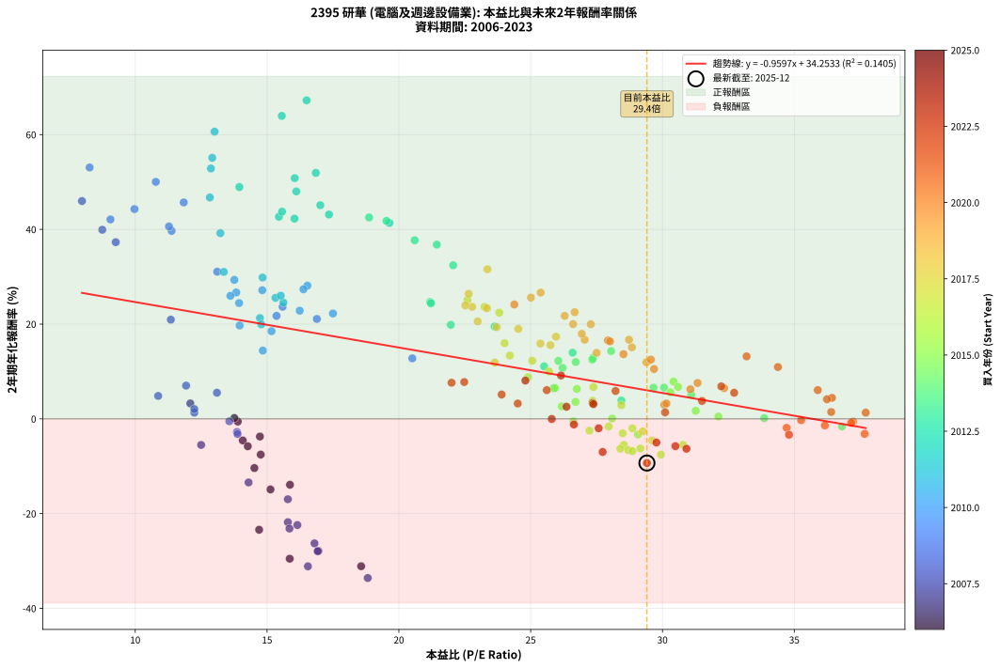
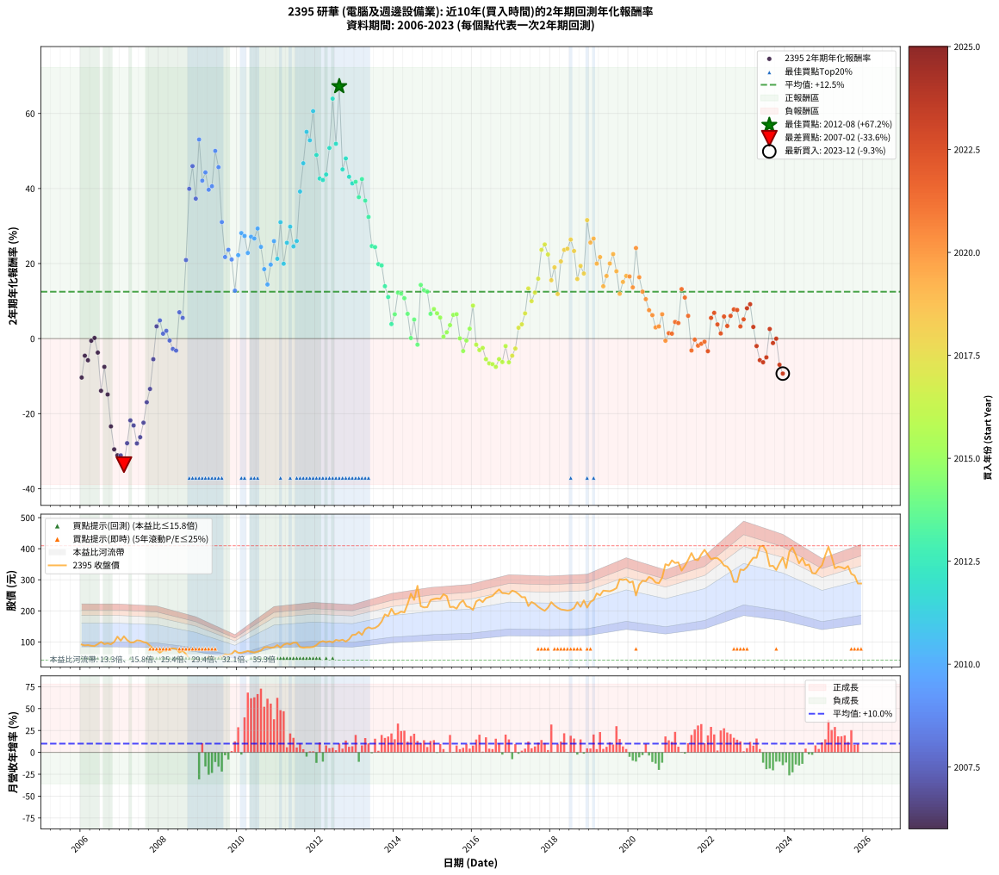

# 2395 研華 - 本益比與未來報酬率分析

!!! info "報告資訊"
    - **股票代號**: 2395
    - **公司名稱**: 研華
    - **產業別**: 電腦及週邊設備業
    - **分析期間**: 2006-2023 (216 個數據點)
    - **資料來源**: Type 12 (ShowMonthlyK_ChartFlow) 月收盤價與本益比
    - **報酬率口徑**: 含現金股利 (簡化: 年度合計，假設每年7/1入帳)
    - **報告生成時間**: 2026-01-06 00:38:34 CST

## 📈 視覺化圖表

### 圖表1: 本益比 vs 未來報酬率關係

*圖表1：2395 研華 本益比與2年期未來報酬率關係 (2006-2023)*

### 圖表2: 歷年買入時點的2年期實際報酬率

*圖表2：2395 研華 歷年買入時點的2年期實際報酬率 (2006-2023)*

## 📍 買點訊號說明

本報告提供兩種買點提示訊號（顯示於圖表2的股價子圖中）：

### ▲ 小綠色三角形（回測驗證）
- **計算方式**: 使用全部歷史資料計算本益比第25百分位數
- **用途**: 事後驗證，顯示歷史上哪些時點確實為低估區
- **限制**: 當下無法判斷，僅供回測參考
- **特性**: 後見之明（Look-Ahead Bias）

### ▲ 小橘色三角形（即時訊號）
- **計算方式**: 使用截至當月的過去5年資料計算本益比第25百分位數
- **用途**: 實際投資決策，當時即可判斷
- **優勢**: 可操作性強，符合實務需求
- **特性**: 無後見之明，滾動窗口計算

!!! tip "如何使用兩種訊號"
    - **綠色▲** 幫助理解歷史估值機會，驗證策略有效性
    - **橘色▲** 可作為實際買進參考，但仍需搭配基本面分析
    - 兩種訊號重疊時，表示即時判斷與事後驗證一致，信心度較高
    - 僅有綠色▲時，表示當時無法判斷（需要未來資料才能確認）
    - 僅有橘色▲時，表示即時判斷為買點，但事後可能不是最佳時機

## 📊 估值分析摘要

| 指標 | 數值 |
|:---:|:---:|
| **目前本益比** (2023-12) | **29.41 倍** |
| **歷史平均本益比** | 22.67 倍 |
| **估值水準** | 🔴 相對高估 |
| **預期2年年化報酬率** | **+6.03%** |
| **歷史平均報酬率** | +12.50% |
| **相關係數 (R²)** | 0.1405 |
| **趨勢線斜率** | -0.9597 |

!!! abstract "核心洞察"
    目前本益比顯著高於歷史平均，預期未來報酬率可能較低

    根據歷史數據回測，2395 研華 在目前本益比 **29.4倍** 的估值水準下，
    預期未來2年年化報酬率約為 **+6.0%**。

    **重要提醒**: 本分析基於歷史數據統計，實際報酬率會受到公司基本面變化、產業趨勢、
    總體經濟環境等多重因素影響。R² = 0.14 表示本益比可解釋約 14.1% 的報酬率變異。

## 📈 歷史估值統計

### 最佳買點 (最高報酬率)

| 項目 | 數值 |
|:---:|:---:|
| 起始時間 | 2012-08 |
| 當時本益比 | 16.50 倍 |
| 起始價格 | 104.0 元 |
| 2年後價格 | 280.5 元 |
| **2年年化報酬率** | **+67.24%** |

### 最差買點 (最低報酬率)

| 項目 | 數值 |
|:---:|:---:|
| 起始時間 | 2007-02 |
| 當時本益比 | 18.82 倍 |
| 起始價格 | 118.0 元 |
| 2年後價格 | 44.0 元 |
| **2年年化報酬率** | **-33.60%** |

## 🎯 投資啟示

### 本益比與報酬率關係

趨勢線方程式: **y = -0.9597x + 34.2533**

!!! warning "強負相關"
    本益比與未來報酬率呈現強負相關。在高本益比時期買入，未來報酬率顯著較低；
    在低本益比時期買入，未來報酬率顯著較高。**估值紀律至關重要**。

### 估值區間建議

基於歷史數據分析:

- **🟢 低估區** (P/E < 18.1): 預期報酬率較高，可考慮增加持股
- **🟡 合理區** (P/E 18.1-27.2): 預期報酬率符合長期趨勢，正常持有
- **🔴 高估區** (P/E > 27.2): 預期報酬率較低，可考慮減碼或觀望

!!! danger "風險提示"
    - 過去表現不代表未來結果
    - 本分析假設公司基本面無重大結構性變化
    - 產業環境劇變可能使歷史規律失效
    - 應結合公司財報、產業趨勢、總體經濟等多重因素綜合判斷

!!! success "長期投資觀點"
    歷史數據顯示，在合理或低估的估值水準買入並長期持有，
    往往能獲得較佳的投資報酬。**耐心等待好價格**是價值投資的核心原則。

## 📊 數據品質

- **資料來源**: GoodInfo.tw Type 12 (ShowMonthlyK_ChartFlow)
- **資料頻率**: 月度收盤價與本益比
- **回測期間**: 2006-2023
- **數據點數量**: 216 個 (每個點代表一次2年期回測)

### 計算方法說明

1. **2年期年化報酬率**:
   - 對每個歷史時點，計算其後2年的實際投資報酬率
   - 期末價值(不含股利): 期末價格
   - 期末價值(含現金股利): 期末價格 + 持有期間內的現金股利合計 (簡化: 年度合計，假設每年7/1入帳)
   - 公式: 年化報酬率 = [(期末價值/期初價格)^(1/年數) - 1] × 100%

2. **本益比 (P/E Ratio)**:
   - 使用當時的月收盤價與EPS計算
   - 資料來源: Type 12 月度河流圖本益比數據

3. **趨勢線 (Linear Regression)**:
   - 使用最小平方法擬合線性趨勢線
   - R²值衡量本益比對報酬率的解釋能力

---

*本報告由 Stock Analysis System v1.9.0 自動生成*
*數據更新時間: 2026-01-06 00:38:34 CST*

## 📋 月度回測明細表

（每一列對應時間線圖中的一個買入點；可用來對照 SVG 圖上的每個點。）

| 買入月份 | 賣出月份 | 回測期限_年 | 實際持有年數 | 買入本益比_倍 | 買入收盤價_元 | 賣出收盤價_元 | 現金股利合計_元 | 總報酬率_pct | 年化報酬率_pct |
| --- | --- | --- | --- | --- | --- | --- | --- | --- | --- |
| 2006-01 | 2008-01 | 2 | 1.999 | 14.52 | 91.50 | 65.50 | 8.00 | -19.67 | -10.38 |
| 2006-02 | 2008-02 | 2 | 1.999 | 14.08 | 88.70 | 72.80 | 8.00 | -8.90 | -4.56 |
| 2006-03 | 2008-03 | 2 | 2.001 | 14.27 | 89.90 | 71.80 | 8.00 | -11.23 | -5.78 |
| 2006-04 | 2008-04 | 2 | 2.001 | 13.89 | 87.50 | 78.50 | 8.00 | -1.14 | -0.57 |
| 2006-05 | 2008-05 | 2 | 2.001 | 13.76 | 86.70 | 79.00 | 8.00 | +0.35 | +0.17 |
| 2006-06 | 2008-06 | 2 | 2.001 | 14.73 | 92.80 | 78.00 | 8.00 | -7.32 | -3.73 |
| 2006-07 | 2008-07 | 2 | 2.001 | 15.87 | 100.00 | 66.10 | 8.00 | -25.90 | -13.91 |
| 2006-08 | 2008-08 | 2 | 2.001 | 14.76 | 93.00 | 71.50 | 8.00 | -14.51 | -7.54 |
| 2006-09 | 2008-09 | 2 | 2.001 | 15.13 | 95.30 | 61.00 | 8.00 | -27.59 | -14.90 |
| 2006-10 | 2008-10 | 2 | 2.001 | 14.70 | 92.60 | 46.30 | 8.00 | -41.36 | -23.41 |
| 2006-11 | 2008-11 | 2 | 2.001 | 15.86 | 99.90 | 41.60 | 8.00 | -50.35 | -29.52 |
| 2006-12 | 2008-12 | 2 | 2.001 | 18.57 | 117.00 | 47.50 | 8.00 | -52.56 | -31.11 |
| 2007-01 | 2009-01 | 2 | 2.001 | 16.55 | 104.00 | 41.30 | 8.00 | -52.59 | -31.13 |
| 2007-02 | 2009-02 | 2 | 2.001 | 18.82 | 118.00 | 44.00 | 8.00 | -55.93 | -33.60 |
| 2007-03 | 2009-03 | 2 | 2.001 | 16.95 | 106.00 | 47.10 | 8.00 | -48.02 | -27.88 |
| 2007-04 | 2009-04 | 2 | 2.001 | 15.79 | 98.50 | 52.20 | 8.00 | -38.88 | -21.81 |
| 2007-05 | 2009-05 | 2 | 2.001 | 15.85 | 98.60 | 50.20 | 8.00 | -40.97 | -23.15 |
| 2007-06 | 2009-06 | 2 | 2.001 | 16.92 | 105.00 | 46.50 | 8.00 | -48.09 | -27.94 |
| 2007-07 | 2009-07 | 2 | 2.001 | 16.80 | 104.00 | 49.50 | 7.00 | -45.67 | -26.28 |
| 2007-08 | 2009-08 | 2 | 2.001 | 16.15 | 99.70 | 53.00 | 7.00 | -39.82 | -22.41 |
| 2007-09 | 2009-09 | 2 | 2.001 | 15.79 | 97.20 | 60.00 | 7.00 | -31.07 | -16.97 |
| 2007-10 | 2009-10 | 2 | 2.001 | 14.30 | 87.80 | 58.80 | 7.00 | -25.06 | -13.42 |
| 2007-11 | 2009-11 | 2 | 2.001 | 12.50 | 76.60 | 61.40 | 7.00 | -10.71 | -5.50 |
| 2007-12 | 2009-12 | 2 | 2.001 | 12.09 | 73.90 | 71.80 | 7.00 | +6.63 | +3.26 |
| 2008-01 | 2010-01 | 2 | 2.001 | 10.87 | 65.50 | 65.00 | 7.00 | +9.92 | +4.84 |
| 2008-02 | 2010-03 | 2 | 2.081 | 12.24 | 72.80 | 67.80 | 7.00 | +2.75 | +1.31 |
| 2008-03 | 2010-03 | 2 | 1.999 | 12.24 | 71.80 | 67.80 | 7.00 | +4.18 | +2.07 |
| 2008-04 | 2010-04 | 2 | 1.999 | 13.57 | 78.50 | 70.70 | 7.00 | -1.02 | -0.51 |
| 2008-05 | 2010-05 | 2 | 1.999 | 13.86 | 79.00 | 67.70 | 7.00 | -5.44 | -2.76 |
| 2008-06 | 2010-06 | 2 | 1.999 | 13.88 | 78.00 | 66.10 | 7.00 | -6.28 | -3.19 |
| 2008-07 | 2010-07 | 2 | 1.999 | 11.93 | 66.10 | 68.70 | 7.00 | +14.52 | +7.02 |
| 2008-08 | 2010-08 | 2 | 1.999 | 13.10 | 71.50 | 72.60 | 7.00 | +11.33 | +5.52 |
| 2008-09 | 2010-09 | 2 | 1.999 | 11.35 | 61.00 | 82.20 | 7.00 | +46.23 | +20.94 |
| 2008-10 | 2010-10 | 2 | 1.999 | 8.75 | 46.30 | 83.60 | 7.00 | +95.68 | +39.92 |
| 2008-11 | 2010-11 | 2 | 1.999 | 7.98 | 41.60 | 81.60 | 7.00 | +112.98 | +45.98 |
| 2008-12 | 2010-12 | 2 | 1.999 | 9.26 | 47.50 | 82.50 | 7.00 | +88.42 | +37.30 |
| 2009-01 | 2011-01 | 2 | 1.999 | 8.27 | 41.30 | 89.70 | 7.00 | +134.14 | +53.06 |
| 2009-02 | 2011-02 | 2 | 1.999 | 9.06 | 44.00 | 81.80 | 7.00 | +101.82 | +42.10 |
| 2009-03 | 2011-03 | 2 | 1.999 | 9.97 | 47.10 | 91.00 | 7.00 | +108.07 | +44.28 |
| 2009-04 | 2011-04 | 2 | 1.999 | 11.38 | 52.20 | 94.80 | 7.00 | +95.02 | +39.68 |
| 2009-05 | 2011-05 | 2 | 1.999 | 11.28 | 50.20 | 92.20 | 7.00 | +97.61 | +40.61 |
| 2009-06 | 2011-06 | 2 | 1.999 | 10.78 | 46.50 | 97.60 | 7.00 | +124.95 | +50.02 |
| 2009-07 | 2011-07 | 2 | 1.999 | 11.84 | 49.50 | 97.50 | 7.50 | +112.12 | +45.68 |
| 2009-08 | 2011-08 | 2 | 1.999 | 13.11 | 53.00 | 83.50 | 7.50 | +71.70 | +31.06 |
| 2009-09 | 2011-09 | 2 | 1.999 | 15.36 | 60.00 | 81.40 | 7.50 | +48.17 | +21.74 |
| 2009-10 | 2011-10 | 2 | 1.999 | 15.59 | 58.80 | 82.40 | 7.50 | +52.89 | +23.67 |
| 2009-11 | 2011-11 | 2 | 1.999 | 16.89 | 61.40 | 82.50 | 7.50 | +46.58 | +21.09 |
| 2009-12 | 2011-12 | 2 | 1.999 | 20.51 | 71.80 | 83.80 | 7.50 | +27.16 | +12.77 |
| 2010-01 | 2012-01 | 2 | 1.999 | 17.50 | 65.00 | 89.60 | 7.50 | +49.38 | +22.24 |
| 2010-02 | 2012-02 | 2 | 1.999 | 16.53 | 64.90 | 99.00 | 7.50 | +64.10 | +28.12 |
| 2010-03 | 2012-03 | 2 | 2.001 | 16.38 | 67.80 | 102.50 | 7.50 | +62.24 | +27.35 |
| 2010-04 | 2012-04 | 2 | 2.001 | 16.24 | 70.70 | 99.20 | 7.50 | +50.92 | +22.83 |
| 2010-05 | 2012-05 | 2 | 2.001 | 14.82 | 67.70 | 102.00 | 7.50 | +61.74 | +27.16 |
| 2010-06 | 2012-06 | 2 | 2.001 | 13.83 | 66.10 | 98.60 | 7.50 | +60.51 | +26.67 |
| 2010-07 | 2012-07 | 2 | 2.001 | 13.76 | 68.70 | 106.50 | 8.46 | +67.34 | +29.34 |
| 2010-08 | 2012-08 | 2 | 2.001 | 13.94 | 72.60 | 104.00 | 8.46 | +54.91 | +24.44 |
| 2010-09 | 2012-09 | 2 | 2.001 | 15.17 | 82.20 | 107.00 | 8.46 | +40.47 | +18.51 |
| 2010-10 | 2012-10 | 2 | 2.001 | 14.84 | 83.60 | 101.00 | 8.46 | +30.94 | +14.42 |
| 2010-11 | 2012-11 | 2 | 2.001 | 13.96 | 81.60 | 108.50 | 8.46 | +43.34 | +19.71 |
| 2010-12 | 2012-12 | 2 | 2.001 | 13.61 | 82.50 | 122.50 | 8.46 | +58.74 | +25.97 |
| 2011-01 | 2013-01 | 2 | 2.001 | 14.73 | 89.70 | 123.50 | 8.46 | +47.12 | +21.28 |
| 2011-02 | 2013-02 | 2 | 2.001 | 13.36 | 81.80 | 132.00 | 8.46 | +71.72 | +31.02 |
| 2011-03 | 2013-03 | 2 | 2.001 | 14.78 | 91.00 | 122.50 | 8.46 | +43.92 | +19.95 |
| 2011-04 | 2013-04 | 2 | 2.001 | 15.32 | 94.80 | 141.00 | 8.46 | +57.66 | +25.54 |
| 2011-05 | 2013-05 | 2 | 2.001 | 14.83 | 92.20 | 147.00 | 8.46 | +68.62 | +29.83 |
| 2011-06 | 2013-06 | 2 | 2.001 | 15.62 | 97.60 | 143.00 | 8.46 | +55.19 | +24.56 |
| 2011-07 | 2013-07 | 2 | 2.001 | 15.52 | 97.50 | 145.00 | 9.85 | +58.82 | +26.00 |
| 2011-08 | 2013-08 | 2 | 2.001 | 13.23 | 83.50 | 152.00 | 9.85 | +93.83 | +39.19 |
| 2011-09 | 2013-09 | 2 | 2.001 | 12.83 | 81.40 | 165.50 | 9.85 | +115.42 | +46.73 |
| 2011-10 | 2013-10 | 2 | 2.001 | 12.92 | 82.40 | 188.50 | 9.85 | +140.72 | +55.10 |
| 2011-11 | 2013-11 | 2 | 2.001 | 12.87 | 82.50 | 183.00 | 9.85 | +133.76 | +52.85 |
| 2011-12 | 2013-12 | 2 | 2.001 | 13.01 | 83.80 | 206.50 | 9.85 | +158.17 | +60.63 |
| 2012-01 | 2014-01 | 2 | 2.001 | 13.95 | 89.60 | 189.00 | 9.85 | +121.93 | +48.93 |
| 2012-02 | 2014-03 | 2 | 2.081 | 15.45 | 99.00 | 197.50 | 9.85 | +109.44 | +42.66 |
| 2012-03 | 2014-03 | 2 | 1.999 | 16.04 | 102.50 | 197.50 | 9.85 | +102.29 | +42.26 |
| 2012-04 | 2014-04 | 2 | 1.999 | 15.57 | 99.20 | 195.00 | 9.85 | +106.50 | +43.74 |
| 2012-05 | 2014-05 | 2 | 1.999 | 16.05 | 102.00 | 222.00 | 9.85 | +127.30 | +50.81 |
| 2012-06 | 2014-06 | 2 | 1.999 | 15.56 | 98.60 | 255.00 | 9.85 | +168.61 | +63.95 |
| 2012-07 | 2014-07 | 2 | 1.999 | 16.85 | 106.50 | 235.50 | 10.16 | +130.67 | +51.92 |
| 2012-08 | 2014-08 | 2 | 1.999 | 16.50 | 104.00 | 280.50 | 10.16 | +179.48 | +67.24 |
| 2012-09 | 2014-09 | 2 | 1.999 | 17.02 | 107.00 | 215.00 | 10.16 | +110.43 | +45.10 |
| 2012-10 | 2014-10 | 2 | 1.999 | 16.11 | 101.00 | 211.00 | 10.16 | +118.97 | +48.02 |
| 2012-11 | 2014-11 | 2 | 1.999 | 17.35 | 108.50 | 212.00 | 10.16 | +104.76 | +43.13 |
| 2012-12 | 2014-12 | 2 | 1.999 | 19.64 | 122.50 | 234.50 | 10.16 | +99.73 | +41.36 |
| 2013-01 | 2015-01 | 2 | 1.999 | 19.53 | 123.50 | 238.00 | 10.16 | +100.94 | +41.79 |
| 2013-02 | 2015-02 | 2 | 1.999 | 20.60 | 132.00 | 240.00 | 10.16 | +89.52 | +37.70 |
| 2013-03 | 2015-03 | 2 | 1.999 | 18.87 | 122.50 | 238.50 | 10.16 | +102.99 | +42.51 |
| 2013-04 | 2015-04 | 2 | 1.999 | 21.44 | 141.00 | 253.50 | 10.16 | +87.00 | +36.78 |
| 2013-05 | 2015-05 | 2 | 1.999 | 22.06 | 147.00 | 247.50 | 10.16 | +75.28 | +32.42 |
| 2013-06 | 2015-06 | 2 | 1.999 | 21.19 | 143.00 | 212.00 | 10.16 | +55.36 | +24.66 |
| 2013-07 | 2015-07 | 2 | 1.999 | 21.22 | 145.00 | 213.00 | 11.27 | +54.67 | +24.39 |
| 2013-08 | 2015-08 | 2 | 1.999 | 21.97 | 152.00 | 207.00 | 11.27 | +43.60 | +19.85 |
| 2013-09 | 2015-09 | 2 | 1.999 | 23.63 | 165.50 | 225.00 | 11.27 | +42.76 | +19.50 |
| 2013-10 | 2015-10 | 2 | 1.999 | 26.59 | 188.50 | 233.50 | 11.27 | +29.85 | +13.96 |
| 2013-11 | 2015-11 | 2 | 1.999 | 25.51 | 183.00 | 214.50 | 11.27 | +23.37 | +11.08 |
| 2013-12 | 2015-12 | 2 | 1.999 | 28.44 | 206.50 | 211.50 | 11.27 | +7.88 | +3.87 |
| 2014-01 | 2016-01 | 2 | 1.999 | 25.87 | 189.00 | 203.00 | 11.27 | +13.37 | +6.48 |
| 2014-02 | 2016-02 | 2 | 1.999 | 26.05 | 191.50 | 230.00 | 11.27 | +25.99 | +12.25 |
| 2014-03 | 2016-03 | 2 | 2.001 | 26.71 | 197.50 | 236.50 | 11.27 | +25.46 | +12.00 |
| 2014-04 | 2016-04 | 2 | 2.001 | 26.21 | 195.00 | 228.00 | 11.27 | +22.70 | +10.76 |
| 2014-05 | 2016-05 | 2 | 2.001 | 29.66 | 222.00 | 241.00 | 11.27 | +13.64 | +6.60 |
| 2014-06 | 2016-06 | 2 | 2.001 | 33.86 | 255.00 | 244.50 | 11.27 | +0.30 | +0.15 |
| 2014-07 | 2016-07 | 2 | 2.001 | 31.09 | 235.50 | 248.00 | 12.00 | +10.40 | +5.07 |
| 2014-08 | 2016-08 | 2 | 2.001 | 36.81 | 280.50 | 259.50 | 12.00 | -3.21 | -1.62 |
| 2014-09 | 2016-09 | 2 | 2.001 | 28.05 | 215.00 | 269.00 | 12.00 | +30.70 | +14.31 |
| 2014-10 | 2016-10 | 2 | 2.001 | 27.37 | 211.00 | 257.00 | 12.00 | +27.49 | +12.90 |
| 2014-11 | 2016-11 | 2 | 2.001 | 27.34 | 212.00 | 256.50 | 12.00 | +26.65 | +12.53 |
| 2014-12 | 2016-12 | 2 | 2.001 | 30.06 | 234.50 | 254.50 | 12.00 | +13.64 | +6.60 |
| 2015-01 | 2017-01 | 2 | 2.001 | 30.42 | 238.00 | 265.00 | 12.00 | +16.38 | +7.88 |
| 2015-02 | 2017-02 | 2 | 2.001 | 30.59 | 240.00 | 261.50 | 12.00 | +13.96 | +6.75 |
| 2015-03 | 2017-03 | 2 | 2.001 | 30.30 | 238.50 | 254.00 | 12.00 | +11.53 | +5.60 |
| 2015-04 | 2017-04 | 2 | 2.001 | 32.12 | 253.50 | 244.00 | 12.00 | +0.98 | +0.49 |
| 2015-05 | 2017-05 | 2 | 2.001 | 31.26 | 247.50 | 244.00 | 12.00 | +3.43 | +1.70 |
| 2015-06 | 2017-06 | 2 | 2.001 | 26.70 | 212.00 | 215.50 | 12.00 | +7.31 | +3.59 |
| 2015-07 | 2017-07 | 2 | 2.001 | 26.75 | 213.00 | 228.50 | 12.30 | +13.05 | +6.32 |
| 2015-08 | 2017-08 | 2 | 2.001 | 25.92 | 207.00 | 222.50 | 12.30 | +13.43 | +6.50 |
| 2015-09 | 2017-09 | 2 | 2.001 | 28.09 | 225.00 | 213.00 | 12.30 | +0.13 | +0.07 |
| 2015-10 | 2017-10 | 2 | 2.001 | 29.07 | 233.50 | 206.00 | 12.30 | -6.51 | -3.31 |
| 2015-11 | 2017-11 | 2 | 2.001 | 26.62 | 214.50 | 200.00 | 12.30 | -1.03 | -0.51 |
| 2015-12 | 2017-12 | 2 | 2.001 | 26.18 | 211.50 | 210.50 | 12.30 | +5.34 | +2.63 |
| 2016-01 | 2018-01 | 2 | 2.001 | 24.90 | 203.00 | 228.00 | 12.30 | +18.37 | +8.79 |
| 2016-02 | 2018-03 | 2 | 2.081 | 27.96 | 230.00 | 210.00 | 12.30 | -3.35 | -1.62 |
| 2016-03 | 2018-03 | 2 | 1.999 | 28.49 | 236.50 | 210.00 | 12.30 | -6.01 | -3.05 |
| 2016-04 | 2018-04 | 2 | 1.999 | 27.23 | 228.00 | 204.50 | 12.30 | -4.91 | -2.49 |
| 2016-05 | 2018-05 | 2 | 1.999 | 28.53 | 241.00 | 203.00 | 12.30 | -10.66 | -5.49 |
| 2016-06 | 2018-06 | 2 | 1.999 | 28.70 | 244.50 | 201.00 | 12.30 | -12.76 | -6.60 |
| 2016-07 | 2018-07 | 2 | 1.999 | 28.86 | 248.00 | 202.50 | 12.89 | -13.15 | -6.81 |
| 2016-08 | 2018-08 | 2 | 1.999 | 29.94 | 259.50 | 209.00 | 12.89 | -14.49 | -7.53 |
| 2016-09 | 2018-09 | 2 | 1.999 | 30.78 | 269.00 | 227.50 | 12.89 | -10.63 | -5.47 |
| 2016-10 | 2018-10 | 2 | 1.999 | 29.16 | 257.00 | 213.00 | 12.89 | -12.10 | -6.25 |
| 2016-11 | 2018-11 | 2 | 1.999 | 28.86 | 256.50 | 233.50 | 12.89 | -3.94 | -1.99 |
| 2016-12 | 2018-12 | 2 | 1.999 | 28.40 | 254.50 | 210.50 | 12.89 | -12.22 | -6.31 |
| 2017-01 | 2019-01 | 2 | 1.999 | 29.61 | 265.00 | 228.50 | 12.89 | -8.91 | -4.56 |
| 2017-02 | 2019-02 | 2 | 1.999 | 29.25 | 261.50 | 235.00 | 12.89 | -5.20 | -2.64 |
| 2017-03 | 2019-03 | 2 | 1.999 | 28.44 | 254.00 | 256.00 | 12.89 | +5.86 | +2.89 |
| 2017-04 | 2019-04 | 2 | 1.999 | 27.35 | 244.00 | 250.00 | 12.89 | +7.74 | +3.80 |
| 2017-05 | 2019-05 | 2 | 1.999 | 27.38 | 244.00 | 265.00 | 12.89 | +13.89 | +6.72 |
| 2017-06 | 2019-06 | 2 | 1.999 | 24.21 | 215.50 | 264.00 | 12.89 | +28.49 | +13.36 |
| 2017-07 | 2019-07 | 2 | 1.999 | 25.70 | 228.50 | 263.00 | 13.39 | +20.96 | +9.99 |
| 2017-08 | 2019-08 | 2 | 1.999 | 25.06 | 222.50 | 267.00 | 13.39 | +26.02 | +12.27 |
| 2017-09 | 2019-09 | 2 | 1.999 | 24.01 | 213.00 | 273.00 | 13.39 | +34.46 | +15.97 |
| 2017-10 | 2019-10 | 2 | 1.999 | 23.25 | 206.00 | 301.50 | 13.39 | +52.86 | +23.65 |
| 2017-11 | 2019-11 | 2 | 1.999 | 22.60 | 200.00 | 299.50 | 13.39 | +56.45 | +25.10 |
| 2017-12 | 2019-12 | 2 | 1.999 | 23.81 | 210.50 | 302.00 | 13.39 | +49.83 | +22.42 |
| 2018-01 | 2020-01 | 2 | 1.999 | 25.75 | 228.00 | 291.00 | 13.39 | +33.50 | +15.56 |
| 2018-02 | 2020-02 | 2 | 1.999 | 24.53 | 217.50 | 294.50 | 13.39 | +41.56 | +18.99 |
| 2018-03 | 2020-03 | 2 | 2.001 | 23.64 | 210.00 | 249.50 | 13.39 | +25.19 | +11.88 |
| 2018-04 | 2020-04 | 2 | 2.001 | 22.99 | 204.50 | 284.00 | 13.39 | +45.42 | +20.58 |
| 2018-05 | 2020-05 | 2 | 2.001 | 22.78 | 203.00 | 297.00 | 13.39 | +52.90 | +23.64 |
| 2018-06 | 2020-06 | 2 | 2.001 | 22.52 | 201.00 | 295.50 | 13.39 | +53.68 | +23.95 |
| 2018-07 | 2020-07 | 2 | 2.001 | 22.65 | 202.50 | 309.00 | 14.59 | +59.80 | +26.39 |
| 2018-08 | 2020-08 | 2 | 2.001 | 23.34 | 209.00 | 303.50 | 14.59 | +52.19 | +23.35 |
| 2018-09 | 2020-09 | 2 | 2.001 | 25.37 | 227.50 | 291.00 | 14.59 | +34.32 | +15.89 |
| 2018-10 | 2020-10 | 2 | 2.001 | 23.71 | 213.00 | 289.00 | 14.59 | +42.53 | +19.37 |
| 2018-11 | 2020-11 | 2 | 2.001 | 25.96 | 233.50 | 307.00 | 14.59 | +37.72 | +17.34 |
| 2018-12 | 2020-12 | 2 | 2.001 | 23.36 | 210.50 | 350.00 | 14.59 | +73.20 | +31.58 |
| 2019-01 | 2021-01 | 2 | 2.001 | 25.01 | 228.50 | 346.00 | 14.59 | +57.81 | +25.60 |
| 2019-02 | 2021-02 | 2 | 2.001 | 25.38 | 235.00 | 362.50 | 14.59 | +60.46 | +26.65 |
| 2019-03 | 2021-03 | 2 | 2.001 | 27.28 | 256.00 | 354.00 | 14.59 | +43.98 | +19.98 |
| 2019-04 | 2021-04 | 2 | 2.001 | 26.29 | 250.00 | 356.00 | 14.59 | +48.23 | +21.73 |
| 2019-05 | 2021-05 | 2 | 2.001 | 27.50 | 265.00 | 329.50 | 14.59 | +29.84 | +13.94 |
| 2019-06 | 2021-06 | 2 | 2.001 | 27.05 | 264.00 | 345.00 | 14.59 | +36.21 | +16.70 |
| 2019-07 | 2021-07 | 2 | 2.001 | 26.61 | 263.00 | 364.00 | 14.88 | +44.06 | +20.01 |
| 2019-08 | 2021-08 | 2 | 2.001 | 26.67 | 267.00 | 386.00 | 14.88 | +50.14 | +22.52 |
| 2019-09 | 2021-09 | 2 | 2.001 | 26.94 | 273.00 | 365.00 | 14.88 | +39.15 | +17.95 |
| 2019-10 | 2021-10 | 2 | 2.001 | 29.39 | 301.50 | 363.00 | 14.88 | +25.33 | +11.94 |
| 2019-11 | 2021-11 | 2 | 2.001 | 28.84 | 299.50 | 382.00 | 14.88 | +32.51 | +15.10 |
| 2019-12 | 2021-12 | 2 | 2.001 | 28.73 | 302.00 | 396.50 | 14.88 | +36.22 | +16.70 |
| 2020-01 | 2022-01 | 2 | 2.001 | 27.93 | 291.00 | 380.50 | 14.88 | +35.87 | +16.55 |
| 2020-02 | 2022-03 | 2 | 2.081 | 28.52 | 294.50 | 369.50 | 14.88 | +30.52 | +13.66 |
| 2020-03 | 2022-03 | 2 | 1.999 | 24.38 | 249.50 | 369.50 | 14.88 | +54.06 | +24.14 |
| 2020-04 | 2022-04 | 2 | 1.999 | 28.01 | 284.00 | 369.50 | 14.88 | +35.35 | +16.35 |
| 2020-05 | 2022-05 | 2 | 1.999 | 29.56 | 297.00 | 361.00 | 14.88 | +26.56 | +12.51 |
| 2020-06 | 2022-06 | 2 | 1.999 | 29.68 | 295.50 | 346.00 | 14.88 | +22.13 | +10.52 |
| 2020-07 | 2022-07 | 2 | 1.999 | 31.33 | 309.00 | 342.50 | 15.07 | +15.72 | +7.58 |
| 2020-08 | 2022-08 | 2 | 1.999 | 31.06 | 303.50 | 327.50 | 15.07 | +12.87 | +6.25 |
| 2020-09 | 2022-09 | 2 | 1.999 | 30.07 | 291.00 | 293.50 | 15.07 | +6.04 | +2.98 |
| 2020-10 | 2022-10 | 2 | 1.999 | 30.15 | 289.00 | 293.00 | 15.07 | +6.60 | +3.25 |
| 2020-11 | 2022-11 | 2 | 1.999 | 32.34 | 307.00 | 333.00 | 15.07 | +13.38 | +6.48 |
| 2020-12 | 2022-12 | 2 | 1.999 | 37.23 | 350.00 | 331.00 | 15.07 | -1.12 | -0.56 |
| 2021-01 | 2023-01 | 2 | 1.999 | 36.40 | 346.00 | 341.00 | 15.07 | +2.91 | +1.45 |
| 2021-02 | 2023-02 | 2 | 1.999 | 37.71 | 362.50 | 357.00 | 15.07 | +2.64 | +1.31 |
| 2021-03 | 2023-03 | 2 | 1.999 | 36.43 | 354.00 | 371.00 | 15.07 | +9.06 | +4.43 |
| 2021-04 | 2023-04 | 2 | 1.999 | 36.24 | 356.00 | 371.00 | 15.07 | +8.45 | +4.14 |
| 2021-05 | 2023-05 | 2 | 1.999 | 33.19 | 329.50 | 407.00 | 15.07 | +28.09 | +13.19 |
| 2021-06 | 2023-06 | 2 | 1.999 | 34.38 | 345.00 | 409.50 | 15.07 | +23.06 | +10.94 |
| 2021-07 | 2023-07 | 2 | 1.999 | 35.89 | 364.00 | 391.50 | 17.97 | +12.49 | +6.07 |
| 2021-08 | 2023-08 | 2 | 1.999 | 37.67 | 386.00 | 344.00 | 17.97 | -6.23 | -3.17 |
| 2021-09 | 2023-09 | 2 | 1.999 | 35.26 | 365.00 | 345.00 | 17.97 | -0.56 | -0.28 |
| 2021-10 | 2023-10 | 2 | 1.999 | 34.71 | 363.00 | 331.50 | 17.97 | -3.73 | -1.88 |
| 2021-11 | 2023-11 | 2 | 1.999 | 36.16 | 382.00 | 353.50 | 17.97 | -2.76 | -1.39 |
| 2021-12 | 2023-12 | 2 | 1.999 | 37.16 | 396.50 | 372.00 | 17.97 | -1.65 | -0.83 |
| 2022-01 | 2024-01 | 2 | 1.999 | 34.80 | 380.50 | 337.50 | 17.97 | -6.58 | -3.35 |
| 2022-02 | 2024-02 | 2 | 1.999 | 32.72 | 366.50 | 390.00 | 17.97 | +11.31 | +5.51 |
| 2022-03 | 2024-03 | 2 | 2.001 | 32.23 | 369.50 | 404.00 | 17.97 | +14.20 | +6.86 |
| 2022-04 | 2024-04 | 2 | 2.001 | 31.50 | 369.50 | 380.00 | 17.97 | +7.70 | +3.78 |
| 2022-05 | 2024-05 | 2 | 2.001 | 30.10 | 361.00 | 353.00 | 17.97 | +2.76 | +1.37 |
| 2022-06 | 2024-06 | 2 | 2.001 | 28.22 | 346.00 | 370.00 | 17.97 | +12.13 | +5.89 |
| 2022-07 | 2024-07 | 2 | 2.001 | 27.35 | 342.50 | 346.50 | 19.44 | +6.84 | +3.36 |
| 2022-08 | 2024-08 | 2 | 2.001 | 25.61 | 327.50 | 349.00 | 19.44 | +12.50 | +6.06 |
| 2022-09 | 2024-09 | 2 | 2.001 | 22.48 | 293.50 | 321.50 | 19.44 | +16.16 | +7.77 |
| 2022-10 | 2024-10 | 2 | 2.001 | 22.00 | 293.00 | 320.00 | 19.44 | +15.85 | +7.63 |
| 2022-11 | 2024-11 | 2 | 2.001 | 24.51 | 333.00 | 335.50 | 19.44 | +6.59 | +3.24 |
| 2022-12 | 2024-12 | 2 | 2.001 | 23.90 | 331.00 | 346.50 | 19.44 | +10.55 | +5.14 |
| 2023-01 | 2025-01 | 2 | 2.001 | 24.80 | 341.00 | 379.00 | 19.44 | +16.84 | +8.09 |
| 2023-02 | 2025-02 | 2 | 2.001 | 26.15 | 357.00 | 406.00 | 19.44 | +19.17 | +9.16 |
| 2023-03 | 2025-03 | 2 | 2.001 | 27.38 | 371.00 | 375.00 | 19.44 | +6.32 | +3.11 |
| 2023-04 | 2025-04 | 2 | 2.001 | 27.58 | 371.00 | 337.00 | 19.44 | -3.93 | -1.98 |
| 2023-05 | 2025-05 | 2 | 2.001 | 30.49 | 407.00 | 342.00 | 19.44 | -11.20 | -5.76 |
| 2023-06 | 2025-06 | 2 | 2.001 | 30.91 | 409.50 | 340.00 | 19.44 | -12.23 | -6.31 |
| 2023-07 | 2025-07 | 2 | 2.001 | 29.77 | 391.50 | 335.50 | 17.84 | -9.75 | -5.00 |
| 2023-08 | 2025-08 | 2 | 2.001 | 26.36 | 344.00 | 344.00 | 17.84 | +5.19 | +2.56 |
| 2023-09 | 2025-09 | 2 | 2.001 | 26.64 | 345.00 | 319.00 | 17.84 | -2.37 | -1.19 |
| 2023-10 | 2025-10 | 2 | 2.001 | 25.80 | 331.50 | 313.50 | 17.84 | -0.05 | -0.02 |
| 2023-11 | 2025-11 | 2 | 2.001 | 27.73 | 353.50 | 288.00 | 17.84 | -13.48 | -6.98 |
| 2023-12 | 2025-12 | 2 | 2.001 | 29.41 | 372.00 | 288.00 | 17.84 | -17.78 | -9.32 |
