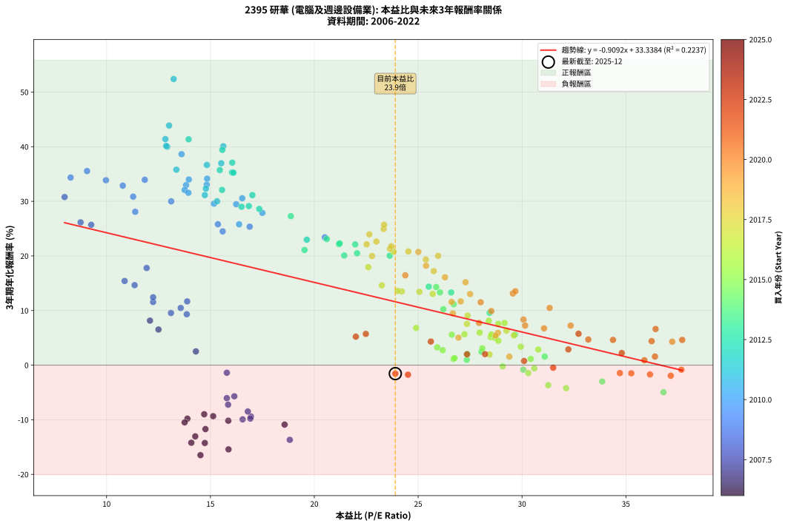
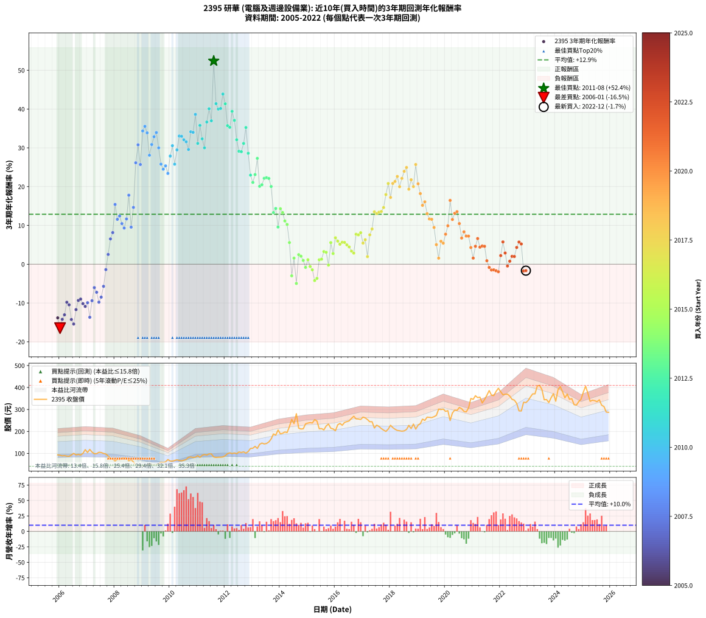

# 2395 研華 - 本益比與未來報酬率分析

!!! info "報告資訊"
    - **股票代號**: 2395
    - **公司名稱**: 研華
    - **產業別**: 電腦及週邊設備業
    - **分析期間**: 2006-2022 (204 個數據點)
    - **資料來源**: Type 12 (ShowMonthlyK_ChartFlow) 月收盤價與本益比
    - **報酬率口徑**: 含現金股利 (簡化: 年度合計，假設每年7/1入帳)
    - **報告生成時間**: 2026-01-05 00:36:05 CST

## 📈 視覺化圖表

### 圖表1: 本益比 vs 未來報酬率關係

*圖表1：2395 研華 本益比與3年期未來報酬率關係 (2006-2022)*

### 圖表2: 歷年買入時點的3年期實際報酬率

*圖表2：2395 研華 歷年買入時點的3年期實際報酬率 (2006-2022)*

## 📍 買點訊號說明

本報告提供兩種買點提示訊號（顯示於圖表2的股價子圖中）：

### ▲ 小綠色三角形（回測驗證）
- **計算方式**: 使用全部歷史資料計算本益比第25百分位數
- **用途**: 事後驗證，顯示歷史上哪些時點確實為低估區
- **限制**: 當下無法判斷，僅供回測參考
- **特性**: 後見之明（Look-Ahead Bias）

### ▲ 小橘色三角形（即時訊號）
- **計算方式**: 使用截至當月的過去5年資料計算本益比第25百分位數
- **用途**: 實際投資決策，當時即可判斷
- **優勢**: 可操作性強，符合實務需求
- **特性**: 無後見之明，滾動窗口計算

!!! tip "如何使用兩種訊號"
    - **綠色▲** 幫助理解歷史估值機會，驗證策略有效性
    - **橘色▲** 可作為實際買進參考，但仍需搭配基本面分析
    - 兩種訊號重疊時，表示即時判斷與事後驗證一致，信心度較高
    - 僅有綠色▲時，表示當時無法判斷（需要未來資料才能確認）
    - 僅有橘色▲時，表示即時判斷為買點，但事後可能不是最佳時機

## 📊 估值分析摘要

| 指標 | 數值 |
|:---:|:---:|
| **目前本益比** (2022-12) | **23.90 倍** |
| **歷史平均本益比** | 22.37 倍 |
| **估值水準** | 🟡 合理範圍 |
| **預期3年年化報酬率** | **+11.61%** |
| **歷史平均報酬率** | +13.00% |
| **相關係數 (R²)** | 0.2237 |
| **趨勢線斜率** | -0.9092 |

!!! abstract "核心洞察"
    目前本益比接近歷史平均，預期報酬率符合長期趨勢

    根據歷史數據回測，2395 研華 在目前本益比 **23.9倍** 的估值水準下，
    預期未來3年年化報酬率約為 **+11.6%**。

    **重要提醒**: 本分析基於歷史數據統計，實際報酬率會受到公司基本面變化、產業趨勢、
    總體經濟環境等多重因素影響。R² = 0.22 表示本益比可解釋約 22.4% 的報酬率變異。

## 📈 歷史估值統計

### 最佳買點 (最高報酬率)

| 項目 | 數值 |
|:---:|:---:|
| 起始時間 | 2011-08 |
| 當時本益比 | 13.23 倍 |
| 起始價格 | 83.5 元 |
| 3年後價格 | 280.5 元 |
| **3年年化報酬率** | **+52.40%** |

### 最差買點 (最低報酬率)

| 項目 | 數值 |
|:---:|:---:|
| 起始時間 | 2006-01 |
| 當時本益比 | 14.52 倍 |
| 起始價格 | 91.5 元 |
| 3年後價格 | 41.3 元 |
| **3年年化報酬率** | **-16.48%** |

## 🎯 投資啟示

### 本益比與報酬率關係

趨勢線方程式: **y = -0.9092x + 33.3384**

!!! warning "強負相關"
    本益比與未來報酬率呈現強負相關。在高本益比時期買入，未來報酬率顯著較低；
    在低本益比時期買入，未來報酬率顯著較高。**估值紀律至關重要**。

### 估值區間建議

基於歷史數據分析:

- **🟢 低估區** (P/E < 17.9): 預期報酬率較高，可考慮增加持股
- **🟡 合理區** (P/E 17.9-26.8): 預期報酬率符合長期趨勢，正常持有
- **🔴 高估區** (P/E > 26.8): 預期報酬率較低，可考慮減碼或觀望

!!! danger "風險提示"
    - 過去表現不代表未來結果
    - 本分析假設公司基本面無重大結構性變化
    - 產業環境劇變可能使歷史規律失效
    - 應結合公司財報、產業趨勢、總體經濟等多重因素綜合判斷

!!! success "長期投資觀點"
    歷史數據顯示，在合理或低估的估值水準買入並長期持有，
    往往能獲得較佳的投資報酬。**耐心等待好價格**是價值投資的核心原則。

## 📊 數據品質

- **資料來源**: GoodInfo.tw Type 12 (ShowMonthlyK_ChartFlow)
- **資料頻率**: 月度收盤價與本益比
- **回測期間**: 2006-2022
- **數據點數量**: 204 個 (每個點代表一次3年期回測)

### 計算方法說明

1. **3年期年化報酬率**:
   - 對每個歷史時點，計算其後3年的實際投資報酬率
   - 期末價值(不含股利): 期末價格
   - 期末價值(含現金股利): 期末價格 + 持有期間內的現金股利合計 (簡化: 年度合計，假設每年7/1入帳)
   - 公式: 年化報酬率 = [(期末價值/期初價格)^(1/年數) - 1] × 100%

2. **本益比 (P/E Ratio)**:
   - 使用當時的月收盤價與EPS計算
   - 資料來源: Type 12 月度河流圖本益比數據

3. **趨勢線 (Linear Regression)**:
   - 使用最小平方法擬合線性趨勢線
   - R²值衡量本益比對報酬率的解釋能力

---

*本報告由 Stock Analysis System v1.9.0 自動生成*
*數據更新時間: 2026-01-05 00:36:05 CST*

## 📋 月度回測明細表

（每一列對應時間線圖中的一個買入點；可用來對照 SVG 圖上的每個點。）

| 買入月份 | 賣出月份 | 回測期限_年 | 實際持有年數 | 買入本益比_倍 | 買入收盤價_元 | 賣出收盤價_元 | 現金股利合計_元 | 總報酬率_pct | 年化報酬率_pct |
| --- | --- | --- | --- | --- | --- | --- | --- | --- | --- |
| 2006-01 | 2009-01 | 3 | 3.001 | 14.52 | 91.50 | 41.30 | 12.00 | -41.75 | -16.48 |
| 2006-02 | 2009-02 | 3 | 3.001 | 14.08 | 88.70 | 44.00 | 12.00 | -36.86 | -14.21 |
| 2006-03 | 2009-03 | 3 | 3.001 | 14.27 | 89.90 | 47.10 | 12.00 | -34.26 | -13.04 |
| 2006-04 | 2009-04 | 3 | 3.001 | 13.89 | 87.50 | 52.20 | 12.00 | -26.63 | -9.80 |
| 2006-05 | 2009-05 | 3 | 3.001 | 13.76 | 86.70 | 50.20 | 12.00 | -28.26 | -10.48 |
| 2006-06 | 2009-06 | 3 | 3.001 | 14.73 | 92.80 | 46.50 | 12.00 | -36.96 | -14.25 |
| 2006-07 | 2009-07 | 3 | 3.001 | 15.87 | 100.00 | 49.50 | 11.00 | -39.50 | -15.42 |
| 2006-08 | 2009-08 | 3 | 3.001 | 14.76 | 93.00 | 53.00 | 11.00 | -31.18 | -11.71 |
| 2006-09 | 2009-09 | 3 | 3.001 | 15.13 | 95.30 | 60.00 | 11.00 | -25.49 | -9.34 |
| 2006-10 | 2009-10 | 3 | 3.001 | 14.70 | 92.60 | 58.80 | 11.00 | -24.62 | -8.99 |
| 2006-11 | 2009-11 | 3 | 3.001 | 15.86 | 99.90 | 61.40 | 11.00 | -27.52 | -10.17 |
| 2006-12 | 2009-12 | 3 | 3.001 | 18.57 | 117.00 | 71.80 | 11.00 | -29.23 | -10.88 |
| 2007-01 | 2010-01 | 3 | 3.001 | 16.55 | 104.00 | 65.00 | 11.00 | -26.92 | -9.92 |
| 2007-02 | 2010-02 | 3 | 3.001 | 18.82 | 118.00 | 64.90 | 11.00 | -35.67 | -13.67 |
| 2007-03 | 2010-03 | 3 | 3.001 | 16.95 | 106.00 | 67.80 | 11.00 | -25.66 | -9.41 |
| 2007-04 | 2010-04 | 3 | 3.001 | 15.79 | 98.50 | 70.70 | 11.00 | -17.05 | -6.04 |
| 2007-05 | 2010-05 | 3 | 3.001 | 15.85 | 98.60 | 67.70 | 11.00 | -20.18 | -7.24 |
| 2007-06 | 2010-06 | 3 | 3.001 | 16.92 | 105.00 | 66.10 | 11.00 | -26.57 | -9.78 |
| 2007-07 | 2010-07 | 3 | 3.001 | 16.80 | 104.00 | 68.70 | 11.00 | -23.37 | -8.49 |
| 2007-08 | 2010-08 | 3 | 3.001 | 16.15 | 99.70 | 72.60 | 11.00 | -16.15 | -5.70 |
| 2007-09 | 2010-09 | 3 | 3.001 | 15.79 | 97.20 | 82.20 | 11.00 | -4.12 | -1.39 |
| 2007-10 | 2010-10 | 3 | 3.001 | 14.30 | 87.80 | 83.60 | 11.00 | +7.74 | +2.52 |
| 2007-11 | 2010-11 | 3 | 3.001 | 12.50 | 76.60 | 81.60 | 11.00 | +20.89 | +6.53 |
| 2007-12 | 2010-12 | 3 | 3.001 | 12.09 | 73.90 | 82.50 | 11.00 | +26.52 | +8.15 |
| 2008-01 | 2011-01 | 3 | 3.001 | 10.87 | 65.50 | 89.70 | 11.00 | +53.74 | +15.41 |
| 2008-02 | 2011-03 | 3 | 3.080 | 12.24 | 72.80 | 91.00 | 11.00 | +40.11 | +11.57 |
| 2008-03 | 2011-03 | 3 | 2.998 | 12.24 | 71.80 | 91.00 | 11.00 | +42.06 | +12.42 |
| 2008-04 | 2011-04 | 3 | 2.998 | 13.57 | 78.50 | 94.80 | 11.00 | +34.78 | +10.47 |
| 2008-05 | 2011-05 | 3 | 2.998 | 13.86 | 79.00 | 92.20 | 11.00 | +30.63 | +9.32 |
| 2008-06 | 2011-06 | 3 | 2.998 | 13.88 | 78.00 | 97.60 | 11.00 | +39.23 | +11.67 |
| 2008-07 | 2011-07 | 3 | 2.998 | 11.93 | 66.10 | 97.50 | 10.50 | +63.39 | +17.79 |
| 2008-08 | 2011-08 | 3 | 2.998 | 13.10 | 71.50 | 83.50 | 10.50 | +31.47 | +9.56 |
| 2008-09 | 2011-09 | 3 | 2.998 | 11.35 | 61.00 | 81.40 | 10.50 | +50.66 | +14.65 |
| 2008-10 | 2011-10 | 3 | 2.998 | 8.75 | 46.30 | 82.40 | 10.50 | +100.65 | +26.15 |
| 2008-11 | 2011-11 | 3 | 2.998 | 7.98 | 41.60 | 82.50 | 10.50 | +123.56 | +30.78 |
| 2008-12 | 2011-12 | 3 | 2.998 | 9.26 | 47.50 | 83.80 | 10.50 | +98.53 | +25.70 |
| 2009-01 | 2012-01 | 3 | 2.998 | 8.27 | 41.30 | 89.60 | 10.50 | +142.37 | +34.35 |
| 2009-02 | 2012-02 | 3 | 2.998 | 9.06 | 44.00 | 99.00 | 10.50 | +148.86 | +35.54 |
| 2009-03 | 2012-03 | 3 | 3.001 | 9.97 | 47.10 | 102.50 | 10.50 | +139.92 | +33.86 |
| 2009-04 | 2012-04 | 3 | 3.001 | 11.38 | 52.20 | 99.20 | 10.50 | +110.15 | +28.08 |
| 2009-05 | 2012-05 | 3 | 3.001 | 11.28 | 50.20 | 102.00 | 10.50 | +124.10 | +30.85 |
| 2009-06 | 2012-06 | 3 | 3.001 | 10.78 | 46.50 | 98.60 | 10.50 | +134.62 | +32.87 |
| 2009-07 | 2012-07 | 3 | 3.001 | 11.84 | 49.50 | 106.50 | 12.46 | +140.33 | +33.94 |
| 2009-08 | 2012-08 | 3 | 3.001 | 13.11 | 53.00 | 104.00 | 12.46 | +119.74 | +30.00 |
| 2009-09 | 2012-09 | 3 | 3.001 | 15.36 | 60.00 | 107.00 | 12.46 | +99.11 | +25.80 |
| 2009-10 | 2012-10 | 3 | 3.001 | 15.59 | 58.80 | 101.00 | 12.46 | +92.97 | +24.49 |
| 2009-11 | 2012-11 | 3 | 3.001 | 16.89 | 61.40 | 108.50 | 12.46 | +97.01 | +25.35 |
| 2009-12 | 2012-12 | 3 | 3.001 | 20.51 | 71.80 | 122.50 | 12.46 | +87.97 | +23.41 |
| 2010-01 | 2013-01 | 3 | 3.001 | 17.50 | 65.00 | 123.50 | 12.46 | +109.18 | +27.88 |
| 2010-02 | 2013-02 | 3 | 3.001 | 16.53 | 64.90 | 132.00 | 12.46 | +122.59 | +30.56 |
| 2010-03 | 2013-03 | 3 | 3.001 | 16.38 | 67.80 | 122.50 | 12.46 | +99.06 | +25.79 |
| 2010-04 | 2013-04 | 3 | 3.001 | 16.24 | 70.70 | 141.00 | 12.46 | +117.06 | +29.47 |
| 2010-05 | 2013-05 | 3 | 3.001 | 14.82 | 67.70 | 147.00 | 12.46 | +135.55 | +33.04 |
| 2010-06 | 2013-06 | 3 | 3.001 | 13.83 | 66.10 | 143.00 | 12.46 | +135.20 | +32.98 |
| 2010-07 | 2013-07 | 3 | 3.001 | 13.76 | 68.70 | 145.00 | 13.35 | +130.49 | +32.09 |
| 2010-08 | 2013-08 | 3 | 3.001 | 13.94 | 72.60 | 152.00 | 13.35 | +127.75 | +31.56 |
| 2010-09 | 2013-09 | 3 | 3.001 | 15.17 | 82.20 | 165.50 | 13.35 | +117.58 | +29.57 |
| 2010-10 | 2013-10 | 3 | 3.001 | 14.84 | 83.60 | 188.50 | 13.35 | +141.45 | +34.15 |
| 2010-11 | 2013-11 | 3 | 3.001 | 13.96 | 81.60 | 183.00 | 13.35 | +140.62 | +33.99 |
| 2010-12 | 2013-12 | 3 | 3.001 | 13.61 | 82.50 | 206.50 | 13.35 | +166.48 | +38.63 |
| 2011-01 | 2014-01 | 3 | 3.001 | 14.73 | 89.70 | 189.00 | 13.35 | +125.59 | +31.14 |
| 2011-02 | 2014-02 | 3 | 3.001 | 13.36 | 81.80 | 191.50 | 13.35 | +150.43 | +35.79 |
| 2011-03 | 2014-03 | 3 | 3.001 | 14.78 | 91.00 | 197.50 | 13.35 | +131.70 | +32.32 |
| 2011-04 | 2014-04 | 3 | 3.001 | 15.32 | 94.80 | 195.00 | 13.35 | +119.78 | +30.01 |
| 2011-05 | 2014-05 | 3 | 3.001 | 14.83 | 92.20 | 222.00 | 13.35 | +155.26 | +36.66 |
| 2011-06 | 2014-06 | 3 | 3.001 | 15.62 | 97.60 | 255.00 | 13.35 | +174.95 | +40.08 |
| 2011-07 | 2014-07 | 3 | 3.001 | 15.52 | 97.50 | 235.50 | 15.13 | +157.05 | +36.98 |
| 2011-08 | 2014-08 | 3 | 3.001 | 13.23 | 83.50 | 280.50 | 15.13 | +254.05 | +52.40 |
| 2011-09 | 2014-09 | 3 | 3.001 | 12.83 | 81.40 | 215.00 | 15.13 | +182.71 | +41.39 |
| 2011-10 | 2014-10 | 3 | 3.001 | 12.92 | 82.40 | 211.00 | 15.13 | +174.43 | +39.99 |
| 2011-11 | 2014-11 | 3 | 3.001 | 12.87 | 82.50 | 212.00 | 15.13 | +175.31 | +40.14 |
| 2011-12 | 2014-12 | 3 | 3.001 | 13.01 | 83.80 | 234.50 | 15.13 | +197.89 | +43.87 |
| 2012-01 | 2015-01 | 3 | 3.001 | 13.95 | 89.60 | 238.00 | 15.13 | +182.51 | +41.35 |
| 2012-02 | 2015-03 | 3 | 3.080 | 15.45 | 99.00 | 238.50 | 15.13 | +156.19 | +35.72 |
| 2012-03 | 2015-03 | 3 | 2.998 | 16.04 | 102.50 | 238.50 | 15.13 | +147.44 | +35.28 |
| 2012-04 | 2015-04 | 3 | 2.998 | 15.57 | 99.20 | 253.50 | 15.13 | +170.79 | +39.42 |
| 2012-05 | 2015-05 | 3 | 2.998 | 16.05 | 102.00 | 247.50 | 15.13 | +157.48 | +37.09 |
| 2012-06 | 2015-06 | 3 | 2.998 | 15.56 | 98.60 | 212.00 | 15.13 | +130.35 | +32.09 |
| 2012-07 | 2015-07 | 3 | 2.998 | 16.85 | 106.50 | 213.00 | 16.16 | +115.17 | +29.12 |
| 2012-08 | 2015-08 | 3 | 2.998 | 16.50 | 104.00 | 207.00 | 16.16 | +114.58 | +29.00 |
| 2012-09 | 2015-09 | 3 | 2.998 | 17.02 | 107.00 | 225.00 | 16.16 | +125.38 | +31.14 |
| 2012-10 | 2015-10 | 3 | 2.998 | 16.11 | 101.00 | 233.50 | 16.16 | +147.19 | +35.24 |
| 2012-11 | 2015-11 | 3 | 2.998 | 17.35 | 108.50 | 214.50 | 16.16 | +112.59 | +28.60 |
| 2012-12 | 2015-12 | 3 | 2.998 | 19.64 | 122.50 | 211.50 | 16.16 | +85.84 | +22.96 |
| 2013-01 | 2016-01 | 3 | 2.998 | 19.53 | 123.50 | 203.00 | 16.16 | +77.46 | +21.08 |
| 2013-02 | 2016-02 | 3 | 2.998 | 20.60 | 132.00 | 230.00 | 16.16 | +86.48 | +23.11 |
| 2013-03 | 2016-03 | 3 | 3.001 | 18.87 | 122.50 | 236.50 | 16.16 | +106.25 | +27.28 |
| 2013-04 | 2016-04 | 3 | 3.001 | 21.44 | 141.00 | 228.00 | 16.16 | +73.16 | +20.08 |
| 2013-05 | 2016-05 | 3 | 3.001 | 22.06 | 147.00 | 241.00 | 16.16 | +74.94 | +20.49 |
| 2013-06 | 2016-06 | 3 | 3.001 | 21.19 | 143.00 | 244.50 | 16.16 | +82.28 | +22.15 |
| 2013-07 | 2016-07 | 3 | 3.001 | 21.22 | 145.00 | 248.00 | 17.27 | +82.95 | +22.30 |
| 2013-08 | 2016-08 | 3 | 3.001 | 21.97 | 152.00 | 259.50 | 17.27 | +82.09 | +22.11 |
| 2013-09 | 2016-09 | 3 | 3.001 | 23.63 | 165.50 | 269.00 | 17.27 | +72.98 | +20.04 |
| 2013-10 | 2016-10 | 3 | 3.001 | 26.59 | 188.50 | 257.00 | 17.27 | +45.50 | +13.31 |
| 2013-11 | 2016-11 | 3 | 3.001 | 25.51 | 183.00 | 256.50 | 17.27 | +49.60 | +14.37 |
| 2013-12 | 2016-12 | 3 | 3.001 | 28.44 | 206.50 | 254.50 | 17.27 | +31.61 | +9.59 |
| 2014-01 | 2017-01 | 3 | 3.001 | 25.87 | 189.00 | 265.00 | 17.27 | +49.35 | +14.30 |
| 2014-02 | 2017-02 | 3 | 3.001 | 26.05 | 191.50 | 261.50 | 17.27 | +45.57 | +13.33 |
| 2014-03 | 2017-03 | 3 | 3.001 | 26.71 | 197.50 | 254.00 | 17.27 | +37.35 | +11.16 |
| 2014-04 | 2017-04 | 3 | 3.001 | 26.21 | 195.00 | 244.00 | 17.27 | +33.99 | +10.24 |
| 2014-05 | 2017-05 | 3 | 3.001 | 29.66 | 222.00 | 244.00 | 17.27 | +17.69 | +5.58 |
| 2014-06 | 2017-06 | 3 | 3.001 | 33.86 | 255.00 | 215.50 | 17.27 | -8.72 | -2.99 |
| 2014-07 | 2017-07 | 3 | 3.001 | 31.09 | 235.50 | 228.50 | 18.29 | +4.80 | +1.57 |
| 2014-08 | 2017-08 | 3 | 3.001 | 36.81 | 280.50 | 222.50 | 18.29 | -14.16 | -4.96 |
| 2014-09 | 2017-09 | 3 | 3.001 | 28.05 | 215.00 | 213.00 | 18.29 | +7.58 | +2.46 |
| 2014-10 | 2017-10 | 3 | 3.001 | 27.37 | 211.00 | 206.00 | 18.29 | +6.30 | +2.06 |
| 2014-11 | 2017-11 | 3 | 3.001 | 27.34 | 212.00 | 200.00 | 18.29 | +2.97 | +0.98 |
| 2014-12 | 2017-12 | 3 | 3.001 | 30.06 | 234.50 | 210.50 | 18.29 | -2.43 | -0.82 |
| 2015-01 | 2018-01 | 3 | 3.001 | 30.42 | 238.00 | 228.00 | 18.29 | +3.48 | +1.15 |
| 2015-02 | 2018-02 | 3 | 3.001 | 30.59 | 240.00 | 217.50 | 18.29 | -1.75 | -0.59 |
| 2015-03 | 2018-03 | 3 | 3.001 | 30.30 | 238.50 | 210.00 | 18.29 | -4.28 | -1.45 |
| 2015-04 | 2018-04 | 3 | 3.001 | 32.12 | 253.50 | 204.50 | 18.29 | -12.11 | -4.21 |
| 2015-05 | 2018-05 | 3 | 3.001 | 31.26 | 247.50 | 203.00 | 18.29 | -10.59 | -3.66 |
| 2015-06 | 2018-06 | 3 | 3.001 | 26.70 | 212.00 | 201.00 | 18.29 | +3.44 | +1.13 |
| 2015-07 | 2018-07 | 3 | 3.001 | 26.75 | 213.00 | 202.50 | 18.89 | +3.94 | +1.30 |
| 2015-08 | 2018-08 | 3 | 3.001 | 25.92 | 207.00 | 209.00 | 18.89 | +10.09 | +3.26 |
| 2015-09 | 2018-09 | 3 | 3.001 | 28.09 | 225.00 | 227.50 | 18.89 | +9.51 | +3.07 |
| 2015-10 | 2018-10 | 3 | 3.001 | 29.07 | 233.50 | 213.00 | 18.89 | -0.69 | -0.23 |
| 2015-11 | 2018-11 | 3 | 3.001 | 26.62 | 214.50 | 233.50 | 18.89 | +17.67 | +5.57 |
| 2015-12 | 2018-12 | 3 | 3.001 | 26.18 | 211.50 | 210.50 | 18.89 | +8.46 | +2.74 |
| 2016-01 | 2019-01 | 3 | 3.001 | 24.90 | 203.00 | 228.50 | 18.89 | +21.87 | +6.81 |
| 2016-02 | 2019-03 | 3 | 3.080 | 27.96 | 230.00 | 256.00 | 18.89 | +19.52 | +5.96 |
| 2016-03 | 2019-03 | 3 | 2.998 | 28.49 | 236.50 | 256.00 | 18.89 | +16.23 | +5.15 |
| 2016-04 | 2019-04 | 3 | 2.998 | 27.23 | 228.00 | 250.00 | 18.89 | +17.94 | +5.66 |
| 2016-05 | 2019-05 | 3 | 2.998 | 28.53 | 241.00 | 265.00 | 18.89 | +17.80 | +5.62 |
| 2016-06 | 2019-06 | 3 | 2.998 | 28.70 | 244.50 | 264.00 | 18.89 | +15.70 | +4.99 |
| 2016-07 | 2019-07 | 3 | 2.998 | 28.86 | 248.00 | 263.00 | 19.69 | +13.99 | +4.46 |
| 2016-08 | 2019-08 | 3 | 2.998 | 29.94 | 259.50 | 267.00 | 19.69 | +10.48 | +3.38 |
| 2016-09 | 2019-09 | 3 | 2.998 | 30.78 | 269.00 | 273.00 | 19.69 | +8.81 | +2.86 |
| 2016-10 | 2019-10 | 3 | 2.998 | 29.16 | 257.00 | 301.50 | 19.69 | +24.98 | +7.72 |
| 2016-11 | 2019-11 | 3 | 2.998 | 28.86 | 256.50 | 299.50 | 19.69 | +24.44 | +7.57 |
| 2016-12 | 2019-12 | 3 | 2.998 | 28.40 | 254.50 | 302.00 | 19.69 | +26.40 | +8.13 |
| 2017-01 | 2020-01 | 3 | 2.998 | 29.61 | 265.00 | 291.00 | 19.69 | +17.24 | +5.45 |
| 2017-02 | 2020-02 | 3 | 2.998 | 29.25 | 261.50 | 294.50 | 19.69 | +20.15 | +6.31 |
| 2017-03 | 2020-03 | 3 | 3.001 | 28.44 | 254.00 | 249.50 | 19.69 | +5.98 | +1.95 |
| 2017-04 | 2020-04 | 3 | 3.001 | 27.35 | 244.00 | 284.00 | 19.69 | +24.46 | +7.57 |
| 2017-05 | 2020-05 | 3 | 3.001 | 27.38 | 244.00 | 297.00 | 19.69 | +29.79 | +9.08 |
| 2017-06 | 2020-06 | 3 | 3.001 | 24.21 | 215.50 | 295.50 | 19.69 | +46.26 | +13.51 |
| 2017-07 | 2020-07 | 3 | 3.001 | 25.70 | 228.50 | 309.00 | 21.18 | +44.50 | +13.05 |
| 2017-08 | 2020-08 | 3 | 3.001 | 25.06 | 222.50 | 303.50 | 21.18 | +45.92 | +13.42 |
| 2017-09 | 2020-09 | 3 | 3.001 | 24.01 | 213.00 | 291.00 | 21.18 | +46.56 | +13.59 |
| 2017-10 | 2020-10 | 3 | 3.001 | 23.25 | 206.00 | 289.00 | 21.18 | +50.57 | +14.61 |
| 2017-11 | 2020-11 | 3 | 3.001 | 22.60 | 200.00 | 307.00 | 21.18 | +64.09 | +17.94 |
| 2017-12 | 2020-12 | 3 | 3.001 | 23.81 | 210.50 | 350.00 | 21.18 | +76.33 | +20.81 |
| 2018-01 | 2021-01 | 3 | 3.001 | 25.75 | 228.00 | 346.00 | 21.18 | +61.04 | +17.21 |
| 2018-02 | 2021-02 | 3 | 3.001 | 24.53 | 217.50 | 362.50 | 21.18 | +76.40 | +20.82 |
| 2018-03 | 2021-03 | 3 | 3.001 | 23.64 | 210.00 | 354.00 | 21.18 | +78.66 | +21.34 |
| 2018-04 | 2021-04 | 3 | 3.001 | 22.99 | 204.50 | 356.00 | 21.18 | +84.44 | +22.63 |
| 2018-05 | 2021-05 | 3 | 3.001 | 22.78 | 203.00 | 329.50 | 21.18 | +72.75 | +19.98 |
| 2018-06 | 2021-06 | 3 | 3.001 | 22.52 | 201.00 | 345.00 | 21.18 | +82.18 | +22.13 |
| 2018-07 | 2021-07 | 3 | 3.001 | 22.65 | 202.50 | 364.00 | 21.68 | +90.46 | +23.95 |
| 2018-08 | 2021-08 | 3 | 3.001 | 23.34 | 209.00 | 386.00 | 21.68 | +95.06 | +24.94 |
| 2018-09 | 2021-09 | 3 | 3.001 | 25.37 | 227.50 | 365.00 | 21.68 | +69.97 | +19.34 |
| 2018-10 | 2021-10 | 3 | 3.001 | 23.71 | 213.00 | 363.00 | 21.68 | +80.60 | +21.77 |
| 2018-11 | 2021-11 | 3 | 3.001 | 25.96 | 233.50 | 382.00 | 21.68 | +72.88 | +20.01 |
| 2018-12 | 2021-12 | 3 | 3.001 | 23.36 | 210.50 | 396.50 | 21.68 | +98.66 | +25.70 |
| 2019-01 | 2022-01 | 3 | 3.001 | 25.01 | 228.50 | 380.50 | 21.68 | +76.01 | +20.73 |
| 2019-02 | 2022-02 | 3 | 3.001 | 25.38 | 235.00 | 366.50 | 21.68 | +65.18 | +18.21 |
| 2019-03 | 2022-03 | 3 | 3.001 | 27.28 | 256.00 | 369.50 | 21.68 | +52.80 | +15.18 |
| 2019-04 | 2022-04 | 3 | 3.001 | 26.29 | 250.00 | 369.50 | 21.68 | +56.47 | +16.09 |
| 2019-05 | 2022-05 | 3 | 3.001 | 27.50 | 265.00 | 361.00 | 21.68 | +44.41 | +13.03 |
| 2019-06 | 2022-06 | 3 | 3.001 | 27.05 | 264.00 | 346.00 | 21.68 | +39.27 | +11.67 |
| 2019-07 | 2022-07 | 3 | 3.001 | 26.61 | 263.00 | 342.50 | 22.86 | +38.92 | +11.58 |
| 2019-08 | 2022-08 | 3 | 3.001 | 26.67 | 267.00 | 327.50 | 22.86 | +31.22 | +9.48 |
| 2019-09 | 2022-09 | 3 | 3.001 | 26.94 | 273.00 | 293.50 | 22.86 | +15.88 | +5.04 |
| 2019-10 | 2022-10 | 3 | 3.001 | 29.39 | 301.50 | 293.00 | 22.86 | +4.76 | +1.56 |
| 2019-11 | 2022-11 | 3 | 3.001 | 28.84 | 299.50 | 333.00 | 22.86 | +18.82 | +5.91 |
| 2019-12 | 2022-12 | 3 | 3.001 | 28.73 | 302.00 | 331.00 | 22.86 | +17.17 | +5.42 |
| 2020-01 | 2023-01 | 3 | 3.001 | 27.93 | 291.00 | 341.00 | 22.86 | +25.04 | +7.73 |
| 2020-02 | 2023-03 | 3 | 3.080 | 28.52 | 294.50 | 371.00 | 22.86 | +33.74 | +9.90 |
| 2020-03 | 2023-03 | 3 | 2.998 | 24.38 | 249.50 | 371.00 | 22.86 | +57.86 | +16.45 |
| 2020-04 | 2023-04 | 3 | 2.998 | 28.01 | 284.00 | 371.00 | 22.86 | +38.68 | +11.53 |
| 2020-05 | 2023-05 | 3 | 2.998 | 29.56 | 297.00 | 407.00 | 22.86 | +44.73 | +13.13 |
| 2020-06 | 2023-06 | 3 | 2.998 | 29.68 | 295.50 | 409.50 | 22.86 | +46.32 | +13.54 |
| 2020-07 | 2023-07 | 3 | 2.998 | 31.33 | 309.00 | 391.50 | 25.06 | +34.81 | +10.48 |
| 2020-08 | 2023-08 | 3 | 2.998 | 31.06 | 303.50 | 344.00 | 25.06 | +21.60 | +6.74 |
| 2020-09 | 2023-09 | 3 | 2.998 | 30.07 | 291.00 | 345.00 | 25.06 | +27.17 | +8.35 |
| 2020-10 | 2023-10 | 3 | 2.998 | 30.15 | 289.00 | 331.50 | 25.06 | +23.38 | +7.26 |
| 2020-11 | 2023-11 | 3 | 2.998 | 32.34 | 307.00 | 353.50 | 25.06 | +23.31 | +7.24 |
| 2020-12 | 2023-12 | 3 | 2.998 | 37.23 | 350.00 | 372.00 | 25.06 | +13.45 | +4.30 |
| 2021-01 | 2024-01 | 3 | 2.998 | 36.40 | 346.00 | 337.50 | 25.06 | +4.79 | +1.57 |
| 2021-02 | 2024-02 | 3 | 2.998 | 37.71 | 362.50 | 390.00 | 25.06 | +14.50 | +4.62 |
| 2021-03 | 2024-03 | 3 | 3.001 | 36.43 | 354.00 | 404.00 | 25.06 | +21.20 | +6.62 |
| 2021-04 | 2024-04 | 3 | 3.001 | 36.24 | 356.00 | 380.00 | 25.06 | +13.78 | +4.40 |
| 2021-05 | 2024-05 | 3 | 3.001 | 33.19 | 329.50 | 353.00 | 25.06 | +14.74 | +4.69 |
| 2021-06 | 2024-06 | 3 | 3.001 | 34.38 | 345.00 | 370.00 | 25.06 | +14.51 | +4.62 |
| 2021-07 | 2024-07 | 3 | 3.001 | 35.89 | 364.00 | 346.50 | 27.42 | +2.72 | +0.90 |
| 2021-08 | 2024-08 | 3 | 3.001 | 37.67 | 386.00 | 349.00 | 27.42 | -2.48 | -0.83 |
| 2021-09 | 2024-09 | 3 | 3.001 | 35.26 | 365.00 | 321.50 | 27.42 | -4.41 | -1.49 |
| 2021-10 | 2024-10 | 3 | 3.001 | 34.71 | 363.00 | 320.00 | 27.42 | -4.29 | -1.45 |
| 2021-11 | 2024-11 | 3 | 3.001 | 36.16 | 382.00 | 335.50 | 27.42 | -5.00 | -1.69 |
| 2021-12 | 2024-12 | 3 | 3.001 | 37.16 | 396.50 | 346.50 | 27.42 | -5.70 | -1.94 |
| 2022-01 | 2025-01 | 3 | 3.001 | 34.80 | 380.50 | 379.00 | 27.42 | +6.81 | +2.22 |
| 2022-02 | 2025-02 | 3 | 3.001 | 32.72 | 366.50 | 406.00 | 27.42 | +18.26 | +5.75 |
| 2022-03 | 2025-03 | 3 | 3.001 | 32.23 | 369.50 | 375.00 | 27.42 | +8.91 | +2.88 |
| 2022-04 | 2025-04 | 3 | 3.001 | 31.50 | 369.50 | 337.00 | 27.42 | -1.38 | -0.46 |
| 2022-05 | 2025-05 | 3 | 3.001 | 30.10 | 361.00 | 342.00 | 27.42 | +2.33 | +0.77 |
| 2022-06 | 2025-06 | 3 | 3.001 | 28.22 | 346.00 | 340.00 | 27.42 | +6.19 | +2.02 |
| 2022-07 | 2025-07 | 3 | 3.001 | 27.35 | 342.50 | 335.50 | 27.83 | +6.08 | +1.99 |
| 2022-08 | 2025-08 | 3 | 3.001 | 25.61 | 327.50 | 344.00 | 27.83 | +13.54 | +4.32 |
| 2022-09 | 2025-09 | 3 | 3.001 | 22.48 | 293.50 | 319.00 | 27.83 | +18.17 | +5.72 |
| 2022-10 | 2025-10 | 3 | 3.001 | 22.00 | 293.00 | 313.50 | 27.83 | +16.49 | +5.22 |
| 2022-11 | 2025-11 | 3 | 3.001 | 24.51 | 333.00 | 288.00 | 27.83 | -5.16 | -1.75 |
| 2022-12 | 2025-12 | 3 | 3.001 | 23.90 | 331.00 | 288.00 | 27.83 | -4.58 | -1.55 |
