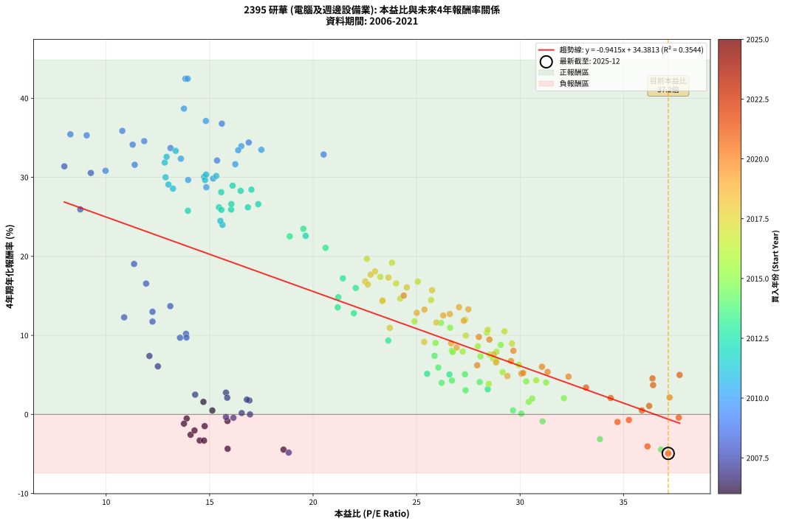
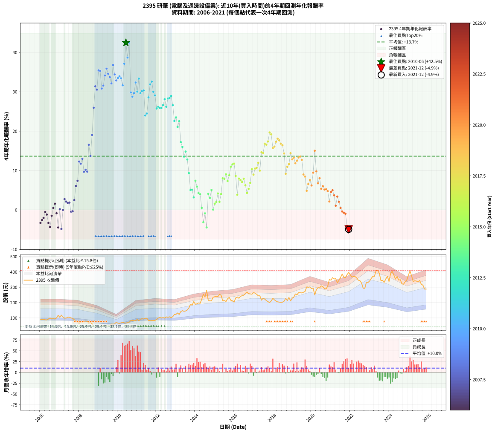

# 2395 研華 - 本益比與未來報酬率分析

!!! info "報告資訊"
    - **股票代號**: 2395
    - **公司名稱**: 研華
    - **產業別**: 電腦及週邊設備業
    - **分析期間**: 2006-2021 (192 個數據點)
    - **資料來源**: Type 12 (ShowMonthlyK_ChartFlow) 月收盤價與本益比
    - **報酬率口徑**: 含現金股利 (簡化: 年度合計，假設每年7/1入帳)
    - **報告生成時間**: 2026-01-06 00:38:42 CST

## 📈 視覺化圖表

### 圖表1: 本益比 vs 未來報酬率關係

*圖表1：2395 研華 本益比與4年期未來報酬率關係 (2006-2021)*

### 圖表2: 歷年買入時點的4年期實際報酬率

*圖表2：2395 研華 歷年買入時點的4年期實際報酬率 (2006-2021)*

## 📍 買點訊號說明

本報告提供兩種買點提示訊號（顯示於圖表2的股價子圖中）：

### ▲ 小綠色三角形（回測驗證）
- **計算方式**: 使用全部歷史資料計算本益比第25百分位數
- **用途**: 事後驗證，顯示歷史上哪些時點確實為低估區
- **限制**: 當下無法判斷，僅供回測參考
- **特性**: 後見之明（Look-Ahead Bias）

### ▲ 小橘色三角形（即時訊號）
- **計算方式**: 使用截至當月的過去5年資料計算本益比第25百分位數
- **用途**: 實際投資決策，當時即可判斷
- **優勢**: 可操作性強，符合實務需求
- **特性**: 無後見之明，滾動窗口計算

!!! tip "如何使用兩種訊號"
    - **綠色▲** 幫助理解歷史估值機會，驗證策略有效性
    - **橘色▲** 可作為實際買進參考，但仍需搭配基本面分析
    - 兩種訊號重疊時，表示即時判斷與事後驗證一致，信心度較高
    - 僅有綠色▲時，表示當時無法判斷（需要未來資料才能確認）
    - 僅有橘色▲時，表示即時判斷為買點，但事後可能不是最佳時機

## 📊 估值分析摘要

| 指標 | 數值 |
|:---:|:---:|
| **目前本益比** (2021-12) | **37.16 倍** |
| **歷史平均本益比** | 22.02 倍 |
| **估值水準** | 🔴 相對高估 |
| **預期4年年化報酬率** | **-0.60%** |
| **歷史平均報酬率** | +13.65% |
| **相關係數 (R²)** | 0.3544 |
| **趨勢線斜率** | -0.9415 |

!!! abstract "核心洞察"
    目前本益比顯著高於歷史平均，預期未來報酬率可能較低

    根據歷史數據回測，2395 研華 在目前本益比 **37.2倍** 的估值水準下，
    預期未來4年年化報酬率約為 **-0.6%**。

    **重要提醒**: 本分析基於歷史數據統計，實際報酬率會受到公司基本面變化、產業趨勢、
    總體經濟環境等多重因素影響。R² = 0.35 表示本益比可解釋約 35.4% 的報酬率變異。

## 📈 歷史估值統計

### 最佳買點 (最高報酬率)

| 項目 | 數值 |
|:---:|:---:|
| 起始時間 | 2010-06 |
| 當時本益比 | 13.83 倍 |
| 起始價格 | 66.1 元 |
| 4年後價格 | 255.0 元 |
| **4年年化報酬率** | **+42.47%** |

### 最差買點 (最低報酬率)

| 項目 | 數值 |
|:---:|:---:|
| 起始時間 | 2021-12 |
| 當時本益比 | 37.16 倍 |
| 起始價格 | 396.5 元 |
| 4年後價格 | 288.0 元 |
| **4年年化報酬率** | **-4.94%** |

## 🎯 投資啟示

### 本益比與報酬率關係

趨勢線方程式: **y = -0.9415x + 34.3813**

!!! warning "強負相關"
    本益比與未來報酬率呈現強負相關。在高本益比時期買入，未來報酬率顯著較低；
    在低本益比時期買入，未來報酬率顯著較高。**估值紀律至關重要**。

### 估值區間建議

基於歷史數據分析:

- **🟢 低估區** (P/E < 17.6): 預期報酬率較高，可考慮增加持股
- **🟡 合理區** (P/E 17.6-26.4): 預期報酬率符合長期趨勢，正常持有
- **🔴 高估區** (P/E > 26.4): 預期報酬率較低，可考慮減碼或觀望

!!! danger "風險提示"
    - 過去表現不代表未來結果
    - 本分析假設公司基本面無重大結構性變化
    - 產業環境劇變可能使歷史規律失效
    - 應結合公司財報、產業趨勢、總體經濟等多重因素綜合判斷

!!! success "長期投資觀點"
    歷史數據顯示，在合理或低估的估值水準買入並長期持有，
    往往能獲得較佳的投資報酬。**耐心等待好價格**是價值投資的核心原則。

## 📊 數據品質

- **資料來源**: GoodInfo.tw Type 12 (ShowMonthlyK_ChartFlow)
- **資料頻率**: 月度收盤價與本益比
- **回測期間**: 2006-2021
- **數據點數量**: 192 個 (每個點代表一次4年期回測)

### 計算方法說明

1. **4年期年化報酬率**:
   - 對每個歷史時點，計算其後4年的實際投資報酬率
   - 期末價值(不含股利): 期末價格
   - 期末價值(含現金股利): 期末價格 + 持有期間內的現金股利合計 (簡化: 年度合計，假設每年7/1入帳)
   - 公式: 年化報酬率 = [(期末價值/期初價格)^(1/年數) - 1] × 100%

2. **本益比 (P/E Ratio)**:
   - 使用當時的月收盤價與EPS計算
   - 資料來源: Type 12 月度河流圖本益比數據

3. **趨勢線 (Linear Regression)**:
   - 使用最小平方法擬合線性趨勢線
   - R²值衡量本益比對報酬率的解釋能力

---

*本報告由 Stock Analysis System v1.9.0 自動生成*
*數據更新時間: 2026-01-06 00:38:42 CST*

## 📋 月度回測明細表

（每一列對應時間線圖中的一個買入點；可用來對照 SVG 圖上的每個點。）

| 買入月份 | 賣出月份 | 回測期限_年 | 實際持有年數 | 買入本益比_倍 | 買入收盤價_元 | 賣出收盤價_元 | 現金股利合計_元 | 總報酬率_pct | 年化報酬率_pct |
| --- | --- | --- | --- | --- | --- | --- | --- | --- | --- |
| 2006-01 | 2010-01 | 4 | 4.000 | 14.52 | 91.50 | 65.00 | 15.00 | -12.57 | -3.30 |
| 2006-02 | 2010-02 | 4 | 4.000 | 14.08 | 88.70 | 64.90 | 15.00 | -9.92 | -2.58 |
| 2006-03 | 2010-03 | 4 | 4.000 | 14.27 | 89.90 | 67.80 | 15.00 | -7.90 | -2.04 |
| 2006-04 | 2010-04 | 4 | 4.000 | 13.89 | 87.50 | 70.70 | 15.00 | -2.05 | -0.52 |
| 2006-05 | 2010-05 | 4 | 4.000 | 13.76 | 86.70 | 67.70 | 15.00 | -4.61 | -1.17 |
| 2006-06 | 2010-06 | 4 | 4.000 | 14.73 | 92.80 | 66.10 | 15.00 | -12.61 | -3.31 |
| 2006-07 | 2010-07 | 4 | 4.000 | 15.87 | 100.00 | 68.70 | 15.00 | -16.30 | -4.35 |
| 2006-08 | 2010-08 | 4 | 4.000 | 14.76 | 93.00 | 72.60 | 15.00 | -5.80 | -1.48 |
| 2006-09 | 2010-09 | 4 | 4.000 | 15.13 | 95.30 | 82.20 | 15.00 | +2.00 | +0.50 |
| 2006-10 | 2010-10 | 4 | 4.000 | 14.70 | 92.60 | 83.60 | 15.00 | +6.48 | +1.58 |
| 2006-11 | 2010-11 | 4 | 4.000 | 15.86 | 99.90 | 81.60 | 15.00 | -3.30 | -0.84 |
| 2006-12 | 2010-12 | 4 | 4.000 | 18.57 | 117.00 | 82.50 | 15.00 | -16.66 | -4.45 |
| 2007-01 | 2011-01 | 4 | 4.000 | 16.55 | 104.00 | 89.70 | 15.00 | +0.68 | +0.17 |
| 2007-02 | 2011-02 | 4 | 4.000 | 18.82 | 118.00 | 81.80 | 15.00 | -17.96 | -4.83 |
| 2007-03 | 2011-03 | 4 | 4.000 | 16.95 | 106.00 | 91.00 | 15.00 | +0.00 | +0.00 |
| 2007-04 | 2011-04 | 4 | 4.000 | 15.79 | 98.50 | 94.80 | 15.00 | +11.48 | +2.75 |
| 2007-05 | 2011-05 | 4 | 4.000 | 15.85 | 98.60 | 92.20 | 15.00 | +8.73 | +2.11 |
| 2007-06 | 2011-06 | 4 | 4.000 | 16.92 | 105.00 | 97.60 | 15.00 | +7.24 | +1.76 |
| 2007-07 | 2011-07 | 4 | 4.000 | 16.80 | 104.00 | 97.50 | 14.50 | +7.69 | +1.87 |
| 2007-08 | 2011-08 | 4 | 4.000 | 16.15 | 99.70 | 83.50 | 14.50 | -1.71 | -0.43 |
| 2007-09 | 2011-09 | 4 | 4.000 | 15.79 | 97.20 | 81.40 | 14.50 | -1.34 | -0.34 |
| 2007-10 | 2011-10 | 4 | 4.000 | 14.30 | 87.80 | 82.40 | 14.50 | +10.36 | +2.50 |
| 2007-11 | 2011-11 | 4 | 4.000 | 12.50 | 76.60 | 82.50 | 14.50 | +26.63 | +6.08 |
| 2007-12 | 2011-12 | 4 | 4.000 | 12.09 | 73.90 | 83.80 | 14.50 | +33.02 | +7.39 |
| 2008-01 | 2012-01 | 4 | 4.000 | 10.87 | 65.50 | 89.60 | 14.50 | +58.93 | +12.28 |
| 2008-02 | 2012-02 | 4 | 4.000 | 12.24 | 72.80 | 99.00 | 14.50 | +55.91 | +11.74 |
| 2008-03 | 2012-03 | 4 | 4.000 | 12.24 | 71.80 | 102.50 | 14.50 | +62.95 | +12.98 |
| 2008-04 | 2012-04 | 4 | 4.000 | 13.57 | 78.50 | 99.20 | 14.50 | +44.84 | +9.70 |
| 2008-05 | 2012-05 | 4 | 4.000 | 13.86 | 79.00 | 102.00 | 14.50 | +47.47 | +10.20 |
| 2008-06 | 2012-06 | 4 | 4.000 | 13.88 | 78.00 | 98.60 | 14.50 | +45.00 | +9.73 |
| 2008-07 | 2012-07 | 4 | 4.000 | 11.93 | 66.10 | 106.50 | 15.46 | +84.51 | +16.55 |
| 2008-08 | 2012-08 | 4 | 4.000 | 13.10 | 71.50 | 104.00 | 15.46 | +67.08 | +13.69 |
| 2008-09 | 2012-09 | 4 | 4.000 | 11.35 | 61.00 | 107.00 | 15.46 | +100.76 | +19.03 |
| 2008-10 | 2012-10 | 4 | 4.000 | 8.75 | 46.30 | 101.00 | 15.46 | +151.54 | +25.94 |
| 2008-11 | 2012-11 | 4 | 4.000 | 7.98 | 41.60 | 108.50 | 15.46 | +197.99 | +31.39 |
| 2008-12 | 2012-12 | 4 | 4.000 | 9.26 | 47.50 | 122.50 | 15.46 | +190.45 | +30.55 |
| 2009-01 | 2013-01 | 4 | 4.000 | 8.27 | 41.30 | 123.50 | 15.46 | +236.47 | +35.44 |
| 2009-02 | 2013-02 | 4 | 4.000 | 9.06 | 44.00 | 132.00 | 15.46 | +235.15 | +35.30 |
| 2009-03 | 2013-03 | 4 | 4.000 | 9.97 | 47.10 | 122.50 | 15.46 | +192.92 | +30.82 |
| 2009-04 | 2013-04 | 4 | 4.000 | 11.38 | 52.20 | 141.00 | 15.46 | +199.74 | +31.58 |
| 2009-05 | 2013-05 | 4 | 4.000 | 11.28 | 50.20 | 147.00 | 15.46 | +223.63 | +34.13 |
| 2009-06 | 2013-06 | 4 | 4.000 | 10.78 | 46.50 | 143.00 | 15.46 | +240.78 | +35.87 |
| 2009-07 | 2013-07 | 4 | 4.000 | 11.84 | 49.50 | 145.00 | 17.35 | +227.98 | +34.57 |
| 2009-08 | 2013-08 | 4 | 4.000 | 13.11 | 53.00 | 152.00 | 17.35 | +219.53 | +33.70 |
| 2009-09 | 2013-09 | 4 | 4.000 | 15.36 | 60.00 | 165.50 | 17.35 | +204.75 | +32.13 |
| 2009-10 | 2013-10 | 4 | 4.000 | 15.59 | 58.80 | 188.50 | 17.35 | +250.09 | +36.79 |
| 2009-11 | 2013-11 | 4 | 4.000 | 16.89 | 61.40 | 183.00 | 17.35 | +226.30 | +34.40 |
| 2009-12 | 2013-12 | 4 | 4.000 | 20.51 | 71.80 | 206.50 | 17.35 | +211.77 | +32.88 |
| 2010-01 | 2014-01 | 4 | 4.000 | 17.50 | 65.00 | 189.00 | 17.35 | +217.46 | +33.48 |
| 2010-02 | 2014-02 | 4 | 4.000 | 16.53 | 64.90 | 191.50 | 17.35 | +221.80 | +33.94 |
| 2010-03 | 2014-03 | 4 | 4.000 | 16.38 | 67.80 | 197.50 | 17.35 | +216.89 | +33.42 |
| 2010-04 | 2014-04 | 4 | 4.000 | 16.24 | 70.70 | 195.00 | 17.35 | +200.35 | +31.65 |
| 2010-05 | 2014-05 | 4 | 4.000 | 14.82 | 67.70 | 222.00 | 17.35 | +253.55 | +37.12 |
| 2010-06 | 2014-06 | 4 | 4.000 | 13.83 | 66.10 | 255.00 | 17.35 | +312.03 | +42.47 |
| 2010-07 | 2014-07 | 4 | 4.000 | 13.76 | 68.70 | 235.50 | 18.63 | +269.91 | +38.68 |
| 2010-08 | 2014-08 | 4 | 4.000 | 13.94 | 72.60 | 280.50 | 18.63 | +312.02 | +42.47 |
| 2010-09 | 2014-09 | 4 | 4.000 | 15.17 | 82.20 | 215.00 | 18.63 | +184.22 | +29.84 |
| 2010-10 | 2014-10 | 4 | 4.000 | 14.84 | 83.60 | 211.00 | 18.63 | +174.67 | +28.74 |
| 2010-11 | 2014-11 | 4 | 4.000 | 13.96 | 81.60 | 212.00 | 18.63 | +182.63 | +29.66 |
| 2010-12 | 2014-12 | 4 | 4.000 | 13.61 | 82.50 | 234.50 | 18.63 | +206.82 | +32.35 |
| 2011-01 | 2015-01 | 4 | 4.000 | 14.73 | 89.70 | 238.00 | 18.63 | +186.10 | +30.06 |
| 2011-02 | 2015-02 | 4 | 4.000 | 13.36 | 81.80 | 240.00 | 18.63 | +216.17 | +33.35 |
| 2011-03 | 2015-03 | 4 | 4.000 | 14.78 | 91.00 | 238.50 | 18.63 | +182.56 | +29.65 |
| 2011-04 | 2015-04 | 4 | 4.000 | 15.32 | 94.80 | 253.50 | 18.63 | +187.05 | +30.16 |
| 2011-05 | 2015-05 | 4 | 4.000 | 14.83 | 92.20 | 247.50 | 18.63 | +188.64 | +30.34 |
| 2011-06 | 2015-06 | 4 | 4.000 | 15.62 | 97.60 | 212.00 | 18.63 | +136.30 | +23.98 |
| 2011-07 | 2015-07 | 4 | 4.000 | 15.52 | 97.50 | 213.00 | 21.12 | +140.13 | +24.48 |
| 2011-08 | 2015-08 | 4 | 4.000 | 13.23 | 83.50 | 207.00 | 21.12 | +173.20 | +28.56 |
| 2011-09 | 2015-09 | 4 | 4.000 | 12.83 | 81.40 | 225.00 | 21.12 | +202.36 | +31.87 |
| 2011-10 | 2015-10 | 4 | 4.000 | 12.92 | 82.40 | 233.50 | 21.12 | +209.01 | +32.58 |
| 2011-11 | 2015-11 | 4 | 4.000 | 12.87 | 82.50 | 214.50 | 21.12 | +185.60 | +30.00 |
| 2011-12 | 2015-12 | 4 | 4.000 | 13.01 | 83.80 | 211.50 | 21.12 | +177.59 | +29.08 |
| 2012-01 | 2016-01 | 4 | 4.000 | 13.95 | 89.60 | 203.00 | 21.12 | +150.14 | +25.76 |
| 2012-02 | 2016-02 | 4 | 4.000 | 15.45 | 99.00 | 230.00 | 21.12 | +153.66 | +26.20 |
| 2012-03 | 2016-03 | 4 | 4.000 | 16.04 | 102.50 | 236.50 | 21.12 | +151.34 | +25.91 |
| 2012-04 | 2016-04 | 4 | 4.000 | 15.57 | 99.20 | 228.00 | 21.12 | +151.13 | +25.89 |
| 2012-05 | 2016-05 | 4 | 4.000 | 16.05 | 102.00 | 241.00 | 21.12 | +156.98 | +26.61 |
| 2012-06 | 2016-06 | 4 | 4.000 | 15.56 | 98.60 | 244.50 | 21.12 | +169.40 | +28.11 |
| 2012-07 | 2016-07 | 4 | 4.000 | 16.85 | 106.50 | 248.00 | 22.16 | +153.67 | +26.20 |
| 2012-08 | 2016-08 | 4 | 4.000 | 16.50 | 104.00 | 259.50 | 22.16 | +170.83 | +28.28 |
| 2012-09 | 2016-09 | 4 | 4.000 | 17.02 | 107.00 | 269.00 | 22.16 | +172.11 | +28.44 |
| 2012-10 | 2016-10 | 4 | 4.000 | 16.11 | 101.00 | 257.00 | 22.16 | +176.40 | +28.94 |
| 2012-11 | 2016-11 | 4 | 4.000 | 17.35 | 108.50 | 256.50 | 22.16 | +156.83 | +26.59 |
| 2012-12 | 2016-12 | 4 | 4.000 | 19.64 | 122.50 | 254.50 | 22.16 | +125.84 | +22.59 |
| 2013-01 | 2017-01 | 4 | 4.000 | 19.53 | 123.50 | 265.00 | 22.16 | +132.52 | +23.49 |
| 2013-02 | 2017-02 | 4 | 4.000 | 20.60 | 132.00 | 261.50 | 22.16 | +114.89 | +21.08 |
| 2013-03 | 2017-03 | 4 | 4.000 | 18.87 | 122.50 | 254.00 | 22.16 | +125.44 | +22.53 |
| 2013-04 | 2017-04 | 4 | 4.000 | 21.44 | 141.00 | 244.00 | 22.16 | +88.77 | +17.21 |
| 2013-05 | 2017-05 | 4 | 4.000 | 22.06 | 147.00 | 244.00 | 22.16 | +81.06 | +16.00 |
| 2013-06 | 2017-06 | 4 | 4.000 | 21.19 | 143.00 | 215.50 | 22.16 | +66.20 | +13.54 |
| 2013-07 | 2017-07 | 4 | 4.000 | 21.22 | 145.00 | 228.50 | 23.57 | +73.84 | +14.83 |
| 2013-08 | 2017-08 | 4 | 4.000 | 21.97 | 152.00 | 222.50 | 23.57 | +61.89 | +12.80 |
| 2013-09 | 2017-09 | 4 | 4.000 | 23.63 | 165.50 | 213.00 | 23.57 | +42.94 | +9.34 |
| 2013-10 | 2017-10 | 4 | 4.000 | 26.59 | 188.50 | 206.00 | 23.57 | +21.79 | +5.05 |
| 2013-11 | 2017-11 | 4 | 4.000 | 25.51 | 183.00 | 200.00 | 23.57 | +22.17 | +5.13 |
| 2013-12 | 2017-12 | 4 | 4.000 | 28.44 | 206.50 | 210.50 | 23.57 | +13.35 | +3.18 |
| 2014-01 | 2018-01 | 4 | 4.000 | 25.87 | 189.00 | 228.00 | 23.57 | +33.11 | +7.41 |
| 2014-02 | 2018-02 | 4 | 4.000 | 26.05 | 191.50 | 217.50 | 23.57 | +25.89 | +5.92 |
| 2014-03 | 2018-03 | 4 | 4.000 | 26.71 | 197.50 | 210.00 | 23.57 | +18.26 | +4.28 |
| 2014-04 | 2018-04 | 4 | 4.000 | 26.21 | 195.00 | 204.50 | 23.57 | +16.96 | +3.99 |
| 2014-05 | 2018-05 | 4 | 4.000 | 29.66 | 222.00 | 203.00 | 23.57 | +2.06 | +0.51 |
| 2014-06 | 2018-06 | 4 | 4.000 | 33.86 | 255.00 | 201.00 | 23.57 | -11.93 | -3.13 |
| 2014-07 | 2018-07 | 4 | 4.000 | 31.09 | 235.50 | 202.50 | 24.89 | -3.44 | -0.87 |
| 2014-08 | 2018-08 | 4 | 4.000 | 36.81 | 280.50 | 209.00 | 24.89 | -16.62 | -4.44 |
| 2014-09 | 2018-09 | 4 | 4.000 | 28.05 | 215.00 | 227.50 | 24.89 | +17.39 | +4.09 |
| 2014-10 | 2018-10 | 4 | 4.000 | 27.37 | 211.00 | 213.00 | 24.89 | +12.74 | +3.04 |
| 2014-11 | 2018-11 | 4 | 4.000 | 27.34 | 212.00 | 233.50 | 24.89 | +21.88 | +5.07 |
| 2014-12 | 2018-12 | 4 | 4.000 | 30.06 | 234.50 | 210.50 | 24.89 | +0.38 | +0.09 |
| 2015-01 | 2019-01 | 4 | 4.000 | 30.42 | 238.00 | 228.50 | 24.89 | +6.47 | +1.58 |
| 2015-02 | 2019-02 | 4 | 4.000 | 30.59 | 240.00 | 235.00 | 24.89 | +8.29 | +2.01 |
| 2015-03 | 2019-03 | 4 | 4.000 | 30.30 | 238.50 | 256.00 | 24.89 | +17.77 | +4.17 |
| 2015-04 | 2019-04 | 4 | 4.000 | 32.12 | 253.50 | 250.00 | 24.89 | +8.44 | +2.05 |
| 2015-05 | 2019-05 | 4 | 4.000 | 31.26 | 247.50 | 265.00 | 24.89 | +17.13 | +4.03 |
| 2015-06 | 2019-06 | 4 | 4.000 | 26.70 | 212.00 | 264.00 | 24.89 | +36.27 | +8.04 |
| 2015-07 | 2019-07 | 4 | 4.000 | 26.75 | 213.00 | 263.00 | 25.69 | +35.53 | +7.90 |
| 2015-08 | 2019-08 | 4 | 4.000 | 25.92 | 207.00 | 267.00 | 25.69 | +41.40 | +9.05 |
| 2015-09 | 2019-09 | 4 | 4.000 | 28.09 | 225.00 | 273.00 | 25.69 | +32.75 | +7.34 |
| 2015-10 | 2019-10 | 4 | 4.000 | 29.07 | 233.50 | 301.50 | 25.69 | +40.12 | +8.80 |
| 2015-11 | 2019-11 | 4 | 4.000 | 26.62 | 214.50 | 299.50 | 25.69 | +51.60 | +10.96 |
| 2015-12 | 2019-12 | 4 | 4.000 | 26.18 | 211.50 | 302.00 | 25.69 | +54.94 | +11.57 |
| 2016-01 | 2020-01 | 4 | 4.000 | 24.90 | 203.00 | 291.00 | 25.69 | +56.00 | +11.76 |
| 2016-02 | 2020-02 | 4 | 4.000 | 27.96 | 230.00 | 294.50 | 25.69 | +39.21 | +8.62 |
| 2016-03 | 2020-03 | 4 | 4.000 | 28.49 | 236.50 | 249.50 | 25.69 | +16.36 | +3.86 |
| 2016-04 | 2020-04 | 4 | 4.000 | 27.23 | 228.00 | 284.00 | 25.69 | +35.83 | +7.96 |
| 2016-05 | 2020-05 | 4 | 4.000 | 28.53 | 241.00 | 297.00 | 25.69 | +33.90 | +7.57 |
| 2016-06 | 2020-06 | 4 | 4.000 | 28.70 | 244.50 | 295.50 | 25.69 | +31.37 | +7.06 |
| 2016-07 | 2020-07 | 4 | 4.000 | 28.86 | 248.00 | 309.00 | 27.48 | +35.68 | +7.93 |
| 2016-08 | 2020-08 | 4 | 4.000 | 29.94 | 259.50 | 303.50 | 27.48 | +27.54 | +6.27 |
| 2016-09 | 2020-09 | 4 | 4.000 | 30.78 | 269.00 | 291.00 | 27.48 | +18.39 | +4.31 |
| 2016-10 | 2020-10 | 4 | 4.000 | 29.16 | 257.00 | 289.00 | 27.48 | +23.14 | +5.34 |
| 2016-11 | 2020-11 | 4 | 4.000 | 28.86 | 256.50 | 307.00 | 27.48 | +30.40 | +6.86 |
| 2016-12 | 2020-12 | 4 | 4.000 | 28.40 | 254.50 | 350.00 | 27.48 | +48.32 | +10.36 |
| 2017-01 | 2021-01 | 4 | 4.000 | 29.61 | 265.00 | 346.00 | 27.48 | +40.94 | +8.96 |
| 2017-02 | 2021-02 | 4 | 4.000 | 29.25 | 261.50 | 362.50 | 27.48 | +49.13 | +10.51 |
| 2017-03 | 2021-03 | 4 | 4.000 | 28.44 | 254.00 | 354.00 | 27.48 | +50.19 | +10.70 |
| 2017-04 | 2021-04 | 4 | 4.000 | 27.35 | 244.00 | 356.00 | 27.48 | +57.16 | +11.97 |
| 2017-05 | 2021-05 | 4 | 4.000 | 27.38 | 244.00 | 329.50 | 27.48 | +46.30 | +9.98 |
| 2017-06 | 2021-06 | 4 | 4.000 | 24.21 | 215.50 | 345.00 | 27.48 | +72.84 | +14.66 |
| 2017-07 | 2021-07 | 4 | 4.000 | 25.70 | 228.50 | 364.00 | 28.27 | +71.67 | +14.47 |
| 2017-08 | 2021-08 | 4 | 4.000 | 25.06 | 222.50 | 386.00 | 28.27 | +86.19 | +16.81 |
| 2017-09 | 2021-09 | 4 | 4.000 | 24.01 | 213.00 | 365.00 | 28.27 | +84.64 | +16.57 |
| 2017-10 | 2021-10 | 4 | 4.000 | 23.25 | 206.00 | 363.00 | 28.27 | +89.94 | +17.40 |
| 2017-11 | 2021-11 | 4 | 4.000 | 22.60 | 200.00 | 382.00 | 28.27 | +105.14 | +19.68 |
| 2017-12 | 2021-12 | 4 | 4.000 | 23.81 | 210.50 | 396.50 | 28.27 | +101.79 | +19.19 |
| 2018-01 | 2022-01 | 4 | 4.000 | 25.75 | 228.00 | 380.50 | 28.27 | +79.29 | +15.71 |
| 2018-02 | 2022-02 | 4 | 4.000 | 24.53 | 217.50 | 366.50 | 28.27 | +81.50 | +16.07 |
| 2018-03 | 2022-03 | 4 | 4.000 | 23.64 | 210.00 | 369.50 | 28.27 | +89.42 | +17.32 |
| 2018-04 | 2022-04 | 4 | 4.000 | 22.99 | 204.50 | 369.50 | 28.27 | +94.51 | +18.10 |
| 2018-05 | 2022-05 | 4 | 4.000 | 22.78 | 203.00 | 361.00 | 28.27 | +91.76 | +17.68 |
| 2018-06 | 2022-06 | 4 | 4.000 | 22.52 | 201.00 | 346.00 | 28.27 | +86.21 | +16.81 |
| 2018-07 | 2022-07 | 4 | 4.000 | 22.65 | 202.50 | 342.50 | 29.66 | +83.78 | +16.43 |
| 2018-08 | 2022-08 | 4 | 4.000 | 23.34 | 209.00 | 327.50 | 29.66 | +70.89 | +14.33 |
| 2018-09 | 2022-09 | 4 | 4.000 | 25.37 | 227.50 | 293.50 | 29.66 | +42.05 | +9.17 |
| 2018-10 | 2022-10 | 4 | 4.000 | 23.71 | 213.00 | 293.00 | 29.66 | +51.48 | +10.94 |
| 2018-11 | 2022-11 | 4 | 4.000 | 25.96 | 233.50 | 333.00 | 29.66 | +55.31 | +11.64 |
| 2018-12 | 2022-12 | 4 | 4.000 | 23.36 | 210.50 | 331.00 | 29.66 | +71.33 | +14.41 |
| 2019-01 | 2023-01 | 4 | 4.000 | 25.01 | 228.50 | 341.00 | 29.66 | +62.21 | +12.86 |
| 2019-02 | 2023-02 | 4 | 4.000 | 25.38 | 235.00 | 357.00 | 29.66 | +64.54 | +13.26 |
| 2019-03 | 2023-03 | 4 | 4.000 | 27.28 | 256.00 | 371.00 | 29.66 | +56.51 | +11.85 |
| 2019-04 | 2023-04 | 4 | 4.000 | 26.29 | 250.00 | 371.00 | 29.66 | +60.26 | +12.51 |
| 2019-05 | 2023-05 | 4 | 4.000 | 27.50 | 265.00 | 407.00 | 29.66 | +64.78 | +13.30 |
| 2019-06 | 2023-06 | 4 | 4.000 | 27.05 | 264.00 | 409.50 | 29.66 | +66.35 | +13.57 |
| 2019-07 | 2023-07 | 4 | 4.000 | 26.61 | 263.00 | 391.50 | 32.85 | +61.35 | +12.70 |
| 2019-08 | 2023-08 | 4 | 4.000 | 26.67 | 267.00 | 344.00 | 32.85 | +41.14 | +9.00 |
| 2019-09 | 2023-09 | 4 | 4.000 | 26.94 | 273.00 | 345.00 | 32.85 | +38.41 | +8.46 |
| 2019-10 | 2023-10 | 4 | 4.000 | 29.39 | 301.50 | 331.50 | 32.85 | +20.85 | +4.85 |
| 2019-11 | 2023-11 | 4 | 4.000 | 28.84 | 299.50 | 353.50 | 32.85 | +29.00 | +6.57 |
| 2019-12 | 2023-12 | 4 | 4.000 | 28.73 | 302.00 | 372.00 | 32.85 | +34.06 | +7.60 |
| 2020-01 | 2024-01 | 4 | 4.000 | 27.93 | 291.00 | 337.50 | 32.85 | +27.27 | +6.21 |
| 2020-02 | 2024-02 | 4 | 4.000 | 28.52 | 294.50 | 390.00 | 32.85 | +43.58 | +9.46 |
| 2020-03 | 2024-03 | 4 | 4.000 | 24.38 | 249.50 | 404.00 | 32.85 | +75.09 | +15.03 |
| 2020-04 | 2024-04 | 4 | 4.000 | 28.01 | 284.00 | 380.00 | 32.85 | +45.37 | +9.80 |
| 2020-05 | 2024-05 | 4 | 4.000 | 29.56 | 297.00 | 353.00 | 32.85 | +29.92 | +6.76 |
| 2020-06 | 2024-06 | 4 | 4.000 | 29.68 | 295.50 | 370.00 | 32.85 | +36.33 | +8.06 |
| 2020-07 | 2024-07 | 4 | 4.000 | 31.33 | 309.00 | 346.50 | 34.51 | +23.30 | +5.38 |
| 2020-08 | 2024-08 | 4 | 4.000 | 31.06 | 303.50 | 349.00 | 34.51 | +26.36 | +6.02 |
| 2020-09 | 2024-09 | 4 | 4.000 | 30.07 | 291.00 | 321.50 | 34.51 | +22.34 | +5.17 |
| 2020-10 | 2024-10 | 4 | 4.000 | 30.15 | 289.00 | 320.00 | 34.51 | +22.67 | +5.24 |
| 2020-11 | 2024-11 | 4 | 4.000 | 32.34 | 307.00 | 335.50 | 34.51 | +20.52 | +4.78 |
| 2020-12 | 2024-12 | 4 | 4.000 | 37.23 | 350.00 | 346.50 | 34.51 | +8.86 | +2.14 |
| 2021-01 | 2025-01 | 4 | 4.000 | 36.40 | 346.00 | 379.00 | 34.51 | +19.51 | +4.56 |
| 2021-02 | 2025-02 | 4 | 4.000 | 37.71 | 362.50 | 406.00 | 34.51 | +21.52 | +4.99 |
| 2021-03 | 2025-03 | 4 | 4.000 | 36.43 | 354.00 | 375.00 | 34.51 | +15.68 | +3.71 |
| 2021-04 | 2025-04 | 4 | 4.000 | 36.24 | 356.00 | 337.00 | 34.51 | +4.36 | +1.07 |
| 2021-05 | 2025-05 | 4 | 4.000 | 33.19 | 329.50 | 342.00 | 34.51 | +14.27 | +3.39 |
| 2021-06 | 2025-06 | 4 | 4.000 | 34.38 | 345.00 | 340.00 | 34.51 | +8.55 | +2.07 |
| 2021-07 | 2025-07 | 4 | 4.000 | 35.89 | 364.00 | 335.50 | 35.81 | +2.01 | +0.50 |
| 2021-08 | 2025-08 | 4 | 4.000 | 37.67 | 386.00 | 344.00 | 35.81 | -1.60 | -0.40 |
| 2021-09 | 2025-09 | 4 | 4.000 | 35.26 | 365.00 | 319.00 | 35.81 | -2.79 | -0.71 |
| 2021-10 | 2025-10 | 4 | 4.000 | 34.71 | 363.00 | 313.50 | 35.81 | -3.77 | -0.96 |
| 2021-11 | 2025-11 | 4 | 4.000 | 36.16 | 382.00 | 288.00 | 35.81 | -15.23 | -4.05 |
| 2021-12 | 2025-12 | 4 | 4.000 | 37.16 | 396.50 | 288.00 | 35.81 | -18.33 | -4.94 |
