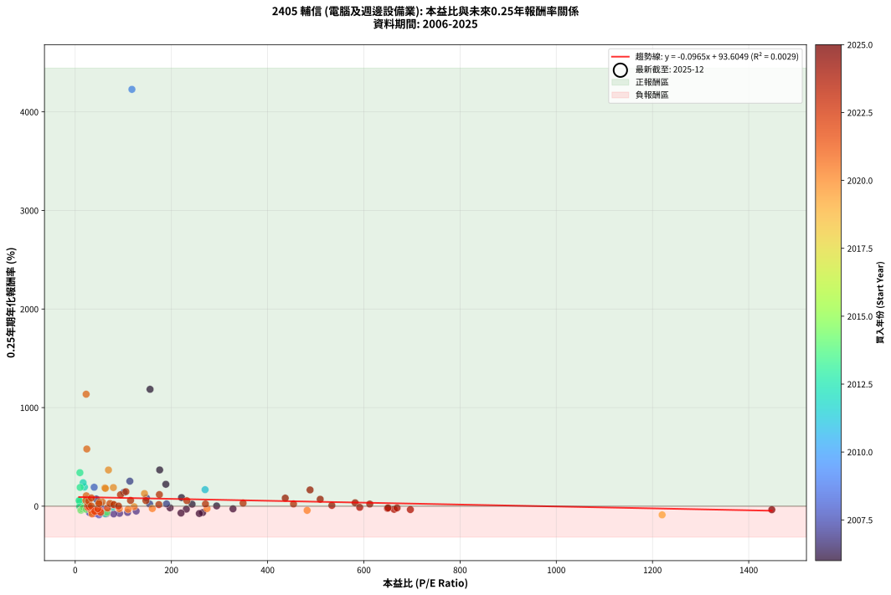
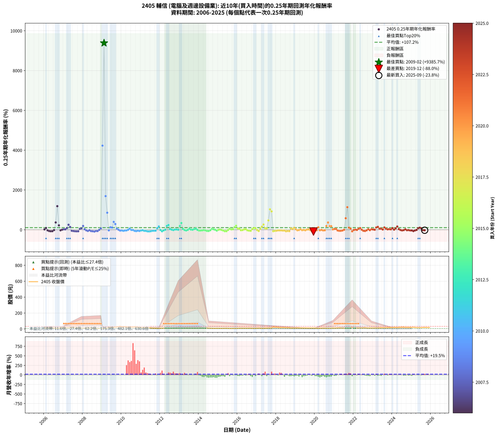

# 2405 輔信 - 本益比與未來報酬率分析

!!! info "報告資訊"
    - **股票代號**: 2405
    - **公司名稱**: 輔信
    - **產業別**: 電腦及週邊設備業
    - **分析期間**: 2006-2025 (237 個數據點)
    - **資料來源**: Type 12 (ShowMonthlyK_ChartFlow) 月收盤價與本益比
    - **報酬率口徑**: 含現金股利 (簡化: 年度合計，假設每年7/1入帳)
    - **報告生成時間**: 2026-01-05 00:36:32 CST

## 📈 視覺化圖表

### 圖表1: 本益比 vs 未來報酬率關係

*圖表1：2405 輔信 本益比與0.25年期未來報酬率關係 (2006-2025)*

### 圖表2: 歷年買入時點的0.25年期實際報酬率

*圖表2：2405 輔信 歷年買入時點的0.25年期實際報酬率 (2006-2025)*

## 📍 買點訊號說明

本報告提供兩種買點提示訊號（顯示於圖表2的股價子圖中）：

### ▲ 小綠色三角形（回測驗證）
- **計算方式**: 使用全部歷史資料計算本益比第25百分位數
- **用途**: 事後驗證，顯示歷史上哪些時點確實為低估區
- **限制**: 當下無法判斷，僅供回測參考
- **特性**: 後見之明（Look-Ahead Bias）

### ▲ 小橘色三角形（即時訊號）
- **計算方式**: 使用截至當月的過去5年資料計算本益比第25百分位數
- **用途**: 實際投資決策，當時即可判斷
- **優勢**: 可操作性強，符合實務需求
- **特性**: 無後見之明，滾動窗口計算

!!! tip "如何使用兩種訊號"
    - **綠色▲** 幫助理解歷史估值機會，驗證策略有效性
    - **橘色▲** 可作為實際買進參考，但仍需搭配基本面分析
    - 兩種訊號重疊時，表示即時判斷與事後驗證一致，信心度較高
    - 僅有綠色▲時，表示當時無法判斷（需要未來資料才能確認）
    - 僅有橘色▲時，表示即時判斷為買點，但事後可能不是最佳時機

## 📊 估值分析摘要

| 指標 | 數值 |
|:---:|:---:|
| **目前本益比** (2025-09) | **nan 倍** |
| **歷史平均本益比** | 154.72 倍 |
| **估值水準** | 🟡 合理範圍 |
| **預期0.25年年化報酬率** | **+nan%** |
| **歷史平均報酬率** | +107.21% |
| **相關係數 (R²)** | 0.0029 |
| **趨勢線斜率** | -0.0965 |

!!! abstract "核心洞察"
    目前本益比接近歷史平均，預期報酬率符合長期趨勢

    根據歷史數據回測，2405 輔信 在目前本益比 **nan倍** 的估值水準下，
    預期未來0.25年年化報酬率約為 **+nan%**。

    **重要提醒**: 本分析基於歷史數據統計，實際報酬率會受到公司基本面變化、產業趨勢、
    總體經濟環境等多重因素影響。R² = 0.00 表示本益比可解釋約 0.3% 的報酬率變異。

## 📈 歷史估值統計

### 最佳買點 (最高報酬率)

| 項目 | 數值 |
|:---:|:---:|
| 起始時間 | 2009-02 |
| 當時本益比 | nan 倍 |
| 起始價格 | 6.8 元 |
| 0.25年後價格 | 21.0 元 |
| **0.25年年化報酬率** | **+9385.73%** |

### 最差買點 (最低報酬率)

| 項目 | 數值 |
|:---:|:---:|
| 起始時間 | 2019-12 |
| 當時本益比 | 1220.00 倍 |
| 起始價格 | 12.2 元 |
| 0.25年後價格 | 7.2 元 |
| **0.25年年化報酬率** | **-87.96%** |

## 🎯 投資啟示

### 本益比與報酬率關係

趨勢線方程式: **y = -0.0965x + 93.6049**

!!! note "負相關"
    本益比與未來報酬率呈現負相關。較低的本益比通常帶來較高的未來報酬率，
    但相關性不算非常強。**估值仍是重要參考指標之一**。

### 估值區間建議

基於歷史數據分析:

- **🟢 低估區** (P/E < 123.8): 預期報酬率較高，可考慮增加持股
- **🟡 合理區** (P/E 123.8-185.7): 預期報酬率符合長期趨勢，正常持有
- **🔴 高估區** (P/E > 185.7): 預期報酬率較低，可考慮減碼或觀望

!!! danger "風險提示"
    - 過去表現不代表未來結果
    - 本分析假設公司基本面無重大結構性變化
    - 產業環境劇變可能使歷史規律失效
    - 應結合公司財報、產業趨勢、總體經濟等多重因素綜合判斷

!!! success "長期投資觀點"
    歷史數據顯示，在合理或低估的估值水準買入並長期持有，
    往往能獲得較佳的投資報酬。**耐心等待好價格**是價值投資的核心原則。

## 📊 數據品質

- **資料來源**: GoodInfo.tw Type 12 (ShowMonthlyK_ChartFlow)
- **資料頻率**: 月度收盤價與本益比
- **回測期間**: 2006-2025
- **數據點數量**: 237 個 (每個點代表一次0.25年期回測)

### 計算方法說明

1. **0.25年期年化報酬率**:
   - 對每個歷史時點，計算其後0.25年的實際投資報酬率
   - 期末價值(不含股利): 期末價格
   - 期末價值(含現金股利): 期末價格 + 持有期間內的現金股利合計 (簡化: 年度合計，假設每年7/1入帳)
   - 公式: 年化報酬率 = [(期末價值/期初價格)^(1/年數) - 1] × 100%

2. **本益比 (P/E Ratio)**:
   - 使用當時的月收盤價與EPS計算
   - 資料來源: Type 12 月度河流圖本益比數據

3. **趨勢線 (Linear Regression)**:
   - 使用最小平方法擬合線性趨勢線
   - R²值衡量本益比對報酬率的解釋能力

---

*本報告由 Stock Analysis System v1.9.0 自動生成*
*數據更新時間: 2026-01-05 00:36:32 CST*

## 📋 月度回測明細表

（每一列對應時間線圖中的一個買入點；可用來對照 SVG 圖上的每個點。）

| 買入月份 | 賣出月份 | 回測期限_年 | 實際持有年數 | 買入本益比_倍 | 買入收盤價_元 | 賣出收盤價_元 | 現金股利合計_元 | 總報酬率_pct | 年化報酬率_pct |
| --- | --- | --- | --- | --- | --- | --- | --- | --- | --- |
| 2006-01 | 2006-05 | 0.25 | 0.329 | 243.00 | 12.15 | 12.90 | 0.00 | +6.17 | +20.00 |
| 2006-02 | 2006-05 | 0.25 | 0.246 | 221.00 | 11.05 | 12.90 | 0.00 | +16.74 | +87.43 |
| 2006-03 | 2006-07 | 0.25 | 0.334 | 231.00 | 11.55 | 9.86 | 0.38 | -11.34 | -30.26 |
| 2006-04 | 2006-07 | 0.25 | 0.249 | 265.00 | 13.25 | 9.86 | 0.38 | -22.72 | -64.45 |
| 2006-05 | 2006-08 | 0.25 | 0.252 | 258.00 | 12.90 | 8.78 | 0.38 | -28.99 | -74.32 |
| 2006-06 | 2006-09 | 0.25 | 0.252 | 220.00 | 11.00 | 7.78 | 0.38 | -25.82 | -69.45 |
| 2006-07 | 2006-10 | 0.25 | 0.252 | 197.20 | 9.86 | 9.42 | 0.00 | -4.46 | -16.58 |
| 2006-08 | 2006-12 | 0.25 | 0.334 | 175.60 | 8.78 | 14.70 | 0.00 | +67.43 | +367.83 |
| 2006-09 | 2006-12 | 0.25 | 0.249 | 155.60 | 7.78 | 14.70 | 0.00 | +88.95 | +1185.72 |
| 2006-10 | 2007-01 | 0.25 | 0.252 | 188.40 | 9.42 | 12.65 | 0.00 | +34.29 | +222.35 |
| 2006-11 | 2007-03 | 0.25 | 0.329 | 328.00 | 16.40 | 14.80 | 0.00 | -9.76 | -26.84 |
| 2006-12 | 2007-03 | 0.25 | 0.246 | 294.00 | 14.70 | 14.80 | 0.00 | +0.68 | +2.79 |
| 2007-01 | 2007-05 | 0.25 | 0.329 | 189.80 | 12.65 | 13.55 | 0.00 | +7.11 | +23.27 |
| 2007-02 | 2007-05 | 0.25 | 0.246 | 154.80 | 12.90 | 13.55 | 0.00 | +5.04 | +22.08 |
| 2007-03 | 2007-07 | 0.25 | 0.334 | 148.00 | 14.80 | 18.15 | 0.00 | +22.64 | +84.20 |
| 2007-04 | 2007-07 | 0.25 | 0.249 | 113.60 | 13.25 | 18.15 | 0.00 | +36.98 | +253.61 |
| 2007-05 | 2007-08 | 0.25 | 0.252 | 101.60 | 13.55 | 16.90 | 0.00 | +24.72 | +140.39 |
| 2007-06 | 2007-09 | 0.25 | 0.252 | 126.70 | 19.00 | 16.00 | 0.00 | -15.79 | -49.45 |
| 2007-07 | 2007-10 | 0.25 | 0.252 | 108.90 | 18.15 | 14.10 | 0.00 | -22.31 | -63.30 |
| 2007-08 | 2007-12 | 0.25 | 0.334 | 92.18 | 16.90 | 10.95 | 0.00 | -35.21 | -72.73 |
| 2007-09 | 2007-12 | 0.25 | 0.249 | 80.00 | 16.00 | 10.95 | 0.00 | -31.56 | -78.18 |
| 2007-10 | 2008-01 | 0.25 | 0.252 | 65.08 | 14.10 | 9.92 | 0.00 | -29.65 | -75.24 |
| 2007-11 | 2008-03 | 0.25 | 0.331 | 47.57 | 11.10 | 12.55 | 0.00 | +13.06 | +44.86 |
| 2007-12 | 2008-03 | 0.25 | 0.249 | 43.80 | 10.95 | 12.55 | 0.00 | +14.61 | +72.87 |
| 2008-01 | 2008-05 | 0.25 | 0.331 | 39.42 | 9.92 | 14.15 | 0.00 | +42.64 | +192.15 |
| 2008-02 | 2008-05 | 0.25 | 0.249 | 52.89 | 13.40 | 14.15 | 0.00 | +5.60 | +24.43 |
| 2008-03 | 2008-07 | 0.25 | 0.334 | 49.22 | 12.55 | 11.00 | 0.20 | -10.76 | -28.87 |
| 2008-04 | 2008-07 | 0.25 | 0.249 | 54.94 | 14.10 | 11.00 | 0.20 | -20.57 | -60.32 |
| 2008-05 | 2008-08 | 0.25 | 0.252 | 54.77 | 14.15 | 13.00 | 0.20 | -6.71 | -24.11 |
| 2008-06 | 2008-09 | 0.25 | 0.252 | 42.88 | 11.15 | 8.28 | 0.20 | -23.95 | -66.27 |
| 2008-07 | 2008-10 | 0.25 | 0.252 | 42.04 | 11.00 | 7.88 | 0.00 | -28.36 | -73.40 |
| 2008-08 | 2008-12 | 0.25 | 0.334 | 49.37 | 13.00 | 6.50 | 0.00 | -50.00 | -87.45 |
| 2008-09 | 2008-12 | 0.25 | 0.249 | 31.25 | 8.28 | 6.50 | 0.00 | -21.50 | -62.15 |
| 2008-10 | 2009-01 | 0.25 | 0.252 | 29.55 | 7.88 | 6.09 | 0.00 | -22.72 | -64.05 |
| 2008-11 | 2009-03 | 0.25 | 0.329 | 27.99 | 7.51 | 7.40 | 0.00 | -1.46 | -4.39 |
| 2008-12 | 2009-03 | 0.25 | 0.246 | 24.07 | 6.50 | 7.40 | 0.00 | +13.85 | +69.26 |
| 2009-01 | 2009-05 | 0.25 | 0.329 | 117.90 | 6.09 | 21.00 | 0.00 | +244.83 | +4228.39 |
| 2009-02 | 2009-05 | 0.25 | 0.246 |  | 6.84 | 21.00 | 0.00 | +207.02 | +9385.73 |
| 2009-03 | 2009-07 | 0.25 | 0.334 |  | 7.40 | 19.40 | 0.00 | +162.16 | +1691.17 |
| 2009-04 | 2009-07 | 0.25 | 0.249 |  | 11.05 | 19.40 | 0.00 | +75.57 | +857.45 |
| 2009-05 | 2009-08 | 0.25 | 0.252 |  | 21.00 | 19.20 | 0.00 | -8.57 | -29.94 |
| 2009-06 | 2009-09 | 0.25 | 0.252 |  | 19.05 | 23.40 | 0.00 | +22.83 | +126.26 |
| 2009-07 | 2009-10 | 0.25 | 0.252 |  | 19.40 | 23.45 | 0.00 | +20.88 | +112.28 |
| 2009-08 | 2009-12 | 0.25 | 0.334 |  | 19.20 | 32.80 | 0.00 | +70.83 | +396.92 |
| 2009-09 | 2009-12 | 0.25 | 0.249 |  | 23.40 | 32.80 | 0.00 | +40.17 | +287.83 |
| 2009-10 | 2010-01 | 0.25 | 0.252 |  | 23.45 | 26.20 | 0.00 | +11.73 | +55.31 |
| 2009-11 | 2010-03 | 0.25 | 0.329 |  | 28.65 | 28.70 | 0.00 | +0.17 | +0.53 |
| 2009-12 | 2010-03 | 0.25 | 0.246 |  | 32.80 | 28.70 | 0.00 | -12.50 | -41.84 |
| 2010-01 | 2010-05 | 0.25 | 0.329 |  | 26.20 | 22.70 | 0.00 | -13.36 | -35.37 |
| 2010-02 | 2010-05 | 0.25 | 0.246 |  | 27.35 | 22.70 | 0.00 | -17.00 | -53.06 |
| 2010-03 | 2010-07 | 0.25 | 0.334 |  | 28.70 | 24.30 | 0.00 | -15.33 | -39.24 |
| 2010-04 | 2010-07 | 0.25 | 0.249 |  | 26.80 | 24.30 | 0.00 | -9.33 | -32.50 |
| 2010-05 | 2010-08 | 0.25 | 0.252 |  | 22.70 | 22.80 | 0.00 | +0.44 | +1.76 |
| 2010-06 | 2010-09 | 0.25 | 0.252 |  | 23.80 | 26.80 | 0.00 | +12.61 | +60.21 |
| 2010-07 | 2010-10 | 0.25 | 0.252 |  | 24.30 | 23.70 | 0.00 | -2.47 | -9.45 |
| 2010-08 | 2010-12 | 0.25 | 0.334 |  | 22.80 | 21.70 | 0.00 | -4.82 | -13.76 |
| 2010-09 | 2010-12 | 0.25 | 0.249 |  | 26.80 | 21.70 | 0.00 | -19.03 | -57.14 |
| 2010-10 | 2011-01 | 0.25 | 0.252 |  | 23.70 | 17.90 | 0.00 | -24.47 | -67.19 |
| 2010-11 | 2011-03 | 0.25 | 0.329 |  | 21.10 | 17.20 | 0.00 | -18.48 | -46.31 |
| 2010-12 | 2011-03 | 0.25 | 0.246 |  | 21.70 | 17.20 | 0.00 | -20.74 | -61.06 |
| 2011-01 | 2011-05 | 0.25 | 0.329 |  | 17.90 | 15.40 | 0.00 | -13.97 | -36.74 |
| 2011-02 | 2011-05 | 0.25 | 0.246 |  | 16.40 | 15.40 | 0.00 | -6.10 | -22.53 |
| 2011-03 | 2011-07 | 0.25 | 0.334 |  | 17.20 | 13.40 | 0.00 | -22.09 | -52.64 |
| 2011-04 | 2011-07 | 0.25 | 0.249 |  | 16.60 | 13.40 | 0.00 | -19.28 | -57.66 |
| 2011-05 | 2011-08 | 0.25 | 0.252 |  | 15.40 | 10.25 | 0.00 | -33.44 | -80.13 |
| 2011-06 | 2011-09 | 0.25 | 0.252 |  | 14.95 | 9.52 | 0.00 | -36.32 | -83.33 |
| 2011-07 | 2011-10 | 0.25 | 0.252 |  | 13.40 | 9.70 | 0.00 | -27.61 | -72.28 |
| 2011-08 | 2011-12 | 0.25 | 0.334 |  | 10.25 | 8.10 | 0.00 | -20.98 | -50.58 |
| 2011-09 | 2011-12 | 0.25 | 0.249 |  | 9.52 | 8.10 | 0.00 | -14.92 | -47.71 |
| 2011-10 | 2012-01 | 0.25 | 0.252 |  | 9.70 | 8.31 | 0.00 | -14.33 | -45.88 |
| 2011-11 | 2012-03 | 0.25 | 0.331 |  | 8.51 | 10.35 | 0.00 | +21.62 | +80.56 |
| 2011-12 | 2012-03 | 0.25 | 0.249 | 270.00 | 8.10 | 10.35 | 0.00 | +27.78 | +167.48 |
| 2012-01 | 2012-05 | 0.25 | 0.331 | 77.30 | 8.31 | 8.00 | 0.00 | -3.73 | -10.84 |
| 2012-02 | 2012-05 | 0.25 | 0.249 | 62.16 | 11.50 | 8.00 | 0.00 | -30.43 | -76.70 |
| 2012-03 | 2012-07 | 0.25 | 0.334 | 39.43 | 10.35 | 9.18 | 0.00 | -11.30 | -30.17 |
| 2012-04 | 2012-07 | 0.25 | 0.249 | 26.94 | 9.16 | 9.18 | 0.00 | +0.22 | +0.88 |
| 2012-05 | 2012-08 | 0.25 | 0.252 | 19.16 | 8.00 | 10.50 | 0.00 | +31.25 | +194.35 |
| 2012-06 | 2012-09 | 0.25 | 0.252 | 16.51 | 8.17 | 11.10 | 0.00 | +35.86 | +237.62 |
| 2012-07 | 2012-10 | 0.25 | 0.252 | 16.03 | 9.18 | 9.95 | 0.00 | +8.39 | +37.68 |
| 2012-08 | 2012-12 | 0.25 | 0.334 | 16.15 | 10.50 | 10.65 | 0.00 | +1.43 | +4.34 |
| 2012-09 | 2012-12 | 0.25 | 0.249 | 15.26 | 11.10 | 10.65 | 0.00 | -4.05 | -15.30 |
| 2012-10 | 2013-01 | 0.25 | 0.252 | 12.36 | 9.95 | 10.25 | 0.00 | +3.02 | +12.52 |
| 2012-11 | 2013-03 | 0.25 | 0.329 | 11.56 | 10.20 | 10.70 | 0.00 | +4.90 | +15.68 |
| 2012-12 | 2013-03 | 0.25 | 0.246 | 11.09 | 10.65 | 10.70 | 0.00 | +0.47 | +1.92 |
| 2013-01 | 2013-05 | 0.25 | 0.329 | 10.30 | 10.25 | 14.55 | 0.00 | +41.95 | +190.45 |
| 2013-02 | 2013-05 | 0.25 | 0.246 | 9.81 | 10.10 | 14.55 | 0.00 | +44.06 | +339.96 |
| 2013-03 | 2013-07 | 0.25 | 0.334 | 10.05 | 10.70 | 11.55 | 0.50 | +12.62 | +42.72 |
| 2013-04 | 2013-07 | 0.25 | 0.249 | 11.41 | 12.55 | 11.55 | 0.50 | -3.98 | -15.06 |
| 2013-05 | 2013-08 | 0.25 | 0.252 | 12.82 | 14.55 | 12.50 | 0.50 | -10.65 | -36.06 |
| 2013-06 | 2013-09 | 0.25 | 0.252 | 11.50 | 13.45 | 12.80 | 0.50 | -1.12 | -4.35 |
| 2013-07 | 2013-10 | 0.25 | 0.252 | 9.59 | 11.55 | 12.85 | 0.00 | +11.26 | +52.72 |
| 2013-08 | 2013-12 | 0.25 | 0.334 | 10.08 | 12.50 | 12.85 | 0.00 | +2.80 | +8.62 |
| 2013-09 | 2013-12 | 0.25 | 0.249 | 10.04 | 12.80 | 12.85 | 0.00 | +0.39 | +1.58 |
| 2013-10 | 2014-01 | 0.25 | 0.252 | 9.81 | 12.85 | 13.95 | 0.00 | +8.56 | +38.55 |
| 2013-11 | 2014-03 | 0.25 | 0.329 | 8.10 | 10.90 | 12.65 | 0.00 | +16.06 | +57.33 |
| 2013-12 | 2014-03 | 0.25 | 0.246 | 9.31 | 12.85 | 12.65 | 0.00 | -1.56 | -6.17 |
| 2014-01 | 2014-05 | 0.25 | 0.329 | 11.57 | 13.95 | 11.70 | 0.00 | -16.13 | -41.45 |
| 2014-02 | 2014-05 | 0.25 | 0.246 | 12.79 | 13.20 | 11.70 | 0.00 | -11.36 | -38.71 |
| 2014-03 | 2014-07 | 0.25 | 0.334 | 14.75 | 12.65 | 10.60 | 0.70 | -10.67 | -28.67 |
| 2014-04 | 2014-07 | 0.25 | 0.249 | 17.27 | 11.80 | 10.60 | 0.70 | -4.24 | -15.95 |
| 2014-05 | 2014-08 | 0.25 | 0.252 | 22.98 | 11.70 | 9.91 | 0.70 | -9.32 | -32.18 |
| 2014-06 | 2014-09 | 0.25 | 0.252 | 34.33 | 11.50 | 8.25 | 0.70 | -22.17 | -63.04 |
| 2014-07 | 2014-10 | 0.25 | 0.252 | 65.91 | 10.60 | 8.26 | 0.00 | -22.08 | -62.85 |
| 2014-08 | 2014-12 | 0.25 | 0.334 |  | 9.91 | 9.06 | 0.00 | -8.58 | -23.55 |
| 2014-09 | 2014-12 | 0.25 | 0.249 |  | 8.25 | 9.06 | 0.00 | +9.82 | +45.63 |
| 2014-10 | 2015-01 | 0.25 | 0.252 |  | 8.26 | 8.73 | 0.00 | +5.69 | +24.57 |
| 2014-11 | 2015-03 | 0.25 | 0.329 |  | 7.93 | 7.90 | 0.00 | -0.38 | -1.15 |
| 2014-12 | 2015-03 | 0.25 | 0.246 |  | 9.06 | 7.90 | 0.00 | -12.80 | -42.65 |
| 2015-01 | 2015-05 | 0.25 | 0.329 |  | 8.73 | 8.69 | 0.00 | -0.46 | -1.39 |
| 2015-02 | 2015-05 | 0.25 | 0.246 |  | 8.38 | 8.69 | 0.00 | +3.70 | +15.88 |
| 2015-03 | 2015-07 | 0.25 | 0.334 |  | 7.90 | 7.74 | 0.00 | -2.03 | -5.94 |
| 2015-04 | 2015-07 | 0.25 | 0.249 |  | 8.65 | 7.74 | 0.00 | -10.52 | -35.99 |
| 2015-05 | 2015-08 | 0.25 | 0.252 |  | 8.69 | 6.30 | 0.00 | -27.50 | -72.11 |
| 2015-06 | 2015-09 | 0.25 | 0.252 |  | 9.40 | 6.94 | 0.00 | -26.17 | -70.02 |
| 2015-07 | 2015-10 | 0.25 | 0.252 |  | 7.74 | 7.50 | 0.00 | -3.10 | -11.75 |
| 2015-08 | 2015-12 | 0.25 | 0.334 |  | 6.30 | 7.28 | 0.00 | +15.56 | +54.17 |
| 2015-09 | 2015-12 | 0.25 | 0.249 |  | 6.94 | 7.28 | 0.00 | +4.90 | +21.16 |
| 2015-10 | 2016-01 | 0.25 | 0.252 |  | 7.50 | 7.95 | 0.00 | +6.00 | +26.03 |
| 2015-11 | 2016-03 | 0.25 | 0.331 |  | 7.29 | 9.60 | 0.00 | +31.69 | +129.54 |
| 2015-12 | 2016-03 | 0.25 | 0.249 |  | 7.28 | 9.60 | 0.00 | +31.87 | +203.54 |
| 2016-01 | 2016-05 | 0.25 | 0.331 |  | 7.95 | 9.43 | 0.00 | +18.62 | +67.42 |
| 2016-02 | 2016-05 | 0.25 | 0.249 |  | 8.42 | 9.43 | 0.00 | +12.00 | +57.57 |
| 2016-03 | 2016-07 | 0.25 | 0.334 |  | 9.60 | 8.83 | 0.00 | -8.02 | -22.14 |
| 2016-04 | 2016-07 | 0.25 | 0.249 |  | 9.17 | 8.83 | 0.00 | -3.71 | -14.07 |
| 2016-05 | 2016-08 | 0.25 | 0.252 |  | 9.43 | 9.92 | 0.00 | +5.20 | +22.28 |
| 2016-06 | 2016-09 | 0.25 | 0.252 |  | 9.13 | 9.70 | 0.00 | +6.24 | +27.18 |
| 2016-07 | 2016-10 | 0.25 | 0.252 |  | 8.83 | 8.12 | 0.00 | -8.04 | -28.31 |
| 2016-08 | 2016-12 | 0.25 | 0.334 |  | 9.92 | 8.10 | 0.00 | -18.35 | -45.49 |
| 2016-09 | 2016-12 | 0.25 | 0.249 |  | 9.70 | 8.10 | 0.00 | -16.49 | -51.50 |
| 2016-10 | 2017-01 | 0.25 | 0.252 |  | 8.12 | 8.75 | 0.00 | +7.76 | +34.54 |
| 2016-11 | 2017-03 | 0.25 | 0.329 |  | 7.53 | 9.34 | 0.00 | +24.04 | +92.64 |
| 2016-12 | 2017-03 | 0.25 | 0.246 |  | 8.10 | 9.34 | 0.00 | +15.31 | +78.26 |
| 2017-01 | 2017-05 | 0.25 | 0.329 |  | 8.75 | 8.27 | 0.00 | -5.49 | -15.78 |
| 2017-02 | 2017-05 | 0.25 | 0.246 |  | 10.50 | 8.27 | 0.00 | -21.24 | -62.05 |
| 2017-03 | 2017-07 | 0.25 | 0.334 |  | 9.34 | 10.60 | 0.12 | +14.78 | +51.07 |
| 2017-04 | 2017-07 | 0.25 | 0.249 |  | 8.47 | 10.60 | 0.12 | +26.56 | +157.43 |
| 2017-05 | 2017-08 | 0.25 | 0.252 |  | 8.27 | 11.35 | 0.12 | +38.69 | +266.43 |
| 2017-06 | 2017-09 | 0.25 | 0.252 |  | 9.74 | 11.10 | 0.12 | +15.20 | +75.35 |
| 2017-07 | 2017-10 | 0.25 | 0.252 |  | 10.60 | 12.05 | 0.00 | +13.68 | +66.36 |
| 2017-08 | 2017-12 | 0.25 | 0.334 |  | 11.35 | 20.30 | 0.00 | +78.85 | +470.10 |
| 2017-09 | 2017-12 | 0.25 | 0.249 |  | 11.10 | 20.30 | 0.00 | +82.88 | +1027.96 |
| 2017-10 | 2018-01 | 0.25 | 0.252 |  | 12.05 | 21.65 | 0.00 | +79.67 | +923.95 |
| 2017-11 | 2018-03 | 0.25 | 0.329 |  | 24.80 | 16.55 | 0.00 | -33.27 | -70.80 |
| 2017-12 | 2018-03 | 0.25 | 0.246 |  | 20.30 | 16.55 | 0.00 | -18.47 | -56.35 |
| 2018-01 | 2018-05 | 0.25 | 0.329 |  | 21.65 | 17.50 | 0.00 | -19.17 | -47.68 |
| 2018-02 | 2018-05 | 0.25 | 0.246 |  | 19.20 | 17.50 | 0.00 | -8.85 | -31.36 |
| 2018-03 | 2018-07 | 0.25 | 0.334 |  | 16.55 | 14.50 | 0.00 | -12.39 | -32.69 |
| 2018-04 | 2018-07 | 0.25 | 0.249 |  | 15.90 | 14.50 | 0.00 | -8.81 | -30.92 |
| 2018-05 | 2018-08 | 0.25 | 0.252 |  | 17.50 | 15.35 | 0.00 | -12.29 | -40.57 |
| 2018-06 | 2018-09 | 0.25 | 0.252 |  | 16.75 | 14.75 | 0.00 | -11.94 | -39.64 |
| 2018-07 | 2018-10 | 0.25 | 0.252 |  | 14.50 | 10.20 | 0.00 | -29.66 | -75.25 |
| 2018-08 | 2018-12 | 0.25 | 0.334 |  | 15.35 | 11.20 | 0.00 | -27.04 | -61.08 |
| 2018-09 | 2018-12 | 0.25 | 0.249 |  | 14.75 | 11.20 | 0.00 | -24.07 | -66.88 |
| 2018-10 | 2019-01 | 0.25 | 0.252 |  | 10.20 | 11.60 | 0.00 | +13.73 | +66.63 |
| 2018-11 | 2019-03 | 0.25 | 0.329 |  | 12.10 | 13.30 | 0.00 | +9.92 | +33.35 |
| 2018-12 | 2019-03 | 0.25 | 0.246 |  | 11.20 | 13.30 | 0.00 | +18.75 | +100.86 |
| 2019-01 | 2019-05 | 0.25 | 0.329 |  | 11.60 | 12.50 | 0.00 | +7.76 | +25.54 |
| 2019-02 | 2019-05 | 0.25 | 0.246 |  | 13.40 | 12.50 | 0.00 | -6.72 | -24.58 |
| 2019-03 | 2019-07 | 0.25 | 0.334 |  | 13.30 | 12.65 | 0.00 | -4.89 | -13.93 |
| 2019-04 | 2019-07 | 0.25 | 0.249 |  | 11.95 | 12.65 | 0.00 | +5.86 | +25.67 |
| 2019-05 | 2019-08 | 0.25 | 0.252 |  | 12.50 | 11.80 | 0.00 | -5.60 | -20.45 |
| 2019-06 | 2019-09 | 0.25 | 0.252 |  | 11.90 | 11.70 | 0.00 | -1.68 | -6.51 |
| 2019-07 | 2019-10 | 0.25 | 0.252 |  | 12.65 | 11.80 | 0.00 | -6.72 | -24.13 |
| 2019-08 | 2019-12 | 0.25 | 0.334 |  | 11.80 | 12.20 | 0.00 | +3.39 | +10.50 |
| 2019-09 | 2019-12 | 0.25 | 0.249 |  | 11.70 | 12.20 | 0.00 | +4.27 | +18.29 |
| 2019-10 | 2020-01 | 0.25 | 0.252 |  | 11.80 | 11.25 | 0.00 | -4.66 | -17.26 |
| 2019-11 | 2020-03 | 0.25 | 0.331 |  | 12.45 | 7.20 | 0.00 | -42.17 | -80.85 |
| 2019-12 | 2020-03 | 0.25 | 0.249 | 1220.00 | 12.20 | 7.20 | 0.00 | -40.98 | -87.96 |
| 2020-01 | 2020-05 | 0.25 | 0.331 | 482.10 | 11.25 | 9.38 | 0.00 | -16.62 | -42.23 |
| 2020-02 | 2020-05 | 0.25 | 0.249 | 274.10 | 10.05 | 9.38 | 0.00 | -6.67 | -24.19 |
| 2020-03 | 2020-07 | 0.25 | 0.334 | 144.00 | 7.20 | 9.48 | 0.00 | +31.67 | +127.87 |
| 2020-04 | 2020-07 | 0.25 | 0.249 | 160.30 | 10.15 | 9.48 | 0.00 | -6.60 | -23.97 |
| 2020-05 | 2020-08 | 0.25 | 0.252 | 122.40 | 9.38 | 9.26 | 0.00 | -1.28 | -4.98 |
| 2020-06 | 2020-09 | 0.25 | 0.252 | 110.00 | 9.90 | 8.99 | 0.00 | -9.19 | -31.81 |
| 2020-07 | 2020-10 | 0.25 | 0.252 | 91.74 | 9.48 | 8.83 | 0.00 | -6.86 | -24.57 |
| 2020-08 | 2020-12 | 0.25 | 0.334 | 79.37 | 9.26 | 13.20 | 0.00 | +42.55 | +189.03 |
| 2020-09 | 2020-12 | 0.25 | 0.249 | 69.15 | 8.99 | 13.20 | 0.00 | +46.83 | +367.25 |
| 2020-10 | 2021-01 | 0.25 | 0.252 | 61.60 | 8.83 | 11.50 | 0.00 | +30.24 | +185.44 |
| 2020-11 | 2021-03 | 0.25 | 0.329 | 62.74 | 9.83 | 13.80 | 0.00 | +40.39 | +180.82 |
| 2020-12 | 2021-03 | 0.25 | 0.246 | 77.65 | 13.20 | 13.80 | 0.00 | +4.55 | +19.77 |
| 2021-01 | 2021-05 | 0.25 | 0.329 | 56.33 | 11.50 | 12.90 | 0.00 | +12.17 | +41.86 |
| 2021-02 | 2021-05 | 0.25 | 0.246 | 49.72 | 11.85 | 12.90 | 0.00 | +8.86 | +41.14 |
| 2021-03 | 2021-07 | 0.25 | 0.334 | 50.64 | 13.80 | 11.80 | 0.00 | -14.49 | -37.42 |
| 2021-04 | 2021-07 | 0.25 | 0.249 | 46.47 | 14.25 | 11.80 | 0.00 | -17.19 | -53.10 |
| 2021-05 | 2021-08 | 0.25 | 0.252 | 37.85 | 12.90 | 10.70 | 0.00 | -17.05 | -52.40 |
| 2021-06 | 2021-09 | 0.25 | 0.252 | 32.53 | 12.20 | 10.85 | 0.00 | -11.07 | -37.22 |
| 2021-07 | 2021-10 | 0.25 | 0.252 | 28.84 | 11.80 | 11.80 | 0.00 | +0.00 | +0.00 |
| 2021-08 | 2021-12 | 0.25 | 0.334 | 24.14 | 10.70 | 20.30 | 0.00 | +89.72 | +580.19 |
| 2021-09 | 2021-12 | 0.25 | 0.249 | 22.72 | 10.85 | 20.30 | 0.00 | +87.10 | +1135.95 |
| 2021-10 | 2022-01 | 0.25 | 0.252 | 23.06 | 11.80 | 14.15 | 0.00 | +19.92 | +105.66 |
| 2021-11 | 2022-03 | 0.25 | 0.329 | 22.08 | 12.05 | 14.00 | 0.00 | +16.18 | +57.86 |
| 2021-12 | 2022-03 | 0.25 | 0.246 | 35.00 | 20.30 | 14.00 | 0.00 | -31.03 | -77.86 |
| 2022-01 | 2022-05 | 0.25 | 0.329 | 25.96 | 14.15 | 13.65 | 0.00 | -3.53 | -10.37 |
| 2022-02 | 2022-05 | 0.25 | 0.246 | 26.37 | 13.45 | 13.65 | 0.00 | +1.49 | +6.17 |
| 2022-03 | 2022-07 | 0.25 | 0.334 | 29.47 | 14.00 | 13.65 | 0.00 | -2.50 | -7.30 |
| 2022-04 | 2022-07 | 0.25 | 0.249 | 27.95 | 12.30 | 13.65 | 0.00 | +10.98 | +51.89 |
| 2022-05 | 2022-08 | 0.25 | 0.252 | 33.70 | 13.65 | 15.90 | 0.00 | +16.48 | +83.26 |
| 2022-06 | 2022-09 | 0.25 | 0.252 | 33.51 | 12.40 | 12.45 | 0.00 | +0.40 | +1.61 |
| 2022-07 | 2022-10 | 0.25 | 0.252 | 40.75 | 13.65 | 11.35 | 0.00 | -16.85 | -51.93 |
| 2022-08 | 2022-12 | 0.25 | 0.334 | 53.00 | 15.90 | 11.55 | 0.00 | -27.36 | -61.59 |
| 2022-09 | 2022-12 | 0.25 | 0.249 | 46.98 | 12.45 | 11.55 | 0.00 | -7.23 | -26.00 |
| 2022-10 | 2023-01 | 0.25 | 0.252 | 49.35 | 11.35 | 12.05 | 0.00 | +6.17 | +26.82 |
| 2022-11 | 2023-03 | 0.25 | 0.329 | 67.18 | 13.10 | 12.25 | 0.00 | -6.49 | -18.47 |
| 2022-12 | 2023-03 | 0.25 | 0.246 | 72.19 | 11.55 | 12.25 | 0.00 | +6.06 | +26.97 |
| 2023-01 | 2023-05 | 0.25 | 0.329 | 80.33 | 12.05 | 12.65 | 0.00 | +4.98 | +15.94 |
| 2023-02 | 2023-05 | 0.25 | 0.246 | 90.00 | 12.60 | 12.65 | 0.00 | +0.40 | +1.62 |
| 2023-03 | 2023-07 | 0.25 | 0.334 | 94.23 | 12.25 | 15.65 | 0.20 | +29.39 | +116.27 |
| 2023-04 | 2023-07 | 0.25 | 0.249 | 105.40 | 12.65 | 15.65 | 0.20 | +25.30 | +147.23 |
| 2023-05 | 2023-08 | 0.25 | 0.252 | 115.00 | 12.65 | 14.00 | 0.20 | +12.25 | +58.23 |
| 2023-06 | 2023-09 | 0.25 | 0.252 | 147.00 | 14.70 | 16.25 | 0.20 | +11.90 | +56.29 |
| 2023-07 | 2023-10 | 0.25 | 0.252 | 173.90 | 15.65 | 16.25 | 0.00 | +3.83 | +16.11 |
| 2023-08 | 2023-12 | 0.25 | 0.334 | 175.00 | 14.00 | 18.15 | 0.00 | +29.64 | +117.55 |
| 2023-09 | 2023-12 | 0.25 | 0.249 | 232.10 | 16.25 | 18.15 | 0.00 | +11.69 | +55.87 |
| 2023-10 | 2024-01 | 0.25 | 0.252 | 270.80 | 16.25 | 17.10 | 0.00 | +5.23 | +22.44 |
| 2023-11 | 2024-03 | 0.25 | 0.331 | 349.00 | 17.45 | 19.10 | 0.00 | +9.46 | +31.35 |
| 2023-12 | 2024-03 | 0.25 | 0.249 | 453.80 | 18.15 | 19.10 | 0.00 | +5.23 | +22.72 |
| 2024-01 | 2024-05 | 0.25 | 0.331 | 436.60 | 17.10 | 20.85 | 0.00 | +21.93 | +81.94 |
| 2024-02 | 2024-05 | 0.25 | 0.249 | 533.50 | 20.45 | 20.85 | 0.00 | +1.96 | +8.09 |
| 2024-03 | 2024-07 | 0.25 | 0.334 | 509.30 | 19.10 | 22.65 | 0.17 | +19.48 | +70.36 |
| 2024-04 | 2024-07 | 0.25 | 0.249 | 488.20 | 17.90 | 22.65 | 0.17 | +27.49 | +165.03 |
| 2024-05 | 2024-08 | 0.25 | 0.252 | 581.90 | 20.85 | 22.30 | 0.17 | +7.77 | +34.59 |
| 2024-06 | 2024-09 | 0.25 | 0.252 | 591.40 | 20.70 | 19.90 | 0.17 | -3.04 | -11.55 |
| 2024-07 | 2024-10 | 0.25 | 0.252 | 662.90 | 22.65 | 20.55 | 0.00 | -9.27 | -32.04 |
| 2024-08 | 2024-12 | 0.25 | 0.334 | 669.00 | 22.30 | 20.90 | 0.00 | -6.28 | -17.64 |
| 2024-09 | 2024-12 | 0.25 | 0.249 | 612.30 | 19.90 | 20.90 | 0.00 | +5.03 | +21.75 |
| 2024-10 | 2025-01 | 0.25 | 0.252 | 649.00 | 20.55 | 19.30 | 0.00 | -6.08 | -22.05 |
| 2024-11 | 2025-03 | 0.25 | 0.329 | 650.30 | 20.05 | 18.85 | 0.00 | -5.99 | -17.13 |
| 2024-12 | 2025-03 | 0.25 | 0.246 | 696.70 | 20.90 | 18.85 | 0.00 | -9.81 | -34.23 |
| 2025-01 | 2025-05 | 0.25 | 0.329 | 1448.00 | 19.30 | 16.70 | 0.00 | -13.47 | -35.62 |
| 2025-02 | 2025-05 | 0.25 | 0.246 |  | 21.60 | 16.70 | 0.00 | -22.69 | -64.80 |
| 2025-03 | 2025-07 | 0.25 | 0.334 |  | 18.85 | 16.20 | 0.17 | -13.16 | -34.45 |
| 2025-04 | 2025-07 | 0.25 | 0.249 |  | 16.65 | 16.20 | 0.17 | -1.68 | -6.58 |
| 2025-05 | 2025-08 | 0.25 | 0.252 |  | 16.70 | 19.20 | 0.17 | +15.99 | +80.19 |
| 2025-06 | 2025-09 | 0.25 | 0.252 |  | 16.05 | 19.05 | 0.17 | +19.75 | +104.54 |
| 2025-07 | 2025-10 | 0.25 | 0.252 |  | 16.20 | 18.60 | 0.00 | +14.81 | +73.06 |
| 2025-08 | 2025-12 | 0.25 | 0.334 |  | 19.20 | 17.80 | 0.00 | -7.29 | -20.28 |
| 2025-09 | 2025-12 | 0.25 | 0.249 |  | 19.05 | 17.80 | 0.00 | -6.56 | -23.85 |
