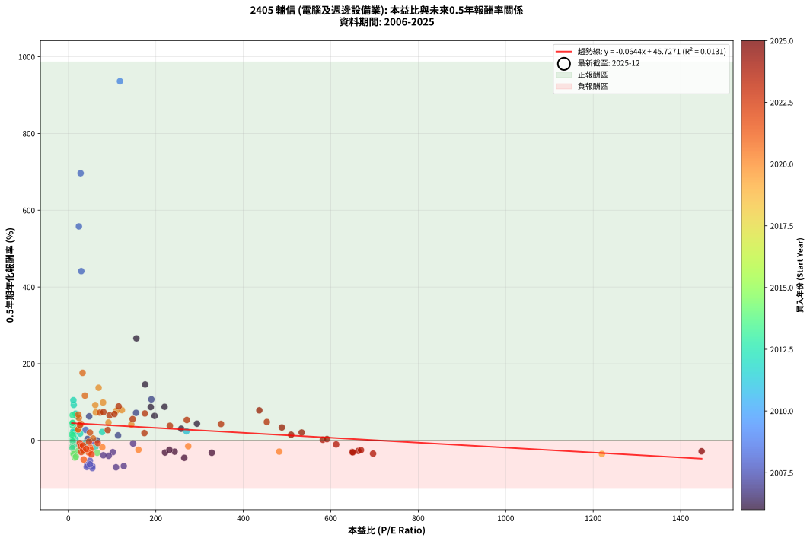
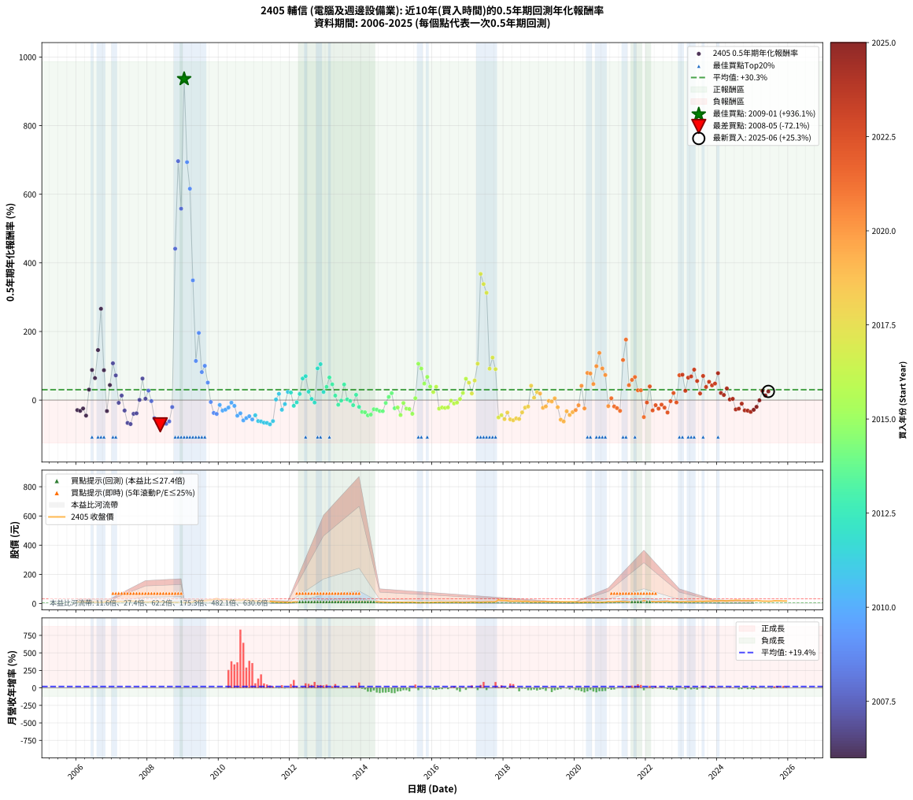

# 2405 輔信 - 本益比與未來報酬率分析

!!! info "報告資訊"
    - **股票代號**: 2405
    - **公司名稱**: 輔信
    - **產業別**: 電腦及週邊設備業
    - **分析期間**: 2006-2025 (234 個數據點)
    - **資料來源**: Type 12 (ShowMonthlyK_ChartFlow) 月收盤價與本益比
    - **報酬率口徑**: 含現金股利 (簡化: 年度合計，假設每年7/1入帳)
    - **報告生成時間**: 2026-01-22 22:45:06 CST

## 📈 視覺化圖表

### 圖表1: 本益比 vs 未來報酬率關係

*圖表1：2405 輔信 本益比與0.5年期未來報酬率關係 (2006-2025)*

### 圖表2: 歷年買入時點的0.5年期實際報酬率

*圖表2：2405 輔信 歷年買入時點的0.5年期實際報酬率 (2006-2025)*

## 📍 買點訊號說明

本報告提供兩種買點提示訊號（顯示於圖表2的股價子圖中）：

### ▲ 小綠色三角形（回測驗證）
- **計算方式**: 使用全部歷史資料計算本益比第25百分位數
- **用途**: 事後驗證，顯示歷史上哪些時點確實為低估區
- **限制**: 當下無法判斷，僅供回測參考
- **特性**: 後見之明（Look-Ahead Bias）

### ▲ 小橘色三角形（即時訊號）
- **計算方式**: 使用截至當月的過去5年資料計算本益比第25百分位數
- **用途**: 實際投資決策，當時即可判斷
- **優勢**: 可操作性強，符合實務需求
- **特性**: 無後見之明，滾動窗口計算

!!! tip "如何使用兩種訊號"
    - **綠色▲** 幫助理解歷史估值機會，驗證策略有效性
    - **橘色▲** 可作為實際買進參考，但仍需搭配基本面分析
    - 兩種訊號重疊時，表示即時判斷與事後驗證一致，信心度較高
    - 僅有綠色▲時，表示當時無法判斷（需要未來資料才能確認）
    - 僅有橘色▲時，表示即時判斷為買點，但事後可能不是最佳時機

## 📊 估值分析摘要

| 指標 | 數值 |
|:---:|:---:|
| **目前本益比** (2025-06) | **nan 倍** |
| **歷史平均本益比** | 154.72 倍 |
| **估值水準** | 🟡 合理範圍 |
| **預期0.5年年化報酬率** | **+nan%** |
| **歷史平均報酬率** | +30.26% |
| **相關係數 (R²)** | 0.0131 |
| **趨勢線斜率** | -0.0644 |

!!! abstract "核心洞察"
    目前本益比接近歷史平均，預期報酬率符合長期趨勢

    根據歷史數據回測，2405 輔信 在目前本益比 **nan倍** 的估值水準下，
    預期未來0.5年年化報酬率約為 **+nan%**。

    **重要提醒**: 本分析基於歷史數據統計，實際報酬率會受到公司基本面變化、產業趨勢、
    總體經濟環境等多重因素影響。R² = 0.01 表示本益比可解釋約 1.3% 的報酬率變異。

## 📈 歷史估值統計

### 最佳買點 (最高報酬率)

| 項目 | 數值 |
|:---:|:---:|
| 起始時間 | 2009-01 |
| 當時本益比 | 117.90 倍 |
| 起始價格 | 6.1 元 |
| 0.5年後價格 | 19.4 元 |
| **0.5年年化報酬率** | **+936.11%** |

### 最差買點 (最低報酬率)

| 項目 | 數值 |
|:---:|:---:|
| 起始時間 | 2008-05 |
| 當時本益比 | 54.77 倍 |
| 起始價格 | 14.2 元 |
| 0.5年後價格 | 6.5 元 |
| **0.5年年化報酬率** | **-72.08%** |

## 🎯 投資啟示

### 本益比與報酬率關係

趨勢線方程式: **y = -0.0644x + 45.7271**

!!! note "負相關"
    本益比與未來報酬率呈現負相關。較低的本益比通常帶來較高的未來報酬率，
    但相關性不算非常強。**估值仍是重要參考指標之一**。

### 估值區間建議

基於歷史數據分析:

- **🟢 低估區** (P/E < 123.8): 預期報酬率較高，可考慮增加持股
- **🟡 合理區** (P/E 123.8-185.7): 預期報酬率符合長期趨勢，正常持有
- **🔴 高估區** (P/E > 185.7): 預期報酬率較低，可考慮減碼或觀望

!!! danger "風險提示"
    - 過去表現不代表未來結果
    - 本分析假設公司基本面無重大結構性變化
    - 產業環境劇變可能使歷史規律失效
    - 應結合公司財報、產業趨勢、總體經濟等多重因素綜合判斷

!!! success "長期投資觀點"
    歷史數據顯示，在合理或低估的估值水準買入並長期持有，
    往往能獲得較佳的投資報酬。**耐心等待好價格**是價值投資的核心原則。

## 📊 數據品質

- **資料來源**: GoodInfo.tw Type 12 (ShowMonthlyK_ChartFlow)
- **資料頻率**: 月度收盤價與本益比
- **回測期間**: 2006-2025
- **數據點數量**: 234 個 (每個點代表一次0.5年期回測)

### 計算方法說明

1. **0.5年期年化報酬率**:
   - 對每個歷史時點，計算其後0.5年的實際投資報酬率
   - 期末價值(不含股利): 期末價格
   - 期末價值(含現金股利): 期末價格 + 持有期間內的現金股利合計 (簡化: 年度合計，假設每年7/1入帳)
   - 公式: 年化報酬率 = [(期末價值/期初價格)^(1/年數) - 1] × 100%

2. **本益比 (P/E Ratio)**:
   - 使用當時的月收盤價與EPS計算
   - 資料來源: Type 12 月度河流圖本益比數據

3. **趨勢線 (Linear Regression)**:
   - 使用最小平方法擬合線性趨勢線
   - R²值衡量本益比對報酬率的解釋能力

---

*本報告由 Stock Analysis System v1.9.0 自動生成*
*數據更新時間: 2026-01-22 22:45:06 CST*

## 📋 月度回測明細表

（每一列對應時間線圖中的一個買入點；可用來對照 SVG 圖上的每個點。）

| 買入月份 | 賣出月份 | 回測期限_年 | 實際持有年數 | 買入本益比_倍 | 買入收盤價_元 | 賣出收盤價_元 | 現金股利合計_元 | 總報酬率_pct | 年化報酬率_pct |
| --- | --- | --- | --- | --- | --- | --- | --- | --- | --- |
| 2006-01 | 2006-07 | 0.5 | 0.496 | 243.00 | 12.15 | 9.86 | 0.38 | -15.72 | -29.19 |
| 2006-02 | 2006-08 | 0.5 | 0.498 | 221.00 | 11.05 | 8.78 | 0.38 | -17.10 | -31.37 |
| 2006-03 | 2006-10 | 0.5 | 0.586 | 231.00 | 11.55 | 9.42 | 0.38 | -15.15 | -24.45 |
| 2006-04 | 2006-10 | 0.5 | 0.501 | 265.00 | 13.25 | 9.42 | 0.38 | -26.04 | -45.23 |
| 2006-05 | 2006-12 | 0.5 | 0.586 | 258.00 | 12.90 | 14.70 | 0.38 | +16.90 | +30.54 |
| 2006-06 | 2006-12 | 0.5 | 0.501 | 220.00 | 11.00 | 14.70 | 0.38 | +37.09 | +87.70 |
| 2006-07 | 2007-01 | 0.5 | 0.504 | 197.20 | 9.86 | 12.65 | 0.00 | +28.30 | +63.99 |
| 2006-08 | 2007-03 | 0.5 | 0.580 | 175.60 | 8.78 | 14.80 | 0.00 | +68.56 | +145.86 |
| 2006-09 | 2007-03 | 0.5 | 0.496 | 155.60 | 7.78 | 14.80 | 0.00 | +90.23 | +266.08 |
| 2006-10 | 2007-05 | 0.5 | 0.580 | 188.40 | 9.42 | 13.55 | 0.00 | +43.84 | +87.08 |
| 2006-11 | 2007-05 | 0.5 | 0.496 | 328.00 | 16.40 | 13.55 | 0.00 | -17.38 | -31.97 |
| 2006-12 | 2007-07 | 0.5 | 0.580 | 294.00 | 14.70 | 18.15 | 0.00 | +23.47 | +43.80 |
| 2007-01 | 2007-07 | 0.5 | 0.496 | 189.80 | 12.65 | 18.15 | 0.00 | +43.48 | +107.20 |
| 2007-02 | 2007-08 | 0.5 | 0.498 | 154.80 | 12.90 | 16.90 | 0.00 | +31.01 | +71.95 |
| 2007-03 | 2007-10 | 0.5 | 0.586 | 148.00 | 14.80 | 14.10 | 0.00 | -4.73 | -7.94 |
| 2007-04 | 2007-10 | 0.5 | 0.501 | 113.60 | 13.25 | 14.10 | 0.00 | +6.42 | +13.21 |
| 2007-05 | 2007-12 | 0.5 | 0.586 | 101.60 | 13.55 | 10.95 | 0.00 | -19.19 | -30.48 |
| 2007-06 | 2007-12 | 0.5 | 0.501 | 126.70 | 19.00 | 10.95 | 0.00 | -42.37 | -66.71 |
| 2007-07 | 2008-01 | 0.5 | 0.504 | 108.90 | 18.15 | 9.92 | 0.00 | -45.34 | -69.86 |
| 2007-08 | 2008-03 | 0.5 | 0.583 | 92.18 | 16.90 | 12.55 | 0.00 | -25.74 | -39.97 |
| 2007-09 | 2008-03 | 0.5 | 0.498 | 80.00 | 16.00 | 12.55 | 0.00 | -21.56 | -38.58 |
| 2007-10 | 2008-05 | 0.5 | 0.583 | 65.08 | 14.10 | 14.15 | 0.00 | +0.35 | +0.61 |
| 2007-11 | 2008-05 | 0.5 | 0.498 | 47.57 | 11.10 | 14.15 | 0.00 | +27.48 | +62.78 |
| 2007-12 | 2008-07 | 0.5 | 0.583 | 43.80 | 10.95 | 11.00 | 0.20 | +2.28 | +3.95 |
| 2008-01 | 2008-07 | 0.5 | 0.498 | 39.42 | 9.92 | 11.00 | 0.20 | +12.90 | +27.58 |
| 2008-02 | 2008-08 | 0.5 | 0.501 | 52.89 | 13.40 | 13.00 | 0.20 | -1.49 | -2.96 |
| 2008-03 | 2008-10 | 0.5 | 0.586 | 49.22 | 12.55 | 7.88 | 0.20 | -35.62 | -52.84 |
| 2008-04 | 2008-10 | 0.5 | 0.501 | 54.94 | 14.10 | 7.88 | 0.20 | -42.70 | -67.09 |
| 2008-05 | 2008-12 | 0.5 | 0.586 | 54.77 | 14.15 | 6.50 | 0.20 | -52.65 | -72.08 |
| 2008-06 | 2008-12 | 0.5 | 0.501 | 42.88 | 11.15 | 6.50 | 0.20 | -39.91 | -63.82 |
| 2008-07 | 2009-01 | 0.5 | 0.504 | 42.04 | 11.00 | 6.09 | 0.00 | -44.64 | -69.08 |
| 2008-08 | 2009-03 | 0.5 | 0.580 | 49.37 | 13.00 | 7.40 | 0.00 | -43.08 | -62.12 |
| 2008-09 | 2009-03 | 0.5 | 0.496 | 31.25 | 8.28 | 7.40 | 0.00 | -10.63 | -20.29 |
| 2008-10 | 2009-05 | 0.5 | 0.580 | 29.55 | 7.88 | 21.00 | 0.00 | +166.50 | +441.27 |
| 2008-11 | 2009-05 | 0.5 | 0.496 | 27.99 | 7.51 | 21.00 | 0.00 | +179.63 | +696.48 |
| 2008-12 | 2009-07 | 0.5 | 0.580 | 24.07 | 6.50 | 19.40 | 0.00 | +198.46 | +557.92 |
| 2009-01 | 2009-07 | 0.5 | 0.496 | 117.90 | 6.09 | 19.40 | 0.00 | +218.56 | +936.11 |
| 2009-02 | 2009-08 | 0.5 | 0.498 |  | 6.84 | 19.20 | 0.00 | +180.70 | +693.54 |
| 2009-03 | 2009-10 | 0.5 | 0.586 |  | 7.40 | 23.45 | 0.00 | +216.89 | +616.05 |
| 2009-04 | 2009-10 | 0.5 | 0.501 |  | 11.05 | 23.45 | 0.00 | +112.22 | +348.97 |
| 2009-05 | 2009-12 | 0.5 | 0.586 |  | 21.00 | 32.80 | 0.00 | +56.19 | +114.05 |
| 2009-06 | 2009-12 | 0.5 | 0.501 |  | 19.05 | 32.80 | 0.00 | +72.18 | +195.79 |
| 2009-07 | 2010-01 | 0.5 | 0.504 |  | 19.40 | 26.20 | 0.00 | +35.05 | +81.57 |
| 2009-08 | 2010-03 | 0.5 | 0.580 |  | 19.20 | 28.70 | 0.00 | +49.48 | +99.89 |
| 2009-09 | 2010-03 | 0.5 | 0.496 |  | 23.40 | 28.70 | 0.00 | +22.65 | +50.98 |
| 2009-10 | 2010-05 | 0.5 | 0.580 |  | 23.45 | 22.70 | 0.00 | -3.20 | -5.45 |
| 2009-11 | 2010-05 | 0.5 | 0.496 |  | 28.65 | 22.70 | 0.00 | -20.77 | -37.48 |
| 2009-12 | 2010-07 | 0.5 | 0.580 |  | 32.80 | 24.30 | 0.00 | -25.91 | -40.36 |
| 2010-01 | 2010-07 | 0.5 | 0.496 |  | 26.20 | 24.30 | 0.00 | -7.25 | -14.09 |
| 2010-02 | 2010-08 | 0.5 | 0.498 |  | 27.35 | 22.80 | 0.00 | -16.64 | -30.59 |
| 2010-03 | 2010-10 | 0.5 | 0.586 |  | 28.70 | 23.70 | 0.00 | -17.42 | -27.87 |
| 2010-04 | 2010-10 | 0.5 | 0.501 |  | 26.80 | 23.70 | 0.00 | -11.57 | -21.76 |
| 2010-05 | 2010-12 | 0.5 | 0.586 |  | 22.70 | 21.70 | 0.00 | -4.41 | -7.40 |
| 2010-06 | 2010-12 | 0.5 | 0.501 |  | 23.80 | 21.70 | 0.00 | -8.82 | -16.84 |
| 2010-07 | 2011-01 | 0.5 | 0.504 |  | 24.30 | 17.90 | 0.00 | -26.34 | -45.49 |
| 2010-08 | 2011-03 | 0.5 | 0.580 |  | 22.80 | 17.20 | 0.00 | -24.56 | -38.47 |
| 2010-09 | 2011-03 | 0.5 | 0.496 |  | 26.80 | 17.20 | 0.00 | -35.82 | -59.14 |
| 2010-10 | 2011-05 | 0.5 | 0.580 |  | 23.70 | 15.40 | 0.00 | -35.02 | -52.42 |
| 2010-11 | 2011-05 | 0.5 | 0.496 |  | 21.10 | 15.40 | 0.00 | -27.01 | -47.03 |
| 2010-12 | 2011-07 | 0.5 | 0.580 |  | 21.70 | 13.40 | 0.00 | -38.25 | -56.42 |
| 2011-01 | 2011-07 | 0.5 | 0.496 |  | 17.90 | 13.40 | 0.00 | -25.14 | -44.25 |
| 2011-02 | 2011-08 | 0.5 | 0.498 |  | 16.40 | 10.25 | 0.00 | -37.50 | -61.06 |
| 2011-03 | 2011-10 | 0.5 | 0.586 |  | 17.20 | 9.70 | 0.00 | -43.60 | -62.38 |
| 2011-04 | 2011-10 | 0.5 | 0.501 |  | 16.60 | 9.70 | 0.00 | -41.57 | -65.78 |
| 2011-05 | 2011-12 | 0.5 | 0.586 |  | 15.40 | 8.10 | 0.00 | -47.40 | -66.60 |
| 2011-06 | 2011-12 | 0.5 | 0.501 |  | 14.95 | 8.10 | 0.00 | -45.82 | -70.57 |
| 2011-07 | 2012-01 | 0.5 | 0.504 |  | 13.40 | 8.31 | 0.00 | -37.99 | -61.27 |
| 2011-08 | 2012-03 | 0.5 | 0.583 |  | 10.25 | 10.35 | 0.00 | +0.98 | +1.68 |
| 2011-09 | 2012-03 | 0.5 | 0.498 |  | 9.52 | 10.35 | 0.00 | +8.72 | +18.26 |
| 2011-10 | 2012-05 | 0.5 | 0.583 |  | 9.70 | 8.00 | 0.00 | -17.53 | -28.14 |
| 2011-11 | 2012-05 | 0.5 | 0.498 |  | 8.51 | 8.00 | 0.00 | -5.99 | -11.66 |
| 2011-12 | 2012-07 | 0.5 | 0.583 | 270.00 | 8.10 | 9.18 | 0.00 | +13.33 | +23.94 |
| 2012-01 | 2012-07 | 0.5 | 0.498 | 77.30 | 8.31 | 9.18 | 0.00 | +10.47 | +22.12 |
| 2012-02 | 2012-08 | 0.5 | 0.501 | 62.16 | 11.50 | 10.50 | 0.00 | -8.70 | -16.60 |
| 2012-03 | 2012-10 | 0.5 | 0.586 | 39.43 | 10.35 | 9.95 | 0.00 | -3.86 | -6.51 |
| 2012-04 | 2012-10 | 0.5 | 0.501 | 26.94 | 9.16 | 9.95 | 0.00 | +8.62 | +17.95 |
| 2012-05 | 2012-12 | 0.5 | 0.586 | 19.16 | 8.00 | 10.65 | 0.00 | +33.13 | +62.96 |
| 2012-06 | 2012-12 | 0.5 | 0.501 | 16.51 | 8.17 | 10.65 | 0.00 | +30.35 | +69.74 |
| 2012-07 | 2013-01 | 0.5 | 0.504 | 16.03 | 9.18 | 10.25 | 0.00 | +11.66 | +24.46 |
| 2012-08 | 2013-03 | 0.5 | 0.580 | 16.15 | 10.50 | 10.70 | 0.00 | +1.90 | +3.30 |
| 2012-09 | 2013-03 | 0.5 | 0.496 | 15.26 | 11.10 | 10.70 | 0.00 | -3.60 | -7.14 |
| 2012-10 | 2013-05 | 0.5 | 0.580 | 12.36 | 9.95 | 14.55 | 0.00 | +46.23 | +92.46 |
| 2012-11 | 2013-05 | 0.5 | 0.496 | 11.56 | 10.20 | 14.55 | 0.00 | +42.65 | +104.78 |
| 2012-12 | 2013-07 | 0.5 | 0.580 | 11.09 | 10.65 | 11.55 | 0.50 | +13.15 | +23.71 |
| 2013-01 | 2013-07 | 0.5 | 0.496 | 10.30 | 10.25 | 11.55 | 0.50 | +17.56 | +38.61 |
| 2013-02 | 2013-08 | 0.5 | 0.498 | 9.81 | 10.10 | 12.50 | 0.50 | +28.71 | +65.96 |
| 2013-03 | 2013-10 | 0.5 | 0.586 | 10.05 | 10.70 | 12.85 | 0.50 | +24.77 | +45.89 |
| 2013-04 | 2013-10 | 0.5 | 0.501 | 11.41 | 12.55 | 12.85 | 0.50 | +6.37 | +13.13 |
| 2013-05 | 2013-12 | 0.5 | 0.586 | 12.82 | 14.55 | 12.85 | 0.50 | -8.25 | -13.66 |
| 2013-06 | 2013-12 | 0.5 | 0.501 | 11.50 | 13.45 | 12.85 | 0.50 | -0.74 | -1.48 |
| 2013-07 | 2014-01 | 0.5 | 0.504 | 9.59 | 11.55 | 13.95 | 0.00 | +20.78 | +45.47 |
| 2013-08 | 2014-03 | 0.5 | 0.580 | 10.08 | 12.50 | 12.65 | 0.00 | +1.20 | +2.08 |
| 2013-09 | 2014-03 | 0.5 | 0.496 | 10.04 | 12.80 | 12.65 | 0.00 | -1.17 | -2.35 |
| 2013-10 | 2014-05 | 0.5 | 0.580 | 9.81 | 12.85 | 11.70 | 0.00 | -8.95 | -14.92 |
| 2013-11 | 2014-05 | 0.5 | 0.496 | 8.10 | 10.90 | 11.70 | 0.00 | +7.34 | +15.36 |
| 2013-12 | 2014-07 | 0.5 | 0.580 | 9.31 | 12.85 | 10.60 | 0.70 | -12.06 | -19.87 |
| 2014-01 | 2014-07 | 0.5 | 0.496 | 11.57 | 13.95 | 10.60 | 0.70 | -19.00 | -34.63 |
| 2014-02 | 2014-08 | 0.5 | 0.498 | 12.79 | 13.20 | 9.91 | 0.70 | -19.62 | -35.49 |
| 2014-03 | 2014-10 | 0.5 | 0.586 | 14.75 | 12.65 | 8.26 | 0.70 | -29.17 | -44.49 |
| 2014-04 | 2014-10 | 0.5 | 0.501 | 17.27 | 11.80 | 8.26 | 0.70 | -24.07 | -42.28 |
| 2014-05 | 2014-12 | 0.5 | 0.586 | 22.98 | 11.70 | 9.06 | 0.70 | -16.58 | -26.61 |
| 2014-06 | 2014-12 | 0.5 | 0.501 | 34.33 | 11.50 | 9.06 | 0.70 | -15.13 | -27.92 |
| 2014-07 | 2015-01 | 0.5 | 0.504 | 65.91 | 10.60 | 8.73 | 0.00 | -17.64 | -31.97 |
| 2014-08 | 2015-03 | 0.5 | 0.580 |  | 9.91 | 7.90 | 0.00 | -20.28 | -32.33 |
| 2014-09 | 2015-03 | 0.5 | 0.496 |  | 8.25 | 7.90 | 0.00 | -4.24 | -8.38 |
| 2014-10 | 2015-05 | 0.5 | 0.580 |  | 8.26 | 8.69 | 0.00 | +5.21 | +9.14 |
| 2014-11 | 2015-05 | 0.5 | 0.496 |  | 7.93 | 8.69 | 0.00 | +9.58 | +20.28 |
| 2014-12 | 2015-07 | 0.5 | 0.580 |  | 9.06 | 7.74 | 0.00 | -14.57 | -23.76 |
| 2015-01 | 2015-07 | 0.5 | 0.496 |  | 8.73 | 7.74 | 0.00 | -11.34 | -21.56 |
| 2015-02 | 2015-08 | 0.5 | 0.498 |  | 8.38 | 6.30 | 0.00 | -24.82 | -43.59 |
| 2015-03 | 2015-10 | 0.5 | 0.586 |  | 7.90 | 7.50 | 0.00 | -5.06 | -8.49 |
| 2015-04 | 2015-10 | 0.5 | 0.501 |  | 8.65 | 7.50 | 0.00 | -13.29 | -24.78 |
| 2015-05 | 2015-12 | 0.5 | 0.586 |  | 8.69 | 7.28 | 0.00 | -16.23 | -26.08 |
| 2015-06 | 2015-12 | 0.5 | 0.501 |  | 9.40 | 7.28 | 0.00 | -22.55 | -39.96 |
| 2015-07 | 2016-01 | 0.5 | 0.504 |  | 7.74 | 7.95 | 0.00 | +2.71 | +5.46 |
| 2015-08 | 2016-03 | 0.5 | 0.583 |  | 6.30 | 9.60 | 0.00 | +52.38 | +105.91 |
| 2015-09 | 2016-03 | 0.5 | 0.498 |  | 6.94 | 9.60 | 0.00 | +38.33 | +91.77 |
| 2015-10 | 2016-05 | 0.5 | 0.583 |  | 7.50 | 9.43 | 0.00 | +25.73 | +48.09 |
| 2015-11 | 2016-05 | 0.5 | 0.498 |  | 7.29 | 9.43 | 0.00 | +29.36 | +67.62 |
| 2015-12 | 2016-07 | 0.5 | 0.583 |  | 7.28 | 8.83 | 0.00 | +21.29 | +39.24 |
| 2016-01 | 2016-07 | 0.5 | 0.498 |  | 7.95 | 8.83 | 0.00 | +11.07 | +23.45 |
| 2016-02 | 2016-08 | 0.5 | 0.501 |  | 8.42 | 9.92 | 0.00 | +17.81 | +38.71 |
| 2016-03 | 2016-10 | 0.5 | 0.586 |  | 9.60 | 8.12 | 0.00 | -15.42 | -24.86 |
| 2016-04 | 2016-10 | 0.5 | 0.501 |  | 9.17 | 8.12 | 0.00 | -11.45 | -21.55 |
| 2016-05 | 2016-12 | 0.5 | 0.586 |  | 9.43 | 8.10 | 0.00 | -14.10 | -22.86 |
| 2016-06 | 2016-12 | 0.5 | 0.501 |  | 9.13 | 8.10 | 0.00 | -11.28 | -21.25 |
| 2016-07 | 2017-01 | 0.5 | 0.504 |  | 8.83 | 8.75 | 0.00 | -0.91 | -1.79 |
| 2016-08 | 2017-03 | 0.5 | 0.580 |  | 9.92 | 9.34 | 0.00 | -5.85 | -9.86 |
| 2016-09 | 2017-03 | 0.5 | 0.496 |  | 9.70 | 9.34 | 0.00 | -3.71 | -7.35 |
| 2016-10 | 2017-05 | 0.5 | 0.580 |  | 8.12 | 8.27 | 0.00 | +1.85 | +3.20 |
| 2016-11 | 2017-05 | 0.5 | 0.496 |  | 7.53 | 8.27 | 0.00 | +9.83 | +20.82 |
| 2016-12 | 2017-07 | 0.5 | 0.580 |  | 8.10 | 10.60 | 0.12 | +32.35 | +62.07 |
| 2017-01 | 2017-07 | 0.5 | 0.496 |  | 8.75 | 10.60 | 0.12 | +22.51 | +50.65 |
| 2017-02 | 2017-08 | 0.5 | 0.498 |  | 10.50 | 11.35 | 0.12 | +9.24 | +19.40 |
| 2017-03 | 2017-10 | 0.5 | 0.586 |  | 9.34 | 12.05 | 0.12 | +30.30 | +57.10 |
| 2017-04 | 2017-10 | 0.5 | 0.501 |  | 8.47 | 12.05 | 0.12 | +43.68 | +106.14 |
| 2017-05 | 2017-12 | 0.5 | 0.586 |  | 8.27 | 20.30 | 0.12 | +146.92 | +367.73 |
| 2017-06 | 2017-12 | 0.5 | 0.501 |  | 9.74 | 20.30 | 0.12 | +109.65 | +338.20 |
| 2017-07 | 2018-01 | 0.5 | 0.504 |  | 10.60 | 21.65 | 0.00 | +104.25 | +312.73 |
| 2017-08 | 2018-03 | 0.5 | 0.580 |  | 11.35 | 16.55 | 0.00 | +45.81 | +91.52 |
| 2017-09 | 2018-03 | 0.5 | 0.496 |  | 11.10 | 16.55 | 0.00 | +49.10 | +123.91 |
| 2017-10 | 2018-05 | 0.5 | 0.580 |  | 12.05 | 17.50 | 0.00 | +45.23 | +90.19 |
| 2017-11 | 2018-05 | 0.5 | 0.496 |  | 24.80 | 17.50 | 0.00 | -29.44 | -50.52 |
| 2017-12 | 2018-07 | 0.5 | 0.580 |  | 20.30 | 14.50 | 0.00 | -28.57 | -43.99 |
| 2018-01 | 2018-07 | 0.5 | 0.496 |  | 21.65 | 14.50 | 0.00 | -33.03 | -55.47 |
| 2018-02 | 2018-08 | 0.5 | 0.498 |  | 19.20 | 15.35 | 0.00 | -20.05 | -36.18 |
| 2018-03 | 2018-10 | 0.5 | 0.586 |  | 16.55 | 10.20 | 0.00 | -38.37 | -56.22 |
| 2018-04 | 2018-10 | 0.5 | 0.501 |  | 15.90 | 10.20 | 0.00 | -35.85 | -58.77 |
| 2018-05 | 2018-12 | 0.5 | 0.586 |  | 17.50 | 11.20 | 0.00 | -36.00 | -53.31 |
| 2018-06 | 2018-12 | 0.5 | 0.501 |  | 16.75 | 11.20 | 0.00 | -33.13 | -55.22 |
| 2018-07 | 2019-01 | 0.5 | 0.504 |  | 14.50 | 11.60 | 0.00 | -20.00 | -35.79 |
| 2018-08 | 2019-03 | 0.5 | 0.580 |  | 15.35 | 13.30 | 0.00 | -13.36 | -21.88 |
| 2018-09 | 2019-03 | 0.5 | 0.496 |  | 14.75 | 13.30 | 0.00 | -9.83 | -18.85 |
| 2018-10 | 2019-05 | 0.5 | 0.580 |  | 10.20 | 12.50 | 0.00 | +22.55 | +41.95 |
| 2018-11 | 2019-05 | 0.5 | 0.496 |  | 12.10 | 12.50 | 0.00 | +3.31 | +6.78 |
| 2018-12 | 2019-07 | 0.5 | 0.580 |  | 11.20 | 12.65 | 0.00 | +12.95 | +23.34 |
| 2019-01 | 2019-07 | 0.5 | 0.496 |  | 11.60 | 12.65 | 0.00 | +9.05 | +19.11 |
| 2019-02 | 2019-08 | 0.5 | 0.498 |  | 13.40 | 11.80 | 0.00 | -11.94 | -22.52 |
| 2019-03 | 2019-10 | 0.5 | 0.586 |  | 13.30 | 11.80 | 0.00 | -11.28 | -18.47 |
| 2019-04 | 2019-10 | 0.5 | 0.501 |  | 11.95 | 11.80 | 0.00 | -1.26 | -2.49 |
| 2019-05 | 2019-12 | 0.5 | 0.586 |  | 12.50 | 12.20 | 0.00 | -2.40 | -4.06 |
| 2019-06 | 2019-12 | 0.5 | 0.501 |  | 11.90 | 12.20 | 0.00 | +2.52 | +5.09 |
| 2019-07 | 2020-01 | 0.5 | 0.504 |  | 12.65 | 11.25 | 0.00 | -11.07 | -20.77 |
| 2019-08 | 2020-03 | 0.5 | 0.583 |  | 11.80 | 7.20 | 0.00 | -38.98 | -57.14 |
| 2019-09 | 2020-03 | 0.5 | 0.498 |  | 11.70 | 7.20 | 0.00 | -38.46 | -62.26 |
| 2019-10 | 2020-05 | 0.5 | 0.583 |  | 11.80 | 9.38 | 0.00 | -20.51 | -32.54 |
| 2019-11 | 2020-05 | 0.5 | 0.498 |  | 12.45 | 9.38 | 0.00 | -24.66 | -43.35 |
| 2019-12 | 2020-07 | 0.5 | 0.583 | 1220.00 | 12.20 | 9.48 | 0.00 | -22.30 | -35.12 |
| 2020-01 | 2020-07 | 0.5 | 0.498 | 482.10 | 11.25 | 9.48 | 0.00 | -15.73 | -29.07 |
| 2020-02 | 2020-08 | 0.5 | 0.501 | 274.10 | 10.05 | 9.26 | 0.00 | -7.86 | -15.07 |
| 2020-03 | 2020-10 | 0.5 | 0.586 | 144.00 | 7.20 | 8.83 | 0.00 | +22.64 | +41.67 |
| 2020-04 | 2020-10 | 0.5 | 0.501 | 160.30 | 10.15 | 8.83 | 0.00 | -13.00 | -24.28 |
| 2020-05 | 2020-12 | 0.5 | 0.586 | 122.40 | 9.38 | 13.20 | 0.00 | +40.72 | +79.16 |
| 2020-06 | 2020-12 | 0.5 | 0.501 | 110.00 | 9.90 | 13.20 | 0.00 | +33.33 | +77.57 |
| 2020-07 | 2021-01 | 0.5 | 0.504 | 91.74 | 9.48 | 11.50 | 0.00 | +21.31 | +46.73 |
| 2020-08 | 2021-03 | 0.5 | 0.580 | 79.37 | 9.26 | 13.80 | 0.00 | +49.03 | +98.85 |
| 2020-09 | 2021-03 | 0.5 | 0.496 | 69.15 | 8.99 | 13.80 | 0.00 | +53.50 | +137.45 |
| 2020-10 | 2021-05 | 0.5 | 0.580 | 61.60 | 8.83 | 12.90 | 0.00 | +46.09 | +92.15 |
| 2020-11 | 2021-05 | 0.5 | 0.496 | 62.74 | 9.83 | 12.90 | 0.00 | +31.23 | +73.06 |
| 2020-12 | 2021-07 | 0.5 | 0.580 | 77.65 | 13.20 | 11.80 | 0.00 | -10.61 | -17.57 |
| 2021-01 | 2021-07 | 0.5 | 0.496 | 56.33 | 11.50 | 11.80 | 0.00 | +2.61 | +5.33 |
| 2021-02 | 2021-08 | 0.5 | 0.498 | 49.72 | 11.85 | 10.70 | 0.00 | -9.70 | -18.52 |
| 2021-03 | 2021-10 | 0.5 | 0.586 | 50.64 | 13.80 | 11.80 | 0.00 | -14.49 | -23.45 |
| 2021-04 | 2021-10 | 0.5 | 0.501 | 46.47 | 14.25 | 11.80 | 0.00 | -17.19 | -31.38 |
| 2021-05 | 2021-12 | 0.5 | 0.586 | 37.85 | 12.90 | 20.30 | 0.00 | +57.36 | +116.81 |
| 2021-06 | 2021-12 | 0.5 | 0.501 | 32.53 | 12.20 | 20.30 | 0.00 | +66.39 | +176.29 |
| 2021-07 | 2022-01 | 0.5 | 0.504 | 28.84 | 11.80 | 14.15 | 0.00 | +19.92 | +43.41 |
| 2021-08 | 2022-03 | 0.5 | 0.580 | 24.14 | 10.70 | 14.00 | 0.00 | +30.84 | +58.90 |
| 2021-09 | 2022-03 | 0.5 | 0.496 | 22.72 | 10.85 | 14.00 | 0.00 | +29.03 | +67.26 |
| 2021-10 | 2022-05 | 0.5 | 0.580 | 23.06 | 11.80 | 13.65 | 0.00 | +15.68 | +28.52 |
| 2021-11 | 2022-05 | 0.5 | 0.496 | 22.08 | 12.05 | 13.65 | 0.00 | +13.28 | +28.61 |
| 2021-12 | 2022-07 | 0.5 | 0.580 | 35.00 | 20.30 | 13.65 | 0.00 | -32.76 | -49.53 |
| 2022-01 | 2022-07 | 0.5 | 0.496 | 25.96 | 14.15 | 13.65 | 0.00 | -3.53 | -7.00 |
| 2022-02 | 2022-08 | 0.5 | 0.498 | 26.37 | 13.45 | 15.90 | 0.00 | +18.22 | +39.91 |
| 2022-03 | 2022-10 | 0.5 | 0.586 | 29.47 | 14.00 | 11.35 | 0.00 | -18.93 | -30.10 |
| 2022-04 | 2022-10 | 0.5 | 0.501 | 27.95 | 12.30 | 11.35 | 0.00 | -7.72 | -14.82 |
| 2022-05 | 2022-12 | 0.5 | 0.586 | 33.70 | 13.65 | 11.55 | 0.00 | -15.38 | -24.81 |
| 2022-06 | 2022-12 | 0.5 | 0.501 | 33.51 | 12.40 | 11.55 | 0.00 | -6.85 | -13.21 |
| 2022-07 | 2023-01 | 0.5 | 0.504 | 40.75 | 13.65 | 12.05 | 0.00 | -11.72 | -21.92 |
| 2022-08 | 2023-03 | 0.5 | 0.580 | 53.00 | 15.90 | 12.25 | 0.00 | -22.96 | -36.19 |
| 2022-09 | 2023-03 | 0.5 | 0.496 | 46.98 | 12.45 | 12.25 | 0.00 | -1.61 | -3.22 |
| 2022-10 | 2023-05 | 0.5 | 0.580 | 49.35 | 11.35 | 12.65 | 0.00 | +11.45 | +20.54 |
| 2022-11 | 2023-05 | 0.5 | 0.496 | 67.18 | 13.10 | 12.65 | 0.00 | -3.44 | -6.81 |
| 2022-12 | 2023-07 | 0.5 | 0.580 | 72.19 | 11.55 | 15.65 | 0.20 | +37.23 | +72.51 |
| 2023-01 | 2023-07 | 0.5 | 0.496 | 80.33 | 12.05 | 15.65 | 0.20 | +31.54 | +73.87 |
| 2023-02 | 2023-08 | 0.5 | 0.498 | 90.00 | 12.60 | 14.00 | 0.20 | +12.70 | +27.11 |
| 2023-03 | 2023-10 | 0.5 | 0.586 | 94.23 | 12.25 | 16.25 | 0.20 | +34.29 | +65.39 |
| 2023-04 | 2023-10 | 0.5 | 0.501 | 105.40 | 12.65 | 16.25 | 0.20 | +30.04 | +68.92 |
| 2023-05 | 2023-12 | 0.5 | 0.586 | 115.00 | 12.65 | 18.15 | 0.20 | +45.06 | +88.68 |
| 2023-06 | 2023-12 | 0.5 | 0.501 | 147.00 | 14.70 | 18.15 | 0.20 | +24.83 | +55.68 |
| 2023-07 | 2024-01 | 0.5 | 0.504 | 173.90 | 15.65 | 17.10 | 0.00 | +9.27 | +19.23 |
| 2023-08 | 2024-03 | 0.5 | 0.583 | 175.00 | 14.00 | 19.10 | 0.00 | +36.43 | +70.35 |
| 2023-09 | 2024-03 | 0.5 | 0.498 | 232.10 | 16.25 | 19.10 | 0.00 | +17.54 | +38.31 |
| 2023-10 | 2024-05 | 0.5 | 0.583 | 270.80 | 16.25 | 20.85 | 0.00 | +28.31 | +53.33 |
| 2023-11 | 2024-05 | 0.5 | 0.498 | 349.00 | 17.45 | 20.85 | 0.00 | +19.48 | +42.94 |
| 2023-12 | 2024-07 | 0.5 | 0.583 | 453.80 | 18.15 | 22.65 | 0.17 | +25.73 | +48.09 |
| 2024-01 | 2024-07 | 0.5 | 0.498 | 436.60 | 17.10 | 22.65 | 0.17 | +33.45 | +78.44 |
| 2024-02 | 2024-08 | 0.5 | 0.501 | 533.50 | 20.45 | 22.30 | 0.17 | +9.88 | +20.68 |
| 2024-03 | 2024-10 | 0.5 | 0.586 | 509.30 | 19.10 | 20.55 | 0.17 | +8.48 | +14.91 |
| 2024-04 | 2024-10 | 0.5 | 0.501 | 488.20 | 17.90 | 20.55 | 0.17 | +15.75 | +33.91 |
| 2024-05 | 2024-12 | 0.5 | 0.586 | 581.90 | 20.85 | 20.90 | 0.17 | +1.06 | +1.81 |
| 2024-06 | 2024-12 | 0.5 | 0.501 | 591.40 | 20.70 | 20.90 | 0.17 | +1.79 | +3.60 |
| 2024-07 | 2025-01 | 0.5 | 0.504 | 662.90 | 22.65 | 19.30 | 0.00 | -14.79 | -27.22 |
| 2024-08 | 2025-03 | 0.5 | 0.580 | 669.00 | 22.30 | 18.85 | 0.00 | -15.47 | -25.14 |
| 2024-09 | 2025-03 | 0.5 | 0.496 | 612.30 | 19.90 | 18.85 | 0.00 | -5.28 | -10.36 |
| 2024-10 | 2025-05 | 0.5 | 0.580 | 649.00 | 20.55 | 16.70 | 0.00 | -18.73 | -30.05 |
| 2024-11 | 2025-05 | 0.5 | 0.496 | 650.30 | 20.05 | 16.70 | 0.00 | -16.71 | -30.85 |
| 2024-12 | 2025-07 | 0.5 | 0.580 | 696.70 | 20.90 | 16.20 | 0.17 | -21.67 | -34.35 |
| 2025-01 | 2025-07 | 0.5 | 0.496 | 1448.00 | 19.30 | 16.20 | 0.17 | -15.18 | -28.27 |
| 2025-02 | 2025-08 | 0.5 | 0.498 |  | 21.60 | 19.20 | 0.17 | -10.32 | -19.64 |
| 2025-03 | 2025-10 | 0.5 | 0.586 |  | 18.85 | 18.60 | 0.17 | -0.42 | -0.72 |
| 2025-04 | 2025-10 | 0.5 | 0.501 |  | 16.65 | 18.60 | 0.17 | +12.73 | +27.02 |
| 2025-05 | 2025-12 | 0.5 | 0.586 |  | 16.70 | 17.80 | 0.17 | +7.60 | +13.33 |
| 2025-06 | 2025-12 | 0.5 | 0.501 |  | 16.05 | 17.80 | 0.17 | +11.96 | +25.30 |
