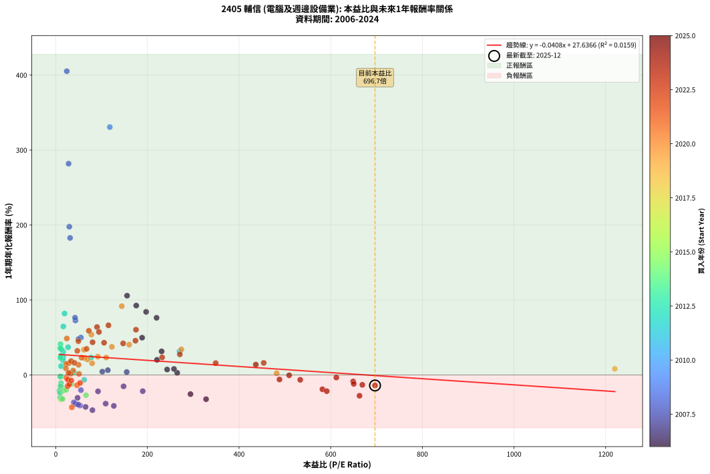
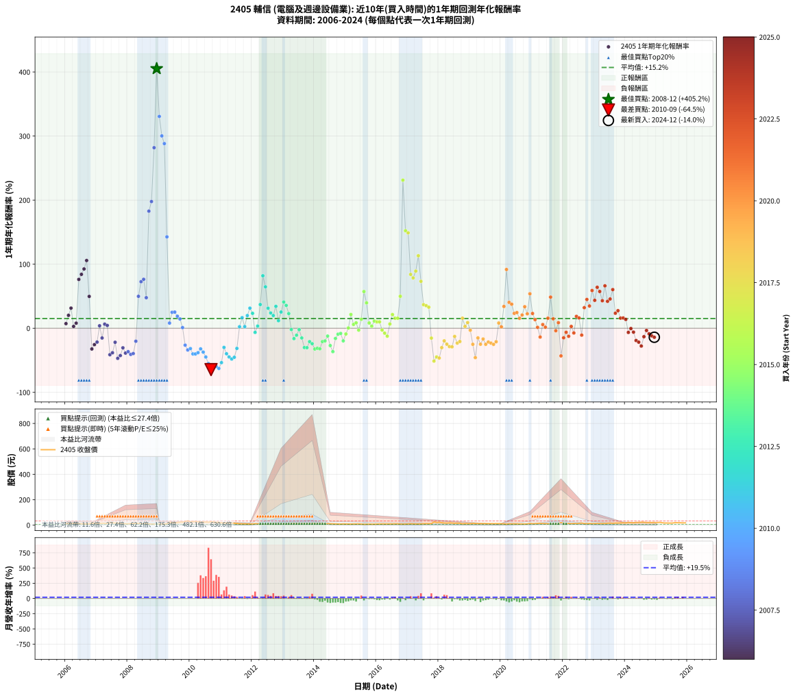

# 2405 輔信 - 本益比與未來報酬率分析

!!! info "報告資訊"
    - **股票代號**: 2405
    - **公司名稱**: 輔信
    - **產業別**: 電腦及週邊設備業
    - **分析期間**: 2006-2024 (228 個數據點)
    - **資料來源**: Type 12 (ShowMonthlyK_ChartFlow) 月收盤價與本益比
    - **報酬率口徑**: 含現金股利 (簡化: 年度合計，假設每年7/1入帳)
    - **報告生成時間**: 2026-01-11 18:35:55 CST

## 📈 視覺化圖表

### 圖表1: 本益比 vs 未來報酬率關係

*圖表1：2405 輔信 本益比與1年期未來報酬率關係 (2006-2024)*

### 圖表2: 歷年買入時點的1年期實際報酬率

*圖表2：2405 輔信 歷年買入時點的1年期實際報酬率 (2006-2024)*

## 📍 買點訊號說明

本報告提供兩種買點提示訊號（顯示於圖表2的股價子圖中）：

### ▲ 小綠色三角形（回測驗證）
- **計算方式**: 使用全部歷史資料計算本益比第25百分位數
- **用途**: 事後驗證，顯示歷史上哪些時點確實為低估區
- **限制**: 當下無法判斷，僅供回測參考
- **特性**: 後見之明（Look-Ahead Bias）

### ▲ 小橘色三角形（即時訊號）
- **計算方式**: 使用截至當月的過去5年資料計算本益比第25百分位數
- **用途**: 實際投資決策，當時即可判斷
- **優勢**: 可操作性強，符合實務需求
- **特性**: 無後見之明，滾動窗口計算

!!! tip "如何使用兩種訊號"
    - **綠色▲** 幫助理解歷史估值機會，驗證策略有效性
    - **橘色▲** 可作為實際買進參考，但仍需搭配基本面分析
    - 兩種訊號重疊時，表示即時判斷與事後驗證一致，信心度較高
    - 僅有綠色▲時，表示當時無法判斷（需要未來資料才能確認）
    - 僅有橘色▲時，表示即時判斷為買點，但事後可能不是最佳時機

## 📊 估值分析摘要

| 指標 | 數值 |
|:---:|:---:|
| **目前本益比** (2024-12) | **696.70 倍** |
| **歷史平均本益比** | 144.77 倍 |
| **估值水準** | 🔴 相對高估 |
| **預期1年年化報酬率** | **-0.81%** |
| **歷史平均報酬率** | +15.16% |
| **相關係數 (R²)** | 0.0159 |
| **趨勢線斜率** | -0.0408 |

!!! abstract "核心洞察"
    目前本益比顯著高於歷史平均，預期未來報酬率可能較低

    根據歷史數據回測，2405 輔信 在目前本益比 **696.7倍** 的估值水準下，
    預期未來1年年化報酬率約為 **-0.8%**。

    **重要提醒**: 本分析基於歷史數據統計，實際報酬率會受到公司基本面變化、產業趨勢、
    總體經濟環境等多重因素影響。R² = 0.02 表示本益比可解釋約 1.6% 的報酬率變異。

## 📈 歷史估值統計

### 最佳買點 (最高報酬率)

| 項目 | 數值 |
|:---:|:---:|
| 起始時間 | 2008-12 |
| 當時本益比 | 24.07 倍 |
| 起始價格 | 6.5 元 |
| 1年後價格 | 32.8 元 |
| **1年年化報酬率** | **+405.18%** |

### 最差買點 (最低報酬率)

| 項目 | 數值 |
|:---:|:---:|
| 起始時間 | 2010-09 |
| 當時本益比 | nan 倍 |
| 起始價格 | 26.8 元 |
| 1年後價格 | 9.5 元 |
| **1年年化報酬率** | **-64.50%** |

## 🎯 投資啟示

### 本益比與報酬率關係

趨勢線方程式: **y = -0.0408x + 27.6366**

!!! note "負相關"
    本益比與未來報酬率呈現負相關。較低的本益比通常帶來較高的未來報酬率，
    但相關性不算非常強。**估值仍是重要參考指標之一**。

### 估值區間建議

基於歷史數據分析:

- **🟢 低估區** (P/E < 115.8): 預期報酬率較高，可考慮增加持股
- **🟡 合理區** (P/E 115.8-173.7): 預期報酬率符合長期趨勢，正常持有
- **🔴 高估區** (P/E > 173.7): 預期報酬率較低，可考慮減碼或觀望

!!! danger "風險提示"
    - 過去表現不代表未來結果
    - 本分析假設公司基本面無重大結構性變化
    - 產業環境劇變可能使歷史規律失效
    - 應結合公司財報、產業趨勢、總體經濟等多重因素綜合判斷

!!! success "長期投資觀點"
    歷史數據顯示，在合理或低估的估值水準買入並長期持有，
    往往能獲得較佳的投資報酬。**耐心等待好價格**是價值投資的核心原則。

## 📊 數據品質

- **資料來源**: GoodInfo.tw Type 12 (ShowMonthlyK_ChartFlow)
- **資料頻率**: 月度收盤價與本益比
- **回測期間**: 2006-2024
- **數據點數量**: 228 個 (每個點代表一次1年期回測)

### 計算方法說明

1. **1年期年化報酬率**:
   - 對每個歷史時點，計算其後1年的實際投資報酬率
   - 期末價值(不含股利): 期末價格
   - 期末價值(含現金股利): 期末價格 + 持有期間內的現金股利合計 (簡化: 年度合計，假設每年7/1入帳)
   - 公式: 年化報酬率 = [(期末價值/期初價格)^(1/年數) - 1] × 100%

2. **本益比 (P/E Ratio)**:
   - 使用當時的月收盤價與EPS計算
   - 資料來源: Type 12 月度河流圖本益比數據

3. **趨勢線 (Linear Regression)**:
   - 使用最小平方法擬合線性趨勢線
   - R²值衡量本益比對報酬率的解釋能力

---

*本報告由 Stock Analysis System v1.9.0 自動生成*
*數據更新時間: 2026-01-11 18:35:55 CST*

## 📋 月度回測明細表

（每一列對應時間線圖中的一個買入點；可用來對照 SVG 圖上的每個點。）

| 買入月份 | 賣出月份 | 回測期限_年 | 實際持有年數 | 買入本益比_倍 | 買入收盤價_元 | 賣出收盤價_元 | 現金股利合計_元 | 總報酬率_pct | 年化報酬率_pct |
| --- | --- | --- | --- | --- | --- | --- | --- | --- | --- |
| 2006-01 | 2007-01 | 1 | 0.999 | 243.00 | 12.15 | 12.65 | 0.38 | +7.24 | +7.25 |
| 2006-02 | 2007-02 | 1 | 0.999 | 221.00 | 11.05 | 12.90 | 0.38 | +20.18 | +20.20 |
| 2006-03 | 2007-03 | 1 | 0.999 | 231.00 | 11.55 | 14.80 | 0.38 | +31.43 | +31.45 |
| 2006-04 | 2007-04 | 1 | 0.999 | 265.00 | 13.25 | 13.25 | 0.38 | +2.87 | +2.87 |
| 2006-05 | 2007-05 | 1 | 0.999 | 258.00 | 12.90 | 13.55 | 0.38 | +7.98 | +7.99 |
| 2006-06 | 2007-06 | 1 | 0.999 | 220.00 | 11.00 | 19.00 | 0.38 | +76.18 | +76.25 |
| 2006-07 | 2007-07 | 1 | 0.999 | 197.20 | 9.86 | 18.15 | 0.00 | +84.08 | +84.15 |
| 2006-08 | 2007-08 | 1 | 0.999 | 175.60 | 8.78 | 16.90 | 0.00 | +92.48 | +92.57 |
| 2006-09 | 2007-09 | 1 | 0.999 | 155.60 | 7.78 | 16.00 | 0.00 | +105.66 | +105.76 |
| 2006-10 | 2007-10 | 1 | 0.999 | 188.40 | 9.42 | 14.10 | 0.00 | +49.68 | +49.72 |
| 2006-11 | 2007-11 | 1 | 0.999 | 328.00 | 16.40 | 11.10 | 0.00 | -32.32 | -32.34 |
| 2006-12 | 2007-12 | 1 | 0.999 | 294.00 | 14.70 | 10.95 | 0.00 | -25.51 | -25.53 |
| 2007-01 | 2008-01 | 1 | 0.999 | 189.80 | 12.65 | 9.92 | 0.00 | -21.58 | -21.59 |
| 2007-02 | 2008-02 | 1 | 0.999 | 154.80 | 12.90 | 13.40 | 0.00 | +3.88 | +3.88 |
| 2007-03 | 2008-03 | 1 | 1.002 | 148.00 | 14.80 | 12.55 | 0.00 | -15.20 | -15.17 |
| 2007-04 | 2008-04 | 1 | 1.002 | 113.60 | 13.25 | 14.10 | 0.00 | +6.42 | +6.40 |
| 2007-05 | 2008-05 | 1 | 1.002 | 101.60 | 13.55 | 14.15 | 0.00 | +4.43 | +4.42 |
| 2007-06 | 2008-06 | 1 | 1.002 | 126.70 | 19.00 | 11.15 | 0.00 | -41.32 | -41.25 |
| 2007-07 | 2008-07 | 1 | 1.002 | 108.90 | 18.15 | 11.00 | 0.20 | -38.29 | -38.23 |
| 2007-08 | 2008-08 | 1 | 1.002 | 92.18 | 16.90 | 13.00 | 0.20 | -21.89 | -21.85 |
| 2007-09 | 2008-09 | 1 | 1.002 | 80.00 | 16.00 | 8.28 | 0.20 | -47.00 | -46.93 |
| 2007-10 | 2008-10 | 1 | 1.002 | 65.08 | 14.10 | 7.88 | 0.20 | -42.70 | -42.63 |
| 2007-11 | 2008-11 | 1 | 1.002 | 47.57 | 11.10 | 7.51 | 0.20 | -30.54 | -30.49 |
| 2007-12 | 2008-12 | 1 | 1.002 | 43.80 | 10.95 | 6.50 | 0.20 | -38.81 | -38.75 |
| 2008-01 | 2009-01 | 1 | 1.002 | 39.42 | 9.92 | 6.09 | 0.20 | -36.59 | -36.53 |
| 2008-02 | 2009-03 | 1 | 1.081 | 52.89 | 13.40 | 7.40 | 0.20 | -43.28 | -40.81 |
| 2008-03 | 2009-03 | 1 | 0.999 | 49.22 | 12.55 | 7.40 | 0.20 | -39.44 | -39.46 |
| 2008-04 | 2009-04 | 1 | 0.999 | 54.94 | 14.10 | 11.05 | 0.20 | -20.21 | -20.23 |
| 2008-05 | 2009-05 | 1 | 0.999 | 54.77 | 14.15 | 21.00 | 0.20 | +49.82 | +49.86 |
| 2008-06 | 2009-06 | 1 | 0.999 | 42.88 | 11.15 | 19.05 | 0.20 | +72.65 | +72.71 |
| 2008-07 | 2009-07 | 1 | 0.999 | 42.04 | 11.00 | 19.40 | 0.00 | +76.36 | +76.43 |
| 2008-08 | 2009-08 | 1 | 0.999 | 49.37 | 13.00 | 19.20 | 0.00 | +47.69 | +47.73 |
| 2008-09 | 2009-09 | 1 | 0.999 | 31.25 | 8.28 | 23.40 | 0.00 | +182.61 | +182.81 |
| 2008-10 | 2009-10 | 1 | 0.999 | 29.55 | 7.88 | 23.45 | 0.00 | +197.59 | +197.81 |
| 2008-11 | 2009-11 | 1 | 0.999 | 27.99 | 7.51 | 28.65 | 0.00 | +281.49 | +281.84 |
| 2008-12 | 2009-12 | 1 | 0.999 | 24.07 | 6.50 | 32.80 | 0.00 | +404.62 | +405.18 |
| 2009-01 | 2010-01 | 1 | 0.999 | 117.90 | 6.09 | 26.20 | 0.00 | +330.21 | +330.64 |
| 2009-02 | 2010-02 | 1 | 0.999 |  | 6.84 | 27.35 | 0.00 | +299.85 | +300.23 |
| 2009-03 | 2010-03 | 1 | 0.999 |  | 7.40 | 28.70 | 0.00 | +287.84 | +288.20 |
| 2009-04 | 2010-04 | 1 | 0.999 |  | 11.05 | 26.80 | 0.00 | +142.53 | +142.68 |
| 2009-05 | 2010-05 | 1 | 0.999 |  | 21.00 | 22.70 | 0.00 | +8.10 | +8.10 |
| 2009-06 | 2010-06 | 1 | 0.999 |  | 19.05 | 23.80 | 0.00 | +24.93 | +24.95 |
| 2009-07 | 2010-07 | 1 | 0.999 |  | 19.40 | 24.30 | 0.00 | +25.26 | +25.28 |
| 2009-08 | 2010-08 | 1 | 0.999 |  | 19.20 | 22.80 | 0.00 | +18.75 | +18.76 |
| 2009-09 | 2010-09 | 1 | 0.999 |  | 23.40 | 26.80 | 0.00 | +14.53 | +14.54 |
| 2009-10 | 2010-10 | 1 | 0.999 |  | 23.45 | 23.70 | 0.00 | +1.07 | +1.07 |
| 2009-11 | 2010-11 | 1 | 0.999 |  | 28.65 | 21.10 | 0.00 | -26.35 | -26.37 |
| 2009-12 | 2010-12 | 1 | 0.999 |  | 32.80 | 21.70 | 0.00 | -33.84 | -33.86 |
| 2010-01 | 2011-01 | 1 | 0.999 |  | 26.20 | 17.90 | 0.00 | -31.68 | -31.70 |
| 2010-02 | 2011-02 | 1 | 0.999 |  | 27.35 | 16.40 | 0.00 | -40.04 | -40.06 |
| 2010-03 | 2011-03 | 1 | 0.999 |  | 28.70 | 17.20 | 0.00 | -40.07 | -40.09 |
| 2010-04 | 2011-04 | 1 | 0.999 |  | 26.80 | 16.60 | 0.00 | -38.06 | -38.08 |
| 2010-05 | 2011-05 | 1 | 0.999 |  | 22.70 | 15.40 | 0.00 | -32.16 | -32.18 |
| 2010-06 | 2011-06 | 1 | 0.999 |  | 23.80 | 14.95 | 0.00 | -37.18 | -37.20 |
| 2010-07 | 2011-07 | 1 | 0.999 |  | 24.30 | 13.40 | 0.00 | -44.86 | -44.88 |
| 2010-08 | 2011-08 | 1 | 0.999 |  | 22.80 | 10.25 | 0.00 | -55.04 | -55.07 |
| 2010-09 | 2011-09 | 1 | 0.999 |  | 26.80 | 9.52 | 0.00 | -64.48 | -64.50 |
| 2010-10 | 2011-10 | 1 | 0.999 |  | 23.70 | 9.70 | 0.00 | -59.07 | -59.10 |
| 2010-11 | 2011-11 | 1 | 0.999 |  | 21.10 | 8.51 | 0.00 | -59.67 | -59.69 |
| 2010-12 | 2011-12 | 1 | 0.999 |  | 21.70 | 8.10 | 0.00 | -62.67 | -62.70 |
| 2011-01 | 2012-01 | 1 | 0.999 |  | 17.90 | 8.31 | 0.00 | -53.58 | -53.60 |
| 2011-02 | 2012-02 | 1 | 0.999 |  | 16.40 | 11.50 | 0.00 | -29.88 | -29.90 |
| 2011-03 | 2012-03 | 1 | 1.002 |  | 17.20 | 10.35 | 0.00 | -39.83 | -39.76 |
| 2011-04 | 2012-04 | 1 | 1.002 |  | 16.60 | 9.16 | 0.00 | -44.82 | -44.75 |
| 2011-05 | 2012-05 | 1 | 1.002 |  | 15.40 | 8.00 | 0.00 | -48.05 | -47.98 |
| 2011-06 | 2012-06 | 1 | 1.002 |  | 14.95 | 8.17 | 0.00 | -45.35 | -45.28 |
| 2011-07 | 2012-07 | 1 | 1.002 |  | 13.40 | 9.18 | 0.00 | -31.49 | -31.44 |
| 2011-08 | 2012-08 | 1 | 1.002 |  | 10.25 | 10.50 | 0.00 | +2.44 | +2.43 |
| 2011-09 | 2012-09 | 1 | 1.002 |  | 9.52 | 11.10 | 0.00 | +16.60 | +16.56 |
| 2011-10 | 2012-10 | 1 | 1.002 |  | 9.70 | 9.95 | 0.00 | +2.58 | +2.57 |
| 2011-11 | 2012-11 | 1 | 1.002 |  | 8.51 | 10.20 | 0.00 | +19.86 | +19.81 |
| 2011-12 | 2012-12 | 1 | 1.002 | 270.00 | 8.10 | 10.65 | 0.00 | +31.48 | +31.41 |
| 2012-01 | 2013-01 | 1 | 1.002 | 77.30 | 8.31 | 10.25 | 0.00 | +23.35 | +23.29 |
| 2012-02 | 2013-03 | 1 | 1.081 | 62.16 | 11.50 | 10.70 | 0.00 | -6.96 | -6.45 |
| 2012-03 | 2013-03 | 1 | 0.999 | 39.43 | 10.35 | 10.70 | 0.00 | +3.38 | +3.38 |
| 2012-04 | 2013-04 | 1 | 0.999 | 26.94 | 9.16 | 12.55 | 0.00 | +37.01 | +37.04 |
| 2012-05 | 2013-05 | 1 | 0.999 | 19.16 | 8.00 | 14.55 | 0.00 | +81.88 | +81.95 |
| 2012-06 | 2013-06 | 1 | 0.999 | 16.51 | 8.17 | 13.45 | 0.00 | +64.63 | +64.68 |
| 2012-07 | 2013-07 | 1 | 0.999 | 16.03 | 9.18 | 11.55 | 0.50 | +31.26 | +31.29 |
| 2012-08 | 2013-08 | 1 | 0.999 | 16.15 | 10.50 | 12.50 | 0.50 | +23.81 | +23.83 |
| 2012-09 | 2013-09 | 1 | 0.999 | 15.26 | 11.10 | 12.80 | 0.50 | +19.82 | +19.83 |
| 2012-10 | 2013-10 | 1 | 0.999 | 12.36 | 9.95 | 12.85 | 0.50 | +34.17 | +34.20 |
| 2012-11 | 2013-11 | 1 | 0.999 | 11.56 | 10.20 | 10.90 | 0.50 | +11.76 | +11.77 |
| 2012-12 | 2013-12 | 1 | 0.999 | 11.09 | 10.65 | 12.85 | 0.50 | +25.35 | +25.37 |
| 2013-01 | 2014-01 | 1 | 0.999 | 10.30 | 10.25 | 13.95 | 0.50 | +40.98 | +41.01 |
| 2013-02 | 2014-02 | 1 | 0.999 | 9.81 | 10.10 | 13.20 | 0.50 | +35.64 | +35.67 |
| 2013-03 | 2014-03 | 1 | 0.999 | 10.05 | 10.70 | 12.65 | 0.50 | +22.90 | +22.91 |
| 2013-04 | 2014-04 | 1 | 0.999 | 11.41 | 12.55 | 11.80 | 0.50 | -1.99 | -1.99 |
| 2013-05 | 2014-05 | 1 | 0.999 | 12.82 | 14.55 | 11.70 | 0.50 | -16.15 | -16.16 |
| 2013-06 | 2014-06 | 1 | 0.999 | 11.50 | 13.45 | 11.50 | 0.50 | -10.78 | -10.79 |
| 2013-07 | 2014-07 | 1 | 0.999 | 9.59 | 11.55 | 10.60 | 0.70 | -2.16 | -2.17 |
| 2013-08 | 2014-08 | 1 | 0.999 | 10.08 | 12.50 | 9.91 | 0.70 | -15.12 | -15.13 |
| 2013-09 | 2014-09 | 1 | 0.999 | 10.04 | 12.80 | 8.25 | 0.70 | -30.08 | -30.10 |
| 2013-10 | 2014-10 | 1 | 0.999 | 9.81 | 12.85 | 8.26 | 0.70 | -30.27 | -30.29 |
| 2013-11 | 2014-11 | 1 | 0.999 | 8.10 | 10.90 | 7.93 | 0.70 | -20.83 | -20.84 |
| 2013-12 | 2014-12 | 1 | 0.999 | 9.31 | 12.85 | 9.06 | 0.70 | -24.05 | -24.06 |
| 2014-01 | 2015-01 | 1 | 0.999 | 11.57 | 13.95 | 8.73 | 0.70 | -32.40 | -32.42 |
| 2014-02 | 2015-02 | 1 | 0.999 | 12.79 | 13.20 | 8.38 | 0.70 | -31.21 | -31.23 |
| 2014-03 | 2015-03 | 1 | 0.999 | 14.75 | 12.65 | 7.90 | 0.70 | -32.02 | -32.03 |
| 2014-04 | 2015-04 | 1 | 0.999 | 17.27 | 11.80 | 8.65 | 0.70 | -20.76 | -20.78 |
| 2014-05 | 2015-05 | 1 | 0.999 | 22.98 | 11.70 | 8.69 | 0.70 | -19.74 | -19.76 |
| 2014-06 | 2015-06 | 1 | 0.999 | 34.33 | 11.50 | 9.40 | 0.70 | -12.17 | -12.18 |
| 2014-07 | 2015-07 | 1 | 0.999 | 65.91 | 10.60 | 7.74 | 0.00 | -26.98 | -27.00 |
| 2014-08 | 2015-08 | 1 | 0.999 |  | 9.91 | 6.30 | 0.00 | -36.43 | -36.45 |
| 2014-09 | 2015-09 | 1 | 0.999 |  | 8.25 | 6.94 | 0.00 | -15.88 | -15.89 |
| 2014-10 | 2015-10 | 1 | 0.999 |  | 8.26 | 7.50 | 0.00 | -9.20 | -9.21 |
| 2014-11 | 2015-11 | 1 | 0.999 |  | 7.93 | 7.29 | 0.00 | -8.07 | -8.08 |
| 2014-12 | 2015-12 | 1 | 0.999 |  | 9.06 | 7.28 | 0.00 | -19.65 | -19.66 |
| 2015-01 | 2016-01 | 1 | 0.999 |  | 8.73 | 7.95 | 0.00 | -8.93 | -8.94 |
| 2015-02 | 2016-02 | 1 | 0.999 |  | 8.38 | 8.42 | 0.00 | +0.48 | +0.48 |
| 2015-03 | 2016-03 | 1 | 1.002 |  | 7.90 | 9.60 | 0.00 | +21.52 | +21.47 |
| 2015-04 | 2016-04 | 1 | 1.002 |  | 8.65 | 9.17 | 0.00 | +6.01 | +6.00 |
| 2015-05 | 2016-05 | 1 | 1.002 |  | 8.69 | 9.43 | 0.00 | +8.52 | +8.50 |
| 2015-06 | 2016-06 | 1 | 1.002 |  | 9.40 | 9.13 | 0.00 | -2.87 | -2.87 |
| 2015-07 | 2016-07 | 1 | 1.002 |  | 7.74 | 8.83 | 0.00 | +14.08 | +14.05 |
| 2015-08 | 2016-08 | 1 | 1.002 |  | 6.30 | 9.92 | 0.00 | +57.46 | +57.31 |
| 2015-09 | 2016-09 | 1 | 1.002 |  | 6.94 | 9.70 | 0.00 | +39.77 | +39.67 |
| 2015-10 | 2016-10 | 1 | 1.002 |  | 7.50 | 8.12 | 0.00 | +8.27 | +8.25 |
| 2015-11 | 2016-11 | 1 | 1.002 |  | 7.29 | 7.53 | 0.00 | +3.29 | +3.29 |
| 2015-12 | 2016-12 | 1 | 1.002 |  | 7.28 | 8.10 | 0.00 | +11.26 | +11.24 |
| 2016-01 | 2017-01 | 1 | 1.002 |  | 7.95 | 8.75 | 0.00 | +10.06 | +10.04 |
| 2016-02 | 2017-03 | 1 | 1.081 |  | 8.42 | 9.34 | 0.00 | +10.93 | +10.06 |
| 2016-03 | 2017-03 | 1 | 0.999 |  | 9.60 | 9.34 | 0.00 | -2.71 | -2.71 |
| 2016-04 | 2017-04 | 1 | 0.999 |  | 9.17 | 8.47 | 0.00 | -7.63 | -7.64 |
| 2016-05 | 2017-05 | 1 | 0.999 |  | 9.43 | 8.27 | 0.00 | -12.30 | -12.31 |
| 2016-06 | 2017-06 | 1 | 0.999 |  | 9.13 | 9.74 | 0.00 | +6.68 | +6.69 |
| 2016-07 | 2017-07 | 1 | 0.999 |  | 8.83 | 10.60 | 0.12 | +21.40 | +21.42 |
| 2016-08 | 2017-08 | 1 | 0.999 |  | 9.92 | 11.35 | 0.12 | +15.62 | +15.64 |
| 2016-09 | 2017-09 | 1 | 0.999 |  | 9.70 | 11.10 | 0.12 | +15.67 | +15.68 |
| 2016-10 | 2017-10 | 1 | 0.999 |  | 8.12 | 12.05 | 0.12 | +49.88 | +49.92 |
| 2016-11 | 2017-11 | 1 | 0.999 |  | 7.53 | 24.80 | 0.12 | +230.94 | +231.21 |
| 2016-12 | 2017-12 | 1 | 0.999 |  | 8.10 | 20.30 | 0.12 | +152.10 | +152.26 |
| 2017-01 | 2018-01 | 1 | 0.999 |  | 8.75 | 21.65 | 0.12 | +148.80 | +148.96 |
| 2017-02 | 2018-02 | 1 | 0.999 |  | 10.50 | 19.20 | 0.12 | +84.00 | +84.08 |
| 2017-03 | 2018-03 | 1 | 0.999 |  | 9.34 | 16.55 | 0.12 | +78.48 | +78.55 |
| 2017-04 | 2018-04 | 1 | 0.999 |  | 8.47 | 15.90 | 0.12 | +89.14 | +89.22 |
| 2017-05 | 2018-05 | 1 | 0.999 |  | 8.27 | 17.50 | 0.12 | +113.06 | +113.17 |
| 2017-06 | 2018-06 | 1 | 0.999 |  | 9.74 | 16.75 | 0.12 | +73.20 | +73.27 |
| 2017-07 | 2018-07 | 1 | 0.999 |  | 10.60 | 14.50 | 0.00 | +36.79 | +36.82 |
| 2017-08 | 2018-08 | 1 | 0.999 |  | 11.35 | 15.35 | 0.00 | +35.24 | +35.27 |
| 2017-09 | 2018-09 | 1 | 0.999 |  | 11.10 | 14.75 | 0.00 | +32.88 | +32.91 |
| 2017-10 | 2018-10 | 1 | 0.999 |  | 12.05 | 10.20 | 0.00 | -15.35 | -15.36 |
| 2017-11 | 2018-11 | 1 | 0.999 |  | 24.80 | 12.10 | 0.00 | -51.21 | -51.23 |
| 2017-12 | 2018-12 | 1 | 0.999 |  | 20.30 | 11.20 | 0.00 | -44.83 | -44.85 |
| 2018-01 | 2019-01 | 1 | 0.999 |  | 21.65 | 11.60 | 0.00 | -46.42 | -46.44 |
| 2018-02 | 2019-02 | 1 | 0.999 |  | 19.20 | 13.40 | 0.00 | -30.21 | -30.23 |
| 2018-03 | 2019-03 | 1 | 0.999 |  | 16.55 | 13.30 | 0.00 | -19.64 | -19.65 |
| 2018-04 | 2019-04 | 1 | 0.999 |  | 15.90 | 11.95 | 0.00 | -24.84 | -24.86 |
| 2018-05 | 2019-05 | 1 | 0.999 |  | 17.50 | 12.50 | 0.00 | -28.57 | -28.59 |
| 2018-06 | 2019-06 | 1 | 0.999 |  | 16.75 | 11.90 | 0.00 | -28.96 | -28.97 |
| 2018-07 | 2019-07 | 1 | 0.999 |  | 14.50 | 12.65 | 0.00 | -12.76 | -12.77 |
| 2018-08 | 2019-08 | 1 | 0.999 |  | 15.35 | 11.80 | 0.00 | -23.13 | -23.14 |
| 2018-09 | 2019-09 | 1 | 0.999 |  | 14.75 | 11.70 | 0.00 | -20.68 | -20.69 |
| 2018-10 | 2019-10 | 1 | 0.999 |  | 10.20 | 11.80 | 0.00 | +15.69 | +15.70 |
| 2018-11 | 2019-11 | 1 | 0.999 |  | 12.10 | 12.45 | 0.00 | +2.89 | +2.89 |
| 2018-12 | 2019-12 | 1 | 0.999 |  | 11.20 | 12.20 | 0.00 | +8.93 | +8.93 |
| 2019-01 | 2020-01 | 1 | 0.999 |  | 11.60 | 11.25 | 0.00 | -3.02 | -3.02 |
| 2019-02 | 2020-02 | 1 | 0.999 |  | 13.40 | 10.05 | 0.00 | -25.00 | -25.01 |
| 2019-03 | 2020-03 | 1 | 1.002 |  | 13.30 | 7.20 | 0.00 | -45.86 | -45.80 |
| 2019-04 | 2020-04 | 1 | 1.002 |  | 11.95 | 10.15 | 0.00 | -15.06 | -15.03 |
| 2019-05 | 2020-05 | 1 | 1.002 |  | 12.50 | 9.38 | 0.00 | -24.96 | -24.92 |
| 2019-06 | 2020-06 | 1 | 1.002 |  | 11.90 | 9.90 | 0.00 | -16.81 | -16.78 |
| 2019-07 | 2020-07 | 1 | 1.002 |  | 12.65 | 9.48 | 0.00 | -25.06 | -25.01 |
| 2019-08 | 2020-08 | 1 | 1.002 |  | 11.80 | 9.26 | 0.00 | -21.53 | -21.49 |
| 2019-09 | 2020-09 | 1 | 1.002 |  | 11.70 | 8.99 | 0.00 | -23.16 | -23.12 |
| 2019-10 | 2020-10 | 1 | 1.002 |  | 11.80 | 8.83 | 0.00 | -25.17 | -25.13 |
| 2019-11 | 2020-11 | 1 | 1.002 |  | 12.45 | 9.83 | 0.00 | -21.04 | -21.01 |
| 2019-12 | 2020-12 | 1 | 1.002 | 1220.00 | 12.20 | 13.20 | 0.00 | +8.20 | +8.18 |
| 2020-01 | 2021-01 | 1 | 1.002 | 482.10 | 11.25 | 11.50 | 0.00 | +2.22 | +2.22 |
| 2020-02 | 2021-03 | 1 | 1.081 | 274.10 | 10.05 | 13.80 | 0.00 | +37.31 | +34.07 |
| 2020-03 | 2021-03 | 1 | 0.999 | 144.00 | 7.20 | 13.80 | 0.00 | +91.67 | +91.75 |
| 2020-04 | 2021-04 | 1 | 0.999 | 160.30 | 10.15 | 14.25 | 0.00 | +40.39 | +40.43 |
| 2020-05 | 2021-05 | 1 | 0.999 | 122.40 | 9.38 | 12.90 | 0.00 | +37.53 | +37.56 |
| 2020-06 | 2021-06 | 1 | 0.999 | 110.00 | 9.90 | 12.20 | 0.00 | +23.23 | +23.25 |
| 2020-07 | 2021-07 | 1 | 0.999 | 91.74 | 9.48 | 11.80 | 0.00 | +24.47 | +24.49 |
| 2020-08 | 2021-08 | 1 | 0.999 | 79.37 | 9.26 | 10.70 | 0.00 | +15.55 | +15.56 |
| 2020-09 | 2021-09 | 1 | 0.999 | 69.15 | 8.99 | 10.85 | 0.00 | +20.69 | +20.71 |
| 2020-10 | 2021-10 | 1 | 0.999 | 61.60 | 8.83 | 11.80 | 0.00 | +33.64 | +33.66 |
| 2020-11 | 2021-11 | 1 | 0.999 | 62.74 | 9.83 | 12.05 | 0.00 | +22.58 | +22.60 |
| 2020-12 | 2021-12 | 1 | 0.999 | 77.65 | 13.20 | 20.30 | 0.00 | +53.79 | +53.83 |
| 2021-01 | 2022-01 | 1 | 0.999 | 56.33 | 11.50 | 14.15 | 0.00 | +23.04 | +23.06 |
| 2021-02 | 2022-02 | 1 | 0.999 | 49.72 | 11.85 | 13.45 | 0.00 | +13.50 | +13.51 |
| 2021-03 | 2022-03 | 1 | 0.999 | 50.64 | 13.80 | 14.00 | 0.00 | +1.45 | +1.45 |
| 2021-04 | 2022-04 | 1 | 0.999 | 46.47 | 14.25 | 12.30 | 0.00 | -13.68 | -13.69 |
| 2021-05 | 2022-05 | 1 | 0.999 | 37.85 | 12.90 | 13.65 | 0.00 | +5.81 | +5.82 |
| 2021-06 | 2022-06 | 1 | 0.999 | 32.53 | 12.20 | 12.40 | 0.00 | +1.64 | +1.64 |
| 2021-07 | 2022-07 | 1 | 0.999 | 28.84 | 11.80 | 13.65 | 0.00 | +15.68 | +15.69 |
| 2021-08 | 2022-08 | 1 | 0.999 | 24.14 | 10.70 | 15.90 | 0.00 | +48.60 | +48.64 |
| 2021-09 | 2022-09 | 1 | 0.999 | 22.72 | 10.85 | 12.45 | 0.00 | +14.75 | +14.76 |
| 2021-10 | 2022-10 | 1 | 0.999 | 23.06 | 11.80 | 11.35 | 0.00 | -3.81 | -3.82 |
| 2021-11 | 2022-11 | 1 | 0.999 | 22.08 | 12.05 | 13.10 | 0.00 | +8.71 | +8.72 |
| 2021-12 | 2022-12 | 1 | 0.999 | 35.00 | 20.30 | 11.55 | 0.00 | -43.10 | -43.13 |
| 2022-01 | 2023-01 | 1 | 0.999 | 25.96 | 14.15 | 12.05 | 0.00 | -14.84 | -14.85 |
| 2022-02 | 2023-02 | 1 | 0.999 | 26.37 | 13.45 | 12.60 | 0.00 | -6.32 | -6.32 |
| 2022-03 | 2023-03 | 1 | 0.999 | 29.47 | 14.00 | 12.25 | 0.00 | -12.50 | -12.51 |
| 2022-04 | 2023-04 | 1 | 0.999 | 27.95 | 12.30 | 12.65 | 0.00 | +2.85 | +2.85 |
| 2022-05 | 2023-05 | 1 | 0.999 | 33.70 | 13.65 | 12.65 | 0.00 | -7.33 | -7.33 |
| 2022-06 | 2023-06 | 1 | 0.999 | 33.51 | 12.40 | 14.70 | 0.00 | +18.55 | +18.56 |
| 2022-07 | 2023-07 | 1 | 0.999 | 40.75 | 13.65 | 15.65 | 0.20 | +16.12 | +16.13 |
| 2022-08 | 2023-08 | 1 | 0.999 | 53.00 | 15.90 | 14.00 | 0.20 | -10.69 | -10.70 |
| 2022-09 | 2023-09 | 1 | 0.999 | 46.98 | 12.45 | 16.25 | 0.20 | +32.13 | +32.15 |
| 2022-10 | 2023-10 | 1 | 0.999 | 49.35 | 11.35 | 16.25 | 0.20 | +44.93 | +44.97 |
| 2022-11 | 2023-11 | 1 | 0.999 | 67.18 | 13.10 | 17.45 | 0.20 | +34.73 | +34.76 |
| 2022-12 | 2023-12 | 1 | 0.999 | 72.19 | 11.55 | 18.15 | 0.20 | +58.87 | +58.92 |
| 2023-01 | 2024-01 | 1 | 0.999 | 80.33 | 12.05 | 17.10 | 0.20 | +43.57 | +43.60 |
| 2023-02 | 2024-02 | 1 | 0.999 | 90.00 | 12.60 | 20.45 | 0.20 | +63.89 | +63.94 |
| 2023-03 | 2024-03 | 1 | 1.002 | 94.23 | 12.25 | 19.10 | 0.20 | +57.55 | +57.40 |
| 2023-04 | 2024-04 | 1 | 1.002 | 105.40 | 12.65 | 17.90 | 0.20 | +43.08 | +42.98 |
| 2023-05 | 2024-05 | 1 | 1.002 | 115.00 | 12.65 | 20.85 | 0.20 | +66.40 | +66.23 |
| 2023-06 | 2024-06 | 1 | 1.002 | 147.00 | 14.70 | 20.70 | 0.20 | +42.18 | +42.07 |
| 2023-07 | 2024-07 | 1 | 1.002 | 173.90 | 15.65 | 22.65 | 0.17 | +45.81 | +45.70 |
| 2023-08 | 2024-08 | 1 | 1.002 | 175.00 | 14.00 | 22.30 | 0.17 | +60.50 | +60.34 |
| 2023-09 | 2024-09 | 1 | 1.002 | 232.10 | 16.25 | 19.90 | 0.17 | +23.51 | +23.45 |
| 2023-10 | 2024-10 | 1 | 1.002 | 270.80 | 16.25 | 20.55 | 0.17 | +27.51 | +27.44 |
| 2023-11 | 2024-11 | 1 | 1.002 | 349.00 | 17.45 | 20.05 | 0.17 | +15.87 | +15.84 |
| 2023-12 | 2024-12 | 1 | 1.002 | 453.80 | 18.15 | 20.90 | 0.17 | +16.09 | +16.05 |
| 2024-01 | 2025-01 | 1 | 1.002 | 436.60 | 17.10 | 19.30 | 0.17 | +13.86 | +13.83 |
| 2024-02 | 2025-03 | 1 | 1.081 | 533.50 | 20.45 | 18.85 | 0.17 | -6.99 | -6.48 |
| 2024-03 | 2025-03 | 1 | 0.999 | 509.30 | 19.10 | 18.85 | 0.17 | -0.42 | -0.42 |
| 2024-04 | 2025-04 | 1 | 0.999 | 488.20 | 17.90 | 16.65 | 0.17 | -6.03 | -6.04 |
| 2024-05 | 2025-05 | 1 | 0.999 | 581.90 | 20.85 | 16.70 | 0.17 | -19.09 | -19.10 |
| 2024-06 | 2025-06 | 1 | 0.999 | 591.40 | 20.70 | 16.05 | 0.17 | -21.64 | -21.66 |
| 2024-07 | 2025-07 | 1 | 0.999 | 662.90 | 22.65 | 16.20 | 0.17 | -27.73 | -27.74 |
| 2024-08 | 2025-08 | 1 | 0.999 | 669.00 | 22.30 | 19.20 | 0.17 | -13.14 | -13.15 |
| 2024-09 | 2025-09 | 1 | 0.999 | 612.30 | 19.90 | 19.05 | 0.17 | -3.42 | -3.42 |
| 2024-10 | 2025-10 | 1 | 0.999 | 649.00 | 20.55 | 18.60 | 0.17 | -8.66 | -8.67 |
| 2024-11 | 2025-11 | 1 | 0.999 | 650.30 | 20.05 | 17.50 | 0.17 | -11.87 | -11.88 |
| 2024-12 | 2025-12 | 1 | 0.999 | 696.70 | 20.90 | 17.80 | 0.17 | -14.02 | -14.03 |
