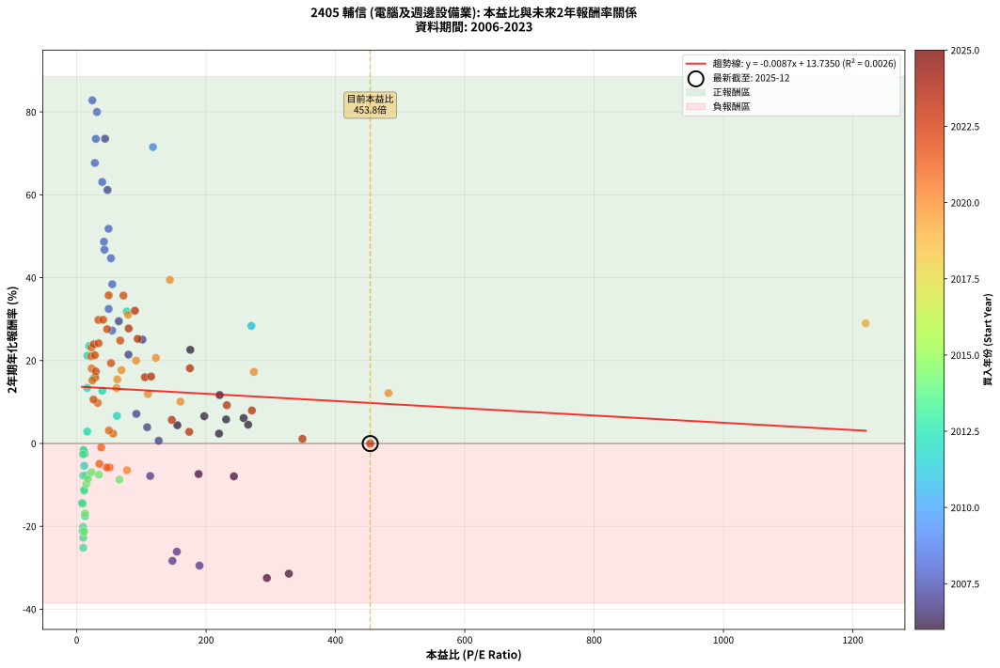
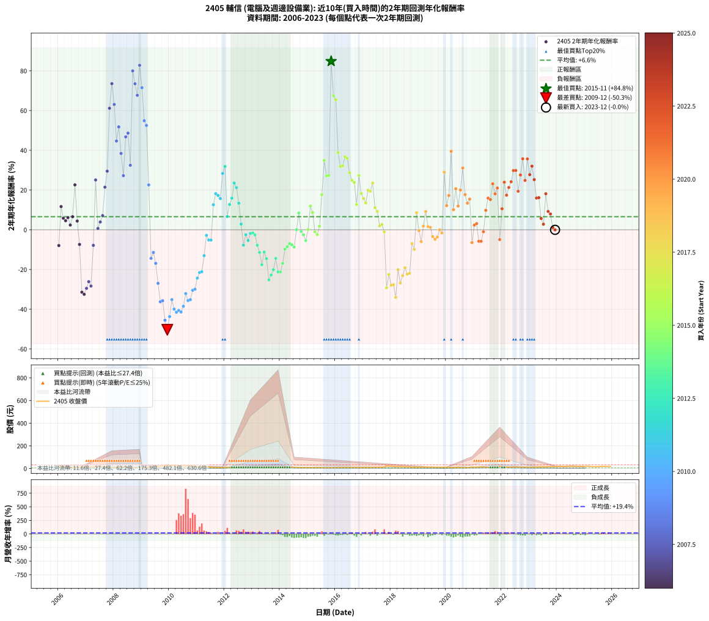

# 2405 輔信 - 本益比與未來報酬率分析

!!! info "報告資訊"
    - **股票代號**: 2405
    - **公司名稱**: 輔信
    - **產業別**: 電腦及週邊設備業
    - **分析期間**: 2006-2023 (216 個數據點)
    - **資料來源**: Type 12 (ShowMonthlyK_ChartFlow) 月收盤價與本益比
    - **報酬率口徑**: 含現金股利 (簡化: 年度合計，假設每年7/1入帳)
    - **報告生成時間**: 2026-01-10 20:43:51 CST

## 📈 視覺化圖表

### 圖表1: 本益比 vs 未來報酬率關係

*圖表1：2405 輔信 本益比與2年期未來報酬率關係 (2006-2023)*

### 圖表2: 歷年買入時點的2年期實際報酬率

*圖表2：2405 輔信 歷年買入時點的2年期實際報酬率 (2006-2023)*

## 📍 買點訊號說明

本報告提供兩種買點提示訊號（顯示於圖表2的股價子圖中）：

### ▲ 小綠色三角形（回測驗證）
- **計算方式**: 使用全部歷史資料計算本益比第25百分位數
- **用途**: 事後驗證，顯示歷史上哪些時點確實為低估區
- **限制**: 當下無法判斷，僅供回測參考
- **特性**: 後見之明（Look-Ahead Bias）

### ▲ 小橘色三角形（即時訊號）
- **計算方式**: 使用截至當月的過去5年資料計算本益比第25百分位數
- **用途**: 實際投資決策，當時即可判斷
- **優勢**: 可操作性強，符合實務需求
- **特性**: 無後見之明，滾動窗口計算

!!! tip "如何使用兩種訊號"
    - **綠色▲** 幫助理解歷史估值機會，驗證策略有效性
    - **橘色▲** 可作為實際買進參考，但仍需搭配基本面分析
    - 兩種訊號重疊時，表示即時判斷與事後驗證一致，信心度較高
    - 僅有綠色▲時，表示當時無法判斷（需要未來資料才能確認）
    - 僅有橘色▲時，表示即時判斷為買點，但事後可能不是最佳時機

## 📊 估值分析摘要

| 指標 | 數值 |
|:---:|:---:|
| **目前本益比** (2023-12) | **453.80 倍** |
| **歷史平均本益比** | 99.48 倍 |
| **估值水準** | 🔴 相對高估 |
| **預期2年年化報酬率** | **+9.77%** |
| **歷史平均報酬率** | +6.57% |
| **相關係數 (R²)** | 0.0026 |
| **趨勢線斜率** | -0.0087 |

!!! abstract "核心洞察"
    目前本益比顯著高於歷史平均，預期未來報酬率可能較低

    根據歷史數據回測，2405 輔信 在目前本益比 **453.8倍** 的估值水準下，
    預期未來2年年化報酬率約為 **+9.8%**。

    **重要提醒**: 本分析基於歷史數據統計，實際報酬率會受到公司基本面變化、產業趨勢、
    總體經濟環境等多重因素影響。R² = 0.00 表示本益比可解釋約 0.3% 的報酬率變異。

## 📈 歷史估值統計

### 最佳買點 (最高報酬率)

| 項目 | 數值 |
|:---:|:---:|
| 起始時間 | 2015-11 |
| 當時本益比 | nan 倍 |
| 起始價格 | 7.3 元 |
| 2年後價格 | 24.8 元 |
| **2年年化報酬率** | **+84.81%** |

### 最差買點 (最低報酬率)

| 項目 | 數值 |
|:---:|:---:|
| 起始時間 | 2009-12 |
| 當時本益比 | nan 倍 |
| 起始價格 | 32.8 元 |
| 2年後價格 | 8.1 元 |
| **2年年化報酬率** | **-50.33%** |

## 🎯 投資啟示

### 本益比與報酬率關係

趨勢線方程式: **y = -0.0087x + 13.7350**

!!! note "負相關"
    本益比與未來報酬率呈現負相關。較低的本益比通常帶來較高的未來報酬率，
    但相關性不算非常強。**估值仍是重要參考指標之一**。

### 估值區間建議

基於歷史數據分析:

- **🟢 低估區** (P/E < 79.6): 預期報酬率較高，可考慮增加持股
- **🟡 合理區** (P/E 79.6-119.4): 預期報酬率符合長期趨勢，正常持有
- **🔴 高估區** (P/E > 119.4): 預期報酬率較低，可考慮減碼或觀望

!!! danger "風險提示"
    - 過去表現不代表未來結果
    - 本分析假設公司基本面無重大結構性變化
    - 產業環境劇變可能使歷史規律失效
    - 應結合公司財報、產業趨勢、總體經濟等多重因素綜合判斷

!!! success "長期投資觀點"
    歷史數據顯示，在合理或低估的估值水準買入並長期持有，
    往往能獲得較佳的投資報酬。**耐心等待好價格**是價值投資的核心原則。

## 📊 數據品質

- **資料來源**: GoodInfo.tw Type 12 (ShowMonthlyK_ChartFlow)
- **資料頻率**: 月度收盤價與本益比
- **回測期間**: 2006-2023
- **數據點數量**: 216 個 (每個點代表一次2年期回測)

### 計算方法說明

1. **2年期年化報酬率**:
   - 對每個歷史時點，計算其後2年的實際投資報酬率
   - 期末價值(不含股利): 期末價格
   - 期末價值(含現金股利): 期末價格 + 持有期間內的現金股利合計 (簡化: 年度合計，假設每年7/1入帳)
   - 公式: 年化報酬率 = [(期末價值/期初價格)^(1/年數) - 1] × 100%

2. **本益比 (P/E Ratio)**:
   - 使用當時的月收盤價與EPS計算
   - 資料來源: Type 12 月度河流圖本益比數據

3. **趨勢線 (Linear Regression)**:
   - 使用最小平方法擬合線性趨勢線
   - R²值衡量本益比對報酬率的解釋能力

---

*本報告由 Stock Analysis System v1.9.0 自動生成*
*數據更新時間: 2026-01-10 20:43:51 CST*

## 📋 月度回測明細表

（每一列對應時間線圖中的一個買入點；可用來對照 SVG 圖上的每個點。）

| 買入月份 | 賣出月份 | 回測期限_年 | 實際持有年數 | 買入本益比_倍 | 買入收盤價_元 | 賣出收盤價_元 | 現金股利合計_元 | 總報酬率_pct | 年化報酬率_pct |
| --- | --- | --- | --- | --- | --- | --- | --- | --- | --- |
| 2006-01 | 2008-01 | 2 | 1.999 | 243.00 | 12.15 | 9.92 | 0.38 | -15.23 | -7.93 |
| 2006-02 | 2008-02 | 2 | 1.999 | 221.00 | 11.05 | 13.40 | 0.38 | +24.71 | +11.68 |
| 2006-03 | 2008-03 | 2 | 2.001 | 231.00 | 11.55 | 12.55 | 0.38 | +11.95 | +5.80 |
| 2006-04 | 2008-04 | 2 | 2.001 | 265.00 | 13.25 | 14.10 | 0.38 | +9.28 | +4.54 |
| 2006-05 | 2008-05 | 2 | 2.001 | 258.00 | 12.90 | 14.15 | 0.38 | +12.64 | +6.13 |
| 2006-06 | 2008-06 | 2 | 2.001 | 220.00 | 11.00 | 11.15 | 0.38 | +4.82 | +2.38 |
| 2006-07 | 2008-07 | 2 | 2.001 | 197.20 | 9.86 | 11.00 | 0.20 | +13.59 | +6.57 |
| 2006-08 | 2008-08 | 2 | 2.001 | 175.60 | 8.78 | 13.00 | 0.20 | +50.34 | +22.60 |
| 2006-09 | 2008-09 | 2 | 2.001 | 155.60 | 7.78 | 8.28 | 0.20 | +9.00 | +4.40 |
| 2006-10 | 2008-10 | 2 | 2.001 | 188.40 | 9.42 | 7.88 | 0.20 | -14.23 | -7.38 |
| 2006-11 | 2008-11 | 2 | 2.001 | 328.00 | 16.40 | 7.51 | 0.20 | -52.99 | -31.42 |
| 2006-12 | 2008-12 | 2 | 2.001 | 294.00 | 14.70 | 6.50 | 0.20 | -54.42 | -32.47 |
| 2007-01 | 2009-01 | 2 | 2.001 | 189.80 | 12.65 | 6.09 | 0.20 | -50.28 | -29.47 |
| 2007-02 | 2009-02 | 2 | 2.001 | 154.80 | 12.90 | 6.84 | 0.20 | -45.43 | -26.11 |
| 2007-03 | 2009-03 | 2 | 2.001 | 148.00 | 14.80 | 7.40 | 0.20 | -48.65 | -28.32 |
| 2007-04 | 2009-04 | 2 | 2.001 | 113.60 | 13.25 | 11.05 | 0.20 | -15.09 | -7.85 |
| 2007-05 | 2009-05 | 2 | 2.001 | 101.60 | 13.55 | 21.00 | 0.20 | +56.46 | +25.06 |
| 2007-06 | 2009-06 | 2 | 2.001 | 126.70 | 19.00 | 19.05 | 0.20 | +1.32 | +0.66 |
| 2007-07 | 2009-07 | 2 | 2.001 | 108.90 | 18.15 | 19.40 | 0.20 | +7.99 | +3.92 |
| 2007-08 | 2009-08 | 2 | 2.001 | 92.18 | 16.90 | 19.20 | 0.20 | +14.79 | +7.14 |
| 2007-09 | 2009-09 | 2 | 2.001 | 80.00 | 16.00 | 23.40 | 0.20 | +47.50 | +21.43 |
| 2007-10 | 2009-10 | 2 | 2.001 | 65.08 | 14.10 | 23.45 | 0.20 | +67.73 | +29.49 |
| 2007-11 | 2009-11 | 2 | 2.001 | 47.57 | 11.10 | 28.65 | 0.20 | +159.91 | +61.16 |
| 2007-12 | 2009-12 | 2 | 2.001 | 43.80 | 10.95 | 32.80 | 0.20 | +201.37 | +73.53 |
| 2008-01 | 2010-01 | 2 | 2.001 | 39.42 | 9.92 | 26.20 | 0.20 | +166.13 | +63.08 |
| 2008-02 | 2010-03 | 2 | 2.081 | 52.89 | 13.40 | 28.70 | 0.20 | +115.67 | +44.68 |
| 2008-03 | 2010-03 | 2 | 1.999 | 49.22 | 12.55 | 28.70 | 0.20 | +130.28 | +51.79 |
| 2008-04 | 2010-04 | 2 | 1.999 | 54.94 | 14.10 | 26.80 | 0.20 | +91.49 | +38.41 |
| 2008-05 | 2010-05 | 2 | 1.999 | 54.77 | 14.15 | 22.70 | 0.20 | +61.84 | +27.24 |
| 2008-06 | 2010-06 | 2 | 1.999 | 42.88 | 11.15 | 23.80 | 0.20 | +115.25 | +46.75 |
| 2008-07 | 2010-07 | 2 | 1.999 | 42.04 | 11.00 | 24.30 | 0.00 | +120.91 | +48.67 |
| 2008-08 | 2010-08 | 2 | 1.999 | 49.37 | 13.00 | 22.80 | 0.00 | +75.38 | +32.46 |
| 2008-09 | 2010-09 | 2 | 1.999 | 31.25 | 8.28 | 26.80 | 0.00 | +223.67 | +79.98 |
| 2008-10 | 2010-10 | 2 | 1.999 | 29.55 | 7.88 | 23.70 | 0.00 | +200.76 | +73.49 |
| 2008-11 | 2010-11 | 2 | 1.999 | 27.99 | 7.51 | 21.10 | 0.00 | +180.96 | +67.68 |
| 2008-12 | 2010-12 | 2 | 1.999 | 24.07 | 6.50 | 21.70 | 0.00 | +233.85 | +82.79 |
| 2009-01 | 2011-01 | 2 | 1.999 | 117.90 | 6.09 | 17.90 | 0.00 | +193.92 | +71.51 |
| 2009-02 | 2011-02 | 2 | 1.999 |  | 6.84 | 16.40 | 0.00 | +139.77 | +54.89 |
| 2009-03 | 2011-03 | 2 | 1.999 |  | 7.40 | 17.20 | 0.00 | +132.43 | +52.50 |
| 2009-04 | 2011-04 | 2 | 1.999 |  | 11.05 | 16.60 | 0.00 | +50.23 | +22.58 |
| 2009-05 | 2011-05 | 2 | 1.999 |  | 21.00 | 15.40 | 0.00 | -26.67 | -14.37 |
| 2009-06 | 2011-06 | 2 | 1.999 |  | 19.05 | 14.95 | 0.00 | -21.52 | -11.42 |
| 2009-07 | 2011-07 | 2 | 1.999 |  | 19.40 | 13.40 | 0.00 | -30.93 | -16.90 |
| 2009-08 | 2011-08 | 2 | 1.999 |  | 19.20 | 10.25 | 0.00 | -46.61 | -26.95 |
| 2009-09 | 2011-09 | 2 | 1.999 |  | 23.40 | 9.52 | 0.00 | -59.32 | -36.24 |
| 2009-10 | 2011-10 | 2 | 1.999 |  | 23.45 | 9.70 | 0.00 | -58.64 | -35.70 |
| 2009-11 | 2011-11 | 2 | 1.999 |  | 28.65 | 8.51 | 0.00 | -70.30 | -45.52 |
| 2009-12 | 2011-12 | 2 | 1.999 |  | 32.80 | 8.10 | 0.00 | -75.30 | -50.33 |
| 2010-01 | 2012-01 | 2 | 1.999 |  | 26.20 | 8.31 | 0.00 | -68.28 | -43.70 |
| 2010-02 | 2012-02 | 2 | 1.999 |  | 27.35 | 11.50 | 0.00 | -57.95 | -35.18 |
| 2010-03 | 2012-03 | 2 | 2.001 |  | 28.70 | 10.35 | 0.00 | -63.94 | -39.93 |
| 2010-04 | 2012-04 | 2 | 2.001 |  | 26.80 | 9.16 | 0.00 | -65.82 | -41.52 |
| 2010-05 | 2012-05 | 2 | 2.001 |  | 22.70 | 8.00 | 0.00 | -64.76 | -40.61 |
| 2010-06 | 2012-06 | 2 | 2.001 |  | 23.80 | 8.17 | 0.00 | -65.67 | -41.39 |
| 2010-07 | 2012-07 | 2 | 2.001 |  | 24.30 | 9.18 | 0.00 | -62.22 | -38.52 |
| 2010-08 | 2012-08 | 2 | 2.001 |  | 22.80 | 10.50 | 0.00 | -53.95 | -32.12 |
| 2010-09 | 2012-09 | 2 | 2.001 |  | 26.80 | 11.10 | 0.00 | -58.58 | -35.62 |
| 2010-10 | 2012-10 | 2 | 2.001 |  | 23.70 | 9.95 | 0.00 | -58.02 | -35.19 |
| 2010-11 | 2012-11 | 2 | 2.001 |  | 21.10 | 10.20 | 0.00 | -51.66 | -30.45 |
| 2010-12 | 2012-12 | 2 | 2.001 |  | 21.70 | 10.65 | 0.00 | -50.92 | -29.93 |
| 2011-01 | 2013-01 | 2 | 2.001 |  | 17.90 | 10.25 | 0.00 | -42.74 | -24.31 |
| 2011-02 | 2013-02 | 2 | 2.001 |  | 16.40 | 10.10 | 0.00 | -38.41 | -21.51 |
| 2011-03 | 2013-03 | 2 | 2.001 |  | 17.20 | 10.70 | 0.00 | -37.79 | -21.11 |
| 2011-04 | 2013-04 | 2 | 2.001 |  | 16.60 | 12.55 | 0.00 | -24.40 | -13.04 |
| 2011-05 | 2013-05 | 2 | 2.001 |  | 15.40 | 14.55 | 0.00 | -5.52 | -2.80 |
| 2011-06 | 2013-06 | 2 | 2.001 |  | 14.95 | 13.45 | 0.00 | -10.03 | -5.15 |
| 2011-07 | 2013-07 | 2 | 2.001 |  | 13.40 | 11.55 | 0.50 | -10.07 | -5.17 |
| 2011-08 | 2013-08 | 2 | 2.001 |  | 10.25 | 12.50 | 0.50 | +26.83 | +12.61 |
| 2011-09 | 2013-09 | 2 | 2.001 |  | 9.52 | 12.80 | 0.50 | +39.71 | +18.18 |
| 2011-10 | 2013-10 | 2 | 2.001 |  | 9.70 | 12.85 | 0.50 | +37.63 | +17.30 |
| 2011-11 | 2013-11 | 2 | 2.001 |  | 8.51 | 10.90 | 0.50 | +33.96 | +15.73 |
| 2011-12 | 2013-12 | 2 | 2.001 | 270.00 | 8.10 | 12.85 | 0.50 | +64.81 | +28.36 |
| 2012-01 | 2014-01 | 2 | 2.001 | 77.30 | 8.31 | 13.95 | 0.50 | +73.89 | +31.84 |
| 2012-02 | 2014-03 | 2 | 2.081 | 62.16 | 11.50 | 12.65 | 0.50 | +14.35 | +6.66 |
| 2012-03 | 2014-03 | 2 | 1.999 | 39.43 | 10.35 | 12.65 | 0.50 | +27.05 | +12.73 |
| 2012-04 | 2014-04 | 2 | 1.999 | 26.94 | 9.16 | 11.80 | 0.50 | +34.28 | +15.89 |
| 2012-05 | 2014-05 | 2 | 1.999 | 19.16 | 8.00 | 11.70 | 0.50 | +52.50 | +23.51 |
| 2012-06 | 2014-06 | 2 | 1.999 | 16.51 | 8.17 | 11.50 | 0.50 | +46.88 | +21.21 |
| 2012-07 | 2014-07 | 2 | 1.999 | 16.03 | 9.18 | 10.60 | 1.20 | +28.54 | +13.39 |
| 2012-08 | 2014-08 | 2 | 1.999 | 16.15 | 10.50 | 9.91 | 1.20 | +5.81 | +2.87 |
| 2012-09 | 2014-09 | 2 | 1.999 | 15.26 | 11.10 | 8.25 | 1.20 | -14.86 | -7.74 |
| 2012-10 | 2014-10 | 2 | 1.999 | 12.36 | 9.95 | 8.26 | 1.20 | -4.92 | -2.50 |
| 2012-11 | 2014-11 | 2 | 1.999 | 11.56 | 10.20 | 7.93 | 1.20 | -10.49 | -5.39 |
| 2012-12 | 2014-12 | 2 | 1.999 | 11.09 | 10.65 | 9.06 | 1.20 | -3.66 | -1.85 |
| 2013-01 | 2015-01 | 2 | 1.999 | 10.30 | 10.25 | 8.73 | 1.20 | -3.12 | -1.57 |
| 2013-02 | 2015-02 | 2 | 1.999 | 9.81 | 10.10 | 8.38 | 1.20 | -5.15 | -2.61 |
| 2013-03 | 2015-03 | 2 | 1.999 | 10.05 | 10.70 | 7.90 | 1.20 | -14.95 | -7.78 |
| 2013-04 | 2015-04 | 2 | 1.999 | 11.41 | 12.55 | 8.65 | 1.20 | -21.51 | -11.41 |
| 2013-05 | 2015-05 | 2 | 1.999 | 12.82 | 14.55 | 8.69 | 1.20 | -32.03 | -17.57 |
| 2013-06 | 2015-06 | 2 | 1.999 | 11.50 | 13.45 | 9.40 | 1.20 | -21.19 | -11.23 |
| 2013-07 | 2015-07 | 2 | 1.999 | 9.59 | 11.55 | 7.74 | 0.70 | -26.93 | -14.53 |
| 2013-08 | 2015-08 | 2 | 1.999 | 10.08 | 12.50 | 6.30 | 0.70 | -44.00 | -25.18 |
| 2013-09 | 2015-09 | 2 | 1.999 | 10.04 | 12.80 | 6.94 | 0.70 | -40.31 | -22.76 |
| 2013-10 | 2015-10 | 2 | 1.999 | 9.81 | 12.85 | 7.50 | 0.70 | -36.19 | -20.13 |
| 2013-11 | 2015-11 | 2 | 1.999 | 8.10 | 10.90 | 7.29 | 0.70 | -26.70 | -14.39 |
| 2013-12 | 2015-12 | 2 | 1.999 | 9.31 | 12.85 | 7.28 | 0.70 | -37.90 | -21.21 |
| 2014-01 | 2016-01 | 2 | 1.999 | 11.57 | 13.95 | 7.95 | 0.70 | -37.99 | -21.27 |
| 2014-02 | 2016-02 | 2 | 1.999 | 12.79 | 13.20 | 8.42 | 0.70 | -30.91 | -16.89 |
| 2014-03 | 2016-03 | 2 | 2.001 | 14.75 | 12.65 | 9.60 | 0.70 | -18.58 | -9.76 |
| 2014-04 | 2016-04 | 2 | 2.001 | 17.27 | 11.80 | 9.17 | 0.70 | -16.36 | -8.54 |
| 2014-05 | 2016-05 | 2 | 2.001 | 22.98 | 11.70 | 9.43 | 0.70 | -13.42 | -6.95 |
| 2014-06 | 2016-06 | 2 | 2.001 | 34.33 | 11.50 | 9.13 | 0.70 | -14.52 | -7.54 |
| 2014-07 | 2016-07 | 2 | 2.001 | 65.91 | 10.60 | 8.83 | 0.00 | -16.70 | -8.72 |
| 2014-08 | 2016-08 | 2 | 2.001 |  | 9.91 | 9.92 | 0.00 | +0.10 | +0.05 |
| 2014-09 | 2016-09 | 2 | 2.001 |  | 8.25 | 9.70 | 0.00 | +17.58 | +8.43 |
| 2014-10 | 2016-10 | 2 | 2.001 |  | 8.26 | 8.12 | 0.00 | -1.69 | -0.85 |
| 2014-11 | 2016-11 | 2 | 2.001 |  | 7.93 | 7.53 | 0.00 | -5.04 | -2.55 |
| 2014-12 | 2016-12 | 2 | 2.001 |  | 9.06 | 8.10 | 0.00 | -10.60 | -5.44 |
| 2015-01 | 2017-01 | 2 | 2.001 |  | 8.73 | 8.75 | 0.00 | +0.23 | +0.11 |
| 2015-02 | 2017-02 | 2 | 2.001 |  | 8.38 | 10.50 | 0.00 | +25.30 | +11.93 |
| 2015-03 | 2017-03 | 2 | 2.001 |  | 7.90 | 9.34 | 0.00 | +18.23 | +8.73 |
| 2015-04 | 2017-04 | 2 | 2.001 |  | 8.65 | 8.47 | 0.00 | -2.08 | -1.05 |
| 2015-05 | 2017-05 | 2 | 2.001 |  | 8.69 | 8.27 | 0.00 | -4.83 | -2.44 |
| 2015-06 | 2017-06 | 2 | 2.001 |  | 9.40 | 9.74 | 0.00 | +3.62 | +1.79 |
| 2015-07 | 2017-07 | 2 | 2.001 |  | 7.74 | 10.60 | 0.12 | +38.50 | +17.67 |
| 2015-08 | 2017-08 | 2 | 2.001 |  | 6.30 | 11.35 | 0.12 | +82.06 | +34.90 |
| 2015-09 | 2017-09 | 2 | 2.001 |  | 6.94 | 11.10 | 0.12 | +61.67 | +27.13 |
| 2015-10 | 2017-10 | 2 | 2.001 |  | 7.50 | 12.05 | 0.12 | +62.27 | +27.36 |
| 2015-11 | 2017-11 | 2 | 2.001 |  | 7.29 | 24.80 | 0.12 | +241.84 | +84.81 |
| 2015-12 | 2017-12 | 2 | 2.001 |  | 7.28 | 20.30 | 0.12 | +180.49 | +67.42 |
| 2016-01 | 2018-01 | 2 | 2.001 |  | 7.95 | 21.65 | 0.12 | +173.84 | +65.42 |
| 2016-02 | 2018-03 | 2 | 2.081 |  | 8.42 | 16.55 | 0.12 | +97.98 | +38.85 |
| 2016-03 | 2018-03 | 2 | 1.999 |  | 9.60 | 16.55 | 0.12 | +73.65 | +31.80 |
| 2016-04 | 2018-04 | 2 | 1.999 |  | 9.17 | 15.90 | 0.12 | +74.70 | +32.20 |
| 2016-05 | 2018-05 | 2 | 1.999 |  | 9.43 | 17.50 | 0.12 | +86.85 | +36.72 |
| 2016-06 | 2018-06 | 2 | 1.999 |  | 9.13 | 16.75 | 0.12 | +84.78 | +35.96 |
| 2016-07 | 2018-07 | 2 | 1.999 |  | 8.83 | 14.50 | 0.12 | +65.57 | +28.70 |
| 2016-08 | 2018-08 | 2 | 1.999 |  | 9.92 | 15.35 | 0.12 | +55.95 | +24.90 |
| 2016-09 | 2018-09 | 2 | 1.999 |  | 9.70 | 14.75 | 0.12 | +53.30 | +23.83 |
| 2016-10 | 2018-10 | 2 | 1.999 |  | 8.12 | 10.20 | 0.12 | +27.09 | +12.75 |
| 2016-11 | 2018-11 | 2 | 1.999 |  | 7.53 | 12.10 | 0.12 | +62.28 | +27.41 |
| 2016-12 | 2018-12 | 2 | 1.999 |  | 8.10 | 11.20 | 0.12 | +39.75 | +18.23 |
| 2017-01 | 2019-01 | 2 | 1.999 |  | 8.75 | 11.60 | 0.12 | +33.94 | +15.75 |
| 2017-02 | 2019-02 | 2 | 1.999 |  | 10.50 | 13.40 | 0.12 | +28.76 | +13.48 |
| 2017-03 | 2019-03 | 2 | 1.999 |  | 9.34 | 13.30 | 0.12 | +43.68 | +19.88 |
| 2017-04 | 2019-04 | 2 | 1.999 |  | 8.47 | 11.95 | 0.12 | +42.50 | +19.39 |
| 2017-05 | 2019-05 | 2 | 1.999 |  | 8.27 | 12.50 | 0.12 | +52.60 | +23.55 |
| 2017-06 | 2019-06 | 2 | 1.999 |  | 9.74 | 11.90 | 0.12 | +23.41 | +11.10 |
| 2017-07 | 2019-07 | 2 | 1.999 |  | 10.60 | 12.65 | 0.00 | +19.34 | +9.25 |
| 2017-08 | 2019-08 | 2 | 1.999 |  | 11.35 | 11.80 | 0.00 | +3.96 | +1.96 |
| 2017-09 | 2019-09 | 2 | 1.999 |  | 11.10 | 11.70 | 0.00 | +5.41 | +2.67 |
| 2017-10 | 2019-10 | 2 | 1.999 |  | 12.05 | 11.80 | 0.00 | -2.07 | -1.04 |
| 2017-11 | 2019-11 | 2 | 1.999 |  | 24.80 | 12.45 | 0.00 | -49.80 | -29.16 |
| 2017-12 | 2019-12 | 2 | 1.999 |  | 20.30 | 12.20 | 0.00 | -39.90 | -22.49 |
| 2018-01 | 2020-01 | 2 | 1.999 |  | 21.65 | 11.25 | 0.00 | -48.04 | -27.93 |
| 2018-02 | 2020-02 | 2 | 1.999 |  | 19.20 | 10.05 | 0.00 | -47.66 | -27.67 |
| 2018-03 | 2020-03 | 2 | 2.001 |  | 16.55 | 7.20 | 0.00 | -56.50 | -34.02 |
| 2018-04 | 2020-04 | 2 | 2.001 |  | 15.90 | 10.15 | 0.00 | -36.16 | -20.09 |
| 2018-05 | 2020-05 | 2 | 2.001 |  | 17.50 | 9.38 | 0.00 | -46.40 | -26.77 |
| 2018-06 | 2020-06 | 2 | 2.001 |  | 16.75 | 9.90 | 0.00 | -40.90 | -23.11 |
| 2018-07 | 2020-07 | 2 | 2.001 |  | 14.50 | 9.48 | 0.00 | -34.62 | -19.13 |
| 2018-08 | 2020-08 | 2 | 2.001 |  | 15.35 | 9.26 | 0.00 | -39.67 | -22.32 |
| 2018-09 | 2020-09 | 2 | 2.001 |  | 14.75 | 8.99 | 0.00 | -39.05 | -21.92 |
| 2018-10 | 2020-10 | 2 | 2.001 |  | 10.20 | 8.83 | 0.00 | -13.43 | -6.95 |
| 2018-11 | 2020-11 | 2 | 2.001 |  | 12.10 | 9.83 | 0.00 | -18.76 | -9.86 |
| 2018-12 | 2020-12 | 2 | 2.001 |  | 11.20 | 13.20 | 0.00 | +17.86 | +8.56 |
| 2019-01 | 2021-01 | 2 | 2.001 |  | 11.60 | 11.50 | 0.00 | -0.86 | -0.43 |
| 2019-02 | 2021-02 | 2 | 2.001 |  | 13.40 | 11.85 | 0.00 | -11.57 | -5.96 |
| 2019-03 | 2021-03 | 2 | 2.001 |  | 13.30 | 13.80 | 0.00 | +3.76 | +1.86 |
| 2019-04 | 2021-04 | 2 | 2.001 |  | 11.95 | 14.25 | 0.00 | +19.25 | +9.19 |
| 2019-05 | 2021-05 | 2 | 2.001 |  | 12.50 | 12.90 | 0.00 | +3.20 | +1.59 |
| 2019-06 | 2021-06 | 2 | 2.001 |  | 11.90 | 12.20 | 0.00 | +2.52 | +1.25 |
| 2019-07 | 2021-07 | 2 | 2.001 |  | 12.65 | 11.80 | 0.00 | -6.72 | -3.42 |
| 2019-08 | 2021-08 | 2 | 2.001 |  | 11.80 | 10.70 | 0.00 | -9.32 | -4.77 |
| 2019-09 | 2021-09 | 2 | 2.001 |  | 11.70 | 10.85 | 0.00 | -7.26 | -3.70 |
| 2019-10 | 2021-10 | 2 | 2.001 |  | 11.80 | 11.80 | 0.00 | +0.00 | +0.00 |
| 2019-11 | 2021-11 | 2 | 2.001 |  | 12.45 | 12.05 | 0.00 | -3.21 | -1.62 |
| 2019-12 | 2021-12 | 2 | 2.001 | 1220.00 | 12.20 | 20.30 | 0.00 | +66.39 | +28.97 |
| 2020-01 | 2022-01 | 2 | 2.001 | 482.10 | 11.25 | 14.15 | 0.00 | +25.78 | +12.14 |
| 2020-02 | 2022-03 | 2 | 2.081 | 274.10 | 10.05 | 14.00 | 0.00 | +39.30 | +17.27 |
| 2020-03 | 2022-03 | 2 | 1.999 | 144.00 | 7.20 | 14.00 | 0.00 | +94.44 | +39.48 |
| 2020-04 | 2022-04 | 2 | 1.999 | 160.30 | 10.15 | 12.30 | 0.00 | +21.18 | +10.09 |
| 2020-05 | 2022-05 | 2 | 1.999 | 122.40 | 9.38 | 13.65 | 0.00 | +45.52 | +20.65 |
| 2020-06 | 2022-06 | 2 | 1.999 | 110.00 | 9.90 | 12.40 | 0.00 | +25.25 | +11.92 |
| 2020-07 | 2022-07 | 2 | 1.999 | 91.74 | 9.48 | 13.65 | 0.00 | +43.99 | +20.01 |
| 2020-08 | 2022-08 | 2 | 1.999 | 79.37 | 9.26 | 15.90 | 0.00 | +71.71 | +31.06 |
| 2020-09 | 2022-09 | 2 | 1.999 | 69.15 | 8.99 | 12.45 | 0.00 | +38.49 | +17.69 |
| 2020-10 | 2022-10 | 2 | 1.999 | 61.60 | 8.83 | 11.35 | 0.00 | +28.54 | +13.38 |
| 2020-11 | 2022-11 | 2 | 1.999 | 62.74 | 9.83 | 13.10 | 0.00 | +33.27 | +15.45 |
| 2020-12 | 2022-12 | 2 | 1.999 | 77.65 | 13.20 | 11.55 | 0.00 | -12.50 | -6.46 |
| 2021-01 | 2023-01 | 2 | 1.999 | 56.33 | 11.50 | 12.05 | 0.00 | +4.78 | +2.37 |
| 2021-02 | 2023-02 | 2 | 1.999 | 49.72 | 11.85 | 12.60 | 0.00 | +6.33 | +3.12 |
| 2021-03 | 2023-03 | 2 | 1.999 | 50.64 | 13.80 | 12.25 | 0.00 | -11.23 | -5.79 |
| 2021-04 | 2023-04 | 2 | 1.999 | 46.47 | 14.25 | 12.65 | 0.00 | -11.23 | -5.78 |
| 2021-05 | 2023-05 | 2 | 1.999 | 37.85 | 12.90 | 12.65 | 0.00 | -1.94 | -0.97 |
| 2021-06 | 2023-06 | 2 | 1.999 | 32.53 | 12.20 | 14.70 | 0.00 | +20.49 | +9.78 |
| 2021-07 | 2023-07 | 2 | 1.999 | 28.84 | 11.80 | 15.65 | 0.20 | +34.32 | +15.91 |
| 2021-08 | 2023-08 | 2 | 1.999 | 24.14 | 10.70 | 14.00 | 0.20 | +32.71 | +15.21 |
| 2021-09 | 2023-09 | 2 | 1.999 | 22.72 | 10.85 | 16.25 | 0.20 | +51.61 | +23.15 |
| 2021-10 | 2023-10 | 2 | 1.999 | 23.06 | 11.80 | 16.25 | 0.20 | +39.41 | +18.08 |
| 2021-11 | 2023-11 | 2 | 1.999 | 22.08 | 12.05 | 17.45 | 0.20 | +46.47 | +21.04 |
| 2021-12 | 2023-12 | 2 | 1.999 | 35.00 | 20.30 | 18.15 | 0.20 | -9.61 | -4.93 |
| 2022-01 | 2024-01 | 2 | 1.999 | 25.96 | 14.15 | 17.10 | 0.20 | +22.26 | +10.58 |
| 2022-02 | 2024-02 | 2 | 1.999 | 26.37 | 13.45 | 20.45 | 0.20 | +53.53 | +23.93 |
| 2022-03 | 2024-03 | 2 | 2.001 | 29.47 | 14.00 | 19.10 | 0.20 | +37.86 | +17.40 |
| 2022-04 | 2024-04 | 2 | 2.001 | 27.95 | 12.30 | 17.90 | 0.20 | +47.15 | +21.29 |
| 2022-05 | 2024-05 | 2 | 2.001 | 33.70 | 13.65 | 20.85 | 0.20 | +54.21 | +24.16 |
| 2022-06 | 2024-06 | 2 | 2.001 | 33.51 | 12.40 | 20.70 | 0.20 | +68.55 | +29.80 |
| 2022-07 | 2024-07 | 2 | 2.001 | 40.75 | 13.65 | 22.65 | 0.37 | +68.64 | +29.84 |
| 2022-08 | 2024-08 | 2 | 2.001 | 53.00 | 15.90 | 22.30 | 0.37 | +42.58 | +19.39 |
| 2022-09 | 2024-09 | 2 | 2.001 | 46.98 | 12.45 | 19.90 | 0.37 | +62.81 | +27.58 |
| 2022-10 | 2024-10 | 2 | 2.001 | 49.35 | 11.35 | 20.55 | 0.37 | +84.32 | +35.74 |
| 2022-11 | 2024-11 | 2 | 2.001 | 67.18 | 13.10 | 20.05 | 0.37 | +55.88 | +24.83 |
| 2022-12 | 2024-12 | 2 | 2.001 | 72.19 | 11.55 | 20.90 | 0.37 | +84.16 | +35.68 |
| 2023-01 | 2025-01 | 2 | 2.001 | 80.33 | 12.05 | 19.30 | 0.37 | +63.24 | +27.74 |
| 2023-02 | 2025-02 | 2 | 2.001 | 90.00 | 12.60 | 21.60 | 0.37 | +74.37 | +32.02 |
| 2023-03 | 2025-03 | 2 | 2.001 | 94.23 | 12.25 | 18.85 | 0.37 | +56.90 | +25.24 |
| 2023-04 | 2025-04 | 2 | 2.001 | 105.40 | 12.65 | 16.65 | 0.37 | +34.55 | +15.98 |
| 2023-05 | 2025-05 | 2 | 2.001 | 115.00 | 12.65 | 16.70 | 0.37 | +34.94 | +16.15 |
| 2023-06 | 2025-06 | 2 | 2.001 | 147.00 | 14.70 | 16.05 | 0.37 | +11.70 | +5.68 |
| 2023-07 | 2025-07 | 2 | 2.001 | 173.90 | 15.65 | 16.20 | 0.34 | +5.69 | +2.80 |
| 2023-08 | 2025-08 | 2 | 2.001 | 175.00 | 14.00 | 19.20 | 0.34 | +39.57 | +18.13 |
| 2023-09 | 2025-09 | 2 | 2.001 | 232.10 | 16.25 | 19.05 | 0.34 | +19.32 | +9.23 |
| 2023-10 | 2025-10 | 2 | 2.001 | 270.80 | 16.25 | 18.60 | 0.34 | +16.55 | +7.95 |
| 2023-11 | 2025-11 | 2 | 2.001 | 349.00 | 17.45 | 17.50 | 0.34 | +2.23 | +1.11 |
| 2023-12 | 2025-12 | 2 | 2.001 | 453.80 | 18.15 | 17.80 | 0.34 | -0.06 | -0.03 |
