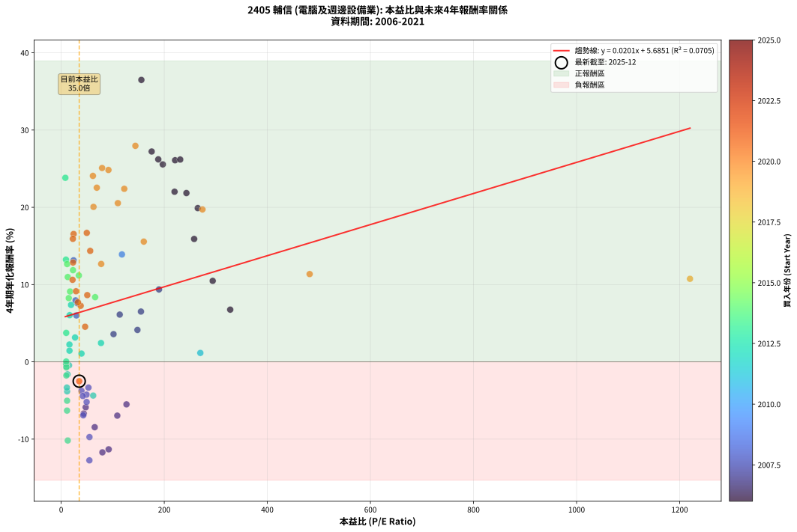
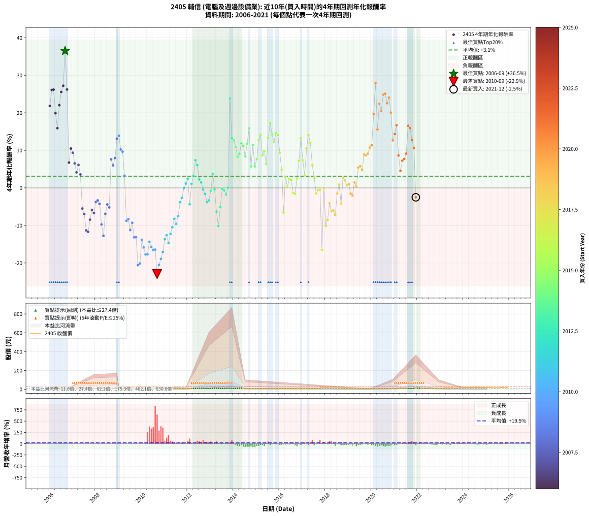

# 2405 輔信 - 本益比與未來報酬率分析

!!! info "報告資訊"
    - **股票代號**: 2405
    - **公司名稱**: 輔信
    - **產業別**: 電腦及週邊設備業
    - **分析期間**: 2006-2021 (192 個數據點)
    - **資料來源**: Type 12 (ShowMonthlyK_ChartFlow) 月收盤價與本益比
    - **報酬率口徑**: 含現金股利 (簡化: 年度合計，假設每年7/1入帳)
    - **報告生成時間**: 2026-01-05 00:36:52 CST

## 📈 視覺化圖表

### 圖表1: 本益比 vs 未來報酬率關係

*圖表1：2405 輔信 本益比與4年期未來報酬率關係 (2006-2021)*

### 圖表2: 歷年買入時點的4年期實際報酬率

*圖表2：2405 輔信 歷年買入時點的4年期實際報酬率 (2006-2021)*

## 📍 買點訊號說明

本報告提供兩種買點提示訊號（顯示於圖表2的股價子圖中）：

### ▲ 小綠色三角形（回測驗證）
- **計算方式**: 使用全部歷史資料計算本益比第25百分位數
- **用途**: 事後驗證，顯示歷史上哪些時點確實為低估區
- **限制**: 當下無法判斷，僅供回測參考
- **特性**: 後見之明（Look-Ahead Bias）

### ▲ 小橘色三角形（即時訊號）
- **計算方式**: 使用截至當月的過去5年資料計算本益比第25百分位數
- **用途**: 實際投資決策，當時即可判斷
- **優勢**: 可操作性強，符合實務需求
- **特性**: 無後見之明，滾動窗口計算

!!! tip "如何使用兩種訊號"
    - **綠色▲** 幫助理解歷史估值機會，驗證策略有效性
    - **橘色▲** 可作為實際買進參考，但仍需搭配基本面分析
    - 兩種訊號重疊時，表示即時判斷與事後驗證一致，信心度較高
    - 僅有綠色▲時，表示當時無法判斷（需要未來資料才能確認）
    - 僅有橘色▲時，表示即時判斷為買點，但事後可能不是最佳時機

## 📊 估值分析摘要

| 指標 | 數值 |
|:---:|:---:|
| **目前本益比** (2021-12) | **35.00 倍** |
| **歷史平均本益比** | 95.17 倍 |
| **估值水準** | 🟢 相對低估 |
| **預期4年年化報酬率** | **+6.39%** |
| **歷史平均報酬率** | +3.11% |
| **相關係數 (R²)** | 0.0705 |
| **趨勢線斜率** | 0.0201 |

!!! abstract "核心洞察"
    目前本益比顯著低於歷史平均，預期未來報酬率可能較高

    根據歷史數據回測，2405 輔信 在目前本益比 **35.0倍** 的估值水準下，
    預期未來4年年化報酬率約為 **+6.4%**。

    **重要提醒**: 本分析基於歷史數據統計，實際報酬率會受到公司基本面變化、產業趨勢、
    總體經濟環境等多重因素影響。R² = 0.07 表示本益比可解釋約 7.0% 的報酬率變異。

## 📈 歷史估值統計

### 最佳買點 (最高報酬率)

| 項目 | 數值 |
|:---:|:---:|
| 起始時間 | 2006-09 |
| 當時本益比 | 155.60 倍 |
| 起始價格 | 7.8 元 |
| 4年後價格 | 26.8 元 |
| **4年年化報酬率** | **+36.49%** |

### 最差買點 (最低報酬率)

| 項目 | 數值 |
|:---:|:---:|
| 起始時間 | 2010-09 |
| 當時本益比 | nan 倍 |
| 起始價格 | 26.8 元 |
| 4年後價格 | 8.2 元 |
| **4年年化報酬率** | **-22.94%** |

## 🎯 投資啟示

### 本益比與報酬率關係

趨勢線方程式: **y = 0.0201x + 5.6851**

!!! info "弱相關或正相關"
    本益比與未來報酬率相關性較弱。這可能表示該股票的報酬率更多受到
    公司成長性、產業趨勢等因素影響，而非估值水準。**需綜合考量多項指標**。

### 估值區間建議

基於歷史數據分析:

- **🟢 低估區** (P/E < 76.1): 預期報酬率較高，可考慮增加持股
- **🟡 合理區** (P/E 76.1-114.2): 預期報酬率符合長期趨勢，正常持有
- **🔴 高估區** (P/E > 114.2): 預期報酬率較低，可考慮減碼或觀望

!!! danger "風險提示"
    - 過去表現不代表未來結果
    - 本分析假設公司基本面無重大結構性變化
    - 產業環境劇變可能使歷史規律失效
    - 應結合公司財報、產業趨勢、總體經濟等多重因素綜合判斷

!!! success "長期投資觀點"
    歷史數據顯示，在合理或低估的估值水準買入並長期持有，
    往往能獲得較佳的投資報酬。**耐心等待好價格**是價值投資的核心原則。

## 📊 數據品質

- **資料來源**: GoodInfo.tw Type 12 (ShowMonthlyK_ChartFlow)
- **資料頻率**: 月度收盤價與本益比
- **回測期間**: 2006-2021
- **數據點數量**: 192 個 (每個點代表一次4年期回測)

### 計算方法說明

1. **4年期年化報酬率**:
   - 對每個歷史時點，計算其後4年的實際投資報酬率
   - 期末價值(不含股利): 期末價格
   - 期末價值(含現金股利): 期末價格 + 持有期間內的現金股利合計 (簡化: 年度合計，假設每年7/1入帳)
   - 公式: 年化報酬率 = [(期末價值/期初價格)^(1/年數) - 1] × 100%

2. **本益比 (P/E Ratio)**:
   - 使用當時的月收盤價與EPS計算
   - 資料來源: Type 12 月度河流圖本益比數據

3. **趨勢線 (Linear Regression)**:
   - 使用最小平方法擬合線性趨勢線
   - R²值衡量本益比對報酬率的解釋能力

---

*本報告由 Stock Analysis System v1.9.0 自動生成*
*數據更新時間: 2026-01-05 00:36:52 CST*

## 📋 月度回測明細表

（每一列對應時間線圖中的一個買入點；可用來對照 SVG 圖上的每個點。）

| 買入月份 | 賣出月份 | 回測期限_年 | 實際持有年數 | 買入本益比_倍 | 買入收盤價_元 | 賣出收盤價_元 | 現金股利合計_元 | 總報酬率_pct | 年化報酬率_pct |
| --- | --- | --- | --- | --- | --- | --- | --- | --- | --- |
| 2006-01 | 2010-01 | 4 | 4.000 | 243.00 | 12.15 | 26.20 | 0.58 | +120.41 | +21.85 |
| 2006-02 | 2010-02 | 4 | 4.000 | 221.00 | 11.05 | 27.35 | 0.58 | +152.76 | +26.09 |
| 2006-03 | 2010-03 | 4 | 4.000 | 231.00 | 11.55 | 28.70 | 0.58 | +153.51 | +26.18 |
| 2006-04 | 2010-04 | 4 | 4.000 | 265.00 | 13.25 | 26.80 | 0.58 | +106.64 | +19.90 |
| 2006-05 | 2010-05 | 4 | 4.000 | 258.00 | 12.90 | 22.70 | 0.58 | +80.47 | +15.90 |
| 2006-06 | 2010-06 | 4 | 4.000 | 220.00 | 11.00 | 23.80 | 0.58 | +121.64 | +22.01 |
| 2006-07 | 2010-07 | 4 | 4.000 | 197.20 | 9.86 | 24.30 | 0.20 | +148.48 | +25.55 |
| 2006-08 | 2010-08 | 4 | 4.000 | 175.60 | 8.78 | 22.80 | 0.20 | +161.96 | +27.22 |
| 2006-09 | 2010-09 | 4 | 4.000 | 155.60 | 7.78 | 26.80 | 0.20 | +247.04 | +36.49 |
| 2006-10 | 2010-10 | 4 | 4.000 | 188.40 | 9.42 | 23.70 | 0.20 | +153.72 | +26.21 |
| 2006-11 | 2010-11 | 4 | 4.000 | 328.00 | 16.40 | 21.10 | 0.20 | +29.88 | +6.75 |
| 2006-12 | 2010-12 | 4 | 4.000 | 294.00 | 14.70 | 21.70 | 0.20 | +48.98 | +10.48 |
| 2007-01 | 2011-01 | 4 | 4.000 | 189.80 | 12.65 | 17.90 | 0.20 | +43.08 | +9.37 |
| 2007-02 | 2011-02 | 4 | 4.000 | 154.80 | 12.90 | 16.40 | 0.20 | +28.68 | +6.51 |
| 2007-03 | 2011-03 | 4 | 4.000 | 148.00 | 14.80 | 17.20 | 0.20 | +17.57 | +4.13 |
| 2007-04 | 2011-04 | 4 | 4.000 | 113.60 | 13.25 | 16.60 | 0.20 | +26.79 | +6.11 |
| 2007-05 | 2011-05 | 4 | 4.000 | 101.60 | 13.55 | 15.40 | 0.20 | +15.13 | +3.58 |
| 2007-06 | 2011-06 | 4 | 4.000 | 126.70 | 19.00 | 14.95 | 0.20 | -20.26 | -5.50 |
| 2007-07 | 2011-07 | 4 | 4.000 | 108.90 | 18.15 | 13.40 | 0.20 | -25.07 | -6.96 |
| 2007-08 | 2011-08 | 4 | 4.000 | 92.18 | 16.90 | 10.25 | 0.20 | -38.17 | -11.32 |
| 2007-09 | 2011-09 | 4 | 4.000 | 80.00 | 16.00 | 9.52 | 0.20 | -39.25 | -11.72 |
| 2007-10 | 2011-10 | 4 | 4.000 | 65.08 | 14.10 | 9.70 | 0.20 | -29.79 | -8.46 |
| 2007-11 | 2011-11 | 4 | 4.000 | 47.57 | 11.10 | 8.51 | 0.20 | -21.53 | -5.88 |
| 2007-12 | 2011-12 | 4 | 4.000 | 43.80 | 10.95 | 8.10 | 0.20 | -24.20 | -6.69 |
| 2008-01 | 2012-01 | 4 | 4.000 | 39.42 | 9.92 | 8.31 | 0.20 | -14.21 | -3.76 |
| 2008-02 | 2012-02 | 4 | 4.000 | 52.89 | 13.40 | 11.50 | 0.20 | -12.69 | -3.33 |
| 2008-03 | 2012-03 | 4 | 4.000 | 49.22 | 12.55 | 10.35 | 0.20 | -15.94 | -4.25 |
| 2008-04 | 2012-04 | 4 | 4.000 | 54.94 | 14.10 | 9.16 | 0.20 | -33.62 | -9.74 |
| 2008-05 | 2012-05 | 4 | 4.000 | 54.77 | 14.15 | 8.00 | 0.20 | -42.05 | -12.75 |
| 2008-06 | 2012-06 | 4 | 4.000 | 42.88 | 11.15 | 8.17 | 0.20 | -24.93 | -6.92 |
| 2008-07 | 2012-07 | 4 | 4.000 | 42.04 | 11.00 | 9.18 | 0.00 | -16.55 | -4.42 |
| 2008-08 | 2012-08 | 4 | 4.000 | 49.37 | 13.00 | 10.50 | 0.00 | -19.23 | -5.20 |
| 2008-09 | 2012-09 | 4 | 4.000 | 31.25 | 8.28 | 11.10 | 0.00 | +34.06 | +7.60 |
| 2008-10 | 2012-10 | 4 | 4.000 | 29.55 | 7.88 | 9.95 | 0.00 | +26.27 | +6.00 |
| 2008-11 | 2012-11 | 4 | 4.000 | 27.99 | 7.51 | 10.20 | 0.00 | +35.82 | +7.95 |
| 2008-12 | 2012-12 | 4 | 4.000 | 24.07 | 6.50 | 10.65 | 0.00 | +63.85 | +13.14 |
| 2009-01 | 2013-01 | 4 | 4.000 | 117.90 | 6.09 | 10.25 | 0.00 | +68.31 | +13.90 |
| 2009-02 | 2013-02 | 4 | 4.000 |  | 6.84 | 10.10 | 0.00 | +47.66 | +10.23 |
| 2009-03 | 2013-03 | 4 | 4.000 |  | 7.40 | 10.70 | 0.00 | +44.59 | +9.66 |
| 2009-04 | 2013-04 | 4 | 4.000 |  | 11.05 | 12.55 | 0.00 | +13.57 | +3.23 |
| 2009-05 | 2013-05 | 4 | 4.000 |  | 21.00 | 14.55 | 0.00 | -30.71 | -8.77 |
| 2009-06 | 2013-06 | 4 | 4.000 |  | 19.05 | 13.45 | 0.00 | -29.40 | -8.33 |
| 2009-07 | 2013-07 | 4 | 4.000 |  | 19.40 | 11.55 | 0.50 | -37.89 | -11.22 |
| 2009-08 | 2013-08 | 4 | 4.000 |  | 19.20 | 12.50 | 0.50 | -32.29 | -9.29 |
| 2009-09 | 2013-09 | 4 | 4.000 |  | 23.40 | 12.80 | 0.50 | -43.16 | -13.17 |
| 2009-10 | 2013-10 | 4 | 4.000 |  | 23.45 | 12.85 | 0.50 | -43.07 | -13.14 |
| 2009-11 | 2013-11 | 4 | 4.000 |  | 28.65 | 10.90 | 0.50 | -60.21 | -20.58 |
| 2009-12 | 2013-12 | 4 | 4.000 |  | 32.80 | 12.85 | 0.50 | -59.30 | -20.13 |
| 2010-01 | 2014-01 | 4 | 4.000 |  | 26.20 | 13.95 | 0.50 | -44.85 | -13.82 |
| 2010-02 | 2014-02 | 4 | 4.000 |  | 27.35 | 13.20 | 0.50 | -49.91 | -15.87 |
| 2010-03 | 2014-03 | 4 | 4.000 |  | 28.70 | 12.65 | 0.50 | -54.18 | -17.73 |
| 2010-04 | 2014-04 | 4 | 4.000 |  | 26.80 | 11.80 | 0.50 | -54.10 | -17.69 |
| 2010-05 | 2014-05 | 4 | 4.000 |  | 22.70 | 11.70 | 0.50 | -46.26 | -14.38 |
| 2010-06 | 2014-06 | 4 | 4.000 |  | 23.80 | 11.50 | 0.50 | -49.58 | -15.73 |
| 2010-07 | 2014-07 | 4 | 4.000 |  | 24.30 | 10.60 | 1.20 | -51.44 | -16.52 |
| 2010-08 | 2014-08 | 4 | 4.000 |  | 22.80 | 9.91 | 1.20 | -51.27 | -16.45 |
| 2010-09 | 2014-09 | 4 | 4.000 |  | 26.80 | 8.25 | 1.20 | -64.74 | -22.94 |
| 2010-10 | 2014-10 | 4 | 4.000 |  | 23.70 | 8.26 | 1.20 | -60.08 | -20.51 |
| 2010-11 | 2014-11 | 4 | 4.000 |  | 21.10 | 7.93 | 1.20 | -56.73 | -18.90 |
| 2010-12 | 2014-12 | 4 | 4.000 |  | 21.70 | 9.06 | 1.20 | -52.72 | -17.08 |
| 2011-01 | 2015-01 | 4 | 4.000 |  | 17.90 | 8.73 | 1.20 | -44.53 | -13.70 |
| 2011-02 | 2015-02 | 4 | 4.000 |  | 16.40 | 8.38 | 1.20 | -41.59 | -12.58 |
| 2011-03 | 2015-03 | 4 | 4.000 |  | 17.20 | 7.90 | 1.20 | -47.09 | -14.71 |
| 2011-04 | 2015-04 | 4 | 4.000 |  | 16.60 | 8.65 | 1.20 | -40.66 | -12.23 |
| 2011-05 | 2015-05 | 4 | 4.000 |  | 15.40 | 8.69 | 1.20 | -35.78 | -10.48 |
| 2011-06 | 2015-06 | 4 | 4.000 |  | 14.95 | 9.40 | 1.20 | -29.10 | -8.24 |
| 2011-07 | 2015-07 | 4 | 4.000 |  | 13.40 | 7.74 | 1.20 | -33.28 | -9.62 |
| 2011-08 | 2015-08 | 4 | 4.000 |  | 10.25 | 6.30 | 1.20 | -26.83 | -7.51 |
| 2011-09 | 2015-09 | 4 | 4.000 |  | 9.52 | 6.94 | 1.20 | -14.50 | -3.84 |
| 2011-10 | 2015-10 | 4 | 4.000 |  | 9.70 | 7.50 | 1.20 | -10.31 | -2.68 |
| 2011-11 | 2015-11 | 4 | 4.000 |  | 8.51 | 7.29 | 1.20 | -0.24 | -0.06 |
| 2011-12 | 2015-12 | 4 | 4.000 | 270.00 | 8.10 | 7.28 | 1.20 | +4.69 | +1.15 |
| 2012-01 | 2016-01 | 4 | 4.000 | 77.30 | 8.31 | 7.95 | 1.20 | +10.11 | +2.44 |
| 2012-02 | 2016-02 | 4 | 4.000 | 62.16 | 11.50 | 8.42 | 1.20 | -16.35 | -4.36 |
| 2012-03 | 2016-03 | 4 | 4.000 | 39.43 | 10.35 | 9.60 | 1.20 | +4.35 | +1.07 |
| 2012-04 | 2016-04 | 4 | 4.000 | 26.94 | 9.16 | 9.17 | 1.20 | +13.21 | +3.15 |
| 2012-05 | 2016-05 | 4 | 4.000 | 19.16 | 8.00 | 9.43 | 1.20 | +32.87 | +7.36 |
| 2012-06 | 2016-06 | 4 | 4.000 | 16.51 | 8.17 | 9.13 | 1.20 | +26.44 | +6.04 |
| 2012-07 | 2016-07 | 4 | 4.000 | 16.03 | 9.18 | 8.83 | 1.20 | +9.26 | +2.24 |
| 2012-08 | 2016-08 | 4 | 4.000 | 16.15 | 10.50 | 9.92 | 1.20 | +5.90 | +1.44 |
| 2012-09 | 2016-09 | 4 | 4.000 | 15.26 | 11.10 | 9.70 | 1.20 | -1.80 | -0.45 |
| 2012-10 | 2016-10 | 4 | 4.000 | 12.36 | 9.95 | 8.12 | 1.20 | -6.33 | -1.62 |
| 2012-11 | 2016-11 | 4 | 4.000 | 11.56 | 10.20 | 7.53 | 1.20 | -14.41 | -3.82 |
| 2012-12 | 2016-12 | 4 | 4.000 | 11.09 | 10.65 | 8.10 | 1.20 | -12.68 | -3.33 |
| 2013-01 | 2017-01 | 4 | 4.000 | 10.30 | 10.25 | 8.75 | 1.20 | -2.93 | -0.74 |
| 2013-02 | 2017-02 | 4 | 4.000 | 9.81 | 10.10 | 10.50 | 1.20 | +15.84 | +3.74 |
| 2013-03 | 2017-03 | 4 | 4.000 | 10.05 | 10.70 | 9.34 | 1.20 | -1.50 | -0.38 |
| 2013-04 | 2017-04 | 4 | 4.000 | 11.41 | 12.55 | 8.47 | 1.20 | -22.95 | -6.31 |
| 2013-05 | 2017-05 | 4 | 4.000 | 12.82 | 14.55 | 8.27 | 1.20 | -34.91 | -10.18 |
| 2013-06 | 2017-06 | 4 | 4.000 | 11.50 | 13.45 | 9.74 | 1.20 | -18.66 | -5.03 |
| 2013-07 | 2017-07 | 4 | 4.000 | 9.59 | 11.55 | 10.60 | 0.82 | -1.13 | -0.28 |
| 2013-08 | 2017-08 | 4 | 4.000 | 10.08 | 12.50 | 11.35 | 0.82 | -2.64 | -0.67 |
| 2013-09 | 2017-09 | 4 | 4.000 | 10.04 | 12.80 | 11.10 | 0.82 | -6.88 | -1.76 |
| 2013-10 | 2017-10 | 4 | 4.000 | 9.81 | 12.85 | 12.05 | 0.82 | +0.16 | +0.04 |
| 2013-11 | 2017-11 | 4 | 4.000 | 8.10 | 10.90 | 24.80 | 0.82 | +135.05 | +23.82 |
| 2013-12 | 2017-12 | 4 | 4.000 | 9.31 | 12.85 | 20.30 | 0.82 | +64.36 | +13.23 |
| 2014-01 | 2018-01 | 4 | 4.000 | 11.57 | 13.95 | 21.65 | 0.82 | +61.08 | +12.66 |
| 2014-02 | 2018-02 | 4 | 4.000 | 12.79 | 13.20 | 19.20 | 0.82 | +51.67 | +10.97 |
| 2014-03 | 2018-03 | 4 | 4.000 | 14.75 | 12.65 | 16.55 | 0.82 | +37.31 | +8.25 |
| 2014-04 | 2018-04 | 4 | 4.000 | 17.27 | 11.80 | 15.90 | 0.82 | +41.69 | +9.10 |
| 2014-05 | 2018-05 | 4 | 4.000 | 22.98 | 11.70 | 17.50 | 0.82 | +56.58 | +11.86 |
| 2014-06 | 2018-06 | 4 | 4.000 | 34.33 | 11.50 | 16.75 | 0.82 | +52.78 | +11.18 |
| 2014-07 | 2018-07 | 4 | 4.000 | 65.91 | 10.60 | 14.50 | 0.12 | +37.92 | +8.37 |
| 2014-08 | 2018-08 | 4 | 4.000 |  | 9.91 | 15.35 | 0.12 | +56.10 | +11.78 |
| 2014-09 | 2018-09 | 4 | 4.000 |  | 8.25 | 14.75 | 0.12 | +80.24 | +15.87 |
| 2014-10 | 2018-10 | 4 | 4.000 |  | 8.26 | 10.20 | 0.12 | +24.94 | +5.72 |
| 2014-11 | 2018-11 | 4 | 4.000 |  | 7.93 | 12.10 | 0.12 | +54.10 | +11.42 |
| 2014-12 | 2018-12 | 4 | 4.000 |  | 9.06 | 11.20 | 0.12 | +24.94 | +5.73 |
| 2015-01 | 2019-01 | 4 | 4.000 |  | 8.73 | 11.60 | 0.12 | +34.25 | +7.64 |
| 2015-02 | 2019-02 | 4 | 4.000 |  | 8.38 | 13.40 | 0.12 | +61.34 | +12.70 |
| 2015-03 | 2019-03 | 4 | 4.000 |  | 7.90 | 13.30 | 0.12 | +69.87 | +14.16 |
| 2015-04 | 2019-04 | 4 | 4.000 |  | 8.65 | 11.95 | 0.12 | +39.54 | +8.69 |
| 2015-05 | 2019-05 | 4 | 4.000 |  | 8.69 | 12.50 | 0.12 | +45.22 | +9.78 |
| 2015-06 | 2019-06 | 4 | 4.000 |  | 9.40 | 11.90 | 0.12 | +27.87 | +6.34 |
| 2015-07 | 2019-07 | 4 | 4.000 |  | 7.74 | 12.65 | 0.12 | +64.99 | +13.33 |
| 2015-08 | 2019-08 | 4 | 4.000 |  | 6.30 | 11.80 | 0.12 | +89.21 | +17.28 |
| 2015-09 | 2019-09 | 4 | 4.000 |  | 6.94 | 11.70 | 0.12 | +70.32 | +14.24 |
| 2015-10 | 2019-10 | 4 | 4.000 |  | 7.50 | 11.80 | 0.12 | +58.93 | +12.28 |
| 2015-11 | 2019-11 | 4 | 4.000 |  | 7.29 | 12.45 | 0.12 | +72.43 | +14.59 |
| 2015-12 | 2019-12 | 4 | 4.000 |  | 7.28 | 12.20 | 0.12 | +69.23 | +14.06 |
| 2016-01 | 2020-01 | 4 | 4.000 |  | 7.95 | 11.25 | 0.12 | +43.02 | +9.36 |
| 2016-02 | 2020-02 | 4 | 4.000 |  | 8.42 | 10.05 | 0.12 | +20.78 | +4.83 |
| 2016-03 | 2020-03 | 4 | 4.000 |  | 9.60 | 7.20 | 0.12 | -23.75 | -6.55 |
| 2016-04 | 2020-04 | 4 | 4.000 |  | 9.17 | 10.15 | 0.12 | +12.00 | +2.87 |
| 2016-05 | 2020-05 | 4 | 4.000 |  | 9.43 | 9.38 | 0.12 | +0.74 | +0.19 |
| 2016-06 | 2020-06 | 4 | 4.000 |  | 9.13 | 9.90 | 0.12 | +9.75 | +2.35 |
| 2016-07 | 2020-07 | 4 | 4.000 |  | 8.83 | 9.48 | 0.12 | +8.72 | +2.11 |
| 2016-08 | 2020-08 | 4 | 4.000 |  | 9.92 | 9.26 | 0.12 | -5.44 | -1.39 |
| 2016-09 | 2020-09 | 4 | 4.000 |  | 9.70 | 8.99 | 0.12 | -6.08 | -1.56 |
| 2016-10 | 2020-10 | 4 | 4.000 |  | 8.12 | 8.83 | 0.12 | +10.22 | +2.46 |
| 2016-11 | 2020-11 | 4 | 4.000 |  | 7.53 | 9.83 | 0.12 | +32.14 | +7.22 |
| 2016-12 | 2020-12 | 4 | 4.000 |  | 8.10 | 13.20 | 0.12 | +64.44 | +13.24 |
| 2017-01 | 2021-01 | 4 | 4.000 |  | 8.75 | 11.50 | 0.12 | +32.80 | +7.35 |
| 2017-02 | 2021-02 | 4 | 4.000 |  | 10.50 | 11.85 | 0.12 | +14.00 | +3.33 |
| 2017-03 | 2021-03 | 4 | 4.000 |  | 9.34 | 13.80 | 0.12 | +49.04 | +10.49 |
| 2017-04 | 2021-04 | 4 | 4.000 |  | 8.47 | 14.25 | 0.12 | +69.66 | +14.13 |
| 2017-05 | 2021-05 | 4 | 4.000 |  | 8.27 | 12.90 | 0.12 | +57.44 | +12.02 |
| 2017-06 | 2021-06 | 4 | 4.000 |  | 9.74 | 12.20 | 0.12 | +26.49 | +6.05 |
| 2017-07 | 2021-07 | 4 | 4.000 |  | 10.60 | 11.80 | 0.00 | +11.32 | +2.72 |
| 2017-08 | 2021-08 | 4 | 4.000 |  | 11.35 | 10.70 | 0.00 | -5.73 | -1.46 |
| 2017-09 | 2021-09 | 4 | 4.000 |  | 11.10 | 10.85 | 0.00 | -2.25 | -0.57 |
| 2017-10 | 2021-10 | 4 | 4.000 |  | 12.05 | 11.80 | 0.00 | -2.07 | -0.52 |
| 2017-11 | 2021-11 | 4 | 4.000 |  | 24.80 | 12.05 | 0.00 | -51.41 | -16.51 |
| 2017-12 | 2021-12 | 4 | 4.000 |  | 20.30 | 20.30 | 0.00 | +0.00 | +0.00 |
| 2018-01 | 2022-01 | 4 | 4.000 |  | 21.65 | 14.15 | 0.00 | -34.64 | -10.09 |
| 2018-02 | 2022-02 | 4 | 4.000 |  | 19.20 | 13.45 | 0.00 | -29.95 | -8.51 |
| 2018-03 | 2022-03 | 4 | 4.000 |  | 16.55 | 14.00 | 0.00 | -15.41 | -4.10 |
| 2018-04 | 2022-04 | 4 | 4.000 |  | 15.90 | 12.30 | 0.00 | -22.64 | -6.22 |
| 2018-05 | 2022-05 | 4 | 4.000 |  | 17.50 | 13.65 | 0.00 | -22.00 | -6.02 |
| 2018-06 | 2022-06 | 4 | 4.000 |  | 16.75 | 12.40 | 0.00 | -25.97 | -7.24 |
| 2018-07 | 2022-07 | 4 | 4.000 |  | 14.50 | 13.65 | 0.00 | -5.86 | -1.50 |
| 2018-08 | 2022-08 | 4 | 4.000 |  | 15.35 | 15.90 | 0.00 | +3.58 | +0.88 |
| 2018-09 | 2022-09 | 4 | 4.000 |  | 14.75 | 12.45 | 0.00 | -15.59 | -4.15 |
| 2018-10 | 2022-10 | 4 | 4.000 |  | 10.20 | 11.35 | 0.00 | +11.27 | +2.71 |
| 2018-11 | 2022-11 | 4 | 4.000 |  | 12.10 | 13.10 | 0.00 | +8.26 | +2.01 |
| 2018-12 | 2022-12 | 4 | 4.000 |  | 11.20 | 11.55 | 0.00 | +3.13 | +0.77 |
| 2019-01 | 2023-01 | 4 | 4.000 |  | 11.60 | 12.05 | 0.00 | +3.88 | +0.96 |
| 2019-02 | 2023-02 | 4 | 4.000 |  | 13.40 | 12.60 | 0.00 | -5.97 | -1.53 |
| 2019-03 | 2023-03 | 4 | 4.000 |  | 13.30 | 12.25 | 0.00 | -7.89 | -2.03 |
| 2019-04 | 2023-04 | 4 | 4.000 |  | 11.95 | 12.65 | 0.00 | +5.86 | +1.43 |
| 2019-05 | 2023-05 | 4 | 4.000 |  | 12.50 | 12.65 | 0.00 | +1.20 | +0.30 |
| 2019-06 | 2023-06 | 4 | 4.000 |  | 11.90 | 14.70 | 0.00 | +23.53 | +5.42 |
| 2019-07 | 2023-07 | 4 | 4.000 |  | 12.65 | 15.65 | 0.20 | +25.30 | +5.80 |
| 2019-08 | 2023-08 | 4 | 4.000 |  | 11.80 | 14.00 | 0.20 | +20.34 | +4.74 |
| 2019-09 | 2023-09 | 4 | 4.000 |  | 11.70 | 16.25 | 0.20 | +40.60 | +8.89 |
| 2019-10 | 2023-10 | 4 | 4.000 |  | 11.80 | 16.25 | 0.20 | +39.41 | +8.66 |
| 2019-11 | 2023-11 | 4 | 4.000 |  | 12.45 | 17.45 | 0.20 | +41.77 | +9.12 |
| 2019-12 | 2023-12 | 4 | 4.000 | 1220.00 | 12.20 | 18.15 | 0.20 | +50.41 | +10.74 |
| 2020-01 | 2024-01 | 4 | 4.000 | 482.10 | 11.25 | 17.10 | 0.20 | +53.78 | +11.36 |
| 2020-02 | 2024-02 | 4 | 4.000 | 274.10 | 10.05 | 20.45 | 0.20 | +105.47 | +19.73 |
| 2020-03 | 2024-03 | 4 | 4.000 | 144.00 | 7.20 | 19.10 | 0.20 | +168.06 | +27.95 |
| 2020-04 | 2024-04 | 4 | 4.000 | 160.30 | 10.15 | 17.90 | 0.20 | +78.33 | +15.56 |
| 2020-05 | 2024-05 | 4 | 4.000 | 122.40 | 9.38 | 20.85 | 0.20 | +124.41 | +22.39 |
| 2020-06 | 2024-06 | 4 | 4.000 | 110.00 | 9.90 | 20.70 | 0.20 | +111.11 | +20.54 |
| 2020-07 | 2024-07 | 4 | 4.000 | 91.74 | 9.48 | 22.65 | 0.37 | +142.83 | +24.83 |
| 2020-08 | 2024-08 | 4 | 4.000 | 79.37 | 9.26 | 22.30 | 0.37 | +144.82 | +25.09 |
| 2020-09 | 2024-09 | 4 | 4.000 | 69.15 | 8.99 | 19.90 | 0.37 | +125.47 | +22.54 |
| 2020-10 | 2024-10 | 4 | 4.000 | 61.60 | 8.83 | 20.55 | 0.37 | +136.92 | +24.07 |
| 2020-11 | 2024-11 | 4 | 4.000 | 62.74 | 9.83 | 20.05 | 0.37 | +107.73 | +20.05 |
| 2020-12 | 2024-12 | 4 | 4.000 | 77.65 | 13.20 | 20.90 | 0.37 | +61.14 | +12.67 |
| 2021-01 | 2025-01 | 4 | 4.000 | 56.33 | 11.50 | 19.30 | 0.37 | +71.04 | +14.36 |
| 2021-02 | 2025-02 | 4 | 4.000 | 49.72 | 11.85 | 21.60 | 0.37 | +85.40 | +16.69 |
| 2021-03 | 2025-03 | 4 | 4.000 | 50.64 | 13.80 | 18.85 | 0.37 | +39.28 | +8.63 |
| 2021-04 | 2025-04 | 4 | 4.000 | 46.47 | 14.25 | 16.65 | 0.37 | +19.44 | +4.54 |
| 2021-05 | 2025-05 | 4 | 4.000 | 37.85 | 12.90 | 16.70 | 0.37 | +32.33 | +7.25 |
| 2021-06 | 2025-06 | 4 | 4.000 | 32.53 | 12.20 | 16.05 | 0.37 | +34.59 | +7.71 |
| 2021-07 | 2025-07 | 4 | 4.000 | 28.84 | 11.80 | 16.20 | 0.54 | +41.86 | +9.14 |
| 2021-08 | 2025-08 | 4 | 4.000 | 24.14 | 10.70 | 19.20 | 0.54 | +84.49 | +16.54 |
| 2021-09 | 2025-09 | 4 | 4.000 | 22.72 | 10.85 | 19.05 | 0.54 | +80.55 | +15.92 |
| 2021-10 | 2025-10 | 4 | 4.000 | 23.06 | 11.80 | 18.60 | 0.54 | +62.20 | +12.85 |
| 2021-11 | 2025-11 | 4 | 4.000 | 22.08 | 12.05 | 17.50 | 0.54 | +49.71 | +10.61 |
| 2021-12 | 2025-12 | 4 | 4.000 | 35.00 | 20.30 | 17.80 | 0.54 | -9.66 | -2.51 |
