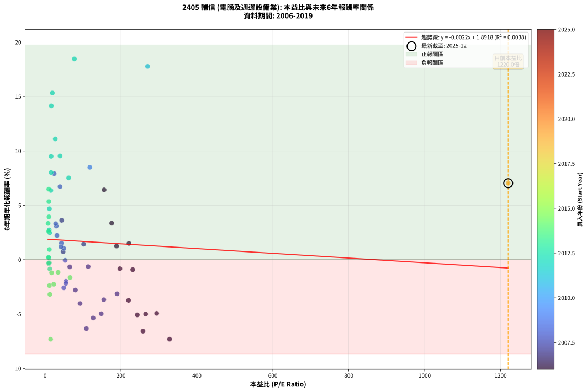
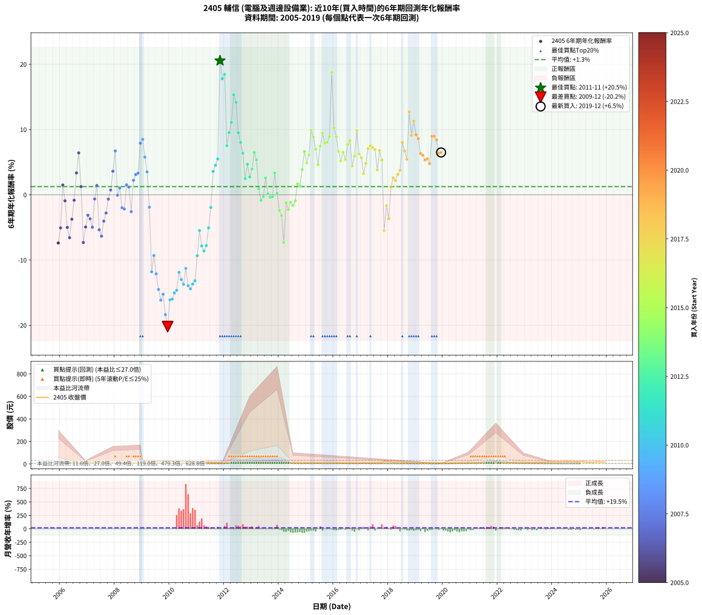

# 2405 輔信 - 本益比與未來報酬率分析

!!! info "報告資訊"
    - **股票代號**: 2405
    - **公司名稱**: 輔信
    - **產業別**: 電腦及週邊設備業
    - **分析期間**: 2006-2019 (168 個數據點)
    - **資料來源**: Type 12 (ShowMonthlyK_ChartFlow) 月收盤價與本益比
    - **報酬率口徑**: 含現金股利 (簡化: 年度合計，假設每年7/1入帳)
    - **報告生成時間**: 2026-01-13 13:25:16 CST

## 📈 視覺化圖表

### 圖表1: 本益比 vs 未來報酬率關係

*圖表1：2405 輔信 本益比與6年期未來報酬率關係 (2006-2019)*

### 圖表2: 歷年買入時點的6年期實際報酬率

*圖表2：2405 輔信 歷年買入時點的6年期實際報酬率 (2006-2019)*

## 📍 買點訊號說明

本報告提供兩種買點提示訊號（顯示於圖表2的股價子圖中）：

### ▲ 小綠色三角形（回測驗證）
- **計算方式**: 使用全部歷史資料計算本益比第25百分位數
- **用途**: 事後驗證，顯示歷史上哪些時點確實為低估區
- **限制**: 當下無法判斷，僅供回測參考
- **特性**: 後見之明（Look-Ahead Bias）

### ▲ 小橘色三角形（即時訊號）
- **計算方式**: 使用截至當月的過去5年資料計算本益比第25百分位數
- **用途**: 實際投資決策，當時即可判斷
- **優勢**: 可操作性強，符合實務需求
- **特性**: 無後見之明，滾動窗口計算

!!! tip "如何使用兩種訊號"
    - **綠色▲** 幫助理解歷史估值機會，驗證策略有效性
    - **橘色▲** 可作為實際買進參考，但仍需搭配基本面分析
    - 兩種訊號重疊時，表示即時判斷與事後驗證一致，信心度較高
    - 僅有綠色▲時，表示當時無法判斷（需要未來資料才能確認）
    - 僅有橘色▲時，表示即時判斷為買點，但事後可能不是最佳時機

## 📊 估值分析摘要

| 指標 | 數值 |
|:---:|:---:|
| **目前本益比** (2019-12) | **1220.00 倍** |
| **歷史平均本益比** | 96.88 倍 |
| **估值水準** | 🔴 相對高估 |
| **預期6年年化報酬率** | **-0.77%** |
| **歷史平均報酬率** | +1.31% |
| **相關係數 (R²)** | 0.0038 |
| **趨勢線斜率** | -0.0022 |

!!! abstract "核心洞察"
    目前本益比顯著高於歷史平均，預期未來報酬率可能較低

    根據歷史數據回測，2405 輔信 在目前本益比 **1220.0倍** 的估值水準下，
    預期未來6年年化報酬率約為 **-0.8%**。

    **重要提醒**: 本分析基於歷史數據統計，實際報酬率會受到公司基本面變化、產業趨勢、
    總體經濟環境等多重因素影響。R² = 0.00 表示本益比可解釋約 0.4% 的報酬率變異。

## 📈 歷史估值統計

### 最佳買點 (最高報酬率)

| 項目 | 數值 |
|:---:|:---:|
| 起始時間 | 2011-11 |
| 當時本益比 | nan 倍 |
| 起始價格 | 8.5 元 |
| 6年後價格 | 24.8 元 |
| **6年年化報酬率** | **+20.55%** |

### 最差買點 (最低報酬率)

| 項目 | 數值 |
|:---:|:---:|
| 起始時間 | 2009-12 |
| 當時本益比 | nan 倍 |
| 起始價格 | 32.8 元 |
| 6年後價格 | 7.3 元 |
| **6年年化報酬率** | **-20.19%** |

## 🎯 投資啟示

### 本益比與報酬率關係

趨勢線方程式: **y = -0.0022x + 1.8918**

!!! note "負相關"
    本益比與未來報酬率呈現負相關。較低的本益比通常帶來較高的未來報酬率，
    但相關性不算非常強。**估值仍是重要參考指標之一**。

### 估值區間建議

基於歷史數據分析:

- **🟢 低估區** (P/E < 77.5): 預期報酬率較高，可考慮增加持股
- **🟡 合理區** (P/E 77.5-116.3): 預期報酬率符合長期趨勢，正常持有
- **🔴 高估區** (P/E > 116.3): 預期報酬率較低，可考慮減碼或觀望

!!! danger "風險提示"
    - 過去表現不代表未來結果
    - 本分析假設公司基本面無重大結構性變化
    - 產業環境劇變可能使歷史規律失效
    - 應結合公司財報、產業趨勢、總體經濟等多重因素綜合判斷

!!! success "長期投資觀點"
    歷史數據顯示，在合理或低估的估值水準買入並長期持有，
    往往能獲得較佳的投資報酬。**耐心等待好價格**是價值投資的核心原則。

## 📊 數據品質

- **資料來源**: GoodInfo.tw Type 12 (ShowMonthlyK_ChartFlow)
- **資料頻率**: 月度收盤價與本益比
- **回測期間**: 2006-2019
- **數據點數量**: 168 個 (每個點代表一次6年期回測)

### 計算方法說明

1. **6年期年化報酬率**:
   - 對每個歷史時點，計算其後6年的實際投資報酬率
   - 期末價值(不含股利): 期末價格
   - 期末價值(含現金股利): 期末價格 + 持有期間內的現金股利合計 (簡化: 年度合計，假設每年7/1入帳)
   - 公式: 年化報酬率 = [(期末價值/期初價格)^(1/年數) - 1] × 100%

2. **本益比 (P/E Ratio)**:
   - 使用當時的月收盤價與EPS計算
   - 資料來源: Type 12 月度河流圖本益比數據

3. **趨勢線 (Linear Regression)**:
   - 使用最小平方法擬合線性趨勢線
   - R²值衡量本益比對報酬率的解釋能力

---

*本報告由 Stock Analysis System v1.9.0 自動生成*
*數據更新時間: 2026-01-13 13:25:16 CST*

## 📋 月度回測明細表

（每一列對應時間線圖中的一個買入點；可用來對照 SVG 圖上的每個點。）

| 買入月份 | 賣出月份 | 回測期限_年 | 實際持有年數 | 買入本益比_倍 | 買入收盤價_元 | 賣出收盤價_元 | 現金股利合計_元 | 總報酬率_pct | 年化報酬率_pct |
| --- | --- | --- | --- | --- | --- | --- | --- | --- | --- |
| 2006-01 | 2012-01 | 6 | 5.999 | 243.00 | 12.15 | 8.31 | 0.58 | -26.83 | -5.07 |
| 2006-02 | 2012-02 | 6 | 5.999 | 221.00 | 11.05 | 11.50 | 0.58 | +9.32 | +1.50 |
| 2006-03 | 2012-03 | 6 | 6.001 | 231.00 | 11.55 | 10.35 | 0.58 | -5.37 | -0.92 |
| 2006-04 | 2012-04 | 6 | 6.001 | 265.00 | 13.25 | 9.16 | 0.58 | -26.49 | -5.00 |
| 2006-05 | 2012-05 | 6 | 6.001 | 258.00 | 12.90 | 8.00 | 0.58 | -33.49 | -6.57 |
| 2006-06 | 2012-06 | 6 | 6.001 | 220.00 | 11.00 | 8.17 | 0.58 | -20.45 | -3.74 |
| 2006-07 | 2012-07 | 6 | 6.001 | 197.20 | 9.86 | 9.18 | 0.20 | -4.87 | -0.83 |
| 2006-08 | 2012-08 | 6 | 6.001 | 175.60 | 8.78 | 10.50 | 0.20 | +21.87 | +3.35 |
| 2006-09 | 2012-09 | 6 | 6.001 | 155.60 | 7.78 | 11.10 | 0.20 | +45.24 | +6.42 |
| 2006-10 | 2012-10 | 6 | 6.001 | 188.40 | 9.42 | 9.95 | 0.20 | +7.75 | +1.25 |
| 2006-11 | 2012-11 | 6 | 6.001 | 328.00 | 16.40 | 10.20 | 0.20 | -36.59 | -7.31 |
| 2006-12 | 2012-12 | 6 | 6.001 | 294.00 | 14.70 | 10.65 | 0.20 | -26.19 | -4.93 |
| 2007-01 | 2013-01 | 6 | 6.001 | 189.80 | 12.65 | 10.25 | 0.20 | -17.39 | -3.13 |
| 2007-02 | 2013-02 | 6 | 6.001 | 154.80 | 12.90 | 10.10 | 0.20 | -20.16 | -3.68 |
| 2007-03 | 2013-03 | 6 | 6.001 | 148.00 | 14.80 | 10.70 | 0.20 | -26.35 | -4.97 |
| 2007-04 | 2013-04 | 6 | 6.001 | 113.60 | 13.25 | 12.55 | 0.20 | -3.77 | -0.64 |
| 2007-05 | 2013-05 | 6 | 6.001 | 101.60 | 13.55 | 14.55 | 0.20 | +8.86 | +1.42 |
| 2007-06 | 2013-06 | 6 | 6.001 | 126.70 | 19.00 | 13.45 | 0.20 | -28.16 | -5.36 |
| 2007-07 | 2013-07 | 6 | 6.001 | 108.90 | 18.15 | 11.55 | 0.70 | -32.51 | -6.34 |
| 2007-08 | 2013-08 | 6 | 6.001 | 92.18 | 16.90 | 12.50 | 0.70 | -21.89 | -4.03 |
| 2007-09 | 2013-09 | 6 | 6.001 | 80.00 | 16.00 | 12.80 | 0.70 | -15.62 | -2.79 |
| 2007-10 | 2013-10 | 6 | 6.001 | 65.08 | 14.10 | 12.85 | 0.70 | -3.90 | -0.66 |
| 2007-11 | 2013-11 | 6 | 6.001 | 47.57 | 11.10 | 10.90 | 0.70 | +4.50 | +0.74 |
| 2007-12 | 2013-12 | 6 | 6.001 | 43.80 | 10.95 | 12.85 | 0.70 | +23.74 | +3.61 |
| 2008-01 | 2014-01 | 6 | 6.001 | 39.42 | 9.92 | 13.95 | 0.70 | +47.68 | +6.71 |
| 2008-02 | 2014-03 | 6 | 6.081 | 52.89 | 13.40 | 12.65 | 0.70 | -0.37 | -0.06 |
| 2008-03 | 2014-03 | 6 | 5.999 | 49.22 | 12.55 | 12.65 | 0.70 | +6.37 | +1.04 |
| 2008-04 | 2014-04 | 6 | 5.999 | 54.94 | 14.10 | 11.80 | 0.70 | -11.35 | -1.99 |
| 2008-05 | 2014-05 | 6 | 5.999 | 54.77 | 14.15 | 11.70 | 0.70 | -12.37 | -2.18 |
| 2008-06 | 2014-06 | 6 | 5.999 | 42.88 | 11.15 | 11.50 | 0.70 | +9.42 | +1.51 |
| 2008-07 | 2014-07 | 6 | 5.999 | 42.04 | 11.00 | 10.60 | 1.20 | +7.27 | +1.18 |
| 2008-08 | 2014-08 | 6 | 5.999 | 49.37 | 13.00 | 9.91 | 1.20 | -14.54 | -2.58 |
| 2008-09 | 2014-09 | 6 | 5.999 | 31.25 | 8.28 | 8.25 | 1.20 | +14.13 | +2.23 |
| 2008-10 | 2014-10 | 6 | 5.999 | 29.55 | 7.88 | 8.26 | 1.20 | +20.05 | +3.09 |
| 2008-11 | 2014-11 | 6 | 5.999 | 27.99 | 7.51 | 7.93 | 1.20 | +21.57 | +3.31 |
| 2008-12 | 2014-12 | 6 | 5.999 | 24.07 | 6.50 | 9.06 | 1.20 | +57.85 | +7.91 |
| 2009-01 | 2015-01 | 6 | 5.999 | 117.90 | 6.09 | 8.73 | 1.20 | +63.05 | +8.49 |
| 2009-02 | 2015-02 | 6 | 5.999 |  | 6.84 | 8.38 | 1.20 | +40.06 | +5.78 |
| 2009-03 | 2015-03 | 6 | 5.999 |  | 7.40 | 7.90 | 1.20 | +22.97 | +3.51 |
| 2009-04 | 2015-04 | 6 | 5.999 |  | 11.05 | 8.65 | 1.20 | -10.86 | -1.90 |
| 2009-05 | 2015-05 | 6 | 5.999 |  | 21.00 | 8.69 | 1.20 | -52.90 | -11.80 |
| 2009-06 | 2015-06 | 6 | 5.999 |  | 19.05 | 9.40 | 1.20 | -44.36 | -9.31 |
| 2009-07 | 2015-07 | 6 | 5.999 |  | 19.40 | 7.74 | 1.20 | -53.92 | -12.12 |
| 2009-08 | 2015-08 | 6 | 5.999 |  | 19.20 | 6.30 | 1.20 | -60.94 | -14.50 |
| 2009-09 | 2015-09 | 6 | 5.999 |  | 23.40 | 6.94 | 1.20 | -65.21 | -16.14 |
| 2009-10 | 2015-10 | 6 | 5.999 |  | 23.45 | 7.50 | 1.20 | -62.90 | -15.24 |
| 2009-11 | 2015-11 | 6 | 5.999 |  | 28.65 | 7.29 | 1.20 | -70.37 | -18.35 |
| 2009-12 | 2015-12 | 6 | 5.999 |  | 32.80 | 7.28 | 1.20 | -74.15 | -20.19 |
| 2010-01 | 2016-01 | 6 | 5.999 |  | 26.20 | 7.95 | 1.20 | -65.08 | -16.09 |
| 2010-02 | 2016-02 | 6 | 5.999 |  | 27.35 | 8.42 | 1.20 | -64.83 | -15.99 |
| 2010-03 | 2016-03 | 6 | 6.001 |  | 28.70 | 9.60 | 1.20 | -62.37 | -15.03 |
| 2010-04 | 2016-04 | 6 | 6.001 |  | 26.80 | 9.17 | 1.20 | -61.31 | -14.63 |
| 2010-05 | 2016-05 | 6 | 6.001 |  | 22.70 | 9.43 | 1.20 | -53.17 | -11.88 |
| 2010-06 | 2016-06 | 6 | 6.001 |  | 23.80 | 9.13 | 1.20 | -56.60 | -12.98 |
| 2010-07 | 2016-07 | 6 | 6.001 |  | 24.30 | 8.83 | 1.20 | -58.72 | -13.71 |
| 2010-08 | 2016-08 | 6 | 6.001 |  | 22.80 | 9.92 | 1.20 | -51.23 | -11.28 |
| 2010-09 | 2016-09 | 6 | 6.001 |  | 26.80 | 9.70 | 1.20 | -59.33 | -13.92 |
| 2010-10 | 2016-10 | 6 | 6.001 |  | 23.70 | 8.12 | 1.20 | -60.68 | -14.40 |
| 2010-11 | 2016-11 | 6 | 6.001 |  | 21.10 | 7.53 | 1.20 | -58.63 | -13.68 |
| 2010-12 | 2016-12 | 6 | 6.001 |  | 21.70 | 8.10 | 1.20 | -57.14 | -13.17 |
| 2011-01 | 2017-01 | 6 | 6.001 |  | 17.90 | 8.75 | 1.20 | -44.41 | -9.32 |
| 2011-02 | 2017-02 | 6 | 6.001 |  | 16.40 | 10.50 | 1.20 | -28.66 | -5.47 |
| 2011-03 | 2017-03 | 6 | 6.001 |  | 17.20 | 9.34 | 1.20 | -38.72 | -7.84 |
| 2011-04 | 2017-04 | 6 | 6.001 |  | 16.60 | 8.47 | 1.20 | -41.75 | -8.61 |
| 2011-05 | 2017-05 | 6 | 6.001 |  | 15.40 | 8.27 | 1.20 | -38.51 | -7.78 |
| 2011-06 | 2017-06 | 6 | 6.001 |  | 14.95 | 9.74 | 1.20 | -26.82 | -5.07 |
| 2011-07 | 2017-07 | 6 | 6.001 |  | 13.40 | 10.60 | 1.32 | -11.04 | -1.93 |
| 2011-08 | 2017-08 | 6 | 6.001 |  | 10.25 | 11.35 | 1.32 | +23.61 | +3.59 |
| 2011-09 | 2017-09 | 6 | 6.001 |  | 9.52 | 11.10 | 1.32 | +30.46 | +4.53 |
| 2011-10 | 2017-10 | 6 | 6.001 |  | 9.70 | 12.05 | 1.32 | +37.84 | +5.49 |
| 2011-11 | 2017-11 | 6 | 6.001 |  | 8.51 | 24.80 | 1.32 | +206.93 | +20.55 |
| 2011-12 | 2017-12 | 6 | 6.001 | 270.00 | 8.10 | 20.30 | 1.32 | +166.91 | +17.77 |
| 2012-01 | 2018-01 | 6 | 6.001 | 77.30 | 8.31 | 21.65 | 1.32 | +176.41 | +18.46 |
| 2012-02 | 2018-03 | 6 | 6.081 | 62.16 | 11.50 | 16.55 | 1.32 | +55.39 | +7.52 |
| 2012-03 | 2018-03 | 6 | 5.999 | 39.43 | 10.35 | 16.55 | 1.32 | +72.66 | +9.53 |
| 2012-04 | 2018-04 | 6 | 5.999 | 26.94 | 9.16 | 15.90 | 1.32 | +87.99 | +11.10 |
| 2012-05 | 2018-05 | 6 | 5.999 | 19.16 | 8.00 | 17.50 | 1.32 | +135.25 | +15.33 |
| 2012-06 | 2018-06 | 6 | 5.999 | 16.51 | 8.17 | 16.75 | 1.32 | +121.18 | +14.15 |
| 2012-07 | 2018-07 | 6 | 5.999 | 16.03 | 9.18 | 14.50 | 1.32 | +72.33 | +9.50 |
| 2012-08 | 2018-08 | 6 | 5.999 | 16.15 | 10.50 | 15.35 | 1.32 | +58.76 | +8.01 |
| 2012-09 | 2018-09 | 6 | 5.999 | 15.26 | 11.10 | 14.75 | 1.32 | +44.77 | +6.36 |
| 2012-10 | 2018-10 | 6 | 5.999 | 12.36 | 9.95 | 10.20 | 1.32 | +15.78 | +2.47 |
| 2012-11 | 2018-11 | 6 | 5.999 | 11.56 | 10.20 | 12.10 | 1.32 | +31.57 | +4.68 |
| 2012-12 | 2018-12 | 6 | 5.999 | 11.09 | 10.65 | 11.20 | 1.32 | +17.56 | +2.73 |
| 2013-01 | 2019-01 | 6 | 5.999 | 10.30 | 10.25 | 11.60 | 1.32 | +26.05 | +3.93 |
| 2013-02 | 2019-02 | 6 | 5.999 | 9.81 | 10.10 | 13.40 | 1.32 | +45.74 | +6.48 |
| 2013-03 | 2019-03 | 6 | 5.999 | 10.05 | 10.70 | 13.30 | 1.32 | +36.64 | +5.34 |
| 2013-04 | 2019-04 | 6 | 5.999 | 11.41 | 12.55 | 11.95 | 1.32 | +5.74 | +0.93 |
| 2013-05 | 2019-05 | 6 | 5.999 | 12.82 | 14.55 | 12.50 | 1.32 | -5.02 | -0.85 |
| 2013-06 | 2019-06 | 6 | 5.999 | 11.50 | 13.45 | 11.90 | 1.32 | -1.71 | -0.29 |
| 2013-07 | 2019-07 | 6 | 5.999 | 9.59 | 11.55 | 12.65 | 0.82 | +16.62 | +2.60 |
| 2013-08 | 2019-08 | 6 | 5.999 | 10.08 | 12.50 | 11.80 | 0.82 | +0.96 | +0.16 |
| 2013-09 | 2019-09 | 6 | 5.999 | 10.04 | 12.80 | 11.70 | 0.82 | -2.19 | -0.37 |
| 2013-10 | 2019-10 | 6 | 5.999 | 9.81 | 12.85 | 11.80 | 0.82 | -1.79 | -0.30 |
| 2013-11 | 2019-11 | 6 | 5.999 | 8.10 | 10.90 | 12.45 | 0.82 | +21.74 | +3.33 |
| 2013-12 | 2019-12 | 6 | 5.999 | 9.31 | 12.85 | 12.20 | 0.82 | +1.32 | +0.22 |
| 2014-01 | 2020-01 | 6 | 5.999 | 11.57 | 13.95 | 11.25 | 0.82 | -13.48 | -2.38 |
| 2014-02 | 2020-02 | 6 | 5.999 | 12.79 | 13.20 | 10.05 | 0.82 | -17.65 | -3.19 |
| 2014-03 | 2020-03 | 6 | 6.001 | 14.75 | 12.65 | 7.20 | 0.82 | -36.60 | -7.31 |
| 2014-04 | 2020-04 | 6 | 6.001 | 17.27 | 11.80 | 10.15 | 0.82 | -7.03 | -1.21 |
| 2014-05 | 2020-05 | 6 | 6.001 | 22.98 | 11.70 | 9.38 | 0.82 | -12.82 | -2.26 |
| 2014-06 | 2020-06 | 6 | 6.001 | 34.33 | 11.50 | 9.90 | 0.82 | -6.78 | -1.16 |
| 2014-07 | 2020-07 | 6 | 6.001 | 65.91 | 10.60 | 9.48 | 0.12 | -9.43 | -1.64 |
| 2014-08 | 2020-08 | 6 | 6.001 |  | 9.91 | 9.26 | 0.12 | -5.35 | -0.91 |
| 2014-09 | 2020-09 | 6 | 6.001 |  | 8.25 | 8.99 | 0.12 | +10.42 | +1.67 |
| 2014-10 | 2020-10 | 6 | 6.001 |  | 8.26 | 8.83 | 0.12 | +8.35 | +1.35 |
| 2014-11 | 2020-11 | 6 | 6.001 |  | 7.93 | 9.83 | 0.12 | +25.47 | +3.85 |
| 2014-12 | 2020-12 | 6 | 6.001 |  | 9.06 | 13.20 | 0.12 | +47.02 | +6.63 |
| 2015-01 | 2021-01 | 6 | 6.001 |  | 8.73 | 11.50 | 0.12 | +33.10 | +4.88 |
| 2015-02 | 2021-02 | 6 | 6.001 |  | 8.38 | 11.85 | 0.12 | +42.84 | +6.12 |
| 2015-03 | 2021-03 | 6 | 6.001 |  | 7.90 | 13.80 | 0.12 | +76.20 | +9.90 |
| 2015-04 | 2021-04 | 6 | 6.001 |  | 8.65 | 14.25 | 0.12 | +66.13 | +8.83 |
| 2015-05 | 2021-05 | 6 | 6.001 |  | 8.69 | 12.90 | 0.12 | +49.83 | +6.97 |
| 2015-06 | 2021-06 | 6 | 6.001 |  | 9.40 | 12.20 | 0.12 | +31.06 | +4.61 |
| 2015-07 | 2021-07 | 6 | 6.001 |  | 7.74 | 11.80 | 0.12 | +54.01 | +7.46 |
| 2015-08 | 2021-08 | 6 | 6.001 |  | 6.30 | 10.70 | 0.12 | +71.75 | +9.43 |
| 2015-09 | 2021-09 | 6 | 6.001 |  | 6.94 | 10.85 | 0.12 | +58.07 | +7.93 |
| 2015-10 | 2021-10 | 6 | 6.001 |  | 7.50 | 11.80 | 0.12 | +58.93 | +8.03 |
| 2015-11 | 2021-11 | 6 | 6.001 |  | 7.29 | 12.05 | 0.12 | +66.94 | +8.91 |
| 2015-12 | 2021-12 | 6 | 6.001 |  | 7.28 | 20.30 | 0.12 | +180.49 | +18.75 |
| 2016-01 | 2022-01 | 6 | 6.001 |  | 7.95 | 14.15 | 0.12 | +79.50 | +10.24 |
| 2016-02 | 2022-03 | 6 | 6.081 |  | 8.42 | 14.00 | 0.12 | +67.70 | +8.87 |
| 2016-03 | 2022-03 | 6 | 5.999 |  | 9.60 | 14.00 | 0.12 | +47.08 | +6.64 |
| 2016-04 | 2022-04 | 6 | 5.999 |  | 9.17 | 12.30 | 0.12 | +35.44 | +5.19 |
| 2016-05 | 2022-05 | 6 | 5.999 |  | 9.43 | 13.65 | 0.12 | +46.02 | +6.51 |
| 2016-06 | 2022-06 | 6 | 5.999 |  | 9.13 | 12.40 | 0.12 | +37.13 | +5.40 |
| 2016-07 | 2022-07 | 6 | 5.999 |  | 8.83 | 13.65 | 0.12 | +55.95 | +7.69 |
| 2016-08 | 2022-08 | 6 | 5.999 |  | 9.92 | 15.90 | 0.12 | +61.49 | +8.32 |
| 2016-09 | 2022-09 | 6 | 5.999 |  | 9.70 | 12.45 | 0.12 | +29.59 | +4.42 |
| 2016-10 | 2022-10 | 6 | 5.999 |  | 8.12 | 11.35 | 0.12 | +41.26 | +5.93 |
| 2016-11 | 2022-11 | 6 | 5.999 |  | 7.53 | 13.10 | 0.12 | +75.56 | +9.84 |
| 2016-12 | 2022-12 | 6 | 5.999 |  | 8.10 | 11.55 | 0.12 | +44.07 | +6.28 |
| 2017-01 | 2023-01 | 6 | 5.999 |  | 8.75 | 12.05 | 0.12 | +39.09 | +5.65 |
| 2017-02 | 2023-02 | 6 | 5.999 |  | 10.50 | 12.60 | 0.12 | +21.14 | +3.25 |
| 2017-03 | 2023-03 | 6 | 5.999 |  | 9.34 | 12.25 | 0.12 | +32.44 | +4.80 |
| 2017-04 | 2023-04 | 6 | 5.999 |  | 8.47 | 12.65 | 0.12 | +50.77 | +7.08 |
| 2017-05 | 2023-05 | 6 | 5.999 |  | 8.27 | 12.65 | 0.12 | +54.41 | +7.51 |
| 2017-06 | 2023-06 | 6 | 5.999 |  | 9.74 | 14.70 | 0.12 | +52.16 | +7.25 |
| 2017-07 | 2023-07 | 6 | 5.999 |  | 10.60 | 15.65 | 0.20 | +49.53 | +6.94 |
| 2017-08 | 2023-08 | 6 | 5.999 |  | 11.35 | 14.00 | 0.20 | +25.11 | +3.81 |
| 2017-09 | 2023-09 | 6 | 5.999 |  | 11.10 | 16.25 | 0.20 | +48.20 | +6.78 |
| 2017-10 | 2023-10 | 6 | 5.999 |  | 12.05 | 16.25 | 0.20 | +36.51 | +5.33 |
| 2017-11 | 2023-11 | 6 | 5.999 |  | 24.80 | 17.45 | 0.20 | -28.83 | -5.51 |
| 2017-12 | 2023-12 | 6 | 5.999 |  | 20.30 | 18.15 | 0.20 | -9.61 | -1.67 |
| 2018-01 | 2024-01 | 6 | 5.999 |  | 21.65 | 17.10 | 0.20 | -20.09 | -3.67 |
| 2018-02 | 2024-02 | 6 | 5.999 |  | 19.20 | 20.45 | 0.20 | +7.55 | +1.22 |
| 2018-03 | 2024-03 | 6 | 6.001 |  | 16.55 | 19.10 | 0.20 | +16.62 | +2.59 |
| 2018-04 | 2024-04 | 6 | 6.001 |  | 15.90 | 17.90 | 0.20 | +13.84 | +2.18 |
| 2018-05 | 2024-05 | 6 | 6.001 |  | 17.50 | 20.85 | 0.20 | +20.29 | +3.13 |
| 2018-06 | 2024-06 | 6 | 6.001 |  | 16.75 | 20.70 | 0.20 | +24.78 | +3.76 |
| 2018-07 | 2024-07 | 6 | 6.001 |  | 14.50 | 22.65 | 0.37 | +58.76 | +8.01 |
| 2018-08 | 2024-08 | 6 | 6.001 |  | 15.35 | 22.30 | 0.37 | +47.69 | +6.71 |
| 2018-09 | 2024-09 | 6 | 6.001 |  | 14.75 | 19.90 | 0.37 | +37.42 | +5.44 |
| 2018-10 | 2024-10 | 6 | 6.001 |  | 10.20 | 20.55 | 0.37 | +105.10 | +12.72 |
| 2018-11 | 2024-11 | 6 | 6.001 |  | 12.10 | 20.05 | 0.37 | +68.76 | +9.11 |
| 2018-12 | 2024-12 | 6 | 6.001 |  | 11.20 | 20.90 | 0.37 | +89.91 | +11.28 |
| 2019-01 | 2025-01 | 6 | 6.001 |  | 11.60 | 19.30 | 0.37 | +69.57 | +9.20 |
| 2019-02 | 2025-02 | 6 | 6.001 |  | 13.40 | 21.60 | 0.37 | +63.96 | +8.59 |
| 2019-03 | 2025-03 | 6 | 6.001 |  | 13.30 | 18.85 | 0.37 | +44.51 | +6.33 |
| 2019-04 | 2025-04 | 6 | 6.001 |  | 11.95 | 16.65 | 0.37 | +42.43 | +6.07 |
| 2019-05 | 2025-05 | 6 | 6.001 |  | 12.50 | 16.70 | 0.37 | +36.56 | +5.33 |
| 2019-06 | 2025-06 | 6 | 6.001 |  | 11.90 | 16.05 | 0.37 | +37.98 | +5.51 |
| 2019-07 | 2025-07 | 6 | 6.001 |  | 12.65 | 16.20 | 0.54 | +32.33 | +4.78 |
| 2019-08 | 2025-08 | 6 | 6.001 |  | 11.80 | 19.20 | 0.54 | +67.29 | +8.95 |
| 2019-09 | 2025-09 | 6 | 6.001 |  | 11.70 | 19.05 | 0.54 | +67.44 | +8.97 |
| 2019-10 | 2025-10 | 6 | 6.001 |  | 11.80 | 18.60 | 0.54 | +62.20 | +8.39 |
| 2019-11 | 2025-11 | 6 | 6.001 |  | 12.45 | 17.50 | 0.54 | +44.90 | +6.37 |
| 2019-12 | 2025-12 | 6 | 6.001 | 1220.00 | 12.20 | 17.80 | 0.54 | +50.33 | +7.03 |
