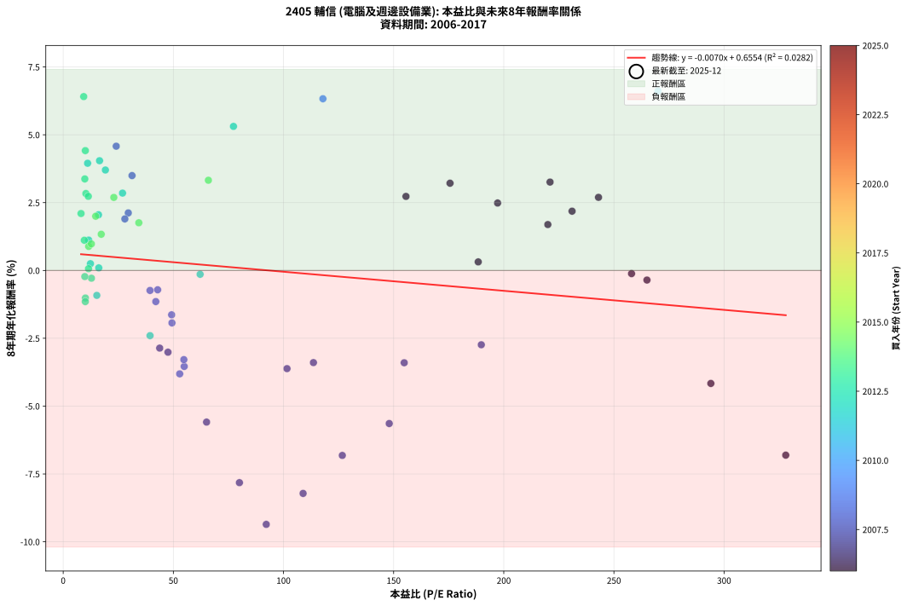
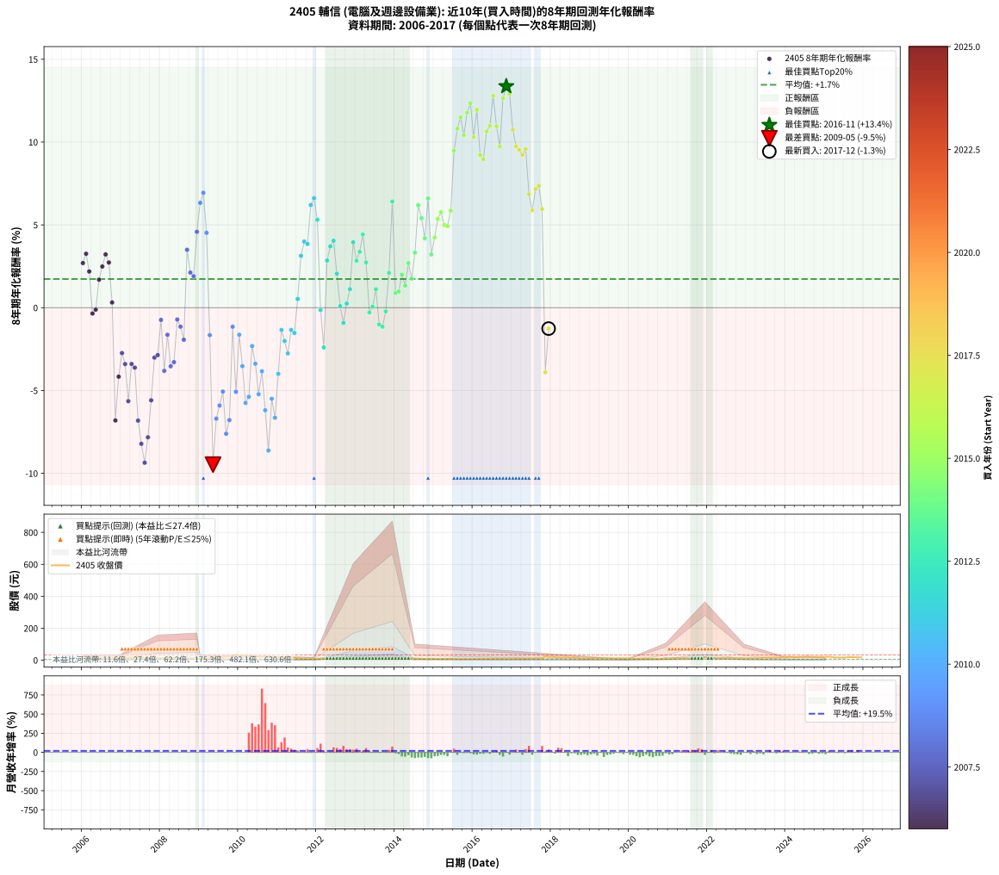

# 2405 輔信 - 本益比與未來報酬率分析

!!! info "報告資訊"
    - **股票代號**: 2405
    - **公司名稱**: 輔信
    - **產業別**: 電腦及週邊設備業
    - **分析期間**: 2006-2017 (144 個數據點)
    - **資料來源**: Type 12 (ShowMonthlyK_ChartFlow) 月收盤價與本益比
    - **報酬率口徑**: 含現金股利 (簡化: 年度合計，假設每年7/1入帳)
    - **報告生成時間**: 2026-01-04 08:25:33 CST

## 📈 視覺化圖表

### 圖表1: 本益比 vs 未來報酬率關係

*圖表1：2405 輔信 本益比與8年期未來報酬率關係 (2006-2017)*

### 圖表2: 歷年買入時點的8年期實際報酬率

*圖表2：2405 輔信 歷年買入時點的8年期實際報酬率 (2006-2017)*

## 📍 買點訊號說明

本報告提供兩種買點提示訊號（顯示於圖表2的股價子圖中）：

### ▲ 小綠色三角形（回測驗證）
- **計算方式**: 使用全部歷史資料計算本益比第25百分位數
- **用途**: 事後驗證，顯示歷史上哪些時點確實為低估區
- **限制**: 當下無法判斷，僅供回測參考
- **特性**: 後見之明（Look-Ahead Bias）

### ▲ 小橘色三角形（即時訊號）
- **計算方式**: 使用截至當月的過去5年資料計算本益比第25百分位數
- **用途**: 實際投資決策，當時即可判斷
- **優勢**: 可操作性強，符合實務需求
- **特性**: 無後見之明，滾動窗口計算

!!! tip "如何使用兩種訊號"
    - **綠色▲** 幫助理解歷史估值機會，驗證策略有效性
    - **橘色▲** 可作為實際買進參考，但仍需搭配基本面分析
    - 兩種訊號重疊時，表示即時判斷與事後驗證一致，信心度較高
    - 僅有綠色▲時，表示當時無法判斷（需要未來資料才能確認）
    - 僅有橘色▲時，表示即時判斷為買點，但事後可能不是最佳時機

## 📊 估值分析摘要

| 指標 | 數值 |
|:---:|:---:|
| **目前本益比** (2017-12) | **nan 倍** |
| **歷史平均本益比** | 80.60 倍 |
| **估值水準** | 🟡 合理範圍 |
| **預期8年年化報酬率** | **+nan%** |
| **歷史平均報酬率** | +1.73% |
| **相關係數 (R²)** | 0.0282 |
| **趨勢線斜率** | -0.0070 |

!!! abstract "核心洞察"
    目前本益比接近歷史平均，預期報酬率符合長期趨勢

    根據歷史數據回測，2405 輔信 在目前本益比 **nan倍** 的估值水準下，
    預期未來8年年化報酬率約為 **+nan%**。

    **重要提醒**: 本分析基於歷史數據統計，實際報酬率會受到公司基本面變化、產業趨勢、
    總體經濟環境等多重因素影響。R² = 0.03 表示本益比可解釋約 2.8% 的報酬率變異。

## 📈 歷史估值統計

### 最佳買點 (最高報酬率)

| 項目 | 數值 |
|:---:|:---:|
| 起始時間 | 2016-11 |
| 當時本益比 | nan 倍 |
| 起始價格 | 7.5 元 |
| 8年後價格 | 20.1 元 |
| **8年年化報酬率** | **+13.36%** |

### 最差買點 (最低報酬率)

| 項目 | 數值 |
|:---:|:---:|
| 起始時間 | 2009-05 |
| 當時本益比 | nan 倍 |
| 起始價格 | 21.0 元 |
| 8年後價格 | 8.3 元 |
| **8年年化報酬率** | **-9.48%** |

## 🎯 投資啟示

### 本益比與報酬率關係

趨勢線方程式: **y = -0.0070x + 0.6554**

!!! note "負相關"
    本益比與未來報酬率呈現負相關。較低的本益比通常帶來較高的未來報酬率，
    但相關性不算非常強。**估值仍是重要參考指標之一**。

### 估值區間建議

基於歷史數據分析:

- **🟢 低估區** (P/E < 64.5): 預期報酬率較高，可考慮增加持股
- **🟡 合理區** (P/E 64.5-96.7): 預期報酬率符合長期趨勢，正常持有
- **🔴 高估區** (P/E > 96.7): 預期報酬率較低，可考慮減碼或觀望

!!! danger "風險提示"
    - 過去表現不代表未來結果
    - 本分析假設公司基本面無重大結構性變化
    - 產業環境劇變可能使歷史規律失效
    - 應結合公司財報、產業趨勢、總體經濟等多重因素綜合判斷

!!! success "長期投資觀點"
    歷史數據顯示，在合理或低估的估值水準買入並長期持有，
    往往能獲得較佳的投資報酬。**耐心等待好價格**是價值投資的核心原則。

## 📊 數據品質

- **資料來源**: GoodInfo.tw Type 12 (ShowMonthlyK_ChartFlow)
- **資料頻率**: 月度收盤價與本益比
- **回測期間**: 2006-2017
- **數據點數量**: 144 個 (每個點代表一次8年期回測)

### 計算方法說明

1. **8年期年化報酬率**:
   - 對每個歷史時點，計算其後8年的實際投資報酬率
   - 期末價值(不含股利): 期末價格
   - 期末價值(含現金股利): 期末價格 + 持有期間內的現金股利合計 (簡化: 年度合計，假設每年7/1入帳)
   - 公式: 年化報酬率 = [(期末價值/期初價格)^(1/年數) - 1] × 100%

2. **本益比 (P/E Ratio)**:
   - 使用當時的月收盤價與EPS計算
   - 資料來源: Type 12 月度河流圖本益比數據

3. **趨勢線 (Linear Regression)**:
   - 使用最小平方法擬合線性趨勢線
   - R²值衡量本益比對報酬率的解釋能力

---

*本報告由 Stock Analysis System v1.9.0 自動生成*
*數據更新時間: 2026-01-04 08:25:33 CST*

## 📋 月度回測明細表

（每一列對應時間線圖中的一個買入點；可用來對照 SVG 圖上的每個點。）

| 買入月份 | 賣出月份 | 回測期限_年 | 實際持有年數 | 買入本益比_倍 | 買入收盤價_元 | 賣出收盤價_元 | 現金股利合計_元 | 總報酬率_pct | 年化報酬率_pct |
| --- | --- | --- | --- | --- | --- | --- | --- | --- | --- |
| 2006-01 | 2014-01 | 8 | 8.000 | 243.00 | 12.15 | 13.95 | 1.08 | +23.70 | +2.69 |
| 2006-02 | 2014-02 | 8 | 8.000 | 221.00 | 11.05 | 13.20 | 1.08 | +29.23 | +3.26 |
| 2006-03 | 2014-03 | 8 | 8.000 | 231.00 | 11.55 | 12.65 | 1.08 | +18.87 | +2.18 |
| 2006-04 | 2014-04 | 8 | 8.000 | 265.00 | 13.25 | 11.80 | 1.08 | -2.79 | -0.35 |
| 2006-05 | 2014-05 | 8 | 8.000 | 258.00 | 12.90 | 11.70 | 1.08 | -0.93 | -0.12 |
| 2006-06 | 2014-06 | 8 | 8.000 | 220.00 | 11.00 | 11.50 | 1.08 | +14.36 | +1.69 |
| 2006-07 | 2014-07 | 8 | 8.000 | 197.20 | 9.86 | 10.60 | 1.40 | +21.70 | +2.49 |
| 2006-08 | 2014-08 | 8 | 8.000 | 175.60 | 8.78 | 9.91 | 1.40 | +28.82 | +3.22 |
| 2006-09 | 2014-09 | 8 | 8.000 | 155.60 | 7.78 | 8.25 | 1.40 | +24.04 | +2.73 |
| 2006-10 | 2014-10 | 8 | 8.000 | 188.40 | 9.42 | 8.26 | 1.40 | +2.55 | +0.31 |
| 2006-11 | 2014-11 | 8 | 8.000 | 328.00 | 16.40 | 7.93 | 1.40 | -43.11 | -6.81 |
| 2006-12 | 2014-12 | 8 | 8.000 | 294.00 | 14.70 | 9.06 | 1.40 | -28.84 | -4.16 |
| 2007-01 | 2015-01 | 8 | 8.000 | 189.80 | 12.65 | 8.73 | 1.40 | -19.92 | -2.74 |
| 2007-02 | 2015-02 | 8 | 8.000 | 154.80 | 12.90 | 8.38 | 1.40 | -24.19 | -3.40 |
| 2007-03 | 2015-03 | 8 | 8.000 | 148.00 | 14.80 | 7.90 | 1.40 | -37.16 | -5.64 |
| 2007-04 | 2015-04 | 8 | 8.000 | 113.60 | 13.25 | 8.65 | 1.40 | -24.15 | -3.40 |
| 2007-05 | 2015-05 | 8 | 8.000 | 101.60 | 13.55 | 8.69 | 1.40 | -25.54 | -3.62 |
| 2007-06 | 2015-06 | 8 | 8.000 | 126.70 | 19.00 | 9.40 | 1.40 | -43.16 | -6.82 |
| 2007-07 | 2015-07 | 8 | 8.000 | 108.90 | 18.15 | 7.74 | 1.40 | -49.64 | -8.22 |
| 2007-08 | 2015-08 | 8 | 8.000 | 92.18 | 16.90 | 6.30 | 1.40 | -54.44 | -9.36 |
| 2007-09 | 2015-09 | 8 | 8.000 | 80.00 | 16.00 | 6.94 | 1.40 | -47.88 | -7.82 |
| 2007-10 | 2015-10 | 8 | 8.000 | 65.08 | 14.10 | 7.50 | 1.40 | -36.88 | -5.59 |
| 2007-11 | 2015-11 | 8 | 8.000 | 47.57 | 11.10 | 7.29 | 1.40 | -21.71 | -3.01 |
| 2007-12 | 2015-12 | 8 | 8.000 | 43.80 | 10.95 | 7.28 | 1.40 | -20.73 | -2.86 |
| 2008-01 | 2016-01 | 8 | 8.000 | 39.42 | 9.92 | 7.95 | 1.40 | -5.75 | -0.74 |
| 2008-02 | 2016-02 | 8 | 8.000 | 52.89 | 13.40 | 8.42 | 1.40 | -26.72 | -3.81 |
| 2008-03 | 2016-03 | 8 | 8.000 | 49.22 | 12.55 | 9.60 | 1.40 | -12.35 | -1.63 |
| 2008-04 | 2016-04 | 8 | 8.000 | 54.94 | 14.10 | 9.17 | 1.40 | -25.04 | -3.54 |
| 2008-05 | 2016-05 | 8 | 8.000 | 54.77 | 14.15 | 9.43 | 1.40 | -23.46 | -3.29 |
| 2008-06 | 2016-06 | 8 | 8.000 | 42.88 | 11.15 | 9.13 | 1.40 | -5.56 | -0.71 |
| 2008-07 | 2016-07 | 8 | 8.000 | 42.04 | 11.00 | 8.83 | 1.20 | -8.82 | -1.15 |
| 2008-08 | 2016-08 | 8 | 8.000 | 49.37 | 13.00 | 9.92 | 1.20 | -14.46 | -1.93 |
| 2008-09 | 2016-09 | 8 | 8.000 | 31.25 | 8.28 | 9.70 | 1.20 | +31.64 | +3.50 |
| 2008-10 | 2016-10 | 8 | 8.000 | 29.55 | 7.88 | 8.12 | 1.20 | +18.27 | +2.12 |
| 2008-11 | 2016-11 | 8 | 8.000 | 27.99 | 7.51 | 7.53 | 1.20 | +16.25 | +1.90 |
| 2008-12 | 2016-12 | 8 | 8.000 | 24.07 | 6.50 | 8.10 | 1.20 | +43.08 | +4.58 |
| 2009-01 | 2017-01 | 8 | 8.000 | 117.90 | 6.09 | 8.75 | 1.20 | +63.38 | +6.33 |
| 2009-02 | 2017-02 | 8 | 8.000 |  | 6.84 | 10.50 | 1.20 | +71.05 | +6.94 |
| 2009-03 | 2017-03 | 8 | 8.000 |  | 7.40 | 9.34 | 1.20 | +42.43 | +4.52 |
| 2009-04 | 2017-04 | 8 | 8.000 |  | 11.05 | 8.47 | 1.20 | -12.49 | -1.65 |
| 2009-05 | 2017-05 | 8 | 8.000 |  | 21.00 | 8.27 | 1.20 | -54.90 | -9.48 |
| 2009-06 | 2017-06 | 8 | 8.000 |  | 19.05 | 9.74 | 1.20 | -42.57 | -6.70 |
| 2009-07 | 2017-07 | 8 | 8.000 |  | 19.40 | 10.60 | 1.32 | -38.56 | -5.91 |
| 2009-08 | 2017-08 | 8 | 8.000 |  | 19.20 | 11.35 | 1.32 | -34.01 | -5.06 |
| 2009-09 | 2017-09 | 8 | 8.000 |  | 23.40 | 11.10 | 1.32 | -46.92 | -7.61 |
| 2009-10 | 2017-10 | 8 | 8.000 |  | 23.45 | 12.05 | 1.32 | -42.99 | -6.78 |
| 2009-11 | 2017-11 | 8 | 8.000 |  | 28.65 | 24.80 | 1.32 | -8.83 | -1.15 |
| 2009-12 | 2017-12 | 8 | 8.000 |  | 32.80 | 20.30 | 1.32 | -34.09 | -5.08 |
| 2010-01 | 2018-01 | 8 | 8.000 |  | 26.20 | 21.65 | 1.32 | -12.33 | -1.63 |
| 2010-02 | 2018-02 | 8 | 8.000 |  | 27.35 | 19.20 | 1.32 | -24.97 | -3.53 |
| 2010-03 | 2018-03 | 8 | 8.000 |  | 28.70 | 16.55 | 1.32 | -37.74 | -5.75 |
| 2010-04 | 2018-04 | 8 | 8.000 |  | 26.80 | 15.90 | 1.32 | -35.75 | -5.38 |
| 2010-05 | 2018-05 | 8 | 8.000 |  | 22.70 | 17.50 | 1.32 | -17.09 | -2.32 |
| 2010-06 | 2018-06 | 8 | 8.000 |  | 23.80 | 16.75 | 1.32 | -24.08 | -3.38 |
| 2010-07 | 2018-07 | 8 | 8.000 |  | 24.30 | 14.50 | 1.32 | -34.90 | -5.22 |
| 2010-08 | 2018-08 | 8 | 8.000 |  | 22.80 | 15.35 | 1.32 | -26.89 | -3.84 |
| 2010-09 | 2018-09 | 8 | 8.000 |  | 26.80 | 14.75 | 1.32 | -40.04 | -6.19 |
| 2010-10 | 2018-10 | 8 | 8.000 |  | 23.70 | 10.20 | 1.32 | -51.39 | -8.62 |
| 2010-11 | 2018-11 | 8 | 8.000 |  | 21.10 | 12.10 | 1.32 | -36.40 | -5.50 |
| 2010-12 | 2018-12 | 8 | 8.000 |  | 21.70 | 11.20 | 1.32 | -42.30 | -6.64 |
| 2011-01 | 2019-01 | 8 | 8.000 |  | 17.90 | 11.60 | 1.32 | -27.82 | -3.99 |
| 2011-02 | 2019-02 | 8 | 8.000 |  | 16.40 | 13.40 | 1.32 | -10.24 | -1.34 |
| 2011-03 | 2019-03 | 8 | 8.000 |  | 17.20 | 13.30 | 1.32 | -15.00 | -2.01 |
| 2011-04 | 2019-04 | 8 | 8.000 |  | 16.60 | 11.95 | 1.32 | -20.06 | -2.76 |
| 2011-05 | 2019-05 | 8 | 8.000 |  | 15.40 | 12.50 | 1.32 | -10.26 | -1.34 |
| 2011-06 | 2019-06 | 8 | 8.000 |  | 14.95 | 11.90 | 1.32 | -11.57 | -1.53 |
| 2011-07 | 2019-07 | 8 | 8.000 |  | 13.40 | 12.65 | 1.32 | +4.25 | +0.52 |
| 2011-08 | 2019-08 | 8 | 8.000 |  | 10.25 | 11.80 | 1.32 | +28.00 | +3.13 |
| 2011-09 | 2019-09 | 8 | 8.000 |  | 9.52 | 11.70 | 1.32 | +36.76 | +3.99 |
| 2011-10 | 2019-10 | 8 | 8.000 |  | 9.70 | 11.80 | 1.32 | +35.26 | +3.85 |
| 2011-11 | 2019-11 | 8 | 8.000 |  | 8.51 | 12.45 | 1.32 | +61.81 | +6.20 |
| 2011-12 | 2019-12 | 8 | 8.000 | 270.00 | 8.10 | 12.20 | 1.32 | +66.91 | +6.61 |
| 2012-01 | 2020-01 | 8 | 8.000 | 77.30 | 8.31 | 11.25 | 1.32 | +51.26 | +5.31 |
| 2012-02 | 2020-02 | 8 | 8.000 | 62.16 | 11.50 | 10.05 | 1.32 | -1.13 | -0.14 |
| 2012-03 | 2020-03 | 8 | 8.000 | 39.43 | 10.35 | 7.20 | 1.32 | -17.68 | -2.40 |
| 2012-04 | 2020-04 | 8 | 8.000 | 26.94 | 9.16 | 10.15 | 1.32 | +25.22 | +2.85 |
| 2012-05 | 2020-05 | 8 | 8.000 | 19.16 | 8.00 | 9.38 | 1.32 | +33.75 | +3.70 |
| 2012-06 | 2020-06 | 8 | 8.000 | 16.51 | 8.17 | 9.90 | 1.32 | +37.33 | +4.05 |
| 2012-07 | 2020-07 | 8 | 8.000 | 16.03 | 9.18 | 9.48 | 1.32 | +17.65 | +2.05 |
| 2012-08 | 2020-08 | 8 | 8.000 | 16.15 | 10.50 | 9.26 | 1.32 | +0.76 | +0.09 |
| 2012-09 | 2020-09 | 8 | 8.000 | 15.26 | 11.10 | 8.99 | 1.32 | -7.12 | -0.92 |
| 2012-10 | 2020-10 | 8 | 8.000 | 12.36 | 9.95 | 8.83 | 1.32 | +2.01 | +0.25 |
| 2012-11 | 2020-11 | 8 | 8.000 | 11.56 | 10.20 | 9.83 | 1.32 | +9.31 | +1.12 |
| 2012-12 | 2020-12 | 8 | 8.000 | 11.09 | 10.65 | 13.20 | 1.32 | +36.34 | +3.95 |
| 2013-01 | 2021-01 | 8 | 8.000 | 10.30 | 10.25 | 11.50 | 1.32 | +25.07 | +2.84 |
| 2013-02 | 2021-02 | 8 | 8.000 | 9.81 | 10.10 | 11.85 | 1.32 | +30.40 | +3.37 |
| 2013-03 | 2021-03 | 8 | 8.000 | 10.05 | 10.70 | 13.80 | 1.32 | +41.31 | +4.42 |
| 2013-04 | 2021-04 | 8 | 8.000 | 11.41 | 12.55 | 14.25 | 1.32 | +24.06 | +2.73 |
| 2013-05 | 2021-05 | 8 | 8.000 | 12.82 | 14.55 | 12.90 | 1.32 | -2.27 | -0.29 |
| 2013-06 | 2021-06 | 8 | 8.000 | 11.50 | 13.45 | 12.20 | 1.32 | +0.52 | +0.06 |
| 2013-07 | 2021-07 | 8 | 8.000 | 9.59 | 11.55 | 11.80 | 0.82 | +9.26 | +1.11 |
| 2013-08 | 2021-08 | 8 | 8.000 | 10.08 | 12.50 | 10.70 | 0.82 | -7.84 | -1.02 |
| 2013-09 | 2021-09 | 8 | 8.000 | 10.04 | 12.80 | 10.85 | 0.82 | -8.83 | -1.15 |
| 2013-10 | 2021-10 | 8 | 8.000 | 9.81 | 12.85 | 11.80 | 0.82 | -1.79 | -0.23 |
| 2013-11 | 2021-11 | 8 | 8.000 | 8.10 | 10.90 | 12.05 | 0.82 | +18.07 | +2.10 |
| 2013-12 | 2021-12 | 8 | 8.000 | 9.31 | 12.85 | 20.30 | 0.82 | +64.36 | +6.41 |
| 2014-01 | 2022-01 | 8 | 8.000 | 11.57 | 13.95 | 14.15 | 0.82 | +7.31 | +0.89 |
| 2014-02 | 2022-02 | 8 | 8.000 | 12.79 | 13.20 | 13.45 | 0.82 | +8.11 | +0.98 |
| 2014-03 | 2022-03 | 8 | 8.000 | 14.75 | 12.65 | 14.00 | 0.82 | +17.15 | +2.00 |
| 2014-04 | 2022-04 | 8 | 8.000 | 17.27 | 11.80 | 12.30 | 0.82 | +11.19 | +1.33 |
| 2014-05 | 2022-05 | 8 | 8.000 | 22.98 | 11.70 | 13.65 | 0.82 | +23.68 | +2.69 |
| 2014-06 | 2022-06 | 8 | 8.000 | 34.33 | 11.50 | 12.40 | 0.82 | +14.96 | +1.76 |
| 2014-07 | 2022-07 | 8 | 8.000 | 65.91 | 10.60 | 13.65 | 0.12 | +29.91 | +3.32 |
| 2014-08 | 2022-08 | 8 | 8.000 |  | 9.91 | 15.90 | 0.12 | +61.65 | +6.19 |
| 2014-09 | 2022-09 | 8 | 8.000 |  | 8.25 | 12.45 | 0.12 | +52.36 | +5.40 |
| 2014-10 | 2022-10 | 8 | 8.000 |  | 8.26 | 11.35 | 0.12 | +38.86 | +4.19 |
| 2014-11 | 2022-11 | 8 | 8.000 |  | 7.93 | 13.10 | 0.12 | +66.71 | +6.60 |
| 2014-12 | 2022-12 | 8 | 8.000 |  | 9.06 | 11.55 | 0.12 | +28.81 | +3.22 |
| 2015-01 | 2023-01 | 8 | 8.000 |  | 8.73 | 12.05 | 0.12 | +39.40 | +4.24 |
| 2015-02 | 2023-02 | 8 | 8.000 |  | 8.38 | 12.60 | 0.12 | +51.79 | +5.36 |
| 2015-03 | 2023-03 | 8 | 8.000 |  | 7.90 | 12.25 | 0.12 | +56.58 | +5.77 |
| 2015-04 | 2023-04 | 8 | 8.000 |  | 8.65 | 12.65 | 0.12 | +47.63 | +4.99 |
| 2015-05 | 2023-05 | 8 | 8.000 |  | 8.69 | 12.65 | 0.12 | +46.95 | +4.93 |
| 2015-06 | 2023-06 | 8 | 8.000 |  | 9.40 | 14.70 | 0.12 | +57.66 | +5.86 |
| 2015-07 | 2023-07 | 8 | 8.000 |  | 7.74 | 15.65 | 0.32 | +106.33 | +9.48 |
| 2015-08 | 2023-08 | 8 | 8.000 |  | 6.30 | 14.00 | 0.32 | +127.30 | +10.81 |
| 2015-09 | 2023-09 | 8 | 8.000 |  | 6.94 | 16.25 | 0.32 | +138.76 | +11.49 |
| 2015-10 | 2023-10 | 8 | 8.000 |  | 7.50 | 16.25 | 0.32 | +120.93 | +10.42 |
| 2015-11 | 2023-11 | 8 | 8.000 |  | 7.29 | 17.45 | 0.32 | +143.76 | +11.78 |
| 2015-12 | 2023-12 | 8 | 8.000 |  | 7.28 | 18.15 | 0.32 | +153.71 | +12.34 |
| 2016-01 | 2024-01 | 8 | 8.000 |  | 7.95 | 17.10 | 0.32 | +119.12 | +10.30 |
| 2016-02 | 2024-02 | 8 | 8.000 |  | 8.42 | 20.45 | 0.32 | +146.67 | +11.95 |
| 2016-03 | 2024-03 | 8 | 8.000 |  | 9.60 | 19.10 | 0.32 | +102.29 | +9.21 |
| 2016-04 | 2024-04 | 8 | 8.000 |  | 9.17 | 17.90 | 0.32 | +98.69 | +8.96 |
| 2016-05 | 2024-05 | 8 | 8.000 |  | 9.43 | 20.85 | 0.32 | +124.50 | +10.64 |
| 2016-06 | 2024-06 | 8 | 8.000 |  | 9.13 | 20.70 | 0.32 | +130.23 | +10.99 |
| 2016-07 | 2024-07 | 8 | 8.000 |  | 8.83 | 22.65 | 0.49 | +162.06 | +12.80 |
| 2016-08 | 2024-08 | 8 | 8.000 |  | 9.92 | 22.30 | 0.49 | +129.74 | +10.96 |
| 2016-09 | 2024-09 | 8 | 8.000 |  | 9.70 | 19.90 | 0.49 | +110.21 | +9.73 |
| 2016-10 | 2024-10 | 8 | 8.000 |  | 8.12 | 20.55 | 0.49 | +159.11 | +12.64 |
| 2016-11 | 2024-11 | 8 | 8.000 |  | 7.53 | 20.05 | 0.49 | +172.78 | +13.36 |
| 2016-12 | 2024-12 | 8 | 8.000 |  | 8.10 | 20.90 | 0.49 | +164.07 | +12.91 |
| 2017-01 | 2025-01 | 8 | 8.000 |  | 8.75 | 19.30 | 0.49 | +126.17 | +10.74 |
| 2017-02 | 2025-02 | 8 | 8.000 |  | 10.50 | 21.60 | 0.49 | +110.38 | +9.74 |
| 2017-03 | 2025-03 | 8 | 8.000 |  | 9.34 | 18.85 | 0.49 | +107.07 | +9.53 |
| 2017-04 | 2025-04 | 8 | 8.000 |  | 8.47 | 16.65 | 0.49 | +102.36 | +9.21 |
| 2017-05 | 2025-05 | 8 | 8.000 |  | 8.27 | 16.70 | 0.49 | +107.86 | +9.58 |
| 2017-06 | 2025-06 | 8 | 8.000 |  | 9.74 | 16.05 | 0.49 | +69.82 | +6.84 |
| 2017-07 | 2025-07 | 8 | 8.000 |  | 10.60 | 16.20 | 0.54 | +57.92 | +5.88 |
| 2017-08 | 2025-08 | 8 | 8.000 |  | 11.35 | 19.20 | 0.54 | +73.92 | +7.16 |
| 2017-09 | 2025-09 | 8 | 8.000 |  | 11.10 | 19.05 | 0.54 | +76.49 | +7.36 |
| 2017-10 | 2025-10 | 8 | 8.000 |  | 12.05 | 18.60 | 0.54 | +58.84 | +5.95 |
| 2017-11 | 2025-11 | 8 | 8.000 |  | 24.80 | 17.50 | 0.54 | -27.26 | -3.90 |
| 2017-12 | 2025-12 | 8 | 8.000 |  | 20.30 | 17.80 | 0.54 | -9.66 | -1.26 |
