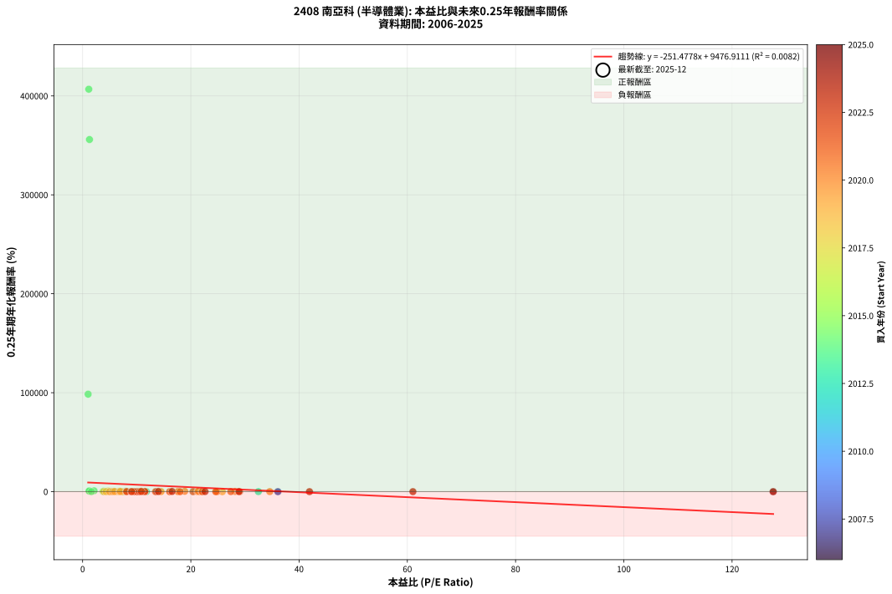
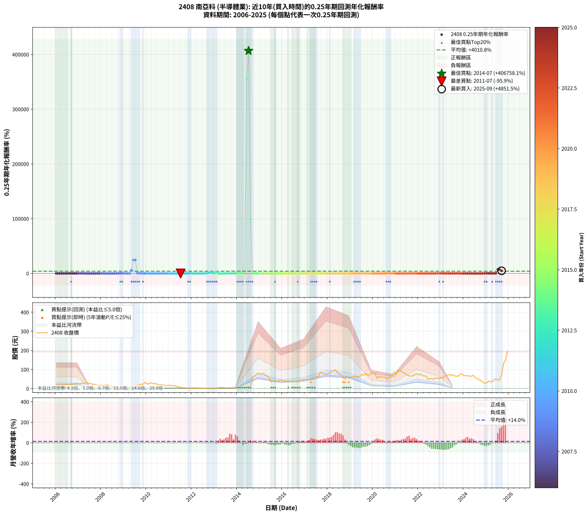

# 2408 南亞科 - 本益比與未來報酬率分析

!!! info "報告資訊"
    - **股票代號**: 2408
    - **公司名稱**: 南亞科
    - **產業別**: 半導體業
    - **分析期間**: 2006-2025 (237 個數據點)
    - **資料來源**: Type 12 (ShowMonthlyK_ChartFlow) 月收盤價與本益比
    - **報酬率口徑**: 含現金股利 (簡化: 年度合計，假設每年7/1入帳)
    - **報告生成時間**: 2026-01-06 18:37:00 CST

## 📈 視覺化圖表

### 圖表1: 本益比 vs 未來報酬率關係

*圖表1：2408 南亞科 本益比與0.25年期未來報酬率關係 (2006-2025)*

### 圖表2: 歷年買入時點的0.25年期實際報酬率

*圖表2：2408 南亞科 歷年買入時點的0.25年期實際報酬率 (2006-2025)*

## 📍 買點訊號說明

本報告提供兩種買點提示訊號（顯示於圖表2的股價子圖中）：

### ▲ 小綠色三角形（回測驗證）
- **計算方式**: 使用全部歷史資料計算本益比第25百分位數
- **用途**: 事後驗證，顯示歷史上哪些時點確實為低估區
- **限制**: 當下無法判斷，僅供回測參考
- **特性**: 後見之明（Look-Ahead Bias）

### ▲ 小橘色三角形（即時訊號）
- **計算方式**: 使用截至當月的過去5年資料計算本益比第25百分位數
- **用途**: 實際投資決策，當時即可判斷
- **優勢**: 可操作性強，符合實務需求
- **特性**: 無後見之明，滾動窗口計算

!!! tip "如何使用兩種訊號"
    - **綠色▲** 幫助理解歷史估值機會，驗證策略有效性
    - **橘色▲** 可作為實際買進參考，但仍需搭配基本面分析
    - 兩種訊號重疊時，表示即時判斷與事後驗證一致，信心度較高
    - 僅有綠色▲時，表示當時無法判斷（需要未來資料才能確認）
    - 僅有橘色▲時，表示即時判斷為買點，但事後可能不是最佳時機

## 📊 估值分析摘要

| 指標 | 數值 |
|:---:|:---:|
| **目前本益比** (2025-09) | **nan 倍** |
| **歷史平均本益比** | 12.30 倍 |
| **估值水準** | 🟡 合理範圍 |
| **預期0.25年年化報酬率** | **+nan%** |
| **歷史平均報酬率** | +4010.76% |
| **相關係數 (R²)** | 0.0082 |
| **趨勢線斜率** | -251.4778 |

!!! abstract "核心洞察"
    目前本益比接近歷史平均，預期報酬率符合長期趨勢

    根據歷史數據回測，2408 南亞科 在目前本益比 **nan倍** 的估值水準下，
    預期未來0.25年年化報酬率約為 **+nan%**。

    **重要提醒**: 本分析基於歷史數據統計，實際報酬率會受到公司基本面變化、產業趨勢、
    總體經濟環境等多重因素影響。R² = 0.01 表示本益比可解釋約 0.8% 的報酬率變異。

## 📈 歷史估值統計

### 最佳買點 (最高報酬率)

| 項目 | 數值 |
|:---:|:---:|
| 起始時間 | 2014-07 |
| 當時本益比 | 1.14 倍 |
| 起始價格 | 8.0 元 |
| 0.25年後價格 | 64.9 元 |
| **0.25年年化報酬率** | **+406758.15%** |

### 最差買點 (最低報酬率)

| 項目 | 數值 |
|:---:|:---:|
| 起始時間 | 2011-07 |
| 當時本益比 | nan 倍 |
| 起始價格 | 6.7 元 |
| 0.25年後價格 | 3.0 元 |
| **0.25年年化報酬率** | **-95.89%** |

## 🎯 投資啟示

### 本益比與報酬率關係

趨勢線方程式: **y = -251.4778x + 9476.9111**

!!! warning "強負相關"
    本益比與未來報酬率呈現強負相關。在高本益比時期買入，未來報酬率顯著較低；
    在低本益比時期買入，未來報酬率顯著較高。**估值紀律至關重要**。

### 估值區間建議

基於歷史數據分析:

- **🟢 低估區** (P/E < 9.8): 預期報酬率較高，可考慮增加持股
- **🟡 合理區** (P/E 9.8-14.8): 預期報酬率符合長期趨勢，正常持有
- **🔴 高估區** (P/E > 14.8): 預期報酬率較低，可考慮減碼或觀望

!!! danger "風險提示"
    - 過去表現不代表未來結果
    - 本分析假設公司基本面無重大結構性變化
    - 產業環境劇變可能使歷史規律失效
    - 應結合公司財報、產業趨勢、總體經濟等多重因素綜合判斷

!!! success "長期投資觀點"
    歷史數據顯示，在合理或低估的估值水準買入並長期持有，
    往往能獲得較佳的投資報酬。**耐心等待好價格**是價值投資的核心原則。

## 📊 數據品質

- **資料來源**: GoodInfo.tw Type 12 (ShowMonthlyK_ChartFlow)
- **資料頻率**: 月度收盤價與本益比
- **回測期間**: 2006-2025
- **數據點數量**: 237 個 (每個點代表一次0.25年期回測)

### 計算方法說明

1. **0.25年期年化報酬率**:
   - 對每個歷史時點，計算其後0.25年的實際投資報酬率
   - 期末價值(不含股利): 期末價格
   - 期末價值(含現金股利): 期末價格 + 持有期間內的現金股利合計 (簡化: 年度合計，假設每年7/1入帳)
   - 公式: 年化報酬率 = [(期末價值/期初價格)^(1/年數) - 1] × 100%

2. **本益比 (P/E Ratio)**:
   - 使用當時的月收盤價與EPS計算
   - 資料來源: Type 12 月度河流圖本益比數據

3. **趨勢線 (Linear Regression)**:
   - 使用最小平方法擬合線性趨勢線
   - R²值衡量本益比對報酬率的解釋能力

---

*本報告由 Stock Analysis System v1.9.0 自動生成*
*數據更新時間: 2026-01-06 18:37:00 CST*

## 📋 月度回測明細表

（每一列對應時間線圖中的一個買入點；可用來對照 SVG 圖上的每個點。）

| 買入月份 | 賣出月份 | 回測期限_年 | 實際持有年數 | 買入本益比_倍 | 買入收盤價_元 | 賣出收盤價_元 | 現金股利合計_元 | 總報酬率_pct | 年化報酬率_pct |
| --- | --- | --- | --- | --- | --- | --- | --- | --- | --- |
| 2006-01 | 2006-05 | 0.25 | 0.329 | 4.27 | 19.45 | 20.60 | 0.00 | +5.91 | +19.11 |
| 2006-02 | 2006-05 | 0.25 | 0.246 | 4.26 | 19.40 | 20.60 | 0.00 | +6.19 | +27.58 |
| 2006-03 | 2006-07 | 0.25 | 0.334 | 4.12 | 18.75 | 21.80 | 0.20 | +17.33 | +61.35 |
| 2006-04 | 2006-07 | 0.25 | 0.249 | 4.54 | 20.65 | 21.80 | 0.20 | +6.53 | +28.92 |
| 2006-05 | 2006-08 | 0.25 | 0.252 | 4.53 | 20.60 | 22.95 | 0.20 | +12.37 | +58.91 |
| 2006-06 | 2006-09 | 0.25 | 0.252 | 4.48 | 20.40 | 21.80 | 0.20 | +7.84 | +34.93 |
| 2006-07 | 2006-10 | 0.25 | 0.252 | 4.79 | 21.80 | 23.50 | 0.00 | +7.80 | +34.73 |
| 2006-08 | 2006-12 | 0.25 | 0.334 | 5.04 | 22.95 | 26.90 | 0.00 | +17.21 | +60.87 |
| 2006-09 | 2006-12 | 0.25 | 0.249 | 4.79 | 21.80 | 26.90 | 0.00 | +23.39 | +132.51 |
| 2006-10 | 2007-01 | 0.25 | 0.252 | 5.16 | 23.50 | 25.85 | 0.00 | +10.00 | +45.99 |
| 2006-11 | 2007-03 | 0.25 | 0.329 | 5.80 | 26.40 | 27.60 | 0.00 | +4.55 | +14.49 |
| 2006-12 | 2007-03 | 0.25 | 0.246 | 5.91 | 26.90 | 27.60 | 0.00 | +2.60 | +10.99 |
| 2007-01 | 2007-05 | 0.25 | 0.329 | 6.58 | 25.85 | 29.60 | 0.00 | +14.51 | +51.03 |
| 2007-02 | 2007-05 | 0.25 | 0.246 | 7.81 | 25.85 | 29.60 | 0.00 | +14.51 | +73.28 |
| 2007-03 | 2007-07 | 0.25 | 0.334 | 10.26 | 27.60 | 26.80 | 3.29 | +9.04 | +29.58 |
| 2007-04 | 2007-07 | 0.25 | 0.249 | 13.70 | 28.35 | 26.80 | 3.29 | +6.16 | +27.09 |
| 2007-05 | 2007-08 | 0.25 | 0.252 | 20.41 | 29.60 | 24.30 | 3.29 | -6.77 | -24.31 |
| 2007-06 | 2007-09 | 0.25 | 0.252 | 36.08 | 29.95 | 22.00 | 3.29 | -15.54 | -48.86 |
| 2007-07 | 2007-10 | 0.25 | 0.252 | 127.60 | 26.80 | 20.40 | 0.00 | -23.88 | -66.15 |
| 2007-08 | 2007-12 | 0.25 | 0.334 |  | 24.30 | 18.30 | 0.00 | -24.69 | -57.21 |
| 2007-09 | 2007-12 | 0.25 | 0.249 |  | 22.00 | 18.30 | 0.00 | -16.82 | -52.25 |
| 2007-10 | 2008-01 | 0.25 | 0.252 |  | 20.40 | 17.70 | 0.00 | -13.24 | -43.09 |
| 2007-11 | 2008-03 | 0.25 | 0.331 |  | 17.30 | 18.10 | 0.00 | +4.62 | +14.62 |
| 2007-12 | 2008-03 | 0.25 | 0.249 |  | 18.30 | 18.10 | 0.00 | -1.09 | -4.31 |
| 2008-01 | 2008-05 | 0.25 | 0.331 |  | 17.70 | 17.60 | 0.00 | -0.56 | -1.70 |
| 2008-02 | 2008-05 | 0.25 | 0.249 |  | 18.10 | 17.60 | 0.00 | -2.76 | -10.63 |
| 2008-03 | 2008-07 | 0.25 | 0.334 |  | 18.10 | 10.50 | 0.00 | -41.99 | -80.41 |
| 2008-04 | 2008-07 | 0.25 | 0.249 |  | 19.50 | 10.50 | 0.00 | -46.15 | -91.66 |
| 2008-05 | 2008-08 | 0.25 | 0.252 |  | 17.60 | 10.70 | 0.00 | -39.20 | -86.13 |
| 2008-06 | 2008-09 | 0.25 | 0.252 |  | 13.65 | 7.32 | 0.00 | -46.37 | -91.57 |
| 2008-07 | 2008-10 | 0.25 | 0.252 |  | 10.50 | 5.87 | 0.00 | -44.10 | -90.06 |
| 2008-08 | 2008-12 | 0.25 | 0.334 |  | 10.70 | 6.04 | 0.00 | -43.55 | -81.95 |
| 2008-09 | 2008-12 | 0.25 | 0.249 |  | 7.32 | 6.04 | 0.00 | -17.49 | -53.77 |
| 2008-10 | 2009-01 | 0.25 | 0.252 |  | 5.87 | 5.62 | 0.00 | -4.26 | -15.87 |
| 2008-11 | 2009-03 | 0.25 | 0.329 |  | 4.79 | 7.75 | 0.00 | +61.80 | +332.55 |
| 2008-12 | 2009-03 | 0.25 | 0.246 |  | 6.04 | 7.75 | 0.00 | +28.31 | +175.03 |
| 2009-01 | 2009-05 | 0.25 | 0.329 |  | 5.62 | 6.05 | 0.00 | +7.65 | +25.16 |
| 2009-02 | 2009-05 | 0.25 | 0.246 |  | 6.41 | 6.05 | 0.00 | -5.62 | -20.91 |
| 2009-03 | 2009-07 | 0.25 | 0.334 |  | 7.75 | 5.86 | 0.00 | -24.39 | -56.70 |
| 2009-04 | 2009-07 | 0.25 | 0.249 |  | 7.44 | 5.86 | 0.00 | -21.24 | -61.64 |
| 2009-05 | 2009-08 | 0.25 | 0.252 |  | 6.05 | 17.00 | 0.00 | +180.99 | +5944.52 |
| 2009-06 | 2009-09 | 0.25 | 0.252 |  | 5.13 | 20.50 | 0.00 | +299.61 | +24365.96 |
| 2009-07 | 2009-10 | 0.25 | 0.252 |  | 5.86 | 23.50 | 0.00 | +301.02 | +24711.41 |
| 2009-08 | 2009-12 | 0.25 | 0.334 |  | 17.00 | 32.70 | 0.00 | +92.35 | +608.84 |
| 2009-09 | 2009-12 | 0.25 | 0.249 |  | 20.50 | 32.70 | 0.00 | +59.51 | +551.57 |
| 2009-10 | 2010-01 | 0.25 | 0.252 |  | 23.50 | 26.25 | 0.00 | +11.70 | +55.17 |
| 2009-11 | 2010-03 | 0.25 | 0.329 |  | 22.50 | 30.30 | 0.00 | +34.67 | +147.42 |
| 2009-12 | 2010-03 | 0.25 | 0.246 |  | 32.70 | 30.30 | 0.00 | -7.34 | -26.61 |
| 2010-01 | 2010-05 | 0.25 | 0.329 |  | 26.25 | 26.40 | 0.00 | +0.57 | +1.75 |
| 2010-02 | 2010-05 | 0.25 | 0.246 |  | 23.80 | 26.40 | 0.00 | +10.92 | +52.31 |
| 2010-03 | 2010-07 | 0.25 | 0.334 |  | 30.30 | 21.65 | 0.00 | -28.55 | -63.45 |
| 2010-04 | 2010-07 | 0.25 | 0.249 |  | 27.65 | 21.65 | 0.00 | -21.70 | -62.54 |
| 2010-05 | 2010-08 | 0.25 | 0.252 |  | 26.40 | 18.30 | 0.00 | -30.68 | -76.66 |
| 2010-06 | 2010-09 | 0.25 | 0.252 |  | 25.25 | 21.15 | 0.00 | -16.24 | -50.51 |
| 2010-07 | 2010-10 | 0.25 | 0.252 |  | 21.65 | 18.35 | 0.00 | -15.24 | -48.14 |
| 2010-08 | 2010-12 | 0.25 | 0.334 |  | 18.30 | 16.25 | 0.00 | -11.20 | -29.93 |
| 2010-09 | 2010-12 | 0.25 | 0.249 |  | 21.15 | 16.25 | 0.00 | -23.17 | -65.28 |
| 2010-10 | 2011-01 | 0.25 | 0.252 |  | 18.35 | 18.45 | 0.00 | +0.54 | +2.18 |
| 2010-11 | 2011-03 | 0.25 | 0.329 |  | 15.80 | 15.35 | 0.00 | -2.85 | -8.42 |
| 2010-12 | 2011-03 | 0.25 | 0.246 |  | 16.25 | 15.35 | 0.00 | -5.54 | -20.64 |
| 2011-01 | 2011-05 | 0.25 | 0.329 |  | 18.45 | 11.70 | 0.00 | -36.59 | -75.00 |
| 2011-02 | 2011-05 | 0.25 | 0.246 |  | 15.85 | 11.70 | 0.00 | -26.18 | -70.83 |
| 2011-03 | 2011-07 | 0.25 | 0.334 |  | 15.35 | 6.68 | 0.00 | -56.48 | -91.72 |
| 2011-04 | 2011-07 | 0.25 | 0.249 |  | 14.50 | 6.68 | 0.00 | -53.93 | -95.54 |
| 2011-05 | 2011-08 | 0.25 | 0.252 |  | 11.70 | 5.26 | 0.00 | -55.04 | -95.82 |
| 2011-06 | 2011-09 | 0.25 | 0.252 |  | 8.10 | 3.90 | 0.00 | -51.85 | -94.51 |
| 2011-07 | 2011-10 | 0.25 | 0.252 |  | 6.68 | 2.99 | 0.00 | -55.24 | -95.89 |
| 2011-08 | 2011-12 | 0.25 | 0.334 |  | 5.26 | 2.27 | 0.00 | -56.84 | -91.92 |
| 2011-09 | 2011-12 | 0.25 | 0.249 |  | 3.90 | 2.27 | 0.00 | -41.79 | -88.61 |
| 2011-10 | 2012-01 | 0.25 | 0.252 |  | 2.99 | 2.41 | 0.00 | -19.40 | -57.52 |
| 2011-11 | 2012-03 | 0.25 | 0.331 |  | 2.36 | 3.11 | 0.00 | +31.78 | +130.02 |
| 2011-12 | 2012-03 | 0.25 | 0.249 |  | 2.27 | 3.11 | 0.00 | +37.00 | +253.85 |
| 2012-01 | 2012-05 | 0.25 | 0.331 |  | 2.41 | 2.48 | 0.00 | +2.90 | +9.03 |
| 2012-02 | 2012-05 | 0.25 | 0.249 |  | 4.17 | 2.48 | 0.00 | -40.53 | -87.58 |
| 2012-03 | 2012-07 | 0.25 | 0.334 |  | 3.11 | 1.91 | 0.00 | -38.59 | -76.77 |
| 2012-04 | 2012-07 | 0.25 | 0.249 |  | 2.49 | 1.91 | 0.00 | -23.29 | -65.51 |
| 2012-05 | 2012-08 | 0.25 | 0.252 |  | 2.48 | 2.02 | 0.00 | -18.55 | -55.71 |
| 2012-06 | 2012-09 | 0.25 | 0.252 |  | 2.52 | 1.71 | 0.00 | -32.14 | -78.55 |
| 2012-07 | 2012-10 | 0.25 | 0.252 |  | 1.91 | 1.40 | 0.00 | -26.70 | -70.87 |
| 2012-08 | 2012-12 | 0.25 | 0.334 |  | 2.02 | 2.50 | 0.00 | +23.76 | +89.32 |
| 2012-09 | 2012-12 | 0.25 | 0.249 |  | 1.71 | 2.50 | 0.00 | +46.20 | +359.24 |
| 2012-10 | 2013-01 | 0.25 | 0.252 |  | 1.40 | 2.74 | 0.00 | +95.71 | +1338.05 |
| 2012-11 | 2013-03 | 0.25 | 0.329 |  | 1.30 | 3.84 | 0.00 | +195.38 | +2602.36 |
| 2012-12 | 2013-03 | 0.25 | 0.246 |  | 2.50 | 3.84 | 0.00 | +53.60 | +470.74 |
| 2013-01 | 2013-05 | 0.25 | 0.329 |  | 2.74 | 6.05 | 0.00 | +120.80 | +1014.46 |
| 2013-02 | 2013-05 | 0.25 | 0.246 |  | 2.85 | 6.05 | 0.00 | +112.28 | +2021.84 |
| 2013-03 | 2013-07 | 0.25 | 0.334 |  | 3.84 | 3.85 | 0.00 | +0.26 | +0.78 |
| 2013-04 | 2013-07 | 0.25 | 0.249 |  | 6.50 | 3.85 | 0.00 | -40.77 | -87.78 |
| 2013-05 | 2013-08 | 0.25 | 0.252 |  | 6.05 | 3.53 | 0.00 | -41.65 | -88.22 |
| 2013-06 | 2013-09 | 0.25 | 0.252 |  | 5.86 | 4.50 | 0.00 | -23.21 | -64.95 |
| 2013-07 | 2013-10 | 0.25 | 0.252 |  | 3.85 | 4.07 | 0.00 | +5.71 | +24.68 |
| 2013-08 | 2013-12 | 0.25 | 0.334 |  | 3.53 | 4.01 | 0.00 | +13.60 | +46.48 |
| 2013-09 | 2013-12 | 0.25 | 0.249 |  | 4.50 | 4.01 | 0.00 | -10.89 | -37.04 |
| 2013-10 | 2014-01 | 0.25 | 0.252 |  | 4.07 | 5.00 | 0.00 | +22.85 | +126.38 |
| 2013-11 | 2014-03 | 0.25 | 0.329 | 32.48 | 4.06 | 4.05 | 0.00 | -0.25 | -0.75 |
| 2013-12 | 2014-03 | 0.25 | 0.246 | 11.79 | 4.01 | 4.05 | 0.00 | +1.00 | +4.11 |
| 2014-01 | 2014-05 | 0.25 | 0.329 | 3.87 | 5.00 | 8.29 | 0.00 | +65.80 | +365.97 |
| 2014-02 | 2014-05 | 0.25 | 0.246 | 2.12 | 4.76 | 8.29 | 0.00 | +74.16 | +850.27 |
| 2014-03 | 2014-07 | 0.25 | 0.334 | 1.27 | 4.05 | 8.00 | 0.00 | +97.53 | +667.52 |
| 2014-04 | 2014-07 | 0.25 | 0.249 | 1.19 | 4.95 | 8.00 | 0.00 | +61.62 | +586.76 |
| 2014-05 | 2014-08 | 0.25 | 0.252 | 1.62 | 8.29 | 8.10 | 0.00 | -2.29 | -8.79 |
| 2014-06 | 2014-09 | 0.25 | 0.252 | 1.27 | 7.70 | 60.40 | 0.00 | +684.42 | +355896.48 |
| 2014-07 | 2014-10 | 0.25 | 0.252 | 1.14 | 8.00 | 64.90 | 0.00 | +711.25 | +406758.15 |
| 2014-08 | 2014-12 | 0.25 | 0.334 | 1.02 | 8.10 | 81.00 | 0.00 | +900.00 | +98494.45 |
| 2014-09 | 2014-12 | 0.25 | 0.249 | 6.78 | 60.40 | 81.00 | 0.00 | +34.11 | +224.75 |
| 2014-10 | 2015-01 | 0.25 | 0.252 | 6.58 | 64.90 | 76.30 | 0.00 | +17.57 | +90.12 |
| 2014-11 | 2015-03 | 0.25 | 0.329 | 6.77 | 73.20 | 79.00 | 0.00 | +7.92 | +26.12 |
| 2014-12 | 2015-03 | 0.25 | 0.246 | 6.88 | 81.00 | 79.00 | 0.00 | -2.47 | -9.65 |
| 2015-01 | 2015-05 | 0.25 | 0.329 | 6.71 | 76.30 | 67.00 | 0.00 | -12.19 | -32.67 |
| 2015-02 | 2015-05 | 0.25 | 0.246 | 7.14 | 78.40 | 67.00 | 0.00 | -14.54 | -47.15 |
| 2015-03 | 2015-07 | 0.25 | 0.334 | 7.46 | 79.00 | 34.25 | 2.00 | -54.12 | -90.29 |
| 2015-04 | 2015-07 | 0.25 | 0.249 | 6.72 | 68.60 | 34.25 | 2.00 | -47.16 | -92.27 |
| 2015-05 | 2015-08 | 0.25 | 0.252 | 6.83 | 67.00 | 40.15 | 2.00 | -37.09 | -84.12 |
| 2015-06 | 2015-09 | 0.25 | 0.252 | 5.49 | 51.70 | 36.50 | 2.00 | -25.54 | -68.98 |
| 2015-07 | 2015-10 | 0.25 | 0.252 | 3.79 | 34.25 | 40.05 | 0.00 | +16.93 | +86.10 |
| 2015-08 | 2015-12 | 0.25 | 0.334 | 4.65 | 40.15 | 45.70 | 0.00 | +13.82 | +47.35 |
| 2015-09 | 2015-12 | 0.25 | 0.249 | 4.43 | 36.50 | 45.70 | 0.00 | +25.21 | +146.51 |
| 2015-10 | 2016-01 | 0.25 | 0.252 | 5.10 | 40.05 | 40.85 | 0.00 | +2.00 | +8.17 |
| 2015-11 | 2016-03 | 0.25 | 0.331 | 5.73 | 42.75 | 39.95 | 0.00 | -6.55 | -18.49 |
| 2015-12 | 2016-03 | 0.25 | 0.249 | 6.46 | 45.70 | 39.95 | 0.00 | -12.58 | -41.71 |
| 2016-01 | 2016-05 | 0.25 | 0.331 | 5.67 | 40.85 | 39.70 | 0.00 | -2.82 | -8.26 |
| 2016-02 | 2016-05 | 0.25 | 0.249 | 5.62 | 41.20 | 39.70 | 0.00 | -3.64 | -13.83 |
| 2016-03 | 2016-07 | 0.25 | 0.334 | 5.35 | 39.95 | 37.70 | 2.80 | +1.38 | +4.18 |
| 2016-04 | 2016-07 | 0.25 | 0.249 | 4.96 | 37.70 | 37.70 | 2.80 | +7.43 | +33.32 |
| 2016-05 | 2016-08 | 0.25 | 0.252 | 5.13 | 39.70 | 37.50 | 2.80 | +1.51 | +6.14 |
| 2016-06 | 2016-09 | 0.25 | 0.252 | 5.01 | 39.40 | 39.25 | 2.80 | +6.73 | +29.49 |
| 2016-07 | 2016-10 | 0.25 | 0.252 | 4.71 | 37.70 | 40.95 | 0.00 | +8.62 | +38.86 |
| 2016-08 | 2016-12 | 0.25 | 0.334 | 4.61 | 37.50 | 48.30 | 0.00 | +28.80 | +113.34 |
| 2016-09 | 2016-12 | 0.25 | 0.249 | 4.75 | 39.25 | 48.30 | 0.00 | +23.06 | +129.97 |
| 2016-10 | 2017-01 | 0.25 | 0.252 | 4.87 | 40.95 | 48.00 | 0.00 | +17.22 | +87.88 |
| 2016-11 | 2017-03 | 0.25 | 0.329 | 5.21 | 44.50 | 48.40 | 0.00 | +8.76 | +29.14 |
| 2016-12 | 2017-03 | 0.25 | 0.246 | 5.57 | 48.30 | 48.40 | 0.00 | +0.21 | +0.84 |
| 2017-01 | 2017-05 | 0.25 | 0.329 | 5.25 | 48.00 | 50.90 | 0.00 | +6.04 | +19.55 |
| 2017-02 | 2017-05 | 0.25 | 0.246 | 4.73 | 45.50 | 50.90 | 0.00 | +11.87 | +57.64 |
| 2017-03 | 2017-07 | 0.25 | 0.334 | 4.80 | 48.40 | 62.40 | 1.50 | +32.02 | +129.73 |
| 2017-04 | 2017-07 | 0.25 | 0.249 | 4.56 | 48.15 | 62.40 | 1.50 | +32.71 | +211.39 |
| 2017-05 | 2017-08 | 0.25 | 0.252 | 4.61 | 50.90 | 64.70 | 1.50 | +30.06 | +183.89 |
| 2017-06 | 2017-09 | 0.25 | 0.252 | 4.76 | 54.80 | 86.30 | 1.50 | +60.22 | +549.74 |
| 2017-07 | 2017-10 | 0.25 | 0.252 | 5.20 | 62.40 | 81.80 | 0.00 | +31.09 | +192.93 |
| 2017-08 | 2017-12 | 0.25 | 0.334 | 5.19 | 64.70 | 76.20 | 0.00 | +17.77 | +63.20 |
| 2017-09 | 2017-12 | 0.25 | 0.249 | 6.67 | 86.30 | 76.20 | 0.00 | -11.70 | -39.32 |
| 2017-10 | 2018-01 | 0.25 | 0.252 | 6.10 | 81.80 | 79.40 | 0.00 | -2.93 | -11.15 |
| 2017-11 | 2018-03 | 0.25 | 0.329 | 5.60 | 77.80 | 92.00 | 0.00 | +18.25 | +66.58 |
| 2017-12 | 2018-03 | 0.25 | 0.246 | 5.31 | 76.20 | 92.00 | 0.00 | +20.73 | +114.83 |
| 2018-01 | 2018-05 | 0.25 | 0.329 | 5.58 | 79.40 | 99.60 | 0.00 | +25.44 | +99.35 |
| 2018-02 | 2018-05 | 0.25 | 0.246 | 5.73 | 80.80 | 99.60 | 0.00 | +23.27 | +133.72 |
| 2018-03 | 2018-07 | 0.25 | 0.334 | 6.59 | 92.00 | 78.60 | 3.51 | -10.75 | -28.86 |
| 2018-04 | 2018-07 | 0.25 | 0.249 | 6.72 | 93.00 | 78.60 | 3.51 | -11.71 | -39.34 |
| 2018-05 | 2018-08 | 0.25 | 0.252 | 7.26 | 99.60 | 69.70 | 3.51 | -26.50 | -70.54 |
| 2018-06 | 2018-09 | 0.25 | 0.252 | 6.13 | 83.20 | 58.10 | 3.51 | -25.95 | -69.66 |
| 2018-07 | 2018-10 | 0.25 | 0.252 | 5.84 | 78.60 | 51.40 | 0.00 | -34.61 | -81.48 |
| 2018-08 | 2018-12 | 0.25 | 0.334 | 5.23 | 69.70 | 55.00 | 0.00 | -21.09 | -50.79 |
| 2018-09 | 2018-12 | 0.25 | 0.249 | 4.40 | 58.10 | 55.00 | 0.00 | -5.34 | -19.75 |
| 2018-10 | 2019-01 | 0.25 | 0.252 | 3.94 | 51.40 | 60.10 | 0.00 | +16.93 | +86.04 |
| 2018-11 | 2019-03 | 0.25 | 0.329 | 4.72 | 61.00 | 61.40 | 0.00 | +0.66 | +2.01 |
| 2018-12 | 2019-03 | 0.25 | 0.246 | 4.30 | 55.00 | 61.40 | 0.00 | +11.64 | +56.32 |
| 2019-01 | 2019-05 | 0.25 | 0.329 | 5.01 | 60.10 | 61.60 | 0.00 | +2.50 | +7.79 |
| 2019-02 | 2019-05 | 0.25 | 0.246 | 5.55 | 62.20 | 61.60 | 0.00 | -0.96 | -3.86 |
| 2019-03 | 2019-07 | 0.25 | 0.334 | 5.90 | 61.40 | 74.00 | 7.11 | +32.10 | +130.13 |
| 2019-04 | 2019-07 | 0.25 | 0.249 | 6.81 | 65.40 | 74.00 | 7.11 | +24.02 | +137.29 |
| 2019-05 | 2019-08 | 0.25 | 0.252 | 6.99 | 61.60 | 70.40 | 7.11 | +25.83 | +148.96 |
| 2019-06 | 2019-09 | 0.25 | 0.252 | 8.05 | 64.50 | 80.50 | 7.11 | +35.83 | +237.29 |
| 2019-07 | 2019-10 | 0.25 | 0.252 | 10.25 | 74.00 | 70.00 | 0.00 | -5.41 | -19.80 |
| 2019-08 | 2019-12 | 0.25 | 0.334 | 10.97 | 70.40 | 83.40 | 0.00 | +18.47 | +66.08 |
| 2019-09 | 2019-12 | 0.25 | 0.249 | 14.32 | 80.50 | 83.40 | 0.00 | +3.60 | +15.26 |
| 2019-10 | 2020-01 | 0.25 | 0.252 | 14.51 | 70.00 | 78.10 | 0.00 | +11.57 | +54.45 |
| 2019-11 | 2020-03 | 0.25 | 0.331 | 17.68 | 71.20 | 53.70 | 0.00 | -24.58 | -57.32 |
| 2019-12 | 2020-03 | 0.25 | 0.249 | 25.82 | 83.40 | 53.70 | 0.00 | -35.61 | -82.92 |
| 2020-01 | 2020-05 | 0.25 | 0.331 | 24.64 | 78.10 | 59.80 | 0.00 | -23.43 | -55.33 |
| 2020-02 | 2020-05 | 0.25 | 0.249 | 24.86 | 77.30 | 59.80 | 0.00 | -22.64 | -64.31 |
| 2020-03 | 2020-07 | 0.25 | 0.334 | 17.61 | 53.70 | 60.60 | 1.50 | +15.64 | +54.49 |
| 2020-04 | 2020-07 | 0.25 | 0.249 | 21.74 | 65.00 | 60.60 | 1.50 | -4.47 | -16.76 |
| 2020-05 | 2020-08 | 0.25 | 0.252 | 20.41 | 59.80 | 51.90 | 1.50 | -10.71 | -36.21 |
| 2020-06 | 2020-09 | 0.25 | 0.252 | 21.25 | 61.00 | 57.50 | 1.50 | -3.28 | -12.41 |
| 2020-07 | 2020-10 | 0.25 | 0.252 | 21.57 | 60.60 | 57.80 | 0.00 | -4.62 | -17.12 |
| 2020-08 | 2020-12 | 0.25 | 0.334 | 18.87 | 51.90 | 86.80 | 0.00 | +67.24 | +366.32 |
| 2020-09 | 2020-12 | 0.25 | 0.249 | 21.38 | 57.50 | 86.80 | 0.00 | +50.96 | +422.23 |
| 2020-10 | 2021-01 | 0.25 | 0.252 | 21.98 | 57.80 | 79.90 | 0.00 | +38.24 | +261.64 |
| 2020-11 | 2021-03 | 0.25 | 0.329 | 28.17 | 72.40 | 91.90 | 0.00 | +26.93 | +106.66 |
| 2020-12 | 2021-03 | 0.25 | 0.246 | 34.58 | 86.80 | 91.90 | 0.00 | +5.88 | +26.08 |
| 2021-01 | 2021-05 | 0.25 | 0.329 | 27.39 | 79.90 | 81.90 | 0.00 | +2.50 | +7.82 |
| 2021-02 | 2021-05 | 0.25 | 0.246 | 29.02 | 96.50 | 81.90 | 0.00 | -15.13 | -48.61 |
| 2021-03 | 2021-07 | 0.25 | 0.334 | 24.62 | 91.90 | 72.30 | 1.30 | -19.92 | -48.57 |
| 2021-04 | 2021-07 | 0.25 | 0.249 | 22.13 | 91.60 | 72.30 | 1.30 | -19.65 | -58.45 |
| 2021-05 | 2021-08 | 0.25 | 0.252 | 18.01 | 81.90 | 66.40 | 1.30 | -17.34 | -53.05 |
| 2021-06 | 2021-09 | 0.25 | 0.252 | 16.08 | 79.70 | 65.90 | 1.30 | -15.69 | -49.21 |
| 2021-07 | 2021-10 | 0.25 | 0.252 | 13.48 | 72.30 | 66.50 | 0.00 | -8.02 | -28.25 |
| 2021-08 | 2021-12 | 0.25 | 0.334 | 11.51 | 66.40 | 78.10 | 0.00 | +17.62 | +62.56 |
| 2021-09 | 2021-12 | 0.25 | 0.249 | 10.67 | 65.90 | 78.10 | 0.00 | +18.51 | +97.73 |
| 2021-10 | 2022-01 | 0.25 | 0.252 | 10.10 | 66.50 | 72.00 | 0.00 | +8.27 | +37.09 |
| 2021-11 | 2022-03 | 0.25 | 0.329 | 10.61 | 74.20 | 69.20 | 0.00 | -6.74 | -19.13 |
| 2021-12 | 2022-03 | 0.25 | 0.246 | 10.55 | 78.10 | 69.20 | 0.00 | -11.40 | -38.80 |
| 2022-01 | 2022-05 | 0.25 | 0.329 | 10.03 | 72.00 | 66.80 | 0.00 | -7.22 | -20.40 |
| 2022-02 | 2022-05 | 0.25 | 0.246 | 11.09 | 77.10 | 66.80 | 0.00 | -13.36 | -44.12 |
| 2022-03 | 2022-07 | 0.25 | 0.334 | 10.28 | 69.20 | 52.30 | 3.70 | -19.07 | -46.93 |
| 2022-04 | 2022-07 | 0.25 | 0.249 | 10.08 | 65.60 | 52.30 | 3.70 | -14.63 | -47.00 |
| 2022-05 | 2022-08 | 0.25 | 0.252 | 10.63 | 66.80 | 53.40 | 3.70 | -14.52 | -46.35 |
| 2022-06 | 2022-09 | 0.25 | 0.252 | 8.15 | 49.40 | 48.95 | 3.70 | +6.59 | +28.81 |
| 2022-07 | 2022-10 | 0.25 | 0.252 | 8.96 | 52.30 | 54.50 | 0.00 | +4.21 | +17.77 |
| 2022-08 | 2022-12 | 0.25 | 0.334 | 9.51 | 53.40 | 51.20 | 0.00 | -4.12 | -11.83 |
| 2022-09 | 2022-12 | 0.25 | 0.249 | 9.08 | 48.95 | 51.20 | 0.00 | +4.60 | +19.77 |
| 2022-10 | 2023-01 | 0.25 | 0.252 | 10.55 | 54.50 | 57.80 | 0.00 | +6.06 | +26.29 |
| 2022-11 | 2023-03 | 0.25 | 0.329 | 11.49 | 56.80 | 66.50 | 0.00 | +17.08 | +61.59 |
| 2022-12 | 2023-03 | 0.25 | 0.246 | 10.85 | 51.20 | 66.50 | 0.00 | +29.88 | +188.96 |
| 2023-01 | 2023-05 | 0.25 | 0.329 | 14.01 | 57.80 | 73.50 | 0.00 | +27.16 | +107.80 |
| 2023-02 | 2023-05 | 0.25 | 0.246 | 16.53 | 58.40 | 73.50 | 0.00 | +25.86 | +154.29 |
| 2023-03 | 2023-07 | 0.25 | 0.334 | 22.62 | 66.50 | 72.30 | 2.13 | +11.92 | +40.11 |
| 2023-04 | 2023-07 | 0.25 | 0.249 | 28.89 | 67.80 | 72.30 | 2.13 | +9.78 | +45.42 |
| 2023-05 | 2023-08 | 0.25 | 0.252 | 41.92 | 73.50 | 66.60 | 2.13 | -6.49 | -23.39 |
| 2023-06 | 2023-09 | 0.25 | 0.252 | 61.03 | 70.80 | 65.60 | 2.13 | -4.34 | -16.14 |
| 2023-07 | 2023-10 | 0.25 | 0.252 | 127.60 | 72.30 | 64.70 | 0.00 | -10.51 | -35.66 |
| 2023-08 | 2023-12 | 0.25 | 0.334 |  | 66.60 | 78.00 | 0.00 | +17.12 | +60.49 |
| 2023-09 | 2023-12 | 0.25 | 0.249 |  | 65.60 | 78.00 | 0.00 | +18.90 | +100.35 |
| 2023-10 | 2024-01 | 0.25 | 0.252 |  | 64.70 | 68.70 | 0.00 | +6.18 | +26.89 |
| 2023-11 | 2024-03 | 0.25 | 0.331 |  | 75.00 | 67.70 | 0.00 | -9.73 | -26.59 |
| 2023-12 | 2024-03 | 0.25 | 0.249 |  | 78.00 | 67.70 | 0.00 | -13.21 | -43.36 |
| 2024-01 | 2024-05 | 0.25 | 0.331 |  | 68.70 | 64.50 | 0.00 | -6.11 | -17.34 |
| 2024-02 | 2024-05 | 0.25 | 0.249 |  | 67.30 | 64.50 | 0.00 | -4.16 | -15.68 |
| 2024-03 | 2024-07 | 0.25 | 0.334 |  | 67.70 | 57.10 | 0.00 | -15.66 | -39.94 |
| 2024-04 | 2024-07 | 0.25 | 0.249 |  | 66.10 | 57.10 | 0.00 | -13.62 | -44.43 |
| 2024-05 | 2024-08 | 0.25 | 0.252 |  | 64.50 | 52.70 | 0.00 | -18.29 | -55.16 |
| 2024-06 | 2024-09 | 0.25 | 0.252 |  | 69.70 | 47.35 | 0.00 | -32.07 | -78.45 |
| 2024-07 | 2024-10 | 0.25 | 0.252 |  | 57.10 | 42.30 | 0.00 | -25.92 | -69.61 |
| 2024-08 | 2024-12 | 0.25 | 0.334 |  | 52.70 | 29.25 | 0.00 | -44.50 | -82.84 |
| 2024-09 | 2024-12 | 0.25 | 0.249 |  | 47.35 | 29.25 | 0.00 | -38.23 | -85.53 |
| 2024-10 | 2025-01 | 0.25 | 0.252 |  | 42.30 | 30.10 | 0.00 | -28.84 | -74.10 |
| 2024-11 | 2025-03 | 0.25 | 0.329 |  | 33.45 | 37.40 | 0.00 | +11.81 | +40.46 |
| 2024-12 | 2025-03 | 0.25 | 0.246 |  | 29.25 | 37.40 | 0.00 | +27.86 | +171.15 |
| 2025-01 | 2025-05 | 0.25 | 0.329 |  | 30.10 | 45.55 | 0.00 | +51.33 | +252.89 |
| 2025-02 | 2025-05 | 0.25 | 0.246 |  | 38.65 | 45.55 | 0.00 | +17.85 | +94.77 |
| 2025-03 | 2025-07 | 0.25 | 0.334 |  | 37.40 | 44.55 | 0.00 | +19.12 | +68.83 |
| 2025-04 | 2025-07 | 0.25 | 0.249 |  | 36.00 | 44.55 | 0.00 | +23.75 | +135.21 |
| 2025-05 | 2025-08 | 0.25 | 0.252 |  | 45.55 | 47.00 | 0.00 | +3.18 | +13.25 |
| 2025-06 | 2025-09 | 0.25 | 0.252 |  | 51.20 | 73.00 | 0.00 | +42.58 | +308.89 |
| 2025-07 | 2025-10 | 0.25 | 0.252 |  | 44.55 | 132.50 | 0.00 | +197.42 | +7473.96 |
| 2025-08 | 2025-12 | 0.25 | 0.334 |  | 47.00 | 193.00 | 0.00 | +310.64 | +6764.47 |
| 2025-09 | 2025-12 | 0.25 | 0.249 |  | 73.00 | 193.00 | 0.00 | +164.38 | +4851.51 |
