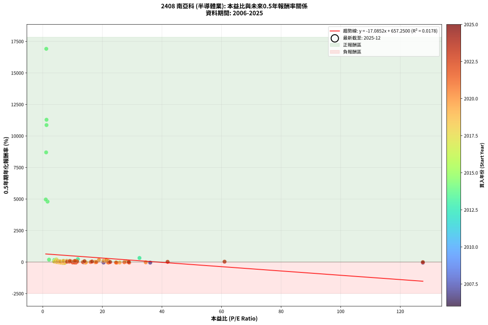
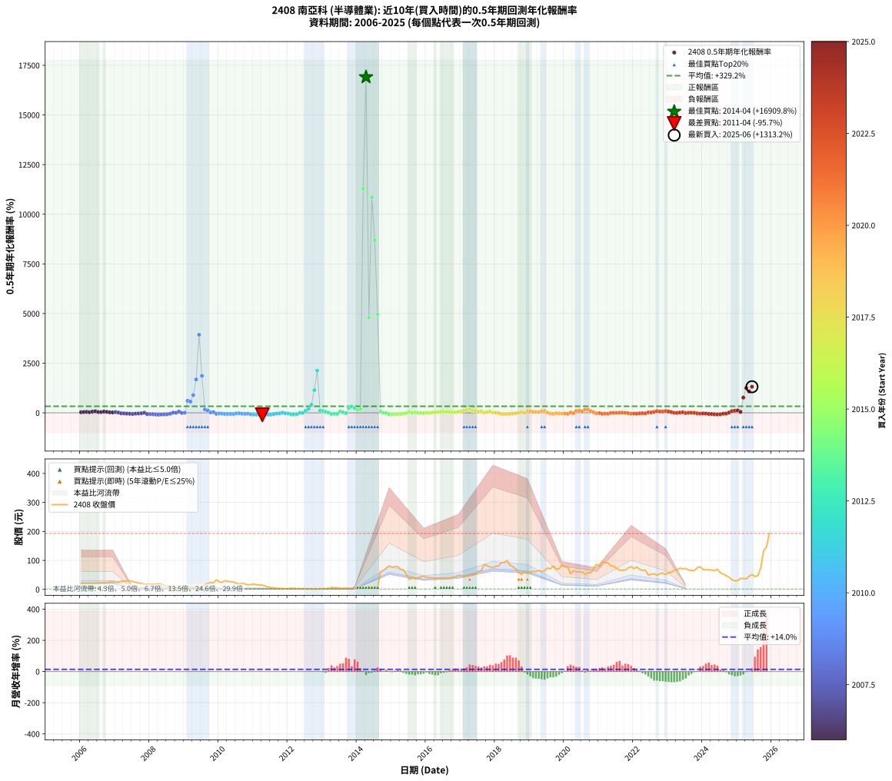

# 2408 南亞科 - 本益比與未來報酬率分析

!!! info "報告資訊"
    - **股票代號**: 2408
    - **公司名稱**: 南亞科
    - **產業別**: 半導體業
    - **分析期間**: 2006-2025 (234 個數據點)
    - **資料來源**: Type 12 (ShowMonthlyK_ChartFlow) 月收盤價與本益比
    - **報酬率口徑**: 含現金股利 (簡化: 年度合計，假設每年7/1入帳)
    - **報告生成時間**: 2026-01-07 20:46:17 CST

## 📈 視覺化圖表

### 圖表1: 本益比 vs 未來報酬率關係

*圖表1：2408 南亞科 本益比與0.5年期未來報酬率關係 (2006-2025)*

### 圖表2: 歷年買入時點的0.5年期實際報酬率

*圖表2：2408 南亞科 歷年買入時點的0.5年期實際報酬率 (2006-2025)*

## 📍 買點訊號說明

本報告提供兩種買點提示訊號（顯示於圖表2的股價子圖中）：

### ▲ 小綠色三角形（回測驗證）
- **計算方式**: 使用全部歷史資料計算本益比第25百分位數
- **用途**: 事後驗證，顯示歷史上哪些時點確實為低估區
- **限制**: 當下無法判斷，僅供回測參考
- **特性**: 後見之明（Look-Ahead Bias）

### ▲ 小橘色三角形（即時訊號）
- **計算方式**: 使用截至當月的過去5年資料計算本益比第25百分位數
- **用途**: 實際投資決策，當時即可判斷
- **優勢**: 可操作性強，符合實務需求
- **特性**: 無後見之明，滾動窗口計算

!!! tip "如何使用兩種訊號"
    - **綠色▲** 幫助理解歷史估值機會，驗證策略有效性
    - **橘色▲** 可作為實際買進參考，但仍需搭配基本面分析
    - 兩種訊號重疊時，表示即時判斷與事後驗證一致，信心度較高
    - 僅有綠色▲時，表示當時無法判斷（需要未來資料才能確認）
    - 僅有橘色▲時，表示即時判斷為買點，但事後可能不是最佳時機

## 📊 估值分析摘要

| 指標 | 數值 |
|:---:|:---:|
| **目前本益比** (2025-06) | **nan 倍** |
| **歷史平均本益比** | 12.30 倍 |
| **估值水準** | 🟡 合理範圍 |
| **預期0.5年年化報酬率** | **+nan%** |
| **歷史平均報酬率** | +329.16% |
| **相關係數 (R²)** | 0.0178 |
| **趨勢線斜率** | -17.0852 |

!!! abstract "核心洞察"
    目前本益比接近歷史平均，預期報酬率符合長期趨勢

    根據歷史數據回測，2408 南亞科 在目前本益比 **nan倍** 的估值水準下，
    預期未來0.5年年化報酬率約為 **+nan%**。

    **重要提醒**: 本分析基於歷史數據統計，實際報酬率會受到公司基本面變化、產業趨勢、
    總體經濟環境等多重因素影響。R² = 0.02 表示本益比可解釋約 1.8% 的報酬率變異。

## 📈 歷史估值統計

### 最佳買點 (最高報酬率)

| 項目 | 數值 |
|:---:|:---:|
| 起始時間 | 2014-04 |
| 當時本益比 | 1.19 倍 |
| 起始價格 | 5.0 元 |
| 0.5年後價格 | 64.9 元 |
| **0.5年年化報酬率** | **+16909.77%** |

### 最差買點 (最低報酬率)

| 項目 | 數值 |
|:---:|:---:|
| 起始時間 | 2011-04 |
| 當時本益比 | nan 倍 |
| 起始價格 | 14.5 元 |
| 0.5年後價格 | 3.0 元 |
| **0.5年年化報酬率** | **-95.72%** |

## 🎯 投資啟示

### 本益比與報酬率關係

趨勢線方程式: **y = -17.0852x + 657.2500**

!!! warning "強負相關"
    本益比與未來報酬率呈現強負相關。在高本益比時期買入，未來報酬率顯著較低；
    在低本益比時期買入，未來報酬率顯著較高。**估值紀律至關重要**。

### 估值區間建議

基於歷史數據分析:

- **🟢 低估區** (P/E < 9.8): 預期報酬率較高，可考慮增加持股
- **🟡 合理區** (P/E 9.8-14.8): 預期報酬率符合長期趨勢，正常持有
- **🔴 高估區** (P/E > 14.8): 預期報酬率較低，可考慮減碼或觀望

!!! danger "風險提示"
    - 過去表現不代表未來結果
    - 本分析假設公司基本面無重大結構性變化
    - 產業環境劇變可能使歷史規律失效
    - 應結合公司財報、產業趨勢、總體經濟等多重因素綜合判斷

!!! success "長期投資觀點"
    歷史數據顯示，在合理或低估的估值水準買入並長期持有，
    往往能獲得較佳的投資報酬。**耐心等待好價格**是價值投資的核心原則。

## 📊 數據品質

- **資料來源**: GoodInfo.tw Type 12 (ShowMonthlyK_ChartFlow)
- **資料頻率**: 月度收盤價與本益比
- **回測期間**: 2006-2025
- **數據點數量**: 234 個 (每個點代表一次0.5年期回測)

### 計算方法說明

1. **0.5年期年化報酬率**:
   - 對每個歷史時點，計算其後0.5年的實際投資報酬率
   - 期末價值(不含股利): 期末價格
   - 期末價值(含現金股利): 期末價格 + 持有期間內的現金股利合計 (簡化: 年度合計，假設每年7/1入帳)
   - 公式: 年化報酬率 = [(期末價值/期初價格)^(1/年數) - 1] × 100%

2. **本益比 (P/E Ratio)**:
   - 使用當時的月收盤價與EPS計算
   - 資料來源: Type 12 月度河流圖本益比數據

3. **趨勢線 (Linear Regression)**:
   - 使用最小平方法擬合線性趨勢線
   - R²值衡量本益比對報酬率的解釋能力

---

*本報告由 Stock Analysis System v1.9.0 自動生成*
*數據更新時間: 2026-01-07 20:46:17 CST*

## 📋 月度回測明細表

（每一列對應時間線圖中的一個買入點；可用來對照 SVG 圖上的每個點。）

| 買入月份 | 賣出月份 | 回測期限_年 | 實際持有年數 | 買入本益比_倍 | 買入收盤價_元 | 賣出收盤價_元 | 現金股利合計_元 | 總報酬率_pct | 年化報酬率_pct |
| --- | --- | --- | --- | --- | --- | --- | --- | --- | --- |
| 2006-01 | 2006-07 | 0.5 | 0.496 | 4.27 | 19.45 | 21.80 | 0.20 | +13.11 | +28.21 |
| 2006-02 | 2006-08 | 0.5 | 0.498 | 4.26 | 19.40 | 22.95 | 0.20 | +19.32 | +42.56 |
| 2006-03 | 2006-10 | 0.5 | 0.586 | 4.12 | 18.75 | 23.50 | 0.20 | +26.39 | +49.15 |
| 2006-04 | 2006-10 | 0.5 | 0.501 | 4.54 | 20.65 | 23.50 | 0.20 | +14.77 | +31.64 |
| 2006-05 | 2006-12 | 0.5 | 0.586 | 4.53 | 20.60 | 26.90 | 0.20 | +31.55 | +59.68 |
| 2006-06 | 2006-12 | 0.5 | 0.501 | 4.48 | 20.40 | 26.90 | 0.20 | +32.84 | +76.25 |
| 2006-07 | 2007-01 | 0.5 | 0.504 | 4.79 | 21.80 | 25.85 | 0.00 | +18.58 | +40.25 |
| 2006-08 | 2007-03 | 0.5 | 0.580 | 5.04 | 22.95 | 27.60 | 0.00 | +20.26 | +37.42 |
| 2006-09 | 2007-03 | 0.5 | 0.496 | 4.79 | 21.80 | 27.60 | 0.00 | +26.61 | +60.97 |
| 2006-10 | 2007-05 | 0.5 | 0.580 | 5.16 | 23.50 | 29.60 | 0.00 | +25.96 | +48.82 |
| 2006-11 | 2007-05 | 0.5 | 0.496 | 5.80 | 26.40 | 29.60 | 0.00 | +12.12 | +25.97 |
| 2006-12 | 2007-07 | 0.5 | 0.580 | 5.91 | 26.90 | 26.80 | 3.29 | +11.88 | +21.33 |
| 2007-01 | 2007-07 | 0.5 | 0.496 | 6.58 | 25.85 | 26.80 | 3.29 | +16.42 | +35.91 |
| 2007-02 | 2007-08 | 0.5 | 0.498 | 7.81 | 25.85 | 24.30 | 3.29 | +6.75 | +14.01 |
| 2007-03 | 2007-10 | 0.5 | 0.586 | 10.26 | 27.60 | 20.40 | 3.29 | -14.15 | -22.92 |
| 2007-04 | 2007-10 | 0.5 | 0.501 | 13.70 | 28.35 | 20.40 | 3.29 | -16.42 | -30.09 |
| 2007-05 | 2007-12 | 0.5 | 0.586 | 20.41 | 29.60 | 18.30 | 3.29 | -27.04 | -41.62 |
| 2007-06 | 2007-12 | 0.5 | 0.501 | 36.08 | 29.95 | 18.30 | 3.29 | -27.90 | -47.94 |
| 2007-07 | 2008-01 | 0.5 | 0.504 | 127.60 | 26.80 | 17.70 | 0.00 | -33.96 | -56.11 |
| 2007-08 | 2008-03 | 0.5 | 0.583 |  | 24.30 | 18.10 | 0.00 | -25.51 | -39.66 |
| 2007-09 | 2008-03 | 0.5 | 0.498 |  | 22.00 | 18.10 | 0.00 | -17.73 | -32.40 |
| 2007-10 | 2008-05 | 0.5 | 0.583 |  | 20.40 | 17.60 | 0.00 | -13.73 | -22.37 |
| 2007-11 | 2008-05 | 0.5 | 0.498 |  | 17.30 | 17.60 | 0.00 | +1.73 | +3.51 |
| 2007-12 | 2008-07 | 0.5 | 0.583 |  | 18.30 | 10.50 | 0.00 | -42.62 | -61.43 |
| 2008-01 | 2008-07 | 0.5 | 0.498 |  | 17.70 | 10.50 | 0.00 | -40.68 | -64.93 |
| 2008-02 | 2008-08 | 0.5 | 0.501 |  | 18.10 | 10.70 | 0.00 | -40.88 | -64.98 |
| 2008-03 | 2008-10 | 0.5 | 0.586 |  | 18.10 | 5.87 | 0.00 | -67.57 | -85.37 |
| 2008-04 | 2008-10 | 0.5 | 0.501 |  | 19.50 | 5.87 | 0.00 | -69.90 | -90.89 |
| 2008-05 | 2008-12 | 0.5 | 0.586 |  | 17.60 | 6.04 | 0.00 | -65.68 | -83.88 |
| 2008-06 | 2008-12 | 0.5 | 0.501 |  | 13.65 | 6.04 | 0.00 | -55.75 | -80.35 |
| 2008-07 | 2009-01 | 0.5 | 0.504 |  | 10.50 | 5.62 | 0.00 | -46.48 | -71.08 |
| 2008-08 | 2009-03 | 0.5 | 0.580 |  | 10.70 | 7.75 | 0.00 | -27.57 | -42.63 |
| 2008-09 | 2009-03 | 0.5 | 0.496 |  | 7.32 | 7.75 | 0.00 | +5.87 | +12.21 |
| 2008-10 | 2009-05 | 0.5 | 0.580 |  | 5.87 | 6.05 | 0.00 | +3.07 | +5.34 |
| 2008-11 | 2009-05 | 0.5 | 0.496 |  | 4.79 | 6.05 | 0.00 | +26.30 | +60.20 |
| 2008-12 | 2009-07 | 0.5 | 0.580 |  | 6.04 | 5.86 | 0.00 | -2.98 | -5.08 |
| 2009-01 | 2009-07 | 0.5 | 0.496 |  | 5.62 | 5.86 | 0.00 | +4.27 | +8.80 |
| 2009-02 | 2009-08 | 0.5 | 0.498 |  | 6.41 | 17.00 | 0.00 | +165.21 | +608.09 |
| 2009-03 | 2009-10 | 0.5 | 0.586 |  | 7.75 | 23.50 | 0.00 | +203.23 | +564.15 |
| 2009-04 | 2009-10 | 0.5 | 0.501 |  | 7.44 | 23.50 | 0.00 | +215.86 | +892.99 |
| 2009-05 | 2009-12 | 0.5 | 0.586 |  | 6.05 | 32.70 | 0.00 | +440.50 | +1681.20 |
| 2009-06 | 2009-12 | 0.5 | 0.501 |  | 5.13 | 32.70 | 0.00 | +537.43 | +3932.40 |
| 2009-07 | 2010-01 | 0.5 | 0.504 |  | 5.86 | 26.25 | 0.00 | +347.95 | +1862.14 |
| 2009-08 | 2010-03 | 0.5 | 0.580 |  | 17.00 | 30.30 | 0.00 | +78.24 | +170.66 |
| 2009-09 | 2010-03 | 0.5 | 0.496 |  | 20.50 | 30.30 | 0.00 | +47.80 | +120.00 |
| 2009-10 | 2010-05 | 0.5 | 0.580 |  | 23.50 | 26.40 | 0.00 | +12.34 | +22.20 |
| 2009-11 | 2010-05 | 0.5 | 0.496 |  | 22.50 | 26.40 | 0.00 | +17.33 | +38.07 |
| 2009-12 | 2010-07 | 0.5 | 0.580 |  | 32.70 | 21.65 | 0.00 | -33.79 | -50.86 |
| 2010-01 | 2010-07 | 0.5 | 0.496 |  | 26.25 | 21.65 | 0.00 | -17.52 | -32.21 |
| 2010-02 | 2010-08 | 0.5 | 0.498 |  | 23.80 | 18.30 | 0.00 | -23.11 | -40.98 |
| 2010-03 | 2010-10 | 0.5 | 0.586 |  | 30.30 | 18.35 | 0.00 | -39.44 | -57.51 |
| 2010-04 | 2010-10 | 0.5 | 0.501 |  | 27.65 | 18.35 | 0.00 | -33.63 | -55.88 |
| 2010-05 | 2010-12 | 0.5 | 0.586 |  | 26.40 | 16.25 | 0.00 | -38.45 | -56.32 |
| 2010-06 | 2010-12 | 0.5 | 0.501 |  | 25.25 | 16.25 | 0.00 | -35.64 | -58.51 |
| 2010-07 | 2011-01 | 0.5 | 0.504 |  | 21.65 | 18.45 | 0.00 | -14.78 | -27.20 |
| 2010-08 | 2011-03 | 0.5 | 0.580 |  | 18.30 | 15.35 | 0.00 | -16.12 | -26.13 |
| 2010-09 | 2011-03 | 0.5 | 0.496 |  | 21.15 | 15.35 | 0.00 | -27.42 | -47.63 |
| 2010-10 | 2011-05 | 0.5 | 0.580 |  | 18.35 | 11.70 | 0.00 | -36.24 | -53.95 |
| 2010-11 | 2011-05 | 0.5 | 0.496 |  | 15.80 | 11.70 | 0.00 | -25.95 | -45.46 |
| 2010-12 | 2011-07 | 0.5 | 0.580 |  | 16.25 | 6.68 | 0.00 | -58.89 | -78.38 |
| 2011-01 | 2011-07 | 0.5 | 0.496 |  | 18.45 | 6.68 | 0.00 | -63.79 | -87.13 |
| 2011-02 | 2011-08 | 0.5 | 0.498 |  | 15.85 | 5.26 | 0.00 | -66.81 | -89.07 |
| 2011-03 | 2011-10 | 0.5 | 0.586 |  | 15.35 | 2.99 | 0.00 | -80.52 | -93.87 |
| 2011-04 | 2011-10 | 0.5 | 0.501 |  | 14.50 | 2.99 | 0.00 | -79.38 | -95.72 |
| 2011-05 | 2011-12 | 0.5 | 0.586 |  | 11.70 | 2.27 | 0.00 | -80.60 | -93.91 |
| 2011-06 | 2011-12 | 0.5 | 0.501 |  | 8.10 | 2.27 | 0.00 | -71.98 | -92.11 |
| 2011-07 | 2012-01 | 0.5 | 0.504 |  | 6.68 | 2.41 | 0.00 | -63.92 | -86.78 |
| 2011-08 | 2012-03 | 0.5 | 0.583 |  | 5.26 | 3.11 | 0.00 | -40.87 | -59.39 |
| 2011-09 | 2012-03 | 0.5 | 0.498 |  | 3.90 | 3.11 | 0.00 | -20.26 | -36.51 |
| 2011-10 | 2012-05 | 0.5 | 0.583 |  | 2.99 | 2.48 | 0.00 | -17.06 | -27.44 |
| 2011-11 | 2012-05 | 0.5 | 0.498 |  | 2.36 | 2.48 | 0.00 | +5.08 | +10.47 |
| 2011-12 | 2012-07 | 0.5 | 0.583 |  | 2.27 | 1.91 | 0.00 | -15.86 | -25.63 |
| 2012-01 | 2012-07 | 0.5 | 0.498 |  | 2.41 | 1.91 | 0.00 | -20.75 | -37.29 |
| 2012-02 | 2012-08 | 0.5 | 0.501 |  | 4.17 | 2.02 | 0.00 | -51.56 | -76.46 |
| 2012-03 | 2012-10 | 0.5 | 0.586 |  | 3.11 | 1.40 | 0.00 | -54.98 | -74.39 |
| 2012-04 | 2012-10 | 0.5 | 0.501 |  | 2.49 | 1.40 | 0.00 | -43.78 | -68.31 |
| 2012-05 | 2012-12 | 0.5 | 0.586 |  | 2.48 | 2.50 | 0.00 | +0.81 | +1.38 |
| 2012-06 | 2012-12 | 0.5 | 0.501 |  | 2.52 | 2.50 | 0.00 | -0.79 | -1.58 |
| 2012-07 | 2013-01 | 0.5 | 0.504 |  | 1.91 | 2.74 | 0.00 | +43.46 | +104.69 |
| 2012-08 | 2013-03 | 0.5 | 0.580 |  | 2.02 | 3.84 | 0.00 | +90.10 | +202.45 |
| 2012-09 | 2013-03 | 0.5 | 0.496 |  | 1.71 | 3.84 | 0.00 | +124.56 | +411.66 |
| 2012-10 | 2013-05 | 0.5 | 0.580 |  | 1.40 | 6.05 | 0.00 | +332.14 | +1144.82 |
| 2012-11 | 2013-05 | 0.5 | 0.496 |  | 1.30 | 6.05 | 0.00 | +365.38 | +2126.46 |
| 2012-12 | 2013-07 | 0.5 | 0.580 |  | 2.50 | 3.85 | 0.00 | +54.00 | +110.41 |
| 2013-01 | 2013-07 | 0.5 | 0.496 |  | 2.74 | 3.85 | 0.00 | +40.51 | +98.64 |
| 2013-02 | 2013-08 | 0.5 | 0.498 |  | 2.85 | 3.53 | 0.00 | +23.86 | +53.64 |
| 2013-03 | 2013-10 | 0.5 | 0.586 |  | 3.84 | 4.07 | 0.00 | +5.99 | +10.44 |
| 2013-04 | 2013-10 | 0.5 | 0.501 |  | 6.50 | 4.07 | 0.00 | -37.38 | -60.72 |
| 2013-05 | 2013-12 | 0.5 | 0.586 |  | 6.05 | 4.01 | 0.00 | -33.72 | -50.44 |
| 2013-06 | 2013-12 | 0.5 | 0.501 |  | 5.86 | 4.01 | 0.00 | -31.57 | -53.10 |
| 2013-07 | 2014-01 | 0.5 | 0.504 |  | 3.85 | 5.00 | 0.00 | +29.87 | +68.00 |
| 2013-08 | 2014-03 | 0.5 | 0.580 |  | 3.53 | 4.05 | 0.00 | +14.73 | +26.71 |
| 2013-09 | 2014-03 | 0.5 | 0.496 |  | 4.50 | 4.05 | 0.00 | -10.00 | -19.15 |
| 2013-10 | 2014-05 | 0.5 | 0.580 |  | 4.07 | 8.29 | 0.00 | +103.69 | +240.64 |
| 2013-11 | 2014-05 | 0.5 | 0.496 | 32.48 | 4.06 | 8.29 | 0.00 | +104.19 | +322.30 |
| 2013-12 | 2014-07 | 0.5 | 0.580 | 11.79 | 4.01 | 8.00 | 0.00 | +99.50 | +228.68 |
| 2014-01 | 2014-07 | 0.5 | 0.496 | 3.87 | 5.00 | 8.00 | 0.00 | +60.00 | +158.17 |
| 2014-02 | 2014-08 | 0.5 | 0.498 | 2.12 | 4.76 | 8.10 | 0.00 | +70.17 | +190.63 |
| 2014-03 | 2014-10 | 0.5 | 0.586 | 1.27 | 4.05 | 64.90 | 0.00 | +1502.47 | +11284.28 |
| 2014-04 | 2014-10 | 0.5 | 0.501 | 1.19 | 4.95 | 64.90 | 0.00 | +1211.11 | +16909.77 |
| 2014-05 | 2014-12 | 0.5 | 0.586 | 1.62 | 8.29 | 81.00 | 0.00 | +877.08 | +4793.16 |
| 2014-06 | 2014-12 | 0.5 | 0.501 | 1.27 | 7.70 | 81.00 | 0.00 | +951.95 | +10859.74 |
| 2014-07 | 2015-01 | 0.5 | 0.504 | 1.14 | 8.00 | 76.30 | 0.00 | +853.75 | +8694.90 |
| 2014-08 | 2015-03 | 0.5 | 0.580 | 1.02 | 8.10 | 79.00 | 0.00 | +875.31 | +4960.23 |
| 2014-09 | 2015-03 | 0.5 | 0.496 | 6.78 | 60.40 | 79.00 | 0.00 | +30.79 | +71.90 |
| 2014-10 | 2015-05 | 0.5 | 0.580 | 6.58 | 64.90 | 67.00 | 0.00 | +3.24 | +5.64 |
| 2014-11 | 2015-05 | 0.5 | 0.496 | 6.77 | 73.20 | 67.00 | 0.00 | -8.47 | -16.36 |
| 2014-12 | 2015-07 | 0.5 | 0.580 | 6.88 | 81.00 | 34.25 | 2.00 | -55.25 | -74.98 |
| 2015-01 | 2015-07 | 0.5 | 0.496 | 6.71 | 76.30 | 34.25 | 2.00 | -52.49 | -77.73 |
| 2015-02 | 2015-08 | 0.5 | 0.498 | 7.14 | 78.40 | 40.15 | 2.00 | -46.24 | -71.22 |
| 2015-03 | 2015-10 | 0.5 | 0.586 | 7.46 | 79.00 | 40.05 | 2.00 | -46.77 | -65.92 |
| 2015-04 | 2015-10 | 0.5 | 0.501 | 6.72 | 68.60 | 40.05 | 2.00 | -38.71 | -62.35 |
| 2015-05 | 2015-12 | 0.5 | 0.586 | 6.83 | 67.00 | 45.70 | 2.00 | -28.81 | -44.01 |
| 2015-06 | 2015-12 | 0.5 | 0.501 | 5.49 | 51.70 | 45.70 | 2.00 | -7.74 | -14.85 |
| 2015-07 | 2016-01 | 0.5 | 0.504 | 3.79 | 34.25 | 40.85 | 0.00 | +19.27 | +41.88 |
| 2015-08 | 2016-03 | 0.5 | 0.583 | 4.65 | 40.15 | 39.95 | 0.00 | -0.50 | -0.85 |
| 2015-09 | 2016-03 | 0.5 | 0.498 | 4.43 | 36.50 | 39.95 | 0.00 | +9.45 | +19.87 |
| 2015-10 | 2016-05 | 0.5 | 0.583 | 5.10 | 40.05 | 39.70 | 0.00 | -0.87 | -1.49 |
| 2015-11 | 2016-05 | 0.5 | 0.498 | 5.73 | 42.75 | 39.70 | 0.00 | -7.13 | -13.80 |
| 2015-12 | 2016-07 | 0.5 | 0.583 | 6.46 | 45.70 | 37.70 | 2.80 | -11.38 | -18.71 |
| 2016-01 | 2016-07 | 0.5 | 0.498 | 5.67 | 40.85 | 37.70 | 2.80 | -0.86 | -1.71 |
| 2016-02 | 2016-08 | 0.5 | 0.501 | 5.62 | 41.20 | 37.50 | 2.80 | -2.18 | -4.31 |
| 2016-03 | 2016-10 | 0.5 | 0.586 | 5.35 | 39.95 | 40.95 | 2.80 | +9.51 | +16.78 |
| 2016-04 | 2016-10 | 0.5 | 0.501 | 4.96 | 37.70 | 40.95 | 2.80 | +16.05 | +34.59 |
| 2016-05 | 2016-12 | 0.5 | 0.586 | 5.13 | 39.70 | 48.30 | 2.80 | +28.72 | +53.86 |
| 2016-06 | 2016-12 | 0.5 | 0.501 | 5.01 | 39.40 | 48.30 | 2.80 | +29.70 | +68.03 |
| 2016-07 | 2017-01 | 0.5 | 0.504 | 4.71 | 37.70 | 48.00 | 0.00 | +27.32 | +61.52 |
| 2016-08 | 2017-03 | 0.5 | 0.580 | 4.61 | 37.50 | 48.40 | 0.00 | +29.07 | +55.21 |
| 2016-09 | 2017-03 | 0.5 | 0.496 | 4.75 | 39.25 | 48.40 | 0.00 | +23.31 | +52.63 |
| 2016-10 | 2017-05 | 0.5 | 0.580 | 4.87 | 40.95 | 50.90 | 0.00 | +24.30 | +45.46 |
| 2016-11 | 2017-05 | 0.5 | 0.496 | 5.21 | 44.50 | 50.90 | 0.00 | +14.38 | +31.15 |
| 2016-12 | 2017-07 | 0.5 | 0.580 | 5.57 | 48.30 | 62.40 | 1.50 | +32.30 | +61.97 |
| 2017-01 | 2017-07 | 0.5 | 0.496 | 5.25 | 48.00 | 62.40 | 1.50 | +33.12 | +78.14 |
| 2017-02 | 2017-08 | 0.5 | 0.498 | 4.73 | 45.50 | 64.70 | 1.50 | +45.49 | +112.23 |
| 2017-03 | 2017-10 | 0.5 | 0.586 | 4.80 | 48.40 | 81.80 | 1.50 | +72.11 | +152.61 |
| 2017-04 | 2017-10 | 0.5 | 0.501 | 4.56 | 48.15 | 81.80 | 1.50 | +73.00 | +198.62 |
| 2017-05 | 2017-12 | 0.5 | 0.586 | 4.61 | 50.90 | 76.20 | 1.50 | +52.65 | +105.84 |
| 2017-06 | 2017-12 | 0.5 | 0.501 | 4.76 | 54.80 | 76.20 | 1.50 | +41.79 | +100.75 |
| 2017-07 | 2018-01 | 0.5 | 0.504 | 5.20 | 62.40 | 79.40 | 0.00 | +27.24 | +61.33 |
| 2017-08 | 2018-03 | 0.5 | 0.580 | 5.19 | 64.70 | 92.00 | 0.00 | +42.19 | +83.40 |
| 2017-09 | 2018-03 | 0.5 | 0.496 | 6.67 | 86.30 | 92.00 | 0.00 | +6.60 | +13.78 |
| 2017-10 | 2018-05 | 0.5 | 0.580 | 6.10 | 81.80 | 99.60 | 0.00 | +21.76 | +40.38 |
| 2017-11 | 2018-05 | 0.5 | 0.496 | 5.60 | 77.80 | 99.60 | 0.00 | +28.02 | +64.62 |
| 2017-12 | 2018-07 | 0.5 | 0.580 | 5.31 | 76.20 | 78.60 | 3.51 | +7.75 | +13.73 |
| 2018-01 | 2018-07 | 0.5 | 0.496 | 5.58 | 79.40 | 78.60 | 3.51 | +3.41 | +7.00 |
| 2018-02 | 2018-08 | 0.5 | 0.498 | 5.73 | 80.80 | 69.70 | 3.51 | -9.39 | -17.96 |
| 2018-03 | 2018-10 | 0.5 | 0.586 | 6.59 | 92.00 | 51.40 | 3.51 | -40.32 | -58.56 |
| 2018-04 | 2018-10 | 0.5 | 0.501 | 6.72 | 93.00 | 51.40 | 3.51 | -40.96 | -65.07 |
| 2018-05 | 2018-12 | 0.5 | 0.586 | 7.26 | 99.60 | 55.00 | 3.51 | -41.26 | -59.67 |
| 2018-06 | 2018-12 | 0.5 | 0.501 | 6.13 | 83.20 | 55.00 | 3.51 | -29.68 | -50.47 |
| 2018-07 | 2019-01 | 0.5 | 0.504 | 5.84 | 78.60 | 60.10 | 0.00 | -23.54 | -41.30 |
| 2018-08 | 2019-03 | 0.5 | 0.580 | 5.23 | 69.70 | 61.40 | 0.00 | -11.91 | -19.62 |
| 2018-09 | 2019-03 | 0.5 | 0.496 | 4.40 | 58.10 | 61.40 | 0.00 | +5.68 | +11.79 |
| 2018-10 | 2019-05 | 0.5 | 0.580 | 3.94 | 51.40 | 61.60 | 0.00 | +19.84 | +36.60 |
| 2018-11 | 2019-05 | 0.5 | 0.496 | 4.72 | 61.00 | 61.60 | 0.00 | +0.98 | +1.99 |
| 2018-12 | 2019-07 | 0.5 | 0.580 | 4.30 | 55.00 | 74.00 | 7.11 | +47.47 | +95.29 |
| 2019-01 | 2019-07 | 0.5 | 0.496 | 5.01 | 60.10 | 74.00 | 7.11 | +34.96 | +83.12 |
| 2019-02 | 2019-08 | 0.5 | 0.498 | 5.55 | 62.20 | 70.40 | 7.11 | +24.61 | +55.52 |
| 2019-03 | 2019-10 | 0.5 | 0.586 | 5.90 | 61.40 | 70.00 | 7.11 | +25.59 | +47.53 |
| 2019-04 | 2019-10 | 0.5 | 0.501 | 6.81 | 65.40 | 70.00 | 7.11 | +17.91 | +38.92 |
| 2019-05 | 2019-12 | 0.5 | 0.586 | 6.99 | 61.60 | 83.40 | 7.11 | +46.93 | +92.85 |
| 2019-06 | 2019-12 | 0.5 | 0.501 | 8.05 | 64.50 | 83.40 | 7.11 | +40.33 | +96.64 |
| 2019-07 | 2020-01 | 0.5 | 0.504 | 10.25 | 74.00 | 78.10 | 0.00 | +5.54 | +11.30 |
| 2019-08 | 2020-03 | 0.5 | 0.583 | 10.97 | 70.40 | 53.70 | 0.00 | -23.72 | -37.14 |
| 2019-09 | 2020-03 | 0.5 | 0.498 | 14.32 | 80.50 | 53.70 | 0.00 | -33.29 | -55.62 |
| 2019-10 | 2020-05 | 0.5 | 0.583 | 14.51 | 70.00 | 59.80 | 0.00 | -14.57 | -23.67 |
| 2019-11 | 2020-05 | 0.5 | 0.498 | 17.68 | 71.20 | 59.80 | 0.00 | -16.01 | -29.54 |
| 2019-12 | 2020-07 | 0.5 | 0.583 | 25.82 | 83.40 | 60.60 | 1.50 | -25.54 | -39.70 |
| 2020-01 | 2020-07 | 0.5 | 0.498 | 24.64 | 78.10 | 60.60 | 1.50 | -20.49 | -36.88 |
| 2020-02 | 2020-08 | 0.5 | 0.501 | 24.86 | 77.30 | 51.90 | 1.50 | -30.92 | -52.21 |
| 2020-03 | 2020-10 | 0.5 | 0.586 | 17.61 | 53.70 | 57.80 | 1.50 | +10.42 | +18.44 |
| 2020-04 | 2020-10 | 0.5 | 0.501 | 21.74 | 65.00 | 57.80 | 1.50 | -8.77 | -16.75 |
| 2020-05 | 2020-12 | 0.5 | 0.586 | 20.41 | 59.80 | 86.80 | 1.50 | +47.65 | +94.47 |
| 2020-06 | 2020-12 | 0.5 | 0.501 | 21.25 | 61.00 | 86.80 | 1.50 | +44.75 | +109.21 |
| 2020-07 | 2021-01 | 0.5 | 0.504 | 21.57 | 60.60 | 79.90 | 0.00 | +31.85 | +73.12 |
| 2020-08 | 2021-03 | 0.5 | 0.580 | 18.87 | 51.90 | 91.90 | 0.00 | +77.07 | +167.63 |
| 2020-09 | 2021-03 | 0.5 | 0.496 | 21.38 | 57.50 | 91.90 | 0.00 | +59.83 | +157.60 |
| 2020-10 | 2021-05 | 0.5 | 0.580 | 21.98 | 57.80 | 81.90 | 0.00 | +41.70 | +82.29 |
| 2020-11 | 2021-05 | 0.5 | 0.496 | 28.17 | 72.40 | 81.90 | 0.00 | +13.12 | +28.25 |
| 2020-12 | 2021-07 | 0.5 | 0.580 | 34.58 | 86.80 | 72.30 | 1.30 | -15.21 | -24.74 |
| 2021-01 | 2021-07 | 0.5 | 0.496 | 27.39 | 79.90 | 72.30 | 1.30 | -7.89 | -15.28 |
| 2021-02 | 2021-08 | 0.5 | 0.498 | 29.02 | 96.50 | 66.40 | 1.30 | -29.85 | -50.91 |
| 2021-03 | 2021-10 | 0.5 | 0.586 | 24.62 | 91.90 | 66.50 | 1.30 | -26.23 | -40.50 |
| 2021-04 | 2021-10 | 0.5 | 0.501 | 22.13 | 91.60 | 66.50 | 1.30 | -25.99 | -45.15 |
| 2021-05 | 2021-12 | 0.5 | 0.586 | 18.01 | 81.90 | 78.10 | 1.30 | -3.06 | -5.16 |
| 2021-06 | 2021-12 | 0.5 | 0.501 | 16.08 | 79.70 | 78.10 | 1.30 | -0.38 | -0.76 |
| 2021-07 | 2022-01 | 0.5 | 0.504 | 13.48 | 72.30 | 72.00 | 0.00 | -0.41 | -0.82 |
| 2021-08 | 2022-03 | 0.5 | 0.580 | 11.51 | 66.40 | 69.20 | 0.00 | +4.22 | +7.38 |
| 2021-09 | 2022-03 | 0.5 | 0.496 | 10.67 | 65.90 | 69.20 | 0.00 | +5.01 | +10.36 |
| 2021-10 | 2022-05 | 0.5 | 0.580 | 10.10 | 66.50 | 66.80 | 0.00 | +0.45 | +0.78 |
| 2021-11 | 2022-05 | 0.5 | 0.496 | 10.61 | 74.20 | 66.80 | 0.00 | -9.97 | -19.10 |
| 2021-12 | 2022-07 | 0.5 | 0.580 | 10.55 | 78.10 | 52.30 | 3.70 | -28.29 | -43.62 |
| 2022-01 | 2022-07 | 0.5 | 0.496 | 10.03 | 72.00 | 52.30 | 3.70 | -22.22 | -39.77 |
| 2022-02 | 2022-08 | 0.5 | 0.498 | 11.09 | 77.10 | 53.40 | 3.70 | -25.94 | -45.26 |
| 2022-03 | 2022-10 | 0.5 | 0.586 | 10.28 | 69.20 | 54.50 | 3.70 | -15.89 | -25.58 |
| 2022-04 | 2022-10 | 0.5 | 0.501 | 10.08 | 65.60 | 54.50 | 3.70 | -11.28 | -21.24 |
| 2022-05 | 2022-12 | 0.5 | 0.586 | 10.63 | 66.80 | 51.20 | 3.70 | -17.81 | -28.45 |
| 2022-06 | 2022-12 | 0.5 | 0.501 | 8.15 | 49.40 | 51.20 | 3.70 | +11.14 | +23.47 |
| 2022-07 | 2023-01 | 0.5 | 0.504 | 8.96 | 52.30 | 57.80 | 0.00 | +10.52 | +21.96 |
| 2022-08 | 2023-03 | 0.5 | 0.580 | 9.51 | 53.40 | 66.50 | 0.00 | +24.53 | +45.93 |
| 2022-09 | 2023-03 | 0.5 | 0.496 | 9.08 | 48.95 | 66.50 | 0.00 | +35.85 | +85.58 |
| 2022-10 | 2023-05 | 0.5 | 0.580 | 10.55 | 54.50 | 73.50 | 0.00 | +34.86 | +67.41 |
| 2022-11 | 2023-05 | 0.5 | 0.496 | 11.49 | 56.80 | 73.50 | 0.00 | +29.40 | +68.22 |
| 2022-12 | 2023-07 | 0.5 | 0.580 | 10.85 | 51.20 | 72.30 | 2.13 | +45.37 | +90.52 |
| 2023-01 | 2023-07 | 0.5 | 0.496 | 14.01 | 57.80 | 72.30 | 2.13 | +28.77 | +66.58 |
| 2023-02 | 2023-08 | 0.5 | 0.498 | 16.53 | 58.40 | 66.60 | 2.13 | +17.69 | +38.66 |
| 2023-03 | 2023-10 | 0.5 | 0.586 | 22.62 | 66.50 | 64.70 | 2.13 | +0.50 | +0.85 |
| 2023-04 | 2023-10 | 0.5 | 0.501 | 28.89 | 67.80 | 64.70 | 2.13 | -1.43 | -2.84 |
| 2023-05 | 2023-12 | 0.5 | 0.586 | 41.92 | 73.50 | 78.00 | 2.13 | +9.02 | +15.88 |
| 2023-06 | 2023-12 | 0.5 | 0.501 | 61.03 | 70.80 | 78.00 | 2.13 | +13.18 | +28.03 |
| 2023-07 | 2024-01 | 0.5 | 0.504 | 127.60 | 72.30 | 68.70 | 0.00 | -4.98 | -9.64 |
| 2023-08 | 2024-03 | 0.5 | 0.583 |  | 66.60 | 67.70 | 0.00 | +1.65 | +2.85 |
| 2023-09 | 2024-03 | 0.5 | 0.498 |  | 65.60 | 67.70 | 0.00 | +3.20 | +6.53 |
| 2023-10 | 2024-05 | 0.5 | 0.583 |  | 64.70 | 64.50 | 0.00 | -0.31 | -0.53 |
| 2023-11 | 2024-05 | 0.5 | 0.498 |  | 75.00 | 64.50 | 0.00 | -14.00 | -26.12 |
| 2023-12 | 2024-07 | 0.5 | 0.583 |  | 78.00 | 57.10 | 0.00 | -26.79 | -41.42 |
| 2024-01 | 2024-07 | 0.5 | 0.498 |  | 68.70 | 57.10 | 0.00 | -16.89 | -31.01 |
| 2024-02 | 2024-08 | 0.5 | 0.501 |  | 67.30 | 52.70 | 0.00 | -21.69 | -38.62 |
| 2024-03 | 2024-10 | 0.5 | 0.586 |  | 67.70 | 42.30 | 0.00 | -37.52 | -55.19 |
| 2024-04 | 2024-10 | 0.5 | 0.501 |  | 66.10 | 42.30 | 0.00 | -36.01 | -58.97 |
| 2024-05 | 2024-12 | 0.5 | 0.586 |  | 64.50 | 29.25 | 0.00 | -54.65 | -74.07 |
| 2024-06 | 2024-12 | 0.5 | 0.501 |  | 69.70 | 29.25 | 0.00 | -58.03 | -82.33 |
| 2024-07 | 2025-01 | 0.5 | 0.504 |  | 57.10 | 30.10 | 0.00 | -47.29 | -71.94 |
| 2024-08 | 2025-03 | 0.5 | 0.580 |  | 52.70 | 37.40 | 0.00 | -29.03 | -44.61 |
| 2024-09 | 2025-03 | 0.5 | 0.496 |  | 47.35 | 37.40 | 0.00 | -21.01 | -37.88 |
| 2024-10 | 2025-05 | 0.5 | 0.580 |  | 42.30 | 45.55 | 0.00 | +7.68 | +13.60 |
| 2024-11 | 2025-05 | 0.5 | 0.496 |  | 33.45 | 45.55 | 0.00 | +36.17 | +86.46 |
| 2024-12 | 2025-07 | 0.5 | 0.580 |  | 29.25 | 44.55 | 0.00 | +52.31 | +106.45 |
| 2025-01 | 2025-07 | 0.5 | 0.496 |  | 30.10 | 44.55 | 0.00 | +48.01 | +120.61 |
| 2025-02 | 2025-08 | 0.5 | 0.498 |  | 38.65 | 47.00 | 0.00 | +21.60 | +48.07 |
| 2025-03 | 2025-10 | 0.5 | 0.586 |  | 37.40 | 132.50 | 0.00 | +254.28 | +766.18 |
| 2025-04 | 2025-10 | 0.5 | 0.501 |  | 36.00 | 132.50 | 0.00 | +268.06 | +1247.43 |
| 2025-05 | 2025-12 | 0.5 | 0.586 |  | 45.55 | 193.00 | 0.00 | +323.71 | +1075.62 |
| 2025-06 | 2025-12 | 0.5 | 0.501 |  | 51.20 | 193.00 | 0.00 | +276.95 | +1313.23 |
