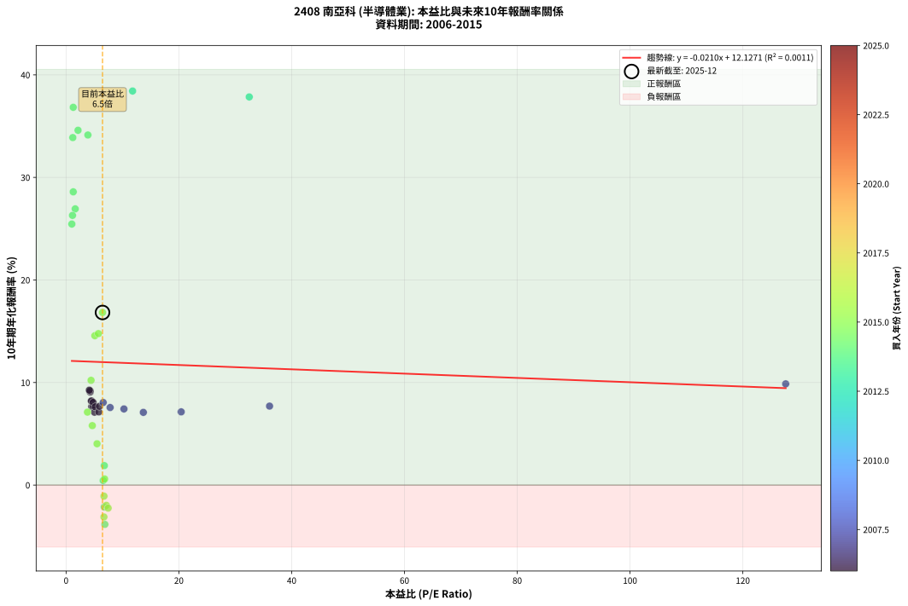
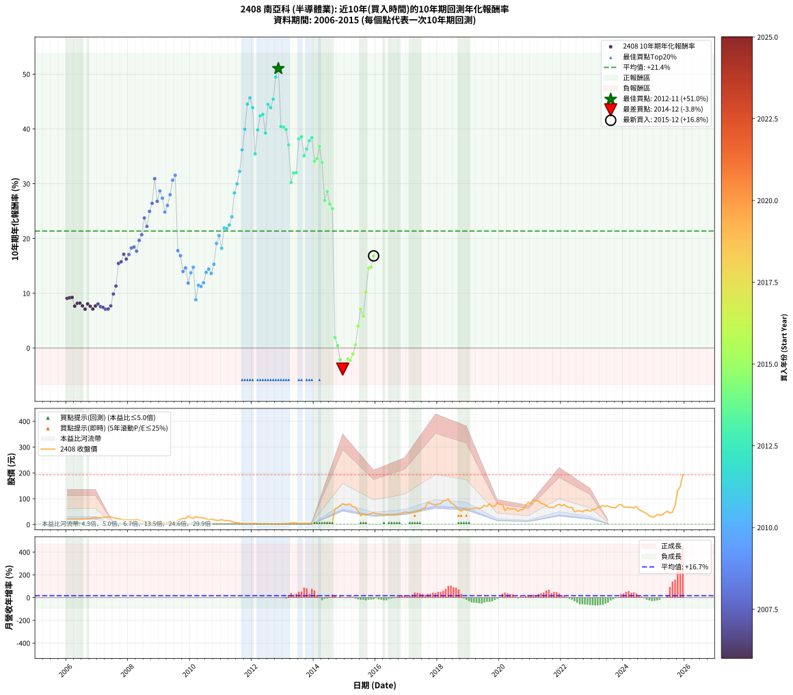

# 2408 南亞科 - 本益比與未來報酬率分析

!!! info "報告資訊"
    - **股票代號**: 2408
    - **公司名稱**: 南亞科
    - **產業別**: 半導體業
    - **分析期間**: 2006-2015 (120 個數據點)
    - **資料來源**: Type 12 (ShowMonthlyK_ChartFlow) 月收盤價與本益比
    - **報酬率口徑**: 含現金股利 (簡化: 年度合計，假設每年7/1入帳)
    - **報告生成時間**: 2026-01-13 00:42:19 CST

## 📈 視覺化圖表

### 圖表1: 本益比 vs 未來報酬率關係

*圖表1：2408 南亞科 本益比與10年期未來報酬率關係 (2006-2015)*

### 圖表2: 歷年買入時點的10年期實際報酬率

*圖表2：2408 南亞科 歷年買入時點的10年期實際報酬率 (2006-2015)*

## 📍 買點訊號說明

本報告提供兩種買點提示訊號（顯示於圖表2的股價子圖中）：

### ▲ 小綠色三角形（回測驗證）
- **計算方式**: 使用全部歷史資料計算本益比第25百分位數
- **用途**: 事後驗證，顯示歷史上哪些時點確實為低估區
- **限制**: 當下無法判斷，僅供回測參考
- **特性**: 後見之明（Look-Ahead Bias）

### ▲ 小橘色三角形（即時訊號）
- **計算方式**: 使用截至當月的過去5年資料計算本益比第25百分位數
- **用途**: 實際投資決策，當時即可判斷
- **優勢**: 可操作性強，符合實務需求
- **特性**: 無後見之明，滾動窗口計算

!!! tip "如何使用兩種訊號"
    - **綠色▲** 幫助理解歷史估值機會，驗證策略有效性
    - **橘色▲** 可作為實際買進參考，但仍需搭配基本面分析
    - 兩種訊號重疊時，表示即時判斷與事後驗證一致，信心度較高
    - 僅有綠色▲時，表示當時無法判斷（需要未來資料才能確認）
    - 僅有橘色▲時，表示即時判斷為買點，但事後可能不是最佳時機

## 📊 估值分析摘要

| 指標 | 數值 |
|:---:|:---:|
| **目前本益比** (2015-12) | **6.46 倍** |
| **歷史平均本益比** | 9.68 倍 |
| **估值水準** | 🟢 相對低估 |
| **預期10年年化報酬率** | **+11.99%** |
| **歷史平均報酬率** | +21.36% |
| **相關係數 (R²)** | 0.0011 |
| **趨勢線斜率** | -0.0210 |

!!! abstract "核心洞察"
    目前本益比顯著低於歷史平均，預期未來報酬率可能較高

    根據歷史數據回測，2408 南亞科 在目前本益比 **6.5倍** 的估值水準下，
    預期未來10年年化報酬率約為 **+12.0%**。

    **重要提醒**: 本分析基於歷史數據統計，實際報酬率會受到公司基本面變化、產業趨勢、
    總體經濟環境等多重因素影響。R² = 0.00 表示本益比可解釋約 0.1% 的報酬率變異。

## 📈 歷史估值統計

### 最佳買點 (最高報酬率)

| 項目 | 數值 |
|:---:|:---:|
| 起始時間 | 2012-11 |
| 當時本益比 | nan 倍 |
| 起始價格 | 1.3 元 |
| 10年後價格 | 56.8 元 |
| **10年年化報酬率** | **+51.03%** |

### 最差買點 (最低報酬率)

| 項目 | 數值 |
|:---:|:---:|
| 起始時間 | 2014-12 |
| 當時本益比 | 6.88 倍 |
| 起始價格 | 81.0 元 |
| 10年後價格 | 29.2 元 |
| **10年年化報酬率** | **-3.83%** |

## 🎯 投資啟示

### 本益比與報酬率關係

趨勢線方程式: **y = -0.0210x + 12.1271**

!!! note "負相關"
    本益比與未來報酬率呈現負相關。較低的本益比通常帶來較高的未來報酬率，
    但相關性不算非常強。**估值仍是重要參考指標之一**。

### 估值區間建議

基於歷史數據分析:

- **🟢 低估區** (P/E < 7.7): 預期報酬率較高，可考慮增加持股
- **🟡 合理區** (P/E 7.7-11.6): 預期報酬率符合長期趨勢，正常持有
- **🔴 高估區** (P/E > 11.6): 預期報酬率較低，可考慮減碼或觀望

!!! danger "風險提示"
    - 過去表現不代表未來結果
    - 本分析假設公司基本面無重大結構性變化
    - 產業環境劇變可能使歷史規律失效
    - 應結合公司財報、產業趨勢、總體經濟等多重因素綜合判斷

!!! success "長期投資觀點"
    歷史數據顯示，在合理或低估的估值水準買入並長期持有，
    往往能獲得較佳的投資報酬。**耐心等待好價格**是價值投資的核心原則。

## 📊 數據品質

- **資料來源**: GoodInfo.tw Type 12 (ShowMonthlyK_ChartFlow)
- **資料頻率**: 月度收盤價與本益比
- **回測期間**: 2006-2015
- **數據點數量**: 120 個 (每個點代表一次10年期回測)

### 計算方法說明

1. **10年期年化報酬率**:
   - 對每個歷史時點，計算其後10年的實際投資報酬率
   - 期末價值(不含股利): 期末價格
   - 期末價值(含現金股利): 期末價格 + 持有期間內的現金股利合計 (簡化: 年度合計，假設每年7/1入帳)
   - 公式: 年化報酬率 = [(期末價值/期初價格)^(1/年數) - 1] × 100%

2. **本益比 (P/E Ratio)**:
   - 使用當時的月收盤價與EPS計算
   - 資料來源: Type 12 月度河流圖本益比數據

3. **趨勢線 (Linear Regression)**:
   - 使用最小平方法擬合線性趨勢線
   - R²值衡量本益比對報酬率的解釋能力

---

*本報告由 Stock Analysis System v1.9.0 自動生成*
*數據更新時間: 2026-01-13 00:42:19 CST*

## 📋 月度回測明細表

（每一列對應時間線圖中的一個買入點；可用來對照 SVG 圖上的每個點。）

| 買入月份 | 賣出月份 | 回測期限_年 | 實際持有年數 | 買入本益比_倍 | 買入收盤價_元 | 賣出收盤價_元 | 現金股利合計_元 | 總報酬率_pct | 年化報酬率_pct |
| --- | --- | --- | --- | --- | --- | --- | --- | --- | --- |
| 2006-01 | 2016-01 | 10 | 9.999 | 4.27 | 19.45 | 40.85 | 5.49 | +138.26 | +9.07 |
| 2006-02 | 2016-02 | 10 | 9.999 | 4.26 | 19.40 | 41.20 | 5.49 | +140.68 | +9.18 |
| 2006-03 | 2016-03 | 10 | 10.001 | 4.12 | 18.75 | 39.95 | 5.49 | +142.36 | +9.25 |
| 2006-04 | 2016-04 | 10 | 10.001 | 4.54 | 20.65 | 37.70 | 5.49 | +109.16 | +7.66 |
| 2006-05 | 2016-05 | 10 | 10.001 | 4.53 | 20.60 | 39.70 | 5.49 | +119.38 | +8.17 |
| 2006-06 | 2016-06 | 10 | 10.001 | 4.48 | 20.40 | 39.40 | 5.49 | +120.06 | +8.21 |
| 2006-07 | 2016-07 | 10 | 10.001 | 4.79 | 21.80 | 37.70 | 8.09 | +110.06 | +7.70 |
| 2006-08 | 2016-08 | 10 | 10.001 | 5.04 | 22.95 | 37.50 | 8.09 | +98.66 | +7.10 |
| 2006-09 | 2016-09 | 10 | 10.001 | 4.79 | 21.80 | 39.25 | 8.09 | +117.17 | +8.06 |
| 2006-10 | 2016-10 | 10 | 10.001 | 5.16 | 23.50 | 40.95 | 8.09 | +108.69 | +7.63 |
| 2006-11 | 2016-11 | 10 | 10.001 | 5.80 | 26.40 | 44.50 | 8.09 | +99.22 | +7.13 |
| 2006-12 | 2016-12 | 10 | 10.001 | 5.91 | 26.90 | 48.30 | 8.09 | +109.64 | +7.68 |
| 2007-01 | 2017-01 | 10 | 10.001 | 6.58 | 25.85 | 48.00 | 8.09 | +116.99 | +8.05 |
| 2007-02 | 2017-02 | 10 | 10.001 | 7.81 | 25.85 | 45.50 | 8.09 | +107.32 | +7.56 |
| 2007-03 | 2017-03 | 10 | 10.001 | 10.26 | 27.60 | 48.40 | 8.09 | +104.68 | +7.42 |
| 2007-04 | 2017-04 | 10 | 10.001 | 13.70 | 28.35 | 48.15 | 8.09 | +98.39 | +7.09 |
| 2007-05 | 2017-05 | 10 | 10.001 | 20.41 | 29.60 | 50.90 | 8.09 | +99.30 | +7.14 |
| 2007-06 | 2017-06 | 10 | 10.001 | 36.08 | 29.95 | 54.80 | 8.09 | +109.99 | +7.70 |
| 2007-07 | 2017-07 | 10 | 10.001 | 127.60 | 26.80 | 62.40 | 6.30 | +156.34 | +9.87 |
| 2007-08 | 2017-08 | 10 | 10.001 |  | 24.30 | 64.70 | 6.30 | +192.17 | +11.32 |
| 2007-09 | 2017-09 | 10 | 10.001 |  | 22.00 | 86.30 | 6.30 | +320.90 | +15.45 |
| 2007-10 | 2017-10 | 10 | 10.001 |  | 20.40 | 81.80 | 6.30 | +331.85 | +15.75 |
| 2007-11 | 2017-11 | 10 | 10.001 |  | 17.30 | 77.80 | 6.30 | +386.12 | +17.13 |
| 2007-12 | 2017-12 | 10 | 10.001 |  | 18.30 | 76.20 | 6.30 | +350.81 | +16.25 |
| 2008-01 | 2018-01 | 10 | 10.001 |  | 17.70 | 79.40 | 6.30 | +384.17 | +17.08 |
| 2008-02 | 2018-03 | 10 | 10.081 |  | 18.10 | 92.00 | 6.30 | +443.08 | +18.28 |
| 2008-03 | 2018-03 | 10 | 9.999 |  | 18.10 | 92.00 | 6.30 | +443.08 | +18.44 |
| 2008-04 | 2018-04 | 10 | 9.999 |  | 19.50 | 93.00 | 6.30 | +409.22 | +17.68 |
| 2008-05 | 2018-05 | 10 | 9.999 |  | 17.60 | 99.60 | 6.30 | +501.69 | +19.66 |
| 2008-06 | 2018-06 | 10 | 9.999 |  | 13.65 | 83.20 | 6.30 | +555.66 | +20.69 |
| 2008-07 | 2018-07 | 10 | 9.999 |  | 10.50 | 78.60 | 9.81 | +741.97 | +23.75 |
| 2008-08 | 2018-08 | 10 | 9.999 |  | 10.70 | 69.70 | 9.81 | +643.06 | +22.21 |
| 2008-09 | 2018-09 | 10 | 9.999 |  | 7.32 | 58.10 | 9.81 | +827.69 | +24.95 |
| 2008-10 | 2018-10 | 10 | 9.999 |  | 5.87 | 51.40 | 9.81 | +942.71 | +26.42 |
| 2008-11 | 2018-11 | 10 | 9.999 |  | 4.79 | 61.00 | 9.81 | +1378.23 | +30.92 |
| 2008-12 | 2018-12 | 10 | 9.999 |  | 6.04 | 55.00 | 9.81 | +972.96 | +26.79 |
| 2009-01 | 2019-01 | 10 | 9.999 |  | 5.62 | 60.10 | 9.81 | +1143.90 | +28.67 |
| 2009-02 | 2019-02 | 10 | 9.999 |  | 6.41 | 62.20 | 9.81 | +1023.35 | +27.37 |
| 2009-03 | 2019-03 | 10 | 9.999 |  | 7.75 | 61.40 | 9.81 | +818.80 | +24.83 |
| 2009-04 | 2019-04 | 10 | 9.999 |  | 7.44 | 65.40 | 9.81 | +910.85 | +26.03 |
| 2009-05 | 2019-05 | 10 | 9.999 |  | 6.05 | 61.60 | 9.81 | +1080.28 | +28.00 |
| 2009-06 | 2019-06 | 10 | 9.999 |  | 5.13 | 64.50 | 9.81 | +1348.48 | +30.65 |
| 2009-07 | 2019-07 | 10 | 9.999 |  | 5.86 | 74.00 | 16.92 | +1451.48 | +31.55 |
| 2009-08 | 2019-08 | 10 | 9.999 |  | 17.00 | 70.40 | 16.92 | +413.63 | +17.78 |
| 2009-09 | 2019-09 | 10 | 9.999 |  | 20.50 | 80.50 | 16.92 | +375.20 | +16.87 |
| 2009-10 | 2019-10 | 10 | 9.999 |  | 23.50 | 70.00 | 16.92 | +269.86 | +13.98 |
| 2009-11 | 2019-11 | 10 | 9.999 |  | 22.50 | 71.20 | 16.92 | +291.63 | +14.63 |
| 2009-12 | 2019-12 | 10 | 9.999 |  | 32.70 | 83.40 | 16.92 | +206.78 | +11.86 |
| 2010-01 | 2020-01 | 10 | 9.999 |  | 26.25 | 78.10 | 16.92 | +261.97 | +13.73 |
| 2010-02 | 2020-02 | 10 | 9.999 |  | 23.80 | 77.30 | 16.92 | +295.87 | +14.75 |
| 2010-03 | 2020-03 | 10 | 10.001 |  | 30.30 | 53.70 | 16.92 | +133.06 | +8.83 |
| 2010-04 | 2020-04 | 10 | 10.001 |  | 27.65 | 65.00 | 16.92 | +196.26 | +11.47 |
| 2010-05 | 2020-05 | 10 | 10.001 |  | 26.40 | 59.80 | 16.92 | +190.59 | +11.26 |
| 2010-06 | 2020-06 | 10 | 10.001 |  | 25.25 | 61.00 | 16.92 | +208.58 | +11.93 |
| 2010-07 | 2020-07 | 10 | 10.001 |  | 21.65 | 60.60 | 18.41 | +264.96 | +13.82 |
| 2010-08 | 2020-08 | 10 | 10.001 |  | 18.30 | 51.90 | 18.41 | +284.23 | +14.41 |
| 2010-09 | 2020-09 | 10 | 10.001 |  | 21.15 | 57.50 | 18.41 | +258.93 | +13.63 |
| 2010-10 | 2020-10 | 10 | 10.001 |  | 18.35 | 57.80 | 18.41 | +315.34 | +15.30 |
| 2010-11 | 2020-11 | 10 | 10.001 |  | 15.80 | 72.40 | 18.41 | +474.77 | +19.11 |
| 2010-12 | 2020-12 | 10 | 10.001 |  | 16.25 | 86.80 | 18.41 | +547.47 | +20.53 |
| 2011-01 | 2021-01 | 10 | 10.001 |  | 18.45 | 79.90 | 18.41 | +432.87 | +18.21 |
| 2011-02 | 2021-02 | 10 | 10.001 |  | 15.85 | 96.50 | 18.41 | +625.01 | +21.91 |
| 2011-03 | 2021-03 | 10 | 10.001 |  | 15.35 | 91.90 | 18.41 | +618.66 | +21.80 |
| 2011-04 | 2021-04 | 10 | 10.001 |  | 14.50 | 91.60 | 18.41 | +658.72 | +22.46 |
| 2011-05 | 2021-05 | 10 | 10.001 |  | 11.70 | 81.90 | 18.41 | +757.38 | +23.97 |
| 2011-06 | 2021-06 | 10 | 10.001 |  | 8.10 | 79.70 | 18.41 | +1111.28 | +28.32 |
| 2011-07 | 2021-07 | 10 | 10.001 |  | 6.68 | 72.30 | 19.71 | +1277.41 | +29.98 |
| 2011-08 | 2021-08 | 10 | 10.001 |  | 5.26 | 66.40 | 19.71 | +1537.09 | +32.25 |
| 2011-09 | 2021-09 | 10 | 10.001 |  | 3.90 | 65.90 | 19.71 | +2095.15 | +36.18 |
| 2011-10 | 2021-10 | 10 | 10.001 |  | 2.99 | 66.50 | 19.71 | +2783.31 | +39.95 |
| 2011-11 | 2021-11 | 10 | 10.001 |  | 2.36 | 74.20 | 19.71 | +3879.28 | +44.53 |
| 2011-12 | 2021-12 | 10 | 10.001 |  | 2.27 | 78.10 | 19.71 | +4208.85 | +45.68 |
| 2012-01 | 2022-01 | 10 | 10.001 |  | 2.41 | 72.00 | 19.71 | +3705.44 | +43.89 |
| 2012-02 | 2022-03 | 10 | 10.081 |  | 4.17 | 69.20 | 19.71 | +2032.16 | +35.46 |
| 2012-03 | 2022-03 | 10 | 9.999 |  | 3.11 | 69.20 | 19.71 | +2758.87 | +39.84 |
| 2012-04 | 2022-04 | 10 | 9.999 |  | 2.49 | 65.60 | 19.71 | +3326.14 | +42.40 |
| 2012-05 | 2022-05 | 10 | 9.999 |  | 2.48 | 66.80 | 19.71 | +3388.35 | +42.65 |
| 2012-06 | 2022-06 | 10 | 9.999 |  | 2.52 | 49.40 | 19.71 | +2642.50 | +39.26 |
| 2012-07 | 2022-07 | 10 | 9.999 |  | 1.91 | 52.30 | 23.41 | +3864.08 | +44.49 |
| 2012-08 | 2022-08 | 10 | 9.999 |  | 2.02 | 53.40 | 23.41 | +3702.67 | +43.89 |
| 2012-09 | 2022-09 | 10 | 9.999 |  | 1.71 | 48.95 | 23.41 | +4131.81 | +45.44 |
| 2012-10 | 2022-10 | 10 | 9.999 |  | 1.40 | 54.50 | 23.41 | +5465.29 | +49.48 |
| 2012-11 | 2022-11 | 10 | 9.999 |  | 1.30 | 56.80 | 23.41 | +6070.31 | +51.03 |
| 2012-12 | 2022-12 | 10 | 9.999 |  | 2.50 | 51.20 | 23.41 | +2884.56 | +40.45 |
| 2013-01 | 2023-01 | 10 | 9.999 |  | 2.74 | 57.80 | 23.41 | +2864.01 | +40.35 |
| 2013-02 | 2023-02 | 10 | 9.999 |  | 2.85 | 58.40 | 23.41 | +2770.67 | +39.90 |
| 2013-03 | 2023-03 | 10 | 9.999 |  | 3.84 | 66.50 | 23.41 | +2241.51 | +37.08 |
| 2013-04 | 2023-04 | 10 | 9.999 |  | 6.50 | 67.80 | 23.41 | +1303.29 | +30.24 |
| 2013-05 | 2023-05 | 10 | 9.999 |  | 6.05 | 73.50 | 23.41 | +1501.88 | +31.97 |
| 2013-06 | 2023-06 | 10 | 9.999 |  | 5.86 | 70.80 | 23.41 | +1507.75 | +32.02 |
| 2013-07 | 2023-07 | 10 | 9.999 |  | 3.85 | 72.30 | 25.54 | +2441.40 | +38.21 |
| 2013-08 | 2023-08 | 10 | 9.999 |  | 3.53 | 66.60 | 25.54 | +2510.31 | +38.58 |
| 2013-09 | 2023-09 | 10 | 9.999 |  | 4.50 | 65.60 | 25.54 | +1925.42 | +35.10 |
| 2013-10 | 2023-10 | 10 | 9.999 |  | 4.07 | 64.70 | 25.54 | +2117.30 | +36.33 |
| 2013-11 | 2023-11 | 10 | 9.999 | 32.48 | 4.06 | 75.00 | 25.54 | +2376.45 | +37.85 |
| 2013-12 | 2023-12 | 10 | 9.999 | 11.79 | 4.01 | 78.00 | 25.54 | +2482.14 | +38.43 |
| 2014-01 | 2024-01 | 10 | 9.999 | 3.87 | 5.00 | 68.70 | 25.54 | +1784.88 | +34.14 |
| 2014-02 | 2024-02 | 10 | 9.999 | 2.12 | 4.76 | 67.30 | 25.54 | +1850.50 | +34.60 |
| 2014-03 | 2024-03 | 10 | 10.001 | 1.27 | 4.05 | 67.70 | 25.54 | +2202.32 | +36.84 |
| 2014-04 | 2024-04 | 10 | 10.001 | 1.19 | 4.95 | 66.10 | 25.54 | +1751.39 | +33.89 |
| 2014-05 | 2024-05 | 10 | 10.001 | 1.62 | 8.29 | 64.50 | 25.54 | +986.18 | +26.93 |
| 2014-06 | 2024-06 | 10 | 10.001 | 1.27 | 7.70 | 69.70 | 25.54 | +1136.94 | +28.59 |
| 2014-07 | 2024-07 | 10 | 10.001 | 1.14 | 8.00 | 57.10 | 25.54 | +933.05 | +26.30 |
| 2014-08 | 2024-08 | 10 | 10.001 | 1.02 | 8.10 | 52.70 | 25.54 | +865.98 | +25.45 |
| 2014-09 | 2024-09 | 10 | 10.001 | 6.78 | 60.40 | 47.35 | 25.54 | +20.69 | +1.90 |
| 2014-10 | 2024-10 | 10 | 10.001 | 6.58 | 64.90 | 42.30 | 25.54 | +4.54 | +0.44 |
| 2014-11 | 2024-11 | 10 | 10.001 | 6.77 | 73.20 | 33.45 | 25.54 | -19.41 | -2.13 |
| 2014-12 | 2024-12 | 10 | 10.001 | 6.88 | 81.00 | 29.25 | 25.54 | -32.35 | -3.83 |
| 2015-01 | 2025-01 | 10 | 10.001 | 6.71 | 76.30 | 30.10 | 25.54 | -27.07 | -3.11 |
| 2015-02 | 2025-02 | 10 | 10.001 | 7.14 | 78.40 | 38.65 | 25.54 | -18.12 | -1.98 |
| 2015-03 | 2025-03 | 10 | 10.001 | 7.46 | 79.00 | 37.40 | 25.54 | -20.32 | -2.25 |
| 2015-04 | 2025-04 | 10 | 10.001 | 6.72 | 68.60 | 36.00 | 25.54 | -10.29 | -1.08 |
| 2015-05 | 2025-05 | 10 | 10.001 | 6.83 | 67.00 | 45.55 | 25.54 | +6.11 | +0.59 |
| 2015-06 | 2025-06 | 10 | 10.001 | 5.49 | 51.70 | 51.20 | 25.54 | +48.44 | +4.03 |
| 2015-07 | 2025-07 | 10 | 10.001 | 3.79 | 34.25 | 44.55 | 23.55 | +98.82 | +7.11 |
| 2015-08 | 2025-08 | 10 | 10.001 | 4.65 | 40.15 | 47.00 | 23.55 | +75.71 | +5.80 |
| 2015-09 | 2025-09 | 10 | 10.001 | 4.43 | 36.50 | 73.00 | 23.55 | +164.51 | +10.21 |
| 2015-10 | 2025-10 | 10 | 10.001 | 5.10 | 40.05 | 132.50 | 23.55 | +289.63 | +14.57 |
| 2015-11 | 2025-11 | 10 | 10.001 | 5.73 | 42.75 | 146.00 | 23.55 | +296.60 | +14.77 |
| 2015-12 | 2025-12 | 10 | 10.001 | 6.46 | 45.70 | 193.00 | 23.55 | +373.84 | +16.83 |
