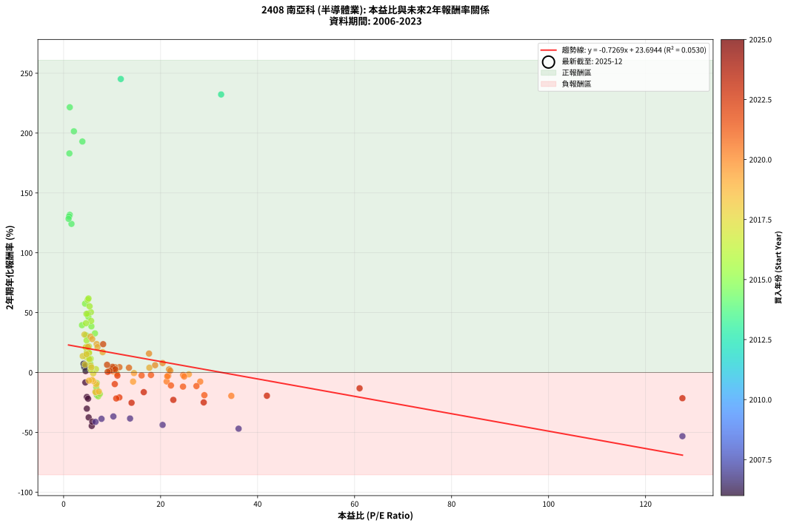
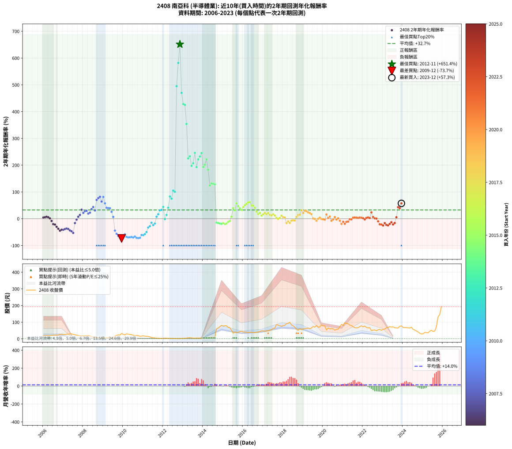

# 2408 南亞科 - 本益比與未來報酬率分析

!!! info "報告資訊"
    - **股票代號**: 2408
    - **公司名稱**: 南亞科
    - **產業別**: 半導體業
    - **分析期間**: 2006-2023 (216 個數據點)
    - **資料來源**: Type 12 (ShowMonthlyK_ChartFlow) 月收盤價與本益比
    - **報酬率口徑**: 含現金股利 (簡化: 年度合計，假設每年7/1入帳)
    - **報告生成時間**: 2026-01-06 18:37:11 CST

## 📈 視覺化圖表

### 圖表1: 本益比 vs 未來報酬率關係

*圖表1：2408 南亞科 本益比與2年期未來報酬率關係 (2006-2023)*

### 圖表2: 歷年買入時點的2年期實際報酬率

*圖表2：2408 南亞科 歷年買入時點的2年期實際報酬率 (2006-2023)*

## 📍 買點訊號說明

本報告提供兩種買點提示訊號（顯示於圖表2的股價子圖中）：

### ▲ 小綠色三角形（回測驗證）
- **計算方式**: 使用全部歷史資料計算本益比第25百分位數
- **用途**: 事後驗證，顯示歷史上哪些時點確實為低估區
- **限制**: 當下無法判斷，僅供回測參考
- **特性**: 後見之明（Look-Ahead Bias）

### ▲ 小橘色三角形（即時訊號）
- **計算方式**: 使用截至當月的過去5年資料計算本益比第25百分位數
- **用途**: 實際投資決策，當時即可判斷
- **優勢**: 可操作性強，符合實務需求
- **特性**: 無後見之明，滾動窗口計算

!!! tip "如何使用兩種訊號"
    - **綠色▲** 幫助理解歷史估值機會，驗證策略有效性
    - **橘色▲** 可作為實際買進參考，但仍需搭配基本面分析
    - 兩種訊號重疊時，表示即時判斷與事後驗證一致，信心度較高
    - 僅有綠色▲時，表示當時無法判斷（需要未來資料才能確認）
    - 僅有橘色▲時，表示即時判斷為買點，但事後可能不是最佳時機

## 📊 估值分析摘要

| 指標 | 數值 |
|:---:|:---:|
| **目前本益比** (2023-12) | **nan 倍** |
| **歷史平均本益比** | 12.30 倍 |
| **估值水準** | 🟡 合理範圍 |
| **預期2年年化報酬率** | **+nan%** |
| **歷史平均報酬率** | +32.65% |
| **相關係數 (R²)** | 0.0530 |
| **趨勢線斜率** | -0.7269 |

!!! abstract "核心洞察"
    目前本益比接近歷史平均，預期報酬率符合長期趨勢

    根據歷史數據回測，2408 南亞科 在目前本益比 **nan倍** 的估值水準下，
    預期未來2年年化報酬率約為 **+nan%**。

    **重要提醒**: 本分析基於歷史數據統計，實際報酬率會受到公司基本面變化、產業趨勢、
    總體經濟環境等多重因素影響。R² = 0.05 表示本益比可解釋約 5.3% 的報酬率變異。

## 📈 歷史估值統計

### 最佳買點 (最高報酬率)

| 項目 | 數值 |
|:---:|:---:|
| 起始時間 | 2012-11 |
| 當時本益比 | nan 倍 |
| 起始價格 | 1.3 元 |
| 2年後價格 | 73.2 元 |
| **2年年化報酬率** | **+651.42%** |

### 最差買點 (最低報酬率)

| 項目 | 數值 |
|:---:|:---:|
| 起始時間 | 2009-12 |
| 當時本益比 | nan 倍 |
| 起始價格 | 32.7 元 |
| 2年後價格 | 2.3 元 |
| **2年年化報酬率** | **-73.68%** |

## 🎯 投資啟示

### 本益比與報酬率關係

趨勢線方程式: **y = -0.7269x + 23.6944**

!!! warning "強負相關"
    本益比與未來報酬率呈現強負相關。在高本益比時期買入，未來報酬率顯著較低；
    在低本益比時期買入，未來報酬率顯著較高。**估值紀律至關重要**。

### 估值區間建議

基於歷史數據分析:

- **🟢 低估區** (P/E < 9.8): 預期報酬率較高，可考慮增加持股
- **🟡 合理區** (P/E 9.8-14.8): 預期報酬率符合長期趨勢，正常持有
- **🔴 高估區** (P/E > 14.8): 預期報酬率較低，可考慮減碼或觀望

!!! danger "風險提示"
    - 過去表現不代表未來結果
    - 本分析假設公司基本面無重大結構性變化
    - 產業環境劇變可能使歷史規律失效
    - 應結合公司財報、產業趨勢、總體經濟等多重因素綜合判斷

!!! success "長期投資觀點"
    歷史數據顯示，在合理或低估的估值水準買入並長期持有，
    往往能獲得較佳的投資報酬。**耐心等待好價格**是價值投資的核心原則。

## 📊 數據品質

- **資料來源**: GoodInfo.tw Type 12 (ShowMonthlyK_ChartFlow)
- **資料頻率**: 月度收盤價與本益比
- **回測期間**: 2006-2023
- **數據點數量**: 216 個 (每個點代表一次2年期回測)

### 計算方法說明

1. **2年期年化報酬率**:
   - 對每個歷史時點，計算其後2年的實際投資報酬率
   - 期末價值(不含股利): 期末價格
   - 期末價值(含現金股利): 期末價格 + 持有期間內的現金股利合計 (簡化: 年度合計，假設每年7/1入帳)
   - 公式: 年化報酬率 = [(期末價值/期初價格)^(1/年數) - 1] × 100%

2. **本益比 (P/E Ratio)**:
   - 使用當時的月收盤價與EPS計算
   - 資料來源: Type 12 月度河流圖本益比數據

3. **趨勢線 (Linear Regression)**:
   - 使用最小平方法擬合線性趨勢線
   - R²值衡量本益比對報酬率的解釋能力

---

*本報告由 Stock Analysis System v1.9.0 自動生成*
*數據更新時間: 2026-01-06 18:37:11 CST*

## 📋 月度回測明細表

（每一列對應時間線圖中的一個買入點；可用來對照 SVG 圖上的每個點。）

| 買入月份 | 賣出月份 | 回測期限_年 | 實際持有年數 | 買入本益比_倍 | 買入收盤價_元 | 賣出收盤價_元 | 現金股利合計_元 | 總報酬率_pct | 年化報酬率_pct |
| --- | --- | --- | --- | --- | --- | --- | --- | --- | --- |
| 2006-01 | 2008-01 | 2 | 1.999 | 4.27 | 19.45 | 17.70 | 3.49 | +8.97 | +4.39 |
| 2006-02 | 2008-02 | 2 | 1.999 | 4.26 | 19.40 | 18.10 | 3.49 | +11.31 | +5.51 |
| 2006-03 | 2008-03 | 2 | 2.001 | 4.12 | 18.75 | 18.10 | 3.49 | +15.17 | +7.31 |
| 2006-04 | 2008-04 | 2 | 2.001 | 4.54 | 20.65 | 19.50 | 3.49 | +11.35 | +5.52 |
| 2006-05 | 2008-05 | 2 | 2.001 | 4.53 | 20.60 | 17.60 | 3.49 | +2.40 | +1.19 |
| 2006-06 | 2008-06 | 2 | 2.001 | 4.48 | 20.40 | 13.65 | 3.49 | -15.96 | -8.32 |
| 2006-07 | 2008-07 | 2 | 2.001 | 4.79 | 21.80 | 10.50 | 3.29 | -36.72 | -20.44 |
| 2006-08 | 2008-08 | 2 | 2.001 | 5.04 | 22.95 | 10.70 | 3.29 | -39.02 | -21.90 |
| 2006-09 | 2008-09 | 2 | 2.001 | 4.79 | 21.80 | 7.32 | 3.29 | -51.31 | -30.20 |
| 2006-10 | 2008-10 | 2 | 2.001 | 5.16 | 23.50 | 5.87 | 3.29 | -61.00 | -37.53 |
| 2006-11 | 2008-11 | 2 | 2.001 | 5.80 | 26.40 | 4.79 | 3.29 | -69.38 | -44.64 |
| 2006-12 | 2008-12 | 2 | 2.001 | 5.91 | 26.90 | 6.04 | 3.29 | -65.30 | -41.07 |
| 2007-01 | 2009-01 | 2 | 2.001 | 6.58 | 25.85 | 5.62 | 3.29 | -65.51 | -41.25 |
| 2007-02 | 2009-02 | 2 | 2.001 | 7.81 | 25.85 | 6.41 | 3.29 | -62.46 | -38.71 |
| 2007-03 | 2009-03 | 2 | 2.001 | 10.26 | 27.60 | 7.75 | 3.29 | -59.98 | -36.72 |
| 2007-04 | 2009-04 | 2 | 2.001 | 13.70 | 28.35 | 7.44 | 3.29 | -62.13 | -38.44 |
| 2007-05 | 2009-05 | 2 | 2.001 | 20.41 | 29.60 | 6.05 | 3.29 | -68.43 | -43.79 |
| 2007-06 | 2009-06 | 2 | 2.001 | 36.08 | 29.95 | 5.13 | 3.29 | -71.87 | -46.94 |
| 2007-07 | 2009-07 | 2 | 2.001 | 127.60 | 26.80 | 5.86 | 0.00 | -78.13 | -53.21 |
| 2007-08 | 2009-08 | 2 | 2.001 |  | 24.30 | 17.00 | 0.00 | -30.04 | -16.35 |
| 2007-09 | 2009-09 | 2 | 2.001 |  | 22.00 | 20.50 | 0.00 | -6.82 | -3.47 |
| 2007-10 | 2009-10 | 2 | 2.001 |  | 20.40 | 23.50 | 0.00 | +15.20 | +7.32 |
| 2007-11 | 2009-11 | 2 | 2.001 |  | 17.30 | 22.50 | 0.00 | +30.06 | +14.03 |
| 2007-12 | 2009-12 | 2 | 2.001 |  | 18.30 | 32.70 | 0.00 | +78.69 | +33.65 |
| 2008-01 | 2010-01 | 2 | 2.001 |  | 17.70 | 26.25 | 0.00 | +48.31 | +21.76 |
| 2008-02 | 2010-03 | 2 | 2.081 |  | 18.10 | 30.30 | 0.00 | +67.40 | +28.10 |
| 2008-03 | 2010-03 | 2 | 1.999 |  | 18.10 | 30.30 | 0.00 | +67.40 | +29.41 |
| 2008-04 | 2010-04 | 2 | 1.999 |  | 19.50 | 27.65 | 0.00 | +41.79 | +19.09 |
| 2008-05 | 2010-05 | 2 | 1.999 |  | 17.60 | 26.40 | 0.00 | +50.00 | +22.49 |
| 2008-06 | 2010-06 | 2 | 1.999 |  | 13.65 | 25.25 | 0.00 | +84.98 | +36.04 |
| 2008-07 | 2010-07 | 2 | 1.999 |  | 10.50 | 21.65 | 0.00 | +106.19 | +43.63 |
| 2008-08 | 2010-08 | 2 | 1.999 |  | 10.70 | 18.30 | 0.00 | +71.03 | +30.80 |
| 2008-09 | 2010-09 | 2 | 1.999 |  | 7.32 | 21.15 | 0.00 | +188.93 | +70.04 |
| 2008-10 | 2010-10 | 2 | 1.999 |  | 5.87 | 18.35 | 0.00 | +212.61 | +76.88 |
| 2008-11 | 2010-11 | 2 | 1.999 |  | 4.79 | 15.80 | 0.00 | +229.85 | +81.69 |
| 2008-12 | 2010-12 | 2 | 1.999 |  | 6.04 | 16.25 | 0.00 | +169.04 | +64.08 |
| 2009-01 | 2011-01 | 2 | 1.999 |  | 5.62 | 18.45 | 0.00 | +228.29 | +81.26 |
| 2009-02 | 2011-02 | 2 | 1.999 |  | 6.41 | 15.85 | 0.00 | +147.27 | +57.30 |
| 2009-03 | 2011-03 | 2 | 1.999 |  | 7.75 | 15.35 | 0.00 | +98.06 | +40.77 |
| 2009-04 | 2011-04 | 2 | 1.999 |  | 7.44 | 14.50 | 0.00 | +94.89 | +39.64 |
| 2009-05 | 2011-05 | 2 | 1.999 |  | 6.05 | 11.70 | 0.00 | +93.39 | +39.10 |
| 2009-06 | 2011-06 | 2 | 1.999 |  | 5.13 | 8.10 | 0.00 | +57.89 | +25.68 |
| 2009-07 | 2011-07 | 2 | 1.999 |  | 5.86 | 6.68 | 0.00 | +13.99 | +6.77 |
| 2009-08 | 2011-08 | 2 | 1.999 |  | 17.00 | 5.26 | 0.00 | -69.06 | -44.40 |
| 2009-09 | 2011-09 | 2 | 1.999 |  | 20.50 | 3.90 | 0.00 | -80.98 | -56.41 |
| 2009-10 | 2011-10 | 2 | 1.999 |  | 23.50 | 2.99 | 0.00 | -87.28 | -64.36 |
| 2009-11 | 2011-11 | 2 | 1.999 |  | 22.50 | 2.36 | 0.00 | -89.51 | -67.64 |
| 2009-12 | 2011-12 | 2 | 1.999 |  | 32.70 | 2.27 | 0.00 | -93.06 | -73.68 |
| 2010-01 | 2012-01 | 2 | 1.999 |  | 26.25 | 2.41 | 0.00 | -90.82 | -69.72 |
| 2010-02 | 2012-02 | 2 | 1.999 |  | 23.80 | 4.17 | 0.00 | -82.48 | -58.17 |
| 2010-03 | 2012-03 | 2 | 2.001 |  | 30.30 | 3.11 | 0.00 | -89.74 | -67.94 |
| 2010-04 | 2012-04 | 2 | 2.001 |  | 27.65 | 2.49 | 0.00 | -90.99 | -69.97 |
| 2010-05 | 2012-05 | 2 | 2.001 |  | 26.40 | 2.48 | 0.00 | -90.61 | -69.33 |
| 2010-06 | 2012-06 | 2 | 2.001 |  | 25.25 | 2.52 | 0.00 | -90.02 | -68.38 |
| 2010-07 | 2012-07 | 2 | 2.001 |  | 21.65 | 1.91 | 0.00 | -91.18 | -70.27 |
| 2010-08 | 2012-08 | 2 | 2.001 |  | 18.30 | 2.02 | 0.00 | -88.96 | -66.75 |
| 2010-09 | 2012-09 | 2 | 2.001 |  | 21.15 | 1.71 | 0.00 | -91.91 | -71.54 |
| 2010-10 | 2012-10 | 2 | 2.001 |  | 18.35 | 1.40 | 0.00 | -92.37 | -72.35 |
| 2010-11 | 2012-11 | 2 | 2.001 |  | 15.80 | 1.30 | 0.00 | -91.77 | -71.29 |
| 2010-12 | 2012-12 | 2 | 2.001 |  | 16.25 | 2.50 | 0.00 | -84.62 | -60.75 |
| 2011-01 | 2013-01 | 2 | 2.001 |  | 18.45 | 2.74 | 0.00 | -85.15 | -61.44 |
| 2011-02 | 2013-02 | 2 | 2.001 |  | 15.85 | 2.85 | 0.00 | -82.02 | -57.57 |
| 2011-03 | 2013-03 | 2 | 2.001 |  | 15.35 | 3.84 | 0.00 | -74.98 | -49.96 |
| 2011-04 | 2013-04 | 2 | 2.001 |  | 14.50 | 6.50 | 0.00 | -55.17 | -33.03 |
| 2011-05 | 2013-05 | 2 | 2.001 |  | 11.70 | 6.05 | 0.00 | -48.29 | -28.07 |
| 2011-06 | 2013-06 | 2 | 2.001 |  | 8.10 | 5.86 | 0.00 | -27.65 | -14.93 |
| 2011-07 | 2013-07 | 2 | 2.001 |  | 6.68 | 3.85 | 0.00 | -42.37 | -24.07 |
| 2011-08 | 2013-08 | 2 | 2.001 |  | 5.26 | 3.53 | 0.00 | -32.89 | -18.07 |
| 2011-09 | 2013-09 | 2 | 2.001 |  | 3.90 | 4.50 | 0.00 | +15.38 | +7.41 |
| 2011-10 | 2013-10 | 2 | 2.001 |  | 2.99 | 4.07 | 0.00 | +36.12 | +16.66 |
| 2011-11 | 2013-11 | 2 | 2.001 |  | 2.36 | 4.06 | 0.00 | +72.03 | +31.14 |
| 2011-12 | 2013-12 | 2 | 2.001 |  | 2.27 | 4.01 | 0.00 | +76.65 | +32.88 |
| 2012-01 | 2014-01 | 2 | 2.001 |  | 2.41 | 5.00 | 0.00 | +107.47 | +44.00 |
| 2012-02 | 2014-03 | 2 | 2.081 |  | 4.17 | 4.05 | 0.00 | -2.88 | -1.39 |
| 2012-03 | 2014-03 | 2 | 1.999 |  | 3.11 | 4.05 | 0.00 | +30.23 | +14.13 |
| 2012-04 | 2014-04 | 2 | 1.999 |  | 2.49 | 4.95 | 0.00 | +98.80 | +41.03 |
| 2012-05 | 2014-05 | 2 | 1.999 |  | 2.48 | 8.29 | 0.00 | +234.27 | +82.91 |
| 2012-06 | 2014-06 | 2 | 1.999 |  | 2.52 | 7.70 | 0.00 | +205.56 | +74.87 |
| 2012-07 | 2014-07 | 2 | 1.999 |  | 1.91 | 8.00 | 0.00 | +318.85 | +104.76 |
| 2012-08 | 2014-08 | 2 | 1.999 |  | 2.02 | 8.10 | 0.00 | +300.99 | +100.34 |
| 2012-09 | 2014-09 | 2 | 1.999 |  | 1.71 | 60.40 | 0.00 | +3432.16 | +495.05 |
| 2012-10 | 2014-10 | 2 | 1.999 |  | 1.40 | 64.90 | 0.00 | +4535.71 | +581.76 |
| 2012-11 | 2014-11 | 2 | 1.999 |  | 1.30 | 73.20 | 0.00 | +5530.77 | +651.42 |
| 2012-12 | 2014-12 | 2 | 1.999 |  | 2.50 | 81.00 | 0.00 | +3140.00 | +469.89 |
| 2013-01 | 2015-01 | 2 | 1.999 |  | 2.74 | 76.30 | 0.00 | +2684.67 | +428.30 |
| 2013-02 | 2015-02 | 2 | 1.999 |  | 2.85 | 78.40 | 0.00 | +2650.88 | +425.08 |
| 2013-03 | 2015-03 | 2 | 1.999 |  | 3.84 | 79.00 | 0.00 | +1957.29 | +354.04 |
| 2013-04 | 2015-04 | 2 | 1.999 |  | 6.50 | 68.60 | 0.00 | +955.38 | +225.13 |
| 2013-05 | 2015-05 | 2 | 1.999 |  | 6.05 | 67.00 | 0.00 | +1007.44 | +233.06 |
| 2013-06 | 2015-06 | 2 | 1.999 |  | 5.86 | 51.70 | 0.00 | +782.25 | +197.25 |
| 2013-07 | 2015-07 | 2 | 1.999 |  | 3.85 | 34.25 | 2.00 | +841.51 | +207.08 |
| 2013-08 | 2015-08 | 2 | 1.999 |  | 3.53 | 40.15 | 2.00 | +1093.99 | +245.84 |
| 2013-09 | 2015-09 | 2 | 1.999 |  | 4.50 | 36.50 | 2.00 | +755.51 | +192.71 |
| 2013-10 | 2015-10 | 2 | 1.999 |  | 4.07 | 40.05 | 2.00 | +933.12 | +221.68 |
| 2013-11 | 2015-11 | 2 | 1.999 | 32.48 | 4.06 | 42.75 | 2.00 | +1002.17 | +232.26 |
| 2013-12 | 2015-12 | 2 | 1.999 | 11.79 | 4.01 | 45.70 | 2.00 | +1089.48 | +245.18 |
| 2014-01 | 2016-01 | 2 | 1.999 | 3.87 | 5.00 | 40.85 | 2.00 | +756.96 | +192.95 |
| 2014-02 | 2016-02 | 2 | 1.999 | 2.12 | 4.76 | 41.20 | 2.00 | +807.52 | +201.48 |
| 2014-03 | 2016-03 | 2 | 2.001 | 1.27 | 4.05 | 39.95 | 2.00 | +935.75 | +221.57 |
| 2014-04 | 2016-04 | 2 | 2.001 | 1.19 | 4.95 | 37.70 | 2.00 | +701.98 | +182.99 |
| 2014-05 | 2016-05 | 2 | 2.001 | 1.62 | 8.29 | 39.70 | 2.00 | +402.99 | +124.15 |
| 2014-06 | 2016-06 | 2 | 2.001 | 1.27 | 7.70 | 39.40 | 2.00 | +437.64 | +131.74 |
| 2014-07 | 2016-07 | 2 | 2.001 | 1.14 | 8.00 | 37.70 | 4.80 | +431.23 | +130.35 |
| 2014-08 | 2016-08 | 2 | 2.001 | 1.02 | 8.10 | 37.50 | 4.80 | +422.20 | +128.39 |
| 2014-09 | 2016-09 | 2 | 2.001 | 6.78 | 60.40 | 39.25 | 4.80 | -27.07 | -14.59 |
| 2014-10 | 2016-10 | 2 | 2.001 | 6.58 | 64.90 | 40.95 | 4.80 | -29.51 | -16.03 |
| 2014-11 | 2016-11 | 2 | 2.001 | 6.77 | 73.20 | 44.50 | 4.80 | -32.65 | -17.92 |
| 2014-12 | 2016-12 | 2 | 2.001 | 6.88 | 81.00 | 48.30 | 4.80 | -34.45 | -19.02 |
| 2015-01 | 2017-01 | 2 | 2.001 | 6.71 | 76.30 | 48.00 | 4.80 | -30.80 | -16.80 |
| 2015-02 | 2017-02 | 2 | 2.001 | 7.14 | 78.40 | 45.50 | 4.80 | -35.84 | -19.89 |
| 2015-03 | 2017-03 | 2 | 2.001 | 7.46 | 79.00 | 48.40 | 4.80 | -32.66 | -17.93 |
| 2015-04 | 2017-04 | 2 | 2.001 | 6.72 | 68.60 | 48.15 | 4.80 | -22.82 | -12.14 |
| 2015-05 | 2017-05 | 2 | 2.001 | 6.83 | 67.00 | 50.90 | 4.80 | -16.87 | -8.82 |
| 2015-06 | 2017-06 | 2 | 2.001 | 5.49 | 51.70 | 54.80 | 4.80 | +15.28 | +7.36 |
| 2015-07 | 2017-07 | 2 | 2.001 | 3.79 | 34.25 | 62.40 | 4.30 | +94.74 | +39.52 |
| 2015-08 | 2017-08 | 2 | 2.001 | 4.65 | 40.15 | 64.70 | 4.30 | +71.86 | +31.07 |
| 2015-09 | 2017-09 | 2 | 2.001 | 4.43 | 36.50 | 86.30 | 4.30 | +148.22 | +57.50 |
| 2015-10 | 2017-10 | 2 | 2.001 | 5.10 | 40.05 | 81.80 | 4.30 | +114.98 | +46.58 |
| 2015-11 | 2017-11 | 2 | 2.001 | 5.73 | 42.75 | 77.80 | 4.30 | +92.05 | +38.55 |
| 2015-12 | 2017-12 | 2 | 2.001 | 6.46 | 45.70 | 76.20 | 4.30 | +76.15 | +32.70 |
| 2016-01 | 2018-01 | 2 | 2.001 | 5.67 | 40.85 | 79.40 | 4.30 | +104.90 | +43.11 |
| 2016-02 | 2018-03 | 2 | 2.081 | 5.62 | 41.20 | 92.00 | 4.30 | +133.74 | +50.39 |
| 2016-03 | 2018-03 | 2 | 1.999 | 5.35 | 39.95 | 92.00 | 4.30 | +141.05 | +55.31 |
| 2016-04 | 2018-04 | 2 | 1.999 | 4.96 | 37.70 | 93.00 | 4.30 | +158.09 | +60.70 |
| 2016-05 | 2018-05 | 2 | 1.999 | 5.13 | 39.70 | 99.60 | 4.30 | +161.71 | +61.83 |
| 2016-06 | 2018-06 | 2 | 1.999 | 5.01 | 39.40 | 83.20 | 4.30 | +122.08 | +49.06 |
| 2016-07 | 2018-07 | 2 | 1.999 | 4.71 | 37.70 | 78.60 | 5.01 | +121.77 | +48.96 |
| 2016-08 | 2018-08 | 2 | 1.999 | 4.61 | 37.50 | 69.70 | 5.01 | +99.22 | +41.18 |
| 2016-09 | 2018-09 | 2 | 1.999 | 4.75 | 39.25 | 58.10 | 5.01 | +60.79 | +26.82 |
| 2016-10 | 2018-10 | 2 | 1.999 | 4.87 | 40.95 | 51.40 | 5.01 | +37.75 | +17.38 |
| 2016-11 | 2018-11 | 2 | 1.999 | 5.21 | 44.50 | 61.00 | 5.01 | +48.33 | +21.81 |
| 2016-12 | 2018-12 | 2 | 1.999 | 5.57 | 48.30 | 55.00 | 5.01 | +24.24 | +11.47 |
| 2017-01 | 2019-01 | 2 | 1.999 | 5.25 | 48.00 | 60.10 | 5.01 | +35.64 | +16.48 |
| 2017-02 | 2019-02 | 2 | 1.999 | 4.73 | 45.50 | 62.20 | 5.01 | +47.71 | +21.55 |
| 2017-03 | 2019-03 | 2 | 1.999 | 4.80 | 48.40 | 61.40 | 5.01 | +37.21 | +17.15 |
| 2017-04 | 2019-04 | 2 | 1.999 | 4.56 | 48.15 | 65.40 | 5.01 | +46.23 | +20.94 |
| 2017-05 | 2019-05 | 2 | 1.999 | 4.61 | 50.90 | 61.60 | 5.01 | +30.86 | +14.41 |
| 2017-06 | 2019-06 | 2 | 1.999 | 4.76 | 54.80 | 64.50 | 5.01 | +26.84 | +12.63 |
| 2017-07 | 2019-07 | 2 | 1.999 | 5.20 | 62.40 | 74.00 | 10.62 | +35.61 | +16.46 |
| 2017-08 | 2019-08 | 2 | 1.999 | 5.19 | 64.70 | 70.40 | 10.62 | +25.22 | +11.91 |
| 2017-09 | 2019-09 | 2 | 1.999 | 6.67 | 86.30 | 80.50 | 10.62 | +5.58 | +2.76 |
| 2017-10 | 2019-10 | 2 | 1.999 | 6.10 | 81.80 | 70.00 | 10.62 | -1.44 | -0.73 |
| 2017-11 | 2019-11 | 2 | 1.999 | 5.60 | 77.80 | 71.20 | 10.62 | +5.17 | +2.55 |
| 2017-12 | 2019-12 | 2 | 1.999 | 5.31 | 76.20 | 83.40 | 10.62 | +23.38 | +11.09 |
| 2018-01 | 2020-01 | 2 | 1.999 | 5.58 | 79.40 | 78.10 | 10.62 | +11.74 | +5.71 |
| 2018-02 | 2020-02 | 2 | 1.999 | 5.73 | 80.80 | 77.30 | 10.62 | +8.81 | +4.32 |
| 2018-03 | 2020-03 | 2 | 2.001 | 6.59 | 92.00 | 53.70 | 10.62 | -30.09 | -16.38 |
| 2018-04 | 2020-04 | 2 | 2.001 | 6.72 | 93.00 | 65.00 | 10.62 | -18.69 | -9.82 |
| 2018-05 | 2020-05 | 2 | 2.001 | 7.26 | 99.60 | 59.80 | 10.62 | -29.30 | -15.91 |
| 2018-06 | 2020-06 | 2 | 2.001 | 6.13 | 83.20 | 61.00 | 10.62 | -13.92 | -7.22 |
| 2018-07 | 2020-07 | 2 | 2.001 | 5.84 | 78.60 | 60.60 | 8.61 | -11.95 | -6.16 |
| 2018-08 | 2020-08 | 2 | 2.001 | 5.23 | 69.70 | 51.90 | 8.61 | -13.19 | -6.82 |
| 2018-09 | 2020-09 | 2 | 2.001 | 4.40 | 58.10 | 57.50 | 8.61 | +13.78 | +6.66 |
| 2018-10 | 2020-10 | 2 | 2.001 | 3.94 | 51.40 | 57.80 | 8.61 | +29.20 | +13.65 |
| 2018-11 | 2020-11 | 2 | 2.001 | 4.72 | 61.00 | 72.40 | 8.61 | +32.80 | +15.23 |
| 2018-12 | 2020-12 | 2 | 2.001 | 4.30 | 55.00 | 86.80 | 8.61 | +73.47 | +31.68 |
| 2019-01 | 2021-01 | 2 | 2.001 | 5.01 | 60.10 | 79.90 | 8.61 | +47.27 | +21.34 |
| 2019-02 | 2021-02 | 2 | 2.001 | 5.55 | 62.20 | 96.50 | 8.61 | +68.98 | +29.97 |
| 2019-03 | 2021-03 | 2 | 2.001 | 5.90 | 61.40 | 91.90 | 8.61 | +63.69 | +27.92 |
| 2019-04 | 2021-04 | 2 | 2.001 | 6.81 | 65.40 | 91.60 | 8.61 | +53.22 | +23.76 |
| 2019-05 | 2021-05 | 2 | 2.001 | 6.99 | 61.60 | 81.90 | 8.61 | +46.93 | +21.20 |
| 2019-06 | 2021-06 | 2 | 2.001 | 8.05 | 64.50 | 79.70 | 8.61 | +36.91 | +17.00 |
| 2019-07 | 2021-07 | 2 | 2.001 | 10.25 | 74.00 | 72.30 | 2.79 | +1.48 | +0.74 |
| 2019-08 | 2021-08 | 2 | 2.001 | 10.97 | 70.40 | 66.40 | 2.79 | -1.71 | -0.86 |
| 2019-09 | 2021-09 | 2 | 2.001 | 14.32 | 80.50 | 65.90 | 2.79 | -14.67 | -7.62 |
| 2019-10 | 2021-10 | 2 | 2.001 | 14.51 | 70.00 | 66.50 | 2.79 | -1.01 | -0.51 |
| 2019-11 | 2021-11 | 2 | 2.001 | 17.68 | 71.20 | 74.20 | 2.79 | +8.14 | +3.99 |
| 2019-12 | 2021-12 | 2 | 2.001 | 25.82 | 83.40 | 78.10 | 2.79 | -3.00 | -1.51 |
| 2020-01 | 2022-01 | 2 | 2.001 | 24.64 | 78.10 | 72.00 | 2.79 | -4.23 | -2.14 |
| 2020-02 | 2022-03 | 2 | 2.081 | 24.86 | 77.30 | 69.20 | 2.79 | -6.86 | -3.36 |
| 2020-03 | 2022-03 | 2 | 1.999 | 17.61 | 53.70 | 69.20 | 2.79 | +34.07 | +15.80 |
| 2020-04 | 2022-04 | 2 | 1.999 | 21.74 | 65.00 | 65.60 | 2.79 | +5.22 | +2.58 |
| 2020-05 | 2022-05 | 2 | 1.999 | 20.41 | 59.80 | 66.80 | 2.79 | +16.38 | +7.88 |
| 2020-06 | 2022-06 | 2 | 1.999 | 21.25 | 61.00 | 49.40 | 2.79 | -14.44 | -7.50 |
| 2020-07 | 2022-07 | 2 | 1.999 | 21.57 | 60.60 | 52.30 | 5.00 | -5.45 | -2.76 |
| 2020-08 | 2022-08 | 2 | 1.999 | 18.87 | 51.90 | 53.40 | 5.00 | +12.52 | +6.08 |
| 2020-09 | 2022-09 | 2 | 1.999 | 21.38 | 57.50 | 48.95 | 5.00 | -6.17 | -3.14 |
| 2020-10 | 2022-10 | 2 | 1.999 | 21.98 | 57.80 | 54.50 | 5.00 | +2.94 | +1.46 |
| 2020-11 | 2022-11 | 2 | 1.999 | 28.17 | 72.40 | 56.80 | 5.00 | -14.64 | -7.62 |
| 2020-12 | 2022-12 | 2 | 1.999 | 34.58 | 86.80 | 51.20 | 5.00 | -35.25 | -19.55 |
| 2021-01 | 2023-01 | 2 | 1.999 | 27.39 | 79.90 | 57.80 | 5.00 | -21.40 | -11.35 |
| 2021-02 | 2023-02 | 2 | 1.999 | 29.02 | 96.50 | 58.40 | 5.00 | -34.30 | -18.96 |
| 2021-03 | 2023-03 | 2 | 1.999 | 24.62 | 91.90 | 66.50 | 5.00 | -22.20 | -11.80 |
| 2021-04 | 2023-04 | 2 | 1.999 | 22.13 | 91.60 | 67.80 | 5.00 | -20.52 | -10.86 |
| 2021-05 | 2023-05 | 2 | 1.999 | 18.01 | 81.90 | 73.50 | 5.00 | -4.15 | -2.10 |
| 2021-06 | 2023-06 | 2 | 1.999 | 16.08 | 79.70 | 70.80 | 5.00 | -4.89 | -2.48 |
| 2021-07 | 2023-07 | 2 | 1.999 | 13.48 | 72.30 | 72.30 | 5.83 | +8.07 | +3.96 |
| 2021-08 | 2023-08 | 2 | 1.999 | 11.51 | 66.40 | 66.60 | 5.83 | +9.09 | +4.45 |
| 2021-09 | 2023-09 | 2 | 1.999 | 10.67 | 65.90 | 65.60 | 5.83 | +8.40 | +4.12 |
| 2021-10 | 2023-10 | 2 | 1.999 | 10.10 | 66.50 | 64.70 | 5.83 | +6.06 | +2.99 |
| 2021-11 | 2023-11 | 2 | 1.999 | 10.61 | 74.20 | 75.00 | 5.83 | +8.94 | +4.38 |
| 2021-12 | 2023-12 | 2 | 1.999 | 10.55 | 78.10 | 78.00 | 5.83 | +7.34 | +3.61 |
| 2022-01 | 2024-01 | 2 | 1.999 | 10.03 | 72.00 | 68.70 | 5.83 | +3.52 | +1.75 |
| 2022-02 | 2024-02 | 2 | 1.999 | 11.09 | 77.10 | 67.30 | 5.83 | -5.15 | -2.61 |
| 2022-03 | 2024-03 | 2 | 2.001 | 10.28 | 69.20 | 67.70 | 5.83 | +6.26 | +3.08 |
| 2022-04 | 2024-04 | 2 | 2.001 | 10.08 | 65.60 | 66.10 | 5.83 | +9.65 | +4.71 |
| 2022-05 | 2024-05 | 2 | 2.001 | 10.63 | 66.80 | 64.50 | 5.83 | +5.29 | +2.61 |
| 2022-06 | 2024-06 | 2 | 2.001 | 8.15 | 49.40 | 69.70 | 5.83 | +52.90 | +23.64 |
| 2022-07 | 2024-07 | 2 | 2.001 | 8.96 | 52.30 | 57.10 | 2.13 | +13.25 | +6.41 |
| 2022-08 | 2024-08 | 2 | 2.001 | 9.51 | 53.40 | 52.70 | 2.13 | +2.68 | +1.33 |
| 2022-09 | 2024-09 | 2 | 2.001 | 9.08 | 48.95 | 47.35 | 2.13 | +1.08 | +0.54 |
| 2022-10 | 2024-10 | 2 | 2.001 | 10.55 | 54.50 | 42.30 | 2.13 | -18.48 | -9.70 |
| 2022-11 | 2024-11 | 2 | 2.001 | 11.49 | 56.80 | 33.45 | 2.13 | -37.36 | -20.84 |
| 2022-12 | 2024-12 | 2 | 2.001 | 10.85 | 51.20 | 29.25 | 2.13 | -38.71 | -21.70 |
| 2023-01 | 2025-01 | 2 | 2.001 | 14.01 | 57.80 | 30.10 | 2.13 | -44.24 | -25.31 |
| 2023-02 | 2025-02 | 2 | 2.001 | 16.53 | 58.40 | 38.65 | 2.13 | -30.17 | -16.43 |
| 2023-03 | 2025-03 | 2 | 2.001 | 22.62 | 66.50 | 37.40 | 2.13 | -40.56 | -22.89 |
| 2023-04 | 2025-04 | 2 | 2.001 | 28.89 | 67.80 | 36.00 | 2.13 | -43.76 | -24.99 |
| 2023-05 | 2025-05 | 2 | 2.001 | 41.92 | 73.50 | 45.55 | 2.13 | -35.13 | -19.45 |
| 2023-06 | 2025-06 | 2 | 2.001 | 61.03 | 70.80 | 51.20 | 2.13 | -24.68 | -13.20 |
| 2023-07 | 2025-07 | 2 | 2.001 | 127.60 | 72.30 | 44.55 | 0.00 | -38.38 | -21.49 |
| 2023-08 | 2025-08 | 2 | 2.001 |  | 66.60 | 47.00 | 0.00 | -29.43 | -15.98 |
| 2023-09 | 2025-09 | 2 | 2.001 |  | 65.60 | 73.00 | 0.00 | +11.28 | +5.49 |
| 2023-10 | 2025-10 | 2 | 2.001 |  | 64.70 | 132.50 | 0.00 | +104.79 | +43.07 |
| 2023-11 | 2025-11 | 2 | 2.001 |  | 75.00 | 146.00 | 0.00 | +94.67 | +39.49 |
| 2023-12 | 2025-12 | 2 | 2.001 |  | 78.00 | 193.00 | 0.00 | +147.44 | +57.25 |
