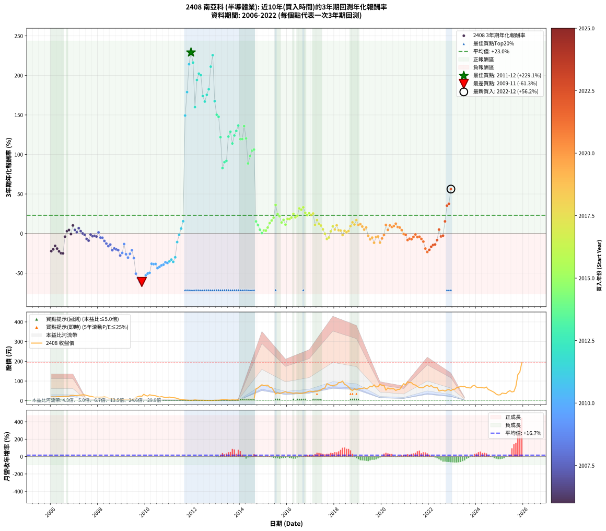

# 2408 南亞科 - 本益比與未來報酬率分析

!!! info "報告資訊"
    - **股票代號**: 2408
    - **公司名稱**: 南亞科
    - **產業別**: 半導體業
    - **分析期間**: 2006-2022 (204 個數據點)
    - **資料來源**: Type 12 (ShowMonthlyK_ChartFlow) 月收盤價與本益比
    - **報酬率口徑**: 含現金股利 (簡化: 年度合計，假設每年7/1入帳)
    - **報告生成時間**: 2026-01-22 22:46:59 CST

## 📈 視覺化圖表

### 圖表1: 本益比 vs 未來報酬率關係

*圖表1：2408 南亞科 本益比與3年期未來報酬率關係 (2006-2022)*

### 圖表2: 歷年買入時點的3年期實際報酬率

*圖表2：2408 南亞科 歷年買入時點的3年期實際報酬率 (2006-2022)*

## 📍 買點訊號說明

本報告提供兩種買點提示訊號（顯示於圖表2的股價子圖中）：

### ▲ 小綠色三角形（回測驗證）
- **計算方式**: 使用全部歷史資料計算本益比第25百分位數
- **用途**: 事後驗證，顯示歷史上哪些時點確實為低估區
- **限制**: 當下無法判斷，僅供回測參考
- **特性**: 後見之明（Look-Ahead Bias）

### ▲ 小橘色三角形（即時訊號）
- **計算方式**: 使用截至當月的過去5年資料計算本益比第25百分位數
- **用途**: 實際投資決策，當時即可判斷
- **優勢**: 可操作性強，符合實務需求
- **特性**: 無後見之明，滾動窗口計算

!!! tip "如何使用兩種訊號"
    - **綠色▲** 幫助理解歷史估值機會，驗證策略有效性
    - **橘色▲** 可作為實際買進參考，但仍需搭配基本面分析
    - 兩種訊號重疊時，表示即時判斷與事後驗證一致，信心度較高
    - 僅有綠色▲時，表示當時無法判斷（需要未來資料才能確認）
    - 僅有橘色▲時，表示即時判斷為買點，但事後可能不是最佳時機

## 📊 估值分析摘要

| 指標 | 數值 |
|:---:|:---:|
| **目前本益比** (2022-12) | **10.85 倍** |
| **歷史平均本益比** | 10.54 倍 |
| **估值水準** | 🟡 合理範圍 |
| **預期3年年化報酬率** | **+13.54%** |
| **歷史平均報酬率** | +23.04% |
| **相關係數 (R²)** | 0.0265 |
| **趨勢線斜率** | -0.4223 |

!!! abstract "核心洞察"
    目前本益比接近歷史平均，預期報酬率符合長期趨勢

    根據歷史數據回測，2408 南亞科 在目前本益比 **10.8倍** 的估值水準下，
    預期未來3年年化報酬率約為 **+13.5%**。

    **重要提醒**: 本分析基於歷史數據統計，實際報酬率會受到公司基本面變化、產業趨勢、
    總體經濟環境等多重因素影響。R² = 0.03 表示本益比可解釋約 2.7% 的報酬率變異。

## 📈 歷史估值統計

### 最佳買點 (最高報酬率)

| 項目 | 數值 |
|:---:|:---:|
| 起始時間 | 2011-12 |
| 當時本益比 | nan 倍 |
| 起始價格 | 2.3 元 |
| 3年後價格 | 81.0 元 |
| **3年年化報酬率** | **+229.13%** |

### 最差買點 (最低報酬率)

| 項目 | 數值 |
|:---:|:---:|
| 起始時間 | 2009-11 |
| 當時本益比 | nan 倍 |
| 起始價格 | 22.5 元 |
| 3年後價格 | 1.3 元 |
| **3年年化報酬率** | **-61.33%** |

## 🎯 投資啟示

### 本益比與報酬率關係

趨勢線方程式: **y = -0.4223x + 18.1241**

!!! note "負相關"
    本益比與未來報酬率呈現負相關。較低的本益比通常帶來較高的未來報酬率，
    但相關性不算非常強。**估值仍是重要參考指標之一**。

### 估值區間建議

基於歷史數據分析:

- **🟢 低估區** (P/E < 8.4): 預期報酬率較高，可考慮增加持股
- **🟡 合理區** (P/E 8.4-12.7): 預期報酬率符合長期趨勢，正常持有
- **🔴 高估區** (P/E > 12.7): 預期報酬率較低，可考慮減碼或觀望

!!! danger "風險提示"
    - 過去表現不代表未來結果
    - 本分析假設公司基本面無重大結構性變化
    - 產業環境劇變可能使歷史規律失效
    - 應結合公司財報、產業趨勢、總體經濟等多重因素綜合判斷

!!! success "長期投資觀點"
    歷史數據顯示，在合理或低估的估值水準買入並長期持有，
    往往能獲得較佳的投資報酬。**耐心等待好價格**是價值投資的核心原則。

## 📊 數據品質

- **資料來源**: GoodInfo.tw Type 12 (ShowMonthlyK_ChartFlow)
- **資料頻率**: 月度收盤價與本益比
- **回測期間**: 2006-2022
- **數據點數量**: 204 個 (每個點代表一次3年期回測)

### 計算方法說明

1. **3年期年化報酬率**:
   - 對每個歷史時點，計算其後3年的實際投資報酬率
   - 期末價值(不含股利): 期末價格
   - 期末價值(含現金股利): 期末價格 + 持有期間內的現金股利合計 (簡化: 年度合計，假設每年7/1入帳)
   - 公式: 年化報酬率 = [(期末價值/期初價格)^(1/年數) - 1] × 100%

2. **本益比 (P/E Ratio)**:
   - 使用當時的月收盤價與EPS計算
   - 資料來源: Type 12 月度河流圖本益比數據

3. **趨勢線 (Linear Regression)**:
   - 使用最小平方法擬合線性趨勢線
   - R²值衡量本益比對報酬率的解釋能力

---

*本報告由 Stock Analysis System v1.9.0 自動生成*
*數據更新時間: 2026-01-22 22:46:59 CST*

## 📋 月度回測明細表

（每一列對應時間線圖中的一個買入點；可用來對照 SVG 圖上的每個點。）

| 買入月份 | 賣出月份 | 回測期限_年 | 實際持有年數 | 買入本益比_倍 | 買入收盤價_元 | 賣出收盤價_元 | 現金股利合計_元 | 總報酬率_pct | 年化報酬率_pct |
| --- | --- | --- | --- | --- | --- | --- | --- | --- | --- |
| 2006-01 | 2009-01 | 3 | 3.001 | 4.27 | 19.45 | 5.62 | 3.49 | -53.14 | -22.32 |
| 2006-02 | 2009-02 | 3 | 3.001 | 4.26 | 19.40 | 6.41 | 3.49 | -48.95 | -20.07 |
| 2006-03 | 2009-03 | 3 | 3.001 | 4.12 | 18.75 | 7.75 | 3.49 | -40.03 | -15.67 |
| 2006-04 | 2009-04 | 3 | 3.001 | 4.54 | 20.65 | 7.44 | 3.49 | -47.05 | -19.10 |
| 2006-05 | 2009-05 | 3 | 3.001 | 4.53 | 20.60 | 6.05 | 3.49 | -53.67 | -22.62 |
| 2006-06 | 2009-06 | 3 | 3.001 | 4.48 | 20.40 | 5.13 | 3.49 | -57.73 | -24.94 |
| 2006-07 | 2009-07 | 3 | 3.001 | 4.79 | 21.80 | 5.86 | 3.29 | -58.00 | -25.11 |
| 2006-08 | 2009-08 | 3 | 3.001 | 5.04 | 22.95 | 17.00 | 3.29 | -11.57 | -4.01 |
| 2006-09 | 2009-09 | 3 | 3.001 | 4.79 | 21.80 | 20.50 | 3.29 | +9.15 | +2.96 |
| 2006-10 | 2009-10 | 3 | 3.001 | 5.16 | 23.50 | 23.50 | 3.29 | +14.02 | +4.47 |
| 2006-11 | 2009-11 | 3 | 3.001 | 5.80 | 26.40 | 22.50 | 3.29 | -2.29 | -0.77 |
| 2006-12 | 2009-12 | 3 | 3.001 | 5.91 | 26.90 | 32.70 | 3.29 | +33.81 | +10.19 |
| 2007-01 | 2010-01 | 3 | 3.001 | 6.58 | 25.85 | 26.25 | 3.29 | +14.29 | +4.55 |
| 2007-02 | 2010-02 | 3 | 3.001 | 7.81 | 25.85 | 23.80 | 3.29 | +4.82 | +1.58 |
| 2007-03 | 2010-03 | 3 | 3.001 | 10.26 | 27.60 | 30.30 | 3.29 | +21.72 | +6.77 |
| 2007-04 | 2010-04 | 3 | 3.001 | 13.70 | 28.35 | 27.65 | 3.29 | +9.15 | +2.96 |
| 2007-05 | 2010-05 | 3 | 3.001 | 20.41 | 29.60 | 26.40 | 3.29 | +0.32 | +0.11 |
| 2007-06 | 2010-06 | 3 | 3.001 | 36.08 | 29.95 | 25.25 | 3.29 | -4.69 | -1.59 |
| 2007-07 | 2010-07 | 3 | 3.001 | 127.60 | 26.80 | 21.65 | 0.00 | -19.22 | -6.86 |
| 2007-08 | 2010-08 | 3 | 3.001 |  | 24.30 | 18.30 | 0.00 | -24.69 | -9.02 |
| 2007-09 | 2010-09 | 3 | 3.001 |  | 22.00 | 21.15 | 0.00 | -3.86 | -1.30 |
| 2007-10 | 2010-10 | 3 | 3.001 |  | 20.40 | 18.35 | 0.00 | -10.05 | -3.47 |
| 2007-11 | 2010-11 | 3 | 3.001 |  | 17.30 | 15.80 | 0.00 | -8.67 | -2.98 |
| 2007-12 | 2010-12 | 3 | 3.001 |  | 18.30 | 16.25 | 0.00 | -11.20 | -3.88 |
| 2008-01 | 2011-01 | 3 | 3.001 |  | 17.70 | 18.45 | 0.00 | +4.24 | +1.39 |
| 2008-02 | 2011-03 | 3 | 3.080 |  | 18.10 | 15.35 | 0.00 | -15.19 | -5.21 |
| 2008-03 | 2011-03 | 3 | 2.998 |  | 18.10 | 15.35 | 0.00 | -15.19 | -5.35 |
| 2008-04 | 2011-04 | 3 | 2.998 |  | 19.50 | 14.50 | 0.00 | -25.64 | -9.41 |
| 2008-05 | 2011-05 | 3 | 2.998 |  | 17.60 | 11.70 | 0.00 | -33.52 | -12.73 |
| 2008-06 | 2011-06 | 3 | 2.998 |  | 13.65 | 8.10 | 0.00 | -40.66 | -15.98 |
| 2008-07 | 2011-07 | 3 | 2.998 |  | 10.50 | 6.68 | 0.00 | -36.38 | -14.00 |
| 2008-08 | 2011-08 | 3 | 2.998 |  | 10.70 | 5.26 | 0.00 | -50.84 | -21.09 |
| 2008-09 | 2011-09 | 3 | 2.998 |  | 7.32 | 3.90 | 0.00 | -46.72 | -18.94 |
| 2008-10 | 2011-10 | 3 | 2.998 |  | 5.87 | 2.99 | 0.00 | -49.06 | -20.15 |
| 2008-11 | 2011-11 | 3 | 2.998 |  | 4.79 | 2.36 | 0.00 | -50.73 | -21.03 |
| 2008-12 | 2011-12 | 3 | 2.998 |  | 6.04 | 2.27 | 0.00 | -62.42 | -27.85 |
| 2009-01 | 2012-01 | 3 | 2.998 |  | 5.62 | 2.41 | 0.00 | -57.12 | -24.60 |
| 2009-02 | 2012-02 | 3 | 2.998 |  | 6.41 | 4.17 | 0.00 | -34.95 | -13.36 |
| 2009-03 | 2012-03 | 3 | 3.001 |  | 7.75 | 3.11 | 0.00 | -59.87 | -26.24 |
| 2009-04 | 2012-04 | 3 | 3.001 |  | 7.44 | 2.49 | 0.00 | -66.53 | -30.57 |
| 2009-05 | 2012-05 | 3 | 3.001 |  | 6.05 | 2.48 | 0.00 | -59.01 | -25.71 |
| 2009-06 | 2012-06 | 3 | 3.001 |  | 5.13 | 2.52 | 0.00 | -50.88 | -21.09 |
| 2009-07 | 2012-07 | 3 | 3.001 |  | 5.86 | 1.91 | 0.00 | -67.41 | -31.17 |
| 2009-08 | 2012-08 | 3 | 3.001 |  | 17.00 | 2.02 | 0.00 | -88.12 | -50.83 |
| 2009-09 | 2012-09 | 3 | 3.001 |  | 20.50 | 1.71 | 0.00 | -91.66 | -56.30 |
| 2009-10 | 2012-10 | 3 | 3.001 |  | 23.50 | 1.40 | 0.00 | -94.04 | -60.94 |
| 2009-11 | 2012-11 | 3 | 3.001 |  | 22.50 | 1.30 | 0.00 | -94.22 | -61.33 |
| 2009-12 | 2012-12 | 3 | 3.001 |  | 32.70 | 2.50 | 0.00 | -92.35 | -57.55 |
| 2010-01 | 2013-01 | 3 | 3.001 |  | 26.25 | 2.74 | 0.00 | -89.56 | -52.91 |
| 2010-02 | 2013-02 | 3 | 3.001 |  | 23.80 | 2.85 | 0.00 | -88.03 | -50.70 |
| 2010-03 | 2013-03 | 3 | 3.001 |  | 30.30 | 3.84 | 0.00 | -87.33 | -49.76 |
| 2010-04 | 2013-04 | 3 | 3.001 |  | 27.65 | 6.50 | 0.00 | -76.49 | -38.28 |
| 2010-05 | 2013-05 | 3 | 3.001 |  | 26.40 | 6.05 | 0.00 | -77.08 | -38.80 |
| 2010-06 | 2013-06 | 3 | 3.001 |  | 25.25 | 5.86 | 0.00 | -76.79 | -38.54 |
| 2010-07 | 2013-07 | 3 | 3.001 |  | 21.65 | 3.85 | 0.00 | -82.22 | -43.76 |
| 2010-08 | 2013-08 | 3 | 3.001 |  | 18.30 | 3.53 | 0.00 | -80.71 | -42.21 |
| 2010-09 | 2013-09 | 3 | 3.001 |  | 21.15 | 4.50 | 0.00 | -78.72 | -40.29 |
| 2010-10 | 2013-10 | 3 | 3.001 |  | 18.35 | 4.07 | 0.00 | -77.82 | -39.46 |
| 2010-11 | 2013-11 | 3 | 3.001 |  | 15.80 | 4.06 | 0.00 | -74.30 | -36.42 |
| 2010-12 | 2013-12 | 3 | 3.001 |  | 16.25 | 4.01 | 0.00 | -75.32 | -37.27 |
| 2011-01 | 2014-01 | 3 | 3.001 |  | 18.45 | 5.00 | 0.00 | -72.90 | -35.28 |
| 2011-02 | 2014-02 | 3 | 3.001 |  | 15.85 | 4.76 | 0.00 | -69.97 | -33.03 |
| 2011-03 | 2014-03 | 3 | 3.001 |  | 15.35 | 4.05 | 0.00 | -73.62 | -35.86 |
| 2011-04 | 2014-04 | 3 | 3.001 |  | 14.50 | 4.95 | 0.00 | -65.86 | -30.10 |
| 2011-05 | 2014-05 | 3 | 3.001 |  | 11.70 | 8.29 | 0.00 | -29.15 | -10.85 |
| 2011-06 | 2014-06 | 3 | 3.001 |  | 8.10 | 7.70 | 0.00 | -4.94 | -1.67 |
| 2011-07 | 2014-07 | 3 | 3.001 |  | 6.68 | 8.00 | 0.00 | +19.76 | +6.19 |
| 2011-08 | 2014-08 | 3 | 3.001 |  | 5.26 | 8.10 | 0.00 | +53.99 | +15.47 |
| 2011-09 | 2014-09 | 3 | 3.001 |  | 3.90 | 60.40 | 0.00 | +1448.72 | +149.21 |
| 2011-10 | 2014-10 | 3 | 3.001 |  | 2.99 | 64.90 | 0.00 | +2070.57 | +178.88 |
| 2011-11 | 2014-11 | 3 | 3.001 |  | 2.36 | 73.20 | 0.00 | +3001.69 | +214.11 |
| 2011-12 | 2014-12 | 3 | 3.001 |  | 2.27 | 81.00 | 0.00 | +3468.28 | +229.13 |
| 2012-01 | 2015-01 | 3 | 3.001 |  | 2.41 | 76.30 | 0.00 | +3065.98 | +216.27 |
| 2012-02 | 2015-03 | 3 | 3.080 |  | 4.17 | 79.00 | 0.00 | +1794.48 | +159.87 |
| 2012-03 | 2015-03 | 3 | 2.998 |  | 3.11 | 79.00 | 0.00 | +2440.19 | +194.18 |
| 2012-04 | 2015-04 | 3 | 2.998 |  | 2.49 | 68.60 | 0.00 | +2655.02 | +202.25 |
| 2012-05 | 2015-05 | 3 | 2.998 |  | 2.48 | 67.00 | 0.00 | +2601.61 | +200.29 |
| 2012-06 | 2015-06 | 3 | 2.998 |  | 2.52 | 51.70 | 0.00 | +1951.59 | +173.94 |
| 2012-07 | 2015-07 | 3 | 2.998 |  | 1.91 | 34.25 | 2.00 | +1797.80 | +166.92 |
| 2012-08 | 2015-08 | 3 | 2.998 |  | 2.02 | 40.15 | 2.00 | +1986.53 | +175.49 |
| 2012-09 | 2015-09 | 3 | 2.998 |  | 1.71 | 36.50 | 2.00 | +2151.35 | +182.57 |
| 2012-10 | 2015-10 | 3 | 2.998 |  | 1.40 | 40.05 | 2.00 | +2903.43 | +211.08 |
| 2012-11 | 2015-11 | 3 | 2.998 |  | 1.30 | 42.75 | 2.00 | +3342.15 | +225.56 |
| 2012-12 | 2015-12 | 3 | 2.998 |  | 2.50 | 45.70 | 2.00 | +1807.92 | +167.39 |
| 2013-01 | 2016-01 | 3 | 2.998 |  | 2.74 | 40.85 | 2.00 | +1463.80 | +150.23 |
| 2013-02 | 2016-02 | 3 | 2.998 |  | 2.85 | 41.20 | 2.00 | +1415.72 | +147.63 |
| 2013-03 | 2016-03 | 3 | 3.001 |  | 3.84 | 39.95 | 2.00 | +992.40 | +121.84 |
| 2013-04 | 2016-04 | 3 | 3.001 |  | 6.50 | 37.70 | 2.00 | +510.74 | +82.76 |
| 2013-05 | 2016-05 | 3 | 3.001 |  | 6.05 | 39.70 | 2.00 | +589.22 | +90.28 |
| 2013-06 | 2016-06 | 3 | 3.001 |  | 5.86 | 39.40 | 2.00 | +606.45 | +91.85 |
| 2013-07 | 2016-07 | 3 | 3.001 |  | 3.85 | 37.70 | 4.80 | +1003.84 | +122.62 |
| 2013-08 | 2016-08 | 3 | 3.001 |  | 3.53 | 37.50 | 4.80 | +1098.24 | +128.79 |
| 2013-09 | 2016-09 | 3 | 3.001 |  | 4.50 | 39.25 | 4.80 | +878.84 | +113.88 |
| 2013-10 | 2016-10 | 3 | 3.001 |  | 4.07 | 40.95 | 4.80 | +1024.03 | +123.96 |
| 2013-11 | 2016-11 | 3 | 3.001 | 32.48 | 4.06 | 44.50 | 4.80 | +1114.24 | +129.80 |
| 2013-12 | 2016-12 | 3 | 3.001 | 11.79 | 4.01 | 48.30 | 4.80 | +1224.14 | +136.53 |
| 2014-01 | 2017-01 | 3 | 3.001 | 3.87 | 5.00 | 48.00 | 4.80 | +955.96 | +119.35 |
| 2014-02 | 2017-02 | 3 | 3.001 | 2.12 | 4.76 | 45.50 | 4.80 | +956.68 | +119.40 |
| 2014-03 | 2017-03 | 3 | 3.001 | 1.27 | 4.05 | 48.40 | 4.80 | +1213.53 | +135.90 |
| 2014-04 | 2017-04 | 3 | 3.001 | 1.19 | 4.95 | 48.15 | 4.80 | +969.66 | +120.29 |
| 2014-05 | 2017-05 | 3 | 3.001 | 1.62 | 8.29 | 50.90 | 4.80 | +571.87 | +88.67 |
| 2014-06 | 2017-06 | 3 | 3.001 | 1.27 | 7.70 | 54.80 | 4.80 | +674.00 | +97.78 |
| 2014-07 | 2017-07 | 3 | 3.001 | 1.14 | 8.00 | 62.40 | 6.30 | +758.72 | +104.75 |
| 2014-08 | 2017-08 | 3 | 3.001 | 1.02 | 8.10 | 64.70 | 6.30 | +776.52 | +106.15 |
| 2014-09 | 2017-09 | 3 | 3.001 | 6.78 | 60.40 | 86.30 | 6.30 | +53.31 | +15.30 |
| 2014-10 | 2017-10 | 3 | 3.001 | 6.58 | 64.90 | 81.80 | 6.30 | +35.74 | +10.72 |
| 2014-11 | 2017-11 | 3 | 3.001 | 6.77 | 73.20 | 77.80 | 6.30 | +14.89 | +4.73 |
| 2014-12 | 2017-12 | 3 | 3.001 | 6.88 | 81.00 | 76.20 | 6.30 | +1.85 | +0.61 |
| 2015-01 | 2018-01 | 3 | 3.001 | 6.71 | 76.30 | 79.40 | 6.30 | +12.32 | +3.95 |
| 2015-02 | 2018-02 | 3 | 3.001 | 7.14 | 78.40 | 80.80 | 6.30 | +11.09 | +3.57 |
| 2015-03 | 2018-03 | 3 | 3.001 | 7.46 | 79.00 | 92.00 | 6.30 | +24.43 | +7.56 |
| 2015-04 | 2018-04 | 3 | 3.001 | 6.72 | 68.60 | 93.00 | 6.30 | +44.75 | +13.12 |
| 2015-05 | 2018-05 | 3 | 3.001 | 6.83 | 67.00 | 99.60 | 6.30 | +58.06 | +16.48 |
| 2015-06 | 2018-06 | 3 | 3.001 | 5.49 | 51.70 | 83.20 | 6.30 | +73.11 | +20.07 |
| 2015-07 | 2018-07 | 3 | 3.001 | 3.79 | 34.25 | 78.60 | 7.81 | +152.29 | +36.12 |
| 2015-08 | 2018-08 | 3 | 3.001 | 4.65 | 40.15 | 69.70 | 7.81 | +93.05 | +24.51 |
| 2015-09 | 2018-09 | 3 | 3.001 | 4.43 | 36.50 | 58.10 | 7.81 | +80.57 | +21.77 |
| 2015-10 | 2018-10 | 3 | 3.001 | 5.10 | 40.05 | 51.40 | 7.81 | +47.84 | +13.92 |
| 2015-11 | 2018-11 | 3 | 3.001 | 5.73 | 42.75 | 61.00 | 7.81 | +60.96 | +17.19 |
| 2015-12 | 2018-12 | 3 | 3.001 | 6.46 | 45.70 | 55.00 | 7.81 | +37.44 | +11.18 |
| 2016-01 | 2019-01 | 3 | 3.001 | 5.67 | 40.85 | 60.10 | 7.81 | +66.24 | +18.46 |
| 2016-02 | 2019-03 | 3 | 3.080 | 5.62 | 41.20 | 61.40 | 7.81 | +67.98 | +18.34 |
| 2016-03 | 2019-03 | 3 | 2.998 | 5.35 | 39.95 | 61.40 | 7.81 | +73.24 | +20.12 |
| 2016-04 | 2019-04 | 3 | 2.998 | 4.96 | 37.70 | 65.40 | 7.81 | +94.19 | +24.78 |
| 2016-05 | 2019-05 | 3 | 2.998 | 5.13 | 39.70 | 61.60 | 7.81 | +74.83 | +20.48 |
| 2016-06 | 2019-06 | 3 | 2.998 | 5.01 | 39.40 | 64.50 | 7.81 | +83.53 | +22.45 |
| 2016-07 | 2019-07 | 3 | 2.998 | 4.71 | 37.70 | 74.00 | 12.12 | +128.43 | +31.72 |
| 2016-08 | 2019-08 | 3 | 2.998 | 4.61 | 37.50 | 70.40 | 12.12 | +120.05 | +30.09 |
| 2016-09 | 2019-09 | 3 | 2.998 | 4.75 | 39.25 | 80.50 | 12.12 | +135.97 | +33.16 |
| 2016-10 | 2019-10 | 3 | 2.998 | 4.87 | 40.95 | 70.00 | 12.12 | +100.53 | +26.12 |
| 2016-11 | 2019-11 | 3 | 2.998 | 5.21 | 44.50 | 71.20 | 12.12 | +87.23 | +23.27 |
| 2016-12 | 2019-12 | 3 | 2.998 | 5.57 | 48.30 | 83.40 | 12.12 | +97.76 | +25.54 |
| 2017-01 | 2020-01 | 3 | 2.998 | 5.25 | 48.00 | 78.10 | 12.12 | +87.96 | +23.43 |
| 2017-02 | 2020-02 | 3 | 2.998 | 4.73 | 45.50 | 77.30 | 12.12 | +96.53 | +25.28 |
| 2017-03 | 2020-03 | 3 | 3.001 | 4.80 | 48.40 | 53.70 | 12.12 | +35.99 | +10.79 |
| 2017-04 | 2020-04 | 3 | 3.001 | 4.56 | 48.15 | 65.00 | 12.12 | +60.16 | +17.00 |
| 2017-05 | 2020-05 | 3 | 3.001 | 4.61 | 50.90 | 59.80 | 12.12 | +41.29 | +12.21 |
| 2017-06 | 2020-06 | 3 | 3.001 | 4.76 | 54.80 | 61.00 | 12.12 | +33.43 | +10.09 |
| 2017-07 | 2020-07 | 3 | 3.001 | 5.20 | 62.40 | 60.60 | 12.12 | +16.53 | +5.23 |
| 2017-08 | 2020-08 | 3 | 3.001 | 5.19 | 64.70 | 51.90 | 12.12 | -1.06 | -0.35 |
| 2017-09 | 2020-09 | 3 | 3.001 | 6.67 | 86.30 | 57.50 | 12.12 | -19.33 | -6.91 |
| 2017-10 | 2020-10 | 3 | 3.001 | 6.10 | 81.80 | 57.80 | 12.12 | -14.53 | -5.10 |
| 2017-11 | 2020-11 | 3 | 3.001 | 5.60 | 77.80 | 72.40 | 12.12 | +8.63 | +2.80 |
| 2017-12 | 2020-12 | 3 | 3.001 | 5.31 | 76.20 | 86.80 | 12.12 | +29.81 | +9.08 |
| 2018-01 | 2021-01 | 3 | 3.001 | 5.58 | 79.40 | 79.90 | 12.12 | +15.89 | +5.04 |
| 2018-02 | 2021-02 | 3 | 3.001 | 5.73 | 80.80 | 96.50 | 12.12 | +34.43 | +10.36 |
| 2018-03 | 2021-03 | 3 | 3.001 | 6.59 | 92.00 | 91.90 | 12.12 | +13.06 | +4.18 |
| 2018-04 | 2021-04 | 3 | 3.001 | 6.72 | 93.00 | 91.60 | 12.12 | +11.52 | +3.70 |
| 2018-05 | 2021-05 | 3 | 3.001 | 7.26 | 99.60 | 81.90 | 12.12 | -5.61 | -1.90 |
| 2018-06 | 2021-06 | 3 | 3.001 | 6.13 | 83.20 | 79.70 | 12.12 | +10.36 | +3.34 |
| 2018-07 | 2021-07 | 3 | 3.001 | 5.84 | 78.60 | 72.30 | 9.90 | +4.59 | +1.51 |
| 2018-08 | 2021-08 | 3 | 3.001 | 5.23 | 69.70 | 66.40 | 9.90 | +9.47 | +3.06 |
| 2018-09 | 2021-09 | 3 | 3.001 | 4.40 | 58.10 | 65.90 | 9.90 | +30.47 | +9.27 |
| 2018-10 | 2021-10 | 3 | 3.001 | 3.94 | 51.40 | 66.50 | 9.90 | +48.65 | +14.12 |
| 2018-11 | 2021-11 | 3 | 3.001 | 4.72 | 61.00 | 74.20 | 9.90 | +37.88 | +11.30 |
| 2018-12 | 2021-12 | 3 | 3.001 | 4.30 | 55.00 | 78.10 | 9.90 | +60.01 | +16.96 |
| 2019-01 | 2022-01 | 3 | 3.001 | 5.01 | 60.10 | 72.00 | 9.90 | +36.28 | +10.87 |
| 2019-02 | 2022-02 | 3 | 3.001 | 5.55 | 62.20 | 77.10 | 9.90 | +39.88 | +11.83 |
| 2019-03 | 2022-03 | 3 | 3.001 | 5.90 | 61.40 | 69.20 | 9.90 | +28.83 | +8.81 |
| 2019-04 | 2022-04 | 3 | 3.001 | 6.81 | 65.40 | 65.60 | 9.90 | +15.45 | +4.90 |
| 2019-05 | 2022-05 | 3 | 3.001 | 6.99 | 61.60 | 66.80 | 9.90 | +24.52 | +7.58 |
| 2019-06 | 2022-06 | 3 | 3.001 | 8.05 | 64.50 | 49.40 | 9.90 | -8.06 | -2.76 |
| 2019-07 | 2022-07 | 3 | 3.001 | 10.25 | 74.00 | 52.30 | 6.50 | -20.54 | -7.38 |
| 2019-08 | 2022-08 | 3 | 3.001 | 10.97 | 70.40 | 53.40 | 6.50 | -14.92 | -5.24 |
| 2019-09 | 2022-09 | 3 | 3.001 | 14.32 | 80.50 | 48.95 | 6.50 | -31.12 | -11.68 |
| 2019-10 | 2022-10 | 3 | 3.001 | 14.51 | 70.00 | 54.50 | 6.50 | -12.86 | -4.48 |
| 2019-11 | 2022-11 | 3 | 3.001 | 17.68 | 71.20 | 56.80 | 6.50 | -11.10 | -3.85 |
| 2019-12 | 2022-12 | 3 | 3.001 | 25.82 | 83.40 | 51.20 | 6.50 | -30.82 | -11.55 |
| 2020-01 | 2023-01 | 3 | 3.001 | 24.64 | 78.10 | 57.80 | 6.50 | -17.67 | -6.28 |
| 2020-02 | 2023-03 | 3 | 3.080 | 24.86 | 77.30 | 66.50 | 6.50 | -5.57 | -1.84 |
| 2020-03 | 2023-03 | 3 | 2.998 | 17.61 | 53.70 | 66.50 | 6.50 | +35.93 | +10.78 |
| 2020-04 | 2023-04 | 3 | 2.998 | 21.74 | 65.00 | 67.80 | 6.50 | +14.30 | +4.56 |
| 2020-05 | 2023-05 | 3 | 2.998 | 20.41 | 59.80 | 73.50 | 6.50 | +33.77 | +10.19 |
| 2020-06 | 2023-06 | 3 | 2.998 | 21.25 | 61.00 | 70.80 | 6.50 | +26.72 | +8.22 |
| 2020-07 | 2023-07 | 3 | 2.998 | 21.57 | 60.60 | 72.30 | 7.13 | +31.07 | +9.45 |
| 2020-08 | 2023-08 | 3 | 2.998 | 18.87 | 51.90 | 66.60 | 7.13 | +42.06 | +12.42 |
| 2020-09 | 2023-09 | 3 | 2.998 | 21.38 | 57.50 | 65.60 | 7.13 | +26.49 | +8.15 |
| 2020-10 | 2023-10 | 3 | 2.998 | 21.98 | 57.80 | 64.70 | 7.13 | +24.27 | +7.52 |
| 2020-11 | 2023-11 | 3 | 2.998 | 28.17 | 72.40 | 75.00 | 7.13 | +13.44 | +4.30 |
| 2020-12 | 2023-12 | 3 | 2.998 | 34.58 | 86.80 | 78.00 | 7.13 | -1.92 | -0.65 |
| 2021-01 | 2024-01 | 3 | 2.998 | 27.39 | 79.90 | 68.70 | 7.13 | -5.09 | -1.73 |
| 2021-02 | 2024-02 | 3 | 2.998 | 29.02 | 96.50 | 67.30 | 7.13 | -22.87 | -8.30 |
| 2021-03 | 2024-03 | 3 | 3.001 | 24.62 | 91.90 | 67.70 | 7.13 | -18.57 | -6.62 |
| 2021-04 | 2024-04 | 3 | 3.001 | 22.13 | 91.60 | 66.10 | 7.13 | -20.05 | -7.19 |
| 2021-05 | 2024-05 | 3 | 3.001 | 18.01 | 81.90 | 64.50 | 7.13 | -12.54 | -4.37 |
| 2021-06 | 2024-06 | 3 | 3.001 | 16.08 | 79.70 | 69.70 | 7.13 | -3.60 | -1.21 |
| 2021-07 | 2024-07 | 3 | 3.001 | 13.48 | 72.30 | 57.10 | 5.83 | -12.96 | -4.52 |
| 2021-08 | 2024-08 | 3 | 3.001 | 11.51 | 66.40 | 52.70 | 5.83 | -11.85 | -4.12 |
| 2021-09 | 2024-09 | 3 | 3.001 | 10.67 | 65.90 | 47.35 | 5.83 | -19.30 | -6.90 |
| 2021-10 | 2024-10 | 3 | 3.001 | 10.10 | 66.50 | 42.30 | 5.83 | -27.62 | -10.21 |
| 2021-11 | 2024-11 | 3 | 3.001 | 10.61 | 74.20 | 33.45 | 5.83 | -47.06 | -19.10 |
| 2021-12 | 2024-12 | 3 | 3.001 | 10.55 | 78.10 | 29.25 | 5.83 | -55.08 | -23.41 |
| 2022-01 | 2025-01 | 3 | 3.001 | 10.03 | 72.00 | 30.10 | 5.83 | -50.09 | -20.68 |
| 2022-02 | 2025-02 | 3 | 3.001 | 11.09 | 77.10 | 38.65 | 5.83 | -42.30 | -16.75 |
| 2022-03 | 2025-03 | 3 | 3.001 | 10.28 | 69.20 | 37.40 | 5.83 | -37.52 | -14.51 |
| 2022-04 | 2025-04 | 3 | 3.001 | 10.08 | 65.60 | 36.00 | 5.83 | -36.23 | -13.92 |
| 2022-05 | 2025-05 | 3 | 3.001 | 10.63 | 66.80 | 45.55 | 5.83 | -23.08 | -8.37 |
| 2022-06 | 2025-06 | 3 | 3.001 | 8.15 | 49.40 | 51.20 | 5.83 | +15.45 | +4.90 |
| 2022-07 | 2025-07 | 3 | 3.001 | 8.96 | 52.30 | 44.55 | 2.13 | -10.75 | -3.72 |
| 2022-08 | 2025-08 | 3 | 3.001 | 9.51 | 53.40 | 47.00 | 2.13 | -8.00 | -2.74 |
| 2022-09 | 2025-09 | 3 | 3.001 | 9.08 | 48.95 | 73.00 | 2.13 | +53.48 | +15.35 |
| 2022-10 | 2025-10 | 3 | 3.001 | 10.55 | 54.50 | 132.50 | 2.13 | +147.03 | +35.17 |
| 2022-11 | 2025-11 | 3 | 3.001 | 11.49 | 56.80 | 146.00 | 2.13 | +160.79 | +37.64 |
| 2022-12 | 2025-12 | 3 | 3.001 | 10.85 | 51.20 | 193.00 | 2.13 | +281.11 | +56.19 |
