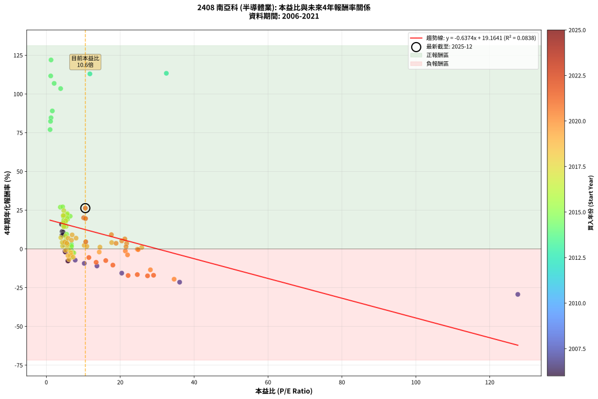
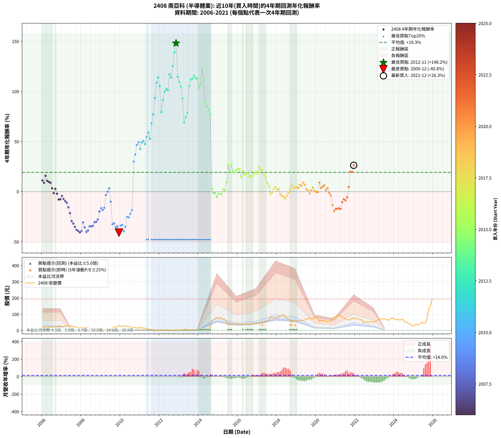

# 2408 南亞科 - 本益比與未來報酬率分析

!!! info "報告資訊"
    - **股票代號**: 2408
    - **公司名稱**: 南亞科
    - **產業別**: 半導體業
    - **分析期間**: 2006-2021 (192 個數據點)
    - **資料來源**: Type 12 (ShowMonthlyK_ChartFlow) 月收盤價與本益比
    - **報酬率口徑**: 含現金股利 (簡化: 年度合計，假設每年7/1入帳)
    - **報告生成時間**: 2026-01-05 00:37:33 CST

## 📈 視覺化圖表

### 圖表1: 本益比 vs 未來報酬率關係

*圖表1：2408 南亞科 本益比與4年期未來報酬率關係 (2006-2021)*

### 圖表2: 歷年買入時點的4年期實際報酬率

*圖表2：2408 南亞科 歷年買入時點的4年期實際報酬率 (2006-2021)*

## 📍 買點訊號說明

本報告提供兩種買點提示訊號（顯示於圖表2的股價子圖中）：

### ▲ 小綠色三角形（回測驗證）
- **計算方式**: 使用全部歷史資料計算本益比第25百分位數
- **用途**: 事後驗證，顯示歷史上哪些時點確實為低估區
- **限制**: 當下無法判斷，僅供回測參考
- **特性**: 後見之明（Look-Ahead Bias）

### ▲ 小橘色三角形（即時訊號）
- **計算方式**: 使用截至當月的過去5年資料計算本益比第25百分位數
- **用途**: 實際投資決策，當時即可判斷
- **優勢**: 可操作性強，符合實務需求
- **特性**: 無後見之明，滾動窗口計算

!!! tip "如何使用兩種訊號"
    - **綠色▲** 幫助理解歷史估值機會，驗證策略有效性
    - **橘色▲** 可作為實際買進參考，但仍需搭配基本面分析
    - 兩種訊號重疊時，表示即時判斷與事後驗證一致，信心度較高
    - 僅有綠色▲時，表示當時無法判斷（需要未來資料才能確認）
    - 僅有橘色▲時，表示即時判斷為買點，但事後可能不是最佳時機

## 📊 估值分析摘要

| 指標 | 數值 |
|:---:|:---:|
| **目前本益比** (2021-12) | **10.55 倍** |
| **歷史平均本益比** | 10.59 倍 |
| **估值水準** | 🟡 合理範圍 |
| **預期4年年化報酬率** | **+12.44%** |
| **歷史平均報酬率** | +19.26% |
| **相關係數 (R²)** | 0.0838 |
| **趨勢線斜率** | -0.6374 |

!!! abstract "核心洞察"
    目前本益比接近歷史平均，預期報酬率符合長期趨勢

    根據歷史數據回測，2408 南亞科 在目前本益比 **10.6倍** 的估值水準下，
    預期未來4年年化報酬率約為 **+12.4%**。

    **重要提醒**: 本分析基於歷史數據統計，實際報酬率會受到公司基本面變化、產業趨勢、
    總體經濟環境等多重因素影響。R² = 0.08 表示本益比可解釋約 8.4% 的報酬率變異。

## 📈 歷史估值統計

### 最佳買點 (最高報酬率)

| 項目 | 數值 |
|:---:|:---:|
| 起始時間 | 2012-11 |
| 當時本益比 | nan 倍 |
| 起始價格 | 1.3 元 |
| 4年後價格 | 44.5 元 |
| **4年年化報酬率** | **+148.15%** |

### 最差買點 (最低報酬率)

| 項目 | 數值 |
|:---:|:---:|
| 起始時間 | 2009-12 |
| 當時本益比 | nan 倍 |
| 起始價格 | 32.7 元 |
| 4年後價格 | 4.0 元 |
| **4年年化報酬率** | **-40.82%** |

## 🎯 投資啟示

### 本益比與報酬率關係

趨勢線方程式: **y = -0.6374x + 19.1641**

!!! warning "強負相關"
    本益比與未來報酬率呈現強負相關。在高本益比時期買入，未來報酬率顯著較低；
    在低本益比時期買入，未來報酬率顯著較高。**估值紀律至關重要**。

### 估值區間建議

基於歷史數據分析:

- **🟢 低估區** (P/E < 8.5): 預期報酬率較高，可考慮增加持股
- **🟡 合理區** (P/E 8.5-12.7): 預期報酬率符合長期趨勢，正常持有
- **🔴 高估區** (P/E > 12.7): 預期報酬率較低，可考慮減碼或觀望

!!! danger "風險提示"
    - 過去表現不代表未來結果
    - 本分析假設公司基本面無重大結構性變化
    - 產業環境劇變可能使歷史規律失效
    - 應結合公司財報、產業趨勢、總體經濟等多重因素綜合判斷

!!! success "長期投資觀點"
    歷史數據顯示，在合理或低估的估值水準買入並長期持有，
    往往能獲得較佳的投資報酬。**耐心等待好價格**是價值投資的核心原則。

## 📊 數據品質

- **資料來源**: GoodInfo.tw Type 12 (ShowMonthlyK_ChartFlow)
- **資料頻率**: 月度收盤價與本益比
- **回測期間**: 2006-2021
- **數據點數量**: 192 個 (每個點代表一次4年期回測)

### 計算方法說明

1. **4年期年化報酬率**:
   - 對每個歷史時點，計算其後4年的實際投資報酬率
   - 期末價值(不含股利): 期末價格
   - 期末價值(含現金股利): 期末價格 + 持有期間內的現金股利合計 (簡化: 年度合計，假設每年7/1入帳)
   - 公式: 年化報酬率 = [(期末價值/期初價格)^(1/年數) - 1] × 100%

2. **本益比 (P/E Ratio)**:
   - 使用當時的月收盤價與EPS計算
   - 資料來源: Type 12 月度河流圖本益比數據

3. **趨勢線 (Linear Regression)**:
   - 使用最小平方法擬合線性趨勢線
   - R²值衡量本益比對報酬率的解釋能力

---

*本報告由 Stock Analysis System v1.9.0 自動生成*
*數據更新時間: 2026-01-05 00:37:33 CST*

## 📋 月度回測明細表

（每一列對應時間線圖中的一個買入點；可用來對照 SVG 圖上的每個點。）

| 買入月份 | 賣出月份 | 回測期限_年 | 實際持有年數 | 買入本益比_倍 | 買入收盤價_元 | 賣出收盤價_元 | 現金股利合計_元 | 總報酬率_pct | 年化報酬率_pct |
| --- | --- | --- | --- | --- | --- | --- | --- | --- | --- |
| 2006-01 | 2010-01 | 4 | 4.000 | 4.27 | 19.45 | 26.25 | 3.49 | +52.93 | +11.20 |
| 2006-02 | 2010-02 | 4 | 4.000 | 4.26 | 19.40 | 23.80 | 3.49 | +40.69 | +8.91 |
| 2006-03 | 2010-03 | 4 | 4.000 | 4.12 | 18.75 | 30.30 | 3.49 | +80.23 | +15.87 |
| 2006-04 | 2010-04 | 4 | 4.000 | 4.54 | 20.65 | 27.65 | 3.49 | +50.82 | +10.82 |
| 2006-05 | 2010-05 | 4 | 4.000 | 4.53 | 20.60 | 26.40 | 3.49 | +45.12 | +9.76 |
| 2006-06 | 2010-06 | 4 | 4.000 | 4.48 | 20.40 | 25.25 | 3.49 | +40.90 | +8.95 |
| 2006-07 | 2010-07 | 4 | 4.000 | 4.79 | 21.80 | 21.65 | 3.29 | +14.43 | +3.43 |
| 2006-08 | 2010-08 | 4 | 4.000 | 5.04 | 22.95 | 18.30 | 3.29 | -5.90 | -1.51 |
| 2006-09 | 2010-09 | 4 | 4.000 | 4.79 | 21.80 | 21.15 | 3.29 | +12.13 | +2.90 |
| 2006-10 | 2010-10 | 4 | 4.000 | 5.16 | 23.50 | 18.35 | 3.29 | -7.89 | -2.03 |
| 2006-11 | 2010-11 | 4 | 4.000 | 5.80 | 26.40 | 15.80 | 3.29 | -27.67 | -7.78 |
| 2006-12 | 2010-12 | 4 | 4.000 | 5.91 | 26.90 | 16.25 | 3.29 | -27.34 | -7.67 |
| 2007-01 | 2011-01 | 4 | 4.000 | 6.58 | 25.85 | 18.45 | 3.29 | -15.88 | -4.23 |
| 2007-02 | 2011-02 | 4 | 4.000 | 7.81 | 25.85 | 15.85 | 3.29 | -25.94 | -7.23 |
| 2007-03 | 2011-03 | 4 | 4.000 | 10.26 | 27.60 | 15.35 | 3.29 | -32.45 | -9.34 |
| 2007-04 | 2011-04 | 4 | 4.000 | 13.70 | 28.35 | 14.50 | 3.29 | -37.23 | -10.99 |
| 2007-05 | 2011-05 | 4 | 4.000 | 20.41 | 29.60 | 11.70 | 3.29 | -49.34 | -15.63 |
| 2007-06 | 2011-06 | 4 | 4.000 | 36.08 | 29.95 | 8.10 | 3.29 | -61.95 | -21.46 |
| 2007-07 | 2011-07 | 4 | 4.000 | 127.60 | 26.80 | 6.68 | 0.00 | -75.07 | -29.34 |
| 2007-08 | 2011-08 | 4 | 4.000 |  | 24.30 | 5.26 | 0.00 | -78.35 | -31.79 |
| 2007-09 | 2011-09 | 4 | 4.000 |  | 22.00 | 3.90 | 0.00 | -82.27 | -35.11 |
| 2007-10 | 2011-10 | 4 | 4.000 |  | 20.40 | 2.99 | 0.00 | -85.34 | -38.13 |
| 2007-11 | 2011-11 | 4 | 4.000 |  | 17.30 | 2.36 | 0.00 | -86.36 | -39.23 |
| 2007-12 | 2011-12 | 4 | 4.000 |  | 18.30 | 2.27 | 0.00 | -87.60 | -40.65 |
| 2008-01 | 2012-01 | 4 | 4.000 |  | 17.70 | 2.41 | 0.00 | -86.38 | -39.25 |
| 2008-02 | 2012-02 | 4 | 4.000 |  | 18.10 | 4.17 | 0.00 | -76.96 | -30.72 |
| 2008-03 | 2012-03 | 4 | 4.000 |  | 18.10 | 3.11 | 0.00 | -82.82 | -35.62 |
| 2008-04 | 2012-04 | 4 | 4.000 |  | 19.50 | 2.49 | 0.00 | -87.23 | -40.22 |
| 2008-05 | 2012-05 | 4 | 4.000 |  | 17.60 | 2.48 | 0.00 | -85.91 | -38.73 |
| 2008-06 | 2012-06 | 4 | 4.000 |  | 13.65 | 2.52 | 0.00 | -81.54 | -34.45 |
| 2008-07 | 2012-07 | 4 | 4.000 |  | 10.50 | 1.91 | 0.00 | -81.81 | -34.69 |
| 2008-08 | 2012-08 | 4 | 4.000 |  | 10.70 | 2.02 | 0.00 | -81.12 | -34.08 |
| 2008-09 | 2012-09 | 4 | 4.000 |  | 7.32 | 1.71 | 0.00 | -76.64 | -30.48 |
| 2008-10 | 2012-10 | 4 | 4.000 |  | 5.87 | 1.40 | 0.00 | -76.15 | -30.12 |
| 2008-11 | 2012-11 | 4 | 4.000 |  | 4.79 | 1.30 | 0.00 | -72.86 | -27.82 |
| 2008-12 | 2012-12 | 4 | 4.000 |  | 6.04 | 2.50 | 0.00 | -58.61 | -19.79 |
| 2009-01 | 2013-01 | 4 | 4.000 |  | 5.62 | 2.74 | 0.00 | -51.25 | -16.44 |
| 2009-02 | 2013-02 | 4 | 4.000 |  | 6.41 | 2.85 | 0.00 | -55.54 | -18.34 |
| 2009-03 | 2013-03 | 4 | 4.000 |  | 7.75 | 3.84 | 0.00 | -50.45 | -16.10 |
| 2009-04 | 2013-04 | 4 | 4.000 |  | 7.44 | 6.50 | 0.00 | -12.63 | -3.32 |
| 2009-05 | 2013-05 | 4 | 4.000 |  | 6.05 | 6.05 | 0.00 | +0.00 | +0.00 |
| 2009-06 | 2013-06 | 4 | 4.000 |  | 5.13 | 5.86 | 0.00 | +14.23 | +3.38 |
| 2009-07 | 2013-07 | 4 | 4.000 |  | 5.86 | 3.85 | 0.00 | -34.30 | -9.97 |
| 2009-08 | 2013-08 | 4 | 4.000 |  | 17.00 | 3.53 | 0.00 | -79.24 | -32.50 |
| 2009-09 | 2013-09 | 4 | 4.000 |  | 20.50 | 4.50 | 0.00 | -78.05 | -31.55 |
| 2009-10 | 2013-10 | 4 | 4.000 |  | 23.50 | 4.07 | 0.00 | -82.68 | -35.49 |
| 2009-11 | 2013-11 | 4 | 4.000 |  | 22.50 | 4.06 | 0.00 | -81.96 | -34.82 |
| 2009-12 | 2013-12 | 4 | 4.000 |  | 32.70 | 4.01 | 0.00 | -87.74 | -40.82 |
| 2010-01 | 2014-01 | 4 | 4.000 |  | 26.25 | 5.00 | 0.00 | -80.95 | -33.94 |
| 2010-02 | 2014-02 | 4 | 4.000 |  | 23.80 | 4.76 | 0.00 | -80.00 | -33.13 |
| 2010-03 | 2014-03 | 4 | 4.000 |  | 30.30 | 4.05 | 0.00 | -86.63 | -39.54 |
| 2010-04 | 2014-04 | 4 | 4.000 |  | 27.65 | 4.95 | 0.00 | -82.10 | -34.95 |
| 2010-05 | 2014-05 | 4 | 4.000 |  | 26.40 | 8.29 | 0.00 | -68.60 | -25.14 |
| 2010-06 | 2014-06 | 4 | 4.000 |  | 25.25 | 7.70 | 0.00 | -69.50 | -25.69 |
| 2010-07 | 2014-07 | 4 | 4.000 |  | 21.65 | 8.00 | 0.00 | -63.05 | -22.03 |
| 2010-08 | 2014-08 | 4 | 4.000 |  | 18.30 | 8.10 | 0.00 | -55.74 | -18.43 |
| 2010-09 | 2014-09 | 4 | 4.000 |  | 21.15 | 60.40 | 0.00 | +185.58 | +30.00 |
| 2010-10 | 2014-10 | 4 | 4.000 |  | 18.35 | 64.90 | 0.00 | +253.68 | +37.14 |
| 2010-11 | 2014-11 | 4 | 4.000 |  | 15.80 | 73.20 | 0.00 | +363.29 | +46.71 |
| 2010-12 | 2014-12 | 4 | 4.000 |  | 16.25 | 81.00 | 0.00 | +398.46 | +49.42 |
| 2011-01 | 2015-01 | 4 | 4.000 |  | 18.45 | 76.30 | 0.00 | +313.55 | +42.60 |
| 2011-02 | 2015-02 | 4 | 4.000 |  | 15.85 | 78.40 | 0.00 | +394.64 | +49.13 |
| 2011-03 | 2015-03 | 4 | 4.000 |  | 15.35 | 79.00 | 0.00 | +414.66 | +50.62 |
| 2011-04 | 2015-04 | 4 | 4.000 |  | 14.50 | 68.60 | 0.00 | +373.10 | +47.48 |
| 2011-05 | 2015-05 | 4 | 4.000 |  | 11.70 | 67.00 | 0.00 | +472.65 | +54.69 |
| 2011-06 | 2015-06 | 4 | 4.000 |  | 8.10 | 51.70 | 0.00 | +538.27 | +58.95 |
| 2011-07 | 2015-07 | 4 | 4.000 |  | 6.68 | 34.25 | 2.00 | +442.63 | +52.63 |
| 2011-08 | 2015-08 | 4 | 4.000 |  | 5.26 | 40.15 | 2.00 | +701.29 | +68.25 |
| 2011-09 | 2015-09 | 4 | 4.000 |  | 3.90 | 36.50 | 2.00 | +887.13 | +77.25 |
| 2011-10 | 2015-10 | 4 | 4.000 |  | 2.99 | 40.05 | 2.00 | +1306.29 | +93.65 |
| 2011-11 | 2015-11 | 4 | 4.000 |  | 2.36 | 42.75 | 2.00 | +1796.10 | +108.67 |
| 2011-12 | 2015-12 | 4 | 4.000 |  | 2.27 | 45.70 | 2.00 | +2001.23 | +114.10 |
| 2012-01 | 2016-01 | 4 | 4.000 |  | 2.41 | 40.85 | 2.00 | +1677.93 | +105.34 |
| 2012-02 | 2016-02 | 4 | 4.000 |  | 4.17 | 41.20 | 2.00 | +935.92 | +79.40 |
| 2012-03 | 2016-03 | 4 | 4.000 |  | 3.11 | 39.95 | 2.00 | +1248.81 | +91.64 |
| 2012-04 | 2016-04 | 4 | 4.000 |  | 2.49 | 37.70 | 2.00 | +1494.30 | +99.82 |
| 2012-05 | 2016-05 | 4 | 4.000 |  | 2.48 | 39.70 | 2.00 | +1581.37 | +102.50 |
| 2012-06 | 2016-06 | 4 | 4.000 |  | 2.52 | 39.40 | 2.00 | +1542.78 | +101.32 |
| 2012-07 | 2016-07 | 4 | 4.000 |  | 1.91 | 37.70 | 4.80 | +2125.03 | +117.19 |
| 2012-08 | 2016-08 | 4 | 4.000 |  | 2.02 | 37.50 | 4.80 | +1993.96 | +113.92 |
| 2012-09 | 2016-09 | 4 | 4.000 |  | 1.71 | 39.25 | 4.80 | +2475.91 | +125.29 |
| 2012-10 | 2016-10 | 4 | 4.000 |  | 1.40 | 40.95 | 4.80 | +3167.71 | +139.09 |
| 2012-11 | 2016-11 | 4 | 4.000 |  | 1.30 | 44.50 | 4.80 | +3692.15 | +148.15 |
| 2012-12 | 2016-12 | 4 | 4.000 |  | 2.50 | 48.30 | 4.80 | +2023.92 | +114.68 |
| 2013-01 | 2017-01 | 4 | 4.000 |  | 2.74 | 48.00 | 4.80 | +1826.93 | +109.52 |
| 2013-02 | 2017-02 | 4 | 4.000 |  | 2.85 | 45.50 | 4.80 | +1664.84 | +104.96 |
| 2013-03 | 2017-03 | 4 | 4.000 |  | 3.84 | 48.40 | 4.80 | +1285.36 | +92.93 |
| 2013-04 | 2017-04 | 4 | 4.000 |  | 6.50 | 48.15 | 4.80 | +714.58 | +68.94 |
| 2013-05 | 2017-05 | 4 | 4.000 |  | 6.05 | 50.90 | 4.80 | +820.63 | +74.19 |
| 2013-06 | 2017-06 | 4 | 4.000 |  | 5.86 | 54.80 | 4.80 | +917.03 | +78.58 |
| 2013-07 | 2017-07 | 4 | 4.000 |  | 3.85 | 62.40 | 6.30 | +1684.36 | +105.53 |
| 2013-08 | 2017-08 | 4 | 4.000 |  | 3.53 | 64.70 | 6.30 | +1911.27 | +111.77 |
| 2013-09 | 2017-09 | 4 | 4.000 |  | 4.50 | 86.30 | 6.30 | +1957.73 | +112.98 |
| 2013-10 | 2017-10 | 4 | 4.000 |  | 4.07 | 81.80 | 6.30 | +2064.57 | +115.70 |
| 2013-11 | 2017-11 | 4 | 4.000 | 32.48 | 4.06 | 77.80 | 6.30 | +1971.38 | +113.34 |
| 2013-12 | 2017-12 | 4 | 4.000 | 11.79 | 4.01 | 76.20 | 6.30 | +1957.31 | +112.97 |
| 2014-01 | 2018-01 | 4 | 4.000 | 3.87 | 5.00 | 79.40 | 6.30 | +1613.96 | +103.47 |
| 2014-02 | 2018-02 | 4 | 4.000 | 2.12 | 4.76 | 80.80 | 6.30 | +1729.79 | +106.82 |
| 2014-03 | 2018-03 | 4 | 4.000 | 1.27 | 4.05 | 92.00 | 6.30 | +2327.11 | +121.96 |
| 2014-04 | 2018-04 | 4 | 4.000 | 1.19 | 4.95 | 93.00 | 6.30 | +1906.02 | +111.63 |
| 2014-05 | 2018-05 | 4 | 4.000 | 1.62 | 8.29 | 99.60 | 6.30 | +1177.42 | +89.05 |
| 2014-06 | 2018-06 | 4 | 4.000 | 1.27 | 7.70 | 83.20 | 6.30 | +1062.31 | +84.64 |
| 2014-07 | 2018-07 | 4 | 4.000 | 1.14 | 8.00 | 78.60 | 9.81 | +1005.09 | +82.33 |
| 2014-08 | 2018-08 | 4 | 4.000 | 1.02 | 8.10 | 69.70 | 9.81 | +881.57 | +77.00 |
| 2014-09 | 2018-09 | 4 | 4.000 | 6.78 | 60.40 | 58.10 | 9.81 | +12.43 | +2.97 |
| 2014-10 | 2018-10 | 4 | 4.000 | 6.58 | 64.90 | 51.40 | 9.81 | -5.69 | -1.45 |
| 2014-11 | 2018-11 | 4 | 4.000 | 6.77 | 73.20 | 61.00 | 9.81 | -3.27 | -0.83 |
| 2014-12 | 2018-12 | 4 | 4.000 | 6.88 | 81.00 | 55.00 | 9.81 | -19.99 | -5.42 |
| 2015-01 | 2019-01 | 4 | 4.000 | 6.71 | 76.30 | 60.10 | 9.81 | -8.38 | -2.16 |
| 2015-02 | 2019-02 | 4 | 4.000 | 7.14 | 78.40 | 62.20 | 9.81 | -8.15 | -2.10 |
| 2015-03 | 2019-03 | 4 | 4.000 | 7.46 | 79.00 | 61.40 | 9.81 | -9.86 | -2.56 |
| 2015-04 | 2019-04 | 4 | 4.000 | 6.72 | 68.60 | 65.40 | 9.81 | +9.63 | +2.33 |
| 2015-05 | 2019-05 | 4 | 4.000 | 6.83 | 67.00 | 61.60 | 9.81 | +6.58 | +1.61 |
| 2015-06 | 2019-06 | 4 | 4.000 | 5.49 | 51.70 | 64.50 | 9.81 | +43.73 | +9.49 |
| 2015-07 | 2019-07 | 4 | 4.000 | 3.79 | 34.25 | 74.00 | 14.92 | +159.62 | +26.94 |
| 2015-08 | 2019-08 | 4 | 4.000 | 4.65 | 40.15 | 70.40 | 14.92 | +112.50 | +20.74 |
| 2015-09 | 2019-09 | 4 | 4.000 | 4.43 | 36.50 | 80.50 | 14.92 | +161.42 | +27.16 |
| 2015-10 | 2019-10 | 4 | 4.000 | 5.10 | 40.05 | 70.00 | 14.92 | +112.03 | +20.67 |
| 2015-11 | 2019-11 | 4 | 4.000 | 5.73 | 42.75 | 71.20 | 14.92 | +101.45 | +19.14 |
| 2015-12 | 2019-12 | 4 | 4.000 | 6.46 | 45.70 | 83.40 | 14.92 | +115.14 | +21.11 |
| 2016-01 | 2020-01 | 4 | 4.000 | 5.67 | 40.85 | 78.10 | 14.92 | +127.71 | +22.84 |
| 2016-02 | 2020-02 | 4 | 4.000 | 5.62 | 41.20 | 77.30 | 14.92 | +123.83 | +22.32 |
| 2016-03 | 2020-03 | 4 | 4.000 | 5.35 | 39.95 | 53.70 | 14.92 | +71.76 | +14.48 |
| 2016-04 | 2020-04 | 4 | 4.000 | 4.96 | 37.70 | 65.00 | 14.92 | +111.99 | +20.66 |
| 2016-05 | 2020-05 | 4 | 4.000 | 5.13 | 39.70 | 59.80 | 14.92 | +88.21 | +17.13 |
| 2016-06 | 2020-06 | 4 | 4.000 | 5.01 | 39.40 | 61.00 | 14.92 | +92.69 | +17.82 |
| 2016-07 | 2020-07 | 4 | 4.000 | 4.71 | 37.70 | 60.60 | 13.62 | +96.86 | +18.45 |
| 2016-08 | 2020-08 | 4 | 4.000 | 4.61 | 37.50 | 51.90 | 13.62 | +74.71 | +14.97 |
| 2016-09 | 2020-09 | 4 | 4.000 | 4.75 | 39.25 | 57.50 | 13.62 | +81.19 | +16.02 |
| 2016-10 | 2020-10 | 4 | 4.000 | 4.87 | 40.95 | 57.80 | 13.62 | +74.40 | +14.92 |
| 2016-11 | 2020-11 | 4 | 4.000 | 5.21 | 44.50 | 72.40 | 13.62 | +93.29 | +17.91 |
| 2016-12 | 2020-12 | 4 | 4.000 | 5.57 | 48.30 | 86.80 | 13.62 | +107.90 | +20.08 |
| 2017-01 | 2021-01 | 4 | 4.000 | 5.25 | 48.00 | 79.90 | 13.62 | +94.83 | +18.14 |
| 2017-02 | 2021-02 | 4 | 4.000 | 4.73 | 45.50 | 96.50 | 13.62 | +142.01 | +24.73 |
| 2017-03 | 2021-03 | 4 | 4.000 | 4.80 | 48.40 | 91.90 | 13.62 | +118.01 | +21.51 |
| 2017-04 | 2021-04 | 4 | 4.000 | 4.56 | 48.15 | 91.60 | 13.62 | +118.52 | +21.58 |
| 2017-05 | 2021-05 | 4 | 4.000 | 4.61 | 50.90 | 81.90 | 13.62 | +87.65 | +17.04 |
| 2017-06 | 2021-06 | 4 | 4.000 | 4.76 | 54.80 | 79.70 | 13.62 | +70.28 | +14.23 |
| 2017-07 | 2021-07 | 4 | 4.000 | 5.20 | 62.40 | 72.30 | 13.41 | +37.36 | +8.26 |
| 2017-08 | 2021-08 | 4 | 4.000 | 5.19 | 64.70 | 66.40 | 13.41 | +23.36 | +5.39 |
| 2017-09 | 2021-09 | 4 | 4.000 | 6.67 | 86.30 | 65.90 | 13.41 | -8.10 | -2.09 |
| 2017-10 | 2021-10 | 4 | 4.000 | 6.10 | 81.80 | 66.50 | 13.41 | -2.31 | -0.58 |
| 2017-11 | 2021-11 | 4 | 4.000 | 5.60 | 77.80 | 74.20 | 13.41 | +12.61 | +3.01 |
| 2017-12 | 2021-12 | 4 | 4.000 | 5.31 | 76.20 | 78.10 | 13.41 | +20.10 | +4.68 |
| 2018-01 | 2022-01 | 4 | 4.000 | 5.58 | 79.40 | 72.00 | 13.41 | +7.57 | +1.84 |
| 2018-02 | 2022-02 | 4 | 4.000 | 5.73 | 80.80 | 77.10 | 13.41 | +12.02 | +2.88 |
| 2018-03 | 2022-03 | 4 | 4.000 | 6.59 | 92.00 | 69.20 | 13.41 | -10.20 | -2.65 |
| 2018-04 | 2022-04 | 4 | 4.000 | 6.72 | 93.00 | 65.60 | 13.41 | -15.04 | -3.99 |
| 2018-05 | 2022-05 | 4 | 4.000 | 7.26 | 99.60 | 66.80 | 13.41 | -19.46 | -5.27 |
| 2018-06 | 2022-06 | 4 | 4.000 | 6.13 | 83.20 | 49.40 | 13.41 | -24.50 | -6.79 |
| 2018-07 | 2022-07 | 4 | 4.000 | 5.84 | 78.60 | 52.30 | 13.61 | -16.15 | -4.31 |
| 2018-08 | 2022-08 | 4 | 4.000 | 5.23 | 69.70 | 53.40 | 13.61 | -3.86 | -0.98 |
| 2018-09 | 2022-09 | 4 | 4.000 | 4.40 | 58.10 | 48.95 | 13.61 | +7.67 | +1.86 |
| 2018-10 | 2022-10 | 4 | 4.000 | 3.94 | 51.40 | 54.50 | 13.61 | +32.50 | +7.29 |
| 2018-11 | 2022-11 | 4 | 4.000 | 4.72 | 61.00 | 56.80 | 13.61 | +15.42 | +3.65 |
| 2018-12 | 2022-12 | 4 | 4.000 | 4.30 | 55.00 | 51.20 | 13.61 | +17.83 | +4.19 |
| 2019-01 | 2023-01 | 4 | 4.000 | 5.01 | 60.10 | 57.80 | 13.61 | +18.81 | +4.40 |
| 2019-02 | 2023-02 | 4 | 4.000 | 5.55 | 62.20 | 58.40 | 13.61 | +15.77 | +3.73 |
| 2019-03 | 2023-03 | 4 | 4.000 | 5.90 | 61.40 | 66.50 | 13.61 | +30.47 | +6.87 |
| 2019-04 | 2023-04 | 4 | 4.000 | 6.81 | 65.40 | 67.80 | 13.61 | +24.48 | +5.63 |
| 2019-05 | 2023-05 | 4 | 4.000 | 6.99 | 61.60 | 73.50 | 13.61 | +41.41 | +9.05 |
| 2019-06 | 2023-06 | 4 | 4.000 | 8.05 | 64.50 | 70.80 | 13.61 | +30.86 | +6.96 |
| 2019-07 | 2023-07 | 4 | 4.000 | 10.25 | 74.00 | 72.30 | 8.63 | +9.36 | +2.26 |
| 2019-08 | 2023-08 | 4 | 4.000 | 10.97 | 70.40 | 66.60 | 8.63 | +6.86 | +1.67 |
| 2019-09 | 2023-09 | 4 | 4.000 | 14.32 | 80.50 | 65.60 | 8.63 | -7.79 | -2.01 |
| 2019-10 | 2023-10 | 4 | 4.000 | 14.51 | 70.00 | 64.70 | 8.63 | +4.75 | +1.17 |
| 2019-11 | 2023-11 | 4 | 4.000 | 17.68 | 71.20 | 75.00 | 8.63 | +17.45 | +4.10 |
| 2019-12 | 2023-12 | 4 | 4.000 | 25.82 | 83.40 | 78.00 | 8.63 | +3.87 | +0.95 |
| 2020-01 | 2024-01 | 4 | 4.000 | 24.64 | 78.10 | 68.70 | 8.63 | -0.99 | -0.25 |
| 2020-02 | 2024-02 | 4 | 4.000 | 24.86 | 77.30 | 67.30 | 8.63 | -1.78 | -0.45 |
| 2020-03 | 2024-03 | 4 | 4.000 | 17.61 | 53.70 | 67.70 | 8.63 | +42.14 | +9.19 |
| 2020-04 | 2024-04 | 4 | 4.000 | 21.74 | 65.00 | 66.10 | 8.63 | +14.96 | +3.55 |
| 2020-05 | 2024-05 | 4 | 4.000 | 20.41 | 59.80 | 64.50 | 8.63 | +22.29 | +5.16 |
| 2020-06 | 2024-06 | 4 | 4.000 | 21.25 | 61.00 | 69.70 | 8.63 | +28.40 | +6.45 |
| 2020-07 | 2024-07 | 4 | 4.000 | 21.57 | 60.60 | 57.10 | 7.13 | +5.99 | +1.47 |
| 2020-08 | 2024-08 | 4 | 4.000 | 18.87 | 51.90 | 52.70 | 7.13 | +15.28 | +3.62 |
| 2020-09 | 2024-09 | 4 | 4.000 | 21.38 | 57.50 | 47.35 | 7.13 | -5.25 | -1.34 |
| 2020-10 | 2024-10 | 4 | 4.000 | 21.98 | 57.80 | 42.30 | 7.13 | -14.48 | -3.84 |
| 2020-11 | 2024-11 | 4 | 4.000 | 28.17 | 72.40 | 33.45 | 7.13 | -43.95 | -13.47 |
| 2020-12 | 2024-12 | 4 | 4.000 | 34.58 | 86.80 | 29.25 | 7.13 | -58.09 | -19.54 |
| 2021-01 | 2025-01 | 4 | 4.000 | 27.39 | 79.90 | 30.10 | 7.13 | -53.40 | -17.38 |
| 2021-02 | 2025-02 | 4 | 4.000 | 29.02 | 96.50 | 38.65 | 7.13 | -52.56 | -17.01 |
| 2021-03 | 2025-03 | 4 | 4.000 | 24.62 | 91.90 | 37.40 | 7.13 | -51.55 | -16.57 |
| 2021-04 | 2025-04 | 4 | 4.000 | 22.13 | 91.60 | 36.00 | 7.13 | -52.91 | -17.16 |
| 2021-05 | 2025-05 | 4 | 4.000 | 18.01 | 81.90 | 45.55 | 7.13 | -35.68 | -10.44 |
| 2021-06 | 2025-06 | 4 | 4.000 | 16.08 | 79.70 | 51.20 | 7.13 | -26.81 | -7.51 |
| 2021-07 | 2025-07 | 4 | 4.000 | 13.48 | 72.30 | 44.55 | 5.83 | -30.31 | -8.63 |
| 2021-08 | 2025-08 | 4 | 4.000 | 11.51 | 66.40 | 47.00 | 5.83 | -20.43 | -5.55 |
| 2021-09 | 2025-09 | 4 | 4.000 | 10.67 | 65.90 | 73.00 | 5.83 | +19.63 | +4.58 |
| 2021-10 | 2025-10 | 4 | 4.000 | 10.10 | 66.50 | 132.50 | 5.83 | +108.02 | +20.10 |
| 2021-11 | 2025-11 | 4 | 4.000 | 10.61 | 74.20 | 146.00 | 5.83 | +104.63 | +19.60 |
| 2021-12 | 2025-12 | 4 | 4.000 | 10.55 | 78.10 | 193.00 | 5.83 | +154.59 | +26.32 |
