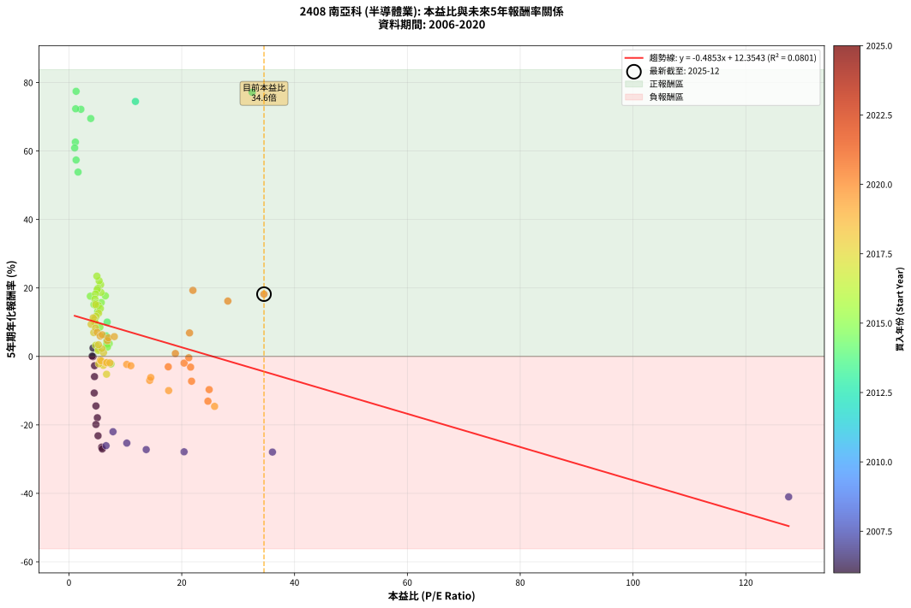
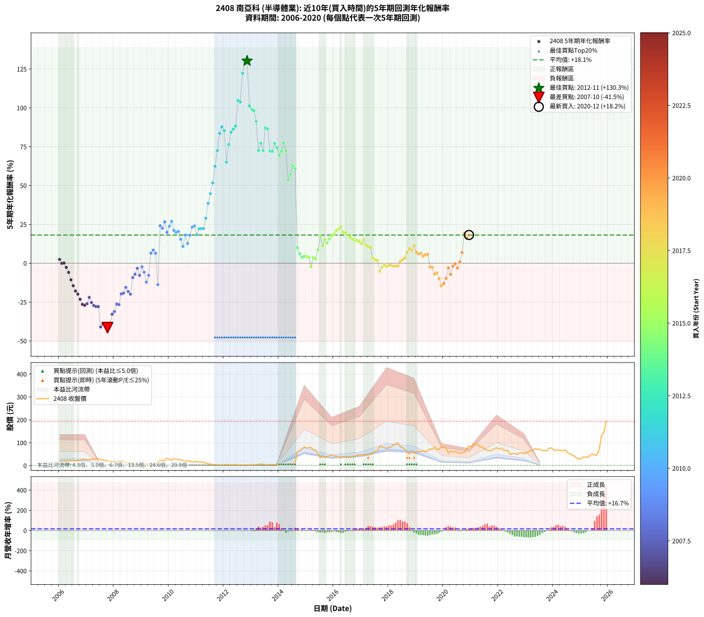

# 2408 南亞科 - 本益比與未來報酬率分析

!!! info "報告資訊"
    - **股票代號**: 2408
    - **公司名稱**: 南亞科
    - **產業別**: 半導體業
    - **分析期間**: 2006-2020 (180 個數據點)
    - **資料來源**: Type 12 (ShowMonthlyK_ChartFlow) 月收盤價與本益比
    - **報酬率口徑**: 含現金股利 (簡化: 年度合計，假設每年7/1入帳)
    - **報告生成時間**: 2026-01-11 20:46:46 CST

## 📈 視覺化圖表

### 圖表1: 本益比 vs 未來報酬率關係

*圖表1：2408 南亞科 本益比與5年期未來報酬率關係 (2006-2020)*

### 圖表2: 歷年買入時點的5年期實際報酬率

*圖表2：2408 南亞科 歷年買入時點的5年期實際報酬率 (2006-2020)*

## 📍 買點訊號說明

本報告提供兩種買點提示訊號（顯示於圖表2的股價子圖中）：

### ▲ 小綠色三角形（回測驗證）
- **計算方式**: 使用全部歷史資料計算本益比第25百分位數
- **用途**: 事後驗證，顯示歷史上哪些時點確實為低估區
- **限制**: 當下無法判斷，僅供回測參考
- **特性**: 後見之明（Look-Ahead Bias）

### ▲ 小橘色三角形（即時訊號）
- **計算方式**: 使用截至當月的過去5年資料計算本益比第25百分位數
- **用途**: 實際投資決策，當時即可判斷
- **優勢**: 可操作性強，符合實務需求
- **特性**: 無後見之明，滾動窗口計算

!!! tip "如何使用兩種訊號"
    - **綠色▲** 幫助理解歷史估值機會，驗證策略有效性
    - **橘色▲** 可作為實際買進參考，但仍需搭配基本面分析
    - 兩種訊號重疊時，表示即時判斷與事後驗證一致，信心度較高
    - 僅有綠色▲時，表示當時無法判斷（需要未來資料才能確認）
    - 僅有橘色▲時，表示即時判斷為買點，但事後可能不是最佳時機

## 📊 估值分析摘要

| 指標 | 數值 |
|:---:|:---:|
| **目前本益比** (2020-12) | **34.58 倍** |
| **歷史平均本益比** | 9.86 倍 |
| **估值水準** | 🔴 相對高估 |
| **預期5年年化報酬率** | **-4.43%** |
| **歷史平均報酬率** | +18.14% |
| **相關係數 (R²)** | 0.0801 |
| **趨勢線斜率** | -0.4853 |

!!! abstract "核心洞察"
    目前本益比顯著高於歷史平均，預期未來報酬率可能較低

    根據歷史數據回測，2408 南亞科 在目前本益比 **34.6倍** 的估值水準下，
    預期未來5年年化報酬率約為 **-4.4%**。

    **重要提醒**: 本分析基於歷史數據統計，實際報酬率會受到公司基本面變化、產業趨勢、
    總體經濟環境等多重因素影響。R² = 0.08 表示本益比可解釋約 8.0% 的報酬率變異。

## 📈 歷史估值統計

### 最佳買點 (最高報酬率)

| 項目 | 數值 |
|:---:|:---:|
| 起始時間 | 2012-11 |
| 當時本益比 | nan 倍 |
| 起始價格 | 1.3 元 |
| 5年後價格 | 77.8 元 |
| **5年年化報酬率** | **+130.26%** |

### 最差買點 (最低報酬率)

| 項目 | 數值 |
|:---:|:---:|
| 起始時間 | 2007-10 |
| 當時本益比 | nan 倍 |
| 起始價格 | 20.4 元 |
| 5年後價格 | 1.4 元 |
| **5年年化報酬率** | **-41.47%** |

## 🎯 投資啟示

### 本益比與報酬率關係

趨勢線方程式: **y = -0.4853x + 12.3543**

!!! note "負相關"
    本益比與未來報酬率呈現負相關。較低的本益比通常帶來較高的未來報酬率，
    但相關性不算非常強。**估值仍是重要參考指標之一**。

### 估值區間建議

基於歷史數據分析:

- **🟢 低估區** (P/E < 7.9): 預期報酬率較高，可考慮增加持股
- **🟡 合理區** (P/E 7.9-11.8): 預期報酬率符合長期趨勢，正常持有
- **🔴 高估區** (P/E > 11.8): 預期報酬率較低，可考慮減碼或觀望

!!! danger "風險提示"
    - 過去表現不代表未來結果
    - 本分析假設公司基本面無重大結構性變化
    - 產業環境劇變可能使歷史規律失效
    - 應結合公司財報、產業趨勢、總體經濟等多重因素綜合判斷

!!! success "長期投資觀點"
    歷史數據顯示，在合理或低估的估值水準買入並長期持有，
    往往能獲得較佳的投資報酬。**耐心等待好價格**是價值投資的核心原則。

## 📊 數據品質

- **資料來源**: GoodInfo.tw Type 12 (ShowMonthlyK_ChartFlow)
- **資料頻率**: 月度收盤價與本益比
- **回測期間**: 2006-2020
- **數據點數量**: 180 個 (每個點代表一次5年期回測)

### 計算方法說明

1. **5年期年化報酬率**:
   - 對每個歷史時點，計算其後5年的實際投資報酬率
   - 期末價值(不含股利): 期末價格
   - 期末價值(含現金股利): 期末價格 + 持有期間內的現金股利合計 (簡化: 年度合計，假設每年7/1入帳)
   - 公式: 年化報酬率 = [(期末價值/期初價格)^(1/年數) - 1] × 100%

2. **本益比 (P/E Ratio)**:
   - 使用當時的月收盤價與EPS計算
   - 資料來源: Type 12 月度河流圖本益比數據

3. **趨勢線 (Linear Regression)**:
   - 使用最小平方法擬合線性趨勢線
   - R²值衡量本益比對報酬率的解釋能力

---

*本報告由 Stock Analysis System v1.9.0 自動生成*
*數據更新時間: 2026-01-11 20:46:46 CST*

## 📋 月度回測明細表

（每一列對應時間線圖中的一個買入點；可用來對照 SVG 圖上的每個點。）

| 買入月份 | 賣出月份 | 回測期限_年 | 實際持有年數 | 買入本益比_倍 | 買入收盤價_元 | 賣出收盤價_元 | 現金股利合計_元 | 總報酬率_pct | 年化報酬率_pct |
| --- | --- | --- | --- | --- | --- | --- | --- | --- | --- |
| 2006-01 | 2011-01 | 5 | 4.999 | 4.27 | 19.45 | 18.45 | 3.49 | +12.82 | +2.44 |
| 2006-02 | 2011-02 | 5 | 4.999 | 4.26 | 19.40 | 15.85 | 3.49 | -0.29 | -0.06 |
| 2006-03 | 2011-03 | 5 | 4.999 | 4.12 | 18.75 | 15.35 | 3.49 | +0.50 | +0.10 |
| 2006-04 | 2011-04 | 5 | 4.999 | 4.54 | 20.65 | 14.50 | 3.49 | -12.86 | -2.72 |
| 2006-05 | 2011-05 | 5 | 4.999 | 4.53 | 20.60 | 11.70 | 3.49 | -26.24 | -5.91 |
| 2006-06 | 2011-06 | 5 | 4.999 | 4.48 | 20.40 | 8.10 | 3.49 | -43.17 | -10.69 |
| 2006-07 | 2011-07 | 5 | 4.999 | 4.79 | 21.80 | 6.68 | 3.29 | -54.24 | -14.48 |
| 2006-08 | 2011-08 | 5 | 4.999 | 5.04 | 22.95 | 5.26 | 3.29 | -62.72 | -17.91 |
| 2006-09 | 2011-09 | 5 | 4.999 | 4.79 | 21.80 | 3.90 | 3.29 | -67.00 | -19.89 |
| 2006-10 | 2011-10 | 5 | 4.999 | 5.16 | 23.50 | 2.99 | 3.29 | -73.26 | -23.19 |
| 2006-11 | 2011-11 | 5 | 4.999 | 5.80 | 26.40 | 2.36 | 3.29 | -78.58 | -26.52 |
| 2006-12 | 2011-12 | 5 | 4.999 | 5.91 | 26.90 | 2.27 | 3.29 | -79.31 | -27.03 |
| 2007-01 | 2012-01 | 5 | 4.999 | 6.58 | 25.85 | 2.41 | 3.29 | -77.93 | -26.08 |
| 2007-02 | 2012-02 | 5 | 4.999 | 7.81 | 25.85 | 4.17 | 3.29 | -71.12 | -22.00 |
| 2007-03 | 2012-03 | 5 | 5.002 | 10.26 | 27.60 | 3.11 | 3.29 | -76.79 | -25.33 |
| 2007-04 | 2012-04 | 5 | 5.002 | 13.70 | 28.35 | 2.49 | 3.29 | -79.59 | -27.22 |
| 2007-05 | 2012-05 | 5 | 5.002 | 20.41 | 29.60 | 2.48 | 3.29 | -80.49 | -27.87 |
| 2007-06 | 2012-06 | 5 | 5.002 | 36.08 | 29.95 | 2.52 | 3.29 | -80.58 | -27.94 |
| 2007-07 | 2012-07 | 5 | 5.002 | 127.60 | 26.80 | 1.91 | 0.00 | -92.87 | -41.02 |
| 2007-08 | 2012-08 | 5 | 5.002 |  | 24.30 | 2.02 | 0.00 | -91.69 | -39.18 |
| 2007-09 | 2012-09 | 5 | 5.002 |  | 22.00 | 1.71 | 0.00 | -92.23 | -39.99 |
| 2007-10 | 2012-10 | 5 | 5.002 |  | 20.40 | 1.40 | 0.00 | -93.14 | -41.47 |
| 2007-11 | 2012-11 | 5 | 5.002 |  | 17.30 | 1.30 | 0.00 | -92.49 | -40.40 |
| 2007-12 | 2012-12 | 5 | 5.002 |  | 18.30 | 2.50 | 0.00 | -86.34 | -32.83 |
| 2008-01 | 2013-01 | 5 | 5.002 |  | 17.70 | 2.74 | 0.00 | -84.52 | -31.13 |
| 2008-02 | 2013-03 | 5 | 5.081 |  | 18.10 | 3.84 | 0.00 | -78.78 | -26.30 |
| 2008-03 | 2013-03 | 5 | 4.999 |  | 18.10 | 3.84 | 0.00 | -78.78 | -26.66 |
| 2008-04 | 2013-04 | 5 | 4.999 |  | 19.50 | 6.50 | 0.00 | -66.67 | -19.73 |
| 2008-05 | 2013-05 | 5 | 4.999 |  | 17.60 | 6.05 | 0.00 | -65.62 | -19.23 |
| 2008-06 | 2013-06 | 5 | 4.999 |  | 13.65 | 5.86 | 0.00 | -57.07 | -15.56 |
| 2008-07 | 2013-07 | 5 | 4.999 |  | 10.50 | 3.85 | 0.00 | -63.33 | -18.18 |
| 2008-08 | 2013-08 | 5 | 4.999 |  | 10.70 | 3.53 | 0.00 | -67.01 | -19.89 |
| 2008-09 | 2013-09 | 5 | 4.999 |  | 7.32 | 4.50 | 0.00 | -38.52 | -9.27 |
| 2008-10 | 2013-10 | 5 | 4.999 |  | 5.87 | 4.07 | 0.00 | -30.66 | -7.06 |
| 2008-11 | 2013-11 | 5 | 4.999 |  | 4.79 | 4.06 | 0.00 | -15.24 | -3.25 |
| 2008-12 | 2013-12 | 5 | 4.999 |  | 6.04 | 4.01 | 0.00 | -33.61 | -7.87 |
| 2009-01 | 2014-01 | 5 | 4.999 |  | 5.62 | 5.00 | 0.00 | -11.03 | -2.31 |
| 2009-02 | 2014-02 | 5 | 4.999 |  | 6.41 | 4.76 | 0.00 | -25.74 | -5.78 |
| 2009-03 | 2014-03 | 5 | 4.999 |  | 7.75 | 4.05 | 0.00 | -47.74 | -12.17 |
| 2009-04 | 2014-04 | 5 | 4.999 |  | 7.44 | 4.95 | 0.00 | -33.47 | -7.83 |
| 2009-05 | 2014-05 | 5 | 4.999 |  | 6.05 | 8.29 | 0.00 | +37.02 | +6.50 |
| 2009-06 | 2014-06 | 5 | 4.999 |  | 5.13 | 7.70 | 0.00 | +50.10 | +8.46 |
| 2009-07 | 2014-07 | 5 | 4.999 |  | 5.86 | 8.00 | 0.00 | +36.52 | +6.42 |
| 2009-08 | 2014-08 | 5 | 4.999 |  | 17.00 | 8.10 | 0.00 | -52.35 | -13.78 |
| 2009-09 | 2014-09 | 5 | 4.999 |  | 20.50 | 60.40 | 0.00 | +194.63 | +24.13 |
| 2009-10 | 2014-10 | 5 | 4.999 |  | 23.50 | 64.90 | 0.00 | +176.17 | +22.53 |
| 2009-11 | 2014-11 | 5 | 4.999 |  | 22.50 | 73.20 | 0.00 | +225.33 | +26.61 |
| 2009-12 | 2014-12 | 5 | 4.999 |  | 32.70 | 81.00 | 0.00 | +147.71 | +19.89 |
| 2010-01 | 2015-01 | 5 | 4.999 |  | 26.25 | 76.30 | 0.00 | +190.67 | +23.79 |
| 2010-02 | 2015-02 | 5 | 4.999 |  | 23.80 | 78.40 | 0.00 | +229.41 | +26.93 |
| 2010-03 | 2015-03 | 5 | 4.999 |  | 30.30 | 79.00 | 0.00 | +160.73 | +21.13 |
| 2010-04 | 2015-04 | 5 | 4.999 |  | 27.65 | 68.60 | 0.00 | +148.10 | +19.93 |
| 2010-05 | 2015-05 | 5 | 4.999 |  | 26.40 | 67.00 | 0.00 | +153.79 | +20.48 |
| 2010-06 | 2015-06 | 5 | 4.999 |  | 25.25 | 51.70 | 0.00 | +104.75 | +15.41 |
| 2010-07 | 2015-07 | 5 | 4.999 |  | 21.65 | 34.25 | 2.00 | +67.43 | +10.86 |
| 2010-08 | 2015-08 | 5 | 4.999 |  | 18.30 | 40.15 | 2.00 | +130.32 | +18.16 |
| 2010-09 | 2015-09 | 5 | 4.999 |  | 21.15 | 36.50 | 2.00 | +82.02 | +12.73 |
| 2010-10 | 2015-10 | 5 | 4.999 |  | 18.35 | 40.05 | 2.00 | +129.14 | +18.04 |
| 2010-11 | 2015-11 | 5 | 4.999 |  | 15.80 | 42.75 | 2.00 | +183.22 | +23.15 |
| 2010-12 | 2015-12 | 5 | 4.999 |  | 16.25 | 45.70 | 2.00 | +193.53 | +24.03 |
| 2011-01 | 2016-01 | 5 | 4.999 |  | 18.45 | 40.85 | 2.00 | +132.24 | +18.36 |
| 2011-02 | 2016-02 | 5 | 4.999 |  | 15.85 | 41.20 | 2.00 | +172.54 | +22.21 |
| 2011-03 | 2016-03 | 5 | 5.002 |  | 15.35 | 39.95 | 2.00 | +173.28 | +22.26 |
| 2011-04 | 2016-04 | 5 | 5.002 |  | 14.50 | 37.70 | 2.00 | +173.78 | +22.31 |
| 2011-05 | 2016-05 | 5 | 5.002 |  | 11.70 | 39.70 | 2.00 | +256.39 | +28.93 |
| 2011-06 | 2016-06 | 5 | 5.002 |  | 8.10 | 39.40 | 2.00 | +411.09 | +38.56 |
| 2011-07 | 2016-07 | 5 | 5.002 |  | 6.68 | 37.70 | 4.80 | +536.20 | +44.76 |
| 2011-08 | 2016-08 | 5 | 5.002 |  | 5.26 | 37.50 | 4.80 | +704.14 | +51.70 |
| 2011-09 | 2016-09 | 5 | 5.002 |  | 3.90 | 39.25 | 4.80 | +1029.44 | +62.36 |
| 2011-10 | 2016-10 | 5 | 5.002 |  | 2.99 | 40.95 | 4.80 | +1430.03 | +72.52 |
| 2011-11 | 2016-11 | 5 | 5.002 |  | 2.36 | 44.50 | 4.80 | +1988.90 | +83.60 |
| 2011-12 | 2016-12 | 5 | 5.002 |  | 2.27 | 48.30 | 4.80 | +2239.12 | +87.80 |
| 2012-01 | 2017-01 | 5 | 5.002 |  | 2.41 | 48.00 | 4.80 | +2090.79 | +85.36 |
| 2012-02 | 2017-03 | 5 | 5.081 |  | 4.17 | 48.40 | 4.80 | +1175.73 | +65.05 |
| 2012-03 | 2017-03 | 5 | 4.999 |  | 3.11 | 48.40 | 4.80 | +1610.55 | +76.47 |
| 2012-04 | 2017-04 | 5 | 4.999 |  | 2.49 | 48.15 | 4.80 | +2026.43 | +84.32 |
| 2012-05 | 2017-05 | 5 | 4.999 |  | 2.48 | 50.90 | 4.80 | +2145.89 | +86.34 |
| 2012-06 | 2017-06 | 5 | 4.999 |  | 2.52 | 54.80 | 4.80 | +2265.00 | +88.28 |
| 2012-07 | 2017-07 | 5 | 4.999 |  | 1.91 | 62.40 | 6.30 | +3496.75 | +104.75 |
| 2012-08 | 2017-08 | 5 | 4.999 |  | 2.02 | 64.70 | 6.30 | +3414.75 | +103.81 |
| 2012-09 | 2017-09 | 5 | 4.999 |  | 1.71 | 86.30 | 6.30 | +5315.09 | +122.21 |
| 2012-10 | 2017-10 | 5 | 4.999 |  | 1.40 | 81.80 | 6.30 | +6192.71 | +128.99 |
| 2012-11 | 2017-11 | 5 | 4.999 |  | 1.30 | 77.80 | 6.30 | +6369.08 | +130.26 |
| 2012-12 | 2017-12 | 5 | 4.999 |  | 2.50 | 76.20 | 6.30 | +3199.92 | +101.25 |
| 2013-01 | 2018-01 | 5 | 4.999 |  | 2.74 | 79.40 | 6.30 | +3027.66 | +99.11 |
| 2013-02 | 2018-02 | 5 | 4.999 |  | 2.85 | 80.80 | 6.30 | +2956.07 | +98.19 |
| 2013-03 | 2018-03 | 5 | 4.999 |  | 3.84 | 92.00 | 6.30 | +2459.84 | +91.29 |
| 2013-04 | 2018-04 | 5 | 4.999 |  | 6.50 | 93.00 | 6.30 | +1427.66 | +72.52 |
| 2013-05 | 2018-05 | 5 | 4.999 |  | 6.05 | 99.60 | 6.30 | +1650.38 | +77.28 |
| 2013-06 | 2018-06 | 5 | 4.999 |  | 5.86 | 83.20 | 6.30 | +1427.27 | +72.51 |
| 2013-07 | 2018-07 | 5 | 4.999 |  | 3.85 | 78.60 | 9.81 | +2196.29 | +87.17 |
| 2013-08 | 2018-08 | 5 | 4.999 |  | 3.53 | 69.70 | 9.81 | +2152.32 | +86.45 |
| 2013-09 | 2018-09 | 5 | 4.999 |  | 4.50 | 58.10 | 9.81 | +1409.04 | +72.10 |
| 2013-10 | 2018-10 | 5 | 4.999 |  | 4.07 | 51.40 | 9.81 | +1403.86 | +71.98 |
| 2013-11 | 2018-11 | 5 | 4.999 | 32.48 | 4.06 | 61.00 | 9.81 | +1644.01 | +77.15 |
| 2013-12 | 2018-12 | 5 | 4.999 | 11.79 | 4.01 | 55.00 | 9.81 | +1516.13 | +74.47 |
| 2014-01 | 2019-01 | 5 | 4.999 | 3.87 | 5.00 | 60.10 | 9.81 | +1298.14 | +69.49 |
| 2014-02 | 2019-02 | 5 | 4.999 | 2.12 | 4.76 | 62.20 | 9.81 | +1412.75 | +72.18 |
| 2014-03 | 2019-03 | 5 | 4.999 | 1.27 | 4.05 | 61.40 | 9.81 | +1658.20 | +77.44 |
| 2014-04 | 2019-04 | 5 | 4.999 | 1.19 | 4.95 | 65.40 | 9.81 | +1419.33 | +72.33 |
| 2014-05 | 2019-05 | 5 | 4.999 | 1.62 | 8.29 | 61.60 | 9.81 | +761.36 | +53.84 |
| 2014-06 | 2019-06 | 5 | 4.999 | 1.27 | 7.70 | 64.50 | 9.81 | +865.03 | +57.37 |
| 2014-07 | 2019-07 | 5 | 4.999 | 1.14 | 8.00 | 74.00 | 16.92 | +1036.46 | +62.61 |
| 2014-08 | 2019-08 | 5 | 4.999 | 1.02 | 8.10 | 70.40 | 16.92 | +977.99 | +60.90 |
| 2014-09 | 2019-09 | 5 | 4.999 | 6.78 | 60.40 | 80.50 | 16.92 | +61.29 | +10.03 |
| 2014-10 | 2019-10 | 5 | 4.999 | 6.58 | 64.90 | 70.00 | 16.92 | +33.92 | +6.02 |
| 2014-11 | 2019-11 | 5 | 4.999 | 6.77 | 73.20 | 71.20 | 16.92 | +20.38 | +3.78 |
| 2014-12 | 2019-12 | 5 | 4.999 | 6.88 | 81.00 | 83.40 | 16.92 | +23.85 | +4.37 |
| 2015-01 | 2020-01 | 5 | 4.999 | 6.71 | 76.30 | 78.10 | 16.92 | +24.53 | +4.49 |
| 2015-02 | 2020-02 | 5 | 4.999 | 7.14 | 78.40 | 77.30 | 16.92 | +20.17 | +3.74 |
| 2015-03 | 2020-03 | 5 | 5.002 | 7.46 | 79.00 | 53.70 | 16.92 | -10.61 | -2.22 |
| 2015-04 | 2020-04 | 5 | 5.002 | 6.72 | 68.60 | 65.00 | 16.92 | +19.41 | +3.61 |
| 2015-05 | 2020-05 | 5 | 5.002 | 6.83 | 67.00 | 59.80 | 16.92 | +14.50 | +2.74 |
| 2015-06 | 2020-06 | 5 | 5.002 | 5.49 | 51.70 | 61.00 | 16.92 | +50.71 | +8.55 |
| 2015-07 | 2020-07 | 5 | 5.002 | 3.79 | 34.25 | 60.60 | 16.42 | +124.86 | +17.59 |
| 2015-08 | 2020-08 | 5 | 5.002 | 4.65 | 40.15 | 51.90 | 16.42 | +70.15 | +11.21 |
| 2015-09 | 2020-09 | 5 | 5.002 | 4.43 | 36.50 | 57.50 | 16.42 | +102.51 | +15.15 |
| 2015-10 | 2020-10 | 5 | 5.002 | 5.10 | 40.05 | 57.80 | 16.42 | +85.31 | +13.12 |
| 2015-11 | 2020-11 | 5 | 5.002 | 5.73 | 42.75 | 72.40 | 16.42 | +107.76 | +15.74 |
| 2015-12 | 2020-12 | 5 | 5.002 | 6.46 | 45.70 | 86.80 | 16.42 | +125.86 | +17.69 |
| 2016-01 | 2021-01 | 5 | 5.002 | 5.67 | 40.85 | 79.90 | 16.42 | +135.78 | +18.71 |
| 2016-02 | 2021-03 | 5 | 5.081 | 5.62 | 41.20 | 91.90 | 16.42 | +162.90 | +20.95 |
| 2016-03 | 2021-03 | 5 | 4.999 | 5.35 | 39.95 | 91.90 | 16.42 | +171.13 | +22.08 |
| 2016-04 | 2021-04 | 5 | 4.999 | 4.96 | 37.70 | 91.60 | 16.42 | +186.51 | +23.44 |
| 2016-05 | 2021-05 | 5 | 4.999 | 5.13 | 39.70 | 81.90 | 16.42 | +147.65 | +19.89 |
| 2016-06 | 2021-06 | 5 | 4.999 | 5.01 | 39.40 | 79.70 | 16.42 | +143.95 | +19.53 |
| 2016-07 | 2021-07 | 5 | 4.999 | 4.71 | 37.70 | 72.30 | 14.91 | +131.33 | +18.27 |
| 2016-08 | 2021-08 | 5 | 4.999 | 4.61 | 37.50 | 66.40 | 14.91 | +116.83 | +16.74 |
| 2016-09 | 2021-09 | 5 | 4.999 | 4.75 | 39.25 | 65.90 | 14.91 | +105.89 | +15.54 |
| 2016-10 | 2021-10 | 5 | 4.999 | 4.87 | 40.95 | 66.50 | 14.91 | +98.81 | +14.74 |
| 2016-11 | 2021-11 | 5 | 4.999 | 5.21 | 44.50 | 74.20 | 14.91 | +100.25 | +14.90 |
| 2016-12 | 2021-12 | 5 | 4.999 | 5.57 | 48.30 | 78.10 | 14.91 | +92.57 | +14.01 |
| 2017-01 | 2022-01 | 5 | 4.999 | 5.25 | 48.00 | 72.00 | 14.91 | +81.07 | +12.61 |
| 2017-02 | 2022-02 | 5 | 4.999 | 4.73 | 45.50 | 77.10 | 14.91 | +102.23 | +15.13 |
| 2017-03 | 2022-03 | 5 | 4.999 | 4.80 | 48.40 | 69.20 | 14.91 | +73.79 | +11.69 |
| 2017-04 | 2022-04 | 5 | 4.999 | 4.56 | 48.15 | 65.60 | 14.91 | +67.21 | +10.83 |
| 2017-05 | 2022-05 | 5 | 4.999 | 4.61 | 50.90 | 66.80 | 14.91 | +60.54 | +9.93 |
| 2017-06 | 2022-06 | 5 | 4.999 | 4.76 | 54.80 | 49.40 | 14.91 | +17.36 | +3.25 |
| 2017-07 | 2022-07 | 5 | 4.999 | 5.20 | 62.40 | 52.30 | 17.12 | +11.24 | +2.15 |
| 2017-08 | 2022-08 | 5 | 4.999 | 5.19 | 64.70 | 53.40 | 17.12 | +8.99 | +1.74 |
| 2017-09 | 2022-09 | 5 | 4.999 | 6.67 | 86.30 | 48.95 | 17.12 | -23.45 | -5.20 |
| 2017-10 | 2022-10 | 5 | 4.999 | 6.10 | 81.80 | 54.50 | 17.12 | -12.45 | -2.62 |
| 2017-11 | 2022-11 | 5 | 4.999 | 5.60 | 77.80 | 56.80 | 17.12 | -4.99 | -1.02 |
| 2017-12 | 2022-12 | 5 | 4.999 | 5.31 | 76.20 | 51.20 | 17.12 | -10.35 | -2.16 |
| 2018-01 | 2023-01 | 5 | 4.999 | 5.58 | 79.40 | 57.80 | 17.12 | -5.65 | -1.16 |
| 2018-02 | 2023-02 | 5 | 4.999 | 5.73 | 80.80 | 58.40 | 17.12 | -6.54 | -1.34 |
| 2018-03 | 2023-03 | 5 | 4.999 | 6.59 | 92.00 | 66.50 | 17.12 | -9.11 | -1.89 |
| 2018-04 | 2023-04 | 5 | 4.999 | 6.72 | 93.00 | 67.80 | 17.12 | -8.69 | -1.80 |
| 2018-05 | 2023-05 | 5 | 4.999 | 7.26 | 99.60 | 73.50 | 17.12 | -9.02 | -1.87 |
| 2018-06 | 2023-06 | 5 | 4.999 | 6.13 | 83.20 | 70.80 | 17.12 | +5.67 | +1.11 |
| 2018-07 | 2023-07 | 5 | 4.999 | 5.84 | 78.60 | 72.30 | 15.74 | +12.01 | +2.29 |
| 2018-08 | 2023-08 | 5 | 4.999 | 5.23 | 69.70 | 66.60 | 15.74 | +18.13 | +3.39 |
| 2018-09 | 2023-09 | 5 | 4.999 | 4.40 | 58.10 | 65.60 | 15.74 | +39.99 | +6.96 |
| 2018-10 | 2023-10 | 5 | 4.999 | 3.94 | 51.40 | 64.70 | 15.74 | +56.49 | +9.37 |
| 2018-11 | 2023-11 | 5 | 4.999 | 4.72 | 61.00 | 75.00 | 15.74 | +48.75 | +8.27 |
| 2018-12 | 2023-12 | 5 | 4.999 | 4.30 | 55.00 | 78.00 | 15.74 | +70.43 | +11.25 |
| 2019-01 | 2024-01 | 5 | 4.999 | 5.01 | 60.10 | 68.70 | 15.74 | +40.49 | +7.04 |
| 2019-02 | 2024-02 | 5 | 4.999 | 5.55 | 62.20 | 67.30 | 15.74 | +33.50 | +5.95 |
| 2019-03 | 2024-03 | 5 | 5.002 | 5.90 | 61.40 | 67.70 | 15.74 | +35.89 | +6.32 |
| 2019-04 | 2024-04 | 5 | 5.002 | 6.81 | 65.40 | 66.10 | 15.74 | +25.13 | +4.58 |
| 2019-05 | 2024-05 | 5 | 5.002 | 6.99 | 61.60 | 64.50 | 15.74 | +30.25 | +5.43 |
| 2019-06 | 2024-06 | 5 | 5.002 | 8.05 | 64.50 | 69.70 | 15.74 | +32.46 | +5.78 |
| 2019-07 | 2024-07 | 5 | 5.002 | 10.25 | 74.00 | 57.10 | 8.63 | -11.18 | -2.34 |
| 2019-08 | 2024-08 | 5 | 5.002 | 10.97 | 70.40 | 52.70 | 8.63 | -12.89 | -2.72 |
| 2019-09 | 2024-09 | 5 | 5.002 | 14.32 | 80.50 | 47.35 | 8.63 | -30.46 | -7.01 |
| 2019-10 | 2024-10 | 5 | 5.002 | 14.51 | 70.00 | 42.30 | 8.63 | -27.25 | -6.16 |
| 2019-11 | 2024-11 | 5 | 5.002 | 17.68 | 71.20 | 33.45 | 8.63 | -40.90 | -9.98 |
| 2019-12 | 2024-12 | 5 | 5.002 | 25.82 | 83.40 | 29.25 | 8.63 | -54.58 | -14.60 |
| 2020-01 | 2025-01 | 5 | 5.002 | 24.64 | 78.10 | 30.10 | 8.63 | -50.41 | -13.08 |
| 2020-02 | 2025-03 | 5 | 5.081 | 24.86 | 77.30 | 37.40 | 8.63 | -40.46 | -9.70 |
| 2020-03 | 2025-03 | 5 | 4.999 | 17.61 | 53.70 | 37.40 | 8.63 | -14.29 | -3.04 |
| 2020-04 | 2025-04 | 5 | 4.999 | 21.74 | 65.00 | 36.00 | 8.63 | -31.34 | -7.25 |
| 2020-05 | 2025-05 | 5 | 4.999 | 20.41 | 59.80 | 45.55 | 8.63 | -9.40 | -1.96 |
| 2020-06 | 2025-06 | 5 | 4.999 | 21.25 | 61.00 | 51.20 | 8.63 | -1.92 | -0.39 |
| 2020-07 | 2025-07 | 5 | 4.999 | 21.57 | 60.60 | 44.55 | 7.13 | -14.72 | -3.13 |
| 2020-08 | 2025-08 | 5 | 4.999 | 18.87 | 51.90 | 47.00 | 7.13 | +4.30 | +0.85 |
| 2020-09 | 2025-09 | 5 | 4.999 | 21.38 | 57.50 | 73.00 | 7.13 | +39.36 | +6.86 |
| 2020-10 | 2025-10 | 5 | 4.999 | 21.98 | 57.80 | 132.50 | 7.13 | +141.57 | +19.29 |
| 2020-11 | 2025-11 | 5 | 4.999 | 28.17 | 72.40 | 146.00 | 7.13 | +111.51 | +16.16 |
| 2020-12 | 2025-12 | 5 | 4.999 | 34.58 | 86.80 | 193.00 | 7.13 | +130.56 | +18.19 |
