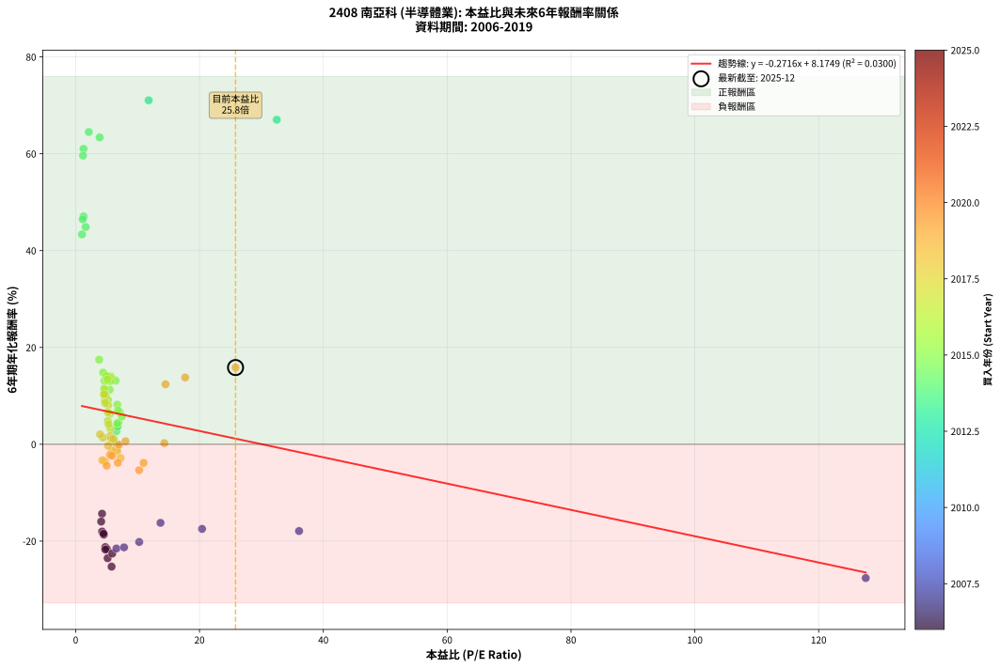
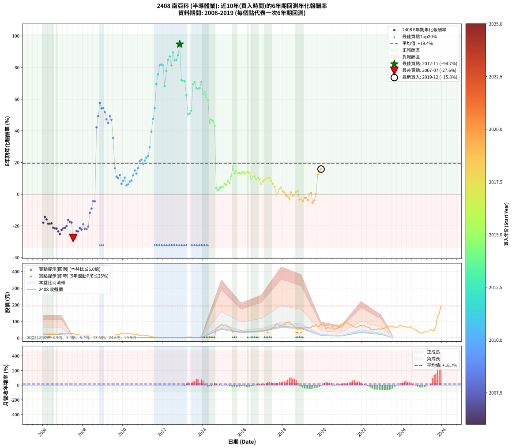

# 2408 南亞科 - 本益比與未來報酬率分析

!!! info "報告資訊"
    - **股票代號**: 2408
    - **公司名稱**: 南亞科
    - **產業別**: 半導體業
    - **分析期間**: 2006-2019 (168 個數據點)
    - **資料來源**: Type 12 (ShowMonthlyK_ChartFlow) 月收盤價與本益比
    - **報酬率口徑**: 含現金股利 (簡化: 年度合計，假設每年7/1入帳)
    - **報告生成時間**: 2026-01-07 20:46:39 CST

## 📈 視覺化圖表

### 圖表1: 本益比 vs 未來報酬率關係

*圖表1：2408 南亞科 本益比與6年期未來報酬率關係 (2006-2019)*

### 圖表2: 歷年買入時點的6年期實際報酬率

*圖表2：2408 南亞科 歷年買入時點的6年期實際報酬率 (2006-2019)*

## 📍 買點訊號說明

本報告提供兩種買點提示訊號（顯示於圖表2的股價子圖中）：

### ▲ 小綠色三角形（回測驗證）
- **計算方式**: 使用全部歷史資料計算本益比第25百分位數
- **用途**: 事後驗證，顯示歷史上哪些時點確實為低估區
- **限制**: 當下無法判斷，僅供回測參考
- **特性**: 後見之明（Look-Ahead Bias）

### ▲ 小橘色三角形（即時訊號）
- **計算方式**: 使用截至當月的過去5年資料計算本益比第25百分位數
- **用途**: 實際投資決策，當時即可判斷
- **優勢**: 可操作性強，符合實務需求
- **特性**: 無後見之明，滾動窗口計算

!!! tip "如何使用兩種訊號"
    - **綠色▲** 幫助理解歷史估值機會，驗證策略有效性
    - **橘色▲** 可作為實際買進參考，但仍需搭配基本面分析
    - 兩種訊號重疊時，表示即時判斷與事後驗證一致，信心度較高
    - 僅有綠色▲時，表示當時無法判斷（需要未來資料才能確認）
    - 僅有橘色▲時，表示即時判斷為買點，但事後可能不是最佳時機

## 📊 估值分析摘要

| 指標 | 數值 |
|:---:|:---:|
| **目前本益比** (2019-12) | **25.82 倍** |
| **歷史平均本益比** | 8.15 倍 |
| **估值水準** | 🔴 相對高估 |
| **預期6年年化報酬率** | **+1.16%** |
| **歷史平均報酬率** | +19.36% |
| **相關係數 (R²)** | 0.0300 |
| **趨勢線斜率** | -0.2716 |

!!! abstract "核心洞察"
    目前本益比顯著高於歷史平均，預期未來報酬率可能較低

    根據歷史數據回測，2408 南亞科 在目前本益比 **25.8倍** 的估值水準下，
    預期未來6年年化報酬率約為 **+1.2%**。

    **重要提醒**: 本分析基於歷史數據統計，實際報酬率會受到公司基本面變化、產業趨勢、
    總體經濟環境等多重因素影響。R² = 0.03 表示本益比可解釋約 3.0% 的報酬率變異。

## 📈 歷史估值統計

### 最佳買點 (最高報酬率)

| 項目 | 數值 |
|:---:|:---:|
| 起始時間 | 2012-11 |
| 當時本益比 | nan 倍 |
| 起始價格 | 1.3 元 |
| 6年後價格 | 61.0 元 |
| **6年年化報酬率** | **+94.72%** |

### 最差買點 (最低報酬率)

| 項目 | 數值 |
|:---:|:---:|
| 起始時間 | 2007-07 |
| 當時本益比 | 127.60 倍 |
| 起始價格 | 26.8 元 |
| 6年後價格 | 3.9 元 |
| **6年年化報酬率** | **-27.63%** |

## 🎯 投資啟示

### 本益比與報酬率關係

趨勢線方程式: **y = -0.2716x + 8.1749**

!!! note "負相關"
    本益比與未來報酬率呈現負相關。較低的本益比通常帶來較高的未來報酬率，
    但相關性不算非常強。**估值仍是重要參考指標之一**。

### 估值區間建議

基於歷史數據分析:

- **🟢 低估區** (P/E < 6.5): 預期報酬率較高，可考慮增加持股
- **🟡 合理區** (P/E 6.5-9.8): 預期報酬率符合長期趨勢，正常持有
- **🔴 高估區** (P/E > 9.8): 預期報酬率較低，可考慮減碼或觀望

!!! danger "風險提示"
    - 過去表現不代表未來結果
    - 本分析假設公司基本面無重大結構性變化
    - 產業環境劇變可能使歷史規律失效
    - 應結合公司財報、產業趨勢、總體經濟等多重因素綜合判斷

!!! success "長期投資觀點"
    歷史數據顯示，在合理或低估的估值水準買入並長期持有，
    往往能獲得較佳的投資報酬。**耐心等待好價格**是價值投資的核心原則。

## 📊 數據品質

- **資料來源**: GoodInfo.tw Type 12 (ShowMonthlyK_ChartFlow)
- **資料頻率**: 月度收盤價與本益比
- **回測期間**: 2006-2019
- **數據點數量**: 168 個 (每個點代表一次6年期回測)

### 計算方法說明

1. **6年期年化報酬率**:
   - 對每個歷史時點，計算其後6年的實際投資報酬率
   - 期末價值(不含股利): 期末價格
   - 期末價值(含現金股利): 期末價格 + 持有期間內的現金股利合計 (簡化: 年度合計，假設每年7/1入帳)
   - 公式: 年化報酬率 = [(期末價值/期初價格)^(1/年數) - 1] × 100%

2. **本益比 (P/E Ratio)**:
   - 使用當時的月收盤價與EPS計算
   - 資料來源: Type 12 月度河流圖本益比數據

3. **趨勢線 (Linear Regression)**:
   - 使用最小平方法擬合線性趨勢線
   - R²值衡量本益比對報酬率的解釋能力

---

*本報告由 Stock Analysis System v1.9.0 自動生成*
*數據更新時間: 2026-01-07 20:46:39 CST*

## 📋 月度回測明細表

（每一列對應時間線圖中的一個買入點；可用來對照 SVG 圖上的每個點。）

| 買入月份 | 賣出月份 | 回測期限_年 | 實際持有年數 | 買入本益比_倍 | 買入收盤價_元 | 賣出收盤價_元 | 現金股利合計_元 | 總報酬率_pct | 年化報酬率_pct |
| --- | --- | --- | --- | --- | --- | --- | --- | --- | --- |
| 2006-01 | 2012-01 | 6 | 5.999 | 4.27 | 19.45 | 2.41 | 3.49 | -69.65 | -18.02 |
| 2006-02 | 2012-02 | 6 | 5.999 | 4.26 | 19.40 | 4.17 | 3.49 | -60.49 | -14.34 |
| 2006-03 | 2012-03 | 6 | 6.001 | 4.12 | 18.75 | 3.11 | 3.49 | -64.78 | -15.96 |
| 2006-04 | 2012-04 | 6 | 6.001 | 4.54 | 20.65 | 2.49 | 3.49 | -71.02 | -18.65 |
| 2006-05 | 2012-05 | 6 | 6.001 | 4.53 | 20.60 | 2.48 | 3.49 | -71.00 | -18.64 |
| 2006-06 | 2012-06 | 6 | 6.001 | 4.48 | 20.40 | 2.52 | 3.49 | -70.52 | -18.42 |
| 2006-07 | 2012-07 | 6 | 6.001 | 4.79 | 21.80 | 1.91 | 3.29 | -76.12 | -21.23 |
| 2006-08 | 2012-08 | 6 | 6.001 | 5.04 | 22.95 | 2.02 | 3.29 | -76.84 | -21.63 |
| 2006-09 | 2012-09 | 6 | 6.001 | 4.79 | 21.80 | 1.71 | 3.29 | -77.04 | -21.74 |
| 2006-10 | 2012-10 | 6 | 6.001 | 5.16 | 23.50 | 1.40 | 3.29 | -80.02 | -23.54 |
| 2006-11 | 2012-11 | 6 | 6.001 | 5.80 | 26.40 | 1.30 | 3.29 | -82.59 | -25.27 |
| 2006-12 | 2012-12 | 6 | 6.001 | 5.91 | 26.90 | 2.50 | 3.29 | -78.46 | -22.57 |
| 2007-01 | 2013-01 | 6 | 6.001 | 6.58 | 25.85 | 2.74 | 3.29 | -76.65 | -21.53 |
| 2007-02 | 2013-02 | 6 | 6.001 | 7.81 | 25.85 | 2.85 | 3.29 | -76.23 | -21.29 |
| 2007-03 | 2013-03 | 6 | 6.001 | 10.26 | 27.60 | 3.84 | 3.29 | -74.15 | -20.18 |
| 2007-04 | 2013-04 | 6 | 6.001 | 13.70 | 28.35 | 6.50 | 3.29 | -65.45 | -16.23 |
| 2007-05 | 2013-05 | 6 | 6.001 | 20.41 | 29.60 | 6.05 | 3.29 | -68.43 | -17.48 |
| 2007-06 | 2013-06 | 6 | 6.001 | 36.08 | 29.95 | 5.86 | 3.29 | -69.43 | -17.92 |
| 2007-07 | 2013-07 | 6 | 6.001 | 127.60 | 26.80 | 3.85 | 0.00 | -85.63 | -27.63 |
| 2007-08 | 2013-08 | 6 | 6.001 |  | 24.30 | 3.53 | 0.00 | -85.47 | -27.49 |
| 2007-09 | 2013-09 | 6 | 6.001 |  | 22.00 | 4.50 | 0.00 | -79.55 | -23.24 |
| 2007-10 | 2013-10 | 6 | 6.001 |  | 20.40 | 4.07 | 0.00 | -80.05 | -23.55 |
| 2007-11 | 2013-11 | 6 | 6.001 |  | 17.30 | 4.06 | 0.00 | -76.53 | -21.46 |
| 2007-12 | 2013-12 | 6 | 6.001 |  | 18.30 | 4.01 | 0.00 | -78.09 | -22.35 |
| 2008-01 | 2014-01 | 6 | 6.001 |  | 17.70 | 5.00 | 0.00 | -71.75 | -18.99 |
| 2008-02 | 2014-03 | 6 | 6.081 |  | 18.10 | 4.05 | 0.00 | -77.62 | -21.82 |
| 2008-03 | 2014-03 | 6 | 5.999 |  | 18.10 | 4.05 | 0.00 | -77.62 | -22.09 |
| 2008-04 | 2014-04 | 6 | 5.999 |  | 19.50 | 4.95 | 0.00 | -74.62 | -20.43 |
| 2008-05 | 2014-05 | 6 | 5.999 |  | 17.60 | 8.29 | 0.00 | -52.90 | -11.79 |
| 2008-06 | 2014-06 | 6 | 5.999 |  | 13.65 | 7.70 | 0.00 | -43.59 | -9.10 |
| 2008-07 | 2014-07 | 6 | 5.999 |  | 10.50 | 8.00 | 0.00 | -23.81 | -4.43 |
| 2008-08 | 2014-08 | 6 | 5.999 |  | 10.70 | 8.10 | 0.00 | -24.30 | -4.53 |
| 2008-09 | 2014-09 | 6 | 5.999 |  | 7.32 | 60.40 | 0.00 | +725.14 | +42.16 |
| 2008-10 | 2014-10 | 6 | 5.999 |  | 5.87 | 64.90 | 0.00 | +1005.62 | +49.27 |
| 2008-11 | 2014-11 | 6 | 5.999 |  | 4.79 | 73.20 | 0.00 | +1428.18 | +57.55 |
| 2008-12 | 2014-12 | 6 | 5.999 |  | 6.04 | 81.00 | 0.00 | +1241.06 | +54.15 |
| 2009-01 | 2015-01 | 6 | 5.999 |  | 5.62 | 76.30 | 0.00 | +1257.65 | +54.47 |
| 2009-02 | 2015-02 | 6 | 5.999 |  | 6.41 | 78.40 | 0.00 | +1123.09 | +51.80 |
| 2009-03 | 2015-03 | 6 | 5.999 |  | 7.75 | 79.00 | 0.00 | +919.35 | +47.26 |
| 2009-04 | 2015-04 | 6 | 5.999 |  | 7.44 | 68.60 | 0.00 | +822.04 | +44.82 |
| 2009-05 | 2015-05 | 6 | 5.999 |  | 6.05 | 67.00 | 0.00 | +1007.44 | +49.31 |
| 2009-06 | 2015-06 | 6 | 5.999 |  | 5.13 | 51.70 | 0.00 | +907.80 | +46.98 |
| 2009-07 | 2015-07 | 6 | 5.999 |  | 5.86 | 34.25 | 2.00 | +518.57 | +35.50 |
| 2009-08 | 2015-08 | 6 | 5.999 |  | 17.00 | 40.15 | 2.00 | +147.93 | +16.34 |
| 2009-09 | 2015-09 | 6 | 5.999 |  | 20.50 | 36.50 | 2.00 | +87.80 | +11.08 |
| 2009-10 | 2015-10 | 6 | 5.999 |  | 23.50 | 40.05 | 2.00 | +78.93 | +10.19 |
| 2009-11 | 2015-11 | 6 | 5.999 |  | 22.50 | 42.75 | 2.00 | +98.88 | +12.14 |
| 2009-12 | 2015-12 | 6 | 5.999 |  | 32.70 | 45.70 | 2.00 | +45.87 | +6.50 |
| 2010-01 | 2016-01 | 6 | 5.999 |  | 26.25 | 40.85 | 2.00 | +63.23 | +8.51 |
| 2010-02 | 2016-02 | 6 | 5.999 |  | 23.80 | 41.20 | 2.00 | +81.50 | +10.45 |
| 2010-03 | 2016-03 | 6 | 6.001 |  | 30.30 | 39.95 | 2.00 | +38.44 | +5.57 |
| 2010-04 | 2016-04 | 6 | 6.001 |  | 27.65 | 37.70 | 2.00 | +43.57 | +6.21 |
| 2010-05 | 2016-05 | 6 | 6.001 |  | 26.40 | 39.70 | 2.00 | +57.95 | +7.91 |
| 2010-06 | 2016-06 | 6 | 6.001 |  | 25.25 | 39.40 | 2.00 | +63.95 | +8.59 |
| 2010-07 | 2016-07 | 6 | 6.001 |  | 21.65 | 37.70 | 4.80 | +96.30 | +11.89 |
| 2010-08 | 2016-08 | 6 | 6.001 |  | 18.30 | 37.50 | 4.80 | +131.14 | +14.98 |
| 2010-09 | 2016-09 | 6 | 6.001 |  | 21.15 | 39.25 | 4.80 | +108.26 | +13.00 |
| 2010-10 | 2016-10 | 6 | 6.001 |  | 18.35 | 40.95 | 4.80 | +149.31 | +16.44 |
| 2010-11 | 2016-11 | 6 | 6.001 |  | 15.80 | 44.50 | 4.80 | +212.01 | +20.88 |
| 2010-12 | 2016-12 | 6 | 6.001 |  | 16.25 | 48.30 | 4.80 | +226.76 | +21.81 |
| 2011-01 | 2017-01 | 6 | 6.001 |  | 18.45 | 48.00 | 4.80 | +186.17 | +19.15 |
| 2011-02 | 2017-02 | 6 | 6.001 |  | 15.85 | 45.50 | 4.80 | +217.34 | +21.22 |
| 2011-03 | 2017-03 | 6 | 6.001 |  | 15.35 | 48.40 | 4.80 | +246.57 | +23.01 |
| 2011-04 | 2017-04 | 6 | 6.001 |  | 14.50 | 48.15 | 4.80 | +265.16 | +24.09 |
| 2011-05 | 2017-05 | 6 | 6.001 |  | 11.70 | 50.90 | 4.80 | +376.05 | +29.69 |
| 2011-06 | 2017-06 | 6 | 6.001 |  | 8.10 | 54.80 | 4.80 | +635.78 | +39.45 |
| 2011-07 | 2017-07 | 6 | 6.001 |  | 6.68 | 62.40 | 6.30 | +928.41 | +47.45 |
| 2011-08 | 2017-08 | 6 | 6.001 |  | 5.26 | 64.70 | 6.30 | +1249.77 | +54.29 |
| 2011-09 | 2017-09 | 6 | 6.001 |  | 3.90 | 86.30 | 6.30 | +2274.31 | +69.51 |
| 2011-10 | 2017-10 | 6 | 6.001 |  | 2.99 | 81.80 | 6.30 | +2846.42 | +75.72 |
| 2011-11 | 2017-11 | 6 | 6.001 |  | 2.36 | 77.80 | 6.30 | +3463.47 | +81.38 |
| 2011-12 | 2017-12 | 6 | 6.001 |  | 2.27 | 76.20 | 6.30 | +3534.27 | +81.97 |
| 2012-01 | 2018-01 | 6 | 6.001 |  | 2.41 | 79.40 | 6.30 | +3455.93 | +81.31 |
| 2012-02 | 2018-03 | 6 | 6.081 |  | 4.17 | 92.00 | 6.30 | +2257.27 | +68.15 |
| 2012-03 | 2018-03 | 6 | 5.999 |  | 3.11 | 92.00 | 6.30 | +3060.71 | +77.84 |
| 2012-04 | 2018-04 | 6 | 5.999 |  | 2.49 | 93.00 | 6.30 | +3887.87 | +84.86 |
| 2012-05 | 2018-05 | 6 | 5.999 |  | 2.48 | 99.60 | 6.30 | +4170.08 | +86.98 |
| 2012-06 | 2018-06 | 6 | 5.999 |  | 2.52 | 83.20 | 6.30 | +3451.51 | +81.33 |
| 2012-07 | 2018-07 | 6 | 5.999 |  | 1.91 | 78.60 | 9.81 | +4528.64 | +89.51 |
| 2012-08 | 2018-08 | 6 | 5.999 |  | 2.02 | 69.70 | 9.81 | +3835.99 | +84.46 |
| 2012-09 | 2018-09 | 6 | 5.999 |  | 1.71 | 58.10 | 9.81 | +3871.17 | +84.73 |
| 2012-10 | 2018-10 | 6 | 5.999 |  | 1.40 | 51.40 | 9.81 | +4271.93 | +87.72 |
| 2012-11 | 2018-11 | 6 | 5.999 |  | 1.30 | 61.00 | 9.81 | +5346.69 | +94.72 |
| 2012-12 | 2018-12 | 6 | 5.999 |  | 2.50 | 55.00 | 9.81 | +2492.28 | +72.06 |
| 2013-01 | 2019-01 | 6 | 5.999 |  | 2.74 | 60.10 | 9.81 | +2451.35 | +71.60 |
| 2013-02 | 2019-02 | 6 | 5.999 |  | 2.85 | 62.20 | 9.81 | +2426.56 | +71.32 |
| 2013-03 | 2019-03 | 6 | 5.999 |  | 3.84 | 61.40 | 9.81 | +1754.35 | +62.71 |
| 2013-04 | 2019-04 | 6 | 5.999 |  | 6.50 | 65.40 | 9.81 | +1057.03 | +50.41 |
| 2013-05 | 2019-05 | 6 | 5.999 |  | 6.05 | 61.60 | 9.81 | +1080.28 | +50.91 |
| 2013-06 | 2019-06 | 6 | 5.999 |  | 5.86 | 64.50 | 9.81 | +1168.04 | +52.72 |
| 2013-07 | 2019-07 | 6 | 5.999 |  | 3.85 | 74.00 | 16.92 | +2261.48 | +69.40 |
| 2013-08 | 2019-08 | 6 | 5.999 |  | 3.53 | 70.40 | 16.92 | +2373.57 | +70.72 |
| 2013-09 | 2019-09 | 6 | 5.999 |  | 4.50 | 80.50 | 16.92 | +2064.82 | +66.96 |
| 2013-10 | 2019-10 | 6 | 5.999 |  | 4.07 | 70.00 | 16.92 | +2035.55 | +66.58 |
| 2013-11 | 2019-11 | 6 | 5.999 | 32.48 | 4.06 | 71.20 | 16.92 | +2070.37 | +67.03 |
| 2013-12 | 2019-12 | 6 | 5.999 | 11.79 | 4.01 | 83.40 | 16.92 | +2401.67 | +71.04 |
| 2014-01 | 2020-01 | 6 | 5.999 | 3.87 | 5.00 | 78.10 | 16.92 | +1800.34 | +63.38 |
| 2014-02 | 2020-02 | 6 | 5.999 | 2.12 | 4.76 | 77.30 | 16.92 | +1879.35 | +64.49 |
| 2014-03 | 2020-03 | 6 | 6.001 | 1.27 | 4.05 | 53.70 | 16.92 | +1643.63 | +61.01 |
| 2014-04 | 2020-04 | 6 | 6.001 | 1.19 | 4.95 | 65.00 | 16.92 | +1554.89 | +59.62 |
| 2014-05 | 2020-05 | 6 | 6.001 | 1.62 | 8.29 | 59.80 | 16.92 | +825.42 | +44.88 |
| 2014-06 | 2020-06 | 6 | 6.001 | 1.27 | 7.70 | 61.00 | 16.92 | +911.91 | +47.06 |
| 2014-07 | 2020-07 | 6 | 6.001 | 1.14 | 8.00 | 60.60 | 18.41 | +887.68 | +46.46 |
| 2014-08 | 2020-08 | 6 | 6.001 | 1.02 | 8.10 | 51.90 | 18.41 | +768.07 | +43.35 |
| 2014-09 | 2020-09 | 6 | 6.001 | 6.78 | 60.40 | 57.50 | 18.41 | +25.69 | +3.88 |
| 2014-10 | 2020-10 | 6 | 6.001 | 6.58 | 64.90 | 57.80 | 18.41 | +17.43 | +2.71 |
| 2014-11 | 2020-11 | 6 | 6.001 | 6.77 | 73.20 | 72.40 | 18.41 | +24.06 | +3.66 |
| 2014-12 | 2020-12 | 6 | 6.001 | 6.88 | 81.00 | 86.80 | 18.41 | +29.89 | +4.45 |
| 2015-01 | 2021-01 | 6 | 6.001 | 6.71 | 76.30 | 79.90 | 18.41 | +28.85 | +4.31 |
| 2015-02 | 2021-02 | 6 | 6.001 | 7.14 | 78.40 | 96.50 | 18.41 | +46.57 | +6.58 |
| 2015-03 | 2021-03 | 6 | 6.001 | 7.46 | 79.00 | 91.90 | 18.41 | +39.64 | +5.72 |
| 2015-04 | 2021-04 | 6 | 6.001 | 6.72 | 68.60 | 91.60 | 18.41 | +60.37 | +8.19 |
| 2015-05 | 2021-05 | 6 | 6.001 | 6.83 | 67.00 | 81.90 | 18.41 | +49.72 | +6.96 |
| 2015-06 | 2021-06 | 6 | 6.001 | 5.49 | 51.70 | 79.70 | 18.41 | +89.78 | +11.27 |
| 2015-07 | 2021-07 | 6 | 6.001 | 3.79 | 34.25 | 72.30 | 17.71 | +162.81 | +17.47 |
| 2015-08 | 2021-08 | 6 | 6.001 | 4.65 | 40.15 | 66.40 | 17.71 | +109.50 | +13.11 |
| 2015-09 | 2021-09 | 6 | 6.001 | 4.43 | 36.50 | 65.90 | 17.71 | +129.08 | +14.81 |
| 2015-10 | 2021-10 | 6 | 6.001 | 5.10 | 40.05 | 66.50 | 17.71 | +110.27 | +13.18 |
| 2015-11 | 2021-11 | 6 | 6.001 | 5.73 | 42.75 | 74.20 | 17.71 | +115.00 | +13.60 |
| 2015-12 | 2021-12 | 6 | 6.001 | 6.46 | 45.70 | 78.10 | 17.71 | +109.66 | +13.13 |
| 2016-01 | 2022-01 | 6 | 6.001 | 5.67 | 40.85 | 72.00 | 17.71 | +119.62 | +14.01 |
| 2016-02 | 2022-03 | 6 | 6.081 | 5.62 | 41.20 | 69.20 | 17.71 | +110.95 | +13.06 |
| 2016-03 | 2022-03 | 6 | 5.999 | 5.35 | 39.95 | 69.20 | 17.71 | +117.55 | +13.83 |
| 2016-04 | 2022-04 | 6 | 5.999 | 4.96 | 37.70 | 65.60 | 17.71 | +120.99 | +14.13 |
| 2016-05 | 2022-05 | 6 | 5.999 | 5.13 | 39.70 | 66.80 | 17.71 | +112.88 | +13.42 |
| 2016-06 | 2022-06 | 6 | 5.999 | 5.01 | 39.40 | 49.40 | 17.71 | +70.34 | +9.28 |
| 2016-07 | 2022-07 | 6 | 5.999 | 4.71 | 37.70 | 52.30 | 18.62 | +88.11 | +11.11 |
| 2016-08 | 2022-08 | 6 | 5.999 | 4.61 | 37.50 | 53.40 | 18.62 | +92.04 | +11.49 |
| 2016-09 | 2022-09 | 6 | 5.999 | 4.75 | 39.25 | 48.95 | 18.62 | +72.14 | +9.48 |
| 2016-10 | 2022-10 | 6 | 5.999 | 4.87 | 40.95 | 54.50 | 18.62 | +78.55 | +10.15 |
| 2016-11 | 2022-11 | 6 | 5.999 | 5.21 | 44.50 | 56.80 | 18.62 | +69.47 | +9.19 |
| 2016-12 | 2022-12 | 6 | 5.999 | 5.57 | 48.30 | 51.20 | 18.62 | +44.55 | +6.33 |
| 2017-01 | 2023-01 | 6 | 5.999 | 5.25 | 48.00 | 57.80 | 18.62 | +59.20 | +8.06 |
| 2017-02 | 2023-02 | 6 | 5.999 | 4.73 | 45.50 | 58.40 | 18.62 | +69.27 | +9.17 |
| 2017-03 | 2023-03 | 6 | 5.999 | 4.80 | 48.40 | 66.50 | 18.62 | +75.86 | +9.87 |
| 2017-04 | 2023-04 | 6 | 5.999 | 4.56 | 48.15 | 67.80 | 18.62 | +79.47 | +10.24 |
| 2017-05 | 2023-05 | 6 | 5.999 | 4.61 | 50.90 | 73.50 | 18.62 | +80.97 | +10.39 |
| 2017-06 | 2023-06 | 6 | 5.999 | 4.76 | 54.80 | 70.80 | 18.62 | +63.17 | +8.50 |
| 2017-07 | 2023-07 | 6 | 5.999 | 5.20 | 62.40 | 72.30 | 19.25 | +46.71 | +6.60 |
| 2017-08 | 2023-08 | 6 | 5.999 | 5.19 | 64.70 | 66.60 | 19.25 | +32.68 | +4.83 |
| 2017-09 | 2023-09 | 6 | 5.999 | 6.67 | 86.30 | 65.60 | 19.25 | -1.68 | -0.28 |
| 2017-10 | 2023-10 | 6 | 5.999 | 6.10 | 81.80 | 64.70 | 19.25 | +2.62 | +0.43 |
| 2017-11 | 2023-11 | 6 | 5.999 | 5.60 | 77.80 | 75.00 | 19.25 | +21.14 | +3.25 |
| 2017-12 | 2023-12 | 6 | 5.999 | 5.31 | 76.20 | 78.00 | 19.25 | +27.62 | +4.15 |
| 2018-01 | 2024-01 | 6 | 5.999 | 5.58 | 79.40 | 68.70 | 19.25 | +10.76 | +1.72 |
| 2018-02 | 2024-02 | 6 | 5.999 | 5.73 | 80.80 | 67.30 | 19.25 | +7.11 | +1.15 |
| 2018-03 | 2024-03 | 6 | 6.001 | 6.59 | 92.00 | 67.70 | 19.25 | -5.49 | -0.94 |
| 2018-04 | 2024-04 | 6 | 6.001 | 6.72 | 93.00 | 66.10 | 19.25 | -8.23 | -1.42 |
| 2018-05 | 2024-05 | 6 | 6.001 | 7.26 | 99.60 | 64.50 | 19.25 | -15.92 | -2.85 |
| 2018-06 | 2024-06 | 6 | 6.001 | 6.13 | 83.20 | 69.70 | 19.25 | +6.91 | +1.12 |
| 2018-07 | 2024-07 | 6 | 6.001 | 5.84 | 78.60 | 57.10 | 15.74 | -7.33 | -1.26 |
| 2018-08 | 2024-08 | 6 | 6.001 | 5.23 | 69.70 | 52.70 | 15.74 | -1.81 | -0.30 |
| 2018-09 | 2024-09 | 6 | 6.001 | 4.40 | 58.10 | 47.35 | 15.74 | +8.58 | +1.38 |
| 2018-10 | 2024-10 | 6 | 6.001 | 3.94 | 51.40 | 42.30 | 15.74 | +12.91 | +2.04 |
| 2018-11 | 2024-11 | 6 | 6.001 | 4.72 | 61.00 | 33.45 | 15.74 | -19.37 | -3.52 |
| 2018-12 | 2024-12 | 6 | 6.001 | 4.30 | 55.00 | 29.25 | 15.74 | -18.21 | -3.29 |
| 2019-01 | 2025-01 | 6 | 6.001 | 5.01 | 60.10 | 30.10 | 15.74 | -23.73 | -4.41 |
| 2019-02 | 2025-02 | 6 | 6.001 | 5.55 | 62.20 | 38.65 | 15.74 | -12.56 | -2.21 |
| 2019-03 | 2025-03 | 6 | 6.001 | 5.90 | 61.40 | 37.40 | 15.74 | -13.46 | -2.38 |
| 2019-04 | 2025-04 | 6 | 6.001 | 6.81 | 65.40 | 36.00 | 15.74 | -20.89 | -3.83 |
| 2019-05 | 2025-05 | 6 | 6.001 | 6.99 | 61.60 | 45.55 | 15.74 | -0.51 | -0.08 |
| 2019-06 | 2025-06 | 6 | 6.001 | 8.05 | 64.50 | 51.20 | 15.74 | +3.78 | +0.62 |
| 2019-07 | 2025-07 | 6 | 6.001 | 10.25 | 74.00 | 44.55 | 8.63 | -28.14 | -5.36 |
| 2019-08 | 2025-08 | 6 | 6.001 | 10.97 | 70.40 | 47.00 | 8.63 | -20.98 | -3.85 |
| 2019-09 | 2025-09 | 6 | 6.001 | 14.32 | 80.50 | 73.00 | 8.63 | +1.40 | +0.23 |
| 2019-10 | 2025-10 | 6 | 6.001 | 14.51 | 70.00 | 132.50 | 8.63 | +101.61 | +12.39 |
| 2019-11 | 2025-11 | 6 | 6.001 | 17.68 | 71.20 | 146.00 | 8.63 | +117.17 | +13.79 |
| 2019-12 | 2025-12 | 6 | 6.001 | 25.82 | 83.40 | 193.00 | 8.63 | +141.76 | +15.85 |
