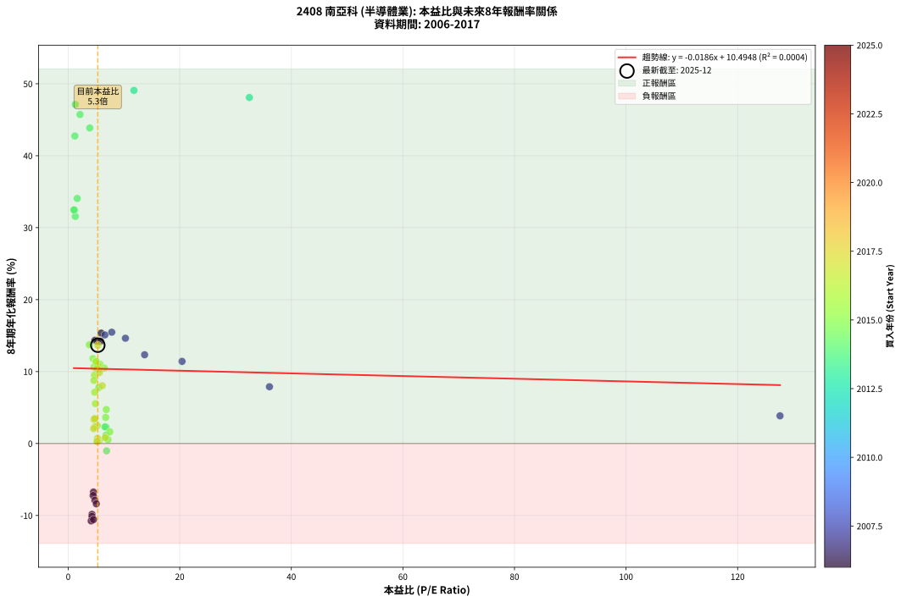
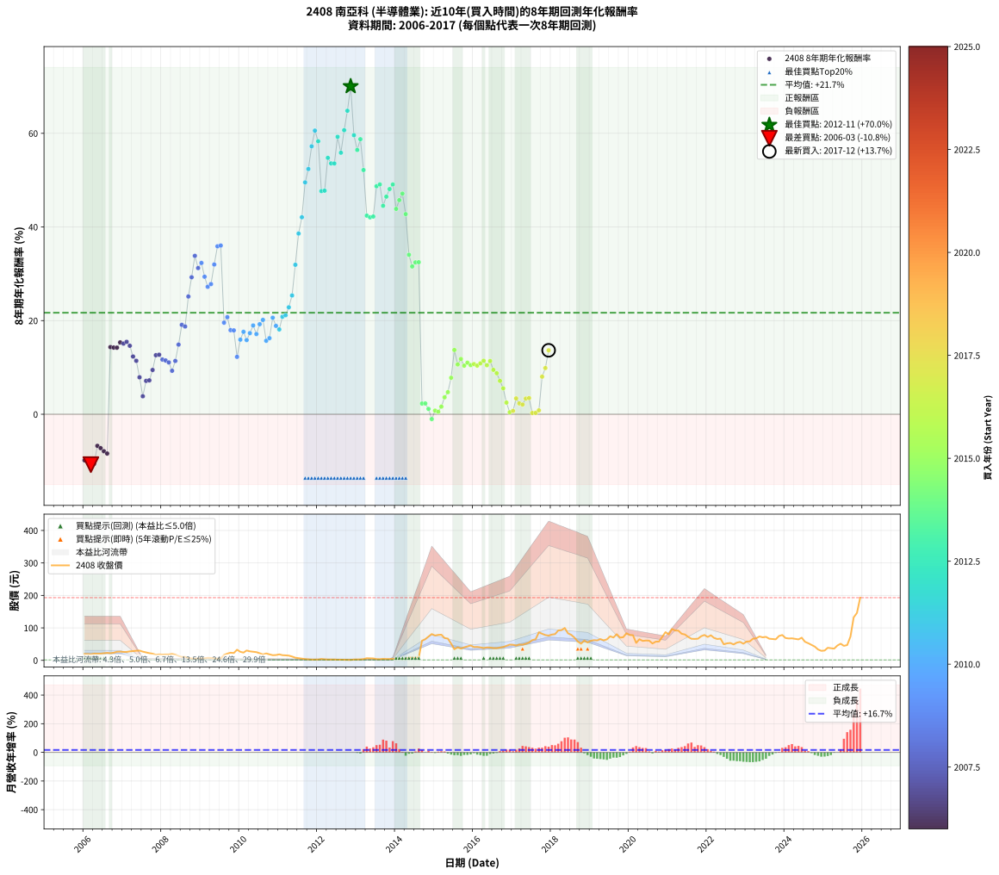

# 2408 南亞科 - 本益比與未來報酬率分析

!!! info "報告資訊"
    - **股票代號**: 2408
    - **公司名稱**: 南亞科
    - **產業別**: 半導體業
    - **分析期間**: 2006-2017 (144 個數據點)
    - **資料來源**: Type 12 (ShowMonthlyK_ChartFlow) 月收盤價與本益比
    - **報酬率口徑**: 含現金股利 (簡化: 年度合計，假設每年7/1入帳)
    - **報告生成時間**: 2026-01-12 20:50:07 CST

## 📈 視覺化圖表

### 圖表1: 本益比 vs 未來報酬率關係

*圖表1：2408 南亞科 本益比與8年期未來報酬率關係 (2006-2017)*

### 圖表2: 歷年買入時點的8年期實際報酬率

*圖表2：2408 南亞科 歷年買入時點的8年期實際報酬率 (2006-2017)*

## 📍 買點訊號說明

本報告提供兩種買點提示訊號（顯示於圖表2的股價子圖中）：

### ▲ 小綠色三角形（回測驗證）
- **計算方式**: 使用全部歷史資料計算本益比第25百分位數
- **用途**: 事後驗證，顯示歷史上哪些時點確實為低估區
- **限制**: 當下無法判斷，僅供回測參考
- **特性**: 後見之明（Look-Ahead Bias）

### ▲ 小橘色三角形（即時訊號）
- **計算方式**: 使用截至當月的過去5年資料計算本益比第25百分位數
- **用途**: 實際投資決策，當時即可判斷
- **優勢**: 可操作性強，符合實務需求
- **特性**: 無後見之明，滾動窗口計算

!!! tip "如何使用兩種訊號"
    - **綠色▲** 幫助理解歷史估值機會，驗證策略有效性
    - **橘色▲** 可作為實際買進參考，但仍需搭配基本面分析
    - 兩種訊號重疊時，表示即時判斷與事後驗證一致，信心度較高
    - 僅有綠色▲時，表示當時無法判斷（需要未來資料才能確認）
    - 僅有橘色▲時，表示即時判斷為買點，但事後可能不是最佳時機

## 📊 估值分析摘要

| 指標 | 數值 |
|:---:|:---:|
| **目前本益比** (2017-12) | **5.31 倍** |
| **歷史平均本益比** | 8.11 倍 |
| **估值水準** | 🟢 相對低估 |
| **預期8年年化報酬率** | **+10.40%** |
| **歷史平均報酬率** | +21.68% |
| **相關係數 (R²)** | 0.0004 |
| **趨勢線斜率** | -0.0186 |

!!! abstract "核心洞察"
    目前本益比顯著低於歷史平均，預期未來報酬率可能較高

    根據歷史數據回測，2408 南亞科 在目前本益比 **5.3倍** 的估值水準下，
    預期未來8年年化報酬率約為 **+10.4%**。

    **重要提醒**: 本分析基於歷史數據統計，實際報酬率會受到公司基本面變化、產業趨勢、
    總體經濟環境等多重因素影響。R² = 0.00 表示本益比可解釋約 0.0% 的報酬率變異。

## 📈 歷史估值統計

### 最佳買點 (最高報酬率)

| 項目 | 數值 |
|:---:|:---:|
| 起始時間 | 2012-11 |
| 當時本益比 | nan 倍 |
| 起始價格 | 1.3 元 |
| 8年後價格 | 72.4 元 |
| **8年年化報酬率** | **+70.03%** |

### 最差買點 (最低報酬率)

| 項目 | 數值 |
|:---:|:---:|
| 起始時間 | 2006-03 |
| 當時本益比 | 4.12 倍 |
| 起始價格 | 18.8 元 |
| 8年後價格 | 4.0 元 |
| **8年年化報酬率** | **-10.76%** |

## 🎯 投資啟示

### 本益比與報酬率關係

趨勢線方程式: **y = -0.0186x + 10.4948**

!!! note "負相關"
    本益比與未來報酬率呈現負相關。較低的本益比通常帶來較高的未來報酬率，
    但相關性不算非常強。**估值仍是重要參考指標之一**。

### 估值區間建議

基於歷史數據分析:

- **🟢 低估區** (P/E < 6.5): 預期報酬率較高，可考慮增加持股
- **🟡 合理區** (P/E 6.5-9.7): 預期報酬率符合長期趨勢，正常持有
- **🔴 高估區** (P/E > 9.7): 預期報酬率較低，可考慮減碼或觀望

!!! danger "風險提示"
    - 過去表現不代表未來結果
    - 本分析假設公司基本面無重大結構性變化
    - 產業環境劇變可能使歷史規律失效
    - 應結合公司財報、產業趨勢、總體經濟等多重因素綜合判斷

!!! success "長期投資觀點"
    歷史數據顯示，在合理或低估的估值水準買入並長期持有，
    往往能獲得較佳的投資報酬。**耐心等待好價格**是價值投資的核心原則。

## 📊 數據品質

- **資料來源**: GoodInfo.tw Type 12 (ShowMonthlyK_ChartFlow)
- **資料頻率**: 月度收盤價與本益比
- **回測期間**: 2006-2017
- **數據點數量**: 144 個 (每個點代表一次8年期回測)

### 計算方法說明

1. **8年期年化報酬率**:
   - 對每個歷史時點，計算其後8年的實際投資報酬率
   - 期末價值(不含股利): 期末價格
   - 期末價值(含現金股利): 期末價格 + 持有期間內的現金股利合計 (簡化: 年度合計，假設每年7/1入帳)
   - 公式: 年化報酬率 = [(期末價值/期初價格)^(1/年數) - 1] × 100%

2. **本益比 (P/E Ratio)**:
   - 使用當時的月收盤價與EPS計算
   - 資料來源: Type 12 月度河流圖本益比數據

3. **趨勢線 (Linear Regression)**:
   - 使用最小平方法擬合線性趨勢線
   - R²值衡量本益比對報酬率的解釋能力

---

*本報告由 Stock Analysis System v1.9.0 自動生成*
*數據更新時間: 2026-01-12 20:50:07 CST*

## 📋 月度回測明細表

（每一列對應時間線圖中的一個買入點；可用來對照 SVG 圖上的每個點。）

| 買入月份 | 賣出月份 | 回測期限_年 | 實際持有年數 | 買入本益比_倍 | 買入收盤價_元 | 賣出收盤價_元 | 現金股利合計_元 | 總報酬率_pct | 年化報酬率_pct |
| --- | --- | --- | --- | --- | --- | --- | --- | --- | --- |
| 2006-01 | 2014-01 | 8 | 8.000 | 4.27 | 19.45 | 5.00 | 3.49 | -56.33 | -9.84 |
| 2006-02 | 2014-02 | 8 | 8.000 | 4.26 | 19.40 | 4.76 | 3.49 | -57.45 | -10.13 |
| 2006-03 | 2014-03 | 8 | 8.000 | 4.12 | 18.75 | 4.05 | 3.49 | -59.77 | -10.76 |
| 2006-04 | 2014-04 | 8 | 8.000 | 4.54 | 20.65 | 4.95 | 3.49 | -59.11 | -10.58 |
| 2006-05 | 2014-05 | 8 | 8.000 | 4.53 | 20.60 | 8.29 | 3.49 | -42.80 | -6.74 |
| 2006-06 | 2014-06 | 8 | 8.000 | 4.48 | 20.40 | 7.70 | 3.49 | -45.13 | -7.23 |
| 2006-07 | 2014-07 | 8 | 8.000 | 4.79 | 21.80 | 8.00 | 3.29 | -48.19 | -7.89 |
| 2006-08 | 2014-08 | 8 | 8.000 | 5.04 | 22.95 | 8.10 | 3.29 | -50.35 | -8.38 |
| 2006-09 | 2014-09 | 8 | 8.000 | 4.79 | 21.80 | 60.40 | 3.29 | +192.18 | +14.34 |
| 2006-10 | 2014-10 | 8 | 8.000 | 5.16 | 23.50 | 64.90 | 3.29 | +190.19 | +14.24 |
| 2006-11 | 2014-11 | 8 | 8.000 | 5.80 | 26.40 | 73.20 | 3.29 | +189.75 | +14.22 |
| 2006-12 | 2014-12 | 8 | 8.000 | 5.91 | 26.90 | 81.00 | 3.29 | +213.36 | +15.35 |
| 2007-01 | 2015-01 | 8 | 8.000 | 6.58 | 25.85 | 76.30 | 3.29 | +207.91 | +15.09 |
| 2007-02 | 2015-02 | 8 | 8.000 | 7.81 | 25.85 | 78.40 | 3.29 | +216.03 | +15.47 |
| 2007-03 | 2015-03 | 8 | 8.000 | 10.26 | 27.60 | 79.00 | 3.29 | +198.17 | +14.63 |
| 2007-04 | 2015-04 | 8 | 8.000 | 13.70 | 28.35 | 68.60 | 3.29 | +153.60 | +12.34 |
| 2007-05 | 2015-05 | 8 | 8.000 | 20.41 | 29.60 | 67.00 | 3.29 | +137.48 | +11.42 |
| 2007-06 | 2015-06 | 8 | 8.000 | 36.08 | 29.95 | 51.70 | 3.29 | +83.62 | +7.89 |
| 2007-07 | 2015-07 | 8 | 8.000 | 127.60 | 26.80 | 34.25 | 2.00 | +35.25 | +3.85 |
| 2007-08 | 2015-08 | 8 | 8.000 |  | 24.30 | 40.15 | 2.00 | +73.45 | +7.13 |
| 2007-09 | 2015-09 | 8 | 8.000 |  | 22.00 | 36.50 | 2.00 | +74.99 | +7.24 |
| 2007-10 | 2015-10 | 8 | 8.000 |  | 20.40 | 40.05 | 2.00 | +106.12 | +9.46 |
| 2007-11 | 2015-11 | 8 | 8.000 |  | 17.30 | 42.75 | 2.00 | +158.66 | +12.61 |
| 2007-12 | 2015-12 | 8 | 8.000 |  | 18.30 | 45.70 | 2.00 | +160.64 | +12.72 |
| 2008-01 | 2016-01 | 8 | 8.000 |  | 17.70 | 40.85 | 2.00 | +142.08 | +11.68 |
| 2008-02 | 2016-02 | 8 | 8.000 |  | 18.10 | 41.20 | 2.00 | +138.66 | +11.49 |
| 2008-03 | 2016-03 | 8 | 8.000 |  | 18.10 | 39.95 | 2.00 | +131.76 | +11.08 |
| 2008-04 | 2016-04 | 8 | 8.000 |  | 19.50 | 37.70 | 2.00 | +103.58 | +9.29 |
| 2008-05 | 2016-05 | 8 | 8.000 |  | 17.60 | 39.70 | 2.00 | +136.92 | +11.38 |
| 2008-06 | 2016-06 | 8 | 8.000 |  | 13.65 | 39.40 | 2.00 | +203.28 | +14.88 |
| 2008-07 | 2016-07 | 8 | 8.000 |  | 10.50 | 37.70 | 4.80 | +304.74 | +19.10 |
| 2008-08 | 2016-08 | 8 | 8.000 |  | 10.70 | 37.50 | 4.80 | +295.31 | +18.75 |
| 2008-09 | 2016-09 | 8 | 8.000 |  | 7.32 | 39.25 | 4.80 | +501.75 | +25.15 |
| 2008-10 | 2016-10 | 8 | 8.000 |  | 5.87 | 40.95 | 4.80 | +679.35 | +29.26 |
| 2008-11 | 2016-11 | 8 | 8.000 |  | 4.79 | 44.50 | 4.80 | +929.19 | +33.83 |
| 2008-12 | 2016-12 | 8 | 8.000 |  | 6.04 | 48.30 | 4.80 | +779.11 | +31.22 |
| 2009-01 | 2017-01 | 8 | 8.000 |  | 5.62 | 48.00 | 4.80 | +839.47 | +32.32 |
| 2009-02 | 2017-02 | 8 | 8.000 |  | 6.41 | 45.50 | 4.80 | +684.68 | +29.37 |
| 2009-03 | 2017-03 | 8 | 8.000 |  | 7.75 | 48.40 | 4.80 | +586.43 | +27.23 |
| 2009-04 | 2017-04 | 8 | 8.000 |  | 7.44 | 48.15 | 4.80 | +611.67 | +27.80 |
| 2009-05 | 2017-05 | 8 | 8.000 |  | 6.05 | 50.90 | 4.80 | +820.63 | +31.98 |
| 2009-06 | 2017-06 | 8 | 8.000 |  | 5.13 | 54.80 | 4.80 | +1061.75 | +35.87 |
| 2009-07 | 2017-07 | 8 | 8.000 |  | 5.86 | 62.40 | 6.30 | +1072.32 | +36.03 |
| 2009-08 | 2017-08 | 8 | 8.000 |  | 17.00 | 64.70 | 6.30 | +317.64 | +19.56 |
| 2009-09 | 2017-09 | 8 | 8.000 |  | 20.50 | 86.30 | 6.30 | +351.70 | +20.74 |
| 2009-10 | 2017-10 | 8 | 8.000 |  | 23.50 | 81.80 | 6.30 | +274.89 | +17.96 |
| 2009-11 | 2017-11 | 8 | 8.000 |  | 22.50 | 77.80 | 6.30 | +273.77 | +17.92 |
| 2009-12 | 2017-12 | 8 | 8.000 |  | 32.70 | 76.20 | 6.30 | +152.29 | +12.26 |
| 2010-01 | 2018-01 | 8 | 8.000 |  | 26.25 | 79.40 | 6.30 | +226.47 | +15.94 |
| 2010-02 | 2018-02 | 8 | 8.000 |  | 23.80 | 80.80 | 6.30 | +265.96 | +17.61 |
| 2010-03 | 2018-03 | 8 | 8.000 |  | 30.30 | 92.00 | 6.30 | +224.42 | +15.85 |
| 2010-04 | 2018-04 | 8 | 8.000 |  | 27.65 | 93.00 | 6.30 | +259.12 | +17.33 |
| 2010-05 | 2018-05 | 8 | 8.000 |  | 26.40 | 99.60 | 6.30 | +301.13 | +18.96 |
| 2010-06 | 2018-06 | 8 | 8.000 |  | 25.25 | 83.20 | 6.30 | +254.45 | +17.14 |
| 2010-07 | 2018-07 | 8 | 8.000 |  | 21.65 | 78.60 | 9.81 | +308.35 | +19.23 |
| 2010-08 | 2018-08 | 8 | 8.000 |  | 18.30 | 69.70 | 9.81 | +334.46 | +20.16 |
| 2010-09 | 2018-09 | 8 | 8.000 |  | 21.15 | 58.10 | 9.81 | +221.07 | +15.70 |
| 2010-10 | 2018-10 | 8 | 8.000 |  | 18.35 | 51.40 | 9.81 | +233.55 | +16.25 |
| 2010-11 | 2018-11 | 8 | 8.000 |  | 15.80 | 61.00 | 9.81 | +348.15 | +20.62 |
| 2010-12 | 2018-12 | 8 | 8.000 |  | 16.25 | 55.00 | 9.81 | +298.81 | +18.88 |
| 2011-01 | 2019-01 | 8 | 8.000 |  | 18.45 | 60.10 | 9.81 | +278.90 | +18.12 |
| 2011-02 | 2019-02 | 8 | 8.000 |  | 15.85 | 62.20 | 9.81 | +354.30 | +20.83 |
| 2011-03 | 2019-03 | 8 | 8.000 |  | 15.35 | 61.40 | 9.81 | +363.89 | +21.14 |
| 2011-04 | 2019-04 | 8 | 8.000 |  | 14.50 | 65.40 | 9.81 | +418.67 | +22.85 |
| 2011-05 | 2019-05 | 8 | 8.000 |  | 11.70 | 61.60 | 9.81 | +510.32 | +25.37 |
| 2011-06 | 2019-06 | 8 | 8.000 |  | 8.10 | 64.50 | 9.81 | +817.37 | +31.92 |
| 2011-07 | 2019-07 | 8 | 8.000 |  | 6.68 | 74.00 | 16.92 | +1261.03 | +38.59 |
| 2011-08 | 2019-08 | 8 | 8.000 |  | 5.26 | 70.40 | 16.92 | +1560.02 | +42.07 |
| 2011-09 | 2019-09 | 8 | 8.000 |  | 3.90 | 80.50 | 16.92 | +2397.87 | +49.52 |
| 2011-10 | 2019-10 | 8 | 8.000 |  | 2.99 | 70.00 | 16.92 | +2806.92 | +52.38 |
| 2011-11 | 2019-11 | 8 | 8.000 |  | 2.36 | 71.20 | 16.92 | +3633.77 | +57.22 |
| 2011-12 | 2019-12 | 8 | 8.000 |  | 2.27 | 83.40 | 16.92 | +4319.25 | +60.57 |
| 2012-01 | 2020-01 | 8 | 8.000 |  | 2.41 | 78.10 | 16.92 | +3842.61 | +58.30 |
| 2012-02 | 2020-02 | 8 | 8.000 |  | 4.17 | 77.30 | 16.92 | +2159.40 | +47.66 |
| 2012-03 | 2020-03 | 8 | 8.000 |  | 3.11 | 53.70 | 16.92 | +2170.64 | +47.75 |
| 2012-04 | 2020-04 | 8 | 8.000 |  | 2.49 | 65.00 | 16.92 | +3189.84 | +54.76 |
| 2012-05 | 2020-05 | 8 | 8.000 |  | 2.48 | 59.80 | 16.92 | +2993.43 | +53.57 |
| 2012-06 | 2020-06 | 8 | 8.000 |  | 2.52 | 61.00 | 16.92 | +2991.94 | +53.56 |
| 2012-07 | 2020-07 | 8 | 8.000 |  | 1.91 | 60.60 | 18.41 | +4036.86 | +59.25 |
| 2012-08 | 2020-08 | 8 | 8.000 |  | 2.02 | 51.90 | 18.41 | +3380.89 | +55.85 |
| 2012-09 | 2020-09 | 8 | 8.000 |  | 1.71 | 57.50 | 18.41 | +4339.42 | +60.66 |
| 2012-10 | 2020-10 | 8 | 8.000 |  | 1.40 | 57.80 | 18.41 | +5343.86 | +64.81 |
| 2012-11 | 2020-11 | 8 | 8.000 |  | 1.30 | 72.40 | 18.41 | +6885.69 | +70.03 |
| 2012-12 | 2020-12 | 8 | 8.000 |  | 2.50 | 86.80 | 18.41 | +4108.56 | +59.59 |
| 2013-01 | 2021-01 | 8 | 8.000 |  | 2.74 | 79.90 | 18.41 | +3488.10 | +56.44 |
| 2013-02 | 2021-02 | 8 | 8.000 |  | 2.85 | 96.50 | 18.41 | +3932.07 | +58.74 |
| 2013-03 | 2021-03 | 8 | 8.000 |  | 3.84 | 91.90 | 18.41 | +2772.76 | +52.16 |
| 2013-04 | 2021-04 | 8 | 8.000 |  | 6.50 | 91.60 | 18.41 | +1592.52 | +42.42 |
| 2013-05 | 2021-05 | 8 | 8.000 |  | 6.05 | 81.90 | 18.41 | +1558.08 | +42.05 |
| 2013-06 | 2021-06 | 8 | 8.000 |  | 5.86 | 79.70 | 18.41 | +1574.30 | +42.23 |
| 2013-07 | 2021-07 | 8 | 8.000 |  | 3.85 | 72.30 | 19.71 | +2289.90 | +48.70 |
| 2013-08 | 2021-08 | 8 | 8.000 |  | 3.53 | 66.40 | 19.71 | +2339.41 | +49.08 |
| 2013-09 | 2021-09 | 8 | 8.000 |  | 4.50 | 65.90 | 19.71 | +1802.47 | +44.52 |
| 2013-10 | 2021-10 | 8 | 8.000 |  | 4.07 | 66.50 | 19.71 | +2018.21 | +46.47 |
| 2013-11 | 2021-11 | 8 | 8.000 | 32.48 | 4.06 | 74.20 | 19.71 | +2213.08 | +48.09 |
| 2013-12 | 2021-12 | 8 | 8.000 | 11.79 | 4.01 | 78.10 | 19.71 | +2339.18 | +49.08 |
| 2014-01 | 2022-01 | 8 | 8.000 | 3.87 | 5.00 | 72.00 | 19.71 | +1734.22 | +43.86 |
| 2014-02 | 2022-02 | 8 | 8.000 | 2.12 | 4.76 | 77.10 | 19.71 | +1933.84 | +45.73 |
| 2014-03 | 2022-03 | 8 | 8.000 | 1.27 | 4.05 | 69.20 | 19.71 | +2095.33 | +47.13 |
| 2014-04 | 2022-04 | 8 | 8.000 | 1.19 | 4.95 | 65.60 | 19.71 | +1623.45 | +42.74 |
| 2014-05 | 2022-05 | 8 | 8.000 | 1.62 | 8.29 | 66.80 | 19.71 | +943.56 | +34.06 |
| 2014-06 | 2022-06 | 8 | 8.000 | 1.27 | 7.70 | 49.40 | 19.71 | +797.55 | +31.56 |
| 2014-07 | 2022-07 | 8 | 8.000 | 1.14 | 8.00 | 52.30 | 23.41 | +846.42 | +32.44 |
| 2014-08 | 2022-08 | 8 | 8.000 | 1.02 | 8.10 | 53.40 | 23.41 | +848.32 | +32.47 |
| 2014-09 | 2022-09 | 8 | 8.000 | 6.78 | 60.40 | 48.95 | 23.41 | +19.81 | +2.28 |
| 2014-10 | 2022-10 | 8 | 8.000 | 6.58 | 64.90 | 54.50 | 23.41 | +20.05 | +2.31 |
| 2014-11 | 2022-11 | 8 | 8.000 | 6.77 | 73.20 | 56.80 | 23.41 | +9.58 | +1.15 |
| 2014-12 | 2022-12 | 8 | 8.000 | 6.88 | 81.00 | 51.20 | 23.41 | -7.88 | -1.02 |
| 2015-01 | 2023-01 | 8 | 8.000 | 6.71 | 76.30 | 57.80 | 23.41 | +6.44 | +0.78 |
| 2015-02 | 2023-02 | 8 | 8.000 | 7.14 | 78.40 | 58.40 | 23.41 | +4.35 | +0.53 |
| 2015-03 | 2023-03 | 8 | 8.000 | 7.46 | 79.00 | 66.50 | 23.41 | +13.82 | +1.63 |
| 2015-04 | 2023-04 | 8 | 8.000 | 6.72 | 68.60 | 67.80 | 23.41 | +32.97 | +3.63 |
| 2015-05 | 2023-05 | 8 | 8.000 | 6.83 | 67.00 | 73.50 | 23.41 | +44.65 | +4.72 |
| 2015-06 | 2023-06 | 8 | 8.000 | 5.49 | 51.70 | 70.80 | 23.41 | +82.23 | +7.79 |
| 2015-07 | 2023-07 | 8 | 8.000 | 3.79 | 34.25 | 72.30 | 23.55 | +179.84 | +13.73 |
| 2015-08 | 2023-08 | 8 | 8.000 | 4.65 | 40.15 | 66.60 | 23.55 | +124.52 | +10.64 |
| 2015-09 | 2023-09 | 8 | 8.000 | 4.43 | 36.50 | 65.60 | 23.55 | +144.24 | +11.81 |
| 2015-10 | 2023-10 | 8 | 8.000 | 5.10 | 40.05 | 64.70 | 23.55 | +120.34 | +10.38 |
| 2015-11 | 2023-11 | 8 | 8.000 | 5.73 | 42.75 | 75.00 | 23.55 | +130.52 | +11.00 |
| 2015-12 | 2023-12 | 8 | 8.000 | 6.46 | 45.70 | 78.00 | 23.55 | +122.20 | +10.50 |
| 2016-01 | 2024-01 | 8 | 8.000 | 5.67 | 40.85 | 68.70 | 23.55 | +125.82 | +10.72 |
| 2016-02 | 2024-02 | 8 | 8.000 | 5.62 | 41.20 | 67.30 | 23.55 | +120.50 | +10.39 |
| 2016-03 | 2024-03 | 8 | 8.000 | 5.35 | 39.95 | 67.70 | 23.55 | +128.40 | +10.88 |
| 2016-04 | 2024-04 | 8 | 8.000 | 4.96 | 37.70 | 66.10 | 23.55 | +137.79 | +11.44 |
| 2016-05 | 2024-05 | 8 | 8.000 | 5.13 | 39.70 | 64.50 | 23.55 | +121.78 | +10.47 |
| 2016-06 | 2024-06 | 8 | 8.000 | 5.01 | 39.40 | 69.70 | 23.55 | +136.66 | +11.37 |
| 2016-07 | 2024-07 | 8 | 8.000 | 4.71 | 37.70 | 57.10 | 20.75 | +106.49 | +9.49 |
| 2016-08 | 2024-08 | 8 | 8.000 | 4.61 | 37.50 | 52.70 | 20.75 | +95.86 | +8.77 |
| 2016-09 | 2024-09 | 8 | 8.000 | 4.75 | 39.25 | 47.35 | 20.75 | +73.49 | +7.13 |
| 2016-10 | 2024-10 | 8 | 8.000 | 4.87 | 40.95 | 42.30 | 20.75 | +53.96 | +5.54 |
| 2016-11 | 2024-11 | 8 | 8.000 | 5.21 | 44.50 | 33.45 | 20.75 | +21.79 | +2.49 |
| 2016-12 | 2024-12 | 8 | 8.000 | 5.57 | 48.30 | 29.25 | 20.75 | +3.51 | +0.43 |
| 2017-01 | 2025-01 | 8 | 8.000 | 5.25 | 48.00 | 30.10 | 20.75 | +5.93 | +0.72 |
| 2017-02 | 2025-02 | 8 | 8.000 | 4.73 | 45.50 | 38.65 | 20.75 | +30.54 | +3.39 |
| 2017-03 | 2025-03 | 8 | 8.000 | 4.80 | 48.40 | 37.40 | 20.75 | +20.14 | +2.32 |
| 2017-04 | 2025-04 | 8 | 8.000 | 4.56 | 48.15 | 36.00 | 20.75 | +17.85 | +2.07 |
| 2017-05 | 2025-05 | 8 | 8.000 | 4.61 | 50.90 | 45.55 | 20.75 | +30.25 | +3.36 |
| 2017-06 | 2025-06 | 8 | 8.000 | 4.76 | 54.80 | 51.20 | 20.75 | +31.29 | +3.46 |
| 2017-07 | 2025-07 | 8 | 8.000 | 5.20 | 62.40 | 44.55 | 19.25 | +2.24 | +0.28 |
| 2017-08 | 2025-08 | 8 | 8.000 | 5.19 | 64.70 | 47.00 | 19.25 | +2.39 | +0.30 |
| 2017-09 | 2025-09 | 8 | 8.000 | 6.67 | 86.30 | 73.00 | 19.25 | +6.89 | +0.84 |
| 2017-10 | 2025-10 | 8 | 8.000 | 6.10 | 81.80 | 132.50 | 19.25 | +85.51 | +8.03 |
| 2017-11 | 2025-11 | 8 | 8.000 | 5.60 | 77.80 | 146.00 | 19.25 | +112.40 | +9.87 |
| 2017-12 | 2025-12 | 8 | 8.000 | 5.31 | 76.20 | 193.00 | 19.25 | +178.54 | +13.66 |
