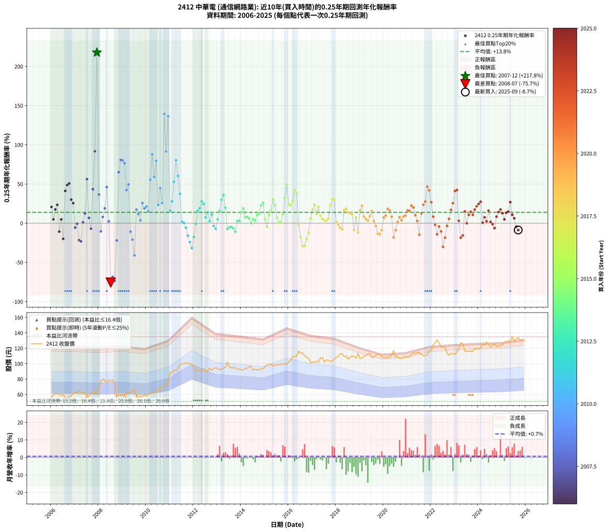

# 2412 中華電 - 本益比與未來報酬率分析

!!! info "報告資訊"
    - **股票代號**: 2412
    - **公司名稱**: 中華電
    - **產業別**: 通信網路業
    - **分析期間**: 2006-2025 (237 個數據點)
    - **資料來源**: Type 12 (ShowMonthlyK_ChartFlow) 月收盤價與本益比
    - **報酬率口徑**: 含現金股利 (簡化: 年度合計，假設每年7/1入帳)
    - **報告生成時間**: 2026-01-11 20:47:04 CST

## 📈 視覺化圖表

### 圖表1: 本益比 vs 未來報酬率關係

*圖表1：2412 中華電 本益比與0.25年期未來報酬率關係 (2006-2025)*

### 圖表2: 歷年買入時點的0.25年期實際報酬率

*圖表2：2412 中華電 歷年買入時點的0.25年期實際報酬率 (2006-2025)*

## 📍 買點訊號說明

本報告提供兩種買點提示訊號（顯示於圖表2的股價子圖中）：

### ▲ 小綠色三角形（回測驗證）
- **計算方式**: 使用全部歷史資料計算本益比第25百分位數
- **用途**: 事後驗證，顯示歷史上哪些時點確實為低估區
- **限制**: 當下無法判斷，僅供回測參考
- **特性**: 後見之明（Look-Ahead Bias）

### ▲ 小橘色三角形（即時訊號）
- **計算方式**: 使用截至當月的過去5年資料計算本益比第25百分位數
- **用途**: 實際投資決策，當時即可判斷
- **優勢**: 可操作性強，符合實務需求
- **特性**: 無後見之明，滾動窗口計算

!!! tip "如何使用兩種訊號"
    - **綠色▲** 幫助理解歷史估值機會，驗證策略有效性
    - **橘色▲** 可作為實際買進參考，但仍需搭配基本面分析
    - 兩種訊號重疊時，表示即時判斷與事後驗證一致，信心度較高
    - 僅有綠色▲時，表示當時無法判斷（需要未來資料才能確認）
    - 僅有橘色▲時，表示即時判斷為買點，但事後可能不是最佳時機

## 📊 估值分析摘要

| 指標 | 數值 |
|:---:|:---:|
| **目前本益比** (2025-09) | **27.18 倍** |
| **歷史平均本益比** | 19.96 倍 |
| **估值水準** | 🔴 相對高估 |
| **預期0.25年年化報酬率** | **+0.99%** |
| **歷史平均報酬率** | +13.84% |
| **相關係數 (R²)** | 0.0818 |
| **趨勢線斜率** | -1.7786 |

!!! abstract "核心洞察"
    目前本益比顯著高於歷史平均，預期未來報酬率可能較低

    根據歷史數據回測，2412 中華電 在目前本益比 **27.2倍** 的估值水準下，
    預期未來0.25年年化報酬率約為 **+1.0%**。

    **重要提醒**: 本分析基於歷史數據統計，實際報酬率會受到公司基本面變化、產業趨勢、
    總體經濟環境等多重因素影響。R² = 0.08 表示本益比可解釋約 8.2% 的報酬率變異。

## 📈 歷史估值統計

### 最佳買點 (最高報酬率)

| 項目 | 數值 |
|:---:|:---:|
| 起始時間 | 2007-12 |
| 當時本益比 | 13.14 倍 |
| 起始價格 | 59.9 元 |
| 0.25年後價格 | 79.9 元 |
| **0.25年年化報酬率** | **+217.83%** |

### 最差買點 (最低報酬率)

| 項目 | 數值 |
|:---:|:---:|
| 起始時間 | 2008-07 |
| 當時本益比 | 16.87 倍 |
| 起始價格 | 77.7 元 |
| 0.25年後價格 | 54.4 元 |
| **0.25年年化報酬率** | **-75.71%** |

## 🎯 投資啟示

### 本益比與報酬率關係

趨勢線方程式: **y = -1.7786x + 49.3326**

!!! warning "強負相關"
    本益比與未來報酬率呈現強負相關。在高本益比時期買入，未來報酬率顯著較低；
    在低本益比時期買入，未來報酬率顯著較高。**估值紀律至關重要**。

### 估值區間建議

基於歷史數據分析:

- **🟢 低估區** (P/E < 16.0): 預期報酬率較高，可考慮增加持股
- **🟡 合理區** (P/E 16.0-23.9): 預期報酬率符合長期趨勢，正常持有
- **🔴 高估區** (P/E > 23.9): 預期報酬率較低，可考慮減碼或觀望

!!! danger "風險提示"
    - 過去表現不代表未來結果
    - 本分析假設公司基本面無重大結構性變化
    - 產業環境劇變可能使歷史規律失效
    - 應結合公司財報、產業趨勢、總體經濟等多重因素綜合判斷

!!! success "長期投資觀點"
    歷史數據顯示，在合理或低估的估值水準買入並長期持有，
    往往能獲得較佳的投資報酬。**耐心等待好價格**是價值投資的核心原則。

## 📊 數據品質

- **資料來源**: GoodInfo.tw Type 12 (ShowMonthlyK_ChartFlow)
- **資料頻率**: 月度收盤價與本益比
- **回測期間**: 2006-2025
- **數據點數量**: 237 個 (每個點代表一次0.25年期回測)

### 計算方法說明

1. **0.25年期年化報酬率**:
   - 對每個歷史時點，計算其後0.25年的實際投資報酬率
   - 期末價值(不含股利): 期末價格
   - 期末價值(含現金股利): 期末價格 + 持有期間內的現金股利合計 (簡化: 年度合計，假設每年7/1入帳)
   - 公式: 年化報酬率 = [(期末價值/期初價格)^(1/年數) - 1] × 100%

2. **本益比 (P/E Ratio)**:
   - 使用當時的月收盤價與EPS計算
   - 資料來源: Type 12 月度河流圖本益比數據

3. **趨勢線 (Linear Regression)**:
   - 使用最小平方法擬合線性趨勢線
   - R²值衡量本益比對報酬率的解釋能力

---

*本報告由 Stock Analysis System v1.9.0 自動生成*
*數據更新時間: 2026-01-11 20:47:04 CST*

## 📋 月度回測明細表

（每一列對應時間線圖中的一個買入點；可用來對照 SVG 圖上的每個點。）

| 買入月份 | 賣出月份 | 回測期限_年 | 實際持有年數 | 買入本益比_倍 | 買入收盤價_元 | 賣出收盤價_元 | 現金股利合計_元 | 總報酬率_pct | 年化報酬率_pct |
| --- | --- | --- | --- | --- | --- | --- | --- | --- | --- |
| 2006-01 | 2006-05 | 0.25 | 0.329 | 12.18 | 56.40 | 60.00 | 0.00 | +6.38 | +20.72 |
| 2006-02 | 2006-05 | 0.25 | 0.246 | 12.81 | 59.30 | 60.00 | 0.00 | +1.18 | +4.88 |
| 2006-03 | 2006-07 | 0.25 | 0.334 | 13.22 | 61.20 | 60.30 | 4.30 | +5.56 | +17.57 |
| 2006-04 | 2006-07 | 0.25 | 0.249 | 13.24 | 61.30 | 60.30 | 4.30 | +5.38 | +23.42 |
| 2006-05 | 2006-08 | 0.25 | 0.252 | 12.96 | 60.00 | 54.00 | 4.30 | -2.83 | -10.78 |
| 2006-06 | 2006-09 | 0.25 | 0.252 | 12.63 | 58.50 | 54.90 | 4.30 | +1.20 | +4.84 |
| 2006-07 | 2006-10 | 0.25 | 0.252 | 13.02 | 60.30 | 57.00 | 0.00 | -5.47 | -20.02 |
| 2006-08 | 2006-12 | 0.25 | 0.334 | 11.66 | 54.00 | 60.60 | 0.00 | +12.22 | +41.23 |
| 2006-09 | 2006-12 | 0.25 | 0.249 | 11.86 | 54.90 | 60.60 | 0.00 | +10.38 | +48.66 |
| 2006-10 | 2007-01 | 0.25 | 0.252 | 12.31 | 57.00 | 63.20 | 0.00 | +10.88 | +50.67 |
| 2006-11 | 2007-03 | 0.25 | 0.329 | 12.70 | 58.80 | 64.10 | 0.00 | +9.01 | +30.04 |
| 2006-12 | 2007-03 | 0.25 | 0.246 | 13.09 | 60.60 | 64.10 | 0.00 | +5.78 | +25.59 |
| 2007-01 | 2007-05 | 0.25 | 0.329 | 13.67 | 63.20 | 62.00 | 0.00 | -1.90 | -5.67 |
| 2007-02 | 2007-05 | 0.25 | 0.246 | 13.45 | 62.10 | 62.00 | 0.00 | -0.16 | -0.65 |
| 2007-03 | 2007-07 | 0.25 | 0.334 | 13.90 | 64.10 | 55.50 | 3.58 | -7.83 | -21.66 |
| 2007-04 | 2007-07 | 0.25 | 0.249 | 13.70 | 63.10 | 55.50 | 3.58 | -6.37 | -23.22 |
| 2007-05 | 2007-08 | 0.25 | 0.252 | 13.48 | 62.00 | 58.60 | 3.58 | +0.29 | +1.16 |
| 2007-06 | 2007-09 | 0.25 | 0.252 | 13.65 | 62.70 | 61.00 | 3.58 | +3.00 | +12.44 |
| 2007-07 | 2007-10 | 0.25 | 0.252 | 12.09 | 55.50 | 62.10 | 0.00 | +11.89 | +56.22 |
| 2007-08 | 2007-12 | 0.25 | 0.334 | 12.79 | 58.60 | 59.90 | 0.00 | +2.22 | +6.79 |
| 2007-09 | 2007-12 | 0.25 | 0.249 | 13.33 | 61.00 | 59.90 | 0.00 | -1.80 | -7.04 |
| 2007-10 | 2008-01 | 0.25 | 0.252 | 13.58 | 62.10 | 68.00 | 0.00 | +9.50 | +43.38 |
| 2007-11 | 2008-03 | 0.25 | 0.331 | 14.10 | 64.40 | 79.90 | 0.00 | +24.07 | +91.75 |
| 2007-12 | 2008-03 | 0.25 | 0.249 | 13.14 | 59.90 | 79.90 | 0.00 | +33.39 | +217.83 |
| 2008-01 | 2008-05 | 0.25 | 0.331 | 14.89 | 68.00 | 75.40 | 0.00 | +10.88 | +36.59 |
| 2008-02 | 2008-05 | 0.25 | 0.249 | 16.95 | 77.50 | 75.40 | 0.00 | -2.71 | -10.44 |
| 2008-03 | 2008-07 | 0.25 | 0.334 | 17.45 | 79.90 | 77.70 | 4.26 | +2.58 | +7.92 |
| 2008-04 | 2008-07 | 0.25 | 0.249 | 17.11 | 78.50 | 77.70 | 4.26 | +4.41 | +18.90 |
| 2008-05 | 2008-08 | 0.25 | 0.252 | 16.42 | 75.40 | 78.70 | 4.26 | +10.03 | +46.13 |
| 2008-06 | 2008-09 | 0.25 | 0.252 | 17.07 | 78.50 | 74.70 | 4.26 | +0.59 | +2.35 |
| 2008-07 | 2008-10 | 0.25 | 0.252 | 16.87 | 77.70 | 54.40 | 0.00 | -29.99 | -75.71 |
| 2008-08 | 2008-12 | 0.25 | 0.334 | 17.06 | 78.70 | 53.50 | 0.00 | -32.02 | -68.51 |
| 2008-09 | 2008-12 | 0.25 | 0.249 | 16.17 | 74.70 | 53.50 | 0.00 | -28.38 | -73.81 |
| 2008-10 | 2009-01 | 0.25 | 0.252 | 11.76 | 54.40 | 51.10 | 0.00 | -6.07 | -22.00 |
| 2008-11 | 2009-03 | 0.25 | 0.329 | 11.33 | 52.50 | 61.90 | 0.00 | +17.90 | +65.09 |
| 2008-12 | 2009-03 | 0.25 | 0.246 | 11.53 | 53.50 | 61.90 | 0.00 | +15.70 | +80.73 |
| 2009-01 | 2009-05 | 0.25 | 0.329 | 11.04 | 51.10 | 62.00 | 0.00 | +21.33 | +80.13 |
| 2009-02 | 2009-05 | 0.25 | 0.246 | 11.67 | 53.90 | 62.00 | 0.00 | +15.03 | +76.51 |
| 2009-03 | 2009-07 | 0.25 | 0.334 | 13.43 | 61.90 | 65.80 | 3.83 | +12.49 | +42.23 |
| 2009-04 | 2009-07 | 0.25 | 0.249 | 13.71 | 63.00 | 65.80 | 3.83 | +10.52 | +49.42 |
| 2009-05 | 2009-08 | 0.25 | 0.252 | 13.52 | 62.00 | 56.40 | 3.83 | -2.85 | -10.86 |
| 2009-06 | 2009-09 | 0.25 | 0.252 | 14.32 | 65.50 | 57.90 | 3.83 | -5.76 | -20.97 |
| 2009-07 | 2009-10 | 0.25 | 0.252 | 14.42 | 65.80 | 57.60 | 0.00 | -12.46 | -41.05 |
| 2009-08 | 2009-12 | 0.25 | 0.334 | 12.39 | 56.40 | 59.50 | 0.00 | +5.50 | +17.37 |
| 2009-09 | 2009-12 | 0.25 | 0.249 | 12.75 | 57.90 | 59.50 | 0.00 | +2.76 | +11.56 |
| 2009-10 | 2010-01 | 0.25 | 0.252 | 12.71 | 57.60 | 58.10 | 0.00 | +0.87 | +3.49 |
| 2009-11 | 2010-03 | 0.25 | 0.329 | 12.74 | 57.60 | 62.10 | 0.00 | +7.81 | +25.73 |
| 2009-12 | 2010-03 | 0.25 | 0.246 | 13.19 | 59.50 | 62.10 | 0.00 | +4.37 | +18.95 |
| 2010-01 | 2010-05 | 0.25 | 0.329 | 12.79 | 58.10 | 61.90 | 0.00 | +6.54 | +21.27 |
| 2010-02 | 2010-05 | 0.25 | 0.246 | 13.07 | 59.80 | 61.90 | 0.00 | +3.51 | +15.04 |
| 2010-03 | 2010-07 | 0.25 | 0.334 | 13.47 | 62.10 | 67.90 | 4.06 | +15.88 | +55.46 |
| 2010-04 | 2010-07 | 0.25 | 0.249 | 13.24 | 61.50 | 67.90 | 4.06 | +17.01 | +87.85 |
| 2010-05 | 2010-08 | 0.25 | 0.252 | 13.24 | 61.90 | 65.50 | 4.06 | +12.37 | +58.91 |
| 2010-06 | 2010-09 | 0.25 | 0.252 | 13.57 | 63.90 | 70.00 | 4.06 | +15.90 | +79.65 |
| 2010-07 | 2010-10 | 0.25 | 0.252 | 14.31 | 67.90 | 71.60 | 0.00 | +5.45 | +23.45 |
| 2010-08 | 2010-12 | 0.25 | 0.334 | 13.71 | 65.50 | 74.10 | 0.00 | +13.13 | +44.68 |
| 2010-09 | 2010-12 | 0.25 | 0.249 | 14.55 | 70.00 | 74.10 | 0.00 | +5.86 | +25.67 |
| 2010-10 | 2011-01 | 0.25 | 0.252 | 14.78 | 71.60 | 89.20 | 0.00 | +24.58 | +139.31 |
| 2010-11 | 2011-03 | 0.25 | 0.329 | 15.17 | 74.00 | 91.60 | 0.00 | +23.78 | +91.45 |
| 2010-12 | 2011-03 | 0.25 | 0.246 | 15.09 | 74.10 | 91.60 | 0.00 | +23.62 | +136.42 |
| 2011-01 | 2011-05 | 0.25 | 0.329 | 17.83 | 89.20 | 93.60 | 0.00 | +4.93 | +15.78 |
| 2011-02 | 2011-05 | 0.25 | 0.246 | 17.28 | 88.10 | 93.60 | 0.00 | +6.24 | +27.86 |
| 2011-03 | 2011-07 | 0.25 | 0.334 | 17.64 | 91.60 | 100.00 | 5.52 | +15.20 | +52.75 |
| 2011-04 | 2011-07 | 0.25 | 0.249 | 17.23 | 91.10 | 100.00 | 5.52 | +15.83 | +80.39 |
| 2011-05 | 2011-08 | 0.25 | 0.252 | 17.40 | 93.60 | 99.90 | 5.52 | +12.63 | +60.37 |
| 2011-06 | 2011-09 | 0.25 | 0.252 | 18.05 | 98.80 | 101.50 | 5.52 | +8.32 | +37.36 |
| 2011-07 | 2011-10 | 0.25 | 0.252 | 17.96 | 100.00 | 100.50 | 0.00 | +0.50 | +2.00 |
| 2011-08 | 2011-12 | 0.25 | 0.334 | 17.64 | 99.90 | 100.00 | 0.00 | +0.10 | +0.30 |
| 2011-09 | 2011-12 | 0.25 | 0.249 | 17.63 | 101.50 | 100.00 | 0.00 | -1.48 | -5.80 |
| 2011-10 | 2012-01 | 0.25 | 0.252 | 17.17 | 100.50 | 96.20 | 0.00 | -4.28 | -15.94 |
| 2011-11 | 2012-03 | 0.25 | 0.331 | 16.75 | 99.60 | 90.90 | 0.00 | -8.73 | -24.11 |
| 2011-12 | 2012-03 | 0.25 | 0.249 | 16.56 | 100.00 | 90.90 | 0.00 | -9.10 | -31.82 |
| 2012-01 | 2012-05 | 0.25 | 0.331 | 16.10 | 96.20 | 90.20 | 0.00 | -6.24 | -17.67 |
| 2012-02 | 2012-05 | 0.25 | 0.249 | 15.30 | 90.40 | 90.20 | 0.00 | -0.22 | -0.89 |
| 2012-03 | 2012-07 | 0.25 | 0.334 | 15.56 | 90.90 | 90.00 | 5.46 | +5.02 | +15.79 |
| 2012-04 | 2012-07 | 0.25 | 0.249 | 15.82 | 91.40 | 90.00 | 5.46 | +4.44 | +19.06 |
| 2012-05 | 2012-08 | 0.25 | 0.252 | 15.79 | 90.20 | 90.50 | 5.46 | +6.39 | +27.86 |
| 2012-06 | 2012-09 | 0.25 | 0.252 | 16.65 | 94.00 | 93.90 | 5.46 | +5.70 | +24.63 |
| 2012-07 | 2012-10 | 0.25 | 0.252 | 16.13 | 90.00 | 91.60 | 0.00 | +1.78 | +7.25 |
| 2012-08 | 2012-12 | 0.25 | 0.334 | 16.41 | 90.50 | 94.50 | 0.00 | +4.42 | +13.82 |
| 2012-09 | 2012-12 | 0.25 | 0.249 | 17.23 | 93.90 | 94.50 | 0.00 | +0.64 | +2.59 |
| 2012-10 | 2013-01 | 0.25 | 0.252 | 17.01 | 91.60 | 94.00 | 0.00 | +2.62 | +10.81 |
| 2012-11 | 2013-03 | 0.25 | 0.329 | 17.66 | 93.90 | 92.80 | 0.00 | -1.17 | -3.52 |
| 2012-12 | 2013-03 | 0.25 | 0.246 | 17.99 | 94.50 | 92.80 | 0.00 | -1.80 | -7.10 |
| 2013-01 | 2013-05 | 0.25 | 0.329 | 17.93 | 94.00 | 95.50 | 0.00 | +1.60 | +4.94 |
| 2013-02 | 2013-05 | 0.25 | 0.246 | 17.63 | 92.20 | 95.50 | 0.00 | +3.58 | +15.34 |
| 2013-03 | 2013-07 | 0.25 | 0.334 | 17.78 | 92.80 | 95.90 | 5.35 | +9.11 | +29.81 |
| 2013-04 | 2013-07 | 0.25 | 0.249 | 18.01 | 93.80 | 95.90 | 5.35 | +7.94 | +35.90 |
| 2013-05 | 2013-08 | 0.25 | 0.252 | 18.37 | 95.50 | 94.60 | 5.35 | +4.66 | +19.82 |
| 2013-06 | 2013-09 | 0.25 | 0.252 | 19.67 | 102.00 | 94.70 | 5.35 | -1.91 | -7.38 |
| 2013-07 | 2013-10 | 0.25 | 0.252 | 18.53 | 95.90 | 94.60 | 0.00 | -1.36 | -5.27 |
| 2013-08 | 2013-12 | 0.25 | 0.334 | 18.32 | 94.60 | 93.10 | 0.00 | -1.59 | -4.67 |
| 2013-09 | 2013-12 | 0.25 | 0.249 | 18.38 | 94.70 | 93.10 | 0.00 | -1.69 | -6.61 |
| 2013-10 | 2014-01 | 0.25 | 0.252 | 18.40 | 94.60 | 91.90 | 0.00 | -2.85 | -10.86 |
| 2013-11 | 2014-03 | 0.25 | 0.329 | 18.09 | 92.80 | 93.70 | 0.00 | +0.97 | +2.98 |
| 2013-12 | 2014-03 | 0.25 | 0.246 | 18.18 | 93.10 | 93.70 | 0.00 | +0.64 | +2.64 |
| 2014-01 | 2014-05 | 0.25 | 0.329 | 17.99 | 91.90 | 96.00 | 0.00 | +4.46 | +14.21 |
| 2014-02 | 2014-05 | 0.25 | 0.246 | 18.05 | 92.00 | 96.00 | 0.00 | +4.35 | +18.85 |
| 2014-03 | 2014-07 | 0.25 | 0.334 | 18.43 | 93.70 | 91.50 | 4.53 | +2.48 | +7.61 |
| 2014-04 | 2014-07 | 0.25 | 0.249 | 18.57 | 94.20 | 91.50 | 4.53 | +1.94 | +8.01 |
| 2014-05 | 2014-08 | 0.25 | 0.252 | 18.97 | 96.00 | 92.90 | 4.53 | +1.48 | +6.02 |
| 2014-06 | 2014-09 | 0.25 | 0.252 | 19.05 | 96.20 | 91.70 | 4.53 | +0.03 | +0.10 |
| 2014-07 | 2014-10 | 0.25 | 0.252 | 18.16 | 91.50 | 92.70 | 0.00 | +1.31 | +5.31 |
| 2014-08 | 2014-12 | 0.25 | 0.334 | 18.48 | 92.90 | 94.00 | 0.00 | +1.18 | +3.59 |
| 2014-09 | 2014-12 | 0.25 | 0.249 | 18.29 | 91.70 | 94.00 | 0.00 | +2.51 | +10.45 |
| 2014-10 | 2015-01 | 0.25 | 0.252 | 18.53 | 92.70 | 95.50 | 0.00 | +3.02 | +12.54 |
| 2014-11 | 2015-03 | 0.25 | 0.329 | 18.63 | 93.00 | 99.50 | 0.00 | +6.99 | +22.83 |
| 2014-12 | 2015-03 | 0.25 | 0.246 | 18.88 | 94.00 | 99.50 | 0.00 | +5.85 | +25.96 |
| 2015-01 | 2015-05 | 0.25 | 0.329 | 19.00 | 95.50 | 97.00 | 0.00 | +1.57 | +4.86 |
| 2015-02 | 2015-05 | 0.25 | 0.246 | 19.37 | 98.20 | 97.00 | 0.00 | -1.22 | -4.87 |
| 2015-03 | 2015-07 | 0.25 | 0.334 | 19.45 | 99.50 | 98.00 | 4.86 | +3.37 | +10.44 |
| 2015-04 | 2015-07 | 0.25 | 0.249 | 19.19 | 99.00 | 98.00 | 4.86 | +3.89 | +16.58 |
| 2015-05 | 2015-08 | 0.25 | 0.252 | 18.64 | 97.00 | 98.80 | 4.86 | +6.86 | +30.15 |
| 2015-06 | 2015-09 | 0.25 | 0.252 | 18.74 | 98.40 | 98.80 | 4.86 | +5.34 | +22.95 |
| 2015-07 | 2015-10 | 0.25 | 0.252 | 18.51 | 98.00 | 99.70 | 0.00 | +1.73 | +7.07 |
| 2015-08 | 2015-12 | 0.25 | 0.334 | 18.50 | 98.80 | 99.10 | 0.00 | +0.30 | +0.91 |
| 2015-09 | 2015-12 | 0.25 | 0.249 | 18.35 | 98.80 | 99.10 | 0.00 | +0.30 | +1.22 |
| 2015-10 | 2016-01 | 0.25 | 0.252 | 18.36 | 99.70 | 102.50 | 0.00 | +2.81 | +11.62 |
| 2015-11 | 2016-03 | 0.25 | 0.331 | 18.23 | 99.80 | 109.50 | 0.00 | +9.72 | +32.31 |
| 2015-12 | 2016-03 | 0.25 | 0.249 | 17.95 | 99.10 | 109.50 | 0.00 | +10.49 | +49.26 |
| 2016-01 | 2016-05 | 0.25 | 0.331 | 18.67 | 102.50 | 110.00 | 0.00 | +7.32 | +23.76 |
| 2016-02 | 2016-05 | 0.25 | 0.249 | 19.14 | 104.50 | 110.00 | 0.00 | +5.26 | +22.86 |
| 2016-03 | 2016-07 | 0.25 | 0.334 | 20.17 | 109.50 | 113.50 | 5.49 | +8.66 | +28.24 |
| 2016-04 | 2016-07 | 0.25 | 0.249 | 20.19 | 109.00 | 113.50 | 5.49 | +9.16 | +42.16 |
| 2016-05 | 2016-08 | 0.25 | 0.252 | 20.48 | 110.00 | 114.00 | 5.49 | +8.62 | +38.87 |
| 2016-06 | 2016-09 | 0.25 | 0.252 | 21.82 | 116.50 | 110.50 | 5.49 | -0.44 | -1.74 |
| 2016-07 | 2016-10 | 0.25 | 0.252 | 21.37 | 113.50 | 108.00 | 0.00 | -4.85 | -17.90 |
| 2016-08 | 2016-12 | 0.25 | 0.334 | 21.59 | 114.00 | 101.50 | 0.00 | -10.96 | -29.37 |
| 2016-09 | 2016-12 | 0.25 | 0.249 | 21.05 | 110.50 | 101.50 | 0.00 | -8.14 | -28.89 |
| 2016-10 | 2017-01 | 0.25 | 0.252 | 20.69 | 108.00 | 102.00 | 0.00 | -5.56 | -20.30 |
| 2016-11 | 2017-03 | 0.25 | 0.329 | 20.71 | 107.50 | 103.00 | 0.00 | -4.19 | -12.20 |
| 2016-12 | 2017-03 | 0.25 | 0.246 | 19.67 | 101.50 | 103.00 | 0.00 | +1.48 | +6.13 |
| 2017-01 | 2017-05 | 0.25 | 0.329 | 19.82 | 102.00 | 107.50 | 0.00 | +5.39 | +17.33 |
| 2017-02 | 2017-05 | 0.25 | 0.246 | 19.86 | 102.00 | 107.50 | 0.00 | +5.39 | +23.76 |
| 2017-03 | 2017-07 | 0.25 | 0.334 | 20.11 | 103.00 | 102.00 | 4.94 | +3.83 | +11.90 |
| 2017-04 | 2017-07 | 0.25 | 0.249 | 19.96 | 102.00 | 102.00 | 4.94 | +4.85 | +20.91 |
| 2017-05 | 2017-08 | 0.25 | 0.252 | 21.09 | 107.50 | 105.00 | 4.94 | +2.27 | +9.33 |
| 2017-06 | 2017-09 | 0.25 | 0.252 | 21.24 | 108.00 | 104.50 | 4.94 | +1.34 | +5.41 |
| 2017-07 | 2017-10 | 0.25 | 0.252 | 20.11 | 102.00 | 103.00 | 0.00 | +0.98 | +3.95 |
| 2017-08 | 2017-12 | 0.25 | 0.334 | 20.75 | 105.00 | 106.00 | 0.00 | +0.95 | +2.88 |
| 2017-09 | 2017-12 | 0.25 | 0.249 | 20.70 | 104.50 | 106.00 | 0.00 | +1.44 | +5.89 |
| 2017-10 | 2018-01 | 0.25 | 0.252 | 20.46 | 103.00 | 108.50 | 0.00 | +5.34 | +22.94 |
| 2017-11 | 2018-03 | 0.25 | 0.329 | 20.61 | 103.50 | 113.00 | 0.00 | +9.18 | +30.64 |
| 2017-12 | 2018-03 | 0.25 | 0.246 | 21.16 | 106.00 | 113.00 | 0.00 | +6.60 | +29.63 |
| 2018-01 | 2018-05 | 0.25 | 0.329 | 21.81 | 108.50 | 109.00 | 0.00 | +0.46 | +1.41 |
| 2018-02 | 2018-05 | 0.25 | 0.246 | 22.17 | 109.50 | 109.00 | 0.00 | -0.46 | -1.84 |
| 2018-03 | 2018-07 | 0.25 | 0.334 | 23.05 | 113.00 | 106.00 | 4.80 | -1.95 | -5.73 |
| 2018-04 | 2018-07 | 0.25 | 0.249 | 23.22 | 113.00 | 106.00 | 4.80 | -1.95 | -7.60 |
| 2018-05 | 2018-08 | 0.25 | 0.252 | 22.56 | 109.00 | 108.50 | 4.80 | +3.94 | +16.59 |
| 2018-06 | 2018-09 | 0.25 | 0.252 | 22.94 | 110.00 | 110.00 | 4.80 | +4.36 | +18.46 |
| 2018-07 | 2018-10 | 0.25 | 0.252 | 22.27 | 106.00 | 109.50 | 0.00 | +3.30 | +13.77 |
| 2018-08 | 2018-12 | 0.25 | 0.334 | 22.97 | 108.50 | 113.00 | 0.00 | +4.15 | +12.94 |
| 2018-09 | 2018-12 | 0.25 | 0.249 | 23.47 | 110.00 | 113.00 | 0.00 | +2.73 | +11.40 |
| 2018-10 | 2019-01 | 0.25 | 0.252 | 23.54 | 109.50 | 107.00 | 0.00 | -2.28 | -8.76 |
| 2018-11 | 2019-03 | 0.25 | 0.329 | 23.18 | 107.00 | 109.50 | 0.00 | +2.34 | +7.28 |
| 2018-12 | 2019-03 | 0.25 | 0.246 | 24.67 | 113.00 | 109.50 | 0.00 | -3.10 | -11.99 |
| 2019-01 | 2019-05 | 0.25 | 0.329 | 23.51 | 107.00 | 112.50 | 0.00 | +5.14 | +16.48 |
| 2019-02 | 2019-05 | 0.25 | 0.246 | 23.66 | 107.00 | 112.50 | 0.00 | +5.14 | +22.56 |
| 2019-03 | 2019-07 | 0.25 | 0.334 | 24.37 | 109.50 | 108.00 | 4.48 | +2.72 | +8.37 |
| 2019-04 | 2019-07 | 0.25 | 0.249 | 24.87 | 111.00 | 108.00 | 4.48 | +1.33 | +5.46 |
| 2019-05 | 2019-08 | 0.25 | 0.252 | 25.37 | 112.50 | 109.00 | 4.48 | +0.87 | +3.50 |
| 2019-06 | 2019-09 | 0.25 | 0.252 | 25.65 | 113.00 | 111.00 | 4.48 | +2.19 | +9.00 |
| 2019-07 | 2019-10 | 0.25 | 0.252 | 24.68 | 108.00 | 112.00 | 0.00 | +3.70 | +15.53 |
| 2019-08 | 2019-12 | 0.25 | 0.334 | 25.08 | 109.00 | 110.00 | 0.00 | +0.92 | +2.77 |
| 2019-09 | 2019-12 | 0.25 | 0.249 | 25.71 | 111.00 | 110.00 | 0.00 | -0.90 | -3.57 |
| 2019-10 | 2020-01 | 0.25 | 0.252 | 26.12 | 112.00 | 108.00 | 0.00 | -3.57 | -13.44 |
| 2019-11 | 2020-03 | 0.25 | 0.331 | 26.53 | 113.00 | 107.50 | 0.00 | -4.87 | -13.98 |
| 2019-12 | 2020-03 | 0.25 | 0.249 | 26.00 | 110.00 | 107.50 | 0.00 | -2.27 | -8.81 |
| 2020-01 | 2020-05 | 0.25 | 0.331 | 25.49 | 108.00 | 110.50 | 0.00 | +2.31 | +7.15 |
| 2020-02 | 2020-05 | 0.25 | 0.249 | 25.45 | 108.00 | 110.50 | 0.00 | +2.31 | +9.62 |
| 2020-03 | 2020-07 | 0.25 | 0.334 | 25.29 | 107.50 | 109.50 | 4.23 | +5.79 | +18.36 |
| 2020-04 | 2020-07 | 0.25 | 0.249 | 25.72 | 109.50 | 109.50 | 4.23 | +3.86 | +16.41 |
| 2020-05 | 2020-08 | 0.25 | 0.252 | 25.92 | 110.50 | 108.50 | 4.23 | +2.01 | +8.24 |
| 2020-06 | 2020-09 | 0.25 | 0.252 | 27.40 | 117.00 | 107.00 | 4.23 | -4.94 | -18.20 |
| 2020-07 | 2020-10 | 0.25 | 0.252 | 25.60 | 109.50 | 107.00 | 0.00 | -2.28 | -8.76 |
| 2020-08 | 2020-12 | 0.25 | 0.334 | 25.33 | 108.50 | 109.00 | 0.00 | +0.46 | +1.39 |
| 2020-09 | 2020-12 | 0.25 | 0.249 | 24.94 | 107.00 | 109.00 | 0.00 | +1.87 | +7.72 |
| 2020-10 | 2021-01 | 0.25 | 0.252 | 24.90 | 107.00 | 108.00 | 0.00 | +0.93 | +3.76 |
| 2020-11 | 2021-03 | 0.25 | 0.329 | 25.21 | 108.50 | 111.50 | 0.00 | +2.76 | +8.66 |
| 2020-12 | 2021-03 | 0.25 | 0.246 | 25.29 | 109.00 | 111.50 | 0.00 | +2.29 | +9.64 |
| 2021-01 | 2021-05 | 0.25 | 0.329 | 24.91 | 108.00 | 113.50 | 0.00 | +5.09 | +16.32 |
| 2021-02 | 2021-05 | 0.25 | 0.246 | 25.11 | 109.50 | 113.50 | 0.00 | +3.65 | +15.67 |
| 2021-03 | 2021-07 | 0.25 | 0.334 | 25.43 | 111.50 | 115.00 | 4.31 | +7.00 | +22.46 |
| 2021-04 | 2021-07 | 0.25 | 0.249 | 25.85 | 114.00 | 115.00 | 4.31 | +4.65 | +20.03 |
| 2021-05 | 2021-08 | 0.25 | 0.252 | 25.59 | 113.50 | 112.00 | 4.31 | +2.47 | +10.18 |
| 2021-06 | 2021-09 | 0.25 | 0.252 | 25.56 | 114.00 | 110.50 | 4.31 | +0.71 | +2.84 |
| 2021-07 | 2021-10 | 0.25 | 0.252 | 25.64 | 115.00 | 110.50 | 0.00 | -3.91 | -14.66 |
| 2021-08 | 2021-12 | 0.25 | 0.334 | 24.83 | 112.00 | 116.50 | 0.00 | +4.02 | +12.52 |
| 2021-09 | 2021-12 | 0.25 | 0.249 | 24.37 | 110.50 | 116.50 | 0.00 | +5.43 | +23.64 |
| 2021-10 | 2022-01 | 0.25 | 0.252 | 24.23 | 110.50 | 117.50 | 0.00 | +6.33 | +27.62 |
| 2021-11 | 2022-03 | 0.25 | 0.329 | 24.43 | 112.00 | 127.00 | 0.00 | +13.39 | +46.60 |
| 2021-12 | 2022-03 | 0.25 | 0.246 | 25.27 | 116.50 | 127.00 | 0.00 | +9.01 | +41.94 |
| 2022-01 | 2022-05 | 0.25 | 0.329 | 25.45 | 117.50 | 127.00 | 0.00 | +8.09 | +26.70 |
| 2022-02 | 2022-05 | 0.25 | 0.246 | 26.92 | 124.50 | 127.00 | 0.00 | +2.01 | +8.40 |
| 2022-03 | 2022-07 | 0.25 | 0.334 | 27.42 | 127.00 | 121.50 | 4.61 | -0.70 | -2.09 |
| 2022-04 | 2022-07 | 0.25 | 0.249 | 28.23 | 131.00 | 121.50 | 4.61 | -3.73 | -14.17 |
| 2022-05 | 2022-08 | 0.25 | 0.252 | 27.33 | 127.00 | 121.00 | 4.61 | -1.10 | -4.28 |
| 2022-06 | 2022-09 | 0.25 | 0.252 | 26.21 | 122.00 | 114.00 | 4.61 | -2.78 | -10.59 |
| 2022-07 | 2022-10 | 0.25 | 0.252 | 26.06 | 121.50 | 111.00 | 0.00 | -8.64 | -30.15 |
| 2022-08 | 2022-12 | 0.25 | 0.334 | 25.91 | 121.00 | 113.00 | 0.00 | -6.61 | -18.52 |
| 2022-09 | 2022-12 | 0.25 | 0.249 | 24.37 | 114.00 | 113.00 | 0.00 | -0.88 | -3.47 |
| 2022-10 | 2023-01 | 0.25 | 0.252 | 23.69 | 111.00 | 112.50 | 0.00 | +1.35 | +5.47 |
| 2022-11 | 2023-03 | 0.25 | 0.329 | 24.19 | 113.50 | 119.50 | 0.00 | +5.29 | +16.98 |
| 2022-12 | 2023-03 | 0.25 | 0.246 | 24.04 | 113.00 | 119.50 | 0.00 | +5.75 | +25.48 |
| 2023-01 | 2023-05 | 0.25 | 0.329 | 23.91 | 112.50 | 126.00 | 0.00 | +12.00 | +41.19 |
| 2023-02 | 2023-05 | 0.25 | 0.246 | 24.52 | 115.50 | 126.00 | 0.00 | +9.09 | +42.35 |
| 2023-03 | 2023-07 | 0.25 | 0.334 | 25.34 | 119.50 | 116.00 | 4.70 | +1.01 | +3.04 |
| 2023-04 | 2023-07 | 0.25 | 0.249 | 26.91 | 127.00 | 116.00 | 4.70 | -4.96 | -18.47 |
| 2023-05 | 2023-08 | 0.25 | 0.252 | 26.67 | 126.00 | 116.00 | 4.70 | -4.20 | -15.68 |
| 2023-06 | 2023-09 | 0.25 | 0.252 | 24.63 | 116.50 | 116.00 | 4.70 | +3.61 | +15.10 |
| 2023-07 | 2023-10 | 0.25 | 0.252 | 24.50 | 116.00 | 116.00 | 0.00 | +0.00 | +0.00 |
| 2023-08 | 2023-12 | 0.25 | 0.334 | 24.47 | 116.00 | 120.00 | 0.00 | +3.45 | +10.68 |
| 2023-09 | 2023-12 | 0.25 | 0.249 | 24.45 | 116.00 | 120.00 | 0.00 | +3.45 | +14.58 |
| 2023-10 | 2024-01 | 0.25 | 0.252 | 24.42 | 116.00 | 119.00 | 0.00 | +2.59 | +10.67 |
| 2023-11 | 2024-03 | 0.25 | 0.331 | 25.13 | 119.50 | 126.00 | 0.00 | +5.44 | +17.34 |
| 2023-12 | 2024-03 | 0.25 | 0.249 | 25.21 | 120.00 | 126.00 | 0.00 | +5.00 | +21.63 |
| 2024-01 | 2024-05 | 0.25 | 0.331 | 24.98 | 119.00 | 128.00 | 0.00 | +7.56 | +24.62 |
| 2024-02 | 2024-05 | 0.25 | 0.249 | 25.28 | 120.50 | 128.00 | 0.00 | +6.22 | +27.42 |
| 2024-03 | 2024-07 | 0.25 | 0.334 | 26.42 | 126.00 | 121.50 | 4.76 | +0.20 | +0.61 |
| 2024-04 | 2024-07 | 0.25 | 0.249 | 25.98 | 124.00 | 121.50 | 4.76 | +1.82 | +7.51 |
| 2024-05 | 2024-08 | 0.25 | 0.252 | 26.80 | 128.00 | 124.00 | 4.76 | +0.59 | +2.37 |
| 2024-06 | 2024-09 | 0.25 | 0.252 | 26.26 | 125.50 | 125.50 | 4.76 | +3.79 | +15.92 |
| 2024-07 | 2024-10 | 0.25 | 0.252 | 25.40 | 121.50 | 122.00 | 0.00 | +0.41 | +1.64 |
| 2024-08 | 2024-12 | 0.25 | 0.334 | 25.91 | 124.00 | 123.50 | 0.00 | -0.40 | -1.20 |
| 2024-09 | 2024-12 | 0.25 | 0.249 | 26.20 | 125.50 | 123.50 | 0.00 | -1.59 | -6.24 |
| 2024-10 | 2025-01 | 0.25 | 0.252 | 25.45 | 122.00 | 124.50 | 0.00 | +2.05 | +8.39 |
| 2024-11 | 2025-03 | 0.25 | 0.329 | 25.64 | 123.00 | 128.50 | 0.00 | +4.47 | +14.24 |
| 2024-12 | 2025-03 | 0.25 | 0.246 | 25.73 | 123.50 | 128.50 | 0.00 | +4.05 | +17.48 |
| 2025-01 | 2025-05 | 0.25 | 0.329 | 25.87 | 124.50 | 129.50 | 0.00 | +4.02 | +12.73 |
| 2025-02 | 2025-05 | 0.25 | 0.246 | 26.53 | 128.00 | 129.50 | 0.00 | +1.17 | +4.84 |
| 2025-03 | 2025-07 | 0.25 | 0.334 | 26.56 | 128.50 | 129.00 | 5.00 | +4.28 | +13.37 |
| 2025-04 | 2025-07 | 0.25 | 0.249 | 26.70 | 129.50 | 129.00 | 5.00 | +3.47 | +14.69 |
| 2025-05 | 2025-08 | 0.25 | 0.252 | 26.63 | 129.50 | 132.50 | 5.00 | +6.18 | +26.87 |
| 2025-06 | 2025-09 | 0.25 | 0.252 | 27.69 | 135.00 | 133.50 | 5.00 | +2.59 | +10.70 |
| 2025-07 | 2025-10 | 0.25 | 0.252 | 26.39 | 129.00 | 131.00 | 0.00 | +1.55 | +6.30 |
| 2025-08 | 2025-12 | 0.25 | 0.334 | 27.04 | 132.50 | 130.50 | 0.00 | -1.51 | -4.45 |
| 2025-09 | 2025-12 | 0.25 | 0.249 | 27.18 | 133.50 | 130.50 | 0.00 | -2.25 | -8.72 |
